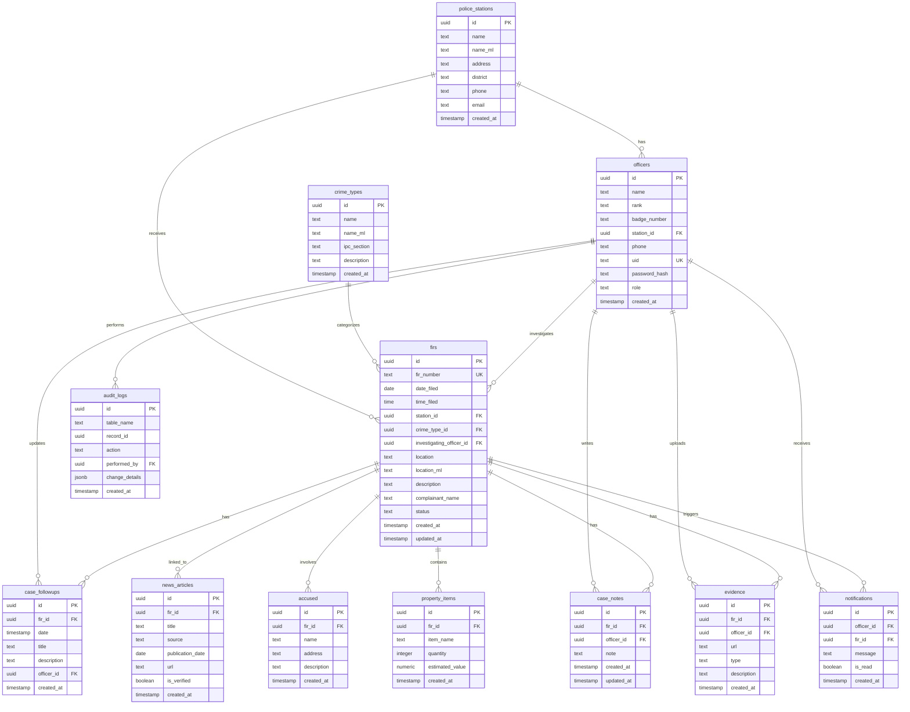

# Crime Database Management System

A comprehensive crime transparency portal for Kerala Police with separate interfaces for public citizens and police officers. Built with Next.js, TypeScript, and Supabase.


## 📋 Table of Contents

- [Overview](#overview)
- [System Architecture](#system-architecture)
- [Database Schema (ER Diagram)](#database-schema-er-diagram)
- [System Flow](#system-flow)
- [Features](#features)
- [Development](#development)
- [Database Setup](#database-setup)
- [Deployment](#deployment)
- [API Documentation](#api-documentation)
- [Screenshots](#screenshots)
- [Future Enhancements](#future-enhancements)

## Overview

This monorepo contains two Next.js applications sharing a Supabase PostgreSQL database:

- **`public-app`** — Public transparency portal for citizens (read-only access)
- **`officer-app`** — Internal dashboard for police officers (full CRUD operations)

Both applications are designed to work independently but share the same database backend for data consistency.

## System Architecture

```
                    INTERNET
                        │
        ┌─────────────────────────────────┐
        │           USERS                  │
        │                                 │
        │  Public Users        Police Officers
        │  (citizens)          (login)
        └─────────────┬───────────────┬───┘
                      │               │
        ┌─────────────▼───────┐ ┌─────▼────────────┐
        │     public-app      │ │    officer-app   │
        │                     │ │                  │
        │  FIR submission     │ │ Dashboard       │
        │  Case lookup        │ │ Case mgmt       │
        │  Search criminals   │ │ Investigation   │
        │  Statistics         │ │ Evidence upload │
        │  Heatmap            │ │ Notifications   │
        └─────────────┬───────┘ └─────┬───────────┘
                      │               │
                      └──────┬────────┘
                             │
                     API / Backend
                             │
                ┌────────────▼───────────┐
                │     Next.js API        │
                │                        │
                │ /api/auth              │
                │ /api/firs              │
                │ /api/person            │
                │ /api/notifications     │
                └────────────┬───────────┘
                             │
                     Database Layer
                             │
                 ┌───────────▼───────────┐
                 │       Supabase        │
                 │    (PostgreSQL)       │
                 │                       │
                 │ • firs                │
                 │ • officers            │
                 │ • police_stations     │
                 │ • crime_types         │
                 │ • accused             │
                 │ • evidence            │
                 │ • case_notes          │
                 └───────────────────────┘
```

### Deployment Architecture

```
                 Docker / Vercel
                        │
        ┌───────────────┼───────────────┐
        │                               │
   public-app                      officer-app
   (frontend)                      (frontend)
   Port: 3001/3002                 Port: 3000
        │                               │
        └───────────────┬───────────────┘
                        │
                    API Routes
                        │
                     Supabase
                  (PostgreSQL)
```

## Database Schema (ER Diagram)



## System Flow

### 1️⃣ Citizen Submits FIR

```
public-app
     ↓
POST /api/firs
     ↓
Supabase database
     ↓
FIR stored with status "Registered"
```

### 2️⃣ Officer Logs In

```
officer-app
     ↓
POST /api/auth/login
     ↓
Supabase auth verification
     ↓
JWT token generated
     ↓
Cookie set (httpOnly, 7 days)
     ↓
Redirect to dashboard
```

### 3️⃣ Officer Manages Case

```
officer-app dashboard
     ↓
GET /api/firs (list all cases)
GET /api/person?query=... (search)
GET /api/firs/[id] (case details)
     ↓
PATCH /api/firs/[id] (update status)
POST /api/firs/[id]/notes (add notes)
POST /api/firs/[id]/evidence (upload)
     ↓
Supabase database
     ↓
Audit log created
```

## Features

### Officer App (`officer-app`)

- ✅ **FIR Management**: Create, read, update FIRs
- ✅ **Case Management**: View case details, timeline, notes
- ✅ **Evidence Upload**: Upload images, videos, documents
- ✅ **Person Search**: Search criminals, accused, witnesses
- ✅ **Notifications**: Real-time notifications for case updates
- ✅ **Statistics Dashboard**: View crime statistics and trends
- ✅ **PDF Export**: Download case reports as PDF
- ✅ **Officer Authentication**: Secure login with JWT tokens
- ✅ **Row Level Security**: Officers can only access their assigned cases

### Public App (`public-app`)

- ✅ **FIR Browsing**: View all registered FIRs with filters
- ✅ **Case Details**: Public case information and timeline
- ✅ **Statistics**: Public crime statistics and charts
- ✅ **Heatmap**: Visual crime location heatmap
- ✅ **Search**: Search FIRs by location, crime type, status
- ✅ **Language Toggle**: English/Malayalam support
- ✅ **News Articles**: Verified news articles linked to cases
- ✅ **RSS Feed**: RSS feed for FIR updates

## Development

### Prerequisites

- Node.js 18+ and npm
- Supabase account (or local Supabase instance)
- Git

### Installation

Install dependencies at the repo root:

```bash
npm ci
```

### Running Locally

Start either app with workspace scripts:

```bash
# Start officer app (port 3000)
npm run dev:officer

# Start public app (port 3001/3002)
npm run dev:public
```

**Note**: Set `NEXT_PUBLIC_OFFICER_URL` environment variable when running the public app locally.

### Environment Variables

Create `.env.local` files in each app directory:

**officer-app/.env.local:**
```env
NEXT_PUBLIC_SUPABASE_URL=your_supabase_url
NEXT_PUBLIC_SUPABASE_ANON_KEY=your_anon_key
SUPABASE_SERVICE_ROLE_KEY=your_service_role_key
JWT_SECRET=your_jwt_secret
```

**public-app/.env.local:**
```env
NEXT_PUBLIC_SUPABASE_URL=your_supabase_url
NEXT_PUBLIC_SUPABASE_ANON_KEY=your_anon_key
NEXT_PUBLIC_OFFICER_URL=http://localhost:3000
NEXT_PUBLIC_BASE_URL=http://localhost:3001
NEXT_PUBLIC_GOOGLE_MAPS_API_KEY=your_google_maps_key  # optional
```

## Database Setup

### 1. Create Supabase Project

1. Go to [supabase.com](https://supabase.com)
2. Create a new project
3. Copy your project URL and API keys

### 2. Run SQL Migrations

Apply the SQL files in `officer-app/scripts/` in order:

```sql
-- 1. Create core tables
001_create_crime_tables.sql

-- 2. Seed initial data
002_seed_crime_data.sql

-- 3. Add officer authentication
003_add_officer_auth.sql

-- 4. Add accused and property tables
004_add_accused_property.sql

-- 5. Add case notes, evidence, notifications
005_add_case_notes_evidence_notifications.sql
```

You can run these via:
- Supabase SQL Editor (copy-paste)
- Supabase CLI: `supabase db push`

### 3. Seed Officer Data (Optional)

```bash
cd officer-app
node scripts/seed_officer.js
```

This creates a test officer account for development.

## Deployment

### Option 1: Vercel (Recommended)

1. **Create two Vercel projects** (one for each app)
2. **Connect your repository**
3. **Set Root Directory**:
   - Project 1: `officer-app`
   - Project 2: `public-app`
4. **Configure environment variables** (see Environment Variables section)
5. **Deploy**

### Option 2: Docker

See `DEPLOY_DOCKER.md` for Docker deployment instructions.

### Environment Variables for Production

**Officer App:**
```env
NEXT_PUBLIC_SUPABASE_URL=https://xxx.supabase.co
NEXT_PUBLIC_SUPABASE_ANON_KEY=xxx
SUPABASE_SERVICE_ROLE_KEY=xxx
JWT_SECRET=xxx
NODE_ENV=production
```

**Public App:**
```env
NEXT_PUBLIC_SUPABASE_URL=https://xxx.supabase.co
NEXT_PUBLIC_SUPABASE_ANON_KEY=xxx
NEXT_PUBLIC_OFFICER_URL=https://officer-app.vercel.app
NEXT_PUBLIC_BASE_URL=https://public-app.vercel.app
NEXT_PUBLIC_GOOGLE_MAPS_API_KEY=xxx  # optional
```

## API Documentation

Complete API documentation is available in [`API_ARCHITECTURE.md`](./API_ARCHITECTURE.md).

### Quick Reference

**Authentication:**
- `POST /api/auth/login` - Officer login
- `GET /api/auth/me` - Get current officer
- `POST /api/auth/logout` - Logout

**FIRs:**
- `GET /api/firs` - List FIRs (with filters)
- `POST /api/firs` - Create new FIR
- `GET /api/firs/[id]` - Get FIR details
- `PATCH /api/firs/[id]` - Update FIR

**Persons:**
- `GET /api/person?query=...` - Search persons
- `GET /api/person/[id]` - Get person with cases

**Case Management:**
- `GET /api/firs/[id]/notes` - Get case notes
- `POST /api/firs/[id]/notes` - Add case note
- `GET /api/firs/[id]/evidence` - Get evidence
- `POST /api/firs/[id]/evidence` - Upload evidence

**Notifications:**
- `GET /api/notifications` - Get notifications
- `PATCH /api/notifications` - Mark as read

See [`API_ARCHITECTURE.md`](./API_ARCHITECTURE.md) for complete details, request/response schemas, and status codes.

## Screenshots

### Public App

#### Homepage

*Public transparency portal homepage with FIR statistics and recent cases*

#### FIR Details

*Public view of FIR details with case timeline and related news*

#### Crime Heatmap

*Interactive crime location heatmap showing crime density*

### Officer App

#### Dashboard

*Officer dashboard with case statistics and recent FIRs*

#### FIR Form

*Form for creating new FIRs with complainant and accused details*

#### Case Management

*Case details page with timeline, notes, and evidence upload*

#### Person Search

*Search interface for finding persons involved in cases*

> **Note**: Screenshots should be added to `docs/screenshots/` directory. Replace placeholder paths above with actual screenshots.

## Future Enhancements

- [ ] Add more sophisticated heatmap using geocoded coordinates
- [ ] Enable RSS for FIR updates
- [ ] Add user accounts for the public portal
- [ ] Internationalisation beyond Malayalam
- [ ] Real-time notifications via WebSockets
- [ ] Advanced analytics and reporting
- [ ] Mobile app (React Native)
- [ ] Integration with external police systems
- [ ] Automated case status updates
- [ ] AI-powered crime pattern detection

## Contributing

This is a government project for Kerala Police. For contributions, please contact the project maintainers.

## License

This project is developed for Kerala Police under the Government of Kerala. All rights reserved.

---

**Built with ❤️ for Kerala Police Crime Transparency Initiative**

For detailed API documentation, see [`API_ARCHITECTURE.md`](./API_ARCHITECTURE.md).
