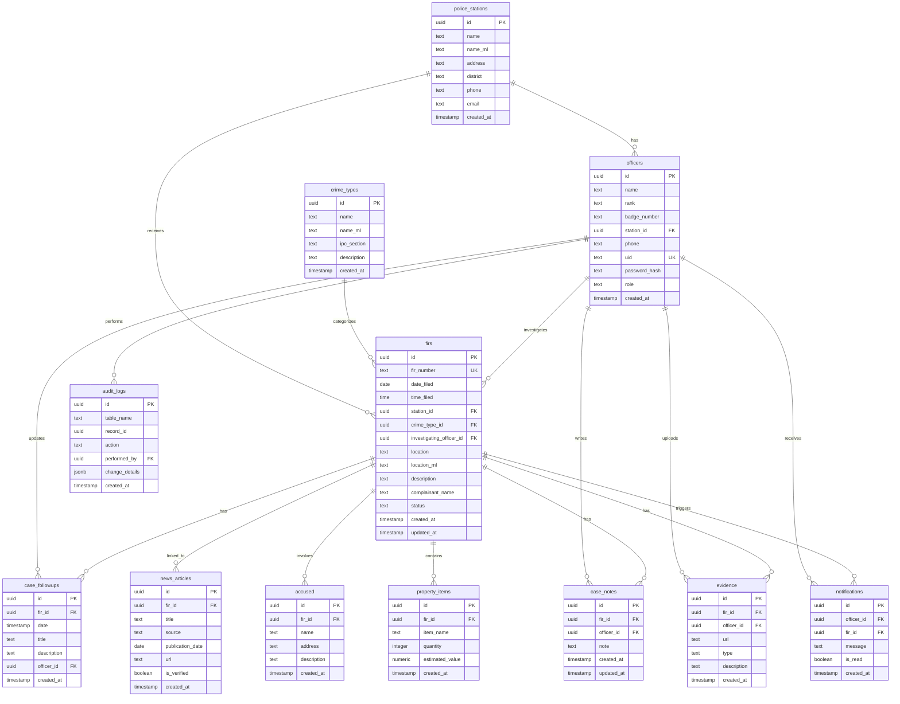

# Database Entity Relationship Diagram

This document provides a detailed view of the database schema for the Crime Database Management System.

## Visual ER Diagram

The ER diagram below shows all tables and their relationships:

## Table Descriptions

### Core Tables

#### `police_stations`
Stores information about police stations in Kerala.
- **Relationships**: One-to-many with `officers` and `firs`
- **RLS**: Public read access

#### `officers`
Stores police officer information and authentication credentials.
- **Relationships**: 
  - Many-to-one with `police_stations`
  - One-to-many with `firs`, `case_notes`, `evidence`, `notifications`, `case_followups`, `audit_logs`
- **Authentication**: Uses `uid` and `password_hash` for login
- **RLS**: Public read access, write restricted to admins

#### `crime_types`
Defines types of crimes with IPC sections.
- **Relationships**: One-to-many with `firs`
- **RLS**: Public read access

#### `firs`
First Information Reports - the core entity of the system.
- **Relationships**: 
  - Many-to-one with `police_stations`, `crime_types`, `officers`
  - One-to-many with `case_followups`, `news_articles`, `accused`, `property_items`, `case_notes`, `evidence`, `notifications`
- **Status Values**: 'Registered', 'Under Investigation', 'Charge Sheet Filed', 'Court Proceedings', 'Closed', 'Disposed'
- **RLS**: Public read access

### Supporting Tables

#### `case_followups`
Timeline updates for cases.
- **Relationships**: Many-to-one with `firs` and `officers`
- **Purpose**: Track case progress over time

#### `news_articles`
Verified news articles linked to FIRs.
- **Relationships**: Many-to-one with `firs`
- **RLS**: Only verified articles are publicly visible

#### `accused`
Accused persons linked to FIRs.
- **Relationships**: Many-to-one with `firs`
- **Purpose**: Track accused individuals in cases

#### `property_items`
Stolen or lost property items.
- **Relationships**: Many-to-one with `firs`
- **Purpose**: Track property involved in crimes

#### `case_notes`
Internal case notes (officers only).
- **Relationships**: Many-to-one with `firs` and `officers`
- **RLS**: Restricted to assigned officers and admins

#### `evidence`
Evidence files (images, videos, documents).
- **Relationships**: Many-to-one with `firs` and `officers`
- **RLS**: Restricted to assigned officers and admins

#### `notifications`
Notifications for officers.
- **Relationships**: Many-to-one with `officers` and `firs`
- **RLS**: Officers can only see their own notifications

#### `audit_logs`
Audit trail for major actions.
- **Relationships**: Many-to-one with `officers`
- **RLS**: Admin-only access
- **Purpose**: Track all changes for compliance and security

## Indexes

The following indexes are created for performance:

- `idx_firs_station` on `firs(station_id)`
- `idx_firs_crime_type` on `firs(crime_type_id)`
- `idx_firs_status` on `firs(status)`
- `idx_firs_date_filed` on `firs(date_filed)`
- `idx_case_followups_fir` on `case_followups(fir_id)`
- `idx_news_articles_fir` on `news_articles(fir_id)`
- `idx_officers_station` on `officers(station_id)`
- `idx_officers_uid` on `officers(uid)`
- `idx_accused_fir` on `accused(fir_id)`
- `idx_property_fir` on `property_items(fir_id)`
- `idx_case_notes_fir` on `case_notes(fir_id)`
- `idx_case_notes_officer` on `case_notes(officer_id)`
- `idx_evidence_fir` on `evidence(fir_id)`
- `idx_evidence_officer` on `evidence(officer_id)`
- `idx_notifications_officer` on `notifications(officer_id)`
- `idx_audit_logs_table` on `audit_logs(table_name)`

## Row Level Security (RLS)

All tables have RLS enabled with the following policies:

- **Public Tables**: `police_stations`, `officers`, `crime_types`, `firs`, `case_followups` - Public read access
- **Verified Content**: `news_articles` - Only verified articles are publicly readable
- **Officer-Only**: `case_notes`, `evidence` - Officers can only access their assigned cases
- **Personal**: `notifications` - Officers can only see their own notifications
- **Admin-Only**: `audit_logs` - Only admins can read audit logs

## Foreign Key Constraints

All foreign keys use appropriate CASCADE or SET NULL behaviors:

- `officers.station_id` → `police_stations.id` (SET NULL on delete)
- `firs.station_id` → `police_stations.id` (CASCADE on delete)
- `firs.crime_type_id` → `crime_types.id` (CASCADE on delete)
- `firs.investigating_officer_id` → `officers.id` (SET NULL on delete)
- All child tables → `firs.id` (CASCADE on delete)
- All officer references → `officers.id` (SET NULL or CASCADE based on context)
