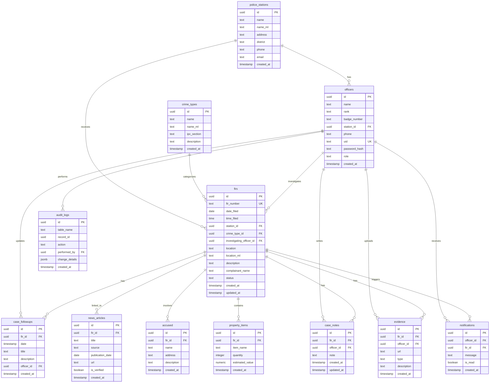
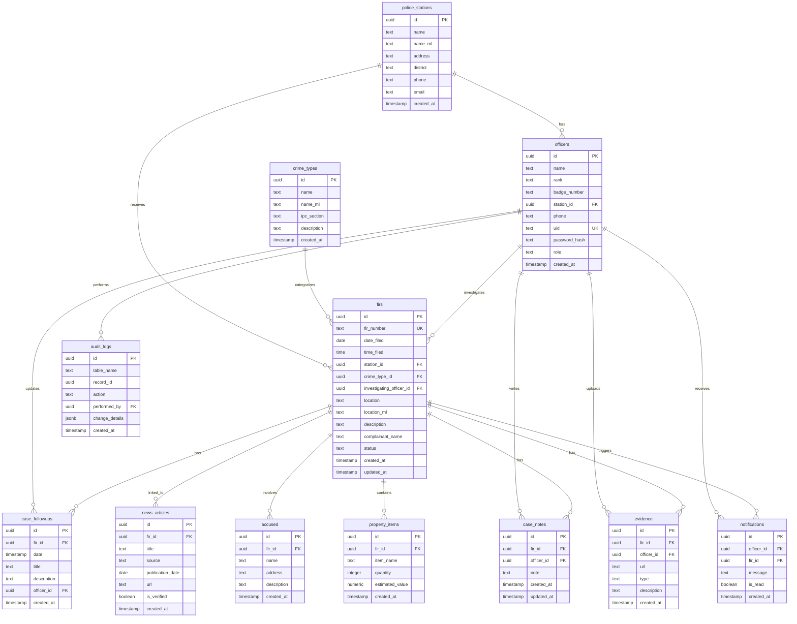
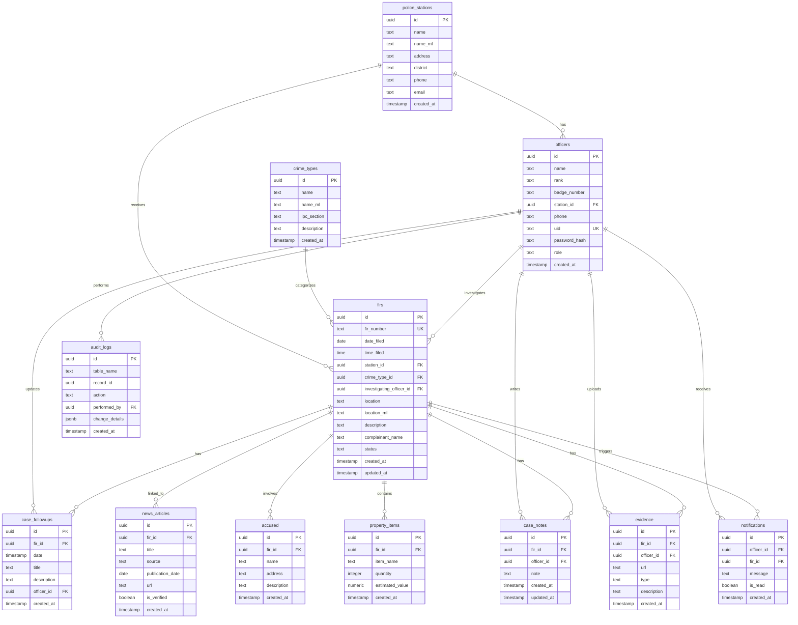

```mermaid
erDiagram
    police_stations ||--o{ officers : "has"
    police_stations ||--o{ firs : "receives"
    crime_types ||--o{ firs : "categorizes"
    officers ||--o{ firs : "investigates"
    officers ||--o{ case_notes : "writes"
    officers ||--o{ evidence : "uploads"
    officers ||--o{ notifications : "receives"
    officers ||--o{ case_followups : "updates"
    officers ||--o{ audit_logs : "performs"
    firs ||--o{ case_followups : "has"
    firs ||--o{ news_articles : "linked_to"
    firs ||--o{ accused : "involves"
    firs ||--o{ property_items : "contains"
    firs ||--o{ case_notes : "has"
    firs ||--o{ evidence : "has"
    firs ||--o{ notifications : "triggers"

    police_stations {
        uuid id PK
        text name
        text name_ml
        text address
        text district
        text phone
        text email
        timestamp created_at
    }

    officers {
        uuid id PK
        text name
        text rank
        text badge_number
        uuid station_id FK
        text phone
        text uid UK
        text password_hash
        text role
        timestamp created_at
    }

    crime_types {
        uuid id PK
        text name
        text name_ml
        text ipc_section
        text description
        timestamp created_at
    }

    firs {
        uuid id PK
        text fir_number UK
        date date_filed
        time time_filed
        uuid station_id FK
        uuid crime_type_id FK
        uuid investigating_officer_id FK
        text location
        text location_ml
        text description
        text complainant_name
        text status
        timestamp created_at
        timestamp updated_at
    }

    case_followups {
        uuid id PK
        uuid fir_id FK
        timestamp date
        text title
        text description
        uuid officer_id FK
        timestamp created_at
    }

    news_articles {
        uuid id PK
        uuid fir_id FK
        text title
        text source
        date publication_date
        text url
        boolean is_verified
        timestamp created_at
    }

    accused {
        uuid id PK
        uuid fir_id FK
        text name
        text address
        text description
        timestamp created_at
    }

    property_items {
        uuid id PK
        uuid fir_id FK
        text item_name
        integer quantity
        numeric estimated_value
        timestamp created_at
    }

    case_notes {
        uuid id PK
        uuid fir_id FK
        uuid officer_id FK
        text note
        timestamp created_at
        timestamp updated_at
    }

    evidence {
        uuid id PK
        uuid fir_id FK
        uuid officer_id FK
        text url
        text type
        text description
        timestamp created_at
    }

    notifications {
        uuid id PK
        uuid officer_id FK
        uuid fir_id FK
        text message
        boolean is_read
        timestamp created_at
    }

    audit_logs {
        uuid id PK
        text table_name
        uuid record_id
        text action
        uuid performed_by FK
        jsonb change_details
        timestamp created_at
    }
```

# Crime Database Management System - Project Summary

## 1. Project Directory Tree
```text
├── .cursor
│   └── worktrees.json
├── .env.local
├── .eslintrc.json
├── .gitignore
├── .vscode
│   └── settings.json
├── API_ARCHITECTURE.md
├── DEPLOY_DOCKER.md
├── DEPLOY_VERCEL.md
├── Dockerfile
├── README.md
├── deploy.sh
├── docs
│   ├── ER_DIAGRAM.md
│   └── screenshots
│       └── README.md
├── officer-app
│   ├── .env.example
│   ├── app
│   │   ├── api
│   │   │   ├── auth
│   │   │   │   ├── login
│   │   │   │   │   └── route.ts
│   │   │   │   ├── logout
│   │   │   │   │   └── route.ts
│   │   │   │   └── me
│   │   │   │       └── route.ts
│   │   │   ├── firs
│   │   │   │   ├── [id]
│   │   │   │   │   ├── evidence
│   │   │   │   │   │   └── route.ts
│   │   │   │   │   ├── notes
│   │   │   │   │   │   └── route.ts
│   │   │   │   │   └── route.ts
│   │   │   │   └── route.ts
│   │   │   ├── notifications
│   │   │   │   └── route.ts
│   │   │   └── person
│   │   │       ├── [id]
│   │   │       │   └── route.ts
│   │   │       └── route.ts
│   │   ├── case
│   │   │   ├── [id]
│   │   │   │   └── page.tsx
│   │   │   └── id
│   │   │       └── page.tsx
│   │   ├── criminals
│   │   │   └── page.tsx
│   │   ├── dashboard
│   │   │   └── page.tsx
│   │   ├── globals.css
│   │   ├── layout.tsx
│   │   ├── login
│   │   │   └── page.tsx
│   │   ├── page.tsx
│   │   └── person
│   │       └── [id]
│   │           └── page.tsx
│   ├── components
│   │   ├── case-details.tsx
│   │   ├── case-notes.tsx
│   │   ├── case-timeline.tsx
│   │   ├── crime-map.tsx
│   │   ├── download-pdf-button.tsx
│   │   ├── evidence-list.tsx
│   │   ├── evidence-uploader.tsx
│   │   ├── fir-form.tsx
│   │   ├── fir-table.tsx
│   │   ├── footer.tsx
│   │   ├── header.tsx
│   │   ├── hero-section.tsx
│   │   ├── navbar.tsx
│   │   ├── news-articles.tsx
│   │   ├── notifications-dropdown.tsx
│   │   ├── officer-auth-guard.tsx
│   │   ├── person-search-modal.tsx
│   │   ├── sidebar.tsx
│   │   ├── stations-grid.tsx
│   │   ├── stats-card.tsx
│   │   ├── status-updater.tsx
│   │   └── ui
│   │       ├── badge.tsx
│   │       ├── button.tsx
│   │       ├── card.tsx
│   │       ├── dialog.tsx
│   │       ├── input.tsx
│   │       ├── select.tsx
│   │       ├── separator.tsx
│   │       ├── table.tsx
│   │       └── textarea.tsx
│   ├── lib
│   │   ├── auth.ts
│   │   ├── fir-store.ts
│   │   ├── mock-data.ts
│   │   ├── supabase
│   │   │   ├── client.ts
│   │   │   └── server.ts
│   │   ├── types.ts
│   │   └── utils.ts
│   ├── next-env.d.ts
│   ├── package-lock.json
│   ├── package.json
│   ├── postcss.config.mjs
│   ├── scripts
│   │   ├── 001_create_crime_tables.sql
│   │   ├── 002_seed_crime_data.sql
│   │   ├── 003_add_officer_auth.sql
│   │   ├── 004_add_accused_property.sql
│   │   ├── 005_add_case_notes_evidence_notifications.sql
│   │   └── seed_officer.js
│   ├── tsconfig.json
│   └── tsconfig.tsbuildinfo
├── package-lock.json
├── package.json
├── project_summary_for_claude.md
└── public-app
    ├── .env.example
    ├── .env.local
    ├── app
    │   ├── case
    │   │   └── [id]
    │   │       └── page.tsx
    │   ├── globals.css
    │   ├── heatmap
    │   │   └── page.tsx
    │   ├── layout.tsx
    │   ├── login
    │   │   └── page.tsx
    │   ├── metadata.ts
    │   ├── page.tsx
    │   ├── rss.xml
    │   │   └── route.ts
    │   └── stats
    │       └── page.tsx
    ├── components
    │   ├── auth-guard.tsx
    │   ├── case-details.tsx
    │   ├── case-timeline.tsx
    │   ├── crime-map.tsx
    │   ├── fir-table.tsx
    │   ├── language-toggle.tsx
    │   ├── localized-map.tsx
    │   ├── news-articles.tsx
    │   ├── public-portal-shell.tsx
    │   ├── stats-charts.tsx
    │   └── ui
    │       ├── badge.tsx
    │       ├── button.tsx
    │       ├── card.tsx
    │       ├── dialog.tsx
    │       ├── input.tsx
    │       ├── select.tsx
    │       ├── separator.tsx
    │       └── table.tsx
    ├── lib
    │   ├── language.tsx
    │   ├── mock-data.ts
    │   ├── supabase.ts
    │   └── utils.ts
    ├── next-env.d.ts
    ├── package-lock.json
    ├── package.json
    ├── postcss.config.mjs
    ├── tsconfig.json
    └── tsconfig.tsbuildinfo
```

## 2. File Contents

### .env.local
```text
DATABASE_URL=[REDACTED]
```

### .eslintrc.json
```json
{
  "extends": "next/core-web-vitals"
}
```

### .gitignore
```text
node_modules/
.next/
.env
node_modules
```

### API_ARCHITECTURE.md
```text
# Crime Database Management System - API Architecture

This document outlines the complete API architecture for the Crime Database Management System, which consists of two Next.js applications sharing a Supabase backend.

## Architecture Overview

```
                    INTERNET
                        │
        ┌─────────────────────────────────┐
        │           USERS                  │
        │                                 │
        │  Public Users        Police Officers
        │  (citizens)          (login)
        └─────────────┬───────────────┬───┘
                      │               │
        ┌─────────────▼───────┐ ┌─────▼────────────┐
        │     public-app      │ │    officer-app   │
        │                     │ │                  │
        │  FIR submission     │ │ Dashboard       │
        │  Case lookup        │ │ Case mgmt       │
        │  Search criminals   │ │ Investigation   │
        └─────────────┬───────┘ └─────┬───────────┘
                      │               │
                      └──────┬────────┘
                             │
                     API / Backend
                             │
                ┌────────────▼───────────┐
                │     Next.js API        │
                │                        │
                │ /api/auth              │
                │ /api/firs              │
                │ /api/person            │
                │ /api/case              │
                └────────────┬───────────┘
                             │
                     Database Layer
                             │
                 ┌───────────▼───────────┐
                 │       Supabase        │
                 │                       │
                 │ crimes table         │
                 │ accused table        │
                 │ officers table       │
                 │ fir table            │
                 └──────────────────────┘
```

## API Routes (officer-app)

All API routes are located in `officer-app/app/api/` and require authentication for write operations.

### Authentication (`/api/auth`)

#### POST `/api/auth/login`
- **Description**: Officer login with UID and password
- **Request Body**: `{ uid: string, password: string }`
- **Response**: `{ ok: true, officer: {...} }` with httpOnly cookie token
- **Status Codes**: 200 (success), 400 (missing credentials), 401 (invalid credentials), 500 (server error)

#### GET `/api/auth/me`
- **Description**: Get current authenticated officer
- **Headers**: Cookie with `token`
- **Response**: `{ officer: {...} }`
- **Status Codes**: 200 (success), 401 (not authenticated/invalid token), 404 (not found), 500 (server error)

#### POST `/api/auth/logout`
- **Description**: Logout current officer (clears cookie)
- **Response**: `{ ok: true }`
- **Status Codes**: 200 (success), 500 (server error)

### FIRs (`/api/firs`)

#### GET `/api/firs`
- **Description**: List all FIRs with optional filters
- **Query Parameters**:
  - `id` (optional): Filter by FIR ID
  - `crime_type` (optional): Filter by crime type ID
  - `status` (optional): Filter by status
  - `location` (optional): Filter by location (partial match)
  - `date_from` (optional): Filter by date from (ISO date)
  - `date_to` (optional): Filter by date to (ISO date)
- **Response**: `{ firs: FIRWithRelations[] }`
- **Status Codes**: 200 (success), 500 (server error)

#### POST `/api/firs`
- **Description**: Create a new FIR
- **Headers**: `x-officer-badge` (officer badge number for auth)
- **Request Body**: See FIR payload schema below
- **Response**: `{ ok: true, fir: FIRWithRelations }`
- **Status Codes**: 201 (created), 400 (validation failed), 500 (server error)

**FIR Payload Schema:**
```typescript
{
  complainant_name: string;          // Required
  guardian_name?: string | null;
  gender?: "Male" | "Female" | "Other";
  age?: number | null;
  dob?: string | null;
  address?: string | null;
  phone?: string | null;
  date_of_occurrence?: string | null;
  time_of_occurrence?: string | null;
  location: string;                   // Required
  crime_type_id: string;              // Required
  ipc_sections?: string | null;
  description: string;                // Required
  accused?: Array<{                   // Optional
    name?: string | null;
    address?: string | null;
    description?: string | null;
  }>;
  property_items?: Array<{            // Optional
    item_name: string;
    quantity?: number;
    estimated_value?: number;
  }>;
}
```

#### GET `/api/firs/[id]`
- **Description**: Get a specific FIR by ID
- **Response**: `{ fir: FIRWithRelations }`
- **Status Codes**: 200 (success), 404 (not found), 500 (server error)

#### PATCH `/api/firs/[id]`
- **Description**: Update a FIR (status, description, etc.)
- **Request Body**: Partial FIR fields
- **Response**: `{ ok: true, fir: FIRWithRelations }`
- **Status Codes**: 200 (success), 404 (not found), 500 (server error)

### FIR Evidence (`/api/firs/[id]/evidence`)

#### GET `/api/firs/[id]/evidence`
- **Description**: Get all evidence for a FIR
- **Response**: `{ evidence: Evidence[] }`
- **Status Codes**: 200 (success), 500 (server error)

#### POST `/api/firs/[id]/evidence`
- **Description**: Upload evidence for a FIR
- **Request Body**: `{ url: string, type: string, description?: string }`
- **Response**: `{ ok: true, evidence: Evidence }`
- **Status Codes**: 201 (created), 400 (validation failed), 500 (server error)

#### DELETE `/api/firs/[id]/evidence/[evidenceId]`
- **Description**: Delete evidence
- **Response**: `{ ok: true }`
- **Status Codes**: 200 (success), 404 (not found), 500 (server error)

### FIR Notes (`/api/firs/[id]/notes`)

#### GET `/api/firs/[id]/notes`
- **Description**: Get all case notes for a FIR
- **Response**: `{ notes: CaseNote[] }`
- **Status Codes**: 200 (success), 500 (server error)

#### POST `/api/firs/[id]/notes`
- **Description**: Add a case note
- **Request Body**: `{ note: string }`
- **Response**: `{ ok: true, note: CaseNote }`
- **Status Codes**: 201 (created), 400 (validation failed), 500 (server error)

### Persons (`/api/person`)

#### GET `/api/person?query=<search_term>`
- **Description**: Search for persons (criminals, accused, witnesses, etc.) by name or phone
- **Query Parameters**:
  - `query` (required): Search term (name or phone number)
- **Response**: `{ persons: Person[] }`
- **Status Codes**: 200 (success), 400 (missing query), 500 (server error)

#### GET `/api/person/[id]`
- **Description**: Get a specific person with their case involvements
- **Response**: `{ person: Person & { involvements: PersonInvolvement[] } }`
- **Status Codes**: 200 (success), 404 (not found), 500 (server error)

### Notifications (`/api/notifications`)

#### GET `/api/notifications`
- **Description**: Get notifications for the authenticated officer
- **Headers**: Cookie with `token`
- **Query Parameters**:
  - `unread_only` (optional): Filter to unread notifications only
- **Response**: `{ notifications: Notification[] }`
- **Status Codes**: 200 (success), 401 (not authenticated), 500 (server error)

#### PATCH `/api/notifications`
- **Description**: Mark notifications as read
- **Headers**: Cookie with `token`
- **Request Body**: `{ notification_ids: string[] }`
- **Response**: `{ ok: true }`
- **Status Codes**: 200 (success), 401 (not authenticated), 500 (server error)

## Database Schema

### Core Tables

- **police_stations**: Police station information
- **officers**: Officer details with authentication (uid, password_hash, role)
- **crime_types**: Crime type definitions with IPC sections
- **firs**: First Information Reports
- **case_followups**: Case timeline/updates
- **news_articles**: Verified news articles linked to FIRs

### Extended Tables (from migrations)

- **accused**: Accused persons linked to FIRs
- **property_items**: Stolen/lost property items
- **case_notes**: Internal case notes (officers only)
- **evidence**: Evidence files (images, videos, documents)
- **notifications**: Officer notifications
- **audit_logs**: Audit trail for major actions

## Authentication Flow

1. Officer submits credentials to `/api/auth/login`
2. Server verifies password against `officers.password_hash`
3. Server generates JWT token with officer info
4. Token stored in httpOnly cookie (7-day expiry)
5. Subsequent requests include cookie automatically
6. `/api/auth/me` validates token and returns officer data

## Security

- **Row Level Security (RLS)**: Enabled on all tables
- **Public Read Access**: FIRs, stations, crime types (read-only)
- **Officer Write Access**: Officers can only modify their own cases/notes
- **Admin Access**: Full access for officers with `role = 'admin'`
- **JWT Tokens**: Signed with `JWT_SECRET` environment variable
- **Password Hashing**: bcrypt with salt rounds

## Future Enhancements

- `/api/case` route for case-specific operations (currently handled under `/api/firs/[id]`)
- Person database table (currently using mock data)
- Advanced search with filters (age, gender, involvement type)
- Bulk operations for FIR updates
- Export/import functionality
- Real-time notifications via WebSockets
```

### DEPLOY_DOCKER.md
```text
# Docker Deployment Guide

Use Docker to run both apps in containers, ideal for self-hosted or cloud platforms like AWS, DigitalOcean, Fly.io, etc.

## Quick Start (Local)

```bash
# Build the image
docker build -t crime-portal .

# Run with environment variables
docker run -p 3000:3000 -p 3001:3001 \
  -e NEXT_PUBLIC_SUPABASE_URL=... \
  -e NEXT_PUBLIC_SUPABASE_ANON_KEY=... \
  -e SUPABASE_SERVICE_ROLE_KEY=... \
  -e JWT_SECRET=... \
  crime-portal
```

Officer app runs on `http://localhost:3000`  
Public app runs on `http://localhost:3001`

## Build for production

```bash
docker build -t crime-portal:latest .
docker tag crime-portal:latest myregistry/crime-portal:latest
docker push myregistry/crime-portal:latest
```

## Environment Variables

Pass via `docker run -e` or create a `.env.local` file:

```bash
NEXT_PUBLIC_SUPABASE_URL=https://xyz.supabase.co
NEXT_PUBLIC_SUPABASE_ANON_KEY=eyJ...
SUPABASE_SERVICE_ROLE_KEY=eyJ...
JWT_SECRET=mysecretkey1234567890abcdef
NEXT_PUBLIC_OFFICER_URL=http://localhost:3000  # or production URL
NEXT_PUBLIC_GOOGLE_MAPS_API_KEY=AIzaSy...
```

## Deploy to Fly.io (free tier available)

```bash
# Install Fly CLI
curl -L https://fly.io/install.sh | sh

# Login
fly auth login

# Create app
fly launch --name crime-portal --image-label latest

# Deploy
fly deploy

# View logs
fly logs
```

## Deploy to DigitalOcean App Platform

1. Connect your GitHub repo
2. Choose **Dockerfile**
3. Set environment variables in the dashboard
4. Deploy

## Deploy to AWS

Using ECS or EC2:
1. Push image to ECR
2. Create ECS task definition with the image
3. Launch service with load balancer
4. Map ports 3000 (officer) and 3001 (public)

---

## Networking

If running multiple containers:
- Officer app (`localhost:3000`) must be reachable by public app
- Set `NEXT_PUBLIC_OFFICER_URL` to the officer app's external URL

Example: public app on different server → set `NEXT_PUBLIC_OFFICER_URL=https://officer.example.com`

## Health Checks

Both apps serve `/` which you can use for health checks:

```bash
curl http://localhost:3000  # officer-app
curl http://localhost:3001  # public-app
```
```

### DEPLOY_VERCEL.md
```text
# Vercel Deployment Guide

Vercel is the easiest option—it's built for Next.js and free for small projects.

## Prerequisites

- GitHub/GitLab account with your repo pushed
- Supabase project created with migrations run (see README.md)

## Deploy Officer App

1. Go to [vercel.com](https://vercel.com) and sign in with GitHub.

2. Click **"New Project"** → select your repository.

3. Configure the project:
   - **Framework Preset**: Next.js ✓
   - **Root Directory**: `officer-app`
   - **Build Command**: `npm run build:officer`

4. Add environment variables:
   ```
   NEXT_PUBLIC_SUPABASE_URL=<your supabase url>
   NEXT_PUBLIC_SUPABASE_ANON_KEY=<your anon key>
   SUPABASE_SERVICE_ROLE_KEY=<your service role key>
   JWT_SECRET=<generate a 32+ char random string>
   ```

5. Click **"Deploy"**.

6. Copy the assigned URL (e.g., `https://officer-app-abc123.vercel.app`).

## Deploy Public App

1. Click **"New Project"** → same repository.

2. Configure:
   - **Root Directory**: `public-app`
   - **Build Command**: `npm run build:public`

3. Add environment variables:
   ```
   NEXT_PUBLIC_SUPABASE_URL=<same as officer app>
   NEXT_PUBLIC_SUPABASE_ANON_KEY=<same as officer app>
   NEXT_PUBLIC_OFFICER_URL=<the URL from step 6 above>
   NEXT_PUBLIC_GOOGLE_MAPS_API_KEY=<optional>
   ```

4. Click **"Deploy"**.

## Update Public App (if needed)

If you change `NEXT_PUBLIC_OFFICER_URL` after initial deploy:
1. Go to project settings
2. Environment Variables
3. Update `NEXT_PUBLIC_OFFICER_URL`
4. Redeploy

## Monitoring

Both apps now have CI/CD enabled. Every push to your repo will trigger a new build and deploy automatically.

---

### Troubleshooting

**"Build failed"**: Check the build logs in Vercel dashboard. Usually a missing env var.

**"CORs error"**: Ensure Supabase RLS policies allow public reads for the public-app.

**"404 on routes"**: Make sure the file structure matches; Next.js is strict about page routes.
```

### Dockerfile
```text
# Multi-stage build for both apps
FROM node:20-alpine AS deps
WORKDIR /app
COPY package.json package-lock.json ./
RUN npm ci --omit=dev

# Build officer-app
FROM deps AS officer-builder
WORKDIR /app/officer-app
COPY officer-app .
RUN npm run build

# Build public-app
FROM deps AS public-builder
WORKDIR /app/public-app
COPY public-app .
RUN npm run build

# Runtime - Officer App
FROM node:20-alpine AS officer
WORKDIR /app
COPY --from=deps /app/node_modules ./node_modules
COPY officer-app ./officer-app
COPY --from=officer-builder /app/officer-app/.next ./officer-app/.next
COPY --from=officer-builder /app/officer-app/public ./officer-app/public

EXPOSE 3000
ENV NODE_ENV=production
WORKDIR /app/officer-app
CMD ["npm", "start"]

# Runtime - Public App
FROM node:20-alpine AS public
WORKDIR /app
COPY --from=deps /app/node_modules ./node_modules
COPY public-app ./public-app
COPY --from=public-builder /app/public-app/.next ./public-app/.next
COPY --from=public-builder /app/public-app/public ./public-app/public

EXPOSE 3001
ENV NODE_ENV=production
WORKDIR /app/public-app
CMD ["npm", "start"]

# Combined runtime (run both apps)
FROM node:20-alpine
WORKDIR /app

# Install PM2 to manage both processes
RUN npm install -g pm2

# Copy from officer builder
COPY --from=officer-builder /app/node_modules ./node_modules
COPY officer-app ./officer-app
COPY --from=officer-builder /app/officer-app/.next ./officer-app/.next
COPY --from=officer-builder /app/officer-app/public ./officer-app/public

# Copy from public builder
COPY --from=public-builder /app/node_modules ./node_modules
COPY public-app ./public-app
COPY --from=public-builder /app/public-app/.next ./public-app/.next
COPY --from=public-builder /app/public-app/public ./public-app/public

# Create ecosystem config for PM2
RUN echo 'module.exports = { \
  apps: [{ \
    name: "officer-app", \
    cwd: "/app/officer-app", \
    script: "npm", \
    args: "start", \
    port: 3000, \
    env: { NODE_ENV: "production" } \
  }, { \
    name: "public-app", \
    cwd: "/app/public-app", \
    script: "npm", \
    args: "start", \
    port: 3001, \
    env: { NODE_ENV: "production", NEXT_PUBLIC_OFFICER_URL: "http://localhost:3000" } \
  }] \
};' > ecosystem.config.js

EXPOSE 3000 3001
CMD ["pm2-runtime", "start", "ecosystem.config.js"]
```

### README.md
```text
# Crime Database Management System

A comprehensive crime transparency portal for Kerala Police with separate interfaces for public citizens and police officers. Built with Next.js, TypeScript, and Supabase.


## 📋 Table of Contents

- [Overview](#overview)
- [System Architecture](#system-architecture)
- [Database Schema (ER Diagram)](#database-schema-er-diagram)
- [System Flow](#system-flow)
- [Features](#features)
- [Development](#development)
- [Database Setup](#database-setup)
- [Deployment](#deployment)
- [API Documentation](#api-documentation)
- [Screenshots](#screenshots)
- [Future Enhancements](#future-enhancements)

## Overview

This monorepo contains two Next.js applications sharing a Supabase PostgreSQL database:

- **`public-app`** — Public transparency portal for citizens (read-only access)
- **`officer-app`** — Internal dashboard for police officers (full CRUD operations)

Both applications are designed to work independently but share the same database backend for data consistency.

## System Architecture

```
                    INTERNET
                        │
        ┌─────────────────────────────────┐
        │           USERS                  │
        │                                 │
        │  Public Users        Police Officers
        │  (citizens)          (login)
        └─────────────┬───────────────┬───┘
                      │               │
        ┌─────────────▼───────┐ ┌─────▼────────────┐
        │     public-app      │ │    officer-app   │
        │                     │ │                  │
        │  FIR submission     │ │ Dashboard       │
        │  Case lookup        │ │ Case mgmt       │
        │  Search criminals   │ │ Investigation   │
        │  Statistics         │ │ Evidence upload │
        │  Heatmap            │ │ Notifications   │
        └─────────────┬───────┘ └─────┬───────────┘
                      │               │
                      └──────┬────────┘
                             │
                     API / Backend
                             │
                ┌────────────▼───────────┐
                │     Next.js API        │
                │                        │
                │ /api/auth              │
                │ /api/firs              │
                │ /api/person            │
                │ /api/notifications     │
                └────────────┬───────────┘
                             │
                     Database Layer
                             │
                 ┌───────────▼───────────┐
                 │       Supabase        │
                 │    (PostgreSQL)       │
                 │                       │
                 │ • firs                │
                 │ • officers            │
                 │ • police_stations     │
                 │ • crime_types         │
                 │ • accused             │
                 │ • evidence            │
                 │ • case_notes          │
                 └───────────────────────┘
```

### Deployment Architecture

```
                 Docker / Vercel
                        │
        ┌───────────────┼───────────────┐
        │                               │
   public-app                      officer-app
   (frontend)                      (frontend)
   Port: 3001/3002                 Port: 3000
        │                               │
        └───────────────┬───────────────┘
                        │
                    API Routes
                        │
                     Supabase
                  (PostgreSQL)
```

## Database Schema (ER Diagram)


## System Flow

### 1️⃣ Citizen Submits FIR

```
public-app
     ↓
POST /api/firs
     ↓
Supabase database
     ↓
FIR stored with status "Registered"
```

### 2️⃣ Officer Logs In

```
officer-app
     ↓
POST /api/auth/login
     ↓
Supabase auth verification
     ↓
JWT token generated
     ↓
Cookie set (httpOnly, 7 days)
     ↓
Redirect to dashboard
```

### 3️⃣ Officer Manages Case

```
officer-app dashboard
     ↓
GET /api/firs (list all cases)
GET /api/person?query=... (search)
GET /api/firs/[id] (case details)
     ↓
PATCH /api/firs/[id] (update status)
POST /api/firs/[id]/notes (add notes)
POST /api/firs/[id]/evidence (upload)
     ↓
Supabase database
     ↓
Audit log created
```

## Features

### Officer App (`officer-app`)

- ✅ **FIR Management**: Create, read, update FIRs
- ✅ **Case Management**: View case details, timeline, notes
- ✅ **Evidence Upload**: Upload images, videos, documents
- ✅ **Person Search**: Search criminals, accused, witnesses
- ✅ **Notifications**: Real-time notifications for case updates
- ✅ **Statistics Dashboard**: View crime statistics and trends
- ✅ **PDF Export**: Download case reports as PDF
- ✅ **Officer Authentication**: Secure login with JWT tokens
- ✅ **Row Level Security**: Officers can only access their assigned cases

### Public App (`public-app`)

- ✅ **FIR Browsing**: View all registered FIRs with filters
- ✅ **Case Details**: Public case information and timeline
- ✅ **Statistics**: Public crime statistics and charts
- ✅ **Heatmap**: Visual crime location heatmap
- ✅ **Search**: Search FIRs by location, crime type, status
- ✅ **Language Toggle**: English/Malayalam support
- ✅ **News Articles**: Verified news articles linked to cases
- ✅ **RSS Feed**: RSS feed for FIR updates

## Development

### Prerequisites

- Node.js 18+ and npm
- Supabase account (or local Supabase instance)
- Git

### Installation

Install dependencies at the repo root:

```bash
npm ci
```

### Running Locally

Start either app with workspace scripts:

```bash
# Start officer app (port 3000)
npm run dev:officer

# Start public app (port 3001/3002)
npm run dev:public
```

**Note**: Set `NEXT_PUBLIC_OFFICER_URL` environment variable when running the public app locally.

### Environment Variables

Create `.env.local` files in each app directory:

**officer-app/.env.local:**
```env
NEXT_PUBLIC_SUPABASE_URL=your_supabase_url
NEXT_PUBLIC_SUPABASE_ANON_KEY=your_anon_key
SUPABASE_SERVICE_ROLE_KEY=your_service_role_key
JWT_SECRET=your_jwt_secret
```

**public-app/.env.local:**
```env
NEXT_PUBLIC_SUPABASE_URL=your_supabase_url
NEXT_PUBLIC_SUPABASE_ANON_KEY=your_anon_key
NEXT_PUBLIC_OFFICER_URL=http://localhost:3000
NEXT_PUBLIC_BASE_URL=http://localhost:3001
NEXT_PUBLIC_GOOGLE_MAPS_API_KEY=your_google_maps_key  # optional
```

## Database Setup

### 1. Create Supabase Project

1. Go to [supabase.com](https://supabase.com)
2. Create a new project
3. Copy your project URL and API keys

### 2. Run SQL Migrations

Apply the SQL files in `officer-app/scripts/` in order:

```sql
-- 1. Create core tables
001_create_crime_tables.sql

-- 2. Seed initial data
002_seed_crime_data.sql

-- 3. Add officer authentication
003_add_officer_auth.sql

-- 4. Add accused and property tables
004_add_accused_property.sql

-- 5. Add case notes, evidence, notifications
005_add_case_notes_evidence_notifications.sql
```

You can run these via:
- Supabase SQL Editor (copy-paste)
- Supabase CLI: `supabase db push`

### 3. Seed Officer Data (Optional)

```bash
cd officer-app
node scripts/seed_officer.js
```

This creates a test officer account for development.

## Deployment

### Option 1: Vercel (Recommended)

1. **Create two Vercel projects** (one for each app)
2. **Connect your repository**
3. **Set Root Directory**:
   - Project 1: `officer-app`
   - Project 2: `public-app`
4. **Configure environment variables** (see Environment Variables section)
5. **Deploy**

### Option 2: Docker

See `DEPLOY_DOCKER.md` for Docker deployment instructions.

### Environment Variables for Production

**Officer App:**
```env
NEXT_PUBLIC_SUPABASE_URL=https://xxx.supabase.co
NEXT_PUBLIC_SUPABASE_ANON_KEY=xxx
SUPABASE_SERVICE_ROLE_KEY=xxx
JWT_SECRET=xxx
NODE_ENV=production
```

**Public App:**
```env
NEXT_PUBLIC_SUPABASE_URL=https://xxx.supabase.co
NEXT_PUBLIC_SUPABASE_ANON_KEY=xxx
NEXT_PUBLIC_OFFICER_URL=https://officer-app.vercel.app
NEXT_PUBLIC_BASE_URL=https://public-app.vercel.app
NEXT_PUBLIC_GOOGLE_MAPS_API_KEY=xxx  # optional
```

## API Documentation

Complete API documentation is available in [`API_ARCHITECTURE.md`](./API_ARCHITECTURE.md).

### Quick Reference

**Authentication:**
- `POST /api/auth/login` - Officer login
- `GET /api/auth/me` - Get current officer
- `POST /api/auth/logout` - Logout

**FIRs:**
- `GET /api/firs` - List FIRs (with filters)
- `POST /api/firs` - Create new FIR
- `GET /api/firs/[id]` - Get FIR details
- `PATCH /api/firs/[id]` - Update FIR

**Persons:**
- `GET /api/person?query=...` - Search persons
- `GET /api/person/[id]` - Get person with cases

**Case Management:**
- `GET /api/firs/[id]/notes` - Get case notes
- `POST /api/firs/[id]/notes` - Add case note
- `GET /api/firs/[id]/evidence` - Get evidence
- `POST /api/firs/[id]/evidence` - Upload evidence

**Notifications:**
- `GET /api/notifications` - Get notifications
- `PATCH /api/notifications` - Mark as read

See [`API_ARCHITECTURE.md`](./API_ARCHITECTURE.md) for complete details, request/response schemas, and status codes.

## Screenshots

### Public App

#### Homepage

*Public transparency portal homepage with FIR statistics and recent cases*

#### FIR Details

*Public view of FIR details with case timeline and related news*

#### Crime Heatmap

*Interactive crime location heatmap showing crime density*

### Officer App

#### Dashboard

*Officer dashboard with case statistics and recent FIRs*

#### FIR Form

*Form for creating new FIRs with complainant and accused details*

#### Case Management

*Case details page with timeline, notes, and evidence upload*

#### Person Search

*Search interface for finding persons involved in cases*

> **Note**: Screenshots should be added to `docs/screenshots/` directory. Replace placeholder paths above with actual screenshots.

## Future Enhancements

- [ ] Add more sophisticated heatmap using geocoded coordinates
- [ ] Enable RSS for FIR updates
- [ ] Add user accounts for the public portal
- [ ] Internationalisation beyond Malayalam
- [ ] Real-time notifications via WebSockets
- [ ] Advanced analytics and reporting
- [ ] Mobile app (React Native)
- [ ] Integration with external police systems
- [ ] Automated case status updates
- [ ] AI-powered crime pattern detection

## Contributing

This is a government project for Kerala Police. For contributions, please contact the project maintainers.

## License

This project is developed for Kerala Police under the Government of Kerala. All rights reserved.

---

**Built with ❤️ for Kerala Police Crime Transparency Initiative**

For detailed API documentation, see [`API_ARCHITECTURE.md`](./API_ARCHITECTURE.md).
```

### deploy.sh
```text
#!/bin/bash

# Crime Portal - Quick Deployment Guide
# This script helps you set up both apps for deployment

set -e

echo "🚀 Crime Portal Deployment Setup"
echo "=================================="
echo ""

# Step 1: Check prerequisites
echo "✓ Step 1: Checking prerequisites..."
if ! command -v node &> /dev/null; then
    echo "❌ Node.js not found. Please install Node.js 18+."
    exit 1
fi
if ! command -v npm &> /dev/null; then
    echo "❌ npm not found."
    exit 1
fi
echo "  Node.js $(node -v) and npm $(npm -v) found."

# Step 2: Install dependencies
echo ""
echo "✓ Step 2: Installing dependencies..."
npm ci

# Step 3: Build both apps
echo ""
echo "✓ Step 3: Building apps..."
npm run build:officer
npm run build:public

echo ""
echo "✅ Build successful!"
echo ""
echo "📋 Next steps:"
echo ""
echo "1. Create a Supabase project at https://supabase.io"
echo ""
echo "2. Run the SQL migrations:"
echo "   cd officer-app"
echo "   supabase db push < scripts/001_create_crime_tables.sql"
echo "   # ... repeat for other scripts"
echo ""
echo "3. Deploy to Vercel (recommended):"
echo "   npm i -g vercel"
echo "   vercel"
echo ""
echo "   OR use Docker:"
echo "   docker build -t crime-portal ."
echo "   docker run -p 3000:3000 crime-portal"
echo ""
echo "4. Set environment variables in your hosting platform"
echo "   Refer to .env.example files in each app"
echo ""
echo "5. After officer-app is live, use its URL in"
echo "   NEXT_PUBLIC_OFFICER_URL for the public-app"
```

### package.json
```json
{
  "name": "my-v0-project",
  "version": "0.1.0",
  "private": true,
  "workspaces": [
    "officer-app",
    "public-app"
  ],
  "scripts": {
    "dev:officer": "npm --workspace=officer-app run dev",
    "build:officer": "npm --workspace=officer-app run build",
    "start:officer": "npm --workspace=officer-app run start",
    "dev:public": "npm --workspace=public-app run dev",
    "build:public": "npm --workspace=public-app run build",
    "start:public": "npm --workspace=public-app run start",
    "lint": "eslint .",
    "seed:officer": "node scripts/seed_officer.js"
  },
  "dependencies": {
    "@hookform/resolvers": "^3.10.0",
    "@radix-ui/react-accordion": "1.2.2",
    "@radix-ui/react-alert-dialog": "1.1.4",
    "@radix-ui/react-aspect-ratio": "1.1.1",
    "@radix-ui/react-avatar": "1.1.2",
    "@radix-ui/react-checkbox": "1.1.3",
    "@radix-ui/react-collapsible": "1.1.2",
    "@radix-ui/react-context-menu": "2.2.4",
    "@radix-ui/react-dialog": "1.1.4",
    "@radix-ui/react-dropdown-menu": "2.1.4",
    "@radix-ui/react-hover-card": "1.1.4",
    "@radix-ui/react-label": "2.1.1",
    "@radix-ui/react-menubar": "1.1.4",
    "@radix-ui/react-navigation-menu": "1.2.3",
    "@radix-ui/react-popover": "1.1.4",
    "@radix-ui/react-progress": "1.1.1",
    "@radix-ui/react-radio-group": "1.2.2",
    "@radix-ui/react-scroll-area": "1.2.2",
    "@radix-ui/react-select": "2.1.4",
    "@radix-ui/react-separator": "1.1.1",
    "@radix-ui/react-slider": "1.2.2",
    "@radix-ui/react-slot": "1.1.1",
    "@radix-ui/react-switch": "1.1.2",
    "@radix-ui/react-tabs": "1.1.2",
    "@radix-ui/react-toast": "1.2.4",
    "@radix-ui/react-toggle": "1.1.1",
    "@radix-ui/react-toggle-group": "1.1.1",
    "@radix-ui/react-tooltip": "1.1.6",
    "@supabase/ssr": "0.8.0",
    "@vercel/analytics": "1.3.1",
    "autoprefixer": "^10.4.20",
    "class-variance-authority": "^0.7.1",
    "clsx": "^2.1.1",
    "cmdk": "1.0.4",
    "date-fns": "4.1.0",
    "dotenv": "^17.2.3",
    "embla-carousel-react": "8.5.1",
    "fuse.js": "^7.1.0",
    "input-otp": "1.4.1",
    "lucide-react": "^0.454.0",
    "next": "16.0.10",
    "next-themes": "^0.4.6",
    "react": "19.2.0",
    "react-day-picker": "9.8.0",
    "react-dom": "19.2.0",
    "react-hook-form": "^7.60.0",
    "react-resizable-panels": "^2.1.7",
    "recharts": "2.15.4",
    "sonner": "^1.7.4",
    "tailwind-merge": "^3.3.1",
    "tailwindcss-animate": "^1.0.7",
    "vaul": "^1.1.2",
    "zod": "3.25.76",
    "bcryptjs": "^2.4.3",
    "jsonwebtoken": "^9.0.0",
    "cookie": "^0.5.0"
  },
  "devDependencies": {
    "@tailwindcss/postcss": "^4.1.9",
    "@types/node": "^22",
    "@types/react": "^19",
    "@types/react-dom": "^19",
    "postcss": "^8.5",
    "tailwindcss": "^4.1.9",
    "tw-animate-css": "1.3.3",
    "typescript": "^5"
  }
}
```

### project_summary_for_claude.md
```text
# Crime Database Management System - Project Summary

## 1. Project Directory Tree
```text
├── .cursor
│   └── worktrees.json
├── .env.local
├── .eslintrc.json
├── .gitignore
├── .vscode
│   └── settings.json
├── API_ARCHITECTURE.md
├── DEPLOY_DOCKER.md
├── DEPLOY_VERCEL.md
├── Dockerfile
├── README.md
├── deploy.sh
├── docs
│   ├── ER_DIAGRAM.md
│   └── screenshots
│       └── README.md
├── officer-app
│   ├── .env.example
│   ├── app
│   │   ├── api
│   │   │   ├── auth
│   │   │   │   ├── login
│   │   │   │   │   └── route.ts
│   │   │   │   ├── logout
│   │   │   │   │   └── route.ts
│   │   │   │   └── me
│   │   │   │       └── route.ts
│   │   │   ├── firs
│   │   │   │   ├── [id]
│   │   │   │   │   ├── evidence
│   │   │   │   │   │   └── route.ts
│   │   │   │   │   ├── notes
│   │   │   │   │   │   └── route.ts
│   │   │   │   │   └── route.ts
│   │   │   │   └── route.ts
│   │   │   ├── notifications
│   │   │   │   └── route.ts
│   │   │   └── person
│   │   │       ├── [id]
│   │   │       │   └── route.ts
│   │   │       └── route.ts
│   │   ├── case
│   │   │   ├── [id]
│   │   │   │   └── page.tsx
│   │   │   └── id
│   │   │       └── page.tsx
│   │   ├── criminals
│   │   │   └── page.tsx
│   │   ├── dashboard
│   │   │   └── page.tsx
│   │   ├── globals.css
│   │   ├── layout.tsx
│   │   ├── login
│   │   │   └── page.tsx
│   │   ├── page.tsx
│   │   └── person
│   │       └── [id]
│   │           └── page.tsx
│   ├── components
│   │   ├── case-details.tsx
│   │   ├── case-notes.tsx
│   │   ├── case-timeline.tsx
│   │   ├── crime-map.tsx
│   │   ├── download-pdf-button.tsx
│   │   ├── evidence-list.tsx
│   │   ├── evidence-uploader.tsx
│   │   ├── fir-form.tsx
│   │   ├── fir-table.tsx
│   │   ├── footer.tsx
│   │   ├── header.tsx
│   │   ├── hero-section.tsx
│   │   ├── navbar.tsx
│   │   ├── news-articles.tsx
│   │   ├── notifications-dropdown.tsx
│   │   ├── officer-auth-guard.tsx
│   │   ├── person-search-modal.tsx
│   │   ├── sidebar.tsx
│   │   ├── stations-grid.tsx
│   │   ├── stats-card.tsx
│   │   ├── status-updater.tsx
│   │   └── ui
│   │       ├── badge.tsx
│   │       ├── button.tsx
│   │       ├── card.tsx
│   │       ├── dialog.tsx
│   │       ├── input.tsx
│   │       ├── select.tsx
│   │       ├── separator.tsx
│   │       ├── table.tsx
│   │       └── textarea.tsx
│   ├── lib
│   │   ├── auth.ts
│   │   ├── fir-store.ts
│   │   ├── mock-data.ts
│   │   ├── supabase
│   │   │   ├── client.ts
│   │   │   └── server.ts
│   │   ├── types.ts
│   │   └── utils.ts
│   ├── next-env.d.ts
│   ├── package-lock.json
│   ├── package.json
│   ├── postcss.config.mjs
│   ├── scripts
│   │   ├── 001_create_crime_tables.sql
│   │   ├── 002_seed_crime_data.sql
│   │   ├── 003_add_officer_auth.sql
│   │   ├── 004_add_accused_property.sql
│   │   ├── 005_add_case_notes_evidence_notifications.sql
│   │   └── seed_officer.js
│   ├── tsconfig.json
│   └── tsconfig.tsbuildinfo
├── package-lock.json
├── package.json
├── project_summary_for_claude.md
└── public-app
    ├── .env.example
    ├── .env.local
    ├── app
    │   ├── case
    │   │   └── [id]
    │   │       └── page.tsx
    │   ├── globals.css
    │   ├── heatmap
    │   │   └── page.tsx
    │   ├── layout.tsx
    │   ├── login
    │   │   └── page.tsx
    │   ├── metadata.ts
    │   ├── page.tsx
    │   ├── rss.xml
    │   │   └── route.ts
    │   └── stats
    │       └── page.tsx
    ├── components
    │   ├── auth-guard.tsx
    │   ├── case-details.tsx
    │   ├── case-timeline.tsx
    │   ├── crime-map.tsx
    │   ├── fir-table.tsx
    │   ├── language-toggle.tsx
    │   ├── localized-map.tsx
    │   ├── news-articles.tsx
    │   ├── public-portal-shell.tsx
    │   ├── stats-charts.tsx
    │   └── ui
    │       ├── badge.tsx
    │       ├── button.tsx
    │       ├── card.tsx
    │       ├── dialog.tsx
    │       ├── input.tsx
    │       ├── select.tsx
    │       ├── separator.tsx
    │       └── table.tsx
    ├── lib
    │   ├── language.tsx
    │   ├── mock-data.ts
    │   ├── supabase.ts
    │   └── utils.ts
    ├── next-env.d.ts
    ├── package-lock.json
    ├── package.json
    ├── postcss.config.mjs
    ├── tsconfig.json
    └── tsconfig.tsbuildinfo
```

## 2. File Contents

### .env.local
```text
DATABASE_URL=[REDACTED]
```

### .eslintrc.json
```json
{
  "extends": "next/core-web-vitals"
}
```

### .gitignore
```text
node_modules/
.next/
.env
node_modules
```

### API_ARCHITECTURE.md
```text
# Crime Database Management System - API Architecture

This document outlines the complete API architecture for the Crime Database Management System, which consists of two Next.js applications sharing a Supabase backend.

## Architecture Overview

```
                    INTERNET
                        │
        ┌─────────────────────────────────┐
        │           USERS                  │
        │                                 │
        │  Public Users        Police Officers
        │  (citizens)          (login)
        └─────────────┬───────────────┬───┘
                      │               │
        ┌─────────────▼───────┐ ┌─────▼────────────┐
        │     public-app      │ │    officer-app   │
        │                     │ │                  │
        │  FIR submission     │ │ Dashboard       │
        │  Case lookup        │ │ Case mgmt       │
        │  Search criminals   │ │ Investigation   │
        └─────────────┬───────┘ └─────┬───────────┘
                      │               │
                      └──────┬────────┘
                             │
                     API / Backend
                             │
                ┌────────────▼───────────┐
                │     Next.js API        │
                │                        │
                │ /api/auth              │
                │ /api/firs              │
                │ /api/person            │
                │ /api/case              │
                └────────────┬───────────┘
                             │
                     Database Layer
                             │
                 ┌───────────▼───────────┐
                 │       Supabase        │
                 │                       │
                 │ crimes table         │
                 │ accused table        │
                 │ officers table       │
                 │ fir table            │
                 └──────────────────────┘
```

## API Routes (officer-app)

All API routes are located in `officer-app/app/api/` and require authentication for write operations.

### Authentication (`/api/auth`)

#### POST `/api/auth/login`
- **Description**: Officer login with UID and password
- **Request Body**: `{ uid: string, password: string }`
- **Response**: `{ ok: true, officer: {...} }` with httpOnly cookie token
- **Status Codes**: 200 (success), 400 (missing credentials), 401 (invalid credentials), 500 (server error)

#### GET `/api/auth/me`
- **Description**: Get current authenticated officer
- **Headers**: Cookie with `token`
- **Response**: `{ officer: {...} }`
- **Status Codes**: 200 (success), 401 (not authenticated/invalid token), 404 (not found), 500 (server error)

#### POST `/api/auth/logout`
- **Description**: Logout current officer (clears cookie)
- **Response**: `{ ok: true }`
- **Status Codes**: 200 (success), 500 (server error)

### FIRs (`/api/firs`)

#### GET `/api/firs`
- **Description**: List all FIRs with optional filters
- **Query Parameters**:
  - `id` (optional): Filter by FIR ID
  - `crime_type` (optional): Filter by crime type ID
  - `status` (optional): Filter by status
  - `location` (optional): Filter by location (partial match)
  - `date_from` (optional): Filter by date from (ISO date)
  - `date_to` (optional): Filter by date to (ISO date)
- **Response**: `{ firs: FIRWithRelations[] }`
- **Status Codes**: 200 (success), 500 (server error)

#### POST `/api/firs`
- **Description**: Create a new FIR
- **Headers**: `x-officer-badge` (officer badge number for auth)
- **Request Body**: See FIR payload schema below
- **Response**: `{ ok: true, fir: FIRWithRelations }`
- **Status Codes**: 201 (created), 400 (validation failed), 500 (server error)

**FIR Payload Schema:**
```typescript
{
  complainant_name: string;          // Required
  guardian_name?: string | null;
  gender?: "Male" | "Female" | "Other";
  age?: number | null;
  dob?: string | null;
  address?: string | null;
  phone?: string | null;
  date_of_occurrence?: string | null;
  time_of_occurrence?: string | null;
  location: string;                   // Required
  crime_type_id: string;              // Required
  ipc_sections?: string | null;
  description: string;                // Required
  accused?: Array<{                   // Optional
    name?: string | null;
    address?: string | null;
    description?: string | null;
  }>;
  property_items?: Array<{            // Optional
    item_name: string;
    quantity?: number;
    estimated_value?: number;
  }>;
}
```

#### GET `/api/firs/[id]`
- **Description**: Get a specific FIR by ID
- **Response**: `{ fir: FIRWithRelations }`
- **Status Codes**: 200 (success), 404 (not found), 500 (server error)

#### PATCH `/api/firs/[id]`
- **Description**: Update a FIR (status, description, etc.)
- **Request Body**: Partial FIR fields
- **Response**: `{ ok: true, fir: FIRWithRelations }`
- **Status Codes**: 200 (success), 404 (not found), 500 (server error)

### FIR Evidence (`/api/firs/[id]/evidence`)

#### GET `/api/firs/[id]/evidence`
- **Description**: Get all evidence for a FIR
- **Response**: `{ evidence: Evidence[] }`
- **Status Codes**: 200 (success), 500 (server error)

#### POST `/api/firs/[id]/evidence`
- **Description**: Upload evidence for a FIR
- **Request Body**: `{ url: string, type: string, description?: string }`
- **Response**: `{ ok: true, evidence: Evidence }`
- **Status Codes**: 201 (created), 400 (validation failed), 500 (server error)

#### DELETE `/api/firs/[id]/evidence/[evidenceId]`
- **Description**: Delete evidence
- **Response**: `{ ok: true }`
- **Status Codes**: 200 (success), 404 (not found), 500 (server error)

### FIR Notes (`/api/firs/[id]/notes`)

#### GET `/api/firs/[id]/notes`
- **Description**: Get all case notes for a FIR
- **Response**: `{ notes: CaseNote[] }`
- **Status Codes**: 200 (success), 500 (server error)

#### POST `/api/firs/[id]/notes`
- **Description**: Add a case note
- **Request Body**: `{ note: string }`
- **Response**: `{ ok: true, note: CaseNote }`
- **Status Codes**: 201 (created), 400 (validation failed), 500 (server error)

### Persons (`/api/person`)

#### GET `/api/person?query=<search_term>`
- **Description**: Search for persons (criminals, accused, witnesses, etc.) by name or phone
- **Query Parameters**:
  - `query` (required): Search term (name or phone number)
- **Response**: `{ persons: Person[] }`
- **Status Codes**: 200 (success), 400 (missing query), 500 (server error)

#### GET `/api/person/[id]`
- **Description**: Get a specific person with their case involvements
- **Response**: `{ person: Person & { involvements: PersonInvolvement[] } }`
- **Status Codes**: 200 (success), 404 (not found), 500 (server error)

### Notifications (`/api/notifications`)

#### GET `/api/notifications`
- **Description**: Get notifications for the authenticated officer
- **Headers**: Cookie with `token`
- **Query Parameters**:
  - `unread_only` (optional): Filter to unread notifications only
- **Response**: `{ notifications: Notification[] }`
- **Status Codes**: 200 (success), 401 (not authenticated), 500 (server error)

#### PATCH `/api/notifications`
- **Description**: Mark notifications as read
- **Headers**: Cookie with `token`
- **Request Body**: `{ notification_ids: string[] }`
- **Response**: `{ ok: true }`
- **Status Codes**: 200 (success), 401 (not authenticated), 500 (server error)

## Database Schema

### Core Tables

- **police_stations**: Police station information
- **officers**: Officer details with authentication (uid, password_hash, role)
- **crime_types**: Crime type definitions with IPC sections
- **firs**: First Information Reports
- **case_followups**: Case timeline/updates
- **news_articles**: Verified news articles linked to FIRs

### Extended Tables (from migrations)

- **accused**: Accused persons linked to FIRs
- **property_items**: Stolen/lost property items
- **case_notes**: Internal case notes (officers only)
- **evidence**: Evidence files (images, videos, documents)
- **notifications**: Officer notifications
- **audit_logs**: Audit trail for major actions

## Authentication Flow

1. Officer submits credentials to `/api/auth/login`
2. Server verifies password against `officers.password_hash`
3. Server generates JWT token with officer info
4. Token stored in httpOnly cookie (7-day expiry)
5. Subsequent requests include cookie automatically
6. `/api/auth/me` validates token and returns officer data

## Security

- **Row Level Security (RLS)**: Enabled on all tables
- **Public Read Access**: FIRs, stations, crime types (read-only)
- **Officer Write Access**: Officers can only modify their own cases/notes
- **Admin Access**: Full access for officers with `role = 'admin'`
- **JWT Tokens**: Signed with `JWT_SECRET` environment variable
- **Password Hashing**: bcrypt with salt rounds

## Future Enhancements

- `/api/case` route for case-specific operations (currently handled under `/api/firs/[id]`)
- Person database table (currently using mock data)
- Advanced search with filters (age, gender, involvement type)
- Bulk operations for FIR updates
- Export/import functionality
- Real-time notifications via WebSockets
```

### DEPLOY_DOCKER.md
```text
# Docker Deployment Guide

Use Docker to run both apps in containers, ideal for self-hosted or cloud platforms like AWS, DigitalOcean, Fly.io, etc.

## Quick Start (Local)

```bash
# Build the image
docker build -t crime-portal .

# Run with environment variables
docker run -p 3000:3000 -p 3001:3001 \
  -e NEXT_PUBLIC_SUPABASE_URL=... \
  -e NEXT_PUBLIC_SUPABASE_ANON_KEY=... \
  -e SUPABASE_SERVICE_ROLE_KEY=... \
  -e JWT_SECRET=... \
  crime-portal
```

Officer app runs on `http://localhost:3000`  
Public app runs on `http://localhost:3001`

## Build for production

```bash
docker build -t crime-portal:latest .
docker tag crime-portal:latest myregistry/crime-portal:latest
docker push myregistry/crime-portal:latest
```

## Environment Variables

Pass via `docker run -e` or create a `.env.local` file:

```bash
NEXT_PUBLIC_SUPABASE_URL=https://xyz.supabase.co
NEXT_PUBLIC_SUPABASE_ANON_KEY=eyJ...
SUPABASE_SERVICE_ROLE_KEY=eyJ...
JWT_SECRET=mysecretkey1234567890abcdef
NEXT_PUBLIC_OFFICER_URL=http://localhost:3000  # or production URL
NEXT_PUBLIC_GOOGLE_MAPS_API_KEY=AIzaSy...
```

## Deploy to Fly.io (free tier available)

```bash
# Install Fly CLI
curl -L https://fly.io/install.sh | sh

# Login
fly auth login

# Create app
fly launch --name crime-portal --image-label latest

# Deploy
fly deploy

# View logs
fly logs
```

## Deploy to DigitalOcean App Platform

1. Connect your GitHub repo
2. Choose **Dockerfile**
3. Set environment variables in the dashboard
4. Deploy

## Deploy to AWS

Using ECS or EC2:
1. Push image to ECR
2. Create ECS task definition with the image
3. Launch service with load balancer
4. Map ports 3000 (officer) and 3001 (public)

---

## Networking

If running multiple containers:
- Officer app (`localhost:3000`) must be reachable by public app
- Set `NEXT_PUBLIC_OFFICER_URL` to the officer app's external URL

Example: public app on different server → set `NEXT_PUBLIC_OFFICER_URL=https://officer.example.com`

## Health Checks

Both apps serve `/` which you can use for health checks:

```bash
curl http://localhost:3000  # officer-app
curl http://localhost:3001  # public-app
```
```

### DEPLOY_VERCEL.md
```text
# Vercel Deployment Guide

Vercel is the easiest option—it's built for Next.js and free for small projects.

## Prerequisites

- GitHub/GitLab account with your repo pushed
- Supabase project created with migrations run (see README.md)

## Deploy Officer App

1. Go to [vercel.com](https://vercel.com) and sign in with GitHub.

2. Click **"New Project"** → select your repository.

3. Configure the project:
   - **Framework Preset**: Next.js ✓
   - **Root Directory**: `officer-app`
   - **Build Command**: `npm run build:officer`

4. Add environment variables:
   ```
   NEXT_PUBLIC_SUPABASE_URL=<your supabase url>
   NEXT_PUBLIC_SUPABASE_ANON_KEY=<your anon key>
   SUPABASE_SERVICE_ROLE_KEY=<your service role key>
   JWT_SECRET=<generate a 32+ char random string>
   ```

5. Click **"Deploy"**.

6. Copy the assigned URL (e.g., `https://officer-app-abc123.vercel.app`).

## Deploy Public App

1. Click **"New Project"** → same repository.

2. Configure:
   - **Root Directory**: `public-app`
   - **Build Command**: `npm run build:public`

3. Add environment variables:
   ```
   NEXT_PUBLIC_SUPABASE_URL=<same as officer app>
   NEXT_PUBLIC_SUPABASE_ANON_KEY=<same as officer app>
   NEXT_PUBLIC_OFFICER_URL=<the URL from step 6 above>
   NEXT_PUBLIC_GOOGLE_MAPS_API_KEY=<optional>
   ```

4. Click **"Deploy"**.

## Update Public App (if needed)

If you change `NEXT_PUBLIC_OFFICER_URL` after initial deploy:
1. Go to project settings
2. Environment Variables
3. Update `NEXT_PUBLIC_OFFICER_URL`
4. Redeploy

## Monitoring

Both apps now have CI/CD enabled. Every push to your repo will trigger a new build and deploy automatically.

---

### Troubleshooting

**"Build failed"**: Check the build logs in Vercel dashboard. Usually a missing env var.

**"CORs error"**: Ensure Supabase RLS policies allow public reads for the public-app.

**"404 on routes"**: Make sure the file structure matches; Next.js is strict about page routes.
```

### Dockerfile
```text
# Multi-stage build for both apps
FROM node:20-alpine AS deps
WORKDIR /app
COPY package.json package-lock.json ./
RUN npm ci --omit=dev

# Build officer-app
FROM deps AS officer-builder
WORKDIR /app/officer-app
COPY officer-app .
RUN npm run build

# Build public-app
FROM deps AS public-builder
WORKDIR /app/public-app
COPY public-app .
RUN npm run build

# Runtime - Officer App
FROM node:20-alpine AS officer
WORKDIR /app
COPY --from=deps /app/node_modules ./node_modules
COPY officer-app ./officer-app
COPY --from=officer-builder /app/officer-app/.next ./officer-app/.next
COPY --from=officer-builder /app/officer-app/public ./officer-app/public

EXPOSE 3000
ENV NODE_ENV=production
WORKDIR /app/officer-app
CMD ["npm", "start"]

# Runtime - Public App
FROM node:20-alpine AS public
WORKDIR /app
COPY --from=deps /app/node_modules ./node_modules
COPY public-app ./public-app
COPY --from=public-builder /app/public-app/.next ./public-app/.next
COPY --from=public-builder /app/public-app/public ./public-app/public

EXPOSE 3001
ENV NODE_ENV=production
WORKDIR /app/public-app
CMD ["npm", "start"]

# Combined runtime (run both apps)
FROM node:20-alpine
WORKDIR /app

# Install PM2 to manage both processes
RUN npm install -g pm2

# Copy from officer builder
COPY --from=officer-builder /app/node_modules ./node_modules
COPY officer-app ./officer-app
COPY --from=officer-builder /app/officer-app/.next ./officer-app/.next
COPY --from=officer-builder /app/officer-app/public ./officer-app/public

# Copy from public builder
COPY --from=public-builder /app/node_modules ./node_modules
COPY public-app ./public-app
COPY --from=public-builder /app/public-app/.next ./public-app/.next
COPY --from=public-builder /app/public-app/public ./public-app/public

# Create ecosystem config for PM2
RUN echo 'module.exports = { \
  apps: [{ \
    name: "officer-app", \
    cwd: "/app/officer-app", \
    script: "npm", \
    args: "start", \
    port: 3000, \
    env: { NODE_ENV: "production" } \
  }, { \
    name: "public-app", \
    cwd: "/app/public-app", \
    script: "npm", \
    args: "start", \
    port: 3001, \
    env: { NODE_ENV: "production", NEXT_PUBLIC_OFFICER_URL: "http://localhost:3000" } \
  }] \
};' > ecosystem.config.js

EXPOSE 3000 3001
CMD ["pm2-runtime", "start", "ecosystem.config.js"]
```

### README.md
```text
# Crime Database Management System

A comprehensive crime transparency portal for Kerala Police with separate interfaces for public citizens and police officers. Built with Next.js, TypeScript, and Supabase.


## 📋 Table of Contents

- [Overview](#overview)
- [System Architecture](#system-architecture)
- [Database Schema (ER Diagram)](#database-schema-er-diagram)
- [System Flow](#system-flow)
- [Features](#features)
- [Development](#development)
- [Database Setup](#database-setup)
- [Deployment](#deployment)
- [API Documentation](#api-documentation)
- [Screenshots](#screenshots)
- [Future Enhancements](#future-enhancements)

## Overview

This monorepo contains two Next.js applications sharing a Supabase PostgreSQL database:

- **`public-app`** — Public transparency portal for citizens (read-only access)
- **`officer-app`** — Internal dashboard for police officers (full CRUD operations)

Both applications are designed to work independently but share the same database backend for data consistency.

## System Architecture

```
                    INTERNET
                        │
        ┌─────────────────────────────────┐
        │           USERS                  │
        │                                 │
        │  Public Users        Police Officers
        │  (citizens)          (login)
        └─────────────┬───────────────┬───┘
                      │               │
        ┌─────────────▼───────┐ ┌─────▼────────────┐
        │     public-app      │ │    officer-app   │
        │                     │ │                  │
        │  FIR submission     │ │ Dashboard       │
        │  Case lookup        │ │ Case mgmt       │
        │  Search criminals   │ │ Investigation   │
        │  Statistics         │ │ Evidence upload │
        │  Heatmap            │ │ Notifications   │
        └─────────────┬───────┘ └─────┬───────────┘
                      │               │
                      └──────┬────────┘
                             │
                     API / Backend
                             │
                ┌────────────▼───────────┐
                │     Next.js API        │
                │                        │
                │ /api/auth              │
                │ /api/firs              │
                │ /api/person            │
                │ /api/notifications     │
                └────────────┬───────────┘
                             │
                     Database Layer
                             │
                 ┌───────────▼───────────┐
                 │       Supabase        │
                 │    (PostgreSQL)       │
                 │                       │
                 │ • firs                │
                 │ • officers            │
                 │ • police_stations     │
                 │ • crime_types         │
                 │ • accused             │
                 │ • evidence            │
                 │ • case_notes          │
                 └───────────────────────┘
```

### Deployment Architecture

```
                 Docker / Vercel
                        │
        ┌───────────────┼───────────────┐
        │                               │
   public-app                      officer-app
   (frontend)                      (frontend)
   Port: 3001/3002                 Port: 3000
        │                               │
        └───────────────┬───────────────┘
                        │
                    API Routes
                        │
                     Supabase
                  (PostgreSQL)
```

## Database Schema (ER Diagram)


## System Flow

### 1️⃣ Citizen Submits FIR

```
public-app
     ↓
POST /api/firs
     ↓
Supabase database
     ↓
FIR stored with status "Registered"
```

### 2️⃣ Officer Logs In

```
officer-app
     ↓
POST /api/auth/login
     ↓
Supabase auth verification
     ↓
JWT token generated
     ↓
Cookie set (httpOnly, 7 days)
     ↓
Redirect to dashboard
```

### 3️⃣ Officer Manages Case

```
officer-app dashboard
     ↓
GET /api/firs (list all cases)
GET /api/person?query=... (search)
GET /api/firs/[id] (case details)
     ↓
PATCH /api/firs/[id] (update status)
POST /api/firs/[id]/notes (add notes)
POST /api/firs/[id]/evidence (upload)
     ↓
Supabase database
     ↓
Audit log created
```

## Features

### Officer App (`officer-app`)

- ✅ **FIR Management**: Create, read, update FIRs
- ✅ **Case Management**: View case details, timeline, notes
- ✅ **Evidence Upload**: Upload images, videos, documents
- ✅ **Person Search**: Search criminals, accused, witnesses
- ✅ **Notifications**: Real-time notifications for case updates
- ✅ **Statistics Dashboard**: View crime statistics and trends
- ✅ **PDF Export**: Download case reports as PDF
- ✅ **Officer Authentication**: Secure login with JWT tokens
- ✅ **Row Level Security**: Officers can only access their assigned cases

### Public App (`public-app`)

- ✅ **FIR Browsing**: View all registered FIRs with filters
- ✅ **Case Details**: Public case information and timeline
- ✅ **Statistics**: Public crime statistics and charts
- ✅ **Heatmap**: Visual crime location heatmap
- ✅ **Search**: Search FIRs by location, crime type, status
- ✅ **Language Toggle**: English/Malayalam support
- ✅ **News Articles**: Verified news articles linked to cases
- ✅ **RSS Feed**: RSS feed for FIR updates

## Development

### Prerequisites

- Node.js 18+ and npm
- Supabase account (or local Supabase instance)
- Git

### Installation

Install dependencies at the repo root:

```bash
npm ci
```

### Running Locally

Start either app with workspace scripts:

```bash
# Start officer app (port 3000)
npm run dev:officer

# Start public app (port 3001/3002)
npm run dev:public
```

**Note**: Set `NEXT_PUBLIC_OFFICER_URL` environment variable when running the public app locally.

### Environment Variables

Create `.env.local` files in each app directory:

**officer-app/.env.local:**
```env
NEXT_PUBLIC_SUPABASE_URL=your_supabase_url
NEXT_PUBLIC_SUPABASE_ANON_KEY=your_anon_key
SUPABASE_SERVICE_ROLE_KEY=your_service_role_key
JWT_SECRET=your_jwt_secret
```

**public-app/.env.local:**
```env
NEXT_PUBLIC_SUPABASE_URL=your_supabase_url
NEXT_PUBLIC_SUPABASE_ANON_KEY=your_anon_key
NEXT_PUBLIC_OFFICER_URL=http://localhost:3000
NEXT_PUBLIC_BASE_URL=http://localhost:3001
NEXT_PUBLIC_GOOGLE_MAPS_API_KEY=your_google_maps_key  # optional
```

## Database Setup

### 1. Create Supabase Project

1. Go to [supabase.com](https://supabase.com)
2. Create a new project
3. Copy your project URL and API keys

### 2. Run SQL Migrations

Apply the SQL files in `officer-app/scripts/` in order:

```sql
-- 1. Create core tables
001_create_crime_tables.sql

-- 2. Seed initial data
002_seed_crime_data.sql

-- 3. Add officer authentication
003_add_officer_auth.sql

-- 4. Add accused and property tables
004_add_accused_property.sql

-- 5. Add case notes, evidence, notifications
005_add_case_notes_evidence_notifications.sql
```

You can run these via:
- Supabase SQL Editor (copy-paste)
- Supabase CLI: `supabase db push`

### 3. Seed Officer Data (Optional)

```bash
cd officer-app
node scripts/seed_officer.js
```

This creates a test officer account for development.

## Deployment

### Option 1: Vercel (Recommended)

1. **Create two Vercel projects** (one for each app)
2. **Connect your repository**
3. **Set Root Directory**:
   - Project 1: `officer-app`
   - Project 2: `public-app`
4. **Configure environment variables** (see Environment Variables section)
5. **Deploy**

### Option 2: Docker

See `DEPLOY_DOCKER.md` for Docker deployment instructions.

### Environment Variables for Production

**Officer App:**
```env
NEXT_PUBLIC_SUPABASE_URL=https://xxx.supabase.co
NEXT_PUBLIC_SUPABASE_ANON_KEY=xxx
SUPABASE_SERVICE_ROLE_KEY=xxx
JWT_SECRET=xxx
NODE_ENV=production
```

**Public App:**
```env
NEXT_PUBLIC_SUPABASE_URL=https://xxx.supabase.co
NEXT_PUBLIC_SUPABASE_ANON_KEY=xxx
NEXT_PUBLIC_OFFICER_URL=https://officer-app.vercel.app
NEXT_PUBLIC_BASE_URL=https://public-app.vercel.app
NEXT_PUBLIC_GOOGLE_MAPS_API_KEY=xxx  # optional
```

## API Documentation

Complete API documentation is available in [`API_ARCHITECTURE.md`](./API_ARCHITECTURE.md).

### Quick Reference

**Authentication:**
- `POST /api/auth/login` - Officer login
- `GET /api/auth/me` - Get current officer
- `POST /api/auth/logout` - Logout

**FIRs:**
- `GET /api/firs` - List FIRs (with filters)
- `POST /api/firs` - Create new FIR
- `GET /api/firs/[id]` - Get FIR details
- `PATCH /api/firs/[id]` - Update FIR

**Persons:**
- `GET /api/person?query=...` - Search persons
- `GET /api/person/[id]` - Get person with cases

**Case Management:**
- `GET /api/firs/[id]/notes` - Get case notes
- `POST /api/firs/[id]/notes` - Add case note
- `GET /api/firs/[id]/evidence` - Get evidence
- `POST /api/firs/[id]/evidence` - Upload evidence

**Notifications:**
- `GET /api/notifications` - Get notifications
- `PATCH /api/notifications` - Mark as read

See [`API_ARCHITECTURE.md`](./API_ARCHITECTURE.md) for complete details, request/response schemas, and status codes.

## Screenshots

### Public App

#### Homepage

*Public transparency portal homepage with FIR statistics and recent cases*

#### FIR Details

*Public view of FIR details with case timeline and related news*

#### Crime Heatmap

*Interactive crime location heatmap showing crime density*

### Officer App

#### Dashboard

*Officer dashboard with case statistics and recent FIRs*

#### FIR Form

*Form for creating new FIRs with complainant and accused details*

#### Case Management

*Case details page with timeline, notes, and evidence upload*

#### Person Search

*Search interface for finding persons involved in cases*

> **Note**: Screenshots should be added to `docs/screenshots/` directory. Replace placeholder paths above with actual screenshots.

## Future Enhancements

- [ ] Add more sophisticated heatmap using geocoded coordinates
- [ ] Enable RSS for FIR updates
- [ ] Add user accounts for the public portal
- [ ] Internationalisation beyond Malayalam
- [ ] Real-time notifications via WebSockets
- [ ] Advanced analytics and reporting
- [ ] Mobile app (React Native)
- [ ] Integration with external police systems
- [ ] Automated case status updates
- [ ] AI-powered crime pattern detection

## Contributing

This is a government project for Kerala Police. For contributions, please contact the project maintainers.

## License

This project is developed for Kerala Police under the Government of Kerala. All rights reserved.

---

**Built with ❤️ for Kerala Police Crime Transparency Initiative**

For detailed API documentation, see [`API_ARCHITECTURE.md`](./API_ARCHITECTURE.md).
```

### deploy.sh
```text
#!/bin/bash

# Crime Portal - Quick Deployment Guide
# This script helps you set up both apps for deployment

set -e

echo "🚀 Crime Portal Deployment Setup"
echo "=================================="
echo ""

# Step 1: Check prerequisites
echo "✓ Step 1: Checking prerequisites..."
if ! command -v node &> /dev/null; then
    echo "❌ Node.js not found. Please install Node.js 18+."
    exit 1
fi
if ! command -v npm &> /dev/null; then
    echo "❌ npm not found."
    exit 1
fi
echo "  Node.js $(node -v) and npm $(npm -v) found."

# Step 2: Install dependencies
echo ""
echo "✓ Step 2: Installing dependencies..."
npm ci

# Step 3: Build both apps
echo ""
echo "✓ Step 3: Building apps..."
npm run build:officer
npm run build:public

echo ""
echo "✅ Build successful!"
echo ""
echo "📋 Next steps:"
echo ""
echo "1. Create a Supabase project at https://supabase.io"
echo ""
echo "2. Run the SQL migrations:"
echo "   cd officer-app"
echo "   supabase db push < scripts/001_create_crime_tables.sql"
echo "   # ... repeat for other scripts"
echo ""
echo "3. Deploy to Vercel (recommended):"
echo "   npm i -g vercel"
echo "   vercel"
echo ""
echo "   OR use Docker:"
echo "   docker build -t crime-portal ."
echo "   docker run -p 3000:3000 crime-portal"
echo ""
echo "4. Set environment variables in your hosting platform"
echo "   Refer to .env.example files in each app"
echo ""
echo "5. After officer-app is live, use its URL in"
echo "   NEXT_PUBLIC_OFFICER_URL for the public-app"
```

### package.json
```json
{
  "name": "my-v0-project",
  "version": "0.1.0",
  "private": true,
  "workspaces": [
    "officer-app",
    "public-app"
  ],
  "scripts": {
    "dev:officer": "npm --workspace=officer-app run dev",
    "build:officer": "npm --workspace=officer-app run build",
    "start:officer": "npm --workspace=officer-app run start",
    "dev:public": "npm --workspace=public-app run dev",
    "build:public": "npm --workspace=public-app run build",
    "start:public": "npm --workspace=public-app run start",
    "lint": "eslint .",
    "seed:officer": "node scripts/seed_officer.js"
  },
  "dependencies": {
    "@hookform/resolvers": "^3.10.0",
    "@radix-ui/react-accordion": "1.2.2",
    "@radix-ui/react-alert-dialog": "1.1.4",
    "@radix-ui/react-aspect-ratio": "1.1.1",
    "@radix-ui/react-avatar": "1.1.2",
    "@radix-ui/react-checkbox": "1.1.3",
    "@radix-ui/react-collapsible": "1.1.2",
    "@radix-ui/react-context-menu": "2.2.4",
    "@radix-ui/react-dialog": "1.1.4",
    "@radix-ui/react-dropdown-menu": "2.1.4",
    "@radix-ui/react-hover-card": "1.1.4",
    "@radix-ui/react-label": "2.1.1",
    "@radix-ui/react-menubar": "1.1.4",
    "@radix-ui/react-navigation-menu": "1.2.3",
    "@radix-ui/react-popover": "1.1.4",
    "@radix-ui/react-progress": "1.1.1",
    "@radix-ui/react-radio-group": "1.2.2",
    "@radix-ui/react-scroll-area": "1.2.2",
    "@radix-ui/react-select": "2.1.4",
    "@radix-ui/react-separator": "1.1.1",
    "@radix-ui/react-slider": "1.2.2",
    "@radix-ui/react-slot": "1.1.1",
    "@radix-ui/react-switch": "1.1.2",
    "@radix-ui/react-tabs": "1.1.2",
    "@radix-ui/react-toast": "1.2.4",
    "@radix-ui/react-toggle": "1.1.1",
    "@radix-ui/react-toggle-group": "1.1.1",
    "@radix-ui/react-tooltip": "1.1.6",
    "@supabase/ssr": "0.8.0",
    "@vercel/analytics": "1.3.1",
    "autoprefixer": "^10.4.20",
    "class-variance-authority": "^0.7.1",
    "clsx": "^2.1.1",
    "cmdk": "1.0.4",
    "date-fns": "4.1.0",
    "dotenv": "^17.2.3",
    "embla-carousel-react": "8.5.1",
    "fuse.js": "^7.1.0",
    "input-otp": "1.4.1",
    "lucide-react": "^0.454.0",
    "next": "16.0.10",
    "next-themes": "^0.4.6",
    "react": "19.2.0",
    "react-day-picker": "9.8.0",
    "react-dom": "19.2.0",
    "react-hook-form": "^7.60.0",
    "react-resizable-panels": "^2.1.7",
    "recharts": "2.15.4",
    "sonner": "^1.7.4",
    "tailwind-merge": "^3.3.1",
    "tailwindcss-animate": "^1.0.7",
    "vaul": "^1.1.2",
    "zod": "3.25.76",
    "bcryptjs": "^2.4.3",
    "jsonwebtoken": "^9.0.0",
    "cookie": "^0.5.0"
  },
  "devDependencies": {
    "@tailwindcss/postcss": "^4.1.9",
    "@types/node": "^22",
    "@types/react": "^19",
    "@types/react-dom": "^19",
    "postcss": "^8.5",
    "tailwindcss": "^4.1.9",
    "tw-animate-css": "1.3.3",
    "typescript": "^5"
  }
}
```

### project_summary_for_claude.md
```text
# Crime Database Management System - Project Summary

## 1. Project Directory Tree
```text
├── .cursor
│   └── worktrees.json
├── .env.local
├── .eslintrc.json
├── .gitignore
├── .vscode
│   └── settings.json
├── API_ARCHITECTURE.md
├── DEPLOY_DOCKER.md
├── DEPLOY_VERCEL.md
├── Dockerfile
├── README.md
├── deploy.sh
├── docs
│   ├── ER_DIAGRAM.md
│   └── screenshots
│       └── README.md
├── officer-app
│   ├── .env.example
│   ├── app
│   │   ├── api
│   │   │   ├── auth
│   │   │   │   ├── login
│   │   │   │   │   └── route.ts
│   │   │   │   ├── logout
│   │   │   │   │   └── route.ts
│   │   │   │   └── me
│   │   │   │       └── route.ts
│   │   │   ├── firs
│   │   │   │   ├── [id]
│   │   │   │   │   ├── evidence
│   │   │   │   │   │   └── route.ts
│   │   │   │   │   ├── notes
│   │   │   │   │   │   └── route.ts
│   │   │   │   │   └── route.ts
│   │   │   │   └── route.ts
│   │   │   ├── notifications
│   │   │   │   └── route.ts
│   │   │   └── person
│   │   │       ├── [id]
│   │   │       │   └── route.ts
│   │   │       └── route.ts
│   │   ├── case
│   │   │   ├── [id]
│   │   │   │   └── page.tsx
│   │   │   └── id
│   │   │       └── page.tsx
│   │   ├── criminals
│   │   │   └── page.tsx
│   │   ├── dashboard
│   │   │   └── page.tsx
│   │   ├── globals.css
│   │   ├── layout.tsx
│   │   ├── login
│   │   │   └── page.tsx
│   │   ├── page.tsx
│   │   └── person
│   │       └── [id]
│   │           └── page.tsx
│   ├── components
│   │   ├── case-details.tsx
│   │   ├── case-notes.tsx
│   │   ├── case-timeline.tsx
│   │   ├── crime-map.tsx
│   │   ├── download-pdf-button.tsx
│   │   ├── evidence-list.tsx
│   │   ├── evidence-uploader.tsx
│   │   ├── fir-form.tsx
│   │   ├── fir-table.tsx
│   │   ├── footer.tsx
│   │   ├── header.tsx
│   │   ├── hero-section.tsx
│   │   ├── navbar.tsx
│   │   ├── news-articles.tsx
│   │   ├── notifications-dropdown.tsx
│   │   ├── officer-auth-guard.tsx
│   │   ├── person-search-modal.tsx
│   │   ├── sidebar.tsx
│   │   ├── stations-grid.tsx
│   │   ├── stats-card.tsx
│   │   ├── status-updater.tsx
│   │   └── ui
│   │       ├── badge.tsx
│   │       ├── button.tsx
│   │       ├── card.tsx
│   │       ├── dialog.tsx
│   │       ├── input.tsx
│   │       ├── select.tsx
│   │       ├── separator.tsx
│   │       ├── table.tsx
│   │       └── textarea.tsx
│   ├── lib
│   │   ├── auth.ts
│   │   ├── fir-store.ts
│   │   ├── mock-data.ts
│   │   ├── supabase
│   │   │   ├── client.ts
│   │   │   └── server.ts
│   │   ├── types.ts
│   │   └── utils.ts
│   ├── next-env.d.ts
│   ├── package-lock.json
│   ├── package.json
│   ├── postcss.config.mjs
│   ├── scripts
│   │   ├── 001_create_crime_tables.sql
│   │   ├── 002_seed_crime_data.sql
│   │   ├── 003_add_officer_auth.sql
│   │   ├── 004_add_accused_property.sql
│   │   ├── 005_add_case_notes_evidence_notifications.sql
│   │   └── seed_officer.js
│   ├── tsconfig.json
│   └── tsconfig.tsbuildinfo
├── package-lock.json
├── package.json
└── public-app
    ├── .env.example
    ├── .env.local
    ├── app
    │   ├── case
    │   │   └── [id]
    │   │       └── page.tsx
    │   ├── globals.css
    │   ├── heatmap
    │   │   └── page.tsx
    │   ├── layout.tsx
    │   ├── login
    │   │   └── page.tsx
    │   ├── metadata.ts
    │   ├── page.tsx
    │   ├── rss.xml
    │   │   └── route.ts
    │   └── stats
    │       └── page.tsx
    ├── components
    │   ├── auth-guard.tsx
    │   ├── case-details.tsx
    │   ├── case-timeline.tsx
    │   ├── crime-map.tsx
    │   ├── fir-table.tsx
    │   ├── language-toggle.tsx
    │   ├── localized-map.tsx
    │   ├── news-articles.tsx
    │   ├── public-portal-shell.tsx
    │   ├── stats-charts.tsx
    │   └── ui
    │       ├── badge.tsx
    │       ├── button.tsx
    │       ├── card.tsx
    │       ├── dialog.tsx
    │       ├── input.tsx
    │       ├── select.tsx
    │       ├── separator.tsx
    │       └── table.tsx
    ├── lib
    │   ├── language.tsx
    │   ├── mock-data.ts
    │   ├── supabase.ts
    │   └── utils.ts
    ├── next-env.d.ts
    ├── package-lock.json
    ├── package.json
    ├── postcss.config.mjs
    ├── tsconfig.json
    └── tsconfig.tsbuildinfo
```

## 2. File Contents

### .env.local
```text
DATABASE_URL=[REDACTED]
```

### .eslintrc.json
```json
{
  "extends": "next/core-web-vitals"
}
```

### .gitignore
```text
node_modules/
.next/
.env
node_modules
```

### API_ARCHITECTURE.md
```text
# Crime Database Management System - API Architecture

This document outlines the complete API architecture for the Crime Database Management System, which consists of two Next.js applications sharing a Supabase backend.

## Architecture Overview

```
                    INTERNET
                        │
        ┌─────────────────────────────────┐
        │           USERS                  │
        │                                 │
        │  Public Users        Police Officers
        │  (citizens)          (login)
        └─────────────┬───────────────┬───┘
                      │               │
        ┌─────────────▼───────┐ ┌─────▼────────────┐
        │     public-app      │ │    officer-app   │
        │                     │ │                  │
        │  FIR submission     │ │ Dashboard       │
        │  Case lookup        │ │ Case mgmt       │
        │  Search criminals   │ │ Investigation   │
        └─────────────┬───────┘ └─────┬───────────┘
                      │               │
                      └──────┬────────┘
                             │
                     API / Backend
                             │
                ┌────────────▼───────────┐
                │     Next.js API        │
                │                        │
                │ /api/auth              │
                │ /api/firs              │
                │ /api/person            │
                │ /api/case              │
                └────────────┬───────────┘
                             │
                     Database Layer
                             │
                 ┌───────────▼───────────┐
                 │       Supabase        │
                 │                       │
                 │ crimes table         │
                 │ accused table        │
                 │ officers table       │
                 │ fir table            │
                 └──────────────────────┘
```

## API Routes (officer-app)

All API routes are located in `officer-app/app/api/` and require authentication for write operations.

### Authentication (`/api/auth`)

#### POST `/api/auth/login`
- **Description**: Officer login with UID and password
- **Request Body**: `{ uid: string, password: string }`
- **Response**: `{ ok: true, officer: {...} }` with httpOnly cookie token
- **Status Codes**: 200 (success), 400 (missing credentials), 401 (invalid credentials), 500 (server error)

#### GET `/api/auth/me`
- **Description**: Get current authenticated officer
- **Headers**: Cookie with `token`
- **Response**: `{ officer: {...} }`
- **Status Codes**: 200 (success), 401 (not authenticated/invalid token), 404 (not found), 500 (server error)

#### POST `/api/auth/logout`
- **Description**: Logout current officer (clears cookie)
- **Response**: `{ ok: true }`
- **Status Codes**: 200 (success), 500 (server error)

### FIRs (`/api/firs`)

#### GET `/api/firs`
- **Description**: List all FIRs with optional filters
- **Query Parameters**:
  - `id` (optional): Filter by FIR ID
  - `crime_type` (optional): Filter by crime type ID
  - `status` (optional): Filter by status
  - `location` (optional): Filter by location (partial match)
  - `date_from` (optional): Filter by date from (ISO date)
  - `date_to` (optional): Filter by date to (ISO date)
- **Response**: `{ firs: FIRWithRelations[] }`
- **Status Codes**: 200 (success), 500 (server error)

#### POST `/api/firs`
- **Description**: Create a new FIR
- **Headers**: `x-officer-badge` (officer badge number for auth)
- **Request Body**: See FIR payload schema below
- **Response**: `{ ok: true, fir: FIRWithRelations }`
- **Status Codes**: 201 (created), 400 (validation failed), 500 (server error)

**FIR Payload Schema:**
```typescript
{
  complainant_name: string;          // Required
  guardian_name?: string | null;
  gender?: "Male" | "Female" | "Other";
  age?: number | null;
  dob?: string | null;
  address?: string | null;
  phone?: string | null;
  date_of_occurrence?: string | null;
  time_of_occurrence?: string | null;
  location: string;                   // Required
  crime_type_id: string;              // Required
  ipc_sections?: string | null;
  description: string;                // Required
  accused?: Array<{                   // Optional
    name?: string | null;
    address?: string | null;
    description?: string | null;
  }>;
  property_items?: Array<{            // Optional
    item_name: string;
    quantity?: number;
    estimated_value?: number;
  }>;
}
```

#### GET `/api/firs/[id]`
- **Description**: Get a specific FIR by ID
- **Response**: `{ fir: FIRWithRelations }`
- **Status Codes**: 200 (success), 404 (not found), 500 (server error)

#### PATCH `/api/firs/[id]`
- **Description**: Update a FIR (status, description, etc.)
- **Request Body**: Partial FIR fields
- **Response**: `{ ok: true, fir: FIRWithRelations }`
- **Status Codes**: 200 (success), 404 (not found), 500 (server error)

### FIR Evidence (`/api/firs/[id]/evidence`)

#### GET `/api/firs/[id]/evidence`
- **Description**: Get all evidence for a FIR
- **Response**: `{ evidence: Evidence[] }`
- **Status Codes**: 200 (success), 500 (server error)

#### POST `/api/firs/[id]/evidence`
- **Description**: Upload evidence for a FIR
- **Request Body**: `{ url: string, type: string, description?: string }`
- **Response**: `{ ok: true, evidence: Evidence }`
- **Status Codes**: 201 (created), 400 (validation failed), 500 (server error)

#### DELETE `/api/firs/[id]/evidence/[evidenceId]`
- **Description**: Delete evidence
- **Response**: `{ ok: true }`
- **Status Codes**: 200 (success), 404 (not found), 500 (server error)

### FIR Notes (`/api/firs/[id]/notes`)

#### GET `/api/firs/[id]/notes`
- **Description**: Get all case notes for a FIR
- **Response**: `{ notes: CaseNote[] }`
- **Status Codes**: 200 (success), 500 (server error)

#### POST `/api/firs/[id]/notes`
- **Description**: Add a case note
- **Request Body**: `{ note: string }`
- **Response**: `{ ok: true, note: CaseNote }`
- **Status Codes**: 201 (created), 400 (validation failed), 500 (server error)

### Persons (`/api/person`)

#### GET `/api/person?query=<search_term>`
- **Description**: Search for persons (criminals, accused, witnesses, etc.) by name or phone
- **Query Parameters**:
  - `query` (required): Search term (name or phone number)
- **Response**: `{ persons: Person[] }`
- **Status Codes**: 200 (success), 400 (missing query), 500 (server error)

#### GET `/api/person/[id]`
- **Description**: Get a specific person with their case involvements
- **Response**: `{ person: Person & { involvements: PersonInvolvement[] } }`
- **Status Codes**: 200 (success), 404 (not found), 500 (server error)

### Notifications (`/api/notifications`)

#### GET `/api/notifications`
- **Description**: Get notifications for the authenticated officer
- **Headers**: Cookie with `token`
- **Query Parameters**:
  - `unread_only` (optional): Filter to unread notifications only
- **Response**: `{ notifications: Notification[] }`
- **Status Codes**: 200 (success), 401 (not authenticated), 500 (server error)

#### PATCH `/api/notifications`
- **Description**: Mark notifications as read
- **Headers**: Cookie with `token`
- **Request Body**: `{ notification_ids: string[] }`
- **Response**: `{ ok: true }`
- **Status Codes**: 200 (success), 401 (not authenticated), 500 (server error)

## Database Schema

### Core Tables

- **police_stations**: Police station information
- **officers**: Officer details with authentication (uid, password_hash, role)
- **crime_types**: Crime type definitions with IPC sections
- **firs**: First Information Reports
- **case_followups**: Case timeline/updates
- **news_articles**: Verified news articles linked to FIRs

### Extended Tables (from migrations)

- **accused**: Accused persons linked to FIRs
- **property_items**: Stolen/lost property items
- **case_notes**: Internal case notes (officers only)
- **evidence**: Evidence files (images, videos, documents)
- **notifications**: Officer notifications
- **audit_logs**: Audit trail for major actions

## Authentication Flow

1. Officer submits credentials to `/api/auth/login`
2. Server verifies password against `officers.password_hash`
3. Server generates JWT token with officer info
4. Token stored in httpOnly cookie (7-day expiry)
5. Subsequent requests include cookie automatically
6. `/api/auth/me` validates token and returns officer data

## Security

- **Row Level Security (RLS)**: Enabled on all tables
- **Public Read Access**: FIRs, stations, crime types (read-only)
- **Officer Write Access**: Officers can only modify their own cases/notes
- **Admin Access**: Full access for officers with `role = 'admin'`
- **JWT Tokens**: Signed with `JWT_SECRET` environment variable
- **Password Hashing**: bcrypt with salt rounds

## Future Enhancements

- `/api/case` route for case-specific operations (currently handled under `/api/firs/[id]`)
- Person database table (currently using mock data)
- Advanced search with filters (age, gender, involvement type)
- Bulk operations for FIR updates
- Export/import functionality
- Real-time notifications via WebSockets
```

### DEPLOY_DOCKER.md
```text
# Docker Deployment Guide

Use Docker to run both apps in containers, ideal for self-hosted or cloud platforms like AWS, DigitalOcean, Fly.io, etc.

## Quick Start (Local)

```bash
# Build the image
docker build -t crime-portal .

# Run with environment variables
docker run -p 3000:3000 -p 3001:3001 \
  -e NEXT_PUBLIC_SUPABASE_URL=... \
  -e NEXT_PUBLIC_SUPABASE_ANON_KEY=... \
  -e SUPABASE_SERVICE_ROLE_KEY=... \
  -e JWT_SECRET=... \
  crime-portal
```

Officer app runs on `http://localhost:3000`  
Public app runs on `http://localhost:3001`

## Build for production

```bash
docker build -t crime-portal:latest .
docker tag crime-portal:latest myregistry/crime-portal:latest
docker push myregistry/crime-portal:latest
```

## Environment Variables

Pass via `docker run -e` or create a `.env.local` file:

```bash
NEXT_PUBLIC_SUPABASE_URL=https://xyz.supabase.co
NEXT_PUBLIC_SUPABASE_ANON_KEY=eyJ...
SUPABASE_SERVICE_ROLE_KEY=eyJ...
JWT_SECRET=mysecretkey1234567890abcdef
NEXT_PUBLIC_OFFICER_URL=http://localhost:3000  # or production URL
NEXT_PUBLIC_GOOGLE_MAPS_API_KEY=AIzaSy...
```

## Deploy to Fly.io (free tier available)

```bash
# Install Fly CLI
curl -L https://fly.io/install.sh | sh

# Login
fly auth login

# Create app
fly launch --name crime-portal --image-label latest

# Deploy
fly deploy

# View logs
fly logs
```

## Deploy to DigitalOcean App Platform

1. Connect your GitHub repo
2. Choose **Dockerfile**
3. Set environment variables in the dashboard
4. Deploy

## Deploy to AWS

Using ECS or EC2:
1. Push image to ECR
2. Create ECS task definition with the image
3. Launch service with load balancer
4. Map ports 3000 (officer) and 3001 (public)

---

## Networking

If running multiple containers:
- Officer app (`localhost:3000`) must be reachable by public app
- Set `NEXT_PUBLIC_OFFICER_URL` to the officer app's external URL

Example: public app on different server → set `NEXT_PUBLIC_OFFICER_URL=https://officer.example.com`

## Health Checks

Both apps serve `/` which you can use for health checks:

```bash
curl http://localhost:3000  # officer-app
curl http://localhost:3001  # public-app
```
```

### DEPLOY_VERCEL.md
```text
# Vercel Deployment Guide

Vercel is the easiest option—it's built for Next.js and free for small projects.

## Prerequisites

- GitHub/GitLab account with your repo pushed
- Supabase project created with migrations run (see README.md)

## Deploy Officer App

1. Go to [vercel.com](https://vercel.com) and sign in with GitHub.

2. Click **"New Project"** → select your repository.

3. Configure the project:
   - **Framework Preset**: Next.js ✓
   - **Root Directory**: `officer-app`
   - **Build Command**: `npm run build:officer`

4. Add environment variables:
   ```
   NEXT_PUBLIC_SUPABASE_URL=<your supabase url>
   NEXT_PUBLIC_SUPABASE_ANON_KEY=<your anon key>
   SUPABASE_SERVICE_ROLE_KEY=<your service role key>
   JWT_SECRET=<generate a 32+ char random string>
   ```

5. Click **"Deploy"**.

6. Copy the assigned URL (e.g., `https://officer-app-abc123.vercel.app`).

## Deploy Public App

1. Click **"New Project"** → same repository.

2. Configure:
   - **Root Directory**: `public-app`
   - **Build Command**: `npm run build:public`

3. Add environment variables:
   ```
   NEXT_PUBLIC_SUPABASE_URL=<same as officer app>
   NEXT_PUBLIC_SUPABASE_ANON_KEY=<same as officer app>
   NEXT_PUBLIC_OFFICER_URL=<the URL from step 6 above>
   NEXT_PUBLIC_GOOGLE_MAPS_API_KEY=<optional>
   ```

4. Click **"Deploy"**.

## Update Public App (if needed)

If you change `NEXT_PUBLIC_OFFICER_URL` after initial deploy:
1. Go to project settings
2. Environment Variables
3. Update `NEXT_PUBLIC_OFFICER_URL`
4. Redeploy

## Monitoring

Both apps now have CI/CD enabled. Every push to your repo will trigger a new build and deploy automatically.

---

### Troubleshooting

**"Build failed"**: Check the build logs in Vercel dashboard. Usually a missing env var.

**"CORs error"**: Ensure Supabase RLS policies allow public reads for the public-app.

**"404 on routes"**: Make sure the file structure matches; Next.js is strict about page routes.
```

### Dockerfile
```text
# Multi-stage build for both apps
FROM node:20-alpine AS deps
WORKDIR /app
COPY package.json package-lock.json ./
RUN npm ci --omit=dev

# Build officer-app
FROM deps AS officer-builder
WORKDIR /app/officer-app
COPY officer-app .
RUN npm run build

# Build public-app
FROM deps AS public-builder
WORKDIR /app/public-app
COPY public-app .
RUN npm run build

# Runtime - Officer App
FROM node:20-alpine AS officer
WORKDIR /app
COPY --from=deps /app/node_modules ./node_modules
COPY officer-app ./officer-app
COPY --from=officer-builder /app/officer-app/.next ./officer-app/.next
COPY --from=officer-builder /app/officer-app/public ./officer-app/public

EXPOSE 3000
ENV NODE_ENV=production
WORKDIR /app/officer-app
CMD ["npm", "start"]

# Runtime - Public App
FROM node:20-alpine AS public
WORKDIR /app
COPY --from=deps /app/node_modules ./node_modules
COPY public-app ./public-app
COPY --from=public-builder /app/public-app/.next ./public-app/.next
COPY --from=public-builder /app/public-app/public ./public-app/public

EXPOSE 3001
ENV NODE_ENV=production
WORKDIR /app/public-app
CMD ["npm", "start"]

# Combined runtime (run both apps)
FROM node:20-alpine
WORKDIR /app

# Install PM2 to manage both processes
RUN npm install -g pm2

# Copy from officer builder
COPY --from=officer-builder /app/node_modules ./node_modules
COPY officer-app ./officer-app
COPY --from=officer-builder /app/officer-app/.next ./officer-app/.next
COPY --from=officer-builder /app/officer-app/public ./officer-app/public

# Copy from public builder
COPY --from=public-builder /app/node_modules ./node_modules
COPY public-app ./public-app
COPY --from=public-builder /app/public-app/.next ./public-app/.next
COPY --from=public-builder /app/public-app/public ./public-app/public

# Create ecosystem config for PM2
RUN echo 'module.exports = { \
  apps: [{ \
    name: "officer-app", \
    cwd: "/app/officer-app", \
    script: "npm", \
    args: "start", \
    port: 3000, \
    env: { NODE_ENV: "production" } \
  }, { \
    name: "public-app", \
    cwd: "/app/public-app", \
    script: "npm", \
    args: "start", \
    port: 3001, \
    env: { NODE_ENV: "production", NEXT_PUBLIC_OFFICER_URL: "http://localhost:3000" } \
  }] \
};' > ecosystem.config.js

EXPOSE 3000 3001
CMD ["pm2-runtime", "start", "ecosystem.config.js"]
```

### README.md
```text
# Crime Database Management System

A comprehensive crime transparency portal for Kerala Police with separate interfaces for public citizens and police officers. Built with Next.js, TypeScript, and Supabase.


## 📋 Table of Contents

- [Overview](#overview)
- [System Architecture](#system-architecture)
- [Database Schema (ER Diagram)](#database-schema-er-diagram)
- [System Flow](#system-flow)
- [Features](#features)
- [Development](#development)
- [Database Setup](#database-setup)
- [Deployment](#deployment)
- [API Documentation](#api-documentation)
- [Screenshots](#screenshots)
- [Future Enhancements](#future-enhancements)

## Overview

This monorepo contains two Next.js applications sharing a Supabase PostgreSQL database:

- **`public-app`** — Public transparency portal for citizens (read-only access)
- **`officer-app`** — Internal dashboard for police officers (full CRUD operations)

Both applications are designed to work independently but share the same database backend for data consistency.

## System Architecture

```
                    INTERNET
                        │
        ┌─────────────────────────────────┐
        │           USERS                  │
        │                                 │
        │  Public Users        Police Officers
        │  (citizens)          (login)
        └─────────────┬───────────────┬───┘
                      │               │
        ┌─────────────▼───────┐ ┌─────▼────────────┐
        │     public-app      │ │    officer-app   │
        │                     │ │                  │
        │  FIR submission     │ │ Dashboard       │
        │  Case lookup        │ │ Case mgmt       │
        │  Search criminals   │ │ Investigation   │
        │  Statistics         │ │ Evidence upload │
        │  Heatmap            │ │ Notifications   │
        └─────────────┬───────┘ └─────┬───────────┘
                      │               │
                      └──────┬────────┘
                             │
                     API / Backend
                             │
                ┌────────────▼───────────┐
                │     Next.js API        │
                │                        │
                │ /api/auth              │
                │ /api/firs              │
                │ /api/person            │
                │ /api/notifications     │
                └────────────┬───────────┘
                             │
                     Database Layer
                             │
                 ┌───────────▼───────────┐
                 │       Supabase        │
                 │    (PostgreSQL)       │
                 │                       │
                 │ • firs                │
                 │ • officers            │
                 │ • police_stations     │
                 │ • crime_types         │
                 │ • accused             │
                 │ • evidence            │
                 │ • case_notes          │
                 └───────────────────────┘
```

### Deployment Architecture

```
                 Docker / Vercel
                        │
        ┌───────────────┼───────────────┐
        │                               │
   public-app                      officer-app
   (frontend)                      (frontend)
   Port: 3001/3002                 Port: 3000
        │                               │
        └───────────────┬───────────────┘
                        │
                    API Routes
                        │
                     Supabase
                  (PostgreSQL)
```

## Database Schema (ER Diagram)



## System Flow

### 1️⃣ Citizen Submits FIR

```
public-app
     ↓
POST /api/firs
     ↓
Supabase database
     ↓
FIR stored with status "Registered"
```

### 2️⃣ Officer Logs In

```
officer-app
     ↓
POST /api/auth/login
     ↓
Supabase auth verification
     ↓
JWT token generated
     ↓
Cookie set (httpOnly, 7 days)
     ↓
Redirect to dashboard
```

### 3️⃣ Officer Manages Case

```
officer-app dashboard
     ↓
GET /api/firs (list all cases)
GET /api/person?query=... (search)
GET /api/firs/[id] (case details)
     ↓
PATCH /api/firs/[id] (update status)
POST /api/firs/[id]/notes (add notes)
POST /api/firs/[id]/evidence (upload)
     ↓
Supabase database
     ↓
Audit log created
```

## Features

### Officer App (`officer-app`)

- ✅ **FIR Management**: Create, read, update FIRs
- ✅ **Case Management**: View case details, timeline, notes
- ✅ **Evidence Upload**: Upload images, videos, documents
- ✅ **Person Search**: Search criminals, accused, witnesses
- ✅ **Notifications**: Real-time notifications for case updates
- ✅ **Statistics Dashboard**: View crime statistics and trends
- ✅ **PDF Export**: Download case reports as PDF
- ✅ **Officer Authentication**: Secure login with JWT tokens
- ✅ **Row Level Security**: Officers can only access their assigned cases

### Public App (`public-app`)

- ✅ **FIR Browsing**: View all registered FIRs with filters
- ✅ **Case Details**: Public case information and timeline
- ✅ **Statistics**: Public crime statistics and charts
- ✅ **Heatmap**: Visual crime location heatmap
- ✅ **Search**: Search FIRs by location, crime type, status
- ✅ **Language Toggle**: English/Malayalam support
- ✅ **News Articles**: Verified news articles linked to cases
- ✅ **RSS Feed**: RSS feed for FIR updates

## Development

### Prerequisites

- Node.js 18+ and npm
- Supabase account (or local Supabase instance)
- Git

### Installation

Install dependencies at the repo root:

```bash
npm ci
```

### Running Locally

Start either app with workspace scripts:

```bash
# Start officer app (port 3000)
npm run dev:officer

# Start public app (port 3001/3002)
npm run dev:public
```

**Note**: Set `NEXT_PUBLIC_OFFICER_URL` environment variable when running the public app locally.

### Environment Variables

Create `.env.local` files in each app directory:

**officer-app/.env.local:**
```env
NEXT_PUBLIC_SUPABASE_URL=your_supabase_url
NEXT_PUBLIC_SUPABASE_ANON_KEY=your_anon_key
SUPABASE_SERVICE_ROLE_KEY=your_service_role_key
JWT_SECRET=your_jwt_secret
```

**public-app/.env.local:**
```env
NEXT_PUBLIC_SUPABASE_URL=your_supabase_url
NEXT_PUBLIC_SUPABASE_ANON_KEY=your_anon_key
NEXT_PUBLIC_OFFICER_URL=http://localhost:3000
NEXT_PUBLIC_BASE_URL=http://localhost:3001
NEXT_PUBLIC_GOOGLE_MAPS_API_KEY=your_google_maps_key  # optional
```

## Database Setup

### 1. Create Supabase Project

1. Go to [supabase.com](https://supabase.com)
2. Create a new project
3. Copy your project URL and API keys

### 2. Run SQL Migrations

Apply the SQL files in `officer-app/scripts/` in order:

```sql
-- 1. Create core tables
001_create_crime_tables.sql

-- 2. Seed initial data
002_seed_crime_data.sql

-- 3. Add officer authentication
003_add_officer_auth.sql

-- 4. Add accused and property tables
004_add_accused_property.sql

-- 5. Add case notes, evidence, notifications
005_add_case_notes_evidence_notifications.sql
```

You can run these via:
- Supabase SQL Editor (copy-paste)
- Supabase CLI: `supabase db push`

### 3. Seed Officer Data (Optional)

```bash
cd officer-app
node scripts/seed_officer.js
```

This creates a test officer account for development.

## Deployment

### Option 1: Vercel (Recommended)

1. **Create two Vercel projects** (one for each app)
2. **Connect your repository**
3. **Set Root Directory**:
   - Project 1: `officer-app`
   - Project 2: `public-app`
4. **Configure environment variables** (see Environment Variables section)
5. **Deploy**

### Option 2: Docker

See `DEPLOY_DOCKER.md` for Docker deployment instructions.

### Environment Variables for Production

**Officer App:**
```env
NEXT_PUBLIC_SUPABASE_URL=https://xxx.supabase.co
NEXT_PUBLIC_SUPABASE_ANON_KEY=xxx
SUPABASE_SERVICE_ROLE_KEY=xxx
JWT_SECRET=xxx
NODE_ENV=production
```

**Public App:**
```env
NEXT_PUBLIC_SUPABASE_URL=https://xxx.supabase.co
NEXT_PUBLIC_SUPABASE_ANON_KEY=xxx
NEXT_PUBLIC_OFFICER_URL=https://officer-app.vercel.app
NEXT_PUBLIC_BASE_URL=https://public-app.vercel.app
NEXT_PUBLIC_GOOGLE_MAPS_API_KEY=xxx  # optional
```

## API Documentation

Complete API documentation is available in [`API_ARCHITECTURE.md`](./API_ARCHITECTURE.md).

### Quick Reference

**Authentication:**
- `POST /api/auth/login` - Officer login
- `GET /api/auth/me` - Get current officer
- `POST /api/auth/logout` - Logout

**FIRs:**
- `GET /api/firs` - List FIRs (with filters)
- `POST /api/firs` - Create new FIR
- `GET /api/firs/[id]` - Get FIR details
- `PATCH /api/firs/[id]` - Update FIR

**Persons:**
- `GET /api/person?query=...` - Search persons
- `GET /api/person/[id]` - Get person with cases

**Case Management:**
- `GET /api/firs/[id]/notes` - Get case notes
- `POST /api/firs/[id]/notes` - Add case note
- `GET /api/firs/[id]/evidence` - Get evidence
- `POST /api/firs/[id]/evidence` - Upload evidence

**Notifications:**
- `GET /api/notifications` - Get notifications
- `PATCH /api/notifications` - Mark as read

See [`API_ARCHITECTURE.md`](./API_ARCHITECTURE.md) for complete details, request/response schemas, and status codes.

## Screenshots

### Public App

#### Homepage

*Public transparency portal homepage with FIR statistics and recent cases*

#### FIR Details

*Public view of FIR details with case timeline and related news*

#### Crime Heatmap

*Interactive crime location heatmap showing crime density*

### Officer App

#### Dashboard

*Officer dashboard with case statistics and recent FIRs*

#### FIR Form

*Form for creating new FIRs with complainant and accused details*

#### Case Management

*Case details page with timeline, notes, and evidence upload*

#### Person Search

*Search interface for finding persons involved in cases*

> **Note**: Screenshots should be added to `docs/screenshots/` directory. Replace placeholder paths above with actual screenshots.

## Future Enhancements

- [ ] Add more sophisticated heatmap using geocoded coordinates
- [ ] Enable RSS for FIR updates
- [ ] Add user accounts for the public portal
- [ ] Internationalisation beyond Malayalam
- [ ] Real-time notifications via WebSockets
- [ ] Advanced analytics and reporting
- [ ] Mobile app (React Native)
- [ ] Integration with external police systems
- [ ] Automated case status updates
- [ ] AI-powered crime pattern detection

## Contributing

This is a government project for Kerala Police. For contributions, please contact the project maintainers.

## License

This project is developed for Kerala Police under the Government of Kerala. All rights reserved.

---

**Built with ❤️ for Kerala Police Crime Transparency Initiative**

For detailed API documentation, see [`API_ARCHITECTURE.md`](./API_ARCHITECTURE.md).
```

### deploy.sh
```text
#!/bin/bash

# Crime Portal - Quick Deployment Guide
# This script helps you set up both apps for deployment

set -e

echo "🚀 Crime Portal Deployment Setup"
echo "=================================="
echo ""

# Step 1: Check prerequisites
echo "✓ Step 1: Checking prerequisites..."
if ! command -v node &> /dev/null; then
    echo "❌ Node.js not found. Please install Node.js 18+."
    exit 1
fi
if ! command -v npm &> /dev/null; then
    echo "❌ npm not found."
    exit 1
fi
echo "  Node.js $(node -v) and npm $(npm -v) found."

# Step 2: Install dependencies
echo ""
echo "✓ Step 2: Installing dependencies..."
npm ci

# Step 3: Build both apps
echo ""
echo "✓ Step 3: Building apps..."
npm run build:officer
npm run build:public

echo ""
echo "✅ Build successful!"
echo ""
echo "📋 Next steps:"
echo ""
echo "1. Create a Supabase project at https://supabase.io"
echo ""
echo "2. Run the SQL migrations:"
echo "   cd officer-app"
echo "   supabase db push < scripts/001_create_crime_tables.sql"
echo "   # ... repeat for other scripts"
echo ""
echo "3. Deploy to Vercel (recommended):"
echo "   npm i -g vercel"
echo "   vercel"
echo ""
echo "   OR use Docker:"
echo "   docker build -t crime-portal ."
echo "   docker run -p 3000:3000 crime-portal"
echo ""
echo "4. Set environment variables in your hosting platform"
echo "   Refer to .env.example files in each app"
echo ""
echo "5. After officer-app is live, use its URL in"
echo "   NEXT_PUBLIC_OFFICER_URL for the public-app"
```

### package.json
```json
{
  "name": "my-v0-project",
  "version": "0.1.0",
  "private": true,
  "workspaces": [
    "officer-app",
    "public-app"
  ],
  "scripts": {
    "dev:officer": "npm --workspace=officer-app run dev",
    "build:officer": "npm --workspace=officer-app run build",
    "start:officer": "npm --workspace=officer-app run start",
    "dev:public": "npm --workspace=public-app run dev",
    "build:public": "npm --workspace=public-app run build",
    "start:public": "npm --workspace=public-app run start",
    "lint": "eslint .",
    "seed:officer": "node scripts/seed_officer.js"
  },
  "dependencies": {
    "@hookform/resolvers": "^3.10.0",
    "@radix-ui/react-accordion": "1.2.2",
    "@radix-ui/react-alert-dialog": "1.1.4",
    "@radix-ui/react-aspect-ratio": "1.1.1",
    "@radix-ui/react-avatar": "1.1.2",
    "@radix-ui/react-checkbox": "1.1.3",
    "@radix-ui/react-collapsible": "1.1.2",
    "@radix-ui/react-context-menu": "2.2.4",
    "@radix-ui/react-dialog": "1.1.4",
    "@radix-ui/react-dropdown-menu": "2.1.4",
    "@radix-ui/react-hover-card": "1.1.4",
    "@radix-ui/react-label": "2.1.1",
    "@radix-ui/react-menubar": "1.1.4",
    "@radix-ui/react-navigation-menu": "1.2.3",
    "@radix-ui/react-popover": "1.1.4",
    "@radix-ui/react-progress": "1.1.1",
    "@radix-ui/react-radio-group": "1.2.2",
    "@radix-ui/react-scroll-area": "1.2.2",
    "@radix-ui/react-select": "2.1.4",
    "@radix-ui/react-separator": "1.1.1",
    "@radix-ui/react-slider": "1.2.2",
    "@radix-ui/react-slot": "1.1.1",
    "@radix-ui/react-switch": "1.1.2",
    "@radix-ui/react-tabs": "1.1.2",
    "@radix-ui/react-toast": "1.2.4",
    "@radix-ui/react-toggle": "1.1.1",
    "@radix-ui/react-toggle-group": "1.1.1",
    "@radix-ui/react-tooltip": "1.1.6",
    "@supabase/ssr": "0.8.0",
    "@vercel/analytics": "1.3.1",
    "autoprefixer": "^10.4.20",
    "class-variance-authority": "^0.7.1",
    "clsx": "^2.1.1",
    "cmdk": "1.0.4",
    "date-fns": "4.1.0",
    "dotenv": "^17.2.3",
    "embla-carousel-react": "8.5.1",
    "fuse.js": "^7.1.0",
    "input-otp": "1.4.1",
    "lucide-react": "^0.454.0",
    "next": "16.0.10",
    "next-themes": "^0.4.6",
    "react": "19.2.0",
    "react-day-picker": "9.8.0",
    "react-dom": "19.2.0",
    "react-hook-form": "^7.60.0",
    "react-resizable-panels": "^2.1.7",
    "recharts": "2.15.4",
    "sonner": "^1.7.4",
    "tailwind-merge": "^3.3.1",
    "tailwindcss-animate": "^1.0.7",
    "vaul": "^1.1.2",
    "zod": "3.25.76",
    "bcryptjs": "^2.4.3",
    "jsonwebtoken": "^9.0.0",
    "cookie": "^0.5.0"
  },
  "devDependencies": {
    "@tailwindcss/postcss": "^4.1.9",
    "@types/node": "^22",
    "@types/react": "^19",
    "@types/react-dom": "^19",
    "postcss": "^8.5",
    "tailwindcss": "^4.1.9",
    "tw-animate-css": "1.3.3",
    "typescript": "^5"
  }
}
```

### officer-app/.env.example
```text
# Officer App - Environment Variables

# Supabase (required)
NEXT_PUBLIC_SUPABASE_URL=[REDACTED]
NEXT_PUBLIC_SUPABASE_ANON_KEY=[REDACTED]
SUPABASE_SERVICE_ROLE_KEY=[REDACTED]

# Authentication
JWT_SECRET=[REDACTED]

# Optional
DATABASE_URL=[REDACTED]
```

### officer-app/next-env.d.ts
```typescript
/// <reference types="next" />
/// <reference types="next/image-types/global" />
import "./.next/dev/types/routes.d.ts";

// NOTE: This file should not be edited
// see https://nextjs.org/docs/app/api-reference/config/typescript for more information.
```

### officer-app/package.json
```json
{
  "name": "officer-app",
  "version": "0.1.0",
  "private": true,
  "scripts": {
    "dev": "next dev",
    "build": "next build",
    "start": "next start"
  },
  "dependencies": {},
  "devDependencies": {}
}
```

### officer-app/postcss.config.mjs
```text
const config = {
    plugins: {
        "@tailwindcss/postcss": {},
    },
};

export default config;
```

### officer-app/tsconfig.json
```json
{
  "compilerOptions": {
    "target": "ES2017",
    "lib": [
      "dom",
      "dom.iterable",
      "esnext"
    ],
    "allowJs": true,
    "skipLibCheck": true,
    "strict": false,
    "noEmit": true,
    "incremental": true,
    "module": "esnext",
    "esModuleInterop": true,
    "moduleResolution": "node",
    "resolveJsonModule": true,
    "isolatedModules": true,
    "jsx": "react-jsx",
    "plugins": [
      {
        "name": "next"
      }
    ],
    "baseUrl": ".",
    "paths": {
      "@/*": [
        "./*"
      ]
    }
  },
  "include": [
    "next-env.d.ts",
    ".next/types/**/*.ts",
    ".next/dev/types/**/*.ts",
    "**/*.mts",
    "**/*.ts",
    "**/*.tsx"
  ],
  "exclude": [
    "node_modules"
  ]
}
```

### officer-app/tsconfig.tsbuildinfo
```text
{"fileNames":["../node_modules/typescript/lib/lib.es5.d.ts","../node_modules/typescript/lib/lib.es2015.d.ts","../node_modules/typescript/lib/lib.es2016.d.ts","../node_modules/typescript/lib/lib.es2017.d.ts","../node_modules/typescript/lib/lib.es2018.d.ts","../node_modules/typescript/lib/lib.es2019.d.ts","../node_modules/typescript/lib/lib.es2020.d.ts","../node_modules/typescript/lib/lib.es2021.d.ts","../node_modules/typescript/lib/lib.es2022.d.ts","../node_modules/typescript/lib/lib.es2023.d.ts","../node_modules/typescript/lib/lib.es2024.d.ts","../node_modules/typescript/lib/lib.esnext.d.ts","../node_modules/typescript/lib/lib.dom.d.ts","../node_modules/typescript/lib/lib.dom.iterable.d.ts","../node_modules/typescript/lib/lib.es2015.core.d.ts","../node_modules/typescript/lib/lib.es2015.collection.d.ts","../node_modules/typescript/lib/lib.es2015.generator.d.ts","../node_modules/typescript/lib/lib.es2015.iterable.d.ts","../node_modules/typescript/lib/lib.es2015.promise.d.ts","../node_modules/typescript/lib/lib.es2015.proxy.d.ts","../node_modules/typescript/lib/lib.es2015.reflect.d.ts","../node_modules/typescript/lib/lib.es2015.symbol.d.ts","../node_modules/typescript/lib/lib.es2015.symbol.wellknown.d.ts","../node_modules/typescript/lib/lib.es2016.array.include.d.ts","../node_modules/typescript/lib/lib.es2016.intl.d.ts","../node_modules/typescript/lib/lib.es2017.arraybuffer.d.ts","../node_modules/typescript/lib/lib.es2017.date.d.ts","../node_modules/typescript/lib/lib.es2017.object.d.ts","../node_modules/typescript/lib/lib.es2017.sharedmemory.d.ts","../node_modules/typescript/lib/lib.es2017.string.d.ts","../node_modules/typescript/lib/lib.es2017.intl.d.ts","../node_modules/typescript/lib/lib.es2017.typedarrays.d.ts","../node_modules/typescript/lib/lib.es2018.asyncgenerator.d.ts","../node_modules/typescript/lib/lib.es2018.asynciterable.d.ts","../node_modules/typescript/lib/lib.es2018.intl.d.ts","../node_modules/typescript/lib/lib.es2018.promise.d.ts","../node_modules/typescript/lib/lib.es2018.regexp.d.ts","../node_modules/typescript/lib/lib.es2019.array.d.ts","../node_modules/typescript/lib/lib.es2019.object.d.ts","../node_modules/typescript/lib/lib.es2019.string.d.ts","../node_modules/typescript/lib/lib.es2019.symbol.d.ts","../node_modules/typescript/lib/lib.es2019.intl.d.ts","../node_modules/typescript/lib/lib.es2020.bigint.d.ts","../node_modules/typescript/lib/lib.es2020.date.d.ts","../node_modules/typescript/lib/lib.es2020.promise.d.ts","../node_modules/typescript/lib/lib.es2020.sharedmemory.d.ts","../node_modules/typescript/lib/lib.es2020.string.d.ts","../node_modules/typescript/lib/lib.es2020.symbol.wellknown.d.ts","../node_modules/typescript/lib/lib.es2020.intl.d.ts","../node_modules/typescript/lib/lib.es2020.number.d.ts","../node_modules/typescript/lib/lib.es2021.promise.d.ts","../node_modules/typescript/lib/lib.es2021.string.d.ts","../node_modules/typescript/lib/lib.es2021.weakref.d.ts","../node_modules/typescript/lib/lib.es2021.intl.d.ts","../node_modules/typescript/lib/lib.es2022.array.d.ts","../node_modules/typescript/lib/lib.es2022.error.d.ts","../node_modules/typescript/lib/lib.es2022.intl.d.ts","../node_modules/typescript/lib/lib.es2022.object.d.ts","../node_modules/typescript/lib/lib.es2022.string.d.ts","../node_modules/typescript/lib/lib.es2022.regexp.d.ts","../node_modules/typescript/lib/lib.es2023.array.d.ts","../node_modules/typescript/lib/lib.es2023.collection.d.ts","../node_modules/typescript/lib/lib.es2023.intl.d.ts","../node_modules/typescript/lib/lib.es2024.arraybuffer.d.ts","../node_modules/typescript/lib/lib.es2024.collection.d.ts","../node_modules/typescript/lib/lib.es2024.object.d.ts","../node_modules/typescript/lib/lib.es2024.promise.d.ts","../node_modules/typescript/lib/lib.es2024.regexp.d.ts","../node_modules/typescript/lib/lib.es2024.sharedmemory.d.ts","../node_modules/typescript/lib/lib.es2024.string.d.ts","../node_modules/typescript/lib/lib.esnext.array.d.ts","../node_modules/typescript/lib/lib.esnext.collection.d.ts","../node_modules/typescript/lib/lib.esnext.intl.d.ts","../node_modules/typescript/lib/lib.esnext.disposable.d.ts","../node_modules/typescript/lib/lib.esnext.promise.d.ts","../node_modules/typescript/lib/lib.esnext.decorators.d.ts","../node_modules/typescript/lib/lib.esnext.iterator.d.ts","../node_modules/typescript/lib/lib.esnext.float16.d.ts","../node_modules/typescript/lib/lib.esnext.error.d.ts","../node_modules/typescript/lib/lib.esnext.sharedmemory.d.ts","../node_modules/typescript/lib/lib.decorators.d.ts","../node_modules/typescript/lib/lib.decorators.legacy.d.ts","../node_modules/@types/react/global.d.ts","../node_modules/csstype/index.d.ts","../node_modules/@types/react/index.d.ts","../node_modules/next/dist/styled-jsx/types/css.d.ts","../node_modules/next/dist/styled-jsx/types/macro.d.ts","../node_modules/next/dist/styled-jsx/types/style.d.ts","../node_modules/next/dist/styled-jsx/types/global.d.ts","../node_modules/next/dist/styled-jsx/types/index.d.ts","../node_modules/next/dist/server/get-page-files.d.ts","../node_modules/@types/node/compatibility/disposable.d.ts","../node_modules/@types/node/compatibility/indexable.d.ts","../node_modules/@types/node/compatibility/iterators.d.ts","../node_modules/@types/node/compatibility/index.d.ts","../node_modules/@types/node/globals.typedarray.d.ts","../node_modules/@types/node/buffer.buffer.d.ts","../node_modules/@types/node/globals.d.ts","../node_modules/@types/node/web-globals/abortcontroller.d.ts","../node_modules/@types/node/web-globals/domexception.d.ts","../node_modules/@types/node/web-globals/events.d.ts","../node_modules/undici-types/header.d.ts","../node_modules/undici-types/readable.d.ts","../node_modules/undici-types/file.d.ts","../node_modules/undici-types/fetch.d.ts","../node_modules/undici-types/formdata.d.ts","../node_modules/undici-types/connector.d.ts","../node_modules/undici-types/client.d.ts","../node_modules/undici-types/errors.d.ts","../node_modules/undici-types/dispatcher.d.ts","../node_modules/undici-types/global-dispatcher.d.ts","../node_modules/undici-types/global-origin.d.ts","../node_modules/undici-types/pool-stats.d.ts","../node_modules/undici-types/pool.d.ts","../node_modules/undici-types/handlers.d.ts","../node_modules/undici-types/balanced-pool.d.ts","../node_modules/undici-types/agent.d.ts","../node_modules/undici-types/mock-interceptor.d.ts","../node_modules/undici-types/mock-agent.d.ts","../node_modules/undici-types/mock-client.d.ts","../node_modules/undici-types/mock-pool.d.ts","../node_modules/undici-types/mock-errors.d.ts","../node_modules/undici-types/proxy-agent.d.ts","../node_modules/undici-types/env-http-proxy-agent.d.ts","../node_modules/undici-types/retry-handler.d.ts","../node_modules/undici-types/retry-agent.d.ts","../node_modules/undici-types/api.d.ts","../node_modules/undici-types/interceptors.d.ts","../node_modules/undici-types/util.d.ts","../node_modules/undici-types/cookies.d.ts","../node_modules/undici-types/patch.d.ts","../node_modules/undici-types/websocket.d.ts","../node_modules/undici-types/eventsource.d.ts","../node_modules/undici-types/filereader.d.ts","../node_modules/undici-types/diagnostics-channel.d.ts","../node_modules/undici-types/content-type.d.ts","../node_modules/undici-types/cache.d.ts","../node_modules/undici-types/index.d.ts","../node_modules/@types/node/web-globals/fetch.d.ts","../node_modules/@types/node/web-globals/navigator.d.ts","../node_modules/@types/node/web-globals/storage.d.ts","../node_modules/@types/node/assert.d.ts","../node_modules/@types/node/assert/strict.d.ts","../node_modules/@types/node/async_hooks.d.ts","../node_modules/@types/node/buffer.d.ts","../node_modules/@types/node/child_process.d.ts","../node_modules/@types/node/cluster.d.ts","../node_modules/@types/node/console.d.ts","../node_modules/@types/node/constants.d.ts","../node_modules/@types/node/crypto.d.ts","../node_modules/@types/node/dgram.d.ts","../node_modules/@types/node/diagnostics_channel.d.ts","../node_modules/@types/node/dns.d.ts","../node_modules/@types/node/dns/promises.d.ts","../node_modules/@types/node/domain.d.ts","../node_modules/@types/node/events.d.ts","../node_modules/@types/node/fs.d.ts","../node_modules/@types/node/fs/promises.d.ts","../node_modules/@types/node/http.d.ts","../node_modules/@types/node/http2.d.ts","../node_modules/@types/node/https.d.ts","../node_modules/@types/node/inspector.d.ts","../node_modules/@types/node/inspector.generated.d.ts","../node_modules/@types/node/module.d.ts","../node_modules/@types/node/net.d.ts","../node_modules/@types/node/os.d.ts","../node_modules/@types/node/path.d.ts","../node_modules/@types/node/perf_hooks.d.ts","../node_modules/@types/node/process.d.ts","../node_modules/@types/node/punycode.d.ts","../node_modules/@types/node/querystring.d.ts","../node_modules/@types/node/readline.d.ts","../node_modules/@types/node/readline/promises.d.ts","../node_modules/@types/node/repl.d.ts","../node_modules/@types/node/sea.d.ts","../node_modules/@types/node/sqlite.d.ts","../node_modules/@types/node/stream.d.ts","../node_modules/@types/node/stream/promises.d.ts","../node_modules/@types/node/stream/consumers.d.ts","../node_modules/@types/node/stream/web.d.ts","../node_modules/@types/node/string_decoder.d.ts","../node_modules/@types/node/test.d.ts","../node_modules/@types/node/timers.d.ts","../node_modules/@types/node/timers/promises.d.ts","../node_modules/@types/node/tls.d.ts","../node_modules/@types/node/trace_events.d.ts","../node_modules/@types/node/tty.d.ts","../node_modules/@types/node/url.d.ts","../node_modules/@types/node/util.d.ts","../node_modules/@types/node/v8.d.ts","../node_modules/@types/node/vm.d.ts","../node_modules/@types/node/wasi.d.ts","../node_modules/@types/node/worker_threads.d.ts","../node_modules/@types/node/zlib.d.ts","../node_modules/@types/node/index.d.ts","../node_modules/@types/react/canary.d.ts","../node_modules/@types/react/experimental.d.ts","../node_modules/@types/react-dom/index.d.ts","../node_modules/@types/react-dom/canary.d.ts","../node_modules/@types/react-dom/experimental.d.ts","../node_modules/next/dist/lib/fallback.d.ts","../node_modules/next/dist/compiled/webpack/webpack.d.ts","../node_modules/next/dist/shared/lib/modern-browserslist-target.d.ts","../node_modules/next/dist/shared/lib/entry-constants.d.ts","../node_modules/next/dist/shared/lib/constants.d.ts","../node_modules/next/dist/server/config.d.ts","../node_modules/next/dist/lib/load-custom-routes.d.ts","../node_modules/next/dist/shared/lib/image-config.d.ts","../node_modules/next/dist/build/webpack/plugins/subresource-integrity-plugin.d.ts","../node_modules/next/dist/server/body-streams.d.ts","../node_modules/next/dist/server/lib/cache-control.d.ts","../node_modules/next/dist/lib/setup-exception-listeners.d.ts","../node_modules/next/dist/lib/worker.d.ts","../node_modules/next/dist/lib/constants.d.ts","../node_modules/next/dist/lib/bundler.d.ts","../node_modules/next/dist/client/components/app-router-headers.d.ts","../node_modules/next/dist/client/components/router-reducer/router-reducer-types.d.ts","../node_modules/next/dist/client/flight-data-helpers.d.ts","../node_modules/next/dist/client/components/segment-cache/cache-key.d.ts","../node_modules/next/dist/client/components/router-reducer/fetch-server-response.d.ts","../node_modules/next/dist/shared/lib/app-router-types.d.ts","../node_modules/next/dist/build/static-paths/types.d.ts","../node_modules/next/dist/build/rendering-mode.d.ts","../node_modules/next/dist/server/lib/router-utils/build-prefetch-segment-data-route.d.ts","../node_modules/next/dist/server/require-hook.d.ts","../node_modules/next/dist/server/lib/experimental/ppr.d.ts","../node_modules/next/dist/lib/page-types.d.ts","../node_modules/next/dist/build/segment-config/app/app-segment-config.d.ts","../node_modules/next/dist/build/segment-config/pages/pages-segment-config.d.ts","../node_modules/next/dist/build/analysis/get-page-static-info.d.ts","../node_modules/next/dist/build/webpack/loaders/get-module-build-info.d.ts","../node_modules/next/dist/build/webpack/plugins/middleware-plugin.d.ts","../node_modules/next/dist/server/node-polyfill-crypto.d.ts","../node_modules/next/dist/server/node-environment-baseline.d.ts","../node_modules/next/dist/server/node-environment-extensions/error-inspect.d.ts","../node_modules/next/dist/server/node-environment-extensions/console-file.d.ts","../node_modules/next/dist/server/node-environment-extensions/console-exit.d.ts","../node_modules/next/dist/server/node-environment-extensions/console-dim.external.d.ts","../node_modules/next/dist/server/node-environment-extensions/unhandled-rejection.d.ts","../node_modules/next/dist/server/node-environment-extensions/random.d.ts","../node_modules/next/dist/server/node-environment-extensions/date.d.ts","../node_modules/next/dist/server/node-environment-extensions/web-crypto.d.ts","../node_modules/next/dist/server/node-environment-extensions/node-crypto.d.ts","../node_modules/next/dist/server/node-environment.d.ts","../node_modules/next/dist/build/page-extensions-type.d.ts","../node_modules/next/dist/server/route-kind.d.ts","../node_modules/next/dist/server/route-definitions/route-definition.d.ts","../node_modules/next/dist/server/route-definitions/app-page-route-definition.d.ts","../node_modules/next/dist/server/lib/cache-handlers/types.d.ts","../node_modules/next/dist/server/response-cache/types.d.ts","../node_modules/next/dist/server/resume-data-cache/cache-store.d.ts","../node_modules/next/dist/server/resume-data-cache/resume-data-cache.d.ts","../node_modules/next/dist/server/render-result.d.ts","../node_modules/next/dist/build/webpack/plugins/flight-manifest-plugin.d.ts","../node_modules/next/dist/server/instrumentation/types.d.ts","../node_modules/next/dist/lib/coalesced-function.d.ts","../node_modules/next/dist/shared/lib/router/utils/middleware-route-matcher.d.ts","../node_modules/next/dist/server/lib/router-utils/types.d.ts","../node_modules/next/dist/trace/types.d.ts","../node_modules/next/dist/trace/trace.d.ts","../node_modules/next/dist/trace/shared.d.ts","../node_modules/next/dist/trace/index.d.ts","../node_modules/next/dist/build/load-jsconfig.d.ts","../node_modules/@next/env/dist/index.d.ts","../node_modules/next/dist/build/webpack/plugins/telemetry-plugin/use-cache-tracker-utils.d.ts","../node_modules/next/dist/build/webpack/plugins/telemetry-plugin/telemetry-plugin.d.ts","../node_modules/next/dist/telemetry/storage.d.ts","../node_modules/next/dist/build/build-context.d.ts","../node_modules/next/dist/shared/lib/bloom-filter.d.ts","../node_modules/next/dist/build/webpack-config.d.ts","../node_modules/next/dist/build/swc/generated-native.d.ts","../node_modules/next/dist/build/swc/types.d.ts","../node_modules/next/dist/server/dev/parse-version-info.d.ts","../node_modules/next/dist/next-devtools/shared/types.d.ts","../node_modules/next/dist/server/dev/dev-indicator-server-state.d.ts","../node_modules/next/dist/next-devtools/dev-overlay/cache-indicator.d.ts","../node_modules/next/dist/server/lib/parse-stack.d.ts","../node_modules/next/dist/next-devtools/server/shared.d.ts","../node_modules/next/dist/next-devtools/shared/stack-frame.d.ts","../node_modules/next/dist/next-devtools/dev-overlay/utils/get-error-by-type.d.ts","../node_modules/@types/react/jsx-runtime.d.ts","../node_modules/next/dist/next-devtools/dev-overlay/container/runtime-error/render-error.d.ts","../node_modules/next/dist/next-devtools/dev-overlay/shared.d.ts","../node_modules/next/dist/server/dev/debug-channel.d.ts","../node_modules/next/dist/server/dev/hot-reloader-types.d.ts","../node_modules/next/dist/server/lib/i18n-provider.d.ts","../node_modules/next/dist/server/web/next-url.d.ts","../node_modules/next/dist/compiled/@edge-runtime/cookies/index.d.ts","../node_modules/next/dist/server/web/spec-extension/cookies.d.ts","../node_modules/next/dist/server/web/spec-extension/request.d.ts","../node_modules/next/dist/server/after/builtin-request-context.d.ts","../node_modules/next/dist/server/web/spec-extension/fetch-event.d.ts","../node_modules/next/dist/server/web/spec-extension/response.d.ts","../node_modules/next/dist/build/segment-config/middleware/middleware-config.d.ts","../node_modules/next/dist/server/web/types.d.ts","../node_modules/next/dist/build/webpack/plugins/pages-manifest-plugin.d.ts","../node_modules/next/dist/shared/lib/router/utils/parse-url.d.ts","../node_modules/next/dist/server/base-http/node.d.ts","../node_modules/next/dist/build/webpack/plugins/next-font-manifest-plugin.d.ts","../node_modules/next/dist/server/route-definitions/locale-route-definition.d.ts","../node_modules/next/dist/server/route-definitions/pages-route-definition.d.ts","../node_modules/next/dist/shared/lib/mitt.d.ts","../node_modules/next/dist/client/with-router.d.ts","../node_modules/next/dist/client/router.d.ts","../node_modules/next/dist/client/route-loader.d.ts","../node_modules/next/dist/client/page-loader.d.ts","../node_modules/next/dist/shared/lib/router/router.d.ts","../node_modules/next/dist/shared/lib/router-context.shared-runtime.d.ts","../node_modules/next/dist/shared/lib/loadable-context.shared-runtime.d.ts","../node_modules/next/dist/shared/lib/loadable.shared-runtime.d.ts","../node_modules/next/dist/shared/lib/image-config-context.shared-runtime.d.ts","../node_modules/next/dist/shared/lib/hooks-client-context.shared-runtime.d.ts","../node_modules/next/dist/shared/lib/head-manager-context.shared-runtime.d.ts","../node_modules/next/dist/shared/lib/app-router-context.shared-runtime.d.ts","../node_modules/next/dist/shared/lib/server-inserted-html.shared-runtime.d.ts","../node_modules/next/dist/server/route-modules/pages/vendored/contexts/entrypoints.d.ts","../node_modules/next/dist/server/route-modules/pages/module.compiled.d.ts","../node_modules/next/dist/build/templates/pages.d.ts","../node_modules/next/dist/server/route-modules/pages/module.d.ts","../node_modules/next/dist/shared/lib/deep-readonly.d.ts","../node_modules/next/dist/next-devtools/userspace/pages/pages-dev-overlay-setup.d.ts","../node_modules/next/dist/server/render.d.ts","../node_modules/next/dist/server/response-cache/index.d.ts","../node_modules/next/dist/server/route-definitions/pages-api-route-definition.d.ts","../node_modules/next/dist/server/route-matches/pages-api-route-match.d.ts","../node_modules/next/dist/server/route-matchers/route-matcher.d.ts","../node_modules/next/dist/server/route-matcher-providers/route-matcher-provider.d.ts","../node_modules/next/dist/server/route-matcher-managers/route-matcher-manager.d.ts","../node_modules/next/dist/server/normalizers/normalizer.d.ts","../node_modules/next/dist/server/normalizers/locale-route-normalizer.d.ts","../node_modules/next/dist/server/normalizers/request/pathname-normalizer.d.ts","../node_modules/next/dist/server/normalizers/request/suffix.d.ts","../node_modules/next/dist/server/normalizers/request/rsc.d.ts","../node_modules/next/dist/server/normalizers/request/prefetch-rsc.d.ts","../node_modules/next/dist/server/normalizers/request/next-data.d.ts","../node_modules/next/dist/server/normalizers/request/segment-prefix-rsc.d.ts","../node_modules/next/dist/server/base-server.d.ts","../node_modules/next/dist/server/lib/async-callback-set.d.ts","../node_modules/next/dist/shared/lib/router/utils/route-regex.d.ts","../node_modules/next/dist/shared/lib/router/utils/route-matcher.d.ts","../node_modules/sharp/lib/index.d.ts","../node_modules/next/dist/server/image-optimizer.d.ts","../node_modules/next/dist/server/next-server.d.ts","../node_modules/next/dist/server/lib/types.d.ts","../node_modules/next/dist/server/lib/lru-cache.d.ts","../node_modules/next/dist/server/lib/dev-bundler-service.d.ts","../node_modules/next/dist/server/use-cache/cache-life.d.ts","../node_modules/next/dist/server/dev/static-paths-worker.d.ts","../node_modules/next/dist/server/dev/next-dev-server.d.ts","../node_modules/next/dist/server/next.d.ts","../node_modules/next/dist/server/lib/render-server.d.ts","../node_modules/next/dist/server/lib/router-server.d.ts","../node_modules/next/dist/shared/lib/router/utils/path-match.d.ts","../node_modules/next/dist/server/lib/router-utils/filesystem.d.ts","../node_modules/next/dist/server/lib/router-utils/setup-dev-bundler.d.ts","../node_modules/next/dist/server/lib/router-utils/router-server-context.d.ts","../node_modules/next/dist/server/route-modules/route-module.d.ts","../node_modules/next/dist/server/load-components.d.ts","../node_modules/next/dist/server/web/adapter.d.ts","../node_modules/next/dist/server/app-render/types.d.ts","../node_modules/next/dist/build/webpack/loaders/metadata/types.d.ts","../node_modules/next/dist/build/webpack/loaders/next-app-loader/index.d.ts","../node_modules/next/dist/server/lib/app-dir-module.d.ts","../node_modules/next/dist/server/web/spec-extension/adapters/request-cookies.d.ts","../node_modules/next/dist/server/async-storage/draft-mode-provider.d.ts","../node_modules/next/dist/server/web/spec-extension/adapters/headers.d.ts","../node_modules/next/dist/server/app-render/cache-signal.d.ts","../node_modules/next/dist/server/app-render/dynamic-rendering.d.ts","../node_modules/next/dist/server/request/fallback-params.d.ts","../node_modules/next/dist/server/app-render/work-unit-async-storage-instance.d.ts","../node_modules/next/dist/server/lib/lazy-result.d.ts","../node_modules/next/dist/server/lib/implicit-tags.d.ts","../node_modules/next/dist/server/app-render/staged-rendering.d.ts","../node_modules/next/dist/server/app-render/work-unit-async-storage.external.d.ts","../node_modules/next/dist/shared/lib/router/utils/parse-relative-url.d.ts","../node_modules/next/dist/server/app-render/app-render.d.ts","../node_modules/next/dist/server/route-modules/app-page/vendored/contexts/entrypoints.d.ts","../node_modules/next/dist/client/components/error-boundary.d.ts","../node_modules/next/dist/client/components/layout-router.d.ts","../node_modules/next/dist/client/components/render-from-template-context.d.ts","../node_modules/next/dist/server/app-render/action-async-storage-instance.d.ts","../node_modules/next/dist/server/app-render/action-async-storage.external.d.ts","../node_modules/next/dist/client/components/client-page.d.ts","../node_modules/next/dist/client/components/client-segment.d.ts","../node_modules/next/dist/server/request/search-params.d.ts","../node_modules/next/dist/client/components/hooks-server-context.d.ts","../node_modules/next/dist/client/components/http-access-fallback/error-boundary.d.ts","../node_modules/next/dist/lib/metadata/types/alternative-urls-types.d.ts","../node_modules/next/dist/lib/metadata/types/extra-types.d.ts","../node_modules/next/dist/lib/metadata/types/metadata-types.d.ts","../node_modules/next/dist/lib/metadata/types/manifest-types.d.ts","../node_modules/next/dist/lib/metadata/types/opengraph-types.d.ts","../node_modules/next/dist/lib/metadata/types/twitter-types.d.ts","../node_modules/next/dist/lib/metadata/types/metadata-interface.d.ts","../node_modules/next/dist/lib/metadata/types/resolvers.d.ts","../node_modules/next/dist/lib/metadata/types/icons.d.ts","../node_modules/next/dist/lib/metadata/resolve-metadata.d.ts","../node_modules/next/dist/lib/metadata/metadata.d.ts","../node_modules/next/dist/lib/framework/boundary-components.d.ts","../node_modules/next/dist/server/app-render/rsc/preloads.d.ts","../node_modules/next/dist/server/app-render/rsc/postpone.d.ts","../node_modules/next/dist/server/app-render/rsc/taint.d.ts","../node_modules/next/dist/shared/lib/segment-cache/segment-value-encoding.d.ts","../node_modules/next/dist/server/app-render/collect-segment-data.d.ts","../node_modules/next/dist/next-devtools/userspace/app/segment-explorer-node.d.ts","../node_modules/next/dist/server/app-render/entry-base.d.ts","../node_modules/next/dist/build/templates/app-page.d.ts","../node_modules/@types/react/jsx-dev-runtime.d.ts","../node_modules/@types/react/compiler-runtime.d.ts","../node_modules/next/dist/server/route-modules/app-page/vendored/rsc/entrypoints.d.ts","../node_modules/@types/react-dom/client.d.ts","../node_modules/@types/react-dom/static.d.ts","../node_modules/@types/react-dom/server.d.ts","../node_modules/next/dist/server/route-modules/app-page/vendored/ssr/entrypoints.d.ts","../node_modules/next/dist/server/route-modules/app-page/module.d.ts","../node_modules/next/dist/server/route-modules/app-page/module.compiled.d.ts","../node_modules/next/dist/server/route-definitions/app-route-route-definition.d.ts","../node_modules/next/dist/server/async-storage/work-store.d.ts","../node_modules/next/dist/server/web/http.d.ts","../node_modules/next/dist/server/route-modules/app-route/shared-modules.d.ts","../node_modules/next/dist/client/components/redirect-status-code.d.ts","../node_modules/next/dist/client/components/redirect-error.d.ts","../node_modules/next/dist/build/templates/app-route.d.ts","../node_modules/next/dist/server/route-modules/app-route/module.d.ts","../node_modules/next/dist/server/route-modules/app-route/module.compiled.d.ts","../node_modules/next/dist/build/segment-config/app/app-segments.d.ts","../node_modules/next/dist/build/utils.d.ts","../node_modules/next/dist/build/turborepo-access-trace/types.d.ts","../node_modules/next/dist/build/turborepo-access-trace/result.d.ts","../node_modules/next/dist/build/turborepo-access-trace/helpers.d.ts","../node_modules/next/dist/build/turborepo-access-trace/index.d.ts","../node_modules/next/dist/export/routes/types.d.ts","../node_modules/next/dist/export/types.d.ts","../node_modules/next/dist/export/worker.d.ts","../node_modules/next/dist/build/worker.d.ts","../node_modules/next/dist/build/index.d.ts","../node_modules/next/dist/server/lib/incremental-cache/index.d.ts","../node_modules/next/dist/server/after/after.d.ts","../node_modules/next/dist/server/after/after-context.d.ts","../node_modules/next/dist/server/app-render/work-async-storage-instance.d.ts","../node_modules/next/dist/server/app-render/work-async-storage.external.d.ts","../node_modules/next/dist/server/request/params.d.ts","../node_modules/next/dist/server/route-matches/route-match.d.ts","../node_modules/next/dist/server/request-meta.d.ts","../node_modules/next/dist/cli/next-test.d.ts","../node_modules/next/dist/server/config-shared.d.ts","../node_modules/next/dist/server/base-http/index.d.ts","../node_modules/next/dist/server/api-utils/index.d.ts","../node_modules/next/dist/build/adapter/build-complete.d.ts","../node_modules/next/dist/types.d.ts","../node_modules/next/dist/shared/lib/html-context.shared-runtime.d.ts","../node_modules/next/dist/shared/lib/utils.d.ts","../node_modules/next/dist/pages/_app.d.ts","../node_modules/next/app.d.ts","../node_modules/next/dist/server/web/spec-extension/unstable-cache.d.ts","../node_modules/next/dist/server/web/spec-extension/revalidate.d.ts","../node_modules/next/dist/server/web/spec-extension/unstable-no-store.d.ts","../node_modules/next/dist/server/use-cache/cache-tag.d.ts","../node_modules/next/cache.d.ts","../node_modules/next/dist/pages/_document.d.ts","../node_modules/next/document.d.ts","../node_modules/next/dist/shared/lib/dynamic.d.ts","../node_modules/next/dynamic.d.ts","../node_modules/next/dist/pages/_error.d.ts","../node_modules/next/error.d.ts","../node_modules/next/dist/shared/lib/head.d.ts","../node_modules/next/head.d.ts","../node_modules/next/dist/server/request/cookies.d.ts","../node_modules/next/dist/server/request/headers.d.ts","../node_modules/next/dist/server/request/draft-mode.d.ts","../node_modules/next/headers.d.ts","../node_modules/next/dist/shared/lib/get-img-props.d.ts","../node_modules/next/dist/client/image-component.d.ts","../node_modules/next/dist/shared/lib/image-external.d.ts","../node_modules/next/image.d.ts","../node_modules/next/dist/client/link.d.ts","../node_modules/next/link.d.ts","../node_modules/next/dist/client/components/readonly-url-search-params.d.ts","../node_modules/next/dist/client/components/unrecognized-action-error.d.ts","../node_modules/next/dist/client/components/redirect.d.ts","../node_modules/next/dist/client/components/not-found.d.ts","../node_modules/next/dist/client/components/forbidden.d.ts","../node_modules/next/dist/client/components/unauthorized.d.ts","../node_modules/next/dist/client/components/unstable-rethrow.server.d.ts","../node_modules/next/dist/client/components/unstable-rethrow.d.ts","../node_modules/next/dist/client/components/navigation.react-server.d.ts","../node_modules/next/dist/client/components/navigation.d.ts","../node_modules/next/navigation.d.ts","../node_modules/next/router.d.ts","../node_modules/next/dist/client/script.d.ts","../node_modules/next/script.d.ts","../node_modules/next/dist/server/web/spec-extension/user-agent.d.ts","../node_modules/next/dist/compiled/@edge-runtime/primitives/url.d.ts","../node_modules/next/dist/server/web/spec-extension/image-response.d.ts","../node_modules/next/dist/compiled/@vercel/og/satori/index.d.ts","../node_modules/next/dist/compiled/@vercel/og/emoji/index.d.ts","../node_modules/next/dist/compiled/@vercel/og/types.d.ts","../node_modules/next/dist/server/after/index.d.ts","../node_modules/next/dist/server/request/connection.d.ts","../node_modules/next/server.d.ts","../node_modules/next/types/global.d.ts","../node_modules/next/types/compiled.d.ts","../node_modules/next/types.d.ts","../node_modules/next/index.d.ts","../node_modules/next/image-types/global.d.ts","./.next/dev/types/routes.d.ts","./next-env.d.ts","./.next/types/routes.d.ts","../node_modules/lucide-react/dist/lucide-react.d.ts","../node_modules/@radix-ui/react-slot/dist/index.d.ts","../node_modules/clsx/clsx.d.ts","../node_modules/class-variance-authority/dist/types.d.ts","../node_modules/class-variance-authority/dist/index.d.ts","../node_modules/tailwind-merge/dist/types.d.ts","./lib/utils.ts","./components/ui/button.tsx","../node_modules/@radix-ui/react-context/dist/index.d.ts","../node_modules/@radix-ui/react-primitive/dist/index.d.ts","../node_modules/@radix-ui/react-dismissable-layer/dist/index.d.ts","../node_modules/@radix-ui/react-focus-scope/dist/index.d.ts","../node_modules/@radix-ui/react-portal/dist/index.d.ts","../node_modules/@radix-ui/react-dialog/dist/index.d.ts","./components/ui/dialog.tsx","./components/ui/input.tsx","./lib/types.ts","./components/person-search-modal.tsx","./components/ui/card.tsx","./components/notifications-dropdown.tsx","./components/navbar.tsx","./components/footer.tsx","./components/ui/badge.tsx","../node_modules/@radix-ui/react-separator/dist/index.d.ts","./components/ui/separator.tsx","./components/ui/textarea.tsx","./components/case-notes.tsx","./components/evidence-list.tsx","./components/evidence-uploader.tsx","./components/crime-map.tsx","./components/status-updater.tsx","./app/case/[id]/page.tsx","../node_modules/@supabase/functions-js/dist/module/types.d.ts","../node_modules/@supabase/functions-js/dist/module/FunctionsClient.d.ts","../node_modules/@supabase/functions-js/dist/module/index.d.ts","../node_modules/@supabase/postgrest-js/dist/index.d.cts","../node_modules/@supabase/realtime-js/dist/module/lib/websocket-factory.d.ts","../node_modules/@supabase/realtime-js/dist/module/lib/constants.d.ts","../node_modules/@supabase/realtime-js/dist/module/lib/serializer.d.ts","../node_modules/@supabase/realtime-js/dist/module/lib/timer.d.ts","../node_modules/@supabase/realtime-js/dist/module/lib/push.d.ts","../node_modules/@types/phoenix/index.d.ts","../node_modules/@supabase/realtime-js/dist/module/RealtimePresence.d.ts","../node_modules/@supabase/realtime-js/dist/module/RealtimeChannel.d.ts","../node_modules/@supabase/realtime-js/dist/module/RealtimeClient.d.ts","../node_modules/@supabase/realtime-js/dist/module/index.d.ts","../node_modules/iceberg-js/dist/index.d.ts","../node_modules/@supabase/storage-js/dist/index.d.cts","../node_modules/@supabase/auth-js/dist/module/lib/error-codes.d.ts","../node_modules/@supabase/auth-js/dist/module/lib/errors.d.ts","../node_modules/@supabase/auth-js/dist/module/lib/web3/ethereum.d.ts","../node_modules/@supabase/auth-js/dist/module/lib/web3/solana.d.ts","../node_modules/@supabase/auth-js/dist/module/lib/webauthn.dom.d.ts","../node_modules/@supabase/auth-js/dist/module/lib/helpers.d.ts","../node_modules/@supabase/auth-js/dist/module/GoTrueClient.d.ts","../node_modules/@supabase/auth-js/dist/module/lib/webauthn.errors.d.ts","../node_modules/@supabase/auth-js/dist/module/lib/webauthn.d.ts","../node_modules/@supabase/auth-js/dist/module/lib/types.d.ts","../node_modules/@supabase/auth-js/dist/module/lib/fetch.d.ts","../node_modules/@supabase/auth-js/dist/module/GoTrueAdminApi.d.ts","../node_modules/@supabase/auth-js/dist/module/AuthAdminApi.d.ts","../node_modules/@supabase/auth-js/dist/module/AuthClient.d.ts","../node_modules/@supabase/auth-js/dist/module/lib/locks.d.ts","../node_modules/@supabase/auth-js/dist/module/index.d.ts","../node_modules/@supabase/supabase-js/dist/index.d.cts","../node_modules/@supabase/ssr/node_modules/cookie/dist/index.d.ts","../node_modules/@supabase/ssr/dist/main/types.d.ts","../node_modules/@supabase/ssr/dist/main/createBrowserClient.d.ts","../node_modules/@supabase/ssr/dist/main/createServerClient.d.ts","../node_modules/@supabase/ssr/dist/main/utils/helpers.d.ts","../node_modules/@supabase/ssr/dist/main/utils/constants.d.ts","../node_modules/@supabase/ssr/dist/main/utils/chunker.d.ts","../node_modules/@supabase/ssr/dist/main/utils/base64url.d.ts","../node_modules/@supabase/ssr/dist/main/utils/index.d.ts","../node_modules/@supabase/ssr/dist/main/index.d.ts","./lib/supabase/server.ts","./components/header.tsx","./components/case-timeline.tsx","./components/case-details.tsx","./components/news-articles.tsx","./components/download-pdf-button.tsx","./app/case/id/page.tsx","./lib/mock-data.ts","../node_modules/@radix-ui/react-arrow/dist/index.d.ts","../node_modules/@radix-ui/rect/dist/index.d.ts","../node_modules/@radix-ui/react-popper/dist/index.d.ts","../node_modules/@radix-ui/react-select/dist/index.d.ts","./components/ui/select.tsx","./app/criminals/page.tsx","../node_modules/fuse.js/dist/fuse.d.ts","./components/ui/table.tsx","./components/fir-table.tsx","./components/fir-form.tsx","./lib/supabase/client.ts","./app/dashboard/page.tsx","./app/login/page.tsx","./app/page.tsx","./app/person/[id]/page.tsx","./lib/auth.ts","./app/api/auth/login/route.ts","./app/api/auth/logout/route.ts","./app/api/auth/me/route.ts","../node_modules/zod/v3/helpers/typeAliases.d.cts","../node_modules/zod/v3/helpers/util.d.cts","../node_modules/zod/v3/index.d.cts","../node_modules/zod/v3/ZodError.d.cts","../node_modules/zod/v3/locales/en.d.cts","../node_modules/zod/v3/errors.d.cts","../node_modules/zod/v3/helpers/parseUtil.d.cts","../node_modules/zod/v3/helpers/enumUtil.d.cts","../node_modules/zod/v3/helpers/errorUtil.d.cts","../node_modules/zod/v3/helpers/partialUtil.d.cts","../node_modules/zod/v3/standard-schema.d.cts","../node_modules/zod/v3/types.d.cts","../node_modules/zod/v3/external.d.cts","../node_modules/zod/index.d.cts","./lib/fir-store.ts","./app/api/firs/[id]/evidence/route.ts","./app/api/firs/[id]/notes/route.ts","./app/api/firs/[id]/route.ts","./app/api/firs/route.ts","./app/api/notifications/route.ts","./app/api/person/[id]/route.ts","./app/api/person/route.ts","../node_modules/next/dist/compiled/@next/font/dist/types.d.ts","../node_modules/next/dist/compiled/@next/font/dist/google/index.d.ts","../node_modules/next/font/google/index.d.ts","../node_modules/@vercel/analytics/dist/next/index.d.ts","./app/layout.tsx","./.next/types/validator.ts","./.next/dev/types/cache-life.d.ts","./.next/dev/types/validator.ts","./components/hero-section.tsx","./components/officer-auth-guard.tsx","./components/sidebar.tsx","./components/stations-grid.tsx","./components/stats-card.tsx","../node_modules/@types/d3-array/index.d.ts","../node_modules/@types/d3-color/index.d.ts","../node_modules/@types/d3-ease/index.d.ts","../node_modules/@types/d3-interpolate/index.d.ts","../node_modules/@types/d3-path/index.d.ts","../node_modules/@types/d3-time/index.d.ts","../node_modules/@types/d3-scale/index.d.ts","../node_modules/@types/d3-shape/index.d.ts","../node_modules/@types/d3-timer/index.d.ts","../node_modules/@types/ws/index.d.ts"],"fileIdsList":[[97,145,162,163],[85,97,145,162,163,518],[85,97,145,162,163],[85,97,145,162,163,517,518,519,520,521],[85,97,145,162,163,517,518,592,593],[85,97,145,162,163,517,518,519,520,521,594],[85,97,145,162,163,281],[97,145,162,163,568],[97,145,162,163,563],[97,145,162,163,558,566,567],[97,145,162,163,558,562,566,567,568],[97,145,162,163,558,563,566,568,569,570,571],[97,145,162,163,557,566],[97,145,162,163,566],[97,145,162,163,561,566],[97,145,162,163,558,559,560,561,565,567],[97,145,162,163,558,561,563,564,566],[97,145,162,163,541],[97,145,162,163,541,542],[97,145,162,163,546,548,549,551,553],[97,145,162,163,545,546,547,548,552],[97,145,162,163,550,552],[97,145,162,163,545,551,552,553],[97,145,162,163,552],[97,145,162,163,573,575],[97,145,162,163,575,576,577,582],[97,145,162,163,574],[97,145,162,163,575],[97,145,162,163,578,579,580,581],[97,145,162,163,555],[97,145,162,163,543,544,554,556,572],[97,145,162,163,647],[97,145,162,163,651],[97,145,162,163,650],[97,142,143,145,162,163],[97,144,145,162,163],[145,162,163],[97,145,150,162,163,180],[97,145,146,151,156,162,163,165,177,188],[97,145,146,147,156,162,163,165],[92,93,94,97,145,162,163],[97,145,148,162,163,189],[97,145,149,150,157,162,163,166],[97,145,150,162,163,177,185],[97,145,151,153,156,162,163,165],[97,144,145,152,162,163],[97,145,153,154,162,163],[97,145,155,156,162,163],[97,144,145,156,162,163],[97,145,156,157,158,162,163,177,188],[97,145,156,157,158,162,163,172,177,180],[97,138,145,153,156,159,162,163,165,177,188],[97,145,156,157,159,160,162,163,165,177,185,188],[97,145,159,161,162,163,177,185,188],[95,96,97,98,99,100,101,139,140,141,142,143,144,145,146,147,148,149,150,151,152,153,154,155,156,157,158,159,160,161,162,163,164,165,166,167,168,169,170,171,172,173,174,175,176,177,178,179,180,181,182,183,184,185,186,187,188,189,190,191,192,193,194],[97,145,156,162,163],[97,145,162,163,164,188],[97,145,153,156,162,163,165,177],[97,145,162,163,166],[97,145,162,163,167],[97,144,145,162,163,168],[97,142,143,144,145,146,147,148,149,150,151,152,153,154,155,156,157,158,159,160,161,162,163,164,165,166,167,168,169,170,171,172,173,174,175,176,177,178,179,180,181,182,183,184,185,186,187,188,189,190,191,192,193,194],[97,145,162,163,170],[97,145,162,163,171],[97,145,156,162,163,172,173],[97,145,162,163,172,174,189,191],[97,145,157,162,163],[97,145,156,162,163,177,178,180],[97,145,162,163,179,180],[97,145,162,163,177,178],[97,145,162,163,180],[97,145,162,163,181],[97,142,145,162,163,177,182],[97,145,156,162,163,183,184],[97,145,162,163,183,184],[97,145,150,162,163,165,177,185],[97,145,162,163,186],[97,145,162,163,165,187],[97,145,159,162,163,171,188],[97,145,150,162,163,189],[97,145,162,163,177,190],[97,145,162,163,164,191],[97,145,162,163,192],[97,138,145,162,163],[97,138,145,156,158,162,163,168,177,180,188,190,191,193],[97,145,162,163,177,194],[85,89,97,145,162,163,196,197,198,200,450,497],[85,89,97,145,162,163,196,197,198,199,411,450,497],[85,89,97,145,162,163,196,197,199,200,450,497],[85,97,145,162,163,200,411,412],[85,97,145,162,163,200,411],[85,89,97,145,162,163,197,198,199,200,450,497],[85,89,97,145,162,163,196,198,199,200,450,497],[83,84,97,145,162,163],[97,145,156,159,161,162,163,165,177,185,188,194,195],[97,145,162,163,511,512],[97,145,162,163,511],[97,145,162,163,453],[97,145,162,163,455,456,457,458],[97,145,162,163,205,207,211,223,232,436,446],[97,145,162,163,207,227,228,229,231,446],[97,145,162,163,207,262,264,266,267,270,446,448],[97,145,162,163,207,211,213,214,215,216,222,223,224,435,446,448],[97,145,162,163,446],[97,145,162,163,221,222,228,416,425,442],[97,145,162,163,207],[97,145,162,163,201,221,442],[97,145,162,163,272],[97,145,162,163,271,446],[97,145,159,162,163,406,416,502],[97,145,159,162,163,374,386,425,441],[97,145,159,162,163,317],[97,145,162,163,429],[97,145,162,163,428,429,430],[97,145,162,163,428],[91,97,145,159,162,163,201,207,211,214,222,225,226,228,232,244,245,272,347,426,436,446,450],[97,145,162,163,205,207,230,262,263,268,269,446,502],[97,145,162,163,230,502],[97,145,162,163,205,245,361,446,502],[97,145,162,163,502],[97,145,162,163,207,230,231,502],[97,145,162,163,265,502],[97,145,162,163,225,427,434],[97,145,162,163,171,281,442],[97,145,162,163,281,442],[85,97,145,162,163,378],[97,145,162,163,314,315,442,478,479,486],[97,145,162,163,422,478,480,481,482,483,485],[97,145,162,163,421],[97,145,162,163,421,422],[97,145,162,163,216,217,218,219,221],[97,145,162,163,220,221],[97,145,162,163,484],[97,145,162,163,221],[85,97,145,162,163,208,472],[85,97,145,162,163,188],[85,97,145,162,163,230,305],[85,97,145,162,163,230],[97,145,162,163,303,307],[85,97,145,162,163,304,452],[97,145,162,163,633],[85,89,97,145,159,162,163,195,196,197,198,199,200,450,495,496],[97,145,159,162,163],[97,145,159,162,163,211,252,322,337,358,360,431,432,446,447],[97,145,162,163,244,433],[97,145,162,163,450],[97,145,162,163,206],[85,97,145,162,163,363,376,385,395,397,441],[97,145,162,163,171,363,376,394,395,396,441,501],[97,145,162,163,388,389,390,391,392,393],[97,145,162,163,390],[97,145,162,163,394],[97,145,162,163,279,280,281,283],[85,97,145,162,163,273,274,275,276,282],[97,145,162,163,279,282],[97,145,162,163,277],[97,145,162,163,278],[85,97,145,162,163,281,304,452],[85,97,145,162,163,281,451,452],[85,97,145,162,163,281,452],[97,145,162,163,337,438],[97,145,162,163,438],[97,145,159,162,163,447,452],[97,145,162,163,382],[97,144,145,162,163,381],[97,145,162,163,221,253,254,320,323,360,369,372,374,375,415,441,444,447],[97,145,162,163,221,254,403],[97,145,162,163,374,441],[85,97,145,162,163,374,379,380,382,383,384,385,386,387,398,399,400,401,402,404,405,441,442,502],[97,145,162,163,368],[97,145,159,162,163,171,208,252,254,255,276,299,320,337,347,358,359,415,437,446,447,448,450,502],[97,145,162,163,441],[97,144,145,162,163,228,320,347,371,437,439,440,447],[97,145,162,163,374],[97,144,145,162,163,252,289,323,364,365,366,367,368,369,370,372,373,441,442],[97,145,159,162,163,289,290,364,447,448],[97,145,162,163,228,337,347,360,437,441,447],[97,145,159,162,163,446,448],[97,145,159,162,163,177,444,447,448],[97,145,159,162,163,171,188,201,211,222,230,253,254,255,257,286,291,296,299,320,322,323,325,328,330,333,334,335,336,358,360,436,437,442,444,446,447,448],[97,145,159,162,163,177],[97,145,162,163,207,208,209,226,444,445,450,452,502],[97,145,162,163,205,446],[97,145,162,163,285],[97,145,159,162,163,177,188,247,270,272,273,274,275,276,283,284,502],[97,145,162,163,171,188,201,222,247,262,295,296,297,298,323,328,337,343,346,348,358,360,437,442,444],[97,145,162,163,222,225,226,244,347,437,446],[97,145,159,162,163,188,208,211,323,341,444,446],[97,145,162,163,362],[97,145,159,162,163,276,284,285,344,345,355],[97,145,162,163,444,446],[97,145,162,163,369,371],[97,145,162,163,320,323,436,452],[97,145,159,162,163,171,258,262,298,328,343,346,350,444],[97,145,159,162,163,225,244,262,351],[97,145,162,163,207,257,353,436,446],[97,145,159,162,163,188,276,446],[97,145,159,162,163,230,256,257,258,267,285,352,354,436,446],[91,97,145,162,163,254,320,357,450,452],[97,145,159,162,163,171,188,211,225,232,244,253,255,291,295,296,297,298,299,323,325,337,338,340,342,358,360,436,437,442,443,444,452],[97,145,159,162,163,177,225,343,349,355,444],[97,145,162,163,235,236,237,238,239,240,241,242,243],[97,145,162,163,286,329],[97,145,162,163,331],[97,145,162,163,329],[97,145,162,163,331,332],[97,145,159,162,163,211,214,216,252,447],[97,145,159,162,163,171,206,208,253,254,299,319,320,321,358,444,448,450,452],[97,145,159,162,163,171,188,210,216,321,323,369,437,443,447],[97,145,162,163,364],[97,145,162,163,365],[97,145,162,163,221,222,415],[97,145,162,163,366],[97,145,162,163,246,250],[97,145,159,162,163,211,246,253],[97,145,162,163,249,250],[97,145,162,163,251],[97,145,162,163,246,247],[97,145,162,163,246,300],[97,145,162,163,246],[97,145,162,163,286,327,443],[97,145,162,163,326],[97,145,162,163,247,442,443],[97,145,162,163,324,443],[97,145,162,163,247,442],[97,145,162,163,415],[97,145,162,163,211,221,223,248,253,320,323,357,360,363,369,376,377,407,410,414,436,444,447],[97,145,162,163,308,311,312,313,314,315],[85,97,145,162,163,198,200,281,408,409],[85,97,145,162,163,198,200,281,408,409,413],[97,145,162,163,424],[97,145,162,163,228,290,320,357,360,374,382,386,417,418,419,420,422,423,426,436,441,446],[97,145,162,163,314],[97,145,162,163,319],[97,145,159,162,163,253,301,316,318,322,357,444,450,452],[97,145,162,163,308,309,310,311,312,313,314,315,451],[91,97,145,159,162,163,171,188,246,247,255,299,320,323,355,356,358,436,437,446,447,450],[97,145,162,163,290,292,295,437],[97,145,159,162,163,286,446],[97,145,162,163,289,374],[97,145,162,163,288],[97,145,162,163,290,291],[97,145,162,163,287,289,446],[97,145,159,162,163,210,290,292,293,294,446,447],[85,97,145,162,163,217,221,442],[85,97,145,162,163,220],[97,145,162,163,203,204],[85,97,145,162,163,208],[85,97,145,162,163,442],[85,91,97,145,162,163,299,320,450,452],[97,145,162,163,208,472,473],[85,97,145,162,163,307],[85,97,145,162,163,171,188,206,269,302,304,306,452],[97,145,162,163,230,442,447],[97,145,162,163,339,442],[85,97,145,157,159,162,163,171,205,206,264,307,450,451],[85,97,145,162,163,196,197,198,199,200,450,497],[85,86,87,88,89,97,145,162,163],[97,145,150,162,163],[97,145,162,163,259,260,261],[97,145,162,163,259],[85,89,97,145,159,161,162,163,171,195,196,197,198,199,200,201,206,255,350,394,448,449,452,497],[97,145,162,163,460],[97,145,162,163,462],[97,145,162,163,464],[97,145,162,163,634],[97,145,162,163,466],[97,145,162,163,468,469,470],[97,145,162,163,474],[90,97,145,162,163,454,459,461,463,465,467,471,475,477,488,489,491,500,501,502,503],[97,145,162,163,476],[97,145,162,163,487],[97,145,162,163,304],[97,145,162,163,490],[97,144,145,162,163,290,292,293,295,492,493,494,497,498,499],[97,145,162,163,195],[97,145,162,163,177,195],[97,110,114,145,162,163,188],[97,110,145,162,163,177,188],[97,105,145,162,163],[97,107,110,145,162,163,185,188],[97,145,162,163,165,185],[97,105,145,162,163,195],[97,107,110,145,162,163,165,188],[97,102,103,106,109,145,156,162,163,177,188],[97,110,117,145,162,163],[97,102,108,145,162,163],[97,110,131,132,145,162,163],[97,106,110,145,162,163,180,188,195],[97,131,145,162,163,195],[97,104,105,145,162,163,195],[97,110,145,162,163],[97,104,105,106,107,108,109,110,111,112,114,115,116,117,118,119,120,121,122,123,124,125,126,127,128,129,130,132,133,134,135,136,137,145,162,163],[97,110,125,145,162,163],[97,110,117,118,145,162,163],[97,108,110,118,119,145,162,163],[97,109,145,162,163],[97,102,105,110,145,162,163],[97,110,114,118,119,145,162,163],[97,114,145,162,163],[97,108,110,113,145,162,163,188],[97,102,107,110,117,145,162,163],[97,145,162,163,177],[97,105,110,131,145,162,163,193,195],[97,145,162,163,623],[97,145,162,163,611,612,613],[97,145,162,163,614,615],[97,145,162,163,611,612,614,616,617,622],[97,145,162,163,612,614],[97,145,162,163,622],[97,145,162,163,614],[97,145,162,163,611,612,614,617,618,619,620,621],[97,145,162,163,281,500,503,506,540,590,597,603,604,605,606,608,609,610,626,627,628,629,630,631,632,637],[97,145,162,163,281,500,503,508,540,590,597,603,604,605,606,608,609,610,626,627,628,629,630,631,632,637],[97,145,162,163,281,500,584,607],[97,145,162,163,281,500],[97,145,162,163,281,500,591,624,625],[97,145,162,163,281,500,584,607,624],[97,145,162,163,281,500,591],[97,145,162,163,281,477,488,509,516,527,529,530,531,533,535,536,537,538,539],[97,145,162,163,281,477,488,509,516,525,530,531,584,585,586,587,588,589],[85,97,145,162,163,281,477,509,516,524,525,527,529,531,591,596],[85,97,145,162,163,281,488,509,525,600,601,602],[85,97,145,162,163,281,504,635,636],[85,97,145,162,163,281,488,509],[97,145,162,163,281,477,509,591],[97,145,162,163,281,477,488,509,516,527,529,531,591],[97,145,162,163,281,509,525,527],[85,97,145,162,163,281,509,516,525,527,534],[85,97,145,162,163,281,509,516,525],[85,97,145,162,163,281,509,516,527],[85,97,145,162,163,281,509,516,524,527],[85,97,145,162,163,281,509,515],[85,97,145,162,163,281,477,488,509,516,524,525,527,531,596,598,599],[97,145,162,163,281,509],[97,145,162,163,281,477,509],[85,97,145,162,163,281,488,509,516,524],[97,145,162,163,281,477,509,516,526,528],[97,145,162,163,281,509,525,527,531],[85,97,145,162,163,281,477,509,516,523,524,525],[97,145,162,163,281,509,516,524,596],[97,145,162,163,281,509,527],[85,97,145,162,163,281,531],[85,97,145,162,163,281,513,515],[85,97,145,162,163,281,510,513,515],[85,97,145,162,163,281,515],[85,97,145,162,163,281,509,515,522],[85,97,145,162,163,281,509,515,595],[85,97,145,162,163,281,515,532],[97,145,162,163,281],[97,145,162,163,281,525],[97,145,162,163,281,583],[97,145,162,163,281,471,583],[97,145,162,163,281,511,514],[97,145,162,163,504,505,506]],"fileInfos":[{"version":"c430d44666289dae81f30fa7b2edebf186ecc91a2d4c71266ea6ae76388792e1","affectsGlobalScope":true,"impliedFormat":1},{"version":"45b7ab580deca34ae9729e97c13cfd999df04416a79116c3bfb483804f85ded4","impliedFormat":1},{"version":"3facaf05f0c5fc569c5649dd359892c98a85557e3e0c847964caeb67076f4d75","impliedFormat":1},{"version":"e44bb8bbac7f10ecc786703fe0a6a4b952189f908707980ba8f3c8975a760962","impliedFormat":1},{"version":"5e1c4c362065a6b95ff952c0eab010f04dcd2c3494e813b493ecfd4fcb9fc0d8","impliedFormat":1},{"version":"68d73b4a11549f9c0b7d352d10e91e5dca8faa3322bfb77b661839c42b1ddec7","impliedFormat":1},{"version":"5efce4fc3c29ea84e8928f97adec086e3dc876365e0982cc8479a07954a3efd4","impliedFormat":1},{"version":"feecb1be483ed332fad555aff858affd90a48ab19ba7272ee084704eb7167569","impliedFormat":1},{"version":"ee7bad0c15b58988daa84371e0b89d313b762ab83cb5b31b8a2d1162e8eb41c2","impliedFormat":1},{"version":"27bdc30a0e32783366a5abeda841bc22757c1797de8681bbe81fbc735eeb1c10","impliedFormat":1},{"version":"8fd575e12870e9944c7e1d62e1f5a73fcf23dd8d3a321f2a2c74c20d022283fe","impliedFormat":1},{"version":"2ab096661c711e4a81cc464fa1e6feb929a54f5340b46b0a07ac6bbf857471f0","impliedFormat":1},{"version":"080941d9f9ff9307f7e27a83bcd888b7c8270716c39af943532438932ec1d0b9","affectsGlobalScope":true,"impliedFormat":1},{"version":"2e80ee7a49e8ac312cc11b77f1475804bee36b3b2bc896bead8b6e1266befb43","affectsGlobalScope":true,"impliedFormat":1},{"version":"c57796738e7f83dbc4b8e65132f11a377649c00dd3eee333f672b8f0a6bea671","affectsGlobalScope":true,"impliedFormat":1},{"version":"dc2df20b1bcdc8c2d34af4926e2c3ab15ffe1160a63e58b7e09833f616efff44","affectsGlobalScope":true,"impliedFormat":1},{"version":"515d0b7b9bea2e31ea4ec968e9edd2c39d3eebf4a2d5cbd04e88639819ae3b71","affectsGlobalScope":true,"impliedFormat":1},{"version":"0559b1f683ac7505ae451f9a96ce4c3c92bdc71411651ca6ddb0e88baaaad6a3","affectsGlobalScope":true,"impliedFormat":1},{"version":"0dc1e7ceda9b8b9b455c3a2d67b0412feab00bd2f66656cd8850e8831b08b537","affectsGlobalScope":true,"impliedFormat":1},{"version":"ce691fb9e5c64efb9547083e4a34091bcbe5bdb41027e310ebba8f7d96a98671","affectsGlobalScope":true,"impliedFormat":1},{"version":"8d697a2a929a5fcb38b7a65594020fcef05ec1630804a33748829c5ff53640d0","affectsGlobalScope":true,"impliedFormat":1},{"version":"4ff2a353abf8a80ee399af572debb8faab2d33ad38c4b4474cff7f26e7653b8d","affectsGlobalScope":true,"impliedFormat":1},{"version":"fb0f136d372979348d59b3f5020b4cdb81b5504192b1cacff5d1fbba29378aa1","affectsGlobalScope":true,"impliedFormat":1},{"version":"d15bea3d62cbbdb9797079416b8ac375ae99162a7fba5de2c6c505446486ac0a","affectsGlobalScope":true,"impliedFormat":1},{"version":"68d18b664c9d32a7336a70235958b8997ebc1c3b8505f4f1ae2b7e7753b87618","affectsGlobalScope":true,"impliedFormat":1},{"version":"eb3d66c8327153d8fa7dd03f9c58d351107fe824c79e9b56b462935176cdf12a","affectsGlobalScope":true,"impliedFormat":1},{"version":"38f0219c9e23c915ef9790ab1d680440d95419ad264816fa15009a8851e79119","affectsGlobalScope":true,"impliedFormat":1},{"version":"69ab18c3b76cd9b1be3d188eaf8bba06112ebbe2f47f6c322b5105a6fbc45a2e","affectsGlobalScope":true,"impliedFormat":1},{"version":"a680117f487a4d2f30ea46f1b4b7f58bef1480456e18ba53ee85c2746eeca012","affectsGlobalScope":true,"impliedFormat":1},{"version":"2f11ff796926e0832f9ae148008138ad583bd181899ab7dd768a2666700b1893","affectsGlobalScope":true,"impliedFormat":1},{"version":"4de680d5bb41c17f7f68e0419412ca23c98d5749dcaaea1896172f06435891fc","affectsGlobalScope":true,"impliedFormat":1},{"version":"954296b30da6d508a104a3a0b5d96b76495c709785c1d11610908e63481ee667","affectsGlobalScope":true,"impliedFormat":1},{"version":"ac9538681b19688c8eae65811b329d3744af679e0bdfa5d842d0e32524c73e1c","affectsGlobalScope":true,"impliedFormat":1},{"version":"0a969edff4bd52585473d24995c5ef223f6652d6ef46193309b3921d65dd4376","affectsGlobalScope":true,"impliedFormat":1},{"version":"9e9fbd7030c440b33d021da145d3232984c8bb7916f277e8ffd3dc2e3eae2bdb","affectsGlobalScope":true,"impliedFormat":1},{"version":"811ec78f7fefcabbda4bfa93b3eb67d9ae166ef95f9bff989d964061cbf81a0c","affectsGlobalScope":true,"impliedFormat":1},{"version":"717937616a17072082152a2ef351cb51f98802fb4b2fdabd32399843875974ca","affectsGlobalScope":true,"impliedFormat":1},{"version":"d7e7d9b7b50e5f22c915b525acc5a49a7a6584cf8f62d0569e557c5cfc4b2ac2","affectsGlobalScope":true,"impliedFormat":1},{"version":"71c37f4c9543f31dfced6c7840e068c5a5aacb7b89111a4364b1d5276b852557","affectsGlobalScope":true,"impliedFormat":1},{"version":"576711e016cf4f1804676043e6a0a5414252560eb57de9faceee34d79798c850","affectsGlobalScope":true,"impliedFormat":1},{"version":"89c1b1281ba7b8a96efc676b11b264de7a8374c5ea1e6617f11880a13fc56dc6","affectsGlobalScope":true,"impliedFormat":1},{"version":"74f7fa2d027d5b33eb0471c8e82a6c87216223181ec31247c357a3e8e2fddc5b","affectsGlobalScope":true,"impliedFormat":1},{"version":"d6d7ae4d1f1f3772e2a3cde568ed08991a8ae34a080ff1151af28b7f798e22ca","affectsGlobalScope":true,"impliedFormat":1},{"version":"063600664504610fe3e99b717a1223f8b1900087fab0b4cad1496a114744f8df","affectsGlobalScope":true,"impliedFormat":1},{"version":"934019d7e3c81950f9a8426d093458b65d5aff2c7c1511233c0fd5b941e608ab","affectsGlobalScope":true,"impliedFormat":1},{"version":"52ada8e0b6e0482b728070b7639ee42e83a9b1c22d205992756fe020fd9f4a47","affectsGlobalScope":true,"impliedFormat":1},{"version":"3bdefe1bfd4d6dee0e26f928f93ccc128f1b64d5d501ff4a8cf3c6371200e5e6","affectsGlobalScope":true,"impliedFormat":1},{"version":"59fb2c069260b4ba00b5643b907ef5d5341b167e7d1dbf58dfd895658bda2867","affectsGlobalScope":true,"impliedFormat":1},{"version":"639e512c0dfc3fad96a84caad71b8834d66329a1f28dc95e3946c9b58176c73a","affectsGlobalScope":true,"impliedFormat":1},{"version":"368af93f74c9c932edd84c58883e736c9e3d53cec1fe24c0b0ff451f529ceab1","affectsGlobalScope":true,"impliedFormat":1},{"version":"af3dd424cf267428f30ccfc376f47a2c0114546b55c44d8c0f1d57d841e28d74","affectsGlobalScope":true,"impliedFormat":1},{"version":"995c005ab91a498455ea8dfb63aa9f83fa2ea793c3d8aa344be4a1678d06d399","affectsGlobalScope":true,"impliedFormat":1},{"version":"959d36cddf5e7d572a65045b876f2956c973a586da58e5d26cde519184fd9b8a","affectsGlobalScope":true,"impliedFormat":1},{"version":"965f36eae237dd74e6cca203a43e9ca801ce38824ead814728a2807b1910117d","affectsGlobalScope":true,"impliedFormat":1},{"version":"3925a6c820dcb1a06506c90b1577db1fdbf7705d65b62b99dce4be75c637e26b","affectsGlobalScope":true,"impliedFormat":1},{"version":"0a3d63ef2b853447ec4f749d3f368ce642264246e02911fcb1590d8c161b8005","affectsGlobalScope":true,"impliedFormat":1},{"version":"8cdf8847677ac7d20486e54dd3fcf09eda95812ac8ace44b4418da1bbbab6eb8","affectsGlobalScope":true,"impliedFormat":1},{"version":"8444af78980e3b20b49324f4a16ba35024fef3ee069a0eb67616ea6ca821c47a","affectsGlobalScope":true,"impliedFormat":1},{"version":"3287d9d085fbd618c3971944b65b4be57859f5415f495b33a6adc994edd2f004","affectsGlobalScope":true,"impliedFormat":1},{"version":"b4b67b1a91182421f5df999988c690f14d813b9850b40acd06ed44691f6727ad","affectsGlobalScope":true,"impliedFormat":1},{"version":"df83c2a6c73228b625b0beb6669c7ee2a09c914637e2d35170723ad49c0f5cd4","affectsGlobalScope":true,"impliedFormat":1},{"version":"436aaf437562f276ec2ddbee2f2cdedac7664c1e4c1d2c36839ddd582eeb3d0a","affectsGlobalScope":true,"impliedFormat":1},{"version":"8e3c06ea092138bf9fa5e874a1fdbc9d54805d074bee1de31b99a11e2fec239d","affectsGlobalScope":true,"impliedFormat":1},{"version":"87dc0f382502f5bbce5129bdc0aea21e19a3abbc19259e0b43ae038a9fc4e326","affectsGlobalScope":true,"impliedFormat":1},{"version":"b1cb28af0c891c8c96b2d6b7be76bd394fddcfdb4709a20ba05a7c1605eea0f9","affectsGlobalScope":true,"impliedFormat":1},{"version":"2fef54945a13095fdb9b84f705f2b5994597640c46afeb2ce78352fab4cb3279","affectsGlobalScope":true,"impliedFormat":1},{"version":"ac77cb3e8c6d3565793eb90a8373ee8033146315a3dbead3bde8db5eaf5e5ec6","affectsGlobalScope":true,"impliedFormat":1},{"version":"56e4ed5aab5f5920980066a9409bfaf53e6d21d3f8d020c17e4de584d29600ad","affectsGlobalScope":true,"impliedFormat":1},{"version":"4ece9f17b3866cc077099c73f4983bddbcb1dc7ddb943227f1ec070f529dedd1","affectsGlobalScope":true,"impliedFormat":1},{"version":"0a6282c8827e4b9a95f4bf4f5c205673ada31b982f50572d27103df8ceb8013c","affectsGlobalScope":true,"impliedFormat":1},{"version":"1c9319a09485199c1f7b0498f2988d6d2249793ef67edda49d1e584746be9032","affectsGlobalScope":true,"impliedFormat":1},{"version":"e3a2a0cee0f03ffdde24d89660eba2685bfbdeae955a6c67e8c4c9fd28928eeb","affectsGlobalScope":true,"impliedFormat":1},{"version":"811c71eee4aa0ac5f7adf713323a5c41b0cf6c4e17367a34fbce379e12bbf0a4","affectsGlobalScope":true,"impliedFormat":1},{"version":"51ad4c928303041605b4d7ae32e0c1ee387d43a24cd6f1ebf4a2699e1076d4fa","affectsGlobalScope":true,"impliedFormat":1},{"version":"60037901da1a425516449b9a20073aa03386cce92f7a1fd902d7602be3a7c2e9","affectsGlobalScope":true,"impliedFormat":1},{"version":"d4b1d2c51d058fc21ec2629fff7a76249dec2e36e12960ea056e3ef89174080f","affectsGlobalScope":true,"impliedFormat":1},{"version":"22adec94ef7047a6c9d1af3cb96be87a335908bf9ef386ae9fd50eeb37f44c47","affectsGlobalScope":true,"impliedFormat":1},{"version":"196cb558a13d4533a5163286f30b0509ce0210e4b316c56c38d4c0fd2fb38405","affectsGlobalScope":true,"impliedFormat":1},{"version":"73f78680d4c08509933daf80947902f6ff41b6230f94dd002ae372620adb0f60","affectsGlobalScope":true,"impliedFormat":1},{"version":"c5239f5c01bcfa9cd32f37c496cf19c61d69d37e48be9de612b541aac915805b","affectsGlobalScope":true,"impliedFormat":1},{"version":"8e7f8264d0fb4c5339605a15daadb037bf238c10b654bb3eee14208f860a32ea","affectsGlobalScope":true,"impliedFormat":1},{"version":"782dec38049b92d4e85c1585fbea5474a219c6984a35b004963b00beb1aab538","affectsGlobalScope":true,"impliedFormat":1},{"version":"170d4db14678c68178ee8a3d5a990d5afb759ecb6ec44dbd885c50f6da6204f6","affectsGlobalScope":true,"impliedFormat":1},{"version":"ac51dd7d31333793807a6abaa5ae168512b6131bd41d9c5b98477fc3b7800f9f","impliedFormat":1},{"version":"cf8db38686dfd74567ea692266fe44fbb32fa0e25fc0888ad6fc40e65873607e","impliedFormat":1},{"version":"acd8fd5090ac73902278889c38336ff3f48af6ba03aa665eb34a75e7ba1dccc4","impliedFormat":1},{"version":"d6258883868fb2680d2ca96bc8b1352cab69874581493e6d52680c5ffecdb6cc","impliedFormat":1},{"version":"1b61d259de5350f8b1e5db06290d31eaebebc6baafd5f79d314b5af9256d7153","impliedFormat":1},{"version":"f258e3960f324a956fc76a3d3d9e964fff2244ff5859dcc6ce5951e5413ca826","impliedFormat":1},{"version":"643f7232d07bf75e15bd8f658f664d6183a0efaca5eb84b48201c7671a266979","impliedFormat":1},{"version":"21da358700a3893281ce0c517a7a30cbd46be020d9f0c3f2834d0a8ad1f5fc75","impliedFormat":1},{"version":"6c7176368037af28cb72f2392010fa1cef295d6d6744bca8cfb54985f3a18c3e","affectsGlobalScope":true,"impliedFormat":1},{"version":"ab41ef1f2cdafb8df48be20cd969d875602483859dc194e9c97c8a576892c052","affectsGlobalScope":true,"impliedFormat":1},{"version":"437e20f2ba32abaeb7985e0afe0002de1917bc74e949ba585e49feba65da6ca1","affectsGlobalScope":true,"impliedFormat":1},{"version":"21d819c173c0cf7cc3ce57c3276e77fd9a8a01d35a06ad87158781515c9a438a","impliedFormat":1},{"version":"98cffbf06d6bab333473c70a893770dbe990783904002c4f1a960447b4b53dca","affectsGlobalScope":true,"impliedFormat":1},{"version":"3af97acf03cc97de58a3a4bc91f8f616408099bc4233f6d0852e72a8ffb91ac9","affectsGlobalScope":true,"impliedFormat":1},{"version":"808069bba06b6768b62fd22429b53362e7af342da4a236ed2d2e1c89fcca3b4a","affectsGlobalScope":true,"impliedFormat":1},{"version":"1db0b7dca579049ca4193d034d835f6bfe73096c73663e5ef9a0b5779939f3d0","affectsGlobalScope":true,"impliedFormat":1},{"version":"9798340ffb0d067d69b1ae5b32faa17ab31b82466a3fc00d8f2f2df0c8554aaa","affectsGlobalScope":true,"impliedFormat":1},{"version":"f26b11d8d8e4b8028f1c7d618b22274c892e4b0ef5b3678a8ccbad85419aef43","affectsGlobalScope":true,"impliedFormat":1},{"version":"5929864ce17fba74232584d90cb721a89b7ad277220627cc97054ba15a98ea8f","impliedFormat":1},{"version":"763fe0f42b3d79b440a9b6e51e9ba3f3f91352469c1e4b3b67bfa4ff6352f3f4","impliedFormat":1},{"version":"25c8056edf4314820382a5fdb4bb7816999acdcb929c8f75e3f39473b87e85bc","impliedFormat":1},{"version":"c464d66b20788266e5353b48dc4aa6bc0dc4a707276df1e7152ab0c9ae21fad8","impliedFormat":1},{"version":"78d0d27c130d35c60b5e5566c9f1e5be77caf39804636bc1a40133919a949f21","impliedFormat":1},{"version":"c6fd2c5a395f2432786c9cb8deb870b9b0e8ff7e22c029954fabdd692bff6195","impliedFormat":1},{"version":"1d6e127068ea8e104a912e42fc0a110e2aa5a66a356a917a163e8cf9a65e4a75","impliedFormat":1},{"version":"5ded6427296cdf3b9542de4471d2aa8d3983671d4cac0f4bf9c637208d1ced43","impliedFormat":1},{"version":"7f182617db458e98fc18dfb272d40aa2fff3a353c44a89b2c0ccb3937709bfb5","impliedFormat":1},{"version":"cadc8aced301244057c4e7e73fbcae534b0f5b12a37b150d80e5a45aa4bebcbd","impliedFormat":1},{"version":"385aab901643aa54e1c36f5ef3107913b10d1b5bb8cbcd933d4263b80a0d7f20","impliedFormat":1},{"version":"9670d44354bab9d9982eca21945686b5c24a3f893db73c0dae0fd74217a4c219","impliedFormat":1},{"version":"0b8a9268adaf4da35e7fa830c8981cfa22adbbe5b3f6f5ab91f6658899e657a7","impliedFormat":1},{"version":"11396ed8a44c02ab9798b7dca436009f866e8dae3c9c25e8c1fbc396880bf1bb","impliedFormat":1},{"version":"ba7bc87d01492633cb5a0e5da8a4a42a1c86270e7b3d2dea5d156828a84e4882","impliedFormat":1},{"version":"4893a895ea92c85345017a04ed427cbd6a1710453338df26881a6019432febdd","impliedFormat":1},{"version":"c21dc52e277bcfc75fac0436ccb75c204f9e1b3fa5e12729670910639f27343e","impliedFormat":1},{"version":"13f6f39e12b1518c6650bbb220c8985999020fe0f21d818e28f512b7771d00f9","impliedFormat":1},{"version":"9b5369969f6e7175740bf51223112ff209f94ba43ecd3bb09eefff9fd675624a","impliedFormat":1},{"version":"4fe9e626e7164748e8769bbf74b538e09607f07ed17c2f20af8d680ee49fc1da","impliedFormat":1},{"version":"24515859bc0b836719105bb6cc3d68255042a9f02a6022b3187948b204946bd2","impliedFormat":1},{"version":"ea0148f897b45a76544ae179784c95af1bd6721b8610af9ffa467a518a086a43","impliedFormat":1},{"version":"24c6a117721e606c9984335f71711877293a9651e44f59f3d21c1ea0856f9cc9","impliedFormat":1},{"version":"dd3273ead9fbde62a72949c97dbec2247ea08e0c6952e701a483d74ef92d6a17","impliedFormat":1},{"version":"405822be75ad3e4d162e07439bac80c6bcc6dbae1929e179cf467ec0b9ee4e2e","impliedFormat":1},{"version":"0db18c6e78ea846316c012478888f33c11ffadab9efd1cc8bcc12daded7a60b6","impliedFormat":1},{"version":"e61be3f894b41b7baa1fbd6a66893f2579bfad01d208b4ff61daef21493ef0a8","impliedFormat":1},{"version":"bd0532fd6556073727d28da0edfd1736417a3f9f394877b6d5ef6ad88fba1d1a","impliedFormat":1},{"version":"89167d696a849fce5ca508032aabfe901c0868f833a8625d5a9c6e861ef935d2","impliedFormat":1},{"version":"615ba88d0128ed16bf83ef8ccbb6aff05c3ee2db1cc0f89ab50a4939bfc1943f","impliedFormat":1},{"version":"a4d551dbf8746780194d550c88f26cf937caf8d56f102969a110cfaed4b06656","impliedFormat":1},{"version":"8bd86b8e8f6a6aa6c49b71e14c4ffe1211a0e97c80f08d2c8cc98838006e4b88","impliedFormat":1},{"version":"317e63deeb21ac07f3992f5b50cdca8338f10acd4fbb7257ebf56735bf52ab00","impliedFormat":1},{"version":"4732aec92b20fb28c5fe9ad99521fb59974289ed1e45aecb282616202184064f","impliedFormat":1},{"version":"2e85db9e6fd73cfa3d7f28e0ab6b55417ea18931423bd47b409a96e4a169e8e6","impliedFormat":1},{"version":"c46e079fe54c76f95c67fb89081b3e399da2c7d109e7dca8e4b58d83e332e605","impliedFormat":1},{"version":"bf67d53d168abc1298888693338cb82854bdb2e69ef83f8a0092093c2d562107","impliedFormat":1},{"version":"2cbe0621042e2a68c7cbce5dfed3906a1862a16a7d496010636cdbdb91341c0f","affectsGlobalScope":true,"impliedFormat":1},{"version":"f9501cc13ce624c72b61f12b3963e84fad210fbdf0ffbc4590e08460a3f04eba","affectsGlobalScope":true,"impliedFormat":1},{"version":"e7721c4f69f93c91360c26a0a84ee885997d748237ef78ef665b153e622b36c1","affectsGlobalScope":true,"impliedFormat":1},{"version":"0fa06ada475b910e2106c98c68b10483dc8811d0c14a8a8dd36efb2672485b29","impliedFormat":1},{"version":"33e5e9aba62c3193d10d1d33ae1fa75c46a1171cf76fef750777377d53b0303f","impliedFormat":1},{"version":"2b06b93fd01bcd49d1a6bd1f9b65ddcae6480b9a86e9061634d6f8e354c1468f","impliedFormat":1},{"version":"6a0cd27e5dc2cfbe039e731cf879d12b0e2dded06d1b1dedad07f7712de0d7f4","affectsGlobalScope":true,"impliedFormat":1},{"version":"13f5c844119c43e51ce777c509267f14d6aaf31eafb2c2b002ca35584cd13b29","impliedFormat":1},{"version":"e60477649d6ad21542bd2dc7e3d9ff6853d0797ba9f689ba2f6653818999c264","impliedFormat":1},{"version":"c2510f124c0293ab80b1777c44d80f812b75612f297b9857406468c0f4dafe29","affectsGlobalScope":true,"impliedFormat":1},{"version":"5524481e56c48ff486f42926778c0a3cce1cc85dc46683b92b1271865bcf015a","impliedFormat":1},{"version":"4c829ab315f57c5442c6667b53769975acbf92003a66aef19bce151987675bd1","affectsGlobalScope":true,"impliedFormat":1},{"version":"b2ade7657e2db96d18315694789eff2ddd3d8aea7215b181f8a0b303277cc579","impliedFormat":1},{"version":"9855e02d837744303391e5623a531734443a5f8e6e8755e018c41d63ad797db2","impliedFormat":1},{"version":"4d631b81fa2f07a0e63a9a143d6a82c25c5f051298651a9b69176ba28930756d","impliedFormat":1},{"version":"836a356aae992ff3c28a0212e3eabcb76dd4b0cc06bcb9607aeef560661b860d","impliedFormat":1},{"version":"1e0d1f8b0adfa0b0330e028c7941b5a98c08b600efe7f14d2d2a00854fb2f393","impliedFormat":1},{"version":"41670ee38943d9cbb4924e436f56fc19ee94232bc96108562de1a734af20dc2c","affectsGlobalScope":true,"impliedFormat":1},{"version":"c906fb15bd2aabc9ed1e3f44eb6a8661199d6c320b3aa196b826121552cb3695","impliedFormat":1},{"version":"22295e8103f1d6d8ea4b5d6211e43421fe4564e34d0dd8e09e520e452d89e659","impliedFormat":1},{"version":"bb45cd435da536500f1d9692a9b49d0c570b763ccbf00473248b777f5c1f353b","impliedFormat":1},{"version":"6b4e081d55ac24fc8a4631d5dd77fe249fa25900abd7d046abb87d90e3b45645","impliedFormat":1},{"version":"a10f0e1854f3316d7ee437b79649e5a6ae3ae14ffe6322b02d4987071a95362e","impliedFormat":1},{"version":"e208f73ef6a980104304b0d2ca5f6bf1b85de6009d2c7e404028b875020fa8f2","impliedFormat":1},{"version":"d163b6bc2372b4f07260747cbc6c0a6405ab3fbcea3852305e98ac43ca59f5bc","impliedFormat":1},{"version":"e6fa9ad47c5f71ff733744a029d1dc472c618de53804eae08ffc243b936f87ff","affectsGlobalScope":true,"impliedFormat":1},{"version":"83e63d6ccf8ec004a3bb6d58b9bb0104f60e002754b1e968024b320730cc5311","impliedFormat":1},{"version":"24826ed94a78d5c64bd857570fdbd96229ad41b5cb654c08d75a9845e3ab7dde","impliedFormat":1},{"version":"8b479a130ccb62e98f11f136d3ac80f2984fdc07616516d29881f3061f2dd472","impliedFormat":1},{"version":"928af3d90454bf656a52a48679f199f64c1435247d6189d1caf4c68f2eaf921f","affectsGlobalScope":true,"impliedFormat":1},{"version":"d2bc7425ef40526650d6db7e072c1ff4a51101c3ac2cc4b666623b19496a6e27","affectsGlobalScope":true,"impliedFormat":1},{"version":"3f16a7e4deafa527ed9995a772bb380eb7d3c2c0fd4ae178c5263ed18394db2c","impliedFormat":1},{"version":"933921f0bb0ec12ef45d1062a1fc0f27635318f4d294e4d99de9a5493e618ca2","impliedFormat":1},{"version":"71a0f3ad612c123b57239a7749770017ecfe6b66411488000aba83e4546fde25","impliedFormat":1},{"version":"77fbe5eecb6fac4b6242bbf6eebfc43e98ce5ccba8fa44e0ef6a95c945ff4d98","impliedFormat":1},{"version":"4f9d8ca0c417b67b69eeb54c7ca1bedd7b56034bb9bfd27c5d4f3bc4692daca7","impliedFormat":1},{"version":"814118df420c4e38fe5ae1b9a3bafb6e9c2aa40838e528cde908381867be6466","impliedFormat":1},{"version":"a3fc63c0d7b031693f665f5494412ba4b551fe644ededccc0ab5922401079c95","impliedFormat":1},{"version":"f27524f4bef4b6519c604bdb23bf4465bddcccbf3f003abb901acbd0d7404d99","impliedFormat":1},{"version":"37ba7b45141a45ce6e80e66f2a96c8a5ab1bcef0fc2d0f56bb58df96ec67e972","impliedFormat":1},{"version":"45650f47bfb376c8a8ed39d4bcda5902ab899a3150029684ee4c10676d9fbaee","impliedFormat":1},{"version":"dba28a419aec76ed864ef43e5f577a5c99a010c32e5949fe4e17a4d57c58dd11","affectsGlobalScope":true,"impliedFormat":1},{"version":"18fd40412d102c5564136f29735e5d1c3b455b8a37f920da79561f1fde068208","impliedFormat":1},{"version":"c959a391a75be9789b43c8468f71e3fa06488b4d691d5729dde1416dcd38225b","impliedFormat":1},{"version":"f0be1b8078cd549d91f37c30c222c2a187ac1cf981d994fb476a1adc61387b14","affectsGlobalScope":true,"impliedFormat":1},{"version":"0aaed1d72199b01234152f7a60046bc947f1f37d78d182e9ae09c4289e06a592","impliedFormat":1},{"version":"0dba70b3fb0dcd713fda33c2df64fa6751fff6460e536971cee917260fb17882","impliedFormat":1},{"version":"66ba1b2c3e3a3644a1011cd530fb444a96b1b2dfe2f5e837a002d41a1a799e60","impliedFormat":1},{"version":"7e514f5b852fdbc166b539fdd1f4e9114f29911592a5eb10a94bb3a13ccac3c4","impliedFormat":1},{"version":"5b7aa3c4c1a5d81b411e8cb302b45507fea9358d3569196b27eb1a27ae3a90ef","affectsGlobalScope":true,"impliedFormat":1},{"version":"5987a903da92c7462e0b35704ce7da94d7fdc4b89a984871c0e2b87a8aae9e69","affectsGlobalScope":true,"impliedFormat":1},{"version":"ea08a0345023ade2b47fbff5a76d0d0ed8bff10bc9d22b83f40858a8e941501c","impliedFormat":1},{"version":"47613031a5a31510831304405af561b0ffaedb734437c595256bb61a90f9311b","impliedFormat":1},{"version":"ae062ce7d9510060c5d7e7952ae379224fb3f8f2dd74e88959878af2057c143b","impliedFormat":1},{"version":"8a1a0d0a4a06a8d278947fcb66bf684f117bf147f89b06e50662d79a53be3e9f","affectsGlobalScope":true,"impliedFormat":1},{"version":"9f663c2f91127ef7024e8ca4b3b4383ff2770e5f826696005de382282794b127","impliedFormat":1},{"version":"9f55299850d4f0921e79b6bf344b47c420ce0f507b9dcf593e532b09ea7eeea1","impliedFormat":1},{"version":"5fc51af013891a80ccda04f05b44cb564ff18b6eedb4e85b3dfecf340f1ccfe9","impliedFormat":1},{"version":"0f90d42ca7ec806d907cd9e5a60c19ca995d15be51d99474fcfa80b752ba1218","impliedFormat":1},{"version":"be1cc4d94ea60cbe567bc29ed479d42587bf1e6cba490f123d329976b0fe4ee5","impliedFormat":1},{"version":"42bc0e1a903408137c3df2b06dfd7e402cdab5bbfa5fcfb871b22ebfdb30bd0b","impliedFormat":1},{"version":"9894dafe342b976d251aac58e616ac6df8db91fb9d98934ff9dd103e9e82578f","impliedFormat":1},{"version":"413df52d4ea14472c2fa5bee62f7a40abd1eb49be0b9722ee01ee4e52e63beb2","impliedFormat":1},{"version":"db6d2d9daad8a6d83f281af12ce4355a20b9a3e71b82b9f57cddcca0a8964a96","impliedFormat":1},{"version":"446a50749b24d14deac6f8843e057a6355dd6437d1fac4f9e5ce4a5071f34bff","impliedFormat":1},{"version":"182e9fcbe08ac7c012e0a6e2b5798b4352470be29a64fdc114d23c2bab7d5106","impliedFormat":1},{"version":"14109b34dc927e3b872c0f954a8d2536c245e38062bc47e8f97ba27f922fc9bd","impliedFormat":1},{"version":"1214c8bb321e2376f9dfc174a97b06c6e7bef05a61a1c50f094617d99fc4c9dd","impliedFormat":1},{"version":"96ffa70b486207241c0fcedb5d9553684f7fa6746bc2b04c519e7ebf41a51205","impliedFormat":1},{"version":"5c24c66b3ba29ce9f2a79c719967e6e944131352a117a0bc43fa5b346b5562b3","impliedFormat":1},{"version":"a86f82d646a739041d6702101afa82dcb935c416dd93cbca7fd754fd0282ce1f","impliedFormat":1},{"version":"ad0d1d75d129b1c80f911be438d6b61bfa8703930a8ff2be2f0e1f8a91841c64","impliedFormat":1},{"version":"ce75b1aebb33d510ff28af960a9221410a3eaf7f18fc5f21f9404075fba77256","impliedFormat":1},{"version":"e3b0c44298fc1c149afbf4c8996fb92427ae41e4649b934ca495991b7852b855","impliedFormat":1},{"version":"496bbf339f3838c41f164238543e9fe5f1f10659cb30b68903851618464b98ba","impliedFormat":1},{"version":"099f915371bf0f8fd812d48a088531397f9edaf2ebfefe422cbe774c274a1621","impliedFormat":1},{"version":"78a2869ad0cbf3f9045dda08c0d4562b7e1b2bfe07b19e0db072f5c3c56e9584","impliedFormat":1},{"version":"f0a1bd6ad77f98dd7ed0d3207fcbcb5dd109ba144799cf41b8ea4dacb4e3e009","impliedFormat":1},{"version":"197efda3bbcdd3f1bc5379cd0534f1ab740f3be957efb17b320da8e7dcb2743b","impliedFormat":1},{"version":"0c05e9842ec4f8b7bfebfd3ca61604bb8c914ba8da9b5337c4f25da427a005f2","impliedFormat":1},{"version":"faed7a5153215dbd6ebe76dfdcc0af0cfe760f7362bed43284be544308b114cf","impliedFormat":1},{"version":"612f05ebdd6c4c3bab261d327082ad0c876332263b23cb29ea37ef5921086a2e","impliedFormat":1},{"version":"42277254e219cd5b047373e39d48248cd228d84b200b08e4d4d0949d6a48ef86","impliedFormat":1},{"version":"b06d68a692d3c1dd12bed02eaa3b4c06cfc2a3e9560b0cecd2014bba480c4e8e","impliedFormat":1},{"version":"9e2739b32f741859263fdba0244c194ca8e96da49b430377930b8f721d77c000","impliedFormat":1},{"version":"fb1d8e814a3eeb5101ca13515e0548e112bd1ff3fb358ece535b93e94adf5a3a","impliedFormat":1},{"version":"ffa495b17a5ef1d0399586b590bd281056cee6ce3583e34f39926f8dcc6ecdb5","impliedFormat":1},{"version":"f8d5ff8eafd37499f2b6a98659dd9b45a321de186b8db6b6142faed0fea3de77","impliedFormat":1},{"version":"c86fe861cf1b4c46a0fb7d74dffe596cf679a2e5e8b1456881313170f092e3fa","impliedFormat":1},{"version":"c685d9f68c70fe11ce527287526585a06ea13920bb6c18482ca84945a4e433a7","impliedFormat":1},{"version":"540cc83ab772a2c6bc509fe1354f314825b5dba3669efdfbe4693ecd3048e34f","impliedFormat":1},{"version":"121b0696021ab885c570bbeb331be8ad82c6efe2f3b93a6e63874901bebc13e3","impliedFormat":1},{"version":"4e01846df98d478a2a626ec3641524964b38acaac13945c2db198bf9f3df22ee","impliedFormat":1},{"version":"678d6d4c43e5728bf66e92fc2269da9fa709cb60510fed988a27161473c3853f","impliedFormat":1},{"version":"e3b0c44298fc1c149afbf4c8996fb92427ae41e4649b934ca495991b7852b855","impliedFormat":1},{"version":"e3b0c44298fc1c149afbf4c8996fb92427ae41e4649b934ca495991b7852b855","impliedFormat":1},{"version":"8e609bb71c20b858c77f0e9f90bb1319db8477b13f9f965f1a1e18524bf50881","impliedFormat":1},{"version":"8e609bb71c20b858c77f0e9f90bb1319db8477b13f9f965f1a1e18524bf50881","impliedFormat":1},{"version":"aa14cee20aa0db79f8df101fc027d929aec10feb5b8a8da3b9af3895d05b7ba2","impliedFormat":1},{"version":"493c700ac3bd317177b2eb913805c87fe60d4e8af4fb39c41f04ba81fae7e170","impliedFormat":1},{"version":"aeb554d876c6b8c818da2e118d8b11e1e559adbe6bf606cc9a611c1b6c09f670","impliedFormat":1},{"version":"acf5a2ac47b59ca07afa9abbd2b31d001bf7448b041927befae2ea5b1951d9f9","impliedFormat":1},{"version":"8e609bb71c20b858c77f0e9f90bb1319db8477b13f9f965f1a1e18524bf50881","impliedFormat":1},{"version":"d71291eff1e19d8762a908ba947e891af44749f3a2cbc5bd2ec4b72f72ea795f","impliedFormat":1},{"version":"c0480e03db4b816dff2682b347c95f2177699525c54e7e6f6aa8ded890b76be7","impliedFormat":1},{"version":"892258709c8fc69cc1711d3554503f35101381df7e33eec344356bdc443ba07b","impliedFormat":1},{"version":"b620391fe8060cf9bedc176a4d01366e6574d7a71e0ac0ab344a4e76576fcbb8","impliedFormat":1},{"version":"3e7efde639c6a6c3edb9847b3f61e308bf7a69685b92f665048c45132f51c218","impliedFormat":1},{"version":"df45ca1176e6ac211eae7ddf51336dc075c5314bc5c253651bae639defd5eec5","impliedFormat":1},{"version":"106c6025f1d99fd468fd8bf6e5bda724e11e5905a4076c5d29790b6c3745e50c","impliedFormat":1},{"version":"ee8df1cb8d0faaca4013a1b442e99130769ce06f438d18d510fed95890067563","impliedFormat":1},{"version":"bfb7f8475428637bee12bdd31bd9968c1c8a1cc2c3e426c959e2f3a307f8936f","impliedFormat":1},{"version":"6f491d0108927478d3247bbbc489c78c2da7ef552fd5277f1ab6819986fdf0b1","impliedFormat":1},{"version":"0d8f2b8781c721170b87a6b662b3cb038fd1a721165ecca390352c818d425872","impliedFormat":1},{"version":"15a234e5031b19c48a69ccc1607522d6e4b50f57d308ecb7fe863d44cd9f9eb3","impliedFormat":1},{"version":"380647d8f3b7f852cca6d154a376dbf8ac620a2f12b936594504a8a852e71d2f","impliedFormat":1},{"version":"148679c6d0f449210a96e7d2e562d589e56fcde87f843a92808b3ff103f1a774","impliedFormat":1},{"version":"6459054aabb306821a043e02b89d54da508e3a6966601a41e71c166e4ea1474f","impliedFormat":1},{"version":"2f9c89cbb29d362290531b48880a4024f258c6033aaeb7e59fbc62db26819650","impliedFormat":1},{"version":"bb37588926aba35c9283fe8d46ebf4e79ffe976343105f5c6d45f282793352b2","impliedFormat":1},{"version":"05c97cddbaf99978f83d96de2d8af86aded9332592f08ce4a284d72d0952c391","impliedFormat":1},{"version":"72179f9dd22a86deaad4cc3490eb0fe69ee084d503b686985965654013f1391b","impliedFormat":1},{"version":"2e6114a7dd6feeef85b2c80120fdbfb59a5529c0dcc5bfa8447b6996c97a69f5","impliedFormat":1},{"version":"7b6ff760c8a240b40dab6e4419b989f06a5b782f4710d2967e67c695ef3e93c4","impliedFormat":1},{"version":"c8f004e6036aa1c764ad4ec543cf89a5c1893a9535c80ef3f2b653e370de45e6","impliedFormat":1},{"version":"dd80b1e600d00f5c6a6ba23f455b84a7db121219e68f89f10552c54ba46e4dc9","impliedFormat":1},{"version":"b064c36f35de7387d71c599bfcf28875849a1dbc733e82bd26cae3d1cd060521","impliedFormat":1},{"version":"05c7280d72f3ed26f346cbe7cbbbb002fb7f15739197cbbee6ab3fd1a6cb9347","impliedFormat":1},{"version":"8de9fe97fa9e00ec00666fa77ab6e91b35d25af8ca75dabcb01e14ad3299b150","impliedFormat":1},{"version":"803cd2aaf1921c218916c2c7ee3fce653e852d767177eb51047ff15b5b253893","impliedFormat":1},{"version":"dba114fb6a32b355a9cfc26ca2276834d72fe0e94cd2c3494005547025015369","impliedFormat":1},{"version":"7ab12b2f1249187223d11a589f5789c75177a0b597b9eb7f8e2e42d045393347","impliedFormat":1},{"version":"b4d871fb9b74fb5f9d4a4d54f5e01254282b2250bb0e8152bbd51aac2e67d9f7","impliedFormat":1},{"version":"93436bd74c66baba229bfefe1314d122c01f0d4c1d9e35081a0c4f0470ac1a6c","impliedFormat":1},{"version":"f974e4a06953682a2c15d5bd5114c0284d5abf8bc0fe4da25cb9159427b70072","impliedFormat":1},{"version":"50256e9c31318487f3752b7ac12ff365c8949953e04568009c8705db802776fb","impliedFormat":1},{"version":"7d73b24e7bf31dfb8a931ca6c4245f6bb0814dfae17e4b60c9e194a631fe5f7b","impliedFormat":1},{"version":"d130c5f73768de51402351d5dc7d1b36eaec980ca697846e53156e4ea9911476","impliedFormat":1},{"version":"413586add0cfe7369b64979d4ec2ed56c3f771c0667fbde1bf1f10063ede0b08","impliedFormat":1},{"version":"06472528e998d152375ad3bd8ebcb69ff4694fd8d2effaf60a9d9f25a37a097a","impliedFormat":1},{"version":"50b5bc34ce6b12eccb76214b51aadfa56572aa6cc79c2b9455cdbb3d6c76af1d","impliedFormat":1},{"version":"b7e16ef7f646a50991119b205794ebfd3a4d8f8e0f314981ebbe991639023d0e","impliedFormat":1},{"version":"42c169fb8c2d42f4f668c624a9a11e719d5d07dacbebb63cbcf7ef365b0a75b3","impliedFormat":1},{"version":"a401617604fa1f6ce437b81689563dfdc377069e4c58465dbd8d16069aede0a5","impliedFormat":1},{"version":"6e9082e91370de5040e415cd9f24e595b490382e8c7402c4e938a8ce4bccc99f","impliedFormat":1},{"version":"8695dec09ad439b0ceef3776ea68a232e381135b516878f0901ed2ea114fd0fe","impliedFormat":1},{"version":"5ab8a9b437a9b2d1d3729def9694ba15525fd4028307e803fafc09aa30a8486a","impliedFormat":1},{"version":"d682336018141807fb602709e2d95a192828fcb8d5ba06dda3833a8ea98f69e3","impliedFormat":1},{"version":"6124e973eab8c52cabf3c07575204efc1784aca6b0a30c79eb85fe240a857efa","impliedFormat":1},{"version":"0d891735a21edc75df51f3eb995e18149e119d1ce22fd40db2b260c5960b914e","impliedFormat":1},{"version":"3b414b99a73171e1c4b7b7714e26b87d6c5cb03d200352da5342ab4088a54c85","impliedFormat":1},{"version":"4fbd3116e00ed3a6410499924b6403cc9367fdca303e34838129b328058ede40","impliedFormat":1},{"version":"b01bd582a6e41457bc56e6f0f9de4cb17f33f5f3843a7cf8210ac9c18472fb0f","impliedFormat":1},{"version":"0a437ae178f999b46b6153d79095b60c42c996bc0458c04955f1c996dc68b971","impliedFormat":1},{"version":"74b2a5e5197bd0f2e0077a1ea7c07455bbea67b87b0869d9786d55104006784f","impliedFormat":1},{"version":"4a7baeb6325920044f66c0f8e5e6f1f52e06e6d87588d837bdf44feb6f35c664","impliedFormat":1},{"version":"12d218a49dbe5655b911e6cc3c13b2c655e4c783471c3b0432137769c79e1b3c","impliedFormat":1},{"version":"7274fbffbd7c9589d8d0ffba68157237afd5cecff1e99881ea3399127e60572f","impliedFormat":1},{"version":"6b0fc04121360f752d196ba35b6567192f422d04a97b2840d7d85f8b79921c92","impliedFormat":1},{"version":"1a82deef4c1d39f6882f28d275cad4c01f907b9b39be9cbc472fcf2cf051e05b","impliedFormat":1},{"version":"c5426dbfc1cf90532f66965a7aa8c1136a78d4d0f96d8180ecbfc11d7722f1a5","impliedFormat":1},{"version":"65a15fc47900787c0bd18b603afb98d33ede930bed1798fc984d5ebb78b26cf9","impliedFormat":1},{"version":"9d202701f6e0744adb6314d03d2eb8fc994798fc83d91b691b75b07626a69801","impliedFormat":1},{"version":"de9d2df7663e64e3a91bf495f315a7577e23ba088f2949d5ce9ec96f44fba37d","impliedFormat":1},{"version":"c7af78a2ea7cb1cd009cfb5bdb48cd0b03dad3b54f6da7aab615c2e9e9d570c5","impliedFormat":1},{"version":"1ee45496b5f8bdee6f7abc233355898e5bf9bd51255db65f5ff7ede617ca0027","impliedFormat":1},{"version":"42189cd810c0bf1247da0742d5744bb7c1486de6fd62269d5c25833b7ec38732","affectsGlobalScope":true,"impliedFormat":1},{"version":"3fbdd025f9d4d820414417eeb4107ffa0078d454a033b506e22d3a23bc3d9c41","affectsGlobalScope":true,"impliedFormat":1},{"version":"a8f8e6ab2fa07b45251f403548b78eaf2022f3c2254df3dc186cb2671fe4996d","affectsGlobalScope":true,"impliedFormat":1},{"version":"fa6c12a7c0f6b84d512f200690bfc74819e99efae69e4c95c4cd30f6884c526e","impliedFormat":1},{"version":"f1c32f9ce9c497da4dc215c3bc84b722ea02497d35f9134db3bb40a8d918b92b","impliedFormat":1},{"version":"b73c319af2cc3ef8f6421308a250f328836531ea3761823b4cabbd133047aefa","affectsGlobalScope":true,"impliedFormat":1},{"version":"e433b0337b8106909e7953015e8fa3f2d30797cea27141d1c5b135365bb975a6","impliedFormat":1},{"version":"40436e992021afc07b61da5f488e9671729a3c5b5e6665b99b1fb43a39081ee3","impliedFormat":1},{"version":"ddff7fc6edbdc5163a09e22bf8df7bef75f75369ebd7ecea95ba55c4386e2441","impliedFormat":1},{"version":"3a788c7fb7b1b1153d69a4d1d9e1d0dfbcf1127e703bdb02b6d12698e683d1fb","impliedFormat":1},{"version":"2e4f37ffe8862b14d8e24ae8763daaa8340c0df0b859d9a9733def0eee7562d9","impliedFormat":1},{"version":"d38530db0601215d6d767f280e3a3c54b2a83b709e8d9001acb6f61c67e965fc","impliedFormat":1},{"version":"6ac6715916fa75a1f7ebdfeacac09513b4d904b667d827b7535e84ff59679aff","impliedFormat":1},{"version":"4805f6161c2c8cefb8d3b8bd96a080c0fe8dbc9315f6ad2e53238f9a79e528a6","impliedFormat":1},{"version":"b83cb14474fa60c5f3ec660146b97d122f0735627f80d82dd03e8caa39b4388c","impliedFormat":1},{"version":"9c82171d836c47486074e4ca8e059735bf97b205e70b196535b5efd40cbe1bc5","impliedFormat":1},{"version":"f374cb24e93e7798c4d9e83ff872fa52d2cdb36306392b840a6ddf46cb925cb6","impliedFormat":1},{"version":"42b81043b00ff27c6bd955aea0f6e741545f2265978bf364b614702b72a027ab","impliedFormat":1},{"version":"162e071992b34bc36ca257d629547f93cb43728d6fe073ad18a237e4f7c52d7d","impliedFormat":1},{"version":"b73cbf0a72c8800cf8f96a9acfe94f3ad32ca71342a8908b8ae484d61113f647","impliedFormat":1},{"version":"bae6dd176832f6423966647382c0d7ba9e63f8c167522f09a982f086cd4e8b23","impliedFormat":1},{"version":"20865ac316b8893c1a0cc383ccfc1801443fbcc2a7255be166cf90d03fac88c9","impliedFormat":1},{"version":"c9958eb32126a3843deedda8c22fb97024aa5d6dd588b90af2d7f2bfac540f23","impliedFormat":1},{"version":"461d0ad8ae5f2ff981778af912ba71b37a8426a33301daa00f21c6ccb27f8156","impliedFormat":1},{"version":"e927c2c13c4eaf0a7f17e6022eee8519eb29ef42c4c13a31e81a611ab8c95577","impliedFormat":1},{"version":"fcafff163ca5e66d3b87126e756e1b6dfa8c526aa9cd2a2b0a9da837d81bbd72","impliedFormat":1},{"version":"70246ad95ad8a22bdfe806cb5d383a26c0c6e58e7207ab9c431f1cb175aca657","impliedFormat":1},{"version":"f00f3aa5d64ff46e600648b55a79dcd1333458f7a10da2ed594d9f0a44b76d0b","impliedFormat":1},{"version":"772d8d5eb158b6c92412c03228bd9902ccb1457d7a705b8129814a5d1a6308fc","impliedFormat":1},{"version":"45490817629431853543adcb91c0673c25af52a456479588b6486daba34f68bb","impliedFormat":1},{"version":"802e797bcab5663b2c9f63f51bdf67eff7c41bc64c0fd65e6da3e7941359e2f7","impliedFormat":1},{"version":"8b4327413e5af38cd8cb97c59f48c3c866015d5d642f28518e3a891c469f240e","impliedFormat":1},{"version":"d76bd0317e0958a220262a40d24f43fd5db2ff6e0ef0b2e14d2acdf7f88a78af","impliedFormat":1},{"version":"4b20fcf10a5413680e39f5666464859fc56b1003e7dfe2405ced82371ebd49b6","impliedFormat":1},{"version":"c06ef3b2569b1c1ad99fcd7fe5fba8d466e2619da5375dfa940a94e0feea899b","impliedFormat":1},{"version":"f7d628893c9fa52ba3ab01bcb5e79191636c4331ee5667ecc6373cbccff8ae12","impliedFormat":1},{"version":"1d879125d1ec570bf04bc1f362fdbe0cb538315c7ac4bcfcdf0c1e9670846aa6","impliedFormat":1},{"version":"8c50ee1fcb97de2860d9ebd76561614ab6d365ac8390ef4a02bb4e76929705d1","impliedFormat":1},{"version":"cff125b5bbb8b819d7835c6b78809416d08da8b00e66611bfe368e0964be7b83","impliedFormat":1},{"version":"d663134457d8d669ae0df34eabd57028bddc04fc444c4bc04bc5215afc91e1f4","impliedFormat":1},{"version":"985153f0deb9b4391110331a2f0c114019dbea90cba5ca68a4107700796e0d75","impliedFormat":1},{"version":"382654d5da3eda8ea18f931d380ab6b099daa4913ae5b64265e6960338572914","impliedFormat":1},{"version":"43e96a3d5d1411ab40ba2f61d6a3192e58177bcf3b133a80ad2a16591611726d","impliedFormat":1},{"version":"58659b06d33fa430bee1105b75cf876c0a35b2567207487c8578aec51ca2d977","impliedFormat":1},{"version":"d8cdd9477b9c5d1a8fbf2fa58e2eb6723969e7201b3549f998e0d2661dfec9d8","impliedFormat":1},{"version":"cfa846a7b7847a1d973605fbb8c91f47f3a0f0643c18ac05c47077ebc72e71c7","impliedFormat":1},{"version":"20e1c8beced348a9bf7864dd2b3ca7efa9ea6675dde8ecae6109b1a3f7248cd2","impliedFormat":1},{"version":"6c800b281b9e89e69165fd11536195488de3ff53004e55905e6c0059a2d8591e","impliedFormat":1},{"version":"7d4254b4c6c67a29d5e7f65e67d72540480ac2cfb041ca484847f5ae70480b62","impliedFormat":1},{"version":"19c3d6db2020cee6f9d8d79e13c15e546e05b6db2020a3ee63789ec74a9990b3","impliedFormat":1},{"version":"41eeb453ccb75c5b2c3abef97adbbd741bd7e9112a2510e12f03f646dc9ad13d","impliedFormat":1},{"version":"0285dbbb2fdb8c5e9b50b92570c4c039b1eea2da4cfb5a04e77c1ca8b1949771","impliedFormat":1},{"version":"301cf1d98bce8b1666184888c7aaacd6c9dfed9185510f4317ed623596e38d2c","impliedFormat":1},{"version":"6c66d5cf284a56109703f941c92b9a22f2472c14645f80a2dbb8e4ef2128d67c","impliedFormat":1},{"version":"a3e7d932dc9c09daa99141a8e4800fc6c58c625af0d4bbb017773dc36da75426","impliedFormat":1},{"version":"0b888a0aa10655cadc0dc3b66cd79a99d79ff376aaacc9b628a3c497646fddab","impliedFormat":1},{"version":"a57b1802794433adec9ff3fed12aa79d671faed86c49b09e02e1ac41b4f1d33a","impliedFormat":1},{"version":"ad10d4f0517599cdeca7755b930f148804e3e0e5b5a3847adce0f1f71bbccd74","impliedFormat":1},{"version":"1042064ece5bb47d6aba91648fbe0635c17c600ebdf567588b4ca715602f0a9d","impliedFormat":1},{"version":"c49469a5349b3cc1965710b5b0f98ed6c028686aa8450bcb3796728873eb923e","impliedFormat":1},{"version":"4a889f2c763edb4d55cb624257272ac10d04a1cad2ed2948b10ed4a7fda2a428","impliedFormat":1},{"version":"7bb79aa2fead87d9d56294ef71e056487e848d7b550c9a367523ee5416c44cfa","impliedFormat":1},{"version":"d88ea80a6447d7391f52352ec97e56b52ebec934a4a4af6e2464cfd8b39c3ba8","impliedFormat":1},{"version":"d3c8b73132efa48e9399d63e8946a57ed4a7176e2f26d2f144bb14c89fcdefc1","impliedFormat":1},{"version":"96171c03c2e7f314d66d38acd581f9667439845865b7f85da8df598ff9617476","impliedFormat":1},{"version":"27ff4196654e6373c9af16b6165120e2dd2169f9ad6abb5c935af5abd8c7938c","impliedFormat":1},{"version":"8c030e515014c10a2b98f9f48408e3ba18023dfd3f56e3312c6c2f3ae1f55a16","impliedFormat":1},{"version":"d193c8a86144b3a87b22bc1f5534b9c3e0f5a187873ec337c289a183973a58fe","impliedFormat":1},{"version":"d2aa1580a899bcec04c29b1c37f2a60f62e2f03acb731534d4e210307c982da8","impliedFormat":1},{"version":"58d70c38037fc0f949243388ff7ae20cf43321107152f14a9d36ca79311e0ada","impliedFormat":1},{"version":"f56bdc6884648806d34bc66d31cdb787c4718d04105ce2cd88535db214631f82","impliedFormat":1},{"version":"68ab1530f0ddf7475425917b0e04068afdc1aee2db033bed9aa9b60a914c512e","impliedFormat":1},{"version":"01479d9d5a5dda16d529b91811375187f61a06e74be294a35ecce77e0b9e8d6c","impliedFormat":1},{"version":"49f95e989b4632c6c2a578cc0078ee19a5831832d79cc59abecf5160ea71abad","impliedFormat":1},{"version":"9666533332f26e8995e4d6fe472bdeec9f15d405693723e6497bf94120c566c8","impliedFormat":1},{"version":"ce0df82a9ae6f914ba08409d4d883983cc08e6d59eb2df02d8e4d68309e7848b","impliedFormat":1},{"version":"796273b2edc72e78a04e86d7c58ae94d370ab93a0ddf40b1aa85a37a1c29ecd7","impliedFormat":1},{"version":"5df15a69187d737d6d8d066e189ae4f97e41f4d53712a46b2710ff9f8563ec9f","impliedFormat":1},{"version":"1a4dc28334a926d90ba6a2d811ba0ff6c22775fcc13679521f034c124269fd40","impliedFormat":1},{"version":"f05315ff85714f0b87cc0b54bcd3dde2716e5a6b99aedcc19cad02bf2403e08c","impliedFormat":1},{"version":"8a8c64dafaba11c806efa56f5c69f611276471bef80a1db1f71316ec4168acef","impliedFormat":1},{"version":"43ba4f2fa8c698f5c304d21a3ef596741e8e85a810b7c1f9b692653791d8d97a","impliedFormat":1},{"version":"5fad3b31fc17a5bc58095118a8b160f5260964787c52e7eb51e3d4fcf5d4a6f0","impliedFormat":1},{"version":"72105519d0390262cf0abe84cf41c926ade0ff475d35eb21307b2f94de985778","impliedFormat":1},{"version":"d0a4cac61fa080f2be5ebb68b82726be835689b35994ba0e22e3ed4d2bc45e3b","impliedFormat":1},{"version":"c857e0aae3f5f444abd791ec81206020fbcc1223e187316677e026d1c1d6fe08","impliedFormat":1},{"version":"ccf6dd45b708fb74ba9ed0f2478d4eb9195c9dfef0ff83a6092fa3cf2ff53b4f","impliedFormat":1},{"version":"2d7db1d73456e8c5075387d4240c29a2a900847f9c1bff106a2e490da8fbd457","impliedFormat":1},{"version":"2b15c805f48e4e970f8ec0b1915f22d13ca6212375e8987663e2ef5f0205e832","impliedFormat":1},{"version":"205a31b31beb7be73b8df18fcc43109cbc31f398950190a0967afc7a12cb478c","impliedFormat":1},{"version":"8fca3039857709484e5893c05c1f9126ab7451fa6c29e19bb8c2411a2e937345","impliedFormat":1},{"version":"35069c2c417bd7443ae7c7cafd1de02f665bf015479fec998985ffbbf500628c","impliedFormat":1},{"version":"dba6c7006e14a98ec82999c6f89fbbbfd1c642f41db148535f3b77b8018829b8","impliedFormat":1},{"version":"7f897b285f22a57a5c4dc14a27da2747c01084a542b4d90d33897216dceeea2e","impliedFormat":1},{"version":"7e0b7f91c5ab6e33f511efc640d36e6f933510b11be24f98836a20a2dc914c2d","impliedFormat":1},{"version":"045b752f44bf9bbdcaffd882424ab0e15cb8d11fa94e1448942e338c8ef19fba","impliedFormat":1},{"version":"2894c56cad581928bb37607810af011764a2f511f575d28c9f4af0f2ef02d1ab","impliedFormat":1},{"version":"0a72186f94215d020cb386f7dca81d7495ab6c17066eb07d0f44a5bf33c1b21a","impliedFormat":1},{"version":"d96b39301d0ded3f1a27b47759676a33a02f6f5049bfcbde81e533fd10f50dcb","impliedFormat":1},{"version":"2ded4f930d6abfaa0625cf55e58f565b7cbd4ab5b574dd2cb19f0a83a2f0be8b","impliedFormat":1},{"version":"0aedb02516baf3e66b2c1db9fef50666d6ed257edac0f866ea32f1aa05aa474f","impliedFormat":1},{"version":"ca0f4d9068d652bad47e326cf6ba424ac71ab866e44b24ddb6c2bd82d129586a","affectsGlobalScope":true,"impliedFormat":1},{"version":"04d36005fcbeac741ac50c421181f4e0316d57d148d37cc321a8ea285472462b","impliedFormat":1},{"version":"56ccb49443bfb72e5952f7012f0de1a8679f9f75fc93a5c1ac0bafb28725fc5f","impliedFormat":1},{"version":"20fa37b636fdcc1746ea0738f733d0aed17890d1cd7cb1b2f37010222c23f13e","impliedFormat":1},{"version":"d90b9f1520366d713a73bd30c5a9eb0040d0fb6076aff370796bc776fd705943","impliedFormat":1},{"version":"bc03c3c352f689e38c0ddd50c39b1e65d59273991bfc8858a9e3c0ebb79c023b","impliedFormat":1},{"version":"19df3488557c2fc9b4d8f0bac0fd20fb59aa19dec67c81f93813951a81a867f8","affectsGlobalScope":true,"impliedFormat":1},{"version":"b25350193e103ae90423c5418ddb0ad1168dc9c393c9295ef34980b990030617","affectsGlobalScope":true,"impliedFormat":1},{"version":"bef86adb77316505c6b471da1d9b8c9e428867c2566270e8894d4d773a1c4dc2","impliedFormat":1},{"version":"1b239954e46191b95913d20771cf4283f63c3ebac79d7e30736a8d40b094fdaf","impliedFormat":1},{"version":"6ac6715916fa75a1f7ebdfeacac09513b4d904b667d827b7535e84ff59679aff","impliedFormat":1},{"version":"2652448ac55a2010a1f71dd141f828b682298d39728f9871e1cdf8696ef443fd","impliedFormat":1},{"version":"02c4fc9e6bb27545fa021f6056e88ff5fdf10d9d9f1467f1d10536c6e749ac50","impliedFormat":1},{"version":"120599fd965257b1f4d0ff794bc696162832d9d8467224f4665f713a3119078b","impliedFormat":1},{"version":"5433f33b0a20300cca35d2f229a7fc20b0e8477c44be2affeb21cb464af60c76","impliedFormat":1},{"version":"db036c56f79186da50af66511d37d9fe77fa6793381927292d17f81f787bb195","impliedFormat":1},{"version":"bd4131091b773973ca5d2326c60b789ab1f5e02d8843b3587effe6e1ea7c9d86","impliedFormat":1},{"version":"c7f6485931085bf010fbaf46880a9b9ec1a285ad9dc8c695a9e936f5a48f34b4","impliedFormat":1},{"version":"14f6b927888a1112d662877a5966b05ac1bf7ed25d6c84386db4c23c95a5363b","impliedFormat":1},{"version":"6ac6715916fa75a1f7ebdfeacac09513b4d904b667d827b7535e84ff59679aff","impliedFormat":1},{"version":"b5189fd031ef3232ec66817df5a8e7b23b079fdf3cd29a0c100eff1e98b2ce8e","impliedFormat":1},{"version":"00d3b80428c646edbd62379ea531606ee94eed51c4759cbab5a454e92b379690","impliedFormat":1},{"version":"49c346823ba6d4b12278c12c977fb3a31c06b9ca719015978cb145eb86da1c61","impliedFormat":1},{"version":"bfac6e50eaa7e73bb66b7e052c38fdc8ccfc8dbde2777648642af33cf349f7f1","impliedFormat":1},{"version":"92f7c1a4da7fbfd67a2228d1687d5c2e1faa0ba865a94d3550a3941d7527a45d","impliedFormat":1},{"version":"f53b120213a9289d9a26f5af90c4c686dd71d91487a0aa5451a38366c70dc64b","impliedFormat":1},{"version":"83fe880c090afe485a5c02262c0b7cdd76a299a50c48d9bde02be8e908fb4ae6","impliedFormat":1},{"version":"946a709579b7868a92a70ad70906444f32803fa6e6ce3739b6594c17691837ce","impliedFormat":1},{"version":"57d67b72e06059adc5e9454de26bbfe567d412b962a501d263c75c2db430f40e","impliedFormat":1},{"version":"6511e4503cf74c469c60aafd6589e4d14d5eb0a25f9bf043dcbecdf65f261972","impliedFormat":1},{"version":"5b955caba32e3dc3c3e293e00c104e255f0868848796e5bd5763f990c36d2798","impliedFormat":1},{"version":"8c70ddc0c22d85e56011d49fddfaae3405eb53d47b59327b9dd589e82df672e7","impliedFormat":1},{"version":"a67b87d0281c97dfc1197ef28dfe397fc2c865ccd41f7e32b53f647184cc7307","impliedFormat":1},{"version":"771ffb773f1ddd562492a6b9aaca648192ac3f056f0e1d997678ff97dbb6bf9b","impliedFormat":1},{"version":"232f70c0cf2b432f3a6e56a8dc3417103eb162292a9fd376d51a3a9ea5fbbf6f","impliedFormat":1},{"version":"4162ae9d4c1b8a7ab7f9ef287d98e9000b57062db1eb1ae735c4814845c2cb5d","impliedFormat":1},{"version":"a0ba218ac1baa3da0d5d9c1ec1a7c2f8676c284e6f5b920d6d049b13fa267377","impliedFormat":1},{"version":"8a0e762ceb20c7e72504feef83d709468a70af4abccb304f32d6b9bac1129b2c","impliedFormat":1},{"version":"d0af5b1b8d6262ef94fee7f8a39d12db1e21762a048ae33d4a5941a5b9fc2e1d","impliedFormat":1},{"version":"9252d498a77517aab5d8d4b5eb9d71e4b225bbc7123df9713e08181de63180f6","impliedFormat":1},{"version":"54d320df89710586fddb799b1b4f5b3364773a510dc5d507f3fbf52d8a734ae4","impliedFormat":1},{"version":"35e6379c3f7cb27b111ad4c1aa69538fd8e788ab737b8ff7596a1b40e96f4f90","impliedFormat":1},{"version":"1fffe726740f9787f15b532e1dc870af3cd964dbe29e191e76121aa3dd8693f2","impliedFormat":1},{"version":"371bf6127c1d427836de95197155132501cb6b69ef8709176ce6e0b85d059264","impliedFormat":1},{"version":"2bafd700e617d3693d568e972d02b92224b514781f542f70d497a8fdf92d52a2","affectsGlobalScope":true,"impliedFormat":1},{"version":"5542d8a7ea13168cb573be0d1ba0d29460d59430fb12bb7bf4674efd5604e14c","impliedFormat":1},{"version":"af48e58339188d5737b608d41411a9c054685413d8ae88b8c1d0d9bfabdf6e7e","impliedFormat":1},{"version":"616775f16134fa9d01fc677ad3f76e68c051a056c22ab552c64cc281a9686790","impliedFormat":1},{"version":"65c24a8baa2cca1de069a0ba9fba82a173690f52d7e2d0f1f7542d59d5eb4db0","impliedFormat":1},{"version":"f9fe6af238339a0e5f7563acee3178f51db37f32a2e7c09f85273098cee7ec49","impliedFormat":1},{"version":"1de8c302fd35220d8f29dea378a4ae45199dc8ff83ca9923aca1400f2b28848a","impliedFormat":1},{"version":"77e71242e71ebf8528c5802993697878f0533db8f2299b4d36aa015bae08a79c","impliedFormat":1},{"version":"98a787be42bd92f8c2a37d7df5f13e5992da0d967fab794adbb7ee18370f9849","impliedFormat":1},{"version":"332248ee37cca52903572e66c11bef755ccc6e235835e63d3c3e60ddda3e9b93","impliedFormat":1},{"version":"94e8cc88ae2ef3d920bb3bdc369f48436db123aa2dc07f683309ad8c9968a1e1","impliedFormat":1},{"version":"4545c1a1ceca170d5d83452dd7c4994644c35cf676a671412601689d9a62da35","impliedFormat":1},{"version":"320f4091e33548b554d2214ce5fc31c96631b513dffa806e2e3a60766c8c49d9","impliedFormat":1},{"version":"a2d648d333cf67b9aeac5d81a1a379d563a8ffa91ddd61c6179f68de724260ff","impliedFormat":1},{"version":"d90d5f524de38889d1e1dbc2aeef00060d779f8688c02766ddb9ca195e4a713d","impliedFormat":1},{"version":"a3f41ed1b4f2fc3049394b945a68ae4fdefd49fa1739c32f149d32c0545d67f5","impliedFormat":1},{"version":"b0309e1eda99a9e76f87c18992d9c3689b0938266242835dd4611f2b69efe456","impliedFormat":1},{"version":"47699512e6d8bebf7be488182427189f999affe3addc1c87c882d36b7f2d0b0e","impliedFormat":1},{"version":"6ceb10ca57943be87ff9debe978f4ab73593c0c85ee802c051a93fc96aaf7a20","impliedFormat":1},{"version":"1de3ffe0cc28a9fe2ac761ece075826836b5a02f340b412510a59ba1d41a505a","impliedFormat":1},{"version":"e46d6cc08d243d8d0d83986f609d830991f00450fb234f5b2f861648c42dc0d8","impliedFormat":1},{"version":"1c0a98de1323051010ce5b958ad47bc1c007f7921973123c999300e2b7b0ecc0","impliedFormat":1},{"version":"ff863d17c6c659440f7c5c536e4db7762d8c2565547b2608f36b798a743606ca","impliedFormat":1},{"version":"5412ad0043cd60d1f1406fc12cb4fb987e9a734decbdd4db6f6acf71791e36fe","impliedFormat":1},{"version":"ad036a85efcd9e5b4f7dd5c1a7362c8478f9a3b6c3554654ca24a29aa850a9c5","impliedFormat":1},{"version":"fedebeae32c5cdd1a85b4e0504a01996e4a8adf3dfa72876920d3dd6e42978e7","impliedFormat":1},{"version":"b6c1f64158da02580f55e8a2728eda6805f79419aed46a930f43e68ad66a38fc","impliedFormat":1},{"version":"cdf21eee8007e339b1b9945abf4a7b44930b1d695cc528459e68a3adc39a622e","impliedFormat":1},{"version":"9f9bb6755a8ce32d656ffa4763a8144aa4f274d6b69b59d7c32811031467216e","impliedFormat":1},{"version":"bc9ee0192f056b3d5527bcd78dc3f9e527a9ba2bdc0a2c296fbc9027147df4b2","impliedFormat":1},{"version":"330896c1a2b9693edd617be24fbf9e5895d6e18c7955d6c08f028f272b37314d","impliedFormat":1},{"version":"1d9c0a9a6df4e8f29dc84c25c5aa0bb1da5456ebede7a03e03df08bb8b27bae6","impliedFormat":1},{"version":"84380af21da938a567c65ef95aefb5354f676368ee1a1cbb4cae81604a4c7d17","impliedFormat":1},{"version":"1af3e1f2a5d1332e136f8b0b95c0e6c0a02aaabd5092b36b64f3042a03debf28","impliedFormat":1},{"version":"30d8da250766efa99490fc02801047c2c6d72dd0da1bba6581c7e80d1d8842a4","impliedFormat":1},{"version":"03566202f5553bd2d9de22dfab0c61aa163cabb64f0223c08431fb3fc8f70280","impliedFormat":1},{"version":"4c0a1233155afb94bd4d7518c75c84f98567cd5f13fc215d258de196cdb40d91","impliedFormat":1},{"version":"f9ceb394e029da0392ebd49564002b01fb4517cef0d14b238f2a8e7362a833e1","impliedFormat":1},{"version":"1de80059b8078ea5749941c9f863aa970b4735bdbb003be4925c853a8b6b4450","impliedFormat":1},{"version":"1d079c37fa53e3c21ed3fa214a27507bda9991f2a41458705b19ed8c2b61173d","impliedFormat":1},{"version":"5bf5c7a44e779790d1eb54c234b668b15e34affa95e78eada73e5757f61ed76a","impliedFormat":1},{"version":"5835a6e0d7cd2738e56b671af0e561e7c1b4fb77751383672f4b009f4e161d70","impliedFormat":1},{"version":"5c634644d45a1b6bc7b05e71e05e52ec04f3d73d9ac85d5927f647a5f965181a","impliedFormat":1},{"version":"4b7f74b772140395e7af67c4841be1ab867c11b3b82a51b1aeb692822b76c872","impliedFormat":1},{"version":"27be6622e2922a1b412eb057faa854831b95db9db5035c3f6d4b677b902ab3b7","impliedFormat":1},{"version":"a68d4b3182e8d776cdede7ac9630c209a7bfbb59191f99a52479151816ef9f9e","impliedFormat":99},{"version":"39644b343e4e3d748344af8182111e3bbc594930fff0170256567e13bbdbebb0","impliedFormat":99},{"version":"ed7fd5160b47b0de3b1571c5c5578e8e7e3314e33ae0b8ea85a895774ee64749","impliedFormat":99},{"version":"63a7595a5015e65262557f883463f934904959da563b4f788306f699411e9bac","impliedFormat":1},{"version":"4ba137d6553965703b6b55fd2000b4e07ba365f8caeb0359162ad7247f9707a6","impliedFormat":1},{"version":"6de125ea94866c736c6d58d68eb15272cf7d1020a5b459fea1c660027eca9a90","affectsGlobalScope":true,"impliedFormat":1},{"version":"8fac4a15690b27612d8474fb2fc7cc00388df52d169791b78d1a3645d60b4c8b","affectsGlobalScope":true,"impliedFormat":1},{"version":"064ac1c2ac4b2867c2ceaa74bbdce0cb6a4c16e7c31a6497097159c18f74aa7c","impliedFormat":1},{"version":"3dc14e1ab45e497e5d5e4295271d54ff689aeae00b4277979fdd10fa563540ae","impliedFormat":1},{"version":"d3b315763d91265d6b0e7e7fa93cfdb8a80ce7cdd2d9f55ba0f37a22db00bdb8","impliedFormat":1},{"version":"b789bf89eb19c777ed1e956dbad0925ca795701552d22e68fd130a032008b9f9","impliedFormat":1},{"version":"ab8142703442230c818dec49c3f12463ec03bea08e1a1c27e9583707288d8cb9","affectsGlobalScope":true},"7ad303e40d4fddf44f156129e397511953a71481c5cfd86b1862649aaaf240cc",{"version":"ab8142703442230c818dec49c3f12463ec03bea08e1a1c27e9583707288d8cb9","affectsGlobalScope":true},{"version":"8512cce0256f2fcad4dc4d72a978ef64fefab78c16a1141b31f2f2eba48823d1","impliedFormat":1},{"version":"a80b7bc4eda856374c26a56f6f25297f4c393309d4c4548002a5238cd57b2b66","impliedFormat":1},{"version":"ef73bcfef9907c8b772a30e5a64a6bd86a5669cba3d210fcdcc6b625e3312459","impliedFormat":1},{"version":"2fbe402f0ee5aa8ab55367f88030f79d46211c0a0f342becaa9f648bf8534e9d","impliedFormat":1},{"version":"b94258ef37e67474ac5522e9c519489a55dcb3d4a8f645e335fc68ea2215fe88","impliedFormat":1},{"version":"51954e948be6a5b728fcfaf561f12331b4f54f068934c77adfc8f70eea17d285","impliedFormat":1},"54b12b8b66c7dfee6c564eb906814b1017361f3d5539e774313d733756bf1834","fe66cc801eb70088a035e6b0a7bd76d3a9f9755741d44f19a2ee0f46ac415d5a",{"version":"a26d74bc8768e134734fa049d5a89fb674a560292f4bf1b39392416dc04cf49e","impliedFormat":1},{"version":"ea7f3d87bb25b8cf26c1b440de31b628c53b5e72e8f1ab1726356bf58acf5946","impliedFormat":1},{"version":"7ec047b73f621c526468517fea779fec2007dd05baa880989def59126c98ef79","impliedFormat":1},{"version":"8dd450de6d756cee0761f277c6dc58b0b5a66b8c274b980949318b8cad26d712","impliedFormat":1},{"version":"904d6ad970b6bd825449480488a73d9b98432357ab38cf8d31ffd651ae376ff5","impliedFormat":1},{"version":"dfcf16e716338e9fe8cf790ac7756f61c85b83b699861df970661e97bf482692","impliedFormat":1},"af288f84b33522fe5c2aac762f7006d16e8025fdd3c44d5eea509768730d02c8","bd9cd601993d7a82fc0742faa14cda6377373769e58c2bf0be5dfa64d92b865d","cdbef7099d791c982baae691359f825aafac93b77a6ce6f972b4c654e6bbf09b","625839dd07c933417f8d4312e4b3d424672524964a5523267004b0d452ef3eb3","eea340fed16aae71fa37c400987d7691654f2eceb58097eae347dc9d7e1551dd","7a581f6ebae11e2c7b022ec638db3718dead7a9de66c11665ae1bae9e215adbc","6fcdf127b1718e11cd61a34826259bf350a2bdfddbcd8414eadab4c0f47935b4","d0260c9a17f00aaf92d94bedeb0ec19884213ba570498b1d5b1d611ef99df4c6","c73a4a92958f5d03b79a0f557d5456036dfb3188e8f58d844d5f52a8ce58d28c",{"version":"9c580c6eae94f8c9a38373566e59d5c3282dc194aa266b23a50686fe10560159","impliedFormat":1},"b38478ba501e0f2355c77fb4f1f0d3bf2888088a91b5d82ec9246a1d9e2fc1cb","c88faf2ce26bc38af511ad727fabe9a4b2399940db5e25ee0047ffb622d4506b","aa73f8d0c1dc4dc73de7a35dfca50bcad211bf63fcb86c59c3574d7965cc26c9","ed1cece181725ee1061c09d68fcaba7359a0947675f307ea9fa2d1843761f548","1e607c80f34be5c7e3003bb8f82e4a7f562196f66e97a4bd52cd92b6a919600a","876bb5c9b5c077a735569a986c73ddde2e53cbbc17cfb1a171093f44ae1d9dca","275cd9b7ad8d8923941ec0706a0bda2b7db005de22d655649c8c2f9cf77985c0","0ebd2dd2feed7b3cc8c5c3978b300f40af5682dd0d10ddbf24f7c8db238d0476",{"version":"c9a77ed9a04fea1f0ff41787598704ec316d1ce2c727306019acbeaf3764cd73","impliedFormat":1},{"version":"59bf5a79d7de85f8743543977bafb4b478b60bf6ee7d1aa5ac3b4332968659f3","impliedFormat":1},{"version":"a3628f430f8d502a5c026a0c932a5c41e6361d8e0248287872cd8999bc534399","impliedFormat":1},{"version":"0ee3d04609df9b9ecb513559c7b966da27323f2e5bcb7b5a82a883d6d2305b84","impliedFormat":1},{"version":"14d2c82e20688a04591f3f936c0a3d976c702af336dac78ff06f4a5a238f3d69","impliedFormat":1},{"version":"3aba7e97ffbb7983150e91ea9b7b6f6f0c4a4e5b95f0554db0e475fac3eb8ddb","impliedFormat":1},{"version":"2b6c6039f4d2f656904d66f82231488f4852f861d27147884895097f74e3e812","impliedFormat":1},{"version":"1f84dff7964146377785aa684028ca62290e0639ac41fd0c5f391a5f5d414adc","impliedFormat":1},{"version":"4edf6371c3fd1f12c91cab0b0c42340ba0205e1a24f95757551ba46b6ab0e8a4","impliedFormat":1},{"version":"54d2709d08dc65b1cb180673e8f667f965a41b35be47e9aade190e931f3e29e8","impliedFormat":1},{"version":"727ba8cceee36c0b20288e608971ba2c438d3f99fb75f99614d659020f7c932f","impliedFormat":1},{"version":"9fbdf9aaeb8cc18ec1d39f2eaf16e19919fa2ede071cd0948d5f7fd8ed0613b1","impliedFormat":1},{"version":"826e4a25b9c82e13e672f3b9872e7d25f5dd12345fa330cedff2a8a6f6ac9aa3","impliedFormat":1},{"version":"c0e42e780d502d530ce67e30d09a3b81c5d37d500c1f7ef04f4bd806f648b96a","impliedFormat":1},{"version":"447b6a80636a59c918ed18af1019de1efa94109a086e8fd8f3d20eb9b9a6937b","impliedFormat":99},{"version":"30dd510398f44e20640bafabbaa61738e65388ad63d8df15409b361dbf053a2e","impliedFormat":1},{"version":"05c9c065eadecdce0ee370455e3c36674bfb08673f1a268a398002a0d2d801b7","impliedFormat":1},{"version":"596c5e157764a7859c6cd9c34313b24820dbea63717c9deec9cd789964ffcd7f","impliedFormat":1},{"version":"0eae63800777384563d5727e572982c220d47acf736dcdb569a2749a32378f19","impliedFormat":1},{"version":"9bf41a89bd0bbd4f8a23a7925d04f99267cb84a5a5b239185f3320edea329b9c","impliedFormat":1},{"version":"ba69d5ef968a0350e3216f4dfd39f846ed9a500f360acbe473e4f88278b3c746","impliedFormat":1},{"version":"ca2d1749803143fc680e7f89c0ee9e59fdbf1b4139666016fb152121e3e2c53c","impliedFormat":1},{"version":"5a057f30b519ba4d3b0bb52790ddbcb53fc27a050773d65e2a559d8d5df80080","impliedFormat":1},{"version":"ecfb7796212d2f1d7fc48d7d42dd6ec4c270f3080572d19f24b2638ae0defac3","impliedFormat":1},{"version":"717c42dfb8774242bcf05836fbc643bd7ccbf21908e5b8fe7920c950617ffc19","impliedFormat":1},{"version":"b092bca55faf4b957fc2a1a2ac26501ee773fed5bd6a9e0b070db25bbb17de86","impliedFormat":1},{"version":"18eaffdf9c5aaf96d3ba7e3d9d788193a119be6792c1f32da4ac3595687a3a59","impliedFormat":1},{"version":"62a968a8518b8e8aa82b45d3efa301a29afca748e76263507755faa9aecd9a2d","impliedFormat":1},{"version":"4ae9b50481136302de9c77668621ed3a0b34998f3e091ca3701426f4fe369c8a","impliedFormat":1},{"version":"9ba9ecc57d2f52b3ed3ac229636ee9a36e92e18b80eeae11ffb546c12e56d5e5","impliedFormat":1},{"version":"17644c49b3a6c1907a292b491472a609f342d069c660043b96e398574e34b6a7","impliedFormat":1},{"version":"d182d419bb30a1408784ed95fbabd973dde7517641e04525f0ce761df5d193a5","impliedFormat":1},{"version":"dff4434fb1c7fb4fc8fb742d8cf6d9adbc6a5cf0eaef1a9a6068ca5c301da22c","impliedFormat":1},{"version":"79c164aa4f8a8418df7717206ea52508f72743224a6b9c705f10724c6dbb5548","impliedFormat":1},{"version":"5b5f805a25fe76e6d211cf9f02f050c0303ff749e8414a7c7cb9af7d1eb858c8","impliedFormat":1},{"version":"d5ddeb656d348d374e66cb45af72ea82ed9f2076e3ef8efb29e4277ed999d92f","impliedFormat":1},{"version":"6876e756dcb2c5587bcdc763ff5d1fdf7ff0abe186a21b117cbe368d814ac9d6","impliedFormat":1},{"version":"2550666c9d94b29e5735e40d2a3e7fde1e13cff08f9883cfd56ea996d4317555","impliedFormat":1},{"version":"2ed360a6314d0aadeecb8491a6fde17b58b8464acde69501dbd7242544bcce57","impliedFormat":1},{"version":"4158a50e206f82c95e0ad4ea442ff6c99f20b5b85c5444474b8a9504c59294aa","impliedFormat":1},{"version":"c7a9dc2768c7d68337e05a443d0ce8000b0d24d7dfa98751173421e165d44629","impliedFormat":1},{"version":"d93cbdbf9cb855ad40e03d425b1ef98d61160021608cf41b431c0fc7e39a0656","impliedFormat":1},{"version":"561a4879505d41a27c404f637ae50e3da92126aa70d94cc073f6a2e102d565b0","impliedFormat":1},"7033531f8e9eda934290de205f6d2c007b65c66f2028f76a22dc9071f7d6b068","3f5c82f3a6ff2333b8b9c0657c594b3ef5bd54176e11d1d437d75815296985a1","66b99cd417d1d48af857f98315ad472766317753941ac173bd01fd660dff3b8f","aac465ed772dc28ce7ea2bfc283917e37f26ebdb89563a6a4bb6d6addb7e9d08","2a0b558fc0c85fbcf87cded58dfcf41dd95cf36a85c94f85f7fd7e16b94f4681","2593d8ad39bfe54b88d4c91f627fd1c2eda8c12cf8ef27024b8fbff5e4c961a3","ce160cb26c7fbb947c25eb89a7236f4bf92e9d9c2d7c0d0a0e9ec7fadecc5491","0e3a2da4102f2d3bcd205f605a88922a59f1ef30c996c343ac27b55b4f8d6739",{"version":"6b5f886fe41e2e767168e491fe6048398ed6439d44e006d9f51cc31265f08978","impliedFormat":1},{"version":"f4a1eba860f7493d19df42373ddde4f3c6f31aa574b608e55e5b2bd459bba587","impliedFormat":1},{"version":"6b863463764ae572b9ada405bf77aac37b5e5089a3ab420d0862e4471051393b","impliedFormat":1},{"version":"f014493efd0ebbeb7208c9c1287a888d1af91e3cfec0cb923bd6fa9edd03fd2b","impliedFormat":1},"570b7017756b7447c6cdf0b90bc6150aaaedee58e92568b66c05a28434b0298f","6b13c4603563c76ae93b7d9fd40f36240029f6dd14150e9c3fcf2f776b5a7a26",{"version":"96daaf04d55f0bab0fa99b28c932eb59ba29d0f48db17692cb9954a1661b97e2","impliedFormat":99},"9fbfbec0907e2349d234429a74e0eea9f673c402943001a8347774cc777316b4","7457b3db4c793b8c3b8ae733748f87bd6f638d94ce7ec6a2fc866e1062a6f121","e80c1ba95fb1ceaf4e25db3f0537b3286cf62ac7d1f41eca7f8d411d68ebf2ed","97474463727c1ad495d9a318373444f53bd6440ee012618925d89a273a3efc8a","37293cb9629fe17aa0b7196d85c612367d826a82e8dd11b68ddb646919c39de2","2d2474e15fa731e104d66981050056d9a5a99fd919ca56470be56f3a4f938b85","e98539fc2c832fda4fa75ce1c00e4c4fa76820a7b4ab0f3cc609110d3c6cf5f8","6178e715db7ab70ed58b4d536845b5d290c6db04736e410d8d04bbb719b40117","7f2dd6e3ff25eefbbe798d0cded9a03368016f2c046bec446da3224568a128bc","ad3e6d6499dcbbe3919f26f72f12f512c3ba391b49053f5f909cee5382edf4bb","fdc7bdc5e6ecec283ede6013930790cc7c684e99ce38a7e2f7354209ad5d9f80","8431111490ff8056b086130081a410b6bb2d43f773152c9b4ecad7d54ef6bd3d",{"version":"d3cfde44f8089768ebb08098c96d01ca260b88bccf238d55eee93f1c620ff5a5","impliedFormat":1},{"version":"293eadad9dead44c6fd1db6de552663c33f215c55a1bfa2802a1bceed88ff0ec","impliedFormat":1},{"version":"833e92c058d033cde3f29a6c7603f517001d1ddd8020bc94d2067a3bc69b2a8e","impliedFormat":1},{"version":"08b2fae7b0f553ad9f79faec864b179fc58bc172e295a70943e8585dd85f600c","impliedFormat":1},{"version":"f12edf1672a94c578eca32216839604f1e1c16b40a1896198deabf99c882b340","impliedFormat":1},{"version":"e3498cf5e428e6c6b9e97bd88736f26d6cf147dedbfa5a8ad3ed8e05e059af8a","impliedFormat":1},{"version":"dba3f34531fd9b1b6e072928b6f885aa4d28dd6789cbd0e93563d43f4b62da53","impliedFormat":1},{"version":"f672c876c1a04a223cf2023b3d91e8a52bb1544c576b81bf64a8fec82be9969c","impliedFormat":1},{"version":"e4b03ddcf8563b1c0aee782a185286ed85a255ce8a30df8453aade2188bbc904","impliedFormat":1},{"version":"2329d90062487e1eaca87b5e06abcbbeeecf80a82f65f949fd332cfcf824b87b","impliedFormat":1},{"version":"25b3f581e12ede11e5739f57a86e8668fbc0124f6649506def306cad2c59d262","impliedFormat":1},{"version":"4fdb529707247a1a917a4626bfb6a293d52cd8ee57ccf03830ec91d39d606d6d","impliedFormat":1},{"version":"a9ebb67d6bbead6044b43714b50dcb77b8f7541ffe803046fdec1714c1eba206","impliedFormat":1},{"version":"5780b706cece027f0d4444fbb4e1af62dc51e19da7c3d3719f67b22b033859b9","impliedFormat":1},"e789eda5ee1e2ccd552eecceab2fc239cf837731c53fa79aec01e3858bd3c0b3","ef81db20cb0dabd40f030fb26db9920129c1adf2c866fb773cbce4971239e809","57bdbb93d83b8301754b65978b44662f27d2b5c7f0818d6df11de29c9b4fa3ec","8ebf4782fd47733b9151286ececfb361d523a2217872c063e468eca0fa093abc","0d008e8756742890551f050bc70cd9ad66ed8850176ec10813946e489dae480f","ecf1fd8dc453a253a7ad3bfdada0dc7aac8183a0d20bb61a85923f54f0d69349","7b5be4d6dd40456be6117568bcc8aa95d5892a85875f9fbf6c3ca07b9855173f","6212d94df0db003f8c0cda93347e65ab83424f9393ef4ed536bb6a5c9461519d",{"version":"fe93c474ab38ac02e30e3af073412b4f92b740152cf3a751fdaee8cbea982341","impliedFormat":1},{"version":"1bddafb2bee422e871de305b43a484ec058de25c3605b8da7dc8e63dc074e09f","impliedFormat":1},{"version":"1e00b8bf9e3766c958218cd6144ffe08418286f89ff44ba5a2cc830c03dd22c7","impliedFormat":1},{"version":"23aee0495d88432738dd693b534e86543a2654c518a99504f8d9a11fd5c7a067","affectsGlobalScope":true,"impliedFormat":1},"7200209e27a46f82eea6bece7011eacd1bc7cde23c39d90234dfd01eec086872","2ec3101ad63cbc232096860670a775adac1815b84310113168e3376a86f3ce3d","d1986184a09a52db8228cb2bb2a61a8c05c9354e5b93cec8e2628d8579c892d7","d531314c1a073bd07d76c83e589ac09afb295d29831c3436301936c4b363fa8f","165bda9d7105f08dd68e4dd2e2ef26cd31577f9ae8ccdf514ec83a0a5133f99d","5f140b707b631efb0d7ba78bc2439276b97e1c73456b5f253be6afa97c367718","411c8eac9ec51d0f0a75ec1f5e90652ddea108c668ea24d1fd4f2ade6c705787","29e89747c5546d87b4a4723e476b89a7ad62b2e2796ef22ae0a57c7f6674ecfb","f37a465a18c49cc8a4ea42993a4b63fc171dee0adae0932ef5fc30e7afd7fc6d",{"version":"b1538a92b9bae8d230267210c5db38c2eb6bdb352128a3ce3aa8c6acf9fc9622","impliedFormat":1},{"version":"6fc1a4f64372593767a9b7b774e9b3b92bf04e8785c3f9ea98973aa9f4bbe490","impliedFormat":1},{"version":"ff09b6fbdcf74d8af4e131b8866925c5e18d225540b9b19ce9485ca93e574d84","impliedFormat":1},{"version":"d5895252efa27a50f134a9b580aa61f7def5ab73d0a8071f9b5bf9a317c01c2d","impliedFormat":1},{"version":"2c378d9368abcd2eba8c29b294d40909845f68557bc0b38117e4f04fc56e5f9c","impliedFormat":1},{"version":"56208c500dcb5f42be7e18e8cb578f257a1a89b94b3280c506818fed06391805","impliedFormat":1},{"version":"0c94c2e497e1b9bcfda66aea239d5d36cd980d12a6d9d59e66f4be1fa3da5d5a","impliedFormat":1},{"version":"9b048390bcffe88c023a4cd742a720b41d4cd7df83bc9270e6f2339bf38de278","affectsGlobalScope":true,"impliedFormat":1},{"version":"1f366bde16e0513fa7b64f87f86689c4d36efd85afce7eb24753e9c99b91c319","impliedFormat":1},{"version":"1ba59c8bbeed2cb75b239bb12041582fa3e8ef32f8d0bd0ec802e38442d3f317","impliedFormat":1}],"root":[[506,508],515,516,[523,531],[533,540],[584,591],596,597,[599,610],[625,632],[637,645]],"options":{"allowJs":true,"esModuleInterop":true,"jsx":4,"module":99,"skipLibCheck":true,"strict":false,"target":4},"referencedMap":[[264,1],[592,2],[517,3],[522,4],[519,2],[520,2],[594,5],[521,2],[518,3],[595,6],[532,2],[510,7],[593,1],[569,8],[570,9],[568,10],[563,11],[572,12],[557,1],[558,13],[567,14],[562,15],[571,1],[566,16],[559,1],[560,1],[565,17],[561,14],[564,15],[542,18],[543,19],[541,1],[544,1],[552,20],[553,21],[551,22],[554,23],[546,1],[549,24],[547,1],[548,1],[545,1],[576,25],[577,25],[583,26],[575,27],[581,1],[580,1],[579,28],[578,27],[582,29],[574,1],[556,30],[573,31],[646,1],[647,1],[648,1],[649,32],[650,1],[652,33],[653,34],[651,1],[654,1],[142,35],[143,35],[144,36],[97,37],[145,38],[146,39],[147,40],[92,1],[95,41],[93,1],[94,1],[148,42],[149,43],[150,44],[151,45],[152,46],[153,47],[154,47],[155,48],[156,49],[157,50],[158,51],[98,1],[96,1],[159,52],[160,53],[161,54],[195,55],[162,56],[163,1],[164,57],[165,58],[166,59],[167,60],[168,61],[169,62],[170,63],[171,64],[172,65],[173,65],[174,66],[175,1],[176,67],[177,68],[179,69],[178,70],[180,71],[181,72],[182,73],[183,74],[184,75],[185,76],[186,77],[187,78],[188,79],[189,80],[190,81],[191,82],[192,83],[99,1],[100,1],[101,1],[139,84],[140,1],[141,1],[193,85],[194,86],[550,1],[199,87],[411,3],[200,88],[198,89],[413,90],[412,91],[196,92],[409,1],[197,93],[83,1],[85,94],[408,3],[281,3],[655,95],[636,3],[513,96],[512,97],[511,1],[84,1],[598,1],[555,1],[509,3],[454,98],[459,99],[449,100],[230,101],[268,102],[436,103],[263,104],[245,1],[223,1],[228,1],[426,105],[294,106],[229,1],[222,107],[271,108],[272,109],[407,110],[423,111],[318,112],[430,113],[431,114],[429,115],[428,1],[427,116],[270,117],[231,118],[361,1],[362,119],[254,120],[232,121],[299,120],[296,120],[209,120],[266,122],[265,1],[435,123],[445,1],[216,1],[383,124],[384,125],[378,3],[482,1],[386,1],[387,7],[379,126],[487,127],[486,128],[481,1],[478,1],[422,129],[421,1],[480,130],[380,3],[220,131],[217,132],[219,1],[483,1],[479,1],[485,133],[484,1],[218,134],[473,135],[476,136],[306,137],[305,138],[304,139],[490,3],[303,140],[288,1],[493,1],[634,141],[633,1],[496,1],[495,3],[497,142],[202,1],[432,143],[433,144],[434,145],[215,1],[256,1],[214,146],[201,1],[399,3],[207,147],[398,148],[397,149],[388,1],[389,1],[396,1],[391,1],[394,150],[390,1],[392,151],[395,152],[393,151],[227,1],[212,1],[213,120],[276,1],[282,153],[283,154],[280,155],[278,156],[279,157],[274,1],[405,7],[321,7],[453,158],[460,159],[464,160],[439,161],[438,1],[291,1],[498,162],[448,163],[381,164],[382,165],[376,166],[367,1],[404,167],[368,168],[406,169],[401,170],[400,1],[402,1],[373,1],[360,171],[440,172],[441,173],[370,174],[374,175],[365,176],[418,177],[447,178],[298,179],[337,180],[210,181],[446,182],[206,183],[284,184],[275,1],[285,185],[349,186],[273,1],[348,187],[91,1],[342,188],[255,1],[363,189],[338,1],[211,1],[249,1],[346,190],[226,1],[286,191],[372,192],[437,193],[371,1],[345,1],[277,1],[351,194],[352,195],[224,1],[354,196],[356,197],[355,198],[258,1],[344,181],[358,199],[343,200],[350,201],[234,1],[238,1],[237,1],[236,1],[241,1],[235,1],[243,1],[240,1],[239,1],[242,1],[244,202],[233,1],[330,203],[329,1],[335,204],[331,205],[334,206],[333,206],[336,204],[332,205],[253,207],[322,208],[444,209],[499,1],[468,210],[470,211],[369,212],[469,213],[442,172],[385,172],[225,1],[323,214],[250,215],[251,216],[252,217],[248,218],[417,218],[300,218],[324,219],[301,219],[247,220],[246,1],[328,221],[327,222],[326,223],[325,224],[443,225],[416,226],[415,227],[377,228],[410,229],[414,230],[425,231],[424,232],[420,233],[317,234],[319,235],[316,236],[357,237],[347,1],[458,1],[359,238],[419,1],[287,239],[366,143],[364,240],[289,241],[292,242],[494,1],[290,243],[293,243],[456,1],[455,1],[457,1],[492,1],[295,244],[314,245],[221,246],[269,1],[205,247],[320,1],[462,3],[204,1],[472,248],[313,3],[466,7],[312,249],[451,250],[311,248],[208,1],[474,251],[309,3],[310,3],[302,1],[203,1],[308,252],[307,253],[257,254],[375,64],[297,64],[353,1],[340,255],[339,1],[403,134],[315,3],[452,256],[86,3],[89,257],[90,258],[87,3],[88,1],[267,259],[262,260],[261,1],[260,261],[259,1],[450,262],[461,263],[463,264],[465,265],[635,266],[467,267],[471,268],[505,269],[475,269],[504,270],[477,271],[488,272],[489,273],[491,274],[500,275],[503,146],[502,1],[501,276],[341,277],[514,1],[81,1],[82,1],[13,1],[14,1],[16,1],[15,1],[2,1],[17,1],[18,1],[19,1],[20,1],[21,1],[22,1],[23,1],[24,1],[3,1],[25,1],[26,1],[4,1],[27,1],[31,1],[28,1],[29,1],[30,1],[32,1],[33,1],[34,1],[5,1],[35,1],[36,1],[37,1],[38,1],[6,1],[42,1],[39,1],[40,1],[41,1],[43,1],[7,1],[44,1],[49,1],[50,1],[45,1],[46,1],[47,1],[48,1],[8,1],[54,1],[51,1],[52,1],[53,1],[55,1],[9,1],[56,1],[57,1],[58,1],[60,1],[59,1],[61,1],[62,1],[10,1],[63,1],[64,1],[65,1],[11,1],[66,1],[67,1],[68,1],[69,1],[70,1],[1,1],[71,1],[72,1],[12,1],[76,1],[74,1],[79,1],[78,1],[73,1],[77,1],[75,1],[80,1],[117,278],[127,279],[116,278],[137,280],[108,281],[107,282],[136,276],[130,283],[135,284],[110,285],[124,286],[109,287],[133,288],[105,289],[104,276],[134,290],[106,291],[111,292],[112,1],[115,292],[102,1],[138,293],[128,294],[119,295],[120,296],[122,297],[118,298],[121,299],[131,276],[113,300],[114,301],[123,302],[103,303],[126,294],[125,292],[129,1],[132,304],[624,305],[614,306],[616,307],[623,308],[618,1],[619,1],[617,309],[620,310],[611,1],[612,1],[613,305],[615,311],[621,1],[622,312],[639,99],[506,1],[640,313],[508,1],[638,314],[608,315],[609,316],[610,315],[626,317],[627,317],[628,317],[629,317],[630,318],[631,319],[632,319],[540,320],[590,321],[597,322],[603,323],[637,324],[604,325],[605,326],[606,327],[587,328],[535,329],[586,328],[538,7],[589,330],[536,331],[537,332],[601,333],[600,334],[530,335],[585,336],[641,337],[529,338],[588,339],[528,331],[642,325],[526,340],[643,341],[644,328],[645,342],[539,343],[531,344],[516,345],[527,346],[523,347],[524,346],[596,348],[533,349],[599,346],[534,346],[607,350],[625,350],[591,351],[602,352],[584,353],[525,350],[515,354],[507,355]],"semanticDiagnosticsPerFile":[[630,[{"start":2096,"length":4,"messageText":"'data' is possibly 'null'.","category":1,"code":18047}]]],"affectedFilesPendingEmit":[640,638,608,609,610,626,627,628,629,630,631,632,540,590,597,603,637,604,605,606,587,535,586,538,589,536,537,601,600,530,585,641,529,588,528,642,526,643,644,645,539,531,516,527,523,524,596,533,599,534,607,625,591,602,584,525,515],"version":"5.9.3"}
```

### officer-app/components/case-details.tsx
```typescript
import { Card, CardContent, CardHeader, CardTitle } from "@/components/ui/card";
import { MapPin, User, UserCircle, FileText } from "lucide-react";
import type { FIRWithRelations } from "@/lib/types";

interface CaseDetailsProps {
  fir: FIRWithRelations;
}

export function CaseDetails({ fir }: CaseDetailsProps) {
  return (
    <Card>
      <CardHeader className="border-b bg-muted/30">
        <CardTitle className="flex items-center gap-2">
          <FileText className="h-5 w-5 text-primary" />
          Case Details
        </CardTitle>
      </CardHeader>
      <CardContent className="space-y-6 p-6">
        <div>
          <h3 className="mb-2 text-sm font-semibold uppercase tracking-wide text-muted-foreground">
            Description
          </h3>
          <p className="text-foreground leading-relaxed">{fir.description}</p>
        </div>

        <div className="grid gap-4 sm:grid-cols-2">
          <div className="space-y-1">
            <div className="flex items-center gap-2 text-muted-foreground">
              <MapPin className="h-4 w-4" />
              <span className="text-sm font-medium">Location</span>
            </div>
            <p className="text-foreground">{fir.location}</p>
            <p className="text-sm text-muted-foreground">{fir.location_ml}</p>
          </div>

          <div className="space-y-1">
            <div className="flex items-center gap-2 text-muted-foreground">
              <User className="h-4 w-4" />
              <span className="text-sm font-medium">Complainant</span>
            </div>
            <p className="text-foreground">{fir.complainant_name}</p>
          </div>
        </div>

        <div className="border-t pt-4">
          <div className="flex items-center gap-2 text-muted-foreground mb-3">
            <UserCircle className="h-4 w-4" />
            <span className="text-sm font-medium">Investigating Officer</span>
          </div>
          <div className="rounded-lg bg-muted/50 p-4">
            <p className="font-medium text-foreground">{fir.officers?.name}</p>
            <p className="text-sm text-muted-foreground">
              {fir.officers?.rank} - {fir.officers?.badge_number}
            </p>
            <p className="mt-1 text-sm text-muted-foreground">
              {fir.police_stations?.name}
            </p>
          </div>
        </div>
      </CardContent>
    </Card>
  );
}


```

### officer-app/components/case-notes.tsx
```typescript
"use client";

import { useState, useEffect } from "react";
import { Button } from "./ui/button";
import { Textarea } from "./ui/textarea";
import { Card, CardHeader, CardContent, CardTitle } from "./ui/card";
import { Trash2, Edit2 } from "lucide-react";
import type { CaseNote, Officer } from "@/lib/types";

interface CaseNotesProps {
  firId: string;
}

function getBadge() {
  return typeof window !== "undefined" ? localStorage.getItem("officer_badge") || "" : "";
}

export function CaseNotes({ firId }: CaseNotesProps) {
  const [notes, setNotes] = useState<CaseNote[]>([]);
  const [text, setText] = useState("");
  const [editingId, setEditingId] = useState<string | null>(null);

  useEffect(() => {
    fetchNotes();
  }, []);

  async function fetchNotes() {
    const res = await fetch(`/api/firs/${firId}/notes`);
    if (res.ok) {
      const json = await res.json();
      setNotes(json.notes || []);
    }
  }

  async function submit() {
    if (!text.trim()) return;
    if (editingId) {
      await fetch(`/api/firs/${firId}/notes`, {
        method: 'PATCH',
        headers: { 'Content-Type': 'application/json', 'x-officer-badge': getBadge() },
        body: JSON.stringify({ id: editingId, note: text }),
      });
      setEditingId(null);
    } else {
      await fetch(`/api/firs/${firId}/notes`, {
        method: 'POST',
        headers: { 'Content-Type': 'application/json', 'x-officer-badge': getBadge() },
        body: JSON.stringify({ note: text }),
      });
    }
    setText("");
    fetchNotes();
  }

  async function startEdit(note: CaseNote) {
    setEditingId(note.id);
    setText(note.note);
  }

  async function remove(id: string) {
    await fetch(`/api/firs/${firId}/notes`, {
      method: 'DELETE',
      headers: { 'Content-Type': 'application/json', 'x-officer-badge': getBadge() },
      body: JSON.stringify({ id }),
    });
    fetchNotes();
  }

  return (
    <Card>
      <CardHeader className="border-b bg-muted/30">
        <CardTitle>Investigation Notes</CardTitle>
      </CardHeader>
      <CardContent className="space-y-4">
        <div className="space-y-1">
          <Textarea
            value={text}
            onChange={(e) => setText(e.target.value)}
            placeholder="Add a note..."
            rows={3}
          />
          <div className="flex justify-end">
            <Button size="sm" onClick={submit}>
              {editingId ? "Save" : "Add"}
            </Button>
          </div>
        </div>
        <div className="space-y-4">
          {notes.map((n) => (
            <div key={n.id} className="relative rounded border p-3">
              <p className="text-sm leading-relaxed whitespace-pre-wrap">{n.note}</p>
              <p className="mt-1 text-xs text-muted-foreground">
                {new Date(n.created_at).toLocaleString()} by {n.officers?.name}
              </p>
              <div className="absolute top-2 right-2 flex gap-1">
                <button onClick={() => startEdit(n)} className="text-muted-foreground hover:text-foreground">
                  <Edit2 className="h-4 w-4" />
                </button>
                <button onClick={() => remove(n.id)} className="text-destructive hover:text-destructive/80">
                  <Trash2 className="h-4 w-4" />
                </button>
              </div>
            </div>
          ))}
        </div>
      </CardContent>
    </Card>
  );
}
```

### officer-app/components/case-timeline.tsx
```typescript
import { Card, CardContent, CardHeader, CardTitle } from "@/components/ui/card";
import { Clock, CheckCircle2 } from "lucide-react";
import type { CaseFollowup } from "@/lib/types";

interface CaseTimelineProps {
  followups: CaseFollowup[];
}

export function CaseTimeline({ followups }: CaseTimelineProps) {
  if (followups.length === 0) {
    return (
      <Card>
        <CardHeader className="border-b bg-muted/30">
          <CardTitle className="flex items-center gap-2">
            <Clock className="h-5 w-5 text-primary" />
            Case Timeline
          </CardTitle>
        </CardHeader>
        <CardContent className="p-6">
          <p className="text-center text-muted-foreground">
            No updates available for this case yet.
          </p>
        </CardContent>
      </Card>
    );
  }

  return (
    <Card>
      <CardHeader className="border-b bg-muted/30">
        <CardTitle className="flex items-center gap-2">
          <Clock className="h-5 w-5 text-primary" />
          Case Timeline
        </CardTitle>
      </CardHeader>
      <CardContent className="p-6">
        <div className="relative space-y-0">
          {followups.map((followup, index) => (
            <div key={followup.id} className="relative pb-8 last:pb-0">
              {index !== followups.length - 1 && (
                <span
                  className="absolute left-4 top-8 -ml-px h-full w-0.5 bg-border"
                  aria-hidden="true"
                />
              )}
              <div className="relative flex items-start gap-4">
                <div className="flex h-8 w-8 shrink-0 items-center justify-center rounded-full bg-primary text-primary-foreground">
                  <CheckCircle2 className="h-4 w-4" />
                </div>
                <div className="min-w-0 flex-1">
                  <div className="flex flex-col gap-1 sm:flex-row sm:items-center sm:justify-between">
                    <h4 className="font-semibold text-foreground">
                      {followup.title}
                    </h4>
                    <time className="text-sm text-muted-foreground">
                      {new Date(followup.date).toLocaleDateString("en-IN", {
                        day: "2-digit",
                        month: "short",
                        year: "numeric",
                        hour: "2-digit",
                        minute: "2-digit",
                      })}
                    </time>
                  </div>
                  <p className="mt-1 text-sm text-muted-foreground leading-relaxed">
                    {followup.description}
                  </p>
                  {followup.officers && (
                    <p className="mt-2 text-xs text-muted-foreground">
                      Updated by: {followup.officers.name} ({followup.officers.rank})
                    </p>
                  )}
                </div>
              </div>
            </div>
          ))}
        </div>
      </CardContent>
    </Card>
  );
}

```

### officer-app/components/crime-map.tsx
```typescript
import React from "react";

interface CrimeMapProps {
  location: string;
}

export function CrimeMap({ location }: CrimeMapProps) {
  const encoded = encodeURIComponent(location);
  const src = `https://www.google.com/maps?q=${encoded}&output=embed`;
  return (
    <div className="w-full h-64 rounded overflow-hidden">
      <iframe
        title="Crime location map"
        src={src}
        width="100%"
        height="100%"
        loading="lazy"
        referrerPolicy="no-referrer-when-downgrade"
      ></iframe>
    </div>
  );
}
```

### officer-app/components/download-pdf-button.tsx
```typescript
"use client";

import { useState } from "react";
import { Button } from "@/components/ui/button";
import { Download, Loader2 } from "lucide-react";
import type { FIRWithRelations, CaseFollowup } from "@/lib/types";

interface DownloadPDFButtonProps {
  fir: FIRWithRelations;
  followups: CaseFollowup[];
}

export function DownloadPDFButton({ fir, followups }: DownloadPDFButtonProps) {
  const [isGenerating, setIsGenerating] = useState(false);

  const generatePDF = async () => {
    setIsGenerating(true);

    try {
      const content = `
CRIME TRANSPARENCY PORTAL - KERALA POLICE
==========================================
FIR DETAILS REPORT
==========================================

FIR Number: ${fir.fir_number}
Status: ${fir.status}
Date Filed: ${new Date(fir.date_filed).toLocaleDateString("en-IN", {
        day: "2-digit",
        month: "long",
        year: "numeric",
      })}
Time: ${fir.time_filed}

CRIME INFORMATION
-----------------
Crime Type: ${fir.crime_types?.name} (${fir.crime_types?.name_ml})
IPC Section: ${fir.crime_types?.ipc_section}

LOCATION
--------
${fir.location}
${fir.location_ml}

COMPLAINANT
-----------
Name: ${fir.complainant_name}

POLICE STATION
--------------
${fir.police_stations?.name}
${fir.police_stations?.name_ml}
${fir.police_stations?.address}
Phone: ${fir.police_stations?.phone}
Email: ${fir.police_stations?.email}

INVESTIGATING OFFICER
---------------------
Name: ${fir.officers?.name}
Rank: ${fir.officers?.rank}
Badge Number: ${fir.officers?.badge_number}

CASE DESCRIPTION
----------------
${fir.description}

CASE TIMELINE
-------------
${
  followups.length > 0
    ? followups
        .map(
          (f) => `
[${new Date(f.date).toLocaleDateString("en-IN", {
            day: "2-digit",
            month: "short",
            year: "numeric",
            hour: "2-digit",
            minute: "2-digit",
          })}]
${f.title}
${f.description}
Updated by: ${f.officers?.name || "N/A"}
`
        )
        .join("\n---\n")
    : "No timeline updates available."
}

==========================================
DISCLAIMER
==========================================
This document is generated from the Crime Transparency Portal
maintained by Kerala Police under RTI Act 2005.

All information is subject to ongoing investigations and court
proceedings. This document is for informational purposes only.

Generated on: ${new Date().toLocaleString("en-IN")}
==========================================
`;

      // Create a Blob with the text content
      const blob = new Blob([content], { type: "text/plain" });
      const url = URL.createObjectURL(blob);

      // Create download link
      const link = document.createElement("a");
      link.href = url;
      link.download = `FIR_${fir.fir_number.replace(/\//g, "_")}.txt`;
      document.body.appendChild(link);
      link.click();
      document.body.removeChild(link);
      URL.revokeObjectURL(url);
    } catch (error) {
      console.error("Failed to generate report:", error);
    } finally {
      setIsGenerating(false);
    }
  };

  return (
    <Button onClick={generatePDF} disabled={isGenerating} variant="outline">
      {isGenerating ? (
        <>
          <Loader2 className="mr-2 h-4 w-4 animate-spin" />
          Generating...
        </>
      ) : (
        <>
          <Download className="mr-2 h-4 w-4" />
          Download Report
        </>
      )}
    </Button>
  );
}


```

### officer-app/components/evidence-list.tsx
```typescript
"use client";

import { useState, useEffect } from "react";
import { Card, CardHeader, CardContent, CardTitle } from "./ui/card";
import { Download, Trash2, FileText, Image as ImageIcon, Film, Music, File } from "lucide-react";
import { Button } from "./ui/button";

interface EvidenceItem {
  id: string;
  filename: string;
  type: string;
  description?: string | null;
  dataUrl: string;
  mimeType?: string;
  created_at: string;
  officers?: { name: string };
}

interface EvidenceListProps {
  firId: string;
}

function typeIcon(type: string) {
  switch (type?.toLowerCase()) {
    case "image": return <ImageIcon className="h-4 w-4 text-blue-500" />;
    case "video": return <Film className="h-4 w-4 text-purple-500" />;
    case "audio": return <Music className="h-4 w-4 text-green-500" />;
    case "document": return <FileText className="h-4 w-4 text-orange-500" />;
    default: return <File className="h-4 w-4 text-gray-500" />;
  }
}

export function EvidenceList({ firId }: EvidenceListProps) {
  const [items, setItems] = useState<EvidenceItem[]>([]);
  const [loading, setLoading] = useState(true);

  useEffect(() => {
    fetchEvidence();
  }, []);

  async function fetchEvidence() {
    setLoading(true);
    const res = await fetch(`/api/firs/${firId}/evidence`);
    if (res.ok) {
      const json = await res.json();
      setItems(json.evidence || []);
    }
    setLoading(false);
  }

  async function remove(id: string) {
    await fetch(`/api/firs/${firId}/evidence`, {
      method: "DELETE",
      headers: { "Content-Type": "application/json" },
      body: JSON.stringify({ id }),
    });
    setItems((prev) => prev.filter((e) => e.id !== id));
  }

  return (
    <Card>
      <CardHeader className="border-b bg-muted/30">
        <CardTitle>Evidence Files</CardTitle>
      </CardHeader>
      <CardContent className="pt-4">
        {loading && <p className="text-sm text-muted-foreground text-center py-2">Loading…</p>}
        {!loading && items.length === 0 && (
          <p className="text-center text-sm text-muted-foreground py-4">No evidence uploaded yet.</p>
        )}
        <ul className="space-y-2">
          {items.map((e) => (
            <li key={e.id} className="flex items-center justify-between gap-3 rounded border p-3">
              <div className="flex items-start gap-3 min-w-0">
                <span className="mt-0.5 flex-shrink-0">{typeIcon(e.type)}</span>
                <div className="min-w-0">
                  <p className="font-medium text-sm truncate">{e.filename}</p>
                  {e.description && <p className="text-xs text-muted-foreground">{e.description}</p>}
                  <p className="text-xs text-muted-foreground">
                    {new Date(e.created_at).toLocaleDateString("en-IN")}{e.officers?.name ? ` · ${e.officers.name}` : ""}
                  </p>
                </div>
              </div>
              <div className="flex items-center gap-1 flex-shrink-0">
                <a
                  href={e.dataUrl}
                  download={e.filename}
                  className="flex items-center gap-1 text-xs text-primary hover:underline px-2 py-1 rounded border"
                >
                  <Download className="h-3.5 w-3.5" />
                  Download
                </a>
                <Button
                  variant="ghost"
                  size="sm"
                  className="text-destructive hover:text-destructive/80 h-7 w-7 p-0"
                  onClick={() => remove(e.id)}
                >
                  <Trash2 className="h-3.5 w-3.5" />
                </Button>
              </div>
            </li>
          ))}
        </ul>
      </CardContent>
    </Card>
  );
}
```

### officer-app/components/evidence-uploader.tsx
```typescript
"use client";

import { useState, useRef } from "react";
import { Button } from "./ui/button";
import { Input } from "./ui/input";
import { Card, CardHeader, CardContent, CardTitle } from "./ui/card";
import { Upload, CheckCircle, XCircle } from "lucide-react";

interface EvidenceUploaderProps {
  firId: string;
  onUpload?: () => void;
}

const EVIDENCE_TYPES = ["Image", "Video", "Document", "Audio", "Other"];

export function EvidenceUploader({ firId, onUpload }: EvidenceUploaderProps) {
  const [file, setFile] = useState<File | null>(null);
  const [type, setType] = useState("Image");
  const [desc, setDesc] = useState("");
  const [uploading, setUploading] = useState(false);
  const [status, setStatus] = useState<"idle" | "success" | "error">("idle");
  const fileRef = useRef<HTMLInputElement>(null);

  async function upload() {
    if (!file) return;
    setUploading(true);
    setStatus("idle");

    try {
      // Read file as base64 data URL
      const dataUrl = await new Promise<string>((resolve, reject) => {
        const reader = new FileReader();
        reader.onload = () => resolve(reader.result as string);
        reader.onerror = reject;
        reader.readAsDataURL(file);
      });

      const badge = typeof window !== "undefined" ? localStorage.getItem("officer_badge") || "" : "";
      const res = await fetch(`/api/firs/${firId}/evidence`, {
        method: "POST",
        headers: {
          "Content-Type": "application/json",
          "x-officer-badge": badge,
        },
        body: JSON.stringify({
          filename: file.name,
          type,
          description: desc || null,
          dataUrl,
          mimeType: file.type,
        }),
      });

      if (res.ok) {
        setStatus("success");
        setFile(null);
        setDesc("");
        if (fileRef.current) fileRef.current.value = "";
        onUpload?.();
        setTimeout(() => setStatus("idle"), 3000);
      } else {
        setStatus("error");
      }
    } catch {
      setStatus("error");
    } finally {
      setUploading(false);
    }
  }

  return (
    <Card>
      <CardHeader className="border-b bg-muted/30">
        <CardTitle className="flex items-center gap-2">
          <Upload className="h-5 w-5" />
          Upload Evidence
        </CardTitle>
      </CardHeader>
      <CardContent className="pt-4 space-y-3">
        <div className="space-y-2">
          <input
            ref={fileRef}
            type="file"
            accept="image/*,video/*,audio/*,.pdf,.doc,.docx,.txt"
            onChange={(e) => setFile(e.target.files?.[0] || null)}
            className="block w-full text-sm text-muted-foreground file:mr-4 file:py-1.5 file:px-3 file:rounded file:border-0 file:text-xs file:font-medium file:bg-primary/10 file:text-primary hover:file:bg-primary/20 cursor-pointer"
          />
          <select
            value={type}
            onChange={(e) => setType(e.target.value)}
            className="w-full text-sm rounded border border-slate-300 px-2 py-1.5 bg-white focus:outline-none focus:ring-2 focus:ring-blue-500"
          >
            {EVIDENCE_TYPES.map((t) => (
              <option key={t} value={t}>{t}</option>
            ))}
          </select>
          <Input
            placeholder="Description (optional)"
            value={desc}
            onChange={(e) => setDesc(e.target.value)}
            className="text-sm"
          />
        </div>
        <div className="flex items-center gap-3">
          <Button
            onClick={upload}
            disabled={!file || uploading}
            size="sm"
            className="flex items-center gap-2"
          >
            <Upload className="h-4 w-4" />
            {uploading ? "Uploading…" : "Upload"}
          </Button>
          {status === "success" && (
            <span className="flex items-center gap-1 text-xs text-green-600 font-medium">
              <CheckCircle className="h-4 w-4" /> Uploaded successfully
            </span>
          )}
          {status === "error" && (
            <span className="flex items-center gap-1 text-xs text-red-600 font-medium">
              <XCircle className="h-4 w-4" /> Upload failed
            </span>
          )}
        </div>
      </CardContent>
    </Card>
  );
}
```

### officer-app/components/fir-form.tsx
```typescript
"use client";
import { useState } from "react";
import { cn } from "@/lib/utils";
import { AlertTriangle } from "lucide-react";

const CRIME_TYPES = [
  { id: "ct-1", name: "Theft (IPC 378)" },
  { id: "ct-2", name: "Assault (IPC 351)" },
  { id: "ct-3", name: "Cheating / Fraud (IPC 420)" },
  { id: "ct-4", name: "Cyber Crime (66D IT Act)" },
  { id: "ct-5", name: "Robbery (IPC 390)" },
  { id: "ct-6", name: "Trespassing (IPC 447)" },
  { id: "ct-7", name: "Domestic Violence (IPC 498A)" },
];

interface Props {
  onSuccess?: (fir: any) => void;
}

type Accused = { name?: string; address?: string; description?: string };
type PropertyItem = { item_name?: string; quantity?: number; estimated_value?: number };

// Returns null instead of "" for optional string fields
function optionalStr(fd: FormData, key: string): string | null {
  const val = String(fd.get(key) || "").trim();
  return val === "" ? null : val;
}

export function FIRForm({ onSuccess }: Props) {
  const [loading, setLoading] = useState(false);
  const [error, setError] = useState<string | null>(null);
  const [success, setSuccess] = useState<string | null>(null);
  const [accused, setAccused] = useState<Accused[]>([]);
  const [properties, setProperties] = useState<PropertyItem[]>([]);
  const [errors, setErrors] = useState<Record<string, string>>({});
  const [touched, setTouched] = useState<Record<string, boolean>>({});

  function validateField(name: string, value: any) {
    switch (name) {
      case "complainant_name":
        return !value || String(value).trim() === "" ? "Complainant name is required" : undefined;
      case "description":
        return !value || String(value).trim() === "" ? "Description is required" : undefined;
      case "location":
        return !value || String(value).trim() === "" ? "Location is required" : undefined;
      case "crime_type_id":
        return !value || String(value).trim() === "" ? "Crime type is required" : undefined;
      case "phone":
        if (!value) return undefined;
        return String(value).length < 6 ? "Enter a valid phone number" : undefined;
      default:
        return undefined;
    }
  }

  function addAccused() { setAccused((s) => [...s, {}]); }
  function removeAccused(i: number) { setAccused((s) => s.filter((_, idx) => idx !== i)); }
  function updateAccused(i: number, patch: Partial<Accused>) {
    setAccused((s) => s.map((it, idx) => (idx === i ? { ...it, ...patch } : it)));
  }

  function addProperty() { setProperties((s) => [...s, { quantity: 1 }]); }
  function removeProperty(i: number) { setProperties((s) => s.filter((_, idx) => idx !== i)); }
  function updateProperty(i: number, patch: Partial<PropertyItem>) {
    setProperties((s) => s.map((it, idx) => (idx === i ? { ...it, ...patch } : it)));
  }

  const handleSubmit = async (e: React.FormEvent) => {
    e.preventDefault();
    setError(null);
    setSuccess(null);

    const form = e.target as HTMLFormElement;
    const fd = new FormData(form);

    const payload: any = {
      // Required fields — keep as strings
      complainant_name: String(fd.get("complainant_name") || "").trim(),
      location: String(fd.get("location") || "").trim(),
      crime_type_id: String(fd.get("crime_type_id") || "").trim(),
      description: String(fd.get("description") || "").trim(),
      // Optional fields — coerce empty strings to null for clean API data
      guardian_name: optionalStr(fd, "guardian_name"),
      gender: optionalStr(fd, "gender"),
      age: fd.get("age") ? Number(fd.get("age")) : null,
      dob: optionalStr(fd, "dob"),
      address: optionalStr(fd, "address"),
      phone: optionalStr(fd, "phone"),
      date_of_occurrence: optionalStr(fd, "date_of_occurrence"),
      time_of_occurrence: optionalStr(fd, "time_of_occurrence"),
      ipc_sections: optionalStr(fd, "ipc_sections"),
      accused: accused.filter((a) => a.name || a.address || a.description),
      property_items: properties.filter((p) => p.item_name),
    };

    // Validate required fields
    const newErrors: Record<string, string> = {};
    if (!payload.complainant_name) newErrors.complainant_name = "Complainant name is required";
    if (!payload.description) newErrors.description = "Description is required";
    if (!payload.location) newErrors.location = "Location is required";
    if (!payload.crime_type_id) newErrors.crime_type_id = "Crime type is required";
    if (payload.phone && String(payload.phone).length < 6) newErrors.phone = "Enter a valid phone number";

    setErrors(newErrors);
    setTouched({ complainant_name: true, description: true, location: true, crime_type_id: true, phone: true });
    if (Object.keys(newErrors).length > 0) return setError("Please fix the highlighted fields");

    setLoading(true);
    try {
      const badge = typeof window !== "undefined" ? localStorage.getItem("officer_badge") || "" : "";
      const res = await fetch("/api/firs", {
        method: "POST",
        headers: {
          "Content-Type": "application/json",
          "x-officer-badge": badge,
        },
        body: JSON.stringify(payload),
      });
      const json = await res.json();

      if (!res.ok) {
        if (res.status === 400 && json?.fieldErrors) {
          const fe: Record<string, string[]> = json.fieldErrors;
          const mapped: Record<string, string> = {};
          Object.entries(fe).forEach(([k, v]) => {
            if (Array.isArray(v) && v.length > 0) mapped[k] = v.join(" ");
            else if (typeof v === "string") mapped[k] = v;
          });
          setErrors((prev) => ({ ...prev, ...mapped }));
          const touchedMap: Record<string, boolean> = {};
          Object.keys(mapped).forEach((k) => (touchedMap[k] = true));
          setTouched((t) => ({ ...t, ...touchedMap }));
          setError("Please fix the highlighted fields");
          return;
        }
        throw new Error(json?.error || "Failed to create FIR");
      }

      setSuccess("FIR registered successfully");
      form.reset();
      setAccused([]);
      setProperties([]);
      setErrors({});
      setTouched({});
      if (onSuccess) onSuccess(json.fir);
    } catch (err: any) {
      setError(err.message || String(err));
    } finally {
      setLoading(false);
    }
  };

  return (
    <form onSubmit={handleSubmit} className="space-y-4">
      {error && <div className="text-red-600">{error}</div>}
      {success && <div className="text-green-700">{success}</div>}

      <div>
        <label className="block text-sm font-medium">Complainant Full Name *</label>
        <div className="relative">
          <input
            name="complainant_name"
            required
            aria-invalid={!!errors.complainant_name}
            className={cn("mt-1 block w-full pr-8", errors.complainant_name && "border-red-600 ring-1 ring-red-200")}
            onBlur={() => setTouched((t) => ({ ...t, complainant_name: true }))}
            onChange={(e) => {
              const val = e.target.value;
              setErrors((prev) => {
                const copy = { ...prev };
                const err = validateField("complainant_name", val);
                if (err) copy.complainant_name = err; else delete copy.complainant_name;
                return copy;
              });
            }}
          />
          {errors.complainant_name && <AlertTriangle className="absolute right-2 top-1/2 -translate-y-1/2 h-4 w-4 text-red-600" />}
        </div>
        {touched.complainant_name && errors.complainant_name && <p className="text-xs text-red-600 mt-1">{errors.complainant_name}</p>}
      </div>

      <div>
        <label className="block text-sm font-medium">Guardian Name</label>
        <input name="guardian_name" className="mt-1 block w-full" />
      </div>

      <div className="grid grid-cols-3 gap-2">
        <div>
          <label className="block text-sm font-medium">Gender</label>
          <select name="gender" className="mt-1 block w-full">
            <option>Male</option>
            <option>Female</option>
            <option>Other</option>
          </select>
        </div>
        <div>
          <label className="block text-sm font-medium">Age</label>
          <input name="age" type="number" className="mt-1 block w-full" />
        </div>
        <div>
          <label className="block text-sm font-medium">DOB</label>
          <input name="dob" type="date" className="mt-1 block w-full" />
        </div>
      </div>

      <div>
        <label className="block text-sm font-medium">Address</label>
        <input name="address" className="mt-1 block w-full" />
      </div>

      <div>
        <label className="block text-sm font-medium">Phone</label>
        <div className="relative">
          <input
            name="phone"
            type="tel"
            aria-invalid={!!errors.phone}
            className={cn("mt-1 block w-full pr-8", errors.phone && "border-red-600 ring-1 ring-red-200")}
            onBlur={() => setTouched((t) => ({ ...t, phone: true }))}
            onChange={(e) => {
              const val = e.target.value;
              setErrors((prev) => {
                const copy = { ...prev };
                const err = validateField("phone", val);
                if (err) copy.phone = err; else delete copy.phone;
                return copy;
              });
            }}
          />
          {errors.phone && <AlertTriangle className="absolute right-2 top-1/2 -translate-y-1/2 h-4 w-4 text-red-600" />}
        </div>
        {touched.phone && errors.phone && <p className="text-xs text-red-600 mt-1">{errors.phone}</p>}
      </div>

      <hr />

      <div className="grid grid-cols-2 gap-2">
        <div>
          <label className="block text-sm font-medium">Date of Occurrence</label>
          <input name="date_of_occurrence" type="date" className="mt-1 block w-full" />
        </div>
        <div>
          <label className="block text-sm font-medium">Time of Occurrence</label>
          <input name="time_of_occurrence" type="time" className="mt-1 block w-full" />
        </div>
      </div>

      <div>
        <label className="block text-sm font-medium">Location *</label>
        <div className="relative">
          <input
            name="location"
            required
            aria-invalid={!!errors.location}
            className={cn("mt-1 block w-full pr-8", errors.location && "border-red-600 ring-1 ring-red-200")}
            onBlur={() => setTouched((t) => ({ ...t, location: true }))}
            onChange={(e) => {
              const val = e.target.value;
              setErrors((prev) => {
                const copy = { ...prev };
                const err = validateField("location", val);
                if (err) copy.location = err; else delete copy.location;
                return copy;
              });
            }}
          />
          {errors.location && <AlertTriangle className="absolute right-2 top-1/2 -translate-y-1/2 h-4 w-4 text-red-600" />}
        </div>
        {touched.location && errors.location && <p className="text-xs text-red-600 mt-1">{errors.location}</p>}
      </div>

      <div>
        <label className="block text-sm font-medium">Crime Type *</label>
        <div className="relative">
          <select
            name="crime_type_id"
            required
            aria-invalid={!!errors.crime_type_id}
            defaultValue=""
            className={cn("mt-1 block w-full", errors.crime_type_id && "border-red-600 ring-1 ring-red-200")}
            onBlur={() => setTouched((t) => ({ ...t, crime_type_id: true }))}
            onChange={(e) => {
              const val = e.target.value;
              setErrors((prev) => {
                const copy = { ...prev };
                const err = validateField("crime_type_id", val);
                if (err) copy.crime_type_id = err; else delete copy.crime_type_id;
                return copy;
              });
            }}
          >
            <option value="" disabled>Select crime type...</option>
            {CRIME_TYPES.map((ct) => (
              <option key={ct.id} value={ct.id}>{ct.name}</option>
            ))}
          </select>
          {errors.crime_type_id && <AlertTriangle className="absolute right-6 top-1/2 -translate-y-1/2 h-4 w-4 text-red-600" />}
        </div>
        {touched.crime_type_id && errors.crime_type_id && <p className="text-xs text-red-600 mt-1">{errors.crime_type_id}</p>}
      </div>

      <div>
        <label className="block text-sm font-medium">IPC Sections</label>
        <input name="ipc_sections" className="mt-1 block w-full" />
      </div>

      <div>
        <label className="block text-sm font-medium">Description / Narrative *</label>
        <div className="relative">
          <textarea
            name="description"
            required
            aria-invalid={!!errors.description}
            className={cn("mt-1 block w-full pr-8", errors.description && "border-red-600 ring-1 ring-red-200")}
            onBlur={() => setTouched((t) => ({ ...t, description: true }))}
            onChange={(e) => {
              const val = e.target.value;
              setErrors((prev) => {
                const copy = { ...prev };
                const err = validateField("description", val);
                if (err) copy.description = err; else delete copy.description;
                return copy;
              });
            }}
          />
          {errors.description && <AlertTriangle className="absolute right-2 top-1/2 -translate-y-1/2 h-4 w-4 text-red-600" />}
        </div>
        {touched.description && errors.description && <p className="text-xs text-red-600 mt-1">{errors.description}</p>}
      </div>

      <hr />

      <section>
        <div className="flex items-center justify-between">
          <h4 className="text-sm font-medium">Accused Details</h4>
          <button type="button" onClick={addAccused} className="text-sm text-accent">+ Add Accused</button>
        </div>
        <div className="space-y-2 mt-2">
          {accused.length === 0 && <p className="text-xs text-muted-foreground">No accused added</p>}
          {accused.map((a, i) => (
            <div key={i} className="p-2 border rounded grid grid-cols-3 gap-2 items-end">
              <div>
                <label className="block text-xs">Name</label>
                <input value={a.name || ""} onChange={(e) => updateAccused(i, { name: e.target.value })} className="mt-1 block w-full" />
              </div>
              <div>
                <label className="block text-xs">Address</label>
                <input value={a.address || ""} onChange={(e) => updateAccused(i, { address: e.target.value })} className="mt-1 block w-full" />
              </div>
              <div>
                <label className="block text-xs">Description</label>
                <div className="flex gap-2">
                  <input value={a.description || ""} onChange={(e) => updateAccused(i, { description: e.target.value })} className="mt-1 block w-full" />
                  <button type="button" onClick={() => removeAccused(i)} className="text-sm text-red-600">Remove</button>
                </div>
              </div>
            </div>
          ))}
        </div>
      </section>

      <section>
        <div className="flex items-center justify-between mt-4">
          <h4 className="text-sm font-medium">Property Details</h4>
          <button type="button" onClick={addProperty} className="text-sm text-accent">+ Add Item</button>
        </div>
        <div className="space-y-2 mt-2">
          {properties.length === 0 && <p className="text-xs text-muted-foreground">No property items added</p>}
          {properties.map((p, i) => (
            <div key={i} className="p-2 border rounded grid grid-cols-4 gap-2 items-end">
              <div>
                <label className="block text-xs">Item Name</label>
                <input value={p.item_name || ""} onChange={(e) => updateProperty(i, { item_name: e.target.value })} className="mt-1 block w-full" />
              </div>
              <div>
                <label className="block text-xs">Quantity</label>
                <input type="number" value={p.quantity ?? 1} onChange={(e) => updateProperty(i, { quantity: Number(e.target.value) })} className="mt-1 block w-full" />
              </div>
              <div>
                <label className="block text-xs">Estimated Value</label>
                <input type="number" step="0.01" value={p.estimated_value ?? ""} onChange={(e) => updateProperty(i, { estimated_value: e.target.value ? Number(e.target.value) : undefined })} className="mt-1 block w-full" />
              </div>
              <div className="flex items-center">
                <button type="button" onClick={() => removeProperty(i)} className="text-sm text-red-600">Remove</button>
              </div>
            </div>
          ))}
        </div>
      </section>

      <div className="pt-4">
        <button type="submit" disabled={loading} className="px-4 py-2 bg-primary text-white rounded">
          {loading ? "Submitting..." : "Register FIR"}
        </button>
      </div>
    </form>
  );
}
```

### officer-app/components/fir-table.tsx
```typescript
"use client";

import { useState, useEffect } from "react";
import Link from "next/link";
import { useSearchParams } from "next/navigation";
import Fuse from "fuse.js";
import {
  Table,
  TableBody,
  TableCell,
  TableHead,
  TableHeader,
  TableRow,
} from "@/components/ui/table";
import { Badge } from "@/components/ui/badge";
import { Button } from "@/components/ui/button";
import { Input } from "@/components/ui/input";
import {
  Select,
  SelectContent,
  SelectItem,
  SelectTrigger,
  SelectValue,
} from "@/components/ui/select";
import { Card, CardContent, CardHeader, CardTitle } from "@/components/ui/card";
import { Search, FileText, ChevronRight } from "lucide-react";
import type { FIRWithRelations, PoliceStation, CrimeType } from "@/lib/types";

interface FIRTableProps {
  firs: FIRWithRelations[];
  stations: PoliceStation[];
  crimeTypes: CrimeType[];
}

const statusColors: Record<string, string> = {
  Registered: "bg-blue-100 text-blue-800 border-blue-200",
  "Under Investigation": "bg-amber-100 text-amber-800 border-amber-200",
  "Charge Sheet Filed": "bg-green-100 text-green-800 border-green-200",
  "Court Proceedings": "bg-purple-100 text-purple-800 border-purple-200",
  Closed: "bg-gray-100 text-gray-800 border-gray-200",
};

export function FIRTable({ firs, stations, crimeTypes }: FIRTableProps) {
  const searchParams = useSearchParams();
  const [search, setSearch] = useState("");
  // Filters
  const [stationFilter, setStationFilter] = useState("all");
  const [statusFilter, setStatusFilter] = useState("all");
  const [crimeTypeFilter, setCrimeTypeFilter] = useState("all");

  const [filteredFirs, setFilteredFirs] = useState<FIRWithRelations[]>(firs);
  const [fuse] = useState<Fuse<FIRWithRelations>>(
    new Fuse(firs, {
      keys: [
        "fir_number",
        "location",
        "complainant_name",
        "crime_types.name",
        "police_stations.name",
        "status",
      ],
      threshold: 0.4, // Adjust for fuzziness (0.0 = exact, 1.0 = match anything)
      includeScore: true,
    })
  );

  useEffect(() => {
    const urlSearch = searchParams.get("search");
    if (urlSearch) {
      setSearch(urlSearch);
    }
  }, [searchParams]);

  useEffect(() => {
    let result = firs;

    // 1. Fuzzy Search
    if (search.trim() !== "") {
      const fuseResults = fuse.search(search);
      result = fuseResults.map((res) => res.item);
    }

    // 2. Apply Filters
    result = result.filter((fir) => {
      const matchesStation =
        stationFilter === "all" || fir.station_id === stationFilter;
      const matchesStatus =
        statusFilter === "all" || fir.status === statusFilter;
      const matchesCrimeType =
        crimeTypeFilter === "all" || fir.crime_type_id === crimeTypeFilter;

      return matchesStation && matchesStatus && matchesCrimeType;
    });

    setFilteredFirs(result);
  }, [search, stationFilter, statusFilter, crimeTypeFilter, firs, fuse]);

  return (
    <Card id="recent-firs">
      <CardHeader className="border-b bg-muted/30">
        <div className="flex flex-col gap-4 sm:flex-row sm:items-center sm:justify-between">
          <CardTitle className="flex items-center gap-2">
            <FileText className="h-5 w-5 text-primary" />
            Registered FIRs
          </CardTitle>
          <div className="relative w-full sm:w-64">
            <Search className="absolute left-3 top-1/2 h-4 w-4 -translate-y-1/2 text-muted-foreground" />
            <Input
              placeholder="Search FIR, location..."
              value={search}
              onChange={(e) => setSearch(e.target.value)}
              className="pl-9"
            />
          </div>
        </div>
        <div className="mt-4 flex flex-wrap gap-3">
          <Select value={stationFilter} onValueChange={setStationFilter}>
            <SelectTrigger className="w-full sm:w-48">
              <SelectValue placeholder="All Stations" />
            </SelectTrigger>
            <SelectContent>
              <SelectItem value="all">All Stations</SelectItem>
              {stations.map((station) => (
                <SelectItem key={station.id} value={station.id}>
                  {station.name}
                </SelectItem>
              ))}
            </SelectContent>
          </Select>
          <Select value={crimeTypeFilter} onValueChange={setCrimeTypeFilter}>
            <SelectTrigger className="w-full sm:w-48">
              <SelectValue placeholder="All Crime Types" />
            </SelectTrigger>
            <SelectContent>
              <SelectItem value="all">All Crime Types</SelectItem>
              {crimeTypes.map((type) => (
                <SelectItem key={type.id} value={type.id}>
                  {type.name} ({type.ipc_section})
                </SelectItem>
              ))}
            </SelectContent>
          </Select>
          <Select value={statusFilter} onValueChange={setStatusFilter}>
            <SelectTrigger className="w-full sm:w-48">
              <SelectValue placeholder="All Status" />
            </SelectTrigger>
            <SelectContent>
              <SelectItem value="all">All Status</SelectItem>
              <SelectItem value="Registered">Registered</SelectItem>
              <SelectItem value="Under Investigation">
                Under Investigation
              </SelectItem>
              <SelectItem value="Charge Sheet Filed">
                Charge Sheet Filed
              </SelectItem>
              <SelectItem value="Court Proceedings">
                Court Proceedings
              </SelectItem>
              <SelectItem value="Closed">Closed</SelectItem>
            </SelectContent>
          </Select>
        </div>
      </CardHeader>
      <CardContent className="p-0">
        <div className="overflow-x-auto">
          <Table>
            <TableHeader>
              <TableRow className="bg-primary hover:bg-primary/90">
                <TableHead className="font-bold text-primary-foreground">FIR Number</TableHead>
                <TableHead className="font-bold text-primary-foreground">Date</TableHead>
                <TableHead className="font-bold text-primary-foreground">Station</TableHead>
                <TableHead className="font-bold text-primary-foreground">Crime Type</TableHead>
                <TableHead className="font-bold text-primary-foreground">Location</TableHead>
                <TableHead className="font-bold text-primary-foreground">Status</TableHead>
                <TableHead className="font-bold text-primary-foreground">Action</TableHead>
              </TableRow>
            </TableHeader>
            <TableBody>
              {filteredFirs.length === 0 ? (
                <TableRow>
                  <TableCell
                    colSpan={7}
                    className="py-8 text-center text-muted-foreground"
                  >
                    No FIRs found matching your criteria
                  </TableCell>
                </TableRow>
              ) : (
                filteredFirs.map((fir) => (
                  <TableRow key={fir.id} className="hover:bg-muted/30">
                    <TableCell className="font-medium text-primary">
                      {fir.fir_number}
                    </TableCell>
                    <TableCell>
                      {new Date(fir.date_filed).toLocaleDateString("en-IN", {
                        day: "2-digit",
                        month: "short",
                        year: "numeric",
                      })}
                    </TableCell>
                    <TableCell>
                      <div>
                        <p className="font-medium">
                          {fir.police_stations?.name}
                        </p>
                        <p className="text-xs text-muted-foreground">
                          {fir.police_stations?.district}
                        </p>
                      </div>
                    </TableCell>
                    <TableCell>
                      <div>
                        <p>{fir.crime_types?.name}</p>
                        <p className="text-xs text-muted-foreground">
                          {fir.crime_types?.ipc_section}
                        </p>
                      </div>
                    </TableCell>
                    <TableCell className="max-w-[200px]">
                      <p className="truncate">{fir.location}</p>
                    </TableCell>
                    <TableCell>
                      <Badge
                        variant="outline"
                        className={statusColors[fir.status]}
                      >
                        {fir.status}
                      </Badge>
                    </TableCell>
                    <TableCell>
                      <Button variant="ghost" size="sm" asChild>
                        <Link href={`/case/${fir.id}`}>
                          View
                          <ChevronRight className="ml-1 h-4 w-4" />
                        </Link>
                      </Button>
                    </TableCell>
                  </TableRow>
                ))
              )}
            </TableBody>
          </Table>
        </div>
        <div className="border-t bg-muted/20 px-6 py-3">
          <p className="text-sm text-muted-foreground">
            Showing {filteredFirs.length} of {firs.length} FIRs
          </p>
        </div>
      </CardContent>
    </Card>
  );
}

```

### officer-app/components/footer.tsx
```typescript
import { Shield, Phone, Mail } from "lucide-react";

export function Footer() {
  return (
    <footer className="bg-primary text-primary-foreground">
      <div className="bg-black/20 py-1">
        <div className="mx-auto max-w-7xl px-4 text-center text-xs opacity-70">
          Official Website of Kerala Police - Government of Kerala
        </div>
      </div>
      <div className="mx-auto max-w-7xl px-4 py-12 sm:px-6 lg:px-8">
        <div className="grid gap-8 sm:grid-cols-2 lg:grid-cols-4">
          <div className="space-y-4">
            <div className="flex items-center gap-2">
              <Shield className="h-6 w-6 text-accent" />
              <span className="font-heading text-lg font-bold tracking-wide">KERALA POLICE</span>
            </div>
            <p className="text-sm leading-relaxed text-primary-foreground/80">
              Crime Transparency Portal - Ensuring public access to information regarding reported crimes and police activities under the RTI Act 2005.
            </p>
          </div>
          <div className="space-y-4">
            <h3 className="font-heading text-lg font-bold tracking-wide">Quick Links</h3>
            <ul className="space-y-2 text-sm text-primary-foreground/80">
              <li>
                <a href="/" className="hover:text-accent hover:underline">
                  Home
                </a>
              </li>
              <li>
                <a href="/#firs" className="hover:text-accent hover:underline">
                  View FIRs
                </a>
              </li>
              <li>
                <a href="/#stations" className="hover:text-accent hover:underline">
                  Police Stations
                </a>
              </li>
            </ul>
          </div>
          <div className="space-y-4">
            <h3 className="font-heading text-lg font-bold tracking-wide">Emergency</h3>
            <ul className="space-y-3 text-sm">
              <li className="flex items-center gap-3">
                <div className="rounded-full bg-accent/10 p-1.5 text-accent">
                  <Phone className="h-4 w-4" />
                </div>
                <span className="font-semibold">Police: 100</span>
              </li>
              <li className="flex items-center gap-3">
                <div className="rounded-full bg-accent/10 p-1.5 text-accent">
                  <Phone className="h-4 w-4" />
                </div>
                <span className="font-semibold">Women Helpline: 1091</span>
              </li>
              <li className="flex items-center gap-3">
                <div className="rounded-full bg-accent/10 p-1.5 text-accent">
                  <Phone className="h-4 w-4" />
                </div>
                <span className="font-semibold">Cyber Crime: 1930</span>
              </li>
            </ul>
          </div>
          <div className="space-y-4">
            <h3 className="font-heading text-lg font-bold tracking-wide">Contact Us</h3>
            <ul className="space-y-3 text-sm text-primary-foreground/80">
              <li className="flex items-start gap-3">
                <Mail className="mt-0.5 h-4 w-4 text-accent" />
                <span>info@keralapolice.gov.in</span>
              </li>
              <li className="flex items-start gap-3">
                <Shield className="mt-0.5 h-4 w-4 text-accent" />
                <span>
                  State Police Media Centre,<br />
                  Police Headquarters,<br />
                  Thiruvananthapuram, Kerala - 695010
                </span>
              </li>
            </ul>
          </div>
        </div>
        <div className="mt-12 border-t border-primary-foreground/10 pt-8 text-center text-sm text-primary-foreground/60">
          <p>
            &copy; {new Date().getFullYear()} Government of Kerala. All Rights Reserved.
          </p>
          <p className="mt-2 text-xs">
            Powered by Kerala Police Cyber Dome
          </p>
        </div>
      </div>
    </footer>
  );
}

```

### officer-app/components/header.tsx
```typescript
import Link from "next/link";
import { Shield } from "lucide-react";

export function Header() {
  return (
    <header className="sticky top-0 z-50 w-full bg-primary text-primary-foreground shadow-md">
      {/* Top Bar for Government Branding if needed, keeping it simple for now */}
      <div className="mx-auto max-w-7xl px-4 sm:px-6 lg:px-8">
        <div className="flex h-20 items-center justify-between">
          {/* Logo Section */}
          <Link href="/" className="flex items-center gap-3 group">
            <div className="flex h-12 w-12 items-center justify-center rounded-full bg-white/10 transition-transform group-hover:scale-105">
              <Shield className="h-7 w-7 text-accent" />
            </div>
            <div className="flex flex-col">
              <h1 className="font-heading text-xl font-bold leading-tight tracking-wide sm:text-2xl">
                KERALA POLICE
              </h1>
              <p className="text-xs font-medium text-primary-foreground/80 sm:text-sm">
                Crime Transparency Portal (Thuna)
              </p>
            </div>
          </Link>

          {/* Desktop Navigation - Icon above Text */}
          <nav className="hidden items-center gap-8 md:flex">
            <Link
              href="/"
              className="group flex flex-col items-center gap-1 text-primary-foreground/90 transition-colors hover:text-accent"
            >
              <div className="rounded-md p-1 group-hover:bg-white/10">
                <Shield className="h-5 w-5" />
              </div>
              <span className="text-[11px] font-bold uppercase tracking-wider">Home</span>
            </Link>
            <Link
              href="/#firs"
              className="group flex flex-col items-center gap-1 text-primary-foreground/90 transition-colors hover:text-accent"
            >
              <div className="rounded-md p-1 group-hover:bg-white/10">
                <Shield className="h-5 w-5" />
              </div>
              <span className="text-[11px] font-bold uppercase tracking-wider">View FIRs</span>
            </Link>
            <Link
              href="/#stations"
              className="group flex flex-col items-center gap-1 text-primary-foreground/90 transition-colors hover:text-accent"
            >
              <div className="rounded-md p-1 group-hover:bg-white/10">
                <Shield className="h-5 w-5" />
              </div>
              <span className="text-[11px] font-bold uppercase tracking-wider">Stations</span>
            </Link>
          </nav>

          {/* Mobile Menu Button place holder - can be added if needed */}
        </div>
      </div>
      {/* Blue/Accent Strip */}
      <div className="h-1 w-full bg-accent"></div>
    </header>
  );
}


```

### officer-app/components/hero-section.tsx
```typescript
"use client";

import { useState } from "react";
import { useRouter } from "next/navigation";
import { Search } from "lucide-react";
import { Button } from "@/components/ui/button";
import { Input } from "@/components/ui/input";

export function HeroSection() {
    const [searchTerm, setSearchTerm] = useState("");
    const router = useRouter();

    const handleSearch = () => {
        if (searchTerm.trim()) {
            router.push(`/?search=${encodeURIComponent(searchTerm)}#recent-firs`);
        }
    };

    const handleKeyDown = (e: React.KeyboardEvent) => {
        if (e.key === "Enter") {
            handleSearch();
        }
    };

    return (
        <section className="relative w-full bg-[#001f3f] py-24 md:py-32 overflow-hidden">
            {/* Background Image Overlay - Simulating the police imagery */}
            <div className="absolute inset-0 z-0 opacity-20">
                <div className="absolute inset-0 bg-gradient-to-r from-blue-950 to-blue-900" />
                {/* In a real app, we would put an <Image /> here with object-cover */}
            </div>

            <div className="container relative z-10 mx-auto px-4 sm:px-6 lg:px-8 text-center">
                <div className="mx-auto max-w-4xl space-y-6">
                    <h1 className="text-4xl font-extrabold tracking-tight text-white sm:text-5xl lg:text-6xl drop-shadow-lg">
                        THUNA
                    </h1>
                    <p className="text-xl sm:text-2xl font-light text-blue-100 italic">
                        "The Hand yOu Need for Assistance"
                    </p>
                    <div className="h-1 w-24 bg-red-600 mx-auto rounded-full my-6"></div>
                    <p className="text-lg text-blue-200">
                        Official Crime Transparency Portal of Kerala Police
                    </p>

                    {/* Search Bar */}
                    <div className="mx-auto mt-10 max-w-xl">
                        <div className="flex w-full items-center space-x-2 bg-white/10 rounded-lg p-2 backdrop-blur-sm border border-white/20">
                            <Input
                                type="text"
                                placeholder="Search for FIR, Services, or Information..."
                                className="bg-transparent border-none text-white placeholder:text-blue-300 focus-visible:ring-0 focus-visible:ring-offset-0"
                                value={searchTerm}
                                onChange={(e) => setSearchTerm(e.target.value)}
                                onKeyDown={handleKeyDown}
                            />
                            <Button
                                size="icon"
                                className="bg-blue-600 hover:bg-blue-700 text-white rounded-md"
                                onClick={handleSearch}
                            >
                                <Search className="h-5 w-5" />
                            </Button>
                        </div>
                    </div>
                </div>
            </div>

            {/* Decorative Wave/Shape at bottom */}
            <div className="absolute bottom-0 left-0 right-0 h-16 bg-background custom-shape-divider">
                <svg data-name="Layer 1" xmlns="http://www.w3.org/2000/svg" viewBox="0 0 1200 120" preserveAspectRatio="none" className="h-full w-full fill-background">
                    <path d="M321.39,56.44c58-10.79,114.16-30.13,172-41.86,82.39-16.72,168.19-17.73,250.45-.39C823.78,31,906.67,72,985.66,92.83c70.05,18.48,146.53,26.09,214.34,3V0H0V27.35A600.21,600.21,0,0,0,321.39,56.44Z"></path>
                </svg>
            </div>
        </section>
    );
}
```

### officer-app/components/navbar.tsx
```typescript
import Link from "next/link";
import { Search, Globe, UserCircle, Shield } from "lucide-react";
import { Button } from "@/components/ui/button";
import { PersonSearchModal } from "@/components/person-search-modal";
import { NotificationsDropdown } from "@/components/notifications-dropdown";

export function Navbar() {
    return (
        <header className="main-header border-b-2 border-secondary bg-white py-5 mb-8">
            <div className="container mx-auto flex flex-col md:flex-row items-center justify-between gap-4 px-4 sm:px-6 lg:px-8">
                {/* Logo Section */}
                <Link href="/" className="flex items-center gap-3 decoration-0">
                    <Shield className="h-8 w-8 text-primary" />
                    <div className="flex flex-col">
                        <h1 className="text-2xl font-bold text-primary leading-tight">
                            Crime Transparency <span className="text-accent">Portal</span>
                        </h1>
                    </div>
                </Link>

                <nav className="hidden md:flex items-center gap-6">
                    <Link href="/criminals" className="text-sm font-medium text-muted-foreground hover:text-primary transition-colors">
                        Criminal Database
                    </Link>
                </nav>

                {/* Tagline - Hidden on small screens if needed, or styled as badge */}
                <div className="hidden sm:inline-block rounded-full bg-secondary px-3 py-1 text-xs font-medium text-muted-foreground">
                    RTI Public Information System
                </div>

                {/* Right Actions */}
                <div className="flex items-center gap-4">
                    <NotificationsDropdown />
                    <PersonSearchModal />
                    <Button variant="ghost" className="text-sm font-medium text-muted-foreground hover:text-primary gap-2">
                        <UserCircle className="h-4 w-4" />
                        Login
                    </Button>
                    <Button variant="ghost" className="text-sm font-medium text-muted-foreground hover:text-primary gap-2">
                        <Globe className="h-4 w-4" />
                        Malayalam
                    </Button>
                </div>
            </div>

            {/* Secondary Nav Line - Optional if we want to mimic the reference exactly, 
                but reference has links in header. Let's keep it simple for now. 
            */}
        </header>
    );
}
```

### officer-app/components/news-articles.tsx
```typescript
import { Card, CardContent, CardHeader, CardTitle } from "@/components/ui/card";
import { Badge } from "@/components/ui/badge";
import { Newspaper, ExternalLink, CheckCircle } from "lucide-react";
import type { NewsArticle } from "@/lib/types";

interface NewsArticlesProps {
  news: NewsArticle[];
}

export function NewsArticles({ news }: NewsArticlesProps) {
  if (news.length === 0) {
    return (
      <Card>
        <CardHeader className="border-b bg-muted/30">
          <CardTitle className="flex items-center gap-2">
            <Newspaper className="h-5 w-5 text-primary" />
            Related News
          </CardTitle>
        </CardHeader>
        <CardContent className="p-6">
          <p className="text-center text-muted-foreground">
            No related news articles found.
          </p>
        </CardContent>
      </Card>
    );
  }

  return (
    <Card>
      <CardHeader className="border-b bg-muted/30">
        <CardTitle className="flex items-center gap-2">
          <Newspaper className="h-5 w-5 text-primary" />
          Related News
        </CardTitle>
      </CardHeader>
      <CardContent className="p-4">
        <div className="space-y-4">
          {news.map((article) => (
            <a
              key={article.id}
              href={article.url}
              target="_blank"
              rel="noopener noreferrer"
              className="block rounded-lg border p-4 transition-colors hover:bg-muted/50"
            >
              <div className="flex items-start justify-between gap-2">
                <h4 className="font-medium text-foreground leading-tight">
                  {article.title}
                </h4>
                <ExternalLink className="h-4 w-4 shrink-0 text-muted-foreground" />
              </div>
              <div className="mt-2 flex flex-wrap items-center gap-2">
                <span className="text-sm text-muted-foreground">
                  {article.source}
                </span>
                <span className="text-muted-foreground">-</span>
                <span className="text-sm text-muted-foreground">
                  {new Date(article.publication_date).toLocaleDateString(
                    "en-IN",
                    {
                      day: "2-digit",
                      month: "short",
                      year: "numeric",
                    }
                  )}
                </span>
                {article.is_verified && (
                  <Badge
                    variant="outline"
                    className="gap-1 border-green-200 bg-green-50 text-green-700"
                  >
                    <CheckCircle className="h-3 w-3" />
                    Verified
                  </Badge>
                )}
              </div>
            </a>
          ))}
        </div>
      </CardContent>
    </Card>
  );
}


```

### officer-app/components/notifications-dropdown.tsx
```typescript
"use client";

import { useState, useEffect } from "react";
import { Bell, Check } from "lucide-react";
import { Button } from "./ui/button";
import { Card, CardContent, CardHeader, CardTitle } from "./ui/card";

interface NotificationItem {
  id: string;
  message: string;
  is_read: boolean;
  created_at: string;
}

export function NotificationsDropdown() {
  const [notifications, setNotifications] = useState<NotificationItem[]>([]);
  const [open, setOpen] = useState(false);

  useEffect(() => {
    fetchNotifications();
    const interval = setInterval(fetchNotifications, 10000);
    return () => clearInterval(interval);
  }, []);

  async function fetchNotifications() {
    const res = await fetch('/api/notifications');
    if (res.ok) {
      const json = await res.json();
      setNotifications(json.notifications || []);
    }
  }

  async function markAsRead(id: string) {
    await fetch('/api/notifications', {
      method: 'PATCH',
      headers: { 'Content-Type': 'application/json' },
      body: JSON.stringify({ id, is_read: true }),
    });
    fetchNotifications();
  }

  const unreadCount = notifications.filter(n => !n.is_read).length;

  return (
    <div className="relative">
      <Button variant="ghost" className="relative" onClick={() => setOpen(!open)}>
        <Bell className="h-5 w-5" />
        {unreadCount > 0 && (
          <span className="absolute -top-1 -right-1 bg-destructive text-white rounded-full text-xs w-4 h-4 flex items-center justify-center">
            {unreadCount}
          </span>
        )}
      </Button>
      {open && (
        <div className="absolute right-0 mt-2 w-80 z-50">
          <Card>
            <CardHeader>
              <CardTitle>Notifications</CardTitle>
            </CardHeader>
            <CardContent className="space-y-2 max-h-60 overflow-y-auto">
              {notifications.length === 0 && <p className="text-sm text-muted-foreground">No notifications.</p>}
              {notifications.map((n) => (
                <div key={n.id} className="flex items-start justify-between gap-2">
                  <div>
                    <p className={`text-sm ${n.is_read ? 'text-muted-foreground' : 'font-medium'}`}>{n.message}</p>
                    <p className="text-xs text-muted-foreground">{new Date(n.created_at).toLocaleString()}</p>
                  </div>
                  {!n.is_read && (
                    <Button size="icon" onClick={() => markAsRead(n.id)}>
                      <Check className="h-4 w-4" />
                    </Button>
                  )}
                </div>
              ))}
            </CardContent>
          </Card>
        </div>
      )}
    </div>
  );
}
```

### officer-app/components/officer-auth-guard.tsx
```typescript
"use client";

import { useEffect, useState, ReactNode } from "react";
import { useRouter, usePathname } from "next/navigation";
import { ShieldCheck, LogOut } from "lucide-react";

export function OfficerAuthGuard({ children }: { children: ReactNode }) {
    const router = useRouter();
    const pathname = usePathname();
    const [badge, setBadge] = useState<string | null>(null);
    const [checked, setChecked] = useState(false);

    useEffect(() => {
        const stored = localStorage.getItem("officer_badge");
        setBadge(stored);
        setChecked(true);
        // Protect /dashboard from unauthenticated access
        if (!stored && pathname === "/dashboard") {
            router.replace("/login");
        }
    }, [pathname, router]);

    const logout = () => {
        localStorage.removeItem("officer_badge");
        router.replace("/login");
    };

    if (!checked) return null;

    return <>{children}</>;
}
```

### officer-app/components/person-search-modal.tsx
```typescript
"use client";

import { useState } from "react";
import { Dialog, DialogContent, DialogHeader, DialogTitle, DialogTrigger } from "@/components/ui/dialog";
import { Button } from "@/components/ui/button";
import { Input } from "@/components/ui/input";
import { Search, UserCircle, Loader2, AlertCircle } from "lucide-react";
import Link from "next/link";
import { Person } from "@/lib/types";

export function PersonSearchModal() {
    const [open, setOpen] = useState(false);
    const [query, setQuery] = useState("");
    const [results, setResults] = useState<Person[]>([]);
    const [loading, setLoading] = useState(false);
    const [error, setError] = useState<string | null>(null);

    const handleSearch = async () => {
        if (!query.trim()) return;
        
        setLoading(true);
        setError(null);
        setResults([]);

        try {
            const response = await fetch(`/api/person?query=${encodeURIComponent(query.trim())}`);
            
            if (!response.ok) {
                const data = await response.json().catch(() => ({}));
                throw new Error(data.error || "Failed to search persons");
            }

            const data = await response.json();
            setResults(data.persons || []);
        } catch (err) {
            setError(err instanceof Error ? err.message : "An error occurred");
            setResults([]);
        } finally {
            setLoading(false);
        }
    };

    return (
        <Dialog open={open} onOpenChange={setOpen}>
            <DialogTrigger asChild>
                <Button variant="ghost" className="text-sm font-medium text-muted-foreground hover:text-primary gap-2">
                    <Search className="h-4 w-4" />
                    Person Search
                </Button>
            </DialogTrigger>
            <DialogContent className="sm:max-w-[500px]">
                <DialogHeader>
                    <DialogTitle>Search Persons Involved in Cases</DialogTitle>
                </DialogHeader>
                <div className="flex flex-col gap-4 py-4">
                    <div className="flex items-center gap-2">
                        <Input
                            placeholder="Search by name or phone..."
                            value={query}
                            onChange={(e) => setQuery(e.target.value)}
                            onKeyDown={(e) => e.key === "Enter" && handleSearch()}
                        />
                        <Button onClick={handleSearch} disabled={loading}>
                            {loading ? <Loader2 className="h-4 w-4 animate-spin" /> : <Search className="h-4 w-4" />}
                        </Button>
                    </div>

                    {error && (
                        <div className="flex items-center gap-2 p-3 rounded-lg bg-destructive/10 text-destructive text-sm">
                            <AlertCircle className="h-4 w-4" />
                            <span>{error}</span>
                        </div>
                    )}

                    <div className="max-h-[300px] overflow-y-auto space-y-2">
                        {results.length > 0 ? (
                            results.map((person) => (
                                <Link
                                    key={person.id}
                                    href={`/person/${person.id}`}
                                    onClick={() => setOpen(false)}
                                    className="flex items-center gap-3 p-3 rounded-lg hover:bg-muted transition-colors border"
                                >
                                    <div className="h-10 w-10 rounded-full bg-secondary flex items-center justify-center">
                                        <UserCircle className="h-6 w-6 text-muted-foreground" />
                                    </div>
                                    <div>
                                        <p className="font-semibold text-sm">{person.name}</p>
                                        <p className="text-xs text-muted-foreground">Ph: {person.phone}</p>
                                    </div>
                                </Link>
                            ))
                        ) : query && !loading && !error ? (
                            <p className="text-center text-sm text-muted-foreground py-4">No persons found.</p>
                        ) : null}
                    </div>
                </div>
            </DialogContent>
        </Dialog>
    );
}
```

### officer-app/components/sidebar.tsx
```typescript

import { Button } from "@/components/ui/button";
import { Input } from "@/components/ui/input";
import {
    Select,
    SelectContent,
    SelectItem,
    SelectTrigger,
    SelectValue,
} from "@/components/ui/select";
import { Filter, Search } from "lucide-react";

export function Sidebar() {
    return (
        <aside className="h-fit sticky top-5 rounded-lg border bg-card p-6 shadow-sm">
            <div className="mb-6 flex items-center gap-2 text-lg font-semibold text-primary">
                <Filter className="h-5 w-5" />
                <h3>Filters</h3>
            </div>

            <div className="space-y-5">
                <div className="space-y-2">
                    <label htmlFor="search" className="text-sm font-semibold text-muted-foreground">
                        Search cases
                    </label>
                    <div className="relative">
                        <Search className="absolute left-2.5 top-2.5 h-4 w-4 text-muted-foreground" />
                        <Input
                            id="search"
                            placeholder="FIR No, Location, IPC..."
                            className="pl-9"
                        />
                    </div>
                </div>

                <div className="space-y-2">
                    <label htmlFor="station-filter" className="text-sm font-semibold text-muted-foreground">
                        Police Station
                    </label>
                    <Select>
                        <SelectTrigger id="station-filter">
                            <SelectValue placeholder="All Stations" />
                        </SelectTrigger>
                        <SelectContent>
                            <SelectItem value="all">All Stations</SelectItem>
                            {/* Mock data for now, should be dynamic later */}
                            <SelectItem value="central">Central Police Station</SelectItem>
                            <SelectItem value="fort">Fort Police Station</SelectItem>
                            <SelectItem value="museum">Museum Police Station</SelectItem>
                        </SelectContent>
                    </Select>
                </div>

                <div className="space-y-2">
                    <label htmlFor="type-filter" className="text-sm font-semibold text-muted-foreground">
                        Crime Type
                    </label>
                    <Select>
                        <SelectTrigger id="type-filter">
                            <SelectValue placeholder="All Types" />
                        </SelectTrigger>
                        <SelectContent>
                            <SelectItem value="all">All Types</SelectItem>
                            <SelectItem value="Assault">Assault</SelectItem>
                            <SelectItem value="Accident">Accident</SelectItem>
                            <SelectItem value="Murder">Murder</SelectItem>
                            <SelectItem value="Robbery">Robbery</SelectItem>
                        </SelectContent>
                    </Select>
                </div>

                <div className="space-y-2">
                    <label htmlFor="status-filter" className="text-sm font-semibold text-muted-foreground">
                        Status
                    </label>
                    <Select>
                        <SelectTrigger id="status-filter">
                            <SelectValue placeholder="All Statuses" />
                        </SelectTrigger>
                        <SelectContent>
                            <SelectItem value="all">All Statuses</SelectItem>
                            <SelectItem value="Open">Open</SelectItem>
                            <SelectItem value="Under Investigation">Under Investigation</SelectItem>
                            <SelectItem value="Closed">Closed</SelectItem>
                        </SelectContent>
                    </Select>
                </div>

                <div className="space-y-2">
                    <label className="text-sm font-semibold text-muted-foreground">
                        Date Range
                    </label>
                    <div className="grid gap-2">
                        <Input type="date" className="block" />
                        <Input type="date" className="block" />
                    </div>
                </div>

                <div className="pt-2 space-y-2">
                    <Button className="w-full bg-primary hover:bg-primary/90">Apply Filters</Button>
                    <Button variant="outline" className="w-full text-primary border-primary hover:bg-primary hover:text-white">
                        Reset
                    </Button>
                </div>
            </div>
        </aside>
    );
}
```

### officer-app/components/stations-grid.tsx
```typescript
import { Card, CardContent, CardHeader, CardTitle } from "@/components/ui/card";
import { Building2, Phone, Mail, MapPin } from "lucide-react";
import type { PoliceStation } from "@/lib/types";

interface StationsGridProps {
  stations: PoliceStation[];
}

export function StationsGrid({ stations }: StationsGridProps) {
  return (
    <section id="stations" className="space-y-4">
      <div className="flex items-center gap-2">
        <Building2 className="h-5 w-5 text-primary" />
        <h2 className="text-xl font-semibold text-foreground">
          Police Stations
        </h2>
      </div>
      <div className="grid gap-4 sm:grid-cols-2 lg:grid-cols-3">
        {stations.map((station) => (
          <Card key={station.id} className="transition-shadow hover:shadow-md">
            <CardHeader className="pb-2">
              <CardTitle className="text-base">{station.name}</CardTitle>
              <p className="text-sm text-muted-foreground">{station.name_ml}</p>
            </CardHeader>
            <CardContent className="space-y-2 text-sm">
              <div className="flex items-start gap-2 text-muted-foreground">
                <MapPin className="mt-0.5 h-4 w-4 shrink-0" />
                <span>{station.address}</span>
              </div>
              <div className="flex items-center gap-2 text-muted-foreground">
                <Phone className="h-4 w-4 shrink-0" />
                <a
                  href={`tel:${station.phone}`}
                  className="hover:text-primary hover:underline"
                >
                  {station.phone}
                </a>
              </div>
              <div className="flex items-center gap-2 text-muted-foreground">
                <Mail className="h-4 w-4 shrink-0" />
                <a
                  href={`mailto:${station.email}`}
                  className="truncate hover:text-primary hover:underline"
                >
                  {station.email}
                </a>
              </div>
            </CardContent>
          </Card>
        ))}
      </div>
    </section>
  );
}


```

### officer-app/components/stats-card.tsx
```typescript
import type { LucideIcon } from "lucide-react";
import { Card, CardContent } from "@/components/ui/card";

interface StatsCardProps {
  title: string;
  value: number;
  icon: LucideIcon;
  description?: string;
  variant?: "default" | "primary" | "accent" | "warning";
}

export function StatsCard({
  title,
  value,
  icon: Icon,
  description,
  variant = "default",
}: StatsCardProps) {
  // Thuna style: White cards with colored icons/accents
  const colors = {
    default: "text-primary",
    primary: "text-primary",
    accent: "text-accent",
    warning: "text-chart-4", // Yellow/Gold for warning
  };

  const colorClass = colors[variant] || colors.default;

  return (
    <Card className={`border-none shadow-sm rounded-lg border-l-4 ${variant === 'accent' ? 'border-accent' :
      variant === 'warning' ? 'border-warning' :
        variant === 'primary' ? 'border-primary' :
          'border-accent' // Default to accent if not specified or 'default'
      }`}>
      <CardContent className="p-5">
        <p className="text-sm font-semibold text-muted-foreground block mb-1">{title}</p>
        <div className="flex items-center gap-2">
          <h3 className="text-3xl font-bold text-primary">{value}</h3>
        </div>
        {description && (
          <p className="text-xs text-muted-foreground mt-1 hidden">{description}</p>
        )}
      </CardContent>
    </Card>
  );
}


```

### officer-app/components/status-updater.tsx
```typescript
"use client";

import { useState } from "react";
import { Badge } from "@/components/ui/badge";

const STATUSES = [
    "Registered",
    "Under Investigation",
    "Charge Sheet Filed",
    "Court Proceedings",
    "Closed",
];

const statusColors: Record<string, string> = {
    Registered: "bg-blue-100 text-blue-800 border-blue-200",
    "Under Investigation": "bg-amber-100 text-amber-800 border-amber-200",
    "Charge Sheet Filed": "bg-green-100 text-green-800 border-green-200",
    "Court Proceedings": "bg-purple-100 text-purple-800 border-purple-200",
    Closed: "bg-gray-100 text-gray-800 border-gray-200",
};

export function StatusUpdater({ firId, initialStatus }: { firId: string; initialStatus: string }) {
    const [status, setStatus] = useState(initialStatus);
    const [saving, setSaving] = useState(false);
    const [saved, setSaved] = useState(false);

    async function handleChange(newStatus: string) {
        setSaving(true);
        setSaved(false);
        setStatus(newStatus);
        const badge = typeof window !== "undefined" ? localStorage.getItem("officer_badge") || "" : "";
        await fetch(`/api/firs/${firId}`, {
            method: "PATCH",
            headers: { "Content-Type": "application/json", "x-officer-badge": badge },
            body: JSON.stringify({ status: newStatus }),
        });
        setSaving(false);
        setSaved(true);
        setTimeout(() => setSaved(false), 2000);
    }

    return (
        <div className="flex flex-col items-end gap-2">
            <Badge className={`${statusColors[status]} text-sm px-3 py-1 font-semibold rounded-full`}>
                {status}
            </Badge>
            <div className="flex items-center gap-2">
                <select
                    value={status}
                    onChange={(e) => handleChange(e.target.value)}
                    disabled={saving}
                    className="text-xs rounded border border-slate-300 px-2 py-1 bg-white shadow-sm focus:outline-none focus:ring-2 focus:ring-blue-500 disabled:opacity-50"
                >
                    {STATUSES.map((s) => (
                        <option key={s} value={s}>{s}</option>
                    ))}
                </select>
                {saving && <span className="text-xs text-muted-foreground">Saving…</span>}
                {saved && <span className="text-xs text-green-600 font-medium">✓ Saved</span>}
            </div>
        </div>
    );
}
```

### officer-app/components/ui/badge.tsx
```typescript
import * as React from "react"
import { cva, type VariantProps } from "class-variance-authority"

import { cn } from "@/lib/utils"

const badgeVariants = cva(
    "inline-flex items-center rounded-md border px-2.5 py-0.5 text-xs font-semibold transition-colors focus:outline-hidden focus:ring-2 focus:ring-ring focus:ring-offset-2",
    {
        variants: {
            variant: {
                default:
                    "border-transparent bg-primary text-primary-foreground shadow-sm hover:bg-primary/80",
                secondary:
                    "border-transparent bg-secondary text-secondary-foreground hover:bg-secondary/80",
                destructive:
                    "border-transparent bg-destructive text-destructive-foreground shadow-sm hover:bg-destructive/80",
                outline: "text-foreground",
            },
        },
        defaultVariants: {
            variant: "default",
        },
    }
)

export interface BadgeProps
    extends React.HTMLAttributes<HTMLDivElement>,
    VariantProps<typeof badgeVariants> { }

function Badge({ className, variant, ...props }: BadgeProps) {
    return (
        <div className={cn(badgeVariants({ variant }), className)} {...props} />
    )
}

export { Badge, badgeVariants }
```

### officer-app/components/ui/button.tsx
```typescript
import * as React from "react"
import { Slot } from "@radix-ui/react-slot"
import { cva, type VariantProps } from "class-variance-authority"

import { cn } from "@/lib/utils"

const buttonVariants = cva(
    "inline-flex items-center justify-center gap-2 whitespace-nowrap rounded-md text-sm font-medium transition-colors focus-visible:outline-hidden focus-visible:ring-1 focus-visible:ring-ring disabled:pointer-events-none disabled:opacity-50 [&_svg]:pointer-events-none [&_svg]:size-4 [&_svg]:shrink-0",
    {
        variants: {
            variant: {
                default:
                    "bg-accent text-accent-foreground shadow-sm hover:bg-accent/90",
                destructive:
                    "bg-destructive text-destructive-foreground shadow-sm hover:bg-destructive/90",
                outline:
                    "border border-input bg-background shadow-sm hover:bg-accent hover:text-accent-foreground",
                secondary:
                    "bg-secondary text-secondary-foreground shadow-sm hover:bg-secondary/80",
                ghost: "hover:bg-accent hover:text-accent-foreground",
                link: "text-primary underline-offset-4 hover:underline",
            },
            size: {
                default: "h-9 px-4 py-2",
                sm: "h-8 rounded-md px-3 text-xs",
                lg: "h-10 rounded-md px-8",
                icon: "h-9 w-9",
            },
        },
        defaultVariants: {
            variant: "default",
            size: "default",
        },
    }
)

export interface ButtonProps
    extends React.ButtonHTMLAttributes<HTMLButtonElement>,
    VariantProps<typeof buttonVariants> {
    asChild?: boolean
}

const Button = React.forwardRef<HTMLButtonElement, ButtonProps>(
    ({ className, variant, size, asChild = false, ...props }, ref) => {
        const Comp = asChild ? Slot : "button"
        return (
            <Comp
                className={cn(buttonVariants({ variant, size, className }))}
                ref={ref}
                {...props}
            />
        )
    }
)
Button.displayName = "Button"

export { Button, buttonVariants }
```

### officer-app/components/ui/card.tsx
```typescript
import * as React from "react"

import { cn } from "@/lib/utils"

const Card = React.forwardRef<
    HTMLDivElement,
    React.HTMLAttributes<HTMLDivElement>
>(({ className, ...props }, ref) => (
    <div
        ref={ref}
        className={cn(
            "rounded-xl border bg-card text-card-foreground shadow-sm",
            className
        )}
        {...props}
    />
))
Card.displayName = "Card"

const CardHeader = React.forwardRef<
    HTMLDivElement,
    React.HTMLAttributes<HTMLDivElement>
>(({ className, ...props }, ref) => (
    <div
        ref={ref}
        className={cn("flex flex-col space-y-1.5 p-6", className)}
        {...props}
    />
))
CardHeader.displayName = "CardHeader"

const CardTitle = React.forwardRef<
    HTMLDivElement,
    React.HTMLAttributes<HTMLDivElement>
>(({ className, ...props }, ref) => (
    <div
        ref={ref}
        className={cn("font-semibold leading-none tracking-tight", className)}
        {...props}
    />
))
CardTitle.displayName = "CardTitle"

const CardDescription = React.forwardRef<
    HTMLDivElement,
    React.HTMLAttributes<HTMLDivElement>
>(({ className, ...props }, ref) => (
    <div
        ref={ref}
        className={cn("text-sm text-muted-foreground", className)}
        {...props}
    />
))
CardDescription.displayName = "CardDescription"

const CardContent = React.forwardRef<
    HTMLDivElement,
    React.HTMLAttributes<HTMLDivElement>
>(({ className, ...props }, ref) => (
    <div ref={ref} className={cn("p-6 pt-0", className)} {...props} />
))
CardContent.displayName = "CardContent"

const CardFooter = React.forwardRef<
    HTMLDivElement,
    React.HTMLAttributes<HTMLDivElement>
>(({ className, ...props }, ref) => (
    <div
        ref={ref}
        className={cn("flex items-center p-6 pt-0", className)}
        {...props}
    />
))
CardFooter.displayName = "CardFooter"

export { Card, CardHeader, CardFooter, CardTitle, CardDescription, CardContent }
```

### officer-app/components/ui/dialog.tsx
```typescript
"use client"

import * as React from "react"
import * as DialogPrimitive from "@radix-ui/react-dialog"
import { X } from "lucide-react"

import { cn } from "@/lib/utils"

const Dialog = DialogPrimitive.Root

const DialogTrigger = DialogPrimitive.Trigger

const DialogPortal = DialogPrimitive.Portal

const DialogClose = DialogPrimitive.Close

const DialogOverlay = React.forwardRef<
    React.ElementRef<typeof DialogPrimitive.Overlay>,
    React.ComponentPropsWithoutRef<typeof DialogPrimitive.Overlay>
>(({ className, ...props }, ref) => (
    <DialogPrimitive.Overlay
        ref={ref}
        className={cn(
            "fixed inset-0 z-50 bg-black/80 data-[state=open]:animate-in data-[state=closed]:animate-out data-[state=closed]:fade-out-0 data-[state=open]:fade-in-0",
            className
        )}
        {...props}
    />
))
DialogOverlay.displayName = DialogPrimitive.Overlay.displayName

const DialogContent = React.forwardRef<
    React.ElementRef<typeof DialogPrimitive.Content>,
    React.ComponentPropsWithoutRef<typeof DialogPrimitive.Content>
>(({ className, children, ...props }, ref) => (
    <DialogPortal>
        <DialogOverlay />
        <DialogPrimitive.Content
            ref={ref}
            className={cn(
                "fixed left-[50%] top-[50%] z-50 grid w-full max-w-lg translate-x-[-50%] translate-y-[-50%] gap-4 border bg-background p-6 shadow-lg duration-200 data-[state=open]:animate-in data-[state=closed]:animate-out data-[state=closed]:zoom-out-95 data-[state=open]:zoom-in-95 data-[state=closed]:slide-out-to-left-1/2 data-[state=closed]:slide-out-to-top-[48%] data-[state=open]:slide-in-from-left-1/2 data-[state=open]:slide-in-from-top-[48%] sm:rounded-lg",
                className
            )}
            {...props}
        >
            {children}
            <DialogPrimitive.Close className="absolute right-4 top-4 rounded-sm opacity-70 ring-offset-background transition-opacity hover:opacity-100 focus:outline-none focus:ring-2 focus:ring-ring focus:ring-offset-2 disabled:pointer-events-none data-[state=open]:bg-accent data-[state=open]:text-muted-foreground">
                <X className="h-4 w-4" />
                <span className="sr-only">Close</span>
            </DialogPrimitive.Close>
        </DialogPrimitive.Content>
    </DialogPortal>
))
DialogContent.displayName = DialogPrimitive.Content.displayName

const DialogHeader = ({
    className,
    ...props
}: React.HTMLAttributes<HTMLDivElement>) => (
    <div
        className={cn(
            "flex flex-col space-y-1.5 text-center sm:text-left",
            className
        )}
        {...props}
    />
)
DialogHeader.displayName = "DialogHeader"

const DialogFooter = ({
    className,
    ...props
}: React.HTMLAttributes<HTMLDivElement>) => (
    <div
        className={cn(
            "flex flex-col-reverse sm:flex-row sm:justify-end sm:space-x-2",
            className
        )}
        {...props}
    />
)
DialogFooter.displayName = "DialogFooter"

const DialogTitle = React.forwardRef<
    React.ElementRef<typeof DialogPrimitive.Title>,
    React.ComponentPropsWithoutRef<typeof DialogPrimitive.Title>
>(({ className, ...props }, ref) => (
    <DialogPrimitive.Title
        ref={ref}
        className={cn(
            "text-lg font-semibold leading-none tracking-tight",
            className
        )}
        {...props}
    />
))
DialogTitle.displayName = DialogPrimitive.Title.displayName

const DialogDescription = React.forwardRef<
    React.ElementRef<typeof DialogPrimitive.Description>,
    React.ComponentPropsWithoutRef<typeof DialogPrimitive.Description>
>(({ className, ...props }, ref) => (
    <DialogPrimitive.Description
        ref={ref}
        className={cn("text-sm text-muted-foreground", className)}
        {...props}
    />
))
DialogDescription.displayName = DialogPrimitive.Description.displayName

export {
    Dialog,
    DialogPortal,
    DialogOverlay,
    DialogClose,
    DialogTrigger,
    DialogContent,
    DialogHeader,
    DialogFooter,
    DialogTitle,
    DialogDescription,
}
```

### officer-app/components/ui/input.tsx
```typescript
import * as React from "react"

import { cn } from "@/lib/utils"

export interface InputProps
    extends React.InputHTMLAttributes<HTMLInputElement> { }

const Input = React.forwardRef<HTMLInputElement, InputProps>(
    ({ className, type, ...props }, ref) => {
        return (
            <input
                type={type}
                className={cn(
                    "flex h-9 w-full rounded-md border border-input bg-transparent px-3 py-1 text-sm shadow-sm transition-colors file:border-0 file:bg-transparent file:text-sm file:font-medium file:text-foreground placeholder:text-muted-foreground focus-visible:outline-hidden focus-visible:ring-1 focus-visible:ring-ring disabled:cursor-not-allowed disabled:opacity-50",
                    className
                )}
                ref={ref}
                {...props}
            />
        )
    }
)
Input.displayName = "Input"

export { Input }
```

### officer-app/components/ui/select.tsx
```typescript
"use client"

import * as React from "react"
import * as SelectPrimitive from "@radix-ui/react-select"
import { Check, ChevronDown, ChevronUp } from "lucide-react"

import { cn } from "@/lib/utils"

const Select = SelectPrimitive.Root

const SelectGroup = SelectPrimitive.Group

const SelectValue = SelectPrimitive.Value

const SelectTrigger = React.forwardRef<
    React.ElementRef<typeof SelectPrimitive.Trigger>,
    React.ComponentPropsWithoutRef<typeof SelectPrimitive.Trigger>
>(({ className, children, ...props }, ref) => (
    <SelectPrimitive.Trigger
        ref={ref}
        className={cn(
            "flex h-9 w-full items-center justify-between whitespace-nowrap rounded-md border border-input bg-transparent px-3 py-2 text-sm shadow-sm ring-offset-background placeholder:text-muted-foreground focus:outline-hidden focus:ring-1 focus:ring-ring disabled:cursor-not-allowed disabled:opacity-50 [&>span]:line-clamp-1",
            className
        )}
        {...props}
    >
        {children}
        <SelectPrimitive.Icon asChild>
            <ChevronDown className="h-4 w-4 opacity-50" />
        </SelectPrimitive.Icon>
    </SelectPrimitive.Trigger>
))
SelectTrigger.displayName = SelectPrimitive.Trigger.displayName

const SelectScrollUpButton = React.forwardRef<
    React.ElementRef<typeof SelectPrimitive.ScrollUpButton>,
    React.ComponentPropsWithoutRef<typeof SelectPrimitive.ScrollUpButton>
>(({ className, ...props }, ref) => (
    <SelectPrimitive.ScrollUpButton
        ref={ref}
        className={cn(
            "flex cursor-default items-center justify-center py-1",
            className
        )}
        {...props}
    >
        <ChevronUp className="h-4 w-4" />
    </SelectPrimitive.ScrollUpButton>
))
SelectScrollUpButton.displayName = SelectPrimitive.ScrollUpButton.displayName

const SelectScrollDownButton = React.forwardRef<
    React.ElementRef<typeof SelectPrimitive.ScrollDownButton>,
    React.ComponentPropsWithoutRef<typeof SelectPrimitive.ScrollDownButton>
>(({ className, ...props }, ref) => (
    <SelectPrimitive.ScrollDownButton
        ref={ref}
        className={cn(
            "flex cursor-default items-center justify-center py-1",
            className
        )}
        {...props}
    >
        <ChevronDown className="h-4 w-4" />
    </SelectPrimitive.ScrollDownButton>
))
SelectScrollDownButton.displayName =
    SelectPrimitive.ScrollDownButton.displayName

const SelectContent = React.forwardRef<
    React.ElementRef<typeof SelectPrimitive.Content>,
    React.ComponentPropsWithoutRef<typeof SelectPrimitive.Content>
>(({ className, children, position = "popper", ...props }, ref) => (
    <SelectPrimitive.Portal>
        <SelectPrimitive.Content
            ref={ref}
            className={cn(
                "relative z-50 max-h-96 min-w-[8rem] overflow-hidden rounded-md border bg-popover text-popover-foreground shadow-md data-[state=open]:animate-in data-[state=closed]:animate-out data-[state=closed]:fade-out-0 data-[state=open]:fade-in-0 data-[state=closed]:zoom-out-95 data-[state=open]:zoom-in-95 data-[side=bottom]:slide-in-from-top-2 data-[side=left]:slide-in-from-right-2 data-[side=right]:slide-in-from-left-2 data-[side=top]:slide-in-from-bottom-2",
                position === "popper" &&
                "data-[side=bottom]:translate-y-1 data-[side=left]:-translate-x-1 data-[side=right]:translate-x-1 data-[side=top]:-translate-y-1",
                className
            )}
            position={position}
            {...props}
        >
            <SelectScrollUpButton />
            <SelectPrimitive.Viewport
                className={cn(
                    "p-1",
                    position === "popper" &&
                    "h-[var(--radix-select-trigger-height)] w-full min-w-[var(--radix-select-trigger-width)]"
                )}
            >
                {children}
            </SelectPrimitive.Viewport>
            <SelectScrollDownButton />
        </SelectPrimitive.Content>
    </SelectPrimitive.Portal>
))
SelectContent.displayName = SelectPrimitive.Content.displayName

const SelectLabel = React.forwardRef<
    React.ElementRef<typeof SelectPrimitive.Label>,
    React.ComponentPropsWithoutRef<typeof SelectPrimitive.Label>
>(({ className, ...props }, ref) => (
    <SelectPrimitive.Label
        ref={ref}
        className={cn("px-2 py-1.5 text-sm font-semibold", className)}
        {...props}
    />
))
SelectLabel.displayName = SelectPrimitive.Label.displayName

const SelectItem = React.forwardRef<
    React.ElementRef<typeof SelectPrimitive.Item>,
    React.ComponentPropsWithoutRef<typeof SelectPrimitive.Item>
>(({ className, children, ...props }, ref) => (
    <SelectPrimitive.Item
        ref={ref}
        className={cn(
            "relative flex w-full cursor-default select-none items-center rounded-sm py-1.5 pl-2 pr-8 text-sm outline-hidden focus:bg-accent focus:text-accent-foreground data-[disabled]:pointer-events-none data-[disabled]:opacity-50",
            className
        )}
        {...props}
    >
        <span className="absolute right-2 flex h-3.5 w-3.5 items-center justify-center">
            <SelectPrimitive.ItemIndicator>
                <Check className="h-4 w-4" />
            </SelectPrimitive.ItemIndicator>
        </span>
        <SelectPrimitive.ItemText>{children}</SelectPrimitive.ItemText>
    </SelectPrimitive.Item>
))
SelectItem.displayName = SelectPrimitive.Item.displayName

const SelectSeparator = React.forwardRef<
    React.ElementRef<typeof SelectPrimitive.Separator>,
    React.ComponentPropsWithoutRef<typeof SelectPrimitive.Separator>
>(({ className, ...props }, ref) => (
    <SelectPrimitive.Separator
        ref={ref}
        className={cn("-mx-1 my-1 h-px bg-muted", className)}
        {...props}
    />
))
SelectSeparator.displayName = SelectPrimitive.Separator.displayName

export {
    Select,
    SelectGroup,
    SelectValue,
    SelectTrigger,
    SelectContent,
    SelectLabel,
    SelectItem,
    SelectSeparator,
    SelectScrollUpButton,
    SelectScrollDownButton,
}
```

### officer-app/components/ui/separator.tsx
```typescript
"use client"

import * as React from "react"
import * as SeparatorPrimitive from "@radix-ui/react-separator"

import { cn } from "@/lib/utils"

const Separator = React.forwardRef<
    React.ElementRef<typeof SeparatorPrimitive.Root>,
    React.ComponentPropsWithoutRef<typeof SeparatorPrimitive.Root>
>(
    (
        { className, orientation = "horizontal", decorative = true, ...props },
        ref
    ) => (
        <SeparatorPrimitive.Root
            ref={ref}
            decorative={decorative}
            orientation={orientation}
            className={cn(
                "shrink-0 bg-border",
                orientation === "horizontal" ? "h-[1px] w-full" : "h-full w-[1px]",
                className
            )}
            {...props}
        />
    )
)
Separator.displayName = SeparatorPrimitive.Root.displayName

export { Separator }
```

### officer-app/components/ui/table.tsx
```typescript
import * as React from "react"

import { cn } from "@/lib/utils"

const Table = React.forwardRef<
    HTMLTableElement,
    React.HTMLAttributes<HTMLTableElement>
>(({ className, ...props }, ref) => (
    <div className="relative w-full overflow-auto">
        <table
            ref={ref}
            className={cn("w-full caption-bottom text-sm", className)}
            {...props}
        />
    </div>
))
Table.displayName = "Table"

const TableHeader = React.forwardRef<
    HTMLTableSectionElement,
    React.HTMLAttributes<HTMLTableSectionElement>
>(({ className, ...props }, ref) => (
    <thead ref={ref} className={cn("[&_tr]:border-b", className)} {...props} />
))
TableHeader.displayName = "TableHeader"

const TableBody = React.forwardRef<
    HTMLTableSectionElement,
    React.HTMLAttributes<HTMLTableSectionElement>
>(({ className, ...props }, ref) => (
    <tbody
        ref={ref}
        className={cn("[&_tr:last-child]:border-0", className)}
        {...props}
    />
))
TableBody.displayName = "TableBody"

const TableFooter = React.forwardRef<
    HTMLTableSectionElement,
    React.HTMLAttributes<HTMLTableSectionElement>
>(({ className, ...props }, ref) => (
    <tfoot
        ref={ref}
        className={cn(
            "border-t bg-muted/50 font-medium [&>tr]:last:border-b-0",
            className
        )}
        {...props}
    />
))
TableFooter.displayName = "TableFooter"

const TableRow = React.forwardRef<
    HTMLTableRowElement,
    React.HTMLAttributes<HTMLTableRowElement>
>(({ className, ...props }, ref) => (
    <tr
        ref={ref}
        className={cn(
            "border-b transition-colors hover:bg-muted/50 data-[state=selected]:bg-muted",
            className
        )}
        {...props}
    />
))
TableRow.displayName = "TableRow"

const TableHead = React.forwardRef<
    HTMLTableCellElement,
    React.ThHTMLAttributes<HTMLTableCellElement>
>(({ className, ...props }, ref) => (
    <th
        ref={ref}
        className={cn(
            "h-10 px-2 text-left align-middle font-medium text-muted-foreground [&:has([role=checkbox])]:pr-0 [&>[role=checkbox]]:translate-y-[2px]",
            className
        )}
        {...props}
    />
))
TableHead.displayName = "TableHead"

const TableCell = React.forwardRef<
    HTMLTableCellElement,
    React.TdHTMLAttributes<HTMLTableCellElement>
>(({ className, ...props }, ref) => (
    <td
        ref={ref}
        className={cn(
            "p-2 align-middle [&:has([role=checkbox])]:pr-0 [&>[role=checkbox]]:translate-y-[2px]",
            className
        )}
        {...props}
    />
))
TableCell.displayName = "TableCell"

const TableCaption = React.forwardRef<
    HTMLTableCaptionElement,
    React.HTMLAttributes<HTMLTableCaptionElement>
>(({ className, ...props }, ref) => (
    <caption
        ref={ref}
        className={cn("mt-4 text-sm text-muted-foreground", className)}
        {...props}
    />
))
TableCaption.displayName = "TableCaption"

export {
    Table,
    TableHeader,
    TableBody,
    TableFooter,
    TableHead,
    TableRow,
    TableCell,
    TableCaption,
}
```

### officer-app/components/ui/textarea.tsx
```typescript
import * as React from "react"

import { cn } from "@/lib/utils"

export interface TextareaProps
  extends React.TextareaHTMLAttributes<HTMLTextAreaElement> {}

const Textarea = React.forwardRef<HTMLTextAreaElement, TextareaProps>(
  ({ className, ...props }, ref) => (
    <textarea
      className={cn(
        "flex min-h-[60px] w-full rounded-md border border-input bg-transparent px-3 py-2 text-base shadow-sm placeholder:text-muted-foreground focus-visible:outline-none focus-visible:ring-1 focus-visible:ring-ring disabled:cursor-not-allowed disabled:opacity-50 md:text-sm",
        className
      )}
      ref={ref}
      {...props}
    />
  )
)
Textarea.displayName = "Textarea"

export { Textarea }
```

### officer-app/app/globals.css
```text
@import 'tailwindcss';
@import 'tw-animate-css';

@custom-variant dark (&:is(.dark *));

:root {
  /* Navy Blue Theme matching reference */
  --background: #f7fafc;
  --foreground: #2d3748;

  --card: #FFFFFF;
  --card-foreground: #2d3748;

  --popover: #FFFFFF;
  --popover-foreground: #2d3748;

  --primary: #1a365d;
  --primary-foreground: #FFFFFF;

  --secondary: #edf2f7;
  --secondary-foreground: #1a365d;

  --muted: #edf2f7;
  --muted-foreground: #718096;

  --accent: #3182ce;
  --accent-foreground: #FFFFFF;

  --destructive: #e53e3e;
  --destructive-foreground: #FFFFFF;

  --border: #DEE2E6;
  /* Kept generic grey for compatibility */
  --input: #cbd5e0;
  --ring: #3182ce;

  --radius: 0.5rem;

  --warning: #dd6b20;
  --success: #38a169;

  /* Chart colors - mapped to theme roughly */
  --chart-1: #1a365d;
  --chart-2: #3182ce;
  --chart-3: #e53e3e;
  --chart-4: #dd6b20;
  --chart-5: #718096;

  --sidebar: #ffffff;
  --sidebar-foreground: #2d3748;
  --sidebar-primary: #1a365d;
  --sidebar-primary-foreground: #ffffff;
  --sidebar-accent: #f7fafc;
  --sidebar-accent-foreground: #1a365d;
  --sidebar-border: #edf2f7;
  --sidebar-ring: #3182ce;
}

.dark {
  --background: oklch(0.145 0 0);
  --foreground: oklch(0.985 0 0);
  --card: oklch(0.145 0 0);
  --card-foreground: oklch(0.985 0 0);
  --popover: oklch(0.145 0 0);
  --popover-foreground: oklch(0.985 0 0);
  --primary: oklch(0.985 0 0);
  --primary-foreground: oklch(0.205 0 0);
  --secondary: oklch(0.269 0 0);
  --secondary-foreground: oklch(0.985 0 0);
  --muted: oklch(0.269 0 0);
  --muted-foreground: oklch(0.708 0 0);
  --accent: oklch(0.269 0 0);
  --accent-foreground: oklch(0.985 0 0);
  --destructive: oklch(0.396 0.141 25.723);
  --destructive-foreground: oklch(0.637 0.237 25.331);
  --border: oklch(0.269 0 0);
  --input: oklch(0.269 0 0);
  --ring: oklch(0.439 0 0);
  --chart-1: oklch(0.488 0.243 264.376);
  --chart-2: oklch(0.696 0.17 162.48);
  --chart-3: oklch(0.769 0.188 70.08);
  --chart-4: oklch(0.627 0.265 303.9);
  --chart-5: oklch(0.645 0.246 16.439);
  --sidebar: oklch(0.205 0 0);
  --sidebar-foreground: oklch(0.985 0 0);
  --sidebar-primary: oklch(0.488 0.243 264.376);
  --sidebar-primary-foreground: oklch(0.985 0 0);
  --sidebar-accent: oklch(0.269 0 0);
  --sidebar-accent-foreground: oklch(0.985 0 0);
  --sidebar-border: oklch(0.269 0 0);
  --sidebar-ring: oklch(0.439 0 0);
}

@theme inline {
  --font-sans: var(--font-sans);
  --font-heading: var(--font-heading);
  --font-mono: 'Geist Mono', 'Geist Mono Fallback';
  --color-background: var(--background);
  --color-foreground: var(--foreground);
  --color-card: var(--card);
  --color-card-foreground: var(--card-foreground);
  --color-popover: var(--popover);
  --color-popover-foreground: var(--popover-foreground);
  --color-primary: var(--primary);
  --color-primary-foreground: var(--primary-foreground);
  --color-secondary: var(--secondary);
  --color-secondary-foreground: var(--secondary-foreground);
  --color-muted: var(--muted);
  --color-muted-foreground: var(--muted-foreground);
  --color-accent: var(--accent);
  --color-accent-foreground: var(--accent-foreground);
  --color-destructive: var(--destructive);
  --color-destructive-foreground: var(--destructive-foreground);
  --color-border: var(--border);
  --color-input: var(--input);
  --color-ring: var(--ring);
  --color-chart-1: var(--chart-1);
  --color-chart-2: var(--chart-2);
  --color-chart-3: var(--chart-3);
  --color-chart-4: var(--chart-4);
  --color-chart-5: var(--chart-5);
  --radius-sm: calc(var(--radius) - 4px);
  --radius-md: calc(var(--radius) - 2px);
  --radius-lg: var(--radius);
  --radius-xl: calc(var(--radius) + 4px);
  --color-sidebar: var(--sidebar);
  --color-sidebar-foreground: var(--sidebar-foreground);
  --color-sidebar-primary: var(--sidebar-primary);
  --color-sidebar-primary-foreground: var(--sidebar-primary-foreground);
  --color-sidebar-accent: var(--sidebar-accent);
  --color-sidebar-accent-foreground: var(--sidebar-accent-foreground);
  --color-sidebar-border: var(--sidebar-border);
  --color-sidebar-ring: var(--sidebar-ring);
}

@layer base {
  * {
    @apply border-border outline-ring/50;
  }

  body {
    @apply bg-background text-foreground;
  }
}
```

### officer-app/app/layout.tsx
```typescript
import React from "react"
import type { Metadata } from 'next'
import { Roboto, Roboto_Condensed } from 'next/font/google'
import { Analytics } from '@vercel/analytics/next'
import './globals.css'

const roboto = Roboto({
  weight: ['300', '400', '500', '700'],
  subsets: ['latin'],
  variable: '--font-sans',
  display: 'swap',
})

const robotoCondensed = Roboto_Condensed({
  weight: ['300', '400', '700'],
  subsets: ['latin'],
  variable: '--font-heading',
  display: 'swap',
})

export const metadata: Metadata = {
  title: 'Crime Transparency Portal - Kerala Police',
  description: 'Public portal for viewing reported crime cases, FIRs, and police information - Kerala Police Crime Transparency Initiative',
  generator: 'v0.app',
  icons: {
    icon: [
      {
        url: '/icon-light-32x32.png',
        media: '(prefers-color-scheme: light)',
      },
      {
        url: '/icon-dark-32x32.png',
        media: '(prefers-color-scheme: dark)',
      },
      {
        url: '/icon.svg',
        type: 'image/svg+xml',
      },
    ],
    apple: '/apple-icon.png',
  },
}

export default function RootLayout({
  children,
}: Readonly<{
  children: React.ReactNode
}>) {
  return (
    <html lang="en" suppressHydrationWarning>
      <body className={`${roboto.variable} ${robotoCondensed.variable} font-sans antialiased text-foreground bg-background`}>
        {children}
        <Analytics />
      </body>
    </html>
  )
}

```

### officer-app/app/page.tsx
```typescript
import Link from "next/link";
import { mockDashboardData } from "@/lib/mock-data";
import {
  ShieldCheck,
  Eye,
  BarChart2,
  MapPin,
  ArrowRight,
  Lock,
} from "lucide-react";

async function getStats() {
  const { firs } = mockDashboardData;
  return {
    total: firs.length,
    active: firs.filter((f) => f.status !== "Closed").length,
    closed: firs.filter((f) => f.status === "Closed").length,
    chargeSheeted: firs.filter((f) => f.status === "Charge Sheet Filed").length,
  };
}

export default async function LandingPage() {
  const stats = await getStats();

  return (
    <div className="min-h-screen flex flex-col bg-slate-50 font-sans">
      {/* Top nav */}
      <header className="sticky top-0 z-50 border-b border-slate-200/80 bg-white/80 backdrop-blur-md">
        <div className="mx-auto flex h-16 max-w-7xl items-center justify-between px-6">
          <div className="flex items-center gap-3">
            <div className="flex h-9 w-9 items-center justify-center rounded-lg bg-blue-700 text-white shadow">
              <ShieldCheck className="h-5 w-5" />
            </div>
            <span className="text-lg font-bold tracking-tight text-slate-900">
              Kerala Police <span className="font-normal text-blue-600">Crime Portal</span>
            </span>
          </div>
          <nav className="flex items-center gap-6">
            <a href="#features" className="text-sm font-medium text-slate-500 hover:text-blue-600 transition-colors">Features</a>
            <a href="#stats" className="text-sm font-medium text-slate-500 hover:text-blue-600 transition-colors">Statistics</a>
            <Link
              href="/dashboard"
              className="inline-flex items-center gap-1.5 rounded-full bg-blue-700 px-5 py-2 text-sm font-semibold text-white shadow hover:bg-blue-800 transition-all active:scale-95"
            >
              <Eye className="h-4 w-4" />
              View Portal
            </Link>
          </nav>
        </div>
      </header>

      {/* Hero */}
      <section className="relative flex-1 overflow-hidden">
        {/* Background decoration */}
        <div className="pointer-events-none absolute inset-0">
          <div className="absolute -top-40 -right-40 h-[600px] w-[600px] rounded-full bg-blue-100 opacity-40 blur-3xl" />
          <div className="absolute -bottom-40 -left-40 h-[500px] w-[500px] rounded-full bg-indigo-100 opacity-40 blur-3xl" />
        </div>

        <div className="relative mx-auto max-w-7xl px-6 pt-24 pb-16">
          <div className="grid grid-cols-1 gap-16 lg:grid-cols-2 lg:items-center">
            {/* Left content */}
            <div>
              <div className="mb-6 inline-flex items-center gap-2 rounded-full border border-blue-200 bg-blue-50 px-4 py-1.5 text-sm font-medium text-blue-700">
                <span className="h-1.5 w-1.5 rounded-full bg-blue-500 animate-pulse" />
                Live Crime Transparency Initiative
              </div>
              <h1 className="text-5xl font-extrabold leading-tight tracking-tight text-slate-900 sm:text-6xl">
                Kerala Police<br />
                <span className="bg-gradient-to-r from-blue-600 to-indigo-600 bg-clip-text text-transparent">
                  Crime Transparency
                </span>
                <br />Portal
              </h1>
              <p className="mt-6 text-lg text-slate-500 leading-relaxed max-w-xl">
                Access real-time information on registered FIRs, active investigations,
                and case statuses across Kerala. Transparent, open, and accountable policing.
              </p>
              <div className="mt-10 flex flex-wrap gap-4">
                <Link
                  href="/dashboard"
                  className="inline-flex items-center gap-2 rounded-full bg-blue-700 px-8 py-4 text-base font-bold text-white shadow-lg hover:bg-blue-800 hover:shadow-xl transition-all active:scale-95"
                >
                  <Eye className="h-5 w-5" />
                  View Crime Portal
                  <ArrowRight className="h-4 w-4" />
                </Link>
                <a
                  href="#stats"
                  className="inline-flex items-center gap-2 rounded-full border border-slate-300 bg-white px-8 py-4 text-base font-semibold text-slate-700 hover:bg-slate-50 hover:border-slate-400 transition-all"
                >
                  <BarChart2 className="h-5 w-5" />
                  View Statistics
                </a>
              </div>
            </div>

            {/* Right — Stats Summary Card */}
            <div className="relative">
              <div className="rounded-3xl bg-gradient-to-br from-blue-700 to-indigo-800 p-8 shadow-2xl text-white">
                <h3 className="text-lg font-bold uppercase tracking-wider text-blue-200 mb-6">
                  Current Statistics
                </h3>
                <div className="grid grid-cols-2 gap-6" id="stats">
                  {[
                    { label: "Total FIRs", value: stats.total },
                    { label: "Active Cases", value: stats.active },
                    { label: "Closed Cases", value: stats.closed },
                    { label: "Charge Sheeted", value: stats.chargeSheeted },
                  ].map((s) => (
                    <div key={s.label} className="rounded-2xl bg-white/10 p-4 backdrop-blur-sm">
                      <p className="text-3xl font-extrabold">{s.value}</p>
                      <p className="mt-1 text-sm text-blue-200">{s.label}</p>
                    </div>
                  ))}
                </div>
                <div className="mt-6 flex items-center gap-2 text-sm text-blue-200">
                  <span className="h-2 w-2 rounded-full bg-green-400 animate-pulse" />
                  Data updated in real-time · Kerala Cyber Dome
                </div>
              </div>
              {/* Decorative shadow blob */}
              <div className="absolute -bottom-6 left-1/2 -translate-x-1/2 h-12 w-4/5 rounded-full bg-blue-300 opacity-30 blur-2xl" />
            </div>
          </div>
        </div>
      </section>

      {/* Features */}
      <section id="features" className="bg-white py-20">
        <div className="mx-auto max-w-7xl px-6">
          <h2 className="text-center text-3xl font-extrabold text-slate-900 mb-4">
            Why Use This Portal?
          </h2>
          <p className="text-center text-slate-500 mb-12 max-w-xl mx-auto">
            A single source of truth for crime data, accessible to all citizens of Kerala.
          </p>
          <div className="grid grid-cols-1 sm:grid-cols-3 gap-8">
            {[
              { icon: Eye, title: "Full Transparency", desc: "All registered FIRs are publicly accessible with case statuses updated in real-time." },
              { icon: BarChart2, title: "Crime Analytics", desc: "Visual statistics, heatmaps, and trend analysis to understand crime patterns across districts." },
              { icon: MapPin, title: "Station Finder", desc: "Locate the nearest police station, view their contact details, and reach out instantly." },
            ].map((f) => (
              <div key={f.title} className="group rounded-2xl border border-slate-100 bg-slate-50 p-8 hover:bg-blue-50 hover:border-blue-200 transition-all">
                <div className="mb-4 inline-flex h-12 w-12 items-center justify-center rounded-xl bg-blue-100 text-blue-700 group-hover:bg-blue-200 transition-colors">
                  <f.icon className="h-6 w-6" />
                </div>
                <h3 className="text-lg font-bold text-slate-900 mb-2">{f.title}</h3>
                <p className="text-sm text-slate-500 leading-relaxed">{f.desc}</p>
              </div>
            ))}
          </div>
        </div>
      </section>

      {/* Footer */}
      <footer className="border-t border-slate-200 bg-white py-8">
        <div className="mx-auto max-w-7xl px-6 flex flex-col items-center justify-between gap-4 sm:flex-row">
          <p className="text-sm text-slate-500">
            &copy; 2026 Kerala Police · Crime Transparency Portal
          </p>
          <div className="flex items-center gap-4">
            <Link
              href="/dashboard"
              className="inline-flex items-center gap-1 text-sm font-semibold text-blue-600 hover:underline"
            >
              <Eye className="h-4 w-4" />
              Open Portal
            </Link>
            <span className="text-slate-300">|</span>
            <span className="text-sm text-slate-400">Powered by Kerala Cyber Dome</span>
          </div>
        </div>
      </footer>
    </div>
  );
}
```

### officer-app/app/criminals/page.tsx
```typescript
"use client";

import { useState } from "react";
import { getCriminals } from "@/lib/mock-data";
import { Navbar } from "@/components/navbar";
import { Card, CardContent, CardHeader, CardTitle } from "@/components/ui/card";
import { Badge } from "@/components/ui/badge";
import { Button } from "@/components/ui/button";
import { Input } from "@/components/ui/input";
import { Select, SelectContent, SelectItem, SelectTrigger, SelectValue } from "@/components/ui/select";
import { Shield, User, AlertTriangle, FileText, Search, Filter } from "lucide-react";
import Link from "next/link";
import { InvolvementType } from "@/lib/types";

export default function CriminalsPage() {
    const allCriminals = getCriminals();
    const [searchTerm, setSearchTerm] = useState("");
    const [filterRole, setFilterRole] = useState("All");

    const filteredCriminals = allCriminals.filter((criminal) => {
        const matchesSearch =
            criminal.name.toLowerCase().includes(searchTerm.toLowerCase()) ||
            criminal.id.toLowerCase().includes(searchTerm.toLowerCase()) ||
            criminal.phone.includes(searchTerm);

        const matchesRole =
            filterRole === "All" ||
            criminal.involvements.some((inv) => inv.involvement_type === filterRole);

        return matchesSearch && matchesRole;
    });

    return (
        <div className="min-h-screen bg-background text-foreground">
            <Navbar />
            <div className="container mx-auto px-4 py-8">
                <div className="flex flex-col md:flex-row items-center justify-between mb-8 gap-4">
                    <div>
                        <h1 className="text-3xl font-bold text-primary flex items-center gap-2">
                            <Shield className="h-8 w-8" />
                            Criminal Database
                        </h1>
                        <p className="text-muted-foreground mt-2">
                            Registry of individuals involved in registered cases as Accused or Suspects.
                        </p>
                    </div>
                </div>

                {/* Filters */}
                <div className="bg-card p-4 rounded-lg border shadow-sm mb-8">
                    <div className="flex flex-col md:flex-row gap-4">
                        <div className="relative flex-1">
                            <Search className="absolute left-2.5 top-2.5 h-4 w-4 text-muted-foreground" />
                            <Input
                                placeholder="Search by name, ID, or phone..."
                                className="pl-9"
                                value={searchTerm}
                                onChange={(e) => setSearchTerm(e.target.value)}
                            />
                        </div>
                        <div className="w-full md:w-[200px]">
                            <Select value={filterRole} onValueChange={setFilterRole}>
                                <SelectTrigger>
                                    <Filter className="h-4 w-4 mr-2 text-muted-foreground" />
                                    <SelectValue placeholder="Filter by Role" />
                                </SelectTrigger>
                                <SelectContent>
                                    <SelectItem value="All">All Roles</SelectItem>
                                    <SelectItem value={InvolvementType.ACCUSED}>Accused</SelectItem>
                                    <SelectItem value={InvolvementType.SUSPECT}>Suspect</SelectItem>
                                </SelectContent>
                            </Select>
                        </div>
                    </div>
                </div>

                <div className="grid grid-cols-1 md:grid-cols-2 lg:grid-cols-3 gap-6">
                    {filteredCriminals.length > 0 ? (
                        filteredCriminals.map((criminal) => (
                            <Card key={criminal.id} className="overflow-hidden hover:shadow-lg transition-all duration-200 border-l-4 border-l-destructive">
                                <CardHeader className="bg-secondary/20 pb-4">
                                    <div className="flex items-start justify-between">
                                        <div className="flex items-center gap-3">
                                            <div className="h-12 w-12 rounded-full bg-destructive/10 flex items-center justify-center text-destructive">
                                                <User className="h-6 w-6" />
                                            </div>
                                            <div>
                                                <CardTitle className="text-lg">{criminal.name}</CardTitle>
                                                <p className="text-xs text-muted-foreground">ID: {criminal.id}</p>
                                            </div>
                                        </div>
                                        <Badge variant="destructive" className="uppercase text-[10px]">
                                            Record Found
                                        </Badge>
                                    </div>
                                </CardHeader>
                                <CardContent className="pt-4">
                                    <div className="space-y-4">
                                        <div className="grid grid-cols-2 gap-2 text-sm">
                                            <div>
                                                <span className="text-xs text-muted-foreground block">Age/Gender</span>
                                                <span className="font-medium">{criminal.age} / {criminal.gender}</span>
                                            </div>
                                            <div>
                                                <span className="text-xs text-muted-foreground block">Phone</span>
                                                <span className="font-medium">{criminal.phone}</span>
                                            </div>
                                        </div>

                                        <div className="bg-muted p-3 rounded-md">
                                            <div className="flex items-center gap-2 mb-2 text-sm font-semibold text-primary">
                                                <AlertTriangle className="h-4 w-4" />
                                                Recent Involvements
                                            </div>
                                            <div className="space-y-2">
                                                {criminal.involvements.slice(0, 2).map((inv) => (
                                                    <div key={inv.id} className="text-xs flex justify-between items-center bg-background p-2 rounded border">
                                                        <span className="font-medium truncate max-w-[120px]">
                                                            {inv.fir?.fir_number}
                                                        </span>
                                                        <Badge variant="outline" className="text-[10px] h-5">
                                                            {inv.involvement_type}
                                                        </Badge>
                                                    </div>
                                                ))}
                                                {criminal.involvements.length > 2 && (
                                                    <p className="text-[10px] text-center text-muted-foreground">
                                                        +{criminal.involvements.length - 2} more cases
                                                    </p>
                                                )}
                                            </div>
                                        </div>

                                        <Link href={`/person/${criminal.id}`} className="block">
                                            <Button className="w-full gap-2" variant="secondary">
                                                <FileText className="h-4 w-4" />
                                                View Full Record
                                            </Button>
                                        </Link>
                                    </div>
                                </CardContent>
                            </Card>
                        ))
                    ) : (
                        <div className="col-span-full text-center py-12 bg-muted/20 rounded-lg border border-dashed text-muted-foreground">
                            No criminal records found matching your filters.
                        </div>
                    )}
                </div>
            </div>
        </div>
    );
}
```

### officer-app/app/case/id/page.tsx
```typescript
import { createClient } from "@/lib/supabase/server";
import { notFound } from "next/navigation";
import Link from "next/link";
import { Header } from "@/components/header";
import { Footer } from "@/components/footer";
import { CaseTimeline } from "@/components/case-timeline";
import { CaseDetails } from "@/components/case-details";
import { NewsArticles } from "@/components/news-articles";
import { DownloadPDFButton } from "@/components/download-pdf-button";
import { Badge } from "@/components/ui/badge";
import { Button } from "@/components/ui/button";
import { ArrowLeft } from "lucide-react";
import type { FIRWithRelations, CaseFollowup, NewsArticle } from "@/lib/types";

const statusColors: Record<string, string> = {
  Registered: "bg-blue-100 text-blue-800 border-blue-200",
  "Under Investigation": "bg-amber-100 text-amber-800 border-amber-200",
  "Charge Sheet Filed": "bg-green-100 text-green-800 border-green-200",
  "Court Proceedings": "bg-purple-100 text-purple-800 border-purple-200",
  Closed: "bg-gray-100 text-gray-800 border-gray-200",
};

interface CasePageProps {
  params: Promise<{ id: string }>;
}

async function getCaseData(id: string) {
  const supabase = await createClient();

  const [firResult, followupsResult, newsResult] = await Promise.all([
    supabase
      .from("firs")
      .select(
        `
        *,
        police_stations (*),
        crime_types (*),
        officers (*)
      `
      )
      .eq("id", id)
      .single(),
    supabase
      .from("case_followups")
      .select(
        `
        *,
        officers (*)
      `
      )
      .eq("fir_id", id)
      .order("date", { ascending: true }),
    supabase
      .from("news_articles")
      .select("*")
      .eq("fir_id", id)
      .order("publication_date", { ascending: false }),
  ]);

  if (firResult.error || !firResult.data) {
    return null;
  }

  return {
    fir: firResult.data as FIRWithRelations,
    followups: (followupsResult.data || []) as CaseFollowup[],
    news: (newsResult.data || []) as NewsArticle[],
  };
}

export default async function CasePage({ params }: CasePageProps) {
  const { id } = await params;
  const data = await getCaseData(id);

  if (!data) {
    notFound();
  }

  const { fir, followups, news } = data;

  return (
    <div className="flex min-h-screen flex-col bg-background">
      <Header />
      <main className="flex-1 py-8">
        <div className="mx-auto max-w-7xl px-4 sm:px-6 lg:px-8">
          <div className="mb-6 flex flex-col gap-4 sm:flex-row sm:items-center sm:justify-between">
            <div className="flex items-center gap-4">
              <Button variant="outline" size="sm" asChild>
                <Link href="/">
                  <ArrowLeft className="mr-2 h-4 w-4" />
                  Back to Dashboard
                </Link>
              </Button>
            </div>
            <DownloadPDFButton fir={fir} followups={followups} />
          </div>

          <div className="mb-6 rounded-lg border bg-card p-6 shadow-sm">
            <div className="flex flex-col gap-4 sm:flex-row sm:items-start sm:justify-between">
              <div>
                <div className="flex items-center gap-3">
                  <h1 className="text-2xl font-bold text-foreground">
                    {fir.fir_number}
                  </h1>
                  <Badge
                    variant="outline"
                    className={statusColors[fir.status]}
                  >
                    {fir.status}
                  </Badge>
                </div>
                <p className="mt-2 text-muted-foreground">
                  {fir.crime_types?.name} ({fir.crime_types?.ipc_section})
                </p>
                <p className="mt-1 text-sm text-muted-foreground">
                  Filed on{" "}
                  {new Date(fir.date_filed).toLocaleDateString("en-IN", {
                    day: "2-digit",
                    month: "long",
                    year: "numeric",
                  })}{" "}
                  at {fir.time_filed}
                </p>
              </div>
              <div className="text-right">
                <p className="text-sm text-muted-foreground">Police Station</p>
                <p className="font-medium">{fir.police_stations?.name}</p>
                <p className="text-sm text-muted-foreground">
                  {fir.police_stations?.name_ml}
                </p>
              </div>
            </div>
          </div>

          <div className="grid gap-6 lg:grid-cols-3">
            <div className="lg:col-span-2 space-y-6">
              <CaseDetails fir={fir} />
              <CaseTimeline followups={followups} />
            </div>
            <div className="space-y-6">
              <NewsArticles news={news} />
            </div>
          </div>
        </div>
      </main>
      <Footer />
    </div>
  );
}

```

### officer-app/app/case/[id]/page.tsx
```typescript
import Link from "next/link";
import { notFound } from "next/navigation";
import { Navbar } from "@/components/navbar";
import { Footer } from "@/components/footer";
import { Badge } from "@/components/ui/badge";
import { Button } from "@/components/ui/button";
import { Card, CardContent, CardHeader, CardTitle } from "@/components/ui/card";
import { Separator } from "@/components/ui/separator";
import {
    ArrowLeft,
    FileText,
    MapPin,
    Calendar,
    Shield,
    User,
    Clock,
    AlertCircle
} from "lucide-react";
import { CaseNotes } from "@/components/case-notes";
import { EvidenceList } from "@/components/evidence-list";
import { EvidenceUploader } from "@/components/evidence-uploader";
import { CrimeMap } from "@/components/crime-map";
import { StatusUpdater } from "@/components/status-updater";

// fetch real FIR from API
async function getFIR(id: string) {
    const base = process.env.OFFICER_INTERNAL_URL || "http://localhost:3001";
    const res = await fetch(`${base}/api/firs/${id}`, { cache: "no-store" });
    if (!res.ok) return null;
    const json = await res.json();
    return json.fir;
}


export default async function CasePage({
    params,
}: {
    params: Promise<{ id: string }>;
}) {
    const { id } = await params
    const fir = await getFIR(id);

    if (!fir) {
        notFound();
    }

    return (
        <div className="flex min-h-screen flex-col bg-background font-sans">
            <Navbar />
            <main className="flex-1 py-8">
                <div className="container mx-auto px-4 sm:px-6 lg:px-8 max-w-5xl">
                    <div className="mb-6">
                        <Button variant="ghost" className="pl-0 hover:bg-transparent hover:text-blue-700" asChild>
                            <Link href="/" className="flex items-center gap-2 text-muted-foreground">
                                <ArrowLeft className="h-4 w-4" />
                                Back to Dashboard
                            </Link>
                        </Button>
                    </div>

                    <div className="grid gap-6 md:grid-cols-3">
                        {/* Main Content Column */}
                        <div className="md:col-span-2 space-y-6">
                            {/* Header Card */}
                            <Card className="border-t-4 border-t-primary shadow-md">
                                <CardHeader className="pb-4">
                                    <div className="flex flex-col sm:flex-row sm:items-start sm:justify-between gap-4">
                                        <div>
                                            <h1 className="text-2xl font-bold text-[#112047] flex items-center gap-2">
                                                <FileText className="h-6 w-6" />
                                                {fir.fir_number}
                                            </h1>
                                            <p className="text-sm text-muted-foreground mt-1">
                                                Filed on {new Date(fir.date_filed).toLocaleDateString("en-IN", {
                                                    day: "numeric",
                                                    month: "long",
                                                    year: "numeric",
                                                })} at {fir.time_filed}
                                            </p>
                                        </div>
                                        <div className="flex flex-col items-end">
                                            <StatusUpdater firId={fir.id} initialStatus={fir.status} />
                                        </div>
                                    </div>
                                </CardHeader>
                                <Separator />
                                <CardContent className="pt-6 space-y-4">
                                    <div>
                                        <h3 className="text-sm font-semibold text-muted-foreground uppercase tracking-wider mb-1">
                                            Complainant
                                        </h3>
                                        <p className="text-lg font-medium">{fir.complainant_name}</p>
                                    </div>

                                    <div>
                                        <h3 className="text-sm font-semibold text-muted-foreground uppercase tracking-wider mb-2">
                                            Incident Description
                                        </h3>
                                        <div className="bg-muted/30 p-4 rounded-md border text-sm leading-relaxed">
                                            {fir.description}
                                        </div>
                                    </div>

                                    <div className="grid sm:grid-cols-2 gap-4 pt-2">
                                        <div className="flex items-start gap-3">
                                            <MapPin className="h-5 w-5 text-muted-foreground mt-0.5" />
                                            <div>
                                                <h4 className="text-sm font-medium">Location</h4>
                                                <p className="text-sm text-muted-foreground">{fir.location}</p>
                                                {fir.location_ml && <p className="text-xs text-muted-foreground/70 font-malayalam">{fir.location_ml}</p>}
                                            </div>
                                        </div>
                                        <div className="flex items-start gap-3">
                                            <Clock className="h-5 w-5 text-muted-foreground mt-0.5" />
                                            <div>
                                                <h4 className="text-sm font-medium">Last Updated</h4>
                                                <p className="text-sm text-muted-foreground">
                                                    {new Date(fir.updated_at).toLocaleDateString("en-IN")}
                                                </p>
                                            </div>
                                        </div>
                                    </div>
                                    <div className="mt-4">
                                        <CrimeMap location={fir.location} />
                                    </div>
                                </CardContent>
                            </Card>

                            {/* Investigation notes */}
                            <CaseNotes firId={fir.id} />

                            {/* Evidence upload & list */}
                            <div className="space-y-4">
                                <EvidenceUploader firId={fir.id} />
                                <EvidenceList firId={fir.id} />
                            </div>

                            {/* Crime Details Card */}
                            <Card className="shadow-sm">
                                <CardHeader>
                                    <CardTitle className="text-lg flex items-center gap-2">
                                        <AlertCircle className="h-5 w-5 text-red-600" />
                                        Crime Details
                                    </CardTitle>
                                </CardHeader>
                                <CardContent>
                                    <div className="grid sm:grid-cols-2 gap-6">
                                        <div>
                                            <span className="text-xs font-semibold text-muted-foreground uppercase">Type</span>
                                            <p className="font-medium mt-1">{fir.crime_types?.name}</p>
                                            {fir.crime_types?.name_ml && <p className="text-xs text-muted-foreground font-malayalam">{fir.crime_types?.name_ml}</p>}
                                        </div>
                                        <div>
                                            <span className="text-xs font-semibold text-muted-foreground uppercase">IPC Section</span>
                                            <Badge variant="outline" className="mt-1 font-mono bg-slate-100">
                                                {fir.crime_types?.ipc_section}
                                            </Badge>
                                        </div>
                                        <div className="sm:col-span-2">
                                            <span className="text-xs font-semibold text-muted-foreground uppercase">Legal Definition</span>
                                            <p className="text-sm text-muted-foreground mt-1">{fir.crime_types?.description}</p>
                                        </div>
                                    </div>
                                </CardContent>
                            </Card>
                        </div>

                        {/* Sidebar Column */}
                        <div className="space-y-6">
                            {/* Station Info */}
                            <Card className="shadow-sm border-l-4 border-l-blue-600">
                                <CardHeader className="pb-3">
                                    <CardTitle className="text-md flex items-center gap-2">
                                        <Shield className="h-4 w-4" />
                                        Police Station
                                    </CardTitle>
                                </CardHeader>
                                <CardContent className="space-y-3 text-sm">
                                    <div>
                                        <p className="font-bold text-base">{fir.police_stations?.name}</p>
                                        {fir.police_stations?.name_ml && <p className="text-xs text-muted-foreground font-malayalam">{fir.police_stations?.name_ml}</p>}
                                    </div>
                                    <div className="text-muted-foreground space-y-1">
                                        <p>{fir.police_stations?.address}</p>
                                        <p className="font-medium text-foreground">{fir.police_stations?.district} District</p>
                                    </div>
                                    <Separator />
                                    <div className="pt-1">
                                        <p className="text-xs text-muted-foreground">Contact</p>
                                        <p className="font-mono text-blue-700">{fir.police_stations?.phone}</p>
                                        <p className="text-xs text-blue-600 truncate">{fir.police_stations?.email}</p>
                                    </div>
                                </CardContent>
                            </Card>

                            {/* Investigating Officer */}
                            <Card className="shadow-sm">
                                <CardHeader className="pb-3">
                                    <CardTitle className="text-md flex items-center gap-2">
                                        <User className="h-4 w-4" />
                                        Investigating Officer
                                    </CardTitle>
                                </CardHeader>
                                <CardContent className="flex items-center gap-3">
                                    <div className="h-10 w-10 rounded-full bg-slate-200 flex items-center justify-center text-slate-500">
                                        <User className="h-6 w-6" />
                                    </div>
                                    <div>
                                        <p className="font-medium text-sm">{fir.officers?.name}</p>
                                        <p className="text-xs text-muted-foreground">{fir.officers?.rank}</p>
                                        <Badge variant="secondary" className="text-[10px] mt-1 h-5">
                                            Badge: {fir.officers?.badge_number}
                                        </Badge>
                                    </div>
                                </CardContent>
                            </Card>
                        </div>
                    </div>
                </div>
            </main>
            <Footer />
        </div>
    );
}
```

### officer-app/app/login/page.tsx
```typescript
"use client";
import { useState } from "react";
import { useRouter } from "next/navigation";
import { ShieldCheck, BadgeCheck, ArrowRight, AlertCircle } from "lucide-react";

export default function OfficerLoginPage() {
  const [badge, setBadge] = useState("");
  const [error, setError] = useState<string | null>(null);
  const [loading, setLoading] = useState(false);
  const router = useRouter();

  const handleSubmit = async (e: React.FormEvent) => {
    e.preventDefault();
    setError(null);

    const trimmed = badge.trim().toUpperCase();
    if (!trimmed) {
      setError("Please enter your Identity Badge Number.");
      return;
    }
    if (!/^[A-Z0-9]{4,12}$/.test(trimmed)) {
      setError("Invalid badge number. Must be 4–12 alphanumeric characters.");
      return;
    }

    setLoading(true);
    try {
      // Verify badge against the API — rejects unknown badges
      const res = await fetch("/api/auth/me", {
        headers: { "x-officer-badge": trimmed },
      });

      if (!res.ok) {
        setError("Badge not recognised. Please check your badge number or contact your station administrator.");
        return;
      }

      localStorage.setItem("officer_badge", trimmed);
      router.replace("/dashboard");
    } catch {
      setError("Unable to connect to the server. Please try again.");
    } finally {
      setLoading(false);
    }
  };

  return (
    <div className="min-h-screen flex flex-col bg-gradient-to-br from-slate-900 via-blue-950 to-slate-900">
      {/* Decorative blobs */}
      <div className="pointer-events-none fixed inset-0 overflow-hidden">
        <div className="absolute -top-32 -left-32 h-96 w-96 rounded-full bg-blue-500 opacity-10 blur-3xl" />
        <div className="absolute -bottom-32 -right-32 h-96 w-96 rounded-full bg-indigo-500 opacity-10 blur-3xl" />
      </div>

      <div className="flex flex-1 items-center justify-center px-4 py-16 relative z-10">
        <div className="w-full max-w-md">
          {/* Logo */}
          <div className="mb-8 flex flex-col items-center text-center">
            <div className="mb-4 flex h-16 w-16 items-center justify-center rounded-2xl bg-blue-600 shadow-2xl shadow-blue-600/40">
              <ShieldCheck className="h-9 w-9 text-white" />
            </div>
            <h1 className="text-2xl font-extrabold text-white tracking-tight">Kerala Police</h1>
            <p className="mt-1 text-sm text-blue-300">Officer Access — Crime Management System</p>
          </div>

          {/* Card */}
          <div className="rounded-3xl bg-white/5 border border-white/10 backdrop-blur-xl p-8 shadow-2xl">
            <div className="mb-6">
              <h2 className="text-xl font-bold text-white">Officer Verification</h2>
              <p className="mt-1 text-sm text-slate-400">
                Enter your Identity Badge Number to access the officer dashboard.
              </p>
            </div>

            {error && (
              <div className="mb-4 flex items-start gap-2 rounded-xl bg-red-500/10 border border-red-500/30 px-4 py-3 text-sm text-red-400">
                <AlertCircle className="h-4 w-4 mt-0.5 flex-shrink-0" />
                {error}
              </div>
            )}

            <form onSubmit={handleSubmit} className="space-y-5">
              <div>
                <label htmlFor="badge" className="block text-sm font-semibold text-slate-300 mb-1.5">
                  Identity Badge Number
                </label>
                <div className="relative">
                  <div className="pointer-events-none absolute inset-y-0 left-0 flex items-center pl-3.5 text-slate-500">
                    <BadgeCheck className="h-5 w-5" />
                  </div>
                  <input
                    id="badge"
                    type="text"
                    autoFocus
                    autoComplete="off"
                    placeholder="e.g. KP1234567"
                    value={badge}
                    onChange={(e) => setBadge(e.target.value.toUpperCase())}
                    className="w-full rounded-xl border border-white/10 bg-white/5 pl-10 pr-4 py-3 text-white placeholder-slate-500 text-sm font-medium tracking-widest focus:outline-none focus:ring-2 focus:ring-blue-500 transition"
                  />
                </div>
                <p className="mt-1.5 text-xs text-slate-500">
                  Format: Alphanumeric, 4–12 characters (e.g., KP1001 or KP1234567)
                </p>
              </div>

              <button
                type="submit"
                disabled={loading}
                className="w-full inline-flex items-center justify-center gap-2 rounded-xl bg-blue-600 px-6 py-3.5 text-sm font-bold text-white shadow-lg shadow-blue-600/30 hover:bg-blue-500 active:scale-95 transition-all disabled:opacity-60"
              >
                {loading ? (
                  <>
                    <span className="h-4 w-4 rounded-full border-2 border-white/30 border-t-white animate-spin" />
                    Verifying...
                  </>
                ) : (
                  <>
                    Access Dashboard
                    <ArrowRight className="h-4 w-4" />
                  </>
                )}
              </button>
            </form>

            <div className="mt-6 flex items-center gap-2 text-xs text-slate-500 justify-center">
              <ShieldCheck className="h-3.5 w-3.5" />
              Authorized Kerala Police Personnel Only
            </div>
          </div>

          <p className="mt-6 text-center text-xs text-slate-600">
            &copy; 2026 Kerala Police · Crime Management System
          </p>
        </div>
      </div>
    </div>
  );
}
```

### officer-app/app/dashboard/page.tsx
```typescript
"use client";

import { useEffect, useState } from "react";
import { useRouter } from "next/navigation";
import { FIRTable } from "@/components/fir-table";
import { FIRForm } from "@/components/fir-form";
import type { FIRWithRelations, PoliceStation, CrimeType } from "@/lib/types";
import { createClient as createBrowserSupabaseClient } from "@/lib/supabase/client";
import { ShieldCheck, LogOut } from "lucide-react";

export default function DashboardPage() {
  const [firs, setFirs] = useState<FIRWithRelations[]>([]);
  const [stations, setStations] = useState<PoliceStation[]>([]);
  const [crimeTypes, setCrimeTypes] = useState<CrimeType[]>([]);
  const [stats, setStats] = useState({ handled: 0, avgResolution: 0, active: 0, closed: 0 });

  // filter state
  const [filterId, setFilterId] = useState("");
  const [filterCrime, setFilterCrime] = useState("");
  const [filterStatus, setFilterStatus] = useState("");
  const [filterLocation, setFilterLocation] = useState("");
  const [filterFrom, setFilterFrom] = useState("");
  const [filterTo, setFilterTo] = useState("");
  const [officerBadge, setOfficerBadge] = useState<string | null>(null);
  const router = useRouter();

  // Check badge auth on mount
  useEffect(() => {
    const stored = localStorage.getItem("officer_badge");
    if (!stored) {
      router.replace("/login");
      return;
    }
    setOfficerBadge(stored);
  }, [router]);

  const logout = () => {
    localStorage.removeItem("officer_badge");
    router.replace("/login");
  };

  useEffect(() => {
    let mounted = true;
    async function load() {
      // FIR data is now fetched directly without auth check
      await fetchFirs();

      // Setup Supabase realtime subscription to FIR inserts (refetch on insert)
      try {
        const supabase = createBrowserSupabaseClient();
        const channel = supabase.channel('public:firs')
          .on('postgres_changes', { event: 'INSERT', schema: 'public', table: 'firs' }, () => {
            fetchFirs();
          })
          .subscribe();

        return () => {
          try { channel.unsubscribe(); } catch { /* ignore */ }
        };
      } catch (err) {
        // fallback to polling if subscription not available
        const id = setInterval(fetchFirs, 5000);
        return () => clearInterval(id);
      }
    }

    load();
    return () => {
      mounted = false;
    };
  }, [filterId, filterCrime, filterStatus, filterLocation, filterFrom, filterTo]);

  async function fetchFirs() {
    const params = new URLSearchParams();
    if (filterId) params.set('id', filterId);
    if (filterCrime) params.set('crime_type', filterCrime);
    if (filterStatus) params.set('status', filterStatus);
    if (filterLocation) params.set('location', filterLocation);
    if (filterFrom) params.set('date_from', filterFrom);
    if (filterTo) params.set('date_to', filterTo);

    const url = "/api/firs" + (params.toString() ? `?${params.toString()}` : "");
    const res = await fetch(url);
    if (!res.ok) return;
    const json = await res.json();
    const data: FIRWithRelations[] = json.firs || [];
    setFirs(data);
    // compute performance summary
    const closedFirs = data.filter(f => f.status === 'Closed');
    const handled = data.length;
    const active = data.filter(f => f.status !== 'Closed').length;
    let avgRes = 0;
    if (closedFirs.length > 0) {
      const totalMs = closedFirs.reduce((sum, f) => {
        const filed = new Date(f.date_filed).getTime();
        // assume there's a closed_at field? use updated_at as approximation
        const closed = new Date(f.updated_at).getTime();
        return sum + (closed - filed);
      }, 0);
      avgRes = totalMs / closedFirs.length / (1000 * 60 * 60 * 24); // days
    }
    setStats({ handled, avgResolution: avgRes, active, closed: closedFirs.length });

    const stationsMap: Record<string, PoliceStation> = {};
    const crimeMap: Record<string, CrimeType> = {};
    data.forEach((f) => {
      if (f.police_stations) stationsMap[f.police_stations.id] = f.police_stations;
      if (f.crime_types) crimeMap[f.crime_types.id] = f.crime_types;
    });
    setStations(Object.values(stationsMap));
    setCrimeTypes(Object.values(crimeMap));
  }

  return (
    <div className="min-h-screen bg-background">
      <div className="app-container mx-auto px-4 sm:px-6 lg:px-8 max-w-[1400px] py-8">
        <div className="grid grid-cols-1 lg:grid-cols-[400px_1fr] gap-8">
          <aside className="bg-white p-6 rounded shadow">
            {/* Officer Badge */}
            {officerBadge && (
              <div className="mb-4 flex items-center justify-between">
                <div className="flex items-center gap-1.5 rounded-full bg-blue-50 border border-blue-200 px-3 py-1 text-xs font-semibold text-blue-700">
                  <ShieldCheck className="h-3 w-3" />
                  Officer {officerBadge}
                </div>
                <button
                  onClick={logout}
                  className="inline-flex items-center gap-1 text-xs text-red-500 hover:text-red-700 transition-colors"
                >
                  <LogOut className="h-3.5 w-3.5" />
                  Logout
                </button>
              </div>
            )}
            <h3 className="text-lg font-bold">Actions</h3>
            <div className="mt-4">
              <h4 className="font-medium">Register New FIR</h4>
              <FIRForm onSuccess={(fir) => setFirs((s) => [fir, ...s])} />
            </div>
          </aside>

          <main>
            <h2 className="text-2xl font-bold mb-4">Dashboard</h2>
            <div className="mb-6 grid grid-cols-1 sm:grid-cols-2 lg:grid-cols-4 gap-4">
              <div className="p-4 bg-white rounded shadow text-center">
                <p className="text-sm text-muted-foreground">Cases handled</p>
                <p className="text-2xl font-semibold">{stats.handled}</p>
              </div>
              <div className="p-4 bg-white rounded shadow text-center">
                <p className="text-sm text-muted-foreground">Active cases</p>
                <p className="text-2xl font-semibold">{stats.active}</p>
              </div>
              <div className="p-4 bg-white rounded shadow text-center">
                <p className="text-sm text-muted-foreground">Closed cases</p>
                <p className="text-2xl font-semibold">{stats.closed}</p>
              </div>
              <div className="p-4 bg-white rounded shadow text-center">
                <p className="text-sm text-muted-foreground">Avg resolution (days)</p>
                <p className="text-2xl font-semibold">{stats.avgResolution.toFixed(1)}</p>
              </div>
            </div>
            <div className="mb-6 space-y-4 p-4 bg-white rounded shadow">
              <h3 className="text-lg font-semibold">Search & Filters</h3>
              <div className="grid grid-cols-1 sm:grid-cols-2 lg:grid-cols-3 gap-4">
                <input
                  placeholder="Case ID"
                  value={filterId}
                  onChange={(e) => setFilterId(e.target.value)}
                  className="border rounded px-2 py-1 w-full"
                />
                <select
                  value={filterCrime}
                  onChange={(e) => setFilterCrime(e.target.value)}
                  className="border rounded px-2 py-1 w-full"
                >
                  <option value="">Crime type</option>
                  {crimeTypes.map((c) => (
                    <option key={c.id} value={c.id}>{c.name}</option>
                  ))}
                </select>
                <select
                  value={filterStatus}
                  onChange={(e) => setFilterStatus(e.target.value)}
                  className="border rounded px-2 py-1 w-full"
                >
                  <option value="">Status</option>
                  <option>Registered</option>
                  <option>Under Investigation</option>
                  <option>Charge Sheet Filed</option>
                  <option>Court Proceedings</option>
                  <option>Closed</option>
                </select>
                <input
                  placeholder="Location contains"
                  value={filterLocation}
                  onChange={(e) => setFilterLocation(e.target.value)}
                  className="border rounded px-2 py-1 w-full"
                />
                <input
                  type="date"
                  placeholder="From"
                  value={filterFrom}
                  onChange={(e) => setFilterFrom(e.target.value)}
                  className="border rounded px-2 py-1 w-full"
                />
                <input
                  type="date"
                  placeholder="To"
                  value={filterTo}
                  onChange={(e) => setFilterTo(e.target.value)}
                  className="border rounded px-2 py-1 w-full"
                />
              </div>
              <div className="mt-2 flex gap-2">
                <button
                  onClick={fetchFirs}
                  className="px-3 py-1 bg-primary text-white rounded"
                >
                  Apply
                </button>
                <button
                  onClick={() => {
                    setFilterId("");
                    setFilterCrime("");
                    setFilterStatus("");
                    setFilterLocation("");
                    setFilterFrom("");
                    setFilterTo("");
                    fetchFirs();
                  }}
                  className="px-3 py-1 border rounded"
                >
                  Reset
                </button>
              </div>
            </div>
            <FIRTable firs={firs} stations={stations} crimeTypes={crimeTypes} />
          </main>
        </div>
      </div>
    </div>
  );
}
```

### officer-app/app/api/firs/route.ts
```typescript
import { NextResponse } from "next/server";
import { z } from "zod";
import { mockDashboardData } from "@/lib/mock-data";
import { runtimeFirs } from "@/lib/fir-store";

function sanitizeString(v: any) {
  if (v === null || v === undefined) return null;
  return String(v).trim();
}

function toNullableNumber(v: any) {
  if (v === null || v === undefined || v === "") return null;
  const n = Number(v);
  return Number.isFinite(n) ? n : null;
}

function generateFirNumber() {
  const d = new Date();
  const date = d.toISOString().slice(0, 10).replace(/-/g, "");
  const rand = Math.floor(1000 + Math.random() * 9000);
  return `FIR-${date}-${rand}`;
}

export async function GET(request: Request) {
  try {
    const url = new URL(request.url);

    // Merge mock data + runtime (newly registered) FIRs, newest first
    let firs: any[] = [...runtimeFirs, ...mockDashboardData.firs];

    // apply filters
    const id = url.searchParams.get("id");
    const crime_type = url.searchParams.get("crime_type");
    const status = url.searchParams.get("status");
    const location = url.searchParams.get("location");
    const date_from = url.searchParams.get("date_from");
    const date_to = url.searchParams.get("date_to");

    if (id) firs = firs.filter((f) => f.id === id);
    if (crime_type) firs = firs.filter((f) => f.crime_type_id === crime_type);
    if (status) firs = firs.filter((f) => f.status === status);
    if (location) firs = firs.filter((f) => f.location?.toLowerCase().includes(location.toLowerCase()));
    if (date_from) firs = firs.filter((f) => f.date_filed >= date_from);
    if (date_to) firs = firs.filter((f) => f.date_filed <= date_to);

    return NextResponse.json({ firs });
  } catch (err) {
    return NextResponse.json({ error: "Server error" }, { status: 500 });
  }
}

export async function POST(request: Request) {
  try {
    // Auth: read the officer badge from the request header (set by the FIR form)
    const badgeHeader = request.headers.get("x-officer-badge") || "";

    // Look up officer from mock data by badge number (case-insensitive)
    const officer = mockDashboardData.officers.find(
      (o) => o.badge_number.replace("-", "").toUpperCase() === badgeHeader.replace("-", "").toUpperCase()
    ) ?? mockDashboardData.officers[0]; // fallback to first officer

    const station_id = officer.station_id;
    const officer_id = officer.id;

    const body = await request.json();

    const FirPayloadSchema = z.object({
      complainant_name: z.preprocess((v) => sanitizeString(v), z.string().min(1)),
      guardian_name: z.preprocess((v) => sanitizeString(v), z.string().nullable().optional()),
      gender: z.preprocess((v) => sanitizeString(v), z.enum(["Male", "Female", "Other"]).optional()),
      age: z.preprocess((v) => toNullableNumber(v), z.number().int().nonnegative().nullable().optional()),
      dob: z.preprocess((v) => sanitizeString(v), z.string().nullable().optional()),
      address: z.preprocess((v) => sanitizeString(v), z.string().nullable().optional()),
      phone: z.preprocess((v) => sanitizeString(v), z.string().nullable().optional()),
      date_of_occurrence: z.preprocess((v) => sanitizeString(v), z.string().nullable().optional()),
      time_of_occurrence: z.preprocess((v) => sanitizeString(v), z.string().nullable().optional()),
      location: z.preprocess((v) => sanitizeString(v), z.string().min(1)),
      crime_type_id: z.preprocess((v) => sanitizeString(v), z.string().min(1)),
      ipc_sections: z.preprocess((v) => sanitizeString(v), z.string().nullable().optional()),
      description: z.preprocess((v) => sanitizeString(v), z.string().min(1)),
      accused: z
        .preprocess((v) => (Array.isArray(v) ? v : []), z.array(z.object({ name: z.preprocess(sanitizeString, z.string().nullable().optional()), address: z.preprocess(sanitizeString, z.string().nullable().optional()), description: z.preprocess(sanitizeString, z.string().nullable().optional()) })))
        .optional(),
      property_items: z
        .preprocess((v) => (Array.isArray(v) ? v : []), z.array(z.object({ item_name: z.preprocess(sanitizeString, z.string().min(1)), quantity: z.preprocess((q) => toNullableNumber(q) ?? 1, z.number().int().min(1).optional()), estimated_value: z.preprocess((n) => toNullableNumber(n), z.number().optional()) })))
        .optional(),
    });

    const parsed = FirPayloadSchema.safeParse(body);
    if (!parsed.success) {
      // Flatten field errors for client-friendly format
      const flattened = parsed.error.flatten();
      const fieldErrors = flattened.fieldErrors || {};
      return NextResponse.json({ error: "Validation failed", fieldErrors }, { status: 400 });
    }

    const {
      complainant_name,
      location,
      crime_type_id,
      description,
    } = parsed.data;

    const fir_number = generateFirNumber();
    const date_filed = new Date().toISOString().slice(0, 10);
    const time_filed = new Date().toTimeString().split(" ")[0];

    // Use mock data to resolve relations (avoids Supabase foreign key issues with mock IDs like "ct-1")
    const crimeType = mockDashboardData.crimeTypes.find((c) => c.id === crime_type_id) ?? null;
    const station = mockDashboardData.stations.find((s) => s.id === station_id) ?? null;

    const newFir = {
      id: `fir-new-${Date.now()}`,
      fir_number,
      date_filed,
      time_filed,
      station_id,
      crime_type_id,
      investigating_officer_id: officer_id,
      location,
      location_ml: location,
      description,
      complainant_name,
      status: "Registered",
      created_at: new Date().toISOString(),
      updated_at: new Date().toISOString(),
      police_stations: station,
      crime_types: crimeType,
      officers: officer,
    };

    // Persist in memory so GET /api/firs returns it for both portals
    runtimeFirs.unshift(newFir);

    return NextResponse.json({ ok: true, fir: newFir }, { status: 201 });
  } catch (err) {
    return NextResponse.json({ error: "Server error" }, { status: 500 });
  }
}
```

### officer-app/app/api/firs/[id]/route.ts
```typescript
import { NextResponse, NextRequest } from "next/server";
import { mockDashboardData } from "@/lib/mock-data";
import { runtimeFirs } from "@/lib/fir-store";
import { z } from "zod";

// Find a FIR by id — runtime store shadows mock data (runtime entries take priority)
function findFir(id: string) {
  return (
    runtimeFirs.find((f) => f.id === id) ??
    mockDashboardData.firs.find((f) => f.id === id) ??
    null
  );
}

export async function GET(
  request: NextRequest,
  { params }: { params: Promise<{ id: string }> }
) {
  try {
    const { id } = await params;
    const fir = findFir(id);
    if (!fir) return NextResponse.json({ error: "Not found" }, { status: 404 });
    return NextResponse.json({ fir });
  } catch (err) {
    return NextResponse.json({ error: "Server error" }, { status: 500 });
  }
}

export async function PATCH(
  request: NextRequest,
  { params }: { params: Promise<{ id: string }> }
) {
  try {
    const { id } = await params;
    const body = await request.json();

    const updateSchema = z.object({
      status: z.string().optional(),
      description: z.string().optional(),
      location: z.string().optional(),
    });

    const parsed = updateSchema.safeParse(body);
    if (!parsed.success) {
      return NextResponse.json({ error: "Invalid data" }, { status: 400 });
    }

    // Case 1: FIR is already in runtimeFirs — update in place
    const runtimeIdx = runtimeFirs.findIndex((f) => f.id === id);
    if (runtimeIdx !== -1) {
      runtimeFirs[runtimeIdx] = {
        ...runtimeFirs[runtimeIdx],
        ...parsed.data,
        updated_at: new Date().toISOString(),
      };
      return NextResponse.json({ fir: runtimeFirs[runtimeIdx] });
    }

    // Case 2: FIR is a mock entry — promote to runtimeFirs with updates applied
    // Note: this update only persists for the lifetime of the server process.
    // On server restart, mock FIRs revert to their original values.
    const mockFir = mockDashboardData.firs.find((f) => f.id === id);
    if (!mockFir) {
      return NextResponse.json({ error: "Not found" }, { status: 404 });
    }

    const updated = {
      ...mockFir,
      ...parsed.data,
      updated_at: new Date().toISOString(),
      // Preserve resolved relations
      police_stations: mockFir.police_stations,
      crime_types: mockFir.crime_types,
      officers: mockFir.officers,
    };

    // Promote to runtimeFirs so subsequent GETs return the updated version
    // (runtimeFirs is checked before mockDashboardData in findFir)
    runtimeFirs.unshift(updated);

    return NextResponse.json({
      fir: updated,
      _warning:
        process.env.NODE_ENV !== "production"
          ? "This update is stored in memory only and will be lost on server restart. Connect Supabase for persistent storage."
          : undefined,
    });
  } catch (err) {
    return NextResponse.json({ error: "Server error" }, { status: 500 });
  }
}
```

### officer-app/app/api/firs/[id]/notes/route.ts
```typescript
import { NextResponse, NextRequest } from "next/server";
import { z } from "zod";
import { runtimeNotes } from "@/lib/fir-store";
import { mockDashboardData } from "@/lib/mock-data";

function getOfficerFromBadge(badge: string) {
  const officer = mockDashboardData.officers.find(
    (o) => o.badge_number.replace("-", "").toUpperCase() === badge.replace("-", "").toUpperCase()
  ) ?? mockDashboardData.officers[0];
  return officer;
}

export async function GET(request: NextRequest, { params }: { params: Promise<{ id: string }> }) {
  try {
    const { id } = await params;
    const notes = runtimeNotes[id] ?? [];
    return NextResponse.json({ notes });
  } catch (err) {
    return NextResponse.json({ error: "Server error" }, { status: 500 });
  }
}

const noteSchema = z.object({ note: z.string().min(1) });

export async function POST(request: NextRequest, { params }: { params: Promise<{ id: string }> }) {
  try {
    const { id } = await params;
    const badge = request.headers.get("x-officer-badge") || "";
    const officer = getOfficerFromBadge(badge);
    const body = await request.json();
    const parsed = noteSchema.safeParse(body);
    if (!parsed.success) return NextResponse.json({ error: "Validation failed" }, { status: 400 });

    const note = {
      id: `note-${Date.now()}`,
      fir_id: id,
      officer_id: officer.id,
      note: parsed.data.note,
      created_at: new Date().toISOString(),
      updated_at: new Date().toISOString(),
      officers: officer,
    };

    if (!runtimeNotes[id]) runtimeNotes[id] = [];
    runtimeNotes[id].push(note);
    return NextResponse.json({ note }, { status: 201 });
  } catch (err) {
    return NextResponse.json({ error: "Server error" }, { status: 500 });
  }
}

export async function PATCH(request: NextRequest, { params }: { params: Promise<{ id: string }> }) {
  try {
    const { id } = await params;
    const body = await request.json();
    const editSchema = z.object({ id: z.string(), note: z.string().min(1) });
    const parsed = editSchema.safeParse(body);
    if (!parsed.success) return NextResponse.json({ error: "Invalid data" }, { status: 400 });

    const notes = runtimeNotes[id] ?? [];
    const idx = notes.findIndex((n) => n.id === parsed.data.id);
    if (idx === -1) return NextResponse.json({ error: "Note not found" }, { status: 404 });
    notes[idx] = { ...notes[idx], note: parsed.data.note, updated_at: new Date().toISOString() };
    return NextResponse.json({ note: notes[idx] });
  } catch (err) {
    return NextResponse.json({ error: "Server error" }, { status: 500 });
  }
}

export async function DELETE(request: NextRequest, { params }: { params: Promise<{ id: string }> }) {
  try {
    const { id } = await params;
    const body = await request.json();
    const noteId = body.id;
    if (!noteId) return NextResponse.json({ error: "Missing note id" }, { status: 400 });

    if (runtimeNotes[id]) {
      runtimeNotes[id] = runtimeNotes[id].filter((n) => n.id !== noteId);
    }
    return NextResponse.json({ ok: true });
  } catch (err) {
    return NextResponse.json({ error: "Server error" }, { status: 500 });
  }
}
```

### officer-app/app/api/firs/[id]/evidence/route.ts
```typescript
import { NextResponse, NextRequest } from "next/server";
import { z } from "zod";
import { runtimeEvidence } from "@/lib/fir-store";
import { mockDashboardData } from "@/lib/mock-data";

function getOfficerFromBadge(badge: string) {
  const officer = mockDashboardData.officers.find(
    (o) => o.badge_number.replace("-", "").toUpperCase() === badge.replace("-", "").toUpperCase()
  ) ?? mockDashboardData.officers[0];
  return officer;
}

export async function GET(request: NextRequest, { params }: { params: Promise<{ id: string }> }) {
  try {
    const { id } = await params;
    const evidence = runtimeEvidence[id] ?? [];
    return NextResponse.json({ evidence });
  } catch (err) {
    return NextResponse.json({ error: "Server error" }, { status: 500 });
  }
}

const evidenceSchema = z.object({
  filename: z.string().min(1),
  type: z.string().min(1),
  description: z.string().nullable().optional(),
  dataUrl: z.string().min(1),
  mimeType: z.string().optional(),
});

export async function POST(request: NextRequest, { params }: { params: Promise<{ id: string }> }) {
  try {
    const { id } = await params;
    const badge = request.headers.get("x-officer-badge") || "";
    const officer = getOfficerFromBadge(badge);
    const body = await request.json();
    const parsed = evidenceSchema.safeParse(body);
    if (!parsed.success) return NextResponse.json({ error: "Validation failed" }, { status: 400 });

    const evidenceItem = {
      id: `ev-${Date.now()}`,
      fir_id: id,
      officer_id: officer.id,
      filename: parsed.data.filename,
      type: parsed.data.type,
      description: parsed.data.description ?? null,
      dataUrl: parsed.data.dataUrl,
      mimeType: parsed.data.mimeType ?? "application/octet-stream",
      created_at: new Date().toISOString(),
      officers: officer,
    };

    if (!runtimeEvidence[id]) runtimeEvidence[id] = [];
    runtimeEvidence[id].push(evidenceItem);
    return NextResponse.json({ evidence: evidenceItem }, { status: 201 });
  } catch (err) {
    return NextResponse.json({ error: "Server error" }, { status: 500 });
  }
}

export async function DELETE(request: NextRequest, { params }: { params: Promise<{ id: string }> }) {
  try {
    const { id } = await params;
    const body = await request.json();
    const evidenceId = body.id;
    if (!evidenceId) return NextResponse.json({ error: "Missing evidence id" }, { status: 400 });

    if (runtimeEvidence[id]) {
      runtimeEvidence[id] = runtimeEvidence[id].filter((e) => e.id !== evidenceId);
    }
    return NextResponse.json({ ok: true });
  } catch (err) {
    return NextResponse.json({ error: "Server error" }, { status: 500 });
  }
}
```

### officer-app/app/api/auth/logout/route.ts
```typescript
import { NextResponse } from "next/server";
import { serialize } from "cookie";

export async function POST() {
  const expired = serialize("token", "", {
    httpOnly: true,
    secure: process.env.NODE_ENV === "production",
    sameSite: "lax",
    path: "/",
    maxAge: 0,
  });

  return NextResponse.json({ ok: true }, { status: 200, headers: { "Set-Cookie": expired } });
}
```

### officer-app/app/api/auth/login/route.ts
```typescript
import { NextResponse } from "next/server";
import { parse } from "cookie";
import { serialize } from "cookie";
import { createClient } from "@/lib/supabase/server";
import { verifyPassword, signToken } from "@/lib/auth";

export async function POST(request: Request) {
  try {
    const body = await request.json();
    const { uid, password } = body;

    if (!uid || !password) {
      return NextResponse.json({ error: "Missing credentials" }, { status: 400 });
    }

    const supabase = await createClient();
    const { data: officer, error } = await supabase
      .from("officers")
      .select("id, name, rank, badge_number, station_id, uid, role, password_hash")
      .eq("uid", uid)
      .single();

    if (error || !officer) {
      return NextResponse.json({ error: "Invalid credentials" }, { status: 401 });
    }

    const ok = await verifyPassword(password, officer.password_hash || "");
    if (!ok) {
      return NextResponse.json({ error: "Invalid credentials" }, { status: 401 });
    }

    const token = signToken({ id: officer.id, name: officer.name, station_id: officer.station_id, role: officer.role });

    const cookie = serialize("token", token, {
      httpOnly: true,
      secure: process.env.NODE_ENV === "production",
      sameSite: "lax",
      path: "/",
      maxAge: 60 * 60 * 24 * 7, // 7 days
    });

    return NextResponse.json(
      { ok: true, officer: { id: officer.id, name: officer.name, station_id: officer.station_id, role: officer.role } },
      { status: 200, headers: { "Set-Cookie": cookie } }
    );
  } catch (err) {
    return NextResponse.json({ error: "Server error" }, { status: 500 });
  }
}
```

### officer-app/app/api/auth/me/route.ts
```typescript
import { NextResponse } from "next/server";
import { parse } from "cookie";
import { verifyToken } from "@/lib/auth";
import { createClient } from "@/lib/supabase/server";

export async function GET(request: Request) {
  try {
    const cookieHeader = request.headers.get("cookie") || "";
    const cookies = parse(cookieHeader || "");
    const token = cookies.token;
    if (!token) return NextResponse.json({ error: "Not authenticated" }, { status: 401 });

    const payload = verifyToken(token as string);
    if (!payload) return NextResponse.json({ error: "Invalid token" }, { status: 401 });

    const supabase = await createClient();
    const { data: officer, error } = await supabase
      .from("officers")
      .select("id, name, rank, badge_number, station_id, uid, role")
      .eq("id", payload.id)
      .single();

    if (error || !officer) return NextResponse.json({ error: "Not found" }, { status: 404 });

    return NextResponse.json({ officer });
  } catch (err) {
    return NextResponse.json({ error: "Server error" }, { status: 500 });
  }
}
```

### officer-app/app/api/notifications/route.ts
```typescript
import { NextResponse } from "next/server";
import { parse } from "cookie";
import { verifyToken } from "@/lib/auth";
import { createClient } from "@/lib/supabase/server";
import { z } from "zod";

export async function GET(request: Request) {
  try {
    const cookieHeader = request.headers.get("cookie") || "";
    const cookies = parse(cookieHeader || "");
    const token = cookies.token;
    if (!token) return NextResponse.json({ error: "Not authenticated" }, { status: 401 });

    const payload = verifyToken(token as string);
    if (!payload) return NextResponse.json({ error: "Invalid token" }, { status: 401 });

    const supabase = await createClient();
    const { data, error } = await supabase
      .from("notifications")
      .select("*")
      .eq("officer_id", payload.id)
      .order("created_at", { ascending: false });

    if (error) return NextResponse.json({ error: error.message }, { status: 500 });
    return NextResponse.json({ notifications: data });
  } catch (err) {
    return NextResponse.json({ error: "Server error" }, { status: 500 });
  }
}

export async function PATCH(request: Request) {
  try {
    const cookieHeader = request.headers.get("cookie") || "";
    const cookies = parse(cookieHeader || "");
    const token = cookies.token;
    if (!token) return NextResponse.json({ error: "Not authenticated" }, { status: 401 });
    const payload = verifyToken(token as string);
    if (!payload) return NextResponse.json({ error: "Invalid token" }, { status: 401 });

    const body = await request.json();
    const schema = z.object({ id: z.string(), is_read: z.boolean() });
    const parsed = schema.safeParse(body);
    if (!parsed.success) return NextResponse.json({ error: "Invalid data" }, { status: 400 });

    const { data, error } = await (await createClient())
      .from("notifications")
      .update({ is_read: parsed.data.is_read })
      .eq("id", parsed.data.id)
      .eq("officer_id", payload.id);

    if (error) return NextResponse.json({ error: error.message }, { status: 500 });
    return NextResponse.json({ notification: data?.[0] });
  } catch (err) {
    return NextResponse.json({ error: "Server error" }, { status: 500 });
  }
}
```

### officer-app/app/api/person/route.ts
```typescript
import { NextResponse } from "next/server";
import { searchPersons } from "@/lib/mock-data";

export async function GET(request: Request) {
  try {
    const url = new URL(request.url);
    const query = url.searchParams.get("query");

    if (!query || query.trim() === "") {
      return NextResponse.json(
        { error: "Query parameter is required" },
        { status: 400 }
      );
    }

    const results = searchPersons(query.trim());

    return NextResponse.json({ persons: results });
  } catch (err) {
    console.error("Error searching persons:", err);
    return NextResponse.json({ error: "Server error" }, { status: 500 });
  }
}
```

### officer-app/app/api/person/[id]/route.ts
```typescript
import { NextResponse } from "next/server";
import { NextRequest } from "next/server";
import { getPersonWithCases } from "@/lib/mock-data";

export async function GET(
  request: NextRequest,
  { params }: { params: Promise<{ id: string }> }
) {
  try {
    const { id } = await params;
    const personData = getPersonWithCases(id);

    if (!personData) {
      return NextResponse.json({ error: "Person not found" }, { status: 404 });
    }

    return NextResponse.json({ person: personData });
  } catch (err) {
    console.error("Error fetching person:", err);
    return NextResponse.json({ error: "Server error" }, { status: 500 });
  }
}
```

### officer-app/app/person/[id]/page.tsx
```typescript
import { Navbar } from "@/components/navbar";
import { Card, CardContent, CardHeader, CardTitle } from "@/components/ui/card";
import { Badge } from "@/components/ui/badge";
import { ArrowLeft, MapPin, Phone, User, Calendar } from "lucide-react";
import Link from "next/link";
import { Button } from "@/components/ui/button";
import { notFound } from "next/navigation";

async function getPersonData(id: string) {
    try {
        // Construct API URL for server-side fetch
        // Use environment variable if available, otherwise default to localhost
        const baseUrl = process.env.NEXT_PUBLIC_BASE_URL || 
                       process.env.VERCEL_URL 
                       ? `https://${process.env.VERCEL_URL}`
                       : 'http://localhost:3000';
        
        const response = await fetch(`${baseUrl}/api/person/${id}`, {
            cache: 'no-store', // Always fetch fresh data
        });

        if (!response.ok) {
            if (response.status === 404) {
                return null;
            }
            throw new Error(`API error: ${response.status}`);
        }

        const data = await response.json();
        return data.person;
    } catch (error) {
        console.error('Error fetching person from API:', error);
        // Fallback to direct function call if API fails (useful during development)
        try {
            const { getPersonWithCases } = await import('@/lib/mock-data');
            return getPersonWithCases(id);
        } catch (fallbackError) {
            console.error('Fallback also failed:', fallbackError);
            return null;
        }
    }
}

export default async function PersonDetailsPage({ params }: { params: Promise<{ id: string }> }) {
    const { id } = await params;
    const personData = await getPersonData(id);

    if (!personData) {
        notFound();
    }

    return (
        <div className="min-h-screen bg-background text-foreground">
            <Navbar />
            <div className="container mx-auto px-4 py-8">
                <Link href="/" className="inline-flex items-center text-sm text-muted-foreground hover:text-primary mb-6">
                    <ArrowLeft className="h-4 w-4 mr-1" />
                    Back to Dashboard
                </Link>

                <div className="grid grid-cols-1 lg:grid-cols-3 gap-8">
                    {/* Person Profile */}
                    <div className="lg:col-span-1">
                        <Card>
                            <CardHeader>
                                <CardTitle>Person Profile</CardTitle>
                            </CardHeader>
                            <CardContent className="space-y-4">
                                <div className="flex justify-center mb-6">
                                    <div className="h-32 w-32 rounded-full bg-secondary flex items-center justify-center">
                                        <User className="h-16 w-16 text-muted-foreground" />
                                    </div>
                                </div>

                                <div className="space-y-3">
                                    <div>
                                        <label className="text-xs font-medium text-muted-foreground uppercase">Name</label>
                                        <p className="font-semibold text-lg">{personData.name}</p>
                                    </div>
                                    <div className="grid grid-cols-2 gap-4">
                                        <div>
                                            <label className="text-xs font-medium text-muted-foreground uppercase">Age</label>
                                            <p>{personData.age}</p>
                                        </div>
                                        <div>
                                            <label className="text-xs font-medium text-muted-foreground uppercase">Gender</label>
                                            <p>{personData.gender}</p>
                                        </div>
                                    </div>
                                    <div className="flex items-start gap-2">
                                        <Phone className="h-4 w-4 text-muted-foreground mt-1" />
                                        <div>
                                            <label className="text-xs font-medium text-muted-foreground uppercase">Phone</label>
                                            <p>{personData.phone}</p>
                                        </div>
                                    </div>
                                    <div className="flex items-start gap-2">
                                        <MapPin className="h-4 w-4 text-muted-foreground mt-1" />
                                        <div>
                                            <label className="text-xs font-medium text-muted-foreground uppercase">Address</label>
                                            <p className="text-sm">{personData.address}</p>
                                        </div>
                                    </div>
                                </div>
                            </CardContent>
                        </Card>
                    </div>

                    {/* Involved Cases */}
                    <div className="lg:col-span-2">
                        <h2 className="text-2xl font-bold mb-6 text-primary">Involved Cases</h2>

                        <div className="space-y-4">
                            {personData.involvements.length > 0 ? (
                                personData.involvements.map((involvement) => (
                                    <Card key={involvement.id} className="overflow-hidden border-l-4 border-l-primary hover:shadow-md transition-shadow">
                                        <CardContent className="p-6">
                                            <div className="flex flex-col md:flex-row justify-between gap-4 mb-4">
                                                <div>
                                                    <div className="flex items-center gap-2 mb-2">
                                                        <Badge variant={
                                                            involvement.involvement_type === 'Accused' ? 'destructive' :
                                                                involvement.involvement_type === 'Suspect' ? 'default' : // default is roughly primary usually
                                                                    'secondary'
                                                        }>
                                                            {involvement.involvement_type}
                                                        </Badge>
                                                        <span className="text-sm text-muted-foreground">
                                                            {new Date(involvement.created_at).toLocaleDateString()}
                                                        </span>
                                                    </div>
                                                    <h3 className="text-xl font-bold mb-1">
                                                        {involvement.fir?.fir_number || "Unknown FIR"}
                                                    </h3>
                                                    <p className="text-sm font-medium text-muted-foreground">
                                                        {involvement.fir?.crime_types?.name} - {involvement.fir?.crime_types?.ipc_section}
                                                    </p>
                                                </div>
                                                <div className="text-right">
                                                    <Badge variant="outline" className="capitalize">
                                                        {involvement.fir?.status}
                                                    </Badge>
                                                </div>
                                            </div>

                                            <div className="bg-muted/50 p-4 rounded-md mb-4">
                                                <p className="text-sm text-foreground">
                                                    <span className="font-semibold">Case Details: </span>
                                                    {involvement.fir?.description}
                                                </p>
                                                {involvement.details && (
                                                    <p className="text-sm text-foreground mt-2">
                                                        <span className="font-semibold">Involvement Notes: </span>
                                                        {involvement.details}
                                                    </p>
                                                )}
                                            </div>

                                            <div className="flex items-center gap-4 text-sm text-muted-foreground">
                                                <div className="flex items-center gap-1">
                                                    <MapPin className="h-3 w-3" />
                                                    {involvement.fir?.police_stations?.name}
                                                </div>
                                                <div className="flex items-center gap-1">
                                                    <Calendar className="h-3 w-3" />
                                                    Filed: {new Date(involvement.fir?.date_filed || "").toLocaleDateString()}
                                                </div>
                                            </div>
                                        </CardContent>
                                    </Card>
                                ))
                            ) : (
                                <div className="text-center py-12 bg-muted/20 rounded-lg border border-dashed">
                                    <p className="text-muted-foreground">No cases found for this person.</p>
                                </div>
                            )}
                        </div>
                    </div>
                </div>
            </div>
        </div>
    );
}
```

### officer-app/scripts/001_create_crime_tables.sql
```text
-- Crime Transparency Portal Database Schema

-- Police Stations Table
CREATE TABLE IF NOT EXISTS police_stations (
  id UUID PRIMARY KEY DEFAULT gen_random_uuid(),
  name TEXT NOT NULL,
  name_ml TEXT, -- Malayalam name
  address TEXT,
  district TEXT NOT NULL,
  phone TEXT,
  email TEXT,
  created_at TIMESTAMP WITH TIME ZONE DEFAULT NOW()
);

-- Officers Table
CREATE TABLE IF NOT EXISTS officers (
  id UUID PRIMARY KEY DEFAULT gen_random_uuid(),
  name TEXT NOT NULL,
  rank TEXT NOT NULL,
  badge_number TEXT,
  station_id UUID REFERENCES police_stations(id) ON DELETE SET NULL,
  phone TEXT,
  created_at TIMESTAMP WITH TIME ZONE DEFAULT NOW()
);

-- Crime Types Table
CREATE TABLE IF NOT EXISTS crime_types (
  id UUID PRIMARY KEY DEFAULT gen_random_uuid(),
  name TEXT NOT NULL,
  name_ml TEXT, -- Malayalam name
  ipc_section TEXT,
  description TEXT,
  created_at TIMESTAMP WITH TIME ZONE DEFAULT NOW()
);

-- FIRs Table
CREATE TABLE IF NOT EXISTS firs (
  id UUID PRIMARY KEY DEFAULT gen_random_uuid(),
  fir_number TEXT NOT NULL UNIQUE,
  date_filed DATE NOT NULL,
  time_filed TIME,
  station_id UUID NOT NULL REFERENCES police_stations(id) ON DELETE CASCADE,
  crime_type_id UUID NOT NULL REFERENCES crime_types(id) ON DELETE CASCADE,
  investigating_officer_id UUID REFERENCES officers(id) ON DELETE SET NULL,
  location TEXT NOT NULL,
  location_ml TEXT, -- Malayalam location
  description TEXT,
  complainant_name TEXT,
  status TEXT NOT NULL DEFAULT 'Under Investigation' CHECK (status IN ('Under Investigation', 'Charge Sheet Filed', 'Closed', 'Court Proceedings', 'Disposed')),
  created_at TIMESTAMP WITH TIME ZONE DEFAULT NOW(),
  updated_at TIMESTAMP WITH TIME ZONE DEFAULT NOW()
);

-- Case Follow-ups Table (Timeline)
CREATE TABLE IF NOT EXISTS case_followups (
  id UUID PRIMARY KEY DEFAULT gen_random_uuid(),
  fir_id UUID NOT NULL REFERENCES firs(id) ON DELETE CASCADE,
  date TIMESTAMP WITH TIME ZONE NOT NULL,
  title TEXT NOT NULL,
  description TEXT,
  officer_id UUID REFERENCES officers(id) ON DELETE SET NULL,
  created_at TIMESTAMP WITH TIME ZONE DEFAULT NOW()
);

-- Verified News Articles Table
CREATE TABLE IF NOT EXISTS news_articles (
  id UUID PRIMARY KEY DEFAULT gen_random_uuid(),
  fir_id UUID NOT NULL REFERENCES firs(id) ON DELETE CASCADE,
  title TEXT NOT NULL,
  source TEXT NOT NULL,
  publication_date DATE NOT NULL,
  url TEXT NOT NULL,
  is_verified BOOLEAN DEFAULT FALSE,
  created_at TIMESTAMP WITH TIME ZONE DEFAULT NOW()
);

-- Enable Row Level Security (public read-only access)
ALTER TABLE police_stations ENABLE ROW LEVEL SECURITY;
ALTER TABLE officers ENABLE ROW LEVEL SECURITY;
ALTER TABLE crime_types ENABLE ROW LEVEL SECURITY;
ALTER TABLE firs ENABLE ROW LEVEL SECURITY;
ALTER TABLE case_followups ENABLE ROW LEVEL SECURITY;
ALTER TABLE news_articles ENABLE ROW LEVEL SECURITY;

-- Create policies for public read access (no authentication required)
CREATE POLICY "Allow public read access on police_stations" ON police_stations FOR SELECT USING (true);
CREATE POLICY "Allow public read access on officers" ON officers FOR SELECT USING (true);
CREATE POLICY "Allow public read access on crime_types" ON crime_types FOR SELECT USING (true);
CREATE POLICY "Allow public read access on firs" ON firs FOR SELECT USING (true);
CREATE POLICY "Allow public read access on case_followups" ON case_followups FOR SELECT USING (true);
CREATE POLICY "Allow public read access on verified news_articles" ON news_articles FOR SELECT USING (is_verified = true);

-- Create indexes for better query performance
CREATE INDEX idx_firs_station ON firs(station_id);
CREATE INDEX idx_firs_crime_type ON firs(crime_type_id);
CREATE INDEX idx_firs_status ON firs(status);
CREATE INDEX idx_firs_date_filed ON firs(date_filed);
CREATE INDEX idx_case_followups_fir ON case_followups(fir_id);
CREATE INDEX idx_news_articles_fir ON news_articles(fir_id);
CREATE INDEX idx_officers_station ON officers(station_id);

```

### officer-app/scripts/002_seed_crime_data.sql
```text
-- Seed data for Crime Transparency Portal

-- Insert Police Stations
INSERT INTO police_stations (id, name, name_ml, address, district, phone, email) VALUES
  ('a1b2c3d4-e5f6-7890-abcd-ef1234567890', 'Kakkanad Police Station', 'കാക്കനാട് പോലീസ് സ്റ്റേഷൻ', 'Kakkanad, Ernakulam', 'Ernakulam', '0484-2422100', 'kakkanad.police@kerala.gov.in'),
  ('b2c3d4e5-f6a7-8901-bcde-f12345678901', 'Kalamassery Police Station', 'കളമശ്ശേരി പോലീസ് സ്റ്റേഷൻ', 'Kalamassery, Ernakulam', 'Ernakulam', '0484-2532200', 'kalamassery.police@kerala.gov.in'),
  ('c3d4e5f6-a7b8-9012-cdef-123456789012', 'Aluva Police Station', 'ആലുവ പോലീസ് സ്റ്റേഷൻ', 'Aluva, Ernakulam', 'Ernakulam', '0484-2623300', 'aluva.police@kerala.gov.in')
ON CONFLICT DO NOTHING;

-- Insert Crime Types
INSERT INTO crime_types (id, name, name_ml, ipc_section, description) VALUES
  ('d4e5f6a7-b8c9-0123-defa-234567890123', 'Theft', 'മോഷണം', 'IPC 379', 'Theft of property'),
  ('e5f6a7b8-c9d0-1234-efab-345678901234', 'Assault', 'ആക്രമണം', 'IPC 323', 'Voluntarily causing hurt'),
  ('f6a7b8c9-d0e1-2345-fabc-456789012345', 'Fraud', 'തട്ടിപ്പ്', 'IPC 420', 'Cheating and dishonestly inducing delivery of property'),
  ('a7b8c9d0-e1f2-3456-abcd-567890123456', 'Robbery', 'കവർച്ച', 'IPC 392', 'Robbery'),
  ('b8c9d0e1-f2a3-4567-bcde-678901234567', 'Burglary', 'വീട്ടിൽ കയറി മോഷണം', 'IPC 457', 'Lurking house-trespass or house-breaking by night'),
  ('c9d0e1f2-a3b4-5678-cdef-789012345678', 'Cybercrime', 'സൈബർ കുറ്റകൃത്യം', 'IT Act 66', 'Computer related offences')
ON CONFLICT DO NOTHING;

-- Insert Officers
INSERT INTO officers (id, name, rank, badge_number, station_id, phone) VALUES
  ('11111111-1111-1111-1111-111111111111', 'Suresh Kumar P', 'Sub Inspector', 'KP-2341', 'a1b2c3d4-e5f6-7890-abcd-ef1234567890', '9876543210'),
  ('22222222-2222-2222-2222-222222222222', 'Priya Menon', 'Circle Inspector', 'KP-1122', 'a1b2c3d4-e5f6-7890-abcd-ef1234567890', '9876543211'),
  ('33333333-3333-3333-3333-333333333333', 'Rajesh Nair', 'Sub Inspector', 'KP-3456', 'b2c3d4e5-f6a7-8901-bcde-f12345678901', '9876543212'),
  ('44444444-4444-4444-4444-444444444444', 'Anitha Thomas', 'Circle Inspector', 'KP-2233', 'b2c3d4e5-f6a7-8901-bcde-f12345678901', '9876543213'),
  ('55555555-5555-5555-5555-555555555555', 'Mohammed Ashraf', 'Sub Inspector', 'KP-4567', 'c3d4e5f6-a7b8-9012-cdef-123456789012', '9876543214'),
  ('66666666-6666-6666-6666-666666666666', 'Lakshmi Devi', 'Circle Inspector', 'KP-3344', 'c3d4e5f6-a7b8-9012-cdef-123456789012', '9876543215')
ON CONFLICT DO NOTHING;

-- Insert FIRs
INSERT INTO firs (id, fir_number, date_filed, time_filed, station_id, crime_type_id, investigating_officer_id, location, location_ml, description, complainant_name, status) VALUES
  ('aaaa1111-1111-1111-1111-111111111111', 'KKD/2025/0001', '2025-01-10', '09:30:00', 'a1b2c3d4-e5f6-7890-abcd-ef1234567890', 'd4e5f6a7-b8c9-0123-defa-234567890123', '11111111-1111-1111-1111-111111111111', 'Infopark Phase 1, Kakkanad', 'ഇൻഫോപാർക്ക് ഫേസ് 1, കാക്കനാട്', 'Laptop and mobile phone stolen from parked car in Infopark parking lot. CCTV footage being analyzed.', 'John Mathew', 'Under Investigation'),
  ('bbbb2222-2222-2222-2222-222222222222', 'KKD/2025/0002', '2025-01-12', '14:15:00', 'a1b2c3d4-e5f6-7890-abcd-ef1234567890', 'c9d0e1f2-a3b4-5678-cdef-789012345678', '22222222-2222-2222-2222-222222222222', 'Seaport-Airport Road, Kakkanad', 'സീപോർട്ട്-എയർപോർട്ട് റോഡ്, കാക്കനാട്', 'Online banking fraud reported. Victim received phishing link and lost Rs. 2.5 lakhs.', 'Sreekumar R', 'Charge Sheet Filed'),
  ('cccc3333-3333-3333-3333-333333333333', 'KLM/2025/0001', '2025-01-08', '11:00:00', 'b2c3d4e5-f6a7-8901-bcde-f12345678901', 'e5f6a7b8-c9d0-1234-efab-345678901234', '33333333-3333-3333-3333-333333333333', 'CUSAT Campus, Kalamassery', 'കുസാറ്റ് ക്യാമ്പസ്, കളമശ്ശേരി', 'Assault case reported near university campus. Victim sustained minor injuries.', 'Arun Kumar', 'Under Investigation'),
  ('dddd4444-4444-4444-4444-444444444444', 'KLM/2025/0002', '2025-01-15', '16:45:00', 'b2c3d4e5-f6a7-8901-bcde-f12345678901', 'f6a7b8c9-d0e1-2345-fabc-456789012345', '44444444-4444-4444-4444-444444444444', 'Kalamassery Metro Station', 'കളമശ്ശേരി മെട്രോ സ്റ്റേഷൻ', 'Investment fraud case. Multiple victims cheated by fake investment scheme promising high returns.', 'Meera Krishnan', 'Court Proceedings'),
  ('eeee5555-5555-5555-5555-555555555555', 'ALV/2025/0001', '2025-01-05', '08:00:00', 'c3d4e5f6-a7b8-9012-cdef-123456789012', 'b8c9d0e1-f2a3-4567-bcde-678901234567', '55555555-5555-5555-5555-555555555555', 'HMT Colony, Aluva', 'എച്ച്എംടി കോളനി, ആലുവ', 'House burglary reported. Gold ornaments and cash stolen while family was away.', 'Thomas Varghese', 'Under Investigation'),
  ('ffff6666-6666-6666-6666-666666666666', 'ALV/2025/0002', '2025-01-18', '20:30:00', 'c3d4e5f6-a7b8-9012-cdef-123456789012', 'a7b8c9d0-e1f2-3456-abcd-567890123456', '66666666-6666-6666-6666-666666666666', 'Aluva Junction', 'ആലുവ ജംഗ്ഷൻ', 'Armed robbery near Aluva junction. Two suspects fled on motorcycle after snatching gold chain.', 'Fathima Begum', 'Charge Sheet Filed'),
  ('a0a07777-7777-7777-7777-777777777777', 'KKD/2025/0003', '2025-01-20', '10:00:00', 'a1b2c3d4-e5f6-7890-abcd-ef1234567890', 'd4e5f6a7-b8c9-0123-defa-234567890123', '11111111-1111-1111-1111-111111111111', 'Smart City, Kakkanad', 'സ്മാർട്ട് സിറ്റി, കാക്കനാട്', 'Two-wheeler theft from office parking. Vehicle registration KL-07-AB-1234.', 'Ravi Shankar', 'Closed'),
  ('b0b08888-8888-8888-8888-888888888888', 'ALV/2025/0003', '2025-01-22', '13:30:00', 'c3d4e5f6-a7b8-9012-cdef-123456789012', 'c9d0e1f2-a3b4-5678-cdef-789012345678', '55555555-5555-5555-5555-555555555555', 'Aluva Town', 'ആലുവ ടൌൺ', 'OTP fraud case. Victim shared OTP with caller posing as bank official. Rs. 75,000 lost.', 'Gopalan Nair', 'Under Investigation')
ON CONFLICT DO NOTHING;

-- Insert Case Follow-ups
INSERT INTO case_followups (fir_id, date, title, description, officer_id) VALUES
  ('aaaa1111-1111-1111-1111-111111111111', '2025-01-10 10:00:00', 'FIR Registered', 'First Information Report registered based on complainant statement.', '11111111-1111-1111-1111-111111111111'),
  ('aaaa1111-1111-1111-1111-111111111111', '2025-01-11 14:00:00', 'CCTV Footage Collected', 'CCTV footage from Infopark security collected for analysis.', '11111111-1111-1111-1111-111111111111'),
  ('aaaa1111-1111-1111-1111-111111111111', '2025-01-14 11:30:00', 'Suspect Identified', 'One suspect identified from CCTV footage. Verification in progress.', '11111111-1111-1111-1111-111111111111'),
  
  ('bbbb2222-2222-2222-2222-222222222222', '2025-01-12 15:00:00', 'FIR Registered', 'Cybercrime case registered. Bank account details collected.', '22222222-2222-2222-2222-222222222222'),
  ('bbbb2222-2222-2222-2222-222222222222', '2025-01-15 10:00:00', 'Bank Statement Analysis', 'Analysis of transaction trail completed. Funds traced to multiple accounts.', '22222222-2222-2222-2222-222222222222'),
  ('bbbb2222-2222-2222-2222-222222222222', '2025-01-18 16:00:00', 'Accused Arrested', 'Main accused arrested from Bangalore. Charge sheet preparation initiated.', '22222222-2222-2222-2222-222222222222'),
  ('bbbb2222-2222-2222-2222-222222222222', '2025-01-20 12:00:00', 'Charge Sheet Filed', 'Charge sheet filed before Judicial First Class Magistrate Court.', '22222222-2222-2222-2222-222222222222'),
  
  ('cccc3333-3333-3333-3333-333333333333', '2025-01-08 12:00:00', 'FIR Registered', 'Assault case registered. Medical examination of victim completed.', '33333333-3333-3333-3333-333333333333'),
  ('cccc3333-3333-3333-3333-333333333333', '2025-01-10 09:00:00', 'Witness Statements', 'Statements of three witnesses recorded.', '33333333-3333-3333-3333-333333333333'),
  
  ('dddd4444-4444-4444-4444-444444444444', '2025-01-15 17:00:00', 'FIR Registered', 'Investment fraud case registered based on multiple complaints.', '44444444-4444-4444-4444-444444444444'),
  ('dddd4444-4444-4444-4444-444444444444', '2025-01-17 11:00:00', 'Documents Seized', 'Fake company documents and promotional materials seized.', '44444444-4444-4444-4444-444444444444'),
  ('dddd4444-4444-4444-4444-444444444444', '2025-01-19 15:00:00', 'Accused Arrested', 'Two accused arrested. Rs. 15 lakhs recovered.', '44444444-4444-4444-4444-444444444444'),
  ('dddd4444-4444-4444-4444-444444444444', '2025-01-21 10:00:00', 'Case Referred to Court', 'Case referred to Economic Offences Court for trial.', '44444444-4444-4444-4444-444444444444'),
  
  ('eeee5555-5555-5555-5555-555555555555', '2025-01-05 09:00:00', 'FIR Registered', 'Burglary case registered. Scene of crime examined.', '55555555-5555-5555-5555-555555555555'),
  ('eeee5555-5555-5555-5555-555555555555', '2025-01-06 14:00:00', 'Fingerprints Collected', 'Fingerprints lifted from crime scene sent for analysis.', '55555555-5555-5555-5555-555555555555'),
  
  ('ffff6666-6666-6666-6666-666666666666', '2025-01-18 21:00:00', 'FIR Registered', 'Robbery case registered. Victim statement recorded at hospital.', '66666666-6666-6666-6666-666666666666'),
  ('ffff6666-6666-6666-6666-666666666666', '2025-01-19 10:00:00', 'CCTV Analysis', 'CCTV footage from nearby shops collected and analyzed.', '66666666-6666-6666-6666-666666666666'),
  ('ffff6666-6666-6666-6666-666666666666', '2025-01-20 16:00:00', 'Suspects Arrested', 'Both suspects arrested. Stolen gold chain recovered.', '66666666-6666-6666-6666-666666666666'),
  ('ffff6666-6666-6666-6666-666666666666', '2025-01-22 11:00:00', 'Charge Sheet Filed', 'Charge sheet filed with recovered evidence.', '66666666-6666-6666-6666-666666666666')
ON CONFLICT DO NOTHING;

-- Insert News Articles
INSERT INTO news_articles (fir_id, title, source, publication_date, url, is_verified) VALUES
  ('bbbb2222-2222-2222-2222-222222222222', 'Cyber fraudster arrested in Bangalore connection to Kerala case', 'Manorama Online', '2025-01-19', 'https://www.manoramaonline.com/news/kerala', true),
  ('bbbb2222-2222-2222-2222-222222222222', 'Rs 2.5 lakh cyber fraud: Police trace money trail', 'The Hindu', '2025-01-16', 'https://www.thehindu.com/news/cities/Kochi', true),
  ('dddd4444-4444-4444-4444-444444444444', 'Investment fraud racket busted, two held', 'Mathrubhumi', '2025-01-20', 'https://www.mathrubhumi.com/news/kerala', true),
  ('dddd4444-4444-4444-4444-444444444444', 'Multiple victims of fake investment scheme come forward', 'Asianet News', '2025-01-18', 'https://www.asianetnews.com/kerala-news', true),
  ('ffff6666-6666-6666-6666-666666666666', 'Chain snatchers nabbed within 48 hours', 'News18 Kerala', '2025-01-21', 'https://www.news18.com/kerala', true),
  ('aaaa1111-1111-1111-1111-111111111111', 'Car break-ins at Infopark: Police investigate', 'Times of India', '2025-01-12', 'https://timesofindia.indiatimes.com/kochi', true)
ON CONFLICT DO NOTHING;

```

### officer-app/scripts/003_add_officer_auth.sql
```text
-- Add authentication fields to officers table

ALTER TABLE officers
  ADD COLUMN IF NOT EXISTS uid TEXT UNIQUE,
  ADD COLUMN IF NOT EXISTS password_hash TEXT,
  ADD COLUMN IF NOT EXISTS role TEXT DEFAULT 'Officer';

-- Optional index on uid for quick lookups
CREATE INDEX IF NOT EXISTS idx_officers_uid ON officers(uid);
```

### officer-app/scripts/004_add_accused_property.sql
```text
-- Create accused and property tables for FIRs

CREATE TABLE IF NOT EXISTS accused (
  id UUID PRIMARY KEY DEFAULT gen_random_uuid(),
  fir_id UUID NOT NULL REFERENCES firs(id) ON DELETE CASCADE,
  name TEXT,
  address TEXT,
  description TEXT,
  created_at TIMESTAMP WITH TIME ZONE DEFAULT NOW()
);

CREATE TABLE IF NOT EXISTS property_items (
  id UUID PRIMARY KEY DEFAULT gen_random_uuid(),
  fir_id UUID NOT NULL REFERENCES firs(id) ON DELETE CASCADE,
  item_name TEXT NOT NULL,
  quantity INTEGER DEFAULT 1,
  estimated_value NUMERIC(12,2),
  created_at TIMESTAMP WITH TIME ZONE DEFAULT NOW()
);

CREATE INDEX IF NOT EXISTS idx_accused_fir ON accused(fir_id);
CREATE INDEX IF NOT EXISTS idx_property_fir ON property_items(fir_id);
```

### officer-app/scripts/005_add_case_notes_evidence_notifications.sql
```text
-- Add tables for case notes, evidence uploads, notifications, and audit logging

-- Case Notes
CREATE TABLE IF NOT EXISTS case_notes (
  id UUID PRIMARY KEY DEFAULT gen_random_uuid(),
  fir_id UUID NOT NULL REFERENCES firs(id) ON DELETE CASCADE,
  officer_id UUID NOT NULL REFERENCES officers(id) ON DELETE SET NULL,
  note TEXT NOT NULL,
  created_at TIMESTAMP WITH TIME ZONE DEFAULT NOW(),
  updated_at TIMESTAMP WITH TIME ZONE DEFAULT NOW()
);

-- Evidence
CREATE TABLE IF NOT EXISTS evidence (
  id UUID PRIMARY KEY DEFAULT gen_random_uuid(),
  fir_id UUID NOT NULL REFERENCES firs(id) ON DELETE CASCADE,
  officer_id UUID NOT NULL REFERENCES officers(id) ON DELETE SET NULL,
  url TEXT NOT NULL,
  type TEXT NOT NULL, -- image, video, document, etc
  description TEXT,
  created_at TIMESTAMP WITH TIME ZONE DEFAULT NOW()
);

-- Notifications
CREATE TABLE IF NOT EXISTS notifications (
  id UUID PRIMARY KEY DEFAULT gen_random_uuid(),
  officer_id UUID NOT NULL REFERENCES officers(id) ON DELETE CASCADE,
  fir_id UUID,
  message TEXT NOT NULL,
  is_read BOOLEAN DEFAULT FALSE,
  created_at TIMESTAMP WITH TIME ZONE DEFAULT NOW()
);

-- Simple audit log for major actions
CREATE TABLE IF NOT EXISTS audit_logs (
  id UUID PRIMARY KEY DEFAULT gen_random_uuid(),
  table_name TEXT NOT NULL,
  record_id UUID,
  action TEXT NOT NULL,
  performed_by UUID REFERENCES officers(id) ON DELETE SET NULL,
  change_details JSONB,
  created_at TIMESTAMP WITH TIME ZONE DEFAULT NOW()
);

-- Enable RLS on the new tables
ALTER TABLE case_notes ENABLE ROW LEVEL SECURITY;
ALTER TABLE evidence ENABLE ROW LEVEL SECURITY;
ALTER TABLE notifications ENABLE ROW LEVEL SECURITY;
ALTER TABLE audit_logs ENABLE ROW LEVEL SECURITY;

-- Policies: officers can read/write notes/evidence/notifications for cases they are assigned to, plus admins have full access

-- helper to check role (assuming officers table has role column)
-- we'll add a simple function so we can refer in policies

CREATE OR REPLACE FUNCTION is_admin() RETURNS BOOLEAN AS $$
  SELECT EXISTS(
    SELECT 1 FROM officers WHERE id = auth.uid() AND role = 'admin'
  );
$$ LANGUAGE SQL SECURITY DEFINER;

-- Case notes policies
CREATE POLICY "Case notes select" ON case_notes
  FOR SELECT USING (
    is_admin() OR officer_id = auth.uid() OR
    EXISTS(SELECT 1 FROM firs WHERE id = case_notes.fir_id AND investigating_officer_id = auth.uid())
  );
CREATE POLICY "Case notes insert" ON case_notes
  FOR INSERT WITH CHECK (
    auth.uid() = officer_id
  );
CREATE POLICY "Case notes update" ON case_notes
  FOR UPDATE USING (
    auth.uid() = officer_id OR is_admin()
  ) WITH CHECK (
    auth.uid() = officer_id OR is_admin()
  );

-- Evidence policies
CREATE POLICY "Evidence select" ON evidence
  FOR SELECT USING (
    is_admin() OR officer_id = auth.uid() OR
    EXISTS(SELECT 1 FROM firs WHERE id = evidence.fir_id AND investigating_officer_id = auth.uid())
  );
CREATE POLICY "Evidence insert" ON evidence
  FOR INSERT WITH CHECK (
    auth.uid() = officer_id
  );
CREATE POLICY "Evidence update" ON evidence
  FOR UPDATE USING (
    auth.uid() = officer_id OR is_admin()
  ) WITH CHECK (
    auth.uid() = officer_id OR is_admin()
  );

-- Notifications policies
CREATE POLICY "Notifications select" ON notifications
  FOR SELECT USING (
    is_admin() OR officer_id = auth.uid()
  );
CREATE POLICY "Notifications insert" ON notifications
  FOR INSERT WITH CHECK (
    is_admin() OR officer_id = auth.uid()
  );
CREATE POLICY "Notifications update" ON notifications
  FOR UPDATE USING (
    is_admin() OR officer_id = auth.uid()
  ) WITH CHECK (
    is_admin() OR officer_id = auth.uid()
  );

-- Audit logs: only admins can read
CREATE POLICY "Audit read" ON audit_logs
  FOR SELECT USING (
    is_admin()
  );
CREATE POLICY "Audit insert" ON audit_logs
  FOR INSERT WITH CHECK (
    auth.uid() IS NOT NULL
  );

-- Indexes for new tables
CREATE INDEX idx_case_notes_fir ON case_notes(fir_id);
CREATE INDEX idx_case_notes_officer ON case_notes(officer_id);
CREATE INDEX idx_evidence_fir ON evidence(fir_id);
CREATE INDEX idx_evidence_officer ON evidence(officer_id);
CREATE INDEX idx_notifications_officer ON notifications(officer_id);
CREATE INDEX idx_audit_logs_table ON audit_logs(table_name);

-- simple audit trigger to log inserts/updates/deletes
CREATE OR REPLACE FUNCTION audit_log_trigger() RETURNS trigger AS $$
BEGIN
  IF (TG_OP = 'DELETE') THEN
    INSERT INTO audit_logs(table_name, record_id, action, performed_by, change_details)
    VALUES (TG_TABLE_NAME, OLD.id, 'DELETE', auth.uid(), row_to_json(OLD));
    RETURN OLD;
  ELSIF (TG_OP = 'UPDATE') THEN
    INSERT INTO audit_logs(table_name, record_id, action, performed_by, change_details)
    VALUES (TG_TABLE_NAME, NEW.id, 'UPDATE', auth.uid(), json_build_object('old', row_to_json(OLD), 'new', row_to_json(NEW)));
    RETURN NEW;
  ELSIF (TG_OP = 'INSERT') THEN
    INSERT INTO audit_logs(table_name, record_id, action, performed_by, change_details)
    VALUES (TG_TABLE_NAME, NEW.id, 'INSERT', auth.uid(), row_to_json(NEW));
    RETURN NEW;
  END IF;
  RETURN NULL;
END;
$$ LANGUAGE plpgsql;

-- attach trigger to important tables
DO $$
DECLARE
  tbl text;
BEGIN
  FOR tbl IN SELECT relname FROM pg_class WHERE relkind='r' AND relname IN (
    'firs','case_followups','case_notes','evidence','notifications'
  ) LOOP
    EXECUTE format('CREATE TRIGGER trg_audit_%s AFTER INSERT OR UPDATE OR DELETE ON %s FOR EACH ROW EXECUTE FUNCTION audit_log_trigger();', tbl, tbl);
  END LOOP;
END;
$$;
```

### officer-app/scripts/seed_officer.js
```javascript
// Run with: node scripts/seed_officer.js
require('dotenv').config();
const bcrypt = require('bcryptjs');
const { Client } = require('pg');

async function main() {
  const {
    DATABASE_URL,
    SEED_OFFICER_UID = 'officer1',
    SEED_OFFICER_PASSWORD = 'Password123!',
    SEED_OFFICER_NAME = 'Test Officer',
    SEED_OFFICER_RANK = 'Sub Inspector',
    SEED_OFFICER_BADGE = 'B1234',
    SEED_OFFICER_STATION = null
  } = process.env;

  if (!DATABASE_URL) {
    console.error('Please set DATABASE_URL in your environment');
    process.exit(1);
  }

  const client = new Client({ connectionString: DATABASE_URL });
  await client.connect();

  try {
    const hash = await bcrypt.hash(SEED_OFFICER_PASSWORD, 10);

    const res = await client.query(
      `INSERT INTO officers (name, rank, badge_number, station_id, uid, password_hash, role, created_at)
       VALUES ($1,$2,$3,$4,$5,$6,$7,NOW())
       ON CONFLICT (uid) DO UPDATE SET name = EXCLUDED.name RETURNING id, uid;`,
      [SEED_OFFICER_NAME, SEED_OFFICER_RANK, SEED_OFFICER_BADGE, SEED_OFFICER_STATION, SEED_OFFICER_UID, hash, 'Duty Officer']
    );

    console.log('Seeded officer:', res.rows[0]);
  } catch (err) {
    console.error('Error seeding officer', err);
  } finally {
    await client.end();
  }
}

main();
```

### officer-app/lib/auth.ts
```typescript
import bcrypt from "bcryptjs";
import jwt from "jsonwebtoken";

function getJwtSecret(): string {
  const secret = process.env.JWT_SECRET || process.env.NEXTAUTH_SECRET;
  if (!secret) {
    // In production, refuse to start with no secret
    if (process.env.NODE_ENV === "production") {
      throw new Error("JWT_SECRET environment variable is not set. Refusing to sign tokens in production.");
    }
    // In development, warn loudly but allow
    console.warn("⚠️  WARNING: JWT_SECRET is not set. Using insecure dev-only fallback. Set JWT_SECRET in your .env.local file.");
    return "dev-secret-do-not-use-in-production";
  }
  return secret;
}

export async function hashPassword(password: string) {
  const salt = await bcrypt.genSalt(10);
  return bcrypt.hash(password, salt);
}

export async function verifyPassword(password: string, hash: string) {
  return bcrypt.compare(password, hash);
}

export function signToken(payload: Record<string, any>, expiresIn = "7d") {
  return jwt.sign(payload, getJwtSecret(), { expiresIn });
}

export function verifyToken(token: string) {
  try {
    return jwt.verify(token, getJwtSecret()) as Record<string, any>;
  } catch (err) {
    return null;
  }
}
```

### officer-app/lib/fir-store.ts
```typescript
// Shared in-memory FIR store — module-level singleton persists across requests
// while the Next.js server process is running.
export const runtimeFirs: any[] = [];

// In-memory store for case notes, keyed by fir_id
export const runtimeNotes: Record<string, any[]> = {};

// In-memory store for evidence, keyed by fir_id
export const runtimeEvidence: Record<string, any[]> = {};
```

### officer-app/lib/mock-data.ts
```typescript
import { CrimeType, FIRWithRelations, Officer, PoliceStation, Person, PersonInvolvement, InvolvementType } from "@/lib/types";

const stations: PoliceStation[] = [
    {
        id: "st-1",
        name: "Central Police Station",
        name_ml: "സെൻട്രൽ പോലീസ് സ്റ്റേഷൻ",
        address: "MG Road, City Center",
        district: "Thiruvananthapuram",
        phone: "0471-2345678",
        email: "sho.central@keralapolice.gov.in",
        created_at: new Date().toISOString(),
    },
    {
        id: "st-2",
        name: "Fort Police Station",
        name_ml: "ഫോർട്ട് പോലീസ് സ്റ്റേഷൻ",
        address: "Fort Area, East Fort",
        district: "Thiruvananthapuram",
        phone: "0471-2345679",
        email: "sho.fort@keralapolice.gov.in",
        created_at: new Date().toISOString(),
    },
    {
        id: "st-3",
        name: "Museum Police Station",
        name_ml: "മ്യൂസിയം പോലീസ് സ്റ്റേഷൻ",
        address: "Museum Junction",
        district: "Thiruvananthapuram",
        phone: "0471-2345680",
        email: "sho.museum@keralapolice.gov.in",
        created_at: new Date().toISOString(),
    },
    {
        id: "st-4",
        name: "Vanchiyoor Police Station",
        name_ml: "വഞ്ചിയൂർ പോലീസ് സ്റ്റേഷൻ",
        address: "Vanchiyoor, Near Court",
        district: "Thiruvananthapuram",
        phone: "0471-2345681",
        email: "sho.vanchiyoor@keralapolice.gov.in",
        created_at: new Date().toISOString(),
    },
    {
        id: "st-5",
        name: "Karamana Police Station",
        name_ml: "കരമന പോലീസ് സ്റ്റേഷൻ",
        address: "Karamana Bridge, Karamana",
        district: "Thiruvananthapuram",
        phone: "0471-2345682",
        email: "sho.karamana@keralapolice.gov.in",
        created_at: new Date().toISOString(),
    }
];

const crimeTypes: CrimeType[] = [
    {
        id: "ct-1",
        name: "Theft",
        name_ml: "മോഷണം",
        ipc_section: "378",
        description: "Dishonest taking of property",
    },
    {
        id: "ct-2",
        name: "Assault",
        name_ml: "കയ്യേറ്റം",
        ipc_section: "351",
        description: "Making a gesture or preparation causing apprehension of force",
    },
    {
        id: "ct-3",
        name: "Cheating / Fraud",
        name_ml: "വഞ്ചന",
        ipc_section: "420",
        description: "Cheating and dishonestly inducing delivery of property",
    },
    {
        id: "ct-4",
        name: "Cyber Crime",
        name_ml: "സൈബർ കുറ്റകൃത്യം",
        ipc_section: "66D IT Act",
        description: "Cheating by personation by using computer resource",
    },
    {
        id: "ct-5",
        name: "Robbery",
        name_ml: "കവർച്ച",
        ipc_section: "390",
        description: "Theft with use of force",
    },
    {
        id: "ct-6",
        name: "Trespassing",
        name_ml: "അതിക്രമ പ്രവേശം",
        ipc_section: "447",
        description: "Criminal trespass with intent to commit an offence",
    },
    {
        id: "ct-7",
        name: "Domestic Violence",
        name_ml: "ഗ്രഹ്ന പീഡനം",
        ipc_section: "498A",
        description: "Cruelty by husband or in-laws",
    }
];

const officers: Officer[] = [
    {
        id: "off-1",
        name: "Rajesh Kumar",
        rank: "Inspector",
        badge_number: "KP-1001",
        station_id: "st-1",
        phone: "9876543210",
        created_at: new Date().toISOString(),
        police_stations: stations[0],
    },
    {
        id: "off-2",
        name: "Suresh Menon",
        rank: "Sub-Inspector",
        badge_number: "KP-1002",
        station_id: "st-2",
        phone: "9876543211",
        created_at: new Date().toISOString(),
        police_stations: stations[1],
    },
    {
        id: "off-3",
        name: "Priya Nair",
        rank: "Inspector",
        badge_number: "KP-1003",
        station_id: "st-3",
        phone: "9876543212",
        created_at: new Date().toISOString(),
        police_stations: stations[2],
    },
    {
        id: "off-4",
        name: "Anilkumar Pillai",
        rank: "Sub-Inspector",
        badge_number: "KP-1004",
        station_id: "st-4",
        phone: "9876543213",
        created_at: new Date().toISOString(),
        police_stations: stations[3],
    }
];

const d = (daysAgo: number) => new Date(Date.now() - 1000 * 60 * 60 * 24 * daysAgo).toISOString();

const firs: FIRWithRelations[] = [
    // --- ACTIVE / RECENT ---
    {
        id: "fir-1", fir_number: "FIR/2025/001", date_filed: d(2), time_filed: "10:30",
        station_id: "st-1", crime_type_id: "ct-1", investigating_officer_id: "off-1",
        location: "Pazhavangadi, East Fort", location_ml: "പഴവങ്ങാടി",
        description: "Chain snatching reported near the temple. Victim is an elderly woman.",
        complainant_name: "Laxmi Nair", status: "Under Investigation",
        created_at: d(2), updated_at: d(1),
        police_stations: stations[0], crime_types: crimeTypes[0], officers: officers[0],
        case_followups: [], news_articles: []
    },
    {
        id: "fir-2", fir_number: "FIR/2025/002", date_filed: d(5), time_filed: "14:15",
        station_id: "st-2", crime_type_id: "ct-3", investigating_officer_id: "off-1",
        location: "Chalai Market", location_ml: "ചാല കമ്പോളം",
        description: "Online financial fraud. Victim transferred ₹85,000 after receiving a fake loan offer.",
        complainant_name: "Abdul Rahim", status: "Registered",
        created_at: d(5), updated_at: d(5),
        police_stations: stations[1], crime_types: crimeTypes[2], officers: officers[0],
        case_followups: [], news_articles: []
    },
    {
        id: "fir-3", fir_number: "FIR/2025/003", date_filed: d(10), time_filed: "09:00",
        station_id: "st-1", crime_type_id: "ct-2", investigating_officer_id: "off-1",
        location: "Statue Junction", location_ml: "സ്റ്റാച്യു ജംഗ്ഷൻ",
        description: "Altercation between two groups resulting in minor injuries. Three persons identified.",
        complainant_name: "Public Witness", status: "Charge Sheet Filed",
        created_at: d(10), updated_at: d(3),
        police_stations: stations[0], crime_types: crimeTypes[1], officers: officers[0],
        case_followups: [], news_articles: []
    },
    {
        id: "fir-4", fir_number: "FIR/2024/156", date_filed: d(60), time_filed: "16:45",
        station_id: "st-3", crime_type_id: "ct-1", investigating_officer_id: "off-2",
        location: "Napier Museum Premises", location_ml: "നേപ്പിയർ മ്യൂസിയം",
        description: "Bicycle theft near museum entrance. Recovered after 2 days.",
        complainant_name: "Arjun Student", status: "Closed",
        created_at: d(60), updated_at: d(10),
        police_stations: stations[2], crime_types: crimeTypes[0], officers: officers[1],
        case_followups: [], news_articles: []
    },
    {
        id: "fir-5", fir_number: "FIR/2025/004", date_filed: d(7), time_filed: "20:10",
        station_id: "st-4", crime_type_id: "ct-5", investigating_officer_id: "off-3",
        location: "Vanchiyoor Main Road", location_ml: "വഞ്ചിയൂർ",
        description: "Armed robbery at a mobile phone shop. Two suspects fled on a motorcycle.",
        complainant_name: "Shiva Prasad", status: "Under Investigation",
        created_at: d(7), updated_at: d(2),
        police_stations: stations[3], crime_types: crimeTypes[4], officers: officers[2],
        case_followups: [], news_articles: []
    },
    {
        id: "fir-6", fir_number: "FIR/2025/005", date_filed: d(14), time_filed: "11:30",
        station_id: "st-2", crime_type_id: "ct-4", investigating_officer_id: "off-1",
        location: "Technopark Phase 1", location_ml: "ടെക്നോപാർക്ക്",
        description: "Phishing attack targeting an IT employee. OTP fraud, ₹1.2 lakh stolen.",
        complainant_name: "Meera Krishnan", status: "Under Investigation",
        created_at: d(14), updated_at: d(5),
        police_stations: stations[1], crime_types: crimeTypes[3], officers: officers[0],
        case_followups: [], news_articles: []
    },
    {
        id: "fir-7", fir_number: "FIR/2025/006", date_filed: d(20), time_filed: "08:45",
        station_id: "st-5", crime_type_id: "ct-7", investigating_officer_id: "off-3",
        location: "Karamana Residential Area", location_ml: "കരമന",
        description: "Domestic violence complaint filed by wife against husband.",
        complainant_name: "Anitha Devi", status: "Registered",
        created_at: d(20), updated_at: d(20),
        police_stations: stations[4], crime_types: crimeTypes[6], officers: officers[2],
        case_followups: [], news_articles: []
    },
    {
        id: "fir-8", fir_number: "FIR/2025/007", date_filed: d(3), time_filed: "15:00",
        station_id: "st-1", crime_type_id: "ct-1", investigating_officer_id: "off-1",
        location: "Kowdiar Junction", location_ml: "കൗദ്യാർ",
        description: "Mobile phone snatched from pedestrian near ATM.",
        complainant_name: "Roshni Thomas", status: "Under Investigation",
        created_at: d(3), updated_at: d(1),
        police_stations: stations[0], crime_types: crimeTypes[0], officers: officers[0],
        case_followups: [], news_articles: []
    },
    {
        id: "fir-9", fir_number: "FIR/2025/008", date_filed: d(30), time_filed: "18:20",
        station_id: "st-3", crime_type_id: "ct-3", investigating_officer_id: "off-3",
        location: "East Fort Bus Stand", location_ml: "കിഴക്കേ കോട്ട",
        description: "Investment scam. Victim lost ₹3.5 lakhs in fake chit fund scheme.",
        complainant_name: "George Mathew", status: "Charge Sheet Filed",
        created_at: d(30), updated_at: d(7),
        police_stations: stations[2], crime_types: crimeTypes[2], officers: officers[2],
        case_followups: [], news_articles: []
    },
    {
        id: "fir-10", fir_number: "FIR/2024/200", date_filed: d(90), time_filed: "10:00",
        station_id: "st-2", crime_type_id: "ct-2", investigating_officer_id: "off-2",
        location: "Palayam Market", location_ml: "പാളയം",
        description: "Grievous hurt during a brawl at market area. Victim hospitalized.",
        complainant_name: "Sajeev Mohan", status: "Closed",
        created_at: d(90), updated_at: d(30),
        police_stations: stations[1], crime_types: crimeTypes[1], officers: officers[1],
        case_followups: [], news_articles: []
    },
    {
        id: "fir-11", fir_number: "FIR/2025/009", date_filed: d(1), time_filed: "22:30",
        station_id: "st-4", crime_type_id: "ct-2", investigating_officer_id: "off-3",
        location: "Vanchiyoor Night Club Area", location_ml: "വഞ്ചിയൂർ",
        description: "Bar fight resulting in assault. Two arrested, one at large.",
        complainant_name: "Thomas Varghese", status: "Registered",
        created_at: d(1), updated_at: d(1),
        police_stations: stations[3], crime_types: crimeTypes[1], officers: officers[2],
        case_followups: [], news_articles: []
    },
    {
        id: "fir-12", fir_number: "FIR/2025/010", date_filed: d(8), time_filed: "07:15",
        station_id: "st-5", crime_type_id: "ct-6", investigating_officer_id: "off-3",
        location: "Karamana Residential Colony", location_ml: "കരമന കോളനി",
        description: "Criminal trespass into a locked house. Suspected break-in attempt.",
        complainant_name: "Mrs. Saraswathi", status: "Under Investigation",
        created_at: d(8), updated_at: d(3),
        police_stations: stations[4], crime_types: crimeTypes[5], officers: officers[2],
        case_followups: [], news_articles: []
    },
    {
        id: "fir-13", fir_number: "FIR/2025/011", date_filed: d(45), time_filed: "13:00",
        station_id: "st-1", crime_type_id: "ct-4", investigating_officer_id: "off-1",
        location: "Pattom Junction", location_ml: "പട്ടം ജംഗ്ഷൻ",
        description: "SIM swap fraud. Victim's bank account drained after SIM cloned.",
        complainant_name: "Dr. Ramesh Pillai", status: "Charge Sheet Filed",
        created_at: d(45), updated_at: d(12),
        police_stations: stations[0], crime_types: crimeTypes[3], officers: officers[0],
        case_followups: [], news_articles: []
    },
    {
        id: "fir-14", fir_number: "FIR/2025/012", date_filed: d(6), time_filed: "12:45",
        station_id: "st-2", crime_type_id: "ct-5", investigating_officer_id: "off-1",
        location: "Overbridge, Thampanoor", location_ml: "തമ്പാനൂർ",
        description: "Purse snatching incident near railway station overbridge.",
        complainant_name: "Deepa Krishnan", status: "Under Investigation",
        created_at: d(6), updated_at: d(2),
        police_stations: stations[1], crime_types: crimeTypes[4], officers: officers[0],
        case_followups: [], news_articles: []
    },
    {
        id: "fir-15", fir_number: "FIR/2024/189", date_filed: d(75), time_filed: "09:30",
        station_id: "st-3", crime_type_id: "ct-7", investigating_officer_id: "off-2",
        location: "Museum Road", location_ml: "മ്യൂസിയം റോഡ്",
        description: "Domestic violence case. Victim escaped with children to shelter home.",
        complainant_name: "Beena Ravi", status: "Closed",
        created_at: d(75), updated_at: d(20),
        police_stations: stations[2], crime_types: crimeTypes[6], officers: officers[1],
        case_followups: [], news_articles: []
    },
    {
        id: "fir-16", fir_number: "FIR/2025/013", date_filed: d(4), time_filed: "17:00",
        station_id: "st-4", crime_type_id: "ct-3", investigating_officer_id: "off-3",
        location: "Vanchiyoor Court Premises", location_ml: "കോടതി",
        description: "Cheque bounce fraud. Accused issued fake cheques worth ₹8 lakhs.",
        complainant_name: "Muraleedharan Nair", status: "Registered",
        created_at: d(4), updated_at: d(4),
        police_stations: stations[3], crime_types: crimeTypes[2], officers: officers[2],
        case_followups: [], news_articles: []
    },
    {
        id: "fir-17", fir_number: "FIR/2025/014", date_filed: d(15), time_filed: "11:00",
        station_id: "st-5", crime_type_id: "ct-1", investigating_officer_id: "off-3",
        location: "Karamana River Bank", location_ml: "കരമന നദി",
        description: "Theft of construction equipment from a site near new bridge.",
        complainant_name: "Kerala Roads & Bridges Dev. Corp.", status: "Under Investigation",
        created_at: d(15), updated_at: d(6),
        police_stations: stations[4], crime_types: crimeTypes[0], officers: officers[2],
        case_followups: [], news_articles: []
    },
    {
        id: "fir-18", fir_number: "FIR/2024/220", date_filed: d(120), time_filed: "14:00",
        station_id: "st-1", crime_type_id: "ct-2", investigating_officer_id: "off-1",
        location: "Medical College Junction", location_ml: "മെഡിക്കൽ കോളേജ്",
        description: "Assault on a doctor by patient's relatives inside hospital premises.",
        complainant_name: "Dr. Sindhu Varma", status: "Closed",
        created_at: d(120), updated_at: d(40),
        police_stations: stations[0], crime_types: crimeTypes[1], officers: officers[0],
        case_followups: [], news_articles: []
    },
    {
        id: "fir-19", fir_number: "FIR/2025/015", date_filed: d(9), time_filed: "08:00",
        station_id: "st-2", crime_type_id: "ct-6", investigating_officer_id: "off-1",
        location: "Fort Lane Alley", location_ml: "ഫോർട്ട് ലെയ്ൻ",
        description: "Unauthorized entry into adjacent property. Dispute between neighbors.",
        complainant_name: "Krishnan Kutty", status: "Registered",
        created_at: d(9), updated_at: d(9),
        police_stations: stations[1], crime_types: crimeTypes[5], officers: officers[0],
        case_followups: [], news_articles: []
    },
    {
        id: "fir-20", fir_number: "FIR/2025/016", date_filed: d(11), time_filed: "19:30",
        station_id: "st-3", crime_type_id: "ct-4", investigating_officer_id: "off-2",
        location: "Museum Complex WIFI Zone", location_ml: "മ്യൂസിയം",
        description: "Unauthorized access to museum server. Data exfiltration attempt detected by IT team.",
        complainant_name: "Kerala Museum Authority", status: "Under Investigation",
        created_at: d(11), updated_at: d(4),
        police_stations: stations[2], crime_types: crimeTypes[3], officers: officers[1],
        case_followups: [], news_articles: []
    }
];

export const persons: Person[] = [
    { id: "p-1", name: "Ravi Kumar", age: 34, gender: "Male", address: "123 MG Road", phone: "9876543210", created_at: new Date().toISOString() },
    { id: "p-2", name: "Suresh Babu", age: 45, gender: "Male", address: "456 Park Street", phone: "9876543211", created_at: new Date().toISOString() },
    { id: "p-3", name: "Laxmi Nair", age: 29, gender: "Female", address: "Near Temple, East Fort", phone: "9876543212", created_at: new Date().toISOString() },
    { id: "p-4", name: "Jibin Joseph", age: 22, gender: "Male", address: "Vanchiyoor Colony", phone: "9876543213", created_at: new Date().toISOString() },
    { id: "p-5", name: "Pradeep Nambiar", age: 38, gender: "Male", address: "Technopark Road", phone: "9876543214", created_at: new Date().toISOString() },
];

export const personInvolvements: PersonInvolvement[] = [
    { id: "pi-1", person_id: "p-1", fir_id: "fir-1", involvement_type: InvolvementType.ACCUSED, created_at: new Date().toISOString(), details: "Identified by CCTV" },
    { id: "pi-2", person_id: "p-1", fir_id: "fir-3", involvement_type: InvolvementType.SUSPECT, created_at: new Date().toISOString(), details: "Seen at the scene" },
    { id: "pi-3", person_id: "p-3", fir_id: "fir-1", involvement_type: InvolvementType.COMPLAINANT, created_at: new Date().toISOString() },
    { id: "pi-4", person_id: "p-2", fir_id: "fir-2", involvement_type: InvolvementType.ACCUSED, created_at: new Date().toISOString(), details: "Bank account holder" },
    { id: "pi-5", person_id: "p-4", fir_id: "fir-5", involvement_type: InvolvementType.SUSPECT, created_at: new Date().toISOString(), details: "Spotted near crime scene" },
    { id: "pi-6", person_id: "p-5", fir_id: "fir-6", involvement_type: InvolvementType.ACCUSED, created_at: new Date().toISOString(), details: "Digital trail linked to phishing server" },
];

export function getPersonWithCases(personId: string) {
    const person = persons.find(p => p.id === personId);
    if (!person) return null;

    const involvements = personInvolvements.filter(pi => pi.person_id === personId);

    const involvedCases = involvements.map(pi => {
        const fir = firs.find(f => f.id === pi.fir_id);
        const firWithRelations: FIRWithRelations | undefined = fir ? {
            ...fir,
            police_stations: stations.find(s => s.id === fir.station_id)!,
            crime_types: crimeTypes.find(c => c.id === fir.crime_type_id)!,
            officers: officers.find(o => o.id === fir.investigating_officer_id)!
        } : undefined;
        return { ...pi, fir: firWithRelations };
    });

    return { ...person, involvements: involvedCases };
}

export function getCriminals() {
    const criminalInvolvements = personInvolvements.filter(pi =>
        pi.involvement_type === InvolvementType.ACCUSED ||
        pi.involvement_type === InvolvementType.SUSPECT ||
        pi.involvement_type === "Convicted" as InvolvementType
    );
    const criminalIds = Array.from(new Set(criminalInvolvements.map(pi => pi.person_id)));
    return criminalIds.map(id => getPersonWithCases(id)).filter(p => p !== null) as ReturnType<typeof getPersonWithCases>[];
}

export function searchPersons(query: string) {
    const lowerQuery = query.toLowerCase();
    return persons.filter(p =>
        p.name.toLowerCase().includes(lowerQuery) ||
        p.phone.includes(query)
    );
}

export const mockDashboardData = {
    firs,
    stations,
    crimeTypes,
    officers,
    persons,
    personInvolvements
};
```

### officer-app/lib/types.ts
```typescript
export interface PoliceStation {
  id: string;
  name: string;
  name_ml: string;
  address: string;
  district: string;
  phone: string;
  email: string;
  created_at: string;
}

export interface Officer {
  id: string;
  name: string;
  rank: string;
  badge_number: string;
  station_id: string;
  phone: string;
  created_at: string;
  police_stations?: PoliceStation;
}

export interface CrimeType {
  id: string;
  name: string;
  name_ml: string;
  ipc_section: string;
  description: string;
}

export interface FIR {
  id: string;
  fir_number: string;
  date_filed: string;
  time_filed: string;
  station_id: string;
  crime_type_id: string;
  investigating_officer_id: string;
  location: string;
  location_ml: string;
  description: string;
  complainant_name: string;
  status: 'Registered' | 'Under Investigation' | 'Charge Sheet Filed' | 'Court Proceedings' | 'Closed';
  created_at: string;
  updated_at: string;
  police_stations?: PoliceStation;
  crime_types?: CrimeType;
  officers?: Officer;
}

export interface CaseFollowup {
  id: string;
  fir_id: string;
  date: string;
  title: string;
  description: string;
  officer_id: string;
  created_at: string;
  officers?: Officer;
}

export interface NewsArticle {
  id: string;
  fir_id: string;
  title: string;
  source: string;
  publication_date: string;
  url: string;
  is_verified: boolean;
  created_at: string;
}

export interface FIRWithRelations extends FIR {
  police_stations: PoliceStation;
  crime_types: CrimeType;
  officers: Officer;
  case_followups?: CaseFollowup[];
  news_articles?: NewsArticle[];
  person_involvements?: PersonInvolvement[];
}

export enum InvolvementType {
  ACCUSED = "Accused",
  VICTIM = "Victim",
  WITNESS = "Witness",
  COMPLAINANT = "Complainant",
  SUSPECT = "Suspect"
}

export interface Person {
  id: string;
  name: string;
  age: number;
  gender: "Male" | "Female" | "Other";
  address: string;
  phone: string;
  photo_url?: string;
  aadhar_number?: string;
  created_at: string;
}

export interface PersonInvolvement {
  id: string;
  person_id: string;
  fir_id: string;
  involvement_type: InvolvementType;
  details?: string;
  created_at: string;
  person?: Person;
  fir?: FIR;
}

export interface CaseNote {
  id: string;
  fir_id: string;
  officer_id: string;
  note: string;
  created_at: string;
  updated_at: string;
  officers?: Officer;
}

export interface Evidence {
  id: string;
  fir_id: string;
  officer_id: string;
  url: string;
  type: string;
  description?: string;
  created_at: string;
  officers?: Officer;
}

export interface Notification {
  id: string;
  officer_id: string;
  fir_id?: string;
  message: string;
  is_read: boolean;
  created_at: string;
}

export interface AuditLog {
  id: string;
  table_name: string;
  record_id?: string;
  action: string;
  performed_by?: string;
  change_details?: any;
  created_at: string;
}

export interface DashboardStats {
  totalFirs: number;
  underInvestigation: number;
  chargeSheetFiled: number;
  closedCases: number;
}


```

### officer-app/lib/utils.ts
```typescript
import { type ClassValue, clsx } from "clsx"
import { twMerge } from "tailwind-merge"

export function cn(...inputs: ClassValue[]) {
    return twMerge(clsx(inputs))
}
```

### officer-app/lib/supabase/client.ts
```typescript
import { createBrowserClient } from "@supabase/ssr";

let client: ReturnType<typeof createBrowserClient> | null = null;

export function createClient() {
  if (client) return client;
  
  client = createBrowserClient(
    process.env.NEXT_PUBLIC_SUPABASE_URL!,
    process.env.NEXT_PUBLIC_SUPABASE_ANON_KEY!,
  );
  
  return client;
}

```

### officer-app/lib/supabase/server.ts
```typescript
import { createServerClient } from "@supabase/ssr";
import { cookies } from "next/headers";

export async function createClient() {
  const cookieStore = await cookies();

  return createServerClient(
    process.env.NEXT_PUBLIC_SUPABASE_URL!,
    process.env.NEXT_PUBLIC_SUPABASE_ANON_KEY!,
    {
      cookies: {
        getAll() {
          return cookieStore.getAll();
        },
        setAll(cookiesToSet) {
          try {
            cookiesToSet.forEach(({ name, value, options }) =>
              cookieStore.set(name, value, options),
            );
          } catch {
            // The "setAll" method was called from a Server Component.
            // This can be ignored if you have proxy refreshing user sessions.
          }
        },
      },
    },
  );
}

```

### docs/ER_DIAGRAM.md
```text
# Database Entity Relationship Diagram

This document provides a detailed view of the database schema for the Crime Database Management System.

## Visual ER Diagram

The ER diagram below shows all tables and their relationships:



## Table Descriptions

### Core Tables

#### `police_stations`
Stores information about police stations in Kerala.
- **Relationships**: One-to-many with `officers` and `firs`
- **RLS**: Public read access

#### `officers`
Stores police officer information and authentication credentials.
- **Relationships**: 
  - Many-to-one with `police_stations`
  - One-to-many with `firs`, `case_notes`, `evidence`, `notifications`, `case_followups`, `audit_logs`
- **Authentication**: Uses `uid` and `password_hash` for login
- **RLS**: Public read access, write restricted to admins

#### `crime_types`
Defines types of crimes with IPC sections.
- **Relationships**: One-to-many with `firs`
- **RLS**: Public read access

#### `firs`
First Information Reports - the core entity of the system.
- **Relationships**: 
  - Many-to-one with `police_stations`, `crime_types`, `officers`
  - One-to-many with `case_followups`, `news_articles`, `accused`, `property_items`, `case_notes`, `evidence`, `notifications`
- **Status Values**: 'Registered', 'Under Investigation', 'Charge Sheet Filed', 'Court Proceedings', 'Closed', 'Disposed'
- **RLS**: Public read access

### Supporting Tables

#### `case_followups`
Timeline updates for cases.
- **Relationships**: Many-to-one with `firs` and `officers`
- **Purpose**: Track case progress over time

#### `news_articles`
Verified news articles linked to FIRs.
- **Relationships**: Many-to-one with `firs`
- **RLS**: Only verified articles are publicly visible

#### `accused`
Accused persons linked to FIRs.
- **Relationships**: Many-to-one with `firs`
- **Purpose**: Track accused individuals in cases

#### `property_items`
Stolen or lost property items.
- **Relationships**: Many-to-one with `firs`
- **Purpose**: Track property involved in crimes

#### `case_notes`
Internal case notes (officers only).
- **Relationships**: Many-to-one with `firs` and `officers`
- **RLS**: Restricted to assigned officers and admins

#### `evidence`
Evidence files (images, videos, documents).
- **Relationships**: Many-to-one with `firs` and `officers`
- **RLS**: Restricted to assigned officers and admins

#### `notifications`
Notifications for officers.
- **Relationships**: Many-to-one with `officers` and `firs`
- **RLS**: Officers can only see their own notifications

#### `audit_logs`
Audit trail for major actions.
- **Relationships**: Many-to-one with `officers`
- **RLS**: Admin-only access
- **Purpose**: Track all changes for compliance and security

## Indexes

The following indexes are created for performance:

- `idx_firs_station` on `firs(station_id)`
- `idx_firs_crime_type` on `firs(crime_type_id)`
- `idx_firs_status` on `firs(status)`
- `idx_firs_date_filed` on `firs(date_filed)`
- `idx_case_followups_fir` on `case_followups(fir_id)`
- `idx_news_articles_fir` on `news_articles(fir_id)`
- `idx_officers_station` on `officers(station_id)`
- `idx_officers_uid` on `officers(uid)`
- `idx_accused_fir` on `accused(fir_id)`
- `idx_property_fir` on `property_items(fir_id)`
- `idx_case_notes_fir` on `case_notes(fir_id)`
- `idx_case_notes_officer` on `case_notes(officer_id)`
- `idx_evidence_fir` on `evidence(fir_id)`
- `idx_evidence_officer` on `evidence(officer_id)`
- `idx_notifications_officer` on `notifications(officer_id)`
- `idx_audit_logs_table` on `audit_logs(table_name)`

## Row Level Security (RLS)

All tables have RLS enabled with the following policies:

- **Public Tables**: `police_stations`, `officers`, `crime_types`, `firs`, `case_followups` - Public read access
- **Verified Content**: `news_articles` - Only verified articles are publicly readable
- **Officer-Only**: `case_notes`, `evidence` - Officers can only access their assigned cases
- **Personal**: `notifications` - Officers can only see their own notifications
- **Admin-Only**: `audit_logs` - Only admins can read audit logs

## Foreign Key Constraints

All foreign keys use appropriate CASCADE or SET NULL behaviors:

- `officers.station_id` → `police_stations.id` (SET NULL on delete)
- `firs.station_id` → `police_stations.id` (CASCADE on delete)
- `firs.crime_type_id` → `crime_types.id` (CASCADE on delete)
- `firs.investigating_officer_id` → `officers.id` (SET NULL on delete)
- All child tables → `firs.id` (CASCADE on delete)
- All officer references → `officers.id` (SET NULL or CASCADE based on context)
```

### docs/screenshots/README.md
```text
# Screenshots Directory

This directory contains screenshots of the Crime Database Management System.

## Directory Structure

```
docs/screenshots/
├── public-homepage.png          # Public app homepage
├── public-fir-details.png      # Public FIR details page
├── public-heatmap.png           # Crime heatmap view
├── officer-dashboard.png        # Officer dashboard
├── officer-fir-form.png         # FIR creation form
├── officer-case-management.png  # Case management page
└── officer-person-search.png    # Person search interface
```

## Adding Screenshots

1. Take screenshots of key features
2. Save them in this directory with the names listed above
3. Update the README.md to reference the correct paths

## Screenshot Guidelines

- **Resolution**: Minimum 1920x1080 for desktop views
- **Format**: PNG or JPG
- **File Size**: Keep under 500KB per image (optimize if needed)
- **Content**: Include actual data (can be mock/anonymized)
- **Annotations**: Optional - add arrows or highlights for key features
```

### public-app/.env.example
```text
# Public App - Environment Variables

# Supabase (required)
NEXT_PUBLIC_SUPABASE_URL=[REDACTED]
NEXT_PUBLIC_SUPABASE_ANON_KEY=[REDACTED]

# Point to deployed officer app
NEXT_PUBLIC_OFFICER_URL=[REDACTED]

# Optional: for heatmap feature
NEXT_PUBLIC_GOOGLE_MAPS_API_KEY=[REDACTED]

# Optional: base URL for RSS feed
NEXT_PUBLIC_BASE_URL=[REDACTED]
```

### public-app/.env.local
```text
NEXT_PUBLIC_OFFICER_URL=[REDACTED]
```

### public-app/next-env.d.ts
```typescript
/// <reference types="next" />
/// <reference types="next/image-types/global" />
import "./.next/dev/types/routes.d.ts";

// NOTE: This file should not be edited
// see https://nextjs.org/docs/app/api-reference/config/typescript for more information.
```

### public-app/package.json
```json
{
  "name": "public-app",
  "version": "0.1.0",
  "private": true,
  "scripts": {
    "dev": "next dev",
    "build": "next build",
    "start": "next start"
  },
  "dependencies": {},
  "devDependencies": {}
}
```

### public-app/postcss.config.mjs
```text
const config = {
    plugins: {
        "@tailwindcss/postcss": {},
    },
};

export default config;
```

### public-app/tsconfig.json
```json
{
  "compilerOptions": {
    "target": "ES2017",
    "lib": [
      "dom",
      "dom.iterable",
      "esnext"
    ],
    "allowJs": true,
    "skipLibCheck": true,
    "strict": false,
    "noEmit": true,
    "incremental": true,
    "module": "esnext",
    "esModuleInterop": true,
    "moduleResolution": "node",
    "resolveJsonModule": true,
    "isolatedModules": true,
    "jsx": "react-jsx",
    "plugins": [
      {
        "name": "next"
      }
    ],
    "baseUrl": ".",
    "paths": {
      "@/*": [
        "./*"
      ]
    }
  },
  "include": [
    "next-env.d.ts",
    ".next/types/**/*.ts",
    ".next/dev/types/**/*.ts",
    "**/*.mts",
    "**/*.ts",
    "**/*.tsx"
  ],
  "exclude": [
    "node_modules"
  ]
}
```

### public-app/tsconfig.tsbuildinfo
```text
{"fileNames":["../node_modules/typescript/lib/lib.es5.d.ts","../node_modules/typescript/lib/lib.es2015.d.ts","../node_modules/typescript/lib/lib.es2016.d.ts","../node_modules/typescript/lib/lib.es2017.d.ts","../node_modules/typescript/lib/lib.es2018.d.ts","../node_modules/typescript/lib/lib.es2019.d.ts","../node_modules/typescript/lib/lib.es2020.d.ts","../node_modules/typescript/lib/lib.es2021.d.ts","../node_modules/typescript/lib/lib.es2022.d.ts","../node_modules/typescript/lib/lib.es2023.d.ts","../node_modules/typescript/lib/lib.es2024.d.ts","../node_modules/typescript/lib/lib.esnext.d.ts","../node_modules/typescript/lib/lib.dom.d.ts","../node_modules/typescript/lib/lib.dom.iterable.d.ts","../node_modules/typescript/lib/lib.es2015.core.d.ts","../node_modules/typescript/lib/lib.es2015.collection.d.ts","../node_modules/typescript/lib/lib.es2015.generator.d.ts","../node_modules/typescript/lib/lib.es2015.iterable.d.ts","../node_modules/typescript/lib/lib.es2015.promise.d.ts","../node_modules/typescript/lib/lib.es2015.proxy.d.ts","../node_modules/typescript/lib/lib.es2015.reflect.d.ts","../node_modules/typescript/lib/lib.es2015.symbol.d.ts","../node_modules/typescript/lib/lib.es2015.symbol.wellknown.d.ts","../node_modules/typescript/lib/lib.es2016.array.include.d.ts","../node_modules/typescript/lib/lib.es2016.intl.d.ts","../node_modules/typescript/lib/lib.es2017.arraybuffer.d.ts","../node_modules/typescript/lib/lib.es2017.date.d.ts","../node_modules/typescript/lib/lib.es2017.object.d.ts","../node_modules/typescript/lib/lib.es2017.sharedmemory.d.ts","../node_modules/typescript/lib/lib.es2017.string.d.ts","../node_modules/typescript/lib/lib.es2017.intl.d.ts","../node_modules/typescript/lib/lib.es2017.typedarrays.d.ts","../node_modules/typescript/lib/lib.es2018.asyncgenerator.d.ts","../node_modules/typescript/lib/lib.es2018.asynciterable.d.ts","../node_modules/typescript/lib/lib.es2018.intl.d.ts","../node_modules/typescript/lib/lib.es2018.promise.d.ts","../node_modules/typescript/lib/lib.es2018.regexp.d.ts","../node_modules/typescript/lib/lib.es2019.array.d.ts","../node_modules/typescript/lib/lib.es2019.object.d.ts","../node_modules/typescript/lib/lib.es2019.string.d.ts","../node_modules/typescript/lib/lib.es2019.symbol.d.ts","../node_modules/typescript/lib/lib.es2019.intl.d.ts","../node_modules/typescript/lib/lib.es2020.bigint.d.ts","../node_modules/typescript/lib/lib.es2020.date.d.ts","../node_modules/typescript/lib/lib.es2020.promise.d.ts","../node_modules/typescript/lib/lib.es2020.sharedmemory.d.ts","../node_modules/typescript/lib/lib.es2020.string.d.ts","../node_modules/typescript/lib/lib.es2020.symbol.wellknown.d.ts","../node_modules/typescript/lib/lib.es2020.intl.d.ts","../node_modules/typescript/lib/lib.es2020.number.d.ts","../node_modules/typescript/lib/lib.es2021.promise.d.ts","../node_modules/typescript/lib/lib.es2021.string.d.ts","../node_modules/typescript/lib/lib.es2021.weakref.d.ts","../node_modules/typescript/lib/lib.es2021.intl.d.ts","../node_modules/typescript/lib/lib.es2022.array.d.ts","../node_modules/typescript/lib/lib.es2022.error.d.ts","../node_modules/typescript/lib/lib.es2022.intl.d.ts","../node_modules/typescript/lib/lib.es2022.object.d.ts","../node_modules/typescript/lib/lib.es2022.string.d.ts","../node_modules/typescript/lib/lib.es2022.regexp.d.ts","../node_modules/typescript/lib/lib.es2023.array.d.ts","../node_modules/typescript/lib/lib.es2023.collection.d.ts","../node_modules/typescript/lib/lib.es2023.intl.d.ts","../node_modules/typescript/lib/lib.es2024.arraybuffer.d.ts","../node_modules/typescript/lib/lib.es2024.collection.d.ts","../node_modules/typescript/lib/lib.es2024.object.d.ts","../node_modules/typescript/lib/lib.es2024.promise.d.ts","../node_modules/typescript/lib/lib.es2024.regexp.d.ts","../node_modules/typescript/lib/lib.es2024.sharedmemory.d.ts","../node_modules/typescript/lib/lib.es2024.string.d.ts","../node_modules/typescript/lib/lib.esnext.array.d.ts","../node_modules/typescript/lib/lib.esnext.collection.d.ts","../node_modules/typescript/lib/lib.esnext.intl.d.ts","../node_modules/typescript/lib/lib.esnext.disposable.d.ts","../node_modules/typescript/lib/lib.esnext.promise.d.ts","../node_modules/typescript/lib/lib.esnext.decorators.d.ts","../node_modules/typescript/lib/lib.esnext.iterator.d.ts","../node_modules/typescript/lib/lib.esnext.float16.d.ts","../node_modules/typescript/lib/lib.esnext.error.d.ts","../node_modules/typescript/lib/lib.esnext.sharedmemory.d.ts","../node_modules/typescript/lib/lib.decorators.d.ts","../node_modules/typescript/lib/lib.decorators.legacy.d.ts","../node_modules/@types/react/global.d.ts","../node_modules/csstype/index.d.ts","../node_modules/@types/react/index.d.ts","../node_modules/next/dist/styled-jsx/types/css.d.ts","../node_modules/next/dist/styled-jsx/types/macro.d.ts","../node_modules/next/dist/styled-jsx/types/style.d.ts","../node_modules/next/dist/styled-jsx/types/global.d.ts","../node_modules/next/dist/styled-jsx/types/index.d.ts","../node_modules/next/dist/server/get-page-files.d.ts","../node_modules/@types/node/compatibility/disposable.d.ts","../node_modules/@types/node/compatibility/indexable.d.ts","../node_modules/@types/node/compatibility/iterators.d.ts","../node_modules/@types/node/compatibility/index.d.ts","../node_modules/@types/node/globals.typedarray.d.ts","../node_modules/@types/node/buffer.buffer.d.ts","../node_modules/@types/node/globals.d.ts","../node_modules/@types/node/web-globals/abortcontroller.d.ts","../node_modules/@types/node/web-globals/domexception.d.ts","../node_modules/@types/node/web-globals/events.d.ts","../node_modules/undici-types/header.d.ts","../node_modules/undici-types/readable.d.ts","../node_modules/undici-types/file.d.ts","../node_modules/undici-types/fetch.d.ts","../node_modules/undici-types/formdata.d.ts","../node_modules/undici-types/connector.d.ts","../node_modules/undici-types/client.d.ts","../node_modules/undici-types/errors.d.ts","../node_modules/undici-types/dispatcher.d.ts","../node_modules/undici-types/global-dispatcher.d.ts","../node_modules/undici-types/global-origin.d.ts","../node_modules/undici-types/pool-stats.d.ts","../node_modules/undici-types/pool.d.ts","../node_modules/undici-types/handlers.d.ts","../node_modules/undici-types/balanced-pool.d.ts","../node_modules/undici-types/agent.d.ts","../node_modules/undici-types/mock-interceptor.d.ts","../node_modules/undici-types/mock-agent.d.ts","../node_modules/undici-types/mock-client.d.ts","../node_modules/undici-types/mock-pool.d.ts","../node_modules/undici-types/mock-errors.d.ts","../node_modules/undici-types/proxy-agent.d.ts","../node_modules/undici-types/env-http-proxy-agent.d.ts","../node_modules/undici-types/retry-handler.d.ts","../node_modules/undici-types/retry-agent.d.ts","../node_modules/undici-types/api.d.ts","../node_modules/undici-types/interceptors.d.ts","../node_modules/undici-types/util.d.ts","../node_modules/undici-types/cookies.d.ts","../node_modules/undici-types/patch.d.ts","../node_modules/undici-types/websocket.d.ts","../node_modules/undici-types/eventsource.d.ts","../node_modules/undici-types/filereader.d.ts","../node_modules/undici-types/diagnostics-channel.d.ts","../node_modules/undici-types/content-type.d.ts","../node_modules/undici-types/cache.d.ts","../node_modules/undici-types/index.d.ts","../node_modules/@types/node/web-globals/fetch.d.ts","../node_modules/@types/node/web-globals/navigator.d.ts","../node_modules/@types/node/web-globals/storage.d.ts","../node_modules/@types/node/assert.d.ts","../node_modules/@types/node/assert/strict.d.ts","../node_modules/@types/node/async_hooks.d.ts","../node_modules/@types/node/buffer.d.ts","../node_modules/@types/node/child_process.d.ts","../node_modules/@types/node/cluster.d.ts","../node_modules/@types/node/console.d.ts","../node_modules/@types/node/constants.d.ts","../node_modules/@types/node/crypto.d.ts","../node_modules/@types/node/dgram.d.ts","../node_modules/@types/node/diagnostics_channel.d.ts","../node_modules/@types/node/dns.d.ts","../node_modules/@types/node/dns/promises.d.ts","../node_modules/@types/node/domain.d.ts","../node_modules/@types/node/events.d.ts","../node_modules/@types/node/fs.d.ts","../node_modules/@types/node/fs/promises.d.ts","../node_modules/@types/node/http.d.ts","../node_modules/@types/node/http2.d.ts","../node_modules/@types/node/https.d.ts","../node_modules/@types/node/inspector.d.ts","../node_modules/@types/node/inspector.generated.d.ts","../node_modules/@types/node/module.d.ts","../node_modules/@types/node/net.d.ts","../node_modules/@types/node/os.d.ts","../node_modules/@types/node/path.d.ts","../node_modules/@types/node/perf_hooks.d.ts","../node_modules/@types/node/process.d.ts","../node_modules/@types/node/punycode.d.ts","../node_modules/@types/node/querystring.d.ts","../node_modules/@types/node/readline.d.ts","../node_modules/@types/node/readline/promises.d.ts","../node_modules/@types/node/repl.d.ts","../node_modules/@types/node/sea.d.ts","../node_modules/@types/node/sqlite.d.ts","../node_modules/@types/node/stream.d.ts","../node_modules/@types/node/stream/promises.d.ts","../node_modules/@types/node/stream/consumers.d.ts","../node_modules/@types/node/stream/web.d.ts","../node_modules/@types/node/string_decoder.d.ts","../node_modules/@types/node/test.d.ts","../node_modules/@types/node/timers.d.ts","../node_modules/@types/node/timers/promises.d.ts","../node_modules/@types/node/tls.d.ts","../node_modules/@types/node/trace_events.d.ts","../node_modules/@types/node/tty.d.ts","../node_modules/@types/node/url.d.ts","../node_modules/@types/node/util.d.ts","../node_modules/@types/node/v8.d.ts","../node_modules/@types/node/vm.d.ts","../node_modules/@types/node/wasi.d.ts","../node_modules/@types/node/worker_threads.d.ts","../node_modules/@types/node/zlib.d.ts","../node_modules/@types/node/index.d.ts","../node_modules/@types/react/canary.d.ts","../node_modules/@types/react/experimental.d.ts","../node_modules/@types/react-dom/index.d.ts","../node_modules/@types/react-dom/canary.d.ts","../node_modules/@types/react-dom/experimental.d.ts","../node_modules/next/dist/lib/fallback.d.ts","../node_modules/next/dist/compiled/webpack/webpack.d.ts","../node_modules/next/dist/shared/lib/modern-browserslist-target.d.ts","../node_modules/next/dist/shared/lib/entry-constants.d.ts","../node_modules/next/dist/shared/lib/constants.d.ts","../node_modules/next/dist/server/config.d.ts","../node_modules/next/dist/lib/load-custom-routes.d.ts","../node_modules/next/dist/shared/lib/image-config.d.ts","../node_modules/next/dist/build/webpack/plugins/subresource-integrity-plugin.d.ts","../node_modules/next/dist/server/body-streams.d.ts","../node_modules/next/dist/server/lib/cache-control.d.ts","../node_modules/next/dist/lib/setup-exception-listeners.d.ts","../node_modules/next/dist/lib/worker.d.ts","../node_modules/next/dist/lib/constants.d.ts","../node_modules/next/dist/lib/bundler.d.ts","../node_modules/next/dist/client/components/app-router-headers.d.ts","../node_modules/next/dist/client/components/router-reducer/router-reducer-types.d.ts","../node_modules/next/dist/client/flight-data-helpers.d.ts","../node_modules/next/dist/client/components/segment-cache/cache-key.d.ts","../node_modules/next/dist/client/components/router-reducer/fetch-server-response.d.ts","../node_modules/next/dist/shared/lib/app-router-types.d.ts","../node_modules/next/dist/build/static-paths/types.d.ts","../node_modules/next/dist/build/rendering-mode.d.ts","../node_modules/next/dist/server/lib/router-utils/build-prefetch-segment-data-route.d.ts","../node_modules/next/dist/server/require-hook.d.ts","../node_modules/next/dist/server/lib/experimental/ppr.d.ts","../node_modules/next/dist/lib/page-types.d.ts","../node_modules/next/dist/build/segment-config/app/app-segment-config.d.ts","../node_modules/next/dist/build/segment-config/pages/pages-segment-config.d.ts","../node_modules/next/dist/build/analysis/get-page-static-info.d.ts","../node_modules/next/dist/build/webpack/loaders/get-module-build-info.d.ts","../node_modules/next/dist/build/webpack/plugins/middleware-plugin.d.ts","../node_modules/next/dist/server/node-polyfill-crypto.d.ts","../node_modules/next/dist/server/node-environment-baseline.d.ts","../node_modules/next/dist/server/node-environment-extensions/error-inspect.d.ts","../node_modules/next/dist/server/node-environment-extensions/console-file.d.ts","../node_modules/next/dist/server/node-environment-extensions/console-exit.d.ts","../node_modules/next/dist/server/node-environment-extensions/console-dim.external.d.ts","../node_modules/next/dist/server/node-environment-extensions/unhandled-rejection.d.ts","../node_modules/next/dist/server/node-environment-extensions/random.d.ts","../node_modules/next/dist/server/node-environment-extensions/date.d.ts","../node_modules/next/dist/server/node-environment-extensions/web-crypto.d.ts","../node_modules/next/dist/server/node-environment-extensions/node-crypto.d.ts","../node_modules/next/dist/server/node-environment.d.ts","../node_modules/next/dist/build/page-extensions-type.d.ts","../node_modules/next/dist/server/route-kind.d.ts","../node_modules/next/dist/server/route-definitions/route-definition.d.ts","../node_modules/next/dist/server/route-definitions/app-page-route-definition.d.ts","../node_modules/next/dist/server/lib/cache-handlers/types.d.ts","../node_modules/next/dist/server/response-cache/types.d.ts","../node_modules/next/dist/server/resume-data-cache/cache-store.d.ts","../node_modules/next/dist/server/resume-data-cache/resume-data-cache.d.ts","../node_modules/next/dist/server/render-result.d.ts","../node_modules/next/dist/build/webpack/plugins/flight-manifest-plugin.d.ts","../node_modules/next/dist/server/instrumentation/types.d.ts","../node_modules/next/dist/lib/coalesced-function.d.ts","../node_modules/next/dist/shared/lib/router/utils/middleware-route-matcher.d.ts","../node_modules/next/dist/server/lib/router-utils/types.d.ts","../node_modules/next/dist/trace/types.d.ts","../node_modules/next/dist/trace/trace.d.ts","../node_modules/next/dist/trace/shared.d.ts","../node_modules/next/dist/trace/index.d.ts","../node_modules/next/dist/build/load-jsconfig.d.ts","../node_modules/@next/env/dist/index.d.ts","../node_modules/next/dist/build/webpack/plugins/telemetry-plugin/use-cache-tracker-utils.d.ts","../node_modules/next/dist/build/webpack/plugins/telemetry-plugin/telemetry-plugin.d.ts","../node_modules/next/dist/telemetry/storage.d.ts","../node_modules/next/dist/build/build-context.d.ts","../node_modules/next/dist/shared/lib/bloom-filter.d.ts","../node_modules/next/dist/build/webpack-config.d.ts","../node_modules/next/dist/build/swc/generated-native.d.ts","../node_modules/next/dist/build/swc/types.d.ts","../node_modules/next/dist/server/dev/parse-version-info.d.ts","../node_modules/next/dist/next-devtools/shared/types.d.ts","../node_modules/next/dist/server/dev/dev-indicator-server-state.d.ts","../node_modules/next/dist/next-devtools/dev-overlay/cache-indicator.d.ts","../node_modules/next/dist/server/lib/parse-stack.d.ts","../node_modules/next/dist/next-devtools/server/shared.d.ts","../node_modules/next/dist/next-devtools/shared/stack-frame.d.ts","../node_modules/next/dist/next-devtools/dev-overlay/utils/get-error-by-type.d.ts","../node_modules/@types/react/jsx-runtime.d.ts","../node_modules/next/dist/next-devtools/dev-overlay/container/runtime-error/render-error.d.ts","../node_modules/next/dist/next-devtools/dev-overlay/shared.d.ts","../node_modules/next/dist/server/dev/debug-channel.d.ts","../node_modules/next/dist/server/dev/hot-reloader-types.d.ts","../node_modules/next/dist/server/lib/i18n-provider.d.ts","../node_modules/next/dist/server/web/next-url.d.ts","../node_modules/next/dist/compiled/@edge-runtime/cookies/index.d.ts","../node_modules/next/dist/server/web/spec-extension/cookies.d.ts","../node_modules/next/dist/server/web/spec-extension/request.d.ts","../node_modules/next/dist/server/after/builtin-request-context.d.ts","../node_modules/next/dist/server/web/spec-extension/fetch-event.d.ts","../node_modules/next/dist/server/web/spec-extension/response.d.ts","../node_modules/next/dist/build/segment-config/middleware/middleware-config.d.ts","../node_modules/next/dist/server/web/types.d.ts","../node_modules/next/dist/build/webpack/plugins/pages-manifest-plugin.d.ts","../node_modules/next/dist/shared/lib/router/utils/parse-url.d.ts","../node_modules/next/dist/server/base-http/node.d.ts","../node_modules/next/dist/build/webpack/plugins/next-font-manifest-plugin.d.ts","../node_modules/next/dist/server/route-definitions/locale-route-definition.d.ts","../node_modules/next/dist/server/route-definitions/pages-route-definition.d.ts","../node_modules/next/dist/shared/lib/mitt.d.ts","../node_modules/next/dist/client/with-router.d.ts","../node_modules/next/dist/client/router.d.ts","../node_modules/next/dist/client/route-loader.d.ts","../node_modules/next/dist/client/page-loader.d.ts","../node_modules/next/dist/shared/lib/router/router.d.ts","../node_modules/next/dist/shared/lib/router-context.shared-runtime.d.ts","../node_modules/next/dist/shared/lib/loadable-context.shared-runtime.d.ts","../node_modules/next/dist/shared/lib/loadable.shared-runtime.d.ts","../node_modules/next/dist/shared/lib/image-config-context.shared-runtime.d.ts","../node_modules/next/dist/shared/lib/hooks-client-context.shared-runtime.d.ts","../node_modules/next/dist/shared/lib/head-manager-context.shared-runtime.d.ts","../node_modules/next/dist/shared/lib/app-router-context.shared-runtime.d.ts","../node_modules/next/dist/shared/lib/server-inserted-html.shared-runtime.d.ts","../node_modules/next/dist/server/route-modules/pages/vendored/contexts/entrypoints.d.ts","../node_modules/next/dist/server/route-modules/pages/module.compiled.d.ts","../node_modules/next/dist/build/templates/pages.d.ts","../node_modules/next/dist/server/route-modules/pages/module.d.ts","../node_modules/next/dist/shared/lib/deep-readonly.d.ts","../node_modules/next/dist/next-devtools/userspace/pages/pages-dev-overlay-setup.d.ts","../node_modules/next/dist/server/render.d.ts","../node_modules/next/dist/server/response-cache/index.d.ts","../node_modules/next/dist/server/route-definitions/pages-api-route-definition.d.ts","../node_modules/next/dist/server/route-matches/pages-api-route-match.d.ts","../node_modules/next/dist/server/route-matchers/route-matcher.d.ts","../node_modules/next/dist/server/route-matcher-providers/route-matcher-provider.d.ts","../node_modules/next/dist/server/route-matcher-managers/route-matcher-manager.d.ts","../node_modules/next/dist/server/normalizers/normalizer.d.ts","../node_modules/next/dist/server/normalizers/locale-route-normalizer.d.ts","../node_modules/next/dist/server/normalizers/request/pathname-normalizer.d.ts","../node_modules/next/dist/server/normalizers/request/suffix.d.ts","../node_modules/next/dist/server/normalizers/request/rsc.d.ts","../node_modules/next/dist/server/normalizers/request/prefetch-rsc.d.ts","../node_modules/next/dist/server/normalizers/request/next-data.d.ts","../node_modules/next/dist/server/normalizers/request/segment-prefix-rsc.d.ts","../node_modules/next/dist/server/base-server.d.ts","../node_modules/next/dist/server/lib/async-callback-set.d.ts","../node_modules/next/dist/shared/lib/router/utils/route-regex.d.ts","../node_modules/next/dist/shared/lib/router/utils/route-matcher.d.ts","../node_modules/sharp/lib/index.d.ts","../node_modules/next/dist/server/image-optimizer.d.ts","../node_modules/next/dist/server/next-server.d.ts","../node_modules/next/dist/server/lib/types.d.ts","../node_modules/next/dist/server/lib/lru-cache.d.ts","../node_modules/next/dist/server/lib/dev-bundler-service.d.ts","../node_modules/next/dist/server/use-cache/cache-life.d.ts","../node_modules/next/dist/server/dev/static-paths-worker.d.ts","../node_modules/next/dist/server/dev/next-dev-server.d.ts","../node_modules/next/dist/server/next.d.ts","../node_modules/next/dist/server/lib/render-server.d.ts","../node_modules/next/dist/server/lib/router-server.d.ts","../node_modules/next/dist/shared/lib/router/utils/path-match.d.ts","../node_modules/next/dist/server/lib/router-utils/filesystem.d.ts","../node_modules/next/dist/server/lib/router-utils/setup-dev-bundler.d.ts","../node_modules/next/dist/server/lib/router-utils/router-server-context.d.ts","../node_modules/next/dist/server/route-modules/route-module.d.ts","../node_modules/next/dist/server/load-components.d.ts","../node_modules/next/dist/server/web/adapter.d.ts","../node_modules/next/dist/server/app-render/types.d.ts","../node_modules/next/dist/build/webpack/loaders/metadata/types.d.ts","../node_modules/next/dist/build/webpack/loaders/next-app-loader/index.d.ts","../node_modules/next/dist/server/lib/app-dir-module.d.ts","../node_modules/next/dist/server/web/spec-extension/adapters/request-cookies.d.ts","../node_modules/next/dist/server/async-storage/draft-mode-provider.d.ts","../node_modules/next/dist/server/web/spec-extension/adapters/headers.d.ts","../node_modules/next/dist/server/app-render/cache-signal.d.ts","../node_modules/next/dist/server/app-render/dynamic-rendering.d.ts","../node_modules/next/dist/server/request/fallback-params.d.ts","../node_modules/next/dist/server/app-render/work-unit-async-storage-instance.d.ts","../node_modules/next/dist/server/lib/lazy-result.d.ts","../node_modules/next/dist/server/lib/implicit-tags.d.ts","../node_modules/next/dist/server/app-render/staged-rendering.d.ts","../node_modules/next/dist/server/app-render/work-unit-async-storage.external.d.ts","../node_modules/next/dist/shared/lib/router/utils/parse-relative-url.d.ts","../node_modules/next/dist/server/app-render/app-render.d.ts","../node_modules/next/dist/server/route-modules/app-page/vendored/contexts/entrypoints.d.ts","../node_modules/next/dist/client/components/error-boundary.d.ts","../node_modules/next/dist/client/components/layout-router.d.ts","../node_modules/next/dist/client/components/render-from-template-context.d.ts","../node_modules/next/dist/server/app-render/action-async-storage-instance.d.ts","../node_modules/next/dist/server/app-render/action-async-storage.external.d.ts","../node_modules/next/dist/client/components/client-page.d.ts","../node_modules/next/dist/client/components/client-segment.d.ts","../node_modules/next/dist/server/request/search-params.d.ts","../node_modules/next/dist/client/components/hooks-server-context.d.ts","../node_modules/next/dist/client/components/http-access-fallback/error-boundary.d.ts","../node_modules/next/dist/lib/metadata/types/alternative-urls-types.d.ts","../node_modules/next/dist/lib/metadata/types/extra-types.d.ts","../node_modules/next/dist/lib/metadata/types/metadata-types.d.ts","../node_modules/next/dist/lib/metadata/types/manifest-types.d.ts","../node_modules/next/dist/lib/metadata/types/opengraph-types.d.ts","../node_modules/next/dist/lib/metadata/types/twitter-types.d.ts","../node_modules/next/dist/lib/metadata/types/metadata-interface.d.ts","../node_modules/next/dist/lib/metadata/types/resolvers.d.ts","../node_modules/next/dist/lib/metadata/types/icons.d.ts","../node_modules/next/dist/lib/metadata/resolve-metadata.d.ts","../node_modules/next/dist/lib/metadata/metadata.d.ts","../node_modules/next/dist/lib/framework/boundary-components.d.ts","../node_modules/next/dist/server/app-render/rsc/preloads.d.ts","../node_modules/next/dist/server/app-render/rsc/postpone.d.ts","../node_modules/next/dist/server/app-render/rsc/taint.d.ts","../node_modules/next/dist/shared/lib/segment-cache/segment-value-encoding.d.ts","../node_modules/next/dist/server/app-render/collect-segment-data.d.ts","../node_modules/next/dist/next-devtools/userspace/app/segment-explorer-node.d.ts","../node_modules/next/dist/server/app-render/entry-base.d.ts","../node_modules/next/dist/build/templates/app-page.d.ts","../node_modules/@types/react/jsx-dev-runtime.d.ts","../node_modules/@types/react/compiler-runtime.d.ts","../node_modules/next/dist/server/route-modules/app-page/vendored/rsc/entrypoints.d.ts","../node_modules/@types/react-dom/client.d.ts","../node_modules/@types/react-dom/static.d.ts","../node_modules/@types/react-dom/server.d.ts","../node_modules/next/dist/server/route-modules/app-page/vendored/ssr/entrypoints.d.ts","../node_modules/next/dist/server/route-modules/app-page/module.d.ts","../node_modules/next/dist/server/route-modules/app-page/module.compiled.d.ts","../node_modules/next/dist/server/route-definitions/app-route-route-definition.d.ts","../node_modules/next/dist/server/async-storage/work-store.d.ts","../node_modules/next/dist/server/web/http.d.ts","../node_modules/next/dist/server/route-modules/app-route/shared-modules.d.ts","../node_modules/next/dist/client/components/redirect-status-code.d.ts","../node_modules/next/dist/client/components/redirect-error.d.ts","../node_modules/next/dist/build/templates/app-route.d.ts","../node_modules/next/dist/server/route-modules/app-route/module.d.ts","../node_modules/next/dist/server/route-modules/app-route/module.compiled.d.ts","../node_modules/next/dist/build/segment-config/app/app-segments.d.ts","../node_modules/next/dist/build/utils.d.ts","../node_modules/next/dist/build/turborepo-access-trace/types.d.ts","../node_modules/next/dist/build/turborepo-access-trace/result.d.ts","../node_modules/next/dist/build/turborepo-access-trace/helpers.d.ts","../node_modules/next/dist/build/turborepo-access-trace/index.d.ts","../node_modules/next/dist/export/routes/types.d.ts","../node_modules/next/dist/export/types.d.ts","../node_modules/next/dist/export/worker.d.ts","../node_modules/next/dist/build/worker.d.ts","../node_modules/next/dist/build/index.d.ts","../node_modules/next/dist/server/lib/incremental-cache/index.d.ts","../node_modules/next/dist/server/after/after.d.ts","../node_modules/next/dist/server/after/after-context.d.ts","../node_modules/next/dist/server/app-render/work-async-storage-instance.d.ts","../node_modules/next/dist/server/app-render/work-async-storage.external.d.ts","../node_modules/next/dist/server/request/params.d.ts","../node_modules/next/dist/server/route-matches/route-match.d.ts","../node_modules/next/dist/server/request-meta.d.ts","../node_modules/next/dist/cli/next-test.d.ts","../node_modules/next/dist/server/config-shared.d.ts","../node_modules/next/dist/server/base-http/index.d.ts","../node_modules/next/dist/server/api-utils/index.d.ts","../node_modules/next/dist/build/adapter/build-complete.d.ts","../node_modules/next/dist/types.d.ts","../node_modules/next/dist/shared/lib/html-context.shared-runtime.d.ts","../node_modules/next/dist/shared/lib/utils.d.ts","../node_modules/next/dist/pages/_app.d.ts","../node_modules/next/app.d.ts","../node_modules/next/dist/server/web/spec-extension/unstable-cache.d.ts","../node_modules/next/dist/server/web/spec-extension/revalidate.d.ts","../node_modules/next/dist/server/web/spec-extension/unstable-no-store.d.ts","../node_modules/next/dist/server/use-cache/cache-tag.d.ts","../node_modules/next/cache.d.ts","../node_modules/next/dist/pages/_document.d.ts","../node_modules/next/document.d.ts","../node_modules/next/dist/shared/lib/dynamic.d.ts","../node_modules/next/dynamic.d.ts","../node_modules/next/dist/pages/_error.d.ts","../node_modules/next/error.d.ts","../node_modules/next/dist/shared/lib/head.d.ts","../node_modules/next/head.d.ts","../node_modules/next/dist/server/request/cookies.d.ts","../node_modules/next/dist/server/request/headers.d.ts","../node_modules/next/dist/server/request/draft-mode.d.ts","../node_modules/next/headers.d.ts","../node_modules/next/dist/shared/lib/get-img-props.d.ts","../node_modules/next/dist/client/image-component.d.ts","../node_modules/next/dist/shared/lib/image-external.d.ts","../node_modules/next/image.d.ts","../node_modules/next/dist/client/link.d.ts","../node_modules/next/link.d.ts","../node_modules/next/dist/client/components/readonly-url-search-params.d.ts","../node_modules/next/dist/client/components/unrecognized-action-error.d.ts","../node_modules/next/dist/client/components/redirect.d.ts","../node_modules/next/dist/client/components/not-found.d.ts","../node_modules/next/dist/client/components/forbidden.d.ts","../node_modules/next/dist/client/components/unauthorized.d.ts","../node_modules/next/dist/client/components/unstable-rethrow.server.d.ts","../node_modules/next/dist/client/components/unstable-rethrow.d.ts","../node_modules/next/dist/client/components/navigation.react-server.d.ts","../node_modules/next/dist/client/components/navigation.d.ts","../node_modules/next/navigation.d.ts","../node_modules/next/router.d.ts","../node_modules/next/dist/client/script.d.ts","../node_modules/next/script.d.ts","../node_modules/next/dist/server/web/spec-extension/user-agent.d.ts","../node_modules/next/dist/compiled/@edge-runtime/primitives/url.d.ts","../node_modules/next/dist/server/web/spec-extension/image-response.d.ts","../node_modules/next/dist/compiled/@vercel/og/satori/index.d.ts","../node_modules/next/dist/compiled/@vercel/og/emoji/index.d.ts","../node_modules/next/dist/compiled/@vercel/og/types.d.ts","../node_modules/next/dist/server/after/index.d.ts","../node_modules/next/dist/server/request/connection.d.ts","../node_modules/next/server.d.ts","../node_modules/next/types/global.d.ts","../node_modules/next/types/compiled.d.ts","../node_modules/next/types.d.ts","../node_modules/next/index.d.ts","../node_modules/next/image-types/global.d.ts","./.next/dev/types/routes.d.ts","./next-env.d.ts","./.next/types/routes.d.ts","../node_modules/clsx/clsx.d.ts","../node_modules/tailwind-merge/dist/types.d.ts","./lib/utils.ts","./components/ui/card.tsx","../node_modules/class-variance-authority/dist/types.d.ts","../node_modules/class-variance-authority/dist/index.d.ts","./components/ui/badge.tsx","../node_modules/lucide-react/dist/lucide-react.d.ts","./lib/language.tsx","./components/case-details.tsx","./components/case-timeline.tsx","./components/crime-map.tsx","./components/localized-map.tsx","./components/news-articles.tsx","./app/case/[id]/page.tsx","./lib/mock-data.ts","./app/heatmap/page.tsx","./app/login/page.tsx","../node_modules/fuse.js/dist/fuse.d.ts","./components/ui/table.tsx","../node_modules/@radix-ui/react-slot/dist/index.d.ts","./components/ui/button.tsx","./components/ui/input.tsx","../node_modules/@radix-ui/react-context/dist/index.d.ts","../node_modules/@radix-ui/react-primitive/dist/index.d.ts","../node_modules/@radix-ui/react-dismissable-layer/dist/index.d.ts","../node_modules/@radix-ui/react-focus-scope/dist/index.d.ts","../node_modules/@radix-ui/react-arrow/dist/index.d.ts","../node_modules/@radix-ui/rect/dist/index.d.ts","../node_modules/@radix-ui/react-popper/dist/index.d.ts","../node_modules/@radix-ui/react-portal/dist/index.d.ts","../node_modules/@radix-ui/react-select/dist/index.d.ts","./components/ui/select.tsx","./components/fir-table.tsx","./components/language-toggle.tsx","./components/public-portal-shell.tsx","./app/page.tsx","../node_modules/recharts/types/container/Surface.d.ts","../node_modules/recharts/types/container/Layer.d.ts","../node_modules/@types/d3-time/index.d.ts","../node_modules/@types/d3-scale/index.d.ts","../node_modules/victory-vendor/d3-scale.d.ts","../node_modules/recharts/types/cartesian/XAxis.d.ts","../node_modules/recharts/types/cartesian/YAxis.d.ts","../node_modules/recharts/types/util/types.d.ts","../node_modules/recharts/types/component/DefaultLegendContent.d.ts","../node_modules/recharts/types/util/payload/getUniqPayload.d.ts","../node_modules/recharts/types/component/Legend.d.ts","../node_modules/recharts/types/component/DefaultTooltipContent.d.ts","../node_modules/recharts/types/component/Tooltip.d.ts","../node_modules/recharts/types/component/ResponsiveContainer.d.ts","../node_modules/recharts/types/component/Cell.d.ts","../node_modules/recharts/types/component/Text.d.ts","../node_modules/recharts/types/component/Label.d.ts","../node_modules/recharts/types/component/LabelList.d.ts","../node_modules/recharts/types/component/Customized.d.ts","../node_modules/recharts/types/shape/Sector.d.ts","../node_modules/@types/d3-path/index.d.ts","../node_modules/@types/d3-shape/index.d.ts","../node_modules/victory-vendor/d3-shape.d.ts","../node_modules/recharts/types/shape/Curve.d.ts","../node_modules/recharts/types/shape/Rectangle.d.ts","../node_modules/recharts/types/shape/Polygon.d.ts","../node_modules/recharts/types/shape/Dot.d.ts","../node_modules/recharts/types/shape/Cross.d.ts","../node_modules/recharts/types/shape/Symbols.d.ts","../node_modules/recharts/types/polar/PolarGrid.d.ts","../node_modules/recharts/types/polar/PolarRadiusAxis.d.ts","../node_modules/recharts/types/polar/PolarAngleAxis.d.ts","../node_modules/recharts/types/polar/Pie.d.ts","../node_modules/recharts/types/polar/Radar.d.ts","../node_modules/recharts/types/polar/RadialBar.d.ts","../node_modules/recharts/types/cartesian/Brush.d.ts","../node_modules/recharts/types/util/IfOverflowMatches.d.ts","../node_modules/recharts/types/cartesian/ReferenceLine.d.ts","../node_modules/recharts/types/cartesian/ReferenceDot.d.ts","../node_modules/recharts/types/cartesian/ReferenceArea.d.ts","../node_modules/recharts/types/cartesian/CartesianAxis.d.ts","../node_modules/recharts/types/cartesian/CartesianGrid.d.ts","../node_modules/recharts/types/cartesian/Line.d.ts","../node_modules/recharts/types/cartesian/Area.d.ts","../node_modules/recharts/types/util/BarUtils.d.ts","../node_modules/recharts/types/cartesian/Bar.d.ts","../node_modules/recharts/types/cartesian/ZAxis.d.ts","../node_modules/recharts/types/cartesian/ErrorBar.d.ts","../node_modules/recharts/types/cartesian/Scatter.d.ts","../node_modules/recharts/types/util/getLegendProps.d.ts","../node_modules/recharts/types/util/ChartUtils.d.ts","../node_modules/recharts/types/chart/AccessibilityManager.d.ts","../node_modules/recharts/types/chart/types.d.ts","../node_modules/recharts/types/chart/generateCategoricalChart.d.ts","../node_modules/recharts/types/chart/LineChart.d.ts","../node_modules/recharts/types/chart/BarChart.d.ts","../node_modules/recharts/types/chart/PieChart.d.ts","../node_modules/recharts/types/chart/Treemap.d.ts","../node_modules/recharts/types/chart/Sankey.d.ts","../node_modules/recharts/types/chart/RadarChart.d.ts","../node_modules/recharts/types/chart/ScatterChart.d.ts","../node_modules/recharts/types/chart/AreaChart.d.ts","../node_modules/recharts/types/chart/RadialBarChart.d.ts","../node_modules/recharts/types/chart/ComposedChart.d.ts","../node_modules/recharts/types/chart/SunburstChart.d.ts","../node_modules/recharts/types/shape/Trapezoid.d.ts","../node_modules/recharts/types/numberAxis/Funnel.d.ts","../node_modules/recharts/types/chart/FunnelChart.d.ts","../node_modules/recharts/types/util/Global.d.ts","../node_modules/recharts/types/index.d.ts","./components/stats-charts.tsx","./app/stats/page.tsx","../node_modules/@supabase/functions-js/dist/module/types.d.ts","../node_modules/@supabase/functions-js/dist/module/FunctionsClient.d.ts","../node_modules/@supabase/functions-js/dist/module/index.d.ts","../node_modules/@supabase/postgrest-js/dist/index.d.cts","../node_modules/@supabase/realtime-js/dist/module/lib/websocket-factory.d.ts","../node_modules/@supabase/realtime-js/dist/module/lib/constants.d.ts","../node_modules/@supabase/realtime-js/dist/module/lib/serializer.d.ts","../node_modules/@supabase/realtime-js/dist/module/lib/timer.d.ts","../node_modules/@supabase/realtime-js/dist/module/lib/push.d.ts","../node_modules/@types/phoenix/index.d.ts","../node_modules/@supabase/realtime-js/dist/module/RealtimePresence.d.ts","../node_modules/@supabase/realtime-js/dist/module/RealtimeChannel.d.ts","../node_modules/@supabase/realtime-js/dist/module/RealtimeClient.d.ts","../node_modules/@supabase/realtime-js/dist/module/index.d.ts","../node_modules/iceberg-js/dist/index.d.ts","../node_modules/@supabase/storage-js/dist/index.d.cts","../node_modules/@supabase/auth-js/dist/module/lib/error-codes.d.ts","../node_modules/@supabase/auth-js/dist/module/lib/errors.d.ts","../node_modules/@supabase/auth-js/dist/module/lib/web3/ethereum.d.ts","../node_modules/@supabase/auth-js/dist/module/lib/web3/solana.d.ts","../node_modules/@supabase/auth-js/dist/module/lib/webauthn.dom.d.ts","../node_modules/@supabase/auth-js/dist/module/lib/helpers.d.ts","../node_modules/@supabase/auth-js/dist/module/GoTrueClient.d.ts","../node_modules/@supabase/auth-js/dist/module/lib/webauthn.errors.d.ts","../node_modules/@supabase/auth-js/dist/module/lib/webauthn.d.ts","../node_modules/@supabase/auth-js/dist/module/lib/types.d.ts","../node_modules/@supabase/auth-js/dist/module/lib/fetch.d.ts","../node_modules/@supabase/auth-js/dist/module/GoTrueAdminApi.d.ts","../node_modules/@supabase/auth-js/dist/module/AuthAdminApi.d.ts","../node_modules/@supabase/auth-js/dist/module/AuthClient.d.ts","../node_modules/@supabase/auth-js/dist/module/lib/locks.d.ts","../node_modules/@supabase/auth-js/dist/module/index.d.ts","../node_modules/@supabase/supabase-js/dist/index.d.cts","./lib/supabase.ts","./app/rss.xml/route.ts","./app/layout.tsx","./.next/types/validator.ts","./.next/dev/types/cache-life.d.ts","./.next/dev/types/validator.ts","./app/metadata.ts","./components/auth-guard.tsx","../node_modules/@radix-ui/react-dialog/dist/index.d.ts","./components/ui/dialog.tsx","../node_modules/@radix-ui/react-separator/dist/index.d.ts","./components/ui/separator.tsx","../node_modules/@types/d3-array/index.d.ts","../node_modules/@types/d3-color/index.d.ts","../node_modules/@types/d3-ease/index.d.ts","../node_modules/@types/d3-interpolate/index.d.ts","../node_modules/@types/d3-timer/index.d.ts","../node_modules/@types/ws/index.d.ts"],"fileIdsList":[[97,145,162,163],[85,97,145,162,163,533],[85,97,145,162,163],[85,97,145,162,163,532,533,534,535,539],[85,97,145,162,163,532,533,536,537],[85,97,145,162,163,532,533,534,535,538,539],[85,97,145,162,163,281],[97,145,162,163,645],[97,145,162,163,640],[97,145,162,163,635,643,644],[97,145,162,163,635,639,643,644,645],[97,145,162,163,635,640,643,645,646,647,648],[97,145,162,163,634,643],[97,145,162,163,643],[97,145,162,163,638,643],[97,145,162,163,635,636,637,638,642,644],[97,145,162,163,635,638,640,641,643],[97,145,162,163,618],[97,145,162,163,618,619],[97,145,162,163,623,625,626,628,630],[97,145,162,163,622,623,624,625,629],[97,145,162,163,627,629],[97,145,162,163,622,628,629,630],[97,145,162,163,629],[97,145,162,163,632],[97,145,162,163,620,621,631,633,649],[97,145,162,163,664],[97,145,162,163,548],[97,145,162,163,566],[97,142,143,145,162,163],[97,144,145,162,163],[145,162,163],[97,145,150,162,163,180],[97,145,146,151,156,162,163,165,177,188],[97,145,146,147,156,162,163,165],[92,93,94,97,145,162,163],[97,145,148,162,163,189],[97,145,149,150,157,162,163,166],[97,145,150,162,163,177,185],[97,145,151,153,156,162,163,165],[97,144,145,152,162,163],[97,145,153,154,162,163],[97,145,155,156,162,163],[97,144,145,156,162,163],[97,145,156,157,158,162,163,177,188],[97,145,156,157,158,162,163,172,177,180],[97,138,145,153,156,159,162,163,165,177,188],[97,145,156,157,159,160,162,163,165,177,185,188],[97,145,159,161,162,163,177,185,188],[95,96,97,98,99,100,101,139,140,141,142,143,144,145,146,147,148,149,150,151,152,153,154,155,156,157,158,159,160,161,162,163,164,165,166,167,168,169,170,171,172,173,174,175,176,177,178,179,180,181,182,183,184,185,186,187,188,189,190,191,192,193,194],[97,145,156,162,163],[97,145,162,163,164,188],[97,145,153,156,162,163,165,177],[97,145,162,163,166],[97,145,162,163,167],[97,144,145,162,163,168],[97,142,143,144,145,146,147,148,149,150,151,152,153,154,155,156,157,158,159,160,161,162,163,164,165,166,167,168,169,170,171,172,173,174,175,176,177,178,179,180,181,182,183,184,185,186,187,188,189,190,191,192,193,194],[97,145,162,163,170],[97,145,162,163,171],[97,145,156,162,163,172,173],[97,145,162,163,172,174,189,191],[97,145,157,162,163],[97,145,156,162,163,177,178,180],[97,145,162,163,179,180],[97,145,162,163,177,178],[97,145,162,163,180],[97,145,162,163,181],[97,142,145,162,163,177,182],[97,145,156,162,163,183,184],[97,145,162,163,183,184],[97,145,150,162,163,165,177,185],[97,145,162,163,186],[97,145,162,163,165,187],[97,145,159,162,163,171,188],[97,145,150,162,163,189],[97,145,162,163,177,190],[97,145,162,163,164,191],[97,145,162,163,192],[97,138,145,162,163],[97,138,145,156,158,162,163,168,177,180,188,190,191,193],[97,145,162,163,177,194],[85,89,97,145,162,163,196,197,198,200,450,497],[85,89,97,145,162,163,196,197,198,199,411,450,497],[85,89,97,145,162,163,196,197,199,200,450,497],[85,97,145,162,163,200,411,412],[85,97,145,162,163,200,411],[85,89,97,145,162,163,197,198,199,200,450,497],[85,89,97,145,162,163,196,198,199,200,450,497],[83,84,97,145,162,163],[97,145,156,159,161,162,163,165,177,185,188,194,195],[97,145,162,163,509,513],[97,145,162,163,509],[97,145,162,163,453],[97,145,162,163,455,456,457,458],[97,145,162,163,205,207,211,223,232,436,446],[97,145,162,163,207,227,228,229,231,446],[97,145,162,163,207,262,264,266,267,270,446,448],[97,145,162,163,207,211,213,214,215,216,222,223,224,435,446,448],[97,145,162,163,446],[97,145,162,163,221,222,228,416,425,442],[97,145,162,163,207],[97,145,162,163,201,221,442],[97,145,162,163,272],[97,145,162,163,271,446],[97,145,159,162,163,406,416,502],[97,145,159,162,163,374,386,425,441],[97,145,159,162,163,317],[97,145,162,163,429],[97,145,162,163,428,429,430],[97,145,162,163,428],[91,97,145,159,162,163,201,207,211,214,222,225,226,228,232,244,245,272,347,426,436,446,450],[97,145,162,163,205,207,230,262,263,268,269,446,502],[97,145,162,163,230,502],[97,145,162,163,205,245,361,446,502],[97,145,162,163,502],[97,145,162,163,207,230,231,502],[97,145,162,163,265,502],[97,145,162,163,225,427,434],[97,145,162,163,171,281,442],[97,145,162,163,281,442],[85,97,145,162,163,378],[97,145,162,163,314,315,442,478,479,486],[97,145,162,163,422,478,480,481,482,483,485],[97,145,162,163,421],[97,145,162,163,421,422],[97,145,162,163,216,217,218,219,221],[97,145,162,163,220,221],[97,145,162,163,484],[97,145,162,163,221],[85,97,145,162,163,208,472],[85,97,145,162,163,188],[85,97,145,162,163,230,305],[85,97,145,162,163,230],[97,145,162,163,303,307],[85,97,145,162,163,304,452],[85,89,97,145,159,162,163,195,196,197,198,199,200,450,495,496],[97,145,159,162,163],[97,145,159,162,163,211,252,322,337,358,360,431,432,446,447],[97,145,162,163,244,433],[97,145,162,163,450],[97,145,162,163,206],[85,97,145,162,163,363,376,385,395,397,441],[97,145,162,163,171,363,376,394,395,396,441,501],[97,145,162,163,388,389,390,391,392,393],[97,145,162,163,390],[97,145,162,163,394],[97,145,162,163,279,280,281,283],[85,97,145,162,163,273,274,275,276,282],[97,145,162,163,279,282],[97,145,162,163,277],[97,145,162,163,278],[85,97,145,162,163,281,304,452],[85,97,145,162,163,281,451,452],[85,97,145,162,163,281,452],[97,145,162,163,337,438],[97,145,162,163,438],[97,145,159,162,163,447,452],[97,145,162,163,382],[97,144,145,162,163,381],[97,145,162,163,221,253,254,320,323,360,369,372,374,375,415,441,444,447],[97,145,162,163,221,254,403],[97,145,162,163,374,441],[85,97,145,162,163,374,379,380,382,383,384,385,386,387,398,399,400,401,402,404,405,441,442,502],[97,145,162,163,368],[97,145,159,162,163,171,208,252,254,255,276,299,320,337,347,358,359,415,437,446,447,448,450,502],[97,145,162,163,441],[97,144,145,162,163,228,320,347,371,437,439,440,447],[97,145,162,163,374],[97,144,145,162,163,252,289,323,364,365,366,367,368,369,370,372,373,441,442],[97,145,159,162,163,289,290,364,447,448],[97,145,162,163,228,337,347,360,437,441,447],[97,145,159,162,163,446,448],[97,145,159,162,163,177,444,447,448],[97,145,159,162,163,171,188,201,211,222,230,253,254,255,257,286,291,296,299,320,322,323,325,328,330,333,334,335,336,358,360,436,437,442,444,446,447,448],[97,145,159,162,163,177],[97,145,162,163,207,208,209,226,444,445,450,452,502],[97,145,162,163,205,446],[97,145,162,163,285],[97,145,159,162,163,177,188,247,270,272,273,274,275,276,283,284,502],[97,145,162,163,171,188,201,222,247,262,295,296,297,298,323,328,337,343,346,348,358,360,437,442,444],[97,145,162,163,222,225,226,244,347,437,446],[97,145,159,162,163,188,208,211,323,341,444,446],[97,145,162,163,362],[97,145,159,162,163,276,284,285,344,345,355],[97,145,162,163,444,446],[97,145,162,163,369,371],[97,145,162,163,320,323,436,452],[97,145,159,162,163,171,258,262,298,328,343,346,350,444],[97,145,159,162,163,225,244,262,351],[97,145,162,163,207,257,353,436,446],[97,145,159,162,163,188,276,446],[97,145,159,162,163,230,256,257,258,267,285,352,354,436,446],[91,97,145,162,163,254,320,357,450,452],[97,145,159,162,163,171,188,211,225,232,244,253,255,291,295,296,297,298,299,323,325,337,338,340,342,358,360,436,437,442,443,444,452],[97,145,159,162,163,177,225,343,349,355,444],[97,145,162,163,235,236,237,238,239,240,241,242,243],[97,145,162,163,286,329],[97,145,162,163,331],[97,145,162,163,329],[97,145,162,163,331,332],[97,145,159,162,163,211,214,216,252,447],[97,145,159,162,163,171,206,208,253,254,299,319,320,321,358,444,448,450,452],[97,145,159,162,163,171,188,210,216,321,323,369,437,443,447],[97,145,162,163,364],[97,145,162,163,365],[97,145,162,163,221,222,415],[97,145,162,163,366],[97,145,162,163,246,250],[97,145,159,162,163,211,246,253],[97,145,162,163,249,250],[97,145,162,163,251],[97,145,162,163,246,247],[97,145,162,163,246,300],[97,145,162,163,246],[97,145,162,163,286,327,443],[97,145,162,163,326],[97,145,162,163,247,442,443],[97,145,162,163,324,443],[97,145,162,163,247,442],[97,145,162,163,415],[97,145,162,163,211,221,223,248,253,320,323,357,360,363,369,376,377,407,410,414,436,444,447],[97,145,162,163,308,311,312,313,314,315],[85,97,145,162,163,198,200,281,408,409],[85,97,145,162,163,198,200,281,408,409,413],[97,145,162,163,424],[97,145,162,163,228,290,320,357,360,374,382,386,417,418,419,420,422,423,426,436,441,446],[97,145,162,163,314],[97,145,162,163,319],[97,145,159,162,163,253,301,316,318,322,357,444,450,452],[97,145,162,163,308,309,310,311,312,313,314,315,451],[91,97,145,159,162,163,171,188,246,247,255,299,320,323,355,356,358,436,437,446,447,450],[97,145,162,163,290,292,295,437],[97,145,159,162,163,286,446],[97,145,162,163,289,374],[97,145,162,163,288],[97,145,162,163,290,291],[97,145,162,163,287,289,446],[97,145,159,162,163,210,290,292,293,294,446,447],[85,97,145,162,163,217,221,442],[85,97,145,162,163,220],[97,145,162,163,203,204],[85,97,145,162,163,208],[85,97,145,162,163,442],[85,91,97,145,162,163,299,320,450,452],[97,145,162,163,208,472,473],[85,97,145,162,163,307],[85,97,145,162,163,171,188,206,269,302,304,306,452],[97,145,162,163,230,442,447],[97,145,162,163,339,442],[85,97,145,157,159,162,163,171,205,206,264,307,450,451],[85,97,145,162,163,196,197,198,199,200,450,497],[85,86,87,88,89,97,145,162,163],[97,145,150,162,163],[97,145,162,163,259,260,261],[97,145,162,163,259],[85,89,97,145,159,161,162,163,171,195,196,197,198,199,200,201,206,255,350,394,448,449,452,497],[97,145,162,163,460],[97,145,162,163,462],[97,145,162,163,464],[97,145,162,163,466],[97,145,162,163,468,469,470],[97,145,162,163,474],[90,97,145,162,163,454,459,461,463,465,467,471,475,477,488,489,491,500,501,502,503],[97,145,162,163,476],[97,145,162,163,487],[97,145,162,163,304],[97,145,162,163,490],[97,144,145,162,163,290,292,293,295,492,493,494,497,498,499],[97,145,162,163,195],[85,97,145,162,163,551,552,553,569,572],[85,97,145,162,163,551,552,553,562,570,590],[85,97,145,162,163,550,553],[85,97,145,162,163,553],[85,97,145,162,163,551,552,553],[85,97,145,162,163,551,552,553,588,591,594],[85,97,145,162,163,551,552,553,562,569,572],[85,97,145,162,163,551,552,553,562,570,582],[85,97,145,162,163,551,552,553,562,572,582],[85,97,145,162,163,551,552,553,562,582],[85,97,145,162,163,551,552,553,557,563,569,574,592,593],[97,145,162,163,553],[85,97,145,162,163,553,597,598,599],[85,97,145,162,163,553,570],[85,97,145,162,163,553,596,597,598],[85,97,145,162,163,553,596],[85,97,145,162,163,553,562],[85,97,145,162,163,553,554,555],[85,97,145,162,163,553,555,557],[97,145,162,163,546,547,551,552,553,554,556,557,558,559,560,561,562,563,564,565,569,570,571,572,573,574,575,576,577,578,579,580,581,583,584,585,586,587,588,589,591,592,593,594,600,601,602,603,604,605,606,607,608,609,610,611,612,613,614],[85,97,145,162,163,553,611],[85,97,145,162,163,553,565],[85,97,145,162,163,553,572,576,577],[85,97,145,162,163,553,563,565],[85,97,145,162,163,553,568],[85,97,145,162,163,553,591],[85,97,145,162,163,553,568,595],[85,97,145,162,163,556,596],[85,97,145,162,163,550,551,552],[97,145,162,163,177,195],[97,110,114,145,162,163,188],[97,110,145,162,163,177,188],[97,105,145,162,163],[97,107,110,145,162,163,185,188],[97,145,162,163,165,185],[97,105,145,162,163,195],[97,107,110,145,162,163,165,188],[97,102,103,106,109,145,156,162,163,177,188],[97,110,117,145,162,163],[97,102,108,145,162,163],[97,110,131,132,145,162,163],[97,106,110,145,162,163,180,188,195],[97,131,145,162,163,195],[97,104,105,145,162,163,195],[97,110,145,162,163],[97,104,105,106,107,108,109,110,111,112,114,115,116,117,118,119,120,121,122,123,124,125,126,127,128,129,130,132,133,134,135,136,137,145,162,163],[97,110,125,145,162,163],[97,110,117,118,145,162,163],[97,108,110,118,119,145,162,163],[97,109,145,162,163],[97,102,105,110,145,162,163],[97,110,114,118,119,145,162,163],[97,114,145,162,163],[97,108,110,113,145,162,163,188],[97,102,107,110,117,145,162,163],[97,145,162,163,177],[97,105,110,131,145,162,163,193,195],[97,145,162,163,549],[97,145,162,163,567],[97,145,162,163,281,500,503,506,523,525,526,545,617,652,653],[97,145,162,163,281,500,503,508,523,525,526,545,617,652,653],[97,145,162,163,281,477,488,512,515,516,518,519,521,522],[85,97,145,162,163,281,524],[97,145,162,163,281,504,544],[85,97,145,162,163,281,488,516],[97,145,162,163,281,504],[97,145,162,163,281,516,524,542,544],[97,145,162,163,281,500,651],[85,97,145,162,163,281,524,616],[85,97,145,162,163,281,488,516,517,543],[97,145,162,163,281,512,516,517],[97,145,162,163,281,512,516],[85,97,145,162,163,281,477,512,515,516,517,527,528,530,531,541],[85,97,145,162,163,281,517,530],[97,145,162,163,281,517,520],[97,145,162,163,281,512,515,516],[85,97,145,162,163,281,516,517,543],[85,97,145,162,163,281,615],[85,97,145,162,163,281,511,514],[85,97,145,162,163,281,511,514,529],[85,97,145,162,163,281,511],[85,97,145,162,163,281,511,516,659],[85,97,145,162,163,281,511,516,540],[85,97,145,162,163,281,511,661],[97,145,162,163,281],[97,145,162,163,281,650],[97,145,162,163,281,509,510],[97,145,162,163,504,505,506]],"fileInfos":[{"version":"c430d44666289dae81f30fa7b2edebf186ecc91a2d4c71266ea6ae76388792e1","affectsGlobalScope":true,"impliedFormat":1},{"version":"45b7ab580deca34ae9729e97c13cfd999df04416a79116c3bfb483804f85ded4","impliedFormat":1},{"version":"3facaf05f0c5fc569c5649dd359892c98a85557e3e0c847964caeb67076f4d75","impliedFormat":1},{"version":"e44bb8bbac7f10ecc786703fe0a6a4b952189f908707980ba8f3c8975a760962","impliedFormat":1},{"version":"5e1c4c362065a6b95ff952c0eab010f04dcd2c3494e813b493ecfd4fcb9fc0d8","impliedFormat":1},{"version":"68d73b4a11549f9c0b7d352d10e91e5dca8faa3322bfb77b661839c42b1ddec7","impliedFormat":1},{"version":"5efce4fc3c29ea84e8928f97adec086e3dc876365e0982cc8479a07954a3efd4","impliedFormat":1},{"version":"feecb1be483ed332fad555aff858affd90a48ab19ba7272ee084704eb7167569","impliedFormat":1},{"version":"ee7bad0c15b58988daa84371e0b89d313b762ab83cb5b31b8a2d1162e8eb41c2","impliedFormat":1},{"version":"27bdc30a0e32783366a5abeda841bc22757c1797de8681bbe81fbc735eeb1c10","impliedFormat":1},{"version":"8fd575e12870e9944c7e1d62e1f5a73fcf23dd8d3a321f2a2c74c20d022283fe","impliedFormat":1},{"version":"2ab096661c711e4a81cc464fa1e6feb929a54f5340b46b0a07ac6bbf857471f0","impliedFormat":1},{"version":"080941d9f9ff9307f7e27a83bcd888b7c8270716c39af943532438932ec1d0b9","affectsGlobalScope":true,"impliedFormat":1},{"version":"2e80ee7a49e8ac312cc11b77f1475804bee36b3b2bc896bead8b6e1266befb43","affectsGlobalScope":true,"impliedFormat":1},{"version":"c57796738e7f83dbc4b8e65132f11a377649c00dd3eee333f672b8f0a6bea671","affectsGlobalScope":true,"impliedFormat":1},{"version":"dc2df20b1bcdc8c2d34af4926e2c3ab15ffe1160a63e58b7e09833f616efff44","affectsGlobalScope":true,"impliedFormat":1},{"version":"515d0b7b9bea2e31ea4ec968e9edd2c39d3eebf4a2d5cbd04e88639819ae3b71","affectsGlobalScope":true,"impliedFormat":1},{"version":"0559b1f683ac7505ae451f9a96ce4c3c92bdc71411651ca6ddb0e88baaaad6a3","affectsGlobalScope":true,"impliedFormat":1},{"version":"0dc1e7ceda9b8b9b455c3a2d67b0412feab00bd2f66656cd8850e8831b08b537","affectsGlobalScope":true,"impliedFormat":1},{"version":"ce691fb9e5c64efb9547083e4a34091bcbe5bdb41027e310ebba8f7d96a98671","affectsGlobalScope":true,"impliedFormat":1},{"version":"8d697a2a929a5fcb38b7a65594020fcef05ec1630804a33748829c5ff53640d0","affectsGlobalScope":true,"impliedFormat":1},{"version":"4ff2a353abf8a80ee399af572debb8faab2d33ad38c4b4474cff7f26e7653b8d","affectsGlobalScope":true,"impliedFormat":1},{"version":"fb0f136d372979348d59b3f5020b4cdb81b5504192b1cacff5d1fbba29378aa1","affectsGlobalScope":true,"impliedFormat":1},{"version":"d15bea3d62cbbdb9797079416b8ac375ae99162a7fba5de2c6c505446486ac0a","affectsGlobalScope":true,"impliedFormat":1},{"version":"68d18b664c9d32a7336a70235958b8997ebc1c3b8505f4f1ae2b7e7753b87618","affectsGlobalScope":true,"impliedFormat":1},{"version":"eb3d66c8327153d8fa7dd03f9c58d351107fe824c79e9b56b462935176cdf12a","affectsGlobalScope":true,"impliedFormat":1},{"version":"38f0219c9e23c915ef9790ab1d680440d95419ad264816fa15009a8851e79119","affectsGlobalScope":true,"impliedFormat":1},{"version":"69ab18c3b76cd9b1be3d188eaf8bba06112ebbe2f47f6c322b5105a6fbc45a2e","affectsGlobalScope":true,"impliedFormat":1},{"version":"a680117f487a4d2f30ea46f1b4b7f58bef1480456e18ba53ee85c2746eeca012","affectsGlobalScope":true,"impliedFormat":1},{"version":"2f11ff796926e0832f9ae148008138ad583bd181899ab7dd768a2666700b1893","affectsGlobalScope":true,"impliedFormat":1},{"version":"4de680d5bb41c17f7f68e0419412ca23c98d5749dcaaea1896172f06435891fc","affectsGlobalScope":true,"impliedFormat":1},{"version":"954296b30da6d508a104a3a0b5d96b76495c709785c1d11610908e63481ee667","affectsGlobalScope":true,"impliedFormat":1},{"version":"ac9538681b19688c8eae65811b329d3744af679e0bdfa5d842d0e32524c73e1c","affectsGlobalScope":true,"impliedFormat":1},{"version":"0a969edff4bd52585473d24995c5ef223f6652d6ef46193309b3921d65dd4376","affectsGlobalScope":true,"impliedFormat":1},{"version":"9e9fbd7030c440b33d021da145d3232984c8bb7916f277e8ffd3dc2e3eae2bdb","affectsGlobalScope":true,"impliedFormat":1},{"version":"811ec78f7fefcabbda4bfa93b3eb67d9ae166ef95f9bff989d964061cbf81a0c","affectsGlobalScope":true,"impliedFormat":1},{"version":"717937616a17072082152a2ef351cb51f98802fb4b2fdabd32399843875974ca","affectsGlobalScope":true,"impliedFormat":1},{"version":"d7e7d9b7b50e5f22c915b525acc5a49a7a6584cf8f62d0569e557c5cfc4b2ac2","affectsGlobalScope":true,"impliedFormat":1},{"version":"71c37f4c9543f31dfced6c7840e068c5a5aacb7b89111a4364b1d5276b852557","affectsGlobalScope":true,"impliedFormat":1},{"version":"576711e016cf4f1804676043e6a0a5414252560eb57de9faceee34d79798c850","affectsGlobalScope":true,"impliedFormat":1},{"version":"89c1b1281ba7b8a96efc676b11b264de7a8374c5ea1e6617f11880a13fc56dc6","affectsGlobalScope":true,"impliedFormat":1},{"version":"74f7fa2d027d5b33eb0471c8e82a6c87216223181ec31247c357a3e8e2fddc5b","affectsGlobalScope":true,"impliedFormat":1},{"version":"d6d7ae4d1f1f3772e2a3cde568ed08991a8ae34a080ff1151af28b7f798e22ca","affectsGlobalScope":true,"impliedFormat":1},{"version":"063600664504610fe3e99b717a1223f8b1900087fab0b4cad1496a114744f8df","affectsGlobalScope":true,"impliedFormat":1},{"version":"934019d7e3c81950f9a8426d093458b65d5aff2c7c1511233c0fd5b941e608ab","affectsGlobalScope":true,"impliedFormat":1},{"version":"52ada8e0b6e0482b728070b7639ee42e83a9b1c22d205992756fe020fd9f4a47","affectsGlobalScope":true,"impliedFormat":1},{"version":"3bdefe1bfd4d6dee0e26f928f93ccc128f1b64d5d501ff4a8cf3c6371200e5e6","affectsGlobalScope":true,"impliedFormat":1},{"version":"59fb2c069260b4ba00b5643b907ef5d5341b167e7d1dbf58dfd895658bda2867","affectsGlobalScope":true,"impliedFormat":1},{"version":"639e512c0dfc3fad96a84caad71b8834d66329a1f28dc95e3946c9b58176c73a","affectsGlobalScope":true,"impliedFormat":1},{"version":"368af93f74c9c932edd84c58883e736c9e3d53cec1fe24c0b0ff451f529ceab1","affectsGlobalScope":true,"impliedFormat":1},{"version":"af3dd424cf267428f30ccfc376f47a2c0114546b55c44d8c0f1d57d841e28d74","affectsGlobalScope":true,"impliedFormat":1},{"version":"995c005ab91a498455ea8dfb63aa9f83fa2ea793c3d8aa344be4a1678d06d399","affectsGlobalScope":true,"impliedFormat":1},{"version":"959d36cddf5e7d572a65045b876f2956c973a586da58e5d26cde519184fd9b8a","affectsGlobalScope":true,"impliedFormat":1},{"version":"965f36eae237dd74e6cca203a43e9ca801ce38824ead814728a2807b1910117d","affectsGlobalScope":true,"impliedFormat":1},{"version":"3925a6c820dcb1a06506c90b1577db1fdbf7705d65b62b99dce4be75c637e26b","affectsGlobalScope":true,"impliedFormat":1},{"version":"0a3d63ef2b853447ec4f749d3f368ce642264246e02911fcb1590d8c161b8005","affectsGlobalScope":true,"impliedFormat":1},{"version":"8cdf8847677ac7d20486e54dd3fcf09eda95812ac8ace44b4418da1bbbab6eb8","affectsGlobalScope":true,"impliedFormat":1},{"version":"8444af78980e3b20b49324f4a16ba35024fef3ee069a0eb67616ea6ca821c47a","affectsGlobalScope":true,"impliedFormat":1},{"version":"3287d9d085fbd618c3971944b65b4be57859f5415f495b33a6adc994edd2f004","affectsGlobalScope":true,"impliedFormat":1},{"version":"b4b67b1a91182421f5df999988c690f14d813b9850b40acd06ed44691f6727ad","affectsGlobalScope":true,"impliedFormat":1},{"version":"df83c2a6c73228b625b0beb6669c7ee2a09c914637e2d35170723ad49c0f5cd4","affectsGlobalScope":true,"impliedFormat":1},{"version":"436aaf437562f276ec2ddbee2f2cdedac7664c1e4c1d2c36839ddd582eeb3d0a","affectsGlobalScope":true,"impliedFormat":1},{"version":"8e3c06ea092138bf9fa5e874a1fdbc9d54805d074bee1de31b99a11e2fec239d","affectsGlobalScope":true,"impliedFormat":1},{"version":"87dc0f382502f5bbce5129bdc0aea21e19a3abbc19259e0b43ae038a9fc4e326","affectsGlobalScope":true,"impliedFormat":1},{"version":"b1cb28af0c891c8c96b2d6b7be76bd394fddcfdb4709a20ba05a7c1605eea0f9","affectsGlobalScope":true,"impliedFormat":1},{"version":"2fef54945a13095fdb9b84f705f2b5994597640c46afeb2ce78352fab4cb3279","affectsGlobalScope":true,"impliedFormat":1},{"version":"ac77cb3e8c6d3565793eb90a8373ee8033146315a3dbead3bde8db5eaf5e5ec6","affectsGlobalScope":true,"impliedFormat":1},{"version":"56e4ed5aab5f5920980066a9409bfaf53e6d21d3f8d020c17e4de584d29600ad","affectsGlobalScope":true,"impliedFormat":1},{"version":"4ece9f17b3866cc077099c73f4983bddbcb1dc7ddb943227f1ec070f529dedd1","affectsGlobalScope":true,"impliedFormat":1},{"version":"0a6282c8827e4b9a95f4bf4f5c205673ada31b982f50572d27103df8ceb8013c","affectsGlobalScope":true,"impliedFormat":1},{"version":"1c9319a09485199c1f7b0498f2988d6d2249793ef67edda49d1e584746be9032","affectsGlobalScope":true,"impliedFormat":1},{"version":"e3a2a0cee0f03ffdde24d89660eba2685bfbdeae955a6c67e8c4c9fd28928eeb","affectsGlobalScope":true,"impliedFormat":1},{"version":"811c71eee4aa0ac5f7adf713323a5c41b0cf6c4e17367a34fbce379e12bbf0a4","affectsGlobalScope":true,"impliedFormat":1},{"version":"51ad4c928303041605b4d7ae32e0c1ee387d43a24cd6f1ebf4a2699e1076d4fa","affectsGlobalScope":true,"impliedFormat":1},{"version":"60037901da1a425516449b9a20073aa03386cce92f7a1fd902d7602be3a7c2e9","affectsGlobalScope":true,"impliedFormat":1},{"version":"d4b1d2c51d058fc21ec2629fff7a76249dec2e36e12960ea056e3ef89174080f","affectsGlobalScope":true,"impliedFormat":1},{"version":"22adec94ef7047a6c9d1af3cb96be87a335908bf9ef386ae9fd50eeb37f44c47","affectsGlobalScope":true,"impliedFormat":1},{"version":"196cb558a13d4533a5163286f30b0509ce0210e4b316c56c38d4c0fd2fb38405","affectsGlobalScope":true,"impliedFormat":1},{"version":"73f78680d4c08509933daf80947902f6ff41b6230f94dd002ae372620adb0f60","affectsGlobalScope":true,"impliedFormat":1},{"version":"c5239f5c01bcfa9cd32f37c496cf19c61d69d37e48be9de612b541aac915805b","affectsGlobalScope":true,"impliedFormat":1},{"version":"8e7f8264d0fb4c5339605a15daadb037bf238c10b654bb3eee14208f860a32ea","affectsGlobalScope":true,"impliedFormat":1},{"version":"782dec38049b92d4e85c1585fbea5474a219c6984a35b004963b00beb1aab538","affectsGlobalScope":true,"impliedFormat":1},{"version":"170d4db14678c68178ee8a3d5a990d5afb759ecb6ec44dbd885c50f6da6204f6","affectsGlobalScope":true,"impliedFormat":1},{"version":"ac51dd7d31333793807a6abaa5ae168512b6131bd41d9c5b98477fc3b7800f9f","impliedFormat":1},{"version":"cf8db38686dfd74567ea692266fe44fbb32fa0e25fc0888ad6fc40e65873607e","impliedFormat":1},{"version":"acd8fd5090ac73902278889c38336ff3f48af6ba03aa665eb34a75e7ba1dccc4","impliedFormat":1},{"version":"d6258883868fb2680d2ca96bc8b1352cab69874581493e6d52680c5ffecdb6cc","impliedFormat":1},{"version":"1b61d259de5350f8b1e5db06290d31eaebebc6baafd5f79d314b5af9256d7153","impliedFormat":1},{"version":"f258e3960f324a956fc76a3d3d9e964fff2244ff5859dcc6ce5951e5413ca826","impliedFormat":1},{"version":"643f7232d07bf75e15bd8f658f664d6183a0efaca5eb84b48201c7671a266979","impliedFormat":1},{"version":"21da358700a3893281ce0c517a7a30cbd46be020d9f0c3f2834d0a8ad1f5fc75","impliedFormat":1},{"version":"6c7176368037af28cb72f2392010fa1cef295d6d6744bca8cfb54985f3a18c3e","affectsGlobalScope":true,"impliedFormat":1},{"version":"ab41ef1f2cdafb8df48be20cd969d875602483859dc194e9c97c8a576892c052","affectsGlobalScope":true,"impliedFormat":1},{"version":"437e20f2ba32abaeb7985e0afe0002de1917bc74e949ba585e49feba65da6ca1","affectsGlobalScope":true,"impliedFormat":1},{"version":"21d819c173c0cf7cc3ce57c3276e77fd9a8a01d35a06ad87158781515c9a438a","impliedFormat":1},{"version":"98cffbf06d6bab333473c70a893770dbe990783904002c4f1a960447b4b53dca","affectsGlobalScope":true,"impliedFormat":1},{"version":"3af97acf03cc97de58a3a4bc91f8f616408099bc4233f6d0852e72a8ffb91ac9","affectsGlobalScope":true,"impliedFormat":1},{"version":"808069bba06b6768b62fd22429b53362e7af342da4a236ed2d2e1c89fcca3b4a","affectsGlobalScope":true,"impliedFormat":1},{"version":"1db0b7dca579049ca4193d034d835f6bfe73096c73663e5ef9a0b5779939f3d0","affectsGlobalScope":true,"impliedFormat":1},{"version":"9798340ffb0d067d69b1ae5b32faa17ab31b82466a3fc00d8f2f2df0c8554aaa","affectsGlobalScope":true,"impliedFormat":1},{"version":"f26b11d8d8e4b8028f1c7d618b22274c892e4b0ef5b3678a8ccbad85419aef43","affectsGlobalScope":true,"impliedFormat":1},{"version":"5929864ce17fba74232584d90cb721a89b7ad277220627cc97054ba15a98ea8f","impliedFormat":1},{"version":"763fe0f42b3d79b440a9b6e51e9ba3f3f91352469c1e4b3b67bfa4ff6352f3f4","impliedFormat":1},{"version":"25c8056edf4314820382a5fdb4bb7816999acdcb929c8f75e3f39473b87e85bc","impliedFormat":1},{"version":"c464d66b20788266e5353b48dc4aa6bc0dc4a707276df1e7152ab0c9ae21fad8","impliedFormat":1},{"version":"78d0d27c130d35c60b5e5566c9f1e5be77caf39804636bc1a40133919a949f21","impliedFormat":1},{"version":"c6fd2c5a395f2432786c9cb8deb870b9b0e8ff7e22c029954fabdd692bff6195","impliedFormat":1},{"version":"1d6e127068ea8e104a912e42fc0a110e2aa5a66a356a917a163e8cf9a65e4a75","impliedFormat":1},{"version":"5ded6427296cdf3b9542de4471d2aa8d3983671d4cac0f4bf9c637208d1ced43","impliedFormat":1},{"version":"7f182617db458e98fc18dfb272d40aa2fff3a353c44a89b2c0ccb3937709bfb5","impliedFormat":1},{"version":"cadc8aced301244057c4e7e73fbcae534b0f5b12a37b150d80e5a45aa4bebcbd","impliedFormat":1},{"version":"385aab901643aa54e1c36f5ef3107913b10d1b5bb8cbcd933d4263b80a0d7f20","impliedFormat":1},{"version":"9670d44354bab9d9982eca21945686b5c24a3f893db73c0dae0fd74217a4c219","impliedFormat":1},{"version":"0b8a9268adaf4da35e7fa830c8981cfa22adbbe5b3f6f5ab91f6658899e657a7","impliedFormat":1},{"version":"11396ed8a44c02ab9798b7dca436009f866e8dae3c9c25e8c1fbc396880bf1bb","impliedFormat":1},{"version":"ba7bc87d01492633cb5a0e5da8a4a42a1c86270e7b3d2dea5d156828a84e4882","impliedFormat":1},{"version":"4893a895ea92c85345017a04ed427cbd6a1710453338df26881a6019432febdd","impliedFormat":1},{"version":"c21dc52e277bcfc75fac0436ccb75c204f9e1b3fa5e12729670910639f27343e","impliedFormat":1},{"version":"13f6f39e12b1518c6650bbb220c8985999020fe0f21d818e28f512b7771d00f9","impliedFormat":1},{"version":"9b5369969f6e7175740bf51223112ff209f94ba43ecd3bb09eefff9fd675624a","impliedFormat":1},{"version":"4fe9e626e7164748e8769bbf74b538e09607f07ed17c2f20af8d680ee49fc1da","impliedFormat":1},{"version":"24515859bc0b836719105bb6cc3d68255042a9f02a6022b3187948b204946bd2","impliedFormat":1},{"version":"ea0148f897b45a76544ae179784c95af1bd6721b8610af9ffa467a518a086a43","impliedFormat":1},{"version":"24c6a117721e606c9984335f71711877293a9651e44f59f3d21c1ea0856f9cc9","impliedFormat":1},{"version":"dd3273ead9fbde62a72949c97dbec2247ea08e0c6952e701a483d74ef92d6a17","impliedFormat":1},{"version":"405822be75ad3e4d162e07439bac80c6bcc6dbae1929e179cf467ec0b9ee4e2e","impliedFormat":1},{"version":"0db18c6e78ea846316c012478888f33c11ffadab9efd1cc8bcc12daded7a60b6","impliedFormat":1},{"version":"e61be3f894b41b7baa1fbd6a66893f2579bfad01d208b4ff61daef21493ef0a8","impliedFormat":1},{"version":"bd0532fd6556073727d28da0edfd1736417a3f9f394877b6d5ef6ad88fba1d1a","impliedFormat":1},{"version":"89167d696a849fce5ca508032aabfe901c0868f833a8625d5a9c6e861ef935d2","impliedFormat":1},{"version":"615ba88d0128ed16bf83ef8ccbb6aff05c3ee2db1cc0f89ab50a4939bfc1943f","impliedFormat":1},{"version":"a4d551dbf8746780194d550c88f26cf937caf8d56f102969a110cfaed4b06656","impliedFormat":1},{"version":"8bd86b8e8f6a6aa6c49b71e14c4ffe1211a0e97c80f08d2c8cc98838006e4b88","impliedFormat":1},{"version":"317e63deeb21ac07f3992f5b50cdca8338f10acd4fbb7257ebf56735bf52ab00","impliedFormat":1},{"version":"4732aec92b20fb28c5fe9ad99521fb59974289ed1e45aecb282616202184064f","impliedFormat":1},{"version":"2e85db9e6fd73cfa3d7f28e0ab6b55417ea18931423bd47b409a96e4a169e8e6","impliedFormat":1},{"version":"c46e079fe54c76f95c67fb89081b3e399da2c7d109e7dca8e4b58d83e332e605","impliedFormat":1},{"version":"bf67d53d168abc1298888693338cb82854bdb2e69ef83f8a0092093c2d562107","impliedFormat":1},{"version":"2cbe0621042e2a68c7cbce5dfed3906a1862a16a7d496010636cdbdb91341c0f","affectsGlobalScope":true,"impliedFormat":1},{"version":"f9501cc13ce624c72b61f12b3963e84fad210fbdf0ffbc4590e08460a3f04eba","affectsGlobalScope":true,"impliedFormat":1},{"version":"e7721c4f69f93c91360c26a0a84ee885997d748237ef78ef665b153e622b36c1","affectsGlobalScope":true,"impliedFormat":1},{"version":"0fa06ada475b910e2106c98c68b10483dc8811d0c14a8a8dd36efb2672485b29","impliedFormat":1},{"version":"33e5e9aba62c3193d10d1d33ae1fa75c46a1171cf76fef750777377d53b0303f","impliedFormat":1},{"version":"2b06b93fd01bcd49d1a6bd1f9b65ddcae6480b9a86e9061634d6f8e354c1468f","impliedFormat":1},{"version":"6a0cd27e5dc2cfbe039e731cf879d12b0e2dded06d1b1dedad07f7712de0d7f4","affectsGlobalScope":true,"impliedFormat":1},{"version":"13f5c844119c43e51ce777c509267f14d6aaf31eafb2c2b002ca35584cd13b29","impliedFormat":1},{"version":"e60477649d6ad21542bd2dc7e3d9ff6853d0797ba9f689ba2f6653818999c264","impliedFormat":1},{"version":"c2510f124c0293ab80b1777c44d80f812b75612f297b9857406468c0f4dafe29","affectsGlobalScope":true,"impliedFormat":1},{"version":"5524481e56c48ff486f42926778c0a3cce1cc85dc46683b92b1271865bcf015a","impliedFormat":1},{"version":"4c829ab315f57c5442c6667b53769975acbf92003a66aef19bce151987675bd1","affectsGlobalScope":true,"impliedFormat":1},{"version":"b2ade7657e2db96d18315694789eff2ddd3d8aea7215b181f8a0b303277cc579","impliedFormat":1},{"version":"9855e02d837744303391e5623a531734443a5f8e6e8755e018c41d63ad797db2","impliedFormat":1},{"version":"4d631b81fa2f07a0e63a9a143d6a82c25c5f051298651a9b69176ba28930756d","impliedFormat":1},{"version":"836a356aae992ff3c28a0212e3eabcb76dd4b0cc06bcb9607aeef560661b860d","impliedFormat":1},{"version":"1e0d1f8b0adfa0b0330e028c7941b5a98c08b600efe7f14d2d2a00854fb2f393","impliedFormat":1},{"version":"41670ee38943d9cbb4924e436f56fc19ee94232bc96108562de1a734af20dc2c","affectsGlobalScope":true,"impliedFormat":1},{"version":"c906fb15bd2aabc9ed1e3f44eb6a8661199d6c320b3aa196b826121552cb3695","impliedFormat":1},{"version":"22295e8103f1d6d8ea4b5d6211e43421fe4564e34d0dd8e09e520e452d89e659","impliedFormat":1},{"version":"bb45cd435da536500f1d9692a9b49d0c570b763ccbf00473248b777f5c1f353b","impliedFormat":1},{"version":"6b4e081d55ac24fc8a4631d5dd77fe249fa25900abd7d046abb87d90e3b45645","impliedFormat":1},{"version":"a10f0e1854f3316d7ee437b79649e5a6ae3ae14ffe6322b02d4987071a95362e","impliedFormat":1},{"version":"e208f73ef6a980104304b0d2ca5f6bf1b85de6009d2c7e404028b875020fa8f2","impliedFormat":1},{"version":"d163b6bc2372b4f07260747cbc6c0a6405ab3fbcea3852305e98ac43ca59f5bc","impliedFormat":1},{"version":"e6fa9ad47c5f71ff733744a029d1dc472c618de53804eae08ffc243b936f87ff","affectsGlobalScope":true,"impliedFormat":1},{"version":"83e63d6ccf8ec004a3bb6d58b9bb0104f60e002754b1e968024b320730cc5311","impliedFormat":1},{"version":"24826ed94a78d5c64bd857570fdbd96229ad41b5cb654c08d75a9845e3ab7dde","impliedFormat":1},{"version":"8b479a130ccb62e98f11f136d3ac80f2984fdc07616516d29881f3061f2dd472","impliedFormat":1},{"version":"928af3d90454bf656a52a48679f199f64c1435247d6189d1caf4c68f2eaf921f","affectsGlobalScope":true,"impliedFormat":1},{"version":"d2bc7425ef40526650d6db7e072c1ff4a51101c3ac2cc4b666623b19496a6e27","affectsGlobalScope":true,"impliedFormat":1},{"version":"3f16a7e4deafa527ed9995a772bb380eb7d3c2c0fd4ae178c5263ed18394db2c","impliedFormat":1},{"version":"933921f0bb0ec12ef45d1062a1fc0f27635318f4d294e4d99de9a5493e618ca2","impliedFormat":1},{"version":"71a0f3ad612c123b57239a7749770017ecfe6b66411488000aba83e4546fde25","impliedFormat":1},{"version":"77fbe5eecb6fac4b6242bbf6eebfc43e98ce5ccba8fa44e0ef6a95c945ff4d98","impliedFormat":1},{"version":"4f9d8ca0c417b67b69eeb54c7ca1bedd7b56034bb9bfd27c5d4f3bc4692daca7","impliedFormat":1},{"version":"814118df420c4e38fe5ae1b9a3bafb6e9c2aa40838e528cde908381867be6466","impliedFormat":1},{"version":"a3fc63c0d7b031693f665f5494412ba4b551fe644ededccc0ab5922401079c95","impliedFormat":1},{"version":"f27524f4bef4b6519c604bdb23bf4465bddcccbf3f003abb901acbd0d7404d99","impliedFormat":1},{"version":"37ba7b45141a45ce6e80e66f2a96c8a5ab1bcef0fc2d0f56bb58df96ec67e972","impliedFormat":1},{"version":"45650f47bfb376c8a8ed39d4bcda5902ab899a3150029684ee4c10676d9fbaee","impliedFormat":1},{"version":"dba28a419aec76ed864ef43e5f577a5c99a010c32e5949fe4e17a4d57c58dd11","affectsGlobalScope":true,"impliedFormat":1},{"version":"18fd40412d102c5564136f29735e5d1c3b455b8a37f920da79561f1fde068208","impliedFormat":1},{"version":"c959a391a75be9789b43c8468f71e3fa06488b4d691d5729dde1416dcd38225b","impliedFormat":1},{"version":"f0be1b8078cd549d91f37c30c222c2a187ac1cf981d994fb476a1adc61387b14","affectsGlobalScope":true,"impliedFormat":1},{"version":"0aaed1d72199b01234152f7a60046bc947f1f37d78d182e9ae09c4289e06a592","impliedFormat":1},{"version":"0dba70b3fb0dcd713fda33c2df64fa6751fff6460e536971cee917260fb17882","impliedFormat":1},{"version":"66ba1b2c3e3a3644a1011cd530fb444a96b1b2dfe2f5e837a002d41a1a799e60","impliedFormat":1},{"version":"7e514f5b852fdbc166b539fdd1f4e9114f29911592a5eb10a94bb3a13ccac3c4","impliedFormat":1},{"version":"5b7aa3c4c1a5d81b411e8cb302b45507fea9358d3569196b27eb1a27ae3a90ef","affectsGlobalScope":true,"impliedFormat":1},{"version":"5987a903da92c7462e0b35704ce7da94d7fdc4b89a984871c0e2b87a8aae9e69","affectsGlobalScope":true,"impliedFormat":1},{"version":"ea08a0345023ade2b47fbff5a76d0d0ed8bff10bc9d22b83f40858a8e941501c","impliedFormat":1},{"version":"47613031a5a31510831304405af561b0ffaedb734437c595256bb61a90f9311b","impliedFormat":1},{"version":"ae062ce7d9510060c5d7e7952ae379224fb3f8f2dd74e88959878af2057c143b","impliedFormat":1},{"version":"8a1a0d0a4a06a8d278947fcb66bf684f117bf147f89b06e50662d79a53be3e9f","affectsGlobalScope":true,"impliedFormat":1},{"version":"9f663c2f91127ef7024e8ca4b3b4383ff2770e5f826696005de382282794b127","impliedFormat":1},{"version":"9f55299850d4f0921e79b6bf344b47c420ce0f507b9dcf593e532b09ea7eeea1","impliedFormat":1},{"version":"5fc51af013891a80ccda04f05b44cb564ff18b6eedb4e85b3dfecf340f1ccfe9","impliedFormat":1},{"version":"0f90d42ca7ec806d907cd9e5a60c19ca995d15be51d99474fcfa80b752ba1218","impliedFormat":1},{"version":"be1cc4d94ea60cbe567bc29ed479d42587bf1e6cba490f123d329976b0fe4ee5","impliedFormat":1},{"version":"42bc0e1a903408137c3df2b06dfd7e402cdab5bbfa5fcfb871b22ebfdb30bd0b","impliedFormat":1},{"version":"9894dafe342b976d251aac58e616ac6df8db91fb9d98934ff9dd103e9e82578f","impliedFormat":1},{"version":"413df52d4ea14472c2fa5bee62f7a40abd1eb49be0b9722ee01ee4e52e63beb2","impliedFormat":1},{"version":"db6d2d9daad8a6d83f281af12ce4355a20b9a3e71b82b9f57cddcca0a8964a96","impliedFormat":1},{"version":"446a50749b24d14deac6f8843e057a6355dd6437d1fac4f9e5ce4a5071f34bff","impliedFormat":1},{"version":"182e9fcbe08ac7c012e0a6e2b5798b4352470be29a64fdc114d23c2bab7d5106","impliedFormat":1},{"version":"14109b34dc927e3b872c0f954a8d2536c245e38062bc47e8f97ba27f922fc9bd","impliedFormat":1},{"version":"1214c8bb321e2376f9dfc174a97b06c6e7bef05a61a1c50f094617d99fc4c9dd","impliedFormat":1},{"version":"96ffa70b486207241c0fcedb5d9553684f7fa6746bc2b04c519e7ebf41a51205","impliedFormat":1},{"version":"5c24c66b3ba29ce9f2a79c719967e6e944131352a117a0bc43fa5b346b5562b3","impliedFormat":1},{"version":"a86f82d646a739041d6702101afa82dcb935c416dd93cbca7fd754fd0282ce1f","impliedFormat":1},{"version":"ad0d1d75d129b1c80f911be438d6b61bfa8703930a8ff2be2f0e1f8a91841c64","impliedFormat":1},{"version":"ce75b1aebb33d510ff28af960a9221410a3eaf7f18fc5f21f9404075fba77256","impliedFormat":1},{"version":"e3b0c44298fc1c149afbf4c8996fb92427ae41e4649b934ca495991b7852b855","impliedFormat":1},{"version":"496bbf339f3838c41f164238543e9fe5f1f10659cb30b68903851618464b98ba","impliedFormat":1},{"version":"099f915371bf0f8fd812d48a088531397f9edaf2ebfefe422cbe774c274a1621","impliedFormat":1},{"version":"78a2869ad0cbf3f9045dda08c0d4562b7e1b2bfe07b19e0db072f5c3c56e9584","impliedFormat":1},{"version":"f0a1bd6ad77f98dd7ed0d3207fcbcb5dd109ba144799cf41b8ea4dacb4e3e009","impliedFormat":1},{"version":"197efda3bbcdd3f1bc5379cd0534f1ab740f3be957efb17b320da8e7dcb2743b","impliedFormat":1},{"version":"0c05e9842ec4f8b7bfebfd3ca61604bb8c914ba8da9b5337c4f25da427a005f2","impliedFormat":1},{"version":"faed7a5153215dbd6ebe76dfdcc0af0cfe760f7362bed43284be544308b114cf","impliedFormat":1},{"version":"612f05ebdd6c4c3bab261d327082ad0c876332263b23cb29ea37ef5921086a2e","impliedFormat":1},{"version":"42277254e219cd5b047373e39d48248cd228d84b200b08e4d4d0949d6a48ef86","impliedFormat":1},{"version":"b06d68a692d3c1dd12bed02eaa3b4c06cfc2a3e9560b0cecd2014bba480c4e8e","impliedFormat":1},{"version":"9e2739b32f741859263fdba0244c194ca8e96da49b430377930b8f721d77c000","impliedFormat":1},{"version":"fb1d8e814a3eeb5101ca13515e0548e112bd1ff3fb358ece535b93e94adf5a3a","impliedFormat":1},{"version":"ffa495b17a5ef1d0399586b590bd281056cee6ce3583e34f39926f8dcc6ecdb5","impliedFormat":1},{"version":"f8d5ff8eafd37499f2b6a98659dd9b45a321de186b8db6b6142faed0fea3de77","impliedFormat":1},{"version":"c86fe861cf1b4c46a0fb7d74dffe596cf679a2e5e8b1456881313170f092e3fa","impliedFormat":1},{"version":"c685d9f68c70fe11ce527287526585a06ea13920bb6c18482ca84945a4e433a7","impliedFormat":1},{"version":"540cc83ab772a2c6bc509fe1354f314825b5dba3669efdfbe4693ecd3048e34f","impliedFormat":1},{"version":"121b0696021ab885c570bbeb331be8ad82c6efe2f3b93a6e63874901bebc13e3","impliedFormat":1},{"version":"4e01846df98d478a2a626ec3641524964b38acaac13945c2db198bf9f3df22ee","impliedFormat":1},{"version":"678d6d4c43e5728bf66e92fc2269da9fa709cb60510fed988a27161473c3853f","impliedFormat":1},{"version":"e3b0c44298fc1c149afbf4c8996fb92427ae41e4649b934ca495991b7852b855","impliedFormat":1},{"version":"e3b0c44298fc1c149afbf4c8996fb92427ae41e4649b934ca495991b7852b855","impliedFormat":1},{"version":"8e609bb71c20b858c77f0e9f90bb1319db8477b13f9f965f1a1e18524bf50881","impliedFormat":1},{"version":"8e609bb71c20b858c77f0e9f90bb1319db8477b13f9f965f1a1e18524bf50881","impliedFormat":1},{"version":"aa14cee20aa0db79f8df101fc027d929aec10feb5b8a8da3b9af3895d05b7ba2","impliedFormat":1},{"version":"493c700ac3bd317177b2eb913805c87fe60d4e8af4fb39c41f04ba81fae7e170","impliedFormat":1},{"version":"aeb554d876c6b8c818da2e118d8b11e1e559adbe6bf606cc9a611c1b6c09f670","impliedFormat":1},{"version":"acf5a2ac47b59ca07afa9abbd2b31d001bf7448b041927befae2ea5b1951d9f9","impliedFormat":1},{"version":"8e609bb71c20b858c77f0e9f90bb1319db8477b13f9f965f1a1e18524bf50881","impliedFormat":1},{"version":"d71291eff1e19d8762a908ba947e891af44749f3a2cbc5bd2ec4b72f72ea795f","impliedFormat":1},{"version":"c0480e03db4b816dff2682b347c95f2177699525c54e7e6f6aa8ded890b76be7","impliedFormat":1},{"version":"892258709c8fc69cc1711d3554503f35101381df7e33eec344356bdc443ba07b","impliedFormat":1},{"version":"b620391fe8060cf9bedc176a4d01366e6574d7a71e0ac0ab344a4e76576fcbb8","impliedFormat":1},{"version":"3e7efde639c6a6c3edb9847b3f61e308bf7a69685b92f665048c45132f51c218","impliedFormat":1},{"version":"df45ca1176e6ac211eae7ddf51336dc075c5314bc5c253651bae639defd5eec5","impliedFormat":1},{"version":"106c6025f1d99fd468fd8bf6e5bda724e11e5905a4076c5d29790b6c3745e50c","impliedFormat":1},{"version":"ee8df1cb8d0faaca4013a1b442e99130769ce06f438d18d510fed95890067563","impliedFormat":1},{"version":"bfb7f8475428637bee12bdd31bd9968c1c8a1cc2c3e426c959e2f3a307f8936f","impliedFormat":1},{"version":"6f491d0108927478d3247bbbc489c78c2da7ef552fd5277f1ab6819986fdf0b1","impliedFormat":1},{"version":"0d8f2b8781c721170b87a6b662b3cb038fd1a721165ecca390352c818d425872","impliedFormat":1},{"version":"15a234e5031b19c48a69ccc1607522d6e4b50f57d308ecb7fe863d44cd9f9eb3","impliedFormat":1},{"version":"380647d8f3b7f852cca6d154a376dbf8ac620a2f12b936594504a8a852e71d2f","impliedFormat":1},{"version":"148679c6d0f449210a96e7d2e562d589e56fcde87f843a92808b3ff103f1a774","impliedFormat":1},{"version":"6459054aabb306821a043e02b89d54da508e3a6966601a41e71c166e4ea1474f","impliedFormat":1},{"version":"2f9c89cbb29d362290531b48880a4024f258c6033aaeb7e59fbc62db26819650","impliedFormat":1},{"version":"bb37588926aba35c9283fe8d46ebf4e79ffe976343105f5c6d45f282793352b2","impliedFormat":1},{"version":"05c97cddbaf99978f83d96de2d8af86aded9332592f08ce4a284d72d0952c391","impliedFormat":1},{"version":"72179f9dd22a86deaad4cc3490eb0fe69ee084d503b686985965654013f1391b","impliedFormat":1},{"version":"2e6114a7dd6feeef85b2c80120fdbfb59a5529c0dcc5bfa8447b6996c97a69f5","impliedFormat":1},{"version":"7b6ff760c8a240b40dab6e4419b989f06a5b782f4710d2967e67c695ef3e93c4","impliedFormat":1},{"version":"c8f004e6036aa1c764ad4ec543cf89a5c1893a9535c80ef3f2b653e370de45e6","impliedFormat":1},{"version":"dd80b1e600d00f5c6a6ba23f455b84a7db121219e68f89f10552c54ba46e4dc9","impliedFormat":1},{"version":"b064c36f35de7387d71c599bfcf28875849a1dbc733e82bd26cae3d1cd060521","impliedFormat":1},{"version":"05c7280d72f3ed26f346cbe7cbbbb002fb7f15739197cbbee6ab3fd1a6cb9347","impliedFormat":1},{"version":"8de9fe97fa9e00ec00666fa77ab6e91b35d25af8ca75dabcb01e14ad3299b150","impliedFormat":1},{"version":"803cd2aaf1921c218916c2c7ee3fce653e852d767177eb51047ff15b5b253893","impliedFormat":1},{"version":"dba114fb6a32b355a9cfc26ca2276834d72fe0e94cd2c3494005547025015369","impliedFormat":1},{"version":"7ab12b2f1249187223d11a589f5789c75177a0b597b9eb7f8e2e42d045393347","impliedFormat":1},{"version":"b4d871fb9b74fb5f9d4a4d54f5e01254282b2250bb0e8152bbd51aac2e67d9f7","impliedFormat":1},{"version":"93436bd74c66baba229bfefe1314d122c01f0d4c1d9e35081a0c4f0470ac1a6c","impliedFormat":1},{"version":"f974e4a06953682a2c15d5bd5114c0284d5abf8bc0fe4da25cb9159427b70072","impliedFormat":1},{"version":"50256e9c31318487f3752b7ac12ff365c8949953e04568009c8705db802776fb","impliedFormat":1},{"version":"7d73b24e7bf31dfb8a931ca6c4245f6bb0814dfae17e4b60c9e194a631fe5f7b","impliedFormat":1},{"version":"d130c5f73768de51402351d5dc7d1b36eaec980ca697846e53156e4ea9911476","impliedFormat":1},{"version":"413586add0cfe7369b64979d4ec2ed56c3f771c0667fbde1bf1f10063ede0b08","impliedFormat":1},{"version":"06472528e998d152375ad3bd8ebcb69ff4694fd8d2effaf60a9d9f25a37a097a","impliedFormat":1},{"version":"50b5bc34ce6b12eccb76214b51aadfa56572aa6cc79c2b9455cdbb3d6c76af1d","impliedFormat":1},{"version":"b7e16ef7f646a50991119b205794ebfd3a4d8f8e0f314981ebbe991639023d0e","impliedFormat":1},{"version":"42c169fb8c2d42f4f668c624a9a11e719d5d07dacbebb63cbcf7ef365b0a75b3","impliedFormat":1},{"version":"a401617604fa1f6ce437b81689563dfdc377069e4c58465dbd8d16069aede0a5","impliedFormat":1},{"version":"6e9082e91370de5040e415cd9f24e595b490382e8c7402c4e938a8ce4bccc99f","impliedFormat":1},{"version":"8695dec09ad439b0ceef3776ea68a232e381135b516878f0901ed2ea114fd0fe","impliedFormat":1},{"version":"5ab8a9b437a9b2d1d3729def9694ba15525fd4028307e803fafc09aa30a8486a","impliedFormat":1},{"version":"d682336018141807fb602709e2d95a192828fcb8d5ba06dda3833a8ea98f69e3","impliedFormat":1},{"version":"6124e973eab8c52cabf3c07575204efc1784aca6b0a30c79eb85fe240a857efa","impliedFormat":1},{"version":"0d891735a21edc75df51f3eb995e18149e119d1ce22fd40db2b260c5960b914e","impliedFormat":1},{"version":"3b414b99a73171e1c4b7b7714e26b87d6c5cb03d200352da5342ab4088a54c85","impliedFormat":1},{"version":"4fbd3116e00ed3a6410499924b6403cc9367fdca303e34838129b328058ede40","impliedFormat":1},{"version":"b01bd582a6e41457bc56e6f0f9de4cb17f33f5f3843a7cf8210ac9c18472fb0f","impliedFormat":1},{"version":"0a437ae178f999b46b6153d79095b60c42c996bc0458c04955f1c996dc68b971","impliedFormat":1},{"version":"74b2a5e5197bd0f2e0077a1ea7c07455bbea67b87b0869d9786d55104006784f","impliedFormat":1},{"version":"4a7baeb6325920044f66c0f8e5e6f1f52e06e6d87588d837bdf44feb6f35c664","impliedFormat":1},{"version":"12d218a49dbe5655b911e6cc3c13b2c655e4c783471c3b0432137769c79e1b3c","impliedFormat":1},{"version":"7274fbffbd7c9589d8d0ffba68157237afd5cecff1e99881ea3399127e60572f","impliedFormat":1},{"version":"6b0fc04121360f752d196ba35b6567192f422d04a97b2840d7d85f8b79921c92","impliedFormat":1},{"version":"1a82deef4c1d39f6882f28d275cad4c01f907b9b39be9cbc472fcf2cf051e05b","impliedFormat":1},{"version":"c5426dbfc1cf90532f66965a7aa8c1136a78d4d0f96d8180ecbfc11d7722f1a5","impliedFormat":1},{"version":"65a15fc47900787c0bd18b603afb98d33ede930bed1798fc984d5ebb78b26cf9","impliedFormat":1},{"version":"9d202701f6e0744adb6314d03d2eb8fc994798fc83d91b691b75b07626a69801","impliedFormat":1},{"version":"de9d2df7663e64e3a91bf495f315a7577e23ba088f2949d5ce9ec96f44fba37d","impliedFormat":1},{"version":"c7af78a2ea7cb1cd009cfb5bdb48cd0b03dad3b54f6da7aab615c2e9e9d570c5","impliedFormat":1},{"version":"1ee45496b5f8bdee6f7abc233355898e5bf9bd51255db65f5ff7ede617ca0027","impliedFormat":1},{"version":"42189cd810c0bf1247da0742d5744bb7c1486de6fd62269d5c25833b7ec38732","affectsGlobalScope":true,"impliedFormat":1},{"version":"3fbdd025f9d4d820414417eeb4107ffa0078d454a033b506e22d3a23bc3d9c41","affectsGlobalScope":true,"impliedFormat":1},{"version":"a8f8e6ab2fa07b45251f403548b78eaf2022f3c2254df3dc186cb2671fe4996d","affectsGlobalScope":true,"impliedFormat":1},{"version":"fa6c12a7c0f6b84d512f200690bfc74819e99efae69e4c95c4cd30f6884c526e","impliedFormat":1},{"version":"f1c32f9ce9c497da4dc215c3bc84b722ea02497d35f9134db3bb40a8d918b92b","impliedFormat":1},{"version":"b73c319af2cc3ef8f6421308a250f328836531ea3761823b4cabbd133047aefa","affectsGlobalScope":true,"impliedFormat":1},{"version":"e433b0337b8106909e7953015e8fa3f2d30797cea27141d1c5b135365bb975a6","impliedFormat":1},{"version":"40436e992021afc07b61da5f488e9671729a3c5b5e6665b99b1fb43a39081ee3","impliedFormat":1},{"version":"ddff7fc6edbdc5163a09e22bf8df7bef75f75369ebd7ecea95ba55c4386e2441","impliedFormat":1},{"version":"3a788c7fb7b1b1153d69a4d1d9e1d0dfbcf1127e703bdb02b6d12698e683d1fb","impliedFormat":1},{"version":"2e4f37ffe8862b14d8e24ae8763daaa8340c0df0b859d9a9733def0eee7562d9","impliedFormat":1},{"version":"d38530db0601215d6d767f280e3a3c54b2a83b709e8d9001acb6f61c67e965fc","impliedFormat":1},{"version":"6ac6715916fa75a1f7ebdfeacac09513b4d904b667d827b7535e84ff59679aff","impliedFormat":1},{"version":"4805f6161c2c8cefb8d3b8bd96a080c0fe8dbc9315f6ad2e53238f9a79e528a6","impliedFormat":1},{"version":"b83cb14474fa60c5f3ec660146b97d122f0735627f80d82dd03e8caa39b4388c","impliedFormat":1},{"version":"9c82171d836c47486074e4ca8e059735bf97b205e70b196535b5efd40cbe1bc5","impliedFormat":1},{"version":"f374cb24e93e7798c4d9e83ff872fa52d2cdb36306392b840a6ddf46cb925cb6","impliedFormat":1},{"version":"42b81043b00ff27c6bd955aea0f6e741545f2265978bf364b614702b72a027ab","impliedFormat":1},{"version":"162e071992b34bc36ca257d629547f93cb43728d6fe073ad18a237e4f7c52d7d","impliedFormat":1},{"version":"b73cbf0a72c8800cf8f96a9acfe94f3ad32ca71342a8908b8ae484d61113f647","impliedFormat":1},{"version":"bae6dd176832f6423966647382c0d7ba9e63f8c167522f09a982f086cd4e8b23","impliedFormat":1},{"version":"20865ac316b8893c1a0cc383ccfc1801443fbcc2a7255be166cf90d03fac88c9","impliedFormat":1},{"version":"c9958eb32126a3843deedda8c22fb97024aa5d6dd588b90af2d7f2bfac540f23","impliedFormat":1},{"version":"461d0ad8ae5f2ff981778af912ba71b37a8426a33301daa00f21c6ccb27f8156","impliedFormat":1},{"version":"e927c2c13c4eaf0a7f17e6022eee8519eb29ef42c4c13a31e81a611ab8c95577","impliedFormat":1},{"version":"fcafff163ca5e66d3b87126e756e1b6dfa8c526aa9cd2a2b0a9da837d81bbd72","impliedFormat":1},{"version":"70246ad95ad8a22bdfe806cb5d383a26c0c6e58e7207ab9c431f1cb175aca657","impliedFormat":1},{"version":"f00f3aa5d64ff46e600648b55a79dcd1333458f7a10da2ed594d9f0a44b76d0b","impliedFormat":1},{"version":"772d8d5eb158b6c92412c03228bd9902ccb1457d7a705b8129814a5d1a6308fc","impliedFormat":1},{"version":"45490817629431853543adcb91c0673c25af52a456479588b6486daba34f68bb","impliedFormat":1},{"version":"802e797bcab5663b2c9f63f51bdf67eff7c41bc64c0fd65e6da3e7941359e2f7","impliedFormat":1},{"version":"8b4327413e5af38cd8cb97c59f48c3c866015d5d642f28518e3a891c469f240e","impliedFormat":1},{"version":"d76bd0317e0958a220262a40d24f43fd5db2ff6e0ef0b2e14d2acdf7f88a78af","impliedFormat":1},{"version":"4b20fcf10a5413680e39f5666464859fc56b1003e7dfe2405ced82371ebd49b6","impliedFormat":1},{"version":"c06ef3b2569b1c1ad99fcd7fe5fba8d466e2619da5375dfa940a94e0feea899b","impliedFormat":1},{"version":"f7d628893c9fa52ba3ab01bcb5e79191636c4331ee5667ecc6373cbccff8ae12","impliedFormat":1},{"version":"1d879125d1ec570bf04bc1f362fdbe0cb538315c7ac4bcfcdf0c1e9670846aa6","impliedFormat":1},{"version":"8c50ee1fcb97de2860d9ebd76561614ab6d365ac8390ef4a02bb4e76929705d1","impliedFormat":1},{"version":"cff125b5bbb8b819d7835c6b78809416d08da8b00e66611bfe368e0964be7b83","impliedFormat":1},{"version":"d663134457d8d669ae0df34eabd57028bddc04fc444c4bc04bc5215afc91e1f4","impliedFormat":1},{"version":"985153f0deb9b4391110331a2f0c114019dbea90cba5ca68a4107700796e0d75","impliedFormat":1},{"version":"382654d5da3eda8ea18f931d380ab6b099daa4913ae5b64265e6960338572914","impliedFormat":1},{"version":"43e96a3d5d1411ab40ba2f61d6a3192e58177bcf3b133a80ad2a16591611726d","impliedFormat":1},{"version":"58659b06d33fa430bee1105b75cf876c0a35b2567207487c8578aec51ca2d977","impliedFormat":1},{"version":"d8cdd9477b9c5d1a8fbf2fa58e2eb6723969e7201b3549f998e0d2661dfec9d8","impliedFormat":1},{"version":"cfa846a7b7847a1d973605fbb8c91f47f3a0f0643c18ac05c47077ebc72e71c7","impliedFormat":1},{"version":"20e1c8beced348a9bf7864dd2b3ca7efa9ea6675dde8ecae6109b1a3f7248cd2","impliedFormat":1},{"version":"6c800b281b9e89e69165fd11536195488de3ff53004e55905e6c0059a2d8591e","impliedFormat":1},{"version":"7d4254b4c6c67a29d5e7f65e67d72540480ac2cfb041ca484847f5ae70480b62","impliedFormat":1},{"version":"19c3d6db2020cee6f9d8d79e13c15e546e05b6db2020a3ee63789ec74a9990b3","impliedFormat":1},{"version":"41eeb453ccb75c5b2c3abef97adbbd741bd7e9112a2510e12f03f646dc9ad13d","impliedFormat":1},{"version":"0285dbbb2fdb8c5e9b50b92570c4c039b1eea2da4cfb5a04e77c1ca8b1949771","impliedFormat":1},{"version":"301cf1d98bce8b1666184888c7aaacd6c9dfed9185510f4317ed623596e38d2c","impliedFormat":1},{"version":"6c66d5cf284a56109703f941c92b9a22f2472c14645f80a2dbb8e4ef2128d67c","impliedFormat":1},{"version":"a3e7d932dc9c09daa99141a8e4800fc6c58c625af0d4bbb017773dc36da75426","impliedFormat":1},{"version":"0b888a0aa10655cadc0dc3b66cd79a99d79ff376aaacc9b628a3c497646fddab","impliedFormat":1},{"version":"a57b1802794433adec9ff3fed12aa79d671faed86c49b09e02e1ac41b4f1d33a","impliedFormat":1},{"version":"ad10d4f0517599cdeca7755b930f148804e3e0e5b5a3847adce0f1f71bbccd74","impliedFormat":1},{"version":"1042064ece5bb47d6aba91648fbe0635c17c600ebdf567588b4ca715602f0a9d","impliedFormat":1},{"version":"c49469a5349b3cc1965710b5b0f98ed6c028686aa8450bcb3796728873eb923e","impliedFormat":1},{"version":"4a889f2c763edb4d55cb624257272ac10d04a1cad2ed2948b10ed4a7fda2a428","impliedFormat":1},{"version":"7bb79aa2fead87d9d56294ef71e056487e848d7b550c9a367523ee5416c44cfa","impliedFormat":1},{"version":"d88ea80a6447d7391f52352ec97e56b52ebec934a4a4af6e2464cfd8b39c3ba8","impliedFormat":1},{"version":"d3c8b73132efa48e9399d63e8946a57ed4a7176e2f26d2f144bb14c89fcdefc1","impliedFormat":1},{"version":"96171c03c2e7f314d66d38acd581f9667439845865b7f85da8df598ff9617476","impliedFormat":1},{"version":"27ff4196654e6373c9af16b6165120e2dd2169f9ad6abb5c935af5abd8c7938c","impliedFormat":1},{"version":"8c030e515014c10a2b98f9f48408e3ba18023dfd3f56e3312c6c2f3ae1f55a16","impliedFormat":1},{"version":"d193c8a86144b3a87b22bc1f5534b9c3e0f5a187873ec337c289a183973a58fe","impliedFormat":1},{"version":"d2aa1580a899bcec04c29b1c37f2a60f62e2f03acb731534d4e210307c982da8","impliedFormat":1},{"version":"58d70c38037fc0f949243388ff7ae20cf43321107152f14a9d36ca79311e0ada","impliedFormat":1},{"version":"f56bdc6884648806d34bc66d31cdb787c4718d04105ce2cd88535db214631f82","impliedFormat":1},{"version":"68ab1530f0ddf7475425917b0e04068afdc1aee2db033bed9aa9b60a914c512e","impliedFormat":1},{"version":"01479d9d5a5dda16d529b91811375187f61a06e74be294a35ecce77e0b9e8d6c","impliedFormat":1},{"version":"49f95e989b4632c6c2a578cc0078ee19a5831832d79cc59abecf5160ea71abad","impliedFormat":1},{"version":"9666533332f26e8995e4d6fe472bdeec9f15d405693723e6497bf94120c566c8","impliedFormat":1},{"version":"ce0df82a9ae6f914ba08409d4d883983cc08e6d59eb2df02d8e4d68309e7848b","impliedFormat":1},{"version":"796273b2edc72e78a04e86d7c58ae94d370ab93a0ddf40b1aa85a37a1c29ecd7","impliedFormat":1},{"version":"5df15a69187d737d6d8d066e189ae4f97e41f4d53712a46b2710ff9f8563ec9f","impliedFormat":1},{"version":"1a4dc28334a926d90ba6a2d811ba0ff6c22775fcc13679521f034c124269fd40","impliedFormat":1},{"version":"f05315ff85714f0b87cc0b54bcd3dde2716e5a6b99aedcc19cad02bf2403e08c","impliedFormat":1},{"version":"8a8c64dafaba11c806efa56f5c69f611276471bef80a1db1f71316ec4168acef","impliedFormat":1},{"version":"43ba4f2fa8c698f5c304d21a3ef596741e8e85a810b7c1f9b692653791d8d97a","impliedFormat":1},{"version":"5fad3b31fc17a5bc58095118a8b160f5260964787c52e7eb51e3d4fcf5d4a6f0","impliedFormat":1},{"version":"72105519d0390262cf0abe84cf41c926ade0ff475d35eb21307b2f94de985778","impliedFormat":1},{"version":"d0a4cac61fa080f2be5ebb68b82726be835689b35994ba0e22e3ed4d2bc45e3b","impliedFormat":1},{"version":"c857e0aae3f5f444abd791ec81206020fbcc1223e187316677e026d1c1d6fe08","impliedFormat":1},{"version":"ccf6dd45b708fb74ba9ed0f2478d4eb9195c9dfef0ff83a6092fa3cf2ff53b4f","impliedFormat":1},{"version":"2d7db1d73456e8c5075387d4240c29a2a900847f9c1bff106a2e490da8fbd457","impliedFormat":1},{"version":"2b15c805f48e4e970f8ec0b1915f22d13ca6212375e8987663e2ef5f0205e832","impliedFormat":1},{"version":"205a31b31beb7be73b8df18fcc43109cbc31f398950190a0967afc7a12cb478c","impliedFormat":1},{"version":"8fca3039857709484e5893c05c1f9126ab7451fa6c29e19bb8c2411a2e937345","impliedFormat":1},{"version":"35069c2c417bd7443ae7c7cafd1de02f665bf015479fec998985ffbbf500628c","impliedFormat":1},{"version":"dba6c7006e14a98ec82999c6f89fbbbfd1c642f41db148535f3b77b8018829b8","impliedFormat":1},{"version":"7f897b285f22a57a5c4dc14a27da2747c01084a542b4d90d33897216dceeea2e","impliedFormat":1},{"version":"7e0b7f91c5ab6e33f511efc640d36e6f933510b11be24f98836a20a2dc914c2d","impliedFormat":1},{"version":"045b752f44bf9bbdcaffd882424ab0e15cb8d11fa94e1448942e338c8ef19fba","impliedFormat":1},{"version":"2894c56cad581928bb37607810af011764a2f511f575d28c9f4af0f2ef02d1ab","impliedFormat":1},{"version":"0a72186f94215d020cb386f7dca81d7495ab6c17066eb07d0f44a5bf33c1b21a","impliedFormat":1},{"version":"d96b39301d0ded3f1a27b47759676a33a02f6f5049bfcbde81e533fd10f50dcb","impliedFormat":1},{"version":"2ded4f930d6abfaa0625cf55e58f565b7cbd4ab5b574dd2cb19f0a83a2f0be8b","impliedFormat":1},{"version":"0aedb02516baf3e66b2c1db9fef50666d6ed257edac0f866ea32f1aa05aa474f","impliedFormat":1},{"version":"ca0f4d9068d652bad47e326cf6ba424ac71ab866e44b24ddb6c2bd82d129586a","affectsGlobalScope":true,"impliedFormat":1},{"version":"04d36005fcbeac741ac50c421181f4e0316d57d148d37cc321a8ea285472462b","impliedFormat":1},{"version":"56ccb49443bfb72e5952f7012f0de1a8679f9f75fc93a5c1ac0bafb28725fc5f","impliedFormat":1},{"version":"20fa37b636fdcc1746ea0738f733d0aed17890d1cd7cb1b2f37010222c23f13e","impliedFormat":1},{"version":"d90b9f1520366d713a73bd30c5a9eb0040d0fb6076aff370796bc776fd705943","impliedFormat":1},{"version":"bc03c3c352f689e38c0ddd50c39b1e65d59273991bfc8858a9e3c0ebb79c023b","impliedFormat":1},{"version":"19df3488557c2fc9b4d8f0bac0fd20fb59aa19dec67c81f93813951a81a867f8","affectsGlobalScope":true,"impliedFormat":1},{"version":"b25350193e103ae90423c5418ddb0ad1168dc9c393c9295ef34980b990030617","affectsGlobalScope":true,"impliedFormat":1},{"version":"bef86adb77316505c6b471da1d9b8c9e428867c2566270e8894d4d773a1c4dc2","impliedFormat":1},{"version":"1b239954e46191b95913d20771cf4283f63c3ebac79d7e30736a8d40b094fdaf","impliedFormat":1},{"version":"6ac6715916fa75a1f7ebdfeacac09513b4d904b667d827b7535e84ff59679aff","impliedFormat":1},{"version":"2652448ac55a2010a1f71dd141f828b682298d39728f9871e1cdf8696ef443fd","impliedFormat":1},{"version":"02c4fc9e6bb27545fa021f6056e88ff5fdf10d9d9f1467f1d10536c6e749ac50","impliedFormat":1},{"version":"120599fd965257b1f4d0ff794bc696162832d9d8467224f4665f713a3119078b","impliedFormat":1},{"version":"5433f33b0a20300cca35d2f229a7fc20b0e8477c44be2affeb21cb464af60c76","impliedFormat":1},{"version":"db036c56f79186da50af66511d37d9fe77fa6793381927292d17f81f787bb195","impliedFormat":1},{"version":"bd4131091b773973ca5d2326c60b789ab1f5e02d8843b3587effe6e1ea7c9d86","impliedFormat":1},{"version":"c7f6485931085bf010fbaf46880a9b9ec1a285ad9dc8c695a9e936f5a48f34b4","impliedFormat":1},{"version":"14f6b927888a1112d662877a5966b05ac1bf7ed25d6c84386db4c23c95a5363b","impliedFormat":1},{"version":"6ac6715916fa75a1f7ebdfeacac09513b4d904b667d827b7535e84ff59679aff","impliedFormat":1},{"version":"b5189fd031ef3232ec66817df5a8e7b23b079fdf3cd29a0c100eff1e98b2ce8e","impliedFormat":1},{"version":"00d3b80428c646edbd62379ea531606ee94eed51c4759cbab5a454e92b379690","impliedFormat":1},{"version":"49c346823ba6d4b12278c12c977fb3a31c06b9ca719015978cb145eb86da1c61","impliedFormat":1},{"version":"bfac6e50eaa7e73bb66b7e052c38fdc8ccfc8dbde2777648642af33cf349f7f1","impliedFormat":1},{"version":"92f7c1a4da7fbfd67a2228d1687d5c2e1faa0ba865a94d3550a3941d7527a45d","impliedFormat":1},{"version":"f53b120213a9289d9a26f5af90c4c686dd71d91487a0aa5451a38366c70dc64b","impliedFormat":1},{"version":"83fe880c090afe485a5c02262c0b7cdd76a299a50c48d9bde02be8e908fb4ae6","impliedFormat":1},{"version":"946a709579b7868a92a70ad70906444f32803fa6e6ce3739b6594c17691837ce","impliedFormat":1},{"version":"57d67b72e06059adc5e9454de26bbfe567d412b962a501d263c75c2db430f40e","impliedFormat":1},{"version":"6511e4503cf74c469c60aafd6589e4d14d5eb0a25f9bf043dcbecdf65f261972","impliedFormat":1},{"version":"5b955caba32e3dc3c3e293e00c104e255f0868848796e5bd5763f990c36d2798","impliedFormat":1},{"version":"8c70ddc0c22d85e56011d49fddfaae3405eb53d47b59327b9dd589e82df672e7","impliedFormat":1},{"version":"a67b87d0281c97dfc1197ef28dfe397fc2c865ccd41f7e32b53f647184cc7307","impliedFormat":1},{"version":"771ffb773f1ddd562492a6b9aaca648192ac3f056f0e1d997678ff97dbb6bf9b","impliedFormat":1},{"version":"232f70c0cf2b432f3a6e56a8dc3417103eb162292a9fd376d51a3a9ea5fbbf6f","impliedFormat":1},{"version":"4162ae9d4c1b8a7ab7f9ef287d98e9000b57062db1eb1ae735c4814845c2cb5d","impliedFormat":1},{"version":"a0ba218ac1baa3da0d5d9c1ec1a7c2f8676c284e6f5b920d6d049b13fa267377","impliedFormat":1},{"version":"8a0e762ceb20c7e72504feef83d709468a70af4abccb304f32d6b9bac1129b2c","impliedFormat":1},{"version":"d0af5b1b8d6262ef94fee7f8a39d12db1e21762a048ae33d4a5941a5b9fc2e1d","impliedFormat":1},{"version":"9252d498a77517aab5d8d4b5eb9d71e4b225bbc7123df9713e08181de63180f6","impliedFormat":1},{"version":"54d320df89710586fddb799b1b4f5b3364773a510dc5d507f3fbf52d8a734ae4","impliedFormat":1},{"version":"35e6379c3f7cb27b111ad4c1aa69538fd8e788ab737b8ff7596a1b40e96f4f90","impliedFormat":1},{"version":"1fffe726740f9787f15b532e1dc870af3cd964dbe29e191e76121aa3dd8693f2","impliedFormat":1},{"version":"371bf6127c1d427836de95197155132501cb6b69ef8709176ce6e0b85d059264","impliedFormat":1},{"version":"2bafd700e617d3693d568e972d02b92224b514781f542f70d497a8fdf92d52a2","affectsGlobalScope":true,"impliedFormat":1},{"version":"5542d8a7ea13168cb573be0d1ba0d29460d59430fb12bb7bf4674efd5604e14c","impliedFormat":1},{"version":"af48e58339188d5737b608d41411a9c054685413d8ae88b8c1d0d9bfabdf6e7e","impliedFormat":1},{"version":"616775f16134fa9d01fc677ad3f76e68c051a056c22ab552c64cc281a9686790","impliedFormat":1},{"version":"65c24a8baa2cca1de069a0ba9fba82a173690f52d7e2d0f1f7542d59d5eb4db0","impliedFormat":1},{"version":"f9fe6af238339a0e5f7563acee3178f51db37f32a2e7c09f85273098cee7ec49","impliedFormat":1},{"version":"1de8c302fd35220d8f29dea378a4ae45199dc8ff83ca9923aca1400f2b28848a","impliedFormat":1},{"version":"77e71242e71ebf8528c5802993697878f0533db8f2299b4d36aa015bae08a79c","impliedFormat":1},{"version":"98a787be42bd92f8c2a37d7df5f13e5992da0d967fab794adbb7ee18370f9849","impliedFormat":1},{"version":"332248ee37cca52903572e66c11bef755ccc6e235835e63d3c3e60ddda3e9b93","impliedFormat":1},{"version":"94e8cc88ae2ef3d920bb3bdc369f48436db123aa2dc07f683309ad8c9968a1e1","impliedFormat":1},{"version":"4545c1a1ceca170d5d83452dd7c4994644c35cf676a671412601689d9a62da35","impliedFormat":1},{"version":"320f4091e33548b554d2214ce5fc31c96631b513dffa806e2e3a60766c8c49d9","impliedFormat":1},{"version":"a2d648d333cf67b9aeac5d81a1a379d563a8ffa91ddd61c6179f68de724260ff","impliedFormat":1},{"version":"d90d5f524de38889d1e1dbc2aeef00060d779f8688c02766ddb9ca195e4a713d","impliedFormat":1},{"version":"a3f41ed1b4f2fc3049394b945a68ae4fdefd49fa1739c32f149d32c0545d67f5","impliedFormat":1},{"version":"b0309e1eda99a9e76f87c18992d9c3689b0938266242835dd4611f2b69efe456","impliedFormat":1},{"version":"47699512e6d8bebf7be488182427189f999affe3addc1c87c882d36b7f2d0b0e","impliedFormat":1},{"version":"6ceb10ca57943be87ff9debe978f4ab73593c0c85ee802c051a93fc96aaf7a20","impliedFormat":1},{"version":"1de3ffe0cc28a9fe2ac761ece075826836b5a02f340b412510a59ba1d41a505a","impliedFormat":1},{"version":"e46d6cc08d243d8d0d83986f609d830991f00450fb234f5b2f861648c42dc0d8","impliedFormat":1},{"version":"1c0a98de1323051010ce5b958ad47bc1c007f7921973123c999300e2b7b0ecc0","impliedFormat":1},{"version":"ff863d17c6c659440f7c5c536e4db7762d8c2565547b2608f36b798a743606ca","impliedFormat":1},{"version":"5412ad0043cd60d1f1406fc12cb4fb987e9a734decbdd4db6f6acf71791e36fe","impliedFormat":1},{"version":"ad036a85efcd9e5b4f7dd5c1a7362c8478f9a3b6c3554654ca24a29aa850a9c5","impliedFormat":1},{"version":"fedebeae32c5cdd1a85b4e0504a01996e4a8adf3dfa72876920d3dd6e42978e7","impliedFormat":1},{"version":"b6c1f64158da02580f55e8a2728eda6805f79419aed46a930f43e68ad66a38fc","impliedFormat":1},{"version":"cdf21eee8007e339b1b9945abf4a7b44930b1d695cc528459e68a3adc39a622e","impliedFormat":1},{"version":"9f9bb6755a8ce32d656ffa4763a8144aa4f274d6b69b59d7c32811031467216e","impliedFormat":1},{"version":"bc9ee0192f056b3d5527bcd78dc3f9e527a9ba2bdc0a2c296fbc9027147df4b2","impliedFormat":1},{"version":"330896c1a2b9693edd617be24fbf9e5895d6e18c7955d6c08f028f272b37314d","impliedFormat":1},{"version":"1d9c0a9a6df4e8f29dc84c25c5aa0bb1da5456ebede7a03e03df08bb8b27bae6","impliedFormat":1},{"version":"84380af21da938a567c65ef95aefb5354f676368ee1a1cbb4cae81604a4c7d17","impliedFormat":1},{"version":"1af3e1f2a5d1332e136f8b0b95c0e6c0a02aaabd5092b36b64f3042a03debf28","impliedFormat":1},{"version":"30d8da250766efa99490fc02801047c2c6d72dd0da1bba6581c7e80d1d8842a4","impliedFormat":1},{"version":"03566202f5553bd2d9de22dfab0c61aa163cabb64f0223c08431fb3fc8f70280","impliedFormat":1},{"version":"4c0a1233155afb94bd4d7518c75c84f98567cd5f13fc215d258de196cdb40d91","impliedFormat":1},{"version":"f9ceb394e029da0392ebd49564002b01fb4517cef0d14b238f2a8e7362a833e1","impliedFormat":1},{"version":"1de80059b8078ea5749941c9f863aa970b4735bdbb003be4925c853a8b6b4450","impliedFormat":1},{"version":"1d079c37fa53e3c21ed3fa214a27507bda9991f2a41458705b19ed8c2b61173d","impliedFormat":1},{"version":"5bf5c7a44e779790d1eb54c234b668b15e34affa95e78eada73e5757f61ed76a","impliedFormat":1},{"version":"5835a6e0d7cd2738e56b671af0e561e7c1b4fb77751383672f4b009f4e161d70","impliedFormat":1},{"version":"5c634644d45a1b6bc7b05e71e05e52ec04f3d73d9ac85d5927f647a5f965181a","impliedFormat":1},{"version":"4b7f74b772140395e7af67c4841be1ab867c11b3b82a51b1aeb692822b76c872","impliedFormat":1},{"version":"27be6622e2922a1b412eb057faa854831b95db9db5035c3f6d4b677b902ab3b7","impliedFormat":1},{"version":"a68d4b3182e8d776cdede7ac9630c209a7bfbb59191f99a52479151816ef9f9e","impliedFormat":99},{"version":"39644b343e4e3d748344af8182111e3bbc594930fff0170256567e13bbdbebb0","impliedFormat":99},{"version":"ed7fd5160b47b0de3b1571c5c5578e8e7e3314e33ae0b8ea85a895774ee64749","impliedFormat":99},{"version":"63a7595a5015e65262557f883463f934904959da563b4f788306f699411e9bac","impliedFormat":1},{"version":"4ba137d6553965703b6b55fd2000b4e07ba365f8caeb0359162ad7247f9707a6","impliedFormat":1},{"version":"6de125ea94866c736c6d58d68eb15272cf7d1020a5b459fea1c660027eca9a90","affectsGlobalScope":true,"impliedFormat":1},{"version":"8fac4a15690b27612d8474fb2fc7cc00388df52d169791b78d1a3645d60b4c8b","affectsGlobalScope":true,"impliedFormat":1},{"version":"064ac1c2ac4b2867c2ceaa74bbdce0cb6a4c16e7c31a6497097159c18f74aa7c","impliedFormat":1},{"version":"3dc14e1ab45e497e5d5e4295271d54ff689aeae00b4277979fdd10fa563540ae","impliedFormat":1},{"version":"d3b315763d91265d6b0e7e7fa93cfdb8a80ce7cdd2d9f55ba0f37a22db00bdb8","impliedFormat":1},{"version":"b789bf89eb19c777ed1e956dbad0925ca795701552d22e68fd130a032008b9f9","impliedFormat":1},{"version":"b0b52d87f254275ac6a33aa044071e167e7a427e0a1318d3e6650b4f7d9e5bea","affectsGlobalScope":true},"7ad303e40d4fddf44f156129e397511953a71481c5cfd86b1862649aaaf240cc",{"version":"b0b52d87f254275ac6a33aa044071e167e7a427e0a1318d3e6650b4f7d9e5bea","affectsGlobalScope":true},{"version":"ef73bcfef9907c8b772a30e5a64a6bd86a5669cba3d210fcdcc6b625e3312459","impliedFormat":1},{"version":"51954e948be6a5b728fcfaf561f12331b4f54f068934c77adfc8f70eea17d285","impliedFormat":1},"54b12b8b66c7dfee6c564eb906814b1017361f3d5539e774313d733756bf1834","eea340fed16aae71fa37c400987d7691654f2eceb58097eae347dc9d7e1551dd",{"version":"2fbe402f0ee5aa8ab55367f88030f79d46211c0a0f342becaa9f648bf8534e9d","impliedFormat":1},{"version":"b94258ef37e67474ac5522e9c519489a55dcb3d4a8f645e335fc68ea2215fe88","impliedFormat":1},"c73a4a92958f5d03b79a0f557d5456036dfb3188e8f58d844d5f52a8ce58d28c",{"version":"8512cce0256f2fcad4dc4d72a978ef64fefab78c16a1141b31f2f2eba48823d1","impliedFormat":1},"e9dbcc4bb87272e1d0165d785e81c5a7cb3fc0773537b6c30b2ac051fbb554f9","375e092f7f807ecfc1cd53b7619c6a0cb6fabdeb5ba1a1d8e48e4932a2a52321","bd4836f4d173336566204521ed7266bd4327efd6efc943b3d273bc2721cd30ae","695d14038533f19e24bac7c1859ab5788a7f3a9f51a8751c0e72d575846d90a7","7939ba23ecd78da44ece88eecb2fc4b3cfb01028b6707a5f441515df3373c1be","8629c57331d68c6ad0660f218476285882f45701333da23dca910d64f5d02fcb","02590413fa5b6afd205745ea047fc82975e127a368c7d883f529dd957e1a8282","8110b9424f4f3bee8187e11f5663854ab15d147e867f9e0e5d077107e788b7ed","1357f22d43b53b8219786ec1484c75230564cc8a0696dae1c041730cc46ff86a","7a7278a66c87572f55abe8bf526f289bb6a1eb9dee912b8e458ce842f42a39e3",{"version":"96daaf04d55f0bab0fa99b28c932eb59ba29d0f48db17692cb9954a1661b97e2","impliedFormat":99},"9fbfbec0907e2349d234429a74e0eea9f673c402943001a8347774cc777316b4",{"version":"a80b7bc4eda856374c26a56f6f25297f4c393309d4c4548002a5238cd57b2b66","impliedFormat":1},"fe66cc801eb70088a035e6b0a7bd76d3a9f9755741d44f19a2ee0f46ac415d5a","bd9cd601993d7a82fc0742faa14cda6377373769e58c2bf0be5dfa64d92b865d",{"version":"a26d74bc8768e134734fa049d5a89fb674a560292f4bf1b39392416dc04cf49e","impliedFormat":1},{"version":"ea7f3d87bb25b8cf26c1b440de31b628c53b5e72e8f1ab1726356bf58acf5946","impliedFormat":1},{"version":"7ec047b73f621c526468517fea779fec2007dd05baa880989def59126c98ef79","impliedFormat":1},{"version":"8dd450de6d756cee0761f277c6dc58b0b5a66b8c274b980949318b8cad26d712","impliedFormat":1},{"version":"6b5f886fe41e2e767168e491fe6048398ed6439d44e006d9f51cc31265f08978","impliedFormat":1},{"version":"f4a1eba860f7493d19df42373ddde4f3c6f31aa574b608e55e5b2bd459bba587","impliedFormat":1},{"version":"6b863463764ae572b9ada405bf77aac37b5e5089a3ab420d0862e4471051393b","impliedFormat":1},{"version":"904d6ad970b6bd825449480488a73d9b98432357ab38cf8d31ffd651ae376ff5","impliedFormat":1},{"version":"f014493efd0ebbeb7208c9c1287a888d1af91e3cfec0cb923bd6fa9edd03fd2b","impliedFormat":1},"570b7017756b7447c6cdf0b90bc6150aaaedee58e92568b66c05a28434b0298f","09ec6d9bed3a46ff27f173eb5093ddb676d175c8e2a45f54a6341185c18a60b2","66894ed5835e897b61c011ee3cc3ceb59a4af8f9a43337d0a295b2a526f55197","7a29d8241b6497a71bff4754dceb81601190063eb527bfb8977b6228965f04d3","e50a9809aa5f4ad87d3ad9cf3926a8cd35eab5b0e8cd9c6e459d8e192d22f02a",{"version":"7e3373dde2bba74076250204bd2af3aa44225717435e46396ef076b1954d2729","impliedFormat":1},{"version":"1c3dfad66ff0ba98b41c98c6f41af096fc56e959150bc3f44b2141fb278082fd","impliedFormat":1},{"version":"56208c500dcb5f42be7e18e8cb578f257a1a89b94b3280c506818fed06391805","impliedFormat":1},{"version":"0c94c2e497e1b9bcfda66aea239d5d36cd980d12a6d9d59e66f4be1fa3da5d5a","impliedFormat":1},{"version":"eb9271b3c585ea9dc7b19b906a921bf93f30f22330408ffec6df6a22057f3296","impliedFormat":1},{"version":"0205ee059bd2c4e12dcadc8e2cbd0132e27aeba84082a632681bd6c6c61db710","impliedFormat":1},{"version":"a694d38afadc2f7c20a8b1d150c68ac44d1d6c0229195c4d52947a89980126bc","impliedFormat":1},{"version":"9f1e00eab512de990ba27afa8634ca07362192063315be1f8166bc3dcc7f0e0f","impliedFormat":1},{"version":"9674788d4c5fcbd55c938e6719177ac932c304c94e0906551cc57a7942d2b53b","impliedFormat":1},{"version":"86dac6ce3fcd0a069b67a1ac9abdbce28588ea547fd2b42d73c1a2b7841cf182","impliedFormat":1},{"version":"4d34fbeadba0009ed3a1a5e77c99a1feedec65d88c4d9640910ff905e4e679f7","impliedFormat":1},{"version":"9d90361f495ed7057462bcaa9ae8d8dbad441147c27716d53b3dfeaea5bb7fc8","impliedFormat":1},{"version":"8fcc5571404796a8fe56e5c4d05049acdeac9c7a72205ac15b35cb463916d614","impliedFormat":1},{"version":"a3b3a1712610260c7ab96e270aad82bd7b28a53e5776f25a9a538831057ff44c","impliedFormat":1},{"version":"33a2af54111b3888415e1d81a7a803d37fada1ed2f419c427413742de3948ff5","impliedFormat":1},{"version":"d5a4fca3b69f2f740e447efb9565eecdbbe4e13f170b74dd4a829c5c9a5b8ebf","impliedFormat":1},{"version":"56f1e1a0c56efce87b94501a354729d0a0898508197cb50ab3e18322eb822199","impliedFormat":1},{"version":"8960e8c1730aa7efb87fcf1c02886865229fdbf3a8120dd08bb2305d2241bd7e","impliedFormat":1},{"version":"27bf82d1d38ea76a590cbe56873846103958cae2b6f4023dc59dd8282b66a38a","impliedFormat":1},{"version":"0daaab2afb95d5e1b75f87f59ee26f85a5f8d3005a799ac48b38976b9b521e69","impliedFormat":1},{"version":"2c378d9368abcd2eba8c29b294d40909845f68557bc0b38117e4f04fc56e5f9c","impliedFormat":1},{"version":"9b048390bcffe88c023a4cd742a720b41d4cd7df83bc9270e6f2339bf38de278","affectsGlobalScope":true,"impliedFormat":1},{"version":"c60b14c297cc569c648ddaea70bc1540903b7f4da416edd46687e88a543515a1","impliedFormat":1},{"version":"94a802503ca276212549e04e4c6b11c4c14f4fa78722f90f7f0682e8847af434","impliedFormat":1},{"version":"9c0217750253e3bf9c7e3821e51cff04551c00e63258d5e190cf8bd3181d5d4a","impliedFormat":1},{"version":"5c2e7f800b757863f3ddf1a98d7521b8da892a95c1b2eafb48d652a782891677","impliedFormat":1},{"version":"21317aac25f94069dbcaa54492c014574c7e4d680b3b99423510b51c4e36035f","impliedFormat":1},{"version":"c61d8275c35a76cb12c271b5fa8707bb46b1e5778a370fd6037c244c4df6a725","impliedFormat":1},{"version":"c7793cb5cd2bef461059ca340fbcd19d7ddac7ab3dcc6cd1c90432fca260a6ae","impliedFormat":1},{"version":"fd3bf6d545e796ebd31acc33c3b20255a5bc61d963787fc8473035ea1c09d870","impliedFormat":1},{"version":"c7af51101b509721c540c86bb5fc952094404d22e8a18ced30c38a79619916fa","impliedFormat":1},{"version":"59c8f7d68f79c6e3015f8aee218282d47d3f15b85e5defc2d9d1961b6ffed7a0","impliedFormat":1},{"version":"93a2049cbc80c66aa33582ec2648e1df2df59d2b353d6b4a97c9afcbb111ccab","impliedFormat":1},{"version":"d04d359e40db3ae8a8c23d0f096ad3f9f73a9ef980f7cb252a1fdc1e7b3a2fb9","impliedFormat":1},{"version":"84aa4f0c33c729557185805aae6e0df3bd084e311da67a10972bbcf400321ff0","impliedFormat":1},{"version":"cf6cbe50e3f87b2f4fd1f39c0dc746b452d7ce41b48aadfdb724f44da5b6f6ed","impliedFormat":1},{"version":"3cf494506a50b60bf506175dead23f43716a088c031d3aa00f7220b3fbcd56c9","impliedFormat":1},{"version":"f2d47126f1544c40f2b16fc82a66f97a97beac2085053cf89b49730a0e34d231","impliedFormat":1},{"version":"724ac138ba41e752ae562072920ddee03ba69fe4de5dafb812e0a35ef7fb2c7e","impliedFormat":1},{"version":"e4eb3f8a4e2728c3f2c3cb8e6b60cadeb9a189605ee53184d02d265e2820865c","impliedFormat":1},{"version":"f16cb1b503f1a64b371d80a0018949135fbe06fb4c5f78d4f637b17921a49ee8","impliedFormat":1},{"version":"f4808c828723e236a4b35a1415f8f550ff5dec621f81deea79bf3a051a84ffd0","impliedFormat":1},{"version":"3b810aa3410a680b1850ab478d479c2f03ed4318d1e5bf7972b49c4d82bacd8d","impliedFormat":1},{"version":"0ce7166bff5669fcb826bc6b54b246b1cf559837ea9cc87c3414cc70858e6097","impliedFormat":1},{"version":"6ea095c807bc7cc36bc1774bc2a0ef7174bf1c6f7a4f6b499170b802ce214bfe","impliedFormat":1},{"version":"3549400d56ee2625bb5cc51074d3237702f1f9ffa984d61d9a2db2a116786c22","impliedFormat":1},{"version":"5327f9a620d003b202eff5db6be0b44e22079793c9a926e0a7a251b1dbbdd33f","impliedFormat":1},{"version":"b60f6734309d20efb9b0e0c7e6e68282ee451592b9c079dd1a988bb7a5eeb5e7","impliedFormat":1},{"version":"f4187a4e2973251fd9655598aa7e6e8bba879939a73188ee3290bb090cc46b15","impliedFormat":1},{"version":"44c1a26f578277f8ccef3215a4bd642a0a4fbbaf187cf9ae3053591c891fdc9c","impliedFormat":1},{"version":"a5989cd5e1e4ca9b327d2f93f43e7c981f25ee12a81c2ebde85ec7eb30f34213","impliedFormat":1},{"version":"f65b8fa1532dfe0ef2c261d63e72c46fe5f089b28edcd35b3526328d42b412b8","impliedFormat":1},{"version":"1060083aacfc46e7b7b766557bff5dafb99de3128e7bab772240877e5bfe849d","impliedFormat":1},{"version":"d61a3fa4243c8795139e7352694102315f7a6d815ad0aeb29074cfea1eb67e93","impliedFormat":1},{"version":"1f66b80bad5fa29d9597276821375ddf482c84cfb12e8adb718dc893ffce79e0","impliedFormat":1},{"version":"1ed8606c7b3612e15ff2b6541e5a926985cbb4d028813e969c1976b7f4133d73","impliedFormat":1},{"version":"c086ab778e9ba4b8dbb2829f42ef78e2b28204fc1a483e42f54e45d7a96e5737","impliedFormat":1},{"version":"dd0b9b00a39436c1d9f7358be8b1f32571b327c05b5ed0e88cc91f9d6b6bc3c9","impliedFormat":1},{"version":"a951a7b2224a4e48963762f155f5ad44ca1145f23655dde623ae312d8faeb2f2","impliedFormat":1},{"version":"cd960c347c006ace9a821d0a3cffb1d3fbc2518a4630fb3d77fe95f7fd0758b8","impliedFormat":1},{"version":"fe1f3b21a6cc1a6bc37276453bd2ac85910a8bdc16842dc49b711588e89b1b77","impliedFormat":1},{"version":"1a6a21ff41d509ab631dbe1ea14397c518b8551f040e78819f9718ef80f13975","impliedFormat":1},{"version":"0a55c554e9e858e243f714ce25caebb089e5cc7468d5fd022c1e8fa3d8e8173d","impliedFormat":1},{"version":"3a5e0fe9dcd4b1a9af657c487519a3c39b92a67b1b21073ff20e37f7d7852e32","impliedFormat":1},{"version":"977aeb024f773799d20985c6817a4c0db8fed3f601982a52d4093e0c60aba85f","impliedFormat":1},{"version":"d59cf5116848e162c7d3d954694f215b276ad10047c2854ed2ee6d14a481411f","impliedFormat":1},{"version":"50098be78e7cbfc324dfc04983571c80539e55e11a0428f83a090c13c41824a2","impliedFormat":1},{"version":"08e767d9d3a7e704a9ea5f057b0f020fd5880bc63fbb4aa6ffee73be36690014","impliedFormat":1},{"version":"dd6051c7b02af0d521857069c49897adb8595d1f0e94487d53ebc157294ef864","impliedFormat":1},{"version":"79c6a11f75a62151848da39f6098549af0dd13b22206244961048326f451b2a8","impliedFormat":1},"06c72095d1e0d488af9212d5b3d4b6ea2bd8693596f53d0823c3c0e50932355f","070d856dc2f9add8092844c059229810a3497687900be52412d321e875a37b95",{"version":"c9a77ed9a04fea1f0ff41787598704ec316d1ce2c727306019acbeaf3764cd73","impliedFormat":1},{"version":"59bf5a79d7de85f8743543977bafb4b478b60bf6ee7d1aa5ac3b4332968659f3","impliedFormat":1},{"version":"a3628f430f8d502a5c026a0c932a5c41e6361d8e0248287872cd8999bc534399","impliedFormat":1},{"version":"0ee3d04609df9b9ecb513559c7b966da27323f2e5bcb7b5a82a883d6d2305b84","impliedFormat":1},{"version":"14d2c82e20688a04591f3f936c0a3d976c702af336dac78ff06f4a5a238f3d69","impliedFormat":1},{"version":"3aba7e97ffbb7983150e91ea9b7b6f6f0c4a4e5b95f0554db0e475fac3eb8ddb","impliedFormat":1},{"version":"2b6c6039f4d2f656904d66f82231488f4852f861d27147884895097f74e3e812","impliedFormat":1},{"version":"1f84dff7964146377785aa684028ca62290e0639ac41fd0c5f391a5f5d414adc","impliedFormat":1},{"version":"4edf6371c3fd1f12c91cab0b0c42340ba0205e1a24f95757551ba46b6ab0e8a4","impliedFormat":1},{"version":"54d2709d08dc65b1cb180673e8f667f965a41b35be47e9aade190e931f3e29e8","impliedFormat":1},{"version":"727ba8cceee36c0b20288e608971ba2c438d3f99fb75f99614d659020f7c932f","impliedFormat":1},{"version":"9fbdf9aaeb8cc18ec1d39f2eaf16e19919fa2ede071cd0948d5f7fd8ed0613b1","impliedFormat":1},{"version":"826e4a25b9c82e13e672f3b9872e7d25f5dd12345fa330cedff2a8a6f6ac9aa3","impliedFormat":1},{"version":"c0e42e780d502d530ce67e30d09a3b81c5d37d500c1f7ef04f4bd806f648b96a","impliedFormat":1},{"version":"447b6a80636a59c918ed18af1019de1efa94109a086e8fd8f3d20eb9b9a6937b","impliedFormat":99},{"version":"30dd510398f44e20640bafabbaa61738e65388ad63d8df15409b361dbf053a2e","impliedFormat":1},{"version":"05c9c065eadecdce0ee370455e3c36674bfb08673f1a268a398002a0d2d801b7","impliedFormat":1},{"version":"596c5e157764a7859c6cd9c34313b24820dbea63717c9deec9cd789964ffcd7f","impliedFormat":1},{"version":"0eae63800777384563d5727e572982c220d47acf736dcdb569a2749a32378f19","impliedFormat":1},{"version":"9bf41a89bd0bbd4f8a23a7925d04f99267cb84a5a5b239185f3320edea329b9c","impliedFormat":1},{"version":"ba69d5ef968a0350e3216f4dfd39f846ed9a500f360acbe473e4f88278b3c746","impliedFormat":1},{"version":"ca2d1749803143fc680e7f89c0ee9e59fdbf1b4139666016fb152121e3e2c53c","impliedFormat":1},{"version":"5a057f30b519ba4d3b0bb52790ddbcb53fc27a050773d65e2a559d8d5df80080","impliedFormat":1},{"version":"ecfb7796212d2f1d7fc48d7d42dd6ec4c270f3080572d19f24b2638ae0defac3","impliedFormat":1},{"version":"717c42dfb8774242bcf05836fbc643bd7ccbf21908e5b8fe7920c950617ffc19","impliedFormat":1},{"version":"b092bca55faf4b957fc2a1a2ac26501ee773fed5bd6a9e0b070db25bbb17de86","impliedFormat":1},{"version":"18eaffdf9c5aaf96d3ba7e3d9d788193a119be6792c1f32da4ac3595687a3a59","impliedFormat":1},{"version":"62a968a8518b8e8aa82b45d3efa301a29afca748e76263507755faa9aecd9a2d","impliedFormat":1},{"version":"4ae9b50481136302de9c77668621ed3a0b34998f3e091ca3701426f4fe369c8a","impliedFormat":1},{"version":"9ba9ecc57d2f52b3ed3ac229636ee9a36e92e18b80eeae11ffb546c12e56d5e5","impliedFormat":1},{"version":"17644c49b3a6c1907a292b491472a609f342d069c660043b96e398574e34b6a7","impliedFormat":1},{"version":"d182d419bb30a1408784ed95fbabd973dde7517641e04525f0ce761df5d193a5","impliedFormat":1},{"version":"dff4434fb1c7fb4fc8fb742d8cf6d9adbc6a5cf0eaef1a9a6068ca5c301da22c","impliedFormat":1},"ffca452fee9dc18a69dee5b19cb2b98212b174335218de3173c7cdb49b03f9d5","5fbc952ac39c40194627c5b4180d6091a9d047a00f5f0cd1c4e5fdc3c6ddb03a","fb14e4212aa3f17268c2fa3275f7c5eb7806e0d35cb6219ef5ca6c3012e409b2","844a6e9776ce594aa621e69183d00b04d07c6bb6b4720dbc6f130b313f2b6eba","d1986184a09a52db8228cb2bb2a61a8c05c9354e5b93cec8e2628d8579c892d7","22333e7ce7fc2253cd57868aa98e261d10879cea0414043c46219ff484cae88f","a7c84eaf9805f1e7a58f268ed5b5c0deb0fb0d8d26e7231b33e1298cb6fdbe6e","8a43669534c2ca235e5bf655d4eef211a80df3bf67e89d1a535a5507b773353f",{"version":"dfcf16e716338e9fe8cf790ac7756f61c85b83b699861df970661e97bf482692","impliedFormat":1},"af288f84b33522fe5c2aac762f7006d16e8025fdd3c44d5eea509768730d02c8",{"version":"9c580c6eae94f8c9a38373566e59d5c3282dc194aa266b23a50686fe10560159","impliedFormat":1},"b38478ba501e0f2355c77fb4f1f0d3bf2888088a91b5d82ec9246a1d9e2fc1cb",{"version":"b1538a92b9bae8d230267210c5db38c2eb6bdb352128a3ce3aa8c6acf9fc9622","impliedFormat":1},{"version":"6fc1a4f64372593767a9b7b774e9b3b92bf04e8785c3f9ea98973aa9f4bbe490","impliedFormat":1},{"version":"ff09b6fbdcf74d8af4e131b8866925c5e18d225540b9b19ce9485ca93e574d84","impliedFormat":1},{"version":"d5895252efa27a50f134a9b580aa61f7def5ab73d0a8071f9b5bf9a317c01c2d","impliedFormat":1},{"version":"1f366bde16e0513fa7b64f87f86689c4d36efd85afce7eb24753e9c99b91c319","impliedFormat":1},{"version":"1ba59c8bbeed2cb75b239bb12041582fa3e8ef32f8d0bd0ec802e38442d3f317","impliedFormat":1}],"root":[[506,508],511,512,515,[517,526],528,530,531,[541,545],616,617,[651,658],660,662],"options":{"allowJs":true,"esModuleInterop":true,"jsx":4,"module":99,"skipLibCheck":true,"strict":false,"target":4},"referencedMap":[[264,1],[536,2],[532,3],[659,4],[534,2],[535,2],[538,5],[539,2],[533,3],[540,6],[661,2],[529,7],[537,1],[646,8],[647,9],[645,10],[640,11],[649,12],[634,1],[635,13],[644,14],[639,15],[648,1],[643,16],[636,1],[637,1],[642,17],[638,14],[641,15],[619,18],[620,19],[618,1],[621,1],[629,20],[630,21],[628,22],[631,23],[623,1],[626,24],[624,1],[625,1],[622,1],[633,25],[650,26],[663,1],[664,1],[665,1],[666,27],[566,1],[549,28],[567,29],[548,1],[667,1],[142,30],[143,30],[144,31],[97,32],[145,33],[146,34],[147,35],[92,1],[95,36],[93,1],[94,1],[148,37],[149,38],[150,39],[151,40],[152,41],[153,42],[154,42],[155,43],[156,44],[157,45],[158,46],[98,1],[96,1],[159,47],[160,48],[161,49],[195,50],[162,51],[163,1],[164,52],[165,53],[166,54],[167,55],[168,56],[169,57],[170,58],[171,59],[172,60],[173,60],[174,61],[175,1],[176,62],[177,63],[179,64],[178,65],[180,66],[181,67],[182,68],[183,69],[184,70],[185,71],[186,72],[187,73],[188,74],[189,75],[190,76],[191,77],[192,78],[99,1],[100,1],[101,1],[139,79],[140,1],[141,1],[193,80],[194,81],[627,1],[199,82],[411,3],[200,83],[198,84],[413,85],[412,86],[196,87],[409,1],[197,88],[83,1],[85,89],[408,3],[281,3],[668,90],[514,91],[513,92],[509,1],[84,1],[527,1],[632,1],[516,3],[454,93],[459,94],[449,95],[230,96],[268,97],[436,98],[263,99],[245,1],[223,1],[228,1],[426,100],[294,101],[229,1],[222,102],[271,103],[272,104],[407,105],[423,106],[318,107],[430,108],[431,109],[429,110],[428,1],[427,111],[270,112],[231,113],[361,1],[362,114],[254,115],[232,116],[299,115],[296,115],[209,115],[266,117],[265,1],[435,118],[445,1],[216,1],[383,119],[384,120],[378,3],[482,1],[386,1],[387,7],[379,121],[487,122],[486,123],[481,1],[478,1],[422,124],[421,1],[480,125],[380,3],[220,126],[217,127],[219,1],[483,1],[479,1],[485,128],[484,1],[218,129],[473,130],[476,131],[306,132],[305,133],[304,134],[490,3],[303,135],[288,1],[493,1],[496,1],[495,3],[497,136],[202,1],[432,137],[433,138],[434,139],[215,1],[256,1],[214,140],[201,1],[399,3],[207,141],[398,142],[397,143],[388,1],[389,1],[396,1],[391,1],[394,144],[390,1],[392,145],[395,146],[393,145],[227,1],[212,1],[213,115],[276,1],[282,147],[283,148],[280,149],[278,150],[279,151],[274,1],[405,7],[321,7],[453,152],[460,153],[464,154],[439,155],[438,1],[291,1],[498,156],[448,157],[381,158],[382,159],[376,160],[367,1],[404,161],[368,162],[406,163],[401,164],[400,1],[402,1],[373,1],[360,165],[440,166],[441,167],[370,168],[374,169],[365,170],[418,171],[447,172],[298,173],[337,174],[210,175],[446,176],[206,177],[284,178],[275,1],[285,179],[349,180],[273,1],[348,181],[91,1],[342,182],[255,1],[363,183],[338,1],[211,1],[249,1],[346,184],[226,1],[286,185],[372,186],[437,187],[371,1],[345,1],[277,1],[351,188],[352,189],[224,1],[354,190],[356,191],[355,192],[258,1],[344,175],[358,193],[343,194],[350,195],[234,1],[238,1],[237,1],[236,1],[241,1],[235,1],[243,1],[240,1],[239,1],[242,1],[244,196],[233,1],[330,197],[329,1],[335,198],[331,199],[334,200],[333,200],[336,198],[332,199],[253,201],[322,202],[444,203],[499,1],[468,204],[470,205],[369,206],[469,207],[442,166],[385,166],[225,1],[323,208],[250,209],[251,210],[252,211],[248,212],[417,212],[300,212],[324,213],[301,213],[247,214],[246,1],[328,215],[327,216],[326,217],[325,218],[443,219],[416,220],[415,221],[377,222],[410,223],[414,224],[425,225],[424,226],[420,227],[317,228],[319,229],[316,230],[357,231],[347,1],[458,1],[359,232],[419,1],[287,233],[366,137],[364,234],[289,235],[292,236],[494,1],[290,237],[293,237],[456,1],[455,1],[457,1],[492,1],[295,238],[314,239],[221,240],[269,1],[205,241],[320,1],[462,3],[204,1],[472,242],[313,3],[466,7],[312,243],[451,244],[311,242],[208,1],[474,245],[309,3],[310,3],[302,1],[203,1],[308,246],[307,247],[257,248],[375,59],[297,59],[353,1],[340,249],[339,1],[403,129],[315,3],[452,250],[86,3],[89,251],[90,252],[87,3],[88,1],[267,253],[262,254],[261,1],[260,255],[259,1],[450,256],[461,257],[463,258],[465,259],[467,260],[471,261],[505,262],[475,262],[504,263],[477,264],[488,265],[489,266],[491,267],[500,268],[503,140],[502,1],[501,269],[589,270],[591,271],[581,272],[586,273],[587,274],[593,275],[588,276],[585,277],[584,278],[583,279],[594,280],[551,273],[552,273],[592,273],[597,281],[607,282],[601,282],[609,282],[613,282],[600,282],[602,282],[605,282],[608,282],[604,283],[606,282],[610,3],[603,273],[599,284],[598,285],[560,3],[564,3],[554,273],[557,3],[562,273],[563,286],[556,287],[559,3],[561,3],[558,288],[547,3],[546,3],[615,289],[612,290],[578,291],[577,273],[575,3],[576,273],[579,292],[580,293],[573,3],[569,294],[572,273],[571,273],[570,273],[565,273],[574,294],[611,273],[590,295],[596,296],[614,1],[582,1],[595,297],[555,1],[553,298],[341,299],[510,1],[81,1],[82,1],[13,1],[14,1],[16,1],[15,1],[2,1],[17,1],[18,1],[19,1],[20,1],[21,1],[22,1],[23,1],[24,1],[3,1],[25,1],[26,1],[4,1],[27,1],[31,1],[28,1],[29,1],[30,1],[32,1],[33,1],[34,1],[5,1],[35,1],[36,1],[37,1],[38,1],[6,1],[42,1],[39,1],[40,1],[41,1],[43,1],[7,1],[44,1],[49,1],[50,1],[45,1],[46,1],[47,1],[48,1],[8,1],[54,1],[51,1],[52,1],[53,1],[55,1],[9,1],[56,1],[57,1],[58,1],[60,1],[59,1],[61,1],[62,1],[10,1],[63,1],[64,1],[65,1],[11,1],[66,1],[67,1],[68,1],[69,1],[70,1],[1,1],[71,1],[72,1],[12,1],[76,1],[74,1],[79,1],[78,1],[73,1],[77,1],[75,1],[80,1],[117,300],[127,301],[116,300],[137,302],[108,303],[107,304],[136,269],[130,305],[135,306],[110,307],[124,308],[109,309],[133,310],[105,311],[104,269],[134,312],[106,313],[111,314],[112,1],[115,314],[102,1],[138,315],[128,316],[119,317],[120,318],[122,319],[118,320],[121,321],[131,269],[113,322],[114,323],[123,324],[103,325],[126,316],[125,314],[129,1],[132,326],[550,327],[568,328],[655,94],[506,1],[656,329],[508,1],[654,330],[523,331],[525,332],[653,333],[526,334],[657,335],[545,336],[652,337],[617,338],[658,339],[518,340],[519,341],[520,7],[542,342],[543,343],[521,344],[522,345],[544,346],[616,347],[515,348],[530,349],[512,350],[660,351],[531,350],[541,352],[662,353],[528,350],[517,7],[524,354],[651,355],[511,356],[507,357]],"semanticDiagnosticsPerFile":[[542,[{"start":7459,"length":7,"code":2339,"category":1,"messageText":"Property 'name_ml' does not exist on type '{ id: string; name: string; district: string; }'."},{"start":7517,"length":7,"code":2339,"category":1,"messageText":"Property 'name_ml' does not exist on type '{ id: string; name: string; district: string; }'."},{"start":8314,"length":11,"code":2551,"category":1,"messageText":"Property 'location_ml' does not exist on type 'FIR'. Did you mean 'location'?","relatedInformation":[{"start":741,"length":8,"messageText":"'location' is declared here.","category":3,"code":2728}]},{"start":8358,"length":11,"code":2551,"category":1,"messageText":"Property 'location_ml' does not exist on type 'FIR'. Did you mean 'location'?","relatedInformation":[{"start":741,"length":8,"messageText":"'location' is declared here.","category":3,"code":2728}]}]],[545,[{"start":19,"length":11,"messageText":"Cannot find module '../lib/db' or its corresponding type declarations.","category":1,"code":2307},{"start":4968,"length":11,"code":2322,"category":1,"messageText":{"messageText":"Type '{ initialFirs: any; stations: any[]; crimeTypes: any[]; }' is not assignable to type 'IntrinsicAttributes & FIRTableProps'.","category":1,"code":2322,"next":[{"messageText":"Property 'initialFirs' does not exist on type 'IntrinsicAttributes & FIRTableProps'.","category":1,"code":2339}]}}]]],"affectedFilesPendingEmit":[656,654,523,525,653,526,657,545,652,617,658,518,519,520,542,543,521,522,544,616,515,530,512,660,531,541,662,528,517,524,651,511],"version":"5.9.3"}
```

### public-app/components/auth-guard.tsx
```typescript
"use client";

import { useEffect, useState, ReactNode } from "react";
import { useRouter, usePathname } from "next/navigation";
import { ShieldCheck, LogOut } from "lucide-react";
import { LanguageProvider } from "../lib/language";
import { LanguageToggle } from "../components/language-toggle";

export function AuthGuard({ children }: { children: ReactNode }) {
    const router = useRouter();
    const pathname = usePathname();
    const [badge, setBadge] = useState<string | null>(null);
    const [checked, setChecked] = useState(false);

    useEffect(() => {
        const stored = localStorage.getItem("officer_badge");
        setBadge(stored);
        setChecked(true);
        if (!stored && pathname !== "/login") {
            router.replace("/login");
        }
    }, [pathname, router]);

    const logout = () => {
        localStorage.removeItem("officer_badge");
        router.replace("/login");
    };

    // Show nothing while checking auth to avoid flash
    if (!checked) return null;

    // On login page, render without the portal layout
    if (pathname === "/login") return <>{children}</>;

    // Render full portal layout for authenticated users
    return (
        <LanguageProvider>
            <div className="relative min-h-screen flex flex-col bg-slate-50">
                {/* Glassmorphism Header */}
                <header className="sticky top-0 z-50 w-full border-b border-slate-200/60 bg-white/80 backdrop-blur-md">
                    <div className="container mx-auto flex h-16 items-center justify-between px-4 sm:px-6">
                        <div className="flex items-center gap-2">
                            <div className="rounded-lg bg-blue-600 p-1.5 text-white">
                                <ShieldCheck className="h-5 w-5" />
                            </div>
                            <h1 className="text-xl font-bold tracking-tight text-slate-900">
                                Crime Portal <span className="text-blue-600 text-sm font-medium">Public</span>
                            </h1>
                        </div>

                        <nav className="hidden items-center gap-6 md:flex">
                            <a href="/" className="text-sm font-medium text-slate-600 transition-colors hover:text-blue-600">Home</a>
                            <a href="/stats" className="text-sm font-medium text-slate-600 transition-colors hover:text-blue-600">Statistics</a>
                            <a href="/heatmap" className="text-sm font-medium text-slate-600 transition-colors hover:text-blue-600">Heatmap</a>
                            <div className="h-4 w-px bg-slate-200" />
                            <LanguageToggle />

                            {/* Officer Badge Display */}
                            {badge && (
                                <div className="flex items-center gap-2">
                                    <div className="flex items-center gap-1.5 rounded-full bg-blue-50 border border-blue-200 px-3 py-1 text-xs font-semibold text-blue-700">
                                        <ShieldCheck className="h-3 w-3" />
                                        Officer {badge}
                                    </div>
                                    <button
                                        onClick={logout}
                                        title="Logout"
                                        className="inline-flex items-center gap-1 rounded-md border border-slate-200 px-3 py-1.5 text-xs font-medium text-slate-600 hover:bg-red-50 hover:border-red-200 hover:text-red-600 transition-colors"
                                    >
                                        <LogOut className="h-3 w-3" />
                                        Logout
                                    </button>
                                </div>
                            )}
                        </nav>

                        {/* Mobile */}
                        <div className="md:hidden flex items-center gap-2">
                            <LanguageToggle />
                            {badge && (
                                <button onClick={logout} className="text-xs text-red-500 p-1">
                                    <LogOut className="h-4 w-4" />
                                </button>
                            )}
                        </div>
                    </div>
                </header>

                {/* Main Content */}
                <main className="flex-1">
                    <div className="container mx-auto px-4 py-8 sm:px-6">
                        {children}
                    </div>
                </main>

                {/* Footer */}
                <footer className="border-t border-slate-200 bg-white py-8">
                    <div className="container mx-auto px-4 sm:px-6">
                        <div className="flex flex-col items-center justify-between gap-4 sm:flex-row">
                            <p className="text-sm text-slate-500">
                                &copy; 2026 Crime Portal · Transparency for all citizens
                            </p>
                            <div className="flex items-center gap-6">
                                <a href="/rss.xml" className="text-sm text-slate-500 hover:text-blue-600">
                                    RSS Feed
                                </a>
                                <span className="text-xs text-slate-300">|</span>
                                <span className="text-sm text-slate-400">Powered by Kerala Police Cyber Dome</span>
                            </div>
                        </div>
                    </div>
                </footer>
            </div>
        </LanguageProvider>
    );
}
```

### public-app/components/case-details.tsx
```typescript
"use client";

import { Card, CardContent, CardHeader, CardTitle } from "./ui/card";
import { MapPin, User, UserCircle, FileText } from "lucide-react";
import { useLanguage } from "../lib/language";

interface FIRWithRelations {
  id: string;
  fir_number: string;
  date_filed: string;
  time_filed: string;
  location: string;
  location_ml?: string;
  description: string;
  complainant_name: string;
  status: string;
  police_stations?: { name: string; name_ml?: string };
  crime_types?: { name: string; name_ml?: string; ipc_section: string; description: string };
  officers?: { name: string; rank: string; badge_number: string };
}

interface CaseDetailsProps {
  fir: FIRWithRelations;
}

export function CaseDetails({ fir }: CaseDetailsProps) {
  const { lang } = useLanguage();
  return (
    <Card>
      <CardHeader className="border-b bg-muted/30">
        <CardTitle className="flex items-center gap-2">
          <FileText className="h-5 w-5 text-primary" />
          Case Details
        </CardTitle>
      </CardHeader>
      <CardContent className="space-y-6 p-6">
        <div>
          <h3 className="mb-2 text-sm font-semibold uppercase tracking-wide text-muted-foreground">
            Description
          </h3>
          <p className="text-foreground leading-relaxed">{fir.description}</p>
        </div>

        <div className="grid gap-4 sm:grid-cols-2">
          <div className="space-y-1">
            <div className="flex items-center gap-2 text-muted-foreground">
              <MapPin className="h-4 w-4" />
              <span className="text-sm font-medium">Location</span>
            </div>
            <p className="text-foreground">
              {lang === "ml" && fir.location_ml ? fir.location_ml : fir.location}
            </p>
          </div>

          <div className="space-y-1">
            <div className="flex items-center gap-2 text-muted-foreground">
              <User className="h-4 w-4" />
              <span className="text-sm font-medium">Complainant</span>
            </div>
            <p className="text-foreground">{fir.complainant_name}</p>
          </div>
        </div>

        <div className="border-t pt-4">
          <div className="flex items-center gap-2 text-muted-foreground mb-3">
            <UserCircle className="h-4 w-4" />
            <span className="text-sm font-medium">Investigating Officer</span>
          </div>
          <div className="rounded-lg bg-muted/50 p-4">
            <p className="font-medium text-foreground">{fir.officers?.name}</p>
            <p className="text-sm text-muted-foreground">
              {fir.officers?.rank} - {fir.officers?.badge_number}
            </p>
            {fir.police_stations && (
              <p className="mt-1 text-sm text-muted-foreground">
                {lang === "ml" && fir.police_stations.name_ml
                  ? fir.police_stations.name_ml
                  : fir.police_stations.name}
              </p>
            )}
          </div>
        </div>
      </CardContent>
    </Card>
  );
}
```

### public-app/components/case-timeline.tsx
```typescript
import { Card, CardContent, CardHeader, CardTitle } from "./ui/card";
import { Clock, CheckCircle2 } from "lucide-react";

interface CaseFollowup {
  id: string;
  date: string;
  title: string;
  description?: string;
}

interface CaseTimelineProps {
  followups: CaseFollowup[];
}

export function CaseTimeline({ followups }: CaseTimelineProps) {
  if (followups.length === 0) {
    return (
      <Card>
        <CardHeader className="border-b bg-muted/30">
          <CardTitle className="flex items-center gap-2">
            <Clock className="h-5 w-5 text-primary" />
            Case Timeline
          </CardTitle>
        </CardHeader>
        <CardContent className="p-6">
          <p className="text-center text-muted-foreground">
            No updates available for this case yet.
          </p>
        </CardContent>
      </Card>
    );
  }

  return (
    <Card>
      <CardHeader className="border-b bg-muted/30">
        <CardTitle className="flex itemscenter gap-2">
          <Clock className="h-5 w-5 text-primary" />
          Case Timeline
        </CardTitle>
      </CardHeader>
      <CardContent className="p-6">
        <div className="relative space-y-0">
          {followups.map((followup, index) => (
            <div key={followup.id} className="relative pb-8 last:pb-0">
              {index !== followups.length - 1 && (
                <span
                  className="absolute left-4 top-8 -ml-px h-full w-0.5 bg-border"
                  aria-hidden="true"
                />
              )}
              <div className="relative flex items-start gap-4">
                <div className="flex h-8 w-8 shrink-0 items-center justify-center rounded-full bg-primary text-primary-foreground">
                  <CheckCircle2 className="h-4 w-4" />
                </div>
                <div className="min-w-0 flex-1">
                  <div className="flex flex-col gap-1 sm:flex-row sm:items-center sm:justify-between">
                    <h4 className="font-semibold text-foreground">
                      {followup.title}
                    </h4>
                    <time className="text-sm text-muted-foreground">
                      {new Date(followup.date).toLocaleDateString("en-IN", {
                        day: "2-digit",
                        month: "short",
                        year: "numeric",
                        hour: "2-digit",
                        minute: "2-digit",
                      })}
                    </time>
                  </div>
                  <p className="mt-1 text-sm text-muted-foreground leading-relaxed">
                    {followup.description}
                  </p>
                </div>
              </div>
            </div>
          ))}
        </div>
      </CardContent>
    </Card>
  );
}
```

### public-app/components/crime-map.tsx
```typescript
import React from "react";

interface CrimeMapProps {
  location: string;
}

export function CrimeMap({ location }: CrimeMapProps) {
  const encoded = encodeURIComponent(location);
  const src = `https://nominatim.openstreetmap.org/ui/search.html?q=${encoded}`;
  return (
    <div className="w-full h-64 rounded overflow-hidden">
      <iframe
        title="Crime location map"
        src={src}
        width="100%"
        height="100%"
        loading="lazy"
        referrerPolicy="no-referrer-when-downgrade"
      ></iframe>
    </div>
  );
}
```

### public-app/components/fir-table.tsx
```typescript
"use client";

import { useState, useEffect } from "react";
import { useLanguage } from "../lib/language";
import Link from "next/link";
import Fuse from "fuse.js";
import {
  Table,
  TableBody,
  TableCell,
  TableHead,
  TableHeader,
  TableRow,
} from "./ui/table";
import { Badge } from "./ui/badge";
import { Button } from "./ui/button";
import { Input } from "./ui/input";
import {
  Select,
  SelectContent,
  SelectItem,
  SelectTrigger,
  SelectValue,
} from "./ui/select";
import { Card, CardContent, CardHeader, CardTitle } from "./ui/card";
import { Search, FileText, ChevronRight } from "lucide-react";

interface FIR {
  id: string;
  fir_number: string;
  date_filed: string;
  station_id: string;
  crime_type_id: string;
  location: string;
  status: string;
  police_stations?: { id: string; name: string; district: string };
  crime_types?: { id: string; name: string; ipc_section: string };
}

interface FIRTableProps {
  firs: FIR[];
  stations: { id: string; name: string }[];
  crimeTypes: { id: string; name: string; ipc_section: string }[];
}

const statusColors: Record<string, string> = {
  Registered: "bg-blue-100 text-blue-800 border-blue-200",
  "Under Investigation": "bg-amber-100 text-amber-800 border-amber-200",
  "Charge Sheet Filed": "bg-green-100 text-green-800 border-green-200",
  "Court Proceedings": "bg-purple-100 text-purple-800 border-purple-200",
  Closed: "bg-gray-100 text-gray-800 border-gray-200",
};

export function FIRTable({ firs, stations, crimeTypes }: FIRTableProps) {
  const [search, setSearch] = useState("");
  const [stationFilter, setStationFilter] = useState("all");
  const [statusFilter, setStatusFilter] = useState("all");
  const [crimeTypeFilter, setCrimeTypeFilter] = useState("all");

  const [filteredFirs, setFilteredFirs] = useState<FIR[]>(firs);
  const [fuse] = useState(
    new Fuse(firs, {
      keys: [
        "fir_number",
        "location",
        "crime_types.name",
        "police_stations.name",
        "status",
      ],
      threshold: 0.4,
      includeScore: true,
    })
  );

  useEffect(() => {
    let result = firs;
    if (search.trim() !== "") {
      const fuseResults = fuse.search(search);
      result = fuseResults.map((res) => res.item);
    }
    result = result.filter((fir) => {
      const matchesStation = stationFilter === "all" || fir.station_id === stationFilter;
      const matchesStatus = statusFilter === "all" || fir.status === statusFilter;
      const matchesCrimeType = crimeTypeFilter === "all" || fir.crime_type_id === crimeTypeFilter;
      return matchesStation && matchesStatus && matchesCrimeType;
    });
    setFilteredFirs(result);
  }, [search, stationFilter, statusFilter, crimeTypeFilter, firs, fuse]);

  const { lang } = useLanguage();

  return (
    <Card id="recent-firs">
      <CardHeader className="border-b bg-muted/30">
        <div className="flex flex-col gap-4 sm:flex-row sm:items-center sm:justify-between">
          <CardTitle className="flex items-center gap-2">
            <FileText className="h-5 w-5 text-primary" />
            Registered FIRs
          </CardTitle>
          <div className="relative w-full sm:w-64">
            <Search className="absolute left-3 top-1/2 h-4 w-4 -translate-y-1/2 text-muted-foreground" />
            <Input
              placeholder="Search FIR, location..."
              value={search}
              onChange={(e) => setSearch(e.target.value)}
              className="pl-9"
            />
          </div>
        </div>
        <div className="mt-4 flex flex-wrap gap-3">
          <Select value={stationFilter} onValueChange={setStationFilter}>
            <SelectTrigger className="w-full sm:w-48">
              <SelectValue placeholder="All Stations" />
            </SelectTrigger>
            <SelectContent>
              <SelectItem value="all">All Stations</SelectItem>
              {stations.map((station) => (
                <SelectItem key={station.id} value={station.id}>
                  {station.name}
                </SelectItem>
              ))}
            </SelectContent>
          </Select>
          <Select value={crimeTypeFilter} onValueChange={setCrimeTypeFilter}>
            <SelectTrigger className="w-full sm:w-48">
              <SelectValue placeholder="All Crime Types" />
            </SelectTrigger>
            <SelectContent>
              <SelectItem value="all">All Crime Types</SelectItem>
              {crimeTypes.map((type) => (
                <SelectItem key={type.id} value={type.id}>
                  {type.name} ({type.ipc_section})
                </SelectItem>
              ))}
            </SelectContent>
          </Select>
          <Select value={statusFilter} onValueChange={setStatusFilter}>
            <SelectTrigger className="w-full sm:w-48">
              <SelectValue placeholder="All Status" />
            </SelectTrigger>
            <SelectContent>
              <SelectItem value="all">All Status</SelectItem>
              <SelectItem value="Registered">Registered</SelectItem>
              <SelectItem value="Under Investigation">Under Investigation</SelectItem>
              <SelectItem value="Charge Sheet Filed">Charge Sheet Filed</SelectItem>
              <SelectItem value="Court Proceedings">Court Proceedings</SelectItem>
              <SelectItem value="Closed">Closed</SelectItem>
            </SelectContent>
          </Select>
        </div>
      </CardHeader>
      <CardContent className="p-0">
        <div className="overflow-x-auto">
          <Table>
            <TableHeader>
              <TableRow className="bg-primary hover:bg-primary/90">
                <TableHead className="font-bold text-primary-foreground">FIR Number</TableHead>
                <TableHead className="font-bold text-primary-foreground">Date</TableHead>
                <TableHead className="font-bold text-primary-foreground">Station</TableHead>
                <TableHead className="font-bold text-primary-foreground">Crime Type</TableHead>
                <TableHead className="font-bold text-primary-foreground">Location</TableHead>
                <TableHead className="font-bold text-primary-foreground">Status</TableHead>
                <TableHead className="font-bold text-primary-foreground">Action</TableHead>
              </TableRow>
            </TableHeader>
            <TableBody>
              {filteredFirs.length === 0 ? (
                <TableRow>
                  <TableCell
                    colSpan={6}
                    className="py-8 text-center text-muted-foreground"
                  >
                    No FIRs found matching your criteria
                  </TableCell>
                </TableRow>
              ) : (
                filteredFirs.map((fir) => (
                  <TableRow key={fir.id} className="hover:bg-muted/30">
                    <TableCell className="font-medium text-primary">
                      {fir.fir_number}
                    </TableCell>
                    <TableCell>
                      {new Date(fir.date_filed).toLocaleDateString("en-IN", {
                        day: "2-digit",
                        month: "short",
                        year: "numeric",
                      })}
                    </TableCell>
                    <TableCell>
                      <div>
                        <p className="font-medium">
                          {lang === "ml" && fir.police_stations?.name_ml
                            ? fir.police_stations.name_ml
                            : fir.police_stations?.name}
                        </p>
                        <p className="text-xs text-muted-foreground">
                          {fir.police_stations?.district}
                        </p>
                      </div>
                    </TableCell>
                    <TableCell>
                      <div>
                        <p>{fir.crime_types?.name}</p>
                        <p className="text-xs text-muted-foreground">
                          {fir.crime_types?.ipc_section}
                        </p>
                      </div>
                    </TableCell>
                    <TableCell className="max-w-[200px]">
                      <p className="truncate">
                        {lang === "ml" && fir.location_ml
                          ? fir.location_ml
                          : fir.location}
                      </p>
                    </TableCell>
                    <TableCell>
                      <Badge
                        variant="outline"
                        className={statusColors[fir.status]}
                      >
                        {fir.status}
                      </Badge>
                    </TableCell>
                    <TableCell>
                      <Button variant="ghost" size="sm" asChild>
                        <Link href={`/case/${fir.id}`}>View</Link>
                      </Button>
                    </TableCell>
                  </TableRow>
                ))
              )}
            </TableBody>
          </Table>
        </div>
        <div className="border-t bg-muted/20 px-6 py-3">
          <p className="text-sm text-muted-foreground">
            Showing {filteredFirs.length} of {firs.length} FIRs
          </p>
        </div>
      </CardContent>
    </Card>
  );
}
```

### public-app/components/language-toggle.tsx
```typescript
"use client";
import { useState, useEffect } from "react";
import { useLanguage } from "../lib/language";
import { Button } from "./ui/button";

export function LanguageToggle() {
  const { lang, setLang } = useLanguage();
  const [mounted, setMounted] = useState(false);

  useEffect(() => {
    setMounted(true);
  }, []);

  if (!mounted) {
    return (
      <div className="flex items-center gap-2">
        <Button variant="ghost" size="sm">EN</Button>
        <Button variant="ghost" size="sm">ML</Button>
      </div>
    );
  }

  return (
    <div className="flex items-center gap-2">
      <Button
        variant={lang === "en" ? "secondary" : "ghost"}
        size="sm"
        onClick={() => setLang("en")}
      >
        EN
      </Button>
      <Button
        variant={lang === "ml" ? "secondary" : "ghost"}
        size="sm"
        onClick={() => setLang("ml")}
      >
        ML
      </Button>
    </div>
  );
}
```

### public-app/components/localized-map.tsx
```typescript
"use client";

import { useLanguage } from "../lib/language";
import { CrimeMap } from "./crime-map";

interface LocalizedMapProps {
  location: string;
  location_ml?: string;
}

export function LocalizedMap({ location, location_ml }: LocalizedMapProps) {
  const { lang } = useLanguage();
  const chosen = lang === "ml" && location_ml ? location_ml : location;
  return <CrimeMap location={chosen} />;
}
```

### public-app/components/news-articles.tsx
```typescript
import { Card, CardContent, CardHeader, CardTitle } from "./ui/card";
import { Badge } from "./ui/badge";
import { Newspaper, ExternalLink, CheckCircle } from "lucide-react";

interface NewsArticle {
  id: string;
  title: string;
  source: string;
  publication_date: string;
  url: string;
  is_verified: boolean;
}

interface NewsArticlesProps {
  news: NewsArticle[];
}

export function NewsArticles({ news }: NewsArticlesProps) {
  if (news.length === 0) {
    return (
      <Card>
        <CardHeader className="border-b bg-muted/30">
          <CardTitle className="flex items-center gap-2">
            <Newspaper className="h-5 w-5 text-primary" />
            Related News
          </CardTitle>
        </CardHeader>
        <CardContent className="p-6">
          <p className="text-center text-muted-foreground">
            No related news articles found.
          </p>
        </CardContent>
      </Card>
    );
  }

  return (
    <Card>
      <CardHeader className="border-b bg-muted/30">
        <CardTitle className="flex items-center gap-2">
          <Newspaper className="h-5 w-5 text-primary" />
          Related News
        </CardTitle>
      </CardHeader>
      <CardContent className="p-4">
        <div className="space-y-4">
          {news.map((article) => (
            <a
              key={article.id}
              href={article.url}
              target="_blank"
              rel="noopener noreferrer"
              className="block rounded-lg border p-4 transition-colors hover:bg-muted/50"
            >
              <div className="flex items-start justify-between gap-2">
                <h4 className="font-medium text-foreground leading-tight">
                  {article.title}
                </h4>
                <ExternalLink className="h-4 w-4 shrink-0 text-muted-foreground" />
              </div>
              <div className="mt-2 flex flex-wrap items-center gap-2">
                <span className="text-sm text-muted-foreground">
                  {article.source}
                </span>
                <span className="text-muted-foreground">-</span>
                <span className="text-sm text-muted-foreground">
                  {new Date(article.publication_date).toLocaleDateString(
                    "en-IN",
                    {
                      day: "2-digit",
                      month: "short",
                      year: "numeric",
                    }
                  )}
                </span>
                {article.is_verified && (
                  <Badge
                    variant="outline"
                    className="gap-1 border-green-200 bg-green-50 text-green-700"
                  >
                    <CheckCircle className="h-3 w-3" />
                    Verified
                  </Badge>
                )}
              </div>
            </a>
          ))}
        </div>
      </CardContent>
    </Card>
  );
}
```

### public-app/components/public-portal-shell.tsx
```typescript
"use client";

import type { ReactNode } from "react";
import { LanguageProvider } from "../lib/language";
import { LanguageToggle } from "../components/language-toggle";
import { ShieldCheck } from "lucide-react";

export function PublicPortalShell({ children }: { children: ReactNode }) {
    return (
        <LanguageProvider>
            <div className="relative min-h-screen flex flex-col bg-slate-50">
                {/* Glassmorphism Header */}
                <header className="sticky top-0 z-50 w-full border-b border-slate-200/60 bg-white/80 backdrop-blur-md">
                    <div className="container mx-auto flex h-16 items-center justify-between px-4 sm:px-6">
                        <div className="flex items-center gap-2">
                            <div className="rounded-lg bg-blue-600 p-1.5 text-white">
                                <ShieldCheck className="h-5 w-5" />
                            </div>
                            <h1 className="text-xl font-bold tracking-tight text-slate-900">
                                Kerala Police <span className="text-blue-600 text-sm font-medium">Crime Watch</span>
                            </h1>
                        </div>

                        <nav className="hidden items-center gap-6 md:flex">
                            <a href="/" className="text-sm font-medium text-slate-600 transition-colors hover:text-blue-600">Home</a>
                            <a href="/stats" className="text-sm font-medium text-slate-600 transition-colors hover:text-blue-600">Statistics</a>
                            <a href="/heatmap" className="text-sm font-medium text-slate-600 transition-colors hover:text-blue-600">Heatmap</a>
                            <div className="h-4 w-px bg-slate-200" />
                            <LanguageToggle />
                        </nav>

                        <div className="md:hidden flex items-center gap-2">
                            <LanguageToggle />
                        </div>
                    </div>
                </header>

                {/* Main Content */}
                <main className="flex-1">
                    <div className="container mx-auto px-4 py-8 sm:px-6">
                        {children}
                    </div>
                </main>

                {/* Footer */}
                <footer className="border-t border-slate-200 bg-white py-8">
                    <div className="container mx-auto px-4 sm:px-6">
                        <div className="flex flex-col items-center justify-between gap-4 sm:flex-row">
                            <p className="text-sm text-slate-500">
                                &copy; 2026 Kerala Police Crime Watch · Open for all citizens
                            </p>
                            <div className="flex items-center gap-4">
                                <a href="/rss.xml" className="text-sm text-slate-500 hover:text-blue-600">RSS Feed</a>
                                <span className="text-xs text-slate-300">|</span>
                                <span className="text-sm text-slate-400">Powered by Kerala Cyber Dome</span>
                            </div>
                        </div>
                    </div>
                </footer>
            </div>
        </LanguageProvider>
    );
}
```

### public-app/components/stats-charts.tsx
```typescript
"use client";

import { useMemo } from "react";
import {
  BarChart,
  Bar,
  XAxis,
  YAxis,
  Tooltip,
  CartesianGrid,
  ResponsiveContainer,
} from "recharts";

interface StatsChartsProps {
  byStatus: Record<string, number>;
  byCrime: Record<string, number>;
}

export function StatsCharts({ byStatus, byCrime }: StatsChartsProps) {
  const statusData = useMemo(
    () => Object.entries(byStatus).map(([status, count]) => ({ status, count })),
    [byStatus]
  );
  const crimeData = useMemo(
    () => Object.entries(byCrime).map(([crime, count]) => ({ crime, count })),
    [byCrime]
  );

  return (
    <div className="space-y-8">
      <div>
        <h2 className="text-xl font-semibold mb-4">Cases by Status</h2>
        <ResponsiveContainer width="100%" height={300}>
          <BarChart data={statusData} margin={{ top: 5, right: 20, left: 10, bottom: 5 }}>
            <CartesianGrid strokeDasharray="3 3" />
            <XAxis dataKey="status" />
            <YAxis />
            <Tooltip />
            <Bar dataKey="count" fill="#3b82f6" />
          </BarChart>
        </ResponsiveContainer>
      </div>
      <div>
        <h2 className="text-xl font-semibold mb-4">Cases by Crime Type</h2>
        <ResponsiveContainer width="100%" height={300}>
          <BarChart data={crimeData} margin={{ top: 5, right: 20, left: 10, bottom: 5 }}>
            <CartesianGrid strokeDasharray="3 3" />
            <XAxis dataKey="crime" />
            <YAxis />
            <Tooltip />
            <Bar dataKey="count" fill="#10b981" />
          </BarChart>
        </ResponsiveContainer>
      </div>
    </div>
  );
}
```

### public-app/components/ui/badge.tsx
```typescript
import * as React from "react"
import { cva, type VariantProps } from "class-variance-authority"

import { cn } from "@/lib/utils"

const badgeVariants = cva(
    "inline-flex items-center rounded-md border px-2.5 py-0.5 text-xs font-semibold transition-colors focus:outline-hidden focus:ring-2 focus:ring-ring focus:ring-offset-2",
    {
        variants: {
            variant: {
                default:
                    "border-transparent bg-primary text-primary-foreground shadow-sm hover:bg-primary/80",
                secondary:
                    "border-transparent bg-secondary text-secondary-foreground hover:bg-secondary/80",
                destructive:
                    "border-transparent bg-destructive text-destructive-foreground shadow-sm hover:bg-destructive/80",
                outline: "text-foreground",
            },
        },
        defaultVariants: {
            variant: "default",
        },
    }
)

export interface BadgeProps
    extends React.HTMLAttributes<HTMLDivElement>,
    VariantProps<typeof badgeVariants> { }

function Badge({ className, variant, ...props }: BadgeProps) {
    return (
        <div className={cn(badgeVariants({ variant }), className)} {...props} />
    )
}

export { Badge, badgeVariants }
```

### public-app/components/ui/button.tsx
```typescript
import * as React from "react"
import { Slot } from "@radix-ui/react-slot"
import { cva, type VariantProps } from "class-variance-authority"

import { cn } from "@/lib/utils"

const buttonVariants = cva(
    "inline-flex items-center justify-center gap-2 whitespace-nowrap rounded-md text-sm font-medium transition-colors focus-visible:outline-hidden focus-visible:ring-1 focus-visible:ring-ring disabled:pointer-events-none disabled:opacity-50 [&_svg]:pointer-events-none [&_svg]:size-4 [&_svg]:shrink-0",
    {
        variants: {
            variant: {
                default:
                    "bg-accent text-accent-foreground shadow-sm hover:bg-accent/90",
                destructive:
                    "bg-destructive text-destructive-foreground shadow-sm hover:bg-destructive/90",
                outline:
                    "border border-input bg-background shadow-sm hover:bg-accent hover:text-accent-foreground",
                secondary:
                    "bg-secondary text-secondary-foreground shadow-sm hover:bg-secondary/80",
                ghost: "hover:bg-accent hover:text-accent-foreground",
                link: "text-primary underline-offset-4 hover:underline",
            },
            size: {
                default: "h-9 px-4 py-2",
                sm: "h-8 rounded-md px-3 text-xs",
                lg: "h-10 rounded-md px-8",
                icon: "h-9 w-9",
            },
        },
        defaultVariants: {
            variant: "default",
            size: "default",
        },
    }
)

export interface ButtonProps
    extends React.ButtonHTMLAttributes<HTMLButtonElement>,
    VariantProps<typeof buttonVariants> {
    asChild?: boolean
}

const Button = React.forwardRef<HTMLButtonElement, ButtonProps>(
    ({ className, variant, size, asChild = false, ...props }, ref) => {
        const Comp = asChild ? Slot : "button"
        return (
            <Comp
                className={cn(buttonVariants({ variant, size, className }))}
                ref={ref}
                {...props}
            />
        )
    }
)
Button.displayName = "Button"

export { Button, buttonVariants }
```

### public-app/components/ui/card.tsx
```typescript
import * as React from "react"

import { cn } from "@/lib/utils"

const Card = React.forwardRef<
    HTMLDivElement,
    React.HTMLAttributes<HTMLDivElement>
>(({ className, ...props }, ref) => (
    <div
        ref={ref}
        className={cn(
            "rounded-xl border bg-card text-card-foreground shadow-sm",
            className
        )}
        {...props}
    />
))
Card.displayName = "Card"

const CardHeader = React.forwardRef<
    HTMLDivElement,
    React.HTMLAttributes<HTMLDivElement>
>(({ className, ...props }, ref) => (
    <div
        ref={ref}
        className={cn("flex flex-col space-y-1.5 p-6", className)}
        {...props}
    />
))
CardHeader.displayName = "CardHeader"

const CardTitle = React.forwardRef<
    HTMLDivElement,
    React.HTMLAttributes<HTMLDivElement>
>(({ className, ...props }, ref) => (
    <div
        ref={ref}
        className={cn("font-semibold leading-none tracking-tight", className)}
        {...props}
    />
))
CardTitle.displayName = "CardTitle"

const CardDescription = React.forwardRef<
    HTMLDivElement,
    React.HTMLAttributes<HTMLDivElement>
>(({ className, ...props }, ref) => (
    <div
        ref={ref}
        className={cn("text-sm text-muted-foreground", className)}
        {...props}
    />
))
CardDescription.displayName = "CardDescription"

const CardContent = React.forwardRef<
    HTMLDivElement,
    React.HTMLAttributes<HTMLDivElement>
>(({ className, ...props }, ref) => (
    <div ref={ref} className={cn("p-6 pt-0", className)} {...props} />
))
CardContent.displayName = "CardContent"

const CardFooter = React.forwardRef<
    HTMLDivElement,
    React.HTMLAttributes<HTMLDivElement>
>(({ className, ...props }, ref) => (
    <div
        ref={ref}
        className={cn("flex items-center p-6 pt-0", className)}
        {...props}
    />
))
CardFooter.displayName = "CardFooter"

export { Card, CardHeader, CardFooter, CardTitle, CardDescription, CardContent }
```

### public-app/components/ui/dialog.tsx
```typescript
"use client"

import * as React from "react"
import * as DialogPrimitive from "@radix-ui/react-dialog"
import { X } from "lucide-react"

import { cn } from "@/lib/utils"

const Dialog = DialogPrimitive.Root

const DialogTrigger = DialogPrimitive.Trigger

const DialogPortal = DialogPrimitive.Portal

const DialogClose = DialogPrimitive.Close

const DialogOverlay = React.forwardRef<
    React.ElementRef<typeof DialogPrimitive.Overlay>,
    React.ComponentPropsWithoutRef<typeof DialogPrimitive.Overlay>
>(({ className, ...props }, ref) => (
    <DialogPrimitive.Overlay
        ref={ref}
        className={cn(
            "fixed inset-0 z-50 bg-black/80 data-[state=open]:animate-in data-[state=closed]:animate-out data-[state=closed]:fade-out-0 data-[state=open]:fade-in-0",
            className
        )}
        {...props}
    />
))
DialogOverlay.displayName = DialogPrimitive.Overlay.displayName

const DialogContent = React.forwardRef<
    React.ElementRef<typeof DialogPrimitive.Content>,
    React.ComponentPropsWithoutRef<typeof DialogPrimitive.Content>
>(({ className, children, ...props }, ref) => (
    <DialogPortal>
        <DialogOverlay />
        <DialogPrimitive.Content
            ref={ref}
            className={cn(
                "fixed left-[50%] top-[50%] z-50 grid w-full max-w-lg translate-x-[-50%] translate-y-[-50%] gap-4 border bg-background p-6 shadow-lg duration-200 data-[state=open]:animate-in data-[state=closed]:animate-out data-[state=closed]:zoom-out-95 data-[state=open]:zoom-in-95 data-[state=closed]:slide-out-to-left-1/2 data-[state=closed]:slide-out-to-top-[48%] data-[state=open]:slide-in-from-left-1/2 data-[state=open]:slide-in-from-top-[48%] sm:rounded-lg",
                className
            )}
            {...props}
        >
            {children}
            <DialogPrimitive.Close className="absolute right-4 top-4 rounded-sm opacity-70 ring-offset-background transition-opacity hover:opacity-100 focus:outline-none focus:ring-2 focus:ring-ring focus:ring-offset-2 disabled:pointer-events-none data-[state=open]:bg-accent data-[state=open]:text-muted-foreground">
                <X className="h-4 w-4" />
                <span className="sr-only">Close</span>
            </DialogPrimitive.Close>
        </DialogPrimitive.Content>
    </DialogPortal>
))
DialogContent.displayName = DialogPrimitive.Content.displayName

const DialogHeader = ({
    className,
    ...props
}: React.HTMLAttributes<HTMLDivElement>) => (
    <div
        className={cn(
            "flex flex-col space-y-1.5 text-center sm:text-left",
            className
        )}
        {...props}
    />
)
DialogHeader.displayName = "DialogHeader"

const DialogFooter = ({
    className,
    ...props
}: React.HTMLAttributes<HTMLDivElement>) => (
    <div
        className={cn(
            "flex flex-col-reverse sm:flex-row sm:justify-end sm:space-x-2",
            className
        )}
        {...props}
    />
)
DialogFooter.displayName = "DialogFooter"

const DialogTitle = React.forwardRef<
    React.ElementRef<typeof DialogPrimitive.Title>,
    React.ComponentPropsWithoutRef<typeof DialogPrimitive.Title>
>(({ className, ...props }, ref) => (
    <DialogPrimitive.Title
        ref={ref}
        className={cn(
            "text-lg font-semibold leading-none tracking-tight",
            className
        )}
        {...props}
    />
))
DialogTitle.displayName = DialogPrimitive.Title.displayName

const DialogDescription = React.forwardRef<
    React.ElementRef<typeof DialogPrimitive.Description>,
    React.ComponentPropsWithoutRef<typeof DialogPrimitive.Description>
>(({ className, ...props }, ref) => (
    <DialogPrimitive.Description
        ref={ref}
        className={cn("text-sm text-muted-foreground", className)}
        {...props}
    />
))
DialogDescription.displayName = DialogPrimitive.Description.displayName

export {
    Dialog,
    DialogPortal,
    DialogOverlay,
    DialogClose,
    DialogTrigger,
    DialogContent,
    DialogHeader,
    DialogFooter,
    DialogTitle,
    DialogDescription,
}
```

### public-app/components/ui/input.tsx
```typescript
import * as React from "react"

import { cn } from "@/lib/utils"

export interface InputProps
    extends React.InputHTMLAttributes<HTMLInputElement> { }

const Input = React.forwardRef<HTMLInputElement, InputProps>(
    ({ className, type, ...props }, ref) => {
        return (
            <input
                type={type}
                className={cn(
                    "flex h-9 w-full rounded-md border border-input bg-transparent px-3 py-1 text-sm shadow-sm transition-colors file:border-0 file:bg-transparent file:text-sm file:font-medium file:text-foreground placeholder:text-muted-foreground focus-visible:outline-hidden focus-visible:ring-1 focus-visible:ring-ring disabled:cursor-not-allowed disabled:opacity-50",
                    className
                )}
                ref={ref}
                {...props}
            />
        )
    }
)
Input.displayName = "Input"

export { Input }
```

### public-app/components/ui/select.tsx
```typescript
"use client"

import * as React from "react"
import * as SelectPrimitive from "@radix-ui/react-select"
import { Check, ChevronDown, ChevronUp } from "lucide-react"

import { cn } from "@/lib/utils"

const Select = SelectPrimitive.Root

const SelectGroup = SelectPrimitive.Group

const SelectValue = SelectPrimitive.Value

const SelectTrigger = React.forwardRef<
    React.ElementRef<typeof SelectPrimitive.Trigger>,
    React.ComponentPropsWithoutRef<typeof SelectPrimitive.Trigger>
>(({ className, children, ...props }, ref) => (
    <SelectPrimitive.Trigger
        ref={ref}
        className={cn(
            "flex h-9 w-full items-center justify-between whitespace-nowrap rounded-md border border-input bg-transparent px-3 py-2 text-sm shadow-sm ring-offset-background placeholder:text-muted-foreground focus:outline-hidden focus:ring-1 focus:ring-ring disabled:cursor-not-allowed disabled:opacity-50 [&>span]:line-clamp-1",
            className
        )}
        {...props}
    >
        {children}
        <SelectPrimitive.Icon asChild>
            <ChevronDown className="h-4 w-4 opacity-50" />
        </SelectPrimitive.Icon>
    </SelectPrimitive.Trigger>
))
SelectTrigger.displayName = SelectPrimitive.Trigger.displayName

const SelectScrollUpButton = React.forwardRef<
    React.ElementRef<typeof SelectPrimitive.ScrollUpButton>,
    React.ComponentPropsWithoutRef<typeof SelectPrimitive.ScrollUpButton>
>(({ className, ...props }, ref) => (
    <SelectPrimitive.ScrollUpButton
        ref={ref}
        className={cn(
            "flex cursor-default items-center justify-center py-1",
            className
        )}
        {...props}
    >
        <ChevronUp className="h-4 w-4" />
    </SelectPrimitive.ScrollUpButton>
))
SelectScrollUpButton.displayName = SelectPrimitive.ScrollUpButton.displayName

const SelectScrollDownButton = React.forwardRef<
    React.ElementRef<typeof SelectPrimitive.ScrollDownButton>,
    React.ComponentPropsWithoutRef<typeof SelectPrimitive.ScrollDownButton>
>(({ className, ...props }, ref) => (
    <SelectPrimitive.ScrollDownButton
        ref={ref}
        className={cn(
            "flex cursor-default items-center justify-center py-1",
            className
        )}
        {...props}
    >
        <ChevronDown className="h-4 w-4" />
    </SelectPrimitive.ScrollDownButton>
))
SelectScrollDownButton.displayName =
    SelectPrimitive.ScrollDownButton.displayName

const SelectContent = React.forwardRef<
    React.ElementRef<typeof SelectPrimitive.Content>,
    React.ComponentPropsWithoutRef<typeof SelectPrimitive.Content>
>(({ className, children, position = "popper", ...props }, ref) => (
    <SelectPrimitive.Portal>
        <SelectPrimitive.Content
            ref={ref}
            className={cn(
                "relative z-50 max-h-96 min-w-[8rem] overflow-hidden rounded-md border bg-popover text-popover-foreground shadow-md data-[state=open]:animate-in data-[state=closed]:animate-out data-[state=closed]:fade-out-0 data-[state=open]:fade-in-0 data-[state=closed]:zoom-out-95 data-[state=open]:zoom-in-95 data-[side=bottom]:slide-in-from-top-2 data-[side=left]:slide-in-from-right-2 data-[side=right]:slide-in-from-left-2 data-[side=top]:slide-in-from-bottom-2",
                position === "popper" &&
                "data-[side=bottom]:translate-y-1 data-[side=left]:-translate-x-1 data-[side=right]:translate-x-1 data-[side=top]:-translate-y-1",
                className
            )}
            position={position}
            {...props}
        >
            <SelectScrollUpButton />
            <SelectPrimitive.Viewport
                className={cn(
                    "p-1",
                    position === "popper" &&
                    "h-[var(--radix-select-trigger-height)] w-full min-w-[var(--radix-select-trigger-width)]"
                )}
            >
                {children}
            </SelectPrimitive.Viewport>
            <SelectScrollDownButton />
        </SelectPrimitive.Content>
    </SelectPrimitive.Portal>
))
SelectContent.displayName = SelectPrimitive.Content.displayName

const SelectLabel = React.forwardRef<
    React.ElementRef<typeof SelectPrimitive.Label>,
    React.ComponentPropsWithoutRef<typeof SelectPrimitive.Label>
>(({ className, ...props }, ref) => (
    <SelectPrimitive.Label
        ref={ref}
        className={cn("px-2 py-1.5 text-sm font-semibold", className)}
        {...props}
    />
))
SelectLabel.displayName = SelectPrimitive.Label.displayName

const SelectItem = React.forwardRef<
    React.ElementRef<typeof SelectPrimitive.Item>,
    React.ComponentPropsWithoutRef<typeof SelectPrimitive.Item>
>(({ className, children, ...props }, ref) => (
    <SelectPrimitive.Item
        ref={ref}
        className={cn(
            "relative flex w-full cursor-default select-none items-center rounded-sm py-1.5 pl-2 pr-8 text-sm outline-hidden focus:bg-accent focus:text-accent-foreground data-[disabled]:pointer-events-none data-[disabled]:opacity-50",
            className
        )}
        {...props}
    >
        <span className="absolute right-2 flex h-3.5 w-3.5 items-center justify-center">
            <SelectPrimitive.ItemIndicator>
                <Check className="h-4 w-4" />
            </SelectPrimitive.ItemIndicator>
        </span>
        <SelectPrimitive.ItemText>{children}</SelectPrimitive.ItemText>
    </SelectPrimitive.Item>
))
SelectItem.displayName = SelectPrimitive.Item.displayName

const SelectSeparator = React.forwardRef<
    React.ElementRef<typeof SelectPrimitive.Separator>,
    React.ComponentPropsWithoutRef<typeof SelectPrimitive.Separator>
>(({ className, ...props }, ref) => (
    <SelectPrimitive.Separator
        ref={ref}
        className={cn("-mx-1 my-1 h-px bg-muted", className)}
        {...props}
    />
))
SelectSeparator.displayName = SelectPrimitive.Separator.displayName

export {
    Select,
    SelectGroup,
    SelectValue,
    SelectTrigger,
    SelectContent,
    SelectLabel,
    SelectItem,
    SelectSeparator,
    SelectScrollUpButton,
    SelectScrollDownButton,
}
```

### public-app/components/ui/separator.tsx
```typescript
"use client"

import * as React from "react"
import * as SeparatorPrimitive from "@radix-ui/react-separator"

import { cn } from "@/lib/utils"

const Separator = React.forwardRef<
    React.ElementRef<typeof SeparatorPrimitive.Root>,
    React.ComponentPropsWithoutRef<typeof SeparatorPrimitive.Root>
>(
    (
        { className, orientation = "horizontal", decorative = true, ...props },
        ref
    ) => (
        <SeparatorPrimitive.Root
            ref={ref}
            decorative={decorative}
            orientation={orientation}
            className={cn(
                "shrink-0 bg-border",
                orientation === "horizontal" ? "h-[1px] w-full" : "h-full w-[1px]",
                className
            )}
            {...props}
        />
    )
)
Separator.displayName = SeparatorPrimitive.Root.displayName

export { Separator }
```

### public-app/components/ui/table.tsx
```typescript
import * as React from "react"

import { cn } from "@/lib/utils"

const Table = React.forwardRef<
    HTMLTableElement,
    React.HTMLAttributes<HTMLTableElement>
>(({ className, ...props }, ref) => (
    <div className="relative w-full overflow-auto">
        <table
            ref={ref}
            className={cn("w-full caption-bottom text-sm", className)}
            {...props}
        />
    </div>
))
Table.displayName = "Table"

const TableHeader = React.forwardRef<
    HTMLTableSectionElement,
    React.HTMLAttributes<HTMLTableSectionElement>
>(({ className, ...props }, ref) => (
    <thead ref={ref} className={cn("[&_tr]:border-b", className)} {...props} />
))
TableHeader.displayName = "TableHeader"

const TableBody = React.forwardRef<
    HTMLTableSectionElement,
    React.HTMLAttributes<HTMLTableSectionElement>
>(({ className, ...props }, ref) => (
    <tbody
        ref={ref}
        className={cn("[&_tr:last-child]:border-0", className)}
        {...props}
    />
))
TableBody.displayName = "TableBody"

const TableFooter = React.forwardRef<
    HTMLTableSectionElement,
    React.HTMLAttributes<HTMLTableSectionElement>
>(({ className, ...props }, ref) => (
    <tfoot
        ref={ref}
        className={cn(
            "border-t bg-muted/50 font-medium [&>tr]:last:border-b-0",
            className
        )}
        {...props}
    />
))
TableFooter.displayName = "TableFooter"

const TableRow = React.forwardRef<
    HTMLTableRowElement,
    React.HTMLAttributes<HTMLTableRowElement>
>(({ className, ...props }, ref) => (
    <tr
        ref={ref}
        className={cn(
            "border-b transition-colors hover:bg-muted/50 data-[state=selected]:bg-muted",
            className
        )}
        {...props}
    />
))
TableRow.displayName = "TableRow"

const TableHead = React.forwardRef<
    HTMLTableCellElement,
    React.ThHTMLAttributes<HTMLTableCellElement>
>(({ className, ...props }, ref) => (
    <th
        ref={ref}
        className={cn(
            "h-10 px-2 text-left align-middle font-medium text-muted-foreground [&:has([role=checkbox])]:pr-0 [&>[role=checkbox]]:translate-y-[2px]",
            className
        )}
        {...props}
    />
))
TableHead.displayName = "TableHead"

const TableCell = React.forwardRef<
    HTMLTableCellElement,
    React.TdHTMLAttributes<HTMLTableCellElement>
>(({ className, ...props }, ref) => (
    <td
        ref={ref}
        className={cn(
            "p-2 align-middle [&:has([role=checkbox])]:pr-0 [&>[role=checkbox]]:translate-y-[2px]",
            className
        )}
        {...props}
    />
))
TableCell.displayName = "TableCell"

const TableCaption = React.forwardRef<
    HTMLTableCaptionElement,
    React.HTMLAttributes<HTMLTableCaptionElement>
>(({ className, ...props }, ref) => (
    <caption
        ref={ref}
        className={cn("mt-4 text-sm text-muted-foreground", className)}
        {...props}
    />
))
TableCaption.displayName = "TableCaption"

export {
    Table,
    TableHeader,
    TableBody,
    TableFooter,
    TableHead,
    TableRow,
    TableCell,
    TableCaption,
}
```

### public-app/app/globals.css
```text
@import 'tailwindcss';
@import 'tw-animate-css';

@custom-variant dark (&:is(.dark *));

:root {
  --background: #f8fafc;
  --foreground: #0f172a;

  --card: #ffffff;
  --card-foreground: #0f172a;

  --popover: #ffffff;
  --popover-foreground: #0f172a;

  --primary: #1d4ed8;
  --primary-foreground: #ffffff;

  --secondary: #f1f5f9;
  --secondary-foreground: #0f172a;

  --muted: #f1f5f9;
  --muted-foreground: #64748b;

  --accent: #f1f5f9;
  --accent-foreground: #0f172a;

  --destructive: #ef4444;
  --destructive-foreground: #f87171;

  --border: #e2e8f0;
  --input: #e2e8f0;
  --ring: #1d4ed8;

  --radius: 0.75rem;

  --warning: #f59e0b;
  --success: #10b981;
}

@theme inline {
  --color-background: var(--background);
  --color-foreground: var(--foreground);
  --color-card: var(--card);
  --color-card-foreground: var(--card-foreground);
  --color-popover: var(--popover);
  --color-popover-foreground: var(--popover-foreground);
  --color-primary: var(--primary);
  --color-primary-foreground: var(--primary-foreground);
  --color-secondary: var(--secondary);
  --color-secondary-foreground: var(--secondary-foreground);
  --color-muted: var(--muted);
  --color-muted-foreground: var(--muted-foreground);
  --color-accent: var(--accent);
  --color-accent-foreground: var(--accent-foreground);
  --color-destructive: var(--destructive);
  --color-destructive-foreground: var(--destructive-foreground);
  --color-border: var(--border);
  --color-input: var(--input);
  --color-ring: var(--ring);
  --radius-sm: calc(var(--radius) - 4px);
  --radius-md: calc(var(--radius) - 2px);
  --radius-lg: var(--radius);
  --radius-xl: calc(var(--radius) + 4px);
}

@layer base {
  * {
    @apply border-border;
  }

  body {
    @apply bg-slate-50 text-slate-900;
  }
}
```

### public-app/app/layout.tsx
```typescript
import type { Metadata } from "next";
import { PublicPortalShell } from "../components/public-portal-shell";
import "./globals.css";

export const metadata: Metadata = {
  title: "Kerala Police Crime Watch - Public Portal",
  description: "Public crime transparency portal for Kerala. View FIRs, active cases, and police activity across Kerala.",
};

export default function RootLayout({ children }: { children: React.ReactNode }) {
  return (
    <html lang="en" className="h-full">
      <body className="h-full font-sans antialiased">
        <PublicPortalShell>{children}</PublicPortalShell>
      </body>
    </html>
  );
}
```

### public-app/app/metadata.ts
```typescript
import type { Metadata } from "next";

export const metadata: Metadata = {
    title: "Crime Portal - Public",
    description: "Public facing crime transparency portal",
};
```

### public-app/app/page.tsx
```typescript
import { db } from "../lib/db";
import { FIRTable } from "../components/fir-table";
import { PublicPortalShell } from "../components/public-portal-shell";
import { FileWarning, AlertCircle, CheckCircle, Clock } from "lucide-react";

export const revalidate = 60; // Revalidate every minute

async function getFirs() {
  try {
    const base = process.env.NEXT_PUBLIC_OFFICER_URL || '';
    if (base) {
      const res = await fetch(`${base}/api/firs`, { next: { revalidate: 60 } });
      if (res.ok) {
        const json = await res.json();
        if (json.firs && json.firs.length > 0) return json.firs;
      }
    }
  } catch (err) {
    console.error("Failed to fetch FIRs from officer app:", err);
  }
  // Fallback if API fails or isn't configured
  const { mockPublicFirs } = await import("../lib/mock-data");
  return mockPublicFirs;
}

export default async function Home() {
  const firs = await getFirs();

  // Extract unique stations and crime types for the filter dropdowns
  const stationsMap = new Map();
  const crimeTypesMap = new Map();
  
  firs.forEach((f: any) => {
    if (f.police_stations) {
      stationsMap.set(f.police_stations.id, f.police_stations);
    }
    if (f.crime_types) {
      crimeTypesMap.set(f.crime_types.id, f.crime_types);
    }
  });

  const stations = Array.from(stationsMap.values());
  const crimeTypes = Array.from(crimeTypesMap.values());

  // Calculate high-level stats
  const totalCases = firs.length;
  const activeCases = firs.filter((f: any) => f.status !== "Closed").length;
  const closedCases = firs.filter((f: any) => f.status === "Closed").length;
  const recentCases = firs.filter((f: any) => {
    const filed = new Date(f.date_filed);
    const thirtyDaysAgo = new Date();
    thirtyDaysAgo.setDate(thirtyDaysAgo.getDate() - 30);
    return filed >= thirtyDaysAgo;
  }).length;

  return (
    <PublicPortalShell>
      <div className="mb-8">
        <h2 className="text-3xl font-bold tracking-tight text-slate-900 sm:text-4xl">
          Public Information Portal
        </h2>
        <p className="mt-4 text-lg text-slate-600 max-w-3xl">
          Access transparent, up-to-date information on registered cases across the
          district. Use the filters below to find specific incidents or track case
          statuses.
        </p>
      </div>

      {/* Stats Overview */}
      <div className="mb-10 grid gap-4 grid-cols-2 lg:grid-cols-4">
        {/* Total Cases */}
        <div className="relative overflow-hidden rounded-2xl bg-white p-6 shadow-sm border border-slate-200/60 ring-1 ring-slate-900/5">
          <div className="flex items-center gap-4">
            <div className="rounded-xl p-2.5 bg-blue-50 text-blue-600">
              <FileWarning className="h-6 w-6" />
            </div>
            <div>
              <p className="text-sm font-medium text-slate-500">Total Cases</p>
              <p className="text-3xl font-bold text-slate-900">{totalCases}</p>
            </div>
          </div>
        </div>

        {/* Active Cases */}
        <div className="relative overflow-hidden rounded-2xl bg-white p-6 shadow-sm border border-slate-200/60 ring-1 ring-slate-900/5">
          <div className="flex items-center gap-4">
            <div className="rounded-xl p-2.5 bg-amber-50 text-amber-600">
              <AlertCircle className="h-6 w-6" />
            </div>
            <div>
              <p className="text-sm font-medium text-slate-500">Active Cases</p>
              <p className="text-3xl font-bold text-slate-900">{activeCases}</p>
            </div>
          </div>
        </div>

        {/* Closed Cases */}
        <div className="relative overflow-hidden rounded-2xl bg-white p-6 shadow-sm border border-slate-200/60 ring-1 ring-slate-900/5">
          <div className="flex items-center gap-4">
            <div className="rounded-xl p-2.5 bg-emerald-50 text-emerald-600">
              <CheckCircle className="h-6 w-6" />
            </div>
            <div>
              <p className="text-sm font-medium text-slate-500">Closed Cases</p>
              <p className="text-3xl font-bold text-slate-900">{closedCases}</p>
            </div>
          </div>
        </div>

        {/* Recent Cases */}
        <div className="relative overflow-hidden rounded-2xl bg-white p-6 shadow-sm border border-slate-200/60 ring-1 ring-slate-900/5">
          <div className="flex items-center gap-4">
            <div className="rounded-xl p-2.5 bg-purple-50 text-purple-600">
              <Clock className="h-6 w-6" />
            </div>
            <div>
              <p className="text-sm font-medium text-slate-500">Recent (30d)</p>
              <p className="text-3xl font-bold text-slate-900">{recentCases}</p>
            </div>
          </div>
        </div>
      </div>

      {/* Main Data Table */}
      <div className="rounded-2xl bg-white shadow-xl shadow-slate-200/20 border border-slate-200/60 overflow-hidden">
        <FIRTable initialFirs={firs} stations={stations} crimeTypes={crimeTypes} />
      </div>
    </PublicPortalShell>
  );
}
```

### public-app/app/heatmap/page.tsx
```typescript
import { use } from "react";
import { mockPublicFirs } from "../../lib/mock-data";

async function getFirs() {
  try {
    const base = process.env.NEXT_PUBLIC_OFFICER_URL || '';
    if (base) {
      const res = await fetch(`${base}/api/firs`, { cache: 'no-store' });
      if (res.ok) {
        const json = await res.json();
        if (json.firs && json.firs.length > 0) return json.firs;
      }
    }
  } catch {
    // fall through to mock data
  }
  return mockPublicFirs;
}

export default async function HeatmapPage() {
  const firs = await getFirs();
  const locations = firs
    .map((f: any) => f.location_ml || f.location)
    .filter(Boolean)
    .slice(0, 50); // limit to 50 markers

  const baseUrl = "https://maps.googleapis.com/maps/api/staticmap";
  const key = process.env.NEXT_PUBLIC_GOOGLE_MAPS_API_KEY || "";
  const markersParam = locations.map((loc) => `markers=${encodeURIComponent(loc)}`).join("&");
  const mapUrl = `${baseUrl}?size=800x600&${markersParam}&key=${key}`;

  return (
    <div className="container mx-auto px-4 py-8">
      <h1 className="text-2xl font-bold mb-6">Case Heatmap</h1>
      <p className="mb-4">
        The map below shows the locations of recent cases. If you need more
        detail, export the data and load into your own GIS tool.
      </p>
      {key ? (
        <div className="w-full overflow-auto">
          
        </div>
      ) : (
        <p className="text-red-600">Google Maps API key not configured.</p>
      )}
    </div>
  );
}
```

### public-app/app/rss.xml/route.ts
```typescript
import { NextResponse } from "next/server";
import { createClient } from "../../lib/supabase";

// simple RSS feed of latest verified news articles across all FIRs
export async function GET() {
  try {
    const supabase = await createClient();
    const { data, error } = await supabase
      .from("news_articles")
      .select("id,title,source,publication_date,url,fir_id")
      .eq("is_verified", true)
      .order("publication_date", { ascending: false })
      .limit(50);

    if (error) {
      return NextResponse.json({ error: error.message }, { status: 500 });
    }

    const siteUrl = process.env.NEXT_PUBLIC_BASE_URL || "";

    const itemsXml = (data || [])
      .map((art: any) => {
        const pubDate = new Date(art.publication_date).toUTCString();
        return `
<item>
  <title><![CDATA[${art.title}]]></title>
  <link>${art.url}</link>
  <guid>${art.id}</guid>
  <pubDate>${pubDate}</pubDate>
  <description><![CDATA[Source: ${art.source}]]></description>
</item>`;
      })
      .join("");

    const xml = `<?xml version="1.0" encoding="UTF-8"?>
<rss version="2.0">
<channel>
  <title>Crime Portal News</title>
  <link>${siteUrl}</link>
  <description>Latest verified news related to cases</description>
  <language>en-us</language>
  ${itemsXml}
</channel>
</rss>`;

    return new NextResponse(xml, {
      headers: { "Content-Type": "application/rss+xml" },
    });
  } catch (err) {
    return NextResponse.json({ error: "Server error" }, { status: 500 });
  }
}
```

### public-app/app/case/[id]/page.tsx
```typescript
import Link from "next/link";
import { notFound } from "next/navigation";
import { Card, CardContent, CardHeader, CardTitle } from "../../../components/ui/card";
import { Badge } from "../../../components/ui/badge";
import { ArrowLeft, MapPin, Clock, FileText, User, UserCircle } from "lucide-react";
import { CaseDetails } from "../../../components/case-details";
import { CaseTimeline } from "../../../components/case-timeline";
import { LocalizedMap } from "../../../components/localized-map";
import { NewsArticles } from "../../../components/news-articles";

async function getFIR(id: string) {
  const base = process.env.NEXT_PUBLIC_OFFICER_URL || "http://localhost:3001";
  const res = await fetch(`${base}/api/firs/${id}`, { cache: "no-store" });
  if (!res.ok) return null;
  const data = await res.json();
  return data.fir;
}

export default async function CasePage({ params }: { params: Promise<{ id: string }> }) {
  const { id } = await params;
  const fir = await getFIR(id);
  if (!fir) {
    notFound();
  }

  return (
    <div className="min-h-screen bg-background">
      <main className="py-8">
        <div className="container mx-auto px-4 sm:px-6 lg:px-8 max-w-5xl">
          <div className="mb-6">
            <Link href="/" className="flex items-center gap-2 text-muted-foreground">
              <ArrowLeft className="h-4 w-4" /> Back to Reports
            </Link>
          </div>
          <div className="space-y-6">
            <CaseDetails fir={fir} />
            <div className="mt-4">
              {/* map will choose language internally via LocalizedMap */}
              <LocalizedMap location={fir.location} location_ml={fir.location_ml} />
            </div>
            {fir.case_followups && <CaseTimeline followups={fir.case_followups} />}
            {fir.news_articles && <NewsArticles news={fir.news_articles} />}
          </div>
        </div>
      </main>
    </div>
  );
}
```

### public-app/app/login/page.tsx
```typescript
"use client";

import { useState } from "react";
import { useRouter } from "next/navigation";
import { ShieldCheck, BadgeCheck, ArrowRight, AlertCircle } from "lucide-react";

export default function OfficerLoginPage() {
    const [badge, setBadge] = useState("");
    const [error, setError] = useState<string | null>(null);
    const [loading, setLoading] = useState(false);
    const router = useRouter();

    const handleSubmit = (e: React.FormEvent) => {
        e.preventDefault();
        setError(null);

        const trimmed = badge.trim();
        if (!trimmed) {
            setError("Please enter your Identity Badge Number.");
            return;
        }

        // Simple format validation: badge number must be alphanumeric, 4–12 chars
        if (!/^[A-Z0-9]{4,12}$/i.test(trimmed)) {
            setError("Invalid badge number. Must be 4–12 alphanumeric characters.");
            return;
        }

        setLoading(true);
        // Store badge in localStorage and redirect
        localStorage.setItem("officer_badge", trimmed.toUpperCase());
        router.replace("/");
    };

    return (
        <div className="min-h-screen flex flex-col bg-gradient-to-br from-slate-900 via-blue-950 to-slate-900">
            {/* Decorative blobs */}
            <div className="pointer-events-none fixed inset-0 overflow-hidden">
                <div className="absolute -top-32 -left-32 h-96 w-96 rounded-full bg-blue-500 opacity-10 blur-3xl" />
                <div className="absolute -bottom-32 -right-32 h-96 w-96 rounded-full bg-indigo-500 opacity-10 blur-3xl" />
            </div>

            <div className="flex flex-1 items-center justify-center px-4 py-16 relative z-10">
                <div className="w-full max-w-md">
                    {/* Logo */}
                    <div className="mb-8 flex flex-col items-center text-center">
                        <div className="mb-4 flex h-16 w-16 items-center justify-center rounded-2xl bg-blue-600 shadow-2xl shadow-blue-600/40">
                            <ShieldCheck className="h-9 w-9 text-white" />
                        </div>
                        <h1 className="text-2xl font-extrabold text-white tracking-tight">
                            Kerala Police
                        </h1>
                        <p className="mt-1 text-sm text-blue-300">Crime Transparency Portal</p>
                    </div>

                    {/* Card */}
                    <div className="rounded-3xl bg-white/5 border border-white/10 backdrop-blur-xl p-8 shadow-2xl">
                        <div className="mb-6">
                            <h2 className="text-xl font-bold text-white">Officer Verification</h2>
                            <p className="mt-1 text-sm text-slate-400">
                                Enter your Identity Badge Number to access the portal.
                            </p>
                        </div>

                        {error && (
                            <div className="mb-4 flex items-start gap-2 rounded-xl bg-red-500/10 border border-red-500/30 px-4 py-3 text-sm text-red-400">
                                <AlertCircle className="h-4 w-4 mt-0.5 flex-shrink-0" />
                                {error}
                            </div>
                        )}

                        <form onSubmit={handleSubmit} className="space-y-5">
                            <div>
                                <label
                                    htmlFor="badge"
                                    className="block text-sm font-semibold text-slate-300 mb-1.5"
                                >
                                    Identity Badge Number
                                </label>
                                <div className="relative">
                                    <div className="pointer-events-none absolute inset-y-0 left-0 flex items-center pl-3.5 text-slate-500">
                                        <BadgeCheck className="h-5 w-5" />
                                    </div>
                                    <input
                                        id="badge"
                                        type="text"
                                        autoFocus
                                        autoComplete="off"
                                        placeholder="e.g. KP1234567"
                                        value={badge}
                                        onChange={(e) => setBadge(e.target.value.toUpperCase())}
                                        className="w-full rounded-xl border border-white/10 bg-white/5 pl-10 pr-4 py-3 text-white placeholder-slate-500 text-sm font-medium tracking-widest focus:outline-none focus:ring-2 focus:ring-blue-500 transition"
                                    />
                                </div>
                                <p className="mt-1.5 text-xs text-slate-500">
                                    Format: Alphanumeric, 4–12 characters (e.g., KP1234567)
                                </p>
                            </div>

                            <button
                                type="submit"
                                disabled={loading}
                                className="w-full inline-flex items-center justify-center gap-2 rounded-xl bg-blue-600 px-6 py-3.5 text-sm font-bold text-white shadow-lg shadow-blue-600/30 hover:bg-blue-500 active:scale-95 transition-all disabled:opacity-60"
                            >
                                {loading ? (
                                    <>
                                        <span className="h-4 w-4 rounded-full border-2 border-white/30 border-t-white animate-spin" />
                                        Verifying...
                                    </>
                                ) : (
                                    <>
                                        Access Portal
                                        <ArrowRight className="h-4 w-4" />
                                    </>
                                )}
                            </button>
                        </form>

                        <div className="mt-6 flex items-center gap-2 text-xs text-slate-500 justify-center">
                            <ShieldCheck className="h-3.5 w-3.5" />
                            Authorized Kerala Police Personnel Only
                        </div>
                    </div>

                    <p className="mt-6 text-center text-xs text-slate-600">
                        &copy; 2026 Kerala Police · Crime Transparency Initiative
                    </p>
                </div>
            </div>
        </div>
    );
}
```

### public-app/app/stats/page.tsx
```typescript
import { use } from "react";
import { StatsCharts } from "../../components/stats-charts";
import { mockPublicFirs } from "../../lib/mock-data";

async function getFirs() {
  try {
    const base = process.env.NEXT_PUBLIC_OFFICER_URL || '';
    if (base) {
      const res = await fetch(`${base}/api/firs`, { cache: 'no-store' });
      if (res.ok) {
        const json = await res.json();
        if (json.firs && json.firs.length > 0) return json.firs;
      }
    }
  } catch {
    // fall through to mock data
  }
  return mockPublicFirs;
}

export default async function StatsPage() {
  const firs = await getFirs();
  const byStatus: Record<string, number> = {};
  const byCrime: Record<string, number> = {};

  firs.forEach((f: any) => {
    byStatus[f.status] = (byStatus[f.status] || 0) + 1;
    const ct = f.crime_types?.name || 'Unknown';
    byCrime[ct] = (byCrime[ct] || 0) + 1;
  });

  return (
    <div className="container mx-auto px-4 py-8">
      <h1 className="text-2xl font-bold mb-6">Statistics</h1>
      <StatsCharts byStatus={byStatus} byCrime={byCrime} />
    </div>
  );
}
```

### public-app/lib/language.tsx
```typescript
"use client";
import { createContext, useContext, useState, useEffect, ReactNode } from "react";

export type Language = "en" | "ml";

interface LanguageContextValue {
  lang: Language;
  setLang: (l: Language) => void;
}

const LanguageContext = createContext<LanguageContextValue | undefined>(
  undefined
);

export function LanguageProvider({ children }: { children: ReactNode }) {
  const [lang, setLang] = useState<Language>("en");
  const [mounted, setMounted] = useState(false);

  useEffect(() => {
    const saved = localStorage.getItem("lang") as Language;
    if (saved) setLang(saved);
    setMounted(true);
  }, []);

  const change = (l: Language) => {
    setLang(l);
    localStorage.setItem("lang", l);
  };

  return (
    <LanguageContext.Provider value={{ lang, setLang: change }}>
      {children}
    </LanguageContext.Provider>
  );
}

export function useLanguage() {
  const ctx = useContext(LanguageContext);
  if (!ctx) throw new Error("useLanguage must be used within LanguageProvider");
  return ctx;
}
```

### public-app/lib/mock-data.ts
```typescript
// Public-facing mock FIR data for the Crime Watch portal
// Mirrors the data from the officer-app but without sensitive officer details

const stations = [
    { id: "st-1", name: "Central Police Station", name_ml: "സെൻട്രൽ പോലീസ് സ്റ്റേഷൻ", district: "Thiruvananthapuram", address: "MG Road, City Center", phone: "0471-2345678" },
    { id: "st-2", name: "Fort Police Station", name_ml: "ഫോർട്ട് പോലീസ് സ്റ്റേഷൻ", district: "Thiruvananthapuram", address: "Fort Area, East Fort", phone: "0471-2345679" },
    { id: "st-3", name: "Museum Police Station", name_ml: "മ്യൂസിയം പോലീസ് സ്റ്റേഷൻ", district: "Thiruvananthapuram", address: "Museum Junction", phone: "0471-2345680" },
    { id: "st-4", name: "Vanchiyoor Police Station", name_ml: "വഞ്ചിയൂർ പോലീസ് സ്റ്റേഷൻ", district: "Thiruvananthapuram", address: "Vanchiyoor, Near Court", phone: "0471-2345681" },
    { id: "st-5", name: "Karamana Police Station", name_ml: "കരമന പോലീസ് സ്റ്റേഷൻ", district: "Thiruvananthapuram", address: "Karamana Bridge", phone: "0471-2345682" },
];

const crimeTypes = [
    { id: "ct-1", name: "Theft", name_ml: "മോഷണം", ipc_section: "378" },
    { id: "ct-2", name: "Assault", name_ml: "കയ്യേറ്റം", ipc_section: "351" },
    { id: "ct-3", name: "Cheating / Fraud", name_ml: "വഞ്ചന", ipc_section: "420" },
    { id: "ct-4", name: "Cyber Crime", name_ml: "സൈബർ കുറ്റകൃത്യം", ipc_section: "66D IT Act" },
    { id: "ct-5", name: "Robbery", name_ml: "കവർച്ച", ipc_section: "390" },
    { id: "ct-6", name: "Trespassing", name_ml: "അതിക്രമ പ്രവേശം", ipc_section: "447" },
    { id: "ct-7", name: "Domestic Violence", name_ml: "ഗ്രഹ്ന പീഡനം", ipc_section: "498A" },
];

const d = (daysAgo: number) => new Date(Date.now() - 1000 * 60 * 60 * 24 * daysAgo).toISOString();

export const mockPublicFirs = [
    { id: "fir-1", fir_number: "FIR/2025/001", date_filed: d(2), time_filed: "10:30", station_id: "st-1", crime_type_id: "ct-1", location: "Pazhavangadi, East Fort", location_ml: "പഴവങ്ങാടി", description: "Chain snatching reported near the temple. Victim is an elderly woman.", complainant_name: "Laxmi Nair", status: "Under Investigation", created_at: d(2), updated_at: d(1), police_stations: stations[0], crime_types: crimeTypes[0], officers: { name: "Suresh Kumar P", rank: "Sub Inspector", badge_number: "KP-2341" } },
    { id: "fir-2", fir_number: "FIR/2025/002", date_filed: d(5), time_filed: "14:15", station_id: "st-2", crime_type_id: "ct-3", location: "Chalai Market", location_ml: "ചാല കമ്പോളം", description: "Online financial fraud. Victim transferred ₹85,000 after a fake loan offer.", complainant_name: "Abdul Rahim", status: "Registered", created_at: d(5), updated_at: d(5), police_stations: stations[1], crime_types: crimeTypes[2], officers: { name: "Rajesh Nair", rank: "Sub Inspector", badge_number: "KP-3456" } },
    { id: "fir-3", fir_number: "FIR/2025/003", date_filed: d(10), time_filed: "09:00", station_id: "st-1", crime_type_id: "ct-2", location: "Statue Junction", location_ml: "സ്റ്റാച്യു ജംഗ്ഷൻ", description: "Altercation between two groups resulting in minor injuries. Three persons identified.", complainant_name: "Public Witness", status: "Charge Sheet Filed", created_at: d(10), updated_at: d(3), police_stations: stations[0], crime_types: crimeTypes[1], officers: { name: "Suresh Kumar P", rank: "Sub Inspector", badge_number: "KP-2341" } },
    { id: "fir-4", fir_number: "FIR/2024/156", date_filed: d(60), time_filed: "16:45", station_id: "st-3", crime_type_id: "ct-1", location: "Napier Museum Premises", location_ml: "നേപ്പിയർ മ്യൂസിയം", description: "Bicycle theft near museum entrance. Recovered after 2 days.", complainant_name: "Arjun (Student)", status: "Closed", created_at: d(60), updated_at: d(10), police_stations: stations[2], crime_types: crimeTypes[0], officers: { name: "Mohammed Ashraf", rank: "Sub Inspector", badge_number: "KP-4567" } },
    { id: "fir-5", fir_number: "FIR/2025/004", date_filed: d(7), time_filed: "20:10", station_id: "st-4", crime_type_id: "ct-5", location: "Vanchiyoor Main Road", location_ml: "വഞ്ചിയൂർ", description: "Armed robbery at a mobile phone shop. Two suspects fled on a motorcycle.", complainant_name: "Shiva Prasad", status: "Under Investigation", created_at: d(7), updated_at: d(2), police_stations: stations[3], crime_types: crimeTypes[4], officers: { name: "Mohammed Ashraf", rank: "Sub Inspector", badge_number: "KP-4567" } },
    { id: "fir-6", fir_number: "FIR/2025/005", date_filed: d(14), time_filed: "11:30", station_id: "st-2", crime_type_id: "ct-4", location: "Technopark Phase 1", location_ml: "ടെക്നോപാർക്ക്", description: "Phishing attack targeting an IT employee. OTP fraud, ₹1.2 lakh stolen.", complainant_name: "Meera Krishnan", status: "Under Investigation", created_at: d(14), updated_at: d(5), police_stations: stations[1], crime_types: crimeTypes[3], officers: { name: "Rajesh Nair", rank: "Sub Inspector", badge_number: "KP-3456" } },
    { id: "fir-7", fir_number: "FIR/2025/006", date_filed: d(20), time_filed: "08:45", station_id: "st-5", crime_type_id: "ct-7", location: "Karamana Residential Area", location_ml: "കരമന", description: "Domestic violence complaint filed by wife against husband.", complainant_name: "Anitha Devi", status: "Registered", created_at: d(20), updated_at: d(20), police_stations: stations[4], crime_types: crimeTypes[6], officers: { name: "Lakshmi Devi", rank: "Circle Inspector", badge_number: "KP-3344" } },
    { id: "fir-8", fir_number: "FIR/2025/007", date_filed: d(3), time_filed: "15:00", station_id: "st-1", crime_type_id: "ct-1", location: "Kowdiar Junction", location_ml: "കൗദ്യാർ", description: "Mobile phone snatched from pedestrian near ATM.", complainant_name: "Roshni Thomas", status: "Under Investigation", created_at: d(3), updated_at: d(1), police_stations: stations[0], crime_types: crimeTypes[0], officers: { name: "Suresh Kumar P", rank: "Sub Inspector", badge_number: "KP-2341" } },
    { id: "fir-9", fir_number: "FIR/2025/008", date_filed: d(30), time_filed: "18:20", station_id: "st-3", crime_type_id: "ct-3", location: "East Fort Bus Stand", location_ml: "കിഴക്കേ കോട്ട", description: "Investment scam. Victim lost ₹3.5 lakhs in fake chit fund scheme.", complainant_name: "George Mathew", status: "Charge Sheet Filed", created_at: d(30), updated_at: d(7), police_stations: stations[2], crime_types: crimeTypes[2], officers: { name: "Mohammed Ashraf", rank: "Sub Inspector", badge_number: "KP-4567" } },
    { id: "fir-10", fir_number: "FIR/2024/200", date_filed: d(90), time_filed: "10:00", station_id: "st-2", crime_type_id: "ct-2", location: "Palayam Market", location_ml: "പാളയം", description: "Grievous hurt during a brawl at market area. Victim hospitalized.", complainant_name: "Sajeev Mohan", status: "Closed", created_at: d(90), updated_at: d(30), police_stations: stations[1], crime_types: crimeTypes[1], officers: { name: "Rajesh Nair", rank: "Sub Inspector", badge_number: "KP-3456" } },
    { id: "fir-11", fir_number: "FIR/2025/009", date_filed: d(1), time_filed: "22:30", station_id: "st-4", crime_type_id: "ct-2", location: "Vanchiyoor Night Club Area", location_ml: "വഞ്ചിയൂർ", description: "Bar fight resulting in assault. Two arrested, one at large.", complainant_name: "Thomas Varghese", status: "Registered", created_at: d(1), updated_at: d(1), police_stations: stations[3], crime_types: crimeTypes[1], officers: { name: "Priya Menon", rank: "Circle Inspector", badge_number: "KP-1122" } },
    { id: "fir-12", fir_number: "FIR/2025/010", date_filed: d(8), time_filed: "07:15", station_id: "st-5", crime_type_id: "ct-6", location: "Karamana Residential Colony", location_ml: "കരമന കോളനി", description: "Criminal trespass into a locked house. Suspected break-in attempt.", complainant_name: "Mrs. Saraswathi", status: "Under Investigation", created_at: d(8), updated_at: d(3), police_stations: stations[4], crime_types: crimeTypes[5], officers: { name: "Lakshmi Devi", rank: "Circle Inspector", badge_number: "KP-3344" } },
    { id: "fir-13", fir_number: "FIR/2025/011", date_filed: d(45), time_filed: "13:00", station_id: "st-1", crime_type_id: "ct-4", location: "Pattom Junction", location_ml: "പട്ടം ജംഗ്ഷൻ", description: "SIM swap fraud. Victim's bank account drained after SIM cloned.", complainant_name: "Dr. Ramesh Pillai", status: "Charge Sheet Filed", created_at: d(45), updated_at: d(12), police_stations: stations[0], crime_types: crimeTypes[3], officers: { name: "Suresh Kumar P", rank: "Sub Inspector", badge_number: "KP-2341" } },
    { id: "fir-14", fir_number: "FIR/2025/012", date_filed: d(6), time_filed: "12:45", station_id: "st-2", crime_type_id: "ct-5", location: "Overbridge, Thampanoor", location_ml: "തമ്പാനൂർ", description: "Purse snatching incident near railway station overbridge.", complainant_name: "Deepa Krishnan", status: "Under Investigation", created_at: d(6), updated_at: d(2), police_stations: stations[1], crime_types: crimeTypes[4], officers: { name: "Rajesh Nair", rank: "Sub Inspector", badge_number: "KP-3456" } },
    { id: "fir-15", fir_number: "FIR/2024/189", date_filed: d(75), time_filed: "09:30", station_id: "st-3", crime_type_id: "ct-7", location: "Museum Road", location_ml: "മ്യൂസിയം റോഡ്", description: "Domestic violence case. Victim escaped with children to shelter home.", complainant_name: "Beena Ravi", status: "Closed", created_at: d(75), updated_at: d(20), police_stations: stations[2], crime_types: crimeTypes[6], officers: { name: "Mohammed Ashraf", rank: "Sub Inspector", badge_number: "KP-4567" } },
    { id: "fir-16", fir_number: "FIR/2025/013", date_filed: d(4), time_filed: "17:00", station_id: "st-4", crime_type_id: "ct-3", location: "Vanchiyoor Court Premises", location_ml: "കോടതി", description: "Cheque bounce fraud. Accused issued fake cheques worth ₹8 lakhs.", complainant_name: "Muraleedharan Nair", status: "Registered", created_at: d(4), updated_at: d(4), police_stations: stations[3], crime_types: crimeTypes[2], officers: { name: "Priya Menon", rank: "Circle Inspector", badge_number: "KP-1122" } },
    { id: "fir-17", fir_number: "FIR/2025/014", date_filed: d(15), time_filed: "11:00", station_id: "st-5", crime_type_id: "ct-1", location: "Karamana River Bank", location_ml: "കരമന നദി", description: "Theft of construction equipment from a site near new bridge.", complainant_name: "Kerala Roads & Bridges Dev. Corp.", status: "Under Investigation", created_at: d(15), updated_at: d(6), police_stations: stations[4], crime_types: crimeTypes[0], officers: { name: "Lakshmi Devi", rank: "Circle Inspector", badge_number: "KP-3344" } },
    { id: "fir-18", fir_number: "FIR/2024/220", date_filed: d(120), time_filed: "14:00", station_id: "st-1", crime_type_id: "ct-2", location: "Medical College Junction", location_ml: "മെഡിക്കൽ കോളേജ്", description: "Assault on a doctor by patient's relatives inside hospital premises.", complainant_name: "Dr. Sindhu Varma", status: "Closed", created_at: d(120), updated_at: d(40), police_stations: stations[0], crime_types: crimeTypes[1], officers: { name: "Suresh Kumar P", rank: "Sub Inspector", badge_number: "KP-2341" } },
    { id: "fir-19", fir_number: "FIR/2025/015", date_filed: d(9), time_filed: "08:00", station_id: "st-2", crime_type_id: "ct-6", location: "Fort Lane Alley", location_ml: "ഫോർട്ട് ലെയ്ൻ", description: "Unauthorized entry into adjacent property. Dispute between neighbors.", complainant_name: "Krishnan Kutty", status: "Registered", created_at: d(9), updated_at: d(9), police_stations: stations[1], crime_types: crimeTypes[5], officers: { name: "Rajesh Nair", rank: "Sub Inspector", badge_number: "KP-3456" } },
    { id: "fir-20", fir_number: "FIR/2025/016", date_filed: d(11), time_filed: "19:30", station_id: "st-3", crime_type_id: "ct-4", location: "Museum Complex WIFI Zone", location_ml: "മ്യൂസിയം", description: "Unauthorized access to museum server. Data exfiltration attempt detected by IT team.", complainant_name: "Kerala Museum Authority", status: "Under Investigation", created_at: d(11), updated_at: d(4), police_stations: stations[2], crime_types: crimeTypes[3], officers: { name: "Mohammed Ashraf", rank: "Sub Inspector", badge_number: "KP-4567" } },
];
```

### public-app/lib/supabase.ts
```typescript
import { createClient as createSupabaseClient } from "@supabase/supabase-js";

export function createClient() {
  return createSupabaseClient(
    process.env.NEXT_PUBLIC_SUPABASE_URL!,
    process.env.NEXT_PUBLIC_SUPABASE_ANON_KEY!
  );
}
```

### public-app/lib/utils.ts
```typescript
import { type ClassValue, clsx } from "clsx"
import { twMerge } from "tailwind-merge"

export function cn(...inputs: ClassValue[]) {
    return twMerge(clsx(inputs))
}
```

### .cursor/worktrees.json
```json
{
  "setup-worktree": [
    "npm install"
  ]
}
```

### .vscode/settings.json
```json
{
  "css.lint.unknownAtRules": "ignore"
}
```

```

### officer-app/.env.example
```text
# Officer App - Environment Variables

# Supabase (required)
NEXT_PUBLIC_SUPABASE_URL=[REDACTED]
NEXT_PUBLIC_SUPABASE_ANON_KEY=[REDACTED]
SUPABASE_SERVICE_ROLE_KEY=[REDACTED]

# Authentication
JWT_SECRET=[REDACTED]

# Optional
DATABASE_URL=[REDACTED]
```

### officer-app/next-env.d.ts
```typescript
/// <reference types="next" />
/// <reference types="next/image-types/global" />
import "./.next/dev/types/routes.d.ts";

// NOTE: This file should not be edited
// see https://nextjs.org/docs/app/api-reference/config/typescript for more information.
```

### officer-app/package.json
```json
{
  "name": "officer-app",
  "version": "0.1.0",
  "private": true,
  "scripts": {
    "dev": "next dev",
    "build": "next build",
    "start": "next start"
  },
  "dependencies": {},
  "devDependencies": {}
}
```

### officer-app/postcss.config.mjs
```text
const config = {
    plugins: {
        "@tailwindcss/postcss": {},
    },
};

export default config;
```

### officer-app/tsconfig.json
```json
{
  "compilerOptions": {
    "target": "ES2017",
    "lib": [
      "dom",
      "dom.iterable",
      "esnext"
    ],
    "allowJs": true,
    "skipLibCheck": true,
    "strict": false,
    "noEmit": true,
    "incremental": true,
    "module": "esnext",
    "esModuleInterop": true,
    "moduleResolution": "node",
    "resolveJsonModule": true,
    "isolatedModules": true,
    "jsx": "react-jsx",
    "plugins": [
      {
        "name": "next"
      }
    ],
    "baseUrl": ".",
    "paths": {
      "@/*": [
        "./*"
      ]
    }
  },
  "include": [
    "next-env.d.ts",
    ".next/types/**/*.ts",
    ".next/dev/types/**/*.ts",
    "**/*.mts",
    "**/*.ts",
    "**/*.tsx"
  ],
  "exclude": [
    "node_modules"
  ]
}
```

### officer-app/tsconfig.tsbuildinfo
```text
{"fileNames":["../node_modules/typescript/lib/lib.es5.d.ts","../node_modules/typescript/lib/lib.es2015.d.ts","../node_modules/typescript/lib/lib.es2016.d.ts","../node_modules/typescript/lib/lib.es2017.d.ts","../node_modules/typescript/lib/lib.es2018.d.ts","../node_modules/typescript/lib/lib.es2019.d.ts","../node_modules/typescript/lib/lib.es2020.d.ts","../node_modules/typescript/lib/lib.es2021.d.ts","../node_modules/typescript/lib/lib.es2022.d.ts","../node_modules/typescript/lib/lib.es2023.d.ts","../node_modules/typescript/lib/lib.es2024.d.ts","../node_modules/typescript/lib/lib.esnext.d.ts","../node_modules/typescript/lib/lib.dom.d.ts","../node_modules/typescript/lib/lib.dom.iterable.d.ts","../node_modules/typescript/lib/lib.es2015.core.d.ts","../node_modules/typescript/lib/lib.es2015.collection.d.ts","../node_modules/typescript/lib/lib.es2015.generator.d.ts","../node_modules/typescript/lib/lib.es2015.iterable.d.ts","../node_modules/typescript/lib/lib.es2015.promise.d.ts","../node_modules/typescript/lib/lib.es2015.proxy.d.ts","../node_modules/typescript/lib/lib.es2015.reflect.d.ts","../node_modules/typescript/lib/lib.es2015.symbol.d.ts","../node_modules/typescript/lib/lib.es2015.symbol.wellknown.d.ts","../node_modules/typescript/lib/lib.es2016.array.include.d.ts","../node_modules/typescript/lib/lib.es2016.intl.d.ts","../node_modules/typescript/lib/lib.es2017.arraybuffer.d.ts","../node_modules/typescript/lib/lib.es2017.date.d.ts","../node_modules/typescript/lib/lib.es2017.object.d.ts","../node_modules/typescript/lib/lib.es2017.sharedmemory.d.ts","../node_modules/typescript/lib/lib.es2017.string.d.ts","../node_modules/typescript/lib/lib.es2017.intl.d.ts","../node_modules/typescript/lib/lib.es2017.typedarrays.d.ts","../node_modules/typescript/lib/lib.es2018.asyncgenerator.d.ts","../node_modules/typescript/lib/lib.es2018.asynciterable.d.ts","../node_modules/typescript/lib/lib.es2018.intl.d.ts","../node_modules/typescript/lib/lib.es2018.promise.d.ts","../node_modules/typescript/lib/lib.es2018.regexp.d.ts","../node_modules/typescript/lib/lib.es2019.array.d.ts","../node_modules/typescript/lib/lib.es2019.object.d.ts","../node_modules/typescript/lib/lib.es2019.string.d.ts","../node_modules/typescript/lib/lib.es2019.symbol.d.ts","../node_modules/typescript/lib/lib.es2019.intl.d.ts","../node_modules/typescript/lib/lib.es2020.bigint.d.ts","../node_modules/typescript/lib/lib.es2020.date.d.ts","../node_modules/typescript/lib/lib.es2020.promise.d.ts","../node_modules/typescript/lib/lib.es2020.sharedmemory.d.ts","../node_modules/typescript/lib/lib.es2020.string.d.ts","../node_modules/typescript/lib/lib.es2020.symbol.wellknown.d.ts","../node_modules/typescript/lib/lib.es2020.intl.d.ts","../node_modules/typescript/lib/lib.es2020.number.d.ts","../node_modules/typescript/lib/lib.es2021.promise.d.ts","../node_modules/typescript/lib/lib.es2021.string.d.ts","../node_modules/typescript/lib/lib.es2021.weakref.d.ts","../node_modules/typescript/lib/lib.es2021.intl.d.ts","../node_modules/typescript/lib/lib.es2022.array.d.ts","../node_modules/typescript/lib/lib.es2022.error.d.ts","../node_modules/typescript/lib/lib.es2022.intl.d.ts","../node_modules/typescript/lib/lib.es2022.object.d.ts","../node_modules/typescript/lib/lib.es2022.string.d.ts","../node_modules/typescript/lib/lib.es2022.regexp.d.ts","../node_modules/typescript/lib/lib.es2023.array.d.ts","../node_modules/typescript/lib/lib.es2023.collection.d.ts","../node_modules/typescript/lib/lib.es2023.intl.d.ts","../node_modules/typescript/lib/lib.es2024.arraybuffer.d.ts","../node_modules/typescript/lib/lib.es2024.collection.d.ts","../node_modules/typescript/lib/lib.es2024.object.d.ts","../node_modules/typescript/lib/lib.es2024.promise.d.ts","../node_modules/typescript/lib/lib.es2024.regexp.d.ts","../node_modules/typescript/lib/lib.es2024.sharedmemory.d.ts","../node_modules/typescript/lib/lib.es2024.string.d.ts","../node_modules/typescript/lib/lib.esnext.array.d.ts","../node_modules/typescript/lib/lib.esnext.collection.d.ts","../node_modules/typescript/lib/lib.esnext.intl.d.ts","../node_modules/typescript/lib/lib.esnext.disposable.d.ts","../node_modules/typescript/lib/lib.esnext.promise.d.ts","../node_modules/typescript/lib/lib.esnext.decorators.d.ts","../node_modules/typescript/lib/lib.esnext.iterator.d.ts","../node_modules/typescript/lib/lib.esnext.float16.d.ts","../node_modules/typescript/lib/lib.esnext.error.d.ts","../node_modules/typescript/lib/lib.esnext.sharedmemory.d.ts","../node_modules/typescript/lib/lib.decorators.d.ts","../node_modules/typescript/lib/lib.decorators.legacy.d.ts","../node_modules/@types/react/global.d.ts","../node_modules/csstype/index.d.ts","../node_modules/@types/react/index.d.ts","../node_modules/next/dist/styled-jsx/types/css.d.ts","../node_modules/next/dist/styled-jsx/types/macro.d.ts","../node_modules/next/dist/styled-jsx/types/style.d.ts","../node_modules/next/dist/styled-jsx/types/global.d.ts","../node_modules/next/dist/styled-jsx/types/index.d.ts","../node_modules/next/dist/server/get-page-files.d.ts","../node_modules/@types/node/compatibility/disposable.d.ts","../node_modules/@types/node/compatibility/indexable.d.ts","../node_modules/@types/node/compatibility/iterators.d.ts","../node_modules/@types/node/compatibility/index.d.ts","../node_modules/@types/node/globals.typedarray.d.ts","../node_modules/@types/node/buffer.buffer.d.ts","../node_modules/@types/node/globals.d.ts","../node_modules/@types/node/web-globals/abortcontroller.d.ts","../node_modules/@types/node/web-globals/domexception.d.ts","../node_modules/@types/node/web-globals/events.d.ts","../node_modules/undici-types/header.d.ts","../node_modules/undici-types/readable.d.ts","../node_modules/undici-types/file.d.ts","../node_modules/undici-types/fetch.d.ts","../node_modules/undici-types/formdata.d.ts","../node_modules/undici-types/connector.d.ts","../node_modules/undici-types/client.d.ts","../node_modules/undici-types/errors.d.ts","../node_modules/undici-types/dispatcher.d.ts","../node_modules/undici-types/global-dispatcher.d.ts","../node_modules/undici-types/global-origin.d.ts","../node_modules/undici-types/pool-stats.d.ts","../node_modules/undici-types/pool.d.ts","../node_modules/undici-types/handlers.d.ts","../node_modules/undici-types/balanced-pool.d.ts","../node_modules/undici-types/agent.d.ts","../node_modules/undici-types/mock-interceptor.d.ts","../node_modules/undici-types/mock-agent.d.ts","../node_modules/undici-types/mock-client.d.ts","../node_modules/undici-types/mock-pool.d.ts","../node_modules/undici-types/mock-errors.d.ts","../node_modules/undici-types/proxy-agent.d.ts","../node_modules/undici-types/env-http-proxy-agent.d.ts","../node_modules/undici-types/retry-handler.d.ts","../node_modules/undici-types/retry-agent.d.ts","../node_modules/undici-types/api.d.ts","../node_modules/undici-types/interceptors.d.ts","../node_modules/undici-types/util.d.ts","../node_modules/undici-types/cookies.d.ts","../node_modules/undici-types/patch.d.ts","../node_modules/undici-types/websocket.d.ts","../node_modules/undici-types/eventsource.d.ts","../node_modules/undici-types/filereader.d.ts","../node_modules/undici-types/diagnostics-channel.d.ts","../node_modules/undici-types/content-type.d.ts","../node_modules/undici-types/cache.d.ts","../node_modules/undici-types/index.d.ts","../node_modules/@types/node/web-globals/fetch.d.ts","../node_modules/@types/node/web-globals/navigator.d.ts","../node_modules/@types/node/web-globals/storage.d.ts","../node_modules/@types/node/assert.d.ts","../node_modules/@types/node/assert/strict.d.ts","../node_modules/@types/node/async_hooks.d.ts","../node_modules/@types/node/buffer.d.ts","../node_modules/@types/node/child_process.d.ts","../node_modules/@types/node/cluster.d.ts","../node_modules/@types/node/console.d.ts","../node_modules/@types/node/constants.d.ts","../node_modules/@types/node/crypto.d.ts","../node_modules/@types/node/dgram.d.ts","../node_modules/@types/node/diagnostics_channel.d.ts","../node_modules/@types/node/dns.d.ts","../node_modules/@types/node/dns/promises.d.ts","../node_modules/@types/node/domain.d.ts","../node_modules/@types/node/events.d.ts","../node_modules/@types/node/fs.d.ts","../node_modules/@types/node/fs/promises.d.ts","../node_modules/@types/node/http.d.ts","../node_modules/@types/node/http2.d.ts","../node_modules/@types/node/https.d.ts","../node_modules/@types/node/inspector.d.ts","../node_modules/@types/node/inspector.generated.d.ts","../node_modules/@types/node/module.d.ts","../node_modules/@types/node/net.d.ts","../node_modules/@types/node/os.d.ts","../node_modules/@types/node/path.d.ts","../node_modules/@types/node/perf_hooks.d.ts","../node_modules/@types/node/process.d.ts","../node_modules/@types/node/punycode.d.ts","../node_modules/@types/node/querystring.d.ts","../node_modules/@types/node/readline.d.ts","../node_modules/@types/node/readline/promises.d.ts","../node_modules/@types/node/repl.d.ts","../node_modules/@types/node/sea.d.ts","../node_modules/@types/node/sqlite.d.ts","../node_modules/@types/node/stream.d.ts","../node_modules/@types/node/stream/promises.d.ts","../node_modules/@types/node/stream/consumers.d.ts","../node_modules/@types/node/stream/web.d.ts","../node_modules/@types/node/string_decoder.d.ts","../node_modules/@types/node/test.d.ts","../node_modules/@types/node/timers.d.ts","../node_modules/@types/node/timers/promises.d.ts","../node_modules/@types/node/tls.d.ts","../node_modules/@types/node/trace_events.d.ts","../node_modules/@types/node/tty.d.ts","../node_modules/@types/node/url.d.ts","../node_modules/@types/node/util.d.ts","../node_modules/@types/node/v8.d.ts","../node_modules/@types/node/vm.d.ts","../node_modules/@types/node/wasi.d.ts","../node_modules/@types/node/worker_threads.d.ts","../node_modules/@types/node/zlib.d.ts","../node_modules/@types/node/index.d.ts","../node_modules/@types/react/canary.d.ts","../node_modules/@types/react/experimental.d.ts","../node_modules/@types/react-dom/index.d.ts","../node_modules/@types/react-dom/canary.d.ts","../node_modules/@types/react-dom/experimental.d.ts","../node_modules/next/dist/lib/fallback.d.ts","../node_modules/next/dist/compiled/webpack/webpack.d.ts","../node_modules/next/dist/shared/lib/modern-browserslist-target.d.ts","../node_modules/next/dist/shared/lib/entry-constants.d.ts","../node_modules/next/dist/shared/lib/constants.d.ts","../node_modules/next/dist/server/config.d.ts","../node_modules/next/dist/lib/load-custom-routes.d.ts","../node_modules/next/dist/shared/lib/image-config.d.ts","../node_modules/next/dist/build/webpack/plugins/subresource-integrity-plugin.d.ts","../node_modules/next/dist/server/body-streams.d.ts","../node_modules/next/dist/server/lib/cache-control.d.ts","../node_modules/next/dist/lib/setup-exception-listeners.d.ts","../node_modules/next/dist/lib/worker.d.ts","../node_modules/next/dist/lib/constants.d.ts","../node_modules/next/dist/lib/bundler.d.ts","../node_modules/next/dist/client/components/app-router-headers.d.ts","../node_modules/next/dist/client/components/router-reducer/router-reducer-types.d.ts","../node_modules/next/dist/client/flight-data-helpers.d.ts","../node_modules/next/dist/client/components/segment-cache/cache-key.d.ts","../node_modules/next/dist/client/components/router-reducer/fetch-server-response.d.ts","../node_modules/next/dist/shared/lib/app-router-types.d.ts","../node_modules/next/dist/build/static-paths/types.d.ts","../node_modules/next/dist/build/rendering-mode.d.ts","../node_modules/next/dist/server/lib/router-utils/build-prefetch-segment-data-route.d.ts","../node_modules/next/dist/server/require-hook.d.ts","../node_modules/next/dist/server/lib/experimental/ppr.d.ts","../node_modules/next/dist/lib/page-types.d.ts","../node_modules/next/dist/build/segment-config/app/app-segment-config.d.ts","../node_modules/next/dist/build/segment-config/pages/pages-segment-config.d.ts","../node_modules/next/dist/build/analysis/get-page-static-info.d.ts","../node_modules/next/dist/build/webpack/loaders/get-module-build-info.d.ts","../node_modules/next/dist/build/webpack/plugins/middleware-plugin.d.ts","../node_modules/next/dist/server/node-polyfill-crypto.d.ts","../node_modules/next/dist/server/node-environment-baseline.d.ts","../node_modules/next/dist/server/node-environment-extensions/error-inspect.d.ts","../node_modules/next/dist/server/node-environment-extensions/console-file.d.ts","../node_modules/next/dist/server/node-environment-extensions/console-exit.d.ts","../node_modules/next/dist/server/node-environment-extensions/console-dim.external.d.ts","../node_modules/next/dist/server/node-environment-extensions/unhandled-rejection.d.ts","../node_modules/next/dist/server/node-environment-extensions/random.d.ts","../node_modules/next/dist/server/node-environment-extensions/date.d.ts","../node_modules/next/dist/server/node-environment-extensions/web-crypto.d.ts","../node_modules/next/dist/server/node-environment-extensions/node-crypto.d.ts","../node_modules/next/dist/server/node-environment.d.ts","../node_modules/next/dist/build/page-extensions-type.d.ts","../node_modules/next/dist/server/route-kind.d.ts","../node_modules/next/dist/server/route-definitions/route-definition.d.ts","../node_modules/next/dist/server/route-definitions/app-page-route-definition.d.ts","../node_modules/next/dist/server/lib/cache-handlers/types.d.ts","../node_modules/next/dist/server/response-cache/types.d.ts","../node_modules/next/dist/server/resume-data-cache/cache-store.d.ts","../node_modules/next/dist/server/resume-data-cache/resume-data-cache.d.ts","../node_modules/next/dist/server/render-result.d.ts","../node_modules/next/dist/build/webpack/plugins/flight-manifest-plugin.d.ts","../node_modules/next/dist/server/instrumentation/types.d.ts","../node_modules/next/dist/lib/coalesced-function.d.ts","../node_modules/next/dist/shared/lib/router/utils/middleware-route-matcher.d.ts","../node_modules/next/dist/server/lib/router-utils/types.d.ts","../node_modules/next/dist/trace/types.d.ts","../node_modules/next/dist/trace/trace.d.ts","../node_modules/next/dist/trace/shared.d.ts","../node_modules/next/dist/trace/index.d.ts","../node_modules/next/dist/build/load-jsconfig.d.ts","../node_modules/@next/env/dist/index.d.ts","../node_modules/next/dist/build/webpack/plugins/telemetry-plugin/use-cache-tracker-utils.d.ts","../node_modules/next/dist/build/webpack/plugins/telemetry-plugin/telemetry-plugin.d.ts","../node_modules/next/dist/telemetry/storage.d.ts","../node_modules/next/dist/build/build-context.d.ts","../node_modules/next/dist/shared/lib/bloom-filter.d.ts","../node_modules/next/dist/build/webpack-config.d.ts","../node_modules/next/dist/build/swc/generated-native.d.ts","../node_modules/next/dist/build/swc/types.d.ts","../node_modules/next/dist/server/dev/parse-version-info.d.ts","../node_modules/next/dist/next-devtools/shared/types.d.ts","../node_modules/next/dist/server/dev/dev-indicator-server-state.d.ts","../node_modules/next/dist/next-devtools/dev-overlay/cache-indicator.d.ts","../node_modules/next/dist/server/lib/parse-stack.d.ts","../node_modules/next/dist/next-devtools/server/shared.d.ts","../node_modules/next/dist/next-devtools/shared/stack-frame.d.ts","../node_modules/next/dist/next-devtools/dev-overlay/utils/get-error-by-type.d.ts","../node_modules/@types/react/jsx-runtime.d.ts","../node_modules/next/dist/next-devtools/dev-overlay/container/runtime-error/render-error.d.ts","../node_modules/next/dist/next-devtools/dev-overlay/shared.d.ts","../node_modules/next/dist/server/dev/debug-channel.d.ts","../node_modules/next/dist/server/dev/hot-reloader-types.d.ts","../node_modules/next/dist/server/lib/i18n-provider.d.ts","../node_modules/next/dist/server/web/next-url.d.ts","../node_modules/next/dist/compiled/@edge-runtime/cookies/index.d.ts","../node_modules/next/dist/server/web/spec-extension/cookies.d.ts","../node_modules/next/dist/server/web/spec-extension/request.d.ts","../node_modules/next/dist/server/after/builtin-request-context.d.ts","../node_modules/next/dist/server/web/spec-extension/fetch-event.d.ts","../node_modules/next/dist/server/web/spec-extension/response.d.ts","../node_modules/next/dist/build/segment-config/middleware/middleware-config.d.ts","../node_modules/next/dist/server/web/types.d.ts","../node_modules/next/dist/build/webpack/plugins/pages-manifest-plugin.d.ts","../node_modules/next/dist/shared/lib/router/utils/parse-url.d.ts","../node_modules/next/dist/server/base-http/node.d.ts","../node_modules/next/dist/build/webpack/plugins/next-font-manifest-plugin.d.ts","../node_modules/next/dist/server/route-definitions/locale-route-definition.d.ts","../node_modules/next/dist/server/route-definitions/pages-route-definition.d.ts","../node_modules/next/dist/shared/lib/mitt.d.ts","../node_modules/next/dist/client/with-router.d.ts","../node_modules/next/dist/client/router.d.ts","../node_modules/next/dist/client/route-loader.d.ts","../node_modules/next/dist/client/page-loader.d.ts","../node_modules/next/dist/shared/lib/router/router.d.ts","../node_modules/next/dist/shared/lib/router-context.shared-runtime.d.ts","../node_modules/next/dist/shared/lib/loadable-context.shared-runtime.d.ts","../node_modules/next/dist/shared/lib/loadable.shared-runtime.d.ts","../node_modules/next/dist/shared/lib/image-config-context.shared-runtime.d.ts","../node_modules/next/dist/shared/lib/hooks-client-context.shared-runtime.d.ts","../node_modules/next/dist/shared/lib/head-manager-context.shared-runtime.d.ts","../node_modules/next/dist/shared/lib/app-router-context.shared-runtime.d.ts","../node_modules/next/dist/shared/lib/server-inserted-html.shared-runtime.d.ts","../node_modules/next/dist/server/route-modules/pages/vendored/contexts/entrypoints.d.ts","../node_modules/next/dist/server/route-modules/pages/module.compiled.d.ts","../node_modules/next/dist/build/templates/pages.d.ts","../node_modules/next/dist/server/route-modules/pages/module.d.ts","../node_modules/next/dist/shared/lib/deep-readonly.d.ts","../node_modules/next/dist/next-devtools/userspace/pages/pages-dev-overlay-setup.d.ts","../node_modules/next/dist/server/render.d.ts","../node_modules/next/dist/server/response-cache/index.d.ts","../node_modules/next/dist/server/route-definitions/pages-api-route-definition.d.ts","../node_modules/next/dist/server/route-matches/pages-api-route-match.d.ts","../node_modules/next/dist/server/route-matchers/route-matcher.d.ts","../node_modules/next/dist/server/route-matcher-providers/route-matcher-provider.d.ts","../node_modules/next/dist/server/route-matcher-managers/route-matcher-manager.d.ts","../node_modules/next/dist/server/normalizers/normalizer.d.ts","../node_modules/next/dist/server/normalizers/locale-route-normalizer.d.ts","../node_modules/next/dist/server/normalizers/request/pathname-normalizer.d.ts","../node_modules/next/dist/server/normalizers/request/suffix.d.ts","../node_modules/next/dist/server/normalizers/request/rsc.d.ts","../node_modules/next/dist/server/normalizers/request/prefetch-rsc.d.ts","../node_modules/next/dist/server/normalizers/request/next-data.d.ts","../node_modules/next/dist/server/normalizers/request/segment-prefix-rsc.d.ts","../node_modules/next/dist/server/base-server.d.ts","../node_modules/next/dist/server/lib/async-callback-set.d.ts","../node_modules/next/dist/shared/lib/router/utils/route-regex.d.ts","../node_modules/next/dist/shared/lib/router/utils/route-matcher.d.ts","../node_modules/sharp/lib/index.d.ts","../node_modules/next/dist/server/image-optimizer.d.ts","../node_modules/next/dist/server/next-server.d.ts","../node_modules/next/dist/server/lib/types.d.ts","../node_modules/next/dist/server/lib/lru-cache.d.ts","../node_modules/next/dist/server/lib/dev-bundler-service.d.ts","../node_modules/next/dist/server/use-cache/cache-life.d.ts","../node_modules/next/dist/server/dev/static-paths-worker.d.ts","../node_modules/next/dist/server/dev/next-dev-server.d.ts","../node_modules/next/dist/server/next.d.ts","../node_modules/next/dist/server/lib/render-server.d.ts","../node_modules/next/dist/server/lib/router-server.d.ts","../node_modules/next/dist/shared/lib/router/utils/path-match.d.ts","../node_modules/next/dist/server/lib/router-utils/filesystem.d.ts","../node_modules/next/dist/server/lib/router-utils/setup-dev-bundler.d.ts","../node_modules/next/dist/server/lib/router-utils/router-server-context.d.ts","../node_modules/next/dist/server/route-modules/route-module.d.ts","../node_modules/next/dist/server/load-components.d.ts","../node_modules/next/dist/server/web/adapter.d.ts","../node_modules/next/dist/server/app-render/types.d.ts","../node_modules/next/dist/build/webpack/loaders/metadata/types.d.ts","../node_modules/next/dist/build/webpack/loaders/next-app-loader/index.d.ts","../node_modules/next/dist/server/lib/app-dir-module.d.ts","../node_modules/next/dist/server/web/spec-extension/adapters/request-cookies.d.ts","../node_modules/next/dist/server/async-storage/draft-mode-provider.d.ts","../node_modules/next/dist/server/web/spec-extension/adapters/headers.d.ts","../node_modules/next/dist/server/app-render/cache-signal.d.ts","../node_modules/next/dist/server/app-render/dynamic-rendering.d.ts","../node_modules/next/dist/server/request/fallback-params.d.ts","../node_modules/next/dist/server/app-render/work-unit-async-storage-instance.d.ts","../node_modules/next/dist/server/lib/lazy-result.d.ts","../node_modules/next/dist/server/lib/implicit-tags.d.ts","../node_modules/next/dist/server/app-render/staged-rendering.d.ts","../node_modules/next/dist/server/app-render/work-unit-async-storage.external.d.ts","../node_modules/next/dist/shared/lib/router/utils/parse-relative-url.d.ts","../node_modules/next/dist/server/app-render/app-render.d.ts","../node_modules/next/dist/server/route-modules/app-page/vendored/contexts/entrypoints.d.ts","../node_modules/next/dist/client/components/error-boundary.d.ts","../node_modules/next/dist/client/components/layout-router.d.ts","../node_modules/next/dist/client/components/render-from-template-context.d.ts","../node_modules/next/dist/server/app-render/action-async-storage-instance.d.ts","../node_modules/next/dist/server/app-render/action-async-storage.external.d.ts","../node_modules/next/dist/client/components/client-page.d.ts","../node_modules/next/dist/client/components/client-segment.d.ts","../node_modules/next/dist/server/request/search-params.d.ts","../node_modules/next/dist/client/components/hooks-server-context.d.ts","../node_modules/next/dist/client/components/http-access-fallback/error-boundary.d.ts","../node_modules/next/dist/lib/metadata/types/alternative-urls-types.d.ts","../node_modules/next/dist/lib/metadata/types/extra-types.d.ts","../node_modules/next/dist/lib/metadata/types/metadata-types.d.ts","../node_modules/next/dist/lib/metadata/types/manifest-types.d.ts","../node_modules/next/dist/lib/metadata/types/opengraph-types.d.ts","../node_modules/next/dist/lib/metadata/types/twitter-types.d.ts","../node_modules/next/dist/lib/metadata/types/metadata-interface.d.ts","../node_modules/next/dist/lib/metadata/types/resolvers.d.ts","../node_modules/next/dist/lib/metadata/types/icons.d.ts","../node_modules/next/dist/lib/metadata/resolve-metadata.d.ts","../node_modules/next/dist/lib/metadata/metadata.d.ts","../node_modules/next/dist/lib/framework/boundary-components.d.ts","../node_modules/next/dist/server/app-render/rsc/preloads.d.ts","../node_modules/next/dist/server/app-render/rsc/postpone.d.ts","../node_modules/next/dist/server/app-render/rsc/taint.d.ts","../node_modules/next/dist/shared/lib/segment-cache/segment-value-encoding.d.ts","../node_modules/next/dist/server/app-render/collect-segment-data.d.ts","../node_modules/next/dist/next-devtools/userspace/app/segment-explorer-node.d.ts","../node_modules/next/dist/server/app-render/entry-base.d.ts","../node_modules/next/dist/build/templates/app-page.d.ts","../node_modules/@types/react/jsx-dev-runtime.d.ts","../node_modules/@types/react/compiler-runtime.d.ts","../node_modules/next/dist/server/route-modules/app-page/vendored/rsc/entrypoints.d.ts","../node_modules/@types/react-dom/client.d.ts","../node_modules/@types/react-dom/static.d.ts","../node_modules/@types/react-dom/server.d.ts","../node_modules/next/dist/server/route-modules/app-page/vendored/ssr/entrypoints.d.ts","../node_modules/next/dist/server/route-modules/app-page/module.d.ts","../node_modules/next/dist/server/route-modules/app-page/module.compiled.d.ts","../node_modules/next/dist/server/route-definitions/app-route-route-definition.d.ts","../node_modules/next/dist/server/async-storage/work-store.d.ts","../node_modules/next/dist/server/web/http.d.ts","../node_modules/next/dist/server/route-modules/app-route/shared-modules.d.ts","../node_modules/next/dist/client/components/redirect-status-code.d.ts","../node_modules/next/dist/client/components/redirect-error.d.ts","../node_modules/next/dist/build/templates/app-route.d.ts","../node_modules/next/dist/server/route-modules/app-route/module.d.ts","../node_modules/next/dist/server/route-modules/app-route/module.compiled.d.ts","../node_modules/next/dist/build/segment-config/app/app-segments.d.ts","../node_modules/next/dist/build/utils.d.ts","../node_modules/next/dist/build/turborepo-access-trace/types.d.ts","../node_modules/next/dist/build/turborepo-access-trace/result.d.ts","../node_modules/next/dist/build/turborepo-access-trace/helpers.d.ts","../node_modules/next/dist/build/turborepo-access-trace/index.d.ts","../node_modules/next/dist/export/routes/types.d.ts","../node_modules/next/dist/export/types.d.ts","../node_modules/next/dist/export/worker.d.ts","../node_modules/next/dist/build/worker.d.ts","../node_modules/next/dist/build/index.d.ts","../node_modules/next/dist/server/lib/incremental-cache/index.d.ts","../node_modules/next/dist/server/after/after.d.ts","../node_modules/next/dist/server/after/after-context.d.ts","../node_modules/next/dist/server/app-render/work-async-storage-instance.d.ts","../node_modules/next/dist/server/app-render/work-async-storage.external.d.ts","../node_modules/next/dist/server/request/params.d.ts","../node_modules/next/dist/server/route-matches/route-match.d.ts","../node_modules/next/dist/server/request-meta.d.ts","../node_modules/next/dist/cli/next-test.d.ts","../node_modules/next/dist/server/config-shared.d.ts","../node_modules/next/dist/server/base-http/index.d.ts","../node_modules/next/dist/server/api-utils/index.d.ts","../node_modules/next/dist/build/adapter/build-complete.d.ts","../node_modules/next/dist/types.d.ts","../node_modules/next/dist/shared/lib/html-context.shared-runtime.d.ts","../node_modules/next/dist/shared/lib/utils.d.ts","../node_modules/next/dist/pages/_app.d.ts","../node_modules/next/app.d.ts","../node_modules/next/dist/server/web/spec-extension/unstable-cache.d.ts","../node_modules/next/dist/server/web/spec-extension/revalidate.d.ts","../node_modules/next/dist/server/web/spec-extension/unstable-no-store.d.ts","../node_modules/next/dist/server/use-cache/cache-tag.d.ts","../node_modules/next/cache.d.ts","../node_modules/next/dist/pages/_document.d.ts","../node_modules/next/document.d.ts","../node_modules/next/dist/shared/lib/dynamic.d.ts","../node_modules/next/dynamic.d.ts","../node_modules/next/dist/pages/_error.d.ts","../node_modules/next/error.d.ts","../node_modules/next/dist/shared/lib/head.d.ts","../node_modules/next/head.d.ts","../node_modules/next/dist/server/request/cookies.d.ts","../node_modules/next/dist/server/request/headers.d.ts","../node_modules/next/dist/server/request/draft-mode.d.ts","../node_modules/next/headers.d.ts","../node_modules/next/dist/shared/lib/get-img-props.d.ts","../node_modules/next/dist/client/image-component.d.ts","../node_modules/next/dist/shared/lib/image-external.d.ts","../node_modules/next/image.d.ts","../node_modules/next/dist/client/link.d.ts","../node_modules/next/link.d.ts","../node_modules/next/dist/client/components/readonly-url-search-params.d.ts","../node_modules/next/dist/client/components/unrecognized-action-error.d.ts","../node_modules/next/dist/client/components/redirect.d.ts","../node_modules/next/dist/client/components/not-found.d.ts","../node_modules/next/dist/client/components/forbidden.d.ts","../node_modules/next/dist/client/components/unauthorized.d.ts","../node_modules/next/dist/client/components/unstable-rethrow.server.d.ts","../node_modules/next/dist/client/components/unstable-rethrow.d.ts","../node_modules/next/dist/client/components/navigation.react-server.d.ts","../node_modules/next/dist/client/components/navigation.d.ts","../node_modules/next/navigation.d.ts","../node_modules/next/router.d.ts","../node_modules/next/dist/client/script.d.ts","../node_modules/next/script.d.ts","../node_modules/next/dist/server/web/spec-extension/user-agent.d.ts","../node_modules/next/dist/compiled/@edge-runtime/primitives/url.d.ts","../node_modules/next/dist/server/web/spec-extension/image-response.d.ts","../node_modules/next/dist/compiled/@vercel/og/satori/index.d.ts","../node_modules/next/dist/compiled/@vercel/og/emoji/index.d.ts","../node_modules/next/dist/compiled/@vercel/og/types.d.ts","../node_modules/next/dist/server/after/index.d.ts","../node_modules/next/dist/server/request/connection.d.ts","../node_modules/next/server.d.ts","../node_modules/next/types/global.d.ts","../node_modules/next/types/compiled.d.ts","../node_modules/next/types.d.ts","../node_modules/next/index.d.ts","../node_modules/next/image-types/global.d.ts","./.next/dev/types/routes.d.ts","./next-env.d.ts","./.next/types/routes.d.ts","../node_modules/lucide-react/dist/lucide-react.d.ts","../node_modules/@radix-ui/react-slot/dist/index.d.ts","../node_modules/clsx/clsx.d.ts","../node_modules/class-variance-authority/dist/types.d.ts","../node_modules/class-variance-authority/dist/index.d.ts","../node_modules/tailwind-merge/dist/types.d.ts","./lib/utils.ts","./components/ui/button.tsx","../node_modules/@radix-ui/react-context/dist/index.d.ts","../node_modules/@radix-ui/react-primitive/dist/index.d.ts","../node_modules/@radix-ui/react-dismissable-layer/dist/index.d.ts","../node_modules/@radix-ui/react-focus-scope/dist/index.d.ts","../node_modules/@radix-ui/react-portal/dist/index.d.ts","../node_modules/@radix-ui/react-dialog/dist/index.d.ts","./components/ui/dialog.tsx","./components/ui/input.tsx","./lib/types.ts","./components/person-search-modal.tsx","./components/ui/card.tsx","./components/notifications-dropdown.tsx","./components/navbar.tsx","./components/footer.tsx","./components/ui/badge.tsx","../node_modules/@radix-ui/react-separator/dist/index.d.ts","./components/ui/separator.tsx","./components/ui/textarea.tsx","./components/case-notes.tsx","./components/evidence-list.tsx","./components/evidence-uploader.tsx","./components/crime-map.tsx","./components/status-updater.tsx","./app/case/[id]/page.tsx","../node_modules/@supabase/functions-js/dist/module/types.d.ts","../node_modules/@supabase/functions-js/dist/module/FunctionsClient.d.ts","../node_modules/@supabase/functions-js/dist/module/index.d.ts","../node_modules/@supabase/postgrest-js/dist/index.d.cts","../node_modules/@supabase/realtime-js/dist/module/lib/websocket-factory.d.ts","../node_modules/@supabase/realtime-js/dist/module/lib/constants.d.ts","../node_modules/@supabase/realtime-js/dist/module/lib/serializer.d.ts","../node_modules/@supabase/realtime-js/dist/module/lib/timer.d.ts","../node_modules/@supabase/realtime-js/dist/module/lib/push.d.ts","../node_modules/@types/phoenix/index.d.ts","../node_modules/@supabase/realtime-js/dist/module/RealtimePresence.d.ts","../node_modules/@supabase/realtime-js/dist/module/RealtimeChannel.d.ts","../node_modules/@supabase/realtime-js/dist/module/RealtimeClient.d.ts","../node_modules/@supabase/realtime-js/dist/module/index.d.ts","../node_modules/iceberg-js/dist/index.d.ts","../node_modules/@supabase/storage-js/dist/index.d.cts","../node_modules/@supabase/auth-js/dist/module/lib/error-codes.d.ts","../node_modules/@supabase/auth-js/dist/module/lib/errors.d.ts","../node_modules/@supabase/auth-js/dist/module/lib/web3/ethereum.d.ts","../node_modules/@supabase/auth-js/dist/module/lib/web3/solana.d.ts","../node_modules/@supabase/auth-js/dist/module/lib/webauthn.dom.d.ts","../node_modules/@supabase/auth-js/dist/module/lib/helpers.d.ts","../node_modules/@supabase/auth-js/dist/module/GoTrueClient.d.ts","../node_modules/@supabase/auth-js/dist/module/lib/webauthn.errors.d.ts","../node_modules/@supabase/auth-js/dist/module/lib/webauthn.d.ts","../node_modules/@supabase/auth-js/dist/module/lib/types.d.ts","../node_modules/@supabase/auth-js/dist/module/lib/fetch.d.ts","../node_modules/@supabase/auth-js/dist/module/GoTrueAdminApi.d.ts","../node_modules/@supabase/auth-js/dist/module/AuthAdminApi.d.ts","../node_modules/@supabase/auth-js/dist/module/AuthClient.d.ts","../node_modules/@supabase/auth-js/dist/module/lib/locks.d.ts","../node_modules/@supabase/auth-js/dist/module/index.d.ts","../node_modules/@supabase/supabase-js/dist/index.d.cts","../node_modules/@supabase/ssr/node_modules/cookie/dist/index.d.ts","../node_modules/@supabase/ssr/dist/main/types.d.ts","../node_modules/@supabase/ssr/dist/main/createBrowserClient.d.ts","../node_modules/@supabase/ssr/dist/main/createServerClient.d.ts","../node_modules/@supabase/ssr/dist/main/utils/helpers.d.ts","../node_modules/@supabase/ssr/dist/main/utils/constants.d.ts","../node_modules/@supabase/ssr/dist/main/utils/chunker.d.ts","../node_modules/@supabase/ssr/dist/main/utils/base64url.d.ts","../node_modules/@supabase/ssr/dist/main/utils/index.d.ts","../node_modules/@supabase/ssr/dist/main/index.d.ts","./lib/supabase/server.ts","./components/header.tsx","./components/case-timeline.tsx","./components/case-details.tsx","./components/news-articles.tsx","./components/download-pdf-button.tsx","./app/case/id/page.tsx","./lib/mock-data.ts","../node_modules/@radix-ui/react-arrow/dist/index.d.ts","../node_modules/@radix-ui/rect/dist/index.d.ts","../node_modules/@radix-ui/react-popper/dist/index.d.ts","../node_modules/@radix-ui/react-select/dist/index.d.ts","./components/ui/select.tsx","./app/criminals/page.tsx","../node_modules/fuse.js/dist/fuse.d.ts","./components/ui/table.tsx","./components/fir-table.tsx","./components/fir-form.tsx","./lib/supabase/client.ts","./app/dashboard/page.tsx","./app/login/page.tsx","./app/page.tsx","./app/person/[id]/page.tsx","./lib/auth.ts","./app/api/auth/login/route.ts","./app/api/auth/logout/route.ts","./app/api/auth/me/route.ts","../node_modules/zod/v3/helpers/typeAliases.d.cts","../node_modules/zod/v3/helpers/util.d.cts","../node_modules/zod/v3/index.d.cts","../node_modules/zod/v3/ZodError.d.cts","../node_modules/zod/v3/locales/en.d.cts","../node_modules/zod/v3/errors.d.cts","../node_modules/zod/v3/helpers/parseUtil.d.cts","../node_modules/zod/v3/helpers/enumUtil.d.cts","../node_modules/zod/v3/helpers/errorUtil.d.cts","../node_modules/zod/v3/helpers/partialUtil.d.cts","../node_modules/zod/v3/standard-schema.d.cts","../node_modules/zod/v3/types.d.cts","../node_modules/zod/v3/external.d.cts","../node_modules/zod/index.d.cts","./lib/fir-store.ts","./app/api/firs/[id]/evidence/route.ts","./app/api/firs/[id]/notes/route.ts","./app/api/firs/[id]/route.ts","./app/api/firs/route.ts","./app/api/notifications/route.ts","./app/api/person/[id]/route.ts","./app/api/person/route.ts","../node_modules/next/dist/compiled/@next/font/dist/types.d.ts","../node_modules/next/dist/compiled/@next/font/dist/google/index.d.ts","../node_modules/next/font/google/index.d.ts","../node_modules/@vercel/analytics/dist/next/index.d.ts","./app/layout.tsx","./.next/types/validator.ts","./.next/dev/types/cache-life.d.ts","./.next/dev/types/validator.ts","./components/hero-section.tsx","./components/officer-auth-guard.tsx","./components/sidebar.tsx","./components/stations-grid.tsx","./components/stats-card.tsx","../node_modules/@types/d3-array/index.d.ts","../node_modules/@types/d3-color/index.d.ts","../node_modules/@types/d3-ease/index.d.ts","../node_modules/@types/d3-interpolate/index.d.ts","../node_modules/@types/d3-path/index.d.ts","../node_modules/@types/d3-time/index.d.ts","../node_modules/@types/d3-scale/index.d.ts","../node_modules/@types/d3-shape/index.d.ts","../node_modules/@types/d3-timer/index.d.ts","../node_modules/@types/ws/index.d.ts"],"fileIdsList":[[97,145,162,163],[85,97,145,162,163,518],[85,97,145,162,163],[85,97,145,162,163,517,518,519,520,521],[85,97,145,162,163,517,518,592,593],[85,97,145,162,163,517,518,519,520,521,594],[85,97,145,162,163,281],[97,145,162,163,568],[97,145,162,163,563],[97,145,162,163,558,566,567],[97,145,162,163,558,562,566,567,568],[97,145,162,163,558,563,566,568,569,570,571],[97,145,162,163,557,566],[97,145,162,163,566],[97,145,162,163,561,566],[97,145,162,163,558,559,560,561,565,567],[97,145,162,163,558,561,563,564,566],[97,145,162,163,541],[97,145,162,163,541,542],[97,145,162,163,546,548,549,551,553],[97,145,162,163,545,546,547,548,552],[97,145,162,163,550,552],[97,145,162,163,545,551,552,553],[97,145,162,163,552],[97,145,162,163,573,575],[97,145,162,163,575,576,577,582],[97,145,162,163,574],[97,145,162,163,575],[97,145,162,163,578,579,580,581],[97,145,162,163,555],[97,145,162,163,543,544,554,556,572],[97,145,162,163,647],[97,145,162,163,651],[97,145,162,163,650],[97,142,143,145,162,163],[97,144,145,162,163],[145,162,163],[97,145,150,162,163,180],[97,145,146,151,156,162,163,165,177,188],[97,145,146,147,156,162,163,165],[92,93,94,97,145,162,163],[97,145,148,162,163,189],[97,145,149,150,157,162,163,166],[97,145,150,162,163,177,185],[97,145,151,153,156,162,163,165],[97,144,145,152,162,163],[97,145,153,154,162,163],[97,145,155,156,162,163],[97,144,145,156,162,163],[97,145,156,157,158,162,163,177,188],[97,145,156,157,158,162,163,172,177,180],[97,138,145,153,156,159,162,163,165,177,188],[97,145,156,157,159,160,162,163,165,177,185,188],[97,145,159,161,162,163,177,185,188],[95,96,97,98,99,100,101,139,140,141,142,143,144,145,146,147,148,149,150,151,152,153,154,155,156,157,158,159,160,161,162,163,164,165,166,167,168,169,170,171,172,173,174,175,176,177,178,179,180,181,182,183,184,185,186,187,188,189,190,191,192,193,194],[97,145,156,162,163],[97,145,162,163,164,188],[97,145,153,156,162,163,165,177],[97,145,162,163,166],[97,145,162,163,167],[97,144,145,162,163,168],[97,142,143,144,145,146,147,148,149,150,151,152,153,154,155,156,157,158,159,160,161,162,163,164,165,166,167,168,169,170,171,172,173,174,175,176,177,178,179,180,181,182,183,184,185,186,187,188,189,190,191,192,193,194],[97,145,162,163,170],[97,145,162,163,171],[97,145,156,162,163,172,173],[97,145,162,163,172,174,189,191],[97,145,157,162,163],[97,145,156,162,163,177,178,180],[97,145,162,163,179,180],[97,145,162,163,177,178],[97,145,162,163,180],[97,145,162,163,181],[97,142,145,162,163,177,182],[97,145,156,162,163,183,184],[97,145,162,163,183,184],[97,145,150,162,163,165,177,185],[97,145,162,163,186],[97,145,162,163,165,187],[97,145,159,162,163,171,188],[97,145,150,162,163,189],[97,145,162,163,177,190],[97,145,162,163,164,191],[97,145,162,163,192],[97,138,145,162,163],[97,138,145,156,158,162,163,168,177,180,188,190,191,193],[97,145,162,163,177,194],[85,89,97,145,162,163,196,197,198,200,450,497],[85,89,97,145,162,163,196,197,198,199,411,450,497],[85,89,97,145,162,163,196,197,199,200,450,497],[85,97,145,162,163,200,411,412],[85,97,145,162,163,200,411],[85,89,97,145,162,163,197,198,199,200,450,497],[85,89,97,145,162,163,196,198,199,200,450,497],[83,84,97,145,162,163],[97,145,156,159,161,162,163,165,177,185,188,194,195],[97,145,162,163,511,512],[97,145,162,163,511],[97,145,162,163,453],[97,145,162,163,455,456,457,458],[97,145,162,163,205,207,211,223,232,436,446],[97,145,162,163,207,227,228,229,231,446],[97,145,162,163,207,262,264,266,267,270,446,448],[97,145,162,163,207,211,213,214,215,216,222,223,224,435,446,448],[97,145,162,163,446],[97,145,162,163,221,222,228,416,425,442],[97,145,162,163,207],[97,145,162,163,201,221,442],[97,145,162,163,272],[97,145,162,163,271,446],[97,145,159,162,163,406,416,502],[97,145,159,162,163,374,386,425,441],[97,145,159,162,163,317],[97,145,162,163,429],[97,145,162,163,428,429,430],[97,145,162,163,428],[91,97,145,159,162,163,201,207,211,214,222,225,226,228,232,244,245,272,347,426,436,446,450],[97,145,162,163,205,207,230,262,263,268,269,446,502],[97,145,162,163,230,502],[97,145,162,163,205,245,361,446,502],[97,145,162,163,502],[97,145,162,163,207,230,231,502],[97,145,162,163,265,502],[97,145,162,163,225,427,434],[97,145,162,163,171,281,442],[97,145,162,163,281,442],[85,97,145,162,163,378],[97,145,162,163,314,315,442,478,479,486],[97,145,162,163,422,478,480,481,482,483,485],[97,145,162,163,421],[97,145,162,163,421,422],[97,145,162,163,216,217,218,219,221],[97,145,162,163,220,221],[97,145,162,163,484],[97,145,162,163,221],[85,97,145,162,163,208,472],[85,97,145,162,163,188],[85,97,145,162,163,230,305],[85,97,145,162,163,230],[97,145,162,163,303,307],[85,97,145,162,163,304,452],[97,145,162,163,633],[85,89,97,145,159,162,163,195,196,197,198,199,200,450,495,496],[97,145,159,162,163],[97,145,159,162,163,211,252,322,337,358,360,431,432,446,447],[97,145,162,163,244,433],[97,145,162,163,450],[97,145,162,163,206],[85,97,145,162,163,363,376,385,395,397,441],[97,145,162,163,171,363,376,394,395,396,441,501],[97,145,162,163,388,389,390,391,392,393],[97,145,162,163,390],[97,145,162,163,394],[97,145,162,163,279,280,281,283],[85,97,145,162,163,273,274,275,276,282],[97,145,162,163,279,282],[97,145,162,163,277],[97,145,162,163,278],[85,97,145,162,163,281,304,452],[85,97,145,162,163,281,451,452],[85,97,145,162,163,281,452],[97,145,162,163,337,438],[97,145,162,163,438],[97,145,159,162,163,447,452],[97,145,162,163,382],[97,144,145,162,163,381],[97,145,162,163,221,253,254,320,323,360,369,372,374,375,415,441,444,447],[97,145,162,163,221,254,403],[97,145,162,163,374,441],[85,97,145,162,163,374,379,380,382,383,384,385,386,387,398,399,400,401,402,404,405,441,442,502],[97,145,162,163,368],[97,145,159,162,163,171,208,252,254,255,276,299,320,337,347,358,359,415,437,446,447,448,450,502],[97,145,162,163,441],[97,144,145,162,163,228,320,347,371,437,439,440,447],[97,145,162,163,374],[97,144,145,162,163,252,289,323,364,365,366,367,368,369,370,372,373,441,442],[97,145,159,162,163,289,290,364,447,448],[97,145,162,163,228,337,347,360,437,441,447],[97,145,159,162,163,446,448],[97,145,159,162,163,177,444,447,448],[97,145,159,162,163,171,188,201,211,222,230,253,254,255,257,286,291,296,299,320,322,323,325,328,330,333,334,335,336,358,360,436,437,442,444,446,447,448],[97,145,159,162,163,177],[97,145,162,163,207,208,209,226,444,445,450,452,502],[97,145,162,163,205,446],[97,145,162,163,285],[97,145,159,162,163,177,188,247,270,272,273,274,275,276,283,284,502],[97,145,162,163,171,188,201,222,247,262,295,296,297,298,323,328,337,343,346,348,358,360,437,442,444],[97,145,162,163,222,225,226,244,347,437,446],[97,145,159,162,163,188,208,211,323,341,444,446],[97,145,162,163,362],[97,145,159,162,163,276,284,285,344,345,355],[97,145,162,163,444,446],[97,145,162,163,369,371],[97,145,162,163,320,323,436,452],[97,145,159,162,163,171,258,262,298,328,343,346,350,444],[97,145,159,162,163,225,244,262,351],[97,145,162,163,207,257,353,436,446],[97,145,159,162,163,188,276,446],[97,145,159,162,163,230,256,257,258,267,285,352,354,436,446],[91,97,145,162,163,254,320,357,450,452],[97,145,159,162,163,171,188,211,225,232,244,253,255,291,295,296,297,298,299,323,325,337,338,340,342,358,360,436,437,442,443,444,452],[97,145,159,162,163,177,225,343,349,355,444],[97,145,162,163,235,236,237,238,239,240,241,242,243],[97,145,162,163,286,329],[97,145,162,163,331],[97,145,162,163,329],[97,145,162,163,331,332],[97,145,159,162,163,211,214,216,252,447],[97,145,159,162,163,171,206,208,253,254,299,319,320,321,358,444,448,450,452],[97,145,159,162,163,171,188,210,216,321,323,369,437,443,447],[97,145,162,163,364],[97,145,162,163,365],[97,145,162,163,221,222,415],[97,145,162,163,366],[97,145,162,163,246,250],[97,145,159,162,163,211,246,253],[97,145,162,163,249,250],[97,145,162,163,251],[97,145,162,163,246,247],[97,145,162,163,246,300],[97,145,162,163,246],[97,145,162,163,286,327,443],[97,145,162,163,326],[97,145,162,163,247,442,443],[97,145,162,163,324,443],[97,145,162,163,247,442],[97,145,162,163,415],[97,145,162,163,211,221,223,248,253,320,323,357,360,363,369,376,377,407,410,414,436,444,447],[97,145,162,163,308,311,312,313,314,315],[85,97,145,162,163,198,200,281,408,409],[85,97,145,162,163,198,200,281,408,409,413],[97,145,162,163,424],[97,145,162,163,228,290,320,357,360,374,382,386,417,418,419,420,422,423,426,436,441,446],[97,145,162,163,314],[97,145,162,163,319],[97,145,159,162,163,253,301,316,318,322,357,444,450,452],[97,145,162,163,308,309,310,311,312,313,314,315,451],[91,97,145,159,162,163,171,188,246,247,255,299,320,323,355,356,358,436,437,446,447,450],[97,145,162,163,290,292,295,437],[97,145,159,162,163,286,446],[97,145,162,163,289,374],[97,145,162,163,288],[97,145,162,163,290,291],[97,145,162,163,287,289,446],[97,145,159,162,163,210,290,292,293,294,446,447],[85,97,145,162,163,217,221,442],[85,97,145,162,163,220],[97,145,162,163,203,204],[85,97,145,162,163,208],[85,97,145,162,163,442],[85,91,97,145,162,163,299,320,450,452],[97,145,162,163,208,472,473],[85,97,145,162,163,307],[85,97,145,162,163,171,188,206,269,302,304,306,452],[97,145,162,163,230,442,447],[97,145,162,163,339,442],[85,97,145,157,159,162,163,171,205,206,264,307,450,451],[85,97,145,162,163,196,197,198,199,200,450,497],[85,86,87,88,89,97,145,162,163],[97,145,150,162,163],[97,145,162,163,259,260,261],[97,145,162,163,259],[85,89,97,145,159,161,162,163,171,195,196,197,198,199,200,201,206,255,350,394,448,449,452,497],[97,145,162,163,460],[97,145,162,163,462],[97,145,162,163,464],[97,145,162,163,634],[97,145,162,163,466],[97,145,162,163,468,469,470],[97,145,162,163,474],[90,97,145,162,163,454,459,461,463,465,467,471,475,477,488,489,491,500,501,502,503],[97,145,162,163,476],[97,145,162,163,487],[97,145,162,163,304],[97,145,162,163,490],[97,144,145,162,163,290,292,293,295,492,493,494,497,498,499],[97,145,162,163,195],[97,145,162,163,177,195],[97,110,114,145,162,163,188],[97,110,145,162,163,177,188],[97,105,145,162,163],[97,107,110,145,162,163,185,188],[97,145,162,163,165,185],[97,105,145,162,163,195],[97,107,110,145,162,163,165,188],[97,102,103,106,109,145,156,162,163,177,188],[97,110,117,145,162,163],[97,102,108,145,162,163],[97,110,131,132,145,162,163],[97,106,110,145,162,163,180,188,195],[97,131,145,162,163,195],[97,104,105,145,162,163,195],[97,110,145,162,163],[97,104,105,106,107,108,109,110,111,112,114,115,116,117,118,119,120,121,122,123,124,125,126,127,128,129,130,132,133,134,135,136,137,145,162,163],[97,110,125,145,162,163],[97,110,117,118,145,162,163],[97,108,110,118,119,145,162,163],[97,109,145,162,163],[97,102,105,110,145,162,163],[97,110,114,118,119,145,162,163],[97,114,145,162,163],[97,108,110,113,145,162,163,188],[97,102,107,110,117,145,162,163],[97,145,162,163,177],[97,105,110,131,145,162,163,193,195],[97,145,162,163,623],[97,145,162,163,611,612,613],[97,145,162,163,614,615],[97,145,162,163,611,612,614,616,617,622],[97,145,162,163,612,614],[97,145,162,163,622],[97,145,162,163,614],[97,145,162,163,611,612,614,617,618,619,620,621],[97,145,162,163,281,500,503,506,540,590,597,603,604,605,606,608,609,610,626,627,628,629,630,631,632,637],[97,145,162,163,281,500,503,508,540,590,597,603,604,605,606,608,609,610,626,627,628,629,630,631,632,637],[97,145,162,163,281,500,584,607],[97,145,162,163,281,500],[97,145,162,163,281,500,591,624,625],[97,145,162,163,281,500,584,607,624],[97,145,162,163,281,500,591],[97,145,162,163,281,477,488,509,516,527,529,530,531,533,535,536,537,538,539],[97,145,162,163,281,477,488,509,516,525,530,531,584,585,586,587,588,589],[85,97,145,162,163,281,477,509,516,524,525,527,529,531,591,596],[85,97,145,162,163,281,488,509,525,600,601,602],[85,97,145,162,163,281,504,635,636],[85,97,145,162,163,281,488,509],[97,145,162,163,281,477,509,591],[97,145,162,163,281,477,488,509,516,527,529,531,591],[97,145,162,163,281,509,525,527],[85,97,145,162,163,281,509,516,525,527,534],[85,97,145,162,163,281,509,516,525],[85,97,145,162,163,281,509,516,527],[85,97,145,162,163,281,509,516,524,527],[85,97,145,162,163,281,509,515],[85,97,145,162,163,281,477,488,509,516,524,525,527,531,596,598,599],[97,145,162,163,281,509],[97,145,162,163,281,477,509],[85,97,145,162,163,281,488,509,516,524],[97,145,162,163,281,477,509,516,526,528],[97,145,162,163,281,509,525,527,531],[85,97,145,162,163,281,477,509,516,523,524,525],[97,145,162,163,281,509,516,524,596],[97,145,162,163,281,509,527],[85,97,145,162,163,281,531],[85,97,145,162,163,281,513,515],[85,97,145,162,163,281,510,513,515],[85,97,145,162,163,281,515],[85,97,145,162,163,281,509,515,522],[85,97,145,162,163,281,509,515,595],[85,97,145,162,163,281,515,532],[97,145,162,163,281],[97,145,162,163,281,525],[97,145,162,163,281,583],[97,145,162,163,281,471,583],[97,145,162,163,281,511,514],[97,145,162,163,504,505,506]],"fileInfos":[{"version":"c430d44666289dae81f30fa7b2edebf186ecc91a2d4c71266ea6ae76388792e1","affectsGlobalScope":true,"impliedFormat":1},{"version":"45b7ab580deca34ae9729e97c13cfd999df04416a79116c3bfb483804f85ded4","impliedFormat":1},{"version":"3facaf05f0c5fc569c5649dd359892c98a85557e3e0c847964caeb67076f4d75","impliedFormat":1},{"version":"e44bb8bbac7f10ecc786703fe0a6a4b952189f908707980ba8f3c8975a760962","impliedFormat":1},{"version":"5e1c4c362065a6b95ff952c0eab010f04dcd2c3494e813b493ecfd4fcb9fc0d8","impliedFormat":1},{"version":"68d73b4a11549f9c0b7d352d10e91e5dca8faa3322bfb77b661839c42b1ddec7","impliedFormat":1},{"version":"5efce4fc3c29ea84e8928f97adec086e3dc876365e0982cc8479a07954a3efd4","impliedFormat":1},{"version":"feecb1be483ed332fad555aff858affd90a48ab19ba7272ee084704eb7167569","impliedFormat":1},{"version":"ee7bad0c15b58988daa84371e0b89d313b762ab83cb5b31b8a2d1162e8eb41c2","impliedFormat":1},{"version":"27bdc30a0e32783366a5abeda841bc22757c1797de8681bbe81fbc735eeb1c10","impliedFormat":1},{"version":"8fd575e12870e9944c7e1d62e1f5a73fcf23dd8d3a321f2a2c74c20d022283fe","impliedFormat":1},{"version":"2ab096661c711e4a81cc464fa1e6feb929a54f5340b46b0a07ac6bbf857471f0","impliedFormat":1},{"version":"080941d9f9ff9307f7e27a83bcd888b7c8270716c39af943532438932ec1d0b9","affectsGlobalScope":true,"impliedFormat":1},{"version":"2e80ee7a49e8ac312cc11b77f1475804bee36b3b2bc896bead8b6e1266befb43","affectsGlobalScope":true,"impliedFormat":1},{"version":"c57796738e7f83dbc4b8e65132f11a377649c00dd3eee333f672b8f0a6bea671","affectsGlobalScope":true,"impliedFormat":1},{"version":"dc2df20b1bcdc8c2d34af4926e2c3ab15ffe1160a63e58b7e09833f616efff44","affectsGlobalScope":true,"impliedFormat":1},{"version":"515d0b7b9bea2e31ea4ec968e9edd2c39d3eebf4a2d5cbd04e88639819ae3b71","affectsGlobalScope":true,"impliedFormat":1},{"version":"0559b1f683ac7505ae451f9a96ce4c3c92bdc71411651ca6ddb0e88baaaad6a3","affectsGlobalScope":true,"impliedFormat":1},{"version":"0dc1e7ceda9b8b9b455c3a2d67b0412feab00bd2f66656cd8850e8831b08b537","affectsGlobalScope":true,"impliedFormat":1},{"version":"ce691fb9e5c64efb9547083e4a34091bcbe5bdb41027e310ebba8f7d96a98671","affectsGlobalScope":true,"impliedFormat":1},{"version":"8d697a2a929a5fcb38b7a65594020fcef05ec1630804a33748829c5ff53640d0","affectsGlobalScope":true,"impliedFormat":1},{"version":"4ff2a353abf8a80ee399af572debb8faab2d33ad38c4b4474cff7f26e7653b8d","affectsGlobalScope":true,"impliedFormat":1},{"version":"fb0f136d372979348d59b3f5020b4cdb81b5504192b1cacff5d1fbba29378aa1","affectsGlobalScope":true,"impliedFormat":1},{"version":"d15bea3d62cbbdb9797079416b8ac375ae99162a7fba5de2c6c505446486ac0a","affectsGlobalScope":true,"impliedFormat":1},{"version":"68d18b664c9d32a7336a70235958b8997ebc1c3b8505f4f1ae2b7e7753b87618","affectsGlobalScope":true,"impliedFormat":1},{"version":"eb3d66c8327153d8fa7dd03f9c58d351107fe824c79e9b56b462935176cdf12a","affectsGlobalScope":true,"impliedFormat":1},{"version":"38f0219c9e23c915ef9790ab1d680440d95419ad264816fa15009a8851e79119","affectsGlobalScope":true,"impliedFormat":1},{"version":"69ab18c3b76cd9b1be3d188eaf8bba06112ebbe2f47f6c322b5105a6fbc45a2e","affectsGlobalScope":true,"impliedFormat":1},{"version":"a680117f487a4d2f30ea46f1b4b7f58bef1480456e18ba53ee85c2746eeca012","affectsGlobalScope":true,"impliedFormat":1},{"version":"2f11ff796926e0832f9ae148008138ad583bd181899ab7dd768a2666700b1893","affectsGlobalScope":true,"impliedFormat":1},{"version":"4de680d5bb41c17f7f68e0419412ca23c98d5749dcaaea1896172f06435891fc","affectsGlobalScope":true,"impliedFormat":1},{"version":"954296b30da6d508a104a3a0b5d96b76495c709785c1d11610908e63481ee667","affectsGlobalScope":true,"impliedFormat":1},{"version":"ac9538681b19688c8eae65811b329d3744af679e0bdfa5d842d0e32524c73e1c","affectsGlobalScope":true,"impliedFormat":1},{"version":"0a969edff4bd52585473d24995c5ef223f6652d6ef46193309b3921d65dd4376","affectsGlobalScope":true,"impliedFormat":1},{"version":"9e9fbd7030c440b33d021da145d3232984c8bb7916f277e8ffd3dc2e3eae2bdb","affectsGlobalScope":true,"impliedFormat":1},{"version":"811ec78f7fefcabbda4bfa93b3eb67d9ae166ef95f9bff989d964061cbf81a0c","affectsGlobalScope":true,"impliedFormat":1},{"version":"717937616a17072082152a2ef351cb51f98802fb4b2fdabd32399843875974ca","affectsGlobalScope":true,"impliedFormat":1},{"version":"d7e7d9b7b50e5f22c915b525acc5a49a7a6584cf8f62d0569e557c5cfc4b2ac2","affectsGlobalScope":true,"impliedFormat":1},{"version":"71c37f4c9543f31dfced6c7840e068c5a5aacb7b89111a4364b1d5276b852557","affectsGlobalScope":true,"impliedFormat":1},{"version":"576711e016cf4f1804676043e6a0a5414252560eb57de9faceee34d79798c850","affectsGlobalScope":true,"impliedFormat":1},{"version":"89c1b1281ba7b8a96efc676b11b264de7a8374c5ea1e6617f11880a13fc56dc6","affectsGlobalScope":true,"impliedFormat":1},{"version":"74f7fa2d027d5b33eb0471c8e82a6c87216223181ec31247c357a3e8e2fddc5b","affectsGlobalScope":true,"impliedFormat":1},{"version":"d6d7ae4d1f1f3772e2a3cde568ed08991a8ae34a080ff1151af28b7f798e22ca","affectsGlobalScope":true,"impliedFormat":1},{"version":"063600664504610fe3e99b717a1223f8b1900087fab0b4cad1496a114744f8df","affectsGlobalScope":true,"impliedFormat":1},{"version":"934019d7e3c81950f9a8426d093458b65d5aff2c7c1511233c0fd5b941e608ab","affectsGlobalScope":true,"impliedFormat":1},{"version":"52ada8e0b6e0482b728070b7639ee42e83a9b1c22d205992756fe020fd9f4a47","affectsGlobalScope":true,"impliedFormat":1},{"version":"3bdefe1bfd4d6dee0e26f928f93ccc128f1b64d5d501ff4a8cf3c6371200e5e6","affectsGlobalScope":true,"impliedFormat":1},{"version":"59fb2c069260b4ba00b5643b907ef5d5341b167e7d1dbf58dfd895658bda2867","affectsGlobalScope":true,"impliedFormat":1},{"version":"639e512c0dfc3fad96a84caad71b8834d66329a1f28dc95e3946c9b58176c73a","affectsGlobalScope":true,"impliedFormat":1},{"version":"368af93f74c9c932edd84c58883e736c9e3d53cec1fe24c0b0ff451f529ceab1","affectsGlobalScope":true,"impliedFormat":1},{"version":"af3dd424cf267428f30ccfc376f47a2c0114546b55c44d8c0f1d57d841e28d74","affectsGlobalScope":true,"impliedFormat":1},{"version":"995c005ab91a498455ea8dfb63aa9f83fa2ea793c3d8aa344be4a1678d06d399","affectsGlobalScope":true,"impliedFormat":1},{"version":"959d36cddf5e7d572a65045b876f2956c973a586da58e5d26cde519184fd9b8a","affectsGlobalScope":true,"impliedFormat":1},{"version":"965f36eae237dd74e6cca203a43e9ca801ce38824ead814728a2807b1910117d","affectsGlobalScope":true,"impliedFormat":1},{"version":"3925a6c820dcb1a06506c90b1577db1fdbf7705d65b62b99dce4be75c637e26b","affectsGlobalScope":true,"impliedFormat":1},{"version":"0a3d63ef2b853447ec4f749d3f368ce642264246e02911fcb1590d8c161b8005","affectsGlobalScope":true,"impliedFormat":1},{"version":"8cdf8847677ac7d20486e54dd3fcf09eda95812ac8ace44b4418da1bbbab6eb8","affectsGlobalScope":true,"impliedFormat":1},{"version":"8444af78980e3b20b49324f4a16ba35024fef3ee069a0eb67616ea6ca821c47a","affectsGlobalScope":true,"impliedFormat":1},{"version":"3287d9d085fbd618c3971944b65b4be57859f5415f495b33a6adc994edd2f004","affectsGlobalScope":true,"impliedFormat":1},{"version":"b4b67b1a91182421f5df999988c690f14d813b9850b40acd06ed44691f6727ad","affectsGlobalScope":true,"impliedFormat":1},{"version":"df83c2a6c73228b625b0beb6669c7ee2a09c914637e2d35170723ad49c0f5cd4","affectsGlobalScope":true,"impliedFormat":1},{"version":"436aaf437562f276ec2ddbee2f2cdedac7664c1e4c1d2c36839ddd582eeb3d0a","affectsGlobalScope":true,"impliedFormat":1},{"version":"8e3c06ea092138bf9fa5e874a1fdbc9d54805d074bee1de31b99a11e2fec239d","affectsGlobalScope":true,"impliedFormat":1},{"version":"87dc0f382502f5bbce5129bdc0aea21e19a3abbc19259e0b43ae038a9fc4e326","affectsGlobalScope":true,"impliedFormat":1},{"version":"b1cb28af0c891c8c96b2d6b7be76bd394fddcfdb4709a20ba05a7c1605eea0f9","affectsGlobalScope":true,"impliedFormat":1},{"version":"2fef54945a13095fdb9b84f705f2b5994597640c46afeb2ce78352fab4cb3279","affectsGlobalScope":true,"impliedFormat":1},{"version":"ac77cb3e8c6d3565793eb90a8373ee8033146315a3dbead3bde8db5eaf5e5ec6","affectsGlobalScope":true,"impliedFormat":1},{"version":"56e4ed5aab5f5920980066a9409bfaf53e6d21d3f8d020c17e4de584d29600ad","affectsGlobalScope":true,"impliedFormat":1},{"version":"4ece9f17b3866cc077099c73f4983bddbcb1dc7ddb943227f1ec070f529dedd1","affectsGlobalScope":true,"impliedFormat":1},{"version":"0a6282c8827e4b9a95f4bf4f5c205673ada31b982f50572d27103df8ceb8013c","affectsGlobalScope":true,"impliedFormat":1},{"version":"1c9319a09485199c1f7b0498f2988d6d2249793ef67edda49d1e584746be9032","affectsGlobalScope":true,"impliedFormat":1},{"version":"e3a2a0cee0f03ffdde24d89660eba2685bfbdeae955a6c67e8c4c9fd28928eeb","affectsGlobalScope":true,"impliedFormat":1},{"version":"811c71eee4aa0ac5f7adf713323a5c41b0cf6c4e17367a34fbce379e12bbf0a4","affectsGlobalScope":true,"impliedFormat":1},{"version":"51ad4c928303041605b4d7ae32e0c1ee387d43a24cd6f1ebf4a2699e1076d4fa","affectsGlobalScope":true,"impliedFormat":1},{"version":"60037901da1a425516449b9a20073aa03386cce92f7a1fd902d7602be3a7c2e9","affectsGlobalScope":true,"impliedFormat":1},{"version":"d4b1d2c51d058fc21ec2629fff7a76249dec2e36e12960ea056e3ef89174080f","affectsGlobalScope":true,"impliedFormat":1},{"version":"22adec94ef7047a6c9d1af3cb96be87a335908bf9ef386ae9fd50eeb37f44c47","affectsGlobalScope":true,"impliedFormat":1},{"version":"196cb558a13d4533a5163286f30b0509ce0210e4b316c56c38d4c0fd2fb38405","affectsGlobalScope":true,"impliedFormat":1},{"version":"73f78680d4c08509933daf80947902f6ff41b6230f94dd002ae372620adb0f60","affectsGlobalScope":true,"impliedFormat":1},{"version":"c5239f5c01bcfa9cd32f37c496cf19c61d69d37e48be9de612b541aac915805b","affectsGlobalScope":true,"impliedFormat":1},{"version":"8e7f8264d0fb4c5339605a15daadb037bf238c10b654bb3eee14208f860a32ea","affectsGlobalScope":true,"impliedFormat":1},{"version":"782dec38049b92d4e85c1585fbea5474a219c6984a35b004963b00beb1aab538","affectsGlobalScope":true,"impliedFormat":1},{"version":"170d4db14678c68178ee8a3d5a990d5afb759ecb6ec44dbd885c50f6da6204f6","affectsGlobalScope":true,"impliedFormat":1},{"version":"ac51dd7d31333793807a6abaa5ae168512b6131bd41d9c5b98477fc3b7800f9f","impliedFormat":1},{"version":"cf8db38686dfd74567ea692266fe44fbb32fa0e25fc0888ad6fc40e65873607e","impliedFormat":1},{"version":"acd8fd5090ac73902278889c38336ff3f48af6ba03aa665eb34a75e7ba1dccc4","impliedFormat":1},{"version":"d6258883868fb2680d2ca96bc8b1352cab69874581493e6d52680c5ffecdb6cc","impliedFormat":1},{"version":"1b61d259de5350f8b1e5db06290d31eaebebc6baafd5f79d314b5af9256d7153","impliedFormat":1},{"version":"f258e3960f324a956fc76a3d3d9e964fff2244ff5859dcc6ce5951e5413ca826","impliedFormat":1},{"version":"643f7232d07bf75e15bd8f658f664d6183a0efaca5eb84b48201c7671a266979","impliedFormat":1},{"version":"21da358700a3893281ce0c517a7a30cbd46be020d9f0c3f2834d0a8ad1f5fc75","impliedFormat":1},{"version":"6c7176368037af28cb72f2392010fa1cef295d6d6744bca8cfb54985f3a18c3e","affectsGlobalScope":true,"impliedFormat":1},{"version":"ab41ef1f2cdafb8df48be20cd969d875602483859dc194e9c97c8a576892c052","affectsGlobalScope":true,"impliedFormat":1},{"version":"437e20f2ba32abaeb7985e0afe0002de1917bc74e949ba585e49feba65da6ca1","affectsGlobalScope":true,"impliedFormat":1},{"version":"21d819c173c0cf7cc3ce57c3276e77fd9a8a01d35a06ad87158781515c9a438a","impliedFormat":1},{"version":"98cffbf06d6bab333473c70a893770dbe990783904002c4f1a960447b4b53dca","affectsGlobalScope":true,"impliedFormat":1},{"version":"3af97acf03cc97de58a3a4bc91f8f616408099bc4233f6d0852e72a8ffb91ac9","affectsGlobalScope":true,"impliedFormat":1},{"version":"808069bba06b6768b62fd22429b53362e7af342da4a236ed2d2e1c89fcca3b4a","affectsGlobalScope":true,"impliedFormat":1},{"version":"1db0b7dca579049ca4193d034d835f6bfe73096c73663e5ef9a0b5779939f3d0","affectsGlobalScope":true,"impliedFormat":1},{"version":"9798340ffb0d067d69b1ae5b32faa17ab31b82466a3fc00d8f2f2df0c8554aaa","affectsGlobalScope":true,"impliedFormat":1},{"version":"f26b11d8d8e4b8028f1c7d618b22274c892e4b0ef5b3678a8ccbad85419aef43","affectsGlobalScope":true,"impliedFormat":1},{"version":"5929864ce17fba74232584d90cb721a89b7ad277220627cc97054ba15a98ea8f","impliedFormat":1},{"version":"763fe0f42b3d79b440a9b6e51e9ba3f3f91352469c1e4b3b67bfa4ff6352f3f4","impliedFormat":1},{"version":"25c8056edf4314820382a5fdb4bb7816999acdcb929c8f75e3f39473b87e85bc","impliedFormat":1},{"version":"c464d66b20788266e5353b48dc4aa6bc0dc4a707276df1e7152ab0c9ae21fad8","impliedFormat":1},{"version":"78d0d27c130d35c60b5e5566c9f1e5be77caf39804636bc1a40133919a949f21","impliedFormat":1},{"version":"c6fd2c5a395f2432786c9cb8deb870b9b0e8ff7e22c029954fabdd692bff6195","impliedFormat":1},{"version":"1d6e127068ea8e104a912e42fc0a110e2aa5a66a356a917a163e8cf9a65e4a75","impliedFormat":1},{"version":"5ded6427296cdf3b9542de4471d2aa8d3983671d4cac0f4bf9c637208d1ced43","impliedFormat":1},{"version":"7f182617db458e98fc18dfb272d40aa2fff3a353c44a89b2c0ccb3937709bfb5","impliedFormat":1},{"version":"cadc8aced301244057c4e7e73fbcae534b0f5b12a37b150d80e5a45aa4bebcbd","impliedFormat":1},{"version":"385aab901643aa54e1c36f5ef3107913b10d1b5bb8cbcd933d4263b80a0d7f20","impliedFormat":1},{"version":"9670d44354bab9d9982eca21945686b5c24a3f893db73c0dae0fd74217a4c219","impliedFormat":1},{"version":"0b8a9268adaf4da35e7fa830c8981cfa22adbbe5b3f6f5ab91f6658899e657a7","impliedFormat":1},{"version":"11396ed8a44c02ab9798b7dca436009f866e8dae3c9c25e8c1fbc396880bf1bb","impliedFormat":1},{"version":"ba7bc87d01492633cb5a0e5da8a4a42a1c86270e7b3d2dea5d156828a84e4882","impliedFormat":1},{"version":"4893a895ea92c85345017a04ed427cbd6a1710453338df26881a6019432febdd","impliedFormat":1},{"version":"c21dc52e277bcfc75fac0436ccb75c204f9e1b3fa5e12729670910639f27343e","impliedFormat":1},{"version":"13f6f39e12b1518c6650bbb220c8985999020fe0f21d818e28f512b7771d00f9","impliedFormat":1},{"version":"9b5369969f6e7175740bf51223112ff209f94ba43ecd3bb09eefff9fd675624a","impliedFormat":1},{"version":"4fe9e626e7164748e8769bbf74b538e09607f07ed17c2f20af8d680ee49fc1da","impliedFormat":1},{"version":"24515859bc0b836719105bb6cc3d68255042a9f02a6022b3187948b204946bd2","impliedFormat":1},{"version":"ea0148f897b45a76544ae179784c95af1bd6721b8610af9ffa467a518a086a43","impliedFormat":1},{"version":"24c6a117721e606c9984335f71711877293a9651e44f59f3d21c1ea0856f9cc9","impliedFormat":1},{"version":"dd3273ead9fbde62a72949c97dbec2247ea08e0c6952e701a483d74ef92d6a17","impliedFormat":1},{"version":"405822be75ad3e4d162e07439bac80c6bcc6dbae1929e179cf467ec0b9ee4e2e","impliedFormat":1},{"version":"0db18c6e78ea846316c012478888f33c11ffadab9efd1cc8bcc12daded7a60b6","impliedFormat":1},{"version":"e61be3f894b41b7baa1fbd6a66893f2579bfad01d208b4ff61daef21493ef0a8","impliedFormat":1},{"version":"bd0532fd6556073727d28da0edfd1736417a3f9f394877b6d5ef6ad88fba1d1a","impliedFormat":1},{"version":"89167d696a849fce5ca508032aabfe901c0868f833a8625d5a9c6e861ef935d2","impliedFormat":1},{"version":"615ba88d0128ed16bf83ef8ccbb6aff05c3ee2db1cc0f89ab50a4939bfc1943f","impliedFormat":1},{"version":"a4d551dbf8746780194d550c88f26cf937caf8d56f102969a110cfaed4b06656","impliedFormat":1},{"version":"8bd86b8e8f6a6aa6c49b71e14c4ffe1211a0e97c80f08d2c8cc98838006e4b88","impliedFormat":1},{"version":"317e63deeb21ac07f3992f5b50cdca8338f10acd4fbb7257ebf56735bf52ab00","impliedFormat":1},{"version":"4732aec92b20fb28c5fe9ad99521fb59974289ed1e45aecb282616202184064f","impliedFormat":1},{"version":"2e85db9e6fd73cfa3d7f28e0ab6b55417ea18931423bd47b409a96e4a169e8e6","impliedFormat":1},{"version":"c46e079fe54c76f95c67fb89081b3e399da2c7d109e7dca8e4b58d83e332e605","impliedFormat":1},{"version":"bf67d53d168abc1298888693338cb82854bdb2e69ef83f8a0092093c2d562107","impliedFormat":1},{"version":"2cbe0621042e2a68c7cbce5dfed3906a1862a16a7d496010636cdbdb91341c0f","affectsGlobalScope":true,"impliedFormat":1},{"version":"f9501cc13ce624c72b61f12b3963e84fad210fbdf0ffbc4590e08460a3f04eba","affectsGlobalScope":true,"impliedFormat":1},{"version":"e7721c4f69f93c91360c26a0a84ee885997d748237ef78ef665b153e622b36c1","affectsGlobalScope":true,"impliedFormat":1},{"version":"0fa06ada475b910e2106c98c68b10483dc8811d0c14a8a8dd36efb2672485b29","impliedFormat":1},{"version":"33e5e9aba62c3193d10d1d33ae1fa75c46a1171cf76fef750777377d53b0303f","impliedFormat":1},{"version":"2b06b93fd01bcd49d1a6bd1f9b65ddcae6480b9a86e9061634d6f8e354c1468f","impliedFormat":1},{"version":"6a0cd27e5dc2cfbe039e731cf879d12b0e2dded06d1b1dedad07f7712de0d7f4","affectsGlobalScope":true,"impliedFormat":1},{"version":"13f5c844119c43e51ce777c509267f14d6aaf31eafb2c2b002ca35584cd13b29","impliedFormat":1},{"version":"e60477649d6ad21542bd2dc7e3d9ff6853d0797ba9f689ba2f6653818999c264","impliedFormat":1},{"version":"c2510f124c0293ab80b1777c44d80f812b75612f297b9857406468c0f4dafe29","affectsGlobalScope":true,"impliedFormat":1},{"version":"5524481e56c48ff486f42926778c0a3cce1cc85dc46683b92b1271865bcf015a","impliedFormat":1},{"version":"4c829ab315f57c5442c6667b53769975acbf92003a66aef19bce151987675bd1","affectsGlobalScope":true,"impliedFormat":1},{"version":"b2ade7657e2db96d18315694789eff2ddd3d8aea7215b181f8a0b303277cc579","impliedFormat":1},{"version":"9855e02d837744303391e5623a531734443a5f8e6e8755e018c41d63ad797db2","impliedFormat":1},{"version":"4d631b81fa2f07a0e63a9a143d6a82c25c5f051298651a9b69176ba28930756d","impliedFormat":1},{"version":"836a356aae992ff3c28a0212e3eabcb76dd4b0cc06bcb9607aeef560661b860d","impliedFormat":1},{"version":"1e0d1f8b0adfa0b0330e028c7941b5a98c08b600efe7f14d2d2a00854fb2f393","impliedFormat":1},{"version":"41670ee38943d9cbb4924e436f56fc19ee94232bc96108562de1a734af20dc2c","affectsGlobalScope":true,"impliedFormat":1},{"version":"c906fb15bd2aabc9ed1e3f44eb6a8661199d6c320b3aa196b826121552cb3695","impliedFormat":1},{"version":"22295e8103f1d6d8ea4b5d6211e43421fe4564e34d0dd8e09e520e452d89e659","impliedFormat":1},{"version":"bb45cd435da536500f1d9692a9b49d0c570b763ccbf00473248b777f5c1f353b","impliedFormat":1},{"version":"6b4e081d55ac24fc8a4631d5dd77fe249fa25900abd7d046abb87d90e3b45645","impliedFormat":1},{"version":"a10f0e1854f3316d7ee437b79649e5a6ae3ae14ffe6322b02d4987071a95362e","impliedFormat":1},{"version":"e208f73ef6a980104304b0d2ca5f6bf1b85de6009d2c7e404028b875020fa8f2","impliedFormat":1},{"version":"d163b6bc2372b4f07260747cbc6c0a6405ab3fbcea3852305e98ac43ca59f5bc","impliedFormat":1},{"version":"e6fa9ad47c5f71ff733744a029d1dc472c618de53804eae08ffc243b936f87ff","affectsGlobalScope":true,"impliedFormat":1},{"version":"83e63d6ccf8ec004a3bb6d58b9bb0104f60e002754b1e968024b320730cc5311","impliedFormat":1},{"version":"24826ed94a78d5c64bd857570fdbd96229ad41b5cb654c08d75a9845e3ab7dde","impliedFormat":1},{"version":"8b479a130ccb62e98f11f136d3ac80f2984fdc07616516d29881f3061f2dd472","impliedFormat":1},{"version":"928af3d90454bf656a52a48679f199f64c1435247d6189d1caf4c68f2eaf921f","affectsGlobalScope":true,"impliedFormat":1},{"version":"d2bc7425ef40526650d6db7e072c1ff4a51101c3ac2cc4b666623b19496a6e27","affectsGlobalScope":true,"impliedFormat":1},{"version":"3f16a7e4deafa527ed9995a772bb380eb7d3c2c0fd4ae178c5263ed18394db2c","impliedFormat":1},{"version":"933921f0bb0ec12ef45d1062a1fc0f27635318f4d294e4d99de9a5493e618ca2","impliedFormat":1},{"version":"71a0f3ad612c123b57239a7749770017ecfe6b66411488000aba83e4546fde25","impliedFormat":1},{"version":"77fbe5eecb6fac4b6242bbf6eebfc43e98ce5ccba8fa44e0ef6a95c945ff4d98","impliedFormat":1},{"version":"4f9d8ca0c417b67b69eeb54c7ca1bedd7b56034bb9bfd27c5d4f3bc4692daca7","impliedFormat":1},{"version":"814118df420c4e38fe5ae1b9a3bafb6e9c2aa40838e528cde908381867be6466","impliedFormat":1},{"version":"a3fc63c0d7b031693f665f5494412ba4b551fe644ededccc0ab5922401079c95","impliedFormat":1},{"version":"f27524f4bef4b6519c604bdb23bf4465bddcccbf3f003abb901acbd0d7404d99","impliedFormat":1},{"version":"37ba7b45141a45ce6e80e66f2a96c8a5ab1bcef0fc2d0f56bb58df96ec67e972","impliedFormat":1},{"version":"45650f47bfb376c8a8ed39d4bcda5902ab899a3150029684ee4c10676d9fbaee","impliedFormat":1},{"version":"dba28a419aec76ed864ef43e5f577a5c99a010c32e5949fe4e17a4d57c58dd11","affectsGlobalScope":true,"impliedFormat":1},{"version":"18fd40412d102c5564136f29735e5d1c3b455b8a37f920da79561f1fde068208","impliedFormat":1},{"version":"c959a391a75be9789b43c8468f71e3fa06488b4d691d5729dde1416dcd38225b","impliedFormat":1},{"version":"f0be1b8078cd549d91f37c30c222c2a187ac1cf981d994fb476a1adc61387b14","affectsGlobalScope":true,"impliedFormat":1},{"version":"0aaed1d72199b01234152f7a60046bc947f1f37d78d182e9ae09c4289e06a592","impliedFormat":1},{"version":"0dba70b3fb0dcd713fda33c2df64fa6751fff6460e536971cee917260fb17882","impliedFormat":1},{"version":"66ba1b2c3e3a3644a1011cd530fb444a96b1b2dfe2f5e837a002d41a1a799e60","impliedFormat":1},{"version":"7e514f5b852fdbc166b539fdd1f4e9114f29911592a5eb10a94bb3a13ccac3c4","impliedFormat":1},{"version":"5b7aa3c4c1a5d81b411e8cb302b45507fea9358d3569196b27eb1a27ae3a90ef","affectsGlobalScope":true,"impliedFormat":1},{"version":"5987a903da92c7462e0b35704ce7da94d7fdc4b89a984871c0e2b87a8aae9e69","affectsGlobalScope":true,"impliedFormat":1},{"version":"ea08a0345023ade2b47fbff5a76d0d0ed8bff10bc9d22b83f40858a8e941501c","impliedFormat":1},{"version":"47613031a5a31510831304405af561b0ffaedb734437c595256bb61a90f9311b","impliedFormat":1},{"version":"ae062ce7d9510060c5d7e7952ae379224fb3f8f2dd74e88959878af2057c143b","impliedFormat":1},{"version":"8a1a0d0a4a06a8d278947fcb66bf684f117bf147f89b06e50662d79a53be3e9f","affectsGlobalScope":true,"impliedFormat":1},{"version":"9f663c2f91127ef7024e8ca4b3b4383ff2770e5f826696005de382282794b127","impliedFormat":1},{"version":"9f55299850d4f0921e79b6bf344b47c420ce0f507b9dcf593e532b09ea7eeea1","impliedFormat":1},{"version":"5fc51af013891a80ccda04f05b44cb564ff18b6eedb4e85b3dfecf340f1ccfe9","impliedFormat":1},{"version":"0f90d42ca7ec806d907cd9e5a60c19ca995d15be51d99474fcfa80b752ba1218","impliedFormat":1},{"version":"be1cc4d94ea60cbe567bc29ed479d42587bf1e6cba490f123d329976b0fe4ee5","impliedFormat":1},{"version":"42bc0e1a903408137c3df2b06dfd7e402cdab5bbfa5fcfb871b22ebfdb30bd0b","impliedFormat":1},{"version":"9894dafe342b976d251aac58e616ac6df8db91fb9d98934ff9dd103e9e82578f","impliedFormat":1},{"version":"413df52d4ea14472c2fa5bee62f7a40abd1eb49be0b9722ee01ee4e52e63beb2","impliedFormat":1},{"version":"db6d2d9daad8a6d83f281af12ce4355a20b9a3e71b82b9f57cddcca0a8964a96","impliedFormat":1},{"version":"446a50749b24d14deac6f8843e057a6355dd6437d1fac4f9e5ce4a5071f34bff","impliedFormat":1},{"version":"182e9fcbe08ac7c012e0a6e2b5798b4352470be29a64fdc114d23c2bab7d5106","impliedFormat":1},{"version":"14109b34dc927e3b872c0f954a8d2536c245e38062bc47e8f97ba27f922fc9bd","impliedFormat":1},{"version":"1214c8bb321e2376f9dfc174a97b06c6e7bef05a61a1c50f094617d99fc4c9dd","impliedFormat":1},{"version":"96ffa70b486207241c0fcedb5d9553684f7fa6746bc2b04c519e7ebf41a51205","impliedFormat":1},{"version":"5c24c66b3ba29ce9f2a79c719967e6e944131352a117a0bc43fa5b346b5562b3","impliedFormat":1},{"version":"a86f82d646a739041d6702101afa82dcb935c416dd93cbca7fd754fd0282ce1f","impliedFormat":1},{"version":"ad0d1d75d129b1c80f911be438d6b61bfa8703930a8ff2be2f0e1f8a91841c64","impliedFormat":1},{"version":"ce75b1aebb33d510ff28af960a9221410a3eaf7f18fc5f21f9404075fba77256","impliedFormat":1},{"version":"e3b0c44298fc1c149afbf4c8996fb92427ae41e4649b934ca495991b7852b855","impliedFormat":1},{"version":"496bbf339f3838c41f164238543e9fe5f1f10659cb30b68903851618464b98ba","impliedFormat":1},{"version":"099f915371bf0f8fd812d48a088531397f9edaf2ebfefe422cbe774c274a1621","impliedFormat":1},{"version":"78a2869ad0cbf3f9045dda08c0d4562b7e1b2bfe07b19e0db072f5c3c56e9584","impliedFormat":1},{"version":"f0a1bd6ad77f98dd7ed0d3207fcbcb5dd109ba144799cf41b8ea4dacb4e3e009","impliedFormat":1},{"version":"197efda3bbcdd3f1bc5379cd0534f1ab740f3be957efb17b320da8e7dcb2743b","impliedFormat":1},{"version":"0c05e9842ec4f8b7bfebfd3ca61604bb8c914ba8da9b5337c4f25da427a005f2","impliedFormat":1},{"version":"faed7a5153215dbd6ebe76dfdcc0af0cfe760f7362bed43284be544308b114cf","impliedFormat":1},{"version":"612f05ebdd6c4c3bab261d327082ad0c876332263b23cb29ea37ef5921086a2e","impliedFormat":1},{"version":"42277254e219cd5b047373e39d48248cd228d84b200b08e4d4d0949d6a48ef86","impliedFormat":1},{"version":"b06d68a692d3c1dd12bed02eaa3b4c06cfc2a3e9560b0cecd2014bba480c4e8e","impliedFormat":1},{"version":"9e2739b32f741859263fdba0244c194ca8e96da49b430377930b8f721d77c000","impliedFormat":1},{"version":"fb1d8e814a3eeb5101ca13515e0548e112bd1ff3fb358ece535b93e94adf5a3a","impliedFormat":1},{"version":"ffa495b17a5ef1d0399586b590bd281056cee6ce3583e34f39926f8dcc6ecdb5","impliedFormat":1},{"version":"f8d5ff8eafd37499f2b6a98659dd9b45a321de186b8db6b6142faed0fea3de77","impliedFormat":1},{"version":"c86fe861cf1b4c46a0fb7d74dffe596cf679a2e5e8b1456881313170f092e3fa","impliedFormat":1},{"version":"c685d9f68c70fe11ce527287526585a06ea13920bb6c18482ca84945a4e433a7","impliedFormat":1},{"version":"540cc83ab772a2c6bc509fe1354f314825b5dba3669efdfbe4693ecd3048e34f","impliedFormat":1},{"version":"121b0696021ab885c570bbeb331be8ad82c6efe2f3b93a6e63874901bebc13e3","impliedFormat":1},{"version":"4e01846df98d478a2a626ec3641524964b38acaac13945c2db198bf9f3df22ee","impliedFormat":1},{"version":"678d6d4c43e5728bf66e92fc2269da9fa709cb60510fed988a27161473c3853f","impliedFormat":1},{"version":"e3b0c44298fc1c149afbf4c8996fb92427ae41e4649b934ca495991b7852b855","impliedFormat":1},{"version":"e3b0c44298fc1c149afbf4c8996fb92427ae41e4649b934ca495991b7852b855","impliedFormat":1},{"version":"8e609bb71c20b858c77f0e9f90bb1319db8477b13f9f965f1a1e18524bf50881","impliedFormat":1},{"version":"8e609bb71c20b858c77f0e9f90bb1319db8477b13f9f965f1a1e18524bf50881","impliedFormat":1},{"version":"aa14cee20aa0db79f8df101fc027d929aec10feb5b8a8da3b9af3895d05b7ba2","impliedFormat":1},{"version":"493c700ac3bd317177b2eb913805c87fe60d4e8af4fb39c41f04ba81fae7e170","impliedFormat":1},{"version":"aeb554d876c6b8c818da2e118d8b11e1e559adbe6bf606cc9a611c1b6c09f670","impliedFormat":1},{"version":"acf5a2ac47b59ca07afa9abbd2b31d001bf7448b041927befae2ea5b1951d9f9","impliedFormat":1},{"version":"8e609bb71c20b858c77f0e9f90bb1319db8477b13f9f965f1a1e18524bf50881","impliedFormat":1},{"version":"d71291eff1e19d8762a908ba947e891af44749f3a2cbc5bd2ec4b72f72ea795f","impliedFormat":1},{"version":"c0480e03db4b816dff2682b347c95f2177699525c54e7e6f6aa8ded890b76be7","impliedFormat":1},{"version":"892258709c8fc69cc1711d3554503f35101381df7e33eec344356bdc443ba07b","impliedFormat":1},{"version":"b620391fe8060cf9bedc176a4d01366e6574d7a71e0ac0ab344a4e76576fcbb8","impliedFormat":1},{"version":"3e7efde639c6a6c3edb9847b3f61e308bf7a69685b92f665048c45132f51c218","impliedFormat":1},{"version":"df45ca1176e6ac211eae7ddf51336dc075c5314bc5c253651bae639defd5eec5","impliedFormat":1},{"version":"106c6025f1d99fd468fd8bf6e5bda724e11e5905a4076c5d29790b6c3745e50c","impliedFormat":1},{"version":"ee8df1cb8d0faaca4013a1b442e99130769ce06f438d18d510fed95890067563","impliedFormat":1},{"version":"bfb7f8475428637bee12bdd31bd9968c1c8a1cc2c3e426c959e2f3a307f8936f","impliedFormat":1},{"version":"6f491d0108927478d3247bbbc489c78c2da7ef552fd5277f1ab6819986fdf0b1","impliedFormat":1},{"version":"0d8f2b8781c721170b87a6b662b3cb038fd1a721165ecca390352c818d425872","impliedFormat":1},{"version":"15a234e5031b19c48a69ccc1607522d6e4b50f57d308ecb7fe863d44cd9f9eb3","impliedFormat":1},{"version":"380647d8f3b7f852cca6d154a376dbf8ac620a2f12b936594504a8a852e71d2f","impliedFormat":1},{"version":"148679c6d0f449210a96e7d2e562d589e56fcde87f843a92808b3ff103f1a774","impliedFormat":1},{"version":"6459054aabb306821a043e02b89d54da508e3a6966601a41e71c166e4ea1474f","impliedFormat":1},{"version":"2f9c89cbb29d362290531b48880a4024f258c6033aaeb7e59fbc62db26819650","impliedFormat":1},{"version":"bb37588926aba35c9283fe8d46ebf4e79ffe976343105f5c6d45f282793352b2","impliedFormat":1},{"version":"05c97cddbaf99978f83d96de2d8af86aded9332592f08ce4a284d72d0952c391","impliedFormat":1},{"version":"72179f9dd22a86deaad4cc3490eb0fe69ee084d503b686985965654013f1391b","impliedFormat":1},{"version":"2e6114a7dd6feeef85b2c80120fdbfb59a5529c0dcc5bfa8447b6996c97a69f5","impliedFormat":1},{"version":"7b6ff760c8a240b40dab6e4419b989f06a5b782f4710d2967e67c695ef3e93c4","impliedFormat":1},{"version":"c8f004e6036aa1c764ad4ec543cf89a5c1893a9535c80ef3f2b653e370de45e6","impliedFormat":1},{"version":"dd80b1e600d00f5c6a6ba23f455b84a7db121219e68f89f10552c54ba46e4dc9","impliedFormat":1},{"version":"b064c36f35de7387d71c599bfcf28875849a1dbc733e82bd26cae3d1cd060521","impliedFormat":1},{"version":"05c7280d72f3ed26f346cbe7cbbbb002fb7f15739197cbbee6ab3fd1a6cb9347","impliedFormat":1},{"version":"8de9fe97fa9e00ec00666fa77ab6e91b35d25af8ca75dabcb01e14ad3299b150","impliedFormat":1},{"version":"803cd2aaf1921c218916c2c7ee3fce653e852d767177eb51047ff15b5b253893","impliedFormat":1},{"version":"dba114fb6a32b355a9cfc26ca2276834d72fe0e94cd2c3494005547025015369","impliedFormat":1},{"version":"7ab12b2f1249187223d11a589f5789c75177a0b597b9eb7f8e2e42d045393347","impliedFormat":1},{"version":"b4d871fb9b74fb5f9d4a4d54f5e01254282b2250bb0e8152bbd51aac2e67d9f7","impliedFormat":1},{"version":"93436bd74c66baba229bfefe1314d122c01f0d4c1d9e35081a0c4f0470ac1a6c","impliedFormat":1},{"version":"f974e4a06953682a2c15d5bd5114c0284d5abf8bc0fe4da25cb9159427b70072","impliedFormat":1},{"version":"50256e9c31318487f3752b7ac12ff365c8949953e04568009c8705db802776fb","impliedFormat":1},{"version":"7d73b24e7bf31dfb8a931ca6c4245f6bb0814dfae17e4b60c9e194a631fe5f7b","impliedFormat":1},{"version":"d130c5f73768de51402351d5dc7d1b36eaec980ca697846e53156e4ea9911476","impliedFormat":1},{"version":"413586add0cfe7369b64979d4ec2ed56c3f771c0667fbde1bf1f10063ede0b08","impliedFormat":1},{"version":"06472528e998d152375ad3bd8ebcb69ff4694fd8d2effaf60a9d9f25a37a097a","impliedFormat":1},{"version":"50b5bc34ce6b12eccb76214b51aadfa56572aa6cc79c2b9455cdbb3d6c76af1d","impliedFormat":1},{"version":"b7e16ef7f646a50991119b205794ebfd3a4d8f8e0f314981ebbe991639023d0e","impliedFormat":1},{"version":"42c169fb8c2d42f4f668c624a9a11e719d5d07dacbebb63cbcf7ef365b0a75b3","impliedFormat":1},{"version":"a401617604fa1f6ce437b81689563dfdc377069e4c58465dbd8d16069aede0a5","impliedFormat":1},{"version":"6e9082e91370de5040e415cd9f24e595b490382e8c7402c4e938a8ce4bccc99f","impliedFormat":1},{"version":"8695dec09ad439b0ceef3776ea68a232e381135b516878f0901ed2ea114fd0fe","impliedFormat":1},{"version":"5ab8a9b437a9b2d1d3729def9694ba15525fd4028307e803fafc09aa30a8486a","impliedFormat":1},{"version":"d682336018141807fb602709e2d95a192828fcb8d5ba06dda3833a8ea98f69e3","impliedFormat":1},{"version":"6124e973eab8c52cabf3c07575204efc1784aca6b0a30c79eb85fe240a857efa","impliedFormat":1},{"version":"0d891735a21edc75df51f3eb995e18149e119d1ce22fd40db2b260c5960b914e","impliedFormat":1},{"version":"3b414b99a73171e1c4b7b7714e26b87d6c5cb03d200352da5342ab4088a54c85","impliedFormat":1},{"version":"4fbd3116e00ed3a6410499924b6403cc9367fdca303e34838129b328058ede40","impliedFormat":1},{"version":"b01bd582a6e41457bc56e6f0f9de4cb17f33f5f3843a7cf8210ac9c18472fb0f","impliedFormat":1},{"version":"0a437ae178f999b46b6153d79095b60c42c996bc0458c04955f1c996dc68b971","impliedFormat":1},{"version":"74b2a5e5197bd0f2e0077a1ea7c07455bbea67b87b0869d9786d55104006784f","impliedFormat":1},{"version":"4a7baeb6325920044f66c0f8e5e6f1f52e06e6d87588d837bdf44feb6f35c664","impliedFormat":1},{"version":"12d218a49dbe5655b911e6cc3c13b2c655e4c783471c3b0432137769c79e1b3c","impliedFormat":1},{"version":"7274fbffbd7c9589d8d0ffba68157237afd5cecff1e99881ea3399127e60572f","impliedFormat":1},{"version":"6b0fc04121360f752d196ba35b6567192f422d04a97b2840d7d85f8b79921c92","impliedFormat":1},{"version":"1a82deef4c1d39f6882f28d275cad4c01f907b9b39be9cbc472fcf2cf051e05b","impliedFormat":1},{"version":"c5426dbfc1cf90532f66965a7aa8c1136a78d4d0f96d8180ecbfc11d7722f1a5","impliedFormat":1},{"version":"65a15fc47900787c0bd18b603afb98d33ede930bed1798fc984d5ebb78b26cf9","impliedFormat":1},{"version":"9d202701f6e0744adb6314d03d2eb8fc994798fc83d91b691b75b07626a69801","impliedFormat":1},{"version":"de9d2df7663e64e3a91bf495f315a7577e23ba088f2949d5ce9ec96f44fba37d","impliedFormat":1},{"version":"c7af78a2ea7cb1cd009cfb5bdb48cd0b03dad3b54f6da7aab615c2e9e9d570c5","impliedFormat":1},{"version":"1ee45496b5f8bdee6f7abc233355898e5bf9bd51255db65f5ff7ede617ca0027","impliedFormat":1},{"version":"42189cd810c0bf1247da0742d5744bb7c1486de6fd62269d5c25833b7ec38732","affectsGlobalScope":true,"impliedFormat":1},{"version":"3fbdd025f9d4d820414417eeb4107ffa0078d454a033b506e22d3a23bc3d9c41","affectsGlobalScope":true,"impliedFormat":1},{"version":"a8f8e6ab2fa07b45251f403548b78eaf2022f3c2254df3dc186cb2671fe4996d","affectsGlobalScope":true,"impliedFormat":1},{"version":"fa6c12a7c0f6b84d512f200690bfc74819e99efae69e4c95c4cd30f6884c526e","impliedFormat":1},{"version":"f1c32f9ce9c497da4dc215c3bc84b722ea02497d35f9134db3bb40a8d918b92b","impliedFormat":1},{"version":"b73c319af2cc3ef8f6421308a250f328836531ea3761823b4cabbd133047aefa","affectsGlobalScope":true,"impliedFormat":1},{"version":"e433b0337b8106909e7953015e8fa3f2d30797cea27141d1c5b135365bb975a6","impliedFormat":1},{"version":"40436e992021afc07b61da5f488e9671729a3c5b5e6665b99b1fb43a39081ee3","impliedFormat":1},{"version":"ddff7fc6edbdc5163a09e22bf8df7bef75f75369ebd7ecea95ba55c4386e2441","impliedFormat":1},{"version":"3a788c7fb7b1b1153d69a4d1d9e1d0dfbcf1127e703bdb02b6d12698e683d1fb","impliedFormat":1},{"version":"2e4f37ffe8862b14d8e24ae8763daaa8340c0df0b859d9a9733def0eee7562d9","impliedFormat":1},{"version":"d38530db0601215d6d767f280e3a3c54b2a83b709e8d9001acb6f61c67e965fc","impliedFormat":1},{"version":"6ac6715916fa75a1f7ebdfeacac09513b4d904b667d827b7535e84ff59679aff","impliedFormat":1},{"version":"4805f6161c2c8cefb8d3b8bd96a080c0fe8dbc9315f6ad2e53238f9a79e528a6","impliedFormat":1},{"version":"b83cb14474fa60c5f3ec660146b97d122f0735627f80d82dd03e8caa39b4388c","impliedFormat":1},{"version":"9c82171d836c47486074e4ca8e059735bf97b205e70b196535b5efd40cbe1bc5","impliedFormat":1},{"version":"f374cb24e93e7798c4d9e83ff872fa52d2cdb36306392b840a6ddf46cb925cb6","impliedFormat":1},{"version":"42b81043b00ff27c6bd955aea0f6e741545f2265978bf364b614702b72a027ab","impliedFormat":1},{"version":"162e071992b34bc36ca257d629547f93cb43728d6fe073ad18a237e4f7c52d7d","impliedFormat":1},{"version":"b73cbf0a72c8800cf8f96a9acfe94f3ad32ca71342a8908b8ae484d61113f647","impliedFormat":1},{"version":"bae6dd176832f6423966647382c0d7ba9e63f8c167522f09a982f086cd4e8b23","impliedFormat":1},{"version":"20865ac316b8893c1a0cc383ccfc1801443fbcc2a7255be166cf90d03fac88c9","impliedFormat":1},{"version":"c9958eb32126a3843deedda8c22fb97024aa5d6dd588b90af2d7f2bfac540f23","impliedFormat":1},{"version":"461d0ad8ae5f2ff981778af912ba71b37a8426a33301daa00f21c6ccb27f8156","impliedFormat":1},{"version":"e927c2c13c4eaf0a7f17e6022eee8519eb29ef42c4c13a31e81a611ab8c95577","impliedFormat":1},{"version":"fcafff163ca5e66d3b87126e756e1b6dfa8c526aa9cd2a2b0a9da837d81bbd72","impliedFormat":1},{"version":"70246ad95ad8a22bdfe806cb5d383a26c0c6e58e7207ab9c431f1cb175aca657","impliedFormat":1},{"version":"f00f3aa5d64ff46e600648b55a79dcd1333458f7a10da2ed594d9f0a44b76d0b","impliedFormat":1},{"version":"772d8d5eb158b6c92412c03228bd9902ccb1457d7a705b8129814a5d1a6308fc","impliedFormat":1},{"version":"45490817629431853543adcb91c0673c25af52a456479588b6486daba34f68bb","impliedFormat":1},{"version":"802e797bcab5663b2c9f63f51bdf67eff7c41bc64c0fd65e6da3e7941359e2f7","impliedFormat":1},{"version":"8b4327413e5af38cd8cb97c59f48c3c866015d5d642f28518e3a891c469f240e","impliedFormat":1},{"version":"d76bd0317e0958a220262a40d24f43fd5db2ff6e0ef0b2e14d2acdf7f88a78af","impliedFormat":1},{"version":"4b20fcf10a5413680e39f5666464859fc56b1003e7dfe2405ced82371ebd49b6","impliedFormat":1},{"version":"c06ef3b2569b1c1ad99fcd7fe5fba8d466e2619da5375dfa940a94e0feea899b","impliedFormat":1},{"version":"f7d628893c9fa52ba3ab01bcb5e79191636c4331ee5667ecc6373cbccff8ae12","impliedFormat":1},{"version":"1d879125d1ec570bf04bc1f362fdbe0cb538315c7ac4bcfcdf0c1e9670846aa6","impliedFormat":1},{"version":"8c50ee1fcb97de2860d9ebd76561614ab6d365ac8390ef4a02bb4e76929705d1","impliedFormat":1},{"version":"cff125b5bbb8b819d7835c6b78809416d08da8b00e66611bfe368e0964be7b83","impliedFormat":1},{"version":"d663134457d8d669ae0df34eabd57028bddc04fc444c4bc04bc5215afc91e1f4","impliedFormat":1},{"version":"985153f0deb9b4391110331a2f0c114019dbea90cba5ca68a4107700796e0d75","impliedFormat":1},{"version":"382654d5da3eda8ea18f931d380ab6b099daa4913ae5b64265e6960338572914","impliedFormat":1},{"version":"43e96a3d5d1411ab40ba2f61d6a3192e58177bcf3b133a80ad2a16591611726d","impliedFormat":1},{"version":"58659b06d33fa430bee1105b75cf876c0a35b2567207487c8578aec51ca2d977","impliedFormat":1},{"version":"d8cdd9477b9c5d1a8fbf2fa58e2eb6723969e7201b3549f998e0d2661dfec9d8","impliedFormat":1},{"version":"cfa846a7b7847a1d973605fbb8c91f47f3a0f0643c18ac05c47077ebc72e71c7","impliedFormat":1},{"version":"20e1c8beced348a9bf7864dd2b3ca7efa9ea6675dde8ecae6109b1a3f7248cd2","impliedFormat":1},{"version":"6c800b281b9e89e69165fd11536195488de3ff53004e55905e6c0059a2d8591e","impliedFormat":1},{"version":"7d4254b4c6c67a29d5e7f65e67d72540480ac2cfb041ca484847f5ae70480b62","impliedFormat":1},{"version":"19c3d6db2020cee6f9d8d79e13c15e546e05b6db2020a3ee63789ec74a9990b3","impliedFormat":1},{"version":"41eeb453ccb75c5b2c3abef97adbbd741bd7e9112a2510e12f03f646dc9ad13d","impliedFormat":1},{"version":"0285dbbb2fdb8c5e9b50b92570c4c039b1eea2da4cfb5a04e77c1ca8b1949771","impliedFormat":1},{"version":"301cf1d98bce8b1666184888c7aaacd6c9dfed9185510f4317ed623596e38d2c","impliedFormat":1},{"version":"6c66d5cf284a56109703f941c92b9a22f2472c14645f80a2dbb8e4ef2128d67c","impliedFormat":1},{"version":"a3e7d932dc9c09daa99141a8e4800fc6c58c625af0d4bbb017773dc36da75426","impliedFormat":1},{"version":"0b888a0aa10655cadc0dc3b66cd79a99d79ff376aaacc9b628a3c497646fddab","impliedFormat":1},{"version":"a57b1802794433adec9ff3fed12aa79d671faed86c49b09e02e1ac41b4f1d33a","impliedFormat":1},{"version":"ad10d4f0517599cdeca7755b930f148804e3e0e5b5a3847adce0f1f71bbccd74","impliedFormat":1},{"version":"1042064ece5bb47d6aba91648fbe0635c17c600ebdf567588b4ca715602f0a9d","impliedFormat":1},{"version":"c49469a5349b3cc1965710b5b0f98ed6c028686aa8450bcb3796728873eb923e","impliedFormat":1},{"version":"4a889f2c763edb4d55cb624257272ac10d04a1cad2ed2948b10ed4a7fda2a428","impliedFormat":1},{"version":"7bb79aa2fead87d9d56294ef71e056487e848d7b550c9a367523ee5416c44cfa","impliedFormat":1},{"version":"d88ea80a6447d7391f52352ec97e56b52ebec934a4a4af6e2464cfd8b39c3ba8","impliedFormat":1},{"version":"d3c8b73132efa48e9399d63e8946a57ed4a7176e2f26d2f144bb14c89fcdefc1","impliedFormat":1},{"version":"96171c03c2e7f314d66d38acd581f9667439845865b7f85da8df598ff9617476","impliedFormat":1},{"version":"27ff4196654e6373c9af16b6165120e2dd2169f9ad6abb5c935af5abd8c7938c","impliedFormat":1},{"version":"8c030e515014c10a2b98f9f48408e3ba18023dfd3f56e3312c6c2f3ae1f55a16","impliedFormat":1},{"version":"d193c8a86144b3a87b22bc1f5534b9c3e0f5a187873ec337c289a183973a58fe","impliedFormat":1},{"version":"d2aa1580a899bcec04c29b1c37f2a60f62e2f03acb731534d4e210307c982da8","impliedFormat":1},{"version":"58d70c38037fc0f949243388ff7ae20cf43321107152f14a9d36ca79311e0ada","impliedFormat":1},{"version":"f56bdc6884648806d34bc66d31cdb787c4718d04105ce2cd88535db214631f82","impliedFormat":1},{"version":"68ab1530f0ddf7475425917b0e04068afdc1aee2db033bed9aa9b60a914c512e","impliedFormat":1},{"version":"01479d9d5a5dda16d529b91811375187f61a06e74be294a35ecce77e0b9e8d6c","impliedFormat":1},{"version":"49f95e989b4632c6c2a578cc0078ee19a5831832d79cc59abecf5160ea71abad","impliedFormat":1},{"version":"9666533332f26e8995e4d6fe472bdeec9f15d405693723e6497bf94120c566c8","impliedFormat":1},{"version":"ce0df82a9ae6f914ba08409d4d883983cc08e6d59eb2df02d8e4d68309e7848b","impliedFormat":1},{"version":"796273b2edc72e78a04e86d7c58ae94d370ab93a0ddf40b1aa85a37a1c29ecd7","impliedFormat":1},{"version":"5df15a69187d737d6d8d066e189ae4f97e41f4d53712a46b2710ff9f8563ec9f","impliedFormat":1},{"version":"1a4dc28334a926d90ba6a2d811ba0ff6c22775fcc13679521f034c124269fd40","impliedFormat":1},{"version":"f05315ff85714f0b87cc0b54bcd3dde2716e5a6b99aedcc19cad02bf2403e08c","impliedFormat":1},{"version":"8a8c64dafaba11c806efa56f5c69f611276471bef80a1db1f71316ec4168acef","impliedFormat":1},{"version":"43ba4f2fa8c698f5c304d21a3ef596741e8e85a810b7c1f9b692653791d8d97a","impliedFormat":1},{"version":"5fad3b31fc17a5bc58095118a8b160f5260964787c52e7eb51e3d4fcf5d4a6f0","impliedFormat":1},{"version":"72105519d0390262cf0abe84cf41c926ade0ff475d35eb21307b2f94de985778","impliedFormat":1},{"version":"d0a4cac61fa080f2be5ebb68b82726be835689b35994ba0e22e3ed4d2bc45e3b","impliedFormat":1},{"version":"c857e0aae3f5f444abd791ec81206020fbcc1223e187316677e026d1c1d6fe08","impliedFormat":1},{"version":"ccf6dd45b708fb74ba9ed0f2478d4eb9195c9dfef0ff83a6092fa3cf2ff53b4f","impliedFormat":1},{"version":"2d7db1d73456e8c5075387d4240c29a2a900847f9c1bff106a2e490da8fbd457","impliedFormat":1},{"version":"2b15c805f48e4e970f8ec0b1915f22d13ca6212375e8987663e2ef5f0205e832","impliedFormat":1},{"version":"205a31b31beb7be73b8df18fcc43109cbc31f398950190a0967afc7a12cb478c","impliedFormat":1},{"version":"8fca3039857709484e5893c05c1f9126ab7451fa6c29e19bb8c2411a2e937345","impliedFormat":1},{"version":"35069c2c417bd7443ae7c7cafd1de02f665bf015479fec998985ffbbf500628c","impliedFormat":1},{"version":"dba6c7006e14a98ec82999c6f89fbbbfd1c642f41db148535f3b77b8018829b8","impliedFormat":1},{"version":"7f897b285f22a57a5c4dc14a27da2747c01084a542b4d90d33897216dceeea2e","impliedFormat":1},{"version":"7e0b7f91c5ab6e33f511efc640d36e6f933510b11be24f98836a20a2dc914c2d","impliedFormat":1},{"version":"045b752f44bf9bbdcaffd882424ab0e15cb8d11fa94e1448942e338c8ef19fba","impliedFormat":1},{"version":"2894c56cad581928bb37607810af011764a2f511f575d28c9f4af0f2ef02d1ab","impliedFormat":1},{"version":"0a72186f94215d020cb386f7dca81d7495ab6c17066eb07d0f44a5bf33c1b21a","impliedFormat":1},{"version":"d96b39301d0ded3f1a27b47759676a33a02f6f5049bfcbde81e533fd10f50dcb","impliedFormat":1},{"version":"2ded4f930d6abfaa0625cf55e58f565b7cbd4ab5b574dd2cb19f0a83a2f0be8b","impliedFormat":1},{"version":"0aedb02516baf3e66b2c1db9fef50666d6ed257edac0f866ea32f1aa05aa474f","impliedFormat":1},{"version":"ca0f4d9068d652bad47e326cf6ba424ac71ab866e44b24ddb6c2bd82d129586a","affectsGlobalScope":true,"impliedFormat":1},{"version":"04d36005fcbeac741ac50c421181f4e0316d57d148d37cc321a8ea285472462b","impliedFormat":1},{"version":"56ccb49443bfb72e5952f7012f0de1a8679f9f75fc93a5c1ac0bafb28725fc5f","impliedFormat":1},{"version":"20fa37b636fdcc1746ea0738f733d0aed17890d1cd7cb1b2f37010222c23f13e","impliedFormat":1},{"version":"d90b9f1520366d713a73bd30c5a9eb0040d0fb6076aff370796bc776fd705943","impliedFormat":1},{"version":"bc03c3c352f689e38c0ddd50c39b1e65d59273991bfc8858a9e3c0ebb79c023b","impliedFormat":1},{"version":"19df3488557c2fc9b4d8f0bac0fd20fb59aa19dec67c81f93813951a81a867f8","affectsGlobalScope":true,"impliedFormat":1},{"version":"b25350193e103ae90423c5418ddb0ad1168dc9c393c9295ef34980b990030617","affectsGlobalScope":true,"impliedFormat":1},{"version":"bef86adb77316505c6b471da1d9b8c9e428867c2566270e8894d4d773a1c4dc2","impliedFormat":1},{"version":"1b239954e46191b95913d20771cf4283f63c3ebac79d7e30736a8d40b094fdaf","impliedFormat":1},{"version":"6ac6715916fa75a1f7ebdfeacac09513b4d904b667d827b7535e84ff59679aff","impliedFormat":1},{"version":"2652448ac55a2010a1f71dd141f828b682298d39728f9871e1cdf8696ef443fd","impliedFormat":1},{"version":"02c4fc9e6bb27545fa021f6056e88ff5fdf10d9d9f1467f1d10536c6e749ac50","impliedFormat":1},{"version":"120599fd965257b1f4d0ff794bc696162832d9d8467224f4665f713a3119078b","impliedFormat":1},{"version":"5433f33b0a20300cca35d2f229a7fc20b0e8477c44be2affeb21cb464af60c76","impliedFormat":1},{"version":"db036c56f79186da50af66511d37d9fe77fa6793381927292d17f81f787bb195","impliedFormat":1},{"version":"bd4131091b773973ca5d2326c60b789ab1f5e02d8843b3587effe6e1ea7c9d86","impliedFormat":1},{"version":"c7f6485931085bf010fbaf46880a9b9ec1a285ad9dc8c695a9e936f5a48f34b4","impliedFormat":1},{"version":"14f6b927888a1112d662877a5966b05ac1bf7ed25d6c84386db4c23c95a5363b","impliedFormat":1},{"version":"6ac6715916fa75a1f7ebdfeacac09513b4d904b667d827b7535e84ff59679aff","impliedFormat":1},{"version":"b5189fd031ef3232ec66817df5a8e7b23b079fdf3cd29a0c100eff1e98b2ce8e","impliedFormat":1},{"version":"00d3b80428c646edbd62379ea531606ee94eed51c4759cbab5a454e92b379690","impliedFormat":1},{"version":"49c346823ba6d4b12278c12c977fb3a31c06b9ca719015978cb145eb86da1c61","impliedFormat":1},{"version":"bfac6e50eaa7e73bb66b7e052c38fdc8ccfc8dbde2777648642af33cf349f7f1","impliedFormat":1},{"version":"92f7c1a4da7fbfd67a2228d1687d5c2e1faa0ba865a94d3550a3941d7527a45d","impliedFormat":1},{"version":"f53b120213a9289d9a26f5af90c4c686dd71d91487a0aa5451a38366c70dc64b","impliedFormat":1},{"version":"83fe880c090afe485a5c02262c0b7cdd76a299a50c48d9bde02be8e908fb4ae6","impliedFormat":1},{"version":"946a709579b7868a92a70ad70906444f32803fa6e6ce3739b6594c17691837ce","impliedFormat":1},{"version":"57d67b72e06059adc5e9454de26bbfe567d412b962a501d263c75c2db430f40e","impliedFormat":1},{"version":"6511e4503cf74c469c60aafd6589e4d14d5eb0a25f9bf043dcbecdf65f261972","impliedFormat":1},{"version":"5b955caba32e3dc3c3e293e00c104e255f0868848796e5bd5763f990c36d2798","impliedFormat":1},{"version":"8c70ddc0c22d85e56011d49fddfaae3405eb53d47b59327b9dd589e82df672e7","impliedFormat":1},{"version":"a67b87d0281c97dfc1197ef28dfe397fc2c865ccd41f7e32b53f647184cc7307","impliedFormat":1},{"version":"771ffb773f1ddd562492a6b9aaca648192ac3f056f0e1d997678ff97dbb6bf9b","impliedFormat":1},{"version":"232f70c0cf2b432f3a6e56a8dc3417103eb162292a9fd376d51a3a9ea5fbbf6f","impliedFormat":1},{"version":"4162ae9d4c1b8a7ab7f9ef287d98e9000b57062db1eb1ae735c4814845c2cb5d","impliedFormat":1},{"version":"a0ba218ac1baa3da0d5d9c1ec1a7c2f8676c284e6f5b920d6d049b13fa267377","impliedFormat":1},{"version":"8a0e762ceb20c7e72504feef83d709468a70af4abccb304f32d6b9bac1129b2c","impliedFormat":1},{"version":"d0af5b1b8d6262ef94fee7f8a39d12db1e21762a048ae33d4a5941a5b9fc2e1d","impliedFormat":1},{"version":"9252d498a77517aab5d8d4b5eb9d71e4b225bbc7123df9713e08181de63180f6","impliedFormat":1},{"version":"54d320df89710586fddb799b1b4f5b3364773a510dc5d507f3fbf52d8a734ae4","impliedFormat":1},{"version":"35e6379c3f7cb27b111ad4c1aa69538fd8e788ab737b8ff7596a1b40e96f4f90","impliedFormat":1},{"version":"1fffe726740f9787f15b532e1dc870af3cd964dbe29e191e76121aa3dd8693f2","impliedFormat":1},{"version":"371bf6127c1d427836de95197155132501cb6b69ef8709176ce6e0b85d059264","impliedFormat":1},{"version":"2bafd700e617d3693d568e972d02b92224b514781f542f70d497a8fdf92d52a2","affectsGlobalScope":true,"impliedFormat":1},{"version":"5542d8a7ea13168cb573be0d1ba0d29460d59430fb12bb7bf4674efd5604e14c","impliedFormat":1},{"version":"af48e58339188d5737b608d41411a9c054685413d8ae88b8c1d0d9bfabdf6e7e","impliedFormat":1},{"version":"616775f16134fa9d01fc677ad3f76e68c051a056c22ab552c64cc281a9686790","impliedFormat":1},{"version":"65c24a8baa2cca1de069a0ba9fba82a173690f52d7e2d0f1f7542d59d5eb4db0","impliedFormat":1},{"version":"f9fe6af238339a0e5f7563acee3178f51db37f32a2e7c09f85273098cee7ec49","impliedFormat":1},{"version":"1de8c302fd35220d8f29dea378a4ae45199dc8ff83ca9923aca1400f2b28848a","impliedFormat":1},{"version":"77e71242e71ebf8528c5802993697878f0533db8f2299b4d36aa015bae08a79c","impliedFormat":1},{"version":"98a787be42bd92f8c2a37d7df5f13e5992da0d967fab794adbb7ee18370f9849","impliedFormat":1},{"version":"332248ee37cca52903572e66c11bef755ccc6e235835e63d3c3e60ddda3e9b93","impliedFormat":1},{"version":"94e8cc88ae2ef3d920bb3bdc369f48436db123aa2dc07f683309ad8c9968a1e1","impliedFormat":1},{"version":"4545c1a1ceca170d5d83452dd7c4994644c35cf676a671412601689d9a62da35","impliedFormat":1},{"version":"320f4091e33548b554d2214ce5fc31c96631b513dffa806e2e3a60766c8c49d9","impliedFormat":1},{"version":"a2d648d333cf67b9aeac5d81a1a379d563a8ffa91ddd61c6179f68de724260ff","impliedFormat":1},{"version":"d90d5f524de38889d1e1dbc2aeef00060d779f8688c02766ddb9ca195e4a713d","impliedFormat":1},{"version":"a3f41ed1b4f2fc3049394b945a68ae4fdefd49fa1739c32f149d32c0545d67f5","impliedFormat":1},{"version":"b0309e1eda99a9e76f87c18992d9c3689b0938266242835dd4611f2b69efe456","impliedFormat":1},{"version":"47699512e6d8bebf7be488182427189f999affe3addc1c87c882d36b7f2d0b0e","impliedFormat":1},{"version":"6ceb10ca57943be87ff9debe978f4ab73593c0c85ee802c051a93fc96aaf7a20","impliedFormat":1},{"version":"1de3ffe0cc28a9fe2ac761ece075826836b5a02f340b412510a59ba1d41a505a","impliedFormat":1},{"version":"e46d6cc08d243d8d0d83986f609d830991f00450fb234f5b2f861648c42dc0d8","impliedFormat":1},{"version":"1c0a98de1323051010ce5b958ad47bc1c007f7921973123c999300e2b7b0ecc0","impliedFormat":1},{"version":"ff863d17c6c659440f7c5c536e4db7762d8c2565547b2608f36b798a743606ca","impliedFormat":1},{"version":"5412ad0043cd60d1f1406fc12cb4fb987e9a734decbdd4db6f6acf71791e36fe","impliedFormat":1},{"version":"ad036a85efcd9e5b4f7dd5c1a7362c8478f9a3b6c3554654ca24a29aa850a9c5","impliedFormat":1},{"version":"fedebeae32c5cdd1a85b4e0504a01996e4a8adf3dfa72876920d3dd6e42978e7","impliedFormat":1},{"version":"b6c1f64158da02580f55e8a2728eda6805f79419aed46a930f43e68ad66a38fc","impliedFormat":1},{"version":"cdf21eee8007e339b1b9945abf4a7b44930b1d695cc528459e68a3adc39a622e","impliedFormat":1},{"version":"9f9bb6755a8ce32d656ffa4763a8144aa4f274d6b69b59d7c32811031467216e","impliedFormat":1},{"version":"bc9ee0192f056b3d5527bcd78dc3f9e527a9ba2bdc0a2c296fbc9027147df4b2","impliedFormat":1},{"version":"330896c1a2b9693edd617be24fbf9e5895d6e18c7955d6c08f028f272b37314d","impliedFormat":1},{"version":"1d9c0a9a6df4e8f29dc84c25c5aa0bb1da5456ebede7a03e03df08bb8b27bae6","impliedFormat":1},{"version":"84380af21da938a567c65ef95aefb5354f676368ee1a1cbb4cae81604a4c7d17","impliedFormat":1},{"version":"1af3e1f2a5d1332e136f8b0b95c0e6c0a02aaabd5092b36b64f3042a03debf28","impliedFormat":1},{"version":"30d8da250766efa99490fc02801047c2c6d72dd0da1bba6581c7e80d1d8842a4","impliedFormat":1},{"version":"03566202f5553bd2d9de22dfab0c61aa163cabb64f0223c08431fb3fc8f70280","impliedFormat":1},{"version":"4c0a1233155afb94bd4d7518c75c84f98567cd5f13fc215d258de196cdb40d91","impliedFormat":1},{"version":"f9ceb394e029da0392ebd49564002b01fb4517cef0d14b238f2a8e7362a833e1","impliedFormat":1},{"version":"1de80059b8078ea5749941c9f863aa970b4735bdbb003be4925c853a8b6b4450","impliedFormat":1},{"version":"1d079c37fa53e3c21ed3fa214a27507bda9991f2a41458705b19ed8c2b61173d","impliedFormat":1},{"version":"5bf5c7a44e779790d1eb54c234b668b15e34affa95e78eada73e5757f61ed76a","impliedFormat":1},{"version":"5835a6e0d7cd2738e56b671af0e561e7c1b4fb77751383672f4b009f4e161d70","impliedFormat":1},{"version":"5c634644d45a1b6bc7b05e71e05e52ec04f3d73d9ac85d5927f647a5f965181a","impliedFormat":1},{"version":"4b7f74b772140395e7af67c4841be1ab867c11b3b82a51b1aeb692822b76c872","impliedFormat":1},{"version":"27be6622e2922a1b412eb057faa854831b95db9db5035c3f6d4b677b902ab3b7","impliedFormat":1},{"version":"a68d4b3182e8d776cdede7ac9630c209a7bfbb59191f99a52479151816ef9f9e","impliedFormat":99},{"version":"39644b343e4e3d748344af8182111e3bbc594930fff0170256567e13bbdbebb0","impliedFormat":99},{"version":"ed7fd5160b47b0de3b1571c5c5578e8e7e3314e33ae0b8ea85a895774ee64749","impliedFormat":99},{"version":"63a7595a5015e65262557f883463f934904959da563b4f788306f699411e9bac","impliedFormat":1},{"version":"4ba137d6553965703b6b55fd2000b4e07ba365f8caeb0359162ad7247f9707a6","impliedFormat":1},{"version":"6de125ea94866c736c6d58d68eb15272cf7d1020a5b459fea1c660027eca9a90","affectsGlobalScope":true,"impliedFormat":1},{"version":"8fac4a15690b27612d8474fb2fc7cc00388df52d169791b78d1a3645d60b4c8b","affectsGlobalScope":true,"impliedFormat":1},{"version":"064ac1c2ac4b2867c2ceaa74bbdce0cb6a4c16e7c31a6497097159c18f74aa7c","impliedFormat":1},{"version":"3dc14e1ab45e497e5d5e4295271d54ff689aeae00b4277979fdd10fa563540ae","impliedFormat":1},{"version":"d3b315763d91265d6b0e7e7fa93cfdb8a80ce7cdd2d9f55ba0f37a22db00bdb8","impliedFormat":1},{"version":"b789bf89eb19c777ed1e956dbad0925ca795701552d22e68fd130a032008b9f9","impliedFormat":1},{"version":"ab8142703442230c818dec49c3f12463ec03bea08e1a1c27e9583707288d8cb9","affectsGlobalScope":true},"7ad303e40d4fddf44f156129e397511953a71481c5cfd86b1862649aaaf240cc",{"version":"ab8142703442230c818dec49c3f12463ec03bea08e1a1c27e9583707288d8cb9","affectsGlobalScope":true},{"version":"8512cce0256f2fcad4dc4d72a978ef64fefab78c16a1141b31f2f2eba48823d1","impliedFormat":1},{"version":"a80b7bc4eda856374c26a56f6f25297f4c393309d4c4548002a5238cd57b2b66","impliedFormat":1},{"version":"ef73bcfef9907c8b772a30e5a64a6bd86a5669cba3d210fcdcc6b625e3312459","impliedFormat":1},{"version":"2fbe402f0ee5aa8ab55367f88030f79d46211c0a0f342becaa9f648bf8534e9d","impliedFormat":1},{"version":"b94258ef37e67474ac5522e9c519489a55dcb3d4a8f645e335fc68ea2215fe88","impliedFormat":1},{"version":"51954e948be6a5b728fcfaf561f12331b4f54f068934c77adfc8f70eea17d285","impliedFormat":1},"54b12b8b66c7dfee6c564eb906814b1017361f3d5539e774313d733756bf1834","fe66cc801eb70088a035e6b0a7bd76d3a9f9755741d44f19a2ee0f46ac415d5a",{"version":"a26d74bc8768e134734fa049d5a89fb674a560292f4bf1b39392416dc04cf49e","impliedFormat":1},{"version":"ea7f3d87bb25b8cf26c1b440de31b628c53b5e72e8f1ab1726356bf58acf5946","impliedFormat":1},{"version":"7ec047b73f621c526468517fea779fec2007dd05baa880989def59126c98ef79","impliedFormat":1},{"version":"8dd450de6d756cee0761f277c6dc58b0b5a66b8c274b980949318b8cad26d712","impliedFormat":1},{"version":"904d6ad970b6bd825449480488a73d9b98432357ab38cf8d31ffd651ae376ff5","impliedFormat":1},{"version":"dfcf16e716338e9fe8cf790ac7756f61c85b83b699861df970661e97bf482692","impliedFormat":1},"af288f84b33522fe5c2aac762f7006d16e8025fdd3c44d5eea509768730d02c8","bd9cd601993d7a82fc0742faa14cda6377373769e58c2bf0be5dfa64d92b865d","cdbef7099d791c982baae691359f825aafac93b77a6ce6f972b4c654e6bbf09b","625839dd07c933417f8d4312e4b3d424672524964a5523267004b0d452ef3eb3","eea340fed16aae71fa37c400987d7691654f2eceb58097eae347dc9d7e1551dd","7a581f6ebae11e2c7b022ec638db3718dead7a9de66c11665ae1bae9e215adbc","6fcdf127b1718e11cd61a34826259bf350a2bdfddbcd8414eadab4c0f47935b4","d0260c9a17f00aaf92d94bedeb0ec19884213ba570498b1d5b1d611ef99df4c6","c73a4a92958f5d03b79a0f557d5456036dfb3188e8f58d844d5f52a8ce58d28c",{"version":"9c580c6eae94f8c9a38373566e59d5c3282dc194aa266b23a50686fe10560159","impliedFormat":1},"b38478ba501e0f2355c77fb4f1f0d3bf2888088a91b5d82ec9246a1d9e2fc1cb","c88faf2ce26bc38af511ad727fabe9a4b2399940db5e25ee0047ffb622d4506b","aa73f8d0c1dc4dc73de7a35dfca50bcad211bf63fcb86c59c3574d7965cc26c9","ed1cece181725ee1061c09d68fcaba7359a0947675f307ea9fa2d1843761f548","1e607c80f34be5c7e3003bb8f82e4a7f562196f66e97a4bd52cd92b6a919600a","876bb5c9b5c077a735569a986c73ddde2e53cbbc17cfb1a171093f44ae1d9dca","275cd9b7ad8d8923941ec0706a0bda2b7db005de22d655649c8c2f9cf77985c0","0ebd2dd2feed7b3cc8c5c3978b300f40af5682dd0d10ddbf24f7c8db238d0476",{"version":"c9a77ed9a04fea1f0ff41787598704ec316d1ce2c727306019acbeaf3764cd73","impliedFormat":1},{"version":"59bf5a79d7de85f8743543977bafb4b478b60bf6ee7d1aa5ac3b4332968659f3","impliedFormat":1},{"version":"a3628f430f8d502a5c026a0c932a5c41e6361d8e0248287872cd8999bc534399","impliedFormat":1},{"version":"0ee3d04609df9b9ecb513559c7b966da27323f2e5bcb7b5a82a883d6d2305b84","impliedFormat":1},{"version":"14d2c82e20688a04591f3f936c0a3d976c702af336dac78ff06f4a5a238f3d69","impliedFormat":1},{"version":"3aba7e97ffbb7983150e91ea9b7b6f6f0c4a4e5b95f0554db0e475fac3eb8ddb","impliedFormat":1},{"version":"2b6c6039f4d2f656904d66f82231488f4852f861d27147884895097f74e3e812","impliedFormat":1},{"version":"1f84dff7964146377785aa684028ca62290e0639ac41fd0c5f391a5f5d414adc","impliedFormat":1},{"version":"4edf6371c3fd1f12c91cab0b0c42340ba0205e1a24f95757551ba46b6ab0e8a4","impliedFormat":1},{"version":"54d2709d08dc65b1cb180673e8f667f965a41b35be47e9aade190e931f3e29e8","impliedFormat":1},{"version":"727ba8cceee36c0b20288e608971ba2c438d3f99fb75f99614d659020f7c932f","impliedFormat":1},{"version":"9fbdf9aaeb8cc18ec1d39f2eaf16e19919fa2ede071cd0948d5f7fd8ed0613b1","impliedFormat":1},{"version":"826e4a25b9c82e13e672f3b9872e7d25f5dd12345fa330cedff2a8a6f6ac9aa3","impliedFormat":1},{"version":"c0e42e780d502d530ce67e30d09a3b81c5d37d500c1f7ef04f4bd806f648b96a","impliedFormat":1},{"version":"447b6a80636a59c918ed18af1019de1efa94109a086e8fd8f3d20eb9b9a6937b","impliedFormat":99},{"version":"30dd510398f44e20640bafabbaa61738e65388ad63d8df15409b361dbf053a2e","impliedFormat":1},{"version":"05c9c065eadecdce0ee370455e3c36674bfb08673f1a268a398002a0d2d801b7","impliedFormat":1},{"version":"596c5e157764a7859c6cd9c34313b24820dbea63717c9deec9cd789964ffcd7f","impliedFormat":1},{"version":"0eae63800777384563d5727e572982c220d47acf736dcdb569a2749a32378f19","impliedFormat":1},{"version":"9bf41a89bd0bbd4f8a23a7925d04f99267cb84a5a5b239185f3320edea329b9c","impliedFormat":1},{"version":"ba69d5ef968a0350e3216f4dfd39f846ed9a500f360acbe473e4f88278b3c746","impliedFormat":1},{"version":"ca2d1749803143fc680e7f89c0ee9e59fdbf1b4139666016fb152121e3e2c53c","impliedFormat":1},{"version":"5a057f30b519ba4d3b0bb52790ddbcb53fc27a050773d65e2a559d8d5df80080","impliedFormat":1},{"version":"ecfb7796212d2f1d7fc48d7d42dd6ec4c270f3080572d19f24b2638ae0defac3","impliedFormat":1},{"version":"717c42dfb8774242bcf05836fbc643bd7ccbf21908e5b8fe7920c950617ffc19","impliedFormat":1},{"version":"b092bca55faf4b957fc2a1a2ac26501ee773fed5bd6a9e0b070db25bbb17de86","impliedFormat":1},{"version":"18eaffdf9c5aaf96d3ba7e3d9d788193a119be6792c1f32da4ac3595687a3a59","impliedFormat":1},{"version":"62a968a8518b8e8aa82b45d3efa301a29afca748e76263507755faa9aecd9a2d","impliedFormat":1},{"version":"4ae9b50481136302de9c77668621ed3a0b34998f3e091ca3701426f4fe369c8a","impliedFormat":1},{"version":"9ba9ecc57d2f52b3ed3ac229636ee9a36e92e18b80eeae11ffb546c12e56d5e5","impliedFormat":1},{"version":"17644c49b3a6c1907a292b491472a609f342d069c660043b96e398574e34b6a7","impliedFormat":1},{"version":"d182d419bb30a1408784ed95fbabd973dde7517641e04525f0ce761df5d193a5","impliedFormat":1},{"version":"dff4434fb1c7fb4fc8fb742d8cf6d9adbc6a5cf0eaef1a9a6068ca5c301da22c","impliedFormat":1},{"version":"79c164aa4f8a8418df7717206ea52508f72743224a6b9c705f10724c6dbb5548","impliedFormat":1},{"version":"5b5f805a25fe76e6d211cf9f02f050c0303ff749e8414a7c7cb9af7d1eb858c8","impliedFormat":1},{"version":"d5ddeb656d348d374e66cb45af72ea82ed9f2076e3ef8efb29e4277ed999d92f","impliedFormat":1},{"version":"6876e756dcb2c5587bcdc763ff5d1fdf7ff0abe186a21b117cbe368d814ac9d6","impliedFormat":1},{"version":"2550666c9d94b29e5735e40d2a3e7fde1e13cff08f9883cfd56ea996d4317555","impliedFormat":1},{"version":"2ed360a6314d0aadeecb8491a6fde17b58b8464acde69501dbd7242544bcce57","impliedFormat":1},{"version":"4158a50e206f82c95e0ad4ea442ff6c99f20b5b85c5444474b8a9504c59294aa","impliedFormat":1},{"version":"c7a9dc2768c7d68337e05a443d0ce8000b0d24d7dfa98751173421e165d44629","impliedFormat":1},{"version":"d93cbdbf9cb855ad40e03d425b1ef98d61160021608cf41b431c0fc7e39a0656","impliedFormat":1},{"version":"561a4879505d41a27c404f637ae50e3da92126aa70d94cc073f6a2e102d565b0","impliedFormat":1},"7033531f8e9eda934290de205f6d2c007b65c66f2028f76a22dc9071f7d6b068","3f5c82f3a6ff2333b8b9c0657c594b3ef5bd54176e11d1d437d75815296985a1","66b99cd417d1d48af857f98315ad472766317753941ac173bd01fd660dff3b8f","aac465ed772dc28ce7ea2bfc283917e37f26ebdb89563a6a4bb6d6addb7e9d08","2a0b558fc0c85fbcf87cded58dfcf41dd95cf36a85c94f85f7fd7e16b94f4681","2593d8ad39bfe54b88d4c91f627fd1c2eda8c12cf8ef27024b8fbff5e4c961a3","ce160cb26c7fbb947c25eb89a7236f4bf92e9d9c2d7c0d0a0e9ec7fadecc5491","0e3a2da4102f2d3bcd205f605a88922a59f1ef30c996c343ac27b55b4f8d6739",{"version":"6b5f886fe41e2e767168e491fe6048398ed6439d44e006d9f51cc31265f08978","impliedFormat":1},{"version":"f4a1eba860f7493d19df42373ddde4f3c6f31aa574b608e55e5b2bd459bba587","impliedFormat":1},{"version":"6b863463764ae572b9ada405bf77aac37b5e5089a3ab420d0862e4471051393b","impliedFormat":1},{"version":"f014493efd0ebbeb7208c9c1287a888d1af91e3cfec0cb923bd6fa9edd03fd2b","impliedFormat":1},"570b7017756b7447c6cdf0b90bc6150aaaedee58e92568b66c05a28434b0298f","6b13c4603563c76ae93b7d9fd40f36240029f6dd14150e9c3fcf2f776b5a7a26",{"version":"96daaf04d55f0bab0fa99b28c932eb59ba29d0f48db17692cb9954a1661b97e2","impliedFormat":99},"9fbfbec0907e2349d234429a74e0eea9f673c402943001a8347774cc777316b4","7457b3db4c793b8c3b8ae733748f87bd6f638d94ce7ec6a2fc866e1062a6f121","e80c1ba95fb1ceaf4e25db3f0537b3286cf62ac7d1f41eca7f8d411d68ebf2ed","97474463727c1ad495d9a318373444f53bd6440ee012618925d89a273a3efc8a","37293cb9629fe17aa0b7196d85c612367d826a82e8dd11b68ddb646919c39de2","2d2474e15fa731e104d66981050056d9a5a99fd919ca56470be56f3a4f938b85","e98539fc2c832fda4fa75ce1c00e4c4fa76820a7b4ab0f3cc609110d3c6cf5f8","6178e715db7ab70ed58b4d536845b5d290c6db04736e410d8d04bbb719b40117","7f2dd6e3ff25eefbbe798d0cded9a03368016f2c046bec446da3224568a128bc","ad3e6d6499dcbbe3919f26f72f12f512c3ba391b49053f5f909cee5382edf4bb","fdc7bdc5e6ecec283ede6013930790cc7c684e99ce38a7e2f7354209ad5d9f80","8431111490ff8056b086130081a410b6bb2d43f773152c9b4ecad7d54ef6bd3d",{"version":"d3cfde44f8089768ebb08098c96d01ca260b88bccf238d55eee93f1c620ff5a5","impliedFormat":1},{"version":"293eadad9dead44c6fd1db6de552663c33f215c55a1bfa2802a1bceed88ff0ec","impliedFormat":1},{"version":"833e92c058d033cde3f29a6c7603f517001d1ddd8020bc94d2067a3bc69b2a8e","impliedFormat":1},{"version":"08b2fae7b0f553ad9f79faec864b179fc58bc172e295a70943e8585dd85f600c","impliedFormat":1},{"version":"f12edf1672a94c578eca32216839604f1e1c16b40a1896198deabf99c882b340","impliedFormat":1},{"version":"e3498cf5e428e6c6b9e97bd88736f26d6cf147dedbfa5a8ad3ed8e05e059af8a","impliedFormat":1},{"version":"dba3f34531fd9b1b6e072928b6f885aa4d28dd6789cbd0e93563d43f4b62da53","impliedFormat":1},{"version":"f672c876c1a04a223cf2023b3d91e8a52bb1544c576b81bf64a8fec82be9969c","impliedFormat":1},{"version":"e4b03ddcf8563b1c0aee782a185286ed85a255ce8a30df8453aade2188bbc904","impliedFormat":1},{"version":"2329d90062487e1eaca87b5e06abcbbeeecf80a82f65f949fd332cfcf824b87b","impliedFormat":1},{"version":"25b3f581e12ede11e5739f57a86e8668fbc0124f6649506def306cad2c59d262","impliedFormat":1},{"version":"4fdb529707247a1a917a4626bfb6a293d52cd8ee57ccf03830ec91d39d606d6d","impliedFormat":1},{"version":"a9ebb67d6bbead6044b43714b50dcb77b8f7541ffe803046fdec1714c1eba206","impliedFormat":1},{"version":"5780b706cece027f0d4444fbb4e1af62dc51e19da7c3d3719f67b22b033859b9","impliedFormat":1},"e789eda5ee1e2ccd552eecceab2fc239cf837731c53fa79aec01e3858bd3c0b3","ef81db20cb0dabd40f030fb26db9920129c1adf2c866fb773cbce4971239e809","57bdbb93d83b8301754b65978b44662f27d2b5c7f0818d6df11de29c9b4fa3ec","8ebf4782fd47733b9151286ececfb361d523a2217872c063e468eca0fa093abc","0d008e8756742890551f050bc70cd9ad66ed8850176ec10813946e489dae480f",{"version":"cf37311b009495b14271f838dfb1e509144826dfe6e14c088f8a39d5d5c29b57","signature":"f5b2828c35f37ac642110252d26f6bcebc1304e0d290e62c69e40e5def9047b2"},"7b5be4d6dd40456be6117568bcc8aa95d5892a85875f9fbf6c3ca07b9855173f","6212d94df0db003f8c0cda93347e65ab83424f9393ef4ed536bb6a5c9461519d",{"version":"fe93c474ab38ac02e30e3af073412b4f92b740152cf3a751fdaee8cbea982341","impliedFormat":1},{"version":"1bddafb2bee422e871de305b43a484ec058de25c3605b8da7dc8e63dc074e09f","impliedFormat":1},{"version":"1e00b8bf9e3766c958218cd6144ffe08418286f89ff44ba5a2cc830c03dd22c7","impliedFormat":1},{"version":"23aee0495d88432738dd693b534e86543a2654c518a99504f8d9a11fd5c7a067","affectsGlobalScope":true,"impliedFormat":1},"7200209e27a46f82eea6bece7011eacd1bc7cde23c39d90234dfd01eec086872","2ec3101ad63cbc232096860670a775adac1815b84310113168e3376a86f3ce3d","d1986184a09a52db8228cb2bb2a61a8c05c9354e5b93cec8e2628d8579c892d7","d531314c1a073bd07d76c83e589ac09afb295d29831c3436301936c4b363fa8f","165bda9d7105f08dd68e4dd2e2ef26cd31577f9ae8ccdf514ec83a0a5133f99d","5f140b707b631efb0d7ba78bc2439276b97e1c73456b5f253be6afa97c367718","411c8eac9ec51d0f0a75ec1f5e90652ddea108c668ea24d1fd4f2ade6c705787","29e89747c5546d87b4a4723e476b89a7ad62b2e2796ef22ae0a57c7f6674ecfb","f37a465a18c49cc8a4ea42993a4b63fc171dee0adae0932ef5fc30e7afd7fc6d",{"version":"b1538a92b9bae8d230267210c5db38c2eb6bdb352128a3ce3aa8c6acf9fc9622","impliedFormat":1},{"version":"6fc1a4f64372593767a9b7b774e9b3b92bf04e8785c3f9ea98973aa9f4bbe490","impliedFormat":1},{"version":"ff09b6fbdcf74d8af4e131b8866925c5e18d225540b9b19ce9485ca93e574d84","impliedFormat":1},{"version":"d5895252efa27a50f134a9b580aa61f7def5ab73d0a8071f9b5bf9a317c01c2d","impliedFormat":1},{"version":"2c378d9368abcd2eba8c29b294d40909845f68557bc0b38117e4f04fc56e5f9c","impliedFormat":1},{"version":"56208c500dcb5f42be7e18e8cb578f257a1a89b94b3280c506818fed06391805","impliedFormat":1},{"version":"0c94c2e497e1b9bcfda66aea239d5d36cd980d12a6d9d59e66f4be1fa3da5d5a","impliedFormat":1},{"version":"9b048390bcffe88c023a4cd742a720b41d4cd7df83bc9270e6f2339bf38de278","affectsGlobalScope":true,"impliedFormat":1},{"version":"1f366bde16e0513fa7b64f87f86689c4d36efd85afce7eb24753e9c99b91c319","impliedFormat":1},{"version":"1ba59c8bbeed2cb75b239bb12041582fa3e8ef32f8d0bd0ec802e38442d3f317","impliedFormat":1}],"root":[[506,508],515,516,[523,531],[533,540],[584,591],596,597,[599,610],[625,632],[637,645]],"options":{"allowJs":true,"esModuleInterop":true,"jsx":4,"module":99,"skipLibCheck":true,"strict":false,"target":4},"referencedMap":[[264,1],[592,2],[517,3],[522,4],[519,2],[520,2],[594,5],[521,2],[518,3],[595,6],[532,2],[510,7],[593,1],[569,8],[570,9],[568,10],[563,11],[572,12],[557,1],[558,13],[567,14],[562,15],[571,1],[566,16],[559,1],[560,1],[565,17],[561,14],[564,15],[542,18],[543,19],[541,1],[544,1],[552,20],[553,21],[551,22],[554,23],[546,1],[549,24],[547,1],[548,1],[545,1],[576,25],[577,25],[583,26],[575,27],[581,1],[580,1],[579,28],[578,27],[582,29],[574,1],[556,30],[573,31],[646,1],[647,1],[648,1],[649,32],[650,1],[652,33],[653,34],[651,1],[654,1],[142,35],[143,35],[144,36],[97,37],[145,38],[146,39],[147,40],[92,1],[95,41],[93,1],[94,1],[148,42],[149,43],[150,44],[151,45],[152,46],[153,47],[154,47],[155,48],[156,49],[157,50],[158,51],[98,1],[96,1],[159,52],[160,53],[161,54],[195,55],[162,56],[163,1],[164,57],[165,58],[166,59],[167,60],[168,61],[169,62],[170,63],[171,64],[172,65],[173,65],[174,66],[175,1],[176,67],[177,68],[179,69],[178,70],[180,71],[181,72],[182,73],[183,74],[184,75],[185,76],[186,77],[187,78],[188,79],[189,80],[190,81],[191,82],[192,83],[99,1],[100,1],[101,1],[139,84],[140,1],[141,1],[193,85],[194,86],[550,1],[199,87],[411,3],[200,88],[198,89],[413,90],[412,91],[196,92],[409,1],[197,93],[83,1],[85,94],[408,3],[281,3],[655,95],[636,3],[513,96],[512,97],[511,1],[84,1],[598,1],[555,1],[509,3],[454,98],[459,99],[449,100],[230,101],[268,102],[436,103],[263,104],[245,1],[223,1],[228,1],[426,105],[294,106],[229,1],[222,107],[271,108],[272,109],[407,110],[423,111],[318,112],[430,113],[431,114],[429,115],[428,1],[427,116],[270,117],[231,118],[361,1],[362,119],[254,120],[232,121],[299,120],[296,120],[209,120],[266,122],[265,1],[435,123],[445,1],[216,1],[383,124],[384,125],[378,3],[482,1],[386,1],[387,7],[379,126],[487,127],[486,128],[481,1],[478,1],[422,129],[421,1],[480,130],[380,3],[220,131],[217,132],[219,1],[483,1],[479,1],[485,133],[484,1],[218,134],[473,135],[476,136],[306,137],[305,138],[304,139],[490,3],[303,140],[288,1],[493,1],[634,141],[633,1],[496,1],[495,3],[497,142],[202,1],[432,143],[433,144],[434,145],[215,1],[256,1],[214,146],[201,1],[399,3],[207,147],[398,148],[397,149],[388,1],[389,1],[396,1],[391,1],[394,150],[390,1],[392,151],[395,152],[393,151],[227,1],[212,1],[213,120],[276,1],[282,153],[283,154],[280,155],[278,156],[279,157],[274,1],[405,7],[321,7],[453,158],[460,159],[464,160],[439,161],[438,1],[291,1],[498,162],[448,163],[381,164],[382,165],[376,166],[367,1],[404,167],[368,168],[406,169],[401,170],[400,1],[402,1],[373,1],[360,171],[440,172],[441,173],[370,174],[374,175],[365,176],[418,177],[447,178],[298,179],[337,180],[210,181],[446,182],[206,183],[284,184],[275,1],[285,185],[349,186],[273,1],[348,187],[91,1],[342,188],[255,1],[363,189],[338,1],[211,1],[249,1],[346,190],[226,1],[286,191],[372,192],[437,193],[371,1],[345,1],[277,1],[351,194],[352,195],[224,1],[354,196],[356,197],[355,198],[258,1],[344,181],[358,199],[343,200],[350,201],[234,1],[238,1],[237,1],[236,1],[241,1],[235,1],[243,1],[240,1],[239,1],[242,1],[244,202],[233,1],[330,203],[329,1],[335,204],[331,205],[334,206],[333,206],[336,204],[332,205],[253,207],[322,208],[444,209],[499,1],[468,210],[470,211],[369,212],[469,213],[442,172],[385,172],[225,1],[323,214],[250,215],[251,216],[252,217],[248,218],[417,218],[300,218],[324,219],[301,219],[247,220],[246,1],[328,221],[327,222],[326,223],[325,224],[443,225],[416,226],[415,227],[377,228],[410,229],[414,230],[425,231],[424,232],[420,233],[317,234],[319,235],[316,236],[357,237],[347,1],[458,1],[359,238],[419,1],[287,239],[366,143],[364,240],[289,241],[292,242],[494,1],[290,243],[293,243],[456,1],[455,1],[457,1],[492,1],[295,244],[314,245],[221,246],[269,1],[205,247],[320,1],[462,3],[204,1],[472,248],[313,3],[466,7],[312,249],[451,250],[311,248],[208,1],[474,251],[309,3],[310,3],[302,1],[203,1],[308,252],[307,253],[257,254],[375,64],[297,64],[353,1],[340,255],[339,1],[403,134],[315,3],[452,256],[86,3],[89,257],[90,258],[87,3],[88,1],[267,259],[262,260],[261,1],[260,261],[259,1],[450,262],[461,263],[463,264],[465,265],[635,266],[467,267],[471,268],[505,269],[475,269],[504,270],[477,271],[488,272],[489,273],[491,274],[500,275],[503,146],[502,1],[501,276],[341,277],[514,1],[81,1],[82,1],[13,1],[14,1],[16,1],[15,1],[2,1],[17,1],[18,1],[19,1],[20,1],[21,1],[22,1],[23,1],[24,1],[3,1],[25,1],[26,1],[4,1],[27,1],[31,1],[28,1],[29,1],[30,1],[32,1],[33,1],[34,1],[5,1],[35,1],[36,1],[37,1],[38,1],[6,1],[42,1],[39,1],[40,1],[41,1],[43,1],[7,1],[44,1],[49,1],[50,1],[45,1],[46,1],[47,1],[48,1],[8,1],[54,1],[51,1],[52,1],[53,1],[55,1],[9,1],[56,1],[57,1],[58,1],[60,1],[59,1],[61,1],[62,1],[10,1],[63,1],[64,1],[65,1],[11,1],[66,1],[67,1],[68,1],[69,1],[70,1],[1,1],[71,1],[72,1],[12,1],[76,1],[74,1],[79,1],[78,1],[73,1],[77,1],[75,1],[80,1],[117,278],[127,279],[116,278],[137,280],[108,281],[107,282],[136,276],[130,283],[135,284],[110,285],[124,286],[109,287],[133,288],[105,289],[104,276],[134,290],[106,291],[111,292],[112,1],[115,292],[102,1],[138,293],[128,294],[119,295],[120,296],[122,297],[118,298],[121,299],[131,276],[113,300],[114,301],[123,302],[103,303],[126,294],[125,292],[129,1],[132,304],[624,305],[614,306],[616,307],[623,308],[618,1],[619,1],[617,309],[620,310],[611,1],[612,1],[613,305],[615,311],[621,1],[622,312],[639,99],[506,1],[640,313],[508,1],[638,314],[608,315],[609,316],[610,315],[626,317],[627,317],[628,317],[629,317],[630,318],[631,319],[632,319],[540,320],[590,321],[597,322],[603,323],[637,324],[604,325],[605,326],[606,327],[587,328],[535,329],[586,328],[538,7],[589,330],[536,331],[537,332],[601,333],[600,334],[530,335],[585,336],[641,337],[529,338],[588,339],[528,331],[642,325],[526,340],[643,341],[644,328],[645,342],[539,343],[531,344],[516,345],[527,346],[523,347],[524,346],[596,348],[533,349],[599,346],[534,346],[607,350],[625,350],[591,351],[602,352],[584,353],[525,350],[515,354],[507,355]],"affectedFilesPendingEmit":[640,638,608,609,610,626,627,628,629,630,631,632,540,590,597,603,637,604,605,606,587,535,586,538,589,536,537,601,600,530,585,641,529,588,528,642,526,643,644,645,539,531,516,527,523,524,596,533,599,534,607,625,591,602,584,525,515],"version":"5.9.3"}
```

### officer-app/components/case-details.tsx
```typescript
import { Card, CardContent, CardHeader, CardTitle } from "@/components/ui/card";
import { MapPin, User, UserCircle, FileText } from "lucide-react";
import type { FIRWithRelations } from "@/lib/types";

interface CaseDetailsProps {
  fir: FIRWithRelations;
}

export function CaseDetails({ fir }: CaseDetailsProps) {
  return (
    <Card>
      <CardHeader className="border-b bg-muted/30">
        <CardTitle className="flex items-center gap-2">
          <FileText className="h-5 w-5 text-primary" />
          Case Details
        </CardTitle>
      </CardHeader>
      <CardContent className="space-y-6 p-6">
        <div>
          <h3 className="mb-2 text-sm font-semibold uppercase tracking-wide text-muted-foreground">
            Description
          </h3>
          <p className="text-foreground leading-relaxed">{fir.description}</p>
        </div>

        <div className="grid gap-4 sm:grid-cols-2">
          <div className="space-y-1">
            <div className="flex items-center gap-2 text-muted-foreground">
              <MapPin className="h-4 w-4" />
              <span className="text-sm font-medium">Location</span>
            </div>
            <p className="text-foreground">{fir.location}</p>
            <p className="text-sm text-muted-foreground">{fir.location_ml}</p>
          </div>

          <div className="space-y-1">
            <div className="flex items-center gap-2 text-muted-foreground">
              <User className="h-4 w-4" />
              <span className="text-sm font-medium">Complainant</span>
            </div>
            <p className="text-foreground">{fir.complainant_name}</p>
          </div>
        </div>

        <div className="border-t pt-4">
          <div className="flex items-center gap-2 text-muted-foreground mb-3">
            <UserCircle className="h-4 w-4" />
            <span className="text-sm font-medium">Investigating Officer</span>
          </div>
          <div className="rounded-lg bg-muted/50 p-4">
            <p className="font-medium text-foreground">{fir.officers?.name}</p>
            <p className="text-sm text-muted-foreground">
              {fir.officers?.rank} - {fir.officers?.badge_number}
            </p>
            <p className="mt-1 text-sm text-muted-foreground">
              {fir.police_stations?.name}
            </p>
          </div>
        </div>
      </CardContent>
    </Card>
  );
}


```

### officer-app/components/case-notes.tsx
```typescript
"use client";

import { useState, useEffect } from "react";
import { Button } from "./ui/button";
import { Textarea } from "./ui/textarea";
import { Card, CardHeader, CardContent, CardTitle } from "./ui/card";
import { Trash2, Edit2 } from "lucide-react";
import type { CaseNote, Officer } from "@/lib/types";

interface CaseNotesProps {
  firId: string;
}

function getBadge() {
  return typeof window !== "undefined" ? localStorage.getItem("officer_badge") || "" : "";
}

export function CaseNotes({ firId }: CaseNotesProps) {
  const [notes, setNotes] = useState<CaseNote[]>([]);
  const [text, setText] = useState("");
  const [editingId, setEditingId] = useState<string | null>(null);

  useEffect(() => {
    fetchNotes();
  }, []);

  async function fetchNotes() {
    const res = await fetch(`/api/firs/${firId}/notes`);
    if (res.ok) {
      const json = await res.json();
      setNotes(json.notes || []);
    }
  }

  async function submit() {
    if (!text.trim()) return;
    if (editingId) {
      await fetch(`/api/firs/${firId}/notes`, {
        method: 'PATCH',
        headers: { 'Content-Type': 'application/json', 'x-officer-badge': getBadge() },
        body: JSON.stringify({ id: editingId, note: text }),
      });
      setEditingId(null);
    } else {
      await fetch(`/api/firs/${firId}/notes`, {
        method: 'POST',
        headers: { 'Content-Type': 'application/json', 'x-officer-badge': getBadge() },
        body: JSON.stringify({ note: text }),
      });
    }
    setText("");
    fetchNotes();
  }

  async function startEdit(note: CaseNote) {
    setEditingId(note.id);
    setText(note.note);
  }

  async function remove(id: string) {
    await fetch(`/api/firs/${firId}/notes`, {
      method: 'DELETE',
      headers: { 'Content-Type': 'application/json', 'x-officer-badge': getBadge() },
      body: JSON.stringify({ id }),
    });
    fetchNotes();
  }

  return (
    <Card>
      <CardHeader className="border-b bg-muted/30">
        <CardTitle>Investigation Notes</CardTitle>
      </CardHeader>
      <CardContent className="space-y-4">
        <div className="space-y-1">
          <Textarea
            value={text}
            onChange={(e) => setText(e.target.value)}
            placeholder="Add a note..."
            rows={3}
          />
          <div className="flex justify-end">
            <Button size="sm" onClick={submit}>
              {editingId ? "Save" : "Add"}
            </Button>
          </div>
        </div>
        <div className="space-y-4">
          {notes.map((n) => (
            <div key={n.id} className="relative rounded border p-3">
              <p className="text-sm leading-relaxed whitespace-pre-wrap">{n.note}</p>
              <p className="mt-1 text-xs text-muted-foreground">
                {new Date(n.created_at).toLocaleString()} by {n.officers?.name}
              </p>
              <div className="absolute top-2 right-2 flex gap-1">
                <button onClick={() => startEdit(n)} className="text-muted-foreground hover:text-foreground">
                  <Edit2 className="h-4 w-4" />
                </button>
                <button onClick={() => remove(n.id)} className="text-destructive hover:text-destructive/80">
                  <Trash2 className="h-4 w-4" />
                </button>
              </div>
            </div>
          ))}
        </div>
      </CardContent>
    </Card>
  );
}
```

### officer-app/components/case-timeline.tsx
```typescript
import { Card, CardContent, CardHeader, CardTitle } from "@/components/ui/card";
import { Clock, CheckCircle2 } from "lucide-react";
import type { CaseFollowup } from "@/lib/types";

interface CaseTimelineProps {
  followups: CaseFollowup[];
}

export function CaseTimeline({ followups }: CaseTimelineProps) {
  if (followups.length === 0) {
    return (
      <Card>
        <CardHeader className="border-b bg-muted/30">
          <CardTitle className="flex items-center gap-2">
            <Clock className="h-5 w-5 text-primary" />
            Case Timeline
          </CardTitle>
        </CardHeader>
        <CardContent className="p-6">
          <p className="text-center text-muted-foreground">
            No updates available for this case yet.
          </p>
        </CardContent>
      </Card>
    );
  }

  return (
    <Card>
      <CardHeader className="border-b bg-muted/30">
        <CardTitle className="flex items-center gap-2">
          <Clock className="h-5 w-5 text-primary" />
          Case Timeline
        </CardTitle>
      </CardHeader>
      <CardContent className="p-6">
        <div className="relative space-y-0">
          {followups.map((followup, index) => (
            <div key={followup.id} className="relative pb-8 last:pb-0">
              {index !== followups.length - 1 && (
                <span
                  className="absolute left-4 top-8 -ml-px h-full w-0.5 bg-border"
                  aria-hidden="true"
                />
              )}
              <div className="relative flex items-start gap-4">
                <div className="flex h-8 w-8 shrink-0 items-center justify-center rounded-full bg-primary text-primary-foreground">
                  <CheckCircle2 className="h-4 w-4" />
                </div>
                <div className="min-w-0 flex-1">
                  <div className="flex flex-col gap-1 sm:flex-row sm:items-center sm:justify-between">
                    <h4 className="font-semibold text-foreground">
                      {followup.title}
                    </h4>
                    <time className="text-sm text-muted-foreground">
                      {new Date(followup.date).toLocaleDateString("en-IN", {
                        day: "2-digit",
                        month: "short",
                        year: "numeric",
                        hour: "2-digit",
                        minute: "2-digit",
                      })}
                    </time>
                  </div>
                  <p className="mt-1 text-sm text-muted-foreground leading-relaxed">
                    {followup.description}
                  </p>
                  {followup.officers && (
                    <p className="mt-2 text-xs text-muted-foreground">
                      Updated by: {followup.officers.name} ({followup.officers.rank})
                    </p>
                  )}
                </div>
              </div>
            </div>
          ))}
        </div>
      </CardContent>
    </Card>
  );
}

```

### officer-app/components/crime-map.tsx
```typescript
import React from "react";

interface CrimeMapProps {
  location: string;
}

export function CrimeMap({ location }: CrimeMapProps) {
  const encoded = encodeURIComponent(location);
  const src = `https://www.google.com/maps?q=${encoded}&output=embed`;
  return (
    <div className="w-full h-64 rounded overflow-hidden">
      <iframe
        title="Crime location map"
        src={src}
        width="100%"
        height="100%"
        loading="lazy"
        referrerPolicy="no-referrer-when-downgrade"
      ></iframe>
    </div>
  );
}
```

### officer-app/components/download-pdf-button.tsx
```typescript
"use client";

import { useState } from "react";
import { Button } from "@/components/ui/button";
import { Download, Loader2 } from "lucide-react";
import type { FIRWithRelations, CaseFollowup } from "@/lib/types";

interface DownloadPDFButtonProps {
  fir: FIRWithRelations;
  followups: CaseFollowup[];
}

export function DownloadPDFButton({ fir, followups }: DownloadPDFButtonProps) {
  const [isGenerating, setIsGenerating] = useState(false);

  const generatePDF = async () => {
    setIsGenerating(true);

    try {
      const content = `
CRIME TRANSPARENCY PORTAL - KERALA POLICE
==========================================
FIR DETAILS REPORT
==========================================

FIR Number: ${fir.fir_number}
Status: ${fir.status}
Date Filed: ${new Date(fir.date_filed).toLocaleDateString("en-IN", {
        day: "2-digit",
        month: "long",
        year: "numeric",
      })}
Time: ${fir.time_filed}

CRIME INFORMATION
-----------------
Crime Type: ${fir.crime_types?.name} (${fir.crime_types?.name_ml})
IPC Section: ${fir.crime_types?.ipc_section}

LOCATION
--------
${fir.location}
${fir.location_ml}

COMPLAINANT
-----------
Name: ${fir.complainant_name}

POLICE STATION
--------------
${fir.police_stations?.name}
${fir.police_stations?.name_ml}
${fir.police_stations?.address}
Phone: ${fir.police_stations?.phone}
Email: ${fir.police_stations?.email}

INVESTIGATING OFFICER
---------------------
Name: ${fir.officers?.name}
Rank: ${fir.officers?.rank}
Badge Number: ${fir.officers?.badge_number}

CASE DESCRIPTION
----------------
${fir.description}

CASE TIMELINE
-------------
${
  followups.length > 0
    ? followups
        .map(
          (f) => `
[${new Date(f.date).toLocaleDateString("en-IN", {
            day: "2-digit",
            month: "short",
            year: "numeric",
            hour: "2-digit",
            minute: "2-digit",
          })}]
${f.title}
${f.description}
Updated by: ${f.officers?.name || "N/A"}
`
        )
        .join("\n---\n")
    : "No timeline updates available."
}

==========================================
DISCLAIMER
==========================================
This document is generated from the Crime Transparency Portal
maintained by Kerala Police under RTI Act 2005.

All information is subject to ongoing investigations and court
proceedings. This document is for informational purposes only.

Generated on: ${new Date().toLocaleString("en-IN")}
==========================================
`;

      // Create a Blob with the text content
      const blob = new Blob([content], { type: "text/plain" });
      const url = URL.createObjectURL(blob);

      // Create download link
      const link = document.createElement("a");
      link.href = url;
      link.download = `FIR_${fir.fir_number.replace(/\//g, "_")}.txt`;
      document.body.appendChild(link);
      link.click();
      document.body.removeChild(link);
      URL.revokeObjectURL(url);
    } catch (error) {
      console.error("Failed to generate report:", error);
    } finally {
      setIsGenerating(false);
    }
  };

  return (
    <Button onClick={generatePDF} disabled={isGenerating} variant="outline">
      {isGenerating ? (
        <>
          <Loader2 className="mr-2 h-4 w-4 animate-spin" />
          Generating...
        </>
      ) : (
        <>
          <Download className="mr-2 h-4 w-4" />
          Download Report
        </>
      )}
    </Button>
  );
}


```

### officer-app/components/evidence-list.tsx
```typescript
"use client";

import { useState, useEffect } from "react";
import { Card, CardHeader, CardContent, CardTitle } from "./ui/card";
import { Download, Trash2, FileText, Image as ImageIcon, Film, Music, File } from "lucide-react";
import { Button } from "./ui/button";

interface EvidenceItem {
  id: string;
  filename: string;
  type: string;
  description?: string | null;
  dataUrl: string;
  mimeType?: string;
  created_at: string;
  officers?: { name: string };
}

interface EvidenceListProps {
  firId: string;
}

function typeIcon(type: string) {
  switch (type?.toLowerCase()) {
    case "image": return <ImageIcon className="h-4 w-4 text-blue-500" />;
    case "video": return <Film className="h-4 w-4 text-purple-500" />;
    case "audio": return <Music className="h-4 w-4 text-green-500" />;
    case "document": return <FileText className="h-4 w-4 text-orange-500" />;
    default: return <File className="h-4 w-4 text-gray-500" />;
  }
}

export function EvidenceList({ firId }: EvidenceListProps) {
  const [items, setItems] = useState<EvidenceItem[]>([]);
  const [loading, setLoading] = useState(true);

  useEffect(() => {
    fetchEvidence();
  }, []);

  async function fetchEvidence() {
    setLoading(true);
    const res = await fetch(`/api/firs/${firId}/evidence`);
    if (res.ok) {
      const json = await res.json();
      setItems(json.evidence || []);
    }
    setLoading(false);
  }

  async function remove(id: string) {
    await fetch(`/api/firs/${firId}/evidence`, {
      method: "DELETE",
      headers: { "Content-Type": "application/json" },
      body: JSON.stringify({ id }),
    });
    setItems((prev) => prev.filter((e) => e.id !== id));
  }

  return (
    <Card>
      <CardHeader className="border-b bg-muted/30">
        <CardTitle>Evidence Files</CardTitle>
      </CardHeader>
      <CardContent className="pt-4">
        {loading && <p className="text-sm text-muted-foreground text-center py-2">Loading…</p>}
        {!loading && items.length === 0 && (
          <p className="text-center text-sm text-muted-foreground py-4">No evidence uploaded yet.</p>
        )}
        <ul className="space-y-2">
          {items.map((e) => (
            <li key={e.id} className="flex items-center justify-between gap-3 rounded border p-3">
              <div className="flex items-start gap-3 min-w-0">
                <span className="mt-0.5 flex-shrink-0">{typeIcon(e.type)}</span>
                <div className="min-w-0">
                  <p className="font-medium text-sm truncate">{e.filename}</p>
                  {e.description && <p className="text-xs text-muted-foreground">{e.description}</p>}
                  <p className="text-xs text-muted-foreground">
                    {new Date(e.created_at).toLocaleDateString("en-IN")}{e.officers?.name ? ` · ${e.officers.name}` : ""}
                  </p>
                </div>
              </div>
              <div className="flex items-center gap-1 flex-shrink-0">
                <a
                  href={e.dataUrl}
                  download={e.filename}
                  className="flex items-center gap-1 text-xs text-primary hover:underline px-2 py-1 rounded border"
                >
                  <Download className="h-3.5 w-3.5" />
                  Download
                </a>
                <Button
                  variant="ghost"
                  size="sm"
                  className="text-destructive hover:text-destructive/80 h-7 w-7 p-0"
                  onClick={() => remove(e.id)}
                >
                  <Trash2 className="h-3.5 w-3.5" />
                </Button>
              </div>
            </li>
          ))}
        </ul>
      </CardContent>
    </Card>
  );
}
```

### officer-app/components/evidence-uploader.tsx
```typescript
"use client";

import { useState, useRef } from "react";
import { Button } from "./ui/button";
import { Input } from "./ui/input";
import { Card, CardHeader, CardContent, CardTitle } from "./ui/card";
import { Upload, CheckCircle, XCircle } from "lucide-react";

interface EvidenceUploaderProps {
  firId: string;
  onUpload?: () => void;
}

const EVIDENCE_TYPES = ["Image", "Video", "Document", "Audio", "Other"];

export function EvidenceUploader({ firId, onUpload }: EvidenceUploaderProps) {
  const [file, setFile] = useState<File | null>(null);
  const [type, setType] = useState("Image");
  const [desc, setDesc] = useState("");
  const [uploading, setUploading] = useState(false);
  const [status, setStatus] = useState<"idle" | "success" | "error">("idle");
  const fileRef = useRef<HTMLInputElement>(null);

  async function upload() {
    if (!file) return;
    setUploading(true);
    setStatus("idle");

    try {
      // Read file as base64 data URL
      const dataUrl = await new Promise<string>((resolve, reject) => {
        const reader = new FileReader();
        reader.onload = () => resolve(reader.result as string);
        reader.onerror = reject;
        reader.readAsDataURL(file);
      });

      const badge = typeof window !== "undefined" ? localStorage.getItem("officer_badge") || "" : "";
      const res = await fetch(`/api/firs/${firId}/evidence`, {
        method: "POST",
        headers: {
          "Content-Type": "application/json",
          "x-officer-badge": badge,
        },
        body: JSON.stringify({
          filename: file.name,
          type,
          description: desc || null,
          dataUrl,
          mimeType: file.type,
        }),
      });

      if (res.ok) {
        setStatus("success");
        setFile(null);
        setDesc("");
        if (fileRef.current) fileRef.current.value = "";
        onUpload?.();
        setTimeout(() => setStatus("idle"), 3000);
      } else {
        setStatus("error");
      }
    } catch {
      setStatus("error");
    } finally {
      setUploading(false);
    }
  }

  return (
    <Card>
      <CardHeader className="border-b bg-muted/30">
        <CardTitle className="flex items-center gap-2">
          <Upload className="h-5 w-5" />
          Upload Evidence
        </CardTitle>
      </CardHeader>
      <CardContent className="pt-4 space-y-3">
        <div className="space-y-2">
          <input
            ref={fileRef}
            type="file"
            accept="image/*,video/*,audio/*,.pdf,.doc,.docx,.txt"
            onChange={(e) => setFile(e.target.files?.[0] || null)}
            className="block w-full text-sm text-muted-foreground file:mr-4 file:py-1.5 file:px-3 file:rounded file:border-0 file:text-xs file:font-medium file:bg-primary/10 file:text-primary hover:file:bg-primary/20 cursor-pointer"
          />
          <select
            value={type}
            onChange={(e) => setType(e.target.value)}
            className="w-full text-sm rounded border border-slate-300 px-2 py-1.5 bg-white focus:outline-none focus:ring-2 focus:ring-blue-500"
          >
            {EVIDENCE_TYPES.map((t) => (
              <option key={t} value={t}>{t}</option>
            ))}
          </select>
          <Input
            placeholder="Description (optional)"
            value={desc}
            onChange={(e) => setDesc(e.target.value)}
            className="text-sm"
          />
        </div>
        <div className="flex items-center gap-3">
          <Button
            onClick={upload}
            disabled={!file || uploading}
            size="sm"
            className="flex items-center gap-2"
          >
            <Upload className="h-4 w-4" />
            {uploading ? "Uploading…" : "Upload"}
          </Button>
          {status === "success" && (
            <span className="flex items-center gap-1 text-xs text-green-600 font-medium">
              <CheckCircle className="h-4 w-4" /> Uploaded successfully
            </span>
          )}
          {status === "error" && (
            <span className="flex items-center gap-1 text-xs text-red-600 font-medium">
              <XCircle className="h-4 w-4" /> Upload failed
            </span>
          )}
        </div>
      </CardContent>
    </Card>
  );
}
```

### officer-app/components/fir-form.tsx
```typescript
"use client";
import { useState } from "react";
import { cn } from "@/lib/utils";
import { AlertTriangle } from "lucide-react";

const CRIME_TYPES = [
  { id: "ct-1", name: "Theft (IPC 378)" },
  { id: "ct-2", name: "Assault (IPC 351)" },
  { id: "ct-3", name: "Cheating / Fraud (IPC 420)" },
  { id: "ct-4", name: "Cyber Crime (66D IT Act)" },
  { id: "ct-5", name: "Robbery (IPC 390)" },
  { id: "ct-6", name: "Trespassing (IPC 447)" },
  { id: "ct-7", name: "Domestic Violence (IPC 498A)" },
];

interface Props {
  onSuccess?: (fir: any) => void;
}

type Accused = { name?: string; address?: string; description?: string };
type PropertyItem = { item_name?: string; quantity?: number; estimated_value?: number };

// Returns null instead of "" for optional string fields
function optionalStr(fd: FormData, key: string): string | null {
  const val = String(fd.get(key) || "").trim();
  return val === "" ? null : val;
}

export function FIRForm({ onSuccess }: Props) {
  const [loading, setLoading] = useState(false);
  const [error, setError] = useState<string | null>(null);
  const [success, setSuccess] = useState<string | null>(null);
  const [accused, setAccused] = useState<Accused[]>([]);
  const [properties, setProperties] = useState<PropertyItem[]>([]);
  const [errors, setErrors] = useState<Record<string, string>>({});
  const [touched, setTouched] = useState<Record<string, boolean>>({});

  function validateField(name: string, value: any) {
    switch (name) {
      case "complainant_name":
        return !value || String(value).trim() === "" ? "Complainant name is required" : undefined;
      case "description":
        return !value || String(value).trim() === "" ? "Description is required" : undefined;
      case "location":
        return !value || String(value).trim() === "" ? "Location is required" : undefined;
      case "crime_type_id":
        return !value || String(value).trim() === "" ? "Crime type is required" : undefined;
      case "phone":
        if (!value) return undefined;
        return String(value).length < 6 ? "Enter a valid phone number" : undefined;
      default:
        return undefined;
    }
  }

  function addAccused() { setAccused((s) => [...s, {}]); }
  function removeAccused(i: number) { setAccused((s) => s.filter((_, idx) => idx !== i)); }
  function updateAccused(i: number, patch: Partial<Accused>) {
    setAccused((s) => s.map((it, idx) => (idx === i ? { ...it, ...patch } : it)));
  }

  function addProperty() { setProperties((s) => [...s, { quantity: 1 }]); }
  function removeProperty(i: number) { setProperties((s) => s.filter((_, idx) => idx !== i)); }
  function updateProperty(i: number, patch: Partial<PropertyItem>) {
    setProperties((s) => s.map((it, idx) => (idx === i ? { ...it, ...patch } : it)));
  }

  const handleSubmit = async (e: React.FormEvent) => {
    e.preventDefault();
    setError(null);
    setSuccess(null);

    const form = e.target as HTMLFormElement;
    const fd = new FormData(form);

    const payload: any = {
      // Required fields — keep as strings
      complainant_name: String(fd.get("complainant_name") || "").trim(),
      location: String(fd.get("location") || "").trim(),
      crime_type_id: String(fd.get("crime_type_id") || "").trim(),
      description: String(fd.get("description") || "").trim(),
      // Optional fields — coerce empty strings to null for clean API data
      guardian_name: optionalStr(fd, "guardian_name"),
      gender: optionalStr(fd, "gender"),
      age: fd.get("age") ? Number(fd.get("age")) : null,
      dob: optionalStr(fd, "dob"),
      address: optionalStr(fd, "address"),
      phone: optionalStr(fd, "phone"),
      date_of_occurrence: optionalStr(fd, "date_of_occurrence"),
      time_of_occurrence: optionalStr(fd, "time_of_occurrence"),
      ipc_sections: optionalStr(fd, "ipc_sections"),
      accused: accused.filter((a) => a.name || a.address || a.description),
      property_items: properties.filter((p) => p.item_name),
    };

    // Validate required fields
    const newErrors: Record<string, string> = {};
    if (!payload.complainant_name) newErrors.complainant_name = "Complainant name is required";
    if (!payload.description) newErrors.description = "Description is required";
    if (!payload.location) newErrors.location = "Location is required";
    if (!payload.crime_type_id) newErrors.crime_type_id = "Crime type is required";
    if (payload.phone && String(payload.phone).length < 6) newErrors.phone = "Enter a valid phone number";

    setErrors(newErrors);
    setTouched({ complainant_name: true, description: true, location: true, crime_type_id: true, phone: true });
    if (Object.keys(newErrors).length > 0) return setError("Please fix the highlighted fields");

    setLoading(true);
    try {
      const badge = typeof window !== "undefined" ? localStorage.getItem("officer_badge") || "" : "";
      const res = await fetch("/api/firs", {
        method: "POST",
        headers: {
          "Content-Type": "application/json",
          "x-officer-badge": badge,
        },
        body: JSON.stringify(payload),
      });
      const json = await res.json();

      if (!res.ok) {
        if (res.status === 400 && json?.fieldErrors) {
          const fe: Record<string, string[]> = json.fieldErrors;
          const mapped: Record<string, string> = {};
          Object.entries(fe).forEach(([k, v]) => {
            if (Array.isArray(v) && v.length > 0) mapped[k] = v.join(" ");
            else if (typeof v === "string") mapped[k] = v;
          });
          setErrors((prev) => ({ ...prev, ...mapped }));
          const touchedMap: Record<string, boolean> = {};
          Object.keys(mapped).forEach((k) => (touchedMap[k] = true));
          setTouched((t) => ({ ...t, ...touchedMap }));
          setError("Please fix the highlighted fields");
          return;
        }
        throw new Error(json?.error || "Failed to create FIR");
      }

      setSuccess("FIR registered successfully");
      form.reset();
      setAccused([]);
      setProperties([]);
      setErrors({});
      setTouched({});
      if (onSuccess) onSuccess(json.fir);
    } catch (err: any) {
      setError(err.message || String(err));
    } finally {
      setLoading(false);
    }
  };

  return (
    <form onSubmit={handleSubmit} className="space-y-4">
      {error && <div className="text-red-600">{error}</div>}
      {success && <div className="text-green-700">{success}</div>}

      <div>
        <label className="block text-sm font-medium">Complainant Full Name *</label>
        <div className="relative">
          <input
            name="complainant_name"
            required
            aria-invalid={!!errors.complainant_name}
            className={cn("mt-1 block w-full pr-8", errors.complainant_name && "border-red-600 ring-1 ring-red-200")}
            onBlur={() => setTouched((t) => ({ ...t, complainant_name: true }))}
            onChange={(e) => {
              const val = e.target.value;
              setErrors((prev) => {
                const copy = { ...prev };
                const err = validateField("complainant_name", val);
                if (err) copy.complainant_name = err; else delete copy.complainant_name;
                return copy;
              });
            }}
          />
          {errors.complainant_name && <AlertTriangle className="absolute right-2 top-1/2 -translate-y-1/2 h-4 w-4 text-red-600" />}
        </div>
        {touched.complainant_name && errors.complainant_name && <p className="text-xs text-red-600 mt-1">{errors.complainant_name}</p>}
      </div>

      <div>
        <label className="block text-sm font-medium">Guardian Name</label>
        <input name="guardian_name" className="mt-1 block w-full" />
      </div>

      <div className="grid grid-cols-3 gap-2">
        <div>
          <label className="block text-sm font-medium">Gender</label>
          <select name="gender" className="mt-1 block w-full">
            <option>Male</option>
            <option>Female</option>
            <option>Other</option>
          </select>
        </div>
        <div>
          <label className="block text-sm font-medium">Age</label>
          <input name="age" type="number" className="mt-1 block w-full" />
        </div>
        <div>
          <label className="block text-sm font-medium">DOB</label>
          <input name="dob" type="date" className="mt-1 block w-full" />
        </div>
      </div>

      <div>
        <label className="block text-sm font-medium">Address</label>
        <input name="address" className="mt-1 block w-full" />
      </div>

      <div>
        <label className="block text-sm font-medium">Phone</label>
        <div className="relative">
          <input
            name="phone"
            type="tel"
            aria-invalid={!!errors.phone}
            className={cn("mt-1 block w-full pr-8", errors.phone && "border-red-600 ring-1 ring-red-200")}
            onBlur={() => setTouched((t) => ({ ...t, phone: true }))}
            onChange={(e) => {
              const val = e.target.value;
              setErrors((prev) => {
                const copy = { ...prev };
                const err = validateField("phone", val);
                if (err) copy.phone = err; else delete copy.phone;
                return copy;
              });
            }}
          />
          {errors.phone && <AlertTriangle className="absolute right-2 top-1/2 -translate-y-1/2 h-4 w-4 text-red-600" />}
        </div>
        {touched.phone && errors.phone && <p className="text-xs text-red-600 mt-1">{errors.phone}</p>}
      </div>

      <hr />

      <div className="grid grid-cols-2 gap-2">
        <div>
          <label className="block text-sm font-medium">Date of Occurrence</label>
          <input name="date_of_occurrence" type="date" className="mt-1 block w-full" />
        </div>
        <div>
          <label className="block text-sm font-medium">Time of Occurrence</label>
          <input name="time_of_occurrence" type="time" className="mt-1 block w-full" />
        </div>
      </div>

      <div>
        <label className="block text-sm font-medium">Location *</label>
        <div className="relative">
          <input
            name="location"
            required
            aria-invalid={!!errors.location}
            className={cn("mt-1 block w-full pr-8", errors.location && "border-red-600 ring-1 ring-red-200")}
            onBlur={() => setTouched((t) => ({ ...t, location: true }))}
            onChange={(e) => {
              const val = e.target.value;
              setErrors((prev) => {
                const copy = { ...prev };
                const err = validateField("location", val);
                if (err) copy.location = err; else delete copy.location;
                return copy;
              });
            }}
          />
          {errors.location && <AlertTriangle className="absolute right-2 top-1/2 -translate-y-1/2 h-4 w-4 text-red-600" />}
        </div>
        {touched.location && errors.location && <p className="text-xs text-red-600 mt-1">{errors.location}</p>}
      </div>

      <div>
        <label className="block text-sm font-medium">Crime Type *</label>
        <div className="relative">
          <select
            name="crime_type_id"
            required
            aria-invalid={!!errors.crime_type_id}
            defaultValue=""
            className={cn("mt-1 block w-full", errors.crime_type_id && "border-red-600 ring-1 ring-red-200")}
            onBlur={() => setTouched((t) => ({ ...t, crime_type_id: true }))}
            onChange={(e) => {
              const val = e.target.value;
              setErrors((prev) => {
                const copy = { ...prev };
                const err = validateField("crime_type_id", val);
                if (err) copy.crime_type_id = err; else delete copy.crime_type_id;
                return copy;
              });
            }}
          >
            <option value="" disabled>Select crime type...</option>
            {CRIME_TYPES.map((ct) => (
              <option key={ct.id} value={ct.id}>{ct.name}</option>
            ))}
          </select>
          {errors.crime_type_id && <AlertTriangle className="absolute right-6 top-1/2 -translate-y-1/2 h-4 w-4 text-red-600" />}
        </div>
        {touched.crime_type_id && errors.crime_type_id && <p className="text-xs text-red-600 mt-1">{errors.crime_type_id}</p>}
      </div>

      <div>
        <label className="block text-sm font-medium">IPC Sections</label>
        <input name="ipc_sections" className="mt-1 block w-full" />
      </div>

      <div>
        <label className="block text-sm font-medium">Description / Narrative *</label>
        <div className="relative">
          <textarea
            name="description"
            required
            aria-invalid={!!errors.description}
            className={cn("mt-1 block w-full pr-8", errors.description && "border-red-600 ring-1 ring-red-200")}
            onBlur={() => setTouched((t) => ({ ...t, description: true }))}
            onChange={(e) => {
              const val = e.target.value;
              setErrors((prev) => {
                const copy = { ...prev };
                const err = validateField("description", val);
                if (err) copy.description = err; else delete copy.description;
                return copy;
              });
            }}
          />
          {errors.description && <AlertTriangle className="absolute right-2 top-1/2 -translate-y-1/2 h-4 w-4 text-red-600" />}
        </div>
        {touched.description && errors.description && <p className="text-xs text-red-600 mt-1">{errors.description}</p>}
      </div>

      <hr />

      <section>
        <div className="flex items-center justify-between">
          <h4 className="text-sm font-medium">Accused Details</h4>
          <button type="button" onClick={addAccused} className="text-sm text-accent">+ Add Accused</button>
        </div>
        <div className="space-y-2 mt-2">
          {accused.length === 0 && <p className="text-xs text-muted-foreground">No accused added</p>}
          {accused.map((a, i) => (
            <div key={i} className="p-2 border rounded grid grid-cols-3 gap-2 items-end">
              <div>
                <label className="block text-xs">Name</label>
                <input value={a.name || ""} onChange={(e) => updateAccused(i, { name: e.target.value })} className="mt-1 block w-full" />
              </div>
              <div>
                <label className="block text-xs">Address</label>
                <input value={a.address || ""} onChange={(e) => updateAccused(i, { address: e.target.value })} className="mt-1 block w-full" />
              </div>
              <div>
                <label className="block text-xs">Description</label>
                <div className="flex gap-2">
                  <input value={a.description || ""} onChange={(e) => updateAccused(i, { description: e.target.value })} className="mt-1 block w-full" />
                  <button type="button" onClick={() => removeAccused(i)} className="text-sm text-red-600">Remove</button>
                </div>
              </div>
            </div>
          ))}
        </div>
      </section>

      <section>
        <div className="flex items-center justify-between mt-4">
          <h4 className="text-sm font-medium">Property Details</h4>
          <button type="button" onClick={addProperty} className="text-sm text-accent">+ Add Item</button>
        </div>
        <div className="space-y-2 mt-2">
          {properties.length === 0 && <p className="text-xs text-muted-foreground">No property items added</p>}
          {properties.map((p, i) => (
            <div key={i} className="p-2 border rounded grid grid-cols-4 gap-2 items-end">
              <div>
                <label className="block text-xs">Item Name</label>
                <input value={p.item_name || ""} onChange={(e) => updateProperty(i, { item_name: e.target.value })} className="mt-1 block w-full" />
              </div>
              <div>
                <label className="block text-xs">Quantity</label>
                <input type="number" value={p.quantity ?? 1} onChange={(e) => updateProperty(i, { quantity: Number(e.target.value) })} className="mt-1 block w-full" />
              </div>
              <div>
                <label className="block text-xs">Estimated Value</label>
                <input type="number" step="0.01" value={p.estimated_value ?? ""} onChange={(e) => updateProperty(i, { estimated_value: e.target.value ? Number(e.target.value) : undefined })} className="mt-1 block w-full" />
              </div>
              <div className="flex items-center">
                <button type="button" onClick={() => removeProperty(i)} className="text-sm text-red-600">Remove</button>
              </div>
            </div>
          ))}
        </div>
      </section>

      <div className="pt-4">
        <button type="submit" disabled={loading} className="px-4 py-2 bg-primary text-white rounded">
          {loading ? "Submitting..." : "Register FIR"}
        </button>
      </div>
    </form>
  );
}
```

### officer-app/components/fir-table.tsx
```typescript
"use client";

import { useState, useEffect } from "react";
import Link from "next/link";
import { useSearchParams } from "next/navigation";
import Fuse from "fuse.js";
import {
  Table,
  TableBody,
  TableCell,
  TableHead,
  TableHeader,
  TableRow,
} from "@/components/ui/table";
import { Badge } from "@/components/ui/badge";
import { Button } from "@/components/ui/button";
import { Input } from "@/components/ui/input";
import {
  Select,
  SelectContent,
  SelectItem,
  SelectTrigger,
  SelectValue,
} from "@/components/ui/select";
import { Card, CardContent, CardHeader, CardTitle } from "@/components/ui/card";
import { Search, FileText, ChevronRight } from "lucide-react";
import type { FIRWithRelations, PoliceStation, CrimeType } from "@/lib/types";

interface FIRTableProps {
  firs: FIRWithRelations[];
  stations: PoliceStation[];
  crimeTypes: CrimeType[];
}

const statusColors: Record<string, string> = {
  Registered: "bg-blue-100 text-blue-800 border-blue-200",
  "Under Investigation": "bg-amber-100 text-amber-800 border-amber-200",
  "Charge Sheet Filed": "bg-green-100 text-green-800 border-green-200",
  "Court Proceedings": "bg-purple-100 text-purple-800 border-purple-200",
  Closed: "bg-gray-100 text-gray-800 border-gray-200",
};

export function FIRTable({ firs, stations, crimeTypes }: FIRTableProps) {
  const searchParams = useSearchParams();
  const [search, setSearch] = useState("");
  // Filters
  const [stationFilter, setStationFilter] = useState("all");
  const [statusFilter, setStatusFilter] = useState("all");
  const [crimeTypeFilter, setCrimeTypeFilter] = useState("all");

  const [filteredFirs, setFilteredFirs] = useState<FIRWithRelations[]>(firs);
  const [fuse] = useState<Fuse<FIRWithRelations>>(
    new Fuse(firs, {
      keys: [
        "fir_number",
        "location",
        "complainant_name",
        "crime_types.name",
        "police_stations.name",
        "status",
      ],
      threshold: 0.4, // Adjust for fuzziness (0.0 = exact, 1.0 = match anything)
      includeScore: true,
    })
  );

  useEffect(() => {
    const urlSearch = searchParams.get("search");
    if (urlSearch) {
      setSearch(urlSearch);
    }
  }, [searchParams]);

  useEffect(() => {
    let result = firs;

    // 1. Fuzzy Search
    if (search.trim() !== "") {
      const fuseResults = fuse.search(search);
      result = fuseResults.map((res) => res.item);
    }

    // 2. Apply Filters
    result = result.filter((fir) => {
      const matchesStation =
        stationFilter === "all" || fir.station_id === stationFilter;
      const matchesStatus =
        statusFilter === "all" || fir.status === statusFilter;
      const matchesCrimeType =
        crimeTypeFilter === "all" || fir.crime_type_id === crimeTypeFilter;

      return matchesStation && matchesStatus && matchesCrimeType;
    });

    setFilteredFirs(result);
  }, [search, stationFilter, statusFilter, crimeTypeFilter, firs, fuse]);

  return (
    <Card id="recent-firs">
      <CardHeader className="border-b bg-muted/30">
        <div className="flex flex-col gap-4 sm:flex-row sm:items-center sm:justify-between">
          <CardTitle className="flex items-center gap-2">
            <FileText className="h-5 w-5 text-primary" />
            Registered FIRs
          </CardTitle>
          <div className="relative w-full sm:w-64">
            <Search className="absolute left-3 top-1/2 h-4 w-4 -translate-y-1/2 text-muted-foreground" />
            <Input
              placeholder="Search FIR, location..."
              value={search}
              onChange={(e) => setSearch(e.target.value)}
              className="pl-9"
            />
          </div>
        </div>
        <div className="mt-4 flex flex-wrap gap-3">
          <Select value={stationFilter} onValueChange={setStationFilter}>
            <SelectTrigger className="w-full sm:w-48">
              <SelectValue placeholder="All Stations" />
            </SelectTrigger>
            <SelectContent>
              <SelectItem value="all">All Stations</SelectItem>
              {stations.map((station) => (
                <SelectItem key={station.id} value={station.id}>
                  {station.name}
                </SelectItem>
              ))}
            </SelectContent>
          </Select>
          <Select value={crimeTypeFilter} onValueChange={setCrimeTypeFilter}>
            <SelectTrigger className="w-full sm:w-48">
              <SelectValue placeholder="All Crime Types" />
            </SelectTrigger>
            <SelectContent>
              <SelectItem value="all">All Crime Types</SelectItem>
              {crimeTypes.map((type) => (
                <SelectItem key={type.id} value={type.id}>
                  {type.name} ({type.ipc_section})
                </SelectItem>
              ))}
            </SelectContent>
          </Select>
          <Select value={statusFilter} onValueChange={setStatusFilter}>
            <SelectTrigger className="w-full sm:w-48">
              <SelectValue placeholder="All Status" />
            </SelectTrigger>
            <SelectContent>
              <SelectItem value="all">All Status</SelectItem>
              <SelectItem value="Registered">Registered</SelectItem>
              <SelectItem value="Under Investigation">
                Under Investigation
              </SelectItem>
              <SelectItem value="Charge Sheet Filed">
                Charge Sheet Filed
              </SelectItem>
              <SelectItem value="Court Proceedings">
                Court Proceedings
              </SelectItem>
              <SelectItem value="Closed">Closed</SelectItem>
            </SelectContent>
          </Select>
        </div>
      </CardHeader>
      <CardContent className="p-0">
        <div className="overflow-x-auto">
          <Table>
            <TableHeader>
              <TableRow className="bg-primary hover:bg-primary/90">
                <TableHead className="font-bold text-primary-foreground">FIR Number</TableHead>
                <TableHead className="font-bold text-primary-foreground">Date</TableHead>
                <TableHead className="font-bold text-primary-foreground">Station</TableHead>
                <TableHead className="font-bold text-primary-foreground">Crime Type</TableHead>
                <TableHead className="font-bold text-primary-foreground">Location</TableHead>
                <TableHead className="font-bold text-primary-foreground">Status</TableHead>
                <TableHead className="font-bold text-primary-foreground">Action</TableHead>
              </TableRow>
            </TableHeader>
            <TableBody>
              {filteredFirs.length === 0 ? (
                <TableRow>
                  <TableCell
                    colSpan={7}
                    className="py-8 text-center text-muted-foreground"
                  >
                    No FIRs found matching your criteria
                  </TableCell>
                </TableRow>
              ) : (
                filteredFirs.map((fir) => (
                  <TableRow key={fir.id} className="hover:bg-muted/30">
                    <TableCell className="font-medium text-primary">
                      {fir.fir_number}
                    </TableCell>
                    <TableCell>
                      {new Date(fir.date_filed).toLocaleDateString("en-IN", {
                        day: "2-digit",
                        month: "short",
                        year: "numeric",
                      })}
                    </TableCell>
                    <TableCell>
                      <div>
                        <p className="font-medium">
                          {fir.police_stations?.name}
                        </p>
                        <p className="text-xs text-muted-foreground">
                          {fir.police_stations?.district}
                        </p>
                      </div>
                    </TableCell>
                    <TableCell>
                      <div>
                        <p>{fir.crime_types?.name}</p>
                        <p className="text-xs text-muted-foreground">
                          {fir.crime_types?.ipc_section}
                        </p>
                      </div>
                    </TableCell>
                    <TableCell className="max-w-[200px]">
                      <p className="truncate">{fir.location}</p>
                    </TableCell>
                    <TableCell>
                      <Badge
                        variant="outline"
                        className={statusColors[fir.status]}
                      >
                        {fir.status}
                      </Badge>
                    </TableCell>
                    <TableCell>
                      <Button variant="ghost" size="sm" asChild>
                        <Link href={`/case/${fir.id}`}>
                          View
                          <ChevronRight className="ml-1 h-4 w-4" />
                        </Link>
                      </Button>
                    </TableCell>
                  </TableRow>
                ))
              )}
            </TableBody>
          </Table>
        </div>
        <div className="border-t bg-muted/20 px-6 py-3">
          <p className="text-sm text-muted-foreground">
            Showing {filteredFirs.length} of {firs.length} FIRs
          </p>
        </div>
      </CardContent>
    </Card>
  );
}

```

### officer-app/components/footer.tsx
```typescript
import { Shield, Phone, Mail } from "lucide-react";

export function Footer() {
  return (
    <footer className="bg-primary text-primary-foreground">
      <div className="bg-black/20 py-1">
        <div className="mx-auto max-w-7xl px-4 text-center text-xs opacity-70">
          Official Website of Kerala Police - Government of Kerala
        </div>
      </div>
      <div className="mx-auto max-w-7xl px-4 py-12 sm:px-6 lg:px-8">
        <div className="grid gap-8 sm:grid-cols-2 lg:grid-cols-4">
          <div className="space-y-4">
            <div className="flex items-center gap-2">
              <Shield className="h-6 w-6 text-accent" />
              <span className="font-heading text-lg font-bold tracking-wide">KERALA POLICE</span>
            </div>
            <p className="text-sm leading-relaxed text-primary-foreground/80">
              Crime Transparency Portal - Ensuring public access to information regarding reported crimes and police activities under the RTI Act 2005.
            </p>
          </div>
          <div className="space-y-4">
            <h3 className="font-heading text-lg font-bold tracking-wide">Quick Links</h3>
            <ul className="space-y-2 text-sm text-primary-foreground/80">
              <li>
                <a href="/" className="hover:text-accent hover:underline">
                  Home
                </a>
              </li>
              <li>
                <a href="/#firs" className="hover:text-accent hover:underline">
                  View FIRs
                </a>
              </li>
              <li>
                <a href="/#stations" className="hover:text-accent hover:underline">
                  Police Stations
                </a>
              </li>
            </ul>
          </div>
          <div className="space-y-4">
            <h3 className="font-heading text-lg font-bold tracking-wide">Emergency</h3>
            <ul className="space-y-3 text-sm">
              <li className="flex items-center gap-3">
                <div className="rounded-full bg-accent/10 p-1.5 text-accent">
                  <Phone className="h-4 w-4" />
                </div>
                <span className="font-semibold">Police: 100</span>
              </li>
              <li className="flex items-center gap-3">
                <div className="rounded-full bg-accent/10 p-1.5 text-accent">
                  <Phone className="h-4 w-4" />
                </div>
                <span className="font-semibold">Women Helpline: 1091</span>
              </li>
              <li className="flex items-center gap-3">
                <div className="rounded-full bg-accent/10 p-1.5 text-accent">
                  <Phone className="h-4 w-4" />
                </div>
                <span className="font-semibold">Cyber Crime: 1930</span>
              </li>
            </ul>
          </div>
          <div className="space-y-4">
            <h3 className="font-heading text-lg font-bold tracking-wide">Contact Us</h3>
            <ul className="space-y-3 text-sm text-primary-foreground/80">
              <li className="flex items-start gap-3">
                <Mail className="mt-0.5 h-4 w-4 text-accent" />
                <span>info@keralapolice.gov.in</span>
              </li>
              <li className="flex items-start gap-3">
                <Shield className="mt-0.5 h-4 w-4 text-accent" />
                <span>
                  State Police Media Centre,<br />
                  Police Headquarters,<br />
                  Thiruvananthapuram, Kerala - 695010
                </span>
              </li>
            </ul>
          </div>
        </div>
        <div className="mt-12 border-t border-primary-foreground/10 pt-8 text-center text-sm text-primary-foreground/60">
          <p>
            &copy; {new Date().getFullYear()} Government of Kerala. All Rights Reserved.
          </p>
          <p className="mt-2 text-xs">
            Powered by Kerala Police Cyber Dome
          </p>
        </div>
      </div>
    </footer>
  );
}

```

### officer-app/components/header.tsx
```typescript
import Link from "next/link";
import { Shield } from "lucide-react";

export function Header() {
  return (
    <header className="sticky top-0 z-50 w-full bg-primary text-primary-foreground shadow-md">
      {/* Top Bar for Government Branding if needed, keeping it simple for now */}
      <div className="mx-auto max-w-7xl px-4 sm:px-6 lg:px-8">
        <div className="flex h-20 items-center justify-between">
          {/* Logo Section */}
          <Link href="/" className="flex items-center gap-3 group">
            <div className="flex h-12 w-12 items-center justify-center rounded-full bg-white/10 transition-transform group-hover:scale-105">
              <Shield className="h-7 w-7 text-accent" />
            </div>
            <div className="flex flex-col">
              <h1 className="font-heading text-xl font-bold leading-tight tracking-wide sm:text-2xl">
                KERALA POLICE
              </h1>
              <p className="text-xs font-medium text-primary-foreground/80 sm:text-sm">
                Crime Transparency Portal (Thuna)
              </p>
            </div>
          </Link>

          {/* Desktop Navigation - Icon above Text */}
          <nav className="hidden items-center gap-8 md:flex">
            <Link
              href="/"
              className="group flex flex-col items-center gap-1 text-primary-foreground/90 transition-colors hover:text-accent"
            >
              <div className="rounded-md p-1 group-hover:bg-white/10">
                <Shield className="h-5 w-5" />
              </div>
              <span className="text-[11px] font-bold uppercase tracking-wider">Home</span>
            </Link>
            <Link
              href="/#firs"
              className="group flex flex-col items-center gap-1 text-primary-foreground/90 transition-colors hover:text-accent"
            >
              <div className="rounded-md p-1 group-hover:bg-white/10">
                <Shield className="h-5 w-5" />
              </div>
              <span className="text-[11px] font-bold uppercase tracking-wider">View FIRs</span>
            </Link>
            <Link
              href="/#stations"
              className="group flex flex-col items-center gap-1 text-primary-foreground/90 transition-colors hover:text-accent"
            >
              <div className="rounded-md p-1 group-hover:bg-white/10">
                <Shield className="h-5 w-5" />
              </div>
              <span className="text-[11px] font-bold uppercase tracking-wider">Stations</span>
            </Link>
          </nav>

          {/* Mobile Menu Button place holder - can be added if needed */}
        </div>
      </div>
      {/* Blue/Accent Strip */}
      <div className="h-1 w-full bg-accent"></div>
    </header>
  );
}


```

### officer-app/components/hero-section.tsx
```typescript
"use client";

import { useState } from "react";
import { useRouter } from "next/navigation";
import { Search } from "lucide-react";
import { Button } from "@/components/ui/button";
import { Input } from "@/components/ui/input";

export function HeroSection() {
    const [searchTerm, setSearchTerm] = useState("");
    const router = useRouter();

    const handleSearch = () => {
        if (searchTerm.trim()) {
            router.push(`/?search=${encodeURIComponent(searchTerm)}#recent-firs`);
        }
    };

    const handleKeyDown = (e: React.KeyboardEvent) => {
        if (e.key === "Enter") {
            handleSearch();
        }
    };

    return (
        <section className="relative w-full bg-[#001f3f] py-24 md:py-32 overflow-hidden">
            {/* Background Image Overlay - Simulating the police imagery */}
            <div className="absolute inset-0 z-0 opacity-20">
                <div className="absolute inset-0 bg-gradient-to-r from-blue-950 to-blue-900" />
                {/* In a real app, we would put an <Image /> here with object-cover */}
            </div>

            <div className="container relative z-10 mx-auto px-4 sm:px-6 lg:px-8 text-center">
                <div className="mx-auto max-w-4xl space-y-6">
                    <h1 className="text-4xl font-extrabold tracking-tight text-white sm:text-5xl lg:text-6xl drop-shadow-lg">
                        THUNA
                    </h1>
                    <p className="text-xl sm:text-2xl font-light text-blue-100 italic">
                        "The Hand yOu Need for Assistance"
                    </p>
                    <div className="h-1 w-24 bg-red-600 mx-auto rounded-full my-6"></div>
                    <p className="text-lg text-blue-200">
                        Official Crime Transparency Portal of Kerala Police
                    </p>

                    {/* Search Bar */}
                    <div className="mx-auto mt-10 max-w-xl">
                        <div className="flex w-full items-center space-x-2 bg-white/10 rounded-lg p-2 backdrop-blur-sm border border-white/20">
                            <Input
                                type="text"
                                placeholder="Search for FIR, Services, or Information..."
                                className="bg-transparent border-none text-white placeholder:text-blue-300 focus-visible:ring-0 focus-visible:ring-offset-0"
                                value={searchTerm}
                                onChange={(e) => setSearchTerm(e.target.value)}
                                onKeyDown={handleKeyDown}
                            />
                            <Button
                                size="icon"
                                className="bg-blue-600 hover:bg-blue-700 text-white rounded-md"
                                onClick={handleSearch}
                            >
                                <Search className="h-5 w-5" />
                            </Button>
                        </div>
                    </div>
                </div>
            </div>

            {/* Decorative Wave/Shape at bottom */}
            <div className="absolute bottom-0 left-0 right-0 h-16 bg-background custom-shape-divider">
                <svg data-name="Layer 1" xmlns="http://www.w3.org/2000/svg" viewBox="0 0 1200 120" preserveAspectRatio="none" className="h-full w-full fill-background">
                    <path d="M321.39,56.44c58-10.79,114.16-30.13,172-41.86,82.39-16.72,168.19-17.73,250.45-.39C823.78,31,906.67,72,985.66,92.83c70.05,18.48,146.53,26.09,214.34,3V0H0V27.35A600.21,600.21,0,0,0,321.39,56.44Z"></path>
                </svg>
            </div>
        </section>
    );
}
```

### officer-app/components/navbar.tsx
```typescript
import Link from "next/link";
import { Search, Globe, UserCircle, Shield } from "lucide-react";
import { Button } from "@/components/ui/button";
import { PersonSearchModal } from "@/components/person-search-modal";
import { NotificationsDropdown } from "@/components/notifications-dropdown";

export function Navbar() {
    return (
        <header className="main-header border-b-2 border-secondary bg-white py-5 mb-8">
            <div className="container mx-auto flex flex-col md:flex-row items-center justify-between gap-4 px-4 sm:px-6 lg:px-8">
                {/* Logo Section */}
                <Link href="/" className="flex items-center gap-3 decoration-0">
                    <Shield className="h-8 w-8 text-primary" />
                    <div className="flex flex-col">
                        <h1 className="text-2xl font-bold text-primary leading-tight">
                            Crime Transparency <span className="text-accent">Portal</span>
                        </h1>
                    </div>
                </Link>

                <nav className="hidden md:flex items-center gap-6">
                    <Link href="/criminals" className="text-sm font-medium text-muted-foreground hover:text-primary transition-colors">
                        Criminal Database
                    </Link>
                </nav>

                {/* Tagline - Hidden on small screens if needed, or styled as badge */}
                <div className="hidden sm:inline-block rounded-full bg-secondary px-3 py-1 text-xs font-medium text-muted-foreground">
                    RTI Public Information System
                </div>

                {/* Right Actions */}
                <div className="flex items-center gap-4">
                    <NotificationsDropdown />
                    <PersonSearchModal />
                    <Button variant="ghost" className="text-sm font-medium text-muted-foreground hover:text-primary gap-2">
                        <UserCircle className="h-4 w-4" />
                        Login
                    </Button>
                    <Button variant="ghost" className="text-sm font-medium text-muted-foreground hover:text-primary gap-2">
                        <Globe className="h-4 w-4" />
                        Malayalam
                    </Button>
                </div>
            </div>

            {/* Secondary Nav Line - Optional if we want to mimic the reference exactly, 
                but reference has links in header. Let's keep it simple for now. 
            */}
        </header>
    );
}
```

### officer-app/components/news-articles.tsx
```typescript
import { Card, CardContent, CardHeader, CardTitle } from "@/components/ui/card";
import { Badge } from "@/components/ui/badge";
import { Newspaper, ExternalLink, CheckCircle } from "lucide-react";
import type { NewsArticle } from "@/lib/types";

interface NewsArticlesProps {
  news: NewsArticle[];
}

export function NewsArticles({ news }: NewsArticlesProps) {
  if (news.length === 0) {
    return (
      <Card>
        <CardHeader className="border-b bg-muted/30">
          <CardTitle className="flex items-center gap-2">
            <Newspaper className="h-5 w-5 text-primary" />
            Related News
          </CardTitle>
        </CardHeader>
        <CardContent className="p-6">
          <p className="text-center text-muted-foreground">
            No related news articles found.
          </p>
        </CardContent>
      </Card>
    );
  }

  return (
    <Card>
      <CardHeader className="border-b bg-muted/30">
        <CardTitle className="flex items-center gap-2">
          <Newspaper className="h-5 w-5 text-primary" />
          Related News
        </CardTitle>
      </CardHeader>
      <CardContent className="p-4">
        <div className="space-y-4">
          {news.map((article) => (
            <a
              key={article.id}
              href={article.url}
              target="_blank"
              rel="noopener noreferrer"
              className="block rounded-lg border p-4 transition-colors hover:bg-muted/50"
            >
              <div className="flex items-start justify-between gap-2">
                <h4 className="font-medium text-foreground leading-tight">
                  {article.title}
                </h4>
                <ExternalLink className="h-4 w-4 shrink-0 text-muted-foreground" />
              </div>
              <div className="mt-2 flex flex-wrap items-center gap-2">
                <span className="text-sm text-muted-foreground">
                  {article.source}
                </span>
                <span className="text-muted-foreground">-</span>
                <span className="text-sm text-muted-foreground">
                  {new Date(article.publication_date).toLocaleDateString(
                    "en-IN",
                    {
                      day: "2-digit",
                      month: "short",
                      year: "numeric",
                    }
                  )}
                </span>
                {article.is_verified && (
                  <Badge
                    variant="outline"
                    className="gap-1 border-green-200 bg-green-50 text-green-700"
                  >
                    <CheckCircle className="h-3 w-3" />
                    Verified
                  </Badge>
                )}
              </div>
            </a>
          ))}
        </div>
      </CardContent>
    </Card>
  );
}


```

### officer-app/components/notifications-dropdown.tsx
```typescript
"use client";

import { useState, useEffect } from "react";
import { Bell, Check } from "lucide-react";
import { Button } from "./ui/button";
import { Card, CardContent, CardHeader, CardTitle } from "./ui/card";

interface NotificationItem {
  id: string;
  message: string;
  is_read: boolean;
  created_at: string;
}

export function NotificationsDropdown() {
  const [notifications, setNotifications] = useState<NotificationItem[]>([]);
  const [open, setOpen] = useState(false);

  useEffect(() => {
    fetchNotifications();
    const interval = setInterval(fetchNotifications, 10000);
    return () => clearInterval(interval);
  }, []);

  async function fetchNotifications() {
    const res = await fetch('/api/notifications');
    if (res.ok) {
      const json = await res.json();
      setNotifications(json.notifications || []);
    }
  }

  async function markAsRead(id: string) {
    await fetch('/api/notifications', {
      method: 'PATCH',
      headers: { 'Content-Type': 'application/json' },
      body: JSON.stringify({ id, is_read: true }),
    });
    fetchNotifications();
  }

  const unreadCount = notifications.filter(n => !n.is_read).length;

  return (
    <div className="relative">
      <Button variant="ghost" className="relative" onClick={() => setOpen(!open)}>
        <Bell className="h-5 w-5" />
        {unreadCount > 0 && (
          <span className="absolute -top-1 -right-1 bg-destructive text-white rounded-full text-xs w-4 h-4 flex items-center justify-center">
            {unreadCount}
          </span>
        )}
      </Button>
      {open && (
        <div className="absolute right-0 mt-2 w-80 z-50">
          <Card>
            <CardHeader>
              <CardTitle>Notifications</CardTitle>
            </CardHeader>
            <CardContent className="space-y-2 max-h-60 overflow-y-auto">
              {notifications.length === 0 && <p className="text-sm text-muted-foreground">No notifications.</p>}
              {notifications.map((n) => (
                <div key={n.id} className="flex items-start justify-between gap-2">
                  <div>
                    <p className={`text-sm ${n.is_read ? 'text-muted-foreground' : 'font-medium'}`}>{n.message}</p>
                    <p className="text-xs text-muted-foreground">{new Date(n.created_at).toLocaleString()}</p>
                  </div>
                  {!n.is_read && (
                    <Button size="icon" onClick={() => markAsRead(n.id)}>
                      <Check className="h-4 w-4" />
                    </Button>
                  )}
                </div>
              ))}
            </CardContent>
          </Card>
        </div>
      )}
    </div>
  );
}
```

### officer-app/components/officer-auth-guard.tsx
```typescript
"use client";

import { useEffect, useState, ReactNode } from "react";
import { useRouter, usePathname } from "next/navigation";
import { ShieldCheck, LogOut } from "lucide-react";

export function OfficerAuthGuard({ children }: { children: ReactNode }) {
    const router = useRouter();
    const pathname = usePathname();
    const [badge, setBadge] = useState<string | null>(null);
    const [checked, setChecked] = useState(false);

    useEffect(() => {
        const stored = localStorage.getItem("officer_badge");
        setBadge(stored);
        setChecked(true);
        // Protect /dashboard from unauthenticated access
        if (!stored && pathname === "/dashboard") {
            router.replace("/login");
        }
    }, [pathname, router]);

    const logout = () => {
        localStorage.removeItem("officer_badge");
        router.replace("/login");
    };

    if (!checked) return null;

    return <>{children}</>;
}
```

### officer-app/components/person-search-modal.tsx
```typescript
"use client";

import { useState } from "react";
import { Dialog, DialogContent, DialogHeader, DialogTitle, DialogTrigger } from "@/components/ui/dialog";
import { Button } from "@/components/ui/button";
import { Input } from "@/components/ui/input";
import { Search, UserCircle, Loader2, AlertCircle } from "lucide-react";
import Link from "next/link";
import { Person } from "@/lib/types";

export function PersonSearchModal() {
    const [open, setOpen] = useState(false);
    const [query, setQuery] = useState("");
    const [results, setResults] = useState<Person[]>([]);
    const [loading, setLoading] = useState(false);
    const [error, setError] = useState<string | null>(null);

    const handleSearch = async () => {
        if (!query.trim()) return;
        
        setLoading(true);
        setError(null);
        setResults([]);

        try {
            const response = await fetch(`/api/person?query=${encodeURIComponent(query.trim())}`);
            
            if (!response.ok) {
                const data = await response.json().catch(() => ({}));
                throw new Error(data.error || "Failed to search persons");
            }

            const data = await response.json();
            setResults(data.persons || []);
        } catch (err) {
            setError(err instanceof Error ? err.message : "An error occurred");
            setResults([]);
        } finally {
            setLoading(false);
        }
    };

    return (
        <Dialog open={open} onOpenChange={setOpen}>
            <DialogTrigger asChild>
                <Button variant="ghost" className="text-sm font-medium text-muted-foreground hover:text-primary gap-2">
                    <Search className="h-4 w-4" />
                    Person Search
                </Button>
            </DialogTrigger>
            <DialogContent className="sm:max-w-[500px]">
                <DialogHeader>
                    <DialogTitle>Search Persons Involved in Cases</DialogTitle>
                </DialogHeader>
                <div className="flex flex-col gap-4 py-4">
                    <div className="flex items-center gap-2">
                        <Input
                            placeholder="Search by name or phone..."
                            value={query}
                            onChange={(e) => setQuery(e.target.value)}
                            onKeyDown={(e) => e.key === "Enter" && handleSearch()}
                        />
                        <Button onClick={handleSearch} disabled={loading}>
                            {loading ? <Loader2 className="h-4 w-4 animate-spin" /> : <Search className="h-4 w-4" />}
                        </Button>
                    </div>

                    {error && (
                        <div className="flex items-center gap-2 p-3 rounded-lg bg-destructive/10 text-destructive text-sm">
                            <AlertCircle className="h-4 w-4" />
                            <span>{error}</span>
                        </div>
                    )}

                    <div className="max-h-[300px] overflow-y-auto space-y-2">
                        {results.length > 0 ? (
                            results.map((person) => (
                                <Link
                                    key={person.id}
                                    href={`/person/${person.id}`}
                                    onClick={() => setOpen(false)}
                                    className="flex items-center gap-3 p-3 rounded-lg hover:bg-muted transition-colors border"
                                >
                                    <div className="h-10 w-10 rounded-full bg-secondary flex items-center justify-center">
                                        <UserCircle className="h-6 w-6 text-muted-foreground" />
                                    </div>
                                    <div>
                                        <p className="font-semibold text-sm">{person.name}</p>
                                        <p className="text-xs text-muted-foreground">Ph: {person.phone}</p>
                                    </div>
                                </Link>
                            ))
                        ) : query && !loading && !error ? (
                            <p className="text-center text-sm text-muted-foreground py-4">No persons found.</p>
                        ) : null}
                    </div>
                </div>
            </DialogContent>
        </Dialog>
    );
}
```

### officer-app/components/sidebar.tsx
```typescript

import { Button } from "@/components/ui/button";
import { Input } from "@/components/ui/input";
import {
    Select,
    SelectContent,
    SelectItem,
    SelectTrigger,
    SelectValue,
} from "@/components/ui/select";
import { Filter, Search } from "lucide-react";

export function Sidebar() {
    return (
        <aside className="h-fit sticky top-5 rounded-lg border bg-card p-6 shadow-sm">
            <div className="mb-6 flex items-center gap-2 text-lg font-semibold text-primary">
                <Filter className="h-5 w-5" />
                <h3>Filters</h3>
            </div>

            <div className="space-y-5">
                <div className="space-y-2">
                    <label htmlFor="search" className="text-sm font-semibold text-muted-foreground">
                        Search cases
                    </label>
                    <div className="relative">
                        <Search className="absolute left-2.5 top-2.5 h-4 w-4 text-muted-foreground" />
                        <Input
                            id="search"
                            placeholder="FIR No, Location, IPC..."
                            className="pl-9"
                        />
                    </div>
                </div>

                <div className="space-y-2">
                    <label htmlFor="station-filter" className="text-sm font-semibold text-muted-foreground">
                        Police Station
                    </label>
                    <Select>
                        <SelectTrigger id="station-filter">
                            <SelectValue placeholder="All Stations" />
                        </SelectTrigger>
                        <SelectContent>
                            <SelectItem value="all">All Stations</SelectItem>
                            {/* Mock data for now, should be dynamic later */}
                            <SelectItem value="central">Central Police Station</SelectItem>
                            <SelectItem value="fort">Fort Police Station</SelectItem>
                            <SelectItem value="museum">Museum Police Station</SelectItem>
                        </SelectContent>
                    </Select>
                </div>

                <div className="space-y-2">
                    <label htmlFor="type-filter" className="text-sm font-semibold text-muted-foreground">
                        Crime Type
                    </label>
                    <Select>
                        <SelectTrigger id="type-filter">
                            <SelectValue placeholder="All Types" />
                        </SelectTrigger>
                        <SelectContent>
                            <SelectItem value="all">All Types</SelectItem>
                            <SelectItem value="Assault">Assault</SelectItem>
                            <SelectItem value="Accident">Accident</SelectItem>
                            <SelectItem value="Murder">Murder</SelectItem>
                            <SelectItem value="Robbery">Robbery</SelectItem>
                        </SelectContent>
                    </Select>
                </div>

                <div className="space-y-2">
                    <label htmlFor="status-filter" className="text-sm font-semibold text-muted-foreground">
                        Status
                    </label>
                    <Select>
                        <SelectTrigger id="status-filter">
                            <SelectValue placeholder="All Statuses" />
                        </SelectTrigger>
                        <SelectContent>
                            <SelectItem value="all">All Statuses</SelectItem>
                            <SelectItem value="Open">Open</SelectItem>
                            <SelectItem value="Under Investigation">Under Investigation</SelectItem>
                            <SelectItem value="Closed">Closed</SelectItem>
                        </SelectContent>
                    </Select>
                </div>

                <div className="space-y-2">
                    <label className="text-sm font-semibold text-muted-foreground">
                        Date Range
                    </label>
                    <div className="grid gap-2">
                        <Input type="date" className="block" />
                        <Input type="date" className="block" />
                    </div>
                </div>

                <div className="pt-2 space-y-2">
                    <Button className="w-full bg-primary hover:bg-primary/90">Apply Filters</Button>
                    <Button variant="outline" className="w-full text-primary border-primary hover:bg-primary hover:text-white">
                        Reset
                    </Button>
                </div>
            </div>
        </aside>
    );
}
```

### officer-app/components/stations-grid.tsx
```typescript
import { Card, CardContent, CardHeader, CardTitle } from "@/components/ui/card";
import { Building2, Phone, Mail, MapPin } from "lucide-react";
import type { PoliceStation } from "@/lib/types";

interface StationsGridProps {
  stations: PoliceStation[];
}

export function StationsGrid({ stations }: StationsGridProps) {
  return (
    <section id="stations" className="space-y-4">
      <div className="flex items-center gap-2">
        <Building2 className="h-5 w-5 text-primary" />
        <h2 className="text-xl font-semibold text-foreground">
          Police Stations
        </h2>
      </div>
      <div className="grid gap-4 sm:grid-cols-2 lg:grid-cols-3">
        {stations.map((station) => (
          <Card key={station.id} className="transition-shadow hover:shadow-md">
            <CardHeader className="pb-2">
              <CardTitle className="text-base">{station.name}</CardTitle>
              <p className="text-sm text-muted-foreground">{station.name_ml}</p>
            </CardHeader>
            <CardContent className="space-y-2 text-sm">
              <div className="flex items-start gap-2 text-muted-foreground">
                <MapPin className="mt-0.5 h-4 w-4 shrink-0" />
                <span>{station.address}</span>
              </div>
              <div className="flex items-center gap-2 text-muted-foreground">
                <Phone className="h-4 w-4 shrink-0" />
                <a
                  href={`tel:${station.phone}`}
                  className="hover:text-primary hover:underline"
                >
                  {station.phone}
                </a>
              </div>
              <div className="flex items-center gap-2 text-muted-foreground">
                <Mail className="h-4 w-4 shrink-0" />
                <a
                  href={`mailto:${station.email}`}
                  className="truncate hover:text-primary hover:underline"
                >
                  {station.email}
                </a>
              </div>
            </CardContent>
          </Card>
        ))}
      </div>
    </section>
  );
}


```

### officer-app/components/stats-card.tsx
```typescript
import type { LucideIcon } from "lucide-react";
import { Card, CardContent } from "@/components/ui/card";

interface StatsCardProps {
  title: string;
  value: number;
  icon: LucideIcon;
  description?: string;
  variant?: "default" | "primary" | "accent" | "warning";
}

export function StatsCard({
  title,
  value,
  icon: Icon,
  description,
  variant = "default",
}: StatsCardProps) {
  // Thuna style: White cards with colored icons/accents
  const colors = {
    default: "text-primary",
    primary: "text-primary",
    accent: "text-accent",
    warning: "text-chart-4", // Yellow/Gold for warning
  };

  const colorClass = colors[variant] || colors.default;

  return (
    <Card className={`border-none shadow-sm rounded-lg border-l-4 ${variant === 'accent' ? 'border-accent' :
      variant === 'warning' ? 'border-warning' :
        variant === 'primary' ? 'border-primary' :
          'border-accent' // Default to accent if not specified or 'default'
      }`}>
      <CardContent className="p-5">
        <p className="text-sm font-semibold text-muted-foreground block mb-1">{title}</p>
        <div className="flex items-center gap-2">
          <h3 className="text-3xl font-bold text-primary">{value}</h3>
        </div>
        {description && (
          <p className="text-xs text-muted-foreground mt-1 hidden">{description}</p>
        )}
      </CardContent>
    </Card>
  );
}


```

### officer-app/components/status-updater.tsx
```typescript
"use client";

import { useState } from "react";
import { Badge } from "@/components/ui/badge";

const STATUSES = [
    "Registered",
    "Under Investigation",
    "Charge Sheet Filed",
    "Court Proceedings",
    "Closed",
];

const statusColors: Record<string, string> = {
    Registered: "bg-blue-100 text-blue-800 border-blue-200",
    "Under Investigation": "bg-amber-100 text-amber-800 border-amber-200",
    "Charge Sheet Filed": "bg-green-100 text-green-800 border-green-200",
    "Court Proceedings": "bg-purple-100 text-purple-800 border-purple-200",
    Closed: "bg-gray-100 text-gray-800 border-gray-200",
};

export function StatusUpdater({ firId, initialStatus }: { firId: string; initialStatus: string }) {
    const [status, setStatus] = useState(initialStatus);
    const [saving, setSaving] = useState(false);
    const [saved, setSaved] = useState(false);

    async function handleChange(newStatus: string) {
        setSaving(true);
        setSaved(false);
        setStatus(newStatus);
        const badge = typeof window !== "undefined" ? localStorage.getItem("officer_badge") || "" : "";
        await fetch(`/api/firs/${firId}`, {
            method: "PATCH",
            headers: { "Content-Type": "application/json", "x-officer-badge": badge },
            body: JSON.stringify({ status: newStatus }),
        });
        setSaving(false);
        setSaved(true);
        setTimeout(() => setSaved(false), 2000);
    }

    return (
        <div className="flex flex-col items-end gap-2">
            <Badge className={`${statusColors[status]} text-sm px-3 py-1 font-semibold rounded-full`}>
                {status}
            </Badge>
            <div className="flex items-center gap-2">
                <select
                    value={status}
                    onChange={(e) => handleChange(e.target.value)}
                    disabled={saving}
                    className="text-xs rounded border border-slate-300 px-2 py-1 bg-white shadow-sm focus:outline-none focus:ring-2 focus:ring-blue-500 disabled:opacity-50"
                >
                    {STATUSES.map((s) => (
                        <option key={s} value={s}>{s}</option>
                    ))}
                </select>
                {saving && <span className="text-xs text-muted-foreground">Saving…</span>}
                {saved && <span className="text-xs text-green-600 font-medium">✓ Saved</span>}
            </div>
        </div>
    );
}
```

### officer-app/components/ui/badge.tsx
```typescript
import * as React from "react"
import { cva, type VariantProps } from "class-variance-authority"

import { cn } from "@/lib/utils"

const badgeVariants = cva(
    "inline-flex items-center rounded-md border px-2.5 py-0.5 text-xs font-semibold transition-colors focus:outline-hidden focus:ring-2 focus:ring-ring focus:ring-offset-2",
    {
        variants: {
            variant: {
                default:
                    "border-transparent bg-primary text-primary-foreground shadow-sm hover:bg-primary/80",
                secondary:
                    "border-transparent bg-secondary text-secondary-foreground hover:bg-secondary/80",
                destructive:
                    "border-transparent bg-destructive text-destructive-foreground shadow-sm hover:bg-destructive/80",
                outline: "text-foreground",
            },
        },
        defaultVariants: {
            variant: "default",
        },
    }
)

export interface BadgeProps
    extends React.HTMLAttributes<HTMLDivElement>,
    VariantProps<typeof badgeVariants> { }

function Badge({ className, variant, ...props }: BadgeProps) {
    return (
        <div className={cn(badgeVariants({ variant }), className)} {...props} />
    )
}

export { Badge, badgeVariants }
```

### officer-app/components/ui/button.tsx
```typescript
import * as React from "react"
import { Slot } from "@radix-ui/react-slot"
import { cva, type VariantProps } from "class-variance-authority"

import { cn } from "@/lib/utils"

const buttonVariants = cva(
    "inline-flex items-center justify-center gap-2 whitespace-nowrap rounded-md text-sm font-medium transition-colors focus-visible:outline-hidden focus-visible:ring-1 focus-visible:ring-ring disabled:pointer-events-none disabled:opacity-50 [&_svg]:pointer-events-none [&_svg]:size-4 [&_svg]:shrink-0",
    {
        variants: {
            variant: {
                default:
                    "bg-accent text-accent-foreground shadow-sm hover:bg-accent/90",
                destructive:
                    "bg-destructive text-destructive-foreground shadow-sm hover:bg-destructive/90",
                outline:
                    "border border-input bg-background shadow-sm hover:bg-accent hover:text-accent-foreground",
                secondary:
                    "bg-secondary text-secondary-foreground shadow-sm hover:bg-secondary/80",
                ghost: "hover:bg-accent hover:text-accent-foreground",
                link: "text-primary underline-offset-4 hover:underline",
            },
            size: {
                default: "h-9 px-4 py-2",
                sm: "h-8 rounded-md px-3 text-xs",
                lg: "h-10 rounded-md px-8",
                icon: "h-9 w-9",
            },
        },
        defaultVariants: {
            variant: "default",
            size: "default",
        },
    }
)

export interface ButtonProps
    extends React.ButtonHTMLAttributes<HTMLButtonElement>,
    VariantProps<typeof buttonVariants> {
    asChild?: boolean
}

const Button = React.forwardRef<HTMLButtonElement, ButtonProps>(
    ({ className, variant, size, asChild = false, ...props }, ref) => {
        const Comp = asChild ? Slot : "button"
        return (
            <Comp
                className={cn(buttonVariants({ variant, size, className }))}
                ref={ref}
                {...props}
            />
        )
    }
)
Button.displayName = "Button"

export { Button, buttonVariants }
```

### officer-app/components/ui/card.tsx
```typescript
import * as React from "react"

import { cn } from "@/lib/utils"

const Card = React.forwardRef<
    HTMLDivElement,
    React.HTMLAttributes<HTMLDivElement>
>(({ className, ...props }, ref) => (
    <div
        ref={ref}
        className={cn(
            "rounded-xl border bg-card text-card-foreground shadow-sm",
            className
        )}
        {...props}
    />
))
Card.displayName = "Card"

const CardHeader = React.forwardRef<
    HTMLDivElement,
    React.HTMLAttributes<HTMLDivElement>
>(({ className, ...props }, ref) => (
    <div
        ref={ref}
        className={cn("flex flex-col space-y-1.5 p-6", className)}
        {...props}
    />
))
CardHeader.displayName = "CardHeader"

const CardTitle = React.forwardRef<
    HTMLDivElement,
    React.HTMLAttributes<HTMLDivElement>
>(({ className, ...props }, ref) => (
    <div
        ref={ref}
        className={cn("font-semibold leading-none tracking-tight", className)}
        {...props}
    />
))
CardTitle.displayName = "CardTitle"

const CardDescription = React.forwardRef<
    HTMLDivElement,
    React.HTMLAttributes<HTMLDivElement>
>(({ className, ...props }, ref) => (
    <div
        ref={ref}
        className={cn("text-sm text-muted-foreground", className)}
        {...props}
    />
))
CardDescription.displayName = "CardDescription"

const CardContent = React.forwardRef<
    HTMLDivElement,
    React.HTMLAttributes<HTMLDivElement>
>(({ className, ...props }, ref) => (
    <div ref={ref} className={cn("p-6 pt-0", className)} {...props} />
))
CardContent.displayName = "CardContent"

const CardFooter = React.forwardRef<
    HTMLDivElement,
    React.HTMLAttributes<HTMLDivElement>
>(({ className, ...props }, ref) => (
    <div
        ref={ref}
        className={cn("flex items-center p-6 pt-0", className)}
        {...props}
    />
))
CardFooter.displayName = "CardFooter"

export { Card, CardHeader, CardFooter, CardTitle, CardDescription, CardContent }
```

### officer-app/components/ui/dialog.tsx
```typescript
"use client"

import * as React from "react"
import * as DialogPrimitive from "@radix-ui/react-dialog"
import { X } from "lucide-react"

import { cn } from "@/lib/utils"

const Dialog = DialogPrimitive.Root

const DialogTrigger = DialogPrimitive.Trigger

const DialogPortal = DialogPrimitive.Portal

const DialogClose = DialogPrimitive.Close

const DialogOverlay = React.forwardRef<
    React.ElementRef<typeof DialogPrimitive.Overlay>,
    React.ComponentPropsWithoutRef<typeof DialogPrimitive.Overlay>
>(({ className, ...props }, ref) => (
    <DialogPrimitive.Overlay
        ref={ref}
        className={cn(
            "fixed inset-0 z-50 bg-black/80 data-[state=open]:animate-in data-[state=closed]:animate-out data-[state=closed]:fade-out-0 data-[state=open]:fade-in-0",
            className
        )}
        {...props}
    />
))
DialogOverlay.displayName = DialogPrimitive.Overlay.displayName

const DialogContent = React.forwardRef<
    React.ElementRef<typeof DialogPrimitive.Content>,
    React.ComponentPropsWithoutRef<typeof DialogPrimitive.Content>
>(({ className, children, ...props }, ref) => (
    <DialogPortal>
        <DialogOverlay />
        <DialogPrimitive.Content
            ref={ref}
            className={cn(
                "fixed left-[50%] top-[50%] z-50 grid w-full max-w-lg translate-x-[-50%] translate-y-[-50%] gap-4 border bg-background p-6 shadow-lg duration-200 data-[state=open]:animate-in data-[state=closed]:animate-out data-[state=closed]:zoom-out-95 data-[state=open]:zoom-in-95 data-[state=closed]:slide-out-to-left-1/2 data-[state=closed]:slide-out-to-top-[48%] data-[state=open]:slide-in-from-left-1/2 data-[state=open]:slide-in-from-top-[48%] sm:rounded-lg",
                className
            )}
            {...props}
        >
            {children}
            <DialogPrimitive.Close className="absolute right-4 top-4 rounded-sm opacity-70 ring-offset-background transition-opacity hover:opacity-100 focus:outline-none focus:ring-2 focus:ring-ring focus:ring-offset-2 disabled:pointer-events-none data-[state=open]:bg-accent data-[state=open]:text-muted-foreground">
                <X className="h-4 w-4" />
                <span className="sr-only">Close</span>
            </DialogPrimitive.Close>
        </DialogPrimitive.Content>
    </DialogPortal>
))
DialogContent.displayName = DialogPrimitive.Content.displayName

const DialogHeader = ({
    className,
    ...props
}: React.HTMLAttributes<HTMLDivElement>) => (
    <div
        className={cn(
            "flex flex-col space-y-1.5 text-center sm:text-left",
            className
        )}
        {...props}
    />
)
DialogHeader.displayName = "DialogHeader"

const DialogFooter = ({
    className,
    ...props
}: React.HTMLAttributes<HTMLDivElement>) => (
    <div
        className={cn(
            "flex flex-col-reverse sm:flex-row sm:justify-end sm:space-x-2",
            className
        )}
        {...props}
    />
)
DialogFooter.displayName = "DialogFooter"

const DialogTitle = React.forwardRef<
    React.ElementRef<typeof DialogPrimitive.Title>,
    React.ComponentPropsWithoutRef<typeof DialogPrimitive.Title>
>(({ className, ...props }, ref) => (
    <DialogPrimitive.Title
        ref={ref}
        className={cn(
            "text-lg font-semibold leading-none tracking-tight",
            className
        )}
        {...props}
    />
))
DialogTitle.displayName = DialogPrimitive.Title.displayName

const DialogDescription = React.forwardRef<
    React.ElementRef<typeof DialogPrimitive.Description>,
    React.ComponentPropsWithoutRef<typeof DialogPrimitive.Description>
>(({ className, ...props }, ref) => (
    <DialogPrimitive.Description
        ref={ref}
        className={cn("text-sm text-muted-foreground", className)}
        {...props}
    />
))
DialogDescription.displayName = DialogPrimitive.Description.displayName

export {
    Dialog,
    DialogPortal,
    DialogOverlay,
    DialogClose,
    DialogTrigger,
    DialogContent,
    DialogHeader,
    DialogFooter,
    DialogTitle,
    DialogDescription,
}
```

### officer-app/components/ui/input.tsx
```typescript
import * as React from "react"

import { cn } from "@/lib/utils"

export interface InputProps
    extends React.InputHTMLAttributes<HTMLInputElement> { }

const Input = React.forwardRef<HTMLInputElement, InputProps>(
    ({ className, type, ...props }, ref) => {
        return (
            <input
                type={type}
                className={cn(
                    "flex h-9 w-full rounded-md border border-input bg-transparent px-3 py-1 text-sm shadow-sm transition-colors file:border-0 file:bg-transparent file:text-sm file:font-medium file:text-foreground placeholder:text-muted-foreground focus-visible:outline-hidden focus-visible:ring-1 focus-visible:ring-ring disabled:cursor-not-allowed disabled:opacity-50",
                    className
                )}
                ref={ref}
                {...props}
            />
        )
    }
)
Input.displayName = "Input"

export { Input }
```

### officer-app/components/ui/select.tsx
```typescript
"use client"

import * as React from "react"
import * as SelectPrimitive from "@radix-ui/react-select"
import { Check, ChevronDown, ChevronUp } from "lucide-react"

import { cn } from "@/lib/utils"

const Select = SelectPrimitive.Root

const SelectGroup = SelectPrimitive.Group

const SelectValue = SelectPrimitive.Value

const SelectTrigger = React.forwardRef<
    React.ElementRef<typeof SelectPrimitive.Trigger>,
    React.ComponentPropsWithoutRef<typeof SelectPrimitive.Trigger>
>(({ className, children, ...props }, ref) => (
    <SelectPrimitive.Trigger
        ref={ref}
        className={cn(
            "flex h-9 w-full items-center justify-between whitespace-nowrap rounded-md border border-input bg-transparent px-3 py-2 text-sm shadow-sm ring-offset-background placeholder:text-muted-foreground focus:outline-hidden focus:ring-1 focus:ring-ring disabled:cursor-not-allowed disabled:opacity-50 [&>span]:line-clamp-1",
            className
        )}
        {...props}
    >
        {children}
        <SelectPrimitive.Icon asChild>
            <ChevronDown className="h-4 w-4 opacity-50" />
        </SelectPrimitive.Icon>
    </SelectPrimitive.Trigger>
))
SelectTrigger.displayName = SelectPrimitive.Trigger.displayName

const SelectScrollUpButton = React.forwardRef<
    React.ElementRef<typeof SelectPrimitive.ScrollUpButton>,
    React.ComponentPropsWithoutRef<typeof SelectPrimitive.ScrollUpButton>
>(({ className, ...props }, ref) => (
    <SelectPrimitive.ScrollUpButton
        ref={ref}
        className={cn(
            "flex cursor-default items-center justify-center py-1",
            className
        )}
        {...props}
    >
        <ChevronUp className="h-4 w-4" />
    </SelectPrimitive.ScrollUpButton>
))
SelectScrollUpButton.displayName = SelectPrimitive.ScrollUpButton.displayName

const SelectScrollDownButton = React.forwardRef<
    React.ElementRef<typeof SelectPrimitive.ScrollDownButton>,
    React.ComponentPropsWithoutRef<typeof SelectPrimitive.ScrollDownButton>
>(({ className, ...props }, ref) => (
    <SelectPrimitive.ScrollDownButton
        ref={ref}
        className={cn(
            "flex cursor-default items-center justify-center py-1",
            className
        )}
        {...props}
    >
        <ChevronDown className="h-4 w-4" />
    </SelectPrimitive.ScrollDownButton>
))
SelectScrollDownButton.displayName =
    SelectPrimitive.ScrollDownButton.displayName

const SelectContent = React.forwardRef<
    React.ElementRef<typeof SelectPrimitive.Content>,
    React.ComponentPropsWithoutRef<typeof SelectPrimitive.Content>
>(({ className, children, position = "popper", ...props }, ref) => (
    <SelectPrimitive.Portal>
        <SelectPrimitive.Content
            ref={ref}
            className={cn(
                "relative z-50 max-h-96 min-w-[8rem] overflow-hidden rounded-md border bg-popover text-popover-foreground shadow-md data-[state=open]:animate-in data-[state=closed]:animate-out data-[state=closed]:fade-out-0 data-[state=open]:fade-in-0 data-[state=closed]:zoom-out-95 data-[state=open]:zoom-in-95 data-[side=bottom]:slide-in-from-top-2 data-[side=left]:slide-in-from-right-2 data-[side=right]:slide-in-from-left-2 data-[side=top]:slide-in-from-bottom-2",
                position === "popper" &&
                "data-[side=bottom]:translate-y-1 data-[side=left]:-translate-x-1 data-[side=right]:translate-x-1 data-[side=top]:-translate-y-1",
                className
            )}
            position={position}
            {...props}
        >
            <SelectScrollUpButton />
            <SelectPrimitive.Viewport
                className={cn(
                    "p-1",
                    position === "popper" &&
                    "h-[var(--radix-select-trigger-height)] w-full min-w-[var(--radix-select-trigger-width)]"
                )}
            >
                {children}
            </SelectPrimitive.Viewport>
            <SelectScrollDownButton />
        </SelectPrimitive.Content>
    </SelectPrimitive.Portal>
))
SelectContent.displayName = SelectPrimitive.Content.displayName

const SelectLabel = React.forwardRef<
    React.ElementRef<typeof SelectPrimitive.Label>,
    React.ComponentPropsWithoutRef<typeof SelectPrimitive.Label>
>(({ className, ...props }, ref) => (
    <SelectPrimitive.Label
        ref={ref}
        className={cn("px-2 py-1.5 text-sm font-semibold", className)}
        {...props}
    />
))
SelectLabel.displayName = SelectPrimitive.Label.displayName

const SelectItem = React.forwardRef<
    React.ElementRef<typeof SelectPrimitive.Item>,
    React.ComponentPropsWithoutRef<typeof SelectPrimitive.Item>
>(({ className, children, ...props }, ref) => (
    <SelectPrimitive.Item
        ref={ref}
        className={cn(
            "relative flex w-full cursor-default select-none items-center rounded-sm py-1.5 pl-2 pr-8 text-sm outline-hidden focus:bg-accent focus:text-accent-foreground data-[disabled]:pointer-events-none data-[disabled]:opacity-50",
            className
        )}
        {...props}
    >
        <span className="absolute right-2 flex h-3.5 w-3.5 items-center justify-center">
            <SelectPrimitive.ItemIndicator>
                <Check className="h-4 w-4" />
            </SelectPrimitive.ItemIndicator>
        </span>
        <SelectPrimitive.ItemText>{children}</SelectPrimitive.ItemText>
    </SelectPrimitive.Item>
))
SelectItem.displayName = SelectPrimitive.Item.displayName

const SelectSeparator = React.forwardRef<
    React.ElementRef<typeof SelectPrimitive.Separator>,
    React.ComponentPropsWithoutRef<typeof SelectPrimitive.Separator>
>(({ className, ...props }, ref) => (
    <SelectPrimitive.Separator
        ref={ref}
        className={cn("-mx-1 my-1 h-px bg-muted", className)}
        {...props}
    />
))
SelectSeparator.displayName = SelectPrimitive.Separator.displayName

export {
    Select,
    SelectGroup,
    SelectValue,
    SelectTrigger,
    SelectContent,
    SelectLabel,
    SelectItem,
    SelectSeparator,
    SelectScrollUpButton,
    SelectScrollDownButton,
}
```

### officer-app/components/ui/separator.tsx
```typescript
"use client"

import * as React from "react"
import * as SeparatorPrimitive from "@radix-ui/react-separator"

import { cn } from "@/lib/utils"

const Separator = React.forwardRef<
    React.ElementRef<typeof SeparatorPrimitive.Root>,
    React.ComponentPropsWithoutRef<typeof SeparatorPrimitive.Root>
>(
    (
        { className, orientation = "horizontal", decorative = true, ...props },
        ref
    ) => (
        <SeparatorPrimitive.Root
            ref={ref}
            decorative={decorative}
            orientation={orientation}
            className={cn(
                "shrink-0 bg-border",
                orientation === "horizontal" ? "h-[1px] w-full" : "h-full w-[1px]",
                className
            )}
            {...props}
        />
    )
)
Separator.displayName = SeparatorPrimitive.Root.displayName

export { Separator }
```

### officer-app/components/ui/table.tsx
```typescript
import * as React from "react"

import { cn } from "@/lib/utils"

const Table = React.forwardRef<
    HTMLTableElement,
    React.HTMLAttributes<HTMLTableElement>
>(({ className, ...props }, ref) => (
    <div className="relative w-full overflow-auto">
        <table
            ref={ref}
            className={cn("w-full caption-bottom text-sm", className)}
            {...props}
        />
    </div>
))
Table.displayName = "Table"

const TableHeader = React.forwardRef<
    HTMLTableSectionElement,
    React.HTMLAttributes<HTMLTableSectionElement>
>(({ className, ...props }, ref) => (
    <thead ref={ref} className={cn("[&_tr]:border-b", className)} {...props} />
))
TableHeader.displayName = "TableHeader"

const TableBody = React.forwardRef<
    HTMLTableSectionElement,
    React.HTMLAttributes<HTMLTableSectionElement>
>(({ className, ...props }, ref) => (
    <tbody
        ref={ref}
        className={cn("[&_tr:last-child]:border-0", className)}
        {...props}
    />
))
TableBody.displayName = "TableBody"

const TableFooter = React.forwardRef<
    HTMLTableSectionElement,
    React.HTMLAttributes<HTMLTableSectionElement>
>(({ className, ...props }, ref) => (
    <tfoot
        ref={ref}
        className={cn(
            "border-t bg-muted/50 font-medium [&>tr]:last:border-b-0",
            className
        )}
        {...props}
    />
))
TableFooter.displayName = "TableFooter"

const TableRow = React.forwardRef<
    HTMLTableRowElement,
    React.HTMLAttributes<HTMLTableRowElement>
>(({ className, ...props }, ref) => (
    <tr
        ref={ref}
        className={cn(
            "border-b transition-colors hover:bg-muted/50 data-[state=selected]:bg-muted",
            className
        )}
        {...props}
    />
))
TableRow.displayName = "TableRow"

const TableHead = React.forwardRef<
    HTMLTableCellElement,
    React.ThHTMLAttributes<HTMLTableCellElement>
>(({ className, ...props }, ref) => (
    <th
        ref={ref}
        className={cn(
            "h-10 px-2 text-left align-middle font-medium text-muted-foreground [&:has([role=checkbox])]:pr-0 [&>[role=checkbox]]:translate-y-[2px]",
            className
        )}
        {...props}
    />
))
TableHead.displayName = "TableHead"

const TableCell = React.forwardRef<
    HTMLTableCellElement,
    React.TdHTMLAttributes<HTMLTableCellElement>
>(({ className, ...props }, ref) => (
    <td
        ref={ref}
        className={cn(
            "p-2 align-middle [&:has([role=checkbox])]:pr-0 [&>[role=checkbox]]:translate-y-[2px]",
            className
        )}
        {...props}
    />
))
TableCell.displayName = "TableCell"

const TableCaption = React.forwardRef<
    HTMLTableCaptionElement,
    React.HTMLAttributes<HTMLTableCaptionElement>
>(({ className, ...props }, ref) => (
    <caption
        ref={ref}
        className={cn("mt-4 text-sm text-muted-foreground", className)}
        {...props}
    />
))
TableCaption.displayName = "TableCaption"

export {
    Table,
    TableHeader,
    TableBody,
    TableFooter,
    TableHead,
    TableRow,
    TableCell,
    TableCaption,
}
```

### officer-app/components/ui/textarea.tsx
```typescript
import * as React from "react"

import { cn } from "@/lib/utils"

export interface TextareaProps
  extends React.TextareaHTMLAttributes<HTMLTextAreaElement> {}

const Textarea = React.forwardRef<HTMLTextAreaElement, TextareaProps>(
  ({ className, ...props }, ref) => (
    <textarea
      className={cn(
        "flex min-h-[60px] w-full rounded-md border border-input bg-transparent px-3 py-2 text-base shadow-sm placeholder:text-muted-foreground focus-visible:outline-none focus-visible:ring-1 focus-visible:ring-ring disabled:cursor-not-allowed disabled:opacity-50 md:text-sm",
        className
      )}
      ref={ref}
      {...props}
    />
  )
)
Textarea.displayName = "Textarea"

export { Textarea }
```

### officer-app/app/globals.css
```text
@import 'tailwindcss';
@import 'tw-animate-css';

@custom-variant dark (&:is(.dark *));

:root {
  /* Navy Blue Theme matching reference */
  --background: #f7fafc;
  --foreground: #2d3748;

  --card: #FFFFFF;
  --card-foreground: #2d3748;

  --popover: #FFFFFF;
  --popover-foreground: #2d3748;

  --primary: #1a365d;
  --primary-foreground: #FFFFFF;

  --secondary: #edf2f7;
  --secondary-foreground: #1a365d;

  --muted: #edf2f7;
  --muted-foreground: #718096;

  --accent: #3182ce;
  --accent-foreground: #FFFFFF;

  --destructive: #e53e3e;
  --destructive-foreground: #FFFFFF;

  --border: #DEE2E6;
  /* Kept generic grey for compatibility */
  --input: #cbd5e0;
  --ring: #3182ce;

  --radius: 0.5rem;

  --warning: #dd6b20;
  --success: #38a169;

  /* Chart colors - mapped to theme roughly */
  --chart-1: #1a365d;
  --chart-2: #3182ce;
  --chart-3: #e53e3e;
  --chart-4: #dd6b20;
  --chart-5: #718096;

  --sidebar: #ffffff;
  --sidebar-foreground: #2d3748;
  --sidebar-primary: #1a365d;
  --sidebar-primary-foreground: #ffffff;
  --sidebar-accent: #f7fafc;
  --sidebar-accent-foreground: #1a365d;
  --sidebar-border: #edf2f7;
  --sidebar-ring: #3182ce;
}

.dark {
  --background: oklch(0.145 0 0);
  --foreground: oklch(0.985 0 0);
  --card: oklch(0.145 0 0);
  --card-foreground: oklch(0.985 0 0);
  --popover: oklch(0.145 0 0);
  --popover-foreground: oklch(0.985 0 0);
  --primary: oklch(0.985 0 0);
  --primary-foreground: oklch(0.205 0 0);
  --secondary: oklch(0.269 0 0);
  --secondary-foreground: oklch(0.985 0 0);
  --muted: oklch(0.269 0 0);
  --muted-foreground: oklch(0.708 0 0);
  --accent: oklch(0.269 0 0);
  --accent-foreground: oklch(0.985 0 0);
  --destructive: oklch(0.396 0.141 25.723);
  --destructive-foreground: oklch(0.637 0.237 25.331);
  --border: oklch(0.269 0 0);
  --input: oklch(0.269 0 0);
  --ring: oklch(0.439 0 0);
  --chart-1: oklch(0.488 0.243 264.376);
  --chart-2: oklch(0.696 0.17 162.48);
  --chart-3: oklch(0.769 0.188 70.08);
  --chart-4: oklch(0.627 0.265 303.9);
  --chart-5: oklch(0.645 0.246 16.439);
  --sidebar: oklch(0.205 0 0);
  --sidebar-foreground: oklch(0.985 0 0);
  --sidebar-primary: oklch(0.488 0.243 264.376);
  --sidebar-primary-foreground: oklch(0.985 0 0);
  --sidebar-accent: oklch(0.269 0 0);
  --sidebar-accent-foreground: oklch(0.985 0 0);
  --sidebar-border: oklch(0.269 0 0);
  --sidebar-ring: oklch(0.439 0 0);
}

@theme inline {
  --font-sans: var(--font-sans);
  --font-heading: var(--font-heading);
  --font-mono: 'Geist Mono', 'Geist Mono Fallback';
  --color-background: var(--background);
  --color-foreground: var(--foreground);
  --color-card: var(--card);
  --color-card-foreground: var(--card-foreground);
  --color-popover: var(--popover);
  --color-popover-foreground: var(--popover-foreground);
  --color-primary: var(--primary);
  --color-primary-foreground: var(--primary-foreground);
  --color-secondary: var(--secondary);
  --color-secondary-foreground: var(--secondary-foreground);
  --color-muted: var(--muted);
  --color-muted-foreground: var(--muted-foreground);
  --color-accent: var(--accent);
  --color-accent-foreground: var(--accent-foreground);
  --color-destructive: var(--destructive);
  --color-destructive-foreground: var(--destructive-foreground);
  --color-border: var(--border);
  --color-input: var(--input);
  --color-ring: var(--ring);
  --color-chart-1: var(--chart-1);
  --color-chart-2: var(--chart-2);
  --color-chart-3: var(--chart-3);
  --color-chart-4: var(--chart-4);
  --color-chart-5: var(--chart-5);
  --radius-sm: calc(var(--radius) - 4px);
  --radius-md: calc(var(--radius) - 2px);
  --radius-lg: var(--radius);
  --radius-xl: calc(var(--radius) + 4px);
  --color-sidebar: var(--sidebar);
  --color-sidebar-foreground: var(--sidebar-foreground);
  --color-sidebar-primary: var(--sidebar-primary);
  --color-sidebar-primary-foreground: var(--sidebar-primary-foreground);
  --color-sidebar-accent: var(--sidebar-accent);
  --color-sidebar-accent-foreground: var(--sidebar-accent-foreground);
  --color-sidebar-border: var(--sidebar-border);
  --color-sidebar-ring: var(--sidebar-ring);
}

@layer base {
  * {
    @apply border-border outline-ring/50;
  }

  body {
    @apply bg-background text-foreground;
  }
}
```

### officer-app/app/layout.tsx
```typescript
import React from "react"
import type { Metadata } from 'next'
import { Roboto, Roboto_Condensed } from 'next/font/google'
import { Analytics } from '@vercel/analytics/next'
import './globals.css'

const roboto = Roboto({
  weight: ['300', '400', '500', '700'],
  subsets: ['latin'],
  variable: '--font-sans',
  display: 'swap',
})

const robotoCondensed = Roboto_Condensed({
  weight: ['300', '400', '700'],
  subsets: ['latin'],
  variable: '--font-heading',
  display: 'swap',
})

export const metadata: Metadata = {
  title: 'Crime Transparency Portal - Kerala Police',
  description: 'Public portal for viewing reported crime cases, FIRs, and police information - Kerala Police Crime Transparency Initiative',
  generator: 'v0.app',
  icons: {
    icon: [
      {
        url: '/icon-light-32x32.png',
        media: '(prefers-color-scheme: light)',
      },
      {
        url: '/icon-dark-32x32.png',
        media: '(prefers-color-scheme: dark)',
      },
      {
        url: '/icon.svg',
        type: 'image/svg+xml',
      },
    ],
    apple: '/apple-icon.png',
  },
}

export default function RootLayout({
  children,
}: Readonly<{
  children: React.ReactNode
}>) {
  return (
    <html lang="en" suppressHydrationWarning>
      <body className={`${roboto.variable} ${robotoCondensed.variable} font-sans antialiased text-foreground bg-background`}>
        {children}
        <Analytics />
      </body>
    </html>
  )
}

```

### officer-app/app/page.tsx
```typescript
import Link from "next/link";
import { mockDashboardData } from "@/lib/mock-data";
import {
  ShieldCheck,
  Eye,
  BarChart2,
  MapPin,
  ArrowRight,
  Lock,
} from "lucide-react";

async function getStats() {
  const { firs } = mockDashboardData;
  return {
    total: firs.length,
    active: firs.filter((f) => f.status !== "Closed").length,
    closed: firs.filter((f) => f.status === "Closed").length,
    chargeSheeted: firs.filter((f) => f.status === "Charge Sheet Filed").length,
  };
}

export default async function LandingPage() {
  const stats = await getStats();

  return (
    <div className="min-h-screen flex flex-col bg-slate-50 font-sans">
      {/* Top nav */}
      <header className="sticky top-0 z-50 border-b border-slate-200/80 bg-white/80 backdrop-blur-md">
        <div className="mx-auto flex h-16 max-w-7xl items-center justify-between px-6">
          <div className="flex items-center gap-3">
            <div className="flex h-9 w-9 items-center justify-center rounded-lg bg-blue-700 text-white shadow">
              <ShieldCheck className="h-5 w-5" />
            </div>
            <span className="text-lg font-bold tracking-tight text-slate-900">
              Kerala Police <span className="font-normal text-blue-600">Crime Portal</span>
            </span>
          </div>
          <nav className="flex items-center gap-6">
            <a href="#features" className="text-sm font-medium text-slate-500 hover:text-blue-600 transition-colors">Features</a>
            <a href="#stats" className="text-sm font-medium text-slate-500 hover:text-blue-600 transition-colors">Statistics</a>
            <Link
              href="/dashboard"
              className="inline-flex items-center gap-1.5 rounded-full bg-blue-700 px-5 py-2 text-sm font-semibold text-white shadow hover:bg-blue-800 transition-all active:scale-95"
            >
              <Eye className="h-4 w-4" />
              View Portal
            </Link>
          </nav>
        </div>
      </header>

      {/* Hero */}
      <section className="relative flex-1 overflow-hidden">
        {/* Background decoration */}
        <div className="pointer-events-none absolute inset-0">
          <div className="absolute -top-40 -right-40 h-[600px] w-[600px] rounded-full bg-blue-100 opacity-40 blur-3xl" />
          <div className="absolute -bottom-40 -left-40 h-[500px] w-[500px] rounded-full bg-indigo-100 opacity-40 blur-3xl" />
        </div>

        <div className="relative mx-auto max-w-7xl px-6 pt-24 pb-16">
          <div className="grid grid-cols-1 gap-16 lg:grid-cols-2 lg:items-center">
            {/* Left content */}
            <div>
              <div className="mb-6 inline-flex items-center gap-2 rounded-full border border-blue-200 bg-blue-50 px-4 py-1.5 text-sm font-medium text-blue-700">
                <span className="h-1.5 w-1.5 rounded-full bg-blue-500 animate-pulse" />
                Live Crime Transparency Initiative
              </div>
              <h1 className="text-5xl font-extrabold leading-tight tracking-tight text-slate-900 sm:text-6xl">
                Kerala Police<br />
                <span className="bg-gradient-to-r from-blue-600 to-indigo-600 bg-clip-text text-transparent">
                  Crime Transparency
                </span>
                <br />Portal
              </h1>
              <p className="mt-6 text-lg text-slate-500 leading-relaxed max-w-xl">
                Access real-time information on registered FIRs, active investigations,
                and case statuses across Kerala. Transparent, open, and accountable policing.
              </p>
              <div className="mt-10 flex flex-wrap gap-4">
                <Link
                  href="/dashboard"
                  className="inline-flex items-center gap-2 rounded-full bg-blue-700 px-8 py-4 text-base font-bold text-white shadow-lg hover:bg-blue-800 hover:shadow-xl transition-all active:scale-95"
                >
                  <Eye className="h-5 w-5" />
                  View Crime Portal
                  <ArrowRight className="h-4 w-4" />
                </Link>
                <a
                  href="#stats"
                  className="inline-flex items-center gap-2 rounded-full border border-slate-300 bg-white px-8 py-4 text-base font-semibold text-slate-700 hover:bg-slate-50 hover:border-slate-400 transition-all"
                >
                  <BarChart2 className="h-5 w-5" />
                  View Statistics
                </a>
              </div>
            </div>

            {/* Right — Stats Summary Card */}
            <div className="relative">
              <div className="rounded-3xl bg-gradient-to-br from-blue-700 to-indigo-800 p-8 shadow-2xl text-white">
                <h3 className="text-lg font-bold uppercase tracking-wider text-blue-200 mb-6">
                  Current Statistics
                </h3>
                <div className="grid grid-cols-2 gap-6" id="stats">
                  {[
                    { label: "Total FIRs", value: stats.total },
                    { label: "Active Cases", value: stats.active },
                    { label: "Closed Cases", value: stats.closed },
                    { label: "Charge Sheeted", value: stats.chargeSheeted },
                  ].map((s) => (
                    <div key={s.label} className="rounded-2xl bg-white/10 p-4 backdrop-blur-sm">
                      <p className="text-3xl font-extrabold">{s.value}</p>
                      <p className="mt-1 text-sm text-blue-200">{s.label}</p>
                    </div>
                  ))}
                </div>
                <div className="mt-6 flex items-center gap-2 text-sm text-blue-200">
                  <span className="h-2 w-2 rounded-full bg-green-400 animate-pulse" />
                  Data updated in real-time · Kerala Cyber Dome
                </div>
              </div>
              {/* Decorative shadow blob */}
              <div className="absolute -bottom-6 left-1/2 -translate-x-1/2 h-12 w-4/5 rounded-full bg-blue-300 opacity-30 blur-2xl" />
            </div>
          </div>
        </div>
      </section>

      {/* Features */}
      <section id="features" className="bg-white py-20">
        <div className="mx-auto max-w-7xl px-6">
          <h2 className="text-center text-3xl font-extrabold text-slate-900 mb-4">
            Why Use This Portal?
          </h2>
          <p className="text-center text-slate-500 mb-12 max-w-xl mx-auto">
            A single source of truth for crime data, accessible to all citizens of Kerala.
          </p>
          <div className="grid grid-cols-1 sm:grid-cols-3 gap-8">
            {[
              { icon: Eye, title: "Full Transparency", desc: "All registered FIRs are publicly accessible with case statuses updated in real-time." },
              { icon: BarChart2, title: "Crime Analytics", desc: "Visual statistics, heatmaps, and trend analysis to understand crime patterns across districts." },
              { icon: MapPin, title: "Station Finder", desc: "Locate the nearest police station, view their contact details, and reach out instantly." },
            ].map((f) => (
              <div key={f.title} className="group rounded-2xl border border-slate-100 bg-slate-50 p-8 hover:bg-blue-50 hover:border-blue-200 transition-all">
                <div className="mb-4 inline-flex h-12 w-12 items-center justify-center rounded-xl bg-blue-100 text-blue-700 group-hover:bg-blue-200 transition-colors">
                  <f.icon className="h-6 w-6" />
                </div>
                <h3 className="text-lg font-bold text-slate-900 mb-2">{f.title}</h3>
                <p className="text-sm text-slate-500 leading-relaxed">{f.desc}</p>
              </div>
            ))}
          </div>
        </div>
      </section>

      {/* Footer */}
      <footer className="border-t border-slate-200 bg-white py-8">
        <div className="mx-auto max-w-7xl px-6 flex flex-col items-center justify-between gap-4 sm:flex-row">
          <p className="text-sm text-slate-500">
            &copy; 2026 Kerala Police · Crime Transparency Portal
          </p>
          <div className="flex items-center gap-4">
            <Link
              href="/dashboard"
              className="inline-flex items-center gap-1 text-sm font-semibold text-blue-600 hover:underline"
            >
              <Eye className="h-4 w-4" />
              Open Portal
            </Link>
            <span className="text-slate-300">|</span>
            <span className="text-sm text-slate-400">Powered by Kerala Cyber Dome</span>
          </div>
        </div>
      </footer>
    </div>
  );
}
```

### officer-app/app/criminals/page.tsx
```typescript
"use client";

import { useState } from "react";
import { getCriminals } from "@/lib/mock-data";
import { Navbar } from "@/components/navbar";
import { Card, CardContent, CardHeader, CardTitle } from "@/components/ui/card";
import { Badge } from "@/components/ui/badge";
import { Button } from "@/components/ui/button";
import { Input } from "@/components/ui/input";
import { Select, SelectContent, SelectItem, SelectTrigger, SelectValue } from "@/components/ui/select";
import { Shield, User, AlertTriangle, FileText, Search, Filter } from "lucide-react";
import Link from "next/link";
import { InvolvementType } from "@/lib/types";

export default function CriminalsPage() {
    const allCriminals = getCriminals();
    const [searchTerm, setSearchTerm] = useState("");
    const [filterRole, setFilterRole] = useState("All");

    const filteredCriminals = allCriminals.filter((criminal) => {
        const matchesSearch =
            criminal.name.toLowerCase().includes(searchTerm.toLowerCase()) ||
            criminal.id.toLowerCase().includes(searchTerm.toLowerCase()) ||
            criminal.phone.includes(searchTerm);

        const matchesRole =
            filterRole === "All" ||
            criminal.involvements.some((inv) => inv.involvement_type === filterRole);

        return matchesSearch && matchesRole;
    });

    return (
        <div className="min-h-screen bg-background text-foreground">
            <Navbar />
            <div className="container mx-auto px-4 py-8">
                <div className="flex flex-col md:flex-row items-center justify-between mb-8 gap-4">
                    <div>
                        <h1 className="text-3xl font-bold text-primary flex items-center gap-2">
                            <Shield className="h-8 w-8" />
                            Criminal Database
                        </h1>
                        <p className="text-muted-foreground mt-2">
                            Registry of individuals involved in registered cases as Accused or Suspects.
                        </p>
                    </div>
                </div>

                {/* Filters */}
                <div className="bg-card p-4 rounded-lg border shadow-sm mb-8">
                    <div className="flex flex-col md:flex-row gap-4">
                        <div className="relative flex-1">
                            <Search className="absolute left-2.5 top-2.5 h-4 w-4 text-muted-foreground" />
                            <Input
                                placeholder="Search by name, ID, or phone..."
                                className="pl-9"
                                value={searchTerm}
                                onChange={(e) => setSearchTerm(e.target.value)}
                            />
                        </div>
                        <div className="w-full md:w-[200px]">
                            <Select value={filterRole} onValueChange={setFilterRole}>
                                <SelectTrigger>
                                    <Filter className="h-4 w-4 mr-2 text-muted-foreground" />
                                    <SelectValue placeholder="Filter by Role" />
                                </SelectTrigger>
                                <SelectContent>
                                    <SelectItem value="All">All Roles</SelectItem>
                                    <SelectItem value={InvolvementType.ACCUSED}>Accused</SelectItem>
                                    <SelectItem value={InvolvementType.SUSPECT}>Suspect</SelectItem>
                                </SelectContent>
                            </Select>
                        </div>
                    </div>
                </div>

                <div className="grid grid-cols-1 md:grid-cols-2 lg:grid-cols-3 gap-6">
                    {filteredCriminals.length > 0 ? (
                        filteredCriminals.map((criminal) => (
                            <Card key={criminal.id} className="overflow-hidden hover:shadow-lg transition-all duration-200 border-l-4 border-l-destructive">
                                <CardHeader className="bg-secondary/20 pb-4">
                                    <div className="flex items-start justify-between">
                                        <div className="flex items-center gap-3">
                                            <div className="h-12 w-12 rounded-full bg-destructive/10 flex items-center justify-center text-destructive">
                                                <User className="h-6 w-6" />
                                            </div>
                                            <div>
                                                <CardTitle className="text-lg">{criminal.name}</CardTitle>
                                                <p className="text-xs text-muted-foreground">ID: {criminal.id}</p>
                                            </div>
                                        </div>
                                        <Badge variant="destructive" className="uppercase text-[10px]">
                                            Record Found
                                        </Badge>
                                    </div>
                                </CardHeader>
                                <CardContent className="pt-4">
                                    <div className="space-y-4">
                                        <div className="grid grid-cols-2 gap-2 text-sm">
                                            <div>
                                                <span className="text-xs text-muted-foreground block">Age/Gender</span>
                                                <span className="font-medium">{criminal.age} / {criminal.gender}</span>
                                            </div>
                                            <div>
                                                <span className="text-xs text-muted-foreground block">Phone</span>
                                                <span className="font-medium">{criminal.phone}</span>
                                            </div>
                                        </div>

                                        <div className="bg-muted p-3 rounded-md">
                                            <div className="flex items-center gap-2 mb-2 text-sm font-semibold text-primary">
                                                <AlertTriangle className="h-4 w-4" />
                                                Recent Involvements
                                            </div>
                                            <div className="space-y-2">
                                                {criminal.involvements.slice(0, 2).map((inv) => (
                                                    <div key={inv.id} className="text-xs flex justify-between items-center bg-background p-2 rounded border">
                                                        <span className="font-medium truncate max-w-[120px]">
                                                            {inv.fir?.fir_number}
                                                        </span>
                                                        <Badge variant="outline" className="text-[10px] h-5">
                                                            {inv.involvement_type}
                                                        </Badge>
                                                    </div>
                                                ))}
                                                {criminal.involvements.length > 2 && (
                                                    <p className="text-[10px] text-center text-muted-foreground">
                                                        +{criminal.involvements.length - 2} more cases
                                                    </p>
                                                )}
                                            </div>
                                        </div>

                                        <Link href={`/person/${criminal.id}`} className="block">
                                            <Button className="w-full gap-2" variant="secondary">
                                                <FileText className="h-4 w-4" />
                                                View Full Record
                                            </Button>
                                        </Link>
                                    </div>
                                </CardContent>
                            </Card>
                        ))
                    ) : (
                        <div className="col-span-full text-center py-12 bg-muted/20 rounded-lg border border-dashed text-muted-foreground">
                            No criminal records found matching your filters.
                        </div>
                    )}
                </div>
            </div>
        </div>
    );
}
```

### officer-app/app/case/id/page.tsx
```typescript
import { createClient } from "@/lib/supabase/server";
import { notFound } from "next/navigation";
import Link from "next/link";
import { Header } from "@/components/header";
import { Footer } from "@/components/footer";
import { CaseTimeline } from "@/components/case-timeline";
import { CaseDetails } from "@/components/case-details";
import { NewsArticles } from "@/components/news-articles";
import { DownloadPDFButton } from "@/components/download-pdf-button";
import { Badge } from "@/components/ui/badge";
import { Button } from "@/components/ui/button";
import { ArrowLeft } from "lucide-react";
import type { FIRWithRelations, CaseFollowup, NewsArticle } from "@/lib/types";

const statusColors: Record<string, string> = {
  Registered: "bg-blue-100 text-blue-800 border-blue-200",
  "Under Investigation": "bg-amber-100 text-amber-800 border-amber-200",
  "Charge Sheet Filed": "bg-green-100 text-green-800 border-green-200",
  "Court Proceedings": "bg-purple-100 text-purple-800 border-purple-200",
  Closed: "bg-gray-100 text-gray-800 border-gray-200",
};

interface CasePageProps {
  params: Promise<{ id: string }>;
}

async function getCaseData(id: string) {
  const supabase = await createClient();

  const [firResult, followupsResult, newsResult] = await Promise.all([
    supabase
      .from("firs")
      .select(
        `
        *,
        police_stations (*),
        crime_types (*),
        officers (*)
      `
      )
      .eq("id", id)
      .single(),
    supabase
      .from("case_followups")
      .select(
        `
        *,
        officers (*)
      `
      )
      .eq("fir_id", id)
      .order("date", { ascending: true }),
    supabase
      .from("news_articles")
      .select("*")
      .eq("fir_id", id)
      .order("publication_date", { ascending: false }),
  ]);

  if (firResult.error || !firResult.data) {
    return null;
  }

  return {
    fir: firResult.data as FIRWithRelations,
    followups: (followupsResult.data || []) as CaseFollowup[],
    news: (newsResult.data || []) as NewsArticle[],
  };
}

export default async function CasePage({ params }: CasePageProps) {
  const { id } = await params;
  const data = await getCaseData(id);

  if (!data) {
    notFound();
  }

  const { fir, followups, news } = data;

  return (
    <div className="flex min-h-screen flex-col bg-background">
      <Header />
      <main className="flex-1 py-8">
        <div className="mx-auto max-w-7xl px-4 sm:px-6 lg:px-8">
          <div className="mb-6 flex flex-col gap-4 sm:flex-row sm:items-center sm:justify-between">
            <div className="flex items-center gap-4">
              <Button variant="outline" size="sm" asChild>
                <Link href="/">
                  <ArrowLeft className="mr-2 h-4 w-4" />
                  Back to Dashboard
                </Link>
              </Button>
            </div>
            <DownloadPDFButton fir={fir} followups={followups} />
          </div>

          <div className="mb-6 rounded-lg border bg-card p-6 shadow-sm">
            <div className="flex flex-col gap-4 sm:flex-row sm:items-start sm:justify-between">
              <div>
                <div className="flex items-center gap-3">
                  <h1 className="text-2xl font-bold text-foreground">
                    {fir.fir_number}
                  </h1>
                  <Badge
                    variant="outline"
                    className={statusColors[fir.status]}
                  >
                    {fir.status}
                  </Badge>
                </div>
                <p className="mt-2 text-muted-foreground">
                  {fir.crime_types?.name} ({fir.crime_types?.ipc_section})
                </p>
                <p className="mt-1 text-sm text-muted-foreground">
                  Filed on{" "}
                  {new Date(fir.date_filed).toLocaleDateString("en-IN", {
                    day: "2-digit",
                    month: "long",
                    year: "numeric",
                  })}{" "}
                  at {fir.time_filed}
                </p>
              </div>
              <div className="text-right">
                <p className="text-sm text-muted-foreground">Police Station</p>
                <p className="font-medium">{fir.police_stations?.name}</p>
                <p className="text-sm text-muted-foreground">
                  {fir.police_stations?.name_ml}
                </p>
              </div>
            </div>
          </div>

          <div className="grid gap-6 lg:grid-cols-3">
            <div className="lg:col-span-2 space-y-6">
              <CaseDetails fir={fir} />
              <CaseTimeline followups={followups} />
            </div>
            <div className="space-y-6">
              <NewsArticles news={news} />
            </div>
          </div>
        </div>
      </main>
      <Footer />
    </div>
  );
}

```

### officer-app/app/case/[id]/page.tsx
```typescript
import Link from "next/link";
import { notFound } from "next/navigation";
import { Navbar } from "@/components/navbar";
import { Footer } from "@/components/footer";
import { Badge } from "@/components/ui/badge";
import { Button } from "@/components/ui/button";
import { Card, CardContent, CardHeader, CardTitle } from "@/components/ui/card";
import { Separator } from "@/components/ui/separator";
import {
    ArrowLeft,
    FileText,
    MapPin,
    Calendar,
    Shield,
    User,
    Clock,
    AlertCircle
} from "lucide-react";
import { CaseNotes } from "@/components/case-notes";
import { EvidenceList } from "@/components/evidence-list";
import { EvidenceUploader } from "@/components/evidence-uploader";
import { CrimeMap } from "@/components/crime-map";
import { StatusUpdater } from "@/components/status-updater";

// fetch real FIR from API
async function getFIR(id: string) {
    const base = process.env.OFFICER_INTERNAL_URL || "http://localhost:3001";
    const res = await fetch(`${base}/api/firs/${id}`, { cache: "no-store" });
    if (!res.ok) return null;
    const json = await res.json();
    return json.fir;
}


export default async function CasePage({
    params,
}: {
    params: Promise<{ id: string }>;
}) {
    const { id } = await params
    const fir = await getFIR(id);

    if (!fir) {
        notFound();
    }

    return (
        <div className="flex min-h-screen flex-col bg-background font-sans">
            <Navbar />
            <main className="flex-1 py-8">
                <div className="container mx-auto px-4 sm:px-6 lg:px-8 max-w-5xl">
                    <div className="mb-6">
                        <Button variant="ghost" className="pl-0 hover:bg-transparent hover:text-blue-700" asChild>
                            <Link href="/" className="flex items-center gap-2 text-muted-foreground">
                                <ArrowLeft className="h-4 w-4" />
                                Back to Dashboard
                            </Link>
                        </Button>
                    </div>

                    <div className="grid gap-6 md:grid-cols-3">
                        {/* Main Content Column */}
                        <div className="md:col-span-2 space-y-6">
                            {/* Header Card */}
                            <Card className="border-t-4 border-t-primary shadow-md">
                                <CardHeader className="pb-4">
                                    <div className="flex flex-col sm:flex-row sm:items-start sm:justify-between gap-4">
                                        <div>
                                            <h1 className="text-2xl font-bold text-[#112047] flex items-center gap-2">
                                                <FileText className="h-6 w-6" />
                                                {fir.fir_number}
                                            </h1>
                                            <p className="text-sm text-muted-foreground mt-1">
                                                Filed on {new Date(fir.date_filed).toLocaleDateString("en-IN", {
                                                    day: "numeric",
                                                    month: "long",
                                                    year: "numeric",
                                                })} at {fir.time_filed}
                                            </p>
                                        </div>
                                        <div className="flex flex-col items-end">
                                            <StatusUpdater firId={fir.id} initialStatus={fir.status} />
                                        </div>
                                    </div>
                                </CardHeader>
                                <Separator />
                                <CardContent className="pt-6 space-y-4">
                                    <div>
                                        <h3 className="text-sm font-semibold text-muted-foreground uppercase tracking-wider mb-1">
                                            Complainant
                                        </h3>
                                        <p className="text-lg font-medium">{fir.complainant_name}</p>
                                    </div>

                                    <div>
                                        <h3 className="text-sm font-semibold text-muted-foreground uppercase tracking-wider mb-2">
                                            Incident Description
                                        </h3>
                                        <div className="bg-muted/30 p-4 rounded-md border text-sm leading-relaxed">
                                            {fir.description}
                                        </div>
                                    </div>

                                    <div className="grid sm:grid-cols-2 gap-4 pt-2">
                                        <div className="flex items-start gap-3">
                                            <MapPin className="h-5 w-5 text-muted-foreground mt-0.5" />
                                            <div>
                                                <h4 className="text-sm font-medium">Location</h4>
                                                <p className="text-sm text-muted-foreground">{fir.location}</p>
                                                {fir.location_ml && <p className="text-xs text-muted-foreground/70 font-malayalam">{fir.location_ml}</p>}
                                            </div>
                                        </div>
                                        <div className="flex items-start gap-3">
                                            <Clock className="h-5 w-5 text-muted-foreground mt-0.5" />
                                            <div>
                                                <h4 className="text-sm font-medium">Last Updated</h4>
                                                <p className="text-sm text-muted-foreground">
                                                    {new Date(fir.updated_at).toLocaleDateString("en-IN")}
                                                </p>
                                            </div>
                                        </div>
                                    </div>
                                    <div className="mt-4">
                                        <CrimeMap location={fir.location} />
                                    </div>
                                </CardContent>
                            </Card>

                            {/* Investigation notes */}
                            <CaseNotes firId={fir.id} />

                            {/* Evidence upload & list */}
                            <div className="space-y-4">
                                <EvidenceUploader firId={fir.id} />
                                <EvidenceList firId={fir.id} />
                            </div>

                            {/* Crime Details Card */}
                            <Card className="shadow-sm">
                                <CardHeader>
                                    <CardTitle className="text-lg flex items-center gap-2">
                                        <AlertCircle className="h-5 w-5 text-red-600" />
                                        Crime Details
                                    </CardTitle>
                                </CardHeader>
                                <CardContent>
                                    <div className="grid sm:grid-cols-2 gap-6">
                                        <div>
                                            <span className="text-xs font-semibold text-muted-foreground uppercase">Type</span>
                                            <p className="font-medium mt-1">{fir.crime_types?.name}</p>
                                            {fir.crime_types?.name_ml && <p className="text-xs text-muted-foreground font-malayalam">{fir.crime_types?.name_ml}</p>}
                                        </div>
                                        <div>
                                            <span className="text-xs font-semibold text-muted-foreground uppercase">IPC Section</span>
                                            <Badge variant="outline" className="mt-1 font-mono bg-slate-100">
                                                {fir.crime_types?.ipc_section}
                                            </Badge>
                                        </div>
                                        <div className="sm:col-span-2">
                                            <span className="text-xs font-semibold text-muted-foreground uppercase">Legal Definition</span>
                                            <p className="text-sm text-muted-foreground mt-1">{fir.crime_types?.description}</p>
                                        </div>
                                    </div>
                                </CardContent>
                            </Card>
                        </div>

                        {/* Sidebar Column */}
                        <div className="space-y-6">
                            {/* Station Info */}
                            <Card className="shadow-sm border-l-4 border-l-blue-600">
                                <CardHeader className="pb-3">
                                    <CardTitle className="text-md flex items-center gap-2">
                                        <Shield className="h-4 w-4" />
                                        Police Station
                                    </CardTitle>
                                </CardHeader>
                                <CardContent className="space-y-3 text-sm">
                                    <div>
                                        <p className="font-bold text-base">{fir.police_stations?.name}</p>
                                        {fir.police_stations?.name_ml && <p className="text-xs text-muted-foreground font-malayalam">{fir.police_stations?.name_ml}</p>}
                                    </div>
                                    <div className="text-muted-foreground space-y-1">
                                        <p>{fir.police_stations?.address}</p>
                                        <p className="font-medium text-foreground">{fir.police_stations?.district} District</p>
                                    </div>
                                    <Separator />
                                    <div className="pt-1">
                                        <p className="text-xs text-muted-foreground">Contact</p>
                                        <p className="font-mono text-blue-700">{fir.police_stations?.phone}</p>
                                        <p className="text-xs text-blue-600 truncate">{fir.police_stations?.email}</p>
                                    </div>
                                </CardContent>
                            </Card>

                            {/* Investigating Officer */}
                            <Card className="shadow-sm">
                                <CardHeader className="pb-3">
                                    <CardTitle className="text-md flex items-center gap-2">
                                        <User className="h-4 w-4" />
                                        Investigating Officer
                                    </CardTitle>
                                </CardHeader>
                                <CardContent className="flex items-center gap-3">
                                    <div className="h-10 w-10 rounded-full bg-slate-200 flex items-center justify-center text-slate-500">
                                        <User className="h-6 w-6" />
                                    </div>
                                    <div>
                                        <p className="font-medium text-sm">{fir.officers?.name}</p>
                                        <p className="text-xs text-muted-foreground">{fir.officers?.rank}</p>
                                        <Badge variant="secondary" className="text-[10px] mt-1 h-5">
                                            Badge: {fir.officers?.badge_number}
                                        </Badge>
                                    </div>
                                </CardContent>
                            </Card>
                        </div>
                    </div>
                </div>
            </main>
            <Footer />
        </div>
    );
}
```

### officer-app/app/login/page.tsx
```typescript
"use client";
import { useState } from "react";
import { useRouter } from "next/navigation";
import { ShieldCheck, BadgeCheck, ArrowRight, AlertCircle } from "lucide-react";

export default function OfficerLoginPage() {
  const [badge, setBadge] = useState("");
  const [error, setError] = useState<string | null>(null);
  const [loading, setLoading] = useState(false);
  const router = useRouter();

  const handleSubmit = async (e: React.FormEvent) => {
    e.preventDefault();
    setError(null);

    const trimmed = badge.trim().toUpperCase();
    if (!trimmed) {
      setError("Please enter your Identity Badge Number.");
      return;
    }
    if (!/^[A-Z0-9]{4,12}$/.test(trimmed)) {
      setError("Invalid badge number. Must be 4–12 alphanumeric characters.");
      return;
    }

    setLoading(true);
    try {
      // Verify badge against the API — rejects unknown badges
      const res = await fetch("/api/auth/me", {
        headers: { "x-officer-badge": trimmed },
      });

      if (!res.ok) {
        setError("Badge not recognised. Please check your badge number or contact your station administrator.");
        return;
      }

      localStorage.setItem("officer_badge", trimmed);
      router.replace("/dashboard");
    } catch {
      setError("Unable to connect to the server. Please try again.");
    } finally {
      setLoading(false);
    }
  };

  return (
    <div className="min-h-screen flex flex-col bg-gradient-to-br from-slate-900 via-blue-950 to-slate-900">
      {/* Decorative blobs */}
      <div className="pointer-events-none fixed inset-0 overflow-hidden">
        <div className="absolute -top-32 -left-32 h-96 w-96 rounded-full bg-blue-500 opacity-10 blur-3xl" />
        <div className="absolute -bottom-32 -right-32 h-96 w-96 rounded-full bg-indigo-500 opacity-10 blur-3xl" />
      </div>

      <div className="flex flex-1 items-center justify-center px-4 py-16 relative z-10">
        <div className="w-full max-w-md">
          {/* Logo */}
          <div className="mb-8 flex flex-col items-center text-center">
            <div className="mb-4 flex h-16 w-16 items-center justify-center rounded-2xl bg-blue-600 shadow-2xl shadow-blue-600/40">
              <ShieldCheck className="h-9 w-9 text-white" />
            </div>
            <h1 className="text-2xl font-extrabold text-white tracking-tight">Kerala Police</h1>
            <p className="mt-1 text-sm text-blue-300">Officer Access — Crime Management System</p>
          </div>

          {/* Card */}
          <div className="rounded-3xl bg-white/5 border border-white/10 backdrop-blur-xl p-8 shadow-2xl">
            <div className="mb-6">
              <h2 className="text-xl font-bold text-white">Officer Verification</h2>
              <p className="mt-1 text-sm text-slate-400">
                Enter your Identity Badge Number to access the officer dashboard.
              </p>
            </div>

            {error && (
              <div className="mb-4 flex items-start gap-2 rounded-xl bg-red-500/10 border border-red-500/30 px-4 py-3 text-sm text-red-400">
                <AlertCircle className="h-4 w-4 mt-0.5 flex-shrink-0" />
                {error}
              </div>
            )}

            <form onSubmit={handleSubmit} className="space-y-5">
              <div>
                <label htmlFor="badge" className="block text-sm font-semibold text-slate-300 mb-1.5">
                  Identity Badge Number
                </label>
                <div className="relative">
                  <div className="pointer-events-none absolute inset-y-0 left-0 flex items-center pl-3.5 text-slate-500">
                    <BadgeCheck className="h-5 w-5" />
                  </div>
                  <input
                    id="badge"
                    type="text"
                    autoFocus
                    autoComplete="off"
                    placeholder="e.g. KP1234567"
                    value={badge}
                    onChange={(e) => setBadge(e.target.value.toUpperCase())}
                    className="w-full rounded-xl border border-white/10 bg-white/5 pl-10 pr-4 py-3 text-white placeholder-slate-500 text-sm font-medium tracking-widest focus:outline-none focus:ring-2 focus:ring-blue-500 transition"
                  />
                </div>
                <p className="mt-1.5 text-xs text-slate-500">
                  Format: Alphanumeric, 4–12 characters (e.g., KP1001 or KP1234567)
                </p>
              </div>

              <button
                type="submit"
                disabled={loading}
                className="w-full inline-flex items-center justify-center gap-2 rounded-xl bg-blue-600 px-6 py-3.5 text-sm font-bold text-white shadow-lg shadow-blue-600/30 hover:bg-blue-500 active:scale-95 transition-all disabled:opacity-60"
              >
                {loading ? (
                  <>
                    <span className="h-4 w-4 rounded-full border-2 border-white/30 border-t-white animate-spin" />
                    Verifying...
                  </>
                ) : (
                  <>
                    Access Dashboard
                    <ArrowRight className="h-4 w-4" />
                  </>
                )}
              </button>
            </form>

            <div className="mt-6 flex items-center gap-2 text-xs text-slate-500 justify-center">
              <ShieldCheck className="h-3.5 w-3.5" />
              Authorized Kerala Police Personnel Only
            </div>
          </div>

          <p className="mt-6 text-center text-xs text-slate-600">
            &copy; 2026 Kerala Police · Crime Management System
          </p>
        </div>
      </div>
    </div>
  );
}
```

### officer-app/app/dashboard/page.tsx
```typescript
"use client";

import { useEffect, useState } from "react";
import { useRouter } from "next/navigation";
import { FIRTable } from "@/components/fir-table";
import { FIRForm } from "@/components/fir-form";
import type { FIRWithRelations, PoliceStation, CrimeType } from "@/lib/types";
import { createClient as createBrowserSupabaseClient } from "@/lib/supabase/client";
import { ShieldCheck, LogOut } from "lucide-react";

export default function DashboardPage() {
  const [firs, setFirs] = useState<FIRWithRelations[]>([]);
  const [stations, setStations] = useState<PoliceStation[]>([]);
  const [crimeTypes, setCrimeTypes] = useState<CrimeType[]>([]);
  const [stats, setStats] = useState({ handled: 0, avgResolution: 0, active: 0, closed: 0 });

  // filter state
  const [filterId, setFilterId] = useState("");
  const [filterCrime, setFilterCrime] = useState("");
  const [filterStatus, setFilterStatus] = useState("");
  const [filterLocation, setFilterLocation] = useState("");
  const [filterFrom, setFilterFrom] = useState("");
  const [filterTo, setFilterTo] = useState("");
  const [officerBadge, setOfficerBadge] = useState<string | null>(null);
  const router = useRouter();

  // Check badge auth on mount
  useEffect(() => {
    const stored = localStorage.getItem("officer_badge");
    if (!stored) {
      router.replace("/login");
      return;
    }
    setOfficerBadge(stored);
  }, [router]);

  const logout = () => {
    localStorage.removeItem("officer_badge");
    router.replace("/login");
  };

  useEffect(() => {
    let mounted = true;
    async function load() {
      // FIR data is now fetched directly without auth check
      await fetchFirs();

      // Setup Supabase realtime subscription to FIR inserts (refetch on insert)
      try {
        const supabase = createBrowserSupabaseClient();
        const channel = supabase.channel('public:firs')
          .on('postgres_changes', { event: 'INSERT', schema: 'public', table: 'firs' }, () => {
            fetchFirs();
          })
          .subscribe();

        return () => {
          try { channel.unsubscribe(); } catch { /* ignore */ }
        };
      } catch (err) {
        // fallback to polling if subscription not available
        const id = setInterval(fetchFirs, 5000);
        return () => clearInterval(id);
      }
    }

    load();
    return () => {
      mounted = false;
    };
  }, [filterId, filterCrime, filterStatus, filterLocation, filterFrom, filterTo]);

  async function fetchFirs() {
    const params = new URLSearchParams();
    if (filterId) params.set('id', filterId);
    if (filterCrime) params.set('crime_type', filterCrime);
    if (filterStatus) params.set('status', filterStatus);
    if (filterLocation) params.set('location', filterLocation);
    if (filterFrom) params.set('date_from', filterFrom);
    if (filterTo) params.set('date_to', filterTo);

    const url = "/api/firs" + (params.toString() ? `?${params.toString()}` : "");
    const res = await fetch(url);
    if (!res.ok) return;
    const json = await res.json();
    const data: FIRWithRelations[] = json.firs || [];
    setFirs(data);
    // compute performance summary
    const closedFirs = data.filter(f => f.status === 'Closed');
    const handled = data.length;
    const active = data.filter(f => f.status !== 'Closed').length;
    let avgRes = 0;
    if (closedFirs.length > 0) {
      const totalMs = closedFirs.reduce((sum, f) => {
        const filed = new Date(f.date_filed).getTime();
        // assume there's a closed_at field? use updated_at as approximation
        const closed = new Date(f.updated_at).getTime();
        return sum + (closed - filed);
      }, 0);
      avgRes = totalMs / closedFirs.length / (1000 * 60 * 60 * 24); // days
    }
    setStats({ handled, avgResolution: avgRes, active, closed: closedFirs.length });

    const stationsMap: Record<string, PoliceStation> = {};
    const crimeMap: Record<string, CrimeType> = {};
    data.forEach((f) => {
      if (f.police_stations) stationsMap[f.police_stations.id] = f.police_stations;
      if (f.crime_types) crimeMap[f.crime_types.id] = f.crime_types;
    });
    setStations(Object.values(stationsMap));
    setCrimeTypes(Object.values(crimeMap));
  }

  return (
    <div className="min-h-screen bg-background">
      <div className="app-container mx-auto px-4 sm:px-6 lg:px-8 max-w-[1400px] py-8">
        <div className="grid grid-cols-1 lg:grid-cols-[400px_1fr] gap-8">
          <aside className="bg-white p-6 rounded shadow">
            {/* Officer Badge */}
            {officerBadge && (
              <div className="mb-4 flex items-center justify-between">
                <div className="flex items-center gap-1.5 rounded-full bg-blue-50 border border-blue-200 px-3 py-1 text-xs font-semibold text-blue-700">
                  <ShieldCheck className="h-3 w-3" />
                  Officer {officerBadge}
                </div>
                <button
                  onClick={logout}
                  className="inline-flex items-center gap-1 text-xs text-red-500 hover:text-red-700 transition-colors"
                >
                  <LogOut className="h-3.5 w-3.5" />
                  Logout
                </button>
              </div>
            )}
            <h3 className="text-lg font-bold">Actions</h3>
            <div className="mt-4">
              <h4 className="font-medium">Register New FIR</h4>
              <FIRForm onSuccess={(fir) => setFirs((s) => [fir, ...s])} />
            </div>
          </aside>

          <main>
            <h2 className="text-2xl font-bold mb-4">Dashboard</h2>
            <div className="mb-6 grid grid-cols-1 sm:grid-cols-2 lg:grid-cols-4 gap-4">
              <div className="p-4 bg-white rounded shadow text-center">
                <p className="text-sm text-muted-foreground">Cases handled</p>
                <p className="text-2xl font-semibold">{stats.handled}</p>
              </div>
              <div className="p-4 bg-white rounded shadow text-center">
                <p className="text-sm text-muted-foreground">Active cases</p>
                <p className="text-2xl font-semibold">{stats.active}</p>
              </div>
              <div className="p-4 bg-white rounded shadow text-center">
                <p className="text-sm text-muted-foreground">Closed cases</p>
                <p className="text-2xl font-semibold">{stats.closed}</p>
              </div>
              <div className="p-4 bg-white rounded shadow text-center">
                <p className="text-sm text-muted-foreground">Avg resolution (days)</p>
                <p className="text-2xl font-semibold">{stats.avgResolution.toFixed(1)}</p>
              </div>
            </div>
            <div className="mb-6 space-y-4 p-4 bg-white rounded shadow">
              <h3 className="text-lg font-semibold">Search & Filters</h3>
              <div className="grid grid-cols-1 sm:grid-cols-2 lg:grid-cols-3 gap-4">
                <input
                  placeholder="Case ID"
                  value={filterId}
                  onChange={(e) => setFilterId(e.target.value)}
                  className="border rounded px-2 py-1 w-full"
                />
                <select
                  value={filterCrime}
                  onChange={(e) => setFilterCrime(e.target.value)}
                  className="border rounded px-2 py-1 w-full"
                >
                  <option value="">Crime type</option>
                  {crimeTypes.map((c) => (
                    <option key={c.id} value={c.id}>{c.name}</option>
                  ))}
                </select>
                <select
                  value={filterStatus}
                  onChange={(e) => setFilterStatus(e.target.value)}
                  className="border rounded px-2 py-1 w-full"
                >
                  <option value="">Status</option>
                  <option>Registered</option>
                  <option>Under Investigation</option>
                  <option>Charge Sheet Filed</option>
                  <option>Court Proceedings</option>
                  <option>Closed</option>
                </select>
                <input
                  placeholder="Location contains"
                  value={filterLocation}
                  onChange={(e) => setFilterLocation(e.target.value)}
                  className="border rounded px-2 py-1 w-full"
                />
                <input
                  type="date"
                  placeholder="From"
                  value={filterFrom}
                  onChange={(e) => setFilterFrom(e.target.value)}
                  className="border rounded px-2 py-1 w-full"
                />
                <input
                  type="date"
                  placeholder="To"
                  value={filterTo}
                  onChange={(e) => setFilterTo(e.target.value)}
                  className="border rounded px-2 py-1 w-full"
                />
              </div>
              <div className="mt-2 flex gap-2">
                <button
                  onClick={fetchFirs}
                  className="px-3 py-1 bg-primary text-white rounded"
                >
                  Apply
                </button>
                <button
                  onClick={() => {
                    setFilterId("");
                    setFilterCrime("");
                    setFilterStatus("");
                    setFilterLocation("");
                    setFilterFrom("");
                    setFilterTo("");
                    fetchFirs();
                  }}
                  className="px-3 py-1 border rounded"
                >
                  Reset
                </button>
              </div>
            </div>
            <FIRTable firs={firs} stations={stations} crimeTypes={crimeTypes} />
          </main>
        </div>
      </div>
    </div>
  );
}
```

### officer-app/app/api/firs/route.ts
```typescript
import { NextResponse } from "next/server";
import { z } from "zod";
import { mockDashboardData } from "@/lib/mock-data";
import { runtimeFirs } from "@/lib/fir-store";

function sanitizeString(v: any) {
  if (v === null || v === undefined) return null;
  return String(v).trim();
}

function toNullableNumber(v: any) {
  if (v === null || v === undefined || v === "") return null;
  const n = Number(v);
  return Number.isFinite(n) ? n : null;
}

function generateFirNumber() {
  const d = new Date();
  const date = d.toISOString().slice(0, 10).replace(/-/g, "");
  const rand = Math.floor(1000 + Math.random() * 9000);
  return `FIR-${date}-${rand}`;
}

export async function GET(request: Request) {
  try {
    const url = new URL(request.url);

    // Merge mock data + runtime (newly registered) FIRs, newest first
    let firs: any[] = [...runtimeFirs, ...mockDashboardData.firs];

    // apply filters
    const id = url.searchParams.get("id");
    const crime_type = url.searchParams.get("crime_type");
    const status = url.searchParams.get("status");
    const location = url.searchParams.get("location");
    const date_from = url.searchParams.get("date_from");
    const date_to = url.searchParams.get("date_to");

    if (id) firs = firs.filter((f) => f.id === id);
    if (crime_type) firs = firs.filter((f) => f.crime_type_id === crime_type);
    if (status) firs = firs.filter((f) => f.status === status);
    if (location) firs = firs.filter((f) => f.location?.toLowerCase().includes(location.toLowerCase()));
    if (date_from) firs = firs.filter((f) => f.date_filed >= date_from);
    if (date_to) firs = firs.filter((f) => f.date_filed <= date_to);

    return NextResponse.json({ firs });
  } catch (err) {
    return NextResponse.json({ error: "Server error" }, { status: 500 });
  }
}

export async function POST(request: Request) {
  try {
    // Auth: read the officer badge from the request header (set by the FIR form)
    const badgeHeader = request.headers.get("x-officer-badge") || "";

    // Look up officer from mock data by badge number (case-insensitive)
    const officer = mockDashboardData.officers.find(
      (o) => o.badge_number.replace("-", "").toUpperCase() === badgeHeader.replace("-", "").toUpperCase()
    ) ?? mockDashboardData.officers[0]; // fallback to first officer

    const station_id = officer.station_id;
    const officer_id = officer.id;

    const body = await request.json();

    const FirPayloadSchema = z.object({
      complainant_name: z.preprocess((v) => sanitizeString(v), z.string().min(1)),
      guardian_name: z.preprocess((v) => sanitizeString(v), z.string().nullable().optional()),
      gender: z.preprocess((v) => sanitizeString(v), z.enum(["Male", "Female", "Other"]).optional()),
      age: z.preprocess((v) => toNullableNumber(v), z.number().int().nonnegative().nullable().optional()),
      dob: z.preprocess((v) => sanitizeString(v), z.string().nullable().optional()),
      address: z.preprocess((v) => sanitizeString(v), z.string().nullable().optional()),
      phone: z.preprocess((v) => sanitizeString(v), z.string().nullable().optional()),
      date_of_occurrence: z.preprocess((v) => sanitizeString(v), z.string().nullable().optional()),
      time_of_occurrence: z.preprocess((v) => sanitizeString(v), z.string().nullable().optional()),
      location: z.preprocess((v) => sanitizeString(v), z.string().min(1)),
      crime_type_id: z.preprocess((v) => sanitizeString(v), z.string().min(1)),
      ipc_sections: z.preprocess((v) => sanitizeString(v), z.string().nullable().optional()),
      description: z.preprocess((v) => sanitizeString(v), z.string().min(1)),
      accused: z
        .preprocess((v) => (Array.isArray(v) ? v : []), z.array(z.object({ name: z.preprocess(sanitizeString, z.string().nullable().optional()), address: z.preprocess(sanitizeString, z.string().nullable().optional()), description: z.preprocess(sanitizeString, z.string().nullable().optional()) })))
        .optional(),
      property_items: z
        .preprocess((v) => (Array.isArray(v) ? v : []), z.array(z.object({ item_name: z.preprocess(sanitizeString, z.string().min(1)), quantity: z.preprocess((q) => toNullableNumber(q) ?? 1, z.number().int().min(1).optional()), estimated_value: z.preprocess((n) => toNullableNumber(n), z.number().optional()) })))
        .optional(),
    });

    const parsed = FirPayloadSchema.safeParse(body);
    if (!parsed.success) {
      // Flatten field errors for client-friendly format
      const flattened = parsed.error.flatten();
      const fieldErrors = flattened.fieldErrors || {};
      return NextResponse.json({ error: "Validation failed", fieldErrors }, { status: 400 });
    }

    const {
      complainant_name,
      location,
      crime_type_id,
      description,
    } = parsed.data;

    const fir_number = generateFirNumber();
    const date_filed = new Date().toISOString().slice(0, 10);
    const time_filed = new Date().toTimeString().split(" ")[0];

    // Use mock data to resolve relations (avoids Supabase foreign key issues with mock IDs like "ct-1")
    const crimeType = mockDashboardData.crimeTypes.find((c) => c.id === crime_type_id) ?? null;
    const station = mockDashboardData.stations.find((s) => s.id === station_id) ?? null;

    const newFir = {
      id: `fir-new-${Date.now()}`,
      fir_number,
      date_filed,
      time_filed,
      station_id,
      crime_type_id,
      investigating_officer_id: officer_id,
      location,
      location_ml: location,
      description,
      complainant_name,
      status: "Registered",
      created_at: new Date().toISOString(),
      updated_at: new Date().toISOString(),
      police_stations: station,
      crime_types: crimeType,
      officers: officer,
    };

    // Persist in memory so GET /api/firs returns it for both portals
    runtimeFirs.unshift(newFir);

    return NextResponse.json({ ok: true, fir: newFir }, { status: 201 });
  } catch (err) {
    return NextResponse.json({ error: "Server error" }, { status: 500 });
  }
}
```

### officer-app/app/api/firs/[id]/route.ts
```typescript
import { NextResponse, NextRequest } from "next/server";
import { mockDashboardData } from "@/lib/mock-data";
import { runtimeFirs } from "@/lib/fir-store";
import { z } from "zod";

// Find a FIR by id — runtime store shadows mock data (runtime entries take priority)
function findFir(id: string) {
  return (
    runtimeFirs.find((f) => f.id === id) ??
    mockDashboardData.firs.find((f) => f.id === id) ??
    null
  );
}

export async function GET(
  request: NextRequest,
  { params }: { params: Promise<{ id: string }> }
) {
  try {
    const { id } = await params;
    const fir = findFir(id);
    if (!fir) return NextResponse.json({ error: "Not found" }, { status: 404 });
    return NextResponse.json({ fir });
  } catch (err) {
    return NextResponse.json({ error: "Server error" }, { status: 500 });
  }
}

export async function PATCH(
  request: NextRequest,
  { params }: { params: Promise<{ id: string }> }
) {
  try {
    const { id } = await params;
    const body = await request.json();

    const updateSchema = z.object({
      status: z.string().optional(),
      description: z.string().optional(),
      location: z.string().optional(),
    });

    const parsed = updateSchema.safeParse(body);
    if (!parsed.success) {
      return NextResponse.json({ error: "Invalid data" }, { status: 400 });
    }

    // Case 1: FIR is already in runtimeFirs — update in place
    const runtimeIdx = runtimeFirs.findIndex((f) => f.id === id);
    if (runtimeIdx !== -1) {
      runtimeFirs[runtimeIdx] = {
        ...runtimeFirs[runtimeIdx],
        ...parsed.data,
        updated_at: new Date().toISOString(),
      };
      return NextResponse.json({ fir: runtimeFirs[runtimeIdx] });
    }

    // Case 2: FIR is a mock entry — promote to runtimeFirs with updates applied
    // Note: this update only persists for the lifetime of the server process.
    // On server restart, mock FIRs revert to their original values.
    const mockFir = mockDashboardData.firs.find((f) => f.id === id);
    if (!mockFir) {
      return NextResponse.json({ error: "Not found" }, { status: 404 });
    }

    const updated = {
      ...mockFir,
      ...parsed.data,
      updated_at: new Date().toISOString(),
      // Preserve resolved relations
      police_stations: mockFir.police_stations,
      crime_types: mockFir.crime_types,
      officers: mockFir.officers,
    };

    // Promote to runtimeFirs so subsequent GETs return the updated version
    // (runtimeFirs is checked before mockDashboardData in findFir)
    runtimeFirs.unshift(updated);

    return NextResponse.json({
      fir: updated,
      _warning:
        process.env.NODE_ENV !== "production"
          ? "This update is stored in memory only and will be lost on server restart. Connect Supabase for persistent storage."
          : undefined,
    });
  } catch (err) {
    return NextResponse.json({ error: "Server error" }, { status: 500 });
  }
}
```

### officer-app/app/api/firs/[id]/notes/route.ts
```typescript
import { NextResponse, NextRequest } from "next/server";
import { z } from "zod";
import { runtimeNotes } from "@/lib/fir-store";
import { mockDashboardData } from "@/lib/mock-data";

function getOfficerFromBadge(badge: string) {
  const officer = mockDashboardData.officers.find(
    (o) => o.badge_number.replace("-", "").toUpperCase() === badge.replace("-", "").toUpperCase()
  ) ?? mockDashboardData.officers[0];
  return officer;
}

export async function GET(request: NextRequest, { params }: { params: Promise<{ id: string }> }) {
  try {
    const { id } = await params;
    const notes = runtimeNotes[id] ?? [];
    return NextResponse.json({ notes });
  } catch (err) {
    return NextResponse.json({ error: "Server error" }, { status: 500 });
  }
}

const noteSchema = z.object({ note: z.string().min(1) });

export async function POST(request: NextRequest, { params }: { params: Promise<{ id: string }> }) {
  try {
    const { id } = await params;
    const badge = request.headers.get("x-officer-badge") || "";
    const officer = getOfficerFromBadge(badge);
    const body = await request.json();
    const parsed = noteSchema.safeParse(body);
    if (!parsed.success) return NextResponse.json({ error: "Validation failed" }, { status: 400 });

    const note = {
      id: `note-${Date.now()}`,
      fir_id: id,
      officer_id: officer.id,
      note: parsed.data.note,
      created_at: new Date().toISOString(),
      updated_at: new Date().toISOString(),
      officers: officer,
    };

    if (!runtimeNotes[id]) runtimeNotes[id] = [];
    runtimeNotes[id].push(note);
    return NextResponse.json({ note }, { status: 201 });
  } catch (err) {
    return NextResponse.json({ error: "Server error" }, { status: 500 });
  }
}

export async function PATCH(request: NextRequest, { params }: { params: Promise<{ id: string }> }) {
  try {
    const { id } = await params;
    const body = await request.json();
    const editSchema = z.object({ id: z.string(), note: z.string().min(1) });
    const parsed = editSchema.safeParse(body);
    if (!parsed.success) return NextResponse.json({ error: "Invalid data" }, { status: 400 });

    const notes = runtimeNotes[id] ?? [];
    const idx = notes.findIndex((n) => n.id === parsed.data.id);
    if (idx === -1) return NextResponse.json({ error: "Note not found" }, { status: 404 });
    notes[idx] = { ...notes[idx], note: parsed.data.note, updated_at: new Date().toISOString() };
    return NextResponse.json({ note: notes[idx] });
  } catch (err) {
    return NextResponse.json({ error: "Server error" }, { status: 500 });
  }
}

export async function DELETE(request: NextRequest, { params }: { params: Promise<{ id: string }> }) {
  try {
    const { id } = await params;
    const body = await request.json();
    const noteId = body.id;
    if (!noteId) return NextResponse.json({ error: "Missing note id" }, { status: 400 });

    if (runtimeNotes[id]) {
      runtimeNotes[id] = runtimeNotes[id].filter((n) => n.id !== noteId);
    }
    return NextResponse.json({ ok: true });
  } catch (err) {
    return NextResponse.json({ error: "Server error" }, { status: 500 });
  }
}
```

### officer-app/app/api/firs/[id]/evidence/route.ts
```typescript
import { NextResponse, NextRequest } from "next/server";
import { z } from "zod";
import { runtimeEvidence } from "@/lib/fir-store";
import { mockDashboardData } from "@/lib/mock-data";

function getOfficerFromBadge(badge: string) {
  const officer = mockDashboardData.officers.find(
    (o) => o.badge_number.replace("-", "").toUpperCase() === badge.replace("-", "").toUpperCase()
  ) ?? mockDashboardData.officers[0];
  return officer;
}

export async function GET(request: NextRequest, { params }: { params: Promise<{ id: string }> }) {
  try {
    const { id } = await params;
    const evidence = runtimeEvidence[id] ?? [];
    return NextResponse.json({ evidence });
  } catch (err) {
    return NextResponse.json({ error: "Server error" }, { status: 500 });
  }
}

const evidenceSchema = z.object({
  filename: z.string().min(1),
  type: z.string().min(1),
  description: z.string().nullable().optional(),
  dataUrl: z.string().min(1),
  mimeType: z.string().optional(),
});

export async function POST(request: NextRequest, { params }: { params: Promise<{ id: string }> }) {
  try {
    const { id } = await params;
    const badge = request.headers.get("x-officer-badge") || "";
    const officer = getOfficerFromBadge(badge);
    const body = await request.json();
    const parsed = evidenceSchema.safeParse(body);
    if (!parsed.success) return NextResponse.json({ error: "Validation failed" }, { status: 400 });

    const evidenceItem = {
      id: `ev-${Date.now()}`,
      fir_id: id,
      officer_id: officer.id,
      filename: parsed.data.filename,
      type: parsed.data.type,
      description: parsed.data.description ?? null,
      dataUrl: parsed.data.dataUrl,
      mimeType: parsed.data.mimeType ?? "application/octet-stream",
      created_at: new Date().toISOString(),
      officers: officer,
    };

    if (!runtimeEvidence[id]) runtimeEvidence[id] = [];
    runtimeEvidence[id].push(evidenceItem);
    return NextResponse.json({ evidence: evidenceItem }, { status: 201 });
  } catch (err) {
    return NextResponse.json({ error: "Server error" }, { status: 500 });
  }
}

export async function DELETE(request: NextRequest, { params }: { params: Promise<{ id: string }> }) {
  try {
    const { id } = await params;
    const body = await request.json();
    const evidenceId = body.id;
    if (!evidenceId) return NextResponse.json({ error: "Missing evidence id" }, { status: 400 });

    if (runtimeEvidence[id]) {
      runtimeEvidence[id] = runtimeEvidence[id].filter((e) => e.id !== evidenceId);
    }
    return NextResponse.json({ ok: true });
  } catch (err) {
    return NextResponse.json({ error: "Server error" }, { status: 500 });
  }
}
```

### officer-app/app/api/auth/logout/route.ts
```typescript
import { NextResponse } from "next/server";
import { serialize } from "cookie";

export async function POST() {
  const expired = serialize("token", "", {
    httpOnly: true,
    secure: process.env.NODE_ENV === "production",
    sameSite: "lax",
    path: "/",
    maxAge: 0,
  });

  return NextResponse.json({ ok: true }, { status: 200, headers: { "Set-Cookie": expired } });
}
```

### officer-app/app/api/auth/login/route.ts
```typescript
import { NextResponse } from "next/server";
import { parse } from "cookie";
import { serialize } from "cookie";
import { createClient } from "@/lib/supabase/server";
import { verifyPassword, signToken } from "@/lib/auth";

export async function POST(request: Request) {
  try {
    const body = await request.json();
    const { uid, password } = body;

    if (!uid || !password) {
      return NextResponse.json({ error: "Missing credentials" }, { status: 400 });
    }

    const supabase = await createClient();
    const { data: officer, error } = await supabase
      .from("officers")
      .select("id, name, rank, badge_number, station_id, uid, role, password_hash")
      .eq("uid", uid)
      .single();

    if (error || !officer) {
      return NextResponse.json({ error: "Invalid credentials" }, { status: 401 });
    }

    const ok = await verifyPassword(password, officer.password_hash || "");
    if (!ok) {
      return NextResponse.json({ error: "Invalid credentials" }, { status: 401 });
    }

    const token = signToken({ id: officer.id, name: officer.name, station_id: officer.station_id, role: officer.role });

    const cookie = serialize("token", token, {
      httpOnly: true,
      secure: process.env.NODE_ENV === "production",
      sameSite: "lax",
      path: "/",
      maxAge: 60 * 60 * 24 * 7, // 7 days
    });

    return NextResponse.json(
      { ok: true, officer: { id: officer.id, name: officer.name, station_id: officer.station_id, role: officer.role } },
      { status: 200, headers: { "Set-Cookie": cookie } }
    );
  } catch (err) {
    return NextResponse.json({ error: "Server error" }, { status: 500 });
  }
}
```

### officer-app/app/api/auth/me/route.ts
```typescript
import { NextResponse } from "next/server";
import { parse } from "cookie";
import { verifyToken } from "@/lib/auth";
import { createClient } from "@/lib/supabase/server";

export async function GET(request: Request) {
  try {
    const cookieHeader = request.headers.get("cookie") || "";
    const cookies = parse(cookieHeader || "");
    const token = cookies.token;
    if (!token) return NextResponse.json({ error: "Not authenticated" }, { status: 401 });

    const payload = verifyToken(token as string);
    if (!payload) return NextResponse.json({ error: "Invalid token" }, { status: 401 });

    const supabase = await createClient();
    const { data: officer, error } = await supabase
      .from("officers")
      .select("id, name, rank, badge_number, station_id, uid, role")
      .eq("id", payload.id)
      .single();

    if (error || !officer) return NextResponse.json({ error: "Not found" }, { status: 404 });

    return NextResponse.json({ officer });
  } catch (err) {
    return NextResponse.json({ error: "Server error" }, { status: 500 });
  }
}
```

### officer-app/app/api/notifications/route.ts
```typescript
import { NextResponse } from "next/server";
import { parse } from "cookie";
import { verifyToken } from "@/lib/auth";
import { createClient } from "@/lib/supabase/server";
import { z } from "zod";

export async function GET(request: Request) {
  try {
    const cookieHeader = request.headers.get("cookie") || "";
    const cookies = parse(cookieHeader || "");
    const token = cookies.token;
    if (!token) return NextResponse.json({ error: "Not authenticated" }, { status: 401 });

    const payload = verifyToken(token as string);
    if (!payload) return NextResponse.json({ error: "Invalid token" }, { status: 401 });

    const supabase = await createClient();
    const { data, error } = await supabase
      .from("notifications")
      .select("*")
      .eq("officer_id", payload.id)
      .order("created_at", { ascending: false });

    if (error) return NextResponse.json({ error: error.message }, { status: 500 });
    return NextResponse.json({ notifications: data });
  } catch (err) {
    return NextResponse.json({ error: "Server error" }, { status: 500 });
  }
}

export async function PATCH(request: Request) {
  try {
    const cookieHeader = request.headers.get("cookie") || "";
    const cookies = parse(cookieHeader || "");
    const token = cookies.token;
    if (!token) return NextResponse.json({ error: "Not authenticated" }, { status: 401 });
    const payload = verifyToken(token as string);
    if (!payload) return NextResponse.json({ error: "Invalid token" }, { status: 401 });

    const body = await request.json();
    const schema = z.object({ id: z.string(), is_read: z.boolean() });
    const parsed = schema.safeParse(body);
    if (!parsed.success) return NextResponse.json({ error: "Invalid data" }, { status: 400 });

    const { data, error } = await (await createClient())
      .from("notifications")
      .update({ is_read: parsed.data.is_read })
      .eq("id", parsed.data.id)
      .eq("officer_id", payload.id);

    if (error) return NextResponse.json({ error: error.message }, { status: 500 });
    return NextResponse.json({ notification: data ? data[0] : null });
  } catch (err) {
    return NextResponse.json({ error: "Server error" }, { status: 500 });
  }
}
```

### officer-app/app/api/person/route.ts
```typescript
import { NextResponse } from "next/server";
import { searchPersons } from "@/lib/mock-data";

export async function GET(request: Request) {
  try {
    const url = new URL(request.url);
    const query = url.searchParams.get("query");

    if (!query || query.trim() === "") {
      return NextResponse.json(
        { error: "Query parameter is required" },
        { status: 400 }
      );
    }

    const results = searchPersons(query.trim());

    return NextResponse.json({ persons: results });
  } catch (err) {
    console.error("Error searching persons:", err);
    return NextResponse.json({ error: "Server error" }, { status: 500 });
  }
}
```

### officer-app/app/api/person/[id]/route.ts
```typescript
import { NextResponse } from "next/server";
import { NextRequest } from "next/server";
import { getPersonWithCases } from "@/lib/mock-data";

export async function GET(
  request: NextRequest,
  { params }: { params: Promise<{ id: string }> }
) {
  try {
    const { id } = await params;
    const personData = getPersonWithCases(id);

    if (!personData) {
      return NextResponse.json({ error: "Person not found" }, { status: 404 });
    }

    return NextResponse.json({ person: personData });
  } catch (err) {
    console.error("Error fetching person:", err);
    return NextResponse.json({ error: "Server error" }, { status: 500 });
  }
}
```

### officer-app/app/person/[id]/page.tsx
```typescript
import { Navbar } from "@/components/navbar";
import { Card, CardContent, CardHeader, CardTitle } from "@/components/ui/card";
import { Badge } from "@/components/ui/badge";
import { ArrowLeft, MapPin, Phone, User, Calendar } from "lucide-react";
import Link from "next/link";
import { Button } from "@/components/ui/button";
import { notFound } from "next/navigation";

async function getPersonData(id: string) {
    try {
        // Construct API URL for server-side fetch
        // Use environment variable if available, otherwise default to localhost
        const baseUrl = process.env.NEXT_PUBLIC_BASE_URL || 
                       process.env.VERCEL_URL 
                       ? `https://${process.env.VERCEL_URL}`
                       : 'http://localhost:3000';
        
        const response = await fetch(`${baseUrl}/api/person/${id}`, {
            cache: 'no-store', // Always fetch fresh data
        });

        if (!response.ok) {
            if (response.status === 404) {
                return null;
            }
            throw new Error(`API error: ${response.status}`);
        }

        const data = await response.json();
        return data.person;
    } catch (error) {
        console.error('Error fetching person from API:', error);
        // Fallback to direct function call if API fails (useful during development)
        try {
            const { getPersonWithCases } = await import('@/lib/mock-data');
            return getPersonWithCases(id);
        } catch (fallbackError) {
            console.error('Fallback also failed:', fallbackError);
            return null;
        }
    }
}

export default async function PersonDetailsPage({ params }: { params: Promise<{ id: string }> }) {
    const { id } = await params;
    const personData = await getPersonData(id);

    if (!personData) {
        notFound();
    }

    return (
        <div className="min-h-screen bg-background text-foreground">
            <Navbar />
            <div className="container mx-auto px-4 py-8">
                <Link href="/" className="inline-flex items-center text-sm text-muted-foreground hover:text-primary mb-6">
                    <ArrowLeft className="h-4 w-4 mr-1" />
                    Back to Dashboard
                </Link>

                <div className="grid grid-cols-1 lg:grid-cols-3 gap-8">
                    {/* Person Profile */}
                    <div className="lg:col-span-1">
                        <Card>
                            <CardHeader>
                                <CardTitle>Person Profile</CardTitle>
                            </CardHeader>
                            <CardContent className="space-y-4">
                                <div className="flex justify-center mb-6">
                                    <div className="h-32 w-32 rounded-full bg-secondary flex items-center justify-center">
                                        <User className="h-16 w-16 text-muted-foreground" />
                                    </div>
                                </div>

                                <div className="space-y-3">
                                    <div>
                                        <label className="text-xs font-medium text-muted-foreground uppercase">Name</label>
                                        <p className="font-semibold text-lg">{personData.name}</p>
                                    </div>
                                    <div className="grid grid-cols-2 gap-4">
                                        <div>
                                            <label className="text-xs font-medium text-muted-foreground uppercase">Age</label>
                                            <p>{personData.age}</p>
                                        </div>
                                        <div>
                                            <label className="text-xs font-medium text-muted-foreground uppercase">Gender</label>
                                            <p>{personData.gender}</p>
                                        </div>
                                    </div>
                                    <div className="flex items-start gap-2">
                                        <Phone className="h-4 w-4 text-muted-foreground mt-1" />
                                        <div>
                                            <label className="text-xs font-medium text-muted-foreground uppercase">Phone</label>
                                            <p>{personData.phone}</p>
                                        </div>
                                    </div>
                                    <div className="flex items-start gap-2">
                                        <MapPin className="h-4 w-4 text-muted-foreground mt-1" />
                                        <div>
                                            <label className="text-xs font-medium text-muted-foreground uppercase">Address</label>
                                            <p className="text-sm">{personData.address}</p>
                                        </div>
                                    </div>
                                </div>
                            </CardContent>
                        </Card>
                    </div>

                    {/* Involved Cases */}
                    <div className="lg:col-span-2">
                        <h2 className="text-2xl font-bold mb-6 text-primary">Involved Cases</h2>

                        <div className="space-y-4">
                            {personData.involvements.length > 0 ? (
                                personData.involvements.map((involvement) => (
                                    <Card key={involvement.id} className="overflow-hidden border-l-4 border-l-primary hover:shadow-md transition-shadow">
                                        <CardContent className="p-6">
                                            <div className="flex flex-col md:flex-row justify-between gap-4 mb-4">
                                                <div>
                                                    <div className="flex items-center gap-2 mb-2">
                                                        <Badge variant={
                                                            involvement.involvement_type === 'Accused' ? 'destructive' :
                                                                involvement.involvement_type === 'Suspect' ? 'default' : // default is roughly primary usually
                                                                    'secondary'
                                                        }>
                                                            {involvement.involvement_type}
                                                        </Badge>
                                                        <span className="text-sm text-muted-foreground">
                                                            {new Date(involvement.created_at).toLocaleDateString()}
                                                        </span>
                                                    </div>
                                                    <h3 className="text-xl font-bold mb-1">
                                                        {involvement.fir?.fir_number || "Unknown FIR"}
                                                    </h3>
                                                    <p className="text-sm font-medium text-muted-foreground">
                                                        {involvement.fir?.crime_types?.name} - {involvement.fir?.crime_types?.ipc_section}
                                                    </p>
                                                </div>
                                                <div className="text-right">
                                                    <Badge variant="outline" className="capitalize">
                                                        {involvement.fir?.status}
                                                    </Badge>
                                                </div>
                                            </div>

                                            <div className="bg-muted/50 p-4 rounded-md mb-4">
                                                <p className="text-sm text-foreground">
                                                    <span className="font-semibold">Case Details: </span>
                                                    {involvement.fir?.description}
                                                </p>
                                                {involvement.details && (
                                                    <p className="text-sm text-foreground mt-2">
                                                        <span className="font-semibold">Involvement Notes: </span>
                                                        {involvement.details}
                                                    </p>
                                                )}
                                            </div>

                                            <div className="flex items-center gap-4 text-sm text-muted-foreground">
                                                <div className="flex items-center gap-1">
                                                    <MapPin className="h-3 w-3" />
                                                    {involvement.fir?.police_stations?.name}
                                                </div>
                                                <div className="flex items-center gap-1">
                                                    <Calendar className="h-3 w-3" />
                                                    Filed: {new Date(involvement.fir?.date_filed || "").toLocaleDateString()}
                                                </div>
                                            </div>
                                        </CardContent>
                                    </Card>
                                ))
                            ) : (
                                <div className="text-center py-12 bg-muted/20 rounded-lg border border-dashed">
                                    <p className="text-muted-foreground">No cases found for this person.</p>
                                </div>
                            )}
                        </div>
                    </div>
                </div>
            </div>
        </div>
    );
}
```

### officer-app/scripts/001_create_crime_tables.sql
```text
-- Crime Transparency Portal Database Schema

-- Police Stations Table
CREATE TABLE IF NOT EXISTS police_stations (
  id UUID PRIMARY KEY DEFAULT gen_random_uuid(),
  name TEXT NOT NULL,
  name_ml TEXT, -- Malayalam name
  address TEXT,
  district TEXT NOT NULL,
  phone TEXT,
  email TEXT,
  created_at TIMESTAMP WITH TIME ZONE DEFAULT NOW()
);

-- Officers Table
CREATE TABLE IF NOT EXISTS officers (
  id UUID PRIMARY KEY DEFAULT gen_random_uuid(),
  name TEXT NOT NULL,
  rank TEXT NOT NULL,
  badge_number TEXT,
  station_id UUID REFERENCES police_stations(id) ON DELETE SET NULL,
  phone TEXT,
  created_at TIMESTAMP WITH TIME ZONE DEFAULT NOW()
);

-- Crime Types Table
CREATE TABLE IF NOT EXISTS crime_types (
  id UUID PRIMARY KEY DEFAULT gen_random_uuid(),
  name TEXT NOT NULL,
  name_ml TEXT, -- Malayalam name
  ipc_section TEXT,
  description TEXT,
  created_at TIMESTAMP WITH TIME ZONE DEFAULT NOW()
);

-- FIRs Table
CREATE TABLE IF NOT EXISTS firs (
  id UUID PRIMARY KEY DEFAULT gen_random_uuid(),
  fir_number TEXT NOT NULL UNIQUE,
  date_filed DATE NOT NULL,
  time_filed TIME,
  station_id UUID NOT NULL REFERENCES police_stations(id) ON DELETE CASCADE,
  crime_type_id UUID NOT NULL REFERENCES crime_types(id) ON DELETE CASCADE,
  investigating_officer_id UUID REFERENCES officers(id) ON DELETE SET NULL,
  location TEXT NOT NULL,
  location_ml TEXT, -- Malayalam location
  description TEXT,
  complainant_name TEXT,
  status TEXT NOT NULL DEFAULT 'Under Investigation' CHECK (status IN ('Under Investigation', 'Charge Sheet Filed', 'Closed', 'Court Proceedings', 'Disposed')),
  created_at TIMESTAMP WITH TIME ZONE DEFAULT NOW(),
  updated_at TIMESTAMP WITH TIME ZONE DEFAULT NOW()
);

-- Case Follow-ups Table (Timeline)
CREATE TABLE IF NOT EXISTS case_followups (
  id UUID PRIMARY KEY DEFAULT gen_random_uuid(),
  fir_id UUID NOT NULL REFERENCES firs(id) ON DELETE CASCADE,
  date TIMESTAMP WITH TIME ZONE NOT NULL,
  title TEXT NOT NULL,
  description TEXT,
  officer_id UUID REFERENCES officers(id) ON DELETE SET NULL,
  created_at TIMESTAMP WITH TIME ZONE DEFAULT NOW()
);

-- Verified News Articles Table
CREATE TABLE IF NOT EXISTS news_articles (
  id UUID PRIMARY KEY DEFAULT gen_random_uuid(),
  fir_id UUID NOT NULL REFERENCES firs(id) ON DELETE CASCADE,
  title TEXT NOT NULL,
  source TEXT NOT NULL,
  publication_date DATE NOT NULL,
  url TEXT NOT NULL,
  is_verified BOOLEAN DEFAULT FALSE,
  created_at TIMESTAMP WITH TIME ZONE DEFAULT NOW()
);

-- Enable Row Level Security (public read-only access)
ALTER TABLE police_stations ENABLE ROW LEVEL SECURITY;
ALTER TABLE officers ENABLE ROW LEVEL SECURITY;
ALTER TABLE crime_types ENABLE ROW LEVEL SECURITY;
ALTER TABLE firs ENABLE ROW LEVEL SECURITY;
ALTER TABLE case_followups ENABLE ROW LEVEL SECURITY;
ALTER TABLE news_articles ENABLE ROW LEVEL SECURITY;

-- Create policies for public read access (no authentication required)
CREATE POLICY "Allow public read access on police_stations" ON police_stations FOR SELECT USING (true);
CREATE POLICY "Allow public read access on officers" ON officers FOR SELECT USING (true);
CREATE POLICY "Allow public read access on crime_types" ON crime_types FOR SELECT USING (true);
CREATE POLICY "Allow public read access on firs" ON firs FOR SELECT USING (true);
CREATE POLICY "Allow public read access on case_followups" ON case_followups FOR SELECT USING (true);
CREATE POLICY "Allow public read access on verified news_articles" ON news_articles FOR SELECT USING (is_verified = true);

-- Create indexes for better query performance
CREATE INDEX idx_firs_station ON firs(station_id);
CREATE INDEX idx_firs_crime_type ON firs(crime_type_id);
CREATE INDEX idx_firs_status ON firs(status);
CREATE INDEX idx_firs_date_filed ON firs(date_filed);
CREATE INDEX idx_case_followups_fir ON case_followups(fir_id);
CREATE INDEX idx_news_articles_fir ON news_articles(fir_id);
CREATE INDEX idx_officers_station ON officers(station_id);

```

### officer-app/scripts/002_seed_crime_data.sql
```text
-- Seed data for Crime Transparency Portal

-- Insert Police Stations
INSERT INTO police_stations (id, name, name_ml, address, district, phone, email) VALUES
  ('a1b2c3d4-e5f6-7890-abcd-ef1234567890', 'Kakkanad Police Station', 'കാക്കനാട് പോലീസ് സ്റ്റേഷൻ', 'Kakkanad, Ernakulam', 'Ernakulam', '0484-2422100', 'kakkanad.police@kerala.gov.in'),
  ('b2c3d4e5-f6a7-8901-bcde-f12345678901', 'Kalamassery Police Station', 'കളമശ്ശേരി പോലീസ് സ്റ്റേഷൻ', 'Kalamassery, Ernakulam', 'Ernakulam', '0484-2532200', 'kalamassery.police@kerala.gov.in'),
  ('c3d4e5f6-a7b8-9012-cdef-123456789012', 'Aluva Police Station', 'ആലുവ പോലീസ് സ്റ്റേഷൻ', 'Aluva, Ernakulam', 'Ernakulam', '0484-2623300', 'aluva.police@kerala.gov.in')
ON CONFLICT DO NOTHING;

-- Insert Crime Types
INSERT INTO crime_types (id, name, name_ml, ipc_section, description) VALUES
  ('d4e5f6a7-b8c9-0123-defa-234567890123', 'Theft', 'മോഷണം', 'IPC 379', 'Theft of property'),
  ('e5f6a7b8-c9d0-1234-efab-345678901234', 'Assault', 'ആക്രമണം', 'IPC 323', 'Voluntarily causing hurt'),
  ('f6a7b8c9-d0e1-2345-fabc-456789012345', 'Fraud', 'തട്ടിപ്പ്', 'IPC 420', 'Cheating and dishonestly inducing delivery of property'),
  ('a7b8c9d0-e1f2-3456-abcd-567890123456', 'Robbery', 'കവർച്ച', 'IPC 392', 'Robbery'),
  ('b8c9d0e1-f2a3-4567-bcde-678901234567', 'Burglary', 'വീട്ടിൽ കയറി മോഷണം', 'IPC 457', 'Lurking house-trespass or house-breaking by night'),
  ('c9d0e1f2-a3b4-5678-cdef-789012345678', 'Cybercrime', 'സൈബർ കുറ്റകൃത്യം', 'IT Act 66', 'Computer related offences')
ON CONFLICT DO NOTHING;

-- Insert Officers
INSERT INTO officers (id, name, rank, badge_number, station_id, phone) VALUES
  ('11111111-1111-1111-1111-111111111111', 'Suresh Kumar P', 'Sub Inspector', 'KP-2341', 'a1b2c3d4-e5f6-7890-abcd-ef1234567890', '9876543210'),
  ('22222222-2222-2222-2222-222222222222', 'Priya Menon', 'Circle Inspector', 'KP-1122', 'a1b2c3d4-e5f6-7890-abcd-ef1234567890', '9876543211'),
  ('33333333-3333-3333-3333-333333333333', 'Rajesh Nair', 'Sub Inspector', 'KP-3456', 'b2c3d4e5-f6a7-8901-bcde-f12345678901', '9876543212'),
  ('44444444-4444-4444-4444-444444444444', 'Anitha Thomas', 'Circle Inspector', 'KP-2233', 'b2c3d4e5-f6a7-8901-bcde-f12345678901', '9876543213'),
  ('55555555-5555-5555-5555-555555555555', 'Mohammed Ashraf', 'Sub Inspector', 'KP-4567', 'c3d4e5f6-a7b8-9012-cdef-123456789012', '9876543214'),
  ('66666666-6666-6666-6666-666666666666', 'Lakshmi Devi', 'Circle Inspector', 'KP-3344', 'c3d4e5f6-a7b8-9012-cdef-123456789012', '9876543215')
ON CONFLICT DO NOTHING;

-- Insert FIRs
INSERT INTO firs (id, fir_number, date_filed, time_filed, station_id, crime_type_id, investigating_officer_id, location, location_ml, description, complainant_name, status) VALUES
  ('aaaa1111-1111-1111-1111-111111111111', 'KKD/2025/0001', '2025-01-10', '09:30:00', 'a1b2c3d4-e5f6-7890-abcd-ef1234567890', 'd4e5f6a7-b8c9-0123-defa-234567890123', '11111111-1111-1111-1111-111111111111', 'Infopark Phase 1, Kakkanad', 'ഇൻഫോപാർക്ക് ഫേസ് 1, കാക്കനാട്', 'Laptop and mobile phone stolen from parked car in Infopark parking lot. CCTV footage being analyzed.', 'John Mathew', 'Under Investigation'),
  ('bbbb2222-2222-2222-2222-222222222222', 'KKD/2025/0002', '2025-01-12', '14:15:00', 'a1b2c3d4-e5f6-7890-abcd-ef1234567890', 'c9d0e1f2-a3b4-5678-cdef-789012345678', '22222222-2222-2222-2222-222222222222', 'Seaport-Airport Road, Kakkanad', 'സീപോർട്ട്-എയർപോർട്ട് റോഡ്, കാക്കനാട്', 'Online banking fraud reported. Victim received phishing link and lost Rs. 2.5 lakhs.', 'Sreekumar R', 'Charge Sheet Filed'),
  ('cccc3333-3333-3333-3333-333333333333', 'KLM/2025/0001', '2025-01-08', '11:00:00', 'b2c3d4e5-f6a7-8901-bcde-f12345678901', 'e5f6a7b8-c9d0-1234-efab-345678901234', '33333333-3333-3333-3333-333333333333', 'CUSAT Campus, Kalamassery', 'കുസാറ്റ് ക്യാമ്പസ്, കളമശ്ശേരി', 'Assault case reported near university campus. Victim sustained minor injuries.', 'Arun Kumar', 'Under Investigation'),
  ('dddd4444-4444-4444-4444-444444444444', 'KLM/2025/0002', '2025-01-15', '16:45:00', 'b2c3d4e5-f6a7-8901-bcde-f12345678901', 'f6a7b8c9-d0e1-2345-fabc-456789012345', '44444444-4444-4444-4444-444444444444', 'Kalamassery Metro Station', 'കളമശ്ശേരി മെട്രോ സ്റ്റേഷൻ', 'Investment fraud case. Multiple victims cheated by fake investment scheme promising high returns.', 'Meera Krishnan', 'Court Proceedings'),
  ('eeee5555-5555-5555-5555-555555555555', 'ALV/2025/0001', '2025-01-05', '08:00:00', 'c3d4e5f6-a7b8-9012-cdef-123456789012', 'b8c9d0e1-f2a3-4567-bcde-678901234567', '55555555-5555-5555-5555-555555555555', 'HMT Colony, Aluva', 'എച്ച്എംടി കോളനി, ആലുവ', 'House burglary reported. Gold ornaments and cash stolen while family was away.', 'Thomas Varghese', 'Under Investigation'),
  ('ffff6666-6666-6666-6666-666666666666', 'ALV/2025/0002', '2025-01-18', '20:30:00', 'c3d4e5f6-a7b8-9012-cdef-123456789012', 'a7b8c9d0-e1f2-3456-abcd-567890123456', '66666666-6666-6666-6666-666666666666', 'Aluva Junction', 'ആലുവ ജംഗ്ഷൻ', 'Armed robbery near Aluva junction. Two suspects fled on motorcycle after snatching gold chain.', 'Fathima Begum', 'Charge Sheet Filed'),
  ('a0a07777-7777-7777-7777-777777777777', 'KKD/2025/0003', '2025-01-20', '10:00:00', 'a1b2c3d4-e5f6-7890-abcd-ef1234567890', 'd4e5f6a7-b8c9-0123-defa-234567890123', '11111111-1111-1111-1111-111111111111', 'Smart City, Kakkanad', 'സ്മാർട്ട് സിറ്റി, കാക്കനാട്', 'Two-wheeler theft from office parking. Vehicle registration KL-07-AB-1234.', 'Ravi Shankar', 'Closed'),
  ('b0b08888-8888-8888-8888-888888888888', 'ALV/2025/0003', '2025-01-22', '13:30:00', 'c3d4e5f6-a7b8-9012-cdef-123456789012', 'c9d0e1f2-a3b4-5678-cdef-789012345678', '55555555-5555-5555-5555-555555555555', 'Aluva Town', 'ആലുവ ടൌൺ', 'OTP fraud case. Victim shared OTP with caller posing as bank official. Rs. 75,000 lost.', 'Gopalan Nair', 'Under Investigation')
ON CONFLICT DO NOTHING;

-- Insert Case Follow-ups
INSERT INTO case_followups (fir_id, date, title, description, officer_id) VALUES
  ('aaaa1111-1111-1111-1111-111111111111', '2025-01-10 10:00:00', 'FIR Registered', 'First Information Report registered based on complainant statement.', '11111111-1111-1111-1111-111111111111'),
  ('aaaa1111-1111-1111-1111-111111111111', '2025-01-11 14:00:00', 'CCTV Footage Collected', 'CCTV footage from Infopark security collected for analysis.', '11111111-1111-1111-1111-111111111111'),
  ('aaaa1111-1111-1111-1111-111111111111', '2025-01-14 11:30:00', 'Suspect Identified', 'One suspect identified from CCTV footage. Verification in progress.', '11111111-1111-1111-1111-111111111111'),
  
  ('bbbb2222-2222-2222-2222-222222222222', '2025-01-12 15:00:00', 'FIR Registered', 'Cybercrime case registered. Bank account details collected.', '22222222-2222-2222-2222-222222222222'),
  ('bbbb2222-2222-2222-2222-222222222222', '2025-01-15 10:00:00', 'Bank Statement Analysis', 'Analysis of transaction trail completed. Funds traced to multiple accounts.', '22222222-2222-2222-2222-222222222222'),
  ('bbbb2222-2222-2222-2222-222222222222', '2025-01-18 16:00:00', 'Accused Arrested', 'Main accused arrested from Bangalore. Charge sheet preparation initiated.', '22222222-2222-2222-2222-222222222222'),
  ('bbbb2222-2222-2222-2222-222222222222', '2025-01-20 12:00:00', 'Charge Sheet Filed', 'Charge sheet filed before Judicial First Class Magistrate Court.', '22222222-2222-2222-2222-222222222222'),
  
  ('cccc3333-3333-3333-3333-333333333333', '2025-01-08 12:00:00', 'FIR Registered', 'Assault case registered. Medical examination of victim completed.', '33333333-3333-3333-3333-333333333333'),
  ('cccc3333-3333-3333-3333-333333333333', '2025-01-10 09:00:00', 'Witness Statements', 'Statements of three witnesses recorded.', '33333333-3333-3333-3333-333333333333'),
  
  ('dddd4444-4444-4444-4444-444444444444', '2025-01-15 17:00:00', 'FIR Registered', 'Investment fraud case registered based on multiple complaints.', '44444444-4444-4444-4444-444444444444'),
  ('dddd4444-4444-4444-4444-444444444444', '2025-01-17 11:00:00', 'Documents Seized', 'Fake company documents and promotional materials seized.', '44444444-4444-4444-4444-444444444444'),
  ('dddd4444-4444-4444-4444-444444444444', '2025-01-19 15:00:00', 'Accused Arrested', 'Two accused arrested. Rs. 15 lakhs recovered.', '44444444-4444-4444-4444-444444444444'),
  ('dddd4444-4444-4444-4444-444444444444', '2025-01-21 10:00:00', 'Case Referred to Court', 'Case referred to Economic Offences Court for trial.', '44444444-4444-4444-4444-444444444444'),
  
  ('eeee5555-5555-5555-5555-555555555555', '2025-01-05 09:00:00', 'FIR Registered', 'Burglary case registered. Scene of crime examined.', '55555555-5555-5555-5555-555555555555'),
  ('eeee5555-5555-5555-5555-555555555555', '2025-01-06 14:00:00', 'Fingerprints Collected', 'Fingerprints lifted from crime scene sent for analysis.', '55555555-5555-5555-5555-555555555555'),
  
  ('ffff6666-6666-6666-6666-666666666666', '2025-01-18 21:00:00', 'FIR Registered', 'Robbery case registered. Victim statement recorded at hospital.', '66666666-6666-6666-6666-666666666666'),
  ('ffff6666-6666-6666-6666-666666666666', '2025-01-19 10:00:00', 'CCTV Analysis', 'CCTV footage from nearby shops collected and analyzed.', '66666666-6666-6666-6666-666666666666'),
  ('ffff6666-6666-6666-6666-666666666666', '2025-01-20 16:00:00', 'Suspects Arrested', 'Both suspects arrested. Stolen gold chain recovered.', '66666666-6666-6666-6666-666666666666'),
  ('ffff6666-6666-6666-6666-666666666666', '2025-01-22 11:00:00', 'Charge Sheet Filed', 'Charge sheet filed with recovered evidence.', '66666666-6666-6666-6666-666666666666')
ON CONFLICT DO NOTHING;

-- Insert News Articles
INSERT INTO news_articles (fir_id, title, source, publication_date, url, is_verified) VALUES
  ('bbbb2222-2222-2222-2222-222222222222', 'Cyber fraudster arrested in Bangalore connection to Kerala case', 'Manorama Online', '2025-01-19', 'https://www.manoramaonline.com/news/kerala', true),
  ('bbbb2222-2222-2222-2222-222222222222', 'Rs 2.5 lakh cyber fraud: Police trace money trail', 'The Hindu', '2025-01-16', 'https://www.thehindu.com/news/cities/Kochi', true),
  ('dddd4444-4444-4444-4444-444444444444', 'Investment fraud racket busted, two held', 'Mathrubhumi', '2025-01-20', 'https://www.mathrubhumi.com/news/kerala', true),
  ('dddd4444-4444-4444-4444-444444444444', 'Multiple victims of fake investment scheme come forward', 'Asianet News', '2025-01-18', 'https://www.asianetnews.com/kerala-news', true),
  ('ffff6666-6666-6666-6666-666666666666', 'Chain snatchers nabbed within 48 hours', 'News18 Kerala', '2025-01-21', 'https://www.news18.com/kerala', true),
  ('aaaa1111-1111-1111-1111-111111111111', 'Car break-ins at Infopark: Police investigate', 'Times of India', '2025-01-12', 'https://timesofindia.indiatimes.com/kochi', true)
ON CONFLICT DO NOTHING;

```

### officer-app/scripts/003_add_officer_auth.sql
```text
-- Add authentication fields to officers table

ALTER TABLE officers
  ADD COLUMN IF NOT EXISTS uid TEXT UNIQUE,
  ADD COLUMN IF NOT EXISTS password_hash TEXT,
  ADD COLUMN IF NOT EXISTS role TEXT DEFAULT 'Officer';

-- Optional index on uid for quick lookups
CREATE INDEX IF NOT EXISTS idx_officers_uid ON officers(uid);
```

### officer-app/scripts/004_add_accused_property.sql
```text
-- Create accused and property tables for FIRs

CREATE TABLE IF NOT EXISTS accused (
  id UUID PRIMARY KEY DEFAULT gen_random_uuid(),
  fir_id UUID NOT NULL REFERENCES firs(id) ON DELETE CASCADE,
  name TEXT,
  address TEXT,
  description TEXT,
  created_at TIMESTAMP WITH TIME ZONE DEFAULT NOW()
);

CREATE TABLE IF NOT EXISTS property_items (
  id UUID PRIMARY KEY DEFAULT gen_random_uuid(),
  fir_id UUID NOT NULL REFERENCES firs(id) ON DELETE CASCADE,
  item_name TEXT NOT NULL,
  quantity INTEGER DEFAULT 1,
  estimated_value NUMERIC(12,2),
  created_at TIMESTAMP WITH TIME ZONE DEFAULT NOW()
);

CREATE INDEX IF NOT EXISTS idx_accused_fir ON accused(fir_id);
CREATE INDEX IF NOT EXISTS idx_property_fir ON property_items(fir_id);
```

### officer-app/scripts/005_add_case_notes_evidence_notifications.sql
```text
-- Add tables for case notes, evidence uploads, notifications, and audit logging

-- Case Notes
CREATE TABLE IF NOT EXISTS case_notes (
  id UUID PRIMARY KEY DEFAULT gen_random_uuid(),
  fir_id UUID NOT NULL REFERENCES firs(id) ON DELETE CASCADE,
  officer_id UUID NOT NULL REFERENCES officers(id) ON DELETE SET NULL,
  note TEXT NOT NULL,
  created_at TIMESTAMP WITH TIME ZONE DEFAULT NOW(),
  updated_at TIMESTAMP WITH TIME ZONE DEFAULT NOW()
);

-- Evidence
CREATE TABLE IF NOT EXISTS evidence (
  id UUID PRIMARY KEY DEFAULT gen_random_uuid(),
  fir_id UUID NOT NULL REFERENCES firs(id) ON DELETE CASCADE,
  officer_id UUID NOT NULL REFERENCES officers(id) ON DELETE SET NULL,
  url TEXT NOT NULL,
  type TEXT NOT NULL, -- image, video, document, etc
  description TEXT,
  created_at TIMESTAMP WITH TIME ZONE DEFAULT NOW()
);

-- Notifications
CREATE TABLE IF NOT EXISTS notifications (
  id UUID PRIMARY KEY DEFAULT gen_random_uuid(),
  officer_id UUID NOT NULL REFERENCES officers(id) ON DELETE CASCADE,
  fir_id UUID,
  message TEXT NOT NULL,
  is_read BOOLEAN DEFAULT FALSE,
  created_at TIMESTAMP WITH TIME ZONE DEFAULT NOW()
);

-- Simple audit log for major actions
CREATE TABLE IF NOT EXISTS audit_logs (
  id UUID PRIMARY KEY DEFAULT gen_random_uuid(),
  table_name TEXT NOT NULL,
  record_id UUID,
  action TEXT NOT NULL,
  performed_by UUID REFERENCES officers(id) ON DELETE SET NULL,
  change_details JSONB,
  created_at TIMESTAMP WITH TIME ZONE DEFAULT NOW()
);

-- Enable RLS on the new tables
ALTER TABLE case_notes ENABLE ROW LEVEL SECURITY;
ALTER TABLE evidence ENABLE ROW LEVEL SECURITY;
ALTER TABLE notifications ENABLE ROW LEVEL SECURITY;
ALTER TABLE audit_logs ENABLE ROW LEVEL SECURITY;

-- Policies: officers can read/write notes/evidence/notifications for cases they are assigned to, plus admins have full access

-- helper to check role (assuming officers table has role column)
-- we'll add a simple function so we can refer in policies

CREATE OR REPLACE FUNCTION is_admin() RETURNS BOOLEAN AS $$
  SELECT EXISTS(
    SELECT 1 FROM officers WHERE id = auth.uid() AND role = 'admin'
  );
$$ LANGUAGE SQL SECURITY DEFINER;

-- Case notes policies
CREATE POLICY "Case notes select" ON case_notes
  FOR SELECT USING (
    is_admin() OR officer_id = auth.uid() OR
    EXISTS(SELECT 1 FROM firs WHERE id = case_notes.fir_id AND investigating_officer_id = auth.uid())
  );
CREATE POLICY "Case notes insert" ON case_notes
  FOR INSERT WITH CHECK (
    auth.uid() = officer_id
  );
CREATE POLICY "Case notes update" ON case_notes
  FOR UPDATE USING (
    auth.uid() = officer_id OR is_admin()
  ) WITH CHECK (
    auth.uid() = officer_id OR is_admin()
  );

-- Evidence policies
CREATE POLICY "Evidence select" ON evidence
  FOR SELECT USING (
    is_admin() OR officer_id = auth.uid() OR
    EXISTS(SELECT 1 FROM firs WHERE id = evidence.fir_id AND investigating_officer_id = auth.uid())
  );
CREATE POLICY "Evidence insert" ON evidence
  FOR INSERT WITH CHECK (
    auth.uid() = officer_id
  );
CREATE POLICY "Evidence update" ON evidence
  FOR UPDATE USING (
    auth.uid() = officer_id OR is_admin()
  ) WITH CHECK (
    auth.uid() = officer_id OR is_admin()
  );

-- Notifications policies
CREATE POLICY "Notifications select" ON notifications
  FOR SELECT USING (
    is_admin() OR officer_id = auth.uid()
  );
CREATE POLICY "Notifications insert" ON notifications
  FOR INSERT WITH CHECK (
    is_admin() OR officer_id = auth.uid()
  );
CREATE POLICY "Notifications update" ON notifications
  FOR UPDATE USING (
    is_admin() OR officer_id = auth.uid()
  ) WITH CHECK (
    is_admin() OR officer_id = auth.uid()
  );

-- Audit logs: only admins can read
CREATE POLICY "Audit read" ON audit_logs
  FOR SELECT USING (
    is_admin()
  );
CREATE POLICY "Audit insert" ON audit_logs
  FOR INSERT WITH CHECK (
    auth.uid() IS NOT NULL
  );

-- Indexes for new tables
CREATE INDEX idx_case_notes_fir ON case_notes(fir_id);
CREATE INDEX idx_case_notes_officer ON case_notes(officer_id);
CREATE INDEX idx_evidence_fir ON evidence(fir_id);
CREATE INDEX idx_evidence_officer ON evidence(officer_id);
CREATE INDEX idx_notifications_officer ON notifications(officer_id);
CREATE INDEX idx_audit_logs_table ON audit_logs(table_name);

-- simple audit trigger to log inserts/updates/deletes
CREATE OR REPLACE FUNCTION audit_log_trigger() RETURNS trigger AS $$
BEGIN
  IF (TG_OP = 'DELETE') THEN
    INSERT INTO audit_logs(table_name, record_id, action, performed_by, change_details)
    VALUES (TG_TABLE_NAME, OLD.id, 'DELETE', auth.uid(), row_to_json(OLD));
    RETURN OLD;
  ELSIF (TG_OP = 'UPDATE') THEN
    INSERT INTO audit_logs(table_name, record_id, action, performed_by, change_details)
    VALUES (TG_TABLE_NAME, NEW.id, 'UPDATE', auth.uid(), json_build_object('old', row_to_json(OLD), 'new', row_to_json(NEW)));
    RETURN NEW;
  ELSIF (TG_OP = 'INSERT') THEN
    INSERT INTO audit_logs(table_name, record_id, action, performed_by, change_details)
    VALUES (TG_TABLE_NAME, NEW.id, 'INSERT', auth.uid(), row_to_json(NEW));
    RETURN NEW;
  END IF;
  RETURN NULL;
END;
$$ LANGUAGE plpgsql;

-- attach trigger to important tables
DO $$
DECLARE
  tbl text;
BEGIN
  FOR tbl IN SELECT relname FROM pg_class WHERE relkind='r' AND relname IN (
    'firs','case_followups','case_notes','evidence','notifications'
  ) LOOP
    EXECUTE format('CREATE TRIGGER trg_audit_%s AFTER INSERT OR UPDATE OR DELETE ON %s FOR EACH ROW EXECUTE FUNCTION audit_log_trigger();', tbl, tbl);
  END LOOP;
END;
$$;
```

### officer-app/scripts/seed_officer.js
```javascript
// Run with: node scripts/seed_officer.js
require('dotenv').config();
const bcrypt = require('bcryptjs');
const { Client } = require('pg');

async function main() {
  const {
    DATABASE_URL,
    SEED_OFFICER_UID = 'officer1',
    SEED_OFFICER_PASSWORD = 'Password123!',
    SEED_OFFICER_NAME = 'Test Officer',
    SEED_OFFICER_RANK = 'Sub Inspector',
    SEED_OFFICER_BADGE = 'B1234',
    SEED_OFFICER_STATION = null
  } = process.env;

  if (!DATABASE_URL) {
    console.error('Please set DATABASE_URL in your environment');
    process.exit(1);
  }

  const client = new Client({ connectionString: DATABASE_URL });
  await client.connect();

  try {
    const hash = await bcrypt.hash(SEED_OFFICER_PASSWORD, 10);

    const res = await client.query(
      `INSERT INTO officers (name, rank, badge_number, station_id, uid, password_hash, role, created_at)
       VALUES ($1,$2,$3,$4,$5,$6,$7,NOW())
       ON CONFLICT (uid) DO UPDATE SET name = EXCLUDED.name RETURNING id, uid;`,
      [SEED_OFFICER_NAME, SEED_OFFICER_RANK, SEED_OFFICER_BADGE, SEED_OFFICER_STATION, SEED_OFFICER_UID, hash, 'Duty Officer']
    );

    console.log('Seeded officer:', res.rows[0]);
  } catch (err) {
    console.error('Error seeding officer', err);
  } finally {
    await client.end();
  }
}

main();
```

### officer-app/lib/auth.ts
```typescript
import bcrypt from "bcryptjs";
import jwt from "jsonwebtoken";

function getJwtSecret(): string {
  const secret = process.env.JWT_SECRET || process.env.NEXTAUTH_SECRET;
  if (!secret) {
    // In production, refuse to start with no secret
    if (process.env.NODE_ENV === "production") {
      throw new Error("JWT_SECRET environment variable is not set. Refusing to sign tokens in production.");
    }
    // In development, warn loudly but allow
    console.warn("⚠️  WARNING: JWT_SECRET is not set. Using insecure dev-only fallback. Set JWT_SECRET in your .env.local file.");
    return "dev-secret-do-not-use-in-production";
  }
  return secret;
}

export async function hashPassword(password: string) {
  const salt = await bcrypt.genSalt(10);
  return bcrypt.hash(password, salt);
}

export async function verifyPassword(password: string, hash: string) {
  return bcrypt.compare(password, hash);
}

export function signToken(payload: Record<string, any>, expiresIn = "7d") {
  return jwt.sign(payload, getJwtSecret(), { expiresIn });
}

export function verifyToken(token: string) {
  try {
    return jwt.verify(token, getJwtSecret()) as Record<string, any>;
  } catch (err) {
    return null;
  }
}
```

### officer-app/lib/fir-store.ts
```typescript
// Shared in-memory FIR store — module-level singleton persists across requests
// while the Next.js server process is running.
export const runtimeFirs: any[] = [];

// In-memory store for case notes, keyed by fir_id
export const runtimeNotes: Record<string, any[]> = {};

// In-memory store for evidence, keyed by fir_id
export const runtimeEvidence: Record<string, any[]> = {};
```

### officer-app/lib/mock-data.ts
```typescript
import { CrimeType, FIRWithRelations, Officer, PoliceStation, Person, PersonInvolvement, InvolvementType } from "@/lib/types";

const stations: PoliceStation[] = [
    {
        id: "st-1",
        name: "Central Police Station",
        name_ml: "സെൻട്രൽ പോലീസ് സ്റ്റേഷൻ",
        address: "MG Road, City Center",
        district: "Thiruvananthapuram",
        phone: "0471-2345678",
        email: "sho.central@keralapolice.gov.in",
        created_at: new Date().toISOString(),
    },
    {
        id: "st-2",
        name: "Fort Police Station",
        name_ml: "ഫോർട്ട് പോലീസ് സ്റ്റേഷൻ",
        address: "Fort Area, East Fort",
        district: "Thiruvananthapuram",
        phone: "0471-2345679",
        email: "sho.fort@keralapolice.gov.in",
        created_at: new Date().toISOString(),
    },
    {
        id: "st-3",
        name: "Museum Police Station",
        name_ml: "മ്യൂസിയം പോലീസ് സ്റ്റേഷൻ",
        address: "Museum Junction",
        district: "Thiruvananthapuram",
        phone: "0471-2345680",
        email: "sho.museum@keralapolice.gov.in",
        created_at: new Date().toISOString(),
    },
    {
        id: "st-4",
        name: "Vanchiyoor Police Station",
        name_ml: "വഞ്ചിയൂർ പോലീസ് സ്റ്റേഷൻ",
        address: "Vanchiyoor, Near Court",
        district: "Thiruvananthapuram",
        phone: "0471-2345681",
        email: "sho.vanchiyoor@keralapolice.gov.in",
        created_at: new Date().toISOString(),
    },
    {
        id: "st-5",
        name: "Karamana Police Station",
        name_ml: "കരമന പോലീസ് സ്റ്റേഷൻ",
        address: "Karamana Bridge, Karamana",
        district: "Thiruvananthapuram",
        phone: "0471-2345682",
        email: "sho.karamana@keralapolice.gov.in",
        created_at: new Date().toISOString(),
    }
];

const crimeTypes: CrimeType[] = [
    {
        id: "ct-1",
        name: "Theft",
        name_ml: "മോഷണം",
        ipc_section: "378",
        description: "Dishonest taking of property",
    },
    {
        id: "ct-2",
        name: "Assault",
        name_ml: "കയ്യേറ്റം",
        ipc_section: "351",
        description: "Making a gesture or preparation causing apprehension of force",
    },
    {
        id: "ct-3",
        name: "Cheating / Fraud",
        name_ml: "വഞ്ചന",
        ipc_section: "420",
        description: "Cheating and dishonestly inducing delivery of property",
    },
    {
        id: "ct-4",
        name: "Cyber Crime",
        name_ml: "സൈബർ കുറ്റകൃത്യം",
        ipc_section: "66D IT Act",
        description: "Cheating by personation by using computer resource",
    },
    {
        id: "ct-5",
        name: "Robbery",
        name_ml: "കവർച്ച",
        ipc_section: "390",
        description: "Theft with use of force",
    },
    {
        id: "ct-6",
        name: "Trespassing",
        name_ml: "അതിക്രമ പ്രവേശം",
        ipc_section: "447",
        description: "Criminal trespass with intent to commit an offence",
    },
    {
        id: "ct-7",
        name: "Domestic Violence",
        name_ml: "ഗ്രഹ്ന പീഡനം",
        ipc_section: "498A",
        description: "Cruelty by husband or in-laws",
    }
];

const officers: Officer[] = [
    {
        id: "off-1",
        name: "Rajesh Kumar",
        rank: "Inspector",
        badge_number: "KP-1001",
        station_id: "st-1",
        phone: "9876543210",
        created_at: new Date().toISOString(),
        police_stations: stations[0],
    },
    {
        id: "off-2",
        name: "Suresh Menon",
        rank: "Sub-Inspector",
        badge_number: "KP-1002",
        station_id: "st-2",
        phone: "9876543211",
        created_at: new Date().toISOString(),
        police_stations: stations[1],
    },
    {
        id: "off-3",
        name: "Priya Nair",
        rank: "Inspector",
        badge_number: "KP-1003",
        station_id: "st-3",
        phone: "9876543212",
        created_at: new Date().toISOString(),
        police_stations: stations[2],
    },
    {
        id: "off-4",
        name: "Anilkumar Pillai",
        rank: "Sub-Inspector",
        badge_number: "KP-1004",
        station_id: "st-4",
        phone: "9876543213",
        created_at: new Date().toISOString(),
        police_stations: stations[3],
    }
];

const d = (daysAgo: number) => new Date(Date.now() - 1000 * 60 * 60 * 24 * daysAgo).toISOString();

const firs: FIRWithRelations[] = [
    // --- ACTIVE / RECENT ---
    {
        id: "fir-1", fir_number: "FIR/2025/001", date_filed: d(2), time_filed: "10:30",
        station_id: "st-1", crime_type_id: "ct-1", investigating_officer_id: "off-1",
        location: "Pazhavangadi, East Fort", location_ml: "പഴവങ്ങാടി",
        description: "Chain snatching reported near the temple. Victim is an elderly woman.",
        complainant_name: "Laxmi Nair", status: "Under Investigation",
        created_at: d(2), updated_at: d(1),
        police_stations: stations[0], crime_types: crimeTypes[0], officers: officers[0],
        case_followups: [], news_articles: []
    },
    {
        id: "fir-2", fir_number: "FIR/2025/002", date_filed: d(5), time_filed: "14:15",
        station_id: "st-2", crime_type_id: "ct-3", investigating_officer_id: "off-1",
        location: "Chalai Market", location_ml: "ചാല കമ്പോളം",
        description: "Online financial fraud. Victim transferred ₹85,000 after receiving a fake loan offer.",
        complainant_name: "Abdul Rahim", status: "Registered",
        created_at: d(5), updated_at: d(5),
        police_stations: stations[1], crime_types: crimeTypes[2], officers: officers[0],
        case_followups: [], news_articles: []
    },
    {
        id: "fir-3", fir_number: "FIR/2025/003", date_filed: d(10), time_filed: "09:00",
        station_id: "st-1", crime_type_id: "ct-2", investigating_officer_id: "off-1",
        location: "Statue Junction", location_ml: "സ്റ്റാച്യു ജംഗ്ഷൻ",
        description: "Altercation between two groups resulting in minor injuries. Three persons identified.",
        complainant_name: "Public Witness", status: "Charge Sheet Filed",
        created_at: d(10), updated_at: d(3),
        police_stations: stations[0], crime_types: crimeTypes[1], officers: officers[0],
        case_followups: [], news_articles: []
    },
    {
        id: "fir-4", fir_number: "FIR/2024/156", date_filed: d(60), time_filed: "16:45",
        station_id: "st-3", crime_type_id: "ct-1", investigating_officer_id: "off-2",
        location: "Napier Museum Premises", location_ml: "നേപ്പിയർ മ്യൂസിയം",
        description: "Bicycle theft near museum entrance. Recovered after 2 days.",
        complainant_name: "Arjun Student", status: "Closed",
        created_at: d(60), updated_at: d(10),
        police_stations: stations[2], crime_types: crimeTypes[0], officers: officers[1],
        case_followups: [], news_articles: []
    },
    {
        id: "fir-5", fir_number: "FIR/2025/004", date_filed: d(7), time_filed: "20:10",
        station_id: "st-4", crime_type_id: "ct-5", investigating_officer_id: "off-3",
        location: "Vanchiyoor Main Road", location_ml: "വഞ്ചിയൂർ",
        description: "Armed robbery at a mobile phone shop. Two suspects fled on a motorcycle.",
        complainant_name: "Shiva Prasad", status: "Under Investigation",
        created_at: d(7), updated_at: d(2),
        police_stations: stations[3], crime_types: crimeTypes[4], officers: officers[2],
        case_followups: [], news_articles: []
    },
    {
        id: "fir-6", fir_number: "FIR/2025/005", date_filed: d(14), time_filed: "11:30",
        station_id: "st-2", crime_type_id: "ct-4", investigating_officer_id: "off-1",
        location: "Technopark Phase 1", location_ml: "ടെക്നോപാർക്ക്",
        description: "Phishing attack targeting an IT employee. OTP fraud, ₹1.2 lakh stolen.",
        complainant_name: "Meera Krishnan", status: "Under Investigation",
        created_at: d(14), updated_at: d(5),
        police_stations: stations[1], crime_types: crimeTypes[3], officers: officers[0],
        case_followups: [], news_articles: []
    },
    {
        id: "fir-7", fir_number: "FIR/2025/006", date_filed: d(20), time_filed: "08:45",
        station_id: "st-5", crime_type_id: "ct-7", investigating_officer_id: "off-3",
        location: "Karamana Residential Area", location_ml: "കരമന",
        description: "Domestic violence complaint filed by wife against husband.",
        complainant_name: "Anitha Devi", status: "Registered",
        created_at: d(20), updated_at: d(20),
        police_stations: stations[4], crime_types: crimeTypes[6], officers: officers[2],
        case_followups: [], news_articles: []
    },
    {
        id: "fir-8", fir_number: "FIR/2025/007", date_filed: d(3), time_filed: "15:00",
        station_id: "st-1", crime_type_id: "ct-1", investigating_officer_id: "off-1",
        location: "Kowdiar Junction", location_ml: "കൗദ്യാർ",
        description: "Mobile phone snatched from pedestrian near ATM.",
        complainant_name: "Roshni Thomas", status: "Under Investigation",
        created_at: d(3), updated_at: d(1),
        police_stations: stations[0], crime_types: crimeTypes[0], officers: officers[0],
        case_followups: [], news_articles: []
    },
    {
        id: "fir-9", fir_number: "FIR/2025/008", date_filed: d(30), time_filed: "18:20",
        station_id: "st-3", crime_type_id: "ct-3", investigating_officer_id: "off-3",
        location: "East Fort Bus Stand", location_ml: "കിഴക്കേ കോട്ട",
        description: "Investment scam. Victim lost ₹3.5 lakhs in fake chit fund scheme.",
        complainant_name: "George Mathew", status: "Charge Sheet Filed",
        created_at: d(30), updated_at: d(7),
        police_stations: stations[2], crime_types: crimeTypes[2], officers: officers[2],
        case_followups: [], news_articles: []
    },
    {
        id: "fir-10", fir_number: "FIR/2024/200", date_filed: d(90), time_filed: "10:00",
        station_id: "st-2", crime_type_id: "ct-2", investigating_officer_id: "off-2",
        location: "Palayam Market", location_ml: "പാളയം",
        description: "Grievous hurt during a brawl at market area. Victim hospitalized.",
        complainant_name: "Sajeev Mohan", status: "Closed",
        created_at: d(90), updated_at: d(30),
        police_stations: stations[1], crime_types: crimeTypes[1], officers: officers[1],
        case_followups: [], news_articles: []
    },
    {
        id: "fir-11", fir_number: "FIR/2025/009", date_filed: d(1), time_filed: "22:30",
        station_id: "st-4", crime_type_id: "ct-2", investigating_officer_id: "off-3",
        location: "Vanchiyoor Night Club Area", location_ml: "വഞ്ചിയൂർ",
        description: "Bar fight resulting in assault. Two arrested, one at large.",
        complainant_name: "Thomas Varghese", status: "Registered",
        created_at: d(1), updated_at: d(1),
        police_stations: stations[3], crime_types: crimeTypes[1], officers: officers[2],
        case_followups: [], news_articles: []
    },
    {
        id: "fir-12", fir_number: "FIR/2025/010", date_filed: d(8), time_filed: "07:15",
        station_id: "st-5", crime_type_id: "ct-6", investigating_officer_id: "off-3",
        location: "Karamana Residential Colony", location_ml: "കരമന കോളനി",
        description: "Criminal trespass into a locked house. Suspected break-in attempt.",
        complainant_name: "Mrs. Saraswathi", status: "Under Investigation",
        created_at: d(8), updated_at: d(3),
        police_stations: stations[4], crime_types: crimeTypes[5], officers: officers[2],
        case_followups: [], news_articles: []
    },
    {
        id: "fir-13", fir_number: "FIR/2025/011", date_filed: d(45), time_filed: "13:00",
        station_id: "st-1", crime_type_id: "ct-4", investigating_officer_id: "off-1",
        location: "Pattom Junction", location_ml: "പട്ടം ജംഗ്ഷൻ",
        description: "SIM swap fraud. Victim's bank account drained after SIM cloned.",
        complainant_name: "Dr. Ramesh Pillai", status: "Charge Sheet Filed",
        created_at: d(45), updated_at: d(12),
        police_stations: stations[0], crime_types: crimeTypes[3], officers: officers[0],
        case_followups: [], news_articles: []
    },
    {
        id: "fir-14", fir_number: "FIR/2025/012", date_filed: d(6), time_filed: "12:45",
        station_id: "st-2", crime_type_id: "ct-5", investigating_officer_id: "off-1",
        location: "Overbridge, Thampanoor", location_ml: "തമ്പാനൂർ",
        description: "Purse snatching incident near railway station overbridge.",
        complainant_name: "Deepa Krishnan", status: "Under Investigation",
        created_at: d(6), updated_at: d(2),
        police_stations: stations[1], crime_types: crimeTypes[4], officers: officers[0],
        case_followups: [], news_articles: []
    },
    {
        id: "fir-15", fir_number: "FIR/2024/189", date_filed: d(75), time_filed: "09:30",
        station_id: "st-3", crime_type_id: "ct-7", investigating_officer_id: "off-2",
        location: "Museum Road", location_ml: "മ്യൂസിയം റോഡ്",
        description: "Domestic violence case. Victim escaped with children to shelter home.",
        complainant_name: "Beena Ravi", status: "Closed",
        created_at: d(75), updated_at: d(20),
        police_stations: stations[2], crime_types: crimeTypes[6], officers: officers[1],
        case_followups: [], news_articles: []
    },
    {
        id: "fir-16", fir_number: "FIR/2025/013", date_filed: d(4), time_filed: "17:00",
        station_id: "st-4", crime_type_id: "ct-3", investigating_officer_id: "off-3",
        location: "Vanchiyoor Court Premises", location_ml: "കോടതി",
        description: "Cheque bounce fraud. Accused issued fake cheques worth ₹8 lakhs.",
        complainant_name: "Muraleedharan Nair", status: "Registered",
        created_at: d(4), updated_at: d(4),
        police_stations: stations[3], crime_types: crimeTypes[2], officers: officers[2],
        case_followups: [], news_articles: []
    },
    {
        id: "fir-17", fir_number: "FIR/2025/014", date_filed: d(15), time_filed: "11:00",
        station_id: "st-5", crime_type_id: "ct-1", investigating_officer_id: "off-3",
        location: "Karamana River Bank", location_ml: "കരമന നദി",
        description: "Theft of construction equipment from a site near new bridge.",
        complainant_name: "Kerala Roads & Bridges Dev. Corp.", status: "Under Investigation",
        created_at: d(15), updated_at: d(6),
        police_stations: stations[4], crime_types: crimeTypes[0], officers: officers[2],
        case_followups: [], news_articles: []
    },
    {
        id: "fir-18", fir_number: "FIR/2024/220", date_filed: d(120), time_filed: "14:00",
        station_id: "st-1", crime_type_id: "ct-2", investigating_officer_id: "off-1",
        location: "Medical College Junction", location_ml: "മെഡിക്കൽ കോളേജ്",
        description: "Assault on a doctor by patient's relatives inside hospital premises.",
        complainant_name: "Dr. Sindhu Varma", status: "Closed",
        created_at: d(120), updated_at: d(40),
        police_stations: stations[0], crime_types: crimeTypes[1], officers: officers[0],
        case_followups: [], news_articles: []
    },
    {
        id: "fir-19", fir_number: "FIR/2025/015", date_filed: d(9), time_filed: "08:00",
        station_id: "st-2", crime_type_id: "ct-6", investigating_officer_id: "off-1",
        location: "Fort Lane Alley", location_ml: "ഫോർട്ട് ലെയ്ൻ",
        description: "Unauthorized entry into adjacent property. Dispute between neighbors.",
        complainant_name: "Krishnan Kutty", status: "Registered",
        created_at: d(9), updated_at: d(9),
        police_stations: stations[1], crime_types: crimeTypes[5], officers: officers[0],
        case_followups: [], news_articles: []
    },
    {
        id: "fir-20", fir_number: "FIR/2025/016", date_filed: d(11), time_filed: "19:30",
        station_id: "st-3", crime_type_id: "ct-4", investigating_officer_id: "off-2",
        location: "Museum Complex WIFI Zone", location_ml: "മ്യൂസിയം",
        description: "Unauthorized access to museum server. Data exfiltration attempt detected by IT team.",
        complainant_name: "Kerala Museum Authority", status: "Under Investigation",
        created_at: d(11), updated_at: d(4),
        police_stations: stations[2], crime_types: crimeTypes[3], officers: officers[1],
        case_followups: [], news_articles: []
    }
];

export const persons: Person[] = [
    { id: "p-1", name: "Ravi Kumar", age: 34, gender: "Male", address: "123 MG Road", phone: "9876543210", created_at: new Date().toISOString() },
    { id: "p-2", name: "Suresh Babu", age: 45, gender: "Male", address: "456 Park Street", phone: "9876543211", created_at: new Date().toISOString() },
    { id: "p-3", name: "Laxmi Nair", age: 29, gender: "Female", address: "Near Temple, East Fort", phone: "9876543212", created_at: new Date().toISOString() },
    { id: "p-4", name: "Jibin Joseph", age: 22, gender: "Male", address: "Vanchiyoor Colony", phone: "9876543213", created_at: new Date().toISOString() },
    { id: "p-5", name: "Pradeep Nambiar", age: 38, gender: "Male", address: "Technopark Road", phone: "9876543214", created_at: new Date().toISOString() },
];

export const personInvolvements: PersonInvolvement[] = [
    { id: "pi-1", person_id: "p-1", fir_id: "fir-1", involvement_type: InvolvementType.ACCUSED, created_at: new Date().toISOString(), details: "Identified by CCTV" },
    { id: "pi-2", person_id: "p-1", fir_id: "fir-3", involvement_type: InvolvementType.SUSPECT, created_at: new Date().toISOString(), details: "Seen at the scene" },
    { id: "pi-3", person_id: "p-3", fir_id: "fir-1", involvement_type: InvolvementType.COMPLAINANT, created_at: new Date().toISOString() },
    { id: "pi-4", person_id: "p-2", fir_id: "fir-2", involvement_type: InvolvementType.ACCUSED, created_at: new Date().toISOString(), details: "Bank account holder" },
    { id: "pi-5", person_id: "p-4", fir_id: "fir-5", involvement_type: InvolvementType.SUSPECT, created_at: new Date().toISOString(), details: "Spotted near crime scene" },
    { id: "pi-6", person_id: "p-5", fir_id: "fir-6", involvement_type: InvolvementType.ACCUSED, created_at: new Date().toISOString(), details: "Digital trail linked to phishing server" },
];

export function getPersonWithCases(personId: string) {
    const person = persons.find(p => p.id === personId);
    if (!person) return null;

    const involvements = personInvolvements.filter(pi => pi.person_id === personId);

    const involvedCases = involvements.map(pi => {
        const fir = firs.find(f => f.id === pi.fir_id);
        const firWithRelations: FIRWithRelations | undefined = fir ? {
            ...fir,
            police_stations: stations.find(s => s.id === fir.station_id)!,
            crime_types: crimeTypes.find(c => c.id === fir.crime_type_id)!,
            officers: officers.find(o => o.id === fir.investigating_officer_id)!
        } : undefined;
        return { ...pi, fir: firWithRelations };
    });

    return { ...person, involvements: involvedCases };
}

export function getCriminals() {
    const criminalInvolvements = personInvolvements.filter(pi =>
        pi.involvement_type === InvolvementType.ACCUSED ||
        pi.involvement_type === InvolvementType.SUSPECT ||
        pi.involvement_type === "Convicted" as InvolvementType
    );
    const criminalIds = Array.from(new Set(criminalInvolvements.map(pi => pi.person_id)));
    return criminalIds.map(id => getPersonWithCases(id)).filter(p => p !== null) as ReturnType<typeof getPersonWithCases>[];
}

export function searchPersons(query: string) {
    const lowerQuery = query.toLowerCase();
    return persons.filter(p =>
        p.name.toLowerCase().includes(lowerQuery) ||
        p.phone.includes(query)
    );
}

export const mockDashboardData = {
    firs,
    stations,
    crimeTypes,
    officers,
    persons,
    personInvolvements
};
```

### officer-app/lib/types.ts
```typescript
export interface PoliceStation {
  id: string;
  name: string;
  name_ml: string;
  address: string;
  district: string;
  phone: string;
  email: string;
  created_at: string;
}

export interface Officer {
  id: string;
  name: string;
  rank: string;
  badge_number: string;
  station_id: string;
  phone: string;
  created_at: string;
  police_stations?: PoliceStation;
}

export interface CrimeType {
  id: string;
  name: string;
  name_ml: string;
  ipc_section: string;
  description: string;
}

export interface FIR {
  id: string;
  fir_number: string;
  date_filed: string;
  time_filed: string;
  station_id: string;
  crime_type_id: string;
  investigating_officer_id: string;
  location: string;
  location_ml: string;
  description: string;
  complainant_name: string;
  status: 'Registered' | 'Under Investigation' | 'Charge Sheet Filed' | 'Court Proceedings' | 'Closed';
  created_at: string;
  updated_at: string;
  police_stations?: PoliceStation;
  crime_types?: CrimeType;
  officers?: Officer;
}

export interface CaseFollowup {
  id: string;
  fir_id: string;
  date: string;
  title: string;
  description: string;
  officer_id: string;
  created_at: string;
  officers?: Officer;
}

export interface NewsArticle {
  id: string;
  fir_id: string;
  title: string;
  source: string;
  publication_date: string;
  url: string;
  is_verified: boolean;
  created_at: string;
}

export interface FIRWithRelations extends FIR {
  police_stations: PoliceStation;
  crime_types: CrimeType;
  officers: Officer;
  case_followups?: CaseFollowup[];
  news_articles?: NewsArticle[];
  person_involvements?: PersonInvolvement[];
}

export enum InvolvementType {
  ACCUSED = "Accused",
  VICTIM = "Victim",
  WITNESS = "Witness",
  COMPLAINANT = "Complainant",
  SUSPECT = "Suspect"
}

export interface Person {
  id: string;
  name: string;
  age: number;
  gender: "Male" | "Female" | "Other";
  address: string;
  phone: string;
  photo_url?: string;
  aadhar_number?: string;
  created_at: string;
}

export interface PersonInvolvement {
  id: string;
  person_id: string;
  fir_id: string;
  involvement_type: InvolvementType;
  details?: string;
  created_at: string;
  person?: Person;
  fir?: FIR;
}

export interface CaseNote {
  id: string;
  fir_id: string;
  officer_id: string;
  note: string;
  created_at: string;
  updated_at: string;
  officers?: Officer;
}

export interface Evidence {
  id: string;
  fir_id: string;
  officer_id: string;
  url: string;
  type: string;
  description?: string;
  created_at: string;
  officers?: Officer;
}

export interface Notification {
  id: string;
  officer_id: string;
  fir_id?: string;
  message: string;
  is_read: boolean;
  created_at: string;
}

export interface AuditLog {
  id: string;
  table_name: string;
  record_id?: string;
  action: string;
  performed_by?: string;
  change_details?: any;
  created_at: string;
}

export interface DashboardStats {
  totalFirs: number;
  underInvestigation: number;
  chargeSheetFiled: number;
  closedCases: number;
}


```

### officer-app/lib/utils.ts
```typescript
import { type ClassValue, clsx } from "clsx"
import { twMerge } from "tailwind-merge"

export function cn(...inputs: ClassValue[]) {
    return twMerge(clsx(inputs))
}
```

### officer-app/lib/supabase/client.ts
```typescript
import { createBrowserClient } from "@supabase/ssr";

let client: ReturnType<typeof createBrowserClient> | null = null;

export function createClient() {
  if (client) return client;
  
  client = createBrowserClient(
    process.env.NEXT_PUBLIC_SUPABASE_URL!,
    process.env.NEXT_PUBLIC_SUPABASE_ANON_KEY!,
  );
  
  return client;
}

```

### officer-app/lib/supabase/server.ts
```typescript
import { createServerClient } from "@supabase/ssr";
import { cookies } from "next/headers";

export async function createClient() {
  const cookieStore = await cookies();

  return createServerClient(
    process.env.NEXT_PUBLIC_SUPABASE_URL!,
    process.env.NEXT_PUBLIC_SUPABASE_ANON_KEY!,
    {
      cookies: {
        getAll() {
          return cookieStore.getAll();
        },
        setAll(cookiesToSet) {
          try {
            cookiesToSet.forEach(({ name, value, options }) =>
              cookieStore.set(name, value, options),
            );
          } catch {
            // The "setAll" method was called from a Server Component.
            // This can be ignored if you have proxy refreshing user sessions.
          }
        },
      },
    },
  );
}

```

### docs/ER_DIAGRAM.md
```text
# Database Entity Relationship Diagram

This document provides a detailed view of the database schema for the Crime Database Management System.

## Visual ER Diagram

The ER diagram below shows all tables and their relationships:



## Table Descriptions

### Core Tables

#### `police_stations`
Stores information about police stations in Kerala.
- **Relationships**: One-to-many with `officers` and `firs`
- **RLS**: Public read access

#### `officers`
Stores police officer information and authentication credentials.
- **Relationships**: 
  - Many-to-one with `police_stations`
  - One-to-many with `firs`, `case_notes`, `evidence`, `notifications`, `case_followups`, `audit_logs`
- **Authentication**: Uses `uid` and `password_hash` for login
- **RLS**: Public read access, write restricted to admins

#### `crime_types`
Defines types of crimes with IPC sections.
- **Relationships**: One-to-many with `firs`
- **RLS**: Public read access

#### `firs`
First Information Reports - the core entity of the system.
- **Relationships**: 
  - Many-to-one with `police_stations`, `crime_types`, `officers`
  - One-to-many with `case_followups`, `news_articles`, `accused`, `property_items`, `case_notes`, `evidence`, `notifications`
- **Status Values**: 'Registered', 'Under Investigation', 'Charge Sheet Filed', 'Court Proceedings', 'Closed', 'Disposed'
- **RLS**: Public read access

### Supporting Tables

#### `case_followups`
Timeline updates for cases.
- **Relationships**: Many-to-one with `firs` and `officers`
- **Purpose**: Track case progress over time

#### `news_articles`
Verified news articles linked to FIRs.
- **Relationships**: Many-to-one with `firs`
- **RLS**: Only verified articles are publicly visible

#### `accused`
Accused persons linked to FIRs.
- **Relationships**: Many-to-one with `firs`
- **Purpose**: Track accused individuals in cases

#### `property_items`
Stolen or lost property items.
- **Relationships**: Many-to-one with `firs`
- **Purpose**: Track property involved in crimes

#### `case_notes`
Internal case notes (officers only).
- **Relationships**: Many-to-one with `firs` and `officers`
- **RLS**: Restricted to assigned officers and admins

#### `evidence`
Evidence files (images, videos, documents).
- **Relationships**: Many-to-one with `firs` and `officers`
- **RLS**: Restricted to assigned officers and admins

#### `notifications`
Notifications for officers.
- **Relationships**: Many-to-one with `officers` and `firs`
- **RLS**: Officers can only see their own notifications

#### `audit_logs`
Audit trail for major actions.
- **Relationships**: Many-to-one with `officers`
- **RLS**: Admin-only access
- **Purpose**: Track all changes for compliance and security

## Indexes

The following indexes are created for performance:

- `idx_firs_station` on `firs(station_id)`
- `idx_firs_crime_type` on `firs(crime_type_id)`
- `idx_firs_status` on `firs(status)`
- `idx_firs_date_filed` on `firs(date_filed)`
- `idx_case_followups_fir` on `case_followups(fir_id)`
- `idx_news_articles_fir` on `news_articles(fir_id)`
- `idx_officers_station` on `officers(station_id)`
- `idx_officers_uid` on `officers(uid)`
- `idx_accused_fir` on `accused(fir_id)`
- `idx_property_fir` on `property_items(fir_id)`
- `idx_case_notes_fir` on `case_notes(fir_id)`
- `idx_case_notes_officer` on `case_notes(officer_id)`
- `idx_evidence_fir` on `evidence(fir_id)`
- `idx_evidence_officer` on `evidence(officer_id)`
- `idx_notifications_officer` on `notifications(officer_id)`
- `idx_audit_logs_table` on `audit_logs(table_name)`

## Row Level Security (RLS)

All tables have RLS enabled with the following policies:

- **Public Tables**: `police_stations`, `officers`, `crime_types`, `firs`, `case_followups` - Public read access
- **Verified Content**: `news_articles` - Only verified articles are publicly readable
- **Officer-Only**: `case_notes`, `evidence` - Officers can only access their assigned cases
- **Personal**: `notifications` - Officers can only see their own notifications
- **Admin-Only**: `audit_logs` - Only admins can read audit logs

## Foreign Key Constraints

All foreign keys use appropriate CASCADE or SET NULL behaviors:

- `officers.station_id` → `police_stations.id` (SET NULL on delete)
- `firs.station_id` → `police_stations.id` (CASCADE on delete)
- `firs.crime_type_id` → `crime_types.id` (CASCADE on delete)
- `firs.investigating_officer_id` → `officers.id` (SET NULL on delete)
- All child tables → `firs.id` (CASCADE on delete)
- All officer references → `officers.id` (SET NULL or CASCADE based on context)
```

### docs/screenshots/README.md
```text
# Screenshots Directory

This directory contains screenshots of the Crime Database Management System.

## Directory Structure

```
docs/screenshots/
├── public-homepage.png          # Public app homepage
├── public-fir-details.png      # Public FIR details page
├── public-heatmap.png           # Crime heatmap view
├── officer-dashboard.png        # Officer dashboard
├── officer-fir-form.png         # FIR creation form
├── officer-case-management.png  # Case management page
└── officer-person-search.png    # Person search interface
```

## Adding Screenshots

1. Take screenshots of key features
2. Save them in this directory with the names listed above
3. Update the README.md to reference the correct paths

## Screenshot Guidelines

- **Resolution**: Minimum 1920x1080 for desktop views
- **Format**: PNG or JPG
- **File Size**: Keep under 500KB per image (optimize if needed)
- **Content**: Include actual data (can be mock/anonymized)
- **Annotations**: Optional - add arrows or highlights for key features
```

### public-app/.env.example
```text
# Public App - Environment Variables

# Supabase (required)
NEXT_PUBLIC_SUPABASE_URL=[REDACTED]
NEXT_PUBLIC_SUPABASE_ANON_KEY=[REDACTED]

# Point to deployed officer app
NEXT_PUBLIC_OFFICER_URL=[REDACTED]

# Optional: for heatmap feature
NEXT_PUBLIC_GOOGLE_MAPS_API_KEY=[REDACTED]

# Optional: base URL for RSS feed
NEXT_PUBLIC_BASE_URL=[REDACTED]
```

### public-app/.env.local
```text
NEXT_PUBLIC_OFFICER_URL=[REDACTED]
```

### public-app/next-env.d.ts
```typescript
/// <reference types="next" />
/// <reference types="next/image-types/global" />
import "./.next/dev/types/routes.d.ts";

// NOTE: This file should not be edited
// see https://nextjs.org/docs/app/api-reference/config/typescript for more information.
```

### public-app/package.json
```json
{
  "name": "public-app",
  "version": "0.1.0",
  "private": true,
  "scripts": {
    "dev": "next dev",
    "build": "next build",
    "start": "next start"
  },
  "dependencies": {},
  "devDependencies": {}
}
```

### public-app/postcss.config.mjs
```text
const config = {
    plugins: {
        "@tailwindcss/postcss": {},
    },
};

export default config;
```

### public-app/tsconfig.json
```json
{
  "compilerOptions": {
    "target": "ES2017",
    "lib": [
      "dom",
      "dom.iterable",
      "esnext"
    ],
    "allowJs": true,
    "skipLibCheck": true,
    "strict": false,
    "noEmit": true,
    "incremental": true,
    "module": "esnext",
    "esModuleInterop": true,
    "moduleResolution": "node",
    "resolveJsonModule": true,
    "isolatedModules": true,
    "jsx": "react-jsx",
    "plugins": [
      {
        "name": "next"
      }
    ],
    "baseUrl": ".",
    "paths": {
      "@/*": [
        "./*"
      ]
    }
  },
  "include": [
    "next-env.d.ts",
    ".next/types/**/*.ts",
    ".next/dev/types/**/*.ts",
    "**/*.mts",
    "**/*.ts",
    "**/*.tsx"
  ],
  "exclude": [
    "node_modules"
  ]
}
```

### public-app/tsconfig.tsbuildinfo
```text
{"fileNames":["../node_modules/typescript/lib/lib.es5.d.ts","../node_modules/typescript/lib/lib.es2015.d.ts","../node_modules/typescript/lib/lib.es2016.d.ts","../node_modules/typescript/lib/lib.es2017.d.ts","../node_modules/typescript/lib/lib.es2018.d.ts","../node_modules/typescript/lib/lib.es2019.d.ts","../node_modules/typescript/lib/lib.es2020.d.ts","../node_modules/typescript/lib/lib.es2021.d.ts","../node_modules/typescript/lib/lib.es2022.d.ts","../node_modules/typescript/lib/lib.es2023.d.ts","../node_modules/typescript/lib/lib.es2024.d.ts","../node_modules/typescript/lib/lib.esnext.d.ts","../node_modules/typescript/lib/lib.dom.d.ts","../node_modules/typescript/lib/lib.dom.iterable.d.ts","../node_modules/typescript/lib/lib.es2015.core.d.ts","../node_modules/typescript/lib/lib.es2015.collection.d.ts","../node_modules/typescript/lib/lib.es2015.generator.d.ts","../node_modules/typescript/lib/lib.es2015.iterable.d.ts","../node_modules/typescript/lib/lib.es2015.promise.d.ts","../node_modules/typescript/lib/lib.es2015.proxy.d.ts","../node_modules/typescript/lib/lib.es2015.reflect.d.ts","../node_modules/typescript/lib/lib.es2015.symbol.d.ts","../node_modules/typescript/lib/lib.es2015.symbol.wellknown.d.ts","../node_modules/typescript/lib/lib.es2016.array.include.d.ts","../node_modules/typescript/lib/lib.es2016.intl.d.ts","../node_modules/typescript/lib/lib.es2017.arraybuffer.d.ts","../node_modules/typescript/lib/lib.es2017.date.d.ts","../node_modules/typescript/lib/lib.es2017.object.d.ts","../node_modules/typescript/lib/lib.es2017.sharedmemory.d.ts","../node_modules/typescript/lib/lib.es2017.string.d.ts","../node_modules/typescript/lib/lib.es2017.intl.d.ts","../node_modules/typescript/lib/lib.es2017.typedarrays.d.ts","../node_modules/typescript/lib/lib.es2018.asyncgenerator.d.ts","../node_modules/typescript/lib/lib.es2018.asynciterable.d.ts","../node_modules/typescript/lib/lib.es2018.intl.d.ts","../node_modules/typescript/lib/lib.es2018.promise.d.ts","../node_modules/typescript/lib/lib.es2018.regexp.d.ts","../node_modules/typescript/lib/lib.es2019.array.d.ts","../node_modules/typescript/lib/lib.es2019.object.d.ts","../node_modules/typescript/lib/lib.es2019.string.d.ts","../node_modules/typescript/lib/lib.es2019.symbol.d.ts","../node_modules/typescript/lib/lib.es2019.intl.d.ts","../node_modules/typescript/lib/lib.es2020.bigint.d.ts","../node_modules/typescript/lib/lib.es2020.date.d.ts","../node_modules/typescript/lib/lib.es2020.promise.d.ts","../node_modules/typescript/lib/lib.es2020.sharedmemory.d.ts","../node_modules/typescript/lib/lib.es2020.string.d.ts","../node_modules/typescript/lib/lib.es2020.symbol.wellknown.d.ts","../node_modules/typescript/lib/lib.es2020.intl.d.ts","../node_modules/typescript/lib/lib.es2020.number.d.ts","../node_modules/typescript/lib/lib.es2021.promise.d.ts","../node_modules/typescript/lib/lib.es2021.string.d.ts","../node_modules/typescript/lib/lib.es2021.weakref.d.ts","../node_modules/typescript/lib/lib.es2021.intl.d.ts","../node_modules/typescript/lib/lib.es2022.array.d.ts","../node_modules/typescript/lib/lib.es2022.error.d.ts","../node_modules/typescript/lib/lib.es2022.intl.d.ts","../node_modules/typescript/lib/lib.es2022.object.d.ts","../node_modules/typescript/lib/lib.es2022.string.d.ts","../node_modules/typescript/lib/lib.es2022.regexp.d.ts","../node_modules/typescript/lib/lib.es2023.array.d.ts","../node_modules/typescript/lib/lib.es2023.collection.d.ts","../node_modules/typescript/lib/lib.es2023.intl.d.ts","../node_modules/typescript/lib/lib.es2024.arraybuffer.d.ts","../node_modules/typescript/lib/lib.es2024.collection.d.ts","../node_modules/typescript/lib/lib.es2024.object.d.ts","../node_modules/typescript/lib/lib.es2024.promise.d.ts","../node_modules/typescript/lib/lib.es2024.regexp.d.ts","../node_modules/typescript/lib/lib.es2024.sharedmemory.d.ts","../node_modules/typescript/lib/lib.es2024.string.d.ts","../node_modules/typescript/lib/lib.esnext.array.d.ts","../node_modules/typescript/lib/lib.esnext.collection.d.ts","../node_modules/typescript/lib/lib.esnext.intl.d.ts","../node_modules/typescript/lib/lib.esnext.disposable.d.ts","../node_modules/typescript/lib/lib.esnext.promise.d.ts","../node_modules/typescript/lib/lib.esnext.decorators.d.ts","../node_modules/typescript/lib/lib.esnext.iterator.d.ts","../node_modules/typescript/lib/lib.esnext.float16.d.ts","../node_modules/typescript/lib/lib.esnext.error.d.ts","../node_modules/typescript/lib/lib.esnext.sharedmemory.d.ts","../node_modules/typescript/lib/lib.decorators.d.ts","../node_modules/typescript/lib/lib.decorators.legacy.d.ts","../node_modules/@types/react/global.d.ts","../node_modules/csstype/index.d.ts","../node_modules/@types/react/index.d.ts","../node_modules/next/dist/styled-jsx/types/css.d.ts","../node_modules/next/dist/styled-jsx/types/macro.d.ts","../node_modules/next/dist/styled-jsx/types/style.d.ts","../node_modules/next/dist/styled-jsx/types/global.d.ts","../node_modules/next/dist/styled-jsx/types/index.d.ts","../node_modules/next/dist/server/get-page-files.d.ts","../node_modules/@types/node/compatibility/disposable.d.ts","../node_modules/@types/node/compatibility/indexable.d.ts","../node_modules/@types/node/compatibility/iterators.d.ts","../node_modules/@types/node/compatibility/index.d.ts","../node_modules/@types/node/globals.typedarray.d.ts","../node_modules/@types/node/buffer.buffer.d.ts","../node_modules/@types/node/globals.d.ts","../node_modules/@types/node/web-globals/abortcontroller.d.ts","../node_modules/@types/node/web-globals/domexception.d.ts","../node_modules/@types/node/web-globals/events.d.ts","../node_modules/undici-types/header.d.ts","../node_modules/undici-types/readable.d.ts","../node_modules/undici-types/file.d.ts","../node_modules/undici-types/fetch.d.ts","../node_modules/undici-types/formdata.d.ts","../node_modules/undici-types/connector.d.ts","../node_modules/undici-types/client.d.ts","../node_modules/undici-types/errors.d.ts","../node_modules/undici-types/dispatcher.d.ts","../node_modules/undici-types/global-dispatcher.d.ts","../node_modules/undici-types/global-origin.d.ts","../node_modules/undici-types/pool-stats.d.ts","../node_modules/undici-types/pool.d.ts","../node_modules/undici-types/handlers.d.ts","../node_modules/undici-types/balanced-pool.d.ts","../node_modules/undici-types/agent.d.ts","../node_modules/undici-types/mock-interceptor.d.ts","../node_modules/undici-types/mock-agent.d.ts","../node_modules/undici-types/mock-client.d.ts","../node_modules/undici-types/mock-pool.d.ts","../node_modules/undici-types/mock-errors.d.ts","../node_modules/undici-types/proxy-agent.d.ts","../node_modules/undici-types/env-http-proxy-agent.d.ts","../node_modules/undici-types/retry-handler.d.ts","../node_modules/undici-types/retry-agent.d.ts","../node_modules/undici-types/api.d.ts","../node_modules/undici-types/interceptors.d.ts","../node_modules/undici-types/util.d.ts","../node_modules/undici-types/cookies.d.ts","../node_modules/undici-types/patch.d.ts","../node_modules/undici-types/websocket.d.ts","../node_modules/undici-types/eventsource.d.ts","../node_modules/undici-types/filereader.d.ts","../node_modules/undici-types/diagnostics-channel.d.ts","../node_modules/undici-types/content-type.d.ts","../node_modules/undici-types/cache.d.ts","../node_modules/undici-types/index.d.ts","../node_modules/@types/node/web-globals/fetch.d.ts","../node_modules/@types/node/web-globals/navigator.d.ts","../node_modules/@types/node/web-globals/storage.d.ts","../node_modules/@types/node/assert.d.ts","../node_modules/@types/node/assert/strict.d.ts","../node_modules/@types/node/async_hooks.d.ts","../node_modules/@types/node/buffer.d.ts","../node_modules/@types/node/child_process.d.ts","../node_modules/@types/node/cluster.d.ts","../node_modules/@types/node/console.d.ts","../node_modules/@types/node/constants.d.ts","../node_modules/@types/node/crypto.d.ts","../node_modules/@types/node/dgram.d.ts","../node_modules/@types/node/diagnostics_channel.d.ts","../node_modules/@types/node/dns.d.ts","../node_modules/@types/node/dns/promises.d.ts","../node_modules/@types/node/domain.d.ts","../node_modules/@types/node/events.d.ts","../node_modules/@types/node/fs.d.ts","../node_modules/@types/node/fs/promises.d.ts","../node_modules/@types/node/http.d.ts","../node_modules/@types/node/http2.d.ts","../node_modules/@types/node/https.d.ts","../node_modules/@types/node/inspector.d.ts","../node_modules/@types/node/inspector.generated.d.ts","../node_modules/@types/node/module.d.ts","../node_modules/@types/node/net.d.ts","../node_modules/@types/node/os.d.ts","../node_modules/@types/node/path.d.ts","../node_modules/@types/node/perf_hooks.d.ts","../node_modules/@types/node/process.d.ts","../node_modules/@types/node/punycode.d.ts","../node_modules/@types/node/querystring.d.ts","../node_modules/@types/node/readline.d.ts","../node_modules/@types/node/readline/promises.d.ts","../node_modules/@types/node/repl.d.ts","../node_modules/@types/node/sea.d.ts","../node_modules/@types/node/sqlite.d.ts","../node_modules/@types/node/stream.d.ts","../node_modules/@types/node/stream/promises.d.ts","../node_modules/@types/node/stream/consumers.d.ts","../node_modules/@types/node/stream/web.d.ts","../node_modules/@types/node/string_decoder.d.ts","../node_modules/@types/node/test.d.ts","../node_modules/@types/node/timers.d.ts","../node_modules/@types/node/timers/promises.d.ts","../node_modules/@types/node/tls.d.ts","../node_modules/@types/node/trace_events.d.ts","../node_modules/@types/node/tty.d.ts","../node_modules/@types/node/url.d.ts","../node_modules/@types/node/util.d.ts","../node_modules/@types/node/v8.d.ts","../node_modules/@types/node/vm.d.ts","../node_modules/@types/node/wasi.d.ts","../node_modules/@types/node/worker_threads.d.ts","../node_modules/@types/node/zlib.d.ts","../node_modules/@types/node/index.d.ts","../node_modules/@types/react/canary.d.ts","../node_modules/@types/react/experimental.d.ts","../node_modules/@types/react-dom/index.d.ts","../node_modules/@types/react-dom/canary.d.ts","../node_modules/@types/react-dom/experimental.d.ts","../node_modules/next/dist/lib/fallback.d.ts","../node_modules/next/dist/compiled/webpack/webpack.d.ts","../node_modules/next/dist/shared/lib/modern-browserslist-target.d.ts","../node_modules/next/dist/shared/lib/entry-constants.d.ts","../node_modules/next/dist/shared/lib/constants.d.ts","../node_modules/next/dist/server/config.d.ts","../node_modules/next/dist/lib/load-custom-routes.d.ts","../node_modules/next/dist/shared/lib/image-config.d.ts","../node_modules/next/dist/build/webpack/plugins/subresource-integrity-plugin.d.ts","../node_modules/next/dist/server/body-streams.d.ts","../node_modules/next/dist/server/lib/cache-control.d.ts","../node_modules/next/dist/lib/setup-exception-listeners.d.ts","../node_modules/next/dist/lib/worker.d.ts","../node_modules/next/dist/lib/constants.d.ts","../node_modules/next/dist/lib/bundler.d.ts","../node_modules/next/dist/client/components/app-router-headers.d.ts","../node_modules/next/dist/client/components/router-reducer/router-reducer-types.d.ts","../node_modules/next/dist/client/flight-data-helpers.d.ts","../node_modules/next/dist/client/components/segment-cache/cache-key.d.ts","../node_modules/next/dist/client/components/router-reducer/fetch-server-response.d.ts","../node_modules/next/dist/shared/lib/app-router-types.d.ts","../node_modules/next/dist/build/static-paths/types.d.ts","../node_modules/next/dist/build/rendering-mode.d.ts","../node_modules/next/dist/server/lib/router-utils/build-prefetch-segment-data-route.d.ts","../node_modules/next/dist/server/require-hook.d.ts","../node_modules/next/dist/server/lib/experimental/ppr.d.ts","../node_modules/next/dist/lib/page-types.d.ts","../node_modules/next/dist/build/segment-config/app/app-segment-config.d.ts","../node_modules/next/dist/build/segment-config/pages/pages-segment-config.d.ts","../node_modules/next/dist/build/analysis/get-page-static-info.d.ts","../node_modules/next/dist/build/webpack/loaders/get-module-build-info.d.ts","../node_modules/next/dist/build/webpack/plugins/middleware-plugin.d.ts","../node_modules/next/dist/server/node-polyfill-crypto.d.ts","../node_modules/next/dist/server/node-environment-baseline.d.ts","../node_modules/next/dist/server/node-environment-extensions/error-inspect.d.ts","../node_modules/next/dist/server/node-environment-extensions/console-file.d.ts","../node_modules/next/dist/server/node-environment-extensions/console-exit.d.ts","../node_modules/next/dist/server/node-environment-extensions/console-dim.external.d.ts","../node_modules/next/dist/server/node-environment-extensions/unhandled-rejection.d.ts","../node_modules/next/dist/server/node-environment-extensions/random.d.ts","../node_modules/next/dist/server/node-environment-extensions/date.d.ts","../node_modules/next/dist/server/node-environment-extensions/web-crypto.d.ts","../node_modules/next/dist/server/node-environment-extensions/node-crypto.d.ts","../node_modules/next/dist/server/node-environment.d.ts","../node_modules/next/dist/build/page-extensions-type.d.ts","../node_modules/next/dist/server/route-kind.d.ts","../node_modules/next/dist/server/route-definitions/route-definition.d.ts","../node_modules/next/dist/server/route-definitions/app-page-route-definition.d.ts","../node_modules/next/dist/server/lib/cache-handlers/types.d.ts","../node_modules/next/dist/server/response-cache/types.d.ts","../node_modules/next/dist/server/resume-data-cache/cache-store.d.ts","../node_modules/next/dist/server/resume-data-cache/resume-data-cache.d.ts","../node_modules/next/dist/server/render-result.d.ts","../node_modules/next/dist/build/webpack/plugins/flight-manifest-plugin.d.ts","../node_modules/next/dist/server/instrumentation/types.d.ts","../node_modules/next/dist/lib/coalesced-function.d.ts","../node_modules/next/dist/shared/lib/router/utils/middleware-route-matcher.d.ts","../node_modules/next/dist/server/lib/router-utils/types.d.ts","../node_modules/next/dist/trace/types.d.ts","../node_modules/next/dist/trace/trace.d.ts","../node_modules/next/dist/trace/shared.d.ts","../node_modules/next/dist/trace/index.d.ts","../node_modules/next/dist/build/load-jsconfig.d.ts","../node_modules/@next/env/dist/index.d.ts","../node_modules/next/dist/build/webpack/plugins/telemetry-plugin/use-cache-tracker-utils.d.ts","../node_modules/next/dist/build/webpack/plugins/telemetry-plugin/telemetry-plugin.d.ts","../node_modules/next/dist/telemetry/storage.d.ts","../node_modules/next/dist/build/build-context.d.ts","../node_modules/next/dist/shared/lib/bloom-filter.d.ts","../node_modules/next/dist/build/webpack-config.d.ts","../node_modules/next/dist/build/swc/generated-native.d.ts","../node_modules/next/dist/build/swc/types.d.ts","../node_modules/next/dist/server/dev/parse-version-info.d.ts","../node_modules/next/dist/next-devtools/shared/types.d.ts","../node_modules/next/dist/server/dev/dev-indicator-server-state.d.ts","../node_modules/next/dist/next-devtools/dev-overlay/cache-indicator.d.ts","../node_modules/next/dist/server/lib/parse-stack.d.ts","../node_modules/next/dist/next-devtools/server/shared.d.ts","../node_modules/next/dist/next-devtools/shared/stack-frame.d.ts","../node_modules/next/dist/next-devtools/dev-overlay/utils/get-error-by-type.d.ts","../node_modules/@types/react/jsx-runtime.d.ts","../node_modules/next/dist/next-devtools/dev-overlay/container/runtime-error/render-error.d.ts","../node_modules/next/dist/next-devtools/dev-overlay/shared.d.ts","../node_modules/next/dist/server/dev/debug-channel.d.ts","../node_modules/next/dist/server/dev/hot-reloader-types.d.ts","../node_modules/next/dist/server/lib/i18n-provider.d.ts","../node_modules/next/dist/server/web/next-url.d.ts","../node_modules/next/dist/compiled/@edge-runtime/cookies/index.d.ts","../node_modules/next/dist/server/web/spec-extension/cookies.d.ts","../node_modules/next/dist/server/web/spec-extension/request.d.ts","../node_modules/next/dist/server/after/builtin-request-context.d.ts","../node_modules/next/dist/server/web/spec-extension/fetch-event.d.ts","../node_modules/next/dist/server/web/spec-extension/response.d.ts","../node_modules/next/dist/build/segment-config/middleware/middleware-config.d.ts","../node_modules/next/dist/server/web/types.d.ts","../node_modules/next/dist/build/webpack/plugins/pages-manifest-plugin.d.ts","../node_modules/next/dist/shared/lib/router/utils/parse-url.d.ts","../node_modules/next/dist/server/base-http/node.d.ts","../node_modules/next/dist/build/webpack/plugins/next-font-manifest-plugin.d.ts","../node_modules/next/dist/server/route-definitions/locale-route-definition.d.ts","../node_modules/next/dist/server/route-definitions/pages-route-definition.d.ts","../node_modules/next/dist/shared/lib/mitt.d.ts","../node_modules/next/dist/client/with-router.d.ts","../node_modules/next/dist/client/router.d.ts","../node_modules/next/dist/client/route-loader.d.ts","../node_modules/next/dist/client/page-loader.d.ts","../node_modules/next/dist/shared/lib/router/router.d.ts","../node_modules/next/dist/shared/lib/router-context.shared-runtime.d.ts","../node_modules/next/dist/shared/lib/loadable-context.shared-runtime.d.ts","../node_modules/next/dist/shared/lib/loadable.shared-runtime.d.ts","../node_modules/next/dist/shared/lib/image-config-context.shared-runtime.d.ts","../node_modules/next/dist/shared/lib/hooks-client-context.shared-runtime.d.ts","../node_modules/next/dist/shared/lib/head-manager-context.shared-runtime.d.ts","../node_modules/next/dist/shared/lib/app-router-context.shared-runtime.d.ts","../node_modules/next/dist/shared/lib/server-inserted-html.shared-runtime.d.ts","../node_modules/next/dist/server/route-modules/pages/vendored/contexts/entrypoints.d.ts","../node_modules/next/dist/server/route-modules/pages/module.compiled.d.ts","../node_modules/next/dist/build/templates/pages.d.ts","../node_modules/next/dist/server/route-modules/pages/module.d.ts","../node_modules/next/dist/shared/lib/deep-readonly.d.ts","../node_modules/next/dist/next-devtools/userspace/pages/pages-dev-overlay-setup.d.ts","../node_modules/next/dist/server/render.d.ts","../node_modules/next/dist/server/response-cache/index.d.ts","../node_modules/next/dist/server/route-definitions/pages-api-route-definition.d.ts","../node_modules/next/dist/server/route-matches/pages-api-route-match.d.ts","../node_modules/next/dist/server/route-matchers/route-matcher.d.ts","../node_modules/next/dist/server/route-matcher-providers/route-matcher-provider.d.ts","../node_modules/next/dist/server/route-matcher-managers/route-matcher-manager.d.ts","../node_modules/next/dist/server/normalizers/normalizer.d.ts","../node_modules/next/dist/server/normalizers/locale-route-normalizer.d.ts","../node_modules/next/dist/server/normalizers/request/pathname-normalizer.d.ts","../node_modules/next/dist/server/normalizers/request/suffix.d.ts","../node_modules/next/dist/server/normalizers/request/rsc.d.ts","../node_modules/next/dist/server/normalizers/request/prefetch-rsc.d.ts","../node_modules/next/dist/server/normalizers/request/next-data.d.ts","../node_modules/next/dist/server/normalizers/request/segment-prefix-rsc.d.ts","../node_modules/next/dist/server/base-server.d.ts","../node_modules/next/dist/server/lib/async-callback-set.d.ts","../node_modules/next/dist/shared/lib/router/utils/route-regex.d.ts","../node_modules/next/dist/shared/lib/router/utils/route-matcher.d.ts","../node_modules/sharp/lib/index.d.ts","../node_modules/next/dist/server/image-optimizer.d.ts","../node_modules/next/dist/server/next-server.d.ts","../node_modules/next/dist/server/lib/types.d.ts","../node_modules/next/dist/server/lib/lru-cache.d.ts","../node_modules/next/dist/server/lib/dev-bundler-service.d.ts","../node_modules/next/dist/server/use-cache/cache-life.d.ts","../node_modules/next/dist/server/dev/static-paths-worker.d.ts","../node_modules/next/dist/server/dev/next-dev-server.d.ts","../node_modules/next/dist/server/next.d.ts","../node_modules/next/dist/server/lib/render-server.d.ts","../node_modules/next/dist/server/lib/router-server.d.ts","../node_modules/next/dist/shared/lib/router/utils/path-match.d.ts","../node_modules/next/dist/server/lib/router-utils/filesystem.d.ts","../node_modules/next/dist/server/lib/router-utils/setup-dev-bundler.d.ts","../node_modules/next/dist/server/lib/router-utils/router-server-context.d.ts","../node_modules/next/dist/server/route-modules/route-module.d.ts","../node_modules/next/dist/server/load-components.d.ts","../node_modules/next/dist/server/web/adapter.d.ts","../node_modules/next/dist/server/app-render/types.d.ts","../node_modules/next/dist/build/webpack/loaders/metadata/types.d.ts","../node_modules/next/dist/build/webpack/loaders/next-app-loader/index.d.ts","../node_modules/next/dist/server/lib/app-dir-module.d.ts","../node_modules/next/dist/server/web/spec-extension/adapters/request-cookies.d.ts","../node_modules/next/dist/server/async-storage/draft-mode-provider.d.ts","../node_modules/next/dist/server/web/spec-extension/adapters/headers.d.ts","../node_modules/next/dist/server/app-render/cache-signal.d.ts","../node_modules/next/dist/server/app-render/dynamic-rendering.d.ts","../node_modules/next/dist/server/request/fallback-params.d.ts","../node_modules/next/dist/server/app-render/work-unit-async-storage-instance.d.ts","../node_modules/next/dist/server/lib/lazy-result.d.ts","../node_modules/next/dist/server/lib/implicit-tags.d.ts","../node_modules/next/dist/server/app-render/staged-rendering.d.ts","../node_modules/next/dist/server/app-render/work-unit-async-storage.external.d.ts","../node_modules/next/dist/shared/lib/router/utils/parse-relative-url.d.ts","../node_modules/next/dist/server/app-render/app-render.d.ts","../node_modules/next/dist/server/route-modules/app-page/vendored/contexts/entrypoints.d.ts","../node_modules/next/dist/client/components/error-boundary.d.ts","../node_modules/next/dist/client/components/layout-router.d.ts","../node_modules/next/dist/client/components/render-from-template-context.d.ts","../node_modules/next/dist/server/app-render/action-async-storage-instance.d.ts","../node_modules/next/dist/server/app-render/action-async-storage.external.d.ts","../node_modules/next/dist/client/components/client-page.d.ts","../node_modules/next/dist/client/components/client-segment.d.ts","../node_modules/next/dist/server/request/search-params.d.ts","../node_modules/next/dist/client/components/hooks-server-context.d.ts","../node_modules/next/dist/client/components/http-access-fallback/error-boundary.d.ts","../node_modules/next/dist/lib/metadata/types/alternative-urls-types.d.ts","../node_modules/next/dist/lib/metadata/types/extra-types.d.ts","../node_modules/next/dist/lib/metadata/types/metadata-types.d.ts","../node_modules/next/dist/lib/metadata/types/manifest-types.d.ts","../node_modules/next/dist/lib/metadata/types/opengraph-types.d.ts","../node_modules/next/dist/lib/metadata/types/twitter-types.d.ts","../node_modules/next/dist/lib/metadata/types/metadata-interface.d.ts","../node_modules/next/dist/lib/metadata/types/resolvers.d.ts","../node_modules/next/dist/lib/metadata/types/icons.d.ts","../node_modules/next/dist/lib/metadata/resolve-metadata.d.ts","../node_modules/next/dist/lib/metadata/metadata.d.ts","../node_modules/next/dist/lib/framework/boundary-components.d.ts","../node_modules/next/dist/server/app-render/rsc/preloads.d.ts","../node_modules/next/dist/server/app-render/rsc/postpone.d.ts","../node_modules/next/dist/server/app-render/rsc/taint.d.ts","../node_modules/next/dist/shared/lib/segment-cache/segment-value-encoding.d.ts","../node_modules/next/dist/server/app-render/collect-segment-data.d.ts","../node_modules/next/dist/next-devtools/userspace/app/segment-explorer-node.d.ts","../node_modules/next/dist/server/app-render/entry-base.d.ts","../node_modules/next/dist/build/templates/app-page.d.ts","../node_modules/@types/react/jsx-dev-runtime.d.ts","../node_modules/@types/react/compiler-runtime.d.ts","../node_modules/next/dist/server/route-modules/app-page/vendored/rsc/entrypoints.d.ts","../node_modules/@types/react-dom/client.d.ts","../node_modules/@types/react-dom/static.d.ts","../node_modules/@types/react-dom/server.d.ts","../node_modules/next/dist/server/route-modules/app-page/vendored/ssr/entrypoints.d.ts","../node_modules/next/dist/server/route-modules/app-page/module.d.ts","../node_modules/next/dist/server/route-modules/app-page/module.compiled.d.ts","../node_modules/next/dist/server/route-definitions/app-route-route-definition.d.ts","../node_modules/next/dist/server/async-storage/work-store.d.ts","../node_modules/next/dist/server/web/http.d.ts","../node_modules/next/dist/server/route-modules/app-route/shared-modules.d.ts","../node_modules/next/dist/client/components/redirect-status-code.d.ts","../node_modules/next/dist/client/components/redirect-error.d.ts","../node_modules/next/dist/build/templates/app-route.d.ts","../node_modules/next/dist/server/route-modules/app-route/module.d.ts","../node_modules/next/dist/server/route-modules/app-route/module.compiled.d.ts","../node_modules/next/dist/build/segment-config/app/app-segments.d.ts","../node_modules/next/dist/build/utils.d.ts","../node_modules/next/dist/build/turborepo-access-trace/types.d.ts","../node_modules/next/dist/build/turborepo-access-trace/result.d.ts","../node_modules/next/dist/build/turborepo-access-trace/helpers.d.ts","../node_modules/next/dist/build/turborepo-access-trace/index.d.ts","../node_modules/next/dist/export/routes/types.d.ts","../node_modules/next/dist/export/types.d.ts","../node_modules/next/dist/export/worker.d.ts","../node_modules/next/dist/build/worker.d.ts","../node_modules/next/dist/build/index.d.ts","../node_modules/next/dist/server/lib/incremental-cache/index.d.ts","../node_modules/next/dist/server/after/after.d.ts","../node_modules/next/dist/server/after/after-context.d.ts","../node_modules/next/dist/server/app-render/work-async-storage-instance.d.ts","../node_modules/next/dist/server/app-render/work-async-storage.external.d.ts","../node_modules/next/dist/server/request/params.d.ts","../node_modules/next/dist/server/route-matches/route-match.d.ts","../node_modules/next/dist/server/request-meta.d.ts","../node_modules/next/dist/cli/next-test.d.ts","../node_modules/next/dist/server/config-shared.d.ts","../node_modules/next/dist/server/base-http/index.d.ts","../node_modules/next/dist/server/api-utils/index.d.ts","../node_modules/next/dist/build/adapter/build-complete.d.ts","../node_modules/next/dist/types.d.ts","../node_modules/next/dist/shared/lib/html-context.shared-runtime.d.ts","../node_modules/next/dist/shared/lib/utils.d.ts","../node_modules/next/dist/pages/_app.d.ts","../node_modules/next/app.d.ts","../node_modules/next/dist/server/web/spec-extension/unstable-cache.d.ts","../node_modules/next/dist/server/web/spec-extension/revalidate.d.ts","../node_modules/next/dist/server/web/spec-extension/unstable-no-store.d.ts","../node_modules/next/dist/server/use-cache/cache-tag.d.ts","../node_modules/next/cache.d.ts","../node_modules/next/dist/pages/_document.d.ts","../node_modules/next/document.d.ts","../node_modules/next/dist/shared/lib/dynamic.d.ts","../node_modules/next/dynamic.d.ts","../node_modules/next/dist/pages/_error.d.ts","../node_modules/next/error.d.ts","../node_modules/next/dist/shared/lib/head.d.ts","../node_modules/next/head.d.ts","../node_modules/next/dist/server/request/cookies.d.ts","../node_modules/next/dist/server/request/headers.d.ts","../node_modules/next/dist/server/request/draft-mode.d.ts","../node_modules/next/headers.d.ts","../node_modules/next/dist/shared/lib/get-img-props.d.ts","../node_modules/next/dist/client/image-component.d.ts","../node_modules/next/dist/shared/lib/image-external.d.ts","../node_modules/next/image.d.ts","../node_modules/next/dist/client/link.d.ts","../node_modules/next/link.d.ts","../node_modules/next/dist/client/components/readonly-url-search-params.d.ts","../node_modules/next/dist/client/components/unrecognized-action-error.d.ts","../node_modules/next/dist/client/components/redirect.d.ts","../node_modules/next/dist/client/components/not-found.d.ts","../node_modules/next/dist/client/components/forbidden.d.ts","../node_modules/next/dist/client/components/unauthorized.d.ts","../node_modules/next/dist/client/components/unstable-rethrow.server.d.ts","../node_modules/next/dist/client/components/unstable-rethrow.d.ts","../node_modules/next/dist/client/components/navigation.react-server.d.ts","../node_modules/next/dist/client/components/navigation.d.ts","../node_modules/next/navigation.d.ts","../node_modules/next/router.d.ts","../node_modules/next/dist/client/script.d.ts","../node_modules/next/script.d.ts","../node_modules/next/dist/server/web/spec-extension/user-agent.d.ts","../node_modules/next/dist/compiled/@edge-runtime/primitives/url.d.ts","../node_modules/next/dist/server/web/spec-extension/image-response.d.ts","../node_modules/next/dist/compiled/@vercel/og/satori/index.d.ts","../node_modules/next/dist/compiled/@vercel/og/emoji/index.d.ts","../node_modules/next/dist/compiled/@vercel/og/types.d.ts","../node_modules/next/dist/server/after/index.d.ts","../node_modules/next/dist/server/request/connection.d.ts","../node_modules/next/server.d.ts","../node_modules/next/types/global.d.ts","../node_modules/next/types/compiled.d.ts","../node_modules/next/types.d.ts","../node_modules/next/index.d.ts","../node_modules/next/image-types/global.d.ts","./.next/dev/types/routes.d.ts","./next-env.d.ts","./.next/types/routes.d.ts","../node_modules/clsx/clsx.d.ts","../node_modules/tailwind-merge/dist/types.d.ts","./lib/utils.ts","./components/ui/card.tsx","../node_modules/class-variance-authority/dist/types.d.ts","../node_modules/class-variance-authority/dist/index.d.ts","./components/ui/badge.tsx","../node_modules/lucide-react/dist/lucide-react.d.ts","./lib/language.tsx","./components/case-details.tsx","./components/case-timeline.tsx","./components/crime-map.tsx","./components/localized-map.tsx","./components/news-articles.tsx","./app/case/[id]/page.tsx","./lib/mock-data.ts","./app/heatmap/page.tsx","./app/login/page.tsx","../node_modules/fuse.js/dist/fuse.d.ts","./components/ui/table.tsx","../node_modules/@radix-ui/react-slot/dist/index.d.ts","./components/ui/button.tsx","./components/ui/input.tsx","../node_modules/@radix-ui/react-context/dist/index.d.ts","../node_modules/@radix-ui/react-primitive/dist/index.d.ts","../node_modules/@radix-ui/react-dismissable-layer/dist/index.d.ts","../node_modules/@radix-ui/react-focus-scope/dist/index.d.ts","../node_modules/@radix-ui/react-arrow/dist/index.d.ts","../node_modules/@radix-ui/rect/dist/index.d.ts","../node_modules/@radix-ui/react-popper/dist/index.d.ts","../node_modules/@radix-ui/react-portal/dist/index.d.ts","../node_modules/@radix-ui/react-select/dist/index.d.ts","./components/ui/select.tsx","./components/fir-table.tsx","./components/language-toggle.tsx","./components/public-portal-shell.tsx","./app/page.tsx","../node_modules/recharts/types/container/Surface.d.ts","../node_modules/recharts/types/container/Layer.d.ts","../node_modules/@types/d3-time/index.d.ts","../node_modules/@types/d3-scale/index.d.ts","../node_modules/victory-vendor/d3-scale.d.ts","../node_modules/recharts/types/cartesian/XAxis.d.ts","../node_modules/recharts/types/cartesian/YAxis.d.ts","../node_modules/recharts/types/util/types.d.ts","../node_modules/recharts/types/component/DefaultLegendContent.d.ts","../node_modules/recharts/types/util/payload/getUniqPayload.d.ts","../node_modules/recharts/types/component/Legend.d.ts","../node_modules/recharts/types/component/DefaultTooltipContent.d.ts","../node_modules/recharts/types/component/Tooltip.d.ts","../node_modules/recharts/types/component/ResponsiveContainer.d.ts","../node_modules/recharts/types/component/Cell.d.ts","../node_modules/recharts/types/component/Text.d.ts","../node_modules/recharts/types/component/Label.d.ts","../node_modules/recharts/types/component/LabelList.d.ts","../node_modules/recharts/types/component/Customized.d.ts","../node_modules/recharts/types/shape/Sector.d.ts","../node_modules/@types/d3-path/index.d.ts","../node_modules/@types/d3-shape/index.d.ts","../node_modules/victory-vendor/d3-shape.d.ts","../node_modules/recharts/types/shape/Curve.d.ts","../node_modules/recharts/types/shape/Rectangle.d.ts","../node_modules/recharts/types/shape/Polygon.d.ts","../node_modules/recharts/types/shape/Dot.d.ts","../node_modules/recharts/types/shape/Cross.d.ts","../node_modules/recharts/types/shape/Symbols.d.ts","../node_modules/recharts/types/polar/PolarGrid.d.ts","../node_modules/recharts/types/polar/PolarRadiusAxis.d.ts","../node_modules/recharts/types/polar/PolarAngleAxis.d.ts","../node_modules/recharts/types/polar/Pie.d.ts","../node_modules/recharts/types/polar/Radar.d.ts","../node_modules/recharts/types/polar/RadialBar.d.ts","../node_modules/recharts/types/cartesian/Brush.d.ts","../node_modules/recharts/types/util/IfOverflowMatches.d.ts","../node_modules/recharts/types/cartesian/ReferenceLine.d.ts","../node_modules/recharts/types/cartesian/ReferenceDot.d.ts","../node_modules/recharts/types/cartesian/ReferenceArea.d.ts","../node_modules/recharts/types/cartesian/CartesianAxis.d.ts","../node_modules/recharts/types/cartesian/CartesianGrid.d.ts","../node_modules/recharts/types/cartesian/Line.d.ts","../node_modules/recharts/types/cartesian/Area.d.ts","../node_modules/recharts/types/util/BarUtils.d.ts","../node_modules/recharts/types/cartesian/Bar.d.ts","../node_modules/recharts/types/cartesian/ZAxis.d.ts","../node_modules/recharts/types/cartesian/ErrorBar.d.ts","../node_modules/recharts/types/cartesian/Scatter.d.ts","../node_modules/recharts/types/util/getLegendProps.d.ts","../node_modules/recharts/types/util/ChartUtils.d.ts","../node_modules/recharts/types/chart/AccessibilityManager.d.ts","../node_modules/recharts/types/chart/types.d.ts","../node_modules/recharts/types/chart/generateCategoricalChart.d.ts","../node_modules/recharts/types/chart/LineChart.d.ts","../node_modules/recharts/types/chart/BarChart.d.ts","../node_modules/recharts/types/chart/PieChart.d.ts","../node_modules/recharts/types/chart/Treemap.d.ts","../node_modules/recharts/types/chart/Sankey.d.ts","../node_modules/recharts/types/chart/RadarChart.d.ts","../node_modules/recharts/types/chart/ScatterChart.d.ts","../node_modules/recharts/types/chart/AreaChart.d.ts","../node_modules/recharts/types/chart/RadialBarChart.d.ts","../node_modules/recharts/types/chart/ComposedChart.d.ts","../node_modules/recharts/types/chart/SunburstChart.d.ts","../node_modules/recharts/types/shape/Trapezoid.d.ts","../node_modules/recharts/types/numberAxis/Funnel.d.ts","../node_modules/recharts/types/chart/FunnelChart.d.ts","../node_modules/recharts/types/util/Global.d.ts","../node_modules/recharts/types/index.d.ts","./components/stats-charts.tsx","./app/stats/page.tsx","../node_modules/@supabase/functions-js/dist/module/types.d.ts","../node_modules/@supabase/functions-js/dist/module/FunctionsClient.d.ts","../node_modules/@supabase/functions-js/dist/module/index.d.ts","../node_modules/@supabase/postgrest-js/dist/index.d.cts","../node_modules/@supabase/realtime-js/dist/module/lib/websocket-factory.d.ts","../node_modules/@supabase/realtime-js/dist/module/lib/constants.d.ts","../node_modules/@supabase/realtime-js/dist/module/lib/serializer.d.ts","../node_modules/@supabase/realtime-js/dist/module/lib/timer.d.ts","../node_modules/@supabase/realtime-js/dist/module/lib/push.d.ts","../node_modules/@types/phoenix/index.d.ts","../node_modules/@supabase/realtime-js/dist/module/RealtimePresence.d.ts","../node_modules/@supabase/realtime-js/dist/module/RealtimeChannel.d.ts","../node_modules/@supabase/realtime-js/dist/module/RealtimeClient.d.ts","../node_modules/@supabase/realtime-js/dist/module/index.d.ts","../node_modules/iceberg-js/dist/index.d.ts","../node_modules/@supabase/storage-js/dist/index.d.cts","../node_modules/@supabase/auth-js/dist/module/lib/error-codes.d.ts","../node_modules/@supabase/auth-js/dist/module/lib/errors.d.ts","../node_modules/@supabase/auth-js/dist/module/lib/web3/ethereum.d.ts","../node_modules/@supabase/auth-js/dist/module/lib/web3/solana.d.ts","../node_modules/@supabase/auth-js/dist/module/lib/webauthn.dom.d.ts","../node_modules/@supabase/auth-js/dist/module/lib/helpers.d.ts","../node_modules/@supabase/auth-js/dist/module/GoTrueClient.d.ts","../node_modules/@supabase/auth-js/dist/module/lib/webauthn.errors.d.ts","../node_modules/@supabase/auth-js/dist/module/lib/webauthn.d.ts","../node_modules/@supabase/auth-js/dist/module/lib/types.d.ts","../node_modules/@supabase/auth-js/dist/module/lib/fetch.d.ts","../node_modules/@supabase/auth-js/dist/module/GoTrueAdminApi.d.ts","../node_modules/@supabase/auth-js/dist/module/AuthAdminApi.d.ts","../node_modules/@supabase/auth-js/dist/module/AuthClient.d.ts","../node_modules/@supabase/auth-js/dist/module/lib/locks.d.ts","../node_modules/@supabase/auth-js/dist/module/index.d.ts","../node_modules/@supabase/supabase-js/dist/index.d.cts","./lib/supabase.ts","./app/rss.xml/route.ts","./app/layout.tsx","./.next/types/validator.ts","./.next/dev/types/cache-life.d.ts","./.next/dev/types/validator.ts","./app/metadata.ts","./components/auth-guard.tsx","../node_modules/@radix-ui/react-dialog/dist/index.d.ts","./components/ui/dialog.tsx","../node_modules/@radix-ui/react-separator/dist/index.d.ts","./components/ui/separator.tsx","../node_modules/@types/d3-array/index.d.ts","../node_modules/@types/d3-color/index.d.ts","../node_modules/@types/d3-ease/index.d.ts","../node_modules/@types/d3-interpolate/index.d.ts","../node_modules/@types/d3-timer/index.d.ts","../node_modules/@types/ws/index.d.ts"],"fileIdsList":[[97,145,162,163],[85,97,145,162,163,533],[85,97,145,162,163],[85,97,145,162,163,532,533,534,535,539],[85,97,145,162,163,532,533,536,537],[85,97,145,162,163,532,533,534,535,538,539],[85,97,145,162,163,281],[97,145,162,163,645],[97,145,162,163,640],[97,145,162,163,635,643,644],[97,145,162,163,635,639,643,644,645],[97,145,162,163,635,640,643,645,646,647,648],[97,145,162,163,634,643],[97,145,162,163,643],[97,145,162,163,638,643],[97,145,162,163,635,636,637,638,642,644],[97,145,162,163,635,638,640,641,643],[97,145,162,163,618],[97,145,162,163,618,619],[97,145,162,163,623,625,626,628,630],[97,145,162,163,622,623,624,625,629],[97,145,162,163,627,629],[97,145,162,163,622,628,629,630],[97,145,162,163,629],[97,145,162,163,632],[97,145,162,163,620,621,631,633,649],[97,145,162,163,664],[97,145,162,163,548],[97,145,162,163,566],[97,142,143,145,162,163],[97,144,145,162,163],[145,162,163],[97,145,150,162,163,180],[97,145,146,151,156,162,163,165,177,188],[97,145,146,147,156,162,163,165],[92,93,94,97,145,162,163],[97,145,148,162,163,189],[97,145,149,150,157,162,163,166],[97,145,150,162,163,177,185],[97,145,151,153,156,162,163,165],[97,144,145,152,162,163],[97,145,153,154,162,163],[97,145,155,156,162,163],[97,144,145,156,162,163],[97,145,156,157,158,162,163,177,188],[97,145,156,157,158,162,163,172,177,180],[97,138,145,153,156,159,162,163,165,177,188],[97,145,156,157,159,160,162,163,165,177,185,188],[97,145,159,161,162,163,177,185,188],[95,96,97,98,99,100,101,139,140,141,142,143,144,145,146,147,148,149,150,151,152,153,154,155,156,157,158,159,160,161,162,163,164,165,166,167,168,169,170,171,172,173,174,175,176,177,178,179,180,181,182,183,184,185,186,187,188,189,190,191,192,193,194],[97,145,156,162,163],[97,145,162,163,164,188],[97,145,153,156,162,163,165,177],[97,145,162,163,166],[97,145,162,163,167],[97,144,145,162,163,168],[97,142,143,144,145,146,147,148,149,150,151,152,153,154,155,156,157,158,159,160,161,162,163,164,165,166,167,168,169,170,171,172,173,174,175,176,177,178,179,180,181,182,183,184,185,186,187,188,189,190,191,192,193,194],[97,145,162,163,170],[97,145,162,163,171],[97,145,156,162,163,172,173],[97,145,162,163,172,174,189,191],[97,145,157,162,163],[97,145,156,162,163,177,178,180],[97,145,162,163,179,180],[97,145,162,163,177,178],[97,145,162,163,180],[97,145,162,163,181],[97,142,145,162,163,177,182],[97,145,156,162,163,183,184],[97,145,162,163,183,184],[97,145,150,162,163,165,177,185],[97,145,162,163,186],[97,145,162,163,165,187],[97,145,159,162,163,171,188],[97,145,150,162,163,189],[97,145,162,163,177,190],[97,145,162,163,164,191],[97,145,162,163,192],[97,138,145,162,163],[97,138,145,156,158,162,163,168,177,180,188,190,191,193],[97,145,162,163,177,194],[85,89,97,145,162,163,196,197,198,200,450,497],[85,89,97,145,162,163,196,197,198,199,411,450,497],[85,89,97,145,162,163,196,197,199,200,450,497],[85,97,145,162,163,200,411,412],[85,97,145,162,163,200,411],[85,89,97,145,162,163,197,198,199,200,450,497],[85,89,97,145,162,163,196,198,199,200,450,497],[83,84,97,145,162,163],[97,145,156,159,161,162,163,165,177,185,188,194,195],[97,145,162,163,509,513],[97,145,162,163,509],[97,145,162,163,453],[97,145,162,163,455,456,457,458],[97,145,162,163,205,207,211,223,232,436,446],[97,145,162,163,207,227,228,229,231,446],[97,145,162,163,207,262,264,266,267,270,446,448],[97,145,162,163,207,211,213,214,215,216,222,223,224,435,446,448],[97,145,162,163,446],[97,145,162,163,221,222,228,416,425,442],[97,145,162,163,207],[97,145,162,163,201,221,442],[97,145,162,163,272],[97,145,162,163,271,446],[97,145,159,162,163,406,416,502],[97,145,159,162,163,374,386,425,441],[97,145,159,162,163,317],[97,145,162,163,429],[97,145,162,163,428,429,430],[97,145,162,163,428],[91,97,145,159,162,163,201,207,211,214,222,225,226,228,232,244,245,272,347,426,436,446,450],[97,145,162,163,205,207,230,262,263,268,269,446,502],[97,145,162,163,230,502],[97,145,162,163,205,245,361,446,502],[97,145,162,163,502],[97,145,162,163,207,230,231,502],[97,145,162,163,265,502],[97,145,162,163,225,427,434],[97,145,162,163,171,281,442],[97,145,162,163,281,442],[85,97,145,162,163,378],[97,145,162,163,314,315,442,478,479,486],[97,145,162,163,422,478,480,481,482,483,485],[97,145,162,163,421],[97,145,162,163,421,422],[97,145,162,163,216,217,218,219,221],[97,145,162,163,220,221],[97,145,162,163,484],[97,145,162,163,221],[85,97,145,162,163,208,472],[85,97,145,162,163,188],[85,97,145,162,163,230,305],[85,97,145,162,163,230],[97,145,162,163,303,307],[85,97,145,162,163,304,452],[85,89,97,145,159,162,163,195,196,197,198,199,200,450,495,496],[97,145,159,162,163],[97,145,159,162,163,211,252,322,337,358,360,431,432,446,447],[97,145,162,163,244,433],[97,145,162,163,450],[97,145,162,163,206],[85,97,145,162,163,363,376,385,395,397,441],[97,145,162,163,171,363,376,394,395,396,441,501],[97,145,162,163,388,389,390,391,392,393],[97,145,162,163,390],[97,145,162,163,394],[97,145,162,163,279,280,281,283],[85,97,145,162,163,273,274,275,276,282],[97,145,162,163,279,282],[97,145,162,163,277],[97,145,162,163,278],[85,97,145,162,163,281,304,452],[85,97,145,162,163,281,451,452],[85,97,145,162,163,281,452],[97,145,162,163,337,438],[97,145,162,163,438],[97,145,159,162,163,447,452],[97,145,162,163,382],[97,144,145,162,163,381],[97,145,162,163,221,253,254,320,323,360,369,372,374,375,415,441,444,447],[97,145,162,163,221,254,403],[97,145,162,163,374,441],[85,97,145,162,163,374,379,380,382,383,384,385,386,387,398,399,400,401,402,404,405,441,442,502],[97,145,162,163,368],[97,145,159,162,163,171,208,252,254,255,276,299,320,337,347,358,359,415,437,446,447,448,450,502],[97,145,162,163,441],[97,144,145,162,163,228,320,347,371,437,439,440,447],[97,145,162,163,374],[97,144,145,162,163,252,289,323,364,365,366,367,368,369,370,372,373,441,442],[97,145,159,162,163,289,290,364,447,448],[97,145,162,163,228,337,347,360,437,441,447],[97,145,159,162,163,446,448],[97,145,159,162,163,177,444,447,448],[97,145,159,162,163,171,188,201,211,222,230,253,254,255,257,286,291,296,299,320,322,323,325,328,330,333,334,335,336,358,360,436,437,442,444,446,447,448],[97,145,159,162,163,177],[97,145,162,163,207,208,209,226,444,445,450,452,502],[97,145,162,163,205,446],[97,145,162,163,285],[97,145,159,162,163,177,188,247,270,272,273,274,275,276,283,284,502],[97,145,162,163,171,188,201,222,247,262,295,296,297,298,323,328,337,343,346,348,358,360,437,442,444],[97,145,162,163,222,225,226,244,347,437,446],[97,145,159,162,163,188,208,211,323,341,444,446],[97,145,162,163,362],[97,145,159,162,163,276,284,285,344,345,355],[97,145,162,163,444,446],[97,145,162,163,369,371],[97,145,162,163,320,323,436,452],[97,145,159,162,163,171,258,262,298,328,343,346,350,444],[97,145,159,162,163,225,244,262,351],[97,145,162,163,207,257,353,436,446],[97,145,159,162,163,188,276,446],[97,145,159,162,163,230,256,257,258,267,285,352,354,436,446],[91,97,145,162,163,254,320,357,450,452],[97,145,159,162,163,171,188,211,225,232,244,253,255,291,295,296,297,298,299,323,325,337,338,340,342,358,360,436,437,442,443,444,452],[97,145,159,162,163,177,225,343,349,355,444],[97,145,162,163,235,236,237,238,239,240,241,242,243],[97,145,162,163,286,329],[97,145,162,163,331],[97,145,162,163,329],[97,145,162,163,331,332],[97,145,159,162,163,211,214,216,252,447],[97,145,159,162,163,171,206,208,253,254,299,319,320,321,358,444,448,450,452],[97,145,159,162,163,171,188,210,216,321,323,369,437,443,447],[97,145,162,163,364],[97,145,162,163,365],[97,145,162,163,221,222,415],[97,145,162,163,366],[97,145,162,163,246,250],[97,145,159,162,163,211,246,253],[97,145,162,163,249,250],[97,145,162,163,251],[97,145,162,163,246,247],[97,145,162,163,246,300],[97,145,162,163,246],[97,145,162,163,286,327,443],[97,145,162,163,326],[97,145,162,163,247,442,443],[97,145,162,163,324,443],[97,145,162,163,247,442],[97,145,162,163,415],[97,145,162,163,211,221,223,248,253,320,323,357,360,363,369,376,377,407,410,414,436,444,447],[97,145,162,163,308,311,312,313,314,315],[85,97,145,162,163,198,200,281,408,409],[85,97,145,162,163,198,200,281,408,409,413],[97,145,162,163,424],[97,145,162,163,228,290,320,357,360,374,382,386,417,418,419,420,422,423,426,436,441,446],[97,145,162,163,314],[97,145,162,163,319],[97,145,159,162,163,253,301,316,318,322,357,444,450,452],[97,145,162,163,308,309,310,311,312,313,314,315,451],[91,97,145,159,162,163,171,188,246,247,255,299,320,323,355,356,358,436,437,446,447,450],[97,145,162,163,290,292,295,437],[97,145,159,162,163,286,446],[97,145,162,163,289,374],[97,145,162,163,288],[97,145,162,163,290,291],[97,145,162,163,287,289,446],[97,145,159,162,163,210,290,292,293,294,446,447],[85,97,145,162,163,217,221,442],[85,97,145,162,163,220],[97,145,162,163,203,204],[85,97,145,162,163,208],[85,97,145,162,163,442],[85,91,97,145,162,163,299,320,450,452],[97,145,162,163,208,472,473],[85,97,145,162,163,307],[85,97,145,162,163,171,188,206,269,302,304,306,452],[97,145,162,163,230,442,447],[97,145,162,163,339,442],[85,97,145,157,159,162,163,171,205,206,264,307,450,451],[85,97,145,162,163,196,197,198,199,200,450,497],[85,86,87,88,89,97,145,162,163],[97,145,150,162,163],[97,145,162,163,259,260,261],[97,145,162,163,259],[85,89,97,145,159,161,162,163,171,195,196,197,198,199,200,201,206,255,350,394,448,449,452,497],[97,145,162,163,460],[97,145,162,163,462],[97,145,162,163,464],[97,145,162,163,466],[97,145,162,163,468,469,470],[97,145,162,163,474],[90,97,145,162,163,454,459,461,463,465,467,471,475,477,488,489,491,500,501,502,503],[97,145,162,163,476],[97,145,162,163,487],[97,145,162,163,304],[97,145,162,163,490],[97,144,145,162,163,290,292,293,295,492,493,494,497,498,499],[97,145,162,163,195],[85,97,145,162,163,551,552,553,569,572],[85,97,145,162,163,551,552,553,562,570,590],[85,97,145,162,163,550,553],[85,97,145,162,163,553],[85,97,145,162,163,551,552,553],[85,97,145,162,163,551,552,553,588,591,594],[85,97,145,162,163,551,552,553,562,569,572],[85,97,145,162,163,551,552,553,562,570,582],[85,97,145,162,163,551,552,553,562,572,582],[85,97,145,162,163,551,552,553,562,582],[85,97,145,162,163,551,552,553,557,563,569,574,592,593],[97,145,162,163,553],[85,97,145,162,163,553,597,598,599],[85,97,145,162,163,553,570],[85,97,145,162,163,553,596,597,598],[85,97,145,162,163,553,596],[85,97,145,162,163,553,562],[85,97,145,162,163,553,554,555],[85,97,145,162,163,553,555,557],[97,145,162,163,546,547,551,552,553,554,556,557,558,559,560,561,562,563,564,565,569,570,571,572,573,574,575,576,577,578,579,580,581,583,584,585,586,587,588,589,591,592,593,594,600,601,602,603,604,605,606,607,608,609,610,611,612,613,614],[85,97,145,162,163,553,611],[85,97,145,162,163,553,565],[85,97,145,162,163,553,572,576,577],[85,97,145,162,163,553,563,565],[85,97,145,162,163,553,568],[85,97,145,162,163,553,591],[85,97,145,162,163,553,568,595],[85,97,145,162,163,556,596],[85,97,145,162,163,550,551,552],[97,145,162,163,177,195],[97,110,114,145,162,163,188],[97,110,145,162,163,177,188],[97,105,145,162,163],[97,107,110,145,162,163,185,188],[97,145,162,163,165,185],[97,105,145,162,163,195],[97,107,110,145,162,163,165,188],[97,102,103,106,109,145,156,162,163,177,188],[97,110,117,145,162,163],[97,102,108,145,162,163],[97,110,131,132,145,162,163],[97,106,110,145,162,163,180,188,195],[97,131,145,162,163,195],[97,104,105,145,162,163,195],[97,110,145,162,163],[97,104,105,106,107,108,109,110,111,112,114,115,116,117,118,119,120,121,122,123,124,125,126,127,128,129,130,132,133,134,135,136,137,145,162,163],[97,110,125,145,162,163],[97,110,117,118,145,162,163],[97,108,110,118,119,145,162,163],[97,109,145,162,163],[97,102,105,110,145,162,163],[97,110,114,118,119,145,162,163],[97,114,145,162,163],[97,108,110,113,145,162,163,188],[97,102,107,110,117,145,162,163],[97,145,162,163,177],[97,105,110,131,145,162,163,193,195],[97,145,162,163,549],[97,145,162,163,567],[97,145,162,163,281,500,503,506,523,525,526,545,617,652,653],[97,145,162,163,281,500,503,508,523,525,526,545,617,652,653],[97,145,162,163,281,477,488,512,515,516,518,519,521,522],[85,97,145,162,163,281,524],[97,145,162,163,281,504,544],[85,97,145,162,163,281,488,516],[97,145,162,163,281,504],[97,145,162,163,281,516,524,542,544],[97,145,162,163,281,500,651],[85,97,145,162,163,281,524,616],[85,97,145,162,163,281,488,516,517,543],[97,145,162,163,281,512,516,517],[97,145,162,163,281,512,516],[85,97,145,162,163,281,477,512,515,516,517,527,528,530,531,541],[85,97,145,162,163,281,517,530],[97,145,162,163,281,517,520],[97,145,162,163,281,512,515,516],[85,97,145,162,163,281,516,517,543],[85,97,145,162,163,281,615],[85,97,145,162,163,281,511,514],[85,97,145,162,163,281,511,514,529],[85,97,145,162,163,281,511],[85,97,145,162,163,281,511,516,659],[85,97,145,162,163,281,511,516,540],[85,97,145,162,163,281,511,661],[97,145,162,163,281],[97,145,162,163,281,650],[97,145,162,163,281,509,510],[97,145,162,163,504,505,506]],"fileInfos":[{"version":"c430d44666289dae81f30fa7b2edebf186ecc91a2d4c71266ea6ae76388792e1","affectsGlobalScope":true,"impliedFormat":1},{"version":"45b7ab580deca34ae9729e97c13cfd999df04416a79116c3bfb483804f85ded4","impliedFormat":1},{"version":"3facaf05f0c5fc569c5649dd359892c98a85557e3e0c847964caeb67076f4d75","impliedFormat":1},{"version":"e44bb8bbac7f10ecc786703fe0a6a4b952189f908707980ba8f3c8975a760962","impliedFormat":1},{"version":"5e1c4c362065a6b95ff952c0eab010f04dcd2c3494e813b493ecfd4fcb9fc0d8","impliedFormat":1},{"version":"68d73b4a11549f9c0b7d352d10e91e5dca8faa3322bfb77b661839c42b1ddec7","impliedFormat":1},{"version":"5efce4fc3c29ea84e8928f97adec086e3dc876365e0982cc8479a07954a3efd4","impliedFormat":1},{"version":"feecb1be483ed332fad555aff858affd90a48ab19ba7272ee084704eb7167569","impliedFormat":1},{"version":"ee7bad0c15b58988daa84371e0b89d313b762ab83cb5b31b8a2d1162e8eb41c2","impliedFormat":1},{"version":"27bdc30a0e32783366a5abeda841bc22757c1797de8681bbe81fbc735eeb1c10","impliedFormat":1},{"version":"8fd575e12870e9944c7e1d62e1f5a73fcf23dd8d3a321f2a2c74c20d022283fe","impliedFormat":1},{"version":"2ab096661c711e4a81cc464fa1e6feb929a54f5340b46b0a07ac6bbf857471f0","impliedFormat":1},{"version":"080941d9f9ff9307f7e27a83bcd888b7c8270716c39af943532438932ec1d0b9","affectsGlobalScope":true,"impliedFormat":1},{"version":"2e80ee7a49e8ac312cc11b77f1475804bee36b3b2bc896bead8b6e1266befb43","affectsGlobalScope":true,"impliedFormat":1},{"version":"c57796738e7f83dbc4b8e65132f11a377649c00dd3eee333f672b8f0a6bea671","affectsGlobalScope":true,"impliedFormat":1},{"version":"dc2df20b1bcdc8c2d34af4926e2c3ab15ffe1160a63e58b7e09833f616efff44","affectsGlobalScope":true,"impliedFormat":1},{"version":"515d0b7b9bea2e31ea4ec968e9edd2c39d3eebf4a2d5cbd04e88639819ae3b71","affectsGlobalScope":true,"impliedFormat":1},{"version":"0559b1f683ac7505ae451f9a96ce4c3c92bdc71411651ca6ddb0e88baaaad6a3","affectsGlobalScope":true,"impliedFormat":1},{"version":"0dc1e7ceda9b8b9b455c3a2d67b0412feab00bd2f66656cd8850e8831b08b537","affectsGlobalScope":true,"impliedFormat":1},{"version":"ce691fb9e5c64efb9547083e4a34091bcbe5bdb41027e310ebba8f7d96a98671","affectsGlobalScope":true,"impliedFormat":1},{"version":"8d697a2a929a5fcb38b7a65594020fcef05ec1630804a33748829c5ff53640d0","affectsGlobalScope":true,"impliedFormat":1},{"version":"4ff2a353abf8a80ee399af572debb8faab2d33ad38c4b4474cff7f26e7653b8d","affectsGlobalScope":true,"impliedFormat":1},{"version":"fb0f136d372979348d59b3f5020b4cdb81b5504192b1cacff5d1fbba29378aa1","affectsGlobalScope":true,"impliedFormat":1},{"version":"d15bea3d62cbbdb9797079416b8ac375ae99162a7fba5de2c6c505446486ac0a","affectsGlobalScope":true,"impliedFormat":1},{"version":"68d18b664c9d32a7336a70235958b8997ebc1c3b8505f4f1ae2b7e7753b87618","affectsGlobalScope":true,"impliedFormat":1},{"version":"eb3d66c8327153d8fa7dd03f9c58d351107fe824c79e9b56b462935176cdf12a","affectsGlobalScope":true,"impliedFormat":1},{"version":"38f0219c9e23c915ef9790ab1d680440d95419ad264816fa15009a8851e79119","affectsGlobalScope":true,"impliedFormat":1},{"version":"69ab18c3b76cd9b1be3d188eaf8bba06112ebbe2f47f6c322b5105a6fbc45a2e","affectsGlobalScope":true,"impliedFormat":1},{"version":"a680117f487a4d2f30ea46f1b4b7f58bef1480456e18ba53ee85c2746eeca012","affectsGlobalScope":true,"impliedFormat":1},{"version":"2f11ff796926e0832f9ae148008138ad583bd181899ab7dd768a2666700b1893","affectsGlobalScope":true,"impliedFormat":1},{"version":"4de680d5bb41c17f7f68e0419412ca23c98d5749dcaaea1896172f06435891fc","affectsGlobalScope":true,"impliedFormat":1},{"version":"954296b30da6d508a104a3a0b5d96b76495c709785c1d11610908e63481ee667","affectsGlobalScope":true,"impliedFormat":1},{"version":"ac9538681b19688c8eae65811b329d3744af679e0bdfa5d842d0e32524c73e1c","affectsGlobalScope":true,"impliedFormat":1},{"version":"0a969edff4bd52585473d24995c5ef223f6652d6ef46193309b3921d65dd4376","affectsGlobalScope":true,"impliedFormat":1},{"version":"9e9fbd7030c440b33d021da145d3232984c8bb7916f277e8ffd3dc2e3eae2bdb","affectsGlobalScope":true,"impliedFormat":1},{"version":"811ec78f7fefcabbda4bfa93b3eb67d9ae166ef95f9bff989d964061cbf81a0c","affectsGlobalScope":true,"impliedFormat":1},{"version":"717937616a17072082152a2ef351cb51f98802fb4b2fdabd32399843875974ca","affectsGlobalScope":true,"impliedFormat":1},{"version":"d7e7d9b7b50e5f22c915b525acc5a49a7a6584cf8f62d0569e557c5cfc4b2ac2","affectsGlobalScope":true,"impliedFormat":1},{"version":"71c37f4c9543f31dfced6c7840e068c5a5aacb7b89111a4364b1d5276b852557","affectsGlobalScope":true,"impliedFormat":1},{"version":"576711e016cf4f1804676043e6a0a5414252560eb57de9faceee34d79798c850","affectsGlobalScope":true,"impliedFormat":1},{"version":"89c1b1281ba7b8a96efc676b11b264de7a8374c5ea1e6617f11880a13fc56dc6","affectsGlobalScope":true,"impliedFormat":1},{"version":"74f7fa2d027d5b33eb0471c8e82a6c87216223181ec31247c357a3e8e2fddc5b","affectsGlobalScope":true,"impliedFormat":1},{"version":"d6d7ae4d1f1f3772e2a3cde568ed08991a8ae34a080ff1151af28b7f798e22ca","affectsGlobalScope":true,"impliedFormat":1},{"version":"063600664504610fe3e99b717a1223f8b1900087fab0b4cad1496a114744f8df","affectsGlobalScope":true,"impliedFormat":1},{"version":"934019d7e3c81950f9a8426d093458b65d5aff2c7c1511233c0fd5b941e608ab","affectsGlobalScope":true,"impliedFormat":1},{"version":"52ada8e0b6e0482b728070b7639ee42e83a9b1c22d205992756fe020fd9f4a47","affectsGlobalScope":true,"impliedFormat":1},{"version":"3bdefe1bfd4d6dee0e26f928f93ccc128f1b64d5d501ff4a8cf3c6371200e5e6","affectsGlobalScope":true,"impliedFormat":1},{"version":"59fb2c069260b4ba00b5643b907ef5d5341b167e7d1dbf58dfd895658bda2867","affectsGlobalScope":true,"impliedFormat":1},{"version":"639e512c0dfc3fad96a84caad71b8834d66329a1f28dc95e3946c9b58176c73a","affectsGlobalScope":true,"impliedFormat":1},{"version":"368af93f74c9c932edd84c58883e736c9e3d53cec1fe24c0b0ff451f529ceab1","affectsGlobalScope":true,"impliedFormat":1},{"version":"af3dd424cf267428f30ccfc376f47a2c0114546b55c44d8c0f1d57d841e28d74","affectsGlobalScope":true,"impliedFormat":1},{"version":"995c005ab91a498455ea8dfb63aa9f83fa2ea793c3d8aa344be4a1678d06d399","affectsGlobalScope":true,"impliedFormat":1},{"version":"959d36cddf5e7d572a65045b876f2956c973a586da58e5d26cde519184fd9b8a","affectsGlobalScope":true,"impliedFormat":1},{"version":"965f36eae237dd74e6cca203a43e9ca801ce38824ead814728a2807b1910117d","affectsGlobalScope":true,"impliedFormat":1},{"version":"3925a6c820dcb1a06506c90b1577db1fdbf7705d65b62b99dce4be75c637e26b","affectsGlobalScope":true,"impliedFormat":1},{"version":"0a3d63ef2b853447ec4f749d3f368ce642264246e02911fcb1590d8c161b8005","affectsGlobalScope":true,"impliedFormat":1},{"version":"8cdf8847677ac7d20486e54dd3fcf09eda95812ac8ace44b4418da1bbbab6eb8","affectsGlobalScope":true,"impliedFormat":1},{"version":"8444af78980e3b20b49324f4a16ba35024fef3ee069a0eb67616ea6ca821c47a","affectsGlobalScope":true,"impliedFormat":1},{"version":"3287d9d085fbd618c3971944b65b4be57859f5415f495b33a6adc994edd2f004","affectsGlobalScope":true,"impliedFormat":1},{"version":"b4b67b1a91182421f5df999988c690f14d813b9850b40acd06ed44691f6727ad","affectsGlobalScope":true,"impliedFormat":1},{"version":"df83c2a6c73228b625b0beb6669c7ee2a09c914637e2d35170723ad49c0f5cd4","affectsGlobalScope":true,"impliedFormat":1},{"version":"436aaf437562f276ec2ddbee2f2cdedac7664c1e4c1d2c36839ddd582eeb3d0a","affectsGlobalScope":true,"impliedFormat":1},{"version":"8e3c06ea092138bf9fa5e874a1fdbc9d54805d074bee1de31b99a11e2fec239d","affectsGlobalScope":true,"impliedFormat":1},{"version":"87dc0f382502f5bbce5129bdc0aea21e19a3abbc19259e0b43ae038a9fc4e326","affectsGlobalScope":true,"impliedFormat":1},{"version":"b1cb28af0c891c8c96b2d6b7be76bd394fddcfdb4709a20ba05a7c1605eea0f9","affectsGlobalScope":true,"impliedFormat":1},{"version":"2fef54945a13095fdb9b84f705f2b5994597640c46afeb2ce78352fab4cb3279","affectsGlobalScope":true,"impliedFormat":1},{"version":"ac77cb3e8c6d3565793eb90a8373ee8033146315a3dbead3bde8db5eaf5e5ec6","affectsGlobalScope":true,"impliedFormat":1},{"version":"56e4ed5aab5f5920980066a9409bfaf53e6d21d3f8d020c17e4de584d29600ad","affectsGlobalScope":true,"impliedFormat":1},{"version":"4ece9f17b3866cc077099c73f4983bddbcb1dc7ddb943227f1ec070f529dedd1","affectsGlobalScope":true,"impliedFormat":1},{"version":"0a6282c8827e4b9a95f4bf4f5c205673ada31b982f50572d27103df8ceb8013c","affectsGlobalScope":true,"impliedFormat":1},{"version":"1c9319a09485199c1f7b0498f2988d6d2249793ef67edda49d1e584746be9032","affectsGlobalScope":true,"impliedFormat":1},{"version":"e3a2a0cee0f03ffdde24d89660eba2685bfbdeae955a6c67e8c4c9fd28928eeb","affectsGlobalScope":true,"impliedFormat":1},{"version":"811c71eee4aa0ac5f7adf713323a5c41b0cf6c4e17367a34fbce379e12bbf0a4","affectsGlobalScope":true,"impliedFormat":1},{"version":"51ad4c928303041605b4d7ae32e0c1ee387d43a24cd6f1ebf4a2699e1076d4fa","affectsGlobalScope":true,"impliedFormat":1},{"version":"60037901da1a425516449b9a20073aa03386cce92f7a1fd902d7602be3a7c2e9","affectsGlobalScope":true,"impliedFormat":1},{"version":"d4b1d2c51d058fc21ec2629fff7a76249dec2e36e12960ea056e3ef89174080f","affectsGlobalScope":true,"impliedFormat":1},{"version":"22adec94ef7047a6c9d1af3cb96be87a335908bf9ef386ae9fd50eeb37f44c47","affectsGlobalScope":true,"impliedFormat":1},{"version":"196cb558a13d4533a5163286f30b0509ce0210e4b316c56c38d4c0fd2fb38405","affectsGlobalScope":true,"impliedFormat":1},{"version":"73f78680d4c08509933daf80947902f6ff41b6230f94dd002ae372620adb0f60","affectsGlobalScope":true,"impliedFormat":1},{"version":"c5239f5c01bcfa9cd32f37c496cf19c61d69d37e48be9de612b541aac915805b","affectsGlobalScope":true,"impliedFormat":1},{"version":"8e7f8264d0fb4c5339605a15daadb037bf238c10b654bb3eee14208f860a32ea","affectsGlobalScope":true,"impliedFormat":1},{"version":"782dec38049b92d4e85c1585fbea5474a219c6984a35b004963b00beb1aab538","affectsGlobalScope":true,"impliedFormat":1},{"version":"170d4db14678c68178ee8a3d5a990d5afb759ecb6ec44dbd885c50f6da6204f6","affectsGlobalScope":true,"impliedFormat":1},{"version":"ac51dd7d31333793807a6abaa5ae168512b6131bd41d9c5b98477fc3b7800f9f","impliedFormat":1},{"version":"cf8db38686dfd74567ea692266fe44fbb32fa0e25fc0888ad6fc40e65873607e","impliedFormat":1},{"version":"acd8fd5090ac73902278889c38336ff3f48af6ba03aa665eb34a75e7ba1dccc4","impliedFormat":1},{"version":"d6258883868fb2680d2ca96bc8b1352cab69874581493e6d52680c5ffecdb6cc","impliedFormat":1},{"version":"1b61d259de5350f8b1e5db06290d31eaebebc6baafd5f79d314b5af9256d7153","impliedFormat":1},{"version":"f258e3960f324a956fc76a3d3d9e964fff2244ff5859dcc6ce5951e5413ca826","impliedFormat":1},{"version":"643f7232d07bf75e15bd8f658f664d6183a0efaca5eb84b48201c7671a266979","impliedFormat":1},{"version":"21da358700a3893281ce0c517a7a30cbd46be020d9f0c3f2834d0a8ad1f5fc75","impliedFormat":1},{"version":"6c7176368037af28cb72f2392010fa1cef295d6d6744bca8cfb54985f3a18c3e","affectsGlobalScope":true,"impliedFormat":1},{"version":"ab41ef1f2cdafb8df48be20cd969d875602483859dc194e9c97c8a576892c052","affectsGlobalScope":true,"impliedFormat":1},{"version":"437e20f2ba32abaeb7985e0afe0002de1917bc74e949ba585e49feba65da6ca1","affectsGlobalScope":true,"impliedFormat":1},{"version":"21d819c173c0cf7cc3ce57c3276e77fd9a8a01d35a06ad87158781515c9a438a","impliedFormat":1},{"version":"98cffbf06d6bab333473c70a893770dbe990783904002c4f1a960447b4b53dca","affectsGlobalScope":true,"impliedFormat":1},{"version":"3af97acf03cc97de58a3a4bc91f8f616408099bc4233f6d0852e72a8ffb91ac9","affectsGlobalScope":true,"impliedFormat":1},{"version":"808069bba06b6768b62fd22429b53362e7af342da4a236ed2d2e1c89fcca3b4a","affectsGlobalScope":true,"impliedFormat":1},{"version":"1db0b7dca579049ca4193d034d835f6bfe73096c73663e5ef9a0b5779939f3d0","affectsGlobalScope":true,"impliedFormat":1},{"version":"9798340ffb0d067d69b1ae5b32faa17ab31b82466a3fc00d8f2f2df0c8554aaa","affectsGlobalScope":true,"impliedFormat":1},{"version":"f26b11d8d8e4b8028f1c7d618b22274c892e4b0ef5b3678a8ccbad85419aef43","affectsGlobalScope":true,"impliedFormat":1},{"version":"5929864ce17fba74232584d90cb721a89b7ad277220627cc97054ba15a98ea8f","impliedFormat":1},{"version":"763fe0f42b3d79b440a9b6e51e9ba3f3f91352469c1e4b3b67bfa4ff6352f3f4","impliedFormat":1},{"version":"25c8056edf4314820382a5fdb4bb7816999acdcb929c8f75e3f39473b87e85bc","impliedFormat":1},{"version":"c464d66b20788266e5353b48dc4aa6bc0dc4a707276df1e7152ab0c9ae21fad8","impliedFormat":1},{"version":"78d0d27c130d35c60b5e5566c9f1e5be77caf39804636bc1a40133919a949f21","impliedFormat":1},{"version":"c6fd2c5a395f2432786c9cb8deb870b9b0e8ff7e22c029954fabdd692bff6195","impliedFormat":1},{"version":"1d6e127068ea8e104a912e42fc0a110e2aa5a66a356a917a163e8cf9a65e4a75","impliedFormat":1},{"version":"5ded6427296cdf3b9542de4471d2aa8d3983671d4cac0f4bf9c637208d1ced43","impliedFormat":1},{"version":"7f182617db458e98fc18dfb272d40aa2fff3a353c44a89b2c0ccb3937709bfb5","impliedFormat":1},{"version":"cadc8aced301244057c4e7e73fbcae534b0f5b12a37b150d80e5a45aa4bebcbd","impliedFormat":1},{"version":"385aab901643aa54e1c36f5ef3107913b10d1b5bb8cbcd933d4263b80a0d7f20","impliedFormat":1},{"version":"9670d44354bab9d9982eca21945686b5c24a3f893db73c0dae0fd74217a4c219","impliedFormat":1},{"version":"0b8a9268adaf4da35e7fa830c8981cfa22adbbe5b3f6f5ab91f6658899e657a7","impliedFormat":1},{"version":"11396ed8a44c02ab9798b7dca436009f866e8dae3c9c25e8c1fbc396880bf1bb","impliedFormat":1},{"version":"ba7bc87d01492633cb5a0e5da8a4a42a1c86270e7b3d2dea5d156828a84e4882","impliedFormat":1},{"version":"4893a895ea92c85345017a04ed427cbd6a1710453338df26881a6019432febdd","impliedFormat":1},{"version":"c21dc52e277bcfc75fac0436ccb75c204f9e1b3fa5e12729670910639f27343e","impliedFormat":1},{"version":"13f6f39e12b1518c6650bbb220c8985999020fe0f21d818e28f512b7771d00f9","impliedFormat":1},{"version":"9b5369969f6e7175740bf51223112ff209f94ba43ecd3bb09eefff9fd675624a","impliedFormat":1},{"version":"4fe9e626e7164748e8769bbf74b538e09607f07ed17c2f20af8d680ee49fc1da","impliedFormat":1},{"version":"24515859bc0b836719105bb6cc3d68255042a9f02a6022b3187948b204946bd2","impliedFormat":1},{"version":"ea0148f897b45a76544ae179784c95af1bd6721b8610af9ffa467a518a086a43","impliedFormat":1},{"version":"24c6a117721e606c9984335f71711877293a9651e44f59f3d21c1ea0856f9cc9","impliedFormat":1},{"version":"dd3273ead9fbde62a72949c97dbec2247ea08e0c6952e701a483d74ef92d6a17","impliedFormat":1},{"version":"405822be75ad3e4d162e07439bac80c6bcc6dbae1929e179cf467ec0b9ee4e2e","impliedFormat":1},{"version":"0db18c6e78ea846316c012478888f33c11ffadab9efd1cc8bcc12daded7a60b6","impliedFormat":1},{"version":"e61be3f894b41b7baa1fbd6a66893f2579bfad01d208b4ff61daef21493ef0a8","impliedFormat":1},{"version":"bd0532fd6556073727d28da0edfd1736417a3f9f394877b6d5ef6ad88fba1d1a","impliedFormat":1},{"version":"89167d696a849fce5ca508032aabfe901c0868f833a8625d5a9c6e861ef935d2","impliedFormat":1},{"version":"615ba88d0128ed16bf83ef8ccbb6aff05c3ee2db1cc0f89ab50a4939bfc1943f","impliedFormat":1},{"version":"a4d551dbf8746780194d550c88f26cf937caf8d56f102969a110cfaed4b06656","impliedFormat":1},{"version":"8bd86b8e8f6a6aa6c49b71e14c4ffe1211a0e97c80f08d2c8cc98838006e4b88","impliedFormat":1},{"version":"317e63deeb21ac07f3992f5b50cdca8338f10acd4fbb7257ebf56735bf52ab00","impliedFormat":1},{"version":"4732aec92b20fb28c5fe9ad99521fb59974289ed1e45aecb282616202184064f","impliedFormat":1},{"version":"2e85db9e6fd73cfa3d7f28e0ab6b55417ea18931423bd47b409a96e4a169e8e6","impliedFormat":1},{"version":"c46e079fe54c76f95c67fb89081b3e399da2c7d109e7dca8e4b58d83e332e605","impliedFormat":1},{"version":"bf67d53d168abc1298888693338cb82854bdb2e69ef83f8a0092093c2d562107","impliedFormat":1},{"version":"2cbe0621042e2a68c7cbce5dfed3906a1862a16a7d496010636cdbdb91341c0f","affectsGlobalScope":true,"impliedFormat":1},{"version":"f9501cc13ce624c72b61f12b3963e84fad210fbdf0ffbc4590e08460a3f04eba","affectsGlobalScope":true,"impliedFormat":1},{"version":"e7721c4f69f93c91360c26a0a84ee885997d748237ef78ef665b153e622b36c1","affectsGlobalScope":true,"impliedFormat":1},{"version":"0fa06ada475b910e2106c98c68b10483dc8811d0c14a8a8dd36efb2672485b29","impliedFormat":1},{"version":"33e5e9aba62c3193d10d1d33ae1fa75c46a1171cf76fef750777377d53b0303f","impliedFormat":1},{"version":"2b06b93fd01bcd49d1a6bd1f9b65ddcae6480b9a86e9061634d6f8e354c1468f","impliedFormat":1},{"version":"6a0cd27e5dc2cfbe039e731cf879d12b0e2dded06d1b1dedad07f7712de0d7f4","affectsGlobalScope":true,"impliedFormat":1},{"version":"13f5c844119c43e51ce777c509267f14d6aaf31eafb2c2b002ca35584cd13b29","impliedFormat":1},{"version":"e60477649d6ad21542bd2dc7e3d9ff6853d0797ba9f689ba2f6653818999c264","impliedFormat":1},{"version":"c2510f124c0293ab80b1777c44d80f812b75612f297b9857406468c0f4dafe29","affectsGlobalScope":true,"impliedFormat":1},{"version":"5524481e56c48ff486f42926778c0a3cce1cc85dc46683b92b1271865bcf015a","impliedFormat":1},{"version":"4c829ab315f57c5442c6667b53769975acbf92003a66aef19bce151987675bd1","affectsGlobalScope":true,"impliedFormat":1},{"version":"b2ade7657e2db96d18315694789eff2ddd3d8aea7215b181f8a0b303277cc579","impliedFormat":1},{"version":"9855e02d837744303391e5623a531734443a5f8e6e8755e018c41d63ad797db2","impliedFormat":1},{"version":"4d631b81fa2f07a0e63a9a143d6a82c25c5f051298651a9b69176ba28930756d","impliedFormat":1},{"version":"836a356aae992ff3c28a0212e3eabcb76dd4b0cc06bcb9607aeef560661b860d","impliedFormat":1},{"version":"1e0d1f8b0adfa0b0330e028c7941b5a98c08b600efe7f14d2d2a00854fb2f393","impliedFormat":1},{"version":"41670ee38943d9cbb4924e436f56fc19ee94232bc96108562de1a734af20dc2c","affectsGlobalScope":true,"impliedFormat":1},{"version":"c906fb15bd2aabc9ed1e3f44eb6a8661199d6c320b3aa196b826121552cb3695","impliedFormat":1},{"version":"22295e8103f1d6d8ea4b5d6211e43421fe4564e34d0dd8e09e520e452d89e659","impliedFormat":1},{"version":"bb45cd435da536500f1d9692a9b49d0c570b763ccbf00473248b777f5c1f353b","impliedFormat":1},{"version":"6b4e081d55ac24fc8a4631d5dd77fe249fa25900abd7d046abb87d90e3b45645","impliedFormat":1},{"version":"a10f0e1854f3316d7ee437b79649e5a6ae3ae14ffe6322b02d4987071a95362e","impliedFormat":1},{"version":"e208f73ef6a980104304b0d2ca5f6bf1b85de6009d2c7e404028b875020fa8f2","impliedFormat":1},{"version":"d163b6bc2372b4f07260747cbc6c0a6405ab3fbcea3852305e98ac43ca59f5bc","impliedFormat":1},{"version":"e6fa9ad47c5f71ff733744a029d1dc472c618de53804eae08ffc243b936f87ff","affectsGlobalScope":true,"impliedFormat":1},{"version":"83e63d6ccf8ec004a3bb6d58b9bb0104f60e002754b1e968024b320730cc5311","impliedFormat":1},{"version":"24826ed94a78d5c64bd857570fdbd96229ad41b5cb654c08d75a9845e3ab7dde","impliedFormat":1},{"version":"8b479a130ccb62e98f11f136d3ac80f2984fdc07616516d29881f3061f2dd472","impliedFormat":1},{"version":"928af3d90454bf656a52a48679f199f64c1435247d6189d1caf4c68f2eaf921f","affectsGlobalScope":true,"impliedFormat":1},{"version":"d2bc7425ef40526650d6db7e072c1ff4a51101c3ac2cc4b666623b19496a6e27","affectsGlobalScope":true,"impliedFormat":1},{"version":"3f16a7e4deafa527ed9995a772bb380eb7d3c2c0fd4ae178c5263ed18394db2c","impliedFormat":1},{"version":"933921f0bb0ec12ef45d1062a1fc0f27635318f4d294e4d99de9a5493e618ca2","impliedFormat":1},{"version":"71a0f3ad612c123b57239a7749770017ecfe6b66411488000aba83e4546fde25","impliedFormat":1},{"version":"77fbe5eecb6fac4b6242bbf6eebfc43e98ce5ccba8fa44e0ef6a95c945ff4d98","impliedFormat":1},{"version":"4f9d8ca0c417b67b69eeb54c7ca1bedd7b56034bb9bfd27c5d4f3bc4692daca7","impliedFormat":1},{"version":"814118df420c4e38fe5ae1b9a3bafb6e9c2aa40838e528cde908381867be6466","impliedFormat":1},{"version":"a3fc63c0d7b031693f665f5494412ba4b551fe644ededccc0ab5922401079c95","impliedFormat":1},{"version":"f27524f4bef4b6519c604bdb23bf4465bddcccbf3f003abb901acbd0d7404d99","impliedFormat":1},{"version":"37ba7b45141a45ce6e80e66f2a96c8a5ab1bcef0fc2d0f56bb58df96ec67e972","impliedFormat":1},{"version":"45650f47bfb376c8a8ed39d4bcda5902ab899a3150029684ee4c10676d9fbaee","impliedFormat":1},{"version":"dba28a419aec76ed864ef43e5f577a5c99a010c32e5949fe4e17a4d57c58dd11","affectsGlobalScope":true,"impliedFormat":1},{"version":"18fd40412d102c5564136f29735e5d1c3b455b8a37f920da79561f1fde068208","impliedFormat":1},{"version":"c959a391a75be9789b43c8468f71e3fa06488b4d691d5729dde1416dcd38225b","impliedFormat":1},{"version":"f0be1b8078cd549d91f37c30c222c2a187ac1cf981d994fb476a1adc61387b14","affectsGlobalScope":true,"impliedFormat":1},{"version":"0aaed1d72199b01234152f7a60046bc947f1f37d78d182e9ae09c4289e06a592","impliedFormat":1},{"version":"0dba70b3fb0dcd713fda33c2df64fa6751fff6460e536971cee917260fb17882","impliedFormat":1},{"version":"66ba1b2c3e3a3644a1011cd530fb444a96b1b2dfe2f5e837a002d41a1a799e60","impliedFormat":1},{"version":"7e514f5b852fdbc166b539fdd1f4e9114f29911592a5eb10a94bb3a13ccac3c4","impliedFormat":1},{"version":"5b7aa3c4c1a5d81b411e8cb302b45507fea9358d3569196b27eb1a27ae3a90ef","affectsGlobalScope":true,"impliedFormat":1},{"version":"5987a903da92c7462e0b35704ce7da94d7fdc4b89a984871c0e2b87a8aae9e69","affectsGlobalScope":true,"impliedFormat":1},{"version":"ea08a0345023ade2b47fbff5a76d0d0ed8bff10bc9d22b83f40858a8e941501c","impliedFormat":1},{"version":"47613031a5a31510831304405af561b0ffaedb734437c595256bb61a90f9311b","impliedFormat":1},{"version":"ae062ce7d9510060c5d7e7952ae379224fb3f8f2dd74e88959878af2057c143b","impliedFormat":1},{"version":"8a1a0d0a4a06a8d278947fcb66bf684f117bf147f89b06e50662d79a53be3e9f","affectsGlobalScope":true,"impliedFormat":1},{"version":"9f663c2f91127ef7024e8ca4b3b4383ff2770e5f826696005de382282794b127","impliedFormat":1},{"version":"9f55299850d4f0921e79b6bf344b47c420ce0f507b9dcf593e532b09ea7eeea1","impliedFormat":1},{"version":"5fc51af013891a80ccda04f05b44cb564ff18b6eedb4e85b3dfecf340f1ccfe9","impliedFormat":1},{"version":"0f90d42ca7ec806d907cd9e5a60c19ca995d15be51d99474fcfa80b752ba1218","impliedFormat":1},{"version":"be1cc4d94ea60cbe567bc29ed479d42587bf1e6cba490f123d329976b0fe4ee5","impliedFormat":1},{"version":"42bc0e1a903408137c3df2b06dfd7e402cdab5bbfa5fcfb871b22ebfdb30bd0b","impliedFormat":1},{"version":"9894dafe342b976d251aac58e616ac6df8db91fb9d98934ff9dd103e9e82578f","impliedFormat":1},{"version":"413df52d4ea14472c2fa5bee62f7a40abd1eb49be0b9722ee01ee4e52e63beb2","impliedFormat":1},{"version":"db6d2d9daad8a6d83f281af12ce4355a20b9a3e71b82b9f57cddcca0a8964a96","impliedFormat":1},{"version":"446a50749b24d14deac6f8843e057a6355dd6437d1fac4f9e5ce4a5071f34bff","impliedFormat":1},{"version":"182e9fcbe08ac7c012e0a6e2b5798b4352470be29a64fdc114d23c2bab7d5106","impliedFormat":1},{"version":"14109b34dc927e3b872c0f954a8d2536c245e38062bc47e8f97ba27f922fc9bd","impliedFormat":1},{"version":"1214c8bb321e2376f9dfc174a97b06c6e7bef05a61a1c50f094617d99fc4c9dd","impliedFormat":1},{"version":"96ffa70b486207241c0fcedb5d9553684f7fa6746bc2b04c519e7ebf41a51205","impliedFormat":1},{"version":"5c24c66b3ba29ce9f2a79c719967e6e944131352a117a0bc43fa5b346b5562b3","impliedFormat":1},{"version":"a86f82d646a739041d6702101afa82dcb935c416dd93cbca7fd754fd0282ce1f","impliedFormat":1},{"version":"ad0d1d75d129b1c80f911be438d6b61bfa8703930a8ff2be2f0e1f8a91841c64","impliedFormat":1},{"version":"ce75b1aebb33d510ff28af960a9221410a3eaf7f18fc5f21f9404075fba77256","impliedFormat":1},{"version":"e3b0c44298fc1c149afbf4c8996fb92427ae41e4649b934ca495991b7852b855","impliedFormat":1},{"version":"496bbf339f3838c41f164238543e9fe5f1f10659cb30b68903851618464b98ba","impliedFormat":1},{"version":"099f915371bf0f8fd812d48a088531397f9edaf2ebfefe422cbe774c274a1621","impliedFormat":1},{"version":"78a2869ad0cbf3f9045dda08c0d4562b7e1b2bfe07b19e0db072f5c3c56e9584","impliedFormat":1},{"version":"f0a1bd6ad77f98dd7ed0d3207fcbcb5dd109ba144799cf41b8ea4dacb4e3e009","impliedFormat":1},{"version":"197efda3bbcdd3f1bc5379cd0534f1ab740f3be957efb17b320da8e7dcb2743b","impliedFormat":1},{"version":"0c05e9842ec4f8b7bfebfd3ca61604bb8c914ba8da9b5337c4f25da427a005f2","impliedFormat":1},{"version":"faed7a5153215dbd6ebe76dfdcc0af0cfe760f7362bed43284be544308b114cf","impliedFormat":1},{"version":"612f05ebdd6c4c3bab261d327082ad0c876332263b23cb29ea37ef5921086a2e","impliedFormat":1},{"version":"42277254e219cd5b047373e39d48248cd228d84b200b08e4d4d0949d6a48ef86","impliedFormat":1},{"version":"b06d68a692d3c1dd12bed02eaa3b4c06cfc2a3e9560b0cecd2014bba480c4e8e","impliedFormat":1},{"version":"9e2739b32f741859263fdba0244c194ca8e96da49b430377930b8f721d77c000","impliedFormat":1},{"version":"fb1d8e814a3eeb5101ca13515e0548e112bd1ff3fb358ece535b93e94adf5a3a","impliedFormat":1},{"version":"ffa495b17a5ef1d0399586b590bd281056cee6ce3583e34f39926f8dcc6ecdb5","impliedFormat":1},{"version":"f8d5ff8eafd37499f2b6a98659dd9b45a321de186b8db6b6142faed0fea3de77","impliedFormat":1},{"version":"c86fe861cf1b4c46a0fb7d74dffe596cf679a2e5e8b1456881313170f092e3fa","impliedFormat":1},{"version":"c685d9f68c70fe11ce527287526585a06ea13920bb6c18482ca84945a4e433a7","impliedFormat":1},{"version":"540cc83ab772a2c6bc509fe1354f314825b5dba3669efdfbe4693ecd3048e34f","impliedFormat":1},{"version":"121b0696021ab885c570bbeb331be8ad82c6efe2f3b93a6e63874901bebc13e3","impliedFormat":1},{"version":"4e01846df98d478a2a626ec3641524964b38acaac13945c2db198bf9f3df22ee","impliedFormat":1},{"version":"678d6d4c43e5728bf66e92fc2269da9fa709cb60510fed988a27161473c3853f","impliedFormat":1},{"version":"e3b0c44298fc1c149afbf4c8996fb92427ae41e4649b934ca495991b7852b855","impliedFormat":1},{"version":"e3b0c44298fc1c149afbf4c8996fb92427ae41e4649b934ca495991b7852b855","impliedFormat":1},{"version":"8e609bb71c20b858c77f0e9f90bb1319db8477b13f9f965f1a1e18524bf50881","impliedFormat":1},{"version":"8e609bb71c20b858c77f0e9f90bb1319db8477b13f9f965f1a1e18524bf50881","impliedFormat":1},{"version":"aa14cee20aa0db79f8df101fc027d929aec10feb5b8a8da3b9af3895d05b7ba2","impliedFormat":1},{"version":"493c700ac3bd317177b2eb913805c87fe60d4e8af4fb39c41f04ba81fae7e170","impliedFormat":1},{"version":"aeb554d876c6b8c818da2e118d8b11e1e559adbe6bf606cc9a611c1b6c09f670","impliedFormat":1},{"version":"acf5a2ac47b59ca07afa9abbd2b31d001bf7448b041927befae2ea5b1951d9f9","impliedFormat":1},{"version":"8e609bb71c20b858c77f0e9f90bb1319db8477b13f9f965f1a1e18524bf50881","impliedFormat":1},{"version":"d71291eff1e19d8762a908ba947e891af44749f3a2cbc5bd2ec4b72f72ea795f","impliedFormat":1},{"version":"c0480e03db4b816dff2682b347c95f2177699525c54e7e6f6aa8ded890b76be7","impliedFormat":1},{"version":"892258709c8fc69cc1711d3554503f35101381df7e33eec344356bdc443ba07b","impliedFormat":1},{"version":"b620391fe8060cf9bedc176a4d01366e6574d7a71e0ac0ab344a4e76576fcbb8","impliedFormat":1},{"version":"3e7efde639c6a6c3edb9847b3f61e308bf7a69685b92f665048c45132f51c218","impliedFormat":1},{"version":"df45ca1176e6ac211eae7ddf51336dc075c5314bc5c253651bae639defd5eec5","impliedFormat":1},{"version":"106c6025f1d99fd468fd8bf6e5bda724e11e5905a4076c5d29790b6c3745e50c","impliedFormat":1},{"version":"ee8df1cb8d0faaca4013a1b442e99130769ce06f438d18d510fed95890067563","impliedFormat":1},{"version":"bfb7f8475428637bee12bdd31bd9968c1c8a1cc2c3e426c959e2f3a307f8936f","impliedFormat":1},{"version":"6f491d0108927478d3247bbbc489c78c2da7ef552fd5277f1ab6819986fdf0b1","impliedFormat":1},{"version":"0d8f2b8781c721170b87a6b662b3cb038fd1a721165ecca390352c818d425872","impliedFormat":1},{"version":"15a234e5031b19c48a69ccc1607522d6e4b50f57d308ecb7fe863d44cd9f9eb3","impliedFormat":1},{"version":"380647d8f3b7f852cca6d154a376dbf8ac620a2f12b936594504a8a852e71d2f","impliedFormat":1},{"version":"148679c6d0f449210a96e7d2e562d589e56fcde87f843a92808b3ff103f1a774","impliedFormat":1},{"version":"6459054aabb306821a043e02b89d54da508e3a6966601a41e71c166e4ea1474f","impliedFormat":1},{"version":"2f9c89cbb29d362290531b48880a4024f258c6033aaeb7e59fbc62db26819650","impliedFormat":1},{"version":"bb37588926aba35c9283fe8d46ebf4e79ffe976343105f5c6d45f282793352b2","impliedFormat":1},{"version":"05c97cddbaf99978f83d96de2d8af86aded9332592f08ce4a284d72d0952c391","impliedFormat":1},{"version":"72179f9dd22a86deaad4cc3490eb0fe69ee084d503b686985965654013f1391b","impliedFormat":1},{"version":"2e6114a7dd6feeef85b2c80120fdbfb59a5529c0dcc5bfa8447b6996c97a69f5","impliedFormat":1},{"version":"7b6ff760c8a240b40dab6e4419b989f06a5b782f4710d2967e67c695ef3e93c4","impliedFormat":1},{"version":"c8f004e6036aa1c764ad4ec543cf89a5c1893a9535c80ef3f2b653e370de45e6","impliedFormat":1},{"version":"dd80b1e600d00f5c6a6ba23f455b84a7db121219e68f89f10552c54ba46e4dc9","impliedFormat":1},{"version":"b064c36f35de7387d71c599bfcf28875849a1dbc733e82bd26cae3d1cd060521","impliedFormat":1},{"version":"05c7280d72f3ed26f346cbe7cbbbb002fb7f15739197cbbee6ab3fd1a6cb9347","impliedFormat":1},{"version":"8de9fe97fa9e00ec00666fa77ab6e91b35d25af8ca75dabcb01e14ad3299b150","impliedFormat":1},{"version":"803cd2aaf1921c218916c2c7ee3fce653e852d767177eb51047ff15b5b253893","impliedFormat":1},{"version":"dba114fb6a32b355a9cfc26ca2276834d72fe0e94cd2c3494005547025015369","impliedFormat":1},{"version":"7ab12b2f1249187223d11a589f5789c75177a0b597b9eb7f8e2e42d045393347","impliedFormat":1},{"version":"b4d871fb9b74fb5f9d4a4d54f5e01254282b2250bb0e8152bbd51aac2e67d9f7","impliedFormat":1},{"version":"93436bd74c66baba229bfefe1314d122c01f0d4c1d9e35081a0c4f0470ac1a6c","impliedFormat":1},{"version":"f974e4a06953682a2c15d5bd5114c0284d5abf8bc0fe4da25cb9159427b70072","impliedFormat":1},{"version":"50256e9c31318487f3752b7ac12ff365c8949953e04568009c8705db802776fb","impliedFormat":1},{"version":"7d73b24e7bf31dfb8a931ca6c4245f6bb0814dfae17e4b60c9e194a631fe5f7b","impliedFormat":1},{"version":"d130c5f73768de51402351d5dc7d1b36eaec980ca697846e53156e4ea9911476","impliedFormat":1},{"version":"413586add0cfe7369b64979d4ec2ed56c3f771c0667fbde1bf1f10063ede0b08","impliedFormat":1},{"version":"06472528e998d152375ad3bd8ebcb69ff4694fd8d2effaf60a9d9f25a37a097a","impliedFormat":1},{"version":"50b5bc34ce6b12eccb76214b51aadfa56572aa6cc79c2b9455cdbb3d6c76af1d","impliedFormat":1},{"version":"b7e16ef7f646a50991119b205794ebfd3a4d8f8e0f314981ebbe991639023d0e","impliedFormat":1},{"version":"42c169fb8c2d42f4f668c624a9a11e719d5d07dacbebb63cbcf7ef365b0a75b3","impliedFormat":1},{"version":"a401617604fa1f6ce437b81689563dfdc377069e4c58465dbd8d16069aede0a5","impliedFormat":1},{"version":"6e9082e91370de5040e415cd9f24e595b490382e8c7402c4e938a8ce4bccc99f","impliedFormat":1},{"version":"8695dec09ad439b0ceef3776ea68a232e381135b516878f0901ed2ea114fd0fe","impliedFormat":1},{"version":"5ab8a9b437a9b2d1d3729def9694ba15525fd4028307e803fafc09aa30a8486a","impliedFormat":1},{"version":"d682336018141807fb602709e2d95a192828fcb8d5ba06dda3833a8ea98f69e3","impliedFormat":1},{"version":"6124e973eab8c52cabf3c07575204efc1784aca6b0a30c79eb85fe240a857efa","impliedFormat":1},{"version":"0d891735a21edc75df51f3eb995e18149e119d1ce22fd40db2b260c5960b914e","impliedFormat":1},{"version":"3b414b99a73171e1c4b7b7714e26b87d6c5cb03d200352da5342ab4088a54c85","impliedFormat":1},{"version":"4fbd3116e00ed3a6410499924b6403cc9367fdca303e34838129b328058ede40","impliedFormat":1},{"version":"b01bd582a6e41457bc56e6f0f9de4cb17f33f5f3843a7cf8210ac9c18472fb0f","impliedFormat":1},{"version":"0a437ae178f999b46b6153d79095b60c42c996bc0458c04955f1c996dc68b971","impliedFormat":1},{"version":"74b2a5e5197bd0f2e0077a1ea7c07455bbea67b87b0869d9786d55104006784f","impliedFormat":1},{"version":"4a7baeb6325920044f66c0f8e5e6f1f52e06e6d87588d837bdf44feb6f35c664","impliedFormat":1},{"version":"12d218a49dbe5655b911e6cc3c13b2c655e4c783471c3b0432137769c79e1b3c","impliedFormat":1},{"version":"7274fbffbd7c9589d8d0ffba68157237afd5cecff1e99881ea3399127e60572f","impliedFormat":1},{"version":"6b0fc04121360f752d196ba35b6567192f422d04a97b2840d7d85f8b79921c92","impliedFormat":1},{"version":"1a82deef4c1d39f6882f28d275cad4c01f907b9b39be9cbc472fcf2cf051e05b","impliedFormat":1},{"version":"c5426dbfc1cf90532f66965a7aa8c1136a78d4d0f96d8180ecbfc11d7722f1a5","impliedFormat":1},{"version":"65a15fc47900787c0bd18b603afb98d33ede930bed1798fc984d5ebb78b26cf9","impliedFormat":1},{"version":"9d202701f6e0744adb6314d03d2eb8fc994798fc83d91b691b75b07626a69801","impliedFormat":1},{"version":"de9d2df7663e64e3a91bf495f315a7577e23ba088f2949d5ce9ec96f44fba37d","impliedFormat":1},{"version":"c7af78a2ea7cb1cd009cfb5bdb48cd0b03dad3b54f6da7aab615c2e9e9d570c5","impliedFormat":1},{"version":"1ee45496b5f8bdee6f7abc233355898e5bf9bd51255db65f5ff7ede617ca0027","impliedFormat":1},{"version":"42189cd810c0bf1247da0742d5744bb7c1486de6fd62269d5c25833b7ec38732","affectsGlobalScope":true,"impliedFormat":1},{"version":"3fbdd025f9d4d820414417eeb4107ffa0078d454a033b506e22d3a23bc3d9c41","affectsGlobalScope":true,"impliedFormat":1},{"version":"a8f8e6ab2fa07b45251f403548b78eaf2022f3c2254df3dc186cb2671fe4996d","affectsGlobalScope":true,"impliedFormat":1},{"version":"fa6c12a7c0f6b84d512f200690bfc74819e99efae69e4c95c4cd30f6884c526e","impliedFormat":1},{"version":"f1c32f9ce9c497da4dc215c3bc84b722ea02497d35f9134db3bb40a8d918b92b","impliedFormat":1},{"version":"b73c319af2cc3ef8f6421308a250f328836531ea3761823b4cabbd133047aefa","affectsGlobalScope":true,"impliedFormat":1},{"version":"e433b0337b8106909e7953015e8fa3f2d30797cea27141d1c5b135365bb975a6","impliedFormat":1},{"version":"40436e992021afc07b61da5f488e9671729a3c5b5e6665b99b1fb43a39081ee3","impliedFormat":1},{"version":"ddff7fc6edbdc5163a09e22bf8df7bef75f75369ebd7ecea95ba55c4386e2441","impliedFormat":1},{"version":"3a788c7fb7b1b1153d69a4d1d9e1d0dfbcf1127e703bdb02b6d12698e683d1fb","impliedFormat":1},{"version":"2e4f37ffe8862b14d8e24ae8763daaa8340c0df0b859d9a9733def0eee7562d9","impliedFormat":1},{"version":"d38530db0601215d6d767f280e3a3c54b2a83b709e8d9001acb6f61c67e965fc","impliedFormat":1},{"version":"6ac6715916fa75a1f7ebdfeacac09513b4d904b667d827b7535e84ff59679aff","impliedFormat":1},{"version":"4805f6161c2c8cefb8d3b8bd96a080c0fe8dbc9315f6ad2e53238f9a79e528a6","impliedFormat":1},{"version":"b83cb14474fa60c5f3ec660146b97d122f0735627f80d82dd03e8caa39b4388c","impliedFormat":1},{"version":"9c82171d836c47486074e4ca8e059735bf97b205e70b196535b5efd40cbe1bc5","impliedFormat":1},{"version":"f374cb24e93e7798c4d9e83ff872fa52d2cdb36306392b840a6ddf46cb925cb6","impliedFormat":1},{"version":"42b81043b00ff27c6bd955aea0f6e741545f2265978bf364b614702b72a027ab","impliedFormat":1},{"version":"162e071992b34bc36ca257d629547f93cb43728d6fe073ad18a237e4f7c52d7d","impliedFormat":1},{"version":"b73cbf0a72c8800cf8f96a9acfe94f3ad32ca71342a8908b8ae484d61113f647","impliedFormat":1},{"version":"bae6dd176832f6423966647382c0d7ba9e63f8c167522f09a982f086cd4e8b23","impliedFormat":1},{"version":"20865ac316b8893c1a0cc383ccfc1801443fbcc2a7255be166cf90d03fac88c9","impliedFormat":1},{"version":"c9958eb32126a3843deedda8c22fb97024aa5d6dd588b90af2d7f2bfac540f23","impliedFormat":1},{"version":"461d0ad8ae5f2ff981778af912ba71b37a8426a33301daa00f21c6ccb27f8156","impliedFormat":1},{"version":"e927c2c13c4eaf0a7f17e6022eee8519eb29ef42c4c13a31e81a611ab8c95577","impliedFormat":1},{"version":"fcafff163ca5e66d3b87126e756e1b6dfa8c526aa9cd2a2b0a9da837d81bbd72","impliedFormat":1},{"version":"70246ad95ad8a22bdfe806cb5d383a26c0c6e58e7207ab9c431f1cb175aca657","impliedFormat":1},{"version":"f00f3aa5d64ff46e600648b55a79dcd1333458f7a10da2ed594d9f0a44b76d0b","impliedFormat":1},{"version":"772d8d5eb158b6c92412c03228bd9902ccb1457d7a705b8129814a5d1a6308fc","impliedFormat":1},{"version":"45490817629431853543adcb91c0673c25af52a456479588b6486daba34f68bb","impliedFormat":1},{"version":"802e797bcab5663b2c9f63f51bdf67eff7c41bc64c0fd65e6da3e7941359e2f7","impliedFormat":1},{"version":"8b4327413e5af38cd8cb97c59f48c3c866015d5d642f28518e3a891c469f240e","impliedFormat":1},{"version":"d76bd0317e0958a220262a40d24f43fd5db2ff6e0ef0b2e14d2acdf7f88a78af","impliedFormat":1},{"version":"4b20fcf10a5413680e39f5666464859fc56b1003e7dfe2405ced82371ebd49b6","impliedFormat":1},{"version":"c06ef3b2569b1c1ad99fcd7fe5fba8d466e2619da5375dfa940a94e0feea899b","impliedFormat":1},{"version":"f7d628893c9fa52ba3ab01bcb5e79191636c4331ee5667ecc6373cbccff8ae12","impliedFormat":1},{"version":"1d879125d1ec570bf04bc1f362fdbe0cb538315c7ac4bcfcdf0c1e9670846aa6","impliedFormat":1},{"version":"8c50ee1fcb97de2860d9ebd76561614ab6d365ac8390ef4a02bb4e76929705d1","impliedFormat":1},{"version":"cff125b5bbb8b819d7835c6b78809416d08da8b00e66611bfe368e0964be7b83","impliedFormat":1},{"version":"d663134457d8d669ae0df34eabd57028bddc04fc444c4bc04bc5215afc91e1f4","impliedFormat":1},{"version":"985153f0deb9b4391110331a2f0c114019dbea90cba5ca68a4107700796e0d75","impliedFormat":1},{"version":"382654d5da3eda8ea18f931d380ab6b099daa4913ae5b64265e6960338572914","impliedFormat":1},{"version":"43e96a3d5d1411ab40ba2f61d6a3192e58177bcf3b133a80ad2a16591611726d","impliedFormat":1},{"version":"58659b06d33fa430bee1105b75cf876c0a35b2567207487c8578aec51ca2d977","impliedFormat":1},{"version":"d8cdd9477b9c5d1a8fbf2fa58e2eb6723969e7201b3549f998e0d2661dfec9d8","impliedFormat":1},{"version":"cfa846a7b7847a1d973605fbb8c91f47f3a0f0643c18ac05c47077ebc72e71c7","impliedFormat":1},{"version":"20e1c8beced348a9bf7864dd2b3ca7efa9ea6675dde8ecae6109b1a3f7248cd2","impliedFormat":1},{"version":"6c800b281b9e89e69165fd11536195488de3ff53004e55905e6c0059a2d8591e","impliedFormat":1},{"version":"7d4254b4c6c67a29d5e7f65e67d72540480ac2cfb041ca484847f5ae70480b62","impliedFormat":1},{"version":"19c3d6db2020cee6f9d8d79e13c15e546e05b6db2020a3ee63789ec74a9990b3","impliedFormat":1},{"version":"41eeb453ccb75c5b2c3abef97adbbd741bd7e9112a2510e12f03f646dc9ad13d","impliedFormat":1},{"version":"0285dbbb2fdb8c5e9b50b92570c4c039b1eea2da4cfb5a04e77c1ca8b1949771","impliedFormat":1},{"version":"301cf1d98bce8b1666184888c7aaacd6c9dfed9185510f4317ed623596e38d2c","impliedFormat":1},{"version":"6c66d5cf284a56109703f941c92b9a22f2472c14645f80a2dbb8e4ef2128d67c","impliedFormat":1},{"version":"a3e7d932dc9c09daa99141a8e4800fc6c58c625af0d4bbb017773dc36da75426","impliedFormat":1},{"version":"0b888a0aa10655cadc0dc3b66cd79a99d79ff376aaacc9b628a3c497646fddab","impliedFormat":1},{"version":"a57b1802794433adec9ff3fed12aa79d671faed86c49b09e02e1ac41b4f1d33a","impliedFormat":1},{"version":"ad10d4f0517599cdeca7755b930f148804e3e0e5b5a3847adce0f1f71bbccd74","impliedFormat":1},{"version":"1042064ece5bb47d6aba91648fbe0635c17c600ebdf567588b4ca715602f0a9d","impliedFormat":1},{"version":"c49469a5349b3cc1965710b5b0f98ed6c028686aa8450bcb3796728873eb923e","impliedFormat":1},{"version":"4a889f2c763edb4d55cb624257272ac10d04a1cad2ed2948b10ed4a7fda2a428","impliedFormat":1},{"version":"7bb79aa2fead87d9d56294ef71e056487e848d7b550c9a367523ee5416c44cfa","impliedFormat":1},{"version":"d88ea80a6447d7391f52352ec97e56b52ebec934a4a4af6e2464cfd8b39c3ba8","impliedFormat":1},{"version":"d3c8b73132efa48e9399d63e8946a57ed4a7176e2f26d2f144bb14c89fcdefc1","impliedFormat":1},{"version":"96171c03c2e7f314d66d38acd581f9667439845865b7f85da8df598ff9617476","impliedFormat":1},{"version":"27ff4196654e6373c9af16b6165120e2dd2169f9ad6abb5c935af5abd8c7938c","impliedFormat":1},{"version":"8c030e515014c10a2b98f9f48408e3ba18023dfd3f56e3312c6c2f3ae1f55a16","impliedFormat":1},{"version":"d193c8a86144b3a87b22bc1f5534b9c3e0f5a187873ec337c289a183973a58fe","impliedFormat":1},{"version":"d2aa1580a899bcec04c29b1c37f2a60f62e2f03acb731534d4e210307c982da8","impliedFormat":1},{"version":"58d70c38037fc0f949243388ff7ae20cf43321107152f14a9d36ca79311e0ada","impliedFormat":1},{"version":"f56bdc6884648806d34bc66d31cdb787c4718d04105ce2cd88535db214631f82","impliedFormat":1},{"version":"68ab1530f0ddf7475425917b0e04068afdc1aee2db033bed9aa9b60a914c512e","impliedFormat":1},{"version":"01479d9d5a5dda16d529b91811375187f61a06e74be294a35ecce77e0b9e8d6c","impliedFormat":1},{"version":"49f95e989b4632c6c2a578cc0078ee19a5831832d79cc59abecf5160ea71abad","impliedFormat":1},{"version":"9666533332f26e8995e4d6fe472bdeec9f15d405693723e6497bf94120c566c8","impliedFormat":1},{"version":"ce0df82a9ae6f914ba08409d4d883983cc08e6d59eb2df02d8e4d68309e7848b","impliedFormat":1},{"version":"796273b2edc72e78a04e86d7c58ae94d370ab93a0ddf40b1aa85a37a1c29ecd7","impliedFormat":1},{"version":"5df15a69187d737d6d8d066e189ae4f97e41f4d53712a46b2710ff9f8563ec9f","impliedFormat":1},{"version":"1a4dc28334a926d90ba6a2d811ba0ff6c22775fcc13679521f034c124269fd40","impliedFormat":1},{"version":"f05315ff85714f0b87cc0b54bcd3dde2716e5a6b99aedcc19cad02bf2403e08c","impliedFormat":1},{"version":"8a8c64dafaba11c806efa56f5c69f611276471bef80a1db1f71316ec4168acef","impliedFormat":1},{"version":"43ba4f2fa8c698f5c304d21a3ef596741e8e85a810b7c1f9b692653791d8d97a","impliedFormat":1},{"version":"5fad3b31fc17a5bc58095118a8b160f5260964787c52e7eb51e3d4fcf5d4a6f0","impliedFormat":1},{"version":"72105519d0390262cf0abe84cf41c926ade0ff475d35eb21307b2f94de985778","impliedFormat":1},{"version":"d0a4cac61fa080f2be5ebb68b82726be835689b35994ba0e22e3ed4d2bc45e3b","impliedFormat":1},{"version":"c857e0aae3f5f444abd791ec81206020fbcc1223e187316677e026d1c1d6fe08","impliedFormat":1},{"version":"ccf6dd45b708fb74ba9ed0f2478d4eb9195c9dfef0ff83a6092fa3cf2ff53b4f","impliedFormat":1},{"version":"2d7db1d73456e8c5075387d4240c29a2a900847f9c1bff106a2e490da8fbd457","impliedFormat":1},{"version":"2b15c805f48e4e970f8ec0b1915f22d13ca6212375e8987663e2ef5f0205e832","impliedFormat":1},{"version":"205a31b31beb7be73b8df18fcc43109cbc31f398950190a0967afc7a12cb478c","impliedFormat":1},{"version":"8fca3039857709484e5893c05c1f9126ab7451fa6c29e19bb8c2411a2e937345","impliedFormat":1},{"version":"35069c2c417bd7443ae7c7cafd1de02f665bf015479fec998985ffbbf500628c","impliedFormat":1},{"version":"dba6c7006e14a98ec82999c6f89fbbbfd1c642f41db148535f3b77b8018829b8","impliedFormat":1},{"version":"7f897b285f22a57a5c4dc14a27da2747c01084a542b4d90d33897216dceeea2e","impliedFormat":1},{"version":"7e0b7f91c5ab6e33f511efc640d36e6f933510b11be24f98836a20a2dc914c2d","impliedFormat":1},{"version":"045b752f44bf9bbdcaffd882424ab0e15cb8d11fa94e1448942e338c8ef19fba","impliedFormat":1},{"version":"2894c56cad581928bb37607810af011764a2f511f575d28c9f4af0f2ef02d1ab","impliedFormat":1},{"version":"0a72186f94215d020cb386f7dca81d7495ab6c17066eb07d0f44a5bf33c1b21a","impliedFormat":1},{"version":"d96b39301d0ded3f1a27b47759676a33a02f6f5049bfcbde81e533fd10f50dcb","impliedFormat":1},{"version":"2ded4f930d6abfaa0625cf55e58f565b7cbd4ab5b574dd2cb19f0a83a2f0be8b","impliedFormat":1},{"version":"0aedb02516baf3e66b2c1db9fef50666d6ed257edac0f866ea32f1aa05aa474f","impliedFormat":1},{"version":"ca0f4d9068d652bad47e326cf6ba424ac71ab866e44b24ddb6c2bd82d129586a","affectsGlobalScope":true,"impliedFormat":1},{"version":"04d36005fcbeac741ac50c421181f4e0316d57d148d37cc321a8ea285472462b","impliedFormat":1},{"version":"56ccb49443bfb72e5952f7012f0de1a8679f9f75fc93a5c1ac0bafb28725fc5f","impliedFormat":1},{"version":"20fa37b636fdcc1746ea0738f733d0aed17890d1cd7cb1b2f37010222c23f13e","impliedFormat":1},{"version":"d90b9f1520366d713a73bd30c5a9eb0040d0fb6076aff370796bc776fd705943","impliedFormat":1},{"version":"bc03c3c352f689e38c0ddd50c39b1e65d59273991bfc8858a9e3c0ebb79c023b","impliedFormat":1},{"version":"19df3488557c2fc9b4d8f0bac0fd20fb59aa19dec67c81f93813951a81a867f8","affectsGlobalScope":true,"impliedFormat":1},{"version":"b25350193e103ae90423c5418ddb0ad1168dc9c393c9295ef34980b990030617","affectsGlobalScope":true,"impliedFormat":1},{"version":"bef86adb77316505c6b471da1d9b8c9e428867c2566270e8894d4d773a1c4dc2","impliedFormat":1},{"version":"1b239954e46191b95913d20771cf4283f63c3ebac79d7e30736a8d40b094fdaf","impliedFormat":1},{"version":"6ac6715916fa75a1f7ebdfeacac09513b4d904b667d827b7535e84ff59679aff","impliedFormat":1},{"version":"2652448ac55a2010a1f71dd141f828b682298d39728f9871e1cdf8696ef443fd","impliedFormat":1},{"version":"02c4fc9e6bb27545fa021f6056e88ff5fdf10d9d9f1467f1d10536c6e749ac50","impliedFormat":1},{"version":"120599fd965257b1f4d0ff794bc696162832d9d8467224f4665f713a3119078b","impliedFormat":1},{"version":"5433f33b0a20300cca35d2f229a7fc20b0e8477c44be2affeb21cb464af60c76","impliedFormat":1},{"version":"db036c56f79186da50af66511d37d9fe77fa6793381927292d17f81f787bb195","impliedFormat":1},{"version":"bd4131091b773973ca5d2326c60b789ab1f5e02d8843b3587effe6e1ea7c9d86","impliedFormat":1},{"version":"c7f6485931085bf010fbaf46880a9b9ec1a285ad9dc8c695a9e936f5a48f34b4","impliedFormat":1},{"version":"14f6b927888a1112d662877a5966b05ac1bf7ed25d6c84386db4c23c95a5363b","impliedFormat":1},{"version":"6ac6715916fa75a1f7ebdfeacac09513b4d904b667d827b7535e84ff59679aff","impliedFormat":1},{"version":"b5189fd031ef3232ec66817df5a8e7b23b079fdf3cd29a0c100eff1e98b2ce8e","impliedFormat":1},{"version":"00d3b80428c646edbd62379ea531606ee94eed51c4759cbab5a454e92b379690","impliedFormat":1},{"version":"49c346823ba6d4b12278c12c977fb3a31c06b9ca719015978cb145eb86da1c61","impliedFormat":1},{"version":"bfac6e50eaa7e73bb66b7e052c38fdc8ccfc8dbde2777648642af33cf349f7f1","impliedFormat":1},{"version":"92f7c1a4da7fbfd67a2228d1687d5c2e1faa0ba865a94d3550a3941d7527a45d","impliedFormat":1},{"version":"f53b120213a9289d9a26f5af90c4c686dd71d91487a0aa5451a38366c70dc64b","impliedFormat":1},{"version":"83fe880c090afe485a5c02262c0b7cdd76a299a50c48d9bde02be8e908fb4ae6","impliedFormat":1},{"version":"946a709579b7868a92a70ad70906444f32803fa6e6ce3739b6594c17691837ce","impliedFormat":1},{"version":"57d67b72e06059adc5e9454de26bbfe567d412b962a501d263c75c2db430f40e","impliedFormat":1},{"version":"6511e4503cf74c469c60aafd6589e4d14d5eb0a25f9bf043dcbecdf65f261972","impliedFormat":1},{"version":"5b955caba32e3dc3c3e293e00c104e255f0868848796e5bd5763f990c36d2798","impliedFormat":1},{"version":"8c70ddc0c22d85e56011d49fddfaae3405eb53d47b59327b9dd589e82df672e7","impliedFormat":1},{"version":"a67b87d0281c97dfc1197ef28dfe397fc2c865ccd41f7e32b53f647184cc7307","impliedFormat":1},{"version":"771ffb773f1ddd562492a6b9aaca648192ac3f056f0e1d997678ff97dbb6bf9b","impliedFormat":1},{"version":"232f70c0cf2b432f3a6e56a8dc3417103eb162292a9fd376d51a3a9ea5fbbf6f","impliedFormat":1},{"version":"4162ae9d4c1b8a7ab7f9ef287d98e9000b57062db1eb1ae735c4814845c2cb5d","impliedFormat":1},{"version":"a0ba218ac1baa3da0d5d9c1ec1a7c2f8676c284e6f5b920d6d049b13fa267377","impliedFormat":1},{"version":"8a0e762ceb20c7e72504feef83d709468a70af4abccb304f32d6b9bac1129b2c","impliedFormat":1},{"version":"d0af5b1b8d6262ef94fee7f8a39d12db1e21762a048ae33d4a5941a5b9fc2e1d","impliedFormat":1},{"version":"9252d498a77517aab5d8d4b5eb9d71e4b225bbc7123df9713e08181de63180f6","impliedFormat":1},{"version":"54d320df89710586fddb799b1b4f5b3364773a510dc5d507f3fbf52d8a734ae4","impliedFormat":1},{"version":"35e6379c3f7cb27b111ad4c1aa69538fd8e788ab737b8ff7596a1b40e96f4f90","impliedFormat":1},{"version":"1fffe726740f9787f15b532e1dc870af3cd964dbe29e191e76121aa3dd8693f2","impliedFormat":1},{"version":"371bf6127c1d427836de95197155132501cb6b69ef8709176ce6e0b85d059264","impliedFormat":1},{"version":"2bafd700e617d3693d568e972d02b92224b514781f542f70d497a8fdf92d52a2","affectsGlobalScope":true,"impliedFormat":1},{"version":"5542d8a7ea13168cb573be0d1ba0d29460d59430fb12bb7bf4674efd5604e14c","impliedFormat":1},{"version":"af48e58339188d5737b608d41411a9c054685413d8ae88b8c1d0d9bfabdf6e7e","impliedFormat":1},{"version":"616775f16134fa9d01fc677ad3f76e68c051a056c22ab552c64cc281a9686790","impliedFormat":1},{"version":"65c24a8baa2cca1de069a0ba9fba82a173690f52d7e2d0f1f7542d59d5eb4db0","impliedFormat":1},{"version":"f9fe6af238339a0e5f7563acee3178f51db37f32a2e7c09f85273098cee7ec49","impliedFormat":1},{"version":"1de8c302fd35220d8f29dea378a4ae45199dc8ff83ca9923aca1400f2b28848a","impliedFormat":1},{"version":"77e71242e71ebf8528c5802993697878f0533db8f2299b4d36aa015bae08a79c","impliedFormat":1},{"version":"98a787be42bd92f8c2a37d7df5f13e5992da0d967fab794adbb7ee18370f9849","impliedFormat":1},{"version":"332248ee37cca52903572e66c11bef755ccc6e235835e63d3c3e60ddda3e9b93","impliedFormat":1},{"version":"94e8cc88ae2ef3d920bb3bdc369f48436db123aa2dc07f683309ad8c9968a1e1","impliedFormat":1},{"version":"4545c1a1ceca170d5d83452dd7c4994644c35cf676a671412601689d9a62da35","impliedFormat":1},{"version":"320f4091e33548b554d2214ce5fc31c96631b513dffa806e2e3a60766c8c49d9","impliedFormat":1},{"version":"a2d648d333cf67b9aeac5d81a1a379d563a8ffa91ddd61c6179f68de724260ff","impliedFormat":1},{"version":"d90d5f524de38889d1e1dbc2aeef00060d779f8688c02766ddb9ca195e4a713d","impliedFormat":1},{"version":"a3f41ed1b4f2fc3049394b945a68ae4fdefd49fa1739c32f149d32c0545d67f5","impliedFormat":1},{"version":"b0309e1eda99a9e76f87c18992d9c3689b0938266242835dd4611f2b69efe456","impliedFormat":1},{"version":"47699512e6d8bebf7be488182427189f999affe3addc1c87c882d36b7f2d0b0e","impliedFormat":1},{"version":"6ceb10ca57943be87ff9debe978f4ab73593c0c85ee802c051a93fc96aaf7a20","impliedFormat":1},{"version":"1de3ffe0cc28a9fe2ac761ece075826836b5a02f340b412510a59ba1d41a505a","impliedFormat":1},{"version":"e46d6cc08d243d8d0d83986f609d830991f00450fb234f5b2f861648c42dc0d8","impliedFormat":1},{"version":"1c0a98de1323051010ce5b958ad47bc1c007f7921973123c999300e2b7b0ecc0","impliedFormat":1},{"version":"ff863d17c6c659440f7c5c536e4db7762d8c2565547b2608f36b798a743606ca","impliedFormat":1},{"version":"5412ad0043cd60d1f1406fc12cb4fb987e9a734decbdd4db6f6acf71791e36fe","impliedFormat":1},{"version":"ad036a85efcd9e5b4f7dd5c1a7362c8478f9a3b6c3554654ca24a29aa850a9c5","impliedFormat":1},{"version":"fedebeae32c5cdd1a85b4e0504a01996e4a8adf3dfa72876920d3dd6e42978e7","impliedFormat":1},{"version":"b6c1f64158da02580f55e8a2728eda6805f79419aed46a930f43e68ad66a38fc","impliedFormat":1},{"version":"cdf21eee8007e339b1b9945abf4a7b44930b1d695cc528459e68a3adc39a622e","impliedFormat":1},{"version":"9f9bb6755a8ce32d656ffa4763a8144aa4f274d6b69b59d7c32811031467216e","impliedFormat":1},{"version":"bc9ee0192f056b3d5527bcd78dc3f9e527a9ba2bdc0a2c296fbc9027147df4b2","impliedFormat":1},{"version":"330896c1a2b9693edd617be24fbf9e5895d6e18c7955d6c08f028f272b37314d","impliedFormat":1},{"version":"1d9c0a9a6df4e8f29dc84c25c5aa0bb1da5456ebede7a03e03df08bb8b27bae6","impliedFormat":1},{"version":"84380af21da938a567c65ef95aefb5354f676368ee1a1cbb4cae81604a4c7d17","impliedFormat":1},{"version":"1af3e1f2a5d1332e136f8b0b95c0e6c0a02aaabd5092b36b64f3042a03debf28","impliedFormat":1},{"version":"30d8da250766efa99490fc02801047c2c6d72dd0da1bba6581c7e80d1d8842a4","impliedFormat":1},{"version":"03566202f5553bd2d9de22dfab0c61aa163cabb64f0223c08431fb3fc8f70280","impliedFormat":1},{"version":"4c0a1233155afb94bd4d7518c75c84f98567cd5f13fc215d258de196cdb40d91","impliedFormat":1},{"version":"f9ceb394e029da0392ebd49564002b01fb4517cef0d14b238f2a8e7362a833e1","impliedFormat":1},{"version":"1de80059b8078ea5749941c9f863aa970b4735bdbb003be4925c853a8b6b4450","impliedFormat":1},{"version":"1d079c37fa53e3c21ed3fa214a27507bda9991f2a41458705b19ed8c2b61173d","impliedFormat":1},{"version":"5bf5c7a44e779790d1eb54c234b668b15e34affa95e78eada73e5757f61ed76a","impliedFormat":1},{"version":"5835a6e0d7cd2738e56b671af0e561e7c1b4fb77751383672f4b009f4e161d70","impliedFormat":1},{"version":"5c634644d45a1b6bc7b05e71e05e52ec04f3d73d9ac85d5927f647a5f965181a","impliedFormat":1},{"version":"4b7f74b772140395e7af67c4841be1ab867c11b3b82a51b1aeb692822b76c872","impliedFormat":1},{"version":"27be6622e2922a1b412eb057faa854831b95db9db5035c3f6d4b677b902ab3b7","impliedFormat":1},{"version":"a68d4b3182e8d776cdede7ac9630c209a7bfbb59191f99a52479151816ef9f9e","impliedFormat":99},{"version":"39644b343e4e3d748344af8182111e3bbc594930fff0170256567e13bbdbebb0","impliedFormat":99},{"version":"ed7fd5160b47b0de3b1571c5c5578e8e7e3314e33ae0b8ea85a895774ee64749","impliedFormat":99},{"version":"63a7595a5015e65262557f883463f934904959da563b4f788306f699411e9bac","impliedFormat":1},{"version":"4ba137d6553965703b6b55fd2000b4e07ba365f8caeb0359162ad7247f9707a6","impliedFormat":1},{"version":"6de125ea94866c736c6d58d68eb15272cf7d1020a5b459fea1c660027eca9a90","affectsGlobalScope":true,"impliedFormat":1},{"version":"8fac4a15690b27612d8474fb2fc7cc00388df52d169791b78d1a3645d60b4c8b","affectsGlobalScope":true,"impliedFormat":1},{"version":"064ac1c2ac4b2867c2ceaa74bbdce0cb6a4c16e7c31a6497097159c18f74aa7c","impliedFormat":1},{"version":"3dc14e1ab45e497e5d5e4295271d54ff689aeae00b4277979fdd10fa563540ae","impliedFormat":1},{"version":"d3b315763d91265d6b0e7e7fa93cfdb8a80ce7cdd2d9f55ba0f37a22db00bdb8","impliedFormat":1},{"version":"b789bf89eb19c777ed1e956dbad0925ca795701552d22e68fd130a032008b9f9","impliedFormat":1},{"version":"b0b52d87f254275ac6a33aa044071e167e7a427e0a1318d3e6650b4f7d9e5bea","affectsGlobalScope":true},"7ad303e40d4fddf44f156129e397511953a71481c5cfd86b1862649aaaf240cc",{"version":"b0b52d87f254275ac6a33aa044071e167e7a427e0a1318d3e6650b4f7d9e5bea","affectsGlobalScope":true},{"version":"ef73bcfef9907c8b772a30e5a64a6bd86a5669cba3d210fcdcc6b625e3312459","impliedFormat":1},{"version":"51954e948be6a5b728fcfaf561f12331b4f54f068934c77adfc8f70eea17d285","impliedFormat":1},"54b12b8b66c7dfee6c564eb906814b1017361f3d5539e774313d733756bf1834","eea340fed16aae71fa37c400987d7691654f2eceb58097eae347dc9d7e1551dd",{"version":"2fbe402f0ee5aa8ab55367f88030f79d46211c0a0f342becaa9f648bf8534e9d","impliedFormat":1},{"version":"b94258ef37e67474ac5522e9c519489a55dcb3d4a8f645e335fc68ea2215fe88","impliedFormat":1},"c73a4a92958f5d03b79a0f557d5456036dfb3188e8f58d844d5f52a8ce58d28c",{"version":"8512cce0256f2fcad4dc4d72a978ef64fefab78c16a1141b31f2f2eba48823d1","impliedFormat":1},"e9dbcc4bb87272e1d0165d785e81c5a7cb3fc0773537b6c30b2ac051fbb554f9","375e092f7f807ecfc1cd53b7619c6a0cb6fabdeb5ba1a1d8e48e4932a2a52321","bd4836f4d173336566204521ed7266bd4327efd6efc943b3d273bc2721cd30ae","695d14038533f19e24bac7c1859ab5788a7f3a9f51a8751c0e72d575846d90a7","7939ba23ecd78da44ece88eecb2fc4b3cfb01028b6707a5f441515df3373c1be","8629c57331d68c6ad0660f218476285882f45701333da23dca910d64f5d02fcb","02590413fa5b6afd205745ea047fc82975e127a368c7d883f529dd957e1a8282","8110b9424f4f3bee8187e11f5663854ab15d147e867f9e0e5d077107e788b7ed","1357f22d43b53b8219786ec1484c75230564cc8a0696dae1c041730cc46ff86a","7a7278a66c87572f55abe8bf526f289bb6a1eb9dee912b8e458ce842f42a39e3",{"version":"96daaf04d55f0bab0fa99b28c932eb59ba29d0f48db17692cb9954a1661b97e2","impliedFormat":99},"9fbfbec0907e2349d234429a74e0eea9f673c402943001a8347774cc777316b4",{"version":"a80b7bc4eda856374c26a56f6f25297f4c393309d4c4548002a5238cd57b2b66","impliedFormat":1},"fe66cc801eb70088a035e6b0a7bd76d3a9f9755741d44f19a2ee0f46ac415d5a","bd9cd601993d7a82fc0742faa14cda6377373769e58c2bf0be5dfa64d92b865d",{"version":"a26d74bc8768e134734fa049d5a89fb674a560292f4bf1b39392416dc04cf49e","impliedFormat":1},{"version":"ea7f3d87bb25b8cf26c1b440de31b628c53b5e72e8f1ab1726356bf58acf5946","impliedFormat":1},{"version":"7ec047b73f621c526468517fea779fec2007dd05baa880989def59126c98ef79","impliedFormat":1},{"version":"8dd450de6d756cee0761f277c6dc58b0b5a66b8c274b980949318b8cad26d712","impliedFormat":1},{"version":"6b5f886fe41e2e767168e491fe6048398ed6439d44e006d9f51cc31265f08978","impliedFormat":1},{"version":"f4a1eba860f7493d19df42373ddde4f3c6f31aa574b608e55e5b2bd459bba587","impliedFormat":1},{"version":"6b863463764ae572b9ada405bf77aac37b5e5089a3ab420d0862e4471051393b","impliedFormat":1},{"version":"904d6ad970b6bd825449480488a73d9b98432357ab38cf8d31ffd651ae376ff5","impliedFormat":1},{"version":"f014493efd0ebbeb7208c9c1287a888d1af91e3cfec0cb923bd6fa9edd03fd2b","impliedFormat":1},"570b7017756b7447c6cdf0b90bc6150aaaedee58e92568b66c05a28434b0298f",{"version":"fae590528bbde9b2b42e2f327a3e26c4852d53ae71d95df7a9beac97389fa64e","signature":"18abd4dfa70fb4fe82ae6d6336c53b3d0ada7186b05815242a00b8d49c9c8c22"},"66894ed5835e897b61c011ee3cc3ceb59a4af8f9a43337d0a295b2a526f55197","7a29d8241b6497a71bff4754dceb81601190063eb527bfb8977b6228965f04d3","2468a160b37128a8d20bc0468ca3b60e6799b61b27b41baf84b397b120d007e6",{"version":"7e3373dde2bba74076250204bd2af3aa44225717435e46396ef076b1954d2729","impliedFormat":1},{"version":"1c3dfad66ff0ba98b41c98c6f41af096fc56e959150bc3f44b2141fb278082fd","impliedFormat":1},{"version":"56208c500dcb5f42be7e18e8cb578f257a1a89b94b3280c506818fed06391805","impliedFormat":1},{"version":"0c94c2e497e1b9bcfda66aea239d5d36cd980d12a6d9d59e66f4be1fa3da5d5a","impliedFormat":1},{"version":"eb9271b3c585ea9dc7b19b906a921bf93f30f22330408ffec6df6a22057f3296","impliedFormat":1},{"version":"0205ee059bd2c4e12dcadc8e2cbd0132e27aeba84082a632681bd6c6c61db710","impliedFormat":1},{"version":"a694d38afadc2f7c20a8b1d150c68ac44d1d6c0229195c4d52947a89980126bc","impliedFormat":1},{"version":"9f1e00eab512de990ba27afa8634ca07362192063315be1f8166bc3dcc7f0e0f","impliedFormat":1},{"version":"9674788d4c5fcbd55c938e6719177ac932c304c94e0906551cc57a7942d2b53b","impliedFormat":1},{"version":"86dac6ce3fcd0a069b67a1ac9abdbce28588ea547fd2b42d73c1a2b7841cf182","impliedFormat":1},{"version":"4d34fbeadba0009ed3a1a5e77c99a1feedec65d88c4d9640910ff905e4e679f7","impliedFormat":1},{"version":"9d90361f495ed7057462bcaa9ae8d8dbad441147c27716d53b3dfeaea5bb7fc8","impliedFormat":1},{"version":"8fcc5571404796a8fe56e5c4d05049acdeac9c7a72205ac15b35cb463916d614","impliedFormat":1},{"version":"a3b3a1712610260c7ab96e270aad82bd7b28a53e5776f25a9a538831057ff44c","impliedFormat":1},{"version":"33a2af54111b3888415e1d81a7a803d37fada1ed2f419c427413742de3948ff5","impliedFormat":1},{"version":"d5a4fca3b69f2f740e447efb9565eecdbbe4e13f170b74dd4a829c5c9a5b8ebf","impliedFormat":1},{"version":"56f1e1a0c56efce87b94501a354729d0a0898508197cb50ab3e18322eb822199","impliedFormat":1},{"version":"8960e8c1730aa7efb87fcf1c02886865229fdbf3a8120dd08bb2305d2241bd7e","impliedFormat":1},{"version":"27bf82d1d38ea76a590cbe56873846103958cae2b6f4023dc59dd8282b66a38a","impliedFormat":1},{"version":"0daaab2afb95d5e1b75f87f59ee26f85a5f8d3005a799ac48b38976b9b521e69","impliedFormat":1},{"version":"2c378d9368abcd2eba8c29b294d40909845f68557bc0b38117e4f04fc56e5f9c","impliedFormat":1},{"version":"9b048390bcffe88c023a4cd742a720b41d4cd7df83bc9270e6f2339bf38de278","affectsGlobalScope":true,"impliedFormat":1},{"version":"c60b14c297cc569c648ddaea70bc1540903b7f4da416edd46687e88a543515a1","impliedFormat":1},{"version":"94a802503ca276212549e04e4c6b11c4c14f4fa78722f90f7f0682e8847af434","impliedFormat":1},{"version":"9c0217750253e3bf9c7e3821e51cff04551c00e63258d5e190cf8bd3181d5d4a","impliedFormat":1},{"version":"5c2e7f800b757863f3ddf1a98d7521b8da892a95c1b2eafb48d652a782891677","impliedFormat":1},{"version":"21317aac25f94069dbcaa54492c014574c7e4d680b3b99423510b51c4e36035f","impliedFormat":1},{"version":"c61d8275c35a76cb12c271b5fa8707bb46b1e5778a370fd6037c244c4df6a725","impliedFormat":1},{"version":"c7793cb5cd2bef461059ca340fbcd19d7ddac7ab3dcc6cd1c90432fca260a6ae","impliedFormat":1},{"version":"fd3bf6d545e796ebd31acc33c3b20255a5bc61d963787fc8473035ea1c09d870","impliedFormat":1},{"version":"c7af51101b509721c540c86bb5fc952094404d22e8a18ced30c38a79619916fa","impliedFormat":1},{"version":"59c8f7d68f79c6e3015f8aee218282d47d3f15b85e5defc2d9d1961b6ffed7a0","impliedFormat":1},{"version":"93a2049cbc80c66aa33582ec2648e1df2df59d2b353d6b4a97c9afcbb111ccab","impliedFormat":1},{"version":"d04d359e40db3ae8a8c23d0f096ad3f9f73a9ef980f7cb252a1fdc1e7b3a2fb9","impliedFormat":1},{"version":"84aa4f0c33c729557185805aae6e0df3bd084e311da67a10972bbcf400321ff0","impliedFormat":1},{"version":"cf6cbe50e3f87b2f4fd1f39c0dc746b452d7ce41b48aadfdb724f44da5b6f6ed","impliedFormat":1},{"version":"3cf494506a50b60bf506175dead23f43716a088c031d3aa00f7220b3fbcd56c9","impliedFormat":1},{"version":"f2d47126f1544c40f2b16fc82a66f97a97beac2085053cf89b49730a0e34d231","impliedFormat":1},{"version":"724ac138ba41e752ae562072920ddee03ba69fe4de5dafb812e0a35ef7fb2c7e","impliedFormat":1},{"version":"e4eb3f8a4e2728c3f2c3cb8e6b60cadeb9a189605ee53184d02d265e2820865c","impliedFormat":1},{"version":"f16cb1b503f1a64b371d80a0018949135fbe06fb4c5f78d4f637b17921a49ee8","impliedFormat":1},{"version":"f4808c828723e236a4b35a1415f8f550ff5dec621f81deea79bf3a051a84ffd0","impliedFormat":1},{"version":"3b810aa3410a680b1850ab478d479c2f03ed4318d1e5bf7972b49c4d82bacd8d","impliedFormat":1},{"version":"0ce7166bff5669fcb826bc6b54b246b1cf559837ea9cc87c3414cc70858e6097","impliedFormat":1},{"version":"6ea095c807bc7cc36bc1774bc2a0ef7174bf1c6f7a4f6b499170b802ce214bfe","impliedFormat":1},{"version":"3549400d56ee2625bb5cc51074d3237702f1f9ffa984d61d9a2db2a116786c22","impliedFormat":1},{"version":"5327f9a620d003b202eff5db6be0b44e22079793c9a926e0a7a251b1dbbdd33f","impliedFormat":1},{"version":"b60f6734309d20efb9b0e0c7e6e68282ee451592b9c079dd1a988bb7a5eeb5e7","impliedFormat":1},{"version":"f4187a4e2973251fd9655598aa7e6e8bba879939a73188ee3290bb090cc46b15","impliedFormat":1},{"version":"44c1a26f578277f8ccef3215a4bd642a0a4fbbaf187cf9ae3053591c891fdc9c","impliedFormat":1},{"version":"a5989cd5e1e4ca9b327d2f93f43e7c981f25ee12a81c2ebde85ec7eb30f34213","impliedFormat":1},{"version":"f65b8fa1532dfe0ef2c261d63e72c46fe5f089b28edcd35b3526328d42b412b8","impliedFormat":1},{"version":"1060083aacfc46e7b7b766557bff5dafb99de3128e7bab772240877e5bfe849d","impliedFormat":1},{"version":"d61a3fa4243c8795139e7352694102315f7a6d815ad0aeb29074cfea1eb67e93","impliedFormat":1},{"version":"1f66b80bad5fa29d9597276821375ddf482c84cfb12e8adb718dc893ffce79e0","impliedFormat":1},{"version":"1ed8606c7b3612e15ff2b6541e5a926985cbb4d028813e969c1976b7f4133d73","impliedFormat":1},{"version":"c086ab778e9ba4b8dbb2829f42ef78e2b28204fc1a483e42f54e45d7a96e5737","impliedFormat":1},{"version":"dd0b9b00a39436c1d9f7358be8b1f32571b327c05b5ed0e88cc91f9d6b6bc3c9","impliedFormat":1},{"version":"a951a7b2224a4e48963762f155f5ad44ca1145f23655dde623ae312d8faeb2f2","impliedFormat":1},{"version":"cd960c347c006ace9a821d0a3cffb1d3fbc2518a4630fb3d77fe95f7fd0758b8","impliedFormat":1},{"version":"fe1f3b21a6cc1a6bc37276453bd2ac85910a8bdc16842dc49b711588e89b1b77","impliedFormat":1},{"version":"1a6a21ff41d509ab631dbe1ea14397c518b8551f040e78819f9718ef80f13975","impliedFormat":1},{"version":"0a55c554e9e858e243f714ce25caebb089e5cc7468d5fd022c1e8fa3d8e8173d","impliedFormat":1},{"version":"3a5e0fe9dcd4b1a9af657c487519a3c39b92a67b1b21073ff20e37f7d7852e32","impliedFormat":1},{"version":"977aeb024f773799d20985c6817a4c0db8fed3f601982a52d4093e0c60aba85f","impliedFormat":1},{"version":"d59cf5116848e162c7d3d954694f215b276ad10047c2854ed2ee6d14a481411f","impliedFormat":1},{"version":"50098be78e7cbfc324dfc04983571c80539e55e11a0428f83a090c13c41824a2","impliedFormat":1},{"version":"08e767d9d3a7e704a9ea5f057b0f020fd5880bc63fbb4aa6ffee73be36690014","impliedFormat":1},{"version":"dd6051c7b02af0d521857069c49897adb8595d1f0e94487d53ebc157294ef864","impliedFormat":1},{"version":"79c6a11f75a62151848da39f6098549af0dd13b22206244961048326f451b2a8","impliedFormat":1},"06c72095d1e0d488af9212d5b3d4b6ea2bd8693596f53d0823c3c0e50932355f","070d856dc2f9add8092844c059229810a3497687900be52412d321e875a37b95",{"version":"c9a77ed9a04fea1f0ff41787598704ec316d1ce2c727306019acbeaf3764cd73","impliedFormat":1},{"version":"59bf5a79d7de85f8743543977bafb4b478b60bf6ee7d1aa5ac3b4332968659f3","impliedFormat":1},{"version":"a3628f430f8d502a5c026a0c932a5c41e6361d8e0248287872cd8999bc534399","impliedFormat":1},{"version":"0ee3d04609df9b9ecb513559c7b966da27323f2e5bcb7b5a82a883d6d2305b84","impliedFormat":1},{"version":"14d2c82e20688a04591f3f936c0a3d976c702af336dac78ff06f4a5a238f3d69","impliedFormat":1},{"version":"3aba7e97ffbb7983150e91ea9b7b6f6f0c4a4e5b95f0554db0e475fac3eb8ddb","impliedFormat":1},{"version":"2b6c6039f4d2f656904d66f82231488f4852f861d27147884895097f74e3e812","impliedFormat":1},{"version":"1f84dff7964146377785aa684028ca62290e0639ac41fd0c5f391a5f5d414adc","impliedFormat":1},{"version":"4edf6371c3fd1f12c91cab0b0c42340ba0205e1a24f95757551ba46b6ab0e8a4","impliedFormat":1},{"version":"54d2709d08dc65b1cb180673e8f667f965a41b35be47e9aade190e931f3e29e8","impliedFormat":1},{"version":"727ba8cceee36c0b20288e608971ba2c438d3f99fb75f99614d659020f7c932f","impliedFormat":1},{"version":"9fbdf9aaeb8cc18ec1d39f2eaf16e19919fa2ede071cd0948d5f7fd8ed0613b1","impliedFormat":1},{"version":"826e4a25b9c82e13e672f3b9872e7d25f5dd12345fa330cedff2a8a6f6ac9aa3","impliedFormat":1},{"version":"c0e42e780d502d530ce67e30d09a3b81c5d37d500c1f7ef04f4bd806f648b96a","impliedFormat":1},{"version":"447b6a80636a59c918ed18af1019de1efa94109a086e8fd8f3d20eb9b9a6937b","impliedFormat":99},{"version":"30dd510398f44e20640bafabbaa61738e65388ad63d8df15409b361dbf053a2e","impliedFormat":1},{"version":"05c9c065eadecdce0ee370455e3c36674bfb08673f1a268a398002a0d2d801b7","impliedFormat":1},{"version":"596c5e157764a7859c6cd9c34313b24820dbea63717c9deec9cd789964ffcd7f","impliedFormat":1},{"version":"0eae63800777384563d5727e572982c220d47acf736dcdb569a2749a32378f19","impliedFormat":1},{"version":"9bf41a89bd0bbd4f8a23a7925d04f99267cb84a5a5b239185f3320edea329b9c","impliedFormat":1},{"version":"ba69d5ef968a0350e3216f4dfd39f846ed9a500f360acbe473e4f88278b3c746","impliedFormat":1},{"version":"ca2d1749803143fc680e7f89c0ee9e59fdbf1b4139666016fb152121e3e2c53c","impliedFormat":1},{"version":"5a057f30b519ba4d3b0bb52790ddbcb53fc27a050773d65e2a559d8d5df80080","impliedFormat":1},{"version":"ecfb7796212d2f1d7fc48d7d42dd6ec4c270f3080572d19f24b2638ae0defac3","impliedFormat":1},{"version":"717c42dfb8774242bcf05836fbc643bd7ccbf21908e5b8fe7920c950617ffc19","impliedFormat":1},{"version":"b092bca55faf4b957fc2a1a2ac26501ee773fed5bd6a9e0b070db25bbb17de86","impliedFormat":1},{"version":"18eaffdf9c5aaf96d3ba7e3d9d788193a119be6792c1f32da4ac3595687a3a59","impliedFormat":1},{"version":"62a968a8518b8e8aa82b45d3efa301a29afca748e76263507755faa9aecd9a2d","impliedFormat":1},{"version":"4ae9b50481136302de9c77668621ed3a0b34998f3e091ca3701426f4fe369c8a","impliedFormat":1},{"version":"9ba9ecc57d2f52b3ed3ac229636ee9a36e92e18b80eeae11ffb546c12e56d5e5","impliedFormat":1},{"version":"17644c49b3a6c1907a292b491472a609f342d069c660043b96e398574e34b6a7","impliedFormat":1},{"version":"d182d419bb30a1408784ed95fbabd973dde7517641e04525f0ce761df5d193a5","impliedFormat":1},{"version":"dff4434fb1c7fb4fc8fb742d8cf6d9adbc6a5cf0eaef1a9a6068ca5c301da22c","impliedFormat":1},"ffca452fee9dc18a69dee5b19cb2b98212b174335218de3173c7cdb49b03f9d5","5fbc952ac39c40194627c5b4180d6091a9d047a00f5f0cd1c4e5fdc3c6ddb03a","fb14e4212aa3f17268c2fa3275f7c5eb7806e0d35cb6219ef5ca6c3012e409b2","844a6e9776ce594aa621e69183d00b04d07c6bb6b4720dbc6f130b313f2b6eba","d1986184a09a52db8228cb2bb2a61a8c05c9354e5b93cec8e2628d8579c892d7","22333e7ce7fc2253cd57868aa98e261d10879cea0414043c46219ff484cae88f","a7c84eaf9805f1e7a58f268ed5b5c0deb0fb0d8d26e7231b33e1298cb6fdbe6e","8a43669534c2ca235e5bf655d4eef211a80df3bf67e89d1a535a5507b773353f",{"version":"dfcf16e716338e9fe8cf790ac7756f61c85b83b699861df970661e97bf482692","impliedFormat":1},"af288f84b33522fe5c2aac762f7006d16e8025fdd3c44d5eea509768730d02c8",{"version":"9c580c6eae94f8c9a38373566e59d5c3282dc194aa266b23a50686fe10560159","impliedFormat":1},"b38478ba501e0f2355c77fb4f1f0d3bf2888088a91b5d82ec9246a1d9e2fc1cb",{"version":"b1538a92b9bae8d230267210c5db38c2eb6bdb352128a3ce3aa8c6acf9fc9622","impliedFormat":1},{"version":"6fc1a4f64372593767a9b7b774e9b3b92bf04e8785c3f9ea98973aa9f4bbe490","impliedFormat":1},{"version":"ff09b6fbdcf74d8af4e131b8866925c5e18d225540b9b19ce9485ca93e574d84","impliedFormat":1},{"version":"d5895252efa27a50f134a9b580aa61f7def5ab73d0a8071f9b5bf9a317c01c2d","impliedFormat":1},{"version":"1f366bde16e0513fa7b64f87f86689c4d36efd85afce7eb24753e9c99b91c319","impliedFormat":1},{"version":"1ba59c8bbeed2cb75b239bb12041582fa3e8ef32f8d0bd0ec802e38442d3f317","impliedFormat":1}],"root":[[506,508],511,512,515,[517,526],528,530,531,[541,545],616,617,[651,658],660,662],"options":{"allowJs":true,"esModuleInterop":true,"jsx":4,"module":99,"skipLibCheck":true,"strict":false,"target":4},"referencedMap":[[264,1],[536,2],[532,3],[659,4],[534,2],[535,2],[538,5],[539,2],[533,3],[540,6],[661,2],[529,7],[537,1],[646,8],[647,9],[645,10],[640,11],[649,12],[634,1],[635,13],[644,14],[639,15],[648,1],[643,16],[636,1],[637,1],[642,17],[638,14],[641,15],[619,18],[620,19],[618,1],[621,1],[629,20],[630,21],[628,22],[631,23],[623,1],[626,24],[624,1],[625,1],[622,1],[633,25],[650,26],[663,1],[664,1],[665,1],[666,27],[566,1],[549,28],[567,29],[548,1],[667,1],[142,30],[143,30],[144,31],[97,32],[145,33],[146,34],[147,35],[92,1],[95,36],[93,1],[94,1],[148,37],[149,38],[150,39],[151,40],[152,41],[153,42],[154,42],[155,43],[156,44],[157,45],[158,46],[98,1],[96,1],[159,47],[160,48],[161,49],[195,50],[162,51],[163,1],[164,52],[165,53],[166,54],[167,55],[168,56],[169,57],[170,58],[171,59],[172,60],[173,60],[174,61],[175,1],[176,62],[177,63],[179,64],[178,65],[180,66],[181,67],[182,68],[183,69],[184,70],[185,71],[186,72],[187,73],[188,74],[189,75],[190,76],[191,77],[192,78],[99,1],[100,1],[101,1],[139,79],[140,1],[141,1],[193,80],[194,81],[627,1],[199,82],[411,3],[200,83],[198,84],[413,85],[412,86],[196,87],[409,1],[197,88],[83,1],[85,89],[408,3],[281,3],[668,90],[514,91],[513,92],[509,1],[84,1],[527,1],[632,1],[516,3],[454,93],[459,94],[449,95],[230,96],[268,97],[436,98],[263,99],[245,1],[223,1],[228,1],[426,100],[294,101],[229,1],[222,102],[271,103],[272,104],[407,105],[423,106],[318,107],[430,108],[431,109],[429,110],[428,1],[427,111],[270,112],[231,113],[361,1],[362,114],[254,115],[232,116],[299,115],[296,115],[209,115],[266,117],[265,1],[435,118],[445,1],[216,1],[383,119],[384,120],[378,3],[482,1],[386,1],[387,7],[379,121],[487,122],[486,123],[481,1],[478,1],[422,124],[421,1],[480,125],[380,3],[220,126],[217,127],[219,1],[483,1],[479,1],[485,128],[484,1],[218,129],[473,130],[476,131],[306,132],[305,133],[304,134],[490,3],[303,135],[288,1],[493,1],[496,1],[495,3],[497,136],[202,1],[432,137],[433,138],[434,139],[215,1],[256,1],[214,140],[201,1],[399,3],[207,141],[398,142],[397,143],[388,1],[389,1],[396,1],[391,1],[394,144],[390,1],[392,145],[395,146],[393,145],[227,1],[212,1],[213,115],[276,1],[282,147],[283,148],[280,149],[278,150],[279,151],[274,1],[405,7],[321,7],[453,152],[460,153],[464,154],[439,155],[438,1],[291,1],[498,156],[448,157],[381,158],[382,159],[376,160],[367,1],[404,161],[368,162],[406,163],[401,164],[400,1],[402,1],[373,1],[360,165],[440,166],[441,167],[370,168],[374,169],[365,170],[418,171],[447,172],[298,173],[337,174],[210,175],[446,176],[206,177],[284,178],[275,1],[285,179],[349,180],[273,1],[348,181],[91,1],[342,182],[255,1],[363,183],[338,1],[211,1],[249,1],[346,184],[226,1],[286,185],[372,186],[437,187],[371,1],[345,1],[277,1],[351,188],[352,189],[224,1],[354,190],[356,191],[355,192],[258,1],[344,175],[358,193],[343,194],[350,195],[234,1],[238,1],[237,1],[236,1],[241,1],[235,1],[243,1],[240,1],[239,1],[242,1],[244,196],[233,1],[330,197],[329,1],[335,198],[331,199],[334,200],[333,200],[336,198],[332,199],[253,201],[322,202],[444,203],[499,1],[468,204],[470,205],[369,206],[469,207],[442,166],[385,166],[225,1],[323,208],[250,209],[251,210],[252,211],[248,212],[417,212],[300,212],[324,213],[301,213],[247,214],[246,1],[328,215],[327,216],[326,217],[325,218],[443,219],[416,220],[415,221],[377,222],[410,223],[414,224],[425,225],[424,226],[420,227],[317,228],[319,229],[316,230],[357,231],[347,1],[458,1],[359,232],[419,1],[287,233],[366,137],[364,234],[289,235],[292,236],[494,1],[290,237],[293,237],[456,1],[455,1],[457,1],[492,1],[295,238],[314,239],[221,240],[269,1],[205,241],[320,1],[462,3],[204,1],[472,242],[313,3],[466,7],[312,243],[451,244],[311,242],[208,1],[474,245],[309,3],[310,3],[302,1],[203,1],[308,246],[307,247],[257,248],[375,59],[297,59],[353,1],[340,249],[339,1],[403,129],[315,3],[452,250],[86,3],[89,251],[90,252],[87,3],[88,1],[267,253],[262,254],[261,1],[260,255],[259,1],[450,256],[461,257],[463,258],[465,259],[467,260],[471,261],[505,262],[475,262],[504,263],[477,264],[488,265],[489,266],[491,267],[500,268],[503,140],[502,1],[501,269],[589,270],[591,271],[581,272],[586,273],[587,274],[593,275],[588,276],[585,277],[584,278],[583,279],[594,280],[551,273],[552,273],[592,273],[597,281],[607,282],[601,282],[609,282],[613,282],[600,282],[602,282],[605,282],[608,282],[604,283],[606,282],[610,3],[603,273],[599,284],[598,285],[560,3],[564,3],[554,273],[557,3],[562,273],[563,286],[556,287],[559,3],[561,3],[558,288],[547,3],[546,3],[615,289],[612,290],[578,291],[577,273],[575,3],[576,273],[579,292],[580,293],[573,3],[569,294],[572,273],[571,273],[570,273],[565,273],[574,294],[611,273],[590,295],[596,296],[614,1],[582,1],[595,297],[555,1],[553,298],[341,299],[510,1],[81,1],[82,1],[13,1],[14,1],[16,1],[15,1],[2,1],[17,1],[18,1],[19,1],[20,1],[21,1],[22,1],[23,1],[24,1],[3,1],[25,1],[26,1],[4,1],[27,1],[31,1],[28,1],[29,1],[30,1],[32,1],[33,1],[34,1],[5,1],[35,1],[36,1],[37,1],[38,1],[6,1],[42,1],[39,1],[40,1],[41,1],[43,1],[7,1],[44,1],[49,1],[50,1],[45,1],[46,1],[47,1],[48,1],[8,1],[54,1],[51,1],[52,1],[53,1],[55,1],[9,1],[56,1],[57,1],[58,1],[60,1],[59,1],[61,1],[62,1],[10,1],[63,1],[64,1],[65,1],[11,1],[66,1],[67,1],[68,1],[69,1],[70,1],[1,1],[71,1],[72,1],[12,1],[76,1],[74,1],[79,1],[78,1],[73,1],[77,1],[75,1],[80,1],[117,300],[127,301],[116,300],[137,302],[108,303],[107,304],[136,269],[130,305],[135,306],[110,307],[124,308],[109,309],[133,310],[105,311],[104,269],[134,312],[106,313],[111,314],[112,1],[115,314],[102,1],[138,315],[128,316],[119,317],[120,318],[122,319],[118,320],[121,321],[131,269],[113,322],[114,323],[123,324],[103,325],[126,316],[125,314],[129,1],[132,326],[550,327],[568,328],[655,94],[506,1],[656,329],[508,1],[654,330],[523,331],[525,332],[653,333],[526,334],[657,335],[545,336],[652,337],[617,338],[658,339],[518,340],[519,341],[520,7],[542,342],[543,343],[521,344],[522,345],[544,346],[616,347],[515,348],[530,349],[512,350],[660,351],[531,350],[541,352],[662,353],[528,350],[517,7],[524,354],[651,355],[511,356],[507,357]],"affectedFilesPendingEmit":[656,654,523,525,653,526,657,545,652,617,658,518,519,520,542,543,521,522,544,616,515,530,512,660,531,541,662,528,517,524,651,511],"version":"5.9.3"}
```

### public-app/components/auth-guard.tsx
```typescript
"use client";

import { useEffect, useState, ReactNode } from "react";
import { useRouter, usePathname } from "next/navigation";
import { ShieldCheck, LogOut } from "lucide-react";
import { LanguageProvider } from "../lib/language";
import { LanguageToggle } from "../components/language-toggle";

export function AuthGuard({ children }: { children: ReactNode }) {
    const router = useRouter();
    const pathname = usePathname();
    const [badge, setBadge] = useState<string | null>(null);
    const [checked, setChecked] = useState(false);

    useEffect(() => {
        const stored = localStorage.getItem("officer_badge");
        setBadge(stored);
        setChecked(true);
        if (!stored && pathname !== "/login") {
            router.replace("/login");
        }
    }, [pathname, router]);

    const logout = () => {
        localStorage.removeItem("officer_badge");
        router.replace("/login");
    };

    // Show nothing while checking auth to avoid flash
    if (!checked) return null;

    // On login page, render without the portal layout
    if (pathname === "/login") return <>{children}</>;

    // Render full portal layout for authenticated users
    return (
        <LanguageProvider>
            <div className="relative min-h-screen flex flex-col bg-slate-50">
                {/* Glassmorphism Header */}
                <header className="sticky top-0 z-50 w-full border-b border-slate-200/60 bg-white/80 backdrop-blur-md">
                    <div className="container mx-auto flex h-16 items-center justify-between px-4 sm:px-6">
                        <div className="flex items-center gap-2">
                            <div className="rounded-lg bg-blue-600 p-1.5 text-white">
                                <ShieldCheck className="h-5 w-5" />
                            </div>
                            <h1 className="text-xl font-bold tracking-tight text-slate-900">
                                Crime Portal <span className="text-blue-600 text-sm font-medium">Public</span>
                            </h1>
                        </div>

                        <nav className="hidden items-center gap-6 md:flex">
                            <a href="/" className="text-sm font-medium text-slate-600 transition-colors hover:text-blue-600">Home</a>
                            <a href="/stats" className="text-sm font-medium text-slate-600 transition-colors hover:text-blue-600">Statistics</a>
                            <a href="/heatmap" className="text-sm font-medium text-slate-600 transition-colors hover:text-blue-600">Heatmap</a>
                            <div className="h-4 w-px bg-slate-200" />
                            <LanguageToggle />

                            {/* Officer Badge Display */}
                            {badge && (
                                <div className="flex items-center gap-2">
                                    <div className="flex items-center gap-1.5 rounded-full bg-blue-50 border border-blue-200 px-3 py-1 text-xs font-semibold text-blue-700">
                                        <ShieldCheck className="h-3 w-3" />
                                        Officer {badge}
                                    </div>
                                    <button
                                        onClick={logout}
                                        title="Logout"
                                        className="inline-flex items-center gap-1 rounded-md border border-slate-200 px-3 py-1.5 text-xs font-medium text-slate-600 hover:bg-red-50 hover:border-red-200 hover:text-red-600 transition-colors"
                                    >
                                        <LogOut className="h-3 w-3" />
                                        Logout
                                    </button>
                                </div>
                            )}
                        </nav>

                        {/* Mobile */}
                        <div className="md:hidden flex items-center gap-2">
                            <LanguageToggle />
                            {badge && (
                                <button onClick={logout} className="text-xs text-red-500 p-1">
                                    <LogOut className="h-4 w-4" />
                                </button>
                            )}
                        </div>
                    </div>
                </header>

                {/* Main Content */}
                <main className="flex-1">
                    <div className="container mx-auto px-4 py-8 sm:px-6">
                        {children}
                    </div>
                </main>

                {/* Footer */}
                <footer className="border-t border-slate-200 bg-white py-8">
                    <div className="container mx-auto px-4 sm:px-6">
                        <div className="flex flex-col items-center justify-between gap-4 sm:flex-row">
                            <p className="text-sm text-slate-500">
                                &copy; 2026 Crime Portal · Transparency for all citizens
                            </p>
                            <div className="flex items-center gap-6">
                                <a href="/rss.xml" className="text-sm text-slate-500 hover:text-blue-600">
                                    RSS Feed
                                </a>
                                <span className="text-xs text-slate-300">|</span>
                                <span className="text-sm text-slate-400">Powered by Kerala Police Cyber Dome</span>
                            </div>
                        </div>
                    </div>
                </footer>
            </div>
        </LanguageProvider>
    );
}
```

### public-app/components/case-details.tsx
```typescript
"use client";

import { Card, CardContent, CardHeader, CardTitle } from "./ui/card";
import { MapPin, User, UserCircle, FileText } from "lucide-react";
import { useLanguage } from "../lib/language";

interface FIRWithRelations {
  id: string;
  fir_number: string;
  date_filed: string;
  time_filed: string;
  location: string;
  location_ml?: string;
  description: string;
  complainant_name: string;
  status: string;
  police_stations?: { name: string; name_ml?: string };
  crime_types?: { name: string; name_ml?: string; ipc_section: string; description: string };
  officers?: { name: string; rank: string; badge_number: string };
}

interface CaseDetailsProps {
  fir: FIRWithRelations;
}

export function CaseDetails({ fir }: CaseDetailsProps) {
  const { lang } = useLanguage();
  return (
    <Card>
      <CardHeader className="border-b bg-muted/30">
        <CardTitle className="flex items-center gap-2">
          <FileText className="h-5 w-5 text-primary" />
          Case Details
        </CardTitle>
      </CardHeader>
      <CardContent className="space-y-6 p-6">
        <div>
          <h3 className="mb-2 text-sm font-semibold uppercase tracking-wide text-muted-foreground">
            Description
          </h3>
          <p className="text-foreground leading-relaxed">{fir.description}</p>
        </div>

        <div className="grid gap-4 sm:grid-cols-2">
          <div className="space-y-1">
            <div className="flex items-center gap-2 text-muted-foreground">
              <MapPin className="h-4 w-4" />
              <span className="text-sm font-medium">Location</span>
            </div>
            <p className="text-foreground">
              {lang === "ml" && fir.location_ml ? fir.location_ml : fir.location}
            </p>
          </div>

          <div className="space-y-1">
            <div className="flex items-center gap-2 text-muted-foreground">
              <User className="h-4 w-4" />
              <span className="text-sm font-medium">Complainant</span>
            </div>
            <p className="text-foreground">{fir.complainant_name}</p>
          </div>
        </div>

        <div className="border-t pt-4">
          <div className="flex items-center gap-2 text-muted-foreground mb-3">
            <UserCircle className="h-4 w-4" />
            <span className="text-sm font-medium">Investigating Officer</span>
          </div>
          <div className="rounded-lg bg-muted/50 p-4">
            <p className="font-medium text-foreground">{fir.officers?.name}</p>
            <p className="text-sm text-muted-foreground">
              {fir.officers?.rank} - {fir.officers?.badge_number}
            </p>
            {fir.police_stations && (
              <p className="mt-1 text-sm text-muted-foreground">
                {lang === "ml" && fir.police_stations.name_ml
                  ? fir.police_stations.name_ml
                  : fir.police_stations.name}
              </p>
            )}
          </div>
        </div>
      </CardContent>
    </Card>
  );
}
```

### public-app/components/case-timeline.tsx
```typescript
import { Card, CardContent, CardHeader, CardTitle } from "./ui/card";
import { Clock, CheckCircle2 } from "lucide-react";

interface CaseFollowup {
  id: string;
  date: string;
  title: string;
  description?: string;
}

interface CaseTimelineProps {
  followups: CaseFollowup[];
}

export function CaseTimeline({ followups }: CaseTimelineProps) {
  if (followups.length === 0) {
    return (
      <Card>
        <CardHeader className="border-b bg-muted/30">
          <CardTitle className="flex items-center gap-2">
            <Clock className="h-5 w-5 text-primary" />
            Case Timeline
          </CardTitle>
        </CardHeader>
        <CardContent className="p-6">
          <p className="text-center text-muted-foreground">
            No updates available for this case yet.
          </p>
        </CardContent>
      </Card>
    );
  }

  return (
    <Card>
      <CardHeader className="border-b bg-muted/30">
        <CardTitle className="flex itemscenter gap-2">
          <Clock className="h-5 w-5 text-primary" />
          Case Timeline
        </CardTitle>
      </CardHeader>
      <CardContent className="p-6">
        <div className="relative space-y-0">
          {followups.map((followup, index) => (
            <div key={followup.id} className="relative pb-8 last:pb-0">
              {index !== followups.length - 1 && (
                <span
                  className="absolute left-4 top-8 -ml-px h-full w-0.5 bg-border"
                  aria-hidden="true"
                />
              )}
              <div className="relative flex items-start gap-4">
                <div className="flex h-8 w-8 shrink-0 items-center justify-center rounded-full bg-primary text-primary-foreground">
                  <CheckCircle2 className="h-4 w-4" />
                </div>
                <div className="min-w-0 flex-1">
                  <div className="flex flex-col gap-1 sm:flex-row sm:items-center sm:justify-between">
                    <h4 className="font-semibold text-foreground">
                      {followup.title}
                    </h4>
                    <time className="text-sm text-muted-foreground">
                      {new Date(followup.date).toLocaleDateString("en-IN", {
                        day: "2-digit",
                        month: "short",
                        year: "numeric",
                        hour: "2-digit",
                        minute: "2-digit",
                      })}
                    </time>
                  </div>
                  <p className="mt-1 text-sm text-muted-foreground leading-relaxed">
                    {followup.description}
                  </p>
                </div>
              </div>
            </div>
          ))}
        </div>
      </CardContent>
    </Card>
  );
}
```

### public-app/components/crime-map.tsx
```typescript
import React from "react";

interface CrimeMapProps {
  location: string;
}

export function CrimeMap({ location }: CrimeMapProps) {
  const encoded = encodeURIComponent(location);
  const src = `https://nominatim.openstreetmap.org/ui/search.html?q=${encoded}`;
  return (
    <div className="w-full h-64 rounded overflow-hidden">
      <iframe
        title="Crime location map"
        src={src}
        width="100%"
        height="100%"
        loading="lazy"
        referrerPolicy="no-referrer-when-downgrade"
      ></iframe>
    </div>
  );
}
```

### public-app/components/fir-table.tsx
```typescript
"use client";

import { useState, useEffect } from "react";
import { useLanguage } from "../lib/language";
import Link from "next/link";
import Fuse from "fuse.js";
import {
  Table,
  TableBody,
  TableCell,
  TableHead,
  TableHeader,
  TableRow,
} from "./ui/table";
import { Badge } from "./ui/badge";
import { Button } from "./ui/button";
import { Input } from "./ui/input";
import {
  Select,
  SelectContent,
  SelectItem,
  SelectTrigger,
  SelectValue,
} from "./ui/select";
import { Card, CardContent, CardHeader, CardTitle } from "./ui/card";
import { Search, FileText, ChevronRight } from "lucide-react";

interface FIR {
  id: string;
  fir_number: string;
  date_filed: string;
  station_id: string;
  crime_type_id: string;
  location: string;
  location_ml?: string;
  status: string;
  police_stations?: { id: string; name: string; name_ml?: string; district: string };
  crime_types?: { id: string; name: string; ipc_section: string };
}

interface FIRTableProps {
  firs: FIR[];
  stations: { id: string; name: string }[];
  crimeTypes: { id: string; name: string; ipc_section: string }[];
}

const statusColors: Record<string, string> = {
  Registered: "bg-blue-100 text-blue-800 border-blue-200",
  "Under Investigation": "bg-amber-100 text-amber-800 border-amber-200",
  "Charge Sheet Filed": "bg-green-100 text-green-800 border-green-200",
  "Court Proceedings": "bg-purple-100 text-purple-800 border-purple-200",
  Closed: "bg-gray-100 text-gray-800 border-gray-200",
};

export function FIRTable({ firs, stations, crimeTypes }: FIRTableProps) {
  const [search, setSearch] = useState("");
  const [stationFilter, setStationFilter] = useState("all");
  const [statusFilter, setStatusFilter] = useState("all");
  const [crimeTypeFilter, setCrimeTypeFilter] = useState("all");

  const [filteredFirs, setFilteredFirs] = useState<FIR[]>(firs);
  const [fuse] = useState(
    new Fuse(firs, {
      keys: [
        "fir_number",
        "location",
        "crime_types.name",
        "police_stations.name",
        "status",
      ],
      threshold: 0.4,
      includeScore: true,
    })
  );

  useEffect(() => {
    let result = firs;
    if (search.trim() !== "") {
      const fuseResults = fuse.search(search);
      result = fuseResults.map((res) => res.item);
    }
    result = result.filter((fir) => {
      const matchesStation = stationFilter === "all" || fir.station_id === stationFilter;
      const matchesStatus = statusFilter === "all" || fir.status === statusFilter;
      const matchesCrimeType = crimeTypeFilter === "all" || fir.crime_type_id === crimeTypeFilter;
      return matchesStation && matchesStatus && matchesCrimeType;
    });
    setFilteredFirs(result);
  }, [search, stationFilter, statusFilter, crimeTypeFilter, firs, fuse]);

  const { lang } = useLanguage();

  return (
    <Card id="recent-firs">
      <CardHeader className="border-b bg-muted/30">
        <div className="flex flex-col gap-4 sm:flex-row sm:items-center sm:justify-between">
          <CardTitle className="flex items-center gap-2">
            <FileText className="h-5 w-5 text-primary" />
            Registered FIRs
          </CardTitle>
          <div className="relative w-full sm:w-64">
            <Search className="absolute left-3 top-1/2 h-4 w-4 -translate-y-1/2 text-muted-foreground" />
            <Input
              placeholder="Search FIR, location..."
              value={search}
              onChange={(e) => setSearch(e.target.value)}
              className="pl-9"
            />
          </div>
        </div>
        <div className="mt-4 flex flex-wrap gap-3">
          <Select value={stationFilter} onValueChange={setStationFilter}>
            <SelectTrigger className="w-full sm:w-48">
              <SelectValue placeholder="All Stations" />
            </SelectTrigger>
            <SelectContent>
              <SelectItem value="all">All Stations</SelectItem>
              {stations.map((station) => (
                <SelectItem key={station.id} value={station.id}>
                  {station.name}
                </SelectItem>
              ))}
            </SelectContent>
          </Select>
          <Select value={crimeTypeFilter} onValueChange={setCrimeTypeFilter}>
            <SelectTrigger className="w-full sm:w-48">
              <SelectValue placeholder="All Crime Types" />
            </SelectTrigger>
            <SelectContent>
              <SelectItem value="all">All Crime Types</SelectItem>
              {crimeTypes.map((type) => (
                <SelectItem key={type.id} value={type.id}>
                  {type.name} ({type.ipc_section})
                </SelectItem>
              ))}
            </SelectContent>
          </Select>
          <Select value={statusFilter} onValueChange={setStatusFilter}>
            <SelectTrigger className="w-full sm:w-48">
              <SelectValue placeholder="All Status" />
            </SelectTrigger>
            <SelectContent>
              <SelectItem value="all">All Status</SelectItem>
              <SelectItem value="Registered">Registered</SelectItem>
              <SelectItem value="Under Investigation">Under Investigation</SelectItem>
              <SelectItem value="Charge Sheet Filed">Charge Sheet Filed</SelectItem>
              <SelectItem value="Court Proceedings">Court Proceedings</SelectItem>
              <SelectItem value="Closed">Closed</SelectItem>
            </SelectContent>
          </Select>
        </div>
      </CardHeader>
      <CardContent className="p-0">
        <div className="overflow-x-auto">
          <Table>
            <TableHeader>
              <TableRow className="bg-primary hover:bg-primary/90">
                <TableHead className="font-bold text-primary-foreground">FIR Number</TableHead>
                <TableHead className="font-bold text-primary-foreground">Date</TableHead>
                <TableHead className="font-bold text-primary-foreground">Station</TableHead>
                <TableHead className="font-bold text-primary-foreground">Crime Type</TableHead>
                <TableHead className="font-bold text-primary-foreground">Location</TableHead>
                <TableHead className="font-bold text-primary-foreground">Status</TableHead>
                <TableHead className="font-bold text-primary-foreground">Action</TableHead>
              </TableRow>
            </TableHeader>
            <TableBody>
              {filteredFirs.length === 0 ? (
                <TableRow>
                  <TableCell
                    colSpan={6}
                    className="py-8 text-center text-muted-foreground"
                  >
                    No FIRs found matching your criteria
                  </TableCell>
                </TableRow>
              ) : (
                filteredFirs.map((fir) => (
                  <TableRow key={fir.id} className="hover:bg-muted/30">
                    <TableCell className="font-medium text-primary">
                      {fir.fir_number}
                    </TableCell>
                    <TableCell>
                      {new Date(fir.date_filed).toLocaleDateString("en-IN", {
                        day: "2-digit",
                        month: "short",
                        year: "numeric",
                      })}
                    </TableCell>
                    <TableCell>
                      <div>
                        <p className="font-medium">
                          {lang === "ml" && fir.police_stations?.name_ml
                            ? fir.police_stations.name_ml
                            : fir.police_stations?.name}
                        </p>
                        <p className="text-xs text-muted-foreground">
                          {fir.police_stations?.district}
                        </p>
                      </div>
                    </TableCell>
                    <TableCell>
                      <div>
                        <p>{fir.crime_types?.name}</p>
                        <p className="text-xs text-muted-foreground">
                          {fir.crime_types?.ipc_section}
                        </p>
                      </div>
                    </TableCell>
                    <TableCell className="max-w-[200px]">
                      <p className="truncate">
                        {lang === "ml" && fir.location_ml
                          ? fir.location_ml
                          : fir.location}
                      </p>
                    </TableCell>
                    <TableCell>
                      <Badge
                        variant="outline"
                        className={statusColors[fir.status]}
                      >
                        {fir.status}
                      </Badge>
                    </TableCell>
                    <TableCell>
                      <Button variant="ghost" size="sm" asChild>
                        <Link href={`/case/${fir.id}`}>View</Link>
                      </Button>
                    </TableCell>
                  </TableRow>
                ))
              )}
            </TableBody>
          </Table>
        </div>
        <div className="border-t bg-muted/20 px-6 py-3">
          <p className="text-sm text-muted-foreground">
            Showing {filteredFirs.length} of {firs.length} FIRs
          </p>
        </div>
      </CardContent>
    </Card>
  );
}
```

### public-app/components/language-toggle.tsx
```typescript
"use client";
import { useState, useEffect } from "react";
import { useLanguage } from "../lib/language";
import { Button } from "./ui/button";

export function LanguageToggle() {
  const { lang, setLang } = useLanguage();
  const [mounted, setMounted] = useState(false);

  useEffect(() => {
    setMounted(true);
  }, []);

  if (!mounted) {
    return (
      <div className="flex items-center gap-2">
        <Button variant="ghost" size="sm">EN</Button>
        <Button variant="ghost" size="sm">ML</Button>
      </div>
    );
  }

  return (
    <div className="flex items-center gap-2">
      <Button
        variant={lang === "en" ? "secondary" : "ghost"}
        size="sm"
        onClick={() => setLang("en")}
      >
        EN
      </Button>
      <Button
        variant={lang === "ml" ? "secondary" : "ghost"}
        size="sm"
        onClick={() => setLang("ml")}
      >
        ML
      </Button>
    </div>
  );
}
```

### public-app/components/localized-map.tsx
```typescript
"use client";

import { useLanguage } from "../lib/language";
import { CrimeMap } from "./crime-map";

interface LocalizedMapProps {
  location: string;
  location_ml?: string;
}

export function LocalizedMap({ location, location_ml }: LocalizedMapProps) {
  const { lang } = useLanguage();
  const chosen = lang === "ml" && location_ml ? location_ml : location;
  return <CrimeMap location={chosen} />;
}
```

### public-app/components/news-articles.tsx
```typescript
import { Card, CardContent, CardHeader, CardTitle } from "./ui/card";
import { Badge } from "./ui/badge";
import { Newspaper, ExternalLink, CheckCircle } from "lucide-react";

interface NewsArticle {
  id: string;
  title: string;
  source: string;
  publication_date: string;
  url: string;
  is_verified: boolean;
}

interface NewsArticlesProps {
  news: NewsArticle[];
}

export function NewsArticles({ news }: NewsArticlesProps) {
  if (news.length === 0) {
    return (
      <Card>
        <CardHeader className="border-b bg-muted/30">
          <CardTitle className="flex items-center gap-2">
            <Newspaper className="h-5 w-5 text-primary" />
            Related News
          </CardTitle>
        </CardHeader>
        <CardContent className="p-6">
          <p className="text-center text-muted-foreground">
            No related news articles found.
          </p>
        </CardContent>
      </Card>
    );
  }

  return (
    <Card>
      <CardHeader className="border-b bg-muted/30">
        <CardTitle className="flex items-center gap-2">
          <Newspaper className="h-5 w-5 text-primary" />
          Related News
        </CardTitle>
      </CardHeader>
      <CardContent className="p-4">
        <div className="space-y-4">
          {news.map((article) => (
            <a
              key={article.id}
              href={article.url}
              target="_blank"
              rel="noopener noreferrer"
              className="block rounded-lg border p-4 transition-colors hover:bg-muted/50"
            >
              <div className="flex items-start justify-between gap-2">
                <h4 className="font-medium text-foreground leading-tight">
                  {article.title}
                </h4>
                <ExternalLink className="h-4 w-4 shrink-0 text-muted-foreground" />
              </div>
              <div className="mt-2 flex flex-wrap items-center gap-2">
                <span className="text-sm text-muted-foreground">
                  {article.source}
                </span>
                <span className="text-muted-foreground">-</span>
                <span className="text-sm text-muted-foreground">
                  {new Date(article.publication_date).toLocaleDateString(
                    "en-IN",
                    {
                      day: "2-digit",
                      month: "short",
                      year: "numeric",
                    }
                  )}
                </span>
                {article.is_verified && (
                  <Badge
                    variant="outline"
                    className="gap-1 border-green-200 bg-green-50 text-green-700"
                  >
                    <CheckCircle className="h-3 w-3" />
                    Verified
                  </Badge>
                )}
              </div>
            </a>
          ))}
        </div>
      </CardContent>
    </Card>
  );
}
```

### public-app/components/public-portal-shell.tsx
```typescript
"use client";

import type { ReactNode } from "react";
import { LanguageProvider } from "../lib/language";
import { LanguageToggle } from "../components/language-toggle";
import { ShieldCheck } from "lucide-react";

export function PublicPortalShell({ children }: { children: ReactNode }) {
    return (
        <LanguageProvider>
            <div className="relative min-h-screen flex flex-col bg-slate-50">
                {/* Glassmorphism Header */}
                <header className="sticky top-0 z-50 w-full border-b border-slate-200/60 bg-white/80 backdrop-blur-md">
                    <div className="container mx-auto flex h-16 items-center justify-between px-4 sm:px-6">
                        <div className="flex items-center gap-2">
                            <div className="rounded-lg bg-blue-600 p-1.5 text-white">
                                <ShieldCheck className="h-5 w-5" />
                            </div>
                            <h1 className="text-xl font-bold tracking-tight text-slate-900">
                                Kerala Police <span className="text-blue-600 text-sm font-medium">Crime Watch</span>
                            </h1>
                        </div>

                        <nav className="hidden items-center gap-6 md:flex">
                            <a href="/" className="text-sm font-medium text-slate-600 transition-colors hover:text-blue-600">Home</a>
                            <a href="/stats" className="text-sm font-medium text-slate-600 transition-colors hover:text-blue-600">Statistics</a>
                            <a href="/heatmap" className="text-sm font-medium text-slate-600 transition-colors hover:text-blue-600">Heatmap</a>
                            <div className="h-4 w-px bg-slate-200" />
                            <LanguageToggle />
                        </nav>

                        <div className="md:hidden flex items-center gap-2">
                            <LanguageToggle />
                        </div>
                    </div>
                </header>

                {/* Main Content */}
                <main className="flex-1">
                    <div className="container mx-auto px-4 py-8 sm:px-6">
                        {children}
                    </div>
                </main>

                {/* Footer */}
                <footer className="border-t border-slate-200 bg-white py-8">
                    <div className="container mx-auto px-4 sm:px-6">
                        <div className="flex flex-col items-center justify-between gap-4 sm:flex-row">
                            <p className="text-sm text-slate-500">
                                &copy; 2026 Kerala Police Crime Watch · Open for all citizens
                            </p>
                            <div className="flex items-center gap-4">
                                <a href="/rss.xml" className="text-sm text-slate-500 hover:text-blue-600">RSS Feed</a>
                                <span className="text-xs text-slate-300">|</span>
                                <span className="text-sm text-slate-400">Powered by Kerala Cyber Dome</span>
                            </div>
                        </div>
                    </div>
                </footer>
            </div>
        </LanguageProvider>
    );
}
```

### public-app/components/stats-charts.tsx
```typescript
"use client";

import { useMemo } from "react";
import {
  BarChart,
  Bar,
  XAxis,
  YAxis,
  Tooltip,
  CartesianGrid,
  ResponsiveContainer,
} from "recharts";

interface StatsChartsProps {
  byStatus: Record<string, number>;
  byCrime: Record<string, number>;
}

export function StatsCharts({ byStatus, byCrime }: StatsChartsProps) {
  const statusData = useMemo(
    () => Object.entries(byStatus).map(([status, count]) => ({ status, count })),
    [byStatus]
  );
  const crimeData = useMemo(
    () => Object.entries(byCrime).map(([crime, count]) => ({ crime, count })),
    [byCrime]
  );

  return (
    <div className="space-y-8">
      <div>
        <h2 className="text-xl font-semibold mb-4">Cases by Status</h2>
        <ResponsiveContainer width="100%" height={300}>
          <BarChart data={statusData} margin={{ top: 5, right: 20, left: 10, bottom: 5 }}>
            <CartesianGrid strokeDasharray="3 3" />
            <XAxis dataKey="status" />
            <YAxis />
            <Tooltip />
            <Bar dataKey="count" fill="#3b82f6" />
          </BarChart>
        </ResponsiveContainer>
      </div>
      <div>
        <h2 className="text-xl font-semibold mb-4">Cases by Crime Type</h2>
        <ResponsiveContainer width="100%" height={300}>
          <BarChart data={crimeData} margin={{ top: 5, right: 20, left: 10, bottom: 5 }}>
            <CartesianGrid strokeDasharray="3 3" />
            <XAxis dataKey="crime" />
            <YAxis />
            <Tooltip />
            <Bar dataKey="count" fill="#10b981" />
          </BarChart>
        </ResponsiveContainer>
      </div>
    </div>
  );
}
```

### public-app/components/ui/badge.tsx
```typescript
import * as React from "react"
import { cva, type VariantProps } from "class-variance-authority"

import { cn } from "@/lib/utils"

const badgeVariants = cva(
    "inline-flex items-center rounded-md border px-2.5 py-0.5 text-xs font-semibold transition-colors focus:outline-hidden focus:ring-2 focus:ring-ring focus:ring-offset-2",
    {
        variants: {
            variant: {
                default:
                    "border-transparent bg-primary text-primary-foreground shadow-sm hover:bg-primary/80",
                secondary:
                    "border-transparent bg-secondary text-secondary-foreground hover:bg-secondary/80",
                destructive:
                    "border-transparent bg-destructive text-destructive-foreground shadow-sm hover:bg-destructive/80",
                outline: "text-foreground",
            },
        },
        defaultVariants: {
            variant: "default",
        },
    }
)

export interface BadgeProps
    extends React.HTMLAttributes<HTMLDivElement>,
    VariantProps<typeof badgeVariants> { }

function Badge({ className, variant, ...props }: BadgeProps) {
    return (
        <div className={cn(badgeVariants({ variant }), className)} {...props} />
    )
}

export { Badge, badgeVariants }
```

### public-app/components/ui/button.tsx
```typescript
import * as React from "react"
import { Slot } from "@radix-ui/react-slot"
import { cva, type VariantProps } from "class-variance-authority"

import { cn } from "@/lib/utils"

const buttonVariants = cva(
    "inline-flex items-center justify-center gap-2 whitespace-nowrap rounded-md text-sm font-medium transition-colors focus-visible:outline-hidden focus-visible:ring-1 focus-visible:ring-ring disabled:pointer-events-none disabled:opacity-50 [&_svg]:pointer-events-none [&_svg]:size-4 [&_svg]:shrink-0",
    {
        variants: {
            variant: {
                default:
                    "bg-accent text-accent-foreground shadow-sm hover:bg-accent/90",
                destructive:
                    "bg-destructive text-destructive-foreground shadow-sm hover:bg-destructive/90",
                outline:
                    "border border-input bg-background shadow-sm hover:bg-accent hover:text-accent-foreground",
                secondary:
                    "bg-secondary text-secondary-foreground shadow-sm hover:bg-secondary/80",
                ghost: "hover:bg-accent hover:text-accent-foreground",
                link: "text-primary underline-offset-4 hover:underline",
            },
            size: {
                default: "h-9 px-4 py-2",
                sm: "h-8 rounded-md px-3 text-xs",
                lg: "h-10 rounded-md px-8",
                icon: "h-9 w-9",
            },
        },
        defaultVariants: {
            variant: "default",
            size: "default",
        },
    }
)

export interface ButtonProps
    extends React.ButtonHTMLAttributes<HTMLButtonElement>,
    VariantProps<typeof buttonVariants> {
    asChild?: boolean
}

const Button = React.forwardRef<HTMLButtonElement, ButtonProps>(
    ({ className, variant, size, asChild = false, ...props }, ref) => {
        const Comp = asChild ? Slot : "button"
        return (
            <Comp
                className={cn(buttonVariants({ variant, size, className }))}
                ref={ref}
                {...props}
            />
        )
    }
)
Button.displayName = "Button"

export { Button, buttonVariants }
```

### public-app/components/ui/card.tsx
```typescript
import * as React from "react"

import { cn } from "@/lib/utils"

const Card = React.forwardRef<
    HTMLDivElement,
    React.HTMLAttributes<HTMLDivElement>
>(({ className, ...props }, ref) => (
    <div
        ref={ref}
        className={cn(
            "rounded-xl border bg-card text-card-foreground shadow-sm",
            className
        )}
        {...props}
    />
))
Card.displayName = "Card"

const CardHeader = React.forwardRef<
    HTMLDivElement,
    React.HTMLAttributes<HTMLDivElement>
>(({ className, ...props }, ref) => (
    <div
        ref={ref}
        className={cn("flex flex-col space-y-1.5 p-6", className)}
        {...props}
    />
))
CardHeader.displayName = "CardHeader"

const CardTitle = React.forwardRef<
    HTMLDivElement,
    React.HTMLAttributes<HTMLDivElement>
>(({ className, ...props }, ref) => (
    <div
        ref={ref}
        className={cn("font-semibold leading-none tracking-tight", className)}
        {...props}
    />
))
CardTitle.displayName = "CardTitle"

const CardDescription = React.forwardRef<
    HTMLDivElement,
    React.HTMLAttributes<HTMLDivElement>
>(({ className, ...props }, ref) => (
    <div
        ref={ref}
        className={cn("text-sm text-muted-foreground", className)}
        {...props}
    />
))
CardDescription.displayName = "CardDescription"

const CardContent = React.forwardRef<
    HTMLDivElement,
    React.HTMLAttributes<HTMLDivElement>
>(({ className, ...props }, ref) => (
    <div ref={ref} className={cn("p-6 pt-0", className)} {...props} />
))
CardContent.displayName = "CardContent"

const CardFooter = React.forwardRef<
    HTMLDivElement,
    React.HTMLAttributes<HTMLDivElement>
>(({ className, ...props }, ref) => (
    <div
        ref={ref}
        className={cn("flex items-center p-6 pt-0", className)}
        {...props}
    />
))
CardFooter.displayName = "CardFooter"

export { Card, CardHeader, CardFooter, CardTitle, CardDescription, CardContent }
```

### public-app/components/ui/dialog.tsx
```typescript
"use client"

import * as React from "react"
import * as DialogPrimitive from "@radix-ui/react-dialog"
import { X } from "lucide-react"

import { cn } from "@/lib/utils"

const Dialog = DialogPrimitive.Root

const DialogTrigger = DialogPrimitive.Trigger

const DialogPortal = DialogPrimitive.Portal

const DialogClose = DialogPrimitive.Close

const DialogOverlay = React.forwardRef<
    React.ElementRef<typeof DialogPrimitive.Overlay>,
    React.ComponentPropsWithoutRef<typeof DialogPrimitive.Overlay>
>(({ className, ...props }, ref) => (
    <DialogPrimitive.Overlay
        ref={ref}
        className={cn(
            "fixed inset-0 z-50 bg-black/80 data-[state=open]:animate-in data-[state=closed]:animate-out data-[state=closed]:fade-out-0 data-[state=open]:fade-in-0",
            className
        )}
        {...props}
    />
))
DialogOverlay.displayName = DialogPrimitive.Overlay.displayName

const DialogContent = React.forwardRef<
    React.ElementRef<typeof DialogPrimitive.Content>,
    React.ComponentPropsWithoutRef<typeof DialogPrimitive.Content>
>(({ className, children, ...props }, ref) => (
    <DialogPortal>
        <DialogOverlay />
        <DialogPrimitive.Content
            ref={ref}
            className={cn(
                "fixed left-[50%] top-[50%] z-50 grid w-full max-w-lg translate-x-[-50%] translate-y-[-50%] gap-4 border bg-background p-6 shadow-lg duration-200 data-[state=open]:animate-in data-[state=closed]:animate-out data-[state=closed]:zoom-out-95 data-[state=open]:zoom-in-95 data-[state=closed]:slide-out-to-left-1/2 data-[state=closed]:slide-out-to-top-[48%] data-[state=open]:slide-in-from-left-1/2 data-[state=open]:slide-in-from-top-[48%] sm:rounded-lg",
                className
            )}
            {...props}
        >
            {children}
            <DialogPrimitive.Close className="absolute right-4 top-4 rounded-sm opacity-70 ring-offset-background transition-opacity hover:opacity-100 focus:outline-none focus:ring-2 focus:ring-ring focus:ring-offset-2 disabled:pointer-events-none data-[state=open]:bg-accent data-[state=open]:text-muted-foreground">
                <X className="h-4 w-4" />
                <span className="sr-only">Close</span>
            </DialogPrimitive.Close>
        </DialogPrimitive.Content>
    </DialogPortal>
))
DialogContent.displayName = DialogPrimitive.Content.displayName

const DialogHeader = ({
    className,
    ...props
}: React.HTMLAttributes<HTMLDivElement>) => (
    <div
        className={cn(
            "flex flex-col space-y-1.5 text-center sm:text-left",
            className
        )}
        {...props}
    />
)
DialogHeader.displayName = "DialogHeader"

const DialogFooter = ({
    className,
    ...props
}: React.HTMLAttributes<HTMLDivElement>) => (
    <div
        className={cn(
            "flex flex-col-reverse sm:flex-row sm:justify-end sm:space-x-2",
            className
        )}
        {...props}
    />
)
DialogFooter.displayName = "DialogFooter"

const DialogTitle = React.forwardRef<
    React.ElementRef<typeof DialogPrimitive.Title>,
    React.ComponentPropsWithoutRef<typeof DialogPrimitive.Title>
>(({ className, ...props }, ref) => (
    <DialogPrimitive.Title
        ref={ref}
        className={cn(
            "text-lg font-semibold leading-none tracking-tight",
            className
        )}
        {...props}
    />
))
DialogTitle.displayName = DialogPrimitive.Title.displayName

const DialogDescription = React.forwardRef<
    React.ElementRef<typeof DialogPrimitive.Description>,
    React.ComponentPropsWithoutRef<typeof DialogPrimitive.Description>
>(({ className, ...props }, ref) => (
    <DialogPrimitive.Description
        ref={ref}
        className={cn("text-sm text-muted-foreground", className)}
        {...props}
    />
))
DialogDescription.displayName = DialogPrimitive.Description.displayName

export {
    Dialog,
    DialogPortal,
    DialogOverlay,
    DialogClose,
    DialogTrigger,
    DialogContent,
    DialogHeader,
    DialogFooter,
    DialogTitle,
    DialogDescription,
}
```

### public-app/components/ui/input.tsx
```typescript
import * as React from "react"

import { cn } from "@/lib/utils"

export interface InputProps
    extends React.InputHTMLAttributes<HTMLInputElement> { }

const Input = React.forwardRef<HTMLInputElement, InputProps>(
    ({ className, type, ...props }, ref) => {
        return (
            <input
                type={type}
                className={cn(
                    "flex h-9 w-full rounded-md border border-input bg-transparent px-3 py-1 text-sm shadow-sm transition-colors file:border-0 file:bg-transparent file:text-sm file:font-medium file:text-foreground placeholder:text-muted-foreground focus-visible:outline-hidden focus-visible:ring-1 focus-visible:ring-ring disabled:cursor-not-allowed disabled:opacity-50",
                    className
                )}
                ref={ref}
                {...props}
            />
        )
    }
)
Input.displayName = "Input"

export { Input }
```

### public-app/components/ui/select.tsx
```typescript
"use client"

import * as React from "react"
import * as SelectPrimitive from "@radix-ui/react-select"
import { Check, ChevronDown, ChevronUp } from "lucide-react"

import { cn } from "@/lib/utils"

const Select = SelectPrimitive.Root

const SelectGroup = SelectPrimitive.Group

const SelectValue = SelectPrimitive.Value

const SelectTrigger = React.forwardRef<
    React.ElementRef<typeof SelectPrimitive.Trigger>,
    React.ComponentPropsWithoutRef<typeof SelectPrimitive.Trigger>
>(({ className, children, ...props }, ref) => (
    <SelectPrimitive.Trigger
        ref={ref}
        className={cn(
            "flex h-9 w-full items-center justify-between whitespace-nowrap rounded-md border border-input bg-transparent px-3 py-2 text-sm shadow-sm ring-offset-background placeholder:text-muted-foreground focus:outline-hidden focus:ring-1 focus:ring-ring disabled:cursor-not-allowed disabled:opacity-50 [&>span]:line-clamp-1",
            className
        )}
        {...props}
    >
        {children}
        <SelectPrimitive.Icon asChild>
            <ChevronDown className="h-4 w-4 opacity-50" />
        </SelectPrimitive.Icon>
    </SelectPrimitive.Trigger>
))
SelectTrigger.displayName = SelectPrimitive.Trigger.displayName

const SelectScrollUpButton = React.forwardRef<
    React.ElementRef<typeof SelectPrimitive.ScrollUpButton>,
    React.ComponentPropsWithoutRef<typeof SelectPrimitive.ScrollUpButton>
>(({ className, ...props }, ref) => (
    <SelectPrimitive.ScrollUpButton
        ref={ref}
        className={cn(
            "flex cursor-default items-center justify-center py-1",
            className
        )}
        {...props}
    >
        <ChevronUp className="h-4 w-4" />
    </SelectPrimitive.ScrollUpButton>
))
SelectScrollUpButton.displayName = SelectPrimitive.ScrollUpButton.displayName

const SelectScrollDownButton = React.forwardRef<
    React.ElementRef<typeof SelectPrimitive.ScrollDownButton>,
    React.ComponentPropsWithoutRef<typeof SelectPrimitive.ScrollDownButton>
>(({ className, ...props }, ref) => (
    <SelectPrimitive.ScrollDownButton
        ref={ref}
        className={cn(
            "flex cursor-default items-center justify-center py-1",
            className
        )}
        {...props}
    >
        <ChevronDown className="h-4 w-4" />
    </SelectPrimitive.ScrollDownButton>
))
SelectScrollDownButton.displayName =
    SelectPrimitive.ScrollDownButton.displayName

const SelectContent = React.forwardRef<
    React.ElementRef<typeof SelectPrimitive.Content>,
    React.ComponentPropsWithoutRef<typeof SelectPrimitive.Content>
>(({ className, children, position = "popper", ...props }, ref) => (
    <SelectPrimitive.Portal>
        <SelectPrimitive.Content
            ref={ref}
            className={cn(
                "relative z-50 max-h-96 min-w-[8rem] overflow-hidden rounded-md border bg-popover text-popover-foreground shadow-md data-[state=open]:animate-in data-[state=closed]:animate-out data-[state=closed]:fade-out-0 data-[state=open]:fade-in-0 data-[state=closed]:zoom-out-95 data-[state=open]:zoom-in-95 data-[side=bottom]:slide-in-from-top-2 data-[side=left]:slide-in-from-right-2 data-[side=right]:slide-in-from-left-2 data-[side=top]:slide-in-from-bottom-2",
                position === "popper" &&
                "data-[side=bottom]:translate-y-1 data-[side=left]:-translate-x-1 data-[side=right]:translate-x-1 data-[side=top]:-translate-y-1",
                className
            )}
            position={position}
            {...props}
        >
            <SelectScrollUpButton />
            <SelectPrimitive.Viewport
                className={cn(
                    "p-1",
                    position === "popper" &&
                    "h-[var(--radix-select-trigger-height)] w-full min-w-[var(--radix-select-trigger-width)]"
                )}
            >
                {children}
            </SelectPrimitive.Viewport>
            <SelectScrollDownButton />
        </SelectPrimitive.Content>
    </SelectPrimitive.Portal>
))
SelectContent.displayName = SelectPrimitive.Content.displayName

const SelectLabel = React.forwardRef<
    React.ElementRef<typeof SelectPrimitive.Label>,
    React.ComponentPropsWithoutRef<typeof SelectPrimitive.Label>
>(({ className, ...props }, ref) => (
    <SelectPrimitive.Label
        ref={ref}
        className={cn("px-2 py-1.5 text-sm font-semibold", className)}
        {...props}
    />
))
SelectLabel.displayName = SelectPrimitive.Label.displayName

const SelectItem = React.forwardRef<
    React.ElementRef<typeof SelectPrimitive.Item>,
    React.ComponentPropsWithoutRef<typeof SelectPrimitive.Item>
>(({ className, children, ...props }, ref) => (
    <SelectPrimitive.Item
        ref={ref}
        className={cn(
            "relative flex w-full cursor-default select-none items-center rounded-sm py-1.5 pl-2 pr-8 text-sm outline-hidden focus:bg-accent focus:text-accent-foreground data-[disabled]:pointer-events-none data-[disabled]:opacity-50",
            className
        )}
        {...props}
    >
        <span className="absolute right-2 flex h-3.5 w-3.5 items-center justify-center">
            <SelectPrimitive.ItemIndicator>
                <Check className="h-4 w-4" />
            </SelectPrimitive.ItemIndicator>
        </span>
        <SelectPrimitive.ItemText>{children}</SelectPrimitive.ItemText>
    </SelectPrimitive.Item>
))
SelectItem.displayName = SelectPrimitive.Item.displayName

const SelectSeparator = React.forwardRef<
    React.ElementRef<typeof SelectPrimitive.Separator>,
    React.ComponentPropsWithoutRef<typeof SelectPrimitive.Separator>
>(({ className, ...props }, ref) => (
    <SelectPrimitive.Separator
        ref={ref}
        className={cn("-mx-1 my-1 h-px bg-muted", className)}
        {...props}
    />
))
SelectSeparator.displayName = SelectPrimitive.Separator.displayName

export {
    Select,
    SelectGroup,
    SelectValue,
    SelectTrigger,
    SelectContent,
    SelectLabel,
    SelectItem,
    SelectSeparator,
    SelectScrollUpButton,
    SelectScrollDownButton,
}
```

### public-app/components/ui/separator.tsx
```typescript
"use client"

import * as React from "react"
import * as SeparatorPrimitive from "@radix-ui/react-separator"

import { cn } from "@/lib/utils"

const Separator = React.forwardRef<
    React.ElementRef<typeof SeparatorPrimitive.Root>,
    React.ComponentPropsWithoutRef<typeof SeparatorPrimitive.Root>
>(
    (
        { className, orientation = "horizontal", decorative = true, ...props },
        ref
    ) => (
        <SeparatorPrimitive.Root
            ref={ref}
            decorative={decorative}
            orientation={orientation}
            className={cn(
                "shrink-0 bg-border",
                orientation === "horizontal" ? "h-[1px] w-full" : "h-full w-[1px]",
                className
            )}
            {...props}
        />
    )
)
Separator.displayName = SeparatorPrimitive.Root.displayName

export { Separator }
```

### public-app/components/ui/table.tsx
```typescript
import * as React from "react"

import { cn } from "@/lib/utils"

const Table = React.forwardRef<
    HTMLTableElement,
    React.HTMLAttributes<HTMLTableElement>
>(({ className, ...props }, ref) => (
    <div className="relative w-full overflow-auto">
        <table
            ref={ref}
            className={cn("w-full caption-bottom text-sm", className)}
            {...props}
        />
    </div>
))
Table.displayName = "Table"

const TableHeader = React.forwardRef<
    HTMLTableSectionElement,
    React.HTMLAttributes<HTMLTableSectionElement>
>(({ className, ...props }, ref) => (
    <thead ref={ref} className={cn("[&_tr]:border-b", className)} {...props} />
))
TableHeader.displayName = "TableHeader"

const TableBody = React.forwardRef<
    HTMLTableSectionElement,
    React.HTMLAttributes<HTMLTableSectionElement>
>(({ className, ...props }, ref) => (
    <tbody
        ref={ref}
        className={cn("[&_tr:last-child]:border-0", className)}
        {...props}
    />
))
TableBody.displayName = "TableBody"

const TableFooter = React.forwardRef<
    HTMLTableSectionElement,
    React.HTMLAttributes<HTMLTableSectionElement>
>(({ className, ...props }, ref) => (
    <tfoot
        ref={ref}
        className={cn(
            "border-t bg-muted/50 font-medium [&>tr]:last:border-b-0",
            className
        )}
        {...props}
    />
))
TableFooter.displayName = "TableFooter"

const TableRow = React.forwardRef<
    HTMLTableRowElement,
    React.HTMLAttributes<HTMLTableRowElement>
>(({ className, ...props }, ref) => (
    <tr
        ref={ref}
        className={cn(
            "border-b transition-colors hover:bg-muted/50 data-[state=selected]:bg-muted",
            className
        )}
        {...props}
    />
))
TableRow.displayName = "TableRow"

const TableHead = React.forwardRef<
    HTMLTableCellElement,
    React.ThHTMLAttributes<HTMLTableCellElement>
>(({ className, ...props }, ref) => (
    <th
        ref={ref}
        className={cn(
            "h-10 px-2 text-left align-middle font-medium text-muted-foreground [&:has([role=checkbox])]:pr-0 [&>[role=checkbox]]:translate-y-[2px]",
            className
        )}
        {...props}
    />
))
TableHead.displayName = "TableHead"

const TableCell = React.forwardRef<
    HTMLTableCellElement,
    React.TdHTMLAttributes<HTMLTableCellElement>
>(({ className, ...props }, ref) => (
    <td
        ref={ref}
        className={cn(
            "p-2 align-middle [&:has([role=checkbox])]:pr-0 [&>[role=checkbox]]:translate-y-[2px]",
            className
        )}
        {...props}
    />
))
TableCell.displayName = "TableCell"

const TableCaption = React.forwardRef<
    HTMLTableCaptionElement,
    React.HTMLAttributes<HTMLTableCaptionElement>
>(({ className, ...props }, ref) => (
    <caption
        ref={ref}
        className={cn("mt-4 text-sm text-muted-foreground", className)}
        {...props}
    />
))
TableCaption.displayName = "TableCaption"

export {
    Table,
    TableHeader,
    TableBody,
    TableFooter,
    TableHead,
    TableRow,
    TableCell,
    TableCaption,
}
```

### public-app/app/globals.css
```text
@import 'tailwindcss';
@import 'tw-animate-css';

@custom-variant dark (&:is(.dark *));

:root {
  --background: #f8fafc;
  --foreground: #0f172a;

  --card: #ffffff;
  --card-foreground: #0f172a;

  --popover: #ffffff;
  --popover-foreground: #0f172a;

  --primary: #1d4ed8;
  --primary-foreground: #ffffff;

  --secondary: #f1f5f9;
  --secondary-foreground: #0f172a;

  --muted: #f1f5f9;
  --muted-foreground: #64748b;

  --accent: #f1f5f9;
  --accent-foreground: #0f172a;

  --destructive: #ef4444;
  --destructive-foreground: #f87171;

  --border: #e2e8f0;
  --input: #e2e8f0;
  --ring: #1d4ed8;

  --radius: 0.75rem;

  --warning: #f59e0b;
  --success: #10b981;
}

@theme inline {
  --color-background: var(--background);
  --color-foreground: var(--foreground);
  --color-card: var(--card);
  --color-card-foreground: var(--card-foreground);
  --color-popover: var(--popover);
  --color-popover-foreground: var(--popover-foreground);
  --color-primary: var(--primary);
  --color-primary-foreground: var(--primary-foreground);
  --color-secondary: var(--secondary);
  --color-secondary-foreground: var(--secondary-foreground);
  --color-muted: var(--muted);
  --color-muted-foreground: var(--muted-foreground);
  --color-accent: var(--accent);
  --color-accent-foreground: var(--accent-foreground);
  --color-destructive: var(--destructive);
  --color-destructive-foreground: var(--destructive-foreground);
  --color-border: var(--border);
  --color-input: var(--input);
  --color-ring: var(--ring);
  --radius-sm: calc(var(--radius) - 4px);
  --radius-md: calc(var(--radius) - 2px);
  --radius-lg: var(--radius);
  --radius-xl: calc(var(--radius) + 4px);
}

@layer base {
  * {
    @apply border-border;
  }

  body {
    @apply bg-slate-50 text-slate-900;
  }
}
```

### public-app/app/layout.tsx
```typescript
import type { Metadata } from "next";
import { PublicPortalShell } from "../components/public-portal-shell";
import "./globals.css";

export const metadata: Metadata = {
  title: "Kerala Police Crime Watch - Public Portal",
  description: "Public crime transparency portal for Kerala. View FIRs, active cases, and police activity across Kerala.",
};

export default function RootLayout({ children }: { children: React.ReactNode }) {
  return (
    <html lang="en" className="h-full">
      <body className="h-full font-sans antialiased">
        <PublicPortalShell>{children}</PublicPortalShell>
      </body>
    </html>
  );
}
```

### public-app/app/metadata.ts
```typescript
import type { Metadata } from "next";

export const metadata: Metadata = {
    title: "Crime Portal - Public",
    description: "Public facing crime transparency portal",
};
```

### public-app/app/page.tsx
```typescript
import { FIRTable } from "../components/fir-table";
import { PublicPortalShell } from "../components/public-portal-shell";
import { FileWarning, AlertCircle, CheckCircle, Clock } from "lucide-react";

export const revalidate = 60; // Revalidate every minute

async function getFirs() {
  try {
    const base = process.env.NEXT_PUBLIC_OFFICER_URL || '';
    if (base) {
      const res = await fetch(`${base}/api/firs`, { next: { revalidate: 60 } });
      if (res.ok) {
        const json = await res.json();
        if (json.firs && json.firs.length > 0) return json.firs;
      }
    }
  } catch (err) {
    console.error("Failed to fetch FIRs from officer app:", err);
  }
  // Fallback if API fails or isn't configured
  const { mockPublicFirs } = await import("../lib/mock-data");
  return mockPublicFirs;
}

export default async function Home() {
  const firs = await getFirs();

  // Extract unique stations and crime types for the filter dropdowns
  const stationsMap = new Map();
  const crimeTypesMap = new Map();
  
  firs.forEach((f: any) => {
    if (f.police_stations) {
      stationsMap.set(f.police_stations.id, f.police_stations);
    }
    if (f.crime_types) {
      crimeTypesMap.set(f.crime_types.id, f.crime_types);
    }
  });

  const stations = Array.from(stationsMap.values());
  const crimeTypes = Array.from(crimeTypesMap.values());

  // Calculate high-level stats
  const totalCases = firs.length;
  const activeCases = firs.filter((f: any) => f.status !== "Closed").length;
  const closedCases = firs.filter((f: any) => f.status === "Closed").length;
  const recentCases = firs.filter((f: any) => {
    const filed = new Date(f.date_filed);
    const thirtyDaysAgo = new Date();
    thirtyDaysAgo.setDate(thirtyDaysAgo.getDate() - 30);
    return filed >= thirtyDaysAgo;
  }).length;

  return (
    <PublicPortalShell>
      <div className="mb-8">
        <h2 className="text-3xl font-bold tracking-tight text-slate-900 sm:text-4xl">
          Public Information Portal
        </h2>
        <p className="mt-4 text-lg text-slate-600 max-w-3xl">
          Access transparent, up-to-date information on registered cases across the
          district. Use the filters below to find specific incidents or track case
          statuses.
        </p>
      </div>

      {/* Stats Overview */}
      <div className="mb-10 grid gap-4 grid-cols-2 lg:grid-cols-4">
        {/* Total Cases */}
        <div className="relative overflow-hidden rounded-2xl bg-white p-6 shadow-sm border border-slate-200/60 ring-1 ring-slate-900/5">
          <div className="flex items-center gap-4">
            <div className="rounded-xl p-2.5 bg-blue-50 text-blue-600">
              <FileWarning className="h-6 w-6" />
            </div>
            <div>
              <p className="text-sm font-medium text-slate-500">Total Cases</p>
              <p className="text-3xl font-bold text-slate-900">{totalCases}</p>
            </div>
          </div>
        </div>

        {/* Active Cases */}
        <div className="relative overflow-hidden rounded-2xl bg-white p-6 shadow-sm border border-slate-200/60 ring-1 ring-slate-900/5">
          <div className="flex items-center gap-4">
            <div className="rounded-xl p-2.5 bg-amber-50 text-amber-600">
              <AlertCircle className="h-6 w-6" />
            </div>
            <div>
              <p className="text-sm font-medium text-slate-500">Active Cases</p>
              <p className="text-3xl font-bold text-slate-900">{activeCases}</p>
            </div>
          </div>
        </div>

        {/* Closed Cases */}
        <div className="relative overflow-hidden rounded-2xl bg-white p-6 shadow-sm border border-slate-200/60 ring-1 ring-slate-900/5">
          <div className="flex items-center gap-4">
            <div className="rounded-xl p-2.5 bg-emerald-50 text-emerald-600">
              <CheckCircle className="h-6 w-6" />
            </div>
            <div>
              <p className="text-sm font-medium text-slate-500">Closed Cases</p>
              <p className="text-3xl font-bold text-slate-900">{closedCases}</p>
            </div>
          </div>
        </div>

        {/* Recent Cases */}
        <div className="relative overflow-hidden rounded-2xl bg-white p-6 shadow-sm border border-slate-200/60 ring-1 ring-slate-900/5">
          <div className="flex items-center gap-4">
            <div className="rounded-xl p-2.5 bg-purple-50 text-purple-600">
              <Clock className="h-6 w-6" />
            </div>
            <div>
              <p className="text-sm font-medium text-slate-500">Recent (30d)</p>
              <p className="text-3xl font-bold text-slate-900">{recentCases}</p>
            </div>
          </div>
        </div>
      </div>

      {/* Main Data Table */}
      <div className="rounded-2xl bg-white shadow-xl shadow-slate-200/20 border border-slate-200/60 overflow-hidden">
        <FIRTable firs={firs} stations={stations} crimeTypes={crimeTypes} />
      </div>
    </PublicPortalShell>
  );
}
```

### public-app/app/heatmap/page.tsx
```typescript
import { use } from "react";
import { mockPublicFirs } from "../../lib/mock-data";

async function getFirs() {
  try {
    const base = process.env.NEXT_PUBLIC_OFFICER_URL || '';
    if (base) {
      const res = await fetch(`${base}/api/firs`, { cache: 'no-store' });
      if (res.ok) {
        const json = await res.json();
        if (json.firs && json.firs.length > 0) return json.firs;
      }
    }
  } catch {
    // fall through to mock data
  }
  return mockPublicFirs;
}

export default async function HeatmapPage() {
  const firs = await getFirs();
  const locations = firs
    .map((f: any) => f.location_ml || f.location)
    .filter(Boolean)
    .slice(0, 50); // limit to 50 markers

  const baseUrl = "https://maps.googleapis.com/maps/api/staticmap";
  const key = process.env.NEXT_PUBLIC_GOOGLE_MAPS_API_KEY || "";
  const markersParam = locations.map((loc) => `markers=${encodeURIComponent(loc)}`).join("&");
  const mapUrl = `${baseUrl}?size=800x600&${markersParam}&key=${key}`;

  return (
    <div className="container mx-auto px-4 py-8">
      <h1 className="text-2xl font-bold mb-6">Case Heatmap</h1>
      <p className="mb-4">
        The map below shows the locations of recent cases. If you need more
        detail, export the data and load into your own GIS tool.
      </p>
      {key ? (
        <div className="w-full overflow-auto">
          
        </div>
      ) : (
        <p className="text-red-600">Google Maps API key not configured.</p>
      )}
    </div>
  );
}
```

### public-app/app/rss.xml/route.ts
```typescript
import { NextResponse } from "next/server";
import { createClient } from "../../lib/supabase";

// simple RSS feed of latest verified news articles across all FIRs
export async function GET() {
  try {
    const supabase = await createClient();
    const { data, error } = await supabase
      .from("news_articles")
      .select("id,title,source,publication_date,url,fir_id")
      .eq("is_verified", true)
      .order("publication_date", { ascending: false })
      .limit(50);

    if (error) {
      return NextResponse.json({ error: error.message }, { status: 500 });
    }

    const siteUrl = process.env.NEXT_PUBLIC_BASE_URL || "";

    const itemsXml = (data || [])
      .map((art: any) => {
        const pubDate = new Date(art.publication_date).toUTCString();
        return `
<item>
  <title><![CDATA[${art.title}]]></title>
  <link>${art.url}</link>
  <guid>${art.id}</guid>
  <pubDate>${pubDate}</pubDate>
  <description><![CDATA[Source: ${art.source}]]></description>
</item>`;
      })
      .join("");

    const xml = `<?xml version="1.0" encoding="UTF-8"?>
<rss version="2.0">
<channel>
  <title>Crime Portal News</title>
  <link>${siteUrl}</link>
  <description>Latest verified news related to cases</description>
  <language>en-us</language>
  ${itemsXml}
</channel>
</rss>`;

    return new NextResponse(xml, {
      headers: { "Content-Type": "application/rss+xml" },
    });
  } catch (err) {
    return NextResponse.json({ error: "Server error" }, { status: 500 });
  }
}
```

### public-app/app/case/[id]/page.tsx
```typescript
import Link from "next/link";
import { notFound } from "next/navigation";
import { Card, CardContent, CardHeader, CardTitle } from "../../../components/ui/card";
import { Badge } from "../../../components/ui/badge";
import { ArrowLeft, MapPin, Clock, FileText, User, UserCircle } from "lucide-react";
import { CaseDetails } from "../../../components/case-details";
import { CaseTimeline } from "../../../components/case-timeline";
import { LocalizedMap } from "../../../components/localized-map";
import { NewsArticles } from "../../../components/news-articles";

async function getFIR(id: string) {
  const base = process.env.NEXT_PUBLIC_OFFICER_URL || "http://localhost:3001";
  const res = await fetch(`${base}/api/firs/${id}`, { cache: "no-store" });
  if (!res.ok) return null;
  const data = await res.json();
  return data.fir;
}

export default async function CasePage({ params }: { params: Promise<{ id: string }> }) {
  const { id } = await params;
  const fir = await getFIR(id);
  if (!fir) {
    notFound();
  }

  return (
    <div className="min-h-screen bg-background">
      <main className="py-8">
        <div className="container mx-auto px-4 sm:px-6 lg:px-8 max-w-5xl">
          <div className="mb-6">
            <Link href="/" className="flex items-center gap-2 text-muted-foreground">
              <ArrowLeft className="h-4 w-4" /> Back to Reports
            </Link>
          </div>
          <div className="space-y-6">
            <CaseDetails fir={fir} />
            <div className="mt-4">
              {/* map will choose language internally via LocalizedMap */}
              <LocalizedMap location={fir.location} location_ml={fir.location_ml} />
            </div>
            {fir.case_followups && <CaseTimeline followups={fir.case_followups} />}
            {fir.news_articles && <NewsArticles news={fir.news_articles} />}
          </div>
        </div>
      </main>
    </div>
  );
}
```

### public-app/app/login/page.tsx
```typescript
"use client";

import { useState } from "react";
import { useRouter } from "next/navigation";
import { ShieldCheck, BadgeCheck, ArrowRight, AlertCircle } from "lucide-react";

export default function OfficerLoginPage() {
    const [badge, setBadge] = useState("");
    const [error, setError] = useState<string | null>(null);
    const [loading, setLoading] = useState(false);
    const router = useRouter();

    const handleSubmit = (e: React.FormEvent) => {
        e.preventDefault();
        setError(null);

        const trimmed = badge.trim();
        if (!trimmed) {
            setError("Please enter your Identity Badge Number.");
            return;
        }

        // Simple format validation: badge number must be alphanumeric, 4–12 chars
        if (!/^[A-Z0-9]{4,12}$/i.test(trimmed)) {
            setError("Invalid badge number. Must be 4–12 alphanumeric characters.");
            return;
        }

        setLoading(true);
        // Store badge in localStorage and redirect
        localStorage.setItem("officer_badge", trimmed.toUpperCase());
        router.replace("/");
    };

    return (
        <div className="min-h-screen flex flex-col bg-gradient-to-br from-slate-900 via-blue-950 to-slate-900">
            {/* Decorative blobs */}
            <div className="pointer-events-none fixed inset-0 overflow-hidden">
                <div className="absolute -top-32 -left-32 h-96 w-96 rounded-full bg-blue-500 opacity-10 blur-3xl" />
                <div className="absolute -bottom-32 -right-32 h-96 w-96 rounded-full bg-indigo-500 opacity-10 blur-3xl" />
            </div>

            <div className="flex flex-1 items-center justify-center px-4 py-16 relative z-10">
                <div className="w-full max-w-md">
                    {/* Logo */}
                    <div className="mb-8 flex flex-col items-center text-center">
                        <div className="mb-4 flex h-16 w-16 items-center justify-center rounded-2xl bg-blue-600 shadow-2xl shadow-blue-600/40">
                            <ShieldCheck className="h-9 w-9 text-white" />
                        </div>
                        <h1 className="text-2xl font-extrabold text-white tracking-tight">
                            Kerala Police
                        </h1>
                        <p className="mt-1 text-sm text-blue-300">Crime Transparency Portal</p>
                    </div>

                    {/* Card */}
                    <div className="rounded-3xl bg-white/5 border border-white/10 backdrop-blur-xl p-8 shadow-2xl">
                        <div className="mb-6">
                            <h2 className="text-xl font-bold text-white">Officer Verification</h2>
                            <p className="mt-1 text-sm text-slate-400">
                                Enter your Identity Badge Number to access the portal.
                            </p>
                        </div>

                        {error && (
                            <div className="mb-4 flex items-start gap-2 rounded-xl bg-red-500/10 border border-red-500/30 px-4 py-3 text-sm text-red-400">
                                <AlertCircle className="h-4 w-4 mt-0.5 flex-shrink-0" />
                                {error}
                            </div>
                        )}

                        <form onSubmit={handleSubmit} className="space-y-5">
                            <div>
                                <label
                                    htmlFor="badge"
                                    className="block text-sm font-semibold text-slate-300 mb-1.5"
                                >
                                    Identity Badge Number
                                </label>
                                <div className="relative">
                                    <div className="pointer-events-none absolute inset-y-0 left-0 flex items-center pl-3.5 text-slate-500">
                                        <BadgeCheck className="h-5 w-5" />
                                    </div>
                                    <input
                                        id="badge"
                                        type="text"
                                        autoFocus
                                        autoComplete="off"
                                        placeholder="e.g. KP1234567"
                                        value={badge}
                                        onChange={(e) => setBadge(e.target.value.toUpperCase())}
                                        className="w-full rounded-xl border border-white/10 bg-white/5 pl-10 pr-4 py-3 text-white placeholder-slate-500 text-sm font-medium tracking-widest focus:outline-none focus:ring-2 focus:ring-blue-500 transition"
                                    />
                                </div>
                                <p className="mt-1.5 text-xs text-slate-500">
                                    Format: Alphanumeric, 4–12 characters (e.g., KP1234567)
                                </p>
                            </div>

                            <button
                                type="submit"
                                disabled={loading}
                                className="w-full inline-flex items-center justify-center gap-2 rounded-xl bg-blue-600 px-6 py-3.5 text-sm font-bold text-white shadow-lg shadow-blue-600/30 hover:bg-blue-500 active:scale-95 transition-all disabled:opacity-60"
                            >
                                {loading ? (
                                    <>
                                        <span className="h-4 w-4 rounded-full border-2 border-white/30 border-t-white animate-spin" />
                                        Verifying...
                                    </>
                                ) : (
                                    <>
                                        Access Portal
                                        <ArrowRight className="h-4 w-4" />
                                    </>
                                )}
                            </button>
                        </form>

                        <div className="mt-6 flex items-center gap-2 text-xs text-slate-500 justify-center">
                            <ShieldCheck className="h-3.5 w-3.5" />
                            Authorized Kerala Police Personnel Only
                        </div>
                    </div>

                    <p className="mt-6 text-center text-xs text-slate-600">
                        &copy; 2026 Kerala Police · Crime Transparency Initiative
                    </p>
                </div>
            </div>
        </div>
    );
}
```

### public-app/app/stats/page.tsx
```typescript
import { use } from "react";
import { StatsCharts } from "../../components/stats-charts";
import { mockPublicFirs } from "../../lib/mock-data";

async function getFirs() {
  try {
    const base = process.env.NEXT_PUBLIC_OFFICER_URL || '';
    if (base) {
      const res = await fetch(`${base}/api/firs`, { cache: 'no-store' });
      if (res.ok) {
        const json = await res.json();
        if (json.firs && json.firs.length > 0) return json.firs;
      }
    }
  } catch {
    // fall through to mock data
  }
  return mockPublicFirs;
}

export default async function StatsPage() {
  const firs = await getFirs();
  const byStatus: Record<string, number> = {};
  const byCrime: Record<string, number> = {};

  firs.forEach((f: any) => {
    byStatus[f.status] = (byStatus[f.status] || 0) + 1;
    const ct = f.crime_types?.name || 'Unknown';
    byCrime[ct] = (byCrime[ct] || 0) + 1;
  });

  return (
    <div className="container mx-auto px-4 py-8">
      <h1 className="text-2xl font-bold mb-6">Statistics</h1>
      <StatsCharts byStatus={byStatus} byCrime={byCrime} />
    </div>
  );
}
```

### public-app/lib/language.tsx
```typescript
"use client";
import { createContext, useContext, useState, useEffect, ReactNode } from "react";

export type Language = "en" | "ml";

interface LanguageContextValue {
  lang: Language;
  setLang: (l: Language) => void;
}

const LanguageContext = createContext<LanguageContextValue | undefined>(
  undefined
);

export function LanguageProvider({ children }: { children: ReactNode }) {
  const [lang, setLang] = useState<Language>("en");
  const [mounted, setMounted] = useState(false);

  useEffect(() => {
    const saved = localStorage.getItem("lang") as Language;
    if (saved) setLang(saved);
    setMounted(true);
  }, []);

  const change = (l: Language) => {
    setLang(l);
    localStorage.setItem("lang", l);
  };

  return (
    <LanguageContext.Provider value={{ lang, setLang: change }}>
      {children}
    </LanguageContext.Provider>
  );
}

export function useLanguage() {
  const ctx = useContext(LanguageContext);
  if (!ctx) throw new Error("useLanguage must be used within LanguageProvider");
  return ctx;
}
```

### public-app/lib/mock-data.ts
```typescript
// Public-facing mock FIR data for the Crime Watch portal
// Mirrors the data from the officer-app but without sensitive officer details

const stations = [
    { id: "st-1", name: "Central Police Station", name_ml: "സെൻട്രൽ പോലീസ് സ്റ്റേഷൻ", district: "Thiruvananthapuram", address: "MG Road, City Center", phone: "0471-2345678" },
    { id: "st-2", name: "Fort Police Station", name_ml: "ഫോർട്ട് പോലീസ് സ്റ്റേഷൻ", district: "Thiruvananthapuram", address: "Fort Area, East Fort", phone: "0471-2345679" },
    { id: "st-3", name: "Museum Police Station", name_ml: "മ്യൂസിയം പോലീസ് സ്റ്റേഷൻ", district: "Thiruvananthapuram", address: "Museum Junction", phone: "0471-2345680" },
    { id: "st-4", name: "Vanchiyoor Police Station", name_ml: "വഞ്ചിയൂർ പോലീസ് സ്റ്റേഷൻ", district: "Thiruvananthapuram", address: "Vanchiyoor, Near Court", phone: "0471-2345681" },
    { id: "st-5", name: "Karamana Police Station", name_ml: "കരമന പോലീസ് സ്റ്റേഷൻ", district: "Thiruvananthapuram", address: "Karamana Bridge", phone: "0471-2345682" },
];

const crimeTypes = [
    { id: "ct-1", name: "Theft", name_ml: "മോഷണം", ipc_section: "378" },
    { id: "ct-2", name: "Assault", name_ml: "കയ്യേറ്റം", ipc_section: "351" },
    { id: "ct-3", name: "Cheating / Fraud", name_ml: "വഞ്ചന", ipc_section: "420" },
    { id: "ct-4", name: "Cyber Crime", name_ml: "സൈബർ കുറ്റകൃത്യം", ipc_section: "66D IT Act" },
    { id: "ct-5", name: "Robbery", name_ml: "കവർച്ച", ipc_section: "390" },
    { id: "ct-6", name: "Trespassing", name_ml: "അതിക്രമ പ്രവേശം", ipc_section: "447" },
    { id: "ct-7", name: "Domestic Violence", name_ml: "ഗ്രഹ്ന പീഡനം", ipc_section: "498A" },
];

const d = (daysAgo: number) => new Date(Date.now() - 1000 * 60 * 60 * 24 * daysAgo).toISOString();

export const mockPublicFirs = [
    { id: "fir-1", fir_number: "FIR/2025/001", date_filed: d(2), time_filed: "10:30", station_id: "st-1", crime_type_id: "ct-1", location: "Pazhavangadi, East Fort", location_ml: "പഴവങ്ങാടി", description: "Chain snatching reported near the temple. Victim is an elderly woman.", complainant_name: "Laxmi Nair", status: "Under Investigation", created_at: d(2), updated_at: d(1), police_stations: stations[0], crime_types: crimeTypes[0], officers: { name: "Suresh Kumar P", rank: "Sub Inspector", badge_number: "KP-2341" } },
    { id: "fir-2", fir_number: "FIR/2025/002", date_filed: d(5), time_filed: "14:15", station_id: "st-2", crime_type_id: "ct-3", location: "Chalai Market", location_ml: "ചാല കമ്പോളം", description: "Online financial fraud. Victim transferred ₹85,000 after a fake loan offer.", complainant_name: "Abdul Rahim", status: "Registered", created_at: d(5), updated_at: d(5), police_stations: stations[1], crime_types: crimeTypes[2], officers: { name: "Rajesh Nair", rank: "Sub Inspector", badge_number: "KP-3456" } },
    { id: "fir-3", fir_number: "FIR/2025/003", date_filed: d(10), time_filed: "09:00", station_id: "st-1", crime_type_id: "ct-2", location: "Statue Junction", location_ml: "സ്റ്റാച്യു ജംഗ്ഷൻ", description: "Altercation between two groups resulting in minor injuries. Three persons identified.", complainant_name: "Public Witness", status: "Charge Sheet Filed", created_at: d(10), updated_at: d(3), police_stations: stations[0], crime_types: crimeTypes[1], officers: { name: "Suresh Kumar P", rank: "Sub Inspector", badge_number: "KP-2341" } },
    { id: "fir-4", fir_number: "FIR/2024/156", date_filed: d(60), time_filed: "16:45", station_id: "st-3", crime_type_id: "ct-1", location: "Napier Museum Premises", location_ml: "നേപ്പിയർ മ്യൂസിയം", description: "Bicycle theft near museum entrance. Recovered after 2 days.", complainant_name: "Arjun (Student)", status: "Closed", created_at: d(60), updated_at: d(10), police_stations: stations[2], crime_types: crimeTypes[0], officers: { name: "Mohammed Ashraf", rank: "Sub Inspector", badge_number: "KP-4567" } },
    { id: "fir-5", fir_number: "FIR/2025/004", date_filed: d(7), time_filed: "20:10", station_id: "st-4", crime_type_id: "ct-5", location: "Vanchiyoor Main Road", location_ml: "വഞ്ചിയൂർ", description: "Armed robbery at a mobile phone shop. Two suspects fled on a motorcycle.", complainant_name: "Shiva Prasad", status: "Under Investigation", created_at: d(7), updated_at: d(2), police_stations: stations[3], crime_types: crimeTypes[4], officers: { name: "Mohammed Ashraf", rank: "Sub Inspector", badge_number: "KP-4567" } },
    { id: "fir-6", fir_number: "FIR/2025/005", date_filed: d(14), time_filed: "11:30", station_id: "st-2", crime_type_id: "ct-4", location: "Technopark Phase 1", location_ml: "ടെക്നോപാർക്ക്", description: "Phishing attack targeting an IT employee. OTP fraud, ₹1.2 lakh stolen.", complainant_name: "Meera Krishnan", status: "Under Investigation", created_at: d(14), updated_at: d(5), police_stations: stations[1], crime_types: crimeTypes[3], officers: { name: "Rajesh Nair", rank: "Sub Inspector", badge_number: "KP-3456" } },
    { id: "fir-7", fir_number: "FIR/2025/006", date_filed: d(20), time_filed: "08:45", station_id: "st-5", crime_type_id: "ct-7", location: "Karamana Residential Area", location_ml: "കരമന", description: "Domestic violence complaint filed by wife against husband.", complainant_name: "Anitha Devi", status: "Registered", created_at: d(20), updated_at: d(20), police_stations: stations[4], crime_types: crimeTypes[6], officers: { name: "Lakshmi Devi", rank: "Circle Inspector", badge_number: "KP-3344" } },
    { id: "fir-8", fir_number: "FIR/2025/007", date_filed: d(3), time_filed: "15:00", station_id: "st-1", crime_type_id: "ct-1", location: "Kowdiar Junction", location_ml: "കൗദ്യാർ", description: "Mobile phone snatched from pedestrian near ATM.", complainant_name: "Roshni Thomas", status: "Under Investigation", created_at: d(3), updated_at: d(1), police_stations: stations[0], crime_types: crimeTypes[0], officers: { name: "Suresh Kumar P", rank: "Sub Inspector", badge_number: "KP-2341" } },
    { id: "fir-9", fir_number: "FIR/2025/008", date_filed: d(30), time_filed: "18:20", station_id: "st-3", crime_type_id: "ct-3", location: "East Fort Bus Stand", location_ml: "കിഴക്കേ കോട്ട", description: "Investment scam. Victim lost ₹3.5 lakhs in fake chit fund scheme.", complainant_name: "George Mathew", status: "Charge Sheet Filed", created_at: d(30), updated_at: d(7), police_stations: stations[2], crime_types: crimeTypes[2], officers: { name: "Mohammed Ashraf", rank: "Sub Inspector", badge_number: "KP-4567" } },
    { id: "fir-10", fir_number: "FIR/2024/200", date_filed: d(90), time_filed: "10:00", station_id: "st-2", crime_type_id: "ct-2", location: "Palayam Market", location_ml: "പാളയം", description: "Grievous hurt during a brawl at market area. Victim hospitalized.", complainant_name: "Sajeev Mohan", status: "Closed", created_at: d(90), updated_at: d(30), police_stations: stations[1], crime_types: crimeTypes[1], officers: { name: "Rajesh Nair", rank: "Sub Inspector", badge_number: "KP-3456" } },
    { id: "fir-11", fir_number: "FIR/2025/009", date_filed: d(1), time_filed: "22:30", station_id: "st-4", crime_type_id: "ct-2", location: "Vanchiyoor Night Club Area", location_ml: "വഞ്ചിയൂർ", description: "Bar fight resulting in assault. Two arrested, one at large.", complainant_name: "Thomas Varghese", status: "Registered", created_at: d(1), updated_at: d(1), police_stations: stations[3], crime_types: crimeTypes[1], officers: { name: "Priya Menon", rank: "Circle Inspector", badge_number: "KP-1122" } },
    { id: "fir-12", fir_number: "FIR/2025/010", date_filed: d(8), time_filed: "07:15", station_id: "st-5", crime_type_id: "ct-6", location: "Karamana Residential Colony", location_ml: "കരമന കോളനി", description: "Criminal trespass into a locked house. Suspected break-in attempt.", complainant_name: "Mrs. Saraswathi", status: "Under Investigation", created_at: d(8), updated_at: d(3), police_stations: stations[4], crime_types: crimeTypes[5], officers: { name: "Lakshmi Devi", rank: "Circle Inspector", badge_number: "KP-3344" } },
    { id: "fir-13", fir_number: "FIR/2025/011", date_filed: d(45), time_filed: "13:00", station_id: "st-1", crime_type_id: "ct-4", location: "Pattom Junction", location_ml: "പട്ടം ജംഗ്ഷൻ", description: "SIM swap fraud. Victim's bank account drained after SIM cloned.", complainant_name: "Dr. Ramesh Pillai", status: "Charge Sheet Filed", created_at: d(45), updated_at: d(12), police_stations: stations[0], crime_types: crimeTypes[3], officers: { name: "Suresh Kumar P", rank: "Sub Inspector", badge_number: "KP-2341" } },
    { id: "fir-14", fir_number: "FIR/2025/012", date_filed: d(6), time_filed: "12:45", station_id: "st-2", crime_type_id: "ct-5", location: "Overbridge, Thampanoor", location_ml: "തമ്പാനൂർ", description: "Purse snatching incident near railway station overbridge.", complainant_name: "Deepa Krishnan", status: "Under Investigation", created_at: d(6), updated_at: d(2), police_stations: stations[1], crime_types: crimeTypes[4], officers: { name: "Rajesh Nair", rank: "Sub Inspector", badge_number: "KP-3456" } },
    { id: "fir-15", fir_number: "FIR/2024/189", date_filed: d(75), time_filed: "09:30", station_id: "st-3", crime_type_id: "ct-7", location: "Museum Road", location_ml: "മ്യൂസിയം റോഡ്", description: "Domestic violence case. Victim escaped with children to shelter home.", complainant_name: "Beena Ravi", status: "Closed", created_at: d(75), updated_at: d(20), police_stations: stations[2], crime_types: crimeTypes[6], officers: { name: "Mohammed Ashraf", rank: "Sub Inspector", badge_number: "KP-4567" } },
    { id: "fir-16", fir_number: "FIR/2025/013", date_filed: d(4), time_filed: "17:00", station_id: "st-4", crime_type_id: "ct-3", location: "Vanchiyoor Court Premises", location_ml: "കോടതി", description: "Cheque bounce fraud. Accused issued fake cheques worth ₹8 lakhs.", complainant_name: "Muraleedharan Nair", status: "Registered", created_at: d(4), updated_at: d(4), police_stations: stations[3], crime_types: crimeTypes[2], officers: { name: "Priya Menon", rank: "Circle Inspector", badge_number: "KP-1122" } },
    { id: "fir-17", fir_number: "FIR/2025/014", date_filed: d(15), time_filed: "11:00", station_id: "st-5", crime_type_id: "ct-1", location: "Karamana River Bank", location_ml: "കരമന നദി", description: "Theft of construction equipment from a site near new bridge.", complainant_name: "Kerala Roads & Bridges Dev. Corp.", status: "Under Investigation", created_at: d(15), updated_at: d(6), police_stations: stations[4], crime_types: crimeTypes[0], officers: { name: "Lakshmi Devi", rank: "Circle Inspector", badge_number: "KP-3344" } },
    { id: "fir-18", fir_number: "FIR/2024/220", date_filed: d(120), time_filed: "14:00", station_id: "st-1", crime_type_id: "ct-2", location: "Medical College Junction", location_ml: "മെഡിക്കൽ കോളേജ്", description: "Assault on a doctor by patient's relatives inside hospital premises.", complainant_name: "Dr. Sindhu Varma", status: "Closed", created_at: d(120), updated_at: d(40), police_stations: stations[0], crime_types: crimeTypes[1], officers: { name: "Suresh Kumar P", rank: "Sub Inspector", badge_number: "KP-2341" } },
    { id: "fir-19", fir_number: "FIR/2025/015", date_filed: d(9), time_filed: "08:00", station_id: "st-2", crime_type_id: "ct-6", location: "Fort Lane Alley", location_ml: "ഫോർട്ട് ലെയ്ൻ", description: "Unauthorized entry into adjacent property. Dispute between neighbors.", complainant_name: "Krishnan Kutty", status: "Registered", created_at: d(9), updated_at: d(9), police_stations: stations[1], crime_types: crimeTypes[5], officers: { name: "Rajesh Nair", rank: "Sub Inspector", badge_number: "KP-3456" } },
    { id: "fir-20", fir_number: "FIR/2025/016", date_filed: d(11), time_filed: "19:30", station_id: "st-3", crime_type_id: "ct-4", location: "Museum Complex WIFI Zone", location_ml: "മ്യൂസിയം", description: "Unauthorized access to museum server. Data exfiltration attempt detected by IT team.", complainant_name: "Kerala Museum Authority", status: "Under Investigation", created_at: d(11), updated_at: d(4), police_stations: stations[2], crime_types: crimeTypes[3], officers: { name: "Mohammed Ashraf", rank: "Sub Inspector", badge_number: "KP-4567" } },
];
```

### public-app/lib/supabase.ts
```typescript
import { createClient as createSupabaseClient } from "@supabase/supabase-js";

export function createClient() {
  return createSupabaseClient(
    process.env.NEXT_PUBLIC_SUPABASE_URL!,
    process.env.NEXT_PUBLIC_SUPABASE_ANON_KEY!
  );
}
```

### public-app/lib/utils.ts
```typescript
import { type ClassValue, clsx } from "clsx"
import { twMerge } from "tailwind-merge"

export function cn(...inputs: ClassValue[]) {
    return twMerge(clsx(inputs))
}
```

### .cursor/worktrees.json
```json
{
  "setup-worktree": [
    "npm install"
  ]
}
```

### .vscode/settings.json
```json
{
  "css.lint.unknownAtRules": "ignore"
}
```

```

### officer-app/.env.example
```text
# Officer App - Environment Variables

# Supabase (required)
NEXT_PUBLIC_SUPABASE_URL=[REDACTED]
NEXT_PUBLIC_SUPABASE_ANON_KEY=[REDACTED]
SUPABASE_SERVICE_ROLE_KEY=[REDACTED]

# Authentication
JWT_SECRET=[REDACTED]

# Optional
DATABASE_URL=[REDACTED]
```

### officer-app/next-env.d.ts
```typescript
/// <reference types="next" />
/// <reference types="next/image-types/global" />
import "./.next/dev/types/routes.d.ts";

// NOTE: This file should not be edited
// see https://nextjs.org/docs/app/api-reference/config/typescript for more information.
```

### officer-app/package.json
```json
{
  "name": "officer-app",
  "version": "0.1.0",
  "private": true,
  "scripts": {
    "dev": "next dev",
    "build": "next build",
    "start": "next start"
  },
  "dependencies": {},
  "devDependencies": {}
}
```

### officer-app/postcss.config.mjs
```text
const config = {
    plugins: {
        "@tailwindcss/postcss": {},
    },
};

export default config;
```

### officer-app/tsconfig.json
```json
{
  "compilerOptions": {
    "target": "ES2017",
    "lib": [
      "dom",
      "dom.iterable",
      "esnext"
    ],
    "allowJs": true,
    "skipLibCheck": true,
    "strict": false,
    "noEmit": true,
    "incremental": true,
    "module": "esnext",
    "esModuleInterop": true,
    "moduleResolution": "node",
    "resolveJsonModule": true,
    "isolatedModules": true,
    "jsx": "react-jsx",
    "plugins": [
      {
        "name": "next"
      }
    ],
    "baseUrl": ".",
    "paths": {
      "@/*": [
        "./*"
      ]
    }
  },
  "include": [
    "next-env.d.ts",
    ".next/types/**/*.ts",
    ".next/dev/types/**/*.ts",
    "**/*.mts",
    "**/*.ts",
    "**/*.tsx"
  ],
  "exclude": [
    "node_modules"
  ]
}
```

### officer-app/tsconfig.tsbuildinfo
```text
{"fileNames":["../node_modules/typescript/lib/lib.es5.d.ts","../node_modules/typescript/lib/lib.es2015.d.ts","../node_modules/typescript/lib/lib.es2016.d.ts","../node_modules/typescript/lib/lib.es2017.d.ts","../node_modules/typescript/lib/lib.es2018.d.ts","../node_modules/typescript/lib/lib.es2019.d.ts","../node_modules/typescript/lib/lib.es2020.d.ts","../node_modules/typescript/lib/lib.es2021.d.ts","../node_modules/typescript/lib/lib.es2022.d.ts","../node_modules/typescript/lib/lib.es2023.d.ts","../node_modules/typescript/lib/lib.es2024.d.ts","../node_modules/typescript/lib/lib.esnext.d.ts","../node_modules/typescript/lib/lib.dom.d.ts","../node_modules/typescript/lib/lib.dom.iterable.d.ts","../node_modules/typescript/lib/lib.es2015.core.d.ts","../node_modules/typescript/lib/lib.es2015.collection.d.ts","../node_modules/typescript/lib/lib.es2015.generator.d.ts","../node_modules/typescript/lib/lib.es2015.iterable.d.ts","../node_modules/typescript/lib/lib.es2015.promise.d.ts","../node_modules/typescript/lib/lib.es2015.proxy.d.ts","../node_modules/typescript/lib/lib.es2015.reflect.d.ts","../node_modules/typescript/lib/lib.es2015.symbol.d.ts","../node_modules/typescript/lib/lib.es2015.symbol.wellknown.d.ts","../node_modules/typescript/lib/lib.es2016.array.include.d.ts","../node_modules/typescript/lib/lib.es2016.intl.d.ts","../node_modules/typescript/lib/lib.es2017.arraybuffer.d.ts","../node_modules/typescript/lib/lib.es2017.date.d.ts","../node_modules/typescript/lib/lib.es2017.object.d.ts","../node_modules/typescript/lib/lib.es2017.sharedmemory.d.ts","../node_modules/typescript/lib/lib.es2017.string.d.ts","../node_modules/typescript/lib/lib.es2017.intl.d.ts","../node_modules/typescript/lib/lib.es2017.typedarrays.d.ts","../node_modules/typescript/lib/lib.es2018.asyncgenerator.d.ts","../node_modules/typescript/lib/lib.es2018.asynciterable.d.ts","../node_modules/typescript/lib/lib.es2018.intl.d.ts","../node_modules/typescript/lib/lib.es2018.promise.d.ts","../node_modules/typescript/lib/lib.es2018.regexp.d.ts","../node_modules/typescript/lib/lib.es2019.array.d.ts","../node_modules/typescript/lib/lib.es2019.object.d.ts","../node_modules/typescript/lib/lib.es2019.string.d.ts","../node_modules/typescript/lib/lib.es2019.symbol.d.ts","../node_modules/typescript/lib/lib.es2019.intl.d.ts","../node_modules/typescript/lib/lib.es2020.bigint.d.ts","../node_modules/typescript/lib/lib.es2020.date.d.ts","../node_modules/typescript/lib/lib.es2020.promise.d.ts","../node_modules/typescript/lib/lib.es2020.sharedmemory.d.ts","../node_modules/typescript/lib/lib.es2020.string.d.ts","../node_modules/typescript/lib/lib.es2020.symbol.wellknown.d.ts","../node_modules/typescript/lib/lib.es2020.intl.d.ts","../node_modules/typescript/lib/lib.es2020.number.d.ts","../node_modules/typescript/lib/lib.es2021.promise.d.ts","../node_modules/typescript/lib/lib.es2021.string.d.ts","../node_modules/typescript/lib/lib.es2021.weakref.d.ts","../node_modules/typescript/lib/lib.es2021.intl.d.ts","../node_modules/typescript/lib/lib.es2022.array.d.ts","../node_modules/typescript/lib/lib.es2022.error.d.ts","../node_modules/typescript/lib/lib.es2022.intl.d.ts","../node_modules/typescript/lib/lib.es2022.object.d.ts","../node_modules/typescript/lib/lib.es2022.string.d.ts","../node_modules/typescript/lib/lib.es2022.regexp.d.ts","../node_modules/typescript/lib/lib.es2023.array.d.ts","../node_modules/typescript/lib/lib.es2023.collection.d.ts","../node_modules/typescript/lib/lib.es2023.intl.d.ts","../node_modules/typescript/lib/lib.es2024.arraybuffer.d.ts","../node_modules/typescript/lib/lib.es2024.collection.d.ts","../node_modules/typescript/lib/lib.es2024.object.d.ts","../node_modules/typescript/lib/lib.es2024.promise.d.ts","../node_modules/typescript/lib/lib.es2024.regexp.d.ts","../node_modules/typescript/lib/lib.es2024.sharedmemory.d.ts","../node_modules/typescript/lib/lib.es2024.string.d.ts","../node_modules/typescript/lib/lib.esnext.array.d.ts","../node_modules/typescript/lib/lib.esnext.collection.d.ts","../node_modules/typescript/lib/lib.esnext.intl.d.ts","../node_modules/typescript/lib/lib.esnext.disposable.d.ts","../node_modules/typescript/lib/lib.esnext.promise.d.ts","../node_modules/typescript/lib/lib.esnext.decorators.d.ts","../node_modules/typescript/lib/lib.esnext.iterator.d.ts","../node_modules/typescript/lib/lib.esnext.float16.d.ts","../node_modules/typescript/lib/lib.esnext.error.d.ts","../node_modules/typescript/lib/lib.esnext.sharedmemory.d.ts","../node_modules/typescript/lib/lib.decorators.d.ts","../node_modules/typescript/lib/lib.decorators.legacy.d.ts","../node_modules/@types/react/global.d.ts","../node_modules/csstype/index.d.ts","../node_modules/@types/react/index.d.ts","../node_modules/next/dist/styled-jsx/types/css.d.ts","../node_modules/next/dist/styled-jsx/types/macro.d.ts","../node_modules/next/dist/styled-jsx/types/style.d.ts","../node_modules/next/dist/styled-jsx/types/global.d.ts","../node_modules/next/dist/styled-jsx/types/index.d.ts","../node_modules/next/dist/server/get-page-files.d.ts","../node_modules/@types/node/compatibility/disposable.d.ts","../node_modules/@types/node/compatibility/indexable.d.ts","../node_modules/@types/node/compatibility/iterators.d.ts","../node_modules/@types/node/compatibility/index.d.ts","../node_modules/@types/node/globals.typedarray.d.ts","../node_modules/@types/node/buffer.buffer.d.ts","../node_modules/@types/node/globals.d.ts","../node_modules/@types/node/web-globals/abortcontroller.d.ts","../node_modules/@types/node/web-globals/domexception.d.ts","../node_modules/@types/node/web-globals/events.d.ts","../node_modules/undici-types/header.d.ts","../node_modules/undici-types/readable.d.ts","../node_modules/undici-types/file.d.ts","../node_modules/undici-types/fetch.d.ts","../node_modules/undici-types/formdata.d.ts","../node_modules/undici-types/connector.d.ts","../node_modules/undici-types/client.d.ts","../node_modules/undici-types/errors.d.ts","../node_modules/undici-types/dispatcher.d.ts","../node_modules/undici-types/global-dispatcher.d.ts","../node_modules/undici-types/global-origin.d.ts","../node_modules/undici-types/pool-stats.d.ts","../node_modules/undici-types/pool.d.ts","../node_modules/undici-types/handlers.d.ts","../node_modules/undici-types/balanced-pool.d.ts","../node_modules/undici-types/agent.d.ts","../node_modules/undici-types/mock-interceptor.d.ts","../node_modules/undici-types/mock-agent.d.ts","../node_modules/undici-types/mock-client.d.ts","../node_modules/undici-types/mock-pool.d.ts","../node_modules/undici-types/mock-errors.d.ts","../node_modules/undici-types/proxy-agent.d.ts","../node_modules/undici-types/env-http-proxy-agent.d.ts","../node_modules/undici-types/retry-handler.d.ts","../node_modules/undici-types/retry-agent.d.ts","../node_modules/undici-types/api.d.ts","../node_modules/undici-types/interceptors.d.ts","../node_modules/undici-types/util.d.ts","../node_modules/undici-types/cookies.d.ts","../node_modules/undici-types/patch.d.ts","../node_modules/undici-types/websocket.d.ts","../node_modules/undici-types/eventsource.d.ts","../node_modules/undici-types/filereader.d.ts","../node_modules/undici-types/diagnostics-channel.d.ts","../node_modules/undici-types/content-type.d.ts","../node_modules/undici-types/cache.d.ts","../node_modules/undici-types/index.d.ts","../node_modules/@types/node/web-globals/fetch.d.ts","../node_modules/@types/node/web-globals/navigator.d.ts","../node_modules/@types/node/web-globals/storage.d.ts","../node_modules/@types/node/assert.d.ts","../node_modules/@types/node/assert/strict.d.ts","../node_modules/@types/node/async_hooks.d.ts","../node_modules/@types/node/buffer.d.ts","../node_modules/@types/node/child_process.d.ts","../node_modules/@types/node/cluster.d.ts","../node_modules/@types/node/console.d.ts","../node_modules/@types/node/constants.d.ts","../node_modules/@types/node/crypto.d.ts","../node_modules/@types/node/dgram.d.ts","../node_modules/@types/node/diagnostics_channel.d.ts","../node_modules/@types/node/dns.d.ts","../node_modules/@types/node/dns/promises.d.ts","../node_modules/@types/node/domain.d.ts","../node_modules/@types/node/events.d.ts","../node_modules/@types/node/fs.d.ts","../node_modules/@types/node/fs/promises.d.ts","../node_modules/@types/node/http.d.ts","../node_modules/@types/node/http2.d.ts","../node_modules/@types/node/https.d.ts","../node_modules/@types/node/inspector.d.ts","../node_modules/@types/node/inspector.generated.d.ts","../node_modules/@types/node/module.d.ts","../node_modules/@types/node/net.d.ts","../node_modules/@types/node/os.d.ts","../node_modules/@types/node/path.d.ts","../node_modules/@types/node/perf_hooks.d.ts","../node_modules/@types/node/process.d.ts","../node_modules/@types/node/punycode.d.ts","../node_modules/@types/node/querystring.d.ts","../node_modules/@types/node/readline.d.ts","../node_modules/@types/node/readline/promises.d.ts","../node_modules/@types/node/repl.d.ts","../node_modules/@types/node/sea.d.ts","../node_modules/@types/node/sqlite.d.ts","../node_modules/@types/node/stream.d.ts","../node_modules/@types/node/stream/promises.d.ts","../node_modules/@types/node/stream/consumers.d.ts","../node_modules/@types/node/stream/web.d.ts","../node_modules/@types/node/string_decoder.d.ts","../node_modules/@types/node/test.d.ts","../node_modules/@types/node/timers.d.ts","../node_modules/@types/node/timers/promises.d.ts","../node_modules/@types/node/tls.d.ts","../node_modules/@types/node/trace_events.d.ts","../node_modules/@types/node/tty.d.ts","../node_modules/@types/node/url.d.ts","../node_modules/@types/node/util.d.ts","../node_modules/@types/node/v8.d.ts","../node_modules/@types/node/vm.d.ts","../node_modules/@types/node/wasi.d.ts","../node_modules/@types/node/worker_threads.d.ts","../node_modules/@types/node/zlib.d.ts","../node_modules/@types/node/index.d.ts","../node_modules/@types/react/canary.d.ts","../node_modules/@types/react/experimental.d.ts","../node_modules/@types/react-dom/index.d.ts","../node_modules/@types/react-dom/canary.d.ts","../node_modules/@types/react-dom/experimental.d.ts","../node_modules/next/dist/lib/fallback.d.ts","../node_modules/next/dist/compiled/webpack/webpack.d.ts","../node_modules/next/dist/shared/lib/modern-browserslist-target.d.ts","../node_modules/next/dist/shared/lib/entry-constants.d.ts","../node_modules/next/dist/shared/lib/constants.d.ts","../node_modules/next/dist/server/config.d.ts","../node_modules/next/dist/lib/load-custom-routes.d.ts","../node_modules/next/dist/shared/lib/image-config.d.ts","../node_modules/next/dist/build/webpack/plugins/subresource-integrity-plugin.d.ts","../node_modules/next/dist/server/body-streams.d.ts","../node_modules/next/dist/server/lib/cache-control.d.ts","../node_modules/next/dist/lib/setup-exception-listeners.d.ts","../node_modules/next/dist/lib/worker.d.ts","../node_modules/next/dist/lib/constants.d.ts","../node_modules/next/dist/lib/bundler.d.ts","../node_modules/next/dist/client/components/app-router-headers.d.ts","../node_modules/next/dist/client/components/router-reducer/router-reducer-types.d.ts","../node_modules/next/dist/client/flight-data-helpers.d.ts","../node_modules/next/dist/client/components/segment-cache/cache-key.d.ts","../node_modules/next/dist/client/components/router-reducer/fetch-server-response.d.ts","../node_modules/next/dist/shared/lib/app-router-types.d.ts","../node_modules/next/dist/build/static-paths/types.d.ts","../node_modules/next/dist/build/rendering-mode.d.ts","../node_modules/next/dist/server/lib/router-utils/build-prefetch-segment-data-route.d.ts","../node_modules/next/dist/server/require-hook.d.ts","../node_modules/next/dist/server/lib/experimental/ppr.d.ts","../node_modules/next/dist/lib/page-types.d.ts","../node_modules/next/dist/build/segment-config/app/app-segment-config.d.ts","../node_modules/next/dist/build/segment-config/pages/pages-segment-config.d.ts","../node_modules/next/dist/build/analysis/get-page-static-info.d.ts","../node_modules/next/dist/build/webpack/loaders/get-module-build-info.d.ts","../node_modules/next/dist/build/webpack/plugins/middleware-plugin.d.ts","../node_modules/next/dist/server/node-polyfill-crypto.d.ts","../node_modules/next/dist/server/node-environment-baseline.d.ts","../node_modules/next/dist/server/node-environment-extensions/error-inspect.d.ts","../node_modules/next/dist/server/node-environment-extensions/console-file.d.ts","../node_modules/next/dist/server/node-environment-extensions/console-exit.d.ts","../node_modules/next/dist/server/node-environment-extensions/console-dim.external.d.ts","../node_modules/next/dist/server/node-environment-extensions/unhandled-rejection.d.ts","../node_modules/next/dist/server/node-environment-extensions/random.d.ts","../node_modules/next/dist/server/node-environment-extensions/date.d.ts","../node_modules/next/dist/server/node-environment-extensions/web-crypto.d.ts","../node_modules/next/dist/server/node-environment-extensions/node-crypto.d.ts","../node_modules/next/dist/server/node-environment.d.ts","../node_modules/next/dist/build/page-extensions-type.d.ts","../node_modules/next/dist/server/route-kind.d.ts","../node_modules/next/dist/server/route-definitions/route-definition.d.ts","../node_modules/next/dist/server/route-definitions/app-page-route-definition.d.ts","../node_modules/next/dist/server/lib/cache-handlers/types.d.ts","../node_modules/next/dist/server/response-cache/types.d.ts","../node_modules/next/dist/server/resume-data-cache/cache-store.d.ts","../node_modules/next/dist/server/resume-data-cache/resume-data-cache.d.ts","../node_modules/next/dist/server/render-result.d.ts","../node_modules/next/dist/build/webpack/plugins/flight-manifest-plugin.d.ts","../node_modules/next/dist/server/instrumentation/types.d.ts","../node_modules/next/dist/lib/coalesced-function.d.ts","../node_modules/next/dist/shared/lib/router/utils/middleware-route-matcher.d.ts","../node_modules/next/dist/server/lib/router-utils/types.d.ts","../node_modules/next/dist/trace/types.d.ts","../node_modules/next/dist/trace/trace.d.ts","../node_modules/next/dist/trace/shared.d.ts","../node_modules/next/dist/trace/index.d.ts","../node_modules/next/dist/build/load-jsconfig.d.ts","../node_modules/@next/env/dist/index.d.ts","../node_modules/next/dist/build/webpack/plugins/telemetry-plugin/use-cache-tracker-utils.d.ts","../node_modules/next/dist/build/webpack/plugins/telemetry-plugin/telemetry-plugin.d.ts","../node_modules/next/dist/telemetry/storage.d.ts","../node_modules/next/dist/build/build-context.d.ts","../node_modules/next/dist/shared/lib/bloom-filter.d.ts","../node_modules/next/dist/build/webpack-config.d.ts","../node_modules/next/dist/build/swc/generated-native.d.ts","../node_modules/next/dist/build/swc/types.d.ts","../node_modules/next/dist/server/dev/parse-version-info.d.ts","../node_modules/next/dist/next-devtools/shared/types.d.ts","../node_modules/next/dist/server/dev/dev-indicator-server-state.d.ts","../node_modules/next/dist/next-devtools/dev-overlay/cache-indicator.d.ts","../node_modules/next/dist/server/lib/parse-stack.d.ts","../node_modules/next/dist/next-devtools/server/shared.d.ts","../node_modules/next/dist/next-devtools/shared/stack-frame.d.ts","../node_modules/next/dist/next-devtools/dev-overlay/utils/get-error-by-type.d.ts","../node_modules/@types/react/jsx-runtime.d.ts","../node_modules/next/dist/next-devtools/dev-overlay/container/runtime-error/render-error.d.ts","../node_modules/next/dist/next-devtools/dev-overlay/shared.d.ts","../node_modules/next/dist/server/dev/debug-channel.d.ts","../node_modules/next/dist/server/dev/hot-reloader-types.d.ts","../node_modules/next/dist/server/lib/i18n-provider.d.ts","../node_modules/next/dist/server/web/next-url.d.ts","../node_modules/next/dist/compiled/@edge-runtime/cookies/index.d.ts","../node_modules/next/dist/server/web/spec-extension/cookies.d.ts","../node_modules/next/dist/server/web/spec-extension/request.d.ts","../node_modules/next/dist/server/after/builtin-request-context.d.ts","../node_modules/next/dist/server/web/spec-extension/fetch-event.d.ts","../node_modules/next/dist/server/web/spec-extension/response.d.ts","../node_modules/next/dist/build/segment-config/middleware/middleware-config.d.ts","../node_modules/next/dist/server/web/types.d.ts","../node_modules/next/dist/build/webpack/plugins/pages-manifest-plugin.d.ts","../node_modules/next/dist/shared/lib/router/utils/parse-url.d.ts","../node_modules/next/dist/server/base-http/node.d.ts","../node_modules/next/dist/build/webpack/plugins/next-font-manifest-plugin.d.ts","../node_modules/next/dist/server/route-definitions/locale-route-definition.d.ts","../node_modules/next/dist/server/route-definitions/pages-route-definition.d.ts","../node_modules/next/dist/shared/lib/mitt.d.ts","../node_modules/next/dist/client/with-router.d.ts","../node_modules/next/dist/client/router.d.ts","../node_modules/next/dist/client/route-loader.d.ts","../node_modules/next/dist/client/page-loader.d.ts","../node_modules/next/dist/shared/lib/router/router.d.ts","../node_modules/next/dist/shared/lib/router-context.shared-runtime.d.ts","../node_modules/next/dist/shared/lib/loadable-context.shared-runtime.d.ts","../node_modules/next/dist/shared/lib/loadable.shared-runtime.d.ts","../node_modules/next/dist/shared/lib/image-config-context.shared-runtime.d.ts","../node_modules/next/dist/shared/lib/hooks-client-context.shared-runtime.d.ts","../node_modules/next/dist/shared/lib/head-manager-context.shared-runtime.d.ts","../node_modules/next/dist/shared/lib/app-router-context.shared-runtime.d.ts","../node_modules/next/dist/shared/lib/server-inserted-html.shared-runtime.d.ts","../node_modules/next/dist/server/route-modules/pages/vendored/contexts/entrypoints.d.ts","../node_modules/next/dist/server/route-modules/pages/module.compiled.d.ts","../node_modules/next/dist/build/templates/pages.d.ts","../node_modules/next/dist/server/route-modules/pages/module.d.ts","../node_modules/next/dist/shared/lib/deep-readonly.d.ts","../node_modules/next/dist/next-devtools/userspace/pages/pages-dev-overlay-setup.d.ts","../node_modules/next/dist/server/render.d.ts","../node_modules/next/dist/server/response-cache/index.d.ts","../node_modules/next/dist/server/route-definitions/pages-api-route-definition.d.ts","../node_modules/next/dist/server/route-matches/pages-api-route-match.d.ts","../node_modules/next/dist/server/route-matchers/route-matcher.d.ts","../node_modules/next/dist/server/route-matcher-providers/route-matcher-provider.d.ts","../node_modules/next/dist/server/route-matcher-managers/route-matcher-manager.d.ts","../node_modules/next/dist/server/normalizers/normalizer.d.ts","../node_modules/next/dist/server/normalizers/locale-route-normalizer.d.ts","../node_modules/next/dist/server/normalizers/request/pathname-normalizer.d.ts","../node_modules/next/dist/server/normalizers/request/suffix.d.ts","../node_modules/next/dist/server/normalizers/request/rsc.d.ts","../node_modules/next/dist/server/normalizers/request/prefetch-rsc.d.ts","../node_modules/next/dist/server/normalizers/request/next-data.d.ts","../node_modules/next/dist/server/normalizers/request/segment-prefix-rsc.d.ts","../node_modules/next/dist/server/base-server.d.ts","../node_modules/next/dist/server/lib/async-callback-set.d.ts","../node_modules/next/dist/shared/lib/router/utils/route-regex.d.ts","../node_modules/next/dist/shared/lib/router/utils/route-matcher.d.ts","../node_modules/sharp/lib/index.d.ts","../node_modules/next/dist/server/image-optimizer.d.ts","../node_modules/next/dist/server/next-server.d.ts","../node_modules/next/dist/server/lib/types.d.ts","../node_modules/next/dist/server/lib/lru-cache.d.ts","../node_modules/next/dist/server/lib/dev-bundler-service.d.ts","../node_modules/next/dist/server/use-cache/cache-life.d.ts","../node_modules/next/dist/server/dev/static-paths-worker.d.ts","../node_modules/next/dist/server/dev/next-dev-server.d.ts","../node_modules/next/dist/server/next.d.ts","../node_modules/next/dist/server/lib/render-server.d.ts","../node_modules/next/dist/server/lib/router-server.d.ts","../node_modules/next/dist/shared/lib/router/utils/path-match.d.ts","../node_modules/next/dist/server/lib/router-utils/filesystem.d.ts","../node_modules/next/dist/server/lib/router-utils/setup-dev-bundler.d.ts","../node_modules/next/dist/server/lib/router-utils/router-server-context.d.ts","../node_modules/next/dist/server/route-modules/route-module.d.ts","../node_modules/next/dist/server/load-components.d.ts","../node_modules/next/dist/server/web/adapter.d.ts","../node_modules/next/dist/server/app-render/types.d.ts","../node_modules/next/dist/build/webpack/loaders/metadata/types.d.ts","../node_modules/next/dist/build/webpack/loaders/next-app-loader/index.d.ts","../node_modules/next/dist/server/lib/app-dir-module.d.ts","../node_modules/next/dist/server/web/spec-extension/adapters/request-cookies.d.ts","../node_modules/next/dist/server/async-storage/draft-mode-provider.d.ts","../node_modules/next/dist/server/web/spec-extension/adapters/headers.d.ts","../node_modules/next/dist/server/app-render/cache-signal.d.ts","../node_modules/next/dist/server/app-render/dynamic-rendering.d.ts","../node_modules/next/dist/server/request/fallback-params.d.ts","../node_modules/next/dist/server/app-render/work-unit-async-storage-instance.d.ts","../node_modules/next/dist/server/lib/lazy-result.d.ts","../node_modules/next/dist/server/lib/implicit-tags.d.ts","../node_modules/next/dist/server/app-render/staged-rendering.d.ts","../node_modules/next/dist/server/app-render/work-unit-async-storage.external.d.ts","../node_modules/next/dist/shared/lib/router/utils/parse-relative-url.d.ts","../node_modules/next/dist/server/app-render/app-render.d.ts","../node_modules/next/dist/server/route-modules/app-page/vendored/contexts/entrypoints.d.ts","../node_modules/next/dist/client/components/error-boundary.d.ts","../node_modules/next/dist/client/components/layout-router.d.ts","../node_modules/next/dist/client/components/render-from-template-context.d.ts","../node_modules/next/dist/server/app-render/action-async-storage-instance.d.ts","../node_modules/next/dist/server/app-render/action-async-storage.external.d.ts","../node_modules/next/dist/client/components/client-page.d.ts","../node_modules/next/dist/client/components/client-segment.d.ts","../node_modules/next/dist/server/request/search-params.d.ts","../node_modules/next/dist/client/components/hooks-server-context.d.ts","../node_modules/next/dist/client/components/http-access-fallback/error-boundary.d.ts","../node_modules/next/dist/lib/metadata/types/alternative-urls-types.d.ts","../node_modules/next/dist/lib/metadata/types/extra-types.d.ts","../node_modules/next/dist/lib/metadata/types/metadata-types.d.ts","../node_modules/next/dist/lib/metadata/types/manifest-types.d.ts","../node_modules/next/dist/lib/metadata/types/opengraph-types.d.ts","../node_modules/next/dist/lib/metadata/types/twitter-types.d.ts","../node_modules/next/dist/lib/metadata/types/metadata-interface.d.ts","../node_modules/next/dist/lib/metadata/types/resolvers.d.ts","../node_modules/next/dist/lib/metadata/types/icons.d.ts","../node_modules/next/dist/lib/metadata/resolve-metadata.d.ts","../node_modules/next/dist/lib/metadata/metadata.d.ts","../node_modules/next/dist/lib/framework/boundary-components.d.ts","../node_modules/next/dist/server/app-render/rsc/preloads.d.ts","../node_modules/next/dist/server/app-render/rsc/postpone.d.ts","../node_modules/next/dist/server/app-render/rsc/taint.d.ts","../node_modules/next/dist/shared/lib/segment-cache/segment-value-encoding.d.ts","../node_modules/next/dist/server/app-render/collect-segment-data.d.ts","../node_modules/next/dist/next-devtools/userspace/app/segment-explorer-node.d.ts","../node_modules/next/dist/server/app-render/entry-base.d.ts","../node_modules/next/dist/build/templates/app-page.d.ts","../node_modules/@types/react/jsx-dev-runtime.d.ts","../node_modules/@types/react/compiler-runtime.d.ts","../node_modules/next/dist/server/route-modules/app-page/vendored/rsc/entrypoints.d.ts","../node_modules/@types/react-dom/client.d.ts","../node_modules/@types/react-dom/static.d.ts","../node_modules/@types/react-dom/server.d.ts","../node_modules/next/dist/server/route-modules/app-page/vendored/ssr/entrypoints.d.ts","../node_modules/next/dist/server/route-modules/app-page/module.d.ts","../node_modules/next/dist/server/route-modules/app-page/module.compiled.d.ts","../node_modules/next/dist/server/route-definitions/app-route-route-definition.d.ts","../node_modules/next/dist/server/async-storage/work-store.d.ts","../node_modules/next/dist/server/web/http.d.ts","../node_modules/next/dist/server/route-modules/app-route/shared-modules.d.ts","../node_modules/next/dist/client/components/redirect-status-code.d.ts","../node_modules/next/dist/client/components/redirect-error.d.ts","../node_modules/next/dist/build/templates/app-route.d.ts","../node_modules/next/dist/server/route-modules/app-route/module.d.ts","../node_modules/next/dist/server/route-modules/app-route/module.compiled.d.ts","../node_modules/next/dist/build/segment-config/app/app-segments.d.ts","../node_modules/next/dist/build/utils.d.ts","../node_modules/next/dist/build/turborepo-access-trace/types.d.ts","../node_modules/next/dist/build/turborepo-access-trace/result.d.ts","../node_modules/next/dist/build/turborepo-access-trace/helpers.d.ts","../node_modules/next/dist/build/turborepo-access-trace/index.d.ts","../node_modules/next/dist/export/routes/types.d.ts","../node_modules/next/dist/export/types.d.ts","../node_modules/next/dist/export/worker.d.ts","../node_modules/next/dist/build/worker.d.ts","../node_modules/next/dist/build/index.d.ts","../node_modules/next/dist/server/lib/incremental-cache/index.d.ts","../node_modules/next/dist/server/after/after.d.ts","../node_modules/next/dist/server/after/after-context.d.ts","../node_modules/next/dist/server/app-render/work-async-storage-instance.d.ts","../node_modules/next/dist/server/app-render/work-async-storage.external.d.ts","../node_modules/next/dist/server/request/params.d.ts","../node_modules/next/dist/server/route-matches/route-match.d.ts","../node_modules/next/dist/server/request-meta.d.ts","../node_modules/next/dist/cli/next-test.d.ts","../node_modules/next/dist/server/config-shared.d.ts","../node_modules/next/dist/server/base-http/index.d.ts","../node_modules/next/dist/server/api-utils/index.d.ts","../node_modules/next/dist/build/adapter/build-complete.d.ts","../node_modules/next/dist/types.d.ts","../node_modules/next/dist/shared/lib/html-context.shared-runtime.d.ts","../node_modules/next/dist/shared/lib/utils.d.ts","../node_modules/next/dist/pages/_app.d.ts","../node_modules/next/app.d.ts","../node_modules/next/dist/server/web/spec-extension/unstable-cache.d.ts","../node_modules/next/dist/server/web/spec-extension/revalidate.d.ts","../node_modules/next/dist/server/web/spec-extension/unstable-no-store.d.ts","../node_modules/next/dist/server/use-cache/cache-tag.d.ts","../node_modules/next/cache.d.ts","../node_modules/next/dist/pages/_document.d.ts","../node_modules/next/document.d.ts","../node_modules/next/dist/shared/lib/dynamic.d.ts","../node_modules/next/dynamic.d.ts","../node_modules/next/dist/pages/_error.d.ts","../node_modules/next/error.d.ts","../node_modules/next/dist/shared/lib/head.d.ts","../node_modules/next/head.d.ts","../node_modules/next/dist/server/request/cookies.d.ts","../node_modules/next/dist/server/request/headers.d.ts","../node_modules/next/dist/server/request/draft-mode.d.ts","../node_modules/next/headers.d.ts","../node_modules/next/dist/shared/lib/get-img-props.d.ts","../node_modules/next/dist/client/image-component.d.ts","../node_modules/next/dist/shared/lib/image-external.d.ts","../node_modules/next/image.d.ts","../node_modules/next/dist/client/link.d.ts","../node_modules/next/link.d.ts","../node_modules/next/dist/client/components/readonly-url-search-params.d.ts","../node_modules/next/dist/client/components/unrecognized-action-error.d.ts","../node_modules/next/dist/client/components/redirect.d.ts","../node_modules/next/dist/client/components/not-found.d.ts","../node_modules/next/dist/client/components/forbidden.d.ts","../node_modules/next/dist/client/components/unauthorized.d.ts","../node_modules/next/dist/client/components/unstable-rethrow.server.d.ts","../node_modules/next/dist/client/components/unstable-rethrow.d.ts","../node_modules/next/dist/client/components/navigation.react-server.d.ts","../node_modules/next/dist/client/components/navigation.d.ts","../node_modules/next/navigation.d.ts","../node_modules/next/router.d.ts","../node_modules/next/dist/client/script.d.ts","../node_modules/next/script.d.ts","../node_modules/next/dist/server/web/spec-extension/user-agent.d.ts","../node_modules/next/dist/compiled/@edge-runtime/primitives/url.d.ts","../node_modules/next/dist/server/web/spec-extension/image-response.d.ts","../node_modules/next/dist/compiled/@vercel/og/satori/index.d.ts","../node_modules/next/dist/compiled/@vercel/og/emoji/index.d.ts","../node_modules/next/dist/compiled/@vercel/og/types.d.ts","../node_modules/next/dist/server/after/index.d.ts","../node_modules/next/dist/server/request/connection.d.ts","../node_modules/next/server.d.ts","../node_modules/next/types/global.d.ts","../node_modules/next/types/compiled.d.ts","../node_modules/next/types.d.ts","../node_modules/next/index.d.ts","../node_modules/next/image-types/global.d.ts","./.next/dev/types/routes.d.ts","./next-env.d.ts","./.next/types/routes.d.ts","../node_modules/lucide-react/dist/lucide-react.d.ts","../node_modules/@radix-ui/react-slot/dist/index.d.ts","../node_modules/clsx/clsx.d.ts","../node_modules/class-variance-authority/dist/types.d.ts","../node_modules/class-variance-authority/dist/index.d.ts","../node_modules/tailwind-merge/dist/types.d.ts","./lib/utils.ts","./components/ui/button.tsx","../node_modules/@radix-ui/react-context/dist/index.d.ts","../node_modules/@radix-ui/react-primitive/dist/index.d.ts","../node_modules/@radix-ui/react-dismissable-layer/dist/index.d.ts","../node_modules/@radix-ui/react-focus-scope/dist/index.d.ts","../node_modules/@radix-ui/react-portal/dist/index.d.ts","../node_modules/@radix-ui/react-dialog/dist/index.d.ts","./components/ui/dialog.tsx","./components/ui/input.tsx","./lib/types.ts","./components/person-search-modal.tsx","./components/ui/card.tsx","./components/notifications-dropdown.tsx","./components/navbar.tsx","./components/footer.tsx","./components/ui/badge.tsx","../node_modules/@radix-ui/react-separator/dist/index.d.ts","./components/ui/separator.tsx","./components/ui/textarea.tsx","./components/case-notes.tsx","./components/evidence-list.tsx","./components/evidence-uploader.tsx","./components/crime-map.tsx","./components/status-updater.tsx","./app/case/[id]/page.tsx","../node_modules/@supabase/functions-js/dist/module/types.d.ts","../node_modules/@supabase/functions-js/dist/module/FunctionsClient.d.ts","../node_modules/@supabase/functions-js/dist/module/index.d.ts","../node_modules/@supabase/postgrest-js/dist/index.d.cts","../node_modules/@supabase/realtime-js/dist/module/lib/websocket-factory.d.ts","../node_modules/@supabase/realtime-js/dist/module/lib/constants.d.ts","../node_modules/@supabase/realtime-js/dist/module/lib/serializer.d.ts","../node_modules/@supabase/realtime-js/dist/module/lib/timer.d.ts","../node_modules/@supabase/realtime-js/dist/module/lib/push.d.ts","../node_modules/@types/phoenix/index.d.ts","../node_modules/@supabase/realtime-js/dist/module/RealtimePresence.d.ts","../node_modules/@supabase/realtime-js/dist/module/RealtimeChannel.d.ts","../node_modules/@supabase/realtime-js/dist/module/RealtimeClient.d.ts","../node_modules/@supabase/realtime-js/dist/module/index.d.ts","../node_modules/iceberg-js/dist/index.d.ts","../node_modules/@supabase/storage-js/dist/index.d.cts","../node_modules/@supabase/auth-js/dist/module/lib/error-codes.d.ts","../node_modules/@supabase/auth-js/dist/module/lib/errors.d.ts","../node_modules/@supabase/auth-js/dist/module/lib/web3/ethereum.d.ts","../node_modules/@supabase/auth-js/dist/module/lib/web3/solana.d.ts","../node_modules/@supabase/auth-js/dist/module/lib/webauthn.dom.d.ts","../node_modules/@supabase/auth-js/dist/module/lib/helpers.d.ts","../node_modules/@supabase/auth-js/dist/module/GoTrueClient.d.ts","../node_modules/@supabase/auth-js/dist/module/lib/webauthn.errors.d.ts","../node_modules/@supabase/auth-js/dist/module/lib/webauthn.d.ts","../node_modules/@supabase/auth-js/dist/module/lib/types.d.ts","../node_modules/@supabase/auth-js/dist/module/lib/fetch.d.ts","../node_modules/@supabase/auth-js/dist/module/GoTrueAdminApi.d.ts","../node_modules/@supabase/auth-js/dist/module/AuthAdminApi.d.ts","../node_modules/@supabase/auth-js/dist/module/AuthClient.d.ts","../node_modules/@supabase/auth-js/dist/module/lib/locks.d.ts","../node_modules/@supabase/auth-js/dist/module/index.d.ts","../node_modules/@supabase/supabase-js/dist/index.d.cts","../node_modules/@supabase/ssr/node_modules/cookie/dist/index.d.ts","../node_modules/@supabase/ssr/dist/main/types.d.ts","../node_modules/@supabase/ssr/dist/main/createBrowserClient.d.ts","../node_modules/@supabase/ssr/dist/main/createServerClient.d.ts","../node_modules/@supabase/ssr/dist/main/utils/helpers.d.ts","../node_modules/@supabase/ssr/dist/main/utils/constants.d.ts","../node_modules/@supabase/ssr/dist/main/utils/chunker.d.ts","../node_modules/@supabase/ssr/dist/main/utils/base64url.d.ts","../node_modules/@supabase/ssr/dist/main/utils/index.d.ts","../node_modules/@supabase/ssr/dist/main/index.d.ts","./lib/supabase/server.ts","./components/header.tsx","./components/case-timeline.tsx","./components/case-details.tsx","./components/news-articles.tsx","./components/download-pdf-button.tsx","./app/case/id/page.tsx","./lib/mock-data.ts","../node_modules/@radix-ui/react-arrow/dist/index.d.ts","../node_modules/@radix-ui/rect/dist/index.d.ts","../node_modules/@radix-ui/react-popper/dist/index.d.ts","../node_modules/@radix-ui/react-select/dist/index.d.ts","./components/ui/select.tsx","./app/criminals/page.tsx","../node_modules/fuse.js/dist/fuse.d.ts","./components/ui/table.tsx","./components/fir-table.tsx","./components/fir-form.tsx","./lib/supabase/client.ts","./app/dashboard/page.tsx","./app/login/page.tsx","./app/page.tsx","./app/person/[id]/page.tsx","./lib/auth.ts","./app/api/auth/login/route.ts","./app/api/auth/logout/route.ts","./app/api/auth/me/route.ts","../node_modules/zod/v3/helpers/typeAliases.d.cts","../node_modules/zod/v3/helpers/util.d.cts","../node_modules/zod/v3/index.d.cts","../node_modules/zod/v3/ZodError.d.cts","../node_modules/zod/v3/locales/en.d.cts","../node_modules/zod/v3/errors.d.cts","../node_modules/zod/v3/helpers/parseUtil.d.cts","../node_modules/zod/v3/helpers/enumUtil.d.cts","../node_modules/zod/v3/helpers/errorUtil.d.cts","../node_modules/zod/v3/helpers/partialUtil.d.cts","../node_modules/zod/v3/standard-schema.d.cts","../node_modules/zod/v3/types.d.cts","../node_modules/zod/v3/external.d.cts","../node_modules/zod/index.d.cts","./lib/fir-store.ts","./app/api/firs/[id]/evidence/route.ts","./app/api/firs/[id]/notes/route.ts","./app/api/firs/[id]/route.ts","./app/api/firs/route.ts","./app/api/notifications/route.ts","./app/api/person/[id]/route.ts","./app/api/person/route.ts","../node_modules/next/dist/compiled/@next/font/dist/types.d.ts","../node_modules/next/dist/compiled/@next/font/dist/google/index.d.ts","../node_modules/next/font/google/index.d.ts","../node_modules/@vercel/analytics/dist/next/index.d.ts","./app/layout.tsx","./.next/types/validator.ts","./.next/dev/types/cache-life.d.ts","./.next/dev/types/validator.ts","./components/hero-section.tsx","./components/officer-auth-guard.tsx","./components/sidebar.tsx","./components/stations-grid.tsx","./components/stats-card.tsx","../node_modules/@types/d3-array/index.d.ts","../node_modules/@types/d3-color/index.d.ts","../node_modules/@types/d3-ease/index.d.ts","../node_modules/@types/d3-interpolate/index.d.ts","../node_modules/@types/d3-path/index.d.ts","../node_modules/@types/d3-time/index.d.ts","../node_modules/@types/d3-scale/index.d.ts","../node_modules/@types/d3-shape/index.d.ts","../node_modules/@types/d3-timer/index.d.ts","../node_modules/@types/ws/index.d.ts"],"fileIdsList":[[97,145,162,163],[85,97,145,162,163,518],[85,97,145,162,163],[85,97,145,162,163,517,518,519,520,521],[85,97,145,162,163,517,518,592,593],[85,97,145,162,163,517,518,519,520,521,594],[85,97,145,162,163,281],[97,145,162,163,568],[97,145,162,163,563],[97,145,162,163,558,566,567],[97,145,162,163,558,562,566,567,568],[97,145,162,163,558,563,566,568,569,570,571],[97,145,162,163,557,566],[97,145,162,163,566],[97,145,162,163,561,566],[97,145,162,163,558,559,560,561,565,567],[97,145,162,163,558,561,563,564,566],[97,145,162,163,541],[97,145,162,163,541,542],[97,145,162,163,546,548,549,551,553],[97,145,162,163,545,546,547,548,552],[97,145,162,163,550,552],[97,145,162,163,545,551,552,553],[97,145,162,163,552],[97,145,162,163,573,575],[97,145,162,163,575,576,577,582],[97,145,162,163,574],[97,145,162,163,575],[97,145,162,163,578,579,580,581],[97,145,162,163,555],[97,145,162,163,543,544,554,556,572],[97,145,162,163,647],[97,145,162,163,651],[97,145,162,163,650],[97,142,143,145,162,163],[97,144,145,162,163],[145,162,163],[97,145,150,162,163,180],[97,145,146,151,156,162,163,165,177,188],[97,145,146,147,156,162,163,165],[92,93,94,97,145,162,163],[97,145,148,162,163,189],[97,145,149,150,157,162,163,166],[97,145,150,162,163,177,185],[97,145,151,153,156,162,163,165],[97,144,145,152,162,163],[97,145,153,154,162,163],[97,145,155,156,162,163],[97,144,145,156,162,163],[97,145,156,157,158,162,163,177,188],[97,145,156,157,158,162,163,172,177,180],[97,138,145,153,156,159,162,163,165,177,188],[97,145,156,157,159,160,162,163,165,177,185,188],[97,145,159,161,162,163,177,185,188],[95,96,97,98,99,100,101,139,140,141,142,143,144,145,146,147,148,149,150,151,152,153,154,155,156,157,158,159,160,161,162,163,164,165,166,167,168,169,170,171,172,173,174,175,176,177,178,179,180,181,182,183,184,185,186,187,188,189,190,191,192,193,194],[97,145,156,162,163],[97,145,162,163,164,188],[97,145,153,156,162,163,165,177],[97,145,162,163,166],[97,145,162,163,167],[97,144,145,162,163,168],[97,142,143,144,145,146,147,148,149,150,151,152,153,154,155,156,157,158,159,160,161,162,163,164,165,166,167,168,169,170,171,172,173,174,175,176,177,178,179,180,181,182,183,184,185,186,187,188,189,190,191,192,193,194],[97,145,162,163,170],[97,145,162,163,171],[97,145,156,162,163,172,173],[97,145,162,163,172,174,189,191],[97,145,157,162,163],[97,145,156,162,163,177,178,180],[97,145,162,163,179,180],[97,145,162,163,177,178],[97,145,162,163,180],[97,145,162,163,181],[97,142,145,162,163,177,182],[97,145,156,162,163,183,184],[97,145,162,163,183,184],[97,145,150,162,163,165,177,185],[97,145,162,163,186],[97,145,162,163,165,187],[97,145,159,162,163,171,188],[97,145,150,162,163,189],[97,145,162,163,177,190],[97,145,162,163,164,191],[97,145,162,163,192],[97,138,145,162,163],[97,138,145,156,158,162,163,168,177,180,188,190,191,193],[97,145,162,163,177,194],[85,89,97,145,162,163,196,197,198,200,450,497],[85,89,97,145,162,163,196,197,198,199,411,450,497],[85,89,97,145,162,163,196,197,199,200,450,497],[85,97,145,162,163,200,411,412],[85,97,145,162,163,200,411],[85,89,97,145,162,163,197,198,199,200,450,497],[85,89,97,145,162,163,196,198,199,200,450,497],[83,84,97,145,162,163],[97,145,156,159,161,162,163,165,177,185,188,194,195],[97,145,162,163,511,512],[97,145,162,163,511],[97,145,162,163,453],[97,145,162,163,455,456,457,458],[97,145,162,163,205,207,211,223,232,436,446],[97,145,162,163,207,227,228,229,231,446],[97,145,162,163,207,262,264,266,267,270,446,448],[97,145,162,163,207,211,213,214,215,216,222,223,224,435,446,448],[97,145,162,163,446],[97,145,162,163,221,222,228,416,425,442],[97,145,162,163,207],[97,145,162,163,201,221,442],[97,145,162,163,272],[97,145,162,163,271,446],[97,145,159,162,163,406,416,502],[97,145,159,162,163,374,386,425,441],[97,145,159,162,163,317],[97,145,162,163,429],[97,145,162,163,428,429,430],[97,145,162,163,428],[91,97,145,159,162,163,201,207,211,214,222,225,226,228,232,244,245,272,347,426,436,446,450],[97,145,162,163,205,207,230,262,263,268,269,446,502],[97,145,162,163,230,502],[97,145,162,163,205,245,361,446,502],[97,145,162,163,502],[97,145,162,163,207,230,231,502],[97,145,162,163,265,502],[97,145,162,163,225,427,434],[97,145,162,163,171,281,442],[97,145,162,163,281,442],[85,97,145,162,163,378],[97,145,162,163,314,315,442,478,479,486],[97,145,162,163,422,478,480,481,482,483,485],[97,145,162,163,421],[97,145,162,163,421,422],[97,145,162,163,216,217,218,219,221],[97,145,162,163,220,221],[97,145,162,163,484],[97,145,162,163,221],[85,97,145,162,163,208,472],[85,97,145,162,163,188],[85,97,145,162,163,230,305],[85,97,145,162,163,230],[97,145,162,163,303,307],[85,97,145,162,163,304,452],[97,145,162,163,633],[85,89,97,145,159,162,163,195,196,197,198,199,200,450,495,496],[97,145,159,162,163],[97,145,159,162,163,211,252,322,337,358,360,431,432,446,447],[97,145,162,163,244,433],[97,145,162,163,450],[97,145,162,163,206],[85,97,145,162,163,363,376,385,395,397,441],[97,145,162,163,171,363,376,394,395,396,441,501],[97,145,162,163,388,389,390,391,392,393],[97,145,162,163,390],[97,145,162,163,394],[97,145,162,163,279,280,281,283],[85,97,145,162,163,273,274,275,276,282],[97,145,162,163,279,282],[97,145,162,163,277],[97,145,162,163,278],[85,97,145,162,163,281,304,452],[85,97,145,162,163,281,451,452],[85,97,145,162,163,281,452],[97,145,162,163,337,438],[97,145,162,163,438],[97,145,159,162,163,447,452],[97,145,162,163,382],[97,144,145,162,163,381],[97,145,162,163,221,253,254,320,323,360,369,372,374,375,415,441,444,447],[97,145,162,163,221,254,403],[97,145,162,163,374,441],[85,97,145,162,163,374,379,380,382,383,384,385,386,387,398,399,400,401,402,404,405,441,442,502],[97,145,162,163,368],[97,145,159,162,163,171,208,252,254,255,276,299,320,337,347,358,359,415,437,446,447,448,450,502],[97,145,162,163,441],[97,144,145,162,163,228,320,347,371,437,439,440,447],[97,145,162,163,374],[97,144,145,162,163,252,289,323,364,365,366,367,368,369,370,372,373,441,442],[97,145,159,162,163,289,290,364,447,448],[97,145,162,163,228,337,347,360,437,441,447],[97,145,159,162,163,446,448],[97,145,159,162,163,177,444,447,448],[97,145,159,162,163,171,188,201,211,222,230,253,254,255,257,286,291,296,299,320,322,323,325,328,330,333,334,335,336,358,360,436,437,442,444,446,447,448],[97,145,159,162,163,177],[97,145,162,163,207,208,209,226,444,445,450,452,502],[97,145,162,163,205,446],[97,145,162,163,285],[97,145,159,162,163,177,188,247,270,272,273,274,275,276,283,284,502],[97,145,162,163,171,188,201,222,247,262,295,296,297,298,323,328,337,343,346,348,358,360,437,442,444],[97,145,162,163,222,225,226,244,347,437,446],[97,145,159,162,163,188,208,211,323,341,444,446],[97,145,162,163,362],[97,145,159,162,163,276,284,285,344,345,355],[97,145,162,163,444,446],[97,145,162,163,369,371],[97,145,162,163,320,323,436,452],[97,145,159,162,163,171,258,262,298,328,343,346,350,444],[97,145,159,162,163,225,244,262,351],[97,145,162,163,207,257,353,436,446],[97,145,159,162,163,188,276,446],[97,145,159,162,163,230,256,257,258,267,285,352,354,436,446],[91,97,145,162,163,254,320,357,450,452],[97,145,159,162,163,171,188,211,225,232,244,253,255,291,295,296,297,298,299,323,325,337,338,340,342,358,360,436,437,442,443,444,452],[97,145,159,162,163,177,225,343,349,355,444],[97,145,162,163,235,236,237,238,239,240,241,242,243],[97,145,162,163,286,329],[97,145,162,163,331],[97,145,162,163,329],[97,145,162,163,331,332],[97,145,159,162,163,211,214,216,252,447],[97,145,159,162,163,171,206,208,253,254,299,319,320,321,358,444,448,450,452],[97,145,159,162,163,171,188,210,216,321,323,369,437,443,447],[97,145,162,163,364],[97,145,162,163,365],[97,145,162,163,221,222,415],[97,145,162,163,366],[97,145,162,163,246,250],[97,145,159,162,163,211,246,253],[97,145,162,163,249,250],[97,145,162,163,251],[97,145,162,163,246,247],[97,145,162,163,246,300],[97,145,162,163,246],[97,145,162,163,286,327,443],[97,145,162,163,326],[97,145,162,163,247,442,443],[97,145,162,163,324,443],[97,145,162,163,247,442],[97,145,162,163,415],[97,145,162,163,211,221,223,248,253,320,323,357,360,363,369,376,377,407,410,414,436,444,447],[97,145,162,163,308,311,312,313,314,315],[85,97,145,162,163,198,200,281,408,409],[85,97,145,162,163,198,200,281,408,409,413],[97,145,162,163,424],[97,145,162,163,228,290,320,357,360,374,382,386,417,418,419,420,422,423,426,436,441,446],[97,145,162,163,314],[97,145,162,163,319],[97,145,159,162,163,253,301,316,318,322,357,444,450,452],[97,145,162,163,308,309,310,311,312,313,314,315,451],[91,97,145,159,162,163,171,188,246,247,255,299,320,323,355,356,358,436,437,446,447,450],[97,145,162,163,290,292,295,437],[97,145,159,162,163,286,446],[97,145,162,163,289,374],[97,145,162,163,288],[97,145,162,163,290,291],[97,145,162,163,287,289,446],[97,145,159,162,163,210,290,292,293,294,446,447],[85,97,145,162,163,217,221,442],[85,97,145,162,163,220],[97,145,162,163,203,204],[85,97,145,162,163,208],[85,97,145,162,163,442],[85,91,97,145,162,163,299,320,450,452],[97,145,162,163,208,472,473],[85,97,145,162,163,307],[85,97,145,162,163,171,188,206,269,302,304,306,452],[97,145,162,163,230,442,447],[97,145,162,163,339,442],[85,97,145,157,159,162,163,171,205,206,264,307,450,451],[85,97,145,162,163,196,197,198,199,200,450,497],[85,86,87,88,89,97,145,162,163],[97,145,150,162,163],[97,145,162,163,259,260,261],[97,145,162,163,259],[85,89,97,145,159,161,162,163,171,195,196,197,198,199,200,201,206,255,350,394,448,449,452,497],[97,145,162,163,460],[97,145,162,163,462],[97,145,162,163,464],[97,145,162,163,634],[97,145,162,163,466],[97,145,162,163,468,469,470],[97,145,162,163,474],[90,97,145,162,163,454,459,461,463,465,467,471,475,477,488,489,491,500,501,502,503],[97,145,162,163,476],[97,145,162,163,487],[97,145,162,163,304],[97,145,162,163,490],[97,144,145,162,163,290,292,293,295,492,493,494,497,498,499],[97,145,162,163,195],[97,145,162,163,177,195],[97,110,114,145,162,163,188],[97,110,145,162,163,177,188],[97,105,145,162,163],[97,107,110,145,162,163,185,188],[97,145,162,163,165,185],[97,105,145,162,163,195],[97,107,110,145,162,163,165,188],[97,102,103,106,109,145,156,162,163,177,188],[97,110,117,145,162,163],[97,102,108,145,162,163],[97,110,131,132,145,162,163],[97,106,110,145,162,163,180,188,195],[97,131,145,162,163,195],[97,104,105,145,162,163,195],[97,110,145,162,163],[97,104,105,106,107,108,109,110,111,112,114,115,116,117,118,119,120,121,122,123,124,125,126,127,128,129,130,132,133,134,135,136,137,145,162,163],[97,110,125,145,162,163],[97,110,117,118,145,162,163],[97,108,110,118,119,145,162,163],[97,109,145,162,163],[97,102,105,110,145,162,163],[97,110,114,118,119,145,162,163],[97,114,145,162,163],[97,108,110,113,145,162,163,188],[97,102,107,110,117,145,162,163],[97,145,162,163,177],[97,105,110,131,145,162,163,193,195],[97,145,162,163,623],[97,145,162,163,611,612,613],[97,145,162,163,614,615],[97,145,162,163,611,612,614,616,617,622],[97,145,162,163,612,614],[97,145,162,163,622],[97,145,162,163,614],[97,145,162,163,611,612,614,617,618,619,620,621],[97,145,162,163,281,500,503,506,540,590,597,603,604,605,606,608,609,610,626,627,628,629,630,631,632,637],[97,145,162,163,281,500,503,508,540,590,597,603,604,605,606,608,609,610,626,627,628,629,630,631,632,637],[97,145,162,163,281,500,584,607],[97,145,162,163,281,500],[97,145,162,163,281,500,591,624,625],[97,145,162,163,281,500,584,607,624],[97,145,162,163,281,500,591],[97,145,162,163,281,477,488,509,516,527,529,530,531,533,535,536,537,538,539],[97,145,162,163,281,477,488,509,516,525,530,531,584,585,586,587,588,589],[85,97,145,162,163,281,477,509,516,524,525,527,529,531,591,596],[85,97,145,162,163,281,488,509,525,600,601,602],[85,97,145,162,163,281,504,635,636],[85,97,145,162,163,281,488,509],[97,145,162,163,281,477,509,591],[97,145,162,163,281,477,488,509,516,527,529,531,591],[97,145,162,163,281,509,525,527],[85,97,145,162,163,281,509,516,525,527,534],[85,97,145,162,163,281,509,516,525],[85,97,145,162,163,281,509,516,527],[85,97,145,162,163,281,509,516,524,527],[85,97,145,162,163,281,509,515],[85,97,145,162,163,281,477,488,509,516,524,525,527,531,596,598,599],[97,145,162,163,281,509],[97,145,162,163,281,477,509],[85,97,145,162,163,281,488,509,516,524],[97,145,162,163,281,477,509,516,526,528],[97,145,162,163,281,509,525,527,531],[85,97,145,162,163,281,477,509,516,523,524,525],[97,145,162,163,281,509,516,524,596],[97,145,162,163,281,509,527],[85,97,145,162,163,281,531],[85,97,145,162,163,281,513,515],[85,97,145,162,163,281,510,513,515],[85,97,145,162,163,281,515],[85,97,145,162,163,281,509,515,522],[85,97,145,162,163,281,509,515,595],[85,97,145,162,163,281,515,532],[97,145,162,163,281],[97,145,162,163,281,525],[97,145,162,163,281,583],[97,145,162,163,281,471,583],[97,145,162,163,281,511,514],[97,145,162,163,504,505,506]],"fileInfos":[{"version":"c430d44666289dae81f30fa7b2edebf186ecc91a2d4c71266ea6ae76388792e1","affectsGlobalScope":true,"impliedFormat":1},{"version":"45b7ab580deca34ae9729e97c13cfd999df04416a79116c3bfb483804f85ded4","impliedFormat":1},{"version":"3facaf05f0c5fc569c5649dd359892c98a85557e3e0c847964caeb67076f4d75","impliedFormat":1},{"version":"e44bb8bbac7f10ecc786703fe0a6a4b952189f908707980ba8f3c8975a760962","impliedFormat":1},{"version":"5e1c4c362065a6b95ff952c0eab010f04dcd2c3494e813b493ecfd4fcb9fc0d8","impliedFormat":1},{"version":"68d73b4a11549f9c0b7d352d10e91e5dca8faa3322bfb77b661839c42b1ddec7","impliedFormat":1},{"version":"5efce4fc3c29ea84e8928f97adec086e3dc876365e0982cc8479a07954a3efd4","impliedFormat":1},{"version":"feecb1be483ed332fad555aff858affd90a48ab19ba7272ee084704eb7167569","impliedFormat":1},{"version":"ee7bad0c15b58988daa84371e0b89d313b762ab83cb5b31b8a2d1162e8eb41c2","impliedFormat":1},{"version":"27bdc30a0e32783366a5abeda841bc22757c1797de8681bbe81fbc735eeb1c10","impliedFormat":1},{"version":"8fd575e12870e9944c7e1d62e1f5a73fcf23dd8d3a321f2a2c74c20d022283fe","impliedFormat":1},{"version":"2ab096661c711e4a81cc464fa1e6feb929a54f5340b46b0a07ac6bbf857471f0","impliedFormat":1},{"version":"080941d9f9ff9307f7e27a83bcd888b7c8270716c39af943532438932ec1d0b9","affectsGlobalScope":true,"impliedFormat":1},{"version":"2e80ee7a49e8ac312cc11b77f1475804bee36b3b2bc896bead8b6e1266befb43","affectsGlobalScope":true,"impliedFormat":1},{"version":"c57796738e7f83dbc4b8e65132f11a377649c00dd3eee333f672b8f0a6bea671","affectsGlobalScope":true,"impliedFormat":1},{"version":"dc2df20b1bcdc8c2d34af4926e2c3ab15ffe1160a63e58b7e09833f616efff44","affectsGlobalScope":true,"impliedFormat":1},{"version":"515d0b7b9bea2e31ea4ec968e9edd2c39d3eebf4a2d5cbd04e88639819ae3b71","affectsGlobalScope":true,"impliedFormat":1},{"version":"0559b1f683ac7505ae451f9a96ce4c3c92bdc71411651ca6ddb0e88baaaad6a3","affectsGlobalScope":true,"impliedFormat":1},{"version":"0dc1e7ceda9b8b9b455c3a2d67b0412feab00bd2f66656cd8850e8831b08b537","affectsGlobalScope":true,"impliedFormat":1},{"version":"ce691fb9e5c64efb9547083e4a34091bcbe5bdb41027e310ebba8f7d96a98671","affectsGlobalScope":true,"impliedFormat":1},{"version":"8d697a2a929a5fcb38b7a65594020fcef05ec1630804a33748829c5ff53640d0","affectsGlobalScope":true,"impliedFormat":1},{"version":"4ff2a353abf8a80ee399af572debb8faab2d33ad38c4b4474cff7f26e7653b8d","affectsGlobalScope":true,"impliedFormat":1},{"version":"fb0f136d372979348d59b3f5020b4cdb81b5504192b1cacff5d1fbba29378aa1","affectsGlobalScope":true,"impliedFormat":1},{"version":"d15bea3d62cbbdb9797079416b8ac375ae99162a7fba5de2c6c505446486ac0a","affectsGlobalScope":true,"impliedFormat":1},{"version":"68d18b664c9d32a7336a70235958b8997ebc1c3b8505f4f1ae2b7e7753b87618","affectsGlobalScope":true,"impliedFormat":1},{"version":"eb3d66c8327153d8fa7dd03f9c58d351107fe824c79e9b56b462935176cdf12a","affectsGlobalScope":true,"impliedFormat":1},{"version":"38f0219c9e23c915ef9790ab1d680440d95419ad264816fa15009a8851e79119","affectsGlobalScope":true,"impliedFormat":1},{"version":"69ab18c3b76cd9b1be3d188eaf8bba06112ebbe2f47f6c322b5105a6fbc45a2e","affectsGlobalScope":true,"impliedFormat":1},{"version":"a680117f487a4d2f30ea46f1b4b7f58bef1480456e18ba53ee85c2746eeca012","affectsGlobalScope":true,"impliedFormat":1},{"version":"2f11ff796926e0832f9ae148008138ad583bd181899ab7dd768a2666700b1893","affectsGlobalScope":true,"impliedFormat":1},{"version":"4de680d5bb41c17f7f68e0419412ca23c98d5749dcaaea1896172f06435891fc","affectsGlobalScope":true,"impliedFormat":1},{"version":"954296b30da6d508a104a3a0b5d96b76495c709785c1d11610908e63481ee667","affectsGlobalScope":true,"impliedFormat":1},{"version":"ac9538681b19688c8eae65811b329d3744af679e0bdfa5d842d0e32524c73e1c","affectsGlobalScope":true,"impliedFormat":1},{"version":"0a969edff4bd52585473d24995c5ef223f6652d6ef46193309b3921d65dd4376","affectsGlobalScope":true,"impliedFormat":1},{"version":"9e9fbd7030c440b33d021da145d3232984c8bb7916f277e8ffd3dc2e3eae2bdb","affectsGlobalScope":true,"impliedFormat":1},{"version":"811ec78f7fefcabbda4bfa93b3eb67d9ae166ef95f9bff989d964061cbf81a0c","affectsGlobalScope":true,"impliedFormat":1},{"version":"717937616a17072082152a2ef351cb51f98802fb4b2fdabd32399843875974ca","affectsGlobalScope":true,"impliedFormat":1},{"version":"d7e7d9b7b50e5f22c915b525acc5a49a7a6584cf8f62d0569e557c5cfc4b2ac2","affectsGlobalScope":true,"impliedFormat":1},{"version":"71c37f4c9543f31dfced6c7840e068c5a5aacb7b89111a4364b1d5276b852557","affectsGlobalScope":true,"impliedFormat":1},{"version":"576711e016cf4f1804676043e6a0a5414252560eb57de9faceee34d79798c850","affectsGlobalScope":true,"impliedFormat":1},{"version":"89c1b1281ba7b8a96efc676b11b264de7a8374c5ea1e6617f11880a13fc56dc6","affectsGlobalScope":true,"impliedFormat":1},{"version":"74f7fa2d027d5b33eb0471c8e82a6c87216223181ec31247c357a3e8e2fddc5b","affectsGlobalScope":true,"impliedFormat":1},{"version":"d6d7ae4d1f1f3772e2a3cde568ed08991a8ae34a080ff1151af28b7f798e22ca","affectsGlobalScope":true,"impliedFormat":1},{"version":"063600664504610fe3e99b717a1223f8b1900087fab0b4cad1496a114744f8df","affectsGlobalScope":true,"impliedFormat":1},{"version":"934019d7e3c81950f9a8426d093458b65d5aff2c7c1511233c0fd5b941e608ab","affectsGlobalScope":true,"impliedFormat":1},{"version":"52ada8e0b6e0482b728070b7639ee42e83a9b1c22d205992756fe020fd9f4a47","affectsGlobalScope":true,"impliedFormat":1},{"version":"3bdefe1bfd4d6dee0e26f928f93ccc128f1b64d5d501ff4a8cf3c6371200e5e6","affectsGlobalScope":true,"impliedFormat":1},{"version":"59fb2c069260b4ba00b5643b907ef5d5341b167e7d1dbf58dfd895658bda2867","affectsGlobalScope":true,"impliedFormat":1},{"version":"639e512c0dfc3fad96a84caad71b8834d66329a1f28dc95e3946c9b58176c73a","affectsGlobalScope":true,"impliedFormat":1},{"version":"368af93f74c9c932edd84c58883e736c9e3d53cec1fe24c0b0ff451f529ceab1","affectsGlobalScope":true,"impliedFormat":1},{"version":"af3dd424cf267428f30ccfc376f47a2c0114546b55c44d8c0f1d57d841e28d74","affectsGlobalScope":true,"impliedFormat":1},{"version":"995c005ab91a498455ea8dfb63aa9f83fa2ea793c3d8aa344be4a1678d06d399","affectsGlobalScope":true,"impliedFormat":1},{"version":"959d36cddf5e7d572a65045b876f2956c973a586da58e5d26cde519184fd9b8a","affectsGlobalScope":true,"impliedFormat":1},{"version":"965f36eae237dd74e6cca203a43e9ca801ce38824ead814728a2807b1910117d","affectsGlobalScope":true,"impliedFormat":1},{"version":"3925a6c820dcb1a06506c90b1577db1fdbf7705d65b62b99dce4be75c637e26b","affectsGlobalScope":true,"impliedFormat":1},{"version":"0a3d63ef2b853447ec4f749d3f368ce642264246e02911fcb1590d8c161b8005","affectsGlobalScope":true,"impliedFormat":1},{"version":"8cdf8847677ac7d20486e54dd3fcf09eda95812ac8ace44b4418da1bbbab6eb8","affectsGlobalScope":true,"impliedFormat":1},{"version":"8444af78980e3b20b49324f4a16ba35024fef3ee069a0eb67616ea6ca821c47a","affectsGlobalScope":true,"impliedFormat":1},{"version":"3287d9d085fbd618c3971944b65b4be57859f5415f495b33a6adc994edd2f004","affectsGlobalScope":true,"impliedFormat":1},{"version":"b4b67b1a91182421f5df999988c690f14d813b9850b40acd06ed44691f6727ad","affectsGlobalScope":true,"impliedFormat":1},{"version":"df83c2a6c73228b625b0beb6669c7ee2a09c914637e2d35170723ad49c0f5cd4","affectsGlobalScope":true,"impliedFormat":1},{"version":"436aaf437562f276ec2ddbee2f2cdedac7664c1e4c1d2c36839ddd582eeb3d0a","affectsGlobalScope":true,"impliedFormat":1},{"version":"8e3c06ea092138bf9fa5e874a1fdbc9d54805d074bee1de31b99a11e2fec239d","affectsGlobalScope":true,"impliedFormat":1},{"version":"87dc0f382502f5bbce5129bdc0aea21e19a3abbc19259e0b43ae038a9fc4e326","affectsGlobalScope":true,"impliedFormat":1},{"version":"b1cb28af0c891c8c96b2d6b7be76bd394fddcfdb4709a20ba05a7c1605eea0f9","affectsGlobalScope":true,"impliedFormat":1},{"version":"2fef54945a13095fdb9b84f705f2b5994597640c46afeb2ce78352fab4cb3279","affectsGlobalScope":true,"impliedFormat":1},{"version":"ac77cb3e8c6d3565793eb90a8373ee8033146315a3dbead3bde8db5eaf5e5ec6","affectsGlobalScope":true,"impliedFormat":1},{"version":"56e4ed5aab5f5920980066a9409bfaf53e6d21d3f8d020c17e4de584d29600ad","affectsGlobalScope":true,"impliedFormat":1},{"version":"4ece9f17b3866cc077099c73f4983bddbcb1dc7ddb943227f1ec070f529dedd1","affectsGlobalScope":true,"impliedFormat":1},{"version":"0a6282c8827e4b9a95f4bf4f5c205673ada31b982f50572d27103df8ceb8013c","affectsGlobalScope":true,"impliedFormat":1},{"version":"1c9319a09485199c1f7b0498f2988d6d2249793ef67edda49d1e584746be9032","affectsGlobalScope":true,"impliedFormat":1},{"version":"e3a2a0cee0f03ffdde24d89660eba2685bfbdeae955a6c67e8c4c9fd28928eeb","affectsGlobalScope":true,"impliedFormat":1},{"version":"811c71eee4aa0ac5f7adf713323a5c41b0cf6c4e17367a34fbce379e12bbf0a4","affectsGlobalScope":true,"impliedFormat":1},{"version":"51ad4c928303041605b4d7ae32e0c1ee387d43a24cd6f1ebf4a2699e1076d4fa","affectsGlobalScope":true,"impliedFormat":1},{"version":"60037901da1a425516449b9a20073aa03386cce92f7a1fd902d7602be3a7c2e9","affectsGlobalScope":true,"impliedFormat":1},{"version":"d4b1d2c51d058fc21ec2629fff7a76249dec2e36e12960ea056e3ef89174080f","affectsGlobalScope":true,"impliedFormat":1},{"version":"22adec94ef7047a6c9d1af3cb96be87a335908bf9ef386ae9fd50eeb37f44c47","affectsGlobalScope":true,"impliedFormat":1},{"version":"196cb558a13d4533a5163286f30b0509ce0210e4b316c56c38d4c0fd2fb38405","affectsGlobalScope":true,"impliedFormat":1},{"version":"73f78680d4c08509933daf80947902f6ff41b6230f94dd002ae372620adb0f60","affectsGlobalScope":true,"impliedFormat":1},{"version":"c5239f5c01bcfa9cd32f37c496cf19c61d69d37e48be9de612b541aac915805b","affectsGlobalScope":true,"impliedFormat":1},{"version":"8e7f8264d0fb4c5339605a15daadb037bf238c10b654bb3eee14208f860a32ea","affectsGlobalScope":true,"impliedFormat":1},{"version":"782dec38049b92d4e85c1585fbea5474a219c6984a35b004963b00beb1aab538","affectsGlobalScope":true,"impliedFormat":1},{"version":"170d4db14678c68178ee8a3d5a990d5afb759ecb6ec44dbd885c50f6da6204f6","affectsGlobalScope":true,"impliedFormat":1},{"version":"ac51dd7d31333793807a6abaa5ae168512b6131bd41d9c5b98477fc3b7800f9f","impliedFormat":1},{"version":"cf8db38686dfd74567ea692266fe44fbb32fa0e25fc0888ad6fc40e65873607e","impliedFormat":1},{"version":"acd8fd5090ac73902278889c38336ff3f48af6ba03aa665eb34a75e7ba1dccc4","impliedFormat":1},{"version":"d6258883868fb2680d2ca96bc8b1352cab69874581493e6d52680c5ffecdb6cc","impliedFormat":1},{"version":"1b61d259de5350f8b1e5db06290d31eaebebc6baafd5f79d314b5af9256d7153","impliedFormat":1},{"version":"f258e3960f324a956fc76a3d3d9e964fff2244ff5859dcc6ce5951e5413ca826","impliedFormat":1},{"version":"643f7232d07bf75e15bd8f658f664d6183a0efaca5eb84b48201c7671a266979","impliedFormat":1},{"version":"21da358700a3893281ce0c517a7a30cbd46be020d9f0c3f2834d0a8ad1f5fc75","impliedFormat":1},{"version":"6c7176368037af28cb72f2392010fa1cef295d6d6744bca8cfb54985f3a18c3e","affectsGlobalScope":true,"impliedFormat":1},{"version":"ab41ef1f2cdafb8df48be20cd969d875602483859dc194e9c97c8a576892c052","affectsGlobalScope":true,"impliedFormat":1},{"version":"437e20f2ba32abaeb7985e0afe0002de1917bc74e949ba585e49feba65da6ca1","affectsGlobalScope":true,"impliedFormat":1},{"version":"21d819c173c0cf7cc3ce57c3276e77fd9a8a01d35a06ad87158781515c9a438a","impliedFormat":1},{"version":"98cffbf06d6bab333473c70a893770dbe990783904002c4f1a960447b4b53dca","affectsGlobalScope":true,"impliedFormat":1},{"version":"3af97acf03cc97de58a3a4bc91f8f616408099bc4233f6d0852e72a8ffb91ac9","affectsGlobalScope":true,"impliedFormat":1},{"version":"808069bba06b6768b62fd22429b53362e7af342da4a236ed2d2e1c89fcca3b4a","affectsGlobalScope":true,"impliedFormat":1},{"version":"1db0b7dca579049ca4193d034d835f6bfe73096c73663e5ef9a0b5779939f3d0","affectsGlobalScope":true,"impliedFormat":1},{"version":"9798340ffb0d067d69b1ae5b32faa17ab31b82466a3fc00d8f2f2df0c8554aaa","affectsGlobalScope":true,"impliedFormat":1},{"version":"f26b11d8d8e4b8028f1c7d618b22274c892e4b0ef5b3678a8ccbad85419aef43","affectsGlobalScope":true,"impliedFormat":1},{"version":"5929864ce17fba74232584d90cb721a89b7ad277220627cc97054ba15a98ea8f","impliedFormat":1},{"version":"763fe0f42b3d79b440a9b6e51e9ba3f3f91352469c1e4b3b67bfa4ff6352f3f4","impliedFormat":1},{"version":"25c8056edf4314820382a5fdb4bb7816999acdcb929c8f75e3f39473b87e85bc","impliedFormat":1},{"version":"c464d66b20788266e5353b48dc4aa6bc0dc4a707276df1e7152ab0c9ae21fad8","impliedFormat":1},{"version":"78d0d27c130d35c60b5e5566c9f1e5be77caf39804636bc1a40133919a949f21","impliedFormat":1},{"version":"c6fd2c5a395f2432786c9cb8deb870b9b0e8ff7e22c029954fabdd692bff6195","impliedFormat":1},{"version":"1d6e127068ea8e104a912e42fc0a110e2aa5a66a356a917a163e8cf9a65e4a75","impliedFormat":1},{"version":"5ded6427296cdf3b9542de4471d2aa8d3983671d4cac0f4bf9c637208d1ced43","impliedFormat":1},{"version":"7f182617db458e98fc18dfb272d40aa2fff3a353c44a89b2c0ccb3937709bfb5","impliedFormat":1},{"version":"cadc8aced301244057c4e7e73fbcae534b0f5b12a37b150d80e5a45aa4bebcbd","impliedFormat":1},{"version":"385aab901643aa54e1c36f5ef3107913b10d1b5bb8cbcd933d4263b80a0d7f20","impliedFormat":1},{"version":"9670d44354bab9d9982eca21945686b5c24a3f893db73c0dae0fd74217a4c219","impliedFormat":1},{"version":"0b8a9268adaf4da35e7fa830c8981cfa22adbbe5b3f6f5ab91f6658899e657a7","impliedFormat":1},{"version":"11396ed8a44c02ab9798b7dca436009f866e8dae3c9c25e8c1fbc396880bf1bb","impliedFormat":1},{"version":"ba7bc87d01492633cb5a0e5da8a4a42a1c86270e7b3d2dea5d156828a84e4882","impliedFormat":1},{"version":"4893a895ea92c85345017a04ed427cbd6a1710453338df26881a6019432febdd","impliedFormat":1},{"version":"c21dc52e277bcfc75fac0436ccb75c204f9e1b3fa5e12729670910639f27343e","impliedFormat":1},{"version":"13f6f39e12b1518c6650bbb220c8985999020fe0f21d818e28f512b7771d00f9","impliedFormat":1},{"version":"9b5369969f6e7175740bf51223112ff209f94ba43ecd3bb09eefff9fd675624a","impliedFormat":1},{"version":"4fe9e626e7164748e8769bbf74b538e09607f07ed17c2f20af8d680ee49fc1da","impliedFormat":1},{"version":"24515859bc0b836719105bb6cc3d68255042a9f02a6022b3187948b204946bd2","impliedFormat":1},{"version":"ea0148f897b45a76544ae179784c95af1bd6721b8610af9ffa467a518a086a43","impliedFormat":1},{"version":"24c6a117721e606c9984335f71711877293a9651e44f59f3d21c1ea0856f9cc9","impliedFormat":1},{"version":"dd3273ead9fbde62a72949c97dbec2247ea08e0c6952e701a483d74ef92d6a17","impliedFormat":1},{"version":"405822be75ad3e4d162e07439bac80c6bcc6dbae1929e179cf467ec0b9ee4e2e","impliedFormat":1},{"version":"0db18c6e78ea846316c012478888f33c11ffadab9efd1cc8bcc12daded7a60b6","impliedFormat":1},{"version":"e61be3f894b41b7baa1fbd6a66893f2579bfad01d208b4ff61daef21493ef0a8","impliedFormat":1},{"version":"bd0532fd6556073727d28da0edfd1736417a3f9f394877b6d5ef6ad88fba1d1a","impliedFormat":1},{"version":"89167d696a849fce5ca508032aabfe901c0868f833a8625d5a9c6e861ef935d2","impliedFormat":1},{"version":"615ba88d0128ed16bf83ef8ccbb6aff05c3ee2db1cc0f89ab50a4939bfc1943f","impliedFormat":1},{"version":"a4d551dbf8746780194d550c88f26cf937caf8d56f102969a110cfaed4b06656","impliedFormat":1},{"version":"8bd86b8e8f6a6aa6c49b71e14c4ffe1211a0e97c80f08d2c8cc98838006e4b88","impliedFormat":1},{"version":"317e63deeb21ac07f3992f5b50cdca8338f10acd4fbb7257ebf56735bf52ab00","impliedFormat":1},{"version":"4732aec92b20fb28c5fe9ad99521fb59974289ed1e45aecb282616202184064f","impliedFormat":1},{"version":"2e85db9e6fd73cfa3d7f28e0ab6b55417ea18931423bd47b409a96e4a169e8e6","impliedFormat":1},{"version":"c46e079fe54c76f95c67fb89081b3e399da2c7d109e7dca8e4b58d83e332e605","impliedFormat":1},{"version":"bf67d53d168abc1298888693338cb82854bdb2e69ef83f8a0092093c2d562107","impliedFormat":1},{"version":"2cbe0621042e2a68c7cbce5dfed3906a1862a16a7d496010636cdbdb91341c0f","affectsGlobalScope":true,"impliedFormat":1},{"version":"f9501cc13ce624c72b61f12b3963e84fad210fbdf0ffbc4590e08460a3f04eba","affectsGlobalScope":true,"impliedFormat":1},{"version":"e7721c4f69f93c91360c26a0a84ee885997d748237ef78ef665b153e622b36c1","affectsGlobalScope":true,"impliedFormat":1},{"version":"0fa06ada475b910e2106c98c68b10483dc8811d0c14a8a8dd36efb2672485b29","impliedFormat":1},{"version":"33e5e9aba62c3193d10d1d33ae1fa75c46a1171cf76fef750777377d53b0303f","impliedFormat":1},{"version":"2b06b93fd01bcd49d1a6bd1f9b65ddcae6480b9a86e9061634d6f8e354c1468f","impliedFormat":1},{"version":"6a0cd27e5dc2cfbe039e731cf879d12b0e2dded06d1b1dedad07f7712de0d7f4","affectsGlobalScope":true,"impliedFormat":1},{"version":"13f5c844119c43e51ce777c509267f14d6aaf31eafb2c2b002ca35584cd13b29","impliedFormat":1},{"version":"e60477649d6ad21542bd2dc7e3d9ff6853d0797ba9f689ba2f6653818999c264","impliedFormat":1},{"version":"c2510f124c0293ab80b1777c44d80f812b75612f297b9857406468c0f4dafe29","affectsGlobalScope":true,"impliedFormat":1},{"version":"5524481e56c48ff486f42926778c0a3cce1cc85dc46683b92b1271865bcf015a","impliedFormat":1},{"version":"4c829ab315f57c5442c6667b53769975acbf92003a66aef19bce151987675bd1","affectsGlobalScope":true,"impliedFormat":1},{"version":"b2ade7657e2db96d18315694789eff2ddd3d8aea7215b181f8a0b303277cc579","impliedFormat":1},{"version":"9855e02d837744303391e5623a531734443a5f8e6e8755e018c41d63ad797db2","impliedFormat":1},{"version":"4d631b81fa2f07a0e63a9a143d6a82c25c5f051298651a9b69176ba28930756d","impliedFormat":1},{"version":"836a356aae992ff3c28a0212e3eabcb76dd4b0cc06bcb9607aeef560661b860d","impliedFormat":1},{"version":"1e0d1f8b0adfa0b0330e028c7941b5a98c08b600efe7f14d2d2a00854fb2f393","impliedFormat":1},{"version":"41670ee38943d9cbb4924e436f56fc19ee94232bc96108562de1a734af20dc2c","affectsGlobalScope":true,"impliedFormat":1},{"version":"c906fb15bd2aabc9ed1e3f44eb6a8661199d6c320b3aa196b826121552cb3695","impliedFormat":1},{"version":"22295e8103f1d6d8ea4b5d6211e43421fe4564e34d0dd8e09e520e452d89e659","impliedFormat":1},{"version":"bb45cd435da536500f1d9692a9b49d0c570b763ccbf00473248b777f5c1f353b","impliedFormat":1},{"version":"6b4e081d55ac24fc8a4631d5dd77fe249fa25900abd7d046abb87d90e3b45645","impliedFormat":1},{"version":"a10f0e1854f3316d7ee437b79649e5a6ae3ae14ffe6322b02d4987071a95362e","impliedFormat":1},{"version":"e208f73ef6a980104304b0d2ca5f6bf1b85de6009d2c7e404028b875020fa8f2","impliedFormat":1},{"version":"d163b6bc2372b4f07260747cbc6c0a6405ab3fbcea3852305e98ac43ca59f5bc","impliedFormat":1},{"version":"e6fa9ad47c5f71ff733744a029d1dc472c618de53804eae08ffc243b936f87ff","affectsGlobalScope":true,"impliedFormat":1},{"version":"83e63d6ccf8ec004a3bb6d58b9bb0104f60e002754b1e968024b320730cc5311","impliedFormat":1},{"version":"24826ed94a78d5c64bd857570fdbd96229ad41b5cb654c08d75a9845e3ab7dde","impliedFormat":1},{"version":"8b479a130ccb62e98f11f136d3ac80f2984fdc07616516d29881f3061f2dd472","impliedFormat":1},{"version":"928af3d90454bf656a52a48679f199f64c1435247d6189d1caf4c68f2eaf921f","affectsGlobalScope":true,"impliedFormat":1},{"version":"d2bc7425ef40526650d6db7e072c1ff4a51101c3ac2cc4b666623b19496a6e27","affectsGlobalScope":true,"impliedFormat":1},{"version":"3f16a7e4deafa527ed9995a772bb380eb7d3c2c0fd4ae178c5263ed18394db2c","impliedFormat":1},{"version":"933921f0bb0ec12ef45d1062a1fc0f27635318f4d294e4d99de9a5493e618ca2","impliedFormat":1},{"version":"71a0f3ad612c123b57239a7749770017ecfe6b66411488000aba83e4546fde25","impliedFormat":1},{"version":"77fbe5eecb6fac4b6242bbf6eebfc43e98ce5ccba8fa44e0ef6a95c945ff4d98","impliedFormat":1},{"version":"4f9d8ca0c417b67b69eeb54c7ca1bedd7b56034bb9bfd27c5d4f3bc4692daca7","impliedFormat":1},{"version":"814118df420c4e38fe5ae1b9a3bafb6e9c2aa40838e528cde908381867be6466","impliedFormat":1},{"version":"a3fc63c0d7b031693f665f5494412ba4b551fe644ededccc0ab5922401079c95","impliedFormat":1},{"version":"f27524f4bef4b6519c604bdb23bf4465bddcccbf3f003abb901acbd0d7404d99","impliedFormat":1},{"version":"37ba7b45141a45ce6e80e66f2a96c8a5ab1bcef0fc2d0f56bb58df96ec67e972","impliedFormat":1},{"version":"45650f47bfb376c8a8ed39d4bcda5902ab899a3150029684ee4c10676d9fbaee","impliedFormat":1},{"version":"dba28a419aec76ed864ef43e5f577a5c99a010c32e5949fe4e17a4d57c58dd11","affectsGlobalScope":true,"impliedFormat":1},{"version":"18fd40412d102c5564136f29735e5d1c3b455b8a37f920da79561f1fde068208","impliedFormat":1},{"version":"c959a391a75be9789b43c8468f71e3fa06488b4d691d5729dde1416dcd38225b","impliedFormat":1},{"version":"f0be1b8078cd549d91f37c30c222c2a187ac1cf981d994fb476a1adc61387b14","affectsGlobalScope":true,"impliedFormat":1},{"version":"0aaed1d72199b01234152f7a60046bc947f1f37d78d182e9ae09c4289e06a592","impliedFormat":1},{"version":"0dba70b3fb0dcd713fda33c2df64fa6751fff6460e536971cee917260fb17882","impliedFormat":1},{"version":"66ba1b2c3e3a3644a1011cd530fb444a96b1b2dfe2f5e837a002d41a1a799e60","impliedFormat":1},{"version":"7e514f5b852fdbc166b539fdd1f4e9114f29911592a5eb10a94bb3a13ccac3c4","impliedFormat":1},{"version":"5b7aa3c4c1a5d81b411e8cb302b45507fea9358d3569196b27eb1a27ae3a90ef","affectsGlobalScope":true,"impliedFormat":1},{"version":"5987a903da92c7462e0b35704ce7da94d7fdc4b89a984871c0e2b87a8aae9e69","affectsGlobalScope":true,"impliedFormat":1},{"version":"ea08a0345023ade2b47fbff5a76d0d0ed8bff10bc9d22b83f40858a8e941501c","impliedFormat":1},{"version":"47613031a5a31510831304405af561b0ffaedb734437c595256bb61a90f9311b","impliedFormat":1},{"version":"ae062ce7d9510060c5d7e7952ae379224fb3f8f2dd74e88959878af2057c143b","impliedFormat":1},{"version":"8a1a0d0a4a06a8d278947fcb66bf684f117bf147f89b06e50662d79a53be3e9f","affectsGlobalScope":true,"impliedFormat":1},{"version":"9f663c2f91127ef7024e8ca4b3b4383ff2770e5f826696005de382282794b127","impliedFormat":1},{"version":"9f55299850d4f0921e79b6bf344b47c420ce0f507b9dcf593e532b09ea7eeea1","impliedFormat":1},{"version":"5fc51af013891a80ccda04f05b44cb564ff18b6eedb4e85b3dfecf340f1ccfe9","impliedFormat":1},{"version":"0f90d42ca7ec806d907cd9e5a60c19ca995d15be51d99474fcfa80b752ba1218","impliedFormat":1},{"version":"be1cc4d94ea60cbe567bc29ed479d42587bf1e6cba490f123d329976b0fe4ee5","impliedFormat":1},{"version":"42bc0e1a903408137c3df2b06dfd7e402cdab5bbfa5fcfb871b22ebfdb30bd0b","impliedFormat":1},{"version":"9894dafe342b976d251aac58e616ac6df8db91fb9d98934ff9dd103e9e82578f","impliedFormat":1},{"version":"413df52d4ea14472c2fa5bee62f7a40abd1eb49be0b9722ee01ee4e52e63beb2","impliedFormat":1},{"version":"db6d2d9daad8a6d83f281af12ce4355a20b9a3e71b82b9f57cddcca0a8964a96","impliedFormat":1},{"version":"446a50749b24d14deac6f8843e057a6355dd6437d1fac4f9e5ce4a5071f34bff","impliedFormat":1},{"version":"182e9fcbe08ac7c012e0a6e2b5798b4352470be29a64fdc114d23c2bab7d5106","impliedFormat":1},{"version":"14109b34dc927e3b872c0f954a8d2536c245e38062bc47e8f97ba27f922fc9bd","impliedFormat":1},{"version":"1214c8bb321e2376f9dfc174a97b06c6e7bef05a61a1c50f094617d99fc4c9dd","impliedFormat":1},{"version":"96ffa70b486207241c0fcedb5d9553684f7fa6746bc2b04c519e7ebf41a51205","impliedFormat":1},{"version":"5c24c66b3ba29ce9f2a79c719967e6e944131352a117a0bc43fa5b346b5562b3","impliedFormat":1},{"version":"a86f82d646a739041d6702101afa82dcb935c416dd93cbca7fd754fd0282ce1f","impliedFormat":1},{"version":"ad0d1d75d129b1c80f911be438d6b61bfa8703930a8ff2be2f0e1f8a91841c64","impliedFormat":1},{"version":"ce75b1aebb33d510ff28af960a9221410a3eaf7f18fc5f21f9404075fba77256","impliedFormat":1},{"version":"e3b0c44298fc1c149afbf4c8996fb92427ae41e4649b934ca495991b7852b855","impliedFormat":1},{"version":"496bbf339f3838c41f164238543e9fe5f1f10659cb30b68903851618464b98ba","impliedFormat":1},{"version":"099f915371bf0f8fd812d48a088531397f9edaf2ebfefe422cbe774c274a1621","impliedFormat":1},{"version":"78a2869ad0cbf3f9045dda08c0d4562b7e1b2bfe07b19e0db072f5c3c56e9584","impliedFormat":1},{"version":"f0a1bd6ad77f98dd7ed0d3207fcbcb5dd109ba144799cf41b8ea4dacb4e3e009","impliedFormat":1},{"version":"197efda3bbcdd3f1bc5379cd0534f1ab740f3be957efb17b320da8e7dcb2743b","impliedFormat":1},{"version":"0c05e9842ec4f8b7bfebfd3ca61604bb8c914ba8da9b5337c4f25da427a005f2","impliedFormat":1},{"version":"faed7a5153215dbd6ebe76dfdcc0af0cfe760f7362bed43284be544308b114cf","impliedFormat":1},{"version":"612f05ebdd6c4c3bab261d327082ad0c876332263b23cb29ea37ef5921086a2e","impliedFormat":1},{"version":"42277254e219cd5b047373e39d48248cd228d84b200b08e4d4d0949d6a48ef86","impliedFormat":1},{"version":"b06d68a692d3c1dd12bed02eaa3b4c06cfc2a3e9560b0cecd2014bba480c4e8e","impliedFormat":1},{"version":"9e2739b32f741859263fdba0244c194ca8e96da49b430377930b8f721d77c000","impliedFormat":1},{"version":"fb1d8e814a3eeb5101ca13515e0548e112bd1ff3fb358ece535b93e94adf5a3a","impliedFormat":1},{"version":"ffa495b17a5ef1d0399586b590bd281056cee6ce3583e34f39926f8dcc6ecdb5","impliedFormat":1},{"version":"f8d5ff8eafd37499f2b6a98659dd9b45a321de186b8db6b6142faed0fea3de77","impliedFormat":1},{"version":"c86fe861cf1b4c46a0fb7d74dffe596cf679a2e5e8b1456881313170f092e3fa","impliedFormat":1},{"version":"c685d9f68c70fe11ce527287526585a06ea13920bb6c18482ca84945a4e433a7","impliedFormat":1},{"version":"540cc83ab772a2c6bc509fe1354f314825b5dba3669efdfbe4693ecd3048e34f","impliedFormat":1},{"version":"121b0696021ab885c570bbeb331be8ad82c6efe2f3b93a6e63874901bebc13e3","impliedFormat":1},{"version":"4e01846df98d478a2a626ec3641524964b38acaac13945c2db198bf9f3df22ee","impliedFormat":1},{"version":"678d6d4c43e5728bf66e92fc2269da9fa709cb60510fed988a27161473c3853f","impliedFormat":1},{"version":"e3b0c44298fc1c149afbf4c8996fb92427ae41e4649b934ca495991b7852b855","impliedFormat":1},{"version":"e3b0c44298fc1c149afbf4c8996fb92427ae41e4649b934ca495991b7852b855","impliedFormat":1},{"version":"8e609bb71c20b858c77f0e9f90bb1319db8477b13f9f965f1a1e18524bf50881","impliedFormat":1},{"version":"8e609bb71c20b858c77f0e9f90bb1319db8477b13f9f965f1a1e18524bf50881","impliedFormat":1},{"version":"aa14cee20aa0db79f8df101fc027d929aec10feb5b8a8da3b9af3895d05b7ba2","impliedFormat":1},{"version":"493c700ac3bd317177b2eb913805c87fe60d4e8af4fb39c41f04ba81fae7e170","impliedFormat":1},{"version":"aeb554d876c6b8c818da2e118d8b11e1e559adbe6bf606cc9a611c1b6c09f670","impliedFormat":1},{"version":"acf5a2ac47b59ca07afa9abbd2b31d001bf7448b041927befae2ea5b1951d9f9","impliedFormat":1},{"version":"8e609bb71c20b858c77f0e9f90bb1319db8477b13f9f965f1a1e18524bf50881","impliedFormat":1},{"version":"d71291eff1e19d8762a908ba947e891af44749f3a2cbc5bd2ec4b72f72ea795f","impliedFormat":1},{"version":"c0480e03db4b816dff2682b347c95f2177699525c54e7e6f6aa8ded890b76be7","impliedFormat":1},{"version":"892258709c8fc69cc1711d3554503f35101381df7e33eec344356bdc443ba07b","impliedFormat":1},{"version":"b620391fe8060cf9bedc176a4d01366e6574d7a71e0ac0ab344a4e76576fcbb8","impliedFormat":1},{"version":"3e7efde639c6a6c3edb9847b3f61e308bf7a69685b92f665048c45132f51c218","impliedFormat":1},{"version":"df45ca1176e6ac211eae7ddf51336dc075c5314bc5c253651bae639defd5eec5","impliedFormat":1},{"version":"106c6025f1d99fd468fd8bf6e5bda724e11e5905a4076c5d29790b6c3745e50c","impliedFormat":1},{"version":"ee8df1cb8d0faaca4013a1b442e99130769ce06f438d18d510fed95890067563","impliedFormat":1},{"version":"bfb7f8475428637bee12bdd31bd9968c1c8a1cc2c3e426c959e2f3a307f8936f","impliedFormat":1},{"version":"6f491d0108927478d3247bbbc489c78c2da7ef552fd5277f1ab6819986fdf0b1","impliedFormat":1},{"version":"0d8f2b8781c721170b87a6b662b3cb038fd1a721165ecca390352c818d425872","impliedFormat":1},{"version":"15a234e5031b19c48a69ccc1607522d6e4b50f57d308ecb7fe863d44cd9f9eb3","impliedFormat":1},{"version":"380647d8f3b7f852cca6d154a376dbf8ac620a2f12b936594504a8a852e71d2f","impliedFormat":1},{"version":"148679c6d0f449210a96e7d2e562d589e56fcde87f843a92808b3ff103f1a774","impliedFormat":1},{"version":"6459054aabb306821a043e02b89d54da508e3a6966601a41e71c166e4ea1474f","impliedFormat":1},{"version":"2f9c89cbb29d362290531b48880a4024f258c6033aaeb7e59fbc62db26819650","impliedFormat":1},{"version":"bb37588926aba35c9283fe8d46ebf4e79ffe976343105f5c6d45f282793352b2","impliedFormat":1},{"version":"05c97cddbaf99978f83d96de2d8af86aded9332592f08ce4a284d72d0952c391","impliedFormat":1},{"version":"72179f9dd22a86deaad4cc3490eb0fe69ee084d503b686985965654013f1391b","impliedFormat":1},{"version":"2e6114a7dd6feeef85b2c80120fdbfb59a5529c0dcc5bfa8447b6996c97a69f5","impliedFormat":1},{"version":"7b6ff760c8a240b40dab6e4419b989f06a5b782f4710d2967e67c695ef3e93c4","impliedFormat":1},{"version":"c8f004e6036aa1c764ad4ec543cf89a5c1893a9535c80ef3f2b653e370de45e6","impliedFormat":1},{"version":"dd80b1e600d00f5c6a6ba23f455b84a7db121219e68f89f10552c54ba46e4dc9","impliedFormat":1},{"version":"b064c36f35de7387d71c599bfcf28875849a1dbc733e82bd26cae3d1cd060521","impliedFormat":1},{"version":"05c7280d72f3ed26f346cbe7cbbbb002fb7f15739197cbbee6ab3fd1a6cb9347","impliedFormat":1},{"version":"8de9fe97fa9e00ec00666fa77ab6e91b35d25af8ca75dabcb01e14ad3299b150","impliedFormat":1},{"version":"803cd2aaf1921c218916c2c7ee3fce653e852d767177eb51047ff15b5b253893","impliedFormat":1},{"version":"dba114fb6a32b355a9cfc26ca2276834d72fe0e94cd2c3494005547025015369","impliedFormat":1},{"version":"7ab12b2f1249187223d11a589f5789c75177a0b597b9eb7f8e2e42d045393347","impliedFormat":1},{"version":"b4d871fb9b74fb5f9d4a4d54f5e01254282b2250bb0e8152bbd51aac2e67d9f7","impliedFormat":1},{"version":"93436bd74c66baba229bfefe1314d122c01f0d4c1d9e35081a0c4f0470ac1a6c","impliedFormat":1},{"version":"f974e4a06953682a2c15d5bd5114c0284d5abf8bc0fe4da25cb9159427b70072","impliedFormat":1},{"version":"50256e9c31318487f3752b7ac12ff365c8949953e04568009c8705db802776fb","impliedFormat":1},{"version":"7d73b24e7bf31dfb8a931ca6c4245f6bb0814dfae17e4b60c9e194a631fe5f7b","impliedFormat":1},{"version":"d130c5f73768de51402351d5dc7d1b36eaec980ca697846e53156e4ea9911476","impliedFormat":1},{"version":"413586add0cfe7369b64979d4ec2ed56c3f771c0667fbde1bf1f10063ede0b08","impliedFormat":1},{"version":"06472528e998d152375ad3bd8ebcb69ff4694fd8d2effaf60a9d9f25a37a097a","impliedFormat":1},{"version":"50b5bc34ce6b12eccb76214b51aadfa56572aa6cc79c2b9455cdbb3d6c76af1d","impliedFormat":1},{"version":"b7e16ef7f646a50991119b205794ebfd3a4d8f8e0f314981ebbe991639023d0e","impliedFormat":1},{"version":"42c169fb8c2d42f4f668c624a9a11e719d5d07dacbebb63cbcf7ef365b0a75b3","impliedFormat":1},{"version":"a401617604fa1f6ce437b81689563dfdc377069e4c58465dbd8d16069aede0a5","impliedFormat":1},{"version":"6e9082e91370de5040e415cd9f24e595b490382e8c7402c4e938a8ce4bccc99f","impliedFormat":1},{"version":"8695dec09ad439b0ceef3776ea68a232e381135b516878f0901ed2ea114fd0fe","impliedFormat":1},{"version":"5ab8a9b437a9b2d1d3729def9694ba15525fd4028307e803fafc09aa30a8486a","impliedFormat":1},{"version":"d682336018141807fb602709e2d95a192828fcb8d5ba06dda3833a8ea98f69e3","impliedFormat":1},{"version":"6124e973eab8c52cabf3c07575204efc1784aca6b0a30c79eb85fe240a857efa","impliedFormat":1},{"version":"0d891735a21edc75df51f3eb995e18149e119d1ce22fd40db2b260c5960b914e","impliedFormat":1},{"version":"3b414b99a73171e1c4b7b7714e26b87d6c5cb03d200352da5342ab4088a54c85","impliedFormat":1},{"version":"4fbd3116e00ed3a6410499924b6403cc9367fdca303e34838129b328058ede40","impliedFormat":1},{"version":"b01bd582a6e41457bc56e6f0f9de4cb17f33f5f3843a7cf8210ac9c18472fb0f","impliedFormat":1},{"version":"0a437ae178f999b46b6153d79095b60c42c996bc0458c04955f1c996dc68b971","impliedFormat":1},{"version":"74b2a5e5197bd0f2e0077a1ea7c07455bbea67b87b0869d9786d55104006784f","impliedFormat":1},{"version":"4a7baeb6325920044f66c0f8e5e6f1f52e06e6d87588d837bdf44feb6f35c664","impliedFormat":1},{"version":"12d218a49dbe5655b911e6cc3c13b2c655e4c783471c3b0432137769c79e1b3c","impliedFormat":1},{"version":"7274fbffbd7c9589d8d0ffba68157237afd5cecff1e99881ea3399127e60572f","impliedFormat":1},{"version":"6b0fc04121360f752d196ba35b6567192f422d04a97b2840d7d85f8b79921c92","impliedFormat":1},{"version":"1a82deef4c1d39f6882f28d275cad4c01f907b9b39be9cbc472fcf2cf051e05b","impliedFormat":1},{"version":"c5426dbfc1cf90532f66965a7aa8c1136a78d4d0f96d8180ecbfc11d7722f1a5","impliedFormat":1},{"version":"65a15fc47900787c0bd18b603afb98d33ede930bed1798fc984d5ebb78b26cf9","impliedFormat":1},{"version":"9d202701f6e0744adb6314d03d2eb8fc994798fc83d91b691b75b07626a69801","impliedFormat":1},{"version":"de9d2df7663e64e3a91bf495f315a7577e23ba088f2949d5ce9ec96f44fba37d","impliedFormat":1},{"version":"c7af78a2ea7cb1cd009cfb5bdb48cd0b03dad3b54f6da7aab615c2e9e9d570c5","impliedFormat":1},{"version":"1ee45496b5f8bdee6f7abc233355898e5bf9bd51255db65f5ff7ede617ca0027","impliedFormat":1},{"version":"42189cd810c0bf1247da0742d5744bb7c1486de6fd62269d5c25833b7ec38732","affectsGlobalScope":true,"impliedFormat":1},{"version":"3fbdd025f9d4d820414417eeb4107ffa0078d454a033b506e22d3a23bc3d9c41","affectsGlobalScope":true,"impliedFormat":1},{"version":"a8f8e6ab2fa07b45251f403548b78eaf2022f3c2254df3dc186cb2671fe4996d","affectsGlobalScope":true,"impliedFormat":1},{"version":"fa6c12a7c0f6b84d512f200690bfc74819e99efae69e4c95c4cd30f6884c526e","impliedFormat":1},{"version":"f1c32f9ce9c497da4dc215c3bc84b722ea02497d35f9134db3bb40a8d918b92b","impliedFormat":1},{"version":"b73c319af2cc3ef8f6421308a250f328836531ea3761823b4cabbd133047aefa","affectsGlobalScope":true,"impliedFormat":1},{"version":"e433b0337b8106909e7953015e8fa3f2d30797cea27141d1c5b135365bb975a6","impliedFormat":1},{"version":"40436e992021afc07b61da5f488e9671729a3c5b5e6665b99b1fb43a39081ee3","impliedFormat":1},{"version":"ddff7fc6edbdc5163a09e22bf8df7bef75f75369ebd7ecea95ba55c4386e2441","impliedFormat":1},{"version":"3a788c7fb7b1b1153d69a4d1d9e1d0dfbcf1127e703bdb02b6d12698e683d1fb","impliedFormat":1},{"version":"2e4f37ffe8862b14d8e24ae8763daaa8340c0df0b859d9a9733def0eee7562d9","impliedFormat":1},{"version":"d38530db0601215d6d767f280e3a3c54b2a83b709e8d9001acb6f61c67e965fc","impliedFormat":1},{"version":"6ac6715916fa75a1f7ebdfeacac09513b4d904b667d827b7535e84ff59679aff","impliedFormat":1},{"version":"4805f6161c2c8cefb8d3b8bd96a080c0fe8dbc9315f6ad2e53238f9a79e528a6","impliedFormat":1},{"version":"b83cb14474fa60c5f3ec660146b97d122f0735627f80d82dd03e8caa39b4388c","impliedFormat":1},{"version":"9c82171d836c47486074e4ca8e059735bf97b205e70b196535b5efd40cbe1bc5","impliedFormat":1},{"version":"f374cb24e93e7798c4d9e83ff872fa52d2cdb36306392b840a6ddf46cb925cb6","impliedFormat":1},{"version":"42b81043b00ff27c6bd955aea0f6e741545f2265978bf364b614702b72a027ab","impliedFormat":1},{"version":"162e071992b34bc36ca257d629547f93cb43728d6fe073ad18a237e4f7c52d7d","impliedFormat":1},{"version":"b73cbf0a72c8800cf8f96a9acfe94f3ad32ca71342a8908b8ae484d61113f647","impliedFormat":1},{"version":"bae6dd176832f6423966647382c0d7ba9e63f8c167522f09a982f086cd4e8b23","impliedFormat":1},{"version":"20865ac316b8893c1a0cc383ccfc1801443fbcc2a7255be166cf90d03fac88c9","impliedFormat":1},{"version":"c9958eb32126a3843deedda8c22fb97024aa5d6dd588b90af2d7f2bfac540f23","impliedFormat":1},{"version":"461d0ad8ae5f2ff981778af912ba71b37a8426a33301daa00f21c6ccb27f8156","impliedFormat":1},{"version":"e927c2c13c4eaf0a7f17e6022eee8519eb29ef42c4c13a31e81a611ab8c95577","impliedFormat":1},{"version":"fcafff163ca5e66d3b87126e756e1b6dfa8c526aa9cd2a2b0a9da837d81bbd72","impliedFormat":1},{"version":"70246ad95ad8a22bdfe806cb5d383a26c0c6e58e7207ab9c431f1cb175aca657","impliedFormat":1},{"version":"f00f3aa5d64ff46e600648b55a79dcd1333458f7a10da2ed594d9f0a44b76d0b","impliedFormat":1},{"version":"772d8d5eb158b6c92412c03228bd9902ccb1457d7a705b8129814a5d1a6308fc","impliedFormat":1},{"version":"45490817629431853543adcb91c0673c25af52a456479588b6486daba34f68bb","impliedFormat":1},{"version":"802e797bcab5663b2c9f63f51bdf67eff7c41bc64c0fd65e6da3e7941359e2f7","impliedFormat":1},{"version":"8b4327413e5af38cd8cb97c59f48c3c866015d5d642f28518e3a891c469f240e","impliedFormat":1},{"version":"d76bd0317e0958a220262a40d24f43fd5db2ff6e0ef0b2e14d2acdf7f88a78af","impliedFormat":1},{"version":"4b20fcf10a5413680e39f5666464859fc56b1003e7dfe2405ced82371ebd49b6","impliedFormat":1},{"version":"c06ef3b2569b1c1ad99fcd7fe5fba8d466e2619da5375dfa940a94e0feea899b","impliedFormat":1},{"version":"f7d628893c9fa52ba3ab01bcb5e79191636c4331ee5667ecc6373cbccff8ae12","impliedFormat":1},{"version":"1d879125d1ec570bf04bc1f362fdbe0cb538315c7ac4bcfcdf0c1e9670846aa6","impliedFormat":1},{"version":"8c50ee1fcb97de2860d9ebd76561614ab6d365ac8390ef4a02bb4e76929705d1","impliedFormat":1},{"version":"cff125b5bbb8b819d7835c6b78809416d08da8b00e66611bfe368e0964be7b83","impliedFormat":1},{"version":"d663134457d8d669ae0df34eabd57028bddc04fc444c4bc04bc5215afc91e1f4","impliedFormat":1},{"version":"985153f0deb9b4391110331a2f0c114019dbea90cba5ca68a4107700796e0d75","impliedFormat":1},{"version":"382654d5da3eda8ea18f931d380ab6b099daa4913ae5b64265e6960338572914","impliedFormat":1},{"version":"43e96a3d5d1411ab40ba2f61d6a3192e58177bcf3b133a80ad2a16591611726d","impliedFormat":1},{"version":"58659b06d33fa430bee1105b75cf876c0a35b2567207487c8578aec51ca2d977","impliedFormat":1},{"version":"d8cdd9477b9c5d1a8fbf2fa58e2eb6723969e7201b3549f998e0d2661dfec9d8","impliedFormat":1},{"version":"cfa846a7b7847a1d973605fbb8c91f47f3a0f0643c18ac05c47077ebc72e71c7","impliedFormat":1},{"version":"20e1c8beced348a9bf7864dd2b3ca7efa9ea6675dde8ecae6109b1a3f7248cd2","impliedFormat":1},{"version":"6c800b281b9e89e69165fd11536195488de3ff53004e55905e6c0059a2d8591e","impliedFormat":1},{"version":"7d4254b4c6c67a29d5e7f65e67d72540480ac2cfb041ca484847f5ae70480b62","impliedFormat":1},{"version":"19c3d6db2020cee6f9d8d79e13c15e546e05b6db2020a3ee63789ec74a9990b3","impliedFormat":1},{"version":"41eeb453ccb75c5b2c3abef97adbbd741bd7e9112a2510e12f03f646dc9ad13d","impliedFormat":1},{"version":"0285dbbb2fdb8c5e9b50b92570c4c039b1eea2da4cfb5a04e77c1ca8b1949771","impliedFormat":1},{"version":"301cf1d98bce8b1666184888c7aaacd6c9dfed9185510f4317ed623596e38d2c","impliedFormat":1},{"version":"6c66d5cf284a56109703f941c92b9a22f2472c14645f80a2dbb8e4ef2128d67c","impliedFormat":1},{"version":"a3e7d932dc9c09daa99141a8e4800fc6c58c625af0d4bbb017773dc36da75426","impliedFormat":1},{"version":"0b888a0aa10655cadc0dc3b66cd79a99d79ff376aaacc9b628a3c497646fddab","impliedFormat":1},{"version":"a57b1802794433adec9ff3fed12aa79d671faed86c49b09e02e1ac41b4f1d33a","impliedFormat":1},{"version":"ad10d4f0517599cdeca7755b930f148804e3e0e5b5a3847adce0f1f71bbccd74","impliedFormat":1},{"version":"1042064ece5bb47d6aba91648fbe0635c17c600ebdf567588b4ca715602f0a9d","impliedFormat":1},{"version":"c49469a5349b3cc1965710b5b0f98ed6c028686aa8450bcb3796728873eb923e","impliedFormat":1},{"version":"4a889f2c763edb4d55cb624257272ac10d04a1cad2ed2948b10ed4a7fda2a428","impliedFormat":1},{"version":"7bb79aa2fead87d9d56294ef71e056487e848d7b550c9a367523ee5416c44cfa","impliedFormat":1},{"version":"d88ea80a6447d7391f52352ec97e56b52ebec934a4a4af6e2464cfd8b39c3ba8","impliedFormat":1},{"version":"d3c8b73132efa48e9399d63e8946a57ed4a7176e2f26d2f144bb14c89fcdefc1","impliedFormat":1},{"version":"96171c03c2e7f314d66d38acd581f9667439845865b7f85da8df598ff9617476","impliedFormat":1},{"version":"27ff4196654e6373c9af16b6165120e2dd2169f9ad6abb5c935af5abd8c7938c","impliedFormat":1},{"version":"8c030e515014c10a2b98f9f48408e3ba18023dfd3f56e3312c6c2f3ae1f55a16","impliedFormat":1},{"version":"d193c8a86144b3a87b22bc1f5534b9c3e0f5a187873ec337c289a183973a58fe","impliedFormat":1},{"version":"d2aa1580a899bcec04c29b1c37f2a60f62e2f03acb731534d4e210307c982da8","impliedFormat":1},{"version":"58d70c38037fc0f949243388ff7ae20cf43321107152f14a9d36ca79311e0ada","impliedFormat":1},{"version":"f56bdc6884648806d34bc66d31cdb787c4718d04105ce2cd88535db214631f82","impliedFormat":1},{"version":"68ab1530f0ddf7475425917b0e04068afdc1aee2db033bed9aa9b60a914c512e","impliedFormat":1},{"version":"01479d9d5a5dda16d529b91811375187f61a06e74be294a35ecce77e0b9e8d6c","impliedFormat":1},{"version":"49f95e989b4632c6c2a578cc0078ee19a5831832d79cc59abecf5160ea71abad","impliedFormat":1},{"version":"9666533332f26e8995e4d6fe472bdeec9f15d405693723e6497bf94120c566c8","impliedFormat":1},{"version":"ce0df82a9ae6f914ba08409d4d883983cc08e6d59eb2df02d8e4d68309e7848b","impliedFormat":1},{"version":"796273b2edc72e78a04e86d7c58ae94d370ab93a0ddf40b1aa85a37a1c29ecd7","impliedFormat":1},{"version":"5df15a69187d737d6d8d066e189ae4f97e41f4d53712a46b2710ff9f8563ec9f","impliedFormat":1},{"version":"1a4dc28334a926d90ba6a2d811ba0ff6c22775fcc13679521f034c124269fd40","impliedFormat":1},{"version":"f05315ff85714f0b87cc0b54bcd3dde2716e5a6b99aedcc19cad02bf2403e08c","impliedFormat":1},{"version":"8a8c64dafaba11c806efa56f5c69f611276471bef80a1db1f71316ec4168acef","impliedFormat":1},{"version":"43ba4f2fa8c698f5c304d21a3ef596741e8e85a810b7c1f9b692653791d8d97a","impliedFormat":1},{"version":"5fad3b31fc17a5bc58095118a8b160f5260964787c52e7eb51e3d4fcf5d4a6f0","impliedFormat":1},{"version":"72105519d0390262cf0abe84cf41c926ade0ff475d35eb21307b2f94de985778","impliedFormat":1},{"version":"d0a4cac61fa080f2be5ebb68b82726be835689b35994ba0e22e3ed4d2bc45e3b","impliedFormat":1},{"version":"c857e0aae3f5f444abd791ec81206020fbcc1223e187316677e026d1c1d6fe08","impliedFormat":1},{"version":"ccf6dd45b708fb74ba9ed0f2478d4eb9195c9dfef0ff83a6092fa3cf2ff53b4f","impliedFormat":1},{"version":"2d7db1d73456e8c5075387d4240c29a2a900847f9c1bff106a2e490da8fbd457","impliedFormat":1},{"version":"2b15c805f48e4e970f8ec0b1915f22d13ca6212375e8987663e2ef5f0205e832","impliedFormat":1},{"version":"205a31b31beb7be73b8df18fcc43109cbc31f398950190a0967afc7a12cb478c","impliedFormat":1},{"version":"8fca3039857709484e5893c05c1f9126ab7451fa6c29e19bb8c2411a2e937345","impliedFormat":1},{"version":"35069c2c417bd7443ae7c7cafd1de02f665bf015479fec998985ffbbf500628c","impliedFormat":1},{"version":"dba6c7006e14a98ec82999c6f89fbbbfd1c642f41db148535f3b77b8018829b8","impliedFormat":1},{"version":"7f897b285f22a57a5c4dc14a27da2747c01084a542b4d90d33897216dceeea2e","impliedFormat":1},{"version":"7e0b7f91c5ab6e33f511efc640d36e6f933510b11be24f98836a20a2dc914c2d","impliedFormat":1},{"version":"045b752f44bf9bbdcaffd882424ab0e15cb8d11fa94e1448942e338c8ef19fba","impliedFormat":1},{"version":"2894c56cad581928bb37607810af011764a2f511f575d28c9f4af0f2ef02d1ab","impliedFormat":1},{"version":"0a72186f94215d020cb386f7dca81d7495ab6c17066eb07d0f44a5bf33c1b21a","impliedFormat":1},{"version":"d96b39301d0ded3f1a27b47759676a33a02f6f5049bfcbde81e533fd10f50dcb","impliedFormat":1},{"version":"2ded4f930d6abfaa0625cf55e58f565b7cbd4ab5b574dd2cb19f0a83a2f0be8b","impliedFormat":1},{"version":"0aedb02516baf3e66b2c1db9fef50666d6ed257edac0f866ea32f1aa05aa474f","impliedFormat":1},{"version":"ca0f4d9068d652bad47e326cf6ba424ac71ab866e44b24ddb6c2bd82d129586a","affectsGlobalScope":true,"impliedFormat":1},{"version":"04d36005fcbeac741ac50c421181f4e0316d57d148d37cc321a8ea285472462b","impliedFormat":1},{"version":"56ccb49443bfb72e5952f7012f0de1a8679f9f75fc93a5c1ac0bafb28725fc5f","impliedFormat":1},{"version":"20fa37b636fdcc1746ea0738f733d0aed17890d1cd7cb1b2f37010222c23f13e","impliedFormat":1},{"version":"d90b9f1520366d713a73bd30c5a9eb0040d0fb6076aff370796bc776fd705943","impliedFormat":1},{"version":"bc03c3c352f689e38c0ddd50c39b1e65d59273991bfc8858a9e3c0ebb79c023b","impliedFormat":1},{"version":"19df3488557c2fc9b4d8f0bac0fd20fb59aa19dec67c81f93813951a81a867f8","affectsGlobalScope":true,"impliedFormat":1},{"version":"b25350193e103ae90423c5418ddb0ad1168dc9c393c9295ef34980b990030617","affectsGlobalScope":true,"impliedFormat":1},{"version":"bef86adb77316505c6b471da1d9b8c9e428867c2566270e8894d4d773a1c4dc2","impliedFormat":1},{"version":"1b239954e46191b95913d20771cf4283f63c3ebac79d7e30736a8d40b094fdaf","impliedFormat":1},{"version":"6ac6715916fa75a1f7ebdfeacac09513b4d904b667d827b7535e84ff59679aff","impliedFormat":1},{"version":"2652448ac55a2010a1f71dd141f828b682298d39728f9871e1cdf8696ef443fd","impliedFormat":1},{"version":"02c4fc9e6bb27545fa021f6056e88ff5fdf10d9d9f1467f1d10536c6e749ac50","impliedFormat":1},{"version":"120599fd965257b1f4d0ff794bc696162832d9d8467224f4665f713a3119078b","impliedFormat":1},{"version":"5433f33b0a20300cca35d2f229a7fc20b0e8477c44be2affeb21cb464af60c76","impliedFormat":1},{"version":"db036c56f79186da50af66511d37d9fe77fa6793381927292d17f81f787bb195","impliedFormat":1},{"version":"bd4131091b773973ca5d2326c60b789ab1f5e02d8843b3587effe6e1ea7c9d86","impliedFormat":1},{"version":"c7f6485931085bf010fbaf46880a9b9ec1a285ad9dc8c695a9e936f5a48f34b4","impliedFormat":1},{"version":"14f6b927888a1112d662877a5966b05ac1bf7ed25d6c84386db4c23c95a5363b","impliedFormat":1},{"version":"6ac6715916fa75a1f7ebdfeacac09513b4d904b667d827b7535e84ff59679aff","impliedFormat":1},{"version":"b5189fd031ef3232ec66817df5a8e7b23b079fdf3cd29a0c100eff1e98b2ce8e","impliedFormat":1},{"version":"00d3b80428c646edbd62379ea531606ee94eed51c4759cbab5a454e92b379690","impliedFormat":1},{"version":"49c346823ba6d4b12278c12c977fb3a31c06b9ca719015978cb145eb86da1c61","impliedFormat":1},{"version":"bfac6e50eaa7e73bb66b7e052c38fdc8ccfc8dbde2777648642af33cf349f7f1","impliedFormat":1},{"version":"92f7c1a4da7fbfd67a2228d1687d5c2e1faa0ba865a94d3550a3941d7527a45d","impliedFormat":1},{"version":"f53b120213a9289d9a26f5af90c4c686dd71d91487a0aa5451a38366c70dc64b","impliedFormat":1},{"version":"83fe880c090afe485a5c02262c0b7cdd76a299a50c48d9bde02be8e908fb4ae6","impliedFormat":1},{"version":"946a709579b7868a92a70ad70906444f32803fa6e6ce3739b6594c17691837ce","impliedFormat":1},{"version":"57d67b72e06059adc5e9454de26bbfe567d412b962a501d263c75c2db430f40e","impliedFormat":1},{"version":"6511e4503cf74c469c60aafd6589e4d14d5eb0a25f9bf043dcbecdf65f261972","impliedFormat":1},{"version":"5b955caba32e3dc3c3e293e00c104e255f0868848796e5bd5763f990c36d2798","impliedFormat":1},{"version":"8c70ddc0c22d85e56011d49fddfaae3405eb53d47b59327b9dd589e82df672e7","impliedFormat":1},{"version":"a67b87d0281c97dfc1197ef28dfe397fc2c865ccd41f7e32b53f647184cc7307","impliedFormat":1},{"version":"771ffb773f1ddd562492a6b9aaca648192ac3f056f0e1d997678ff97dbb6bf9b","impliedFormat":1},{"version":"232f70c0cf2b432f3a6e56a8dc3417103eb162292a9fd376d51a3a9ea5fbbf6f","impliedFormat":1},{"version":"4162ae9d4c1b8a7ab7f9ef287d98e9000b57062db1eb1ae735c4814845c2cb5d","impliedFormat":1},{"version":"a0ba218ac1baa3da0d5d9c1ec1a7c2f8676c284e6f5b920d6d049b13fa267377","impliedFormat":1},{"version":"8a0e762ceb20c7e72504feef83d709468a70af4abccb304f32d6b9bac1129b2c","impliedFormat":1},{"version":"d0af5b1b8d6262ef94fee7f8a39d12db1e21762a048ae33d4a5941a5b9fc2e1d","impliedFormat":1},{"version":"9252d498a77517aab5d8d4b5eb9d71e4b225bbc7123df9713e08181de63180f6","impliedFormat":1},{"version":"54d320df89710586fddb799b1b4f5b3364773a510dc5d507f3fbf52d8a734ae4","impliedFormat":1},{"version":"35e6379c3f7cb27b111ad4c1aa69538fd8e788ab737b8ff7596a1b40e96f4f90","impliedFormat":1},{"version":"1fffe726740f9787f15b532e1dc870af3cd964dbe29e191e76121aa3dd8693f2","impliedFormat":1},{"version":"371bf6127c1d427836de95197155132501cb6b69ef8709176ce6e0b85d059264","impliedFormat":1},{"version":"2bafd700e617d3693d568e972d02b92224b514781f542f70d497a8fdf92d52a2","affectsGlobalScope":true,"impliedFormat":1},{"version":"5542d8a7ea13168cb573be0d1ba0d29460d59430fb12bb7bf4674efd5604e14c","impliedFormat":1},{"version":"af48e58339188d5737b608d41411a9c054685413d8ae88b8c1d0d9bfabdf6e7e","impliedFormat":1},{"version":"616775f16134fa9d01fc677ad3f76e68c051a056c22ab552c64cc281a9686790","impliedFormat":1},{"version":"65c24a8baa2cca1de069a0ba9fba82a173690f52d7e2d0f1f7542d59d5eb4db0","impliedFormat":1},{"version":"f9fe6af238339a0e5f7563acee3178f51db37f32a2e7c09f85273098cee7ec49","impliedFormat":1},{"version":"1de8c302fd35220d8f29dea378a4ae45199dc8ff83ca9923aca1400f2b28848a","impliedFormat":1},{"version":"77e71242e71ebf8528c5802993697878f0533db8f2299b4d36aa015bae08a79c","impliedFormat":1},{"version":"98a787be42bd92f8c2a37d7df5f13e5992da0d967fab794adbb7ee18370f9849","impliedFormat":1},{"version":"332248ee37cca52903572e66c11bef755ccc6e235835e63d3c3e60ddda3e9b93","impliedFormat":1},{"version":"94e8cc88ae2ef3d920bb3bdc369f48436db123aa2dc07f683309ad8c9968a1e1","impliedFormat":1},{"version":"4545c1a1ceca170d5d83452dd7c4994644c35cf676a671412601689d9a62da35","impliedFormat":1},{"version":"320f4091e33548b554d2214ce5fc31c96631b513dffa806e2e3a60766c8c49d9","impliedFormat":1},{"version":"a2d648d333cf67b9aeac5d81a1a379d563a8ffa91ddd61c6179f68de724260ff","impliedFormat":1},{"version":"d90d5f524de38889d1e1dbc2aeef00060d779f8688c02766ddb9ca195e4a713d","impliedFormat":1},{"version":"a3f41ed1b4f2fc3049394b945a68ae4fdefd49fa1739c32f149d32c0545d67f5","impliedFormat":1},{"version":"b0309e1eda99a9e76f87c18992d9c3689b0938266242835dd4611f2b69efe456","impliedFormat":1},{"version":"47699512e6d8bebf7be488182427189f999affe3addc1c87c882d36b7f2d0b0e","impliedFormat":1},{"version":"6ceb10ca57943be87ff9debe978f4ab73593c0c85ee802c051a93fc96aaf7a20","impliedFormat":1},{"version":"1de3ffe0cc28a9fe2ac761ece075826836b5a02f340b412510a59ba1d41a505a","impliedFormat":1},{"version":"e46d6cc08d243d8d0d83986f609d830991f00450fb234f5b2f861648c42dc0d8","impliedFormat":1},{"version":"1c0a98de1323051010ce5b958ad47bc1c007f7921973123c999300e2b7b0ecc0","impliedFormat":1},{"version":"ff863d17c6c659440f7c5c536e4db7762d8c2565547b2608f36b798a743606ca","impliedFormat":1},{"version":"5412ad0043cd60d1f1406fc12cb4fb987e9a734decbdd4db6f6acf71791e36fe","impliedFormat":1},{"version":"ad036a85efcd9e5b4f7dd5c1a7362c8478f9a3b6c3554654ca24a29aa850a9c5","impliedFormat":1},{"version":"fedebeae32c5cdd1a85b4e0504a01996e4a8adf3dfa72876920d3dd6e42978e7","impliedFormat":1},{"version":"b6c1f64158da02580f55e8a2728eda6805f79419aed46a930f43e68ad66a38fc","impliedFormat":1},{"version":"cdf21eee8007e339b1b9945abf4a7b44930b1d695cc528459e68a3adc39a622e","impliedFormat":1},{"version":"9f9bb6755a8ce32d656ffa4763a8144aa4f274d6b69b59d7c32811031467216e","impliedFormat":1},{"version":"bc9ee0192f056b3d5527bcd78dc3f9e527a9ba2bdc0a2c296fbc9027147df4b2","impliedFormat":1},{"version":"330896c1a2b9693edd617be24fbf9e5895d6e18c7955d6c08f028f272b37314d","impliedFormat":1},{"version":"1d9c0a9a6df4e8f29dc84c25c5aa0bb1da5456ebede7a03e03df08bb8b27bae6","impliedFormat":1},{"version":"84380af21da938a567c65ef95aefb5354f676368ee1a1cbb4cae81604a4c7d17","impliedFormat":1},{"version":"1af3e1f2a5d1332e136f8b0b95c0e6c0a02aaabd5092b36b64f3042a03debf28","impliedFormat":1},{"version":"30d8da250766efa99490fc02801047c2c6d72dd0da1bba6581c7e80d1d8842a4","impliedFormat":1},{"version":"03566202f5553bd2d9de22dfab0c61aa163cabb64f0223c08431fb3fc8f70280","impliedFormat":1},{"version":"4c0a1233155afb94bd4d7518c75c84f98567cd5f13fc215d258de196cdb40d91","impliedFormat":1},{"version":"f9ceb394e029da0392ebd49564002b01fb4517cef0d14b238f2a8e7362a833e1","impliedFormat":1},{"version":"1de80059b8078ea5749941c9f863aa970b4735bdbb003be4925c853a8b6b4450","impliedFormat":1},{"version":"1d079c37fa53e3c21ed3fa214a27507bda9991f2a41458705b19ed8c2b61173d","impliedFormat":1},{"version":"5bf5c7a44e779790d1eb54c234b668b15e34affa95e78eada73e5757f61ed76a","impliedFormat":1},{"version":"5835a6e0d7cd2738e56b671af0e561e7c1b4fb77751383672f4b009f4e161d70","impliedFormat":1},{"version":"5c634644d45a1b6bc7b05e71e05e52ec04f3d73d9ac85d5927f647a5f965181a","impliedFormat":1},{"version":"4b7f74b772140395e7af67c4841be1ab867c11b3b82a51b1aeb692822b76c872","impliedFormat":1},{"version":"27be6622e2922a1b412eb057faa854831b95db9db5035c3f6d4b677b902ab3b7","impliedFormat":1},{"version":"a68d4b3182e8d776cdede7ac9630c209a7bfbb59191f99a52479151816ef9f9e","impliedFormat":99},{"version":"39644b343e4e3d748344af8182111e3bbc594930fff0170256567e13bbdbebb0","impliedFormat":99},{"version":"ed7fd5160b47b0de3b1571c5c5578e8e7e3314e33ae0b8ea85a895774ee64749","impliedFormat":99},{"version":"63a7595a5015e65262557f883463f934904959da563b4f788306f699411e9bac","impliedFormat":1},{"version":"4ba137d6553965703b6b55fd2000b4e07ba365f8caeb0359162ad7247f9707a6","impliedFormat":1},{"version":"6de125ea94866c736c6d58d68eb15272cf7d1020a5b459fea1c660027eca9a90","affectsGlobalScope":true,"impliedFormat":1},{"version":"8fac4a15690b27612d8474fb2fc7cc00388df52d169791b78d1a3645d60b4c8b","affectsGlobalScope":true,"impliedFormat":1},{"version":"064ac1c2ac4b2867c2ceaa74bbdce0cb6a4c16e7c31a6497097159c18f74aa7c","impliedFormat":1},{"version":"3dc14e1ab45e497e5d5e4295271d54ff689aeae00b4277979fdd10fa563540ae","impliedFormat":1},{"version":"d3b315763d91265d6b0e7e7fa93cfdb8a80ce7cdd2d9f55ba0f37a22db00bdb8","impliedFormat":1},{"version":"b789bf89eb19c777ed1e956dbad0925ca795701552d22e68fd130a032008b9f9","impliedFormat":1},{"version":"ab8142703442230c818dec49c3f12463ec03bea08e1a1c27e9583707288d8cb9","affectsGlobalScope":true},"7ad303e40d4fddf44f156129e397511953a71481c5cfd86b1862649aaaf240cc",{"version":"ab8142703442230c818dec49c3f12463ec03bea08e1a1c27e9583707288d8cb9","affectsGlobalScope":true},{"version":"8512cce0256f2fcad4dc4d72a978ef64fefab78c16a1141b31f2f2eba48823d1","impliedFormat":1},{"version":"a80b7bc4eda856374c26a56f6f25297f4c393309d4c4548002a5238cd57b2b66","impliedFormat":1},{"version":"ef73bcfef9907c8b772a30e5a64a6bd86a5669cba3d210fcdcc6b625e3312459","impliedFormat":1},{"version":"2fbe402f0ee5aa8ab55367f88030f79d46211c0a0f342becaa9f648bf8534e9d","impliedFormat":1},{"version":"b94258ef37e67474ac5522e9c519489a55dcb3d4a8f645e335fc68ea2215fe88","impliedFormat":1},{"version":"51954e948be6a5b728fcfaf561f12331b4f54f068934c77adfc8f70eea17d285","impliedFormat":1},"54b12b8b66c7dfee6c564eb906814b1017361f3d5539e774313d733756bf1834","fe66cc801eb70088a035e6b0a7bd76d3a9f9755741d44f19a2ee0f46ac415d5a",{"version":"a26d74bc8768e134734fa049d5a89fb674a560292f4bf1b39392416dc04cf49e","impliedFormat":1},{"version":"ea7f3d87bb25b8cf26c1b440de31b628c53b5e72e8f1ab1726356bf58acf5946","impliedFormat":1},{"version":"7ec047b73f621c526468517fea779fec2007dd05baa880989def59126c98ef79","impliedFormat":1},{"version":"8dd450de6d756cee0761f277c6dc58b0b5a66b8c274b980949318b8cad26d712","impliedFormat":1},{"version":"904d6ad970b6bd825449480488a73d9b98432357ab38cf8d31ffd651ae376ff5","impliedFormat":1},{"version":"dfcf16e716338e9fe8cf790ac7756f61c85b83b699861df970661e97bf482692","impliedFormat":1},"af288f84b33522fe5c2aac762f7006d16e8025fdd3c44d5eea509768730d02c8","bd9cd601993d7a82fc0742faa14cda6377373769e58c2bf0be5dfa64d92b865d","cdbef7099d791c982baae691359f825aafac93b77a6ce6f972b4c654e6bbf09b","625839dd07c933417f8d4312e4b3d424672524964a5523267004b0d452ef3eb3","eea340fed16aae71fa37c400987d7691654f2eceb58097eae347dc9d7e1551dd","7a581f6ebae11e2c7b022ec638db3718dead7a9de66c11665ae1bae9e215adbc","6fcdf127b1718e11cd61a34826259bf350a2bdfddbcd8414eadab4c0f47935b4","d0260c9a17f00aaf92d94bedeb0ec19884213ba570498b1d5b1d611ef99df4c6","c73a4a92958f5d03b79a0f557d5456036dfb3188e8f58d844d5f52a8ce58d28c",{"version":"9c580c6eae94f8c9a38373566e59d5c3282dc194aa266b23a50686fe10560159","impliedFormat":1},"b38478ba501e0f2355c77fb4f1f0d3bf2888088a91b5d82ec9246a1d9e2fc1cb","c88faf2ce26bc38af511ad727fabe9a4b2399940db5e25ee0047ffb622d4506b","aa73f8d0c1dc4dc73de7a35dfca50bcad211bf63fcb86c59c3574d7965cc26c9","ed1cece181725ee1061c09d68fcaba7359a0947675f307ea9fa2d1843761f548","1e607c80f34be5c7e3003bb8f82e4a7f562196f66e97a4bd52cd92b6a919600a","876bb5c9b5c077a735569a986c73ddde2e53cbbc17cfb1a171093f44ae1d9dca","275cd9b7ad8d8923941ec0706a0bda2b7db005de22d655649c8c2f9cf77985c0","0ebd2dd2feed7b3cc8c5c3978b300f40af5682dd0d10ddbf24f7c8db238d0476",{"version":"c9a77ed9a04fea1f0ff41787598704ec316d1ce2c727306019acbeaf3764cd73","impliedFormat":1},{"version":"59bf5a79d7de85f8743543977bafb4b478b60bf6ee7d1aa5ac3b4332968659f3","impliedFormat":1},{"version":"a3628f430f8d502a5c026a0c932a5c41e6361d8e0248287872cd8999bc534399","impliedFormat":1},{"version":"0ee3d04609df9b9ecb513559c7b966da27323f2e5bcb7b5a82a883d6d2305b84","impliedFormat":1},{"version":"14d2c82e20688a04591f3f936c0a3d976c702af336dac78ff06f4a5a238f3d69","impliedFormat":1},{"version":"3aba7e97ffbb7983150e91ea9b7b6f6f0c4a4e5b95f0554db0e475fac3eb8ddb","impliedFormat":1},{"version":"2b6c6039f4d2f656904d66f82231488f4852f861d27147884895097f74e3e812","impliedFormat":1},{"version":"1f84dff7964146377785aa684028ca62290e0639ac41fd0c5f391a5f5d414adc","impliedFormat":1},{"version":"4edf6371c3fd1f12c91cab0b0c42340ba0205e1a24f95757551ba46b6ab0e8a4","impliedFormat":1},{"version":"54d2709d08dc65b1cb180673e8f667f965a41b35be47e9aade190e931f3e29e8","impliedFormat":1},{"version":"727ba8cceee36c0b20288e608971ba2c438d3f99fb75f99614d659020f7c932f","impliedFormat":1},{"version":"9fbdf9aaeb8cc18ec1d39f2eaf16e19919fa2ede071cd0948d5f7fd8ed0613b1","impliedFormat":1},{"version":"826e4a25b9c82e13e672f3b9872e7d25f5dd12345fa330cedff2a8a6f6ac9aa3","impliedFormat":1},{"version":"c0e42e780d502d530ce67e30d09a3b81c5d37d500c1f7ef04f4bd806f648b96a","impliedFormat":1},{"version":"447b6a80636a59c918ed18af1019de1efa94109a086e8fd8f3d20eb9b9a6937b","impliedFormat":99},{"version":"30dd510398f44e20640bafabbaa61738e65388ad63d8df15409b361dbf053a2e","impliedFormat":1},{"version":"05c9c065eadecdce0ee370455e3c36674bfb08673f1a268a398002a0d2d801b7","impliedFormat":1},{"version":"596c5e157764a7859c6cd9c34313b24820dbea63717c9deec9cd789964ffcd7f","impliedFormat":1},{"version":"0eae63800777384563d5727e572982c220d47acf736dcdb569a2749a32378f19","impliedFormat":1},{"version":"9bf41a89bd0bbd4f8a23a7925d04f99267cb84a5a5b239185f3320edea329b9c","impliedFormat":1},{"version":"ba69d5ef968a0350e3216f4dfd39f846ed9a500f360acbe473e4f88278b3c746","impliedFormat":1},{"version":"ca2d1749803143fc680e7f89c0ee9e59fdbf1b4139666016fb152121e3e2c53c","impliedFormat":1},{"version":"5a057f30b519ba4d3b0bb52790ddbcb53fc27a050773d65e2a559d8d5df80080","impliedFormat":1},{"version":"ecfb7796212d2f1d7fc48d7d42dd6ec4c270f3080572d19f24b2638ae0defac3","impliedFormat":1},{"version":"717c42dfb8774242bcf05836fbc643bd7ccbf21908e5b8fe7920c950617ffc19","impliedFormat":1},{"version":"b092bca55faf4b957fc2a1a2ac26501ee773fed5bd6a9e0b070db25bbb17de86","impliedFormat":1},{"version":"18eaffdf9c5aaf96d3ba7e3d9d788193a119be6792c1f32da4ac3595687a3a59","impliedFormat":1},{"version":"62a968a8518b8e8aa82b45d3efa301a29afca748e76263507755faa9aecd9a2d","impliedFormat":1},{"version":"4ae9b50481136302de9c77668621ed3a0b34998f3e091ca3701426f4fe369c8a","impliedFormat":1},{"version":"9ba9ecc57d2f52b3ed3ac229636ee9a36e92e18b80eeae11ffb546c12e56d5e5","impliedFormat":1},{"version":"17644c49b3a6c1907a292b491472a609f342d069c660043b96e398574e34b6a7","impliedFormat":1},{"version":"d182d419bb30a1408784ed95fbabd973dde7517641e04525f0ce761df5d193a5","impliedFormat":1},{"version":"dff4434fb1c7fb4fc8fb742d8cf6d9adbc6a5cf0eaef1a9a6068ca5c301da22c","impliedFormat":1},{"version":"79c164aa4f8a8418df7717206ea52508f72743224a6b9c705f10724c6dbb5548","impliedFormat":1},{"version":"5b5f805a25fe76e6d211cf9f02f050c0303ff749e8414a7c7cb9af7d1eb858c8","impliedFormat":1},{"version":"d5ddeb656d348d374e66cb45af72ea82ed9f2076e3ef8efb29e4277ed999d92f","impliedFormat":1},{"version":"6876e756dcb2c5587bcdc763ff5d1fdf7ff0abe186a21b117cbe368d814ac9d6","impliedFormat":1},{"version":"2550666c9d94b29e5735e40d2a3e7fde1e13cff08f9883cfd56ea996d4317555","impliedFormat":1},{"version":"2ed360a6314d0aadeecb8491a6fde17b58b8464acde69501dbd7242544bcce57","impliedFormat":1},{"version":"4158a50e206f82c95e0ad4ea442ff6c99f20b5b85c5444474b8a9504c59294aa","impliedFormat":1},{"version":"c7a9dc2768c7d68337e05a443d0ce8000b0d24d7dfa98751173421e165d44629","impliedFormat":1},{"version":"d93cbdbf9cb855ad40e03d425b1ef98d61160021608cf41b431c0fc7e39a0656","impliedFormat":1},{"version":"561a4879505d41a27c404f637ae50e3da92126aa70d94cc073f6a2e102d565b0","impliedFormat":1},"7033531f8e9eda934290de205f6d2c007b65c66f2028f76a22dc9071f7d6b068","3f5c82f3a6ff2333b8b9c0657c594b3ef5bd54176e11d1d437d75815296985a1","66b99cd417d1d48af857f98315ad472766317753941ac173bd01fd660dff3b8f","aac465ed772dc28ce7ea2bfc283917e37f26ebdb89563a6a4bb6d6addb7e9d08","2a0b558fc0c85fbcf87cded58dfcf41dd95cf36a85c94f85f7fd7e16b94f4681","2593d8ad39bfe54b88d4c91f627fd1c2eda8c12cf8ef27024b8fbff5e4c961a3","ce160cb26c7fbb947c25eb89a7236f4bf92e9d9c2d7c0d0a0e9ec7fadecc5491","0e3a2da4102f2d3bcd205f605a88922a59f1ef30c996c343ac27b55b4f8d6739",{"version":"6b5f886fe41e2e767168e491fe6048398ed6439d44e006d9f51cc31265f08978","impliedFormat":1},{"version":"f4a1eba860f7493d19df42373ddde4f3c6f31aa574b608e55e5b2bd459bba587","impliedFormat":1},{"version":"6b863463764ae572b9ada405bf77aac37b5e5089a3ab420d0862e4471051393b","impliedFormat":1},{"version":"f014493efd0ebbeb7208c9c1287a888d1af91e3cfec0cb923bd6fa9edd03fd2b","impliedFormat":1},"570b7017756b7447c6cdf0b90bc6150aaaedee58e92568b66c05a28434b0298f","6b13c4603563c76ae93b7d9fd40f36240029f6dd14150e9c3fcf2f776b5a7a26",{"version":"96daaf04d55f0bab0fa99b28c932eb59ba29d0f48db17692cb9954a1661b97e2","impliedFormat":99},"9fbfbec0907e2349d234429a74e0eea9f673c402943001a8347774cc777316b4","7457b3db4c793b8c3b8ae733748f87bd6f638d94ce7ec6a2fc866e1062a6f121","e80c1ba95fb1ceaf4e25db3f0537b3286cf62ac7d1f41eca7f8d411d68ebf2ed","97474463727c1ad495d9a318373444f53bd6440ee012618925d89a273a3efc8a","37293cb9629fe17aa0b7196d85c612367d826a82e8dd11b68ddb646919c39de2","2d2474e15fa731e104d66981050056d9a5a99fd919ca56470be56f3a4f938b85","e98539fc2c832fda4fa75ce1c00e4c4fa76820a7b4ab0f3cc609110d3c6cf5f8","6178e715db7ab70ed58b4d536845b5d290c6db04736e410d8d04bbb719b40117","7f2dd6e3ff25eefbbe798d0cded9a03368016f2c046bec446da3224568a128bc","ad3e6d6499dcbbe3919f26f72f12f512c3ba391b49053f5f909cee5382edf4bb","fdc7bdc5e6ecec283ede6013930790cc7c684e99ce38a7e2f7354209ad5d9f80","8431111490ff8056b086130081a410b6bb2d43f773152c9b4ecad7d54ef6bd3d",{"version":"d3cfde44f8089768ebb08098c96d01ca260b88bccf238d55eee93f1c620ff5a5","impliedFormat":1},{"version":"293eadad9dead44c6fd1db6de552663c33f215c55a1bfa2802a1bceed88ff0ec","impliedFormat":1},{"version":"833e92c058d033cde3f29a6c7603f517001d1ddd8020bc94d2067a3bc69b2a8e","impliedFormat":1},{"version":"08b2fae7b0f553ad9f79faec864b179fc58bc172e295a70943e8585dd85f600c","impliedFormat":1},{"version":"f12edf1672a94c578eca32216839604f1e1c16b40a1896198deabf99c882b340","impliedFormat":1},{"version":"e3498cf5e428e6c6b9e97bd88736f26d6cf147dedbfa5a8ad3ed8e05e059af8a","impliedFormat":1},{"version":"dba3f34531fd9b1b6e072928b6f885aa4d28dd6789cbd0e93563d43f4b62da53","impliedFormat":1},{"version":"f672c876c1a04a223cf2023b3d91e8a52bb1544c576b81bf64a8fec82be9969c","impliedFormat":1},{"version":"e4b03ddcf8563b1c0aee782a185286ed85a255ce8a30df8453aade2188bbc904","impliedFormat":1},{"version":"2329d90062487e1eaca87b5e06abcbbeeecf80a82f65f949fd332cfcf824b87b","impliedFormat":1},{"version":"25b3f581e12ede11e5739f57a86e8668fbc0124f6649506def306cad2c59d262","impliedFormat":1},{"version":"4fdb529707247a1a917a4626bfb6a293d52cd8ee57ccf03830ec91d39d606d6d","impliedFormat":1},{"version":"a9ebb67d6bbead6044b43714b50dcb77b8f7541ffe803046fdec1714c1eba206","impliedFormat":1},{"version":"5780b706cece027f0d4444fbb4e1af62dc51e19da7c3d3719f67b22b033859b9","impliedFormat":1},"e789eda5ee1e2ccd552eecceab2fc239cf837731c53fa79aec01e3858bd3c0b3","ef81db20cb0dabd40f030fb26db9920129c1adf2c866fb773cbce4971239e809","57bdbb93d83b8301754b65978b44662f27d2b5c7f0818d6df11de29c9b4fa3ec","8ebf4782fd47733b9151286ececfb361d523a2217872c063e468eca0fa093abc","0d008e8756742890551f050bc70cd9ad66ed8850176ec10813946e489dae480f",{"version":"cf37311b009495b14271f838dfb1e509144826dfe6e14c088f8a39d5d5c29b57","signature":"f5b2828c35f37ac642110252d26f6bcebc1304e0d290e62c69e40e5def9047b2"},"7b5be4d6dd40456be6117568bcc8aa95d5892a85875f9fbf6c3ca07b9855173f","6212d94df0db003f8c0cda93347e65ab83424f9393ef4ed536bb6a5c9461519d",{"version":"fe93c474ab38ac02e30e3af073412b4f92b740152cf3a751fdaee8cbea982341","impliedFormat":1},{"version":"1bddafb2bee422e871de305b43a484ec058de25c3605b8da7dc8e63dc074e09f","impliedFormat":1},{"version":"1e00b8bf9e3766c958218cd6144ffe08418286f89ff44ba5a2cc830c03dd22c7","impliedFormat":1},{"version":"23aee0495d88432738dd693b534e86543a2654c518a99504f8d9a11fd5c7a067","affectsGlobalScope":true,"impliedFormat":1},"7200209e27a46f82eea6bece7011eacd1bc7cde23c39d90234dfd01eec086872","2ec3101ad63cbc232096860670a775adac1815b84310113168e3376a86f3ce3d","d1986184a09a52db8228cb2bb2a61a8c05c9354e5b93cec8e2628d8579c892d7","d531314c1a073bd07d76c83e589ac09afb295d29831c3436301936c4b363fa8f","165bda9d7105f08dd68e4dd2e2ef26cd31577f9ae8ccdf514ec83a0a5133f99d","5f140b707b631efb0d7ba78bc2439276b97e1c73456b5f253be6afa97c367718","411c8eac9ec51d0f0a75ec1f5e90652ddea108c668ea24d1fd4f2ade6c705787","29e89747c5546d87b4a4723e476b89a7ad62b2e2796ef22ae0a57c7f6674ecfb","f37a465a18c49cc8a4ea42993a4b63fc171dee0adae0932ef5fc30e7afd7fc6d",{"version":"b1538a92b9bae8d230267210c5db38c2eb6bdb352128a3ce3aa8c6acf9fc9622","impliedFormat":1},{"version":"6fc1a4f64372593767a9b7b774e9b3b92bf04e8785c3f9ea98973aa9f4bbe490","impliedFormat":1},{"version":"ff09b6fbdcf74d8af4e131b8866925c5e18d225540b9b19ce9485ca93e574d84","impliedFormat":1},{"version":"d5895252efa27a50f134a9b580aa61f7def5ab73d0a8071f9b5bf9a317c01c2d","impliedFormat":1},{"version":"2c378d9368abcd2eba8c29b294d40909845f68557bc0b38117e4f04fc56e5f9c","impliedFormat":1},{"version":"56208c500dcb5f42be7e18e8cb578f257a1a89b94b3280c506818fed06391805","impliedFormat":1},{"version":"0c94c2e497e1b9bcfda66aea239d5d36cd980d12a6d9d59e66f4be1fa3da5d5a","impliedFormat":1},{"version":"9b048390bcffe88c023a4cd742a720b41d4cd7df83bc9270e6f2339bf38de278","affectsGlobalScope":true,"impliedFormat":1},{"version":"1f366bde16e0513fa7b64f87f86689c4d36efd85afce7eb24753e9c99b91c319","impliedFormat":1},{"version":"1ba59c8bbeed2cb75b239bb12041582fa3e8ef32f8d0bd0ec802e38442d3f317","impliedFormat":1}],"root":[[506,508],515,516,[523,531],[533,540],[584,591],596,597,[599,610],[625,632],[637,645]],"options":{"allowJs":true,"esModuleInterop":true,"jsx":4,"module":99,"skipLibCheck":true,"strict":false,"target":4},"referencedMap":[[264,1],[592,2],[517,3],[522,4],[519,2],[520,2],[594,5],[521,2],[518,3],[595,6],[532,2],[510,7],[593,1],[569,8],[570,9],[568,10],[563,11],[572,12],[557,1],[558,13],[567,14],[562,15],[571,1],[566,16],[559,1],[560,1],[565,17],[561,14],[564,15],[542,18],[543,19],[541,1],[544,1],[552,20],[553,21],[551,22],[554,23],[546,1],[549,24],[547,1],[548,1],[545,1],[576,25],[577,25],[583,26],[575,27],[581,1],[580,1],[579,28],[578,27],[582,29],[574,1],[556,30],[573,31],[646,1],[647,1],[648,1],[649,32],[650,1],[652,33],[653,34],[651,1],[654,1],[142,35],[143,35],[144,36],[97,37],[145,38],[146,39],[147,40],[92,1],[95,41],[93,1],[94,1],[148,42],[149,43],[150,44],[151,45],[152,46],[153,47],[154,47],[155,48],[156,49],[157,50],[158,51],[98,1],[96,1],[159,52],[160,53],[161,54],[195,55],[162,56],[163,1],[164,57],[165,58],[166,59],[167,60],[168,61],[169,62],[170,63],[171,64],[172,65],[173,65],[174,66],[175,1],[176,67],[177,68],[179,69],[178,70],[180,71],[181,72],[182,73],[183,74],[184,75],[185,76],[186,77],[187,78],[188,79],[189,80],[190,81],[191,82],[192,83],[99,1],[100,1],[101,1],[139,84],[140,1],[141,1],[193,85],[194,86],[550,1],[199,87],[411,3],[200,88],[198,89],[413,90],[412,91],[196,92],[409,1],[197,93],[83,1],[85,94],[408,3],[281,3],[655,95],[636,3],[513,96],[512,97],[511,1],[84,1],[598,1],[555,1],[509,3],[454,98],[459,99],[449,100],[230,101],[268,102],[436,103],[263,104],[245,1],[223,1],[228,1],[426,105],[294,106],[229,1],[222,107],[271,108],[272,109],[407,110],[423,111],[318,112],[430,113],[431,114],[429,115],[428,1],[427,116],[270,117],[231,118],[361,1],[362,119],[254,120],[232,121],[299,120],[296,120],[209,120],[266,122],[265,1],[435,123],[445,1],[216,1],[383,124],[384,125],[378,3],[482,1],[386,1],[387,7],[379,126],[487,127],[486,128],[481,1],[478,1],[422,129],[421,1],[480,130],[380,3],[220,131],[217,132],[219,1],[483,1],[479,1],[485,133],[484,1],[218,134],[473,135],[476,136],[306,137],[305,138],[304,139],[490,3],[303,140],[288,1],[493,1],[634,141],[633,1],[496,1],[495,3],[497,142],[202,1],[432,143],[433,144],[434,145],[215,1],[256,1],[214,146],[201,1],[399,3],[207,147],[398,148],[397,149],[388,1],[389,1],[396,1],[391,1],[394,150],[390,1],[392,151],[395,152],[393,151],[227,1],[212,1],[213,120],[276,1],[282,153],[283,154],[280,155],[278,156],[279,157],[274,1],[405,7],[321,7],[453,158],[460,159],[464,160],[439,161],[438,1],[291,1],[498,162],[448,163],[381,164],[382,165],[376,166],[367,1],[404,167],[368,168],[406,169],[401,170],[400,1],[402,1],[373,1],[360,171],[440,172],[441,173],[370,174],[374,175],[365,176],[418,177],[447,178],[298,179],[337,180],[210,181],[446,182],[206,183],[284,184],[275,1],[285,185],[349,186],[273,1],[348,187],[91,1],[342,188],[255,1],[363,189],[338,1],[211,1],[249,1],[346,190],[226,1],[286,191],[372,192],[437,193],[371,1],[345,1],[277,1],[351,194],[352,195],[224,1],[354,196],[356,197],[355,198],[258,1],[344,181],[358,199],[343,200],[350,201],[234,1],[238,1],[237,1],[236,1],[241,1],[235,1],[243,1],[240,1],[239,1],[242,1],[244,202],[233,1],[330,203],[329,1],[335,204],[331,205],[334,206],[333,206],[336,204],[332,205],[253,207],[322,208],[444,209],[499,1],[468,210],[470,211],[369,212],[469,213],[442,172],[385,172],[225,1],[323,214],[250,215],[251,216],[252,217],[248,218],[417,218],[300,218],[324,219],[301,219],[247,220],[246,1],[328,221],[327,222],[326,223],[325,224],[443,225],[416,226],[415,227],[377,228],[410,229],[414,230],[425,231],[424,232],[420,233],[317,234],[319,235],[316,236],[357,237],[347,1],[458,1],[359,238],[419,1],[287,239],[366,143],[364,240],[289,241],[292,242],[494,1],[290,243],[293,243],[456,1],[455,1],[457,1],[492,1],[295,244],[314,245],[221,246],[269,1],[205,247],[320,1],[462,3],[204,1],[472,248],[313,3],[466,7],[312,249],[451,250],[311,248],[208,1],[474,251],[309,3],[310,3],[302,1],[203,1],[308,252],[307,253],[257,254],[375,64],[297,64],[353,1],[340,255],[339,1],[403,134],[315,3],[452,256],[86,3],[89,257],[90,258],[87,3],[88,1],[267,259],[262,260],[261,1],[260,261],[259,1],[450,262],[461,263],[463,264],[465,265],[635,266],[467,267],[471,268],[505,269],[475,269],[504,270],[477,271],[488,272],[489,273],[491,274],[500,275],[503,146],[502,1],[501,276],[341,277],[514,1],[81,1],[82,1],[13,1],[14,1],[16,1],[15,1],[2,1],[17,1],[18,1],[19,1],[20,1],[21,1],[22,1],[23,1],[24,1],[3,1],[25,1],[26,1],[4,1],[27,1],[31,1],[28,1],[29,1],[30,1],[32,1],[33,1],[34,1],[5,1],[35,1],[36,1],[37,1],[38,1],[6,1],[42,1],[39,1],[40,1],[41,1],[43,1],[7,1],[44,1],[49,1],[50,1],[45,1],[46,1],[47,1],[48,1],[8,1],[54,1],[51,1],[52,1],[53,1],[55,1],[9,1],[56,1],[57,1],[58,1],[60,1],[59,1],[61,1],[62,1],[10,1],[63,1],[64,1],[65,1],[11,1],[66,1],[67,1],[68,1],[69,1],[70,1],[1,1],[71,1],[72,1],[12,1],[76,1],[74,1],[79,1],[78,1],[73,1],[77,1],[75,1],[80,1],[117,278],[127,279],[116,278],[137,280],[108,281],[107,282],[136,276],[130,283],[135,284],[110,285],[124,286],[109,287],[133,288],[105,289],[104,276],[134,290],[106,291],[111,292],[112,1],[115,292],[102,1],[138,293],[128,294],[119,295],[120,296],[122,297],[118,298],[121,299],[131,276],[113,300],[114,301],[123,302],[103,303],[126,294],[125,292],[129,1],[132,304],[624,305],[614,306],[616,307],[623,308],[618,1],[619,1],[617,309],[620,310],[611,1],[612,1],[613,305],[615,311],[621,1],[622,312],[639,99],[506,1],[640,313],[508,1],[638,314],[608,315],[609,316],[610,315],[626,317],[627,317],[628,317],[629,317],[630,318],[631,319],[632,319],[540,320],[590,321],[597,322],[603,323],[637,324],[604,325],[605,326],[606,327],[587,328],[535,329],[586,328],[538,7],[589,330],[536,331],[537,332],[601,333],[600,334],[530,335],[585,336],[641,337],[529,338],[588,339],[528,331],[642,325],[526,340],[643,341],[644,328],[645,342],[539,343],[531,344],[516,345],[527,346],[523,347],[524,346],[596,348],[533,349],[599,346],[534,346],[607,350],[625,350],[591,351],[602,352],[584,353],[525,350],[515,354],[507,355]],"affectedFilesPendingEmit":[640,638,608,609,610,626,627,628,629,630,631,632,540,590,597,603,637,604,605,606,587,535,586,538,589,536,537,601,600,530,585,641,529,588,528,642,526,643,644,645,539,531,516,527,523,524,596,533,599,534,607,625,591,602,584,525,515],"version":"5.9.3"}
```

### officer-app/components/case-details.tsx
```typescript
import { Card, CardContent, CardHeader, CardTitle } from "@/components/ui/card";
import { MapPin, User, UserCircle, FileText } from "lucide-react";
import type { FIRWithRelations } from "@/lib/types";

interface CaseDetailsProps {
  fir: FIRWithRelations;
}

export function CaseDetails({ fir }: CaseDetailsProps) {
  return (
    <Card>
      <CardHeader className="border-b bg-muted/30">
        <CardTitle className="flex items-center gap-2">
          <FileText className="h-5 w-5 text-primary" />
          Case Details
        </CardTitle>
      </CardHeader>
      <CardContent className="space-y-6 p-6">
        <div>
          <h3 className="mb-2 text-sm font-semibold uppercase tracking-wide text-muted-foreground">
            Description
          </h3>
          <p className="text-foreground leading-relaxed">{fir.description}</p>
        </div>

        <div className="grid gap-4 sm:grid-cols-2">
          <div className="space-y-1">
            <div className="flex items-center gap-2 text-muted-foreground">
              <MapPin className="h-4 w-4" />
              <span className="text-sm font-medium">Location</span>
            </div>
            <p className="text-foreground">{fir.location}</p>
            <p className="text-sm text-muted-foreground">{fir.location_ml}</p>
          </div>

          <div className="space-y-1">
            <div className="flex items-center gap-2 text-muted-foreground">
              <User className="h-4 w-4" />
              <span className="text-sm font-medium">Complainant</span>
            </div>
            <p className="text-foreground">{fir.complainant_name}</p>
          </div>
        </div>

        <div className="border-t pt-4">
          <div className="flex items-center gap-2 text-muted-foreground mb-3">
            <UserCircle className="h-4 w-4" />
            <span className="text-sm font-medium">Investigating Officer</span>
          </div>
          <div className="rounded-lg bg-muted/50 p-4">
            <p className="font-medium text-foreground">{fir.officers?.name}</p>
            <p className="text-sm text-muted-foreground">
              {fir.officers?.rank} - {fir.officers?.badge_number}
            </p>
            <p className="mt-1 text-sm text-muted-foreground">
              {fir.police_stations?.name}
            </p>
          </div>
        </div>
      </CardContent>
    </Card>
  );
}


```

### officer-app/components/case-notes.tsx
```typescript
"use client";

import { useState, useEffect } from "react";
import { Button } from "./ui/button";
import { Textarea } from "./ui/textarea";
import { Card, CardHeader, CardContent, CardTitle } from "./ui/card";
import { Trash2, Edit2 } from "lucide-react";
import type { CaseNote, Officer } from "@/lib/types";

interface CaseNotesProps {
  firId: string;
}

function getBadge() {
  return typeof window !== "undefined" ? localStorage.getItem("officer_badge") || "" : "";
}

export function CaseNotes({ firId }: CaseNotesProps) {
  const [notes, setNotes] = useState<CaseNote[]>([]);
  const [text, setText] = useState("");
  const [editingId, setEditingId] = useState<string | null>(null);

  useEffect(() => {
    fetchNotes();
  }, []);

  async function fetchNotes() {
    const res = await fetch(`/api/firs/${firId}/notes`);
    if (res.ok) {
      const json = await res.json();
      setNotes(json.notes || []);
    }
  }

  async function submit() {
    if (!text.trim()) return;
    if (editingId) {
      await fetch(`/api/firs/${firId}/notes`, {
        method: 'PATCH',
        headers: { 'Content-Type': 'application/json', 'x-officer-badge': getBadge() },
        body: JSON.stringify({ id: editingId, note: text }),
      });
      setEditingId(null);
    } else {
      await fetch(`/api/firs/${firId}/notes`, {
        method: 'POST',
        headers: { 'Content-Type': 'application/json', 'x-officer-badge': getBadge() },
        body: JSON.stringify({ note: text }),
      });
    }
    setText("");
    fetchNotes();
  }

  async function startEdit(note: CaseNote) {
    setEditingId(note.id);
    setText(note.note);
  }

  async function remove(id: string) {
    await fetch(`/api/firs/${firId}/notes`, {
      method: 'DELETE',
      headers: { 'Content-Type': 'application/json', 'x-officer-badge': getBadge() },
      body: JSON.stringify({ id }),
    });
    fetchNotes();
  }

  return (
    <Card>
      <CardHeader className="border-b bg-muted/30">
        <CardTitle>Investigation Notes</CardTitle>
      </CardHeader>
      <CardContent className="space-y-4">
        <div className="space-y-1">
          <Textarea
            value={text}
            onChange={(e) => setText(e.target.value)}
            placeholder="Add a note..."
            rows={3}
          />
          <div className="flex justify-end">
            <Button size="sm" onClick={submit}>
              {editingId ? "Save" : "Add"}
            </Button>
          </div>
        </div>
        <div className="space-y-4">
          {notes.map((n) => (
            <div key={n.id} className="relative rounded border p-3">
              <p className="text-sm leading-relaxed whitespace-pre-wrap">{n.note}</p>
              <p className="mt-1 text-xs text-muted-foreground">
                {new Date(n.created_at).toLocaleString()} by {n.officers?.name}
              </p>
              <div className="absolute top-2 right-2 flex gap-1">
                <button onClick={() => startEdit(n)} className="text-muted-foreground hover:text-foreground">
                  <Edit2 className="h-4 w-4" />
                </button>
                <button onClick={() => remove(n.id)} className="text-destructive hover:text-destructive/80">
                  <Trash2 className="h-4 w-4" />
                </button>
              </div>
            </div>
          ))}
        </div>
      </CardContent>
    </Card>
  );
}
```

### officer-app/components/case-timeline.tsx
```typescript
import { Card, CardContent, CardHeader, CardTitle } from "@/components/ui/card";
import { Clock, CheckCircle2 } from "lucide-react";
import type { CaseFollowup } from "@/lib/types";

interface CaseTimelineProps {
  followups: CaseFollowup[];
}

export function CaseTimeline({ followups }: CaseTimelineProps) {
  if (followups.length === 0) {
    return (
      <Card>
        <CardHeader className="border-b bg-muted/30">
          <CardTitle className="flex items-center gap-2">
            <Clock className="h-5 w-5 text-primary" />
            Case Timeline
          </CardTitle>
        </CardHeader>
        <CardContent className="p-6">
          <p className="text-center text-muted-foreground">
            No updates available for this case yet.
          </p>
        </CardContent>
      </Card>
    );
  }

  return (
    <Card>
      <CardHeader className="border-b bg-muted/30">
        <CardTitle className="flex items-center gap-2">
          <Clock className="h-5 w-5 text-primary" />
          Case Timeline
        </CardTitle>
      </CardHeader>
      <CardContent className="p-6">
        <div className="relative space-y-0">
          {followups.map((followup, index) => (
            <div key={followup.id} className="relative pb-8 last:pb-0">
              {index !== followups.length - 1 && (
                <span
                  className="absolute left-4 top-8 -ml-px h-full w-0.5 bg-border"
                  aria-hidden="true"
                />
              )}
              <div className="relative flex items-start gap-4">
                <div className="flex h-8 w-8 shrink-0 items-center justify-center rounded-full bg-primary text-primary-foreground">
                  <CheckCircle2 className="h-4 w-4" />
                </div>
                <div className="min-w-0 flex-1">
                  <div className="flex flex-col gap-1 sm:flex-row sm:items-center sm:justify-between">
                    <h4 className="font-semibold text-foreground">
                      {followup.title}
                    </h4>
                    <time className="text-sm text-muted-foreground">
                      {new Date(followup.date).toLocaleDateString("en-IN", {
                        day: "2-digit",
                        month: "short",
                        year: "numeric",
                        hour: "2-digit",
                        minute: "2-digit",
                      })}
                    </time>
                  </div>
                  <p className="mt-1 text-sm text-muted-foreground leading-relaxed">
                    {followup.description}
                  </p>
                  {followup.officers && (
                    <p className="mt-2 text-xs text-muted-foreground">
                      Updated by: {followup.officers.name} ({followup.officers.rank})
                    </p>
                  )}
                </div>
              </div>
            </div>
          ))}
        </div>
      </CardContent>
    </Card>
  );
}

```

### officer-app/components/crime-map.tsx
```typescript
import React from "react";

interface CrimeMapProps {
  location: string;
}

export function CrimeMap({ location }: CrimeMapProps) {
  const encoded = encodeURIComponent(location);
  const src = `https://www.google.com/maps?q=${encoded}&output=embed`;
  return (
    <div className="w-full h-64 rounded overflow-hidden">
      <iframe
        title="Crime location map"
        src={src}
        width="100%"
        height="100%"
        loading="lazy"
        referrerPolicy="no-referrer-when-downgrade"
      ></iframe>
    </div>
  );
}
```

### officer-app/components/download-pdf-button.tsx
```typescript
"use client";

import { useState } from "react";
import { Button } from "@/components/ui/button";
import { Download, Loader2 } from "lucide-react";
import type { FIRWithRelations, CaseFollowup } from "@/lib/types";

interface DownloadPDFButtonProps {
  fir: FIRWithRelations;
  followups: CaseFollowup[];
}

export function DownloadPDFButton({ fir, followups }: DownloadPDFButtonProps) {
  const [isGenerating, setIsGenerating] = useState(false);

  const generatePDF = async () => {
    setIsGenerating(true);

    try {
      const content = `
CRIME TRANSPARENCY PORTAL - KERALA POLICE
==========================================
FIR DETAILS REPORT
==========================================

FIR Number: ${fir.fir_number}
Status: ${fir.status}
Date Filed: ${new Date(fir.date_filed).toLocaleDateString("en-IN", {
        day: "2-digit",
        month: "long",
        year: "numeric",
      })}
Time: ${fir.time_filed}

CRIME INFORMATION
-----------------
Crime Type: ${fir.crime_types?.name} (${fir.crime_types?.name_ml})
IPC Section: ${fir.crime_types?.ipc_section}

LOCATION
--------
${fir.location}
${fir.location_ml}

COMPLAINANT
-----------
Name: ${fir.complainant_name}

POLICE STATION
--------------
${fir.police_stations?.name}
${fir.police_stations?.name_ml}
${fir.police_stations?.address}
Phone: ${fir.police_stations?.phone}
Email: ${fir.police_stations?.email}

INVESTIGATING OFFICER
---------------------
Name: ${fir.officers?.name}
Rank: ${fir.officers?.rank}
Badge Number: ${fir.officers?.badge_number}

CASE DESCRIPTION
----------------
${fir.description}

CASE TIMELINE
-------------
${
  followups.length > 0
    ? followups
        .map(
          (f) => `
[${new Date(f.date).toLocaleDateString("en-IN", {
            day: "2-digit",
            month: "short",
            year: "numeric",
            hour: "2-digit",
            minute: "2-digit",
          })}]
${f.title}
${f.description}
Updated by: ${f.officers?.name || "N/A"}
`
        )
        .join("\n---\n")
    : "No timeline updates available."
}

==========================================
DISCLAIMER
==========================================
This document is generated from the Crime Transparency Portal
maintained by Kerala Police under RTI Act 2005.

All information is subject to ongoing investigations and court
proceedings. This document is for informational purposes only.

Generated on: ${new Date().toLocaleString("en-IN")}
==========================================
`;

      // Create a Blob with the text content
      const blob = new Blob([content], { type: "text/plain" });
      const url = URL.createObjectURL(blob);

      // Create download link
      const link = document.createElement("a");
      link.href = url;
      link.download = `FIR_${fir.fir_number.replace(/\//g, "_")}.txt`;
      document.body.appendChild(link);
      link.click();
      document.body.removeChild(link);
      URL.revokeObjectURL(url);
    } catch (error) {
      console.error("Failed to generate report:", error);
    } finally {
      setIsGenerating(false);
    }
  };

  return (
    <Button onClick={generatePDF} disabled={isGenerating} variant="outline">
      {isGenerating ? (
        <>
          <Loader2 className="mr-2 h-4 w-4 animate-spin" />
          Generating...
        </>
      ) : (
        <>
          <Download className="mr-2 h-4 w-4" />
          Download Report
        </>
      )}
    </Button>
  );
}


```

### officer-app/components/evidence-list.tsx
```typescript
"use client";

import { useState, useEffect } from "react";
import { Card, CardHeader, CardContent, CardTitle } from "./ui/card";
import { Download, Trash2, FileText, Image as ImageIcon, Film, Music, File } from "lucide-react";
import { Button } from "./ui/button";

interface EvidenceItem {
  id: string;
  filename: string;
  type: string;
  description?: string | null;
  dataUrl: string;
  mimeType?: string;
  created_at: string;
  officers?: { name: string };
}

interface EvidenceListProps {
  firId: string;
}

function typeIcon(type: string) {
  switch (type?.toLowerCase()) {
    case "image": return <ImageIcon className="h-4 w-4 text-blue-500" />;
    case "video": return <Film className="h-4 w-4 text-purple-500" />;
    case "audio": return <Music className="h-4 w-4 text-green-500" />;
    case "document": return <FileText className="h-4 w-4 text-orange-500" />;
    default: return <File className="h-4 w-4 text-gray-500" />;
  }
}

export function EvidenceList({ firId }: EvidenceListProps) {
  const [items, setItems] = useState<EvidenceItem[]>([]);
  const [loading, setLoading] = useState(true);

  useEffect(() => {
    fetchEvidence();
  }, []);

  async function fetchEvidence() {
    setLoading(true);
    const res = await fetch(`/api/firs/${firId}/evidence`);
    if (res.ok) {
      const json = await res.json();
      setItems(json.evidence || []);
    }
    setLoading(false);
  }

  async function remove(id: string) {
    await fetch(`/api/firs/${firId}/evidence`, {
      method: "DELETE",
      headers: { "Content-Type": "application/json" },
      body: JSON.stringify({ id }),
    });
    setItems((prev) => prev.filter((e) => e.id !== id));
  }

  return (
    <Card>
      <CardHeader className="border-b bg-muted/30">
        <CardTitle>Evidence Files</CardTitle>
      </CardHeader>
      <CardContent className="pt-4">
        {loading && <p className="text-sm text-muted-foreground text-center py-2">Loading…</p>}
        {!loading && items.length === 0 && (
          <p className="text-center text-sm text-muted-foreground py-4">No evidence uploaded yet.</p>
        )}
        <ul className="space-y-2">
          {items.map((e) => (
            <li key={e.id} className="flex items-center justify-between gap-3 rounded border p-3">
              <div className="flex items-start gap-3 min-w-0">
                <span className="mt-0.5 flex-shrink-0">{typeIcon(e.type)}</span>
                <div className="min-w-0">
                  <p className="font-medium text-sm truncate">{e.filename}</p>
                  {e.description && <p className="text-xs text-muted-foreground">{e.description}</p>}
                  <p className="text-xs text-muted-foreground">
                    {new Date(e.created_at).toLocaleDateString("en-IN")}{e.officers?.name ? ` · ${e.officers.name}` : ""}
                  </p>
                </div>
              </div>
              <div className="flex items-center gap-1 flex-shrink-0">
                <a
                  href={e.dataUrl}
                  download={e.filename}
                  className="flex items-center gap-1 text-xs text-primary hover:underline px-2 py-1 rounded border"
                >
                  <Download className="h-3.5 w-3.5" />
                  Download
                </a>
                <Button
                  variant="ghost"
                  size="sm"
                  className="text-destructive hover:text-destructive/80 h-7 w-7 p-0"
                  onClick={() => remove(e.id)}
                >
                  <Trash2 className="h-3.5 w-3.5" />
                </Button>
              </div>
            </li>
          ))}
        </ul>
      </CardContent>
    </Card>
  );
}
```

### officer-app/components/evidence-uploader.tsx
```typescript
"use client";

import { useState, useRef } from "react";
import { Button } from "./ui/button";
import { Input } from "./ui/input";
import { Card, CardHeader, CardContent, CardTitle } from "./ui/card";
import { Upload, CheckCircle, XCircle } from "lucide-react";

interface EvidenceUploaderProps {
  firId: string;
  onUpload?: () => void;
}

const EVIDENCE_TYPES = ["Image", "Video", "Document", "Audio", "Other"];

export function EvidenceUploader({ firId, onUpload }: EvidenceUploaderProps) {
  const [file, setFile] = useState<File | null>(null);
  const [type, setType] = useState("Image");
  const [desc, setDesc] = useState("");
  const [uploading, setUploading] = useState(false);
  const [status, setStatus] = useState<"idle" | "success" | "error">("idle");
  const fileRef = useRef<HTMLInputElement>(null);

  async function upload() {
    if (!file) return;
    setUploading(true);
    setStatus("idle");

    try {
      // Read file as base64 data URL
      const dataUrl = await new Promise<string>((resolve, reject) => {
        const reader = new FileReader();
        reader.onload = () => resolve(reader.result as string);
        reader.onerror = reject;
        reader.readAsDataURL(file);
      });

      const badge = typeof window !== "undefined" ? localStorage.getItem("officer_badge") || "" : "";
      const res = await fetch(`/api/firs/${firId}/evidence`, {
        method: "POST",
        headers: {
          "Content-Type": "application/json",
          "x-officer-badge": badge,
        },
        body: JSON.stringify({
          filename: file.name,
          type,
          description: desc || null,
          dataUrl,
          mimeType: file.type,
        }),
      });

      if (res.ok) {
        setStatus("success");
        setFile(null);
        setDesc("");
        if (fileRef.current) fileRef.current.value = "";
        onUpload?.();
        setTimeout(() => setStatus("idle"), 3000);
      } else {
        setStatus("error");
      }
    } catch {
      setStatus("error");
    } finally {
      setUploading(false);
    }
  }

  return (
    <Card>
      <CardHeader className="border-b bg-muted/30">
        <CardTitle className="flex items-center gap-2">
          <Upload className="h-5 w-5" />
          Upload Evidence
        </CardTitle>
      </CardHeader>
      <CardContent className="pt-4 space-y-3">
        <div className="space-y-2">
          <input
            ref={fileRef}
            type="file"
            accept="image/*,video/*,audio/*,.pdf,.doc,.docx,.txt"
            onChange={(e) => setFile(e.target.files?.[0] || null)}
            className="block w-full text-sm text-muted-foreground file:mr-4 file:py-1.5 file:px-3 file:rounded file:border-0 file:text-xs file:font-medium file:bg-primary/10 file:text-primary hover:file:bg-primary/20 cursor-pointer"
          />
          <select
            value={type}
            onChange={(e) => setType(e.target.value)}
            className="w-full text-sm rounded border border-slate-300 px-2 py-1.5 bg-white focus:outline-none focus:ring-2 focus:ring-blue-500"
          >
            {EVIDENCE_TYPES.map((t) => (
              <option key={t} value={t}>{t}</option>
            ))}
          </select>
          <Input
            placeholder="Description (optional)"
            value={desc}
            onChange={(e) => setDesc(e.target.value)}
            className="text-sm"
          />
        </div>
        <div className="flex items-center gap-3">
          <Button
            onClick={upload}
            disabled={!file || uploading}
            size="sm"
            className="flex items-center gap-2"
          >
            <Upload className="h-4 w-4" />
            {uploading ? "Uploading…" : "Upload"}
          </Button>
          {status === "success" && (
            <span className="flex items-center gap-1 text-xs text-green-600 font-medium">
              <CheckCircle className="h-4 w-4" /> Uploaded successfully
            </span>
          )}
          {status === "error" && (
            <span className="flex items-center gap-1 text-xs text-red-600 font-medium">
              <XCircle className="h-4 w-4" /> Upload failed
            </span>
          )}
        </div>
      </CardContent>
    </Card>
  );
}
```

### officer-app/components/fir-form.tsx
```typescript
"use client";
import { useState } from "react";
import { cn } from "@/lib/utils";
import { AlertTriangle } from "lucide-react";

const CRIME_TYPES = [
  { id: "ct-1", name: "Theft (IPC 378)" },
  { id: "ct-2", name: "Assault (IPC 351)" },
  { id: "ct-3", name: "Cheating / Fraud (IPC 420)" },
  { id: "ct-4", name: "Cyber Crime (66D IT Act)" },
  { id: "ct-5", name: "Robbery (IPC 390)" },
  { id: "ct-6", name: "Trespassing (IPC 447)" },
  { id: "ct-7", name: "Domestic Violence (IPC 498A)" },
];

interface Props {
  onSuccess?: (fir: any) => void;
}

type Accused = { name?: string; address?: string; description?: string };
type PropertyItem = { item_name?: string; quantity?: number; estimated_value?: number };

// Returns null instead of "" for optional string fields
function optionalStr(fd: FormData, key: string): string | null {
  const val = String(fd.get(key) || "").trim();
  return val === "" ? null : val;
}

export function FIRForm({ onSuccess }: Props) {
  const [loading, setLoading] = useState(false);
  const [error, setError] = useState<string | null>(null);
  const [success, setSuccess] = useState<string | null>(null);
  const [accused, setAccused] = useState<Accused[]>([]);
  const [properties, setProperties] = useState<PropertyItem[]>([]);
  const [errors, setErrors] = useState<Record<string, string>>({});
  const [touched, setTouched] = useState<Record<string, boolean>>({});

  function validateField(name: string, value: any) {
    switch (name) {
      case "complainant_name":
        return !value || String(value).trim() === "" ? "Complainant name is required" : undefined;
      case "description":
        return !value || String(value).trim() === "" ? "Description is required" : undefined;
      case "location":
        return !value || String(value).trim() === "" ? "Location is required" : undefined;
      case "crime_type_id":
        return !value || String(value).trim() === "" ? "Crime type is required" : undefined;
      case "phone":
        if (!value) return undefined;
        return String(value).length < 6 ? "Enter a valid phone number" : undefined;
      default:
        return undefined;
    }
  }

  function addAccused() { setAccused((s) => [...s, {}]); }
  function removeAccused(i: number) { setAccused((s) => s.filter((_, idx) => idx !== i)); }
  function updateAccused(i: number, patch: Partial<Accused>) {
    setAccused((s) => s.map((it, idx) => (idx === i ? { ...it, ...patch } : it)));
  }

  function addProperty() { setProperties((s) => [...s, { quantity: 1 }]); }
  function removeProperty(i: number) { setProperties((s) => s.filter((_, idx) => idx !== i)); }
  function updateProperty(i: number, patch: Partial<PropertyItem>) {
    setProperties((s) => s.map((it, idx) => (idx === i ? { ...it, ...patch } : it)));
  }

  const handleSubmit = async (e: React.FormEvent) => {
    e.preventDefault();
    setError(null);
    setSuccess(null);

    const form = e.target as HTMLFormElement;
    const fd = new FormData(form);

    const payload: any = {
      // Required fields — keep as strings
      complainant_name: String(fd.get("complainant_name") || "").trim(),
      location: String(fd.get("location") || "").trim(),
      crime_type_id: String(fd.get("crime_type_id") || "").trim(),
      description: String(fd.get("description") || "").trim(),
      // Optional fields — coerce empty strings to null for clean API data
      guardian_name: optionalStr(fd, "guardian_name"),
      gender: optionalStr(fd, "gender"),
      age: fd.get("age") ? Number(fd.get("age")) : null,
      dob: optionalStr(fd, "dob"),
      address: optionalStr(fd, "address"),
      phone: optionalStr(fd, "phone"),
      date_of_occurrence: optionalStr(fd, "date_of_occurrence"),
      time_of_occurrence: optionalStr(fd, "time_of_occurrence"),
      ipc_sections: optionalStr(fd, "ipc_sections"),
      accused: accused.filter((a) => a.name || a.address || a.description),
      property_items: properties.filter((p) => p.item_name),
    };

    // Validate required fields
    const newErrors: Record<string, string> = {};
    if (!payload.complainant_name) newErrors.complainant_name = "Complainant name is required";
    if (!payload.description) newErrors.description = "Description is required";
    if (!payload.location) newErrors.location = "Location is required";
    if (!payload.crime_type_id) newErrors.crime_type_id = "Crime type is required";
    if (payload.phone && String(payload.phone).length < 6) newErrors.phone = "Enter a valid phone number";

    setErrors(newErrors);
    setTouched({ complainant_name: true, description: true, location: true, crime_type_id: true, phone: true });
    if (Object.keys(newErrors).length > 0) return setError("Please fix the highlighted fields");

    setLoading(true);
    try {
      const badge = typeof window !== "undefined" ? localStorage.getItem("officer_badge") || "" : "";
      const res = await fetch("/api/firs", {
        method: "POST",
        headers: {
          "Content-Type": "application/json",
          "x-officer-badge": badge,
        },
        body: JSON.stringify(payload),
      });
      const json = await res.json();

      if (!res.ok) {
        if (res.status === 400 && json?.fieldErrors) {
          const fe: Record<string, string[]> = json.fieldErrors;
          const mapped: Record<string, string> = {};
          Object.entries(fe).forEach(([k, v]) => {
            if (Array.isArray(v) && v.length > 0) mapped[k] = v.join(" ");
            else if (typeof v === "string") mapped[k] = v;
          });
          setErrors((prev) => ({ ...prev, ...mapped }));
          const touchedMap: Record<string, boolean> = {};
          Object.keys(mapped).forEach((k) => (touchedMap[k] = true));
          setTouched((t) => ({ ...t, ...touchedMap }));
          setError("Please fix the highlighted fields");
          return;
        }
        throw new Error(json?.error || "Failed to create FIR");
      }

      setSuccess("FIR registered successfully");
      form.reset();
      setAccused([]);
      setProperties([]);
      setErrors({});
      setTouched({});
      if (onSuccess) onSuccess(json.fir);
    } catch (err: any) {
      setError(err.message || String(err));
    } finally {
      setLoading(false);
    }
  };

  return (
    <form onSubmit={handleSubmit} className="space-y-4">
      {error && <div className="text-red-600">{error}</div>}
      {success && <div className="text-green-700">{success}</div>}

      <div>
        <label className="block text-sm font-medium">Complainant Full Name *</label>
        <div className="relative">
          <input
            name="complainant_name"
            required
            aria-invalid={!!errors.complainant_name}
            className={cn("mt-1 block w-full pr-8", errors.complainant_name && "border-red-600 ring-1 ring-red-200")}
            onBlur={() => setTouched((t) => ({ ...t, complainant_name: true }))}
            onChange={(e) => {
              const val = e.target.value;
              setErrors((prev) => {
                const copy = { ...prev };
                const err = validateField("complainant_name", val);
                if (err) copy.complainant_name = err; else delete copy.complainant_name;
                return copy;
              });
            }}
          />
          {errors.complainant_name && <AlertTriangle className="absolute right-2 top-1/2 -translate-y-1/2 h-4 w-4 text-red-600" />}
        </div>
        {touched.complainant_name && errors.complainant_name && <p className="text-xs text-red-600 mt-1">{errors.complainant_name}</p>}
      </div>

      <div>
        <label className="block text-sm font-medium">Guardian Name</label>
        <input name="guardian_name" className="mt-1 block w-full" />
      </div>

      <div className="grid grid-cols-3 gap-2">
        <div>
          <label className="block text-sm font-medium">Gender</label>
          <select name="gender" className="mt-1 block w-full">
            <option>Male</option>
            <option>Female</option>
            <option>Other</option>
          </select>
        </div>
        <div>
          <label className="block text-sm font-medium">Age</label>
          <input name="age" type="number" className="mt-1 block w-full" />
        </div>
        <div>
          <label className="block text-sm font-medium">DOB</label>
          <input name="dob" type="date" className="mt-1 block w-full" />
        </div>
      </div>

      <div>
        <label className="block text-sm font-medium">Address</label>
        <input name="address" className="mt-1 block w-full" />
      </div>

      <div>
        <label className="block text-sm font-medium">Phone</label>
        <div className="relative">
          <input
            name="phone"
            type="tel"
            aria-invalid={!!errors.phone}
            className={cn("mt-1 block w-full pr-8", errors.phone && "border-red-600 ring-1 ring-red-200")}
            onBlur={() => setTouched((t) => ({ ...t, phone: true }))}
            onChange={(e) => {
              const val = e.target.value;
              setErrors((prev) => {
                const copy = { ...prev };
                const err = validateField("phone", val);
                if (err) copy.phone = err; else delete copy.phone;
                return copy;
              });
            }}
          />
          {errors.phone && <AlertTriangle className="absolute right-2 top-1/2 -translate-y-1/2 h-4 w-4 text-red-600" />}
        </div>
        {touched.phone && errors.phone && <p className="text-xs text-red-600 mt-1">{errors.phone}</p>}
      </div>

      <hr />

      <div className="grid grid-cols-2 gap-2">
        <div>
          <label className="block text-sm font-medium">Date of Occurrence</label>
          <input name="date_of_occurrence" type="date" className="mt-1 block w-full" />
        </div>
        <div>
          <label className="block text-sm font-medium">Time of Occurrence</label>
          <input name="time_of_occurrence" type="time" className="mt-1 block w-full" />
        </div>
      </div>

      <div>
        <label className="block text-sm font-medium">Location *</label>
        <div className="relative">
          <input
            name="location"
            required
            aria-invalid={!!errors.location}
            className={cn("mt-1 block w-full pr-8", errors.location && "border-red-600 ring-1 ring-red-200")}
            onBlur={() => setTouched((t) => ({ ...t, location: true }))}
            onChange={(e) => {
              const val = e.target.value;
              setErrors((prev) => {
                const copy = { ...prev };
                const err = validateField("location", val);
                if (err) copy.location = err; else delete copy.location;
                return copy;
              });
            }}
          />
          {errors.location && <AlertTriangle className="absolute right-2 top-1/2 -translate-y-1/2 h-4 w-4 text-red-600" />}
        </div>
        {touched.location && errors.location && <p className="text-xs text-red-600 mt-1">{errors.location}</p>}
      </div>

      <div>
        <label className="block text-sm font-medium">Crime Type *</label>
        <div className="relative">
          <select
            name="crime_type_id"
            required
            aria-invalid={!!errors.crime_type_id}
            defaultValue=""
            className={cn("mt-1 block w-full", errors.crime_type_id && "border-red-600 ring-1 ring-red-200")}
            onBlur={() => setTouched((t) => ({ ...t, crime_type_id: true }))}
            onChange={(e) => {
              const val = e.target.value;
              setErrors((prev) => {
                const copy = { ...prev };
                const err = validateField("crime_type_id", val);
                if (err) copy.crime_type_id = err; else delete copy.crime_type_id;
                return copy;
              });
            }}
          >
            <option value="" disabled>Select crime type...</option>
            {CRIME_TYPES.map((ct) => (
              <option key={ct.id} value={ct.id}>{ct.name}</option>
            ))}
          </select>
          {errors.crime_type_id && <AlertTriangle className="absolute right-6 top-1/2 -translate-y-1/2 h-4 w-4 text-red-600" />}
        </div>
        {touched.crime_type_id && errors.crime_type_id && <p className="text-xs text-red-600 mt-1">{errors.crime_type_id}</p>}
      </div>

      <div>
        <label className="block text-sm font-medium">IPC Sections</label>
        <input name="ipc_sections" className="mt-1 block w-full" />
      </div>

      <div>
        <label className="block text-sm font-medium">Description / Narrative *</label>
        <div className="relative">
          <textarea
            name="description"
            required
            aria-invalid={!!errors.description}
            className={cn("mt-1 block w-full pr-8", errors.description && "border-red-600 ring-1 ring-red-200")}
            onBlur={() => setTouched((t) => ({ ...t, description: true }))}
            onChange={(e) => {
              const val = e.target.value;
              setErrors((prev) => {
                const copy = { ...prev };
                const err = validateField("description", val);
                if (err) copy.description = err; else delete copy.description;
                return copy;
              });
            }}
          />
          {errors.description && <AlertTriangle className="absolute right-2 top-1/2 -translate-y-1/2 h-4 w-4 text-red-600" />}
        </div>
        {touched.description && errors.description && <p className="text-xs text-red-600 mt-1">{errors.description}</p>}
      </div>

      <hr />

      <section>
        <div className="flex items-center justify-between">
          <h4 className="text-sm font-medium">Accused Details</h4>
          <button type="button" onClick={addAccused} className="text-sm text-accent">+ Add Accused</button>
        </div>
        <div className="space-y-2 mt-2">
          {accused.length === 0 && <p className="text-xs text-muted-foreground">No accused added</p>}
          {accused.map((a, i) => (
            <div key={i} className="p-2 border rounded grid grid-cols-3 gap-2 items-end">
              <div>
                <label className="block text-xs">Name</label>
                <input value={a.name || ""} onChange={(e) => updateAccused(i, { name: e.target.value })} className="mt-1 block w-full" />
              </div>
              <div>
                <label className="block text-xs">Address</label>
                <input value={a.address || ""} onChange={(e) => updateAccused(i, { address: e.target.value })} className="mt-1 block w-full" />
              </div>
              <div>
                <label className="block text-xs">Description</label>
                <div className="flex gap-2">
                  <input value={a.description || ""} onChange={(e) => updateAccused(i, { description: e.target.value })} className="mt-1 block w-full" />
                  <button type="button" onClick={() => removeAccused(i)} className="text-sm text-red-600">Remove</button>
                </div>
              </div>
            </div>
          ))}
        </div>
      </section>

      <section>
        <div className="flex items-center justify-between mt-4">
          <h4 className="text-sm font-medium">Property Details</h4>
          <button type="button" onClick={addProperty} className="text-sm text-accent">+ Add Item</button>
        </div>
        <div className="space-y-2 mt-2">
          {properties.length === 0 && <p className="text-xs text-muted-foreground">No property items added</p>}
          {properties.map((p, i) => (
            <div key={i} className="p-2 border rounded grid grid-cols-4 gap-2 items-end">
              <div>
                <label className="block text-xs">Item Name</label>
                <input value={p.item_name || ""} onChange={(e) => updateProperty(i, { item_name: e.target.value })} className="mt-1 block w-full" />
              </div>
              <div>
                <label className="block text-xs">Quantity</label>
                <input type="number" value={p.quantity ?? 1} onChange={(e) => updateProperty(i, { quantity: Number(e.target.value) })} className="mt-1 block w-full" />
              </div>
              <div>
                <label className="block text-xs">Estimated Value</label>
                <input type="number" step="0.01" value={p.estimated_value ?? ""} onChange={(e) => updateProperty(i, { estimated_value: e.target.value ? Number(e.target.value) : undefined })} className="mt-1 block w-full" />
              </div>
              <div className="flex items-center">
                <button type="button" onClick={() => removeProperty(i)} className="text-sm text-red-600">Remove</button>
              </div>
            </div>
          ))}
        </div>
      </section>

      <div className="pt-4">
        <button type="submit" disabled={loading} className="px-4 py-2 bg-primary text-white rounded">
          {loading ? "Submitting..." : "Register FIR"}
        </button>
      </div>
    </form>
  );
}
```

### officer-app/components/fir-table.tsx
```typescript
"use client";

import { useState, useEffect } from "react";
import Link from "next/link";
import { useSearchParams } from "next/navigation";
import Fuse from "fuse.js";
import {
  Table,
  TableBody,
  TableCell,
  TableHead,
  TableHeader,
  TableRow,
} from "@/components/ui/table";
import { Badge } from "@/components/ui/badge";
import { Button } from "@/components/ui/button";
import { Input } from "@/components/ui/input";
import {
  Select,
  SelectContent,
  SelectItem,
  SelectTrigger,
  SelectValue,
} from "@/components/ui/select";
import { Card, CardContent, CardHeader, CardTitle } from "@/components/ui/card";
import { Search, FileText, ChevronRight } from "lucide-react";
import type { FIRWithRelations, PoliceStation, CrimeType } from "@/lib/types";

interface FIRTableProps {
  firs: FIRWithRelations[];
  stations: PoliceStation[];
  crimeTypes: CrimeType[];
}

const statusColors: Record<string, string> = {
  Registered: "bg-blue-100 text-blue-800 border-blue-200",
  "Under Investigation": "bg-amber-100 text-amber-800 border-amber-200",
  "Charge Sheet Filed": "bg-green-100 text-green-800 border-green-200",
  "Court Proceedings": "bg-purple-100 text-purple-800 border-purple-200",
  Closed: "bg-gray-100 text-gray-800 border-gray-200",
};

export function FIRTable({ firs, stations, crimeTypes }: FIRTableProps) {
  const searchParams = useSearchParams();
  const [search, setSearch] = useState("");
  // Filters
  const [stationFilter, setStationFilter] = useState("all");
  const [statusFilter, setStatusFilter] = useState("all");
  const [crimeTypeFilter, setCrimeTypeFilter] = useState("all");

  const [filteredFirs, setFilteredFirs] = useState<FIRWithRelations[]>(firs);
  const [fuse] = useState<Fuse<FIRWithRelations>>(
    new Fuse(firs, {
      keys: [
        "fir_number",
        "location",
        "complainant_name",
        "crime_types.name",
        "police_stations.name",
        "status",
      ],
      threshold: 0.4, // Adjust for fuzziness (0.0 = exact, 1.0 = match anything)
      includeScore: true,
    })
  );

  useEffect(() => {
    const urlSearch = searchParams.get("search");
    if (urlSearch) {
      setSearch(urlSearch);
    }
  }, [searchParams]);

  useEffect(() => {
    let result = firs;

    // 1. Fuzzy Search
    if (search.trim() !== "") {
      const fuseResults = fuse.search(search);
      result = fuseResults.map((res) => res.item);
    }

    // 2. Apply Filters
    result = result.filter((fir) => {
      const matchesStation =
        stationFilter === "all" || fir.station_id === stationFilter;
      const matchesStatus =
        statusFilter === "all" || fir.status === statusFilter;
      const matchesCrimeType =
        crimeTypeFilter === "all" || fir.crime_type_id === crimeTypeFilter;

      return matchesStation && matchesStatus && matchesCrimeType;
    });

    setFilteredFirs(result);
  }, [search, stationFilter, statusFilter, crimeTypeFilter, firs, fuse]);

  return (
    <Card id="recent-firs">
      <CardHeader className="border-b bg-muted/30">
        <div className="flex flex-col gap-4 sm:flex-row sm:items-center sm:justify-between">
          <CardTitle className="flex items-center gap-2">
            <FileText className="h-5 w-5 text-primary" />
            Registered FIRs
          </CardTitle>
          <div className="relative w-full sm:w-64">
            <Search className="absolute left-3 top-1/2 h-4 w-4 -translate-y-1/2 text-muted-foreground" />
            <Input
              placeholder="Search FIR, location..."
              value={search}
              onChange={(e) => setSearch(e.target.value)}
              className="pl-9"
            />
          </div>
        </div>
        <div className="mt-4 flex flex-wrap gap-3">
          <Select value={stationFilter} onValueChange={setStationFilter}>
            <SelectTrigger className="w-full sm:w-48">
              <SelectValue placeholder="All Stations" />
            </SelectTrigger>
            <SelectContent>
              <SelectItem value="all">All Stations</SelectItem>
              {stations.map((station) => (
                <SelectItem key={station.id} value={station.id}>
                  {station.name}
                </SelectItem>
              ))}
            </SelectContent>
          </Select>
          <Select value={crimeTypeFilter} onValueChange={setCrimeTypeFilter}>
            <SelectTrigger className="w-full sm:w-48">
              <SelectValue placeholder="All Crime Types" />
            </SelectTrigger>
            <SelectContent>
              <SelectItem value="all">All Crime Types</SelectItem>
              {crimeTypes.map((type) => (
                <SelectItem key={type.id} value={type.id}>
                  {type.name} ({type.ipc_section})
                </SelectItem>
              ))}
            </SelectContent>
          </Select>
          <Select value={statusFilter} onValueChange={setStatusFilter}>
            <SelectTrigger className="w-full sm:w-48">
              <SelectValue placeholder="All Status" />
            </SelectTrigger>
            <SelectContent>
              <SelectItem value="all">All Status</SelectItem>
              <SelectItem value="Registered">Registered</SelectItem>
              <SelectItem value="Under Investigation">
                Under Investigation
              </SelectItem>
              <SelectItem value="Charge Sheet Filed">
                Charge Sheet Filed
              </SelectItem>
              <SelectItem value="Court Proceedings">
                Court Proceedings
              </SelectItem>
              <SelectItem value="Closed">Closed</SelectItem>
            </SelectContent>
          </Select>
        </div>
      </CardHeader>
      <CardContent className="p-0">
        <div className="overflow-x-auto">
          <Table>
            <TableHeader>
              <TableRow className="bg-primary hover:bg-primary/90">
                <TableHead className="font-bold text-primary-foreground">FIR Number</TableHead>
                <TableHead className="font-bold text-primary-foreground">Date</TableHead>
                <TableHead className="font-bold text-primary-foreground">Station</TableHead>
                <TableHead className="font-bold text-primary-foreground">Crime Type</TableHead>
                <TableHead className="font-bold text-primary-foreground">Location</TableHead>
                <TableHead className="font-bold text-primary-foreground">Status</TableHead>
                <TableHead className="font-bold text-primary-foreground">Action</TableHead>
              </TableRow>
            </TableHeader>
            <TableBody>
              {filteredFirs.length === 0 ? (
                <TableRow>
                  <TableCell
                    colSpan={7}
                    className="py-8 text-center text-muted-foreground"
                  >
                    No FIRs found matching your criteria
                  </TableCell>
                </TableRow>
              ) : (
                filteredFirs.map((fir) => (
                  <TableRow key={fir.id} className="hover:bg-muted/30">
                    <TableCell className="font-medium text-primary">
                      {fir.fir_number}
                    </TableCell>
                    <TableCell>
                      {new Date(fir.date_filed).toLocaleDateString("en-IN", {
                        day: "2-digit",
                        month: "short",
                        year: "numeric",
                      })}
                    </TableCell>
                    <TableCell>
                      <div>
                        <p className="font-medium">
                          {fir.police_stations?.name}
                        </p>
                        <p className="text-xs text-muted-foreground">
                          {fir.police_stations?.district}
                        </p>
                      </div>
                    </TableCell>
                    <TableCell>
                      <div>
                        <p>{fir.crime_types?.name}</p>
                        <p className="text-xs text-muted-foreground">
                          {fir.crime_types?.ipc_section}
                        </p>
                      </div>
                    </TableCell>
                    <TableCell className="max-w-[200px]">
                      <p className="truncate">{fir.location}</p>
                    </TableCell>
                    <TableCell>
                      <Badge
                        variant="outline"
                        className={statusColors[fir.status]}
                      >
                        {fir.status}
                      </Badge>
                    </TableCell>
                    <TableCell>
                      <Button variant="ghost" size="sm" asChild>
                        <Link href={`/case/${fir.id}`}>
                          View
                          <ChevronRight className="ml-1 h-4 w-4" />
                        </Link>
                      </Button>
                    </TableCell>
                  </TableRow>
                ))
              )}
            </TableBody>
          </Table>
        </div>
        <div className="border-t bg-muted/20 px-6 py-3">
          <p className="text-sm text-muted-foreground">
            Showing {filteredFirs.length} of {firs.length} FIRs
          </p>
        </div>
      </CardContent>
    </Card>
  );
}

```

### officer-app/components/footer.tsx
```typescript
import { Shield, Phone, Mail } from "lucide-react";

export function Footer() {
  return (
    <footer className="bg-primary text-primary-foreground">
      <div className="bg-black/20 py-1">
        <div className="mx-auto max-w-7xl px-4 text-center text-xs opacity-70">
          Official Website of Kerala Police - Government of Kerala
        </div>
      </div>
      <div className="mx-auto max-w-7xl px-4 py-12 sm:px-6 lg:px-8">
        <div className="grid gap-8 sm:grid-cols-2 lg:grid-cols-4">
          <div className="space-y-4">
            <div className="flex items-center gap-2">
              <Shield className="h-6 w-6 text-accent" />
              <span className="font-heading text-lg font-bold tracking-wide">KERALA POLICE</span>
            </div>
            <p className="text-sm leading-relaxed text-primary-foreground/80">
              Crime Transparency Portal - Ensuring public access to information regarding reported crimes and police activities under the RTI Act 2005.
            </p>
          </div>
          <div className="space-y-4">
            <h3 className="font-heading text-lg font-bold tracking-wide">Quick Links</h3>
            <ul className="space-y-2 text-sm text-primary-foreground/80">
              <li>
                <a href="/" className="hover:text-accent hover:underline">
                  Home
                </a>
              </li>
              <li>
                <a href="/#firs" className="hover:text-accent hover:underline">
                  View FIRs
                </a>
              </li>
              <li>
                <a href="/#stations" className="hover:text-accent hover:underline">
                  Police Stations
                </a>
              </li>
            </ul>
          </div>
          <div className="space-y-4">
            <h3 className="font-heading text-lg font-bold tracking-wide">Emergency</h3>
            <ul className="space-y-3 text-sm">
              <li className="flex items-center gap-3">
                <div className="rounded-full bg-accent/10 p-1.5 text-accent">
                  <Phone className="h-4 w-4" />
                </div>
                <span className="font-semibold">Police: 100</span>
              </li>
              <li className="flex items-center gap-3">
                <div className="rounded-full bg-accent/10 p-1.5 text-accent">
                  <Phone className="h-4 w-4" />
                </div>
                <span className="font-semibold">Women Helpline: 1091</span>
              </li>
              <li className="flex items-center gap-3">
                <div className="rounded-full bg-accent/10 p-1.5 text-accent">
                  <Phone className="h-4 w-4" />
                </div>
                <span className="font-semibold">Cyber Crime: 1930</span>
              </li>
            </ul>
          </div>
          <div className="space-y-4">
            <h3 className="font-heading text-lg font-bold tracking-wide">Contact Us</h3>
            <ul className="space-y-3 text-sm text-primary-foreground/80">
              <li className="flex items-start gap-3">
                <Mail className="mt-0.5 h-4 w-4 text-accent" />
                <span>info@keralapolice.gov.in</span>
              </li>
              <li className="flex items-start gap-3">
                <Shield className="mt-0.5 h-4 w-4 text-accent" />
                <span>
                  State Police Media Centre,<br />
                  Police Headquarters,<br />
                  Thiruvananthapuram, Kerala - 695010
                </span>
              </li>
            </ul>
          </div>
        </div>
        <div className="mt-12 border-t border-primary-foreground/10 pt-8 text-center text-sm text-primary-foreground/60">
          <p>
            &copy; {new Date().getFullYear()} Government of Kerala. All Rights Reserved.
          </p>
          <p className="mt-2 text-xs">
            Powered by Kerala Police Cyber Dome
          </p>
        </div>
      </div>
    </footer>
  );
}

```

### officer-app/components/header.tsx
```typescript
import Link from "next/link";
import { Shield } from "lucide-react";

export function Header() {
  return (
    <header className="sticky top-0 z-50 w-full bg-primary text-primary-foreground shadow-md">
      {/* Top Bar for Government Branding if needed, keeping it simple for now */}
      <div className="mx-auto max-w-7xl px-4 sm:px-6 lg:px-8">
        <div className="flex h-20 items-center justify-between">
          {/* Logo Section */}
          <Link href="/" className="flex items-center gap-3 group">
            <div className="flex h-12 w-12 items-center justify-center rounded-full bg-white/10 transition-transform group-hover:scale-105">
              <Shield className="h-7 w-7 text-accent" />
            </div>
            <div className="flex flex-col">
              <h1 className="font-heading text-xl font-bold leading-tight tracking-wide sm:text-2xl">
                KERALA POLICE
              </h1>
              <p className="text-xs font-medium text-primary-foreground/80 sm:text-sm">
                Crime Transparency Portal (Thuna)
              </p>
            </div>
          </Link>

          {/* Desktop Navigation - Icon above Text */}
          <nav className="hidden items-center gap-8 md:flex">
            <Link
              href="/"
              className="group flex flex-col items-center gap-1 text-primary-foreground/90 transition-colors hover:text-accent"
            >
              <div className="rounded-md p-1 group-hover:bg-white/10">
                <Shield className="h-5 w-5" />
              </div>
              <span className="text-[11px] font-bold uppercase tracking-wider">Home</span>
            </Link>
            <Link
              href="/#firs"
              className="group flex flex-col items-center gap-1 text-primary-foreground/90 transition-colors hover:text-accent"
            >
              <div className="rounded-md p-1 group-hover:bg-white/10">
                <Shield className="h-5 w-5" />
              </div>
              <span className="text-[11px] font-bold uppercase tracking-wider">View FIRs</span>
            </Link>
            <Link
              href="/#stations"
              className="group flex flex-col items-center gap-1 text-primary-foreground/90 transition-colors hover:text-accent"
            >
              <div className="rounded-md p-1 group-hover:bg-white/10">
                <Shield className="h-5 w-5" />
              </div>
              <span className="text-[11px] font-bold uppercase tracking-wider">Stations</span>
            </Link>
          </nav>

          {/* Mobile Menu Button place holder - can be added if needed */}
        </div>
      </div>
      {/* Blue/Accent Strip */}
      <div className="h-1 w-full bg-accent"></div>
    </header>
  );
}


```

### officer-app/components/hero-section.tsx
```typescript
"use client";

import { useState } from "react";
import { useRouter } from "next/navigation";
import { Search } from "lucide-react";
import { Button } from "@/components/ui/button";
import { Input } from "@/components/ui/input";

export function HeroSection() {
    const [searchTerm, setSearchTerm] = useState("");
    const router = useRouter();

    const handleSearch = () => {
        if (searchTerm.trim()) {
            router.push(`/?search=${encodeURIComponent(searchTerm)}#recent-firs`);
        }
    };

    const handleKeyDown = (e: React.KeyboardEvent) => {
        if (e.key === "Enter") {
            handleSearch();
        }
    };

    return (
        <section className="relative w-full bg-[#001f3f] py-24 md:py-32 overflow-hidden">
            {/* Background Image Overlay - Simulating the police imagery */}
            <div className="absolute inset-0 z-0 opacity-20">
                <div className="absolute inset-0 bg-gradient-to-r from-blue-950 to-blue-900" />
                {/* In a real app, we would put an <Image /> here with object-cover */}
            </div>

            <div className="container relative z-10 mx-auto px-4 sm:px-6 lg:px-8 text-center">
                <div className="mx-auto max-w-4xl space-y-6">
                    <h1 className="text-4xl font-extrabold tracking-tight text-white sm:text-5xl lg:text-6xl drop-shadow-lg">
                        THUNA
                    </h1>
                    <p className="text-xl sm:text-2xl font-light text-blue-100 italic">
                        "The Hand yOu Need for Assistance"
                    </p>
                    <div className="h-1 w-24 bg-red-600 mx-auto rounded-full my-6"></div>
                    <p className="text-lg text-blue-200">
                        Official Crime Transparency Portal of Kerala Police
                    </p>

                    {/* Search Bar */}
                    <div className="mx-auto mt-10 max-w-xl">
                        <div className="flex w-full items-center space-x-2 bg-white/10 rounded-lg p-2 backdrop-blur-sm border border-white/20">
                            <Input
                                type="text"
                                placeholder="Search for FIR, Services, or Information..."
                                className="bg-transparent border-none text-white placeholder:text-blue-300 focus-visible:ring-0 focus-visible:ring-offset-0"
                                value={searchTerm}
                                onChange={(e) => setSearchTerm(e.target.value)}
                                onKeyDown={handleKeyDown}
                            />
                            <Button
                                size="icon"
                                className="bg-blue-600 hover:bg-blue-700 text-white rounded-md"
                                onClick={handleSearch}
                            >
                                <Search className="h-5 w-5" />
                            </Button>
                        </div>
                    </div>
                </div>
            </div>

            {/* Decorative Wave/Shape at bottom */}
            <div className="absolute bottom-0 left-0 right-0 h-16 bg-background custom-shape-divider">
                <svg data-name="Layer 1" xmlns="http://www.w3.org/2000/svg" viewBox="0 0 1200 120" preserveAspectRatio="none" className="h-full w-full fill-background">
                    <path d="M321.39,56.44c58-10.79,114.16-30.13,172-41.86,82.39-16.72,168.19-17.73,250.45-.39C823.78,31,906.67,72,985.66,92.83c70.05,18.48,146.53,26.09,214.34,3V0H0V27.35A600.21,600.21,0,0,0,321.39,56.44Z"></path>
                </svg>
            </div>
        </section>
    );
}
```

### officer-app/components/navbar.tsx
```typescript
import Link from "next/link";
import { Search, Globe, UserCircle, Shield } from "lucide-react";
import { Button } from "@/components/ui/button";
import { PersonSearchModal } from "@/components/person-search-modal";
import { NotificationsDropdown } from "@/components/notifications-dropdown";

export function Navbar() {
    return (
        <header className="main-header border-b-2 border-secondary bg-white py-5 mb-8">
            <div className="container mx-auto flex flex-col md:flex-row items-center justify-between gap-4 px-4 sm:px-6 lg:px-8">
                {/* Logo Section */}
                <Link href="/" className="flex items-center gap-3 decoration-0">
                    <Shield className="h-8 w-8 text-primary" />
                    <div className="flex flex-col">
                        <h1 className="text-2xl font-bold text-primary leading-tight">
                            Crime Transparency <span className="text-accent">Portal</span>
                        </h1>
                    </div>
                </Link>

                <nav className="hidden md:flex items-center gap-6">
                    <Link href="/criminals" className="text-sm font-medium text-muted-foreground hover:text-primary transition-colors">
                        Criminal Database
                    </Link>
                </nav>

                {/* Tagline - Hidden on small screens if needed, or styled as badge */}
                <div className="hidden sm:inline-block rounded-full bg-secondary px-3 py-1 text-xs font-medium text-muted-foreground">
                    RTI Public Information System
                </div>

                {/* Right Actions */}
                <div className="flex items-center gap-4">
                    <NotificationsDropdown />
                    <PersonSearchModal />
                    <Button variant="ghost" className="text-sm font-medium text-muted-foreground hover:text-primary gap-2">
                        <UserCircle className="h-4 w-4" />
                        Login
                    </Button>
                    <Button variant="ghost" className="text-sm font-medium text-muted-foreground hover:text-primary gap-2">
                        <Globe className="h-4 w-4" />
                        Malayalam
                    </Button>
                </div>
            </div>

            {/* Secondary Nav Line - Optional if we want to mimic the reference exactly, 
                but reference has links in header. Let's keep it simple for now. 
            */}
        </header>
    );
}
```

### officer-app/components/news-articles.tsx
```typescript
import { Card, CardContent, CardHeader, CardTitle } from "@/components/ui/card";
import { Badge } from "@/components/ui/badge";
import { Newspaper, ExternalLink, CheckCircle } from "lucide-react";
import type { NewsArticle } from "@/lib/types";

interface NewsArticlesProps {
  news: NewsArticle[];
}

export function NewsArticles({ news }: NewsArticlesProps) {
  if (news.length === 0) {
    return (
      <Card>
        <CardHeader className="border-b bg-muted/30">
          <CardTitle className="flex items-center gap-2">
            <Newspaper className="h-5 w-5 text-primary" />
            Related News
          </CardTitle>
        </CardHeader>
        <CardContent className="p-6">
          <p className="text-center text-muted-foreground">
            No related news articles found.
          </p>
        </CardContent>
      </Card>
    );
  }

  return (
    <Card>
      <CardHeader className="border-b bg-muted/30">
        <CardTitle className="flex items-center gap-2">
          <Newspaper className="h-5 w-5 text-primary" />
          Related News
        </CardTitle>
      </CardHeader>
      <CardContent className="p-4">
        <div className="space-y-4">
          {news.map((article) => (
            <a
              key={article.id}
              href={article.url}
              target="_blank"
              rel="noopener noreferrer"
              className="block rounded-lg border p-4 transition-colors hover:bg-muted/50"
            >
              <div className="flex items-start justify-between gap-2">
                <h4 className="font-medium text-foreground leading-tight">
                  {article.title}
                </h4>
                <ExternalLink className="h-4 w-4 shrink-0 text-muted-foreground" />
              </div>
              <div className="mt-2 flex flex-wrap items-center gap-2">
                <span className="text-sm text-muted-foreground">
                  {article.source}
                </span>
                <span className="text-muted-foreground">-</span>
                <span className="text-sm text-muted-foreground">
                  {new Date(article.publication_date).toLocaleDateString(
                    "en-IN",
                    {
                      day: "2-digit",
                      month: "short",
                      year: "numeric",
                    }
                  )}
                </span>
                {article.is_verified && (
                  <Badge
                    variant="outline"
                    className="gap-1 border-green-200 bg-green-50 text-green-700"
                  >
                    <CheckCircle className="h-3 w-3" />
                    Verified
                  </Badge>
                )}
              </div>
            </a>
          ))}
        </div>
      </CardContent>
    </Card>
  );
}


```

### officer-app/components/notifications-dropdown.tsx
```typescript
"use client";

import { useState, useEffect } from "react";
import { Bell, Check } from "lucide-react";
import { Button } from "./ui/button";
import { Card, CardContent, CardHeader, CardTitle } from "./ui/card";

interface NotificationItem {
  id: string;
  message: string;
  is_read: boolean;
  created_at: string;
}

export function NotificationsDropdown() {
  const [notifications, setNotifications] = useState<NotificationItem[]>([]);
  const [open, setOpen] = useState(false);

  useEffect(() => {
    fetchNotifications();
    const interval = setInterval(fetchNotifications, 10000);
    return () => clearInterval(interval);
  }, []);

  async function fetchNotifications() {
    const res = await fetch('/api/notifications');
    if (res.ok) {
      const json = await res.json();
      setNotifications(json.notifications || []);
    }
  }

  async function markAsRead(id: string) {
    await fetch('/api/notifications', {
      method: 'PATCH',
      headers: { 'Content-Type': 'application/json' },
      body: JSON.stringify({ id, is_read: true }),
    });
    fetchNotifications();
  }

  const unreadCount = notifications.filter(n => !n.is_read).length;

  return (
    <div className="relative">
      <Button variant="ghost" className="relative" onClick={() => setOpen(!open)}>
        <Bell className="h-5 w-5" />
        {unreadCount > 0 && (
          <span className="absolute -top-1 -right-1 bg-destructive text-white rounded-full text-xs w-4 h-4 flex items-center justify-center">
            {unreadCount}
          </span>
        )}
      </Button>
      {open && (
        <div className="absolute right-0 mt-2 w-80 z-50">
          <Card>
            <CardHeader>
              <CardTitle>Notifications</CardTitle>
            </CardHeader>
            <CardContent className="space-y-2 max-h-60 overflow-y-auto">
              {notifications.length === 0 && <p className="text-sm text-muted-foreground">No notifications.</p>}
              {notifications.map((n) => (
                <div key={n.id} className="flex items-start justify-between gap-2">
                  <div>
                    <p className={`text-sm ${n.is_read ? 'text-muted-foreground' : 'font-medium'}`}>{n.message}</p>
                    <p className="text-xs text-muted-foreground">{new Date(n.created_at).toLocaleString()}</p>
                  </div>
                  {!n.is_read && (
                    <Button size="icon" onClick={() => markAsRead(n.id)}>
                      <Check className="h-4 w-4" />
                    </Button>
                  )}
                </div>
              ))}
            </CardContent>
          </Card>
        </div>
      )}
    </div>
  );
}
```

### officer-app/components/officer-auth-guard.tsx
```typescript
"use client";

import { useEffect, useState, ReactNode } from "react";
import { useRouter, usePathname } from "next/navigation";
import { ShieldCheck, LogOut } from "lucide-react";

export function OfficerAuthGuard({ children }: { children: ReactNode }) {
    const router = useRouter();
    const pathname = usePathname();
    const [badge, setBadge] = useState<string | null>(null);
    const [checked, setChecked] = useState(false);

    useEffect(() => {
        const stored = localStorage.getItem("officer_badge");
        setBadge(stored);
        setChecked(true);
        // Protect /dashboard from unauthenticated access
        if (!stored && pathname === "/dashboard") {
            router.replace("/login");
        }
    }, [pathname, router]);

    const logout = () => {
        localStorage.removeItem("officer_badge");
        router.replace("/login");
    };

    if (!checked) return null;

    return <>{children}</>;
}
```

### officer-app/components/person-search-modal.tsx
```typescript
"use client";

import { useState } from "react";
import { Dialog, DialogContent, DialogHeader, DialogTitle, DialogTrigger } from "@/components/ui/dialog";
import { Button } from "@/components/ui/button";
import { Input } from "@/components/ui/input";
import { Search, UserCircle, Loader2, AlertCircle } from "lucide-react";
import Link from "next/link";
import { Person } from "@/lib/types";

export function PersonSearchModal() {
    const [open, setOpen] = useState(false);
    const [query, setQuery] = useState("");
    const [results, setResults] = useState<Person[]>([]);
    const [loading, setLoading] = useState(false);
    const [error, setError] = useState<string | null>(null);

    const handleSearch = async () => {
        if (!query.trim()) return;
        
        setLoading(true);
        setError(null);
        setResults([]);

        try {
            const response = await fetch(`/api/person?query=${encodeURIComponent(query.trim())}`);
            
            if (!response.ok) {
                const data = await response.json().catch(() => ({}));
                throw new Error(data.error || "Failed to search persons");
            }

            const data = await response.json();
            setResults(data.persons || []);
        } catch (err) {
            setError(err instanceof Error ? err.message : "An error occurred");
            setResults([]);
        } finally {
            setLoading(false);
        }
    };

    return (
        <Dialog open={open} onOpenChange={setOpen}>
            <DialogTrigger asChild>
                <Button variant="ghost" className="text-sm font-medium text-muted-foreground hover:text-primary gap-2">
                    <Search className="h-4 w-4" />
                    Person Search
                </Button>
            </DialogTrigger>
            <DialogContent className="sm:max-w-[500px]">
                <DialogHeader>
                    <DialogTitle>Search Persons Involved in Cases</DialogTitle>
                </DialogHeader>
                <div className="flex flex-col gap-4 py-4">
                    <div className="flex items-center gap-2">
                        <Input
                            placeholder="Search by name or phone..."
                            value={query}
                            onChange={(e) => setQuery(e.target.value)}
                            onKeyDown={(e) => e.key === "Enter" && handleSearch()}
                        />
                        <Button onClick={handleSearch} disabled={loading}>
                            {loading ? <Loader2 className="h-4 w-4 animate-spin" /> : <Search className="h-4 w-4" />}
                        </Button>
                    </div>

                    {error && (
                        <div className="flex items-center gap-2 p-3 rounded-lg bg-destructive/10 text-destructive text-sm">
                            <AlertCircle className="h-4 w-4" />
                            <span>{error}</span>
                        </div>
                    )}

                    <div className="max-h-[300px] overflow-y-auto space-y-2">
                        {results.length > 0 ? (
                            results.map((person) => (
                                <Link
                                    key={person.id}
                                    href={`/person/${person.id}`}
                                    onClick={() => setOpen(false)}
                                    className="flex items-center gap-3 p-3 rounded-lg hover:bg-muted transition-colors border"
                                >
                                    <div className="h-10 w-10 rounded-full bg-secondary flex items-center justify-center">
                                        <UserCircle className="h-6 w-6 text-muted-foreground" />
                                    </div>
                                    <div>
                                        <p className="font-semibold text-sm">{person.name}</p>
                                        <p className="text-xs text-muted-foreground">Ph: {person.phone}</p>
                                    </div>
                                </Link>
                            ))
                        ) : query && !loading && !error ? (
                            <p className="text-center text-sm text-muted-foreground py-4">No persons found.</p>
                        ) : null}
                    </div>
                </div>
            </DialogContent>
        </Dialog>
    );
}
```

### officer-app/components/sidebar.tsx
```typescript

import { Button } from "@/components/ui/button";
import { Input } from "@/components/ui/input";
import {
    Select,
    SelectContent,
    SelectItem,
    SelectTrigger,
    SelectValue,
} from "@/components/ui/select";
import { Filter, Search } from "lucide-react";

export function Sidebar() {
    return (
        <aside className="h-fit sticky top-5 rounded-lg border bg-card p-6 shadow-sm">
            <div className="mb-6 flex items-center gap-2 text-lg font-semibold text-primary">
                <Filter className="h-5 w-5" />
                <h3>Filters</h3>
            </div>

            <div className="space-y-5">
                <div className="space-y-2">
                    <label htmlFor="search" className="text-sm font-semibold text-muted-foreground">
                        Search cases
                    </label>
                    <div className="relative">
                        <Search className="absolute left-2.5 top-2.5 h-4 w-4 text-muted-foreground" />
                        <Input
                            id="search"
                            placeholder="FIR No, Location, IPC..."
                            className="pl-9"
                        />
                    </div>
                </div>

                <div className="space-y-2">
                    <label htmlFor="station-filter" className="text-sm font-semibold text-muted-foreground">
                        Police Station
                    </label>
                    <Select>
                        <SelectTrigger id="station-filter">
                            <SelectValue placeholder="All Stations" />
                        </SelectTrigger>
                        <SelectContent>
                            <SelectItem value="all">All Stations</SelectItem>
                            {/* Mock data for now, should be dynamic later */}
                            <SelectItem value="central">Central Police Station</SelectItem>
                            <SelectItem value="fort">Fort Police Station</SelectItem>
                            <SelectItem value="museum">Museum Police Station</SelectItem>
                        </SelectContent>
                    </Select>
                </div>

                <div className="space-y-2">
                    <label htmlFor="type-filter" className="text-sm font-semibold text-muted-foreground">
                        Crime Type
                    </label>
                    <Select>
                        <SelectTrigger id="type-filter">
                            <SelectValue placeholder="All Types" />
                        </SelectTrigger>
                        <SelectContent>
                            <SelectItem value="all">All Types</SelectItem>
                            <SelectItem value="Assault">Assault</SelectItem>
                            <SelectItem value="Accident">Accident</SelectItem>
                            <SelectItem value="Murder">Murder</SelectItem>
                            <SelectItem value="Robbery">Robbery</SelectItem>
                        </SelectContent>
                    </Select>
                </div>

                <div className="space-y-2">
                    <label htmlFor="status-filter" className="text-sm font-semibold text-muted-foreground">
                        Status
                    </label>
                    <Select>
                        <SelectTrigger id="status-filter">
                            <SelectValue placeholder="All Statuses" />
                        </SelectTrigger>
                        <SelectContent>
                            <SelectItem value="all">All Statuses</SelectItem>
                            <SelectItem value="Open">Open</SelectItem>
                            <SelectItem value="Under Investigation">Under Investigation</SelectItem>
                            <SelectItem value="Closed">Closed</SelectItem>
                        </SelectContent>
                    </Select>
                </div>

                <div className="space-y-2">
                    <label className="text-sm font-semibold text-muted-foreground">
                        Date Range
                    </label>
                    <div className="grid gap-2">
                        <Input type="date" className="block" />
                        <Input type="date" className="block" />
                    </div>
                </div>

                <div className="pt-2 space-y-2">
                    <Button className="w-full bg-primary hover:bg-primary/90">Apply Filters</Button>
                    <Button variant="outline" className="w-full text-primary border-primary hover:bg-primary hover:text-white">
                        Reset
                    </Button>
                </div>
            </div>
        </aside>
    );
}
```

### officer-app/components/stations-grid.tsx
```typescript
import { Card, CardContent, CardHeader, CardTitle } from "@/components/ui/card";
import { Building2, Phone, Mail, MapPin } from "lucide-react";
import type { PoliceStation } from "@/lib/types";

interface StationsGridProps {
  stations: PoliceStation[];
}

export function StationsGrid({ stations }: StationsGridProps) {
  return (
    <section id="stations" className="space-y-4">
      <div className="flex items-center gap-2">
        <Building2 className="h-5 w-5 text-primary" />
        <h2 className="text-xl font-semibold text-foreground">
          Police Stations
        </h2>
      </div>
      <div className="grid gap-4 sm:grid-cols-2 lg:grid-cols-3">
        {stations.map((station) => (
          <Card key={station.id} className="transition-shadow hover:shadow-md">
            <CardHeader className="pb-2">
              <CardTitle className="text-base">{station.name}</CardTitle>
              <p className="text-sm text-muted-foreground">{station.name_ml}</p>
            </CardHeader>
            <CardContent className="space-y-2 text-sm">
              <div className="flex items-start gap-2 text-muted-foreground">
                <MapPin className="mt-0.5 h-4 w-4 shrink-0" />
                <span>{station.address}</span>
              </div>
              <div className="flex items-center gap-2 text-muted-foreground">
                <Phone className="h-4 w-4 shrink-0" />
                <a
                  href={`tel:${station.phone}`}
                  className="hover:text-primary hover:underline"
                >
                  {station.phone}
                </a>
              </div>
              <div className="flex items-center gap-2 text-muted-foreground">
                <Mail className="h-4 w-4 shrink-0" />
                <a
                  href={`mailto:${station.email}`}
                  className="truncate hover:text-primary hover:underline"
                >
                  {station.email}
                </a>
              </div>
            </CardContent>
          </Card>
        ))}
      </div>
    </section>
  );
}


```

### officer-app/components/stats-card.tsx
```typescript
import type { LucideIcon } from "lucide-react";
import { Card, CardContent } from "@/components/ui/card";

interface StatsCardProps {
  title: string;
  value: number;
  icon: LucideIcon;
  description?: string;
  variant?: "default" | "primary" | "accent" | "warning";
}

export function StatsCard({
  title,
  value,
  icon: Icon,
  description,
  variant = "default",
}: StatsCardProps) {
  // Thuna style: White cards with colored icons/accents
  const colors = {
    default: "text-primary",
    primary: "text-primary",
    accent: "text-accent",
    warning: "text-chart-4", // Yellow/Gold for warning
  };

  const colorClass = colors[variant] || colors.default;

  return (
    <Card className={`border-none shadow-sm rounded-lg border-l-4 ${variant === 'accent' ? 'border-accent' :
      variant === 'warning' ? 'border-warning' :
        variant === 'primary' ? 'border-primary' :
          'border-accent' // Default to accent if not specified or 'default'
      }`}>
      <CardContent className="p-5">
        <p className="text-sm font-semibold text-muted-foreground block mb-1">{title}</p>
        <div className="flex items-center gap-2">
          <h3 className="text-3xl font-bold text-primary">{value}</h3>
        </div>
        {description && (
          <p className="text-xs text-muted-foreground mt-1 hidden">{description}</p>
        )}
      </CardContent>
    </Card>
  );
}


```

### officer-app/components/status-updater.tsx
```typescript
"use client";

import { useState } from "react";
import { Badge } from "@/components/ui/badge";

const STATUSES = [
    "Registered",
    "Under Investigation",
    "Charge Sheet Filed",
    "Court Proceedings",
    "Closed",
];

const statusColors: Record<string, string> = {
    Registered: "bg-blue-100 text-blue-800 border-blue-200",
    "Under Investigation": "bg-amber-100 text-amber-800 border-amber-200",
    "Charge Sheet Filed": "bg-green-100 text-green-800 border-green-200",
    "Court Proceedings": "bg-purple-100 text-purple-800 border-purple-200",
    Closed: "bg-gray-100 text-gray-800 border-gray-200",
};

export function StatusUpdater({ firId, initialStatus }: { firId: string; initialStatus: string }) {
    const [status, setStatus] = useState(initialStatus);
    const [saving, setSaving] = useState(false);
    const [saved, setSaved] = useState(false);

    async function handleChange(newStatus: string) {
        setSaving(true);
        setSaved(false);
        setStatus(newStatus);
        const badge = typeof window !== "undefined" ? localStorage.getItem("officer_badge") || "" : "";
        await fetch(`/api/firs/${firId}`, {
            method: "PATCH",
            headers: { "Content-Type": "application/json", "x-officer-badge": badge },
            body: JSON.stringify({ status: newStatus }),
        });
        setSaving(false);
        setSaved(true);
        setTimeout(() => setSaved(false), 2000);
    }

    return (
        <div className="flex flex-col items-end gap-2">
            <Badge className={`${statusColors[status]} text-sm px-3 py-1 font-semibold rounded-full`}>
                {status}
            </Badge>
            <div className="flex items-center gap-2">
                <select
                    value={status}
                    onChange={(e) => handleChange(e.target.value)}
                    disabled={saving}
                    className="text-xs rounded border border-slate-300 px-2 py-1 bg-white shadow-sm focus:outline-none focus:ring-2 focus:ring-blue-500 disabled:opacity-50"
                >
                    {STATUSES.map((s) => (
                        <option key={s} value={s}>{s}</option>
                    ))}
                </select>
                {saving && <span className="text-xs text-muted-foreground">Saving…</span>}
                {saved && <span className="text-xs text-green-600 font-medium">✓ Saved</span>}
            </div>
        </div>
    );
}
```

### officer-app/components/ui/badge.tsx
```typescript
import * as React from "react"
import { cva, type VariantProps } from "class-variance-authority"

import { cn } from "@/lib/utils"

const badgeVariants = cva(
    "inline-flex items-center rounded-md border px-2.5 py-0.5 text-xs font-semibold transition-colors focus:outline-hidden focus:ring-2 focus:ring-ring focus:ring-offset-2",
    {
        variants: {
            variant: {
                default:
                    "border-transparent bg-primary text-primary-foreground shadow-sm hover:bg-primary/80",
                secondary:
                    "border-transparent bg-secondary text-secondary-foreground hover:bg-secondary/80",
                destructive:
                    "border-transparent bg-destructive text-destructive-foreground shadow-sm hover:bg-destructive/80",
                outline: "text-foreground",
            },
        },
        defaultVariants: {
            variant: "default",
        },
    }
)

export interface BadgeProps
    extends React.HTMLAttributes<HTMLDivElement>,
    VariantProps<typeof badgeVariants> { }

function Badge({ className, variant, ...props }: BadgeProps) {
    return (
        <div className={cn(badgeVariants({ variant }), className)} {...props} />
    )
}

export { Badge, badgeVariants }
```

### officer-app/components/ui/button.tsx
```typescript
import * as React from "react"
import { Slot } from "@radix-ui/react-slot"
import { cva, type VariantProps } from "class-variance-authority"

import { cn } from "@/lib/utils"

const buttonVariants = cva(
    "inline-flex items-center justify-center gap-2 whitespace-nowrap rounded-md text-sm font-medium transition-colors focus-visible:outline-hidden focus-visible:ring-1 focus-visible:ring-ring disabled:pointer-events-none disabled:opacity-50 [&_svg]:pointer-events-none [&_svg]:size-4 [&_svg]:shrink-0",
    {
        variants: {
            variant: {
                default:
                    "bg-accent text-accent-foreground shadow-sm hover:bg-accent/90",
                destructive:
                    "bg-destructive text-destructive-foreground shadow-sm hover:bg-destructive/90",
                outline:
                    "border border-input bg-background shadow-sm hover:bg-accent hover:text-accent-foreground",
                secondary:
                    "bg-secondary text-secondary-foreground shadow-sm hover:bg-secondary/80",
                ghost: "hover:bg-accent hover:text-accent-foreground",
                link: "text-primary underline-offset-4 hover:underline",
            },
            size: {
                default: "h-9 px-4 py-2",
                sm: "h-8 rounded-md px-3 text-xs",
                lg: "h-10 rounded-md px-8",
                icon: "h-9 w-9",
            },
        },
        defaultVariants: {
            variant: "default",
            size: "default",
        },
    }
)

export interface ButtonProps
    extends React.ButtonHTMLAttributes<HTMLButtonElement>,
    VariantProps<typeof buttonVariants> {
    asChild?: boolean
}

const Button = React.forwardRef<HTMLButtonElement, ButtonProps>(
    ({ className, variant, size, asChild = false, ...props }, ref) => {
        const Comp = asChild ? Slot : "button"
        return (
            <Comp
                className={cn(buttonVariants({ variant, size, className }))}
                ref={ref}
                {...props}
            />
        )
    }
)
Button.displayName = "Button"

export { Button, buttonVariants }
```

### officer-app/components/ui/card.tsx
```typescript
import * as React from "react"

import { cn } from "@/lib/utils"

const Card = React.forwardRef<
    HTMLDivElement,
    React.HTMLAttributes<HTMLDivElement>
>(({ className, ...props }, ref) => (
    <div
        ref={ref}
        className={cn(
            "rounded-xl border bg-card text-card-foreground shadow-sm",
            className
        )}
        {...props}
    />
))
Card.displayName = "Card"

const CardHeader = React.forwardRef<
    HTMLDivElement,
    React.HTMLAttributes<HTMLDivElement>
>(({ className, ...props }, ref) => (
    <div
        ref={ref}
        className={cn("flex flex-col space-y-1.5 p-6", className)}
        {...props}
    />
))
CardHeader.displayName = "CardHeader"

const CardTitle = React.forwardRef<
    HTMLDivElement,
    React.HTMLAttributes<HTMLDivElement>
>(({ className, ...props }, ref) => (
    <div
        ref={ref}
        className={cn("font-semibold leading-none tracking-tight", className)}
        {...props}
    />
))
CardTitle.displayName = "CardTitle"

const CardDescription = React.forwardRef<
    HTMLDivElement,
    React.HTMLAttributes<HTMLDivElement>
>(({ className, ...props }, ref) => (
    <div
        ref={ref}
        className={cn("text-sm text-muted-foreground", className)}
        {...props}
    />
))
CardDescription.displayName = "CardDescription"

const CardContent = React.forwardRef<
    HTMLDivElement,
    React.HTMLAttributes<HTMLDivElement>
>(({ className, ...props }, ref) => (
    <div ref={ref} className={cn("p-6 pt-0", className)} {...props} />
))
CardContent.displayName = "CardContent"

const CardFooter = React.forwardRef<
    HTMLDivElement,
    React.HTMLAttributes<HTMLDivElement>
>(({ className, ...props }, ref) => (
    <div
        ref={ref}
        className={cn("flex items-center p-6 pt-0", className)}
        {...props}
    />
))
CardFooter.displayName = "CardFooter"

export { Card, CardHeader, CardFooter, CardTitle, CardDescription, CardContent }
```

### officer-app/components/ui/dialog.tsx
```typescript
"use client"

import * as React from "react"
import * as DialogPrimitive from "@radix-ui/react-dialog"
import { X } from "lucide-react"

import { cn } from "@/lib/utils"

const Dialog = DialogPrimitive.Root

const DialogTrigger = DialogPrimitive.Trigger

const DialogPortal = DialogPrimitive.Portal

const DialogClose = DialogPrimitive.Close

const DialogOverlay = React.forwardRef<
    React.ElementRef<typeof DialogPrimitive.Overlay>,
    React.ComponentPropsWithoutRef<typeof DialogPrimitive.Overlay>
>(({ className, ...props }, ref) => (
    <DialogPrimitive.Overlay
        ref={ref}
        className={cn(
            "fixed inset-0 z-50 bg-black/80 data-[state=open]:animate-in data-[state=closed]:animate-out data-[state=closed]:fade-out-0 data-[state=open]:fade-in-0",
            className
        )}
        {...props}
    />
))
DialogOverlay.displayName = DialogPrimitive.Overlay.displayName

const DialogContent = React.forwardRef<
    React.ElementRef<typeof DialogPrimitive.Content>,
    React.ComponentPropsWithoutRef<typeof DialogPrimitive.Content>
>(({ className, children, ...props }, ref) => (
    <DialogPortal>
        <DialogOverlay />
        <DialogPrimitive.Content
            ref={ref}
            className={cn(
                "fixed left-[50%] top-[50%] z-50 grid w-full max-w-lg translate-x-[-50%] translate-y-[-50%] gap-4 border bg-background p-6 shadow-lg duration-200 data-[state=open]:animate-in data-[state=closed]:animate-out data-[state=closed]:zoom-out-95 data-[state=open]:zoom-in-95 data-[state=closed]:slide-out-to-left-1/2 data-[state=closed]:slide-out-to-top-[48%] data-[state=open]:slide-in-from-left-1/2 data-[state=open]:slide-in-from-top-[48%] sm:rounded-lg",
                className
            )}
            {...props}
        >
            {children}
            <DialogPrimitive.Close className="absolute right-4 top-4 rounded-sm opacity-70 ring-offset-background transition-opacity hover:opacity-100 focus:outline-none focus:ring-2 focus:ring-ring focus:ring-offset-2 disabled:pointer-events-none data-[state=open]:bg-accent data-[state=open]:text-muted-foreground">
                <X className="h-4 w-4" />
                <span className="sr-only">Close</span>
            </DialogPrimitive.Close>
        </DialogPrimitive.Content>
    </DialogPortal>
))
DialogContent.displayName = DialogPrimitive.Content.displayName

const DialogHeader = ({
    className,
    ...props
}: React.HTMLAttributes<HTMLDivElement>) => (
    <div
        className={cn(
            "flex flex-col space-y-1.5 text-center sm:text-left",
            className
        )}
        {...props}
    />
)
DialogHeader.displayName = "DialogHeader"

const DialogFooter = ({
    className,
    ...props
}: React.HTMLAttributes<HTMLDivElement>) => (
    <div
        className={cn(
            "flex flex-col-reverse sm:flex-row sm:justify-end sm:space-x-2",
            className
        )}
        {...props}
    />
)
DialogFooter.displayName = "DialogFooter"

const DialogTitle = React.forwardRef<
    React.ElementRef<typeof DialogPrimitive.Title>,
    React.ComponentPropsWithoutRef<typeof DialogPrimitive.Title>
>(({ className, ...props }, ref) => (
    <DialogPrimitive.Title
        ref={ref}
        className={cn(
            "text-lg font-semibold leading-none tracking-tight",
            className
        )}
        {...props}
    />
))
DialogTitle.displayName = DialogPrimitive.Title.displayName

const DialogDescription = React.forwardRef<
    React.ElementRef<typeof DialogPrimitive.Description>,
    React.ComponentPropsWithoutRef<typeof DialogPrimitive.Description>
>(({ className, ...props }, ref) => (
    <DialogPrimitive.Description
        ref={ref}
        className={cn("text-sm text-muted-foreground", className)}
        {...props}
    />
))
DialogDescription.displayName = DialogPrimitive.Description.displayName

export {
    Dialog,
    DialogPortal,
    DialogOverlay,
    DialogClose,
    DialogTrigger,
    DialogContent,
    DialogHeader,
    DialogFooter,
    DialogTitle,
    DialogDescription,
}
```

### officer-app/components/ui/input.tsx
```typescript
import * as React from "react"

import { cn } from "@/lib/utils"

export interface InputProps
    extends React.InputHTMLAttributes<HTMLInputElement> { }

const Input = React.forwardRef<HTMLInputElement, InputProps>(
    ({ className, type, ...props }, ref) => {
        return (
            <input
                type={type}
                className={cn(
                    "flex h-9 w-full rounded-md border border-input bg-transparent px-3 py-1 text-sm shadow-sm transition-colors file:border-0 file:bg-transparent file:text-sm file:font-medium file:text-foreground placeholder:text-muted-foreground focus-visible:outline-hidden focus-visible:ring-1 focus-visible:ring-ring disabled:cursor-not-allowed disabled:opacity-50",
                    className
                )}
                ref={ref}
                {...props}
            />
        )
    }
)
Input.displayName = "Input"

export { Input }
```

### officer-app/components/ui/select.tsx
```typescript
"use client"

import * as React from "react"
import * as SelectPrimitive from "@radix-ui/react-select"
import { Check, ChevronDown, ChevronUp } from "lucide-react"

import { cn } from "@/lib/utils"

const Select = SelectPrimitive.Root

const SelectGroup = SelectPrimitive.Group

const SelectValue = SelectPrimitive.Value

const SelectTrigger = React.forwardRef<
    React.ElementRef<typeof SelectPrimitive.Trigger>,
    React.ComponentPropsWithoutRef<typeof SelectPrimitive.Trigger>
>(({ className, children, ...props }, ref) => (
    <SelectPrimitive.Trigger
        ref={ref}
        className={cn(
            "flex h-9 w-full items-center justify-between whitespace-nowrap rounded-md border border-input bg-transparent px-3 py-2 text-sm shadow-sm ring-offset-background placeholder:text-muted-foreground focus:outline-hidden focus:ring-1 focus:ring-ring disabled:cursor-not-allowed disabled:opacity-50 [&>span]:line-clamp-1",
            className
        )}
        {...props}
    >
        {children}
        <SelectPrimitive.Icon asChild>
            <ChevronDown className="h-4 w-4 opacity-50" />
        </SelectPrimitive.Icon>
    </SelectPrimitive.Trigger>
))
SelectTrigger.displayName = SelectPrimitive.Trigger.displayName

const SelectScrollUpButton = React.forwardRef<
    React.ElementRef<typeof SelectPrimitive.ScrollUpButton>,
    React.ComponentPropsWithoutRef<typeof SelectPrimitive.ScrollUpButton>
>(({ className, ...props }, ref) => (
    <SelectPrimitive.ScrollUpButton
        ref={ref}
        className={cn(
            "flex cursor-default items-center justify-center py-1",
            className
        )}
        {...props}
    >
        <ChevronUp className="h-4 w-4" />
    </SelectPrimitive.ScrollUpButton>
))
SelectScrollUpButton.displayName = SelectPrimitive.ScrollUpButton.displayName

const SelectScrollDownButton = React.forwardRef<
    React.ElementRef<typeof SelectPrimitive.ScrollDownButton>,
    React.ComponentPropsWithoutRef<typeof SelectPrimitive.ScrollDownButton>
>(({ className, ...props }, ref) => (
    <SelectPrimitive.ScrollDownButton
        ref={ref}
        className={cn(
            "flex cursor-default items-center justify-center py-1",
            className
        )}
        {...props}
    >
        <ChevronDown className="h-4 w-4" />
    </SelectPrimitive.ScrollDownButton>
))
SelectScrollDownButton.displayName =
    SelectPrimitive.ScrollDownButton.displayName

const SelectContent = React.forwardRef<
    React.ElementRef<typeof SelectPrimitive.Content>,
    React.ComponentPropsWithoutRef<typeof SelectPrimitive.Content>
>(({ className, children, position = "popper", ...props }, ref) => (
    <SelectPrimitive.Portal>
        <SelectPrimitive.Content
            ref={ref}
            className={cn(
                "relative z-50 max-h-96 min-w-[8rem] overflow-hidden rounded-md border bg-popover text-popover-foreground shadow-md data-[state=open]:animate-in data-[state=closed]:animate-out data-[state=closed]:fade-out-0 data-[state=open]:fade-in-0 data-[state=closed]:zoom-out-95 data-[state=open]:zoom-in-95 data-[side=bottom]:slide-in-from-top-2 data-[side=left]:slide-in-from-right-2 data-[side=right]:slide-in-from-left-2 data-[side=top]:slide-in-from-bottom-2",
                position === "popper" &&
                "data-[side=bottom]:translate-y-1 data-[side=left]:-translate-x-1 data-[side=right]:translate-x-1 data-[side=top]:-translate-y-1",
                className
            )}
            position={position}
            {...props}
        >
            <SelectScrollUpButton />
            <SelectPrimitive.Viewport
                className={cn(
                    "p-1",
                    position === "popper" &&
                    "h-[var(--radix-select-trigger-height)] w-full min-w-[var(--radix-select-trigger-width)]"
                )}
            >
                {children}
            </SelectPrimitive.Viewport>
            <SelectScrollDownButton />
        </SelectPrimitive.Content>
    </SelectPrimitive.Portal>
))
SelectContent.displayName = SelectPrimitive.Content.displayName

const SelectLabel = React.forwardRef<
    React.ElementRef<typeof SelectPrimitive.Label>,
    React.ComponentPropsWithoutRef<typeof SelectPrimitive.Label>
>(({ className, ...props }, ref) => (
    <SelectPrimitive.Label
        ref={ref}
        className={cn("px-2 py-1.5 text-sm font-semibold", className)}
        {...props}
    />
))
SelectLabel.displayName = SelectPrimitive.Label.displayName

const SelectItem = React.forwardRef<
    React.ElementRef<typeof SelectPrimitive.Item>,
    React.ComponentPropsWithoutRef<typeof SelectPrimitive.Item>
>(({ className, children, ...props }, ref) => (
    <SelectPrimitive.Item
        ref={ref}
        className={cn(
            "relative flex w-full cursor-default select-none items-center rounded-sm py-1.5 pl-2 pr-8 text-sm outline-hidden focus:bg-accent focus:text-accent-foreground data-[disabled]:pointer-events-none data-[disabled]:opacity-50",
            className
        )}
        {...props}
    >
        <span className="absolute right-2 flex h-3.5 w-3.5 items-center justify-center">
            <SelectPrimitive.ItemIndicator>
                <Check className="h-4 w-4" />
            </SelectPrimitive.ItemIndicator>
        </span>
        <SelectPrimitive.ItemText>{children}</SelectPrimitive.ItemText>
    </SelectPrimitive.Item>
))
SelectItem.displayName = SelectPrimitive.Item.displayName

const SelectSeparator = React.forwardRef<
    React.ElementRef<typeof SelectPrimitive.Separator>,
    React.ComponentPropsWithoutRef<typeof SelectPrimitive.Separator>
>(({ className, ...props }, ref) => (
    <SelectPrimitive.Separator
        ref={ref}
        className={cn("-mx-1 my-1 h-px bg-muted", className)}
        {...props}
    />
))
SelectSeparator.displayName = SelectPrimitive.Separator.displayName

export {
    Select,
    SelectGroup,
    SelectValue,
    SelectTrigger,
    SelectContent,
    SelectLabel,
    SelectItem,
    SelectSeparator,
    SelectScrollUpButton,
    SelectScrollDownButton,
}
```

### officer-app/components/ui/separator.tsx
```typescript
"use client"

import * as React from "react"
import * as SeparatorPrimitive from "@radix-ui/react-separator"

import { cn } from "@/lib/utils"

const Separator = React.forwardRef<
    React.ElementRef<typeof SeparatorPrimitive.Root>,
    React.ComponentPropsWithoutRef<typeof SeparatorPrimitive.Root>
>(
    (
        { className, orientation = "horizontal", decorative = true, ...props },
        ref
    ) => (
        <SeparatorPrimitive.Root
            ref={ref}
            decorative={decorative}
            orientation={orientation}
            className={cn(
                "shrink-0 bg-border",
                orientation === "horizontal" ? "h-[1px] w-full" : "h-full w-[1px]",
                className
            )}
            {...props}
        />
    )
)
Separator.displayName = SeparatorPrimitive.Root.displayName

export { Separator }
```

### officer-app/components/ui/table.tsx
```typescript
import * as React from "react"

import { cn } from "@/lib/utils"

const Table = React.forwardRef<
    HTMLTableElement,
    React.HTMLAttributes<HTMLTableElement>
>(({ className, ...props }, ref) => (
    <div className="relative w-full overflow-auto">
        <table
            ref={ref}
            className={cn("w-full caption-bottom text-sm", className)}
            {...props}
        />
    </div>
))
Table.displayName = "Table"

const TableHeader = React.forwardRef<
    HTMLTableSectionElement,
    React.HTMLAttributes<HTMLTableSectionElement>
>(({ className, ...props }, ref) => (
    <thead ref={ref} className={cn("[&_tr]:border-b", className)} {...props} />
))
TableHeader.displayName = "TableHeader"

const TableBody = React.forwardRef<
    HTMLTableSectionElement,
    React.HTMLAttributes<HTMLTableSectionElement>
>(({ className, ...props }, ref) => (
    <tbody
        ref={ref}
        className={cn("[&_tr:last-child]:border-0", className)}
        {...props}
    />
))
TableBody.displayName = "TableBody"

const TableFooter = React.forwardRef<
    HTMLTableSectionElement,
    React.HTMLAttributes<HTMLTableSectionElement>
>(({ className, ...props }, ref) => (
    <tfoot
        ref={ref}
        className={cn(
            "border-t bg-muted/50 font-medium [&>tr]:last:border-b-0",
            className
        )}
        {...props}
    />
))
TableFooter.displayName = "TableFooter"

const TableRow = React.forwardRef<
    HTMLTableRowElement,
    React.HTMLAttributes<HTMLTableRowElement>
>(({ className, ...props }, ref) => (
    <tr
        ref={ref}
        className={cn(
            "border-b transition-colors hover:bg-muted/50 data-[state=selected]:bg-muted",
            className
        )}
        {...props}
    />
))
TableRow.displayName = "TableRow"

const TableHead = React.forwardRef<
    HTMLTableCellElement,
    React.ThHTMLAttributes<HTMLTableCellElement>
>(({ className, ...props }, ref) => (
    <th
        ref={ref}
        className={cn(
            "h-10 px-2 text-left align-middle font-medium text-muted-foreground [&:has([role=checkbox])]:pr-0 [&>[role=checkbox]]:translate-y-[2px]",
            className
        )}
        {...props}
    />
))
TableHead.displayName = "TableHead"

const TableCell = React.forwardRef<
    HTMLTableCellElement,
    React.TdHTMLAttributes<HTMLTableCellElement>
>(({ className, ...props }, ref) => (
    <td
        ref={ref}
        className={cn(
            "p-2 align-middle [&:has([role=checkbox])]:pr-0 [&>[role=checkbox]]:translate-y-[2px]",
            className
        )}
        {...props}
    />
))
TableCell.displayName = "TableCell"

const TableCaption = React.forwardRef<
    HTMLTableCaptionElement,
    React.HTMLAttributes<HTMLTableCaptionElement>
>(({ className, ...props }, ref) => (
    <caption
        ref={ref}
        className={cn("mt-4 text-sm text-muted-foreground", className)}
        {...props}
    />
))
TableCaption.displayName = "TableCaption"

export {
    Table,
    TableHeader,
    TableBody,
    TableFooter,
    TableHead,
    TableRow,
    TableCell,
    TableCaption,
}
```

### officer-app/components/ui/textarea.tsx
```typescript
import * as React from "react"

import { cn } from "@/lib/utils"

export interface TextareaProps
  extends React.TextareaHTMLAttributes<HTMLTextAreaElement> {}

const Textarea = React.forwardRef<HTMLTextAreaElement, TextareaProps>(
  ({ className, ...props }, ref) => (
    <textarea
      className={cn(
        "flex min-h-[60px] w-full rounded-md border border-input bg-transparent px-3 py-2 text-base shadow-sm placeholder:text-muted-foreground focus-visible:outline-none focus-visible:ring-1 focus-visible:ring-ring disabled:cursor-not-allowed disabled:opacity-50 md:text-sm",
        className
      )}
      ref={ref}
      {...props}
    />
  )
)
Textarea.displayName = "Textarea"

export { Textarea }
```

### officer-app/app/globals.css
```text
@import 'tailwindcss';
@import 'tw-animate-css';

@custom-variant dark (&:is(.dark *));

:root {
  /* Navy Blue Theme matching reference */
  --background: #f7fafc;
  --foreground: #2d3748;

  --card: #FFFFFF;
  --card-foreground: #2d3748;

  --popover: #FFFFFF;
  --popover-foreground: #2d3748;

  --primary: #1a365d;
  --primary-foreground: #FFFFFF;

  --secondary: #edf2f7;
  --secondary-foreground: #1a365d;

  --muted: #edf2f7;
  --muted-foreground: #718096;

  --accent: #3182ce;
  --accent-foreground: #FFFFFF;

  --destructive: #e53e3e;
  --destructive-foreground: #FFFFFF;

  --border: #DEE2E6;
  /* Kept generic grey for compatibility */
  --input: #cbd5e0;
  --ring: #3182ce;

  --radius: 0.5rem;

  --warning: #dd6b20;
  --success: #38a169;

  /* Chart colors - mapped to theme roughly */
  --chart-1: #1a365d;
  --chart-2: #3182ce;
  --chart-3: #e53e3e;
  --chart-4: #dd6b20;
  --chart-5: #718096;

  --sidebar: #ffffff;
  --sidebar-foreground: #2d3748;
  --sidebar-primary: #1a365d;
  --sidebar-primary-foreground: #ffffff;
  --sidebar-accent: #f7fafc;
  --sidebar-accent-foreground: #1a365d;
  --sidebar-border: #edf2f7;
  --sidebar-ring: #3182ce;
}

.dark {
  --background: oklch(0.145 0 0);
  --foreground: oklch(0.985 0 0);
  --card: oklch(0.145 0 0);
  --card-foreground: oklch(0.985 0 0);
  --popover: oklch(0.145 0 0);
  --popover-foreground: oklch(0.985 0 0);
  --primary: oklch(0.985 0 0);
  --primary-foreground: oklch(0.205 0 0);
  --secondary: oklch(0.269 0 0);
  --secondary-foreground: oklch(0.985 0 0);
  --muted: oklch(0.269 0 0);
  --muted-foreground: oklch(0.708 0 0);
  --accent: oklch(0.269 0 0);
  --accent-foreground: oklch(0.985 0 0);
  --destructive: oklch(0.396 0.141 25.723);
  --destructive-foreground: oklch(0.637 0.237 25.331);
  --border: oklch(0.269 0 0);
  --input: oklch(0.269 0 0);
  --ring: oklch(0.439 0 0);
  --chart-1: oklch(0.488 0.243 264.376);
  --chart-2: oklch(0.696 0.17 162.48);
  --chart-3: oklch(0.769 0.188 70.08);
  --chart-4: oklch(0.627 0.265 303.9);
  --chart-5: oklch(0.645 0.246 16.439);
  --sidebar: oklch(0.205 0 0);
  --sidebar-foreground: oklch(0.985 0 0);
  --sidebar-primary: oklch(0.488 0.243 264.376);
  --sidebar-primary-foreground: oklch(0.985 0 0);
  --sidebar-accent: oklch(0.269 0 0);
  --sidebar-accent-foreground: oklch(0.985 0 0);
  --sidebar-border: oklch(0.269 0 0);
  --sidebar-ring: oklch(0.439 0 0);
}

@theme inline {
  --font-sans: var(--font-sans);
  --font-heading: var(--font-heading);
  --font-mono: 'Geist Mono', 'Geist Mono Fallback';
  --color-background: var(--background);
  --color-foreground: var(--foreground);
  --color-card: var(--card);
  --color-card-foreground: var(--card-foreground);
  --color-popover: var(--popover);
  --color-popover-foreground: var(--popover-foreground);
  --color-primary: var(--primary);
  --color-primary-foreground: var(--primary-foreground);
  --color-secondary: var(--secondary);
  --color-secondary-foreground: var(--secondary-foreground);
  --color-muted: var(--muted);
  --color-muted-foreground: var(--muted-foreground);
  --color-accent: var(--accent);
  --color-accent-foreground: var(--accent-foreground);
  --color-destructive: var(--destructive);
  --color-destructive-foreground: var(--destructive-foreground);
  --color-border: var(--border);
  --color-input: var(--input);
  --color-ring: var(--ring);
  --color-chart-1: var(--chart-1);
  --color-chart-2: var(--chart-2);
  --color-chart-3: var(--chart-3);
  --color-chart-4: var(--chart-4);
  --color-chart-5: var(--chart-5);
  --radius-sm: calc(var(--radius) - 4px);
  --radius-md: calc(var(--radius) - 2px);
  --radius-lg: var(--radius);
  --radius-xl: calc(var(--radius) + 4px);
  --color-sidebar: var(--sidebar);
  --color-sidebar-foreground: var(--sidebar-foreground);
  --color-sidebar-primary: var(--sidebar-primary);
  --color-sidebar-primary-foreground: var(--sidebar-primary-foreground);
  --color-sidebar-accent: var(--sidebar-accent);
  --color-sidebar-accent-foreground: var(--sidebar-accent-foreground);
  --color-sidebar-border: var(--sidebar-border);
  --color-sidebar-ring: var(--sidebar-ring);
}

@layer base {
  * {
    @apply border-border outline-ring/50;
  }

  body {
    @apply bg-background text-foreground;
  }
}
```

### officer-app/app/layout.tsx
```typescript
import React from "react"
import type { Metadata } from 'next'
import { Roboto, Roboto_Condensed } from 'next/font/google'
import { Analytics } from '@vercel/analytics/next'
import './globals.css'

const roboto = Roboto({
  weight: ['300', '400', '500', '700'],
  subsets: ['latin'],
  variable: '--font-sans',
  display: 'swap',
})

const robotoCondensed = Roboto_Condensed({
  weight: ['300', '400', '700'],
  subsets: ['latin'],
  variable: '--font-heading',
  display: 'swap',
})

export const metadata: Metadata = {
  title: 'Crime Transparency Portal - Kerala Police',
  description: 'Public portal for viewing reported crime cases, FIRs, and police information - Kerala Police Crime Transparency Initiative',
  generator: 'v0.app',
  icons: {
    icon: [
      {
        url: '/icon-light-32x32.png',
        media: '(prefers-color-scheme: light)',
      },
      {
        url: '/icon-dark-32x32.png',
        media: '(prefers-color-scheme: dark)',
      },
      {
        url: '/icon.svg',
        type: 'image/svg+xml',
      },
    ],
    apple: '/apple-icon.png',
  },
}

export default function RootLayout({
  children,
}: Readonly<{
  children: React.ReactNode
}>) {
  return (
    <html lang="en" suppressHydrationWarning>
      <body className={`${roboto.variable} ${robotoCondensed.variable} font-sans antialiased text-foreground bg-background`}>
        {children}
        <Analytics />
      </body>
    </html>
  )
}

```

### officer-app/app/page.tsx
```typescript
import Link from "next/link";
import { mockDashboardData } from "@/lib/mock-data";
import {
  ShieldCheck,
  Eye,
  BarChart2,
  MapPin,
  ArrowRight,
  Lock,
} from "lucide-react";

async function getStats() {
  const { firs } = mockDashboardData;
  return {
    total: firs.length,
    active: firs.filter((f) => f.status !== "Closed").length,
    closed: firs.filter((f) => f.status === "Closed").length,
    chargeSheeted: firs.filter((f) => f.status === "Charge Sheet Filed").length,
  };
}

export default async function LandingPage() {
  const stats = await getStats();

  return (
    <div className="min-h-screen flex flex-col bg-slate-50 font-sans">
      {/* Top nav */}
      <header className="sticky top-0 z-50 border-b border-slate-200/80 bg-white/80 backdrop-blur-md">
        <div className="mx-auto flex h-16 max-w-7xl items-center justify-between px-6">
          <div className="flex items-center gap-3">
            <div className="flex h-9 w-9 items-center justify-center rounded-lg bg-blue-700 text-white shadow">
              <ShieldCheck className="h-5 w-5" />
            </div>
            <span className="text-lg font-bold tracking-tight text-slate-900">
              Kerala Police <span className="font-normal text-blue-600">Crime Portal</span>
            </span>
          </div>
          <nav className="flex items-center gap-6">
            <a href="#features" className="text-sm font-medium text-slate-500 hover:text-blue-600 transition-colors">Features</a>
            <a href="#stats" className="text-sm font-medium text-slate-500 hover:text-blue-600 transition-colors">Statistics</a>
            <Link
              href="/dashboard"
              className="inline-flex items-center gap-1.5 rounded-full bg-blue-700 px-5 py-2 text-sm font-semibold text-white shadow hover:bg-blue-800 transition-all active:scale-95"
            >
              <Eye className="h-4 w-4" />
              View Portal
            </Link>
          </nav>
        </div>
      </header>

      {/* Hero */}
      <section className="relative flex-1 overflow-hidden">
        {/* Background decoration */}
        <div className="pointer-events-none absolute inset-0">
          <div className="absolute -top-40 -right-40 h-[600px] w-[600px] rounded-full bg-blue-100 opacity-40 blur-3xl" />
          <div className="absolute -bottom-40 -left-40 h-[500px] w-[500px] rounded-full bg-indigo-100 opacity-40 blur-3xl" />
        </div>

        <div className="relative mx-auto max-w-7xl px-6 pt-24 pb-16">
          <div className="grid grid-cols-1 gap-16 lg:grid-cols-2 lg:items-center">
            {/* Left content */}
            <div>
              <div className="mb-6 inline-flex items-center gap-2 rounded-full border border-blue-200 bg-blue-50 px-4 py-1.5 text-sm font-medium text-blue-700">
                <span className="h-1.5 w-1.5 rounded-full bg-blue-500 animate-pulse" />
                Live Crime Transparency Initiative
              </div>
              <h1 className="text-5xl font-extrabold leading-tight tracking-tight text-slate-900 sm:text-6xl">
                Kerala Police<br />
                <span className="bg-gradient-to-r from-blue-600 to-indigo-600 bg-clip-text text-transparent">
                  Crime Transparency
                </span>
                <br />Portal
              </h1>
              <p className="mt-6 text-lg text-slate-500 leading-relaxed max-w-xl">
                Access real-time information on registered FIRs, active investigations,
                and case statuses across Kerala. Transparent, open, and accountable policing.
              </p>
              <div className="mt-10 flex flex-wrap gap-4">
                <Link
                  href="/dashboard"
                  className="inline-flex items-center gap-2 rounded-full bg-blue-700 px-8 py-4 text-base font-bold text-white shadow-lg hover:bg-blue-800 hover:shadow-xl transition-all active:scale-95"
                >
                  <Eye className="h-5 w-5" />
                  View Crime Portal
                  <ArrowRight className="h-4 w-4" />
                </Link>
                <a
                  href="#stats"
                  className="inline-flex items-center gap-2 rounded-full border border-slate-300 bg-white px-8 py-4 text-base font-semibold text-slate-700 hover:bg-slate-50 hover:border-slate-400 transition-all"
                >
                  <BarChart2 className="h-5 w-5" />
                  View Statistics
                </a>
              </div>
            </div>

            {/* Right — Stats Summary Card */}
            <div className="relative">
              <div className="rounded-3xl bg-gradient-to-br from-blue-700 to-indigo-800 p-8 shadow-2xl text-white">
                <h3 className="text-lg font-bold uppercase tracking-wider text-blue-200 mb-6">
                  Current Statistics
                </h3>
                <div className="grid grid-cols-2 gap-6" id="stats">
                  {[
                    { label: "Total FIRs", value: stats.total },
                    { label: "Active Cases", value: stats.active },
                    { label: "Closed Cases", value: stats.closed },
                    { label: "Charge Sheeted", value: stats.chargeSheeted },
                  ].map((s) => (
                    <div key={s.label} className="rounded-2xl bg-white/10 p-4 backdrop-blur-sm">
                      <p className="text-3xl font-extrabold">{s.value}</p>
                      <p className="mt-1 text-sm text-blue-200">{s.label}</p>
                    </div>
                  ))}
                </div>
                <div className="mt-6 flex items-center gap-2 text-sm text-blue-200">
                  <span className="h-2 w-2 rounded-full bg-green-400 animate-pulse" />
                  Data updated in real-time · Kerala Cyber Dome
                </div>
              </div>
              {/* Decorative shadow blob */}
              <div className="absolute -bottom-6 left-1/2 -translate-x-1/2 h-12 w-4/5 rounded-full bg-blue-300 opacity-30 blur-2xl" />
            </div>
          </div>
        </div>
      </section>

      {/* Features */}
      <section id="features" className="bg-white py-20">
        <div className="mx-auto max-w-7xl px-6">
          <h2 className="text-center text-3xl font-extrabold text-slate-900 mb-4">
            Why Use This Portal?
          </h2>
          <p className="text-center text-slate-500 mb-12 max-w-xl mx-auto">
            A single source of truth for crime data, accessible to all citizens of Kerala.
          </p>
          <div className="grid grid-cols-1 sm:grid-cols-3 gap-8">
            {[
              { icon: Eye, title: "Full Transparency", desc: "All registered FIRs are publicly accessible with case statuses updated in real-time." },
              { icon: BarChart2, title: "Crime Analytics", desc: "Visual statistics, heatmaps, and trend analysis to understand crime patterns across districts." },
              { icon: MapPin, title: "Station Finder", desc: "Locate the nearest police station, view their contact details, and reach out instantly." },
            ].map((f) => (
              <div key={f.title} className="group rounded-2xl border border-slate-100 bg-slate-50 p-8 hover:bg-blue-50 hover:border-blue-200 transition-all">
                <div className="mb-4 inline-flex h-12 w-12 items-center justify-center rounded-xl bg-blue-100 text-blue-700 group-hover:bg-blue-200 transition-colors">
                  <f.icon className="h-6 w-6" />
                </div>
                <h3 className="text-lg font-bold text-slate-900 mb-2">{f.title}</h3>
                <p className="text-sm text-slate-500 leading-relaxed">{f.desc}</p>
              </div>
            ))}
          </div>
        </div>
      </section>

      {/* Footer */}
      <footer className="border-t border-slate-200 bg-white py-8">
        <div className="mx-auto max-w-7xl px-6 flex flex-col items-center justify-between gap-4 sm:flex-row">
          <p className="text-sm text-slate-500">
            &copy; 2026 Kerala Police · Crime Transparency Portal
          </p>
          <div className="flex items-center gap-4">
            <Link
              href="/dashboard"
              className="inline-flex items-center gap-1 text-sm font-semibold text-blue-600 hover:underline"
            >
              <Eye className="h-4 w-4" />
              Open Portal
            </Link>
            <span className="text-slate-300">|</span>
            <span className="text-sm text-slate-400">Powered by Kerala Cyber Dome</span>
          </div>
        </div>
      </footer>
    </div>
  );
}
```

### officer-app/app/criminals/page.tsx
```typescript
"use client";

import { useState } from "react";
import { getCriminals } from "@/lib/mock-data";
import { Navbar } from "@/components/navbar";
import { Card, CardContent, CardHeader, CardTitle } from "@/components/ui/card";
import { Badge } from "@/components/ui/badge";
import { Button } from "@/components/ui/button";
import { Input } from "@/components/ui/input";
import { Select, SelectContent, SelectItem, SelectTrigger, SelectValue } from "@/components/ui/select";
import { Shield, User, AlertTriangle, FileText, Search, Filter } from "lucide-react";
import Link from "next/link";
import { InvolvementType } from "@/lib/types";

export default function CriminalsPage() {
    const allCriminals = getCriminals();
    const [searchTerm, setSearchTerm] = useState("");
    const [filterRole, setFilterRole] = useState("All");

    const filteredCriminals = allCriminals.filter((criminal) => {
        const matchesSearch =
            criminal.name.toLowerCase().includes(searchTerm.toLowerCase()) ||
            criminal.id.toLowerCase().includes(searchTerm.toLowerCase()) ||
            criminal.phone.includes(searchTerm);

        const matchesRole =
            filterRole === "All" ||
            criminal.involvements.some((inv) => inv.involvement_type === filterRole);

        return matchesSearch && matchesRole;
    });

    return (
        <div className="min-h-screen bg-background text-foreground">
            <Navbar />
            <div className="container mx-auto px-4 py-8">
                <div className="flex flex-col md:flex-row items-center justify-between mb-8 gap-4">
                    <div>
                        <h1 className="text-3xl font-bold text-primary flex items-center gap-2">
                            <Shield className="h-8 w-8" />
                            Criminal Database
                        </h1>
                        <p className="text-muted-foreground mt-2">
                            Registry of individuals involved in registered cases as Accused or Suspects.
                        </p>
                    </div>
                </div>

                {/* Filters */}
                <div className="bg-card p-4 rounded-lg border shadow-sm mb-8">
                    <div className="flex flex-col md:flex-row gap-4">
                        <div className="relative flex-1">
                            <Search className="absolute left-2.5 top-2.5 h-4 w-4 text-muted-foreground" />
                            <Input
                                placeholder="Search by name, ID, or phone..."
                                className="pl-9"
                                value={searchTerm}
                                onChange={(e) => setSearchTerm(e.target.value)}
                            />
                        </div>
                        <div className="w-full md:w-[200px]">
                            <Select value={filterRole} onValueChange={setFilterRole}>
                                <SelectTrigger>
                                    <Filter className="h-4 w-4 mr-2 text-muted-foreground" />
                                    <SelectValue placeholder="Filter by Role" />
                                </SelectTrigger>
                                <SelectContent>
                                    <SelectItem value="All">All Roles</SelectItem>
                                    <SelectItem value={InvolvementType.ACCUSED}>Accused</SelectItem>
                                    <SelectItem value={InvolvementType.SUSPECT}>Suspect</SelectItem>
                                </SelectContent>
                            </Select>
                        </div>
                    </div>
                </div>

                <div className="grid grid-cols-1 md:grid-cols-2 lg:grid-cols-3 gap-6">
                    {filteredCriminals.length > 0 ? (
                        filteredCriminals.map((criminal) => (
                            <Card key={criminal.id} className="overflow-hidden hover:shadow-lg transition-all duration-200 border-l-4 border-l-destructive">
                                <CardHeader className="bg-secondary/20 pb-4">
                                    <div className="flex items-start justify-between">
                                        <div className="flex items-center gap-3">
                                            <div className="h-12 w-12 rounded-full bg-destructive/10 flex items-center justify-center text-destructive">
                                                <User className="h-6 w-6" />
                                            </div>
                                            <div>
                                                <CardTitle className="text-lg">{criminal.name}</CardTitle>
                                                <p className="text-xs text-muted-foreground">ID: {criminal.id}</p>
                                            </div>
                                        </div>
                                        <Badge variant="destructive" className="uppercase text-[10px]">
                                            Record Found
                                        </Badge>
                                    </div>
                                </CardHeader>
                                <CardContent className="pt-4">
                                    <div className="space-y-4">
                                        <div className="grid grid-cols-2 gap-2 text-sm">
                                            <div>
                                                <span className="text-xs text-muted-foreground block">Age/Gender</span>
                                                <span className="font-medium">{criminal.age} / {criminal.gender}</span>
                                            </div>
                                            <div>
                                                <span className="text-xs text-muted-foreground block">Phone</span>
                                                <span className="font-medium">{criminal.phone}</span>
                                            </div>
                                        </div>

                                        <div className="bg-muted p-3 rounded-md">
                                            <div className="flex items-center gap-2 mb-2 text-sm font-semibold text-primary">
                                                <AlertTriangle className="h-4 w-4" />
                                                Recent Involvements
                                            </div>
                                            <div className="space-y-2">
                                                {criminal.involvements.slice(0, 2).map((inv) => (
                                                    <div key={inv.id} className="text-xs flex justify-between items-center bg-background p-2 rounded border">
                                                        <span className="font-medium truncate max-w-[120px]">
                                                            {inv.fir?.fir_number}
                                                        </span>
                                                        <Badge variant="outline" className="text-[10px] h-5">
                                                            {inv.involvement_type}
                                                        </Badge>
                                                    </div>
                                                ))}
                                                {criminal.involvements.length > 2 && (
                                                    <p className="text-[10px] text-center text-muted-foreground">
                                                        +{criminal.involvements.length - 2} more cases
                                                    </p>
                                                )}
                                            </div>
                                        </div>

                                        <Link href={`/person/${criminal.id}`} className="block">
                                            <Button className="w-full gap-2" variant="secondary">
                                                <FileText className="h-4 w-4" />
                                                View Full Record
                                            </Button>
                                        </Link>
                                    </div>
                                </CardContent>
                            </Card>
                        ))
                    ) : (
                        <div className="col-span-full text-center py-12 bg-muted/20 rounded-lg border border-dashed text-muted-foreground">
                            No criminal records found matching your filters.
                        </div>
                    )}
                </div>
            </div>
        </div>
    );
}
```

### officer-app/app/case/id/page.tsx
```typescript
import { createClient } from "@/lib/supabase/server";
import { notFound } from "next/navigation";
import Link from "next/link";
import { Header } from "@/components/header";
import { Footer } from "@/components/footer";
import { CaseTimeline } from "@/components/case-timeline";
import { CaseDetails } from "@/components/case-details";
import { NewsArticles } from "@/components/news-articles";
import { DownloadPDFButton } from "@/components/download-pdf-button";
import { Badge } from "@/components/ui/badge";
import { Button } from "@/components/ui/button";
import { ArrowLeft } from "lucide-react";
import type { FIRWithRelations, CaseFollowup, NewsArticle } from "@/lib/types";

const statusColors: Record<string, string> = {
  Registered: "bg-blue-100 text-blue-800 border-blue-200",
  "Under Investigation": "bg-amber-100 text-amber-800 border-amber-200",
  "Charge Sheet Filed": "bg-green-100 text-green-800 border-green-200",
  "Court Proceedings": "bg-purple-100 text-purple-800 border-purple-200",
  Closed: "bg-gray-100 text-gray-800 border-gray-200",
};

interface CasePageProps {
  params: Promise<{ id: string }>;
}

async function getCaseData(id: string) {
  const supabase = await createClient();

  const [firResult, followupsResult, newsResult] = await Promise.all([
    supabase
      .from("firs")
      .select(
        `
        *,
        police_stations (*),
        crime_types (*),
        officers (*)
      `
      )
      .eq("id", id)
      .single(),
    supabase
      .from("case_followups")
      .select(
        `
        *,
        officers (*)
      `
      )
      .eq("fir_id", id)
      .order("date", { ascending: true }),
    supabase
      .from("news_articles")
      .select("*")
      .eq("fir_id", id)
      .order("publication_date", { ascending: false }),
  ]);

  if (firResult.error || !firResult.data) {
    return null;
  }

  return {
    fir: firResult.data as FIRWithRelations,
    followups: (followupsResult.data || []) as CaseFollowup[],
    news: (newsResult.data || []) as NewsArticle[],
  };
}

export default async function CasePage({ params }: CasePageProps) {
  const { id } = await params;
  const data = await getCaseData(id);

  if (!data) {
    notFound();
  }

  const { fir, followups, news } = data;

  return (
    <div className="flex min-h-screen flex-col bg-background">
      <Header />
      <main className="flex-1 py-8">
        <div className="mx-auto max-w-7xl px-4 sm:px-6 lg:px-8">
          <div className="mb-6 flex flex-col gap-4 sm:flex-row sm:items-center sm:justify-between">
            <div className="flex items-center gap-4">
              <Button variant="outline" size="sm" asChild>
                <Link href="/">
                  <ArrowLeft className="mr-2 h-4 w-4" />
                  Back to Dashboard
                </Link>
              </Button>
            </div>
            <DownloadPDFButton fir={fir} followups={followups} />
          </div>

          <div className="mb-6 rounded-lg border bg-card p-6 shadow-sm">
            <div className="flex flex-col gap-4 sm:flex-row sm:items-start sm:justify-between">
              <div>
                <div className="flex items-center gap-3">
                  <h1 className="text-2xl font-bold text-foreground">
                    {fir.fir_number}
                  </h1>
                  <Badge
                    variant="outline"
                    className={statusColors[fir.status]}
                  >
                    {fir.status}
                  </Badge>
                </div>
                <p className="mt-2 text-muted-foreground">
                  {fir.crime_types?.name} ({fir.crime_types?.ipc_section})
                </p>
                <p className="mt-1 text-sm text-muted-foreground">
                  Filed on{" "}
                  {new Date(fir.date_filed).toLocaleDateString("en-IN", {
                    day: "2-digit",
                    month: "long",
                    year: "numeric",
                  })}{" "}
                  at {fir.time_filed}
                </p>
              </div>
              <div className="text-right">
                <p className="text-sm text-muted-foreground">Police Station</p>
                <p className="font-medium">{fir.police_stations?.name}</p>
                <p className="text-sm text-muted-foreground">
                  {fir.police_stations?.name_ml}
                </p>
              </div>
            </div>
          </div>

          <div className="grid gap-6 lg:grid-cols-3">
            <div className="lg:col-span-2 space-y-6">
              <CaseDetails fir={fir} />
              <CaseTimeline followups={followups} />
            </div>
            <div className="space-y-6">
              <NewsArticles news={news} />
            </div>
          </div>
        </div>
      </main>
      <Footer />
    </div>
  );
}

```

### officer-app/app/case/[id]/page.tsx
```typescript
import Link from "next/link";
import { notFound } from "next/navigation";
import { Navbar } from "@/components/navbar";
import { Footer } from "@/components/footer";
import { Badge } from "@/components/ui/badge";
import { Button } from "@/components/ui/button";
import { Card, CardContent, CardHeader, CardTitle } from "@/components/ui/card";
import { Separator } from "@/components/ui/separator";
import {
    ArrowLeft,
    FileText,
    MapPin,
    Calendar,
    Shield,
    User,
    Clock,
    AlertCircle
} from "lucide-react";
import { CaseNotes } from "@/components/case-notes";
import { EvidenceList } from "@/components/evidence-list";
import { EvidenceUploader } from "@/components/evidence-uploader";
import { CrimeMap } from "@/components/crime-map";
import { StatusUpdater } from "@/components/status-updater";

// fetch real FIR from API
async function getFIR(id: string) {
    const base = process.env.OFFICER_INTERNAL_URL || "http://localhost:3001";
    const res = await fetch(`${base}/api/firs/${id}`, { cache: "no-store" });
    if (!res.ok) return null;
    const json = await res.json();
    return json.fir;
}


export default async function CasePage({
    params,
}: {
    params: Promise<{ id: string }>;
}) {
    const { id } = await params
    const fir = await getFIR(id);

    if (!fir) {
        notFound();
    }

    return (
        <div className="flex min-h-screen flex-col bg-background font-sans">
            <Navbar />
            <main className="flex-1 py-8">
                <div className="container mx-auto px-4 sm:px-6 lg:px-8 max-w-5xl">
                    <div className="mb-6">
                        <Button variant="ghost" className="pl-0 hover:bg-transparent hover:text-blue-700" asChild>
                            <Link href="/" className="flex items-center gap-2 text-muted-foreground">
                                <ArrowLeft className="h-4 w-4" />
                                Back to Dashboard
                            </Link>
                        </Button>
                    </div>

                    <div className="grid gap-6 md:grid-cols-3">
                        {/* Main Content Column */}
                        <div className="md:col-span-2 space-y-6">
                            {/* Header Card */}
                            <Card className="border-t-4 border-t-primary shadow-md">
                                <CardHeader className="pb-4">
                                    <div className="flex flex-col sm:flex-row sm:items-start sm:justify-between gap-4">
                                        <div>
                                            <h1 className="text-2xl font-bold text-[#112047] flex items-center gap-2">
                                                <FileText className="h-6 w-6" />
                                                {fir.fir_number}
                                            </h1>
                                            <p className="text-sm text-muted-foreground mt-1">
                                                Filed on {new Date(fir.date_filed).toLocaleDateString("en-IN", {
                                                    day: "numeric",
                                                    month: "long",
                                                    year: "numeric",
                                                })} at {fir.time_filed}
                                            </p>
                                        </div>
                                        <div className="flex flex-col items-end">
                                            <StatusUpdater firId={fir.id} initialStatus={fir.status} />
                                        </div>
                                    </div>
                                </CardHeader>
                                <Separator />
                                <CardContent className="pt-6 space-y-4">
                                    <div>
                                        <h3 className="text-sm font-semibold text-muted-foreground uppercase tracking-wider mb-1">
                                            Complainant
                                        </h3>
                                        <p className="text-lg font-medium">{fir.complainant_name}</p>
                                    </div>

                                    <div>
                                        <h3 className="text-sm font-semibold text-muted-foreground uppercase tracking-wider mb-2">
                                            Incident Description
                                        </h3>
                                        <div className="bg-muted/30 p-4 rounded-md border text-sm leading-relaxed">
                                            {fir.description}
                                        </div>
                                    </div>

                                    <div className="grid sm:grid-cols-2 gap-4 pt-2">
                                        <div className="flex items-start gap-3">
                                            <MapPin className="h-5 w-5 text-muted-foreground mt-0.5" />
                                            <div>
                                                <h4 className="text-sm font-medium">Location</h4>
                                                <p className="text-sm text-muted-foreground">{fir.location}</p>
                                                {fir.location_ml && <p className="text-xs text-muted-foreground/70 font-malayalam">{fir.location_ml}</p>}
                                            </div>
                                        </div>
                                        <div className="flex items-start gap-3">
                                            <Clock className="h-5 w-5 text-muted-foreground mt-0.5" />
                                            <div>
                                                <h4 className="text-sm font-medium">Last Updated</h4>
                                                <p className="text-sm text-muted-foreground">
                                                    {new Date(fir.updated_at).toLocaleDateString("en-IN")}
                                                </p>
                                            </div>
                                        </div>
                                    </div>
                                    <div className="mt-4">
                                        <CrimeMap location={fir.location} />
                                    </div>
                                </CardContent>
                            </Card>

                            {/* Investigation notes */}
                            <CaseNotes firId={fir.id} />

                            {/* Evidence upload & list */}
                            <div className="space-y-4">
                                <EvidenceUploader firId={fir.id} />
                                <EvidenceList firId={fir.id} />
                            </div>

                            {/* Crime Details Card */}
                            <Card className="shadow-sm">
                                <CardHeader>
                                    <CardTitle className="text-lg flex items-center gap-2">
                                        <AlertCircle className="h-5 w-5 text-red-600" />
                                        Crime Details
                                    </CardTitle>
                                </CardHeader>
                                <CardContent>
                                    <div className="grid sm:grid-cols-2 gap-6">
                                        <div>
                                            <span className="text-xs font-semibold text-muted-foreground uppercase">Type</span>
                                            <p className="font-medium mt-1">{fir.crime_types?.name}</p>
                                            {fir.crime_types?.name_ml && <p className="text-xs text-muted-foreground font-malayalam">{fir.crime_types?.name_ml}</p>}
                                        </div>
                                        <div>
                                            <span className="text-xs font-semibold text-muted-foreground uppercase">IPC Section</span>
                                            <Badge variant="outline" className="mt-1 font-mono bg-slate-100">
                                                {fir.crime_types?.ipc_section}
                                            </Badge>
                                        </div>
                                        <div className="sm:col-span-2">
                                            <span className="text-xs font-semibold text-muted-foreground uppercase">Legal Definition</span>
                                            <p className="text-sm text-muted-foreground mt-1">{fir.crime_types?.description}</p>
                                        </div>
                                    </div>
                                </CardContent>
                            </Card>
                        </div>

                        {/* Sidebar Column */}
                        <div className="space-y-6">
                            {/* Station Info */}
                            <Card className="shadow-sm border-l-4 border-l-blue-600">
                                <CardHeader className="pb-3">
                                    <CardTitle className="text-md flex items-center gap-2">
                                        <Shield className="h-4 w-4" />
                                        Police Station
                                    </CardTitle>
                                </CardHeader>
                                <CardContent className="space-y-3 text-sm">
                                    <div>
                                        <p className="font-bold text-base">{fir.police_stations?.name}</p>
                                        {fir.police_stations?.name_ml && <p className="text-xs text-muted-foreground font-malayalam">{fir.police_stations?.name_ml}</p>}
                                    </div>
                                    <div className="text-muted-foreground space-y-1">
                                        <p>{fir.police_stations?.address}</p>
                                        <p className="font-medium text-foreground">{fir.police_stations?.district} District</p>
                                    </div>
                                    <Separator />
                                    <div className="pt-1">
                                        <p className="text-xs text-muted-foreground">Contact</p>
                                        <p className="font-mono text-blue-700">{fir.police_stations?.phone}</p>
                                        <p className="text-xs text-blue-600 truncate">{fir.police_stations?.email}</p>
                                    </div>
                                </CardContent>
                            </Card>

                            {/* Investigating Officer */}
                            <Card className="shadow-sm">
                                <CardHeader className="pb-3">
                                    <CardTitle className="text-md flex items-center gap-2">
                                        <User className="h-4 w-4" />
                                        Investigating Officer
                                    </CardTitle>
                                </CardHeader>
                                <CardContent className="flex items-center gap-3">
                                    <div className="h-10 w-10 rounded-full bg-slate-200 flex items-center justify-center text-slate-500">
                                        <User className="h-6 w-6" />
                                    </div>
                                    <div>
                                        <p className="font-medium text-sm">{fir.officers?.name}</p>
                                        <p className="text-xs text-muted-foreground">{fir.officers?.rank}</p>
                                        <Badge variant="secondary" className="text-[10px] mt-1 h-5">
                                            Badge: {fir.officers?.badge_number}
                                        </Badge>
                                    </div>
                                </CardContent>
                            </Card>
                        </div>
                    </div>
                </div>
            </main>
            <Footer />
        </div>
    );
}
```

### officer-app/app/login/page.tsx
```typescript
"use client";
import { useState } from "react";
import { useRouter } from "next/navigation";
import { ShieldCheck, BadgeCheck, ArrowRight, AlertCircle } from "lucide-react";

export default function OfficerLoginPage() {
  const [badge, setBadge] = useState("");
  const [error, setError] = useState<string | null>(null);
  const [loading, setLoading] = useState(false);
  const router = useRouter();

  const handleSubmit = async (e: React.FormEvent) => {
    e.preventDefault();
    setError(null);

    const trimmed = badge.trim().toUpperCase();
    if (!trimmed) {
      setError("Please enter your Identity Badge Number.");
      return;
    }
    if (!/^[A-Z0-9]{4,12}$/.test(trimmed)) {
      setError("Invalid badge number. Must be 4–12 alphanumeric characters.");
      return;
    }

    setLoading(true);
    try {
      // Verify badge against the API — rejects unknown badges
      const res = await fetch("/api/auth/me", {
        headers: { "x-officer-badge": trimmed },
      });

      if (!res.ok) {
        setError("Badge not recognised. Please check your badge number or contact your station administrator.");
        return;
      }

      localStorage.setItem("officer_badge", trimmed);
      router.replace("/dashboard");
    } catch {
      setError("Unable to connect to the server. Please try again.");
    } finally {
      setLoading(false);
    }
  };

  return (
    <div className="min-h-screen flex flex-col bg-gradient-to-br from-slate-900 via-blue-950 to-slate-900">
      {/* Decorative blobs */}
      <div className="pointer-events-none fixed inset-0 overflow-hidden">
        <div className="absolute -top-32 -left-32 h-96 w-96 rounded-full bg-blue-500 opacity-10 blur-3xl" />
        <div className="absolute -bottom-32 -right-32 h-96 w-96 rounded-full bg-indigo-500 opacity-10 blur-3xl" />
      </div>

      <div className="flex flex-1 items-center justify-center px-4 py-16 relative z-10">
        <div className="w-full max-w-md">
          {/* Logo */}
          <div className="mb-8 flex flex-col items-center text-center">
            <div className="mb-4 flex h-16 w-16 items-center justify-center rounded-2xl bg-blue-600 shadow-2xl shadow-blue-600/40">
              <ShieldCheck className="h-9 w-9 text-white" />
            </div>
            <h1 className="text-2xl font-extrabold text-white tracking-tight">Kerala Police</h1>
            <p className="mt-1 text-sm text-blue-300">Officer Access — Crime Management System</p>
          </div>

          {/* Card */}
          <div className="rounded-3xl bg-white/5 border border-white/10 backdrop-blur-xl p-8 shadow-2xl">
            <div className="mb-6">
              <h2 className="text-xl font-bold text-white">Officer Verification</h2>
              <p className="mt-1 text-sm text-slate-400">
                Enter your Identity Badge Number to access the officer dashboard.
              </p>
            </div>

            {error && (
              <div className="mb-4 flex items-start gap-2 rounded-xl bg-red-500/10 border border-red-500/30 px-4 py-3 text-sm text-red-400">
                <AlertCircle className="h-4 w-4 mt-0.5 flex-shrink-0" />
                {error}
              </div>
            )}

            <form onSubmit={handleSubmit} className="space-y-5">
              <div>
                <label htmlFor="badge" className="block text-sm font-semibold text-slate-300 mb-1.5">
                  Identity Badge Number
                </label>
                <div className="relative">
                  <div className="pointer-events-none absolute inset-y-0 left-0 flex items-center pl-3.5 text-slate-500">
                    <BadgeCheck className="h-5 w-5" />
                  </div>
                  <input
                    id="badge"
                    type="text"
                    autoFocus
                    autoComplete="off"
                    placeholder="e.g. KP1234567"
                    value={badge}
                    onChange={(e) => setBadge(e.target.value.toUpperCase())}
                    className="w-full rounded-xl border border-white/10 bg-white/5 pl-10 pr-4 py-3 text-white placeholder-slate-500 text-sm font-medium tracking-widest focus:outline-none focus:ring-2 focus:ring-blue-500 transition"
                  />
                </div>
                <p className="mt-1.5 text-xs text-slate-500">
                  Format: Alphanumeric, 4–12 characters (e.g., KP1001 or KP1234567)
                </p>
              </div>

              <button
                type="submit"
                disabled={loading}
                className="w-full inline-flex items-center justify-center gap-2 rounded-xl bg-blue-600 px-6 py-3.5 text-sm font-bold text-white shadow-lg shadow-blue-600/30 hover:bg-blue-500 active:scale-95 transition-all disabled:opacity-60"
              >
                {loading ? (
                  <>
                    <span className="h-4 w-4 rounded-full border-2 border-white/30 border-t-white animate-spin" />
                    Verifying...
                  </>
                ) : (
                  <>
                    Access Dashboard
                    <ArrowRight className="h-4 w-4" />
                  </>
                )}
              </button>
            </form>

            <div className="mt-6 flex items-center gap-2 text-xs text-slate-500 justify-center">
              <ShieldCheck className="h-3.5 w-3.5" />
              Authorized Kerala Police Personnel Only
            </div>
          </div>

          <p className="mt-6 text-center text-xs text-slate-600">
            &copy; 2026 Kerala Police · Crime Management System
          </p>
        </div>
      </div>
    </div>
  );
}
```

### officer-app/app/dashboard/page.tsx
```typescript
"use client";

import { useEffect, useState } from "react";
import { useRouter } from "next/navigation";
import { FIRTable } from "@/components/fir-table";
import { FIRForm } from "@/components/fir-form";
import type { FIRWithRelations, PoliceStation, CrimeType } from "@/lib/types";
import { createClient as createBrowserSupabaseClient } from "@/lib/supabase/client";
import { ShieldCheck, LogOut } from "lucide-react";

export default function DashboardPage() {
  const [firs, setFirs] = useState<FIRWithRelations[]>([]);
  const [stations, setStations] = useState<PoliceStation[]>([]);
  const [crimeTypes, setCrimeTypes] = useState<CrimeType[]>([]);
  const [stats, setStats] = useState({ handled: 0, avgResolution: 0, active: 0, closed: 0 });

  // filter state
  const [filterId, setFilterId] = useState("");
  const [filterCrime, setFilterCrime] = useState("");
  const [filterStatus, setFilterStatus] = useState("");
  const [filterLocation, setFilterLocation] = useState("");
  const [filterFrom, setFilterFrom] = useState("");
  const [filterTo, setFilterTo] = useState("");
  const [officerBadge, setOfficerBadge] = useState<string | null>(null);
  const router = useRouter();

  // Check badge auth on mount
  useEffect(() => {
    const stored = localStorage.getItem("officer_badge");
    if (!stored) {
      router.replace("/login");
      return;
    }
    setOfficerBadge(stored);
  }, [router]);

  const logout = () => {
    localStorage.removeItem("officer_badge");
    router.replace("/login");
  };

  useEffect(() => {
    let mounted = true;
    async function load() {
      // FIR data is now fetched directly without auth check
      await fetchFirs();

      // Setup Supabase realtime subscription to FIR inserts (refetch on insert)
      try {
        const supabase = createBrowserSupabaseClient();
        const channel = supabase.channel('public:firs')
          .on('postgres_changes', { event: 'INSERT', schema: 'public', table: 'firs' }, () => {
            fetchFirs();
          })
          .subscribe();

        return () => {
          try { channel.unsubscribe(); } catch { /* ignore */ }
        };
      } catch (err) {
        // fallback to polling if subscription not available
        const id = setInterval(fetchFirs, 5000);
        return () => clearInterval(id);
      }
    }

    load();
    return () => {
      mounted = false;
    };
  }, [filterId, filterCrime, filterStatus, filterLocation, filterFrom, filterTo]);

  async function fetchFirs() {
    const params = new URLSearchParams();
    if (filterId) params.set('id', filterId);
    if (filterCrime) params.set('crime_type', filterCrime);
    if (filterStatus) params.set('status', filterStatus);
    if (filterLocation) params.set('location', filterLocation);
    if (filterFrom) params.set('date_from', filterFrom);
    if (filterTo) params.set('date_to', filterTo);

    const url = "/api/firs" + (params.toString() ? `?${params.toString()}` : "");
    const res = await fetch(url);
    if (!res.ok) return;
    const json = await res.json();
    const data: FIRWithRelations[] = json.firs || [];
    setFirs(data);
    // compute performance summary
    const closedFirs = data.filter(f => f.status === 'Closed');
    const handled = data.length;
    const active = data.filter(f => f.status !== 'Closed').length;
    let avgRes = 0;
    if (closedFirs.length > 0) {
      const totalMs = closedFirs.reduce((sum, f) => {
        const filed = new Date(f.date_filed).getTime();
        // assume there's a closed_at field? use updated_at as approximation
        const closed = new Date(f.updated_at).getTime();
        return sum + (closed - filed);
      }, 0);
      avgRes = totalMs / closedFirs.length / (1000 * 60 * 60 * 24); // days
    }
    setStats({ handled, avgResolution: avgRes, active, closed: closedFirs.length });

    const stationsMap: Record<string, PoliceStation> = {};
    const crimeMap: Record<string, CrimeType> = {};
    data.forEach((f) => {
      if (f.police_stations) stationsMap[f.police_stations.id] = f.police_stations;
      if (f.crime_types) crimeMap[f.crime_types.id] = f.crime_types;
    });
    setStations(Object.values(stationsMap));
    setCrimeTypes(Object.values(crimeMap));
  }

  return (
    <div className="min-h-screen bg-background">
      <div className="app-container mx-auto px-4 sm:px-6 lg:px-8 max-w-[1400px] py-8">
        <div className="grid grid-cols-1 lg:grid-cols-[400px_1fr] gap-8">
          <aside className="bg-white p-6 rounded shadow">
            {/* Officer Badge */}
            {officerBadge && (
              <div className="mb-4 flex items-center justify-between">
                <div className="flex items-center gap-1.5 rounded-full bg-blue-50 border border-blue-200 px-3 py-1 text-xs font-semibold text-blue-700">
                  <ShieldCheck className="h-3 w-3" />
                  Officer {officerBadge}
                </div>
                <button
                  onClick={logout}
                  className="inline-flex items-center gap-1 text-xs text-red-500 hover:text-red-700 transition-colors"
                >
                  <LogOut className="h-3.5 w-3.5" />
                  Logout
                </button>
              </div>
            )}
            <h3 className="text-lg font-bold">Actions</h3>
            <div className="mt-4">
              <h4 className="font-medium">Register New FIR</h4>
              <FIRForm onSuccess={(fir) => setFirs((s) => [fir, ...s])} />
            </div>
          </aside>

          <main>
            <h2 className="text-2xl font-bold mb-4">Dashboard</h2>
            <div className="mb-6 grid grid-cols-1 sm:grid-cols-2 lg:grid-cols-4 gap-4">
              <div className="p-4 bg-white rounded shadow text-center">
                <p className="text-sm text-muted-foreground">Cases handled</p>
                <p className="text-2xl font-semibold">{stats.handled}</p>
              </div>
              <div className="p-4 bg-white rounded shadow text-center">
                <p className="text-sm text-muted-foreground">Active cases</p>
                <p className="text-2xl font-semibold">{stats.active}</p>
              </div>
              <div className="p-4 bg-white rounded shadow text-center">
                <p className="text-sm text-muted-foreground">Closed cases</p>
                <p className="text-2xl font-semibold">{stats.closed}</p>
              </div>
              <div className="p-4 bg-white rounded shadow text-center">
                <p className="text-sm text-muted-foreground">Avg resolution (days)</p>
                <p className="text-2xl font-semibold">{stats.avgResolution.toFixed(1)}</p>
              </div>
            </div>
            <div className="mb-6 space-y-4 p-4 bg-white rounded shadow">
              <h3 className="text-lg font-semibold">Search & Filters</h3>
              <div className="grid grid-cols-1 sm:grid-cols-2 lg:grid-cols-3 gap-4">
                <input
                  placeholder="Case ID"
                  value={filterId}
                  onChange={(e) => setFilterId(e.target.value)}
                  className="border rounded px-2 py-1 w-full"
                />
                <select
                  value={filterCrime}
                  onChange={(e) => setFilterCrime(e.target.value)}
                  className="border rounded px-2 py-1 w-full"
                >
                  <option value="">Crime type</option>
                  {crimeTypes.map((c) => (
                    <option key={c.id} value={c.id}>{c.name}</option>
                  ))}
                </select>
                <select
                  value={filterStatus}
                  onChange={(e) => setFilterStatus(e.target.value)}
                  className="border rounded px-2 py-1 w-full"
                >
                  <option value="">Status</option>
                  <option>Registered</option>
                  <option>Under Investigation</option>
                  <option>Charge Sheet Filed</option>
                  <option>Court Proceedings</option>
                  <option>Closed</option>
                </select>
                <input
                  placeholder="Location contains"
                  value={filterLocation}
                  onChange={(e) => setFilterLocation(e.target.value)}
                  className="border rounded px-2 py-1 w-full"
                />
                <input
                  type="date"
                  placeholder="From"
                  value={filterFrom}
                  onChange={(e) => setFilterFrom(e.target.value)}
                  className="border rounded px-2 py-1 w-full"
                />
                <input
                  type="date"
                  placeholder="To"
                  value={filterTo}
                  onChange={(e) => setFilterTo(e.target.value)}
                  className="border rounded px-2 py-1 w-full"
                />
              </div>
              <div className="mt-2 flex gap-2">
                <button
                  onClick={fetchFirs}
                  className="px-3 py-1 bg-primary text-white rounded"
                >
                  Apply
                </button>
                <button
                  onClick={() => {
                    setFilterId("");
                    setFilterCrime("");
                    setFilterStatus("");
                    setFilterLocation("");
                    setFilterFrom("");
                    setFilterTo("");
                    fetchFirs();
                  }}
                  className="px-3 py-1 border rounded"
                >
                  Reset
                </button>
              </div>
            </div>
            <FIRTable firs={firs} stations={stations} crimeTypes={crimeTypes} />
          </main>
        </div>
      </div>
    </div>
  );
}
```

### officer-app/app/api/firs/route.ts
```typescript
import { NextResponse } from "next/server";
import { z } from "zod";
import { mockDashboardData } from "@/lib/mock-data";
import { runtimeFirs } from "@/lib/fir-store";

function sanitizeString(v: any) {
  if (v === null || v === undefined) return null;
  return String(v).trim();
}

function toNullableNumber(v: any) {
  if (v === null || v === undefined || v === "") return null;
  const n = Number(v);
  return Number.isFinite(n) ? n : null;
}

function generateFirNumber() {
  const d = new Date();
  const date = d.toISOString().slice(0, 10).replace(/-/g, "");
  const rand = Math.floor(1000 + Math.random() * 9000);
  return `FIR-${date}-${rand}`;
}

export async function GET(request: Request) {
  try {
    const url = new URL(request.url);

    // Merge mock data + runtime (newly registered) FIRs, newest first
    let firs: any[] = [...runtimeFirs, ...mockDashboardData.firs];

    // apply filters
    const id = url.searchParams.get("id");
    const crime_type = url.searchParams.get("crime_type");
    const status = url.searchParams.get("status");
    const location = url.searchParams.get("location");
    const date_from = url.searchParams.get("date_from");
    const date_to = url.searchParams.get("date_to");

    if (id) firs = firs.filter((f) => f.id === id);
    if (crime_type) firs = firs.filter((f) => f.crime_type_id === crime_type);
    if (status) firs = firs.filter((f) => f.status === status);
    if (location) firs = firs.filter((f) => f.location?.toLowerCase().includes(location.toLowerCase()));
    if (date_from) firs = firs.filter((f) => f.date_filed >= date_from);
    if (date_to) firs = firs.filter((f) => f.date_filed <= date_to);

    return NextResponse.json({ firs });
  } catch (err) {
    return NextResponse.json({ error: "Server error" }, { status: 500 });
  }
}

export async function POST(request: Request) {
  try {
    // Auth: read the officer badge from the request header (set by the FIR form)
    const badgeHeader = request.headers.get("x-officer-badge") || "";

    // Look up officer from mock data by badge number (case-insensitive)
    const officer = mockDashboardData.officers.find(
      (o) => o.badge_number.replace("-", "").toUpperCase() === badgeHeader.replace("-", "").toUpperCase()
    ) ?? mockDashboardData.officers[0]; // fallback to first officer

    const station_id = officer.station_id;
    const officer_id = officer.id;

    const body = await request.json();

    const FirPayloadSchema = z.object({
      complainant_name: z.preprocess((v) => sanitizeString(v), z.string().min(1)),
      guardian_name: z.preprocess((v) => sanitizeString(v), z.string().nullable().optional()),
      gender: z.preprocess((v) => sanitizeString(v), z.enum(["Male", "Female", "Other"]).optional()),
      age: z.preprocess((v) => toNullableNumber(v), z.number().int().nonnegative().nullable().optional()),
      dob: z.preprocess((v) => sanitizeString(v), z.string().nullable().optional()),
      address: z.preprocess((v) => sanitizeString(v), z.string().nullable().optional()),
      phone: z.preprocess((v) => sanitizeString(v), z.string().nullable().optional()),
      date_of_occurrence: z.preprocess((v) => sanitizeString(v), z.string().nullable().optional()),
      time_of_occurrence: z.preprocess((v) => sanitizeString(v), z.string().nullable().optional()),
      location: z.preprocess((v) => sanitizeString(v), z.string().min(1)),
      crime_type_id: z.preprocess((v) => sanitizeString(v), z.string().min(1)),
      ipc_sections: z.preprocess((v) => sanitizeString(v), z.string().nullable().optional()),
      description: z.preprocess((v) => sanitizeString(v), z.string().min(1)),
      accused: z
        .preprocess((v) => (Array.isArray(v) ? v : []), z.array(z.object({ name: z.preprocess(sanitizeString, z.string().nullable().optional()), address: z.preprocess(sanitizeString, z.string().nullable().optional()), description: z.preprocess(sanitizeString, z.string().nullable().optional()) })))
        .optional(),
      property_items: z
        .preprocess((v) => (Array.isArray(v) ? v : []), z.array(z.object({ item_name: z.preprocess(sanitizeString, z.string().min(1)), quantity: z.preprocess((q) => toNullableNumber(q) ?? 1, z.number().int().min(1).optional()), estimated_value: z.preprocess((n) => toNullableNumber(n), z.number().optional()) })))
        .optional(),
    });

    const parsed = FirPayloadSchema.safeParse(body);
    if (!parsed.success) {
      // Flatten field errors for client-friendly format
      const flattened = parsed.error.flatten();
      const fieldErrors = flattened.fieldErrors || {};
      return NextResponse.json({ error: "Validation failed", fieldErrors }, { status: 400 });
    }

    const {
      complainant_name,
      location,
      crime_type_id,
      description,
    } = parsed.data;

    const fir_number = generateFirNumber();
    const date_filed = new Date().toISOString().slice(0, 10);
    const time_filed = new Date().toTimeString().split(" ")[0];

    // Use mock data to resolve relations (avoids Supabase foreign key issues with mock IDs like "ct-1")
    const crimeType = mockDashboardData.crimeTypes.find((c) => c.id === crime_type_id) ?? null;
    const station = mockDashboardData.stations.find((s) => s.id === station_id) ?? null;

    const newFir = {
      id: `fir-new-${Date.now()}`,
      fir_number,
      date_filed,
      time_filed,
      station_id,
      crime_type_id,
      investigating_officer_id: officer_id,
      location,
      location_ml: location,
      description,
      complainant_name,
      status: "Registered",
      created_at: new Date().toISOString(),
      updated_at: new Date().toISOString(),
      police_stations: station,
      crime_types: crimeType,
      officers: officer,
    };

    // Persist in memory so GET /api/firs returns it for both portals
    runtimeFirs.unshift(newFir);

    return NextResponse.json({ ok: true, fir: newFir }, { status: 201 });
  } catch (err) {
    return NextResponse.json({ error: "Server error" }, { status: 500 });
  }
}
```

### officer-app/app/api/firs/[id]/route.ts
```typescript
import { NextResponse, NextRequest } from "next/server";
import { mockDashboardData } from "@/lib/mock-data";
import { runtimeFirs } from "@/lib/fir-store";
import { z } from "zod";

// Find a FIR by id — runtime store shadows mock data (runtime entries take priority)
function findFir(id: string) {
  return (
    runtimeFirs.find((f) => f.id === id) ??
    mockDashboardData.firs.find((f) => f.id === id) ??
    null
  );
}

export async function GET(
  request: NextRequest,
  { params }: { params: Promise<{ id: string }> }
) {
  try {
    const { id } = await params;
    const fir = findFir(id);
    if (!fir) return NextResponse.json({ error: "Not found" }, { status: 404 });
    return NextResponse.json({ fir });
  } catch (err) {
    return NextResponse.json({ error: "Server error" }, { status: 500 });
  }
}

export async function PATCH(
  request: NextRequest,
  { params }: { params: Promise<{ id: string }> }
) {
  try {
    const { id } = await params;
    const body = await request.json();

    const updateSchema = z.object({
      status: z.string().optional(),
      description: z.string().optional(),
      location: z.string().optional(),
    });

    const parsed = updateSchema.safeParse(body);
    if (!parsed.success) {
      return NextResponse.json({ error: "Invalid data" }, { status: 400 });
    }

    // Case 1: FIR is already in runtimeFirs — update in place
    const runtimeIdx = runtimeFirs.findIndex((f) => f.id === id);
    if (runtimeIdx !== -1) {
      runtimeFirs[runtimeIdx] = {
        ...runtimeFirs[runtimeIdx],
        ...parsed.data,
        updated_at: new Date().toISOString(),
      };
      return NextResponse.json({ fir: runtimeFirs[runtimeIdx] });
    }

    // Case 2: FIR is a mock entry — promote to runtimeFirs with updates applied
    // Note: this update only persists for the lifetime of the server process.
    // On server restart, mock FIRs revert to their original values.
    const mockFir = mockDashboardData.firs.find((f) => f.id === id);
    if (!mockFir) {
      return NextResponse.json({ error: "Not found" }, { status: 404 });
    }

    const updated = {
      ...mockFir,
      ...parsed.data,
      updated_at: new Date().toISOString(),
      // Preserve resolved relations
      police_stations: mockFir.police_stations,
      crime_types: mockFir.crime_types,
      officers: mockFir.officers,
    };

    // Promote to runtimeFirs so subsequent GETs return the updated version
    // (runtimeFirs is checked before mockDashboardData in findFir)
    runtimeFirs.unshift(updated);

    return NextResponse.json({
      fir: updated,
      _warning:
        process.env.NODE_ENV !== "production"
          ? "This update is stored in memory only and will be lost on server restart. Connect Supabase for persistent storage."
          : undefined,
    });
  } catch (err) {
    return NextResponse.json({ error: "Server error" }, { status: 500 });
  }
}
```

### officer-app/app/api/firs/[id]/notes/route.ts
```typescript
import { NextResponse, NextRequest } from "next/server";
import { z } from "zod";
import { runtimeNotes } from "@/lib/fir-store";
import { mockDashboardData } from "@/lib/mock-data";

function getOfficerFromBadge(badge: string) {
  const officer = mockDashboardData.officers.find(
    (o) => o.badge_number.replace("-", "").toUpperCase() === badge.replace("-", "").toUpperCase()
  ) ?? mockDashboardData.officers[0];
  return officer;
}

export async function GET(request: NextRequest, { params }: { params: Promise<{ id: string }> }) {
  try {
    const { id } = await params;
    const notes = runtimeNotes[id] ?? [];
    return NextResponse.json({ notes });
  } catch (err) {
    return NextResponse.json({ error: "Server error" }, { status: 500 });
  }
}

const noteSchema = z.object({ note: z.string().min(1) });

export async function POST(request: NextRequest, { params }: { params: Promise<{ id: string }> }) {
  try {
    const { id } = await params;
    const badge = request.headers.get("x-officer-badge") || "";
    const officer = getOfficerFromBadge(badge);
    const body = await request.json();
    const parsed = noteSchema.safeParse(body);
    if (!parsed.success) return NextResponse.json({ error: "Validation failed" }, { status: 400 });

    const note = {
      id: `note-${Date.now()}`,
      fir_id: id,
      officer_id: officer.id,
      note: parsed.data.note,
      created_at: new Date().toISOString(),
      updated_at: new Date().toISOString(),
      officers: officer,
    };

    if (!runtimeNotes[id]) runtimeNotes[id] = [];
    runtimeNotes[id].push(note);
    return NextResponse.json({ note }, { status: 201 });
  } catch (err) {
    return NextResponse.json({ error: "Server error" }, { status: 500 });
  }
}

export async function PATCH(request: NextRequest, { params }: { params: Promise<{ id: string }> }) {
  try {
    const { id } = await params;
    const body = await request.json();
    const editSchema = z.object({ id: z.string(), note: z.string().min(1) });
    const parsed = editSchema.safeParse(body);
    if (!parsed.success) return NextResponse.json({ error: "Invalid data" }, { status: 400 });

    const notes = runtimeNotes[id] ?? [];
    const idx = notes.findIndex((n) => n.id === parsed.data.id);
    if (idx === -1) return NextResponse.json({ error: "Note not found" }, { status: 404 });
    notes[idx] = { ...notes[idx], note: parsed.data.note, updated_at: new Date().toISOString() };
    return NextResponse.json({ note: notes[idx] });
  } catch (err) {
    return NextResponse.json({ error: "Server error" }, { status: 500 });
  }
}

export async function DELETE(request: NextRequest, { params }: { params: Promise<{ id: string }> }) {
  try {
    const { id } = await params;
    const body = await request.json();
    const noteId = body.id;
    if (!noteId) return NextResponse.json({ error: "Missing note id" }, { status: 400 });

    if (runtimeNotes[id]) {
      runtimeNotes[id] = runtimeNotes[id].filter((n) => n.id !== noteId);
    }
    return NextResponse.json({ ok: true });
  } catch (err) {
    return NextResponse.json({ error: "Server error" }, { status: 500 });
  }
}
```

### officer-app/app/api/firs/[id]/evidence/route.ts
```typescript
import { NextResponse, NextRequest } from "next/server";
import { z } from "zod";
import { runtimeEvidence } from "@/lib/fir-store";
import { mockDashboardData } from "@/lib/mock-data";

function getOfficerFromBadge(badge: string) {
  const officer = mockDashboardData.officers.find(
    (o) => o.badge_number.replace("-", "").toUpperCase() === badge.replace("-", "").toUpperCase()
  ) ?? mockDashboardData.officers[0];
  return officer;
}

export async function GET(request: NextRequest, { params }: { params: Promise<{ id: string }> }) {
  try {
    const { id } = await params;
    const evidence = runtimeEvidence[id] ?? [];
    return NextResponse.json({ evidence });
  } catch (err) {
    return NextResponse.json({ error: "Server error" }, { status: 500 });
  }
}

const evidenceSchema = z.object({
  filename: z.string().min(1),
  type: z.string().min(1),
  description: z.string().nullable().optional(),
  dataUrl: z.string().min(1),
  mimeType: z.string().optional(),
});

export async function POST(request: NextRequest, { params }: { params: Promise<{ id: string }> }) {
  try {
    const { id } = await params;
    const badge = request.headers.get("x-officer-badge") || "";
    const officer = getOfficerFromBadge(badge);
    const body = await request.json();
    const parsed = evidenceSchema.safeParse(body);
    if (!parsed.success) return NextResponse.json({ error: "Validation failed" }, { status: 400 });

    const evidenceItem = {
      id: `ev-${Date.now()}`,
      fir_id: id,
      officer_id: officer.id,
      filename: parsed.data.filename,
      type: parsed.data.type,
      description: parsed.data.description ?? null,
      dataUrl: parsed.data.dataUrl,
      mimeType: parsed.data.mimeType ?? "application/octet-stream",
      created_at: new Date().toISOString(),
      officers: officer,
    };

    if (!runtimeEvidence[id]) runtimeEvidence[id] = [];
    runtimeEvidence[id].push(evidenceItem);
    return NextResponse.json({ evidence: evidenceItem }, { status: 201 });
  } catch (err) {
    return NextResponse.json({ error: "Server error" }, { status: 500 });
  }
}

export async function DELETE(request: NextRequest, { params }: { params: Promise<{ id: string }> }) {
  try {
    const { id } = await params;
    const body = await request.json();
    const evidenceId = body.id;
    if (!evidenceId) return NextResponse.json({ error: "Missing evidence id" }, { status: 400 });

    if (runtimeEvidence[id]) {
      runtimeEvidence[id] = runtimeEvidence[id].filter((e) => e.id !== evidenceId);
    }
    return NextResponse.json({ ok: true });
  } catch (err) {
    return NextResponse.json({ error: "Server error" }, { status: 500 });
  }
}
```

### officer-app/app/api/auth/logout/route.ts
```typescript
import { NextResponse } from "next/server";
import { serialize } from "cookie";

export async function POST() {
  const expired = serialize("token", "", {
    httpOnly: true,
    secure: process.env.NODE_ENV === "production",
    sameSite: "lax",
    path: "/",
    maxAge: 0,
  });

  return NextResponse.json({ ok: true }, { status: 200, headers: { "Set-Cookie": expired } });
}
```

### officer-app/app/api/auth/login/route.ts
```typescript
import { NextResponse } from "next/server";
import { parse } from "cookie";
import { serialize } from "cookie";
import { createClient } from "@/lib/supabase/server";
import { verifyPassword, signToken } from "@/lib/auth";

export async function POST(request: Request) {
  try {
    const body = await request.json();
    const { uid, password } = body;

    if (!uid || !password) {
      return NextResponse.json({ error: "Missing credentials" }, { status: 400 });
    }

    const supabase = await createClient();
    const { data: officer, error } = await supabase
      .from("officers")
      .select("id, name, rank, badge_number, station_id, uid, role, password_hash")
      .eq("uid", uid)
      .single();

    if (error || !officer) {
      return NextResponse.json({ error: "Invalid credentials" }, { status: 401 });
    }

    const ok = await verifyPassword(password, officer.password_hash || "");
    if (!ok) {
      return NextResponse.json({ error: "Invalid credentials" }, { status: 401 });
    }

    const token = signToken({ id: officer.id, name: officer.name, station_id: officer.station_id, role: officer.role });

    const cookie = serialize("token", token, {
      httpOnly: true,
      secure: process.env.NODE_ENV === "production",
      sameSite: "lax",
      path: "/",
      maxAge: 60 * 60 * 24 * 7, // 7 days
    });

    return NextResponse.json(
      { ok: true, officer: { id: officer.id, name: officer.name, station_id: officer.station_id, role: officer.role } },
      { status: 200, headers: { "Set-Cookie": cookie } }
    );
  } catch (err) {
    return NextResponse.json({ error: "Server error" }, { status: 500 });
  }
}
```

### officer-app/app/api/auth/me/route.ts
```typescript
import { NextResponse } from "next/server";
import { parse } from "cookie";
import { verifyToken } from "@/lib/auth";
import { createClient } from "@/lib/supabase/server";

export async function GET(request: Request) {
  try {
    const cookieHeader = request.headers.get("cookie") || "";
    const cookies = parse(cookieHeader || "");
    const token = cookies.token;
    if (!token) return NextResponse.json({ error: "Not authenticated" }, { status: 401 });

    const payload = verifyToken(token as string);
    if (!payload) return NextResponse.json({ error: "Invalid token" }, { status: 401 });

    const supabase = await createClient();
    const { data: officer, error } = await supabase
      .from("officers")
      .select("id, name, rank, badge_number, station_id, uid, role")
      .eq("id", payload.id)
      .single();

    if (error || !officer) return NextResponse.json({ error: "Not found" }, { status: 404 });

    return NextResponse.json({ officer });
  } catch (err) {
    return NextResponse.json({ error: "Server error" }, { status: 500 });
  }
}
```

### officer-app/app/api/notifications/route.ts
```typescript
import { NextResponse } from "next/server";
import { parse } from "cookie";
import { verifyToken } from "@/lib/auth";
import { createClient } from "@/lib/supabase/server";
import { z } from "zod";

export async function GET(request: Request) {
  try {
    const cookieHeader = request.headers.get("cookie") || "";
    const cookies = parse(cookieHeader || "");
    const token = cookies.token;
    if (!token) return NextResponse.json({ error: "Not authenticated" }, { status: 401 });

    const payload = verifyToken(token as string);
    if (!payload) return NextResponse.json({ error: "Invalid token" }, { status: 401 });

    const supabase = await createClient();
    const { data, error } = await supabase
      .from("notifications")
      .select("*")
      .eq("officer_id", payload.id)
      .order("created_at", { ascending: false });

    if (error) return NextResponse.json({ error: error.message }, { status: 500 });
    return NextResponse.json({ notifications: data });
  } catch (err) {
    return NextResponse.json({ error: "Server error" }, { status: 500 });
  }
}

export async function PATCH(request: Request) {
  try {
    const cookieHeader = request.headers.get("cookie") || "";
    const cookies = parse(cookieHeader || "");
    const token = cookies.token;
    if (!token) return NextResponse.json({ error: "Not authenticated" }, { status: 401 });
    const payload = verifyToken(token as string);
    if (!payload) return NextResponse.json({ error: "Invalid token" }, { status: 401 });

    const body = await request.json();
    const schema = z.object({ id: z.string(), is_read: z.boolean() });
    const parsed = schema.safeParse(body);
    if (!parsed.success) return NextResponse.json({ error: "Invalid data" }, { status: 400 });

    const { data, error } = await (await createClient())
      .from("notifications")
      .update({ is_read: parsed.data.is_read })
      .eq("id", parsed.data.id)
      .eq("officer_id", payload.id);

    if (error) return NextResponse.json({ error: error.message }, { status: 500 });
    return NextResponse.json({ notification: data ? data[0] : null });
  } catch (err) {
    return NextResponse.json({ error: "Server error" }, { status: 500 });
  }
}
```

### officer-app/app/api/person/route.ts
```typescript
import { NextResponse } from "next/server";
import { searchPersons } from "@/lib/mock-data";

export async function GET(request: Request) {
  try {
    const url = new URL(request.url);
    const query = url.searchParams.get("query");

    if (!query || query.trim() === "") {
      return NextResponse.json(
        { error: "Query parameter is required" },
        { status: 400 }
      );
    }

    const results = searchPersons(query.trim());

    return NextResponse.json({ persons: results });
  } catch (err) {
    console.error("Error searching persons:", err);
    return NextResponse.json({ error: "Server error" }, { status: 500 });
  }
}
```

### officer-app/app/api/person/[id]/route.ts
```typescript
import { NextResponse } from "next/server";
import { NextRequest } from "next/server";
import { getPersonWithCases } from "@/lib/mock-data";

export async function GET(
  request: NextRequest,
  { params }: { params: Promise<{ id: string }> }
) {
  try {
    const { id } = await params;
    const personData = getPersonWithCases(id);

    if (!personData) {
      return NextResponse.json({ error: "Person not found" }, { status: 404 });
    }

    return NextResponse.json({ person: personData });
  } catch (err) {
    console.error("Error fetching person:", err);
    return NextResponse.json({ error: "Server error" }, { status: 500 });
  }
}
```

### officer-app/app/person/[id]/page.tsx
```typescript
import { Navbar } from "@/components/navbar";
import { Card, CardContent, CardHeader, CardTitle } from "@/components/ui/card";
import { Badge } from "@/components/ui/badge";
import { ArrowLeft, MapPin, Phone, User, Calendar } from "lucide-react";
import Link from "next/link";
import { Button } from "@/components/ui/button";
import { notFound } from "next/navigation";

async function getPersonData(id: string) {
    try {
        // Construct API URL for server-side fetch
        // Use environment variable if available, otherwise default to localhost
        const baseUrl = process.env.NEXT_PUBLIC_BASE_URL || 
                       process.env.VERCEL_URL 
                       ? `https://${process.env.VERCEL_URL}`
                       : 'http://localhost:3000';
        
        const response = await fetch(`${baseUrl}/api/person/${id}`, {
            cache: 'no-store', // Always fetch fresh data
        });

        if (!response.ok) {
            if (response.status === 404) {
                return null;
            }
            throw new Error(`API error: ${response.status}`);
        }

        const data = await response.json();
        return data.person;
    } catch (error) {
        console.error('Error fetching person from API:', error);
        // Fallback to direct function call if API fails (useful during development)
        try {
            const { getPersonWithCases } = await import('@/lib/mock-data');
            return getPersonWithCases(id);
        } catch (fallbackError) {
            console.error('Fallback also failed:', fallbackError);
            return null;
        }
    }
}

export default async function PersonDetailsPage({ params }: { params: Promise<{ id: string }> }) {
    const { id } = await params;
    const personData = await getPersonData(id);

    if (!personData) {
        notFound();
    }

    return (
        <div className="min-h-screen bg-background text-foreground">
            <Navbar />
            <div className="container mx-auto px-4 py-8">
                <Link href="/" className="inline-flex items-center text-sm text-muted-foreground hover:text-primary mb-6">
                    <ArrowLeft className="h-4 w-4 mr-1" />
                    Back to Dashboard
                </Link>

                <div className="grid grid-cols-1 lg:grid-cols-3 gap-8">
                    {/* Person Profile */}
                    <div className="lg:col-span-1">
                        <Card>
                            <CardHeader>
                                <CardTitle>Person Profile</CardTitle>
                            </CardHeader>
                            <CardContent className="space-y-4">
                                <div className="flex justify-center mb-6">
                                    <div className="h-32 w-32 rounded-full bg-secondary flex items-center justify-center">
                                        <User className="h-16 w-16 text-muted-foreground" />
                                    </div>
                                </div>

                                <div className="space-y-3">
                                    <div>
                                        <label className="text-xs font-medium text-muted-foreground uppercase">Name</label>
                                        <p className="font-semibold text-lg">{personData.name}</p>
                                    </div>
                                    <div className="grid grid-cols-2 gap-4">
                                        <div>
                                            <label className="text-xs font-medium text-muted-foreground uppercase">Age</label>
                                            <p>{personData.age}</p>
                                        </div>
                                        <div>
                                            <label className="text-xs font-medium text-muted-foreground uppercase">Gender</label>
                                            <p>{personData.gender}</p>
                                        </div>
                                    </div>
                                    <div className="flex items-start gap-2">
                                        <Phone className="h-4 w-4 text-muted-foreground mt-1" />
                                        <div>
                                            <label className="text-xs font-medium text-muted-foreground uppercase">Phone</label>
                                            <p>{personData.phone}</p>
                                        </div>
                                    </div>
                                    <div className="flex items-start gap-2">
                                        <MapPin className="h-4 w-4 text-muted-foreground mt-1" />
                                        <div>
                                            <label className="text-xs font-medium text-muted-foreground uppercase">Address</label>
                                            <p className="text-sm">{personData.address}</p>
                                        </div>
                                    </div>
                                </div>
                            </CardContent>
                        </Card>
                    </div>

                    {/* Involved Cases */}
                    <div className="lg:col-span-2">
                        <h2 className="text-2xl font-bold mb-6 text-primary">Involved Cases</h2>

                        <div className="space-y-4">
                            {personData.involvements.length > 0 ? (
                                personData.involvements.map((involvement) => (
                                    <Card key={involvement.id} className="overflow-hidden border-l-4 border-l-primary hover:shadow-md transition-shadow">
                                        <CardContent className="p-6">
                                            <div className="flex flex-col md:flex-row justify-between gap-4 mb-4">
                                                <div>
                                                    <div className="flex items-center gap-2 mb-2">
                                                        <Badge variant={
                                                            involvement.involvement_type === 'Accused' ? 'destructive' :
                                                                involvement.involvement_type === 'Suspect' ? 'default' : // default is roughly primary usually
                                                                    'secondary'
                                                        }>
                                                            {involvement.involvement_type}
                                                        </Badge>
                                                        <span className="text-sm text-muted-foreground">
                                                            {new Date(involvement.created_at).toLocaleDateString()}
                                                        </span>
                                                    </div>
                                                    <h3 className="text-xl font-bold mb-1">
                                                        {involvement.fir?.fir_number || "Unknown FIR"}
                                                    </h3>
                                                    <p className="text-sm font-medium text-muted-foreground">
                                                        {involvement.fir?.crime_types?.name} - {involvement.fir?.crime_types?.ipc_section}
                                                    </p>
                                                </div>
                                                <div className="text-right">
                                                    <Badge variant="outline" className="capitalize">
                                                        {involvement.fir?.status}
                                                    </Badge>
                                                </div>
                                            </div>

                                            <div className="bg-muted/50 p-4 rounded-md mb-4">
                                                <p className="text-sm text-foreground">
                                                    <span className="font-semibold">Case Details: </span>
                                                    {involvement.fir?.description}
                                                </p>
                                                {involvement.details && (
                                                    <p className="text-sm text-foreground mt-2">
                                                        <span className="font-semibold">Involvement Notes: </span>
                                                        {involvement.details}
                                                    </p>
                                                )}
                                            </div>

                                            <div className="flex items-center gap-4 text-sm text-muted-foreground">
                                                <div className="flex items-center gap-1">
                                                    <MapPin className="h-3 w-3" />
                                                    {involvement.fir?.police_stations?.name}
                                                </div>
                                                <div className="flex items-center gap-1">
                                                    <Calendar className="h-3 w-3" />
                                                    Filed: {new Date(involvement.fir?.date_filed || "").toLocaleDateString()}
                                                </div>
                                            </div>
                                        </CardContent>
                                    </Card>
                                ))
                            ) : (
                                <div className="text-center py-12 bg-muted/20 rounded-lg border border-dashed">
                                    <p className="text-muted-foreground">No cases found for this person.</p>
                                </div>
                            )}
                        </div>
                    </div>
                </div>
            </div>
        </div>
    );
}
```

### officer-app/scripts/001_create_crime_tables.sql
```text
-- Crime Transparency Portal Database Schema

-- Police Stations Table
CREATE TABLE IF NOT EXISTS police_stations (
  id UUID PRIMARY KEY DEFAULT gen_random_uuid(),
  name TEXT NOT NULL,
  name_ml TEXT, -- Malayalam name
  address TEXT,
  district TEXT NOT NULL,
  phone TEXT,
  email TEXT,
  created_at TIMESTAMP WITH TIME ZONE DEFAULT NOW()
);

-- Officers Table
CREATE TABLE IF NOT EXISTS officers (
  id UUID PRIMARY KEY DEFAULT gen_random_uuid(),
  name TEXT NOT NULL,
  rank TEXT NOT NULL,
  badge_number TEXT,
  station_id UUID REFERENCES police_stations(id) ON DELETE SET NULL,
  phone TEXT,
  created_at TIMESTAMP WITH TIME ZONE DEFAULT NOW()
);

-- Crime Types Table
CREATE TABLE IF NOT EXISTS crime_types (
  id UUID PRIMARY KEY DEFAULT gen_random_uuid(),
  name TEXT NOT NULL,
  name_ml TEXT, -- Malayalam name
  ipc_section TEXT,
  description TEXT,
  created_at TIMESTAMP WITH TIME ZONE DEFAULT NOW()
);

-- FIRs Table
CREATE TABLE IF NOT EXISTS firs (
  id UUID PRIMARY KEY DEFAULT gen_random_uuid(),
  fir_number TEXT NOT NULL UNIQUE,
  date_filed DATE NOT NULL,
  time_filed TIME,
  station_id UUID NOT NULL REFERENCES police_stations(id) ON DELETE CASCADE,
  crime_type_id UUID NOT NULL REFERENCES crime_types(id) ON DELETE CASCADE,
  investigating_officer_id UUID REFERENCES officers(id) ON DELETE SET NULL,
  location TEXT NOT NULL,
  location_ml TEXT, -- Malayalam location
  description TEXT,
  complainant_name TEXT,
  status TEXT NOT NULL DEFAULT 'Under Investigation' CHECK (status IN ('Under Investigation', 'Charge Sheet Filed', 'Closed', 'Court Proceedings', 'Disposed')),
  created_at TIMESTAMP WITH TIME ZONE DEFAULT NOW(),
  updated_at TIMESTAMP WITH TIME ZONE DEFAULT NOW()
);

-- Case Follow-ups Table (Timeline)
CREATE TABLE IF NOT EXISTS case_followups (
  id UUID PRIMARY KEY DEFAULT gen_random_uuid(),
  fir_id UUID NOT NULL REFERENCES firs(id) ON DELETE CASCADE,
  date TIMESTAMP WITH TIME ZONE NOT NULL,
  title TEXT NOT NULL,
  description TEXT,
  officer_id UUID REFERENCES officers(id) ON DELETE SET NULL,
  created_at TIMESTAMP WITH TIME ZONE DEFAULT NOW()
);

-- Verified News Articles Table
CREATE TABLE IF NOT EXISTS news_articles (
  id UUID PRIMARY KEY DEFAULT gen_random_uuid(),
  fir_id UUID NOT NULL REFERENCES firs(id) ON DELETE CASCADE,
  title TEXT NOT NULL,
  source TEXT NOT NULL,
  publication_date DATE NOT NULL,
  url TEXT NOT NULL,
  is_verified BOOLEAN DEFAULT FALSE,
  created_at TIMESTAMP WITH TIME ZONE DEFAULT NOW()
);

-- Enable Row Level Security (public read-only access)
ALTER TABLE police_stations ENABLE ROW LEVEL SECURITY;
ALTER TABLE officers ENABLE ROW LEVEL SECURITY;
ALTER TABLE crime_types ENABLE ROW LEVEL SECURITY;
ALTER TABLE firs ENABLE ROW LEVEL SECURITY;
ALTER TABLE case_followups ENABLE ROW LEVEL SECURITY;
ALTER TABLE news_articles ENABLE ROW LEVEL SECURITY;

-- Create policies for public read access (no authentication required)
CREATE POLICY "Allow public read access on police_stations" ON police_stations FOR SELECT USING (true);
CREATE POLICY "Allow public read access on officers" ON officers FOR SELECT USING (true);
CREATE POLICY "Allow public read access on crime_types" ON crime_types FOR SELECT USING (true);
CREATE POLICY "Allow public read access on firs" ON firs FOR SELECT USING (true);
CREATE POLICY "Allow public read access on case_followups" ON case_followups FOR SELECT USING (true);
CREATE POLICY "Allow public read access on verified news_articles" ON news_articles FOR SELECT USING (is_verified = true);

-- Create indexes for better query performance
CREATE INDEX idx_firs_station ON firs(station_id);
CREATE INDEX idx_firs_crime_type ON firs(crime_type_id);
CREATE INDEX idx_firs_status ON firs(status);
CREATE INDEX idx_firs_date_filed ON firs(date_filed);
CREATE INDEX idx_case_followups_fir ON case_followups(fir_id);
CREATE INDEX idx_news_articles_fir ON news_articles(fir_id);
CREATE INDEX idx_officers_station ON officers(station_id);

```

### officer-app/scripts/002_seed_crime_data.sql
```text
-- Seed data for Crime Transparency Portal

-- Insert Police Stations
INSERT INTO police_stations (id, name, name_ml, address, district, phone, email) VALUES
  ('a1b2c3d4-e5f6-7890-abcd-ef1234567890', 'Kakkanad Police Station', 'കാക്കനാട് പോലീസ് സ്റ്റേഷൻ', 'Kakkanad, Ernakulam', 'Ernakulam', '0484-2422100', 'kakkanad.police@kerala.gov.in'),
  ('b2c3d4e5-f6a7-8901-bcde-f12345678901', 'Kalamassery Police Station', 'കളമശ്ശേരി പോലീസ് സ്റ്റേഷൻ', 'Kalamassery, Ernakulam', 'Ernakulam', '0484-2532200', 'kalamassery.police@kerala.gov.in'),
  ('c3d4e5f6-a7b8-9012-cdef-123456789012', 'Aluva Police Station', 'ആലുവ പോലീസ് സ്റ്റേഷൻ', 'Aluva, Ernakulam', 'Ernakulam', '0484-2623300', 'aluva.police@kerala.gov.in')
ON CONFLICT DO NOTHING;

-- Insert Crime Types
INSERT INTO crime_types (id, name, name_ml, ipc_section, description) VALUES
  ('d4e5f6a7-b8c9-0123-defa-234567890123', 'Theft', 'മോഷണം', 'IPC 379', 'Theft of property'),
  ('e5f6a7b8-c9d0-1234-efab-345678901234', 'Assault', 'ആക്രമണം', 'IPC 323', 'Voluntarily causing hurt'),
  ('f6a7b8c9-d0e1-2345-fabc-456789012345', 'Fraud', 'തട്ടിപ്പ്', 'IPC 420', 'Cheating and dishonestly inducing delivery of property'),
  ('a7b8c9d0-e1f2-3456-abcd-567890123456', 'Robbery', 'കവർച്ച', 'IPC 392', 'Robbery'),
  ('b8c9d0e1-f2a3-4567-bcde-678901234567', 'Burglary', 'വീട്ടിൽ കയറി മോഷണം', 'IPC 457', 'Lurking house-trespass or house-breaking by night'),
  ('c9d0e1f2-a3b4-5678-cdef-789012345678', 'Cybercrime', 'സൈബർ കുറ്റകൃത്യം', 'IT Act 66', 'Computer related offences')
ON CONFLICT DO NOTHING;

-- Insert Officers
INSERT INTO officers (id, name, rank, badge_number, station_id, phone) VALUES
  ('11111111-1111-1111-1111-111111111111', 'Suresh Kumar P', 'Sub Inspector', 'KP-2341', 'a1b2c3d4-e5f6-7890-abcd-ef1234567890', '9876543210'),
  ('22222222-2222-2222-2222-222222222222', 'Priya Menon', 'Circle Inspector', 'KP-1122', 'a1b2c3d4-e5f6-7890-abcd-ef1234567890', '9876543211'),
  ('33333333-3333-3333-3333-333333333333', 'Rajesh Nair', 'Sub Inspector', 'KP-3456', 'b2c3d4e5-f6a7-8901-bcde-f12345678901', '9876543212'),
  ('44444444-4444-4444-4444-444444444444', 'Anitha Thomas', 'Circle Inspector', 'KP-2233', 'b2c3d4e5-f6a7-8901-bcde-f12345678901', '9876543213'),
  ('55555555-5555-5555-5555-555555555555', 'Mohammed Ashraf', 'Sub Inspector', 'KP-4567', 'c3d4e5f6-a7b8-9012-cdef-123456789012', '9876543214'),
  ('66666666-6666-6666-6666-666666666666', 'Lakshmi Devi', 'Circle Inspector', 'KP-3344', 'c3d4e5f6-a7b8-9012-cdef-123456789012', '9876543215')
ON CONFLICT DO NOTHING;

-- Insert FIRs
INSERT INTO firs (id, fir_number, date_filed, time_filed, station_id, crime_type_id, investigating_officer_id, location, location_ml, description, complainant_name, status) VALUES
  ('aaaa1111-1111-1111-1111-111111111111', 'KKD/2025/0001', '2025-01-10', '09:30:00', 'a1b2c3d4-e5f6-7890-abcd-ef1234567890', 'd4e5f6a7-b8c9-0123-defa-234567890123', '11111111-1111-1111-1111-111111111111', 'Infopark Phase 1, Kakkanad', 'ഇൻഫോപാർക്ക് ഫേസ് 1, കാക്കനാട്', 'Laptop and mobile phone stolen from parked car in Infopark parking lot. CCTV footage being analyzed.', 'John Mathew', 'Under Investigation'),
  ('bbbb2222-2222-2222-2222-222222222222', 'KKD/2025/0002', '2025-01-12', '14:15:00', 'a1b2c3d4-e5f6-7890-abcd-ef1234567890', 'c9d0e1f2-a3b4-5678-cdef-789012345678', '22222222-2222-2222-2222-222222222222', 'Seaport-Airport Road, Kakkanad', 'സീപോർട്ട്-എയർപോർട്ട് റോഡ്, കാക്കനാട്', 'Online banking fraud reported. Victim received phishing link and lost Rs. 2.5 lakhs.', 'Sreekumar R', 'Charge Sheet Filed'),
  ('cccc3333-3333-3333-3333-333333333333', 'KLM/2025/0001', '2025-01-08', '11:00:00', 'b2c3d4e5-f6a7-8901-bcde-f12345678901', 'e5f6a7b8-c9d0-1234-efab-345678901234', '33333333-3333-3333-3333-333333333333', 'CUSAT Campus, Kalamassery', 'കുസാറ്റ് ക്യാമ്പസ്, കളമശ്ശേരി', 'Assault case reported near university campus. Victim sustained minor injuries.', 'Arun Kumar', 'Under Investigation'),
  ('dddd4444-4444-4444-4444-444444444444', 'KLM/2025/0002', '2025-01-15', '16:45:00', 'b2c3d4e5-f6a7-8901-bcde-f12345678901', 'f6a7b8c9-d0e1-2345-fabc-456789012345', '44444444-4444-4444-4444-444444444444', 'Kalamassery Metro Station', 'കളമശ്ശേരി മെട്രോ സ്റ്റേഷൻ', 'Investment fraud case. Multiple victims cheated by fake investment scheme promising high returns.', 'Meera Krishnan', 'Court Proceedings'),
  ('eeee5555-5555-5555-5555-555555555555', 'ALV/2025/0001', '2025-01-05', '08:00:00', 'c3d4e5f6-a7b8-9012-cdef-123456789012', 'b8c9d0e1-f2a3-4567-bcde-678901234567', '55555555-5555-5555-5555-555555555555', 'HMT Colony, Aluva', 'എച്ച്എംടി കോളനി, ആലുവ', 'House burglary reported. Gold ornaments and cash stolen while family was away.', 'Thomas Varghese', 'Under Investigation'),
  ('ffff6666-6666-6666-6666-666666666666', 'ALV/2025/0002', '2025-01-18', '20:30:00', 'c3d4e5f6-a7b8-9012-cdef-123456789012', 'a7b8c9d0-e1f2-3456-abcd-567890123456', '66666666-6666-6666-6666-666666666666', 'Aluva Junction', 'ആലുവ ജംഗ്ഷൻ', 'Armed robbery near Aluva junction. Two suspects fled on motorcycle after snatching gold chain.', 'Fathima Begum', 'Charge Sheet Filed'),
  ('a0a07777-7777-7777-7777-777777777777', 'KKD/2025/0003', '2025-01-20', '10:00:00', 'a1b2c3d4-e5f6-7890-abcd-ef1234567890', 'd4e5f6a7-b8c9-0123-defa-234567890123', '11111111-1111-1111-1111-111111111111', 'Smart City, Kakkanad', 'സ്മാർട്ട് സിറ്റി, കാക്കനാട്', 'Two-wheeler theft from office parking. Vehicle registration KL-07-AB-1234.', 'Ravi Shankar', 'Closed'),
  ('b0b08888-8888-8888-8888-888888888888', 'ALV/2025/0003', '2025-01-22', '13:30:00', 'c3d4e5f6-a7b8-9012-cdef-123456789012', 'c9d0e1f2-a3b4-5678-cdef-789012345678', '55555555-5555-5555-5555-555555555555', 'Aluva Town', 'ആലുവ ടൌൺ', 'OTP fraud case. Victim shared OTP with caller posing as bank official. Rs. 75,000 lost.', 'Gopalan Nair', 'Under Investigation')
ON CONFLICT DO NOTHING;

-- Insert Case Follow-ups
INSERT INTO case_followups (fir_id, date, title, description, officer_id) VALUES
  ('aaaa1111-1111-1111-1111-111111111111', '2025-01-10 10:00:00', 'FIR Registered', 'First Information Report registered based on complainant statement.', '11111111-1111-1111-1111-111111111111'),
  ('aaaa1111-1111-1111-1111-111111111111', '2025-01-11 14:00:00', 'CCTV Footage Collected', 'CCTV footage from Infopark security collected for analysis.', '11111111-1111-1111-1111-111111111111'),
  ('aaaa1111-1111-1111-1111-111111111111', '2025-01-14 11:30:00', 'Suspect Identified', 'One suspect identified from CCTV footage. Verification in progress.', '11111111-1111-1111-1111-111111111111'),
  
  ('bbbb2222-2222-2222-2222-222222222222', '2025-01-12 15:00:00', 'FIR Registered', 'Cybercrime case registered. Bank account details collected.', '22222222-2222-2222-2222-222222222222'),
  ('bbbb2222-2222-2222-2222-222222222222', '2025-01-15 10:00:00', 'Bank Statement Analysis', 'Analysis of transaction trail completed. Funds traced to multiple accounts.', '22222222-2222-2222-2222-222222222222'),
  ('bbbb2222-2222-2222-2222-222222222222', '2025-01-18 16:00:00', 'Accused Arrested', 'Main accused arrested from Bangalore. Charge sheet preparation initiated.', '22222222-2222-2222-2222-222222222222'),
  ('bbbb2222-2222-2222-2222-222222222222', '2025-01-20 12:00:00', 'Charge Sheet Filed', 'Charge sheet filed before Judicial First Class Magistrate Court.', '22222222-2222-2222-2222-222222222222'),
  
  ('cccc3333-3333-3333-3333-333333333333', '2025-01-08 12:00:00', 'FIR Registered', 'Assault case registered. Medical examination of victim completed.', '33333333-3333-3333-3333-333333333333'),
  ('cccc3333-3333-3333-3333-333333333333', '2025-01-10 09:00:00', 'Witness Statements', 'Statements of three witnesses recorded.', '33333333-3333-3333-3333-333333333333'),
  
  ('dddd4444-4444-4444-4444-444444444444', '2025-01-15 17:00:00', 'FIR Registered', 'Investment fraud case registered based on multiple complaints.', '44444444-4444-4444-4444-444444444444'),
  ('dddd4444-4444-4444-4444-444444444444', '2025-01-17 11:00:00', 'Documents Seized', 'Fake company documents and promotional materials seized.', '44444444-4444-4444-4444-444444444444'),
  ('dddd4444-4444-4444-4444-444444444444', '2025-01-19 15:00:00', 'Accused Arrested', 'Two accused arrested. Rs. 15 lakhs recovered.', '44444444-4444-4444-4444-444444444444'),
  ('dddd4444-4444-4444-4444-444444444444', '2025-01-21 10:00:00', 'Case Referred to Court', 'Case referred to Economic Offences Court for trial.', '44444444-4444-4444-4444-444444444444'),
  
  ('eeee5555-5555-5555-5555-555555555555', '2025-01-05 09:00:00', 'FIR Registered', 'Burglary case registered. Scene of crime examined.', '55555555-5555-5555-5555-555555555555'),
  ('eeee5555-5555-5555-5555-555555555555', '2025-01-06 14:00:00', 'Fingerprints Collected', 'Fingerprints lifted from crime scene sent for analysis.', '55555555-5555-5555-5555-555555555555'),
  
  ('ffff6666-6666-6666-6666-666666666666', '2025-01-18 21:00:00', 'FIR Registered', 'Robbery case registered. Victim statement recorded at hospital.', '66666666-6666-6666-6666-666666666666'),
  ('ffff6666-6666-6666-6666-666666666666', '2025-01-19 10:00:00', 'CCTV Analysis', 'CCTV footage from nearby shops collected and analyzed.', '66666666-6666-6666-6666-666666666666'),
  ('ffff6666-6666-6666-6666-666666666666', '2025-01-20 16:00:00', 'Suspects Arrested', 'Both suspects arrested. Stolen gold chain recovered.', '66666666-6666-6666-6666-666666666666'),
  ('ffff6666-6666-6666-6666-666666666666', '2025-01-22 11:00:00', 'Charge Sheet Filed', 'Charge sheet filed with recovered evidence.', '66666666-6666-6666-6666-666666666666')
ON CONFLICT DO NOTHING;

-- Insert News Articles
INSERT INTO news_articles (fir_id, title, source, publication_date, url, is_verified) VALUES
  ('bbbb2222-2222-2222-2222-222222222222', 'Cyber fraudster arrested in Bangalore connection to Kerala case', 'Manorama Online', '2025-01-19', 'https://www.manoramaonline.com/news/kerala', true),
  ('bbbb2222-2222-2222-2222-222222222222', 'Rs 2.5 lakh cyber fraud: Police trace money trail', 'The Hindu', '2025-01-16', 'https://www.thehindu.com/news/cities/Kochi', true),
  ('dddd4444-4444-4444-4444-444444444444', 'Investment fraud racket busted, two held', 'Mathrubhumi', '2025-01-20', 'https://www.mathrubhumi.com/news/kerala', true),
  ('dddd4444-4444-4444-4444-444444444444', 'Multiple victims of fake investment scheme come forward', 'Asianet News', '2025-01-18', 'https://www.asianetnews.com/kerala-news', true),
  ('ffff6666-6666-6666-6666-666666666666', 'Chain snatchers nabbed within 48 hours', 'News18 Kerala', '2025-01-21', 'https://www.news18.com/kerala', true),
  ('aaaa1111-1111-1111-1111-111111111111', 'Car break-ins at Infopark: Police investigate', 'Times of India', '2025-01-12', 'https://timesofindia.indiatimes.com/kochi', true)
ON CONFLICT DO NOTHING;

```

### officer-app/scripts/003_add_officer_auth.sql
```text
-- Add authentication fields to officers table

ALTER TABLE officers
  ADD COLUMN IF NOT EXISTS uid TEXT UNIQUE,
  ADD COLUMN IF NOT EXISTS password_hash TEXT,
  ADD COLUMN IF NOT EXISTS role TEXT DEFAULT 'Officer';

-- Optional index on uid for quick lookups
CREATE INDEX IF NOT EXISTS idx_officers_uid ON officers(uid);
```

### officer-app/scripts/004_add_accused_property.sql
```text
-- Create accused and property tables for FIRs

CREATE TABLE IF NOT EXISTS accused (
  id UUID PRIMARY KEY DEFAULT gen_random_uuid(),
  fir_id UUID NOT NULL REFERENCES firs(id) ON DELETE CASCADE,
  name TEXT,
  address TEXT,
  description TEXT,
  created_at TIMESTAMP WITH TIME ZONE DEFAULT NOW()
);

CREATE TABLE IF NOT EXISTS property_items (
  id UUID PRIMARY KEY DEFAULT gen_random_uuid(),
  fir_id UUID NOT NULL REFERENCES firs(id) ON DELETE CASCADE,
  item_name TEXT NOT NULL,
  quantity INTEGER DEFAULT 1,
  estimated_value NUMERIC(12,2),
  created_at TIMESTAMP WITH TIME ZONE DEFAULT NOW()
);

CREATE INDEX IF NOT EXISTS idx_accused_fir ON accused(fir_id);
CREATE INDEX IF NOT EXISTS idx_property_fir ON property_items(fir_id);
```

### officer-app/scripts/005_add_case_notes_evidence_notifications.sql
```text
-- Add tables for case notes, evidence uploads, notifications, and audit logging

-- Case Notes
CREATE TABLE IF NOT EXISTS case_notes (
  id UUID PRIMARY KEY DEFAULT gen_random_uuid(),
  fir_id UUID NOT NULL REFERENCES firs(id) ON DELETE CASCADE,
  officer_id UUID NOT NULL REFERENCES officers(id) ON DELETE SET NULL,
  note TEXT NOT NULL,
  created_at TIMESTAMP WITH TIME ZONE DEFAULT NOW(),
  updated_at TIMESTAMP WITH TIME ZONE DEFAULT NOW()
);

-- Evidence
CREATE TABLE IF NOT EXISTS evidence (
  id UUID PRIMARY KEY DEFAULT gen_random_uuid(),
  fir_id UUID NOT NULL REFERENCES firs(id) ON DELETE CASCADE,
  officer_id UUID NOT NULL REFERENCES officers(id) ON DELETE SET NULL,
  url TEXT NOT NULL,
  type TEXT NOT NULL, -- image, video, document, etc
  description TEXT,
  created_at TIMESTAMP WITH TIME ZONE DEFAULT NOW()
);

-- Notifications
CREATE TABLE IF NOT EXISTS notifications (
  id UUID PRIMARY KEY DEFAULT gen_random_uuid(),
  officer_id UUID NOT NULL REFERENCES officers(id) ON DELETE CASCADE,
  fir_id UUID,
  message TEXT NOT NULL,
  is_read BOOLEAN DEFAULT FALSE,
  created_at TIMESTAMP WITH TIME ZONE DEFAULT NOW()
);

-- Simple audit log for major actions
CREATE TABLE IF NOT EXISTS audit_logs (
  id UUID PRIMARY KEY DEFAULT gen_random_uuid(),
  table_name TEXT NOT NULL,
  record_id UUID,
  action TEXT NOT NULL,
  performed_by UUID REFERENCES officers(id) ON DELETE SET NULL,
  change_details JSONB,
  created_at TIMESTAMP WITH TIME ZONE DEFAULT NOW()
);

-- Enable RLS on the new tables
ALTER TABLE case_notes ENABLE ROW LEVEL SECURITY;
ALTER TABLE evidence ENABLE ROW LEVEL SECURITY;
ALTER TABLE notifications ENABLE ROW LEVEL SECURITY;
ALTER TABLE audit_logs ENABLE ROW LEVEL SECURITY;

-- Policies: officers can read/write notes/evidence/notifications for cases they are assigned to, plus admins have full access

-- helper to check role (assuming officers table has role column)
-- we'll add a simple function so we can refer in policies

CREATE OR REPLACE FUNCTION is_admin() RETURNS BOOLEAN AS $$
  SELECT EXISTS(
    SELECT 1 FROM officers WHERE id = auth.uid() AND role = 'admin'
  );
$$ LANGUAGE SQL SECURITY DEFINER;

-- Case notes policies
CREATE POLICY "Case notes select" ON case_notes
  FOR SELECT USING (
    is_admin() OR officer_id = auth.uid() OR
    EXISTS(SELECT 1 FROM firs WHERE id = case_notes.fir_id AND investigating_officer_id = auth.uid())
  );
CREATE POLICY "Case notes insert" ON case_notes
  FOR INSERT WITH CHECK (
    auth.uid() = officer_id
  );
CREATE POLICY "Case notes update" ON case_notes
  FOR UPDATE USING (
    auth.uid() = officer_id OR is_admin()
  ) WITH CHECK (
    auth.uid() = officer_id OR is_admin()
  );

-- Evidence policies
CREATE POLICY "Evidence select" ON evidence
  FOR SELECT USING (
    is_admin() OR officer_id = auth.uid() OR
    EXISTS(SELECT 1 FROM firs WHERE id = evidence.fir_id AND investigating_officer_id = auth.uid())
  );
CREATE POLICY "Evidence insert" ON evidence
  FOR INSERT WITH CHECK (
    auth.uid() = officer_id
  );
CREATE POLICY "Evidence update" ON evidence
  FOR UPDATE USING (
    auth.uid() = officer_id OR is_admin()
  ) WITH CHECK (
    auth.uid() = officer_id OR is_admin()
  );

-- Notifications policies
CREATE POLICY "Notifications select" ON notifications
  FOR SELECT USING (
    is_admin() OR officer_id = auth.uid()
  );
CREATE POLICY "Notifications insert" ON notifications
  FOR INSERT WITH CHECK (
    is_admin() OR officer_id = auth.uid()
  );
CREATE POLICY "Notifications update" ON notifications
  FOR UPDATE USING (
    is_admin() OR officer_id = auth.uid()
  ) WITH CHECK (
    is_admin() OR officer_id = auth.uid()
  );

-- Audit logs: only admins can read
CREATE POLICY "Audit read" ON audit_logs
  FOR SELECT USING (
    is_admin()
  );
CREATE POLICY "Audit insert" ON audit_logs
  FOR INSERT WITH CHECK (
    auth.uid() IS NOT NULL
  );

-- Indexes for new tables
CREATE INDEX idx_case_notes_fir ON case_notes(fir_id);
CREATE INDEX idx_case_notes_officer ON case_notes(officer_id);
CREATE INDEX idx_evidence_fir ON evidence(fir_id);
CREATE INDEX idx_evidence_officer ON evidence(officer_id);
CREATE INDEX idx_notifications_officer ON notifications(officer_id);
CREATE INDEX idx_audit_logs_table ON audit_logs(table_name);

-- simple audit trigger to log inserts/updates/deletes
CREATE OR REPLACE FUNCTION audit_log_trigger() RETURNS trigger AS $$
BEGIN
  IF (TG_OP = 'DELETE') THEN
    INSERT INTO audit_logs(table_name, record_id, action, performed_by, change_details)
    VALUES (TG_TABLE_NAME, OLD.id, 'DELETE', auth.uid(), row_to_json(OLD));
    RETURN OLD;
  ELSIF (TG_OP = 'UPDATE') THEN
    INSERT INTO audit_logs(table_name, record_id, action, performed_by, change_details)
    VALUES (TG_TABLE_NAME, NEW.id, 'UPDATE', auth.uid(), json_build_object('old', row_to_json(OLD), 'new', row_to_json(NEW)));
    RETURN NEW;
  ELSIF (TG_OP = 'INSERT') THEN
    INSERT INTO audit_logs(table_name, record_id, action, performed_by, change_details)
    VALUES (TG_TABLE_NAME, NEW.id, 'INSERT', auth.uid(), row_to_json(NEW));
    RETURN NEW;
  END IF;
  RETURN NULL;
END;
$$ LANGUAGE plpgsql;

-- attach trigger to important tables
DO $$
DECLARE
  tbl text;
BEGIN
  FOR tbl IN SELECT relname FROM pg_class WHERE relkind='r' AND relname IN (
    'firs','case_followups','case_notes','evidence','notifications'
  ) LOOP
    EXECUTE format('CREATE TRIGGER trg_audit_%s AFTER INSERT OR UPDATE OR DELETE ON %s FOR EACH ROW EXECUTE FUNCTION audit_log_trigger();', tbl, tbl);
  END LOOP;
END;
$$;
```

### officer-app/scripts/seed_officer.js
```javascript
// Run with: node scripts/seed_officer.js
require('dotenv').config();
const bcrypt = require('bcryptjs');
const { Client } = require('pg');

async function main() {
  const {
    DATABASE_URL,
    SEED_OFFICER_UID = 'officer1',
    SEED_OFFICER_PASSWORD = 'Password123!',
    SEED_OFFICER_NAME = 'Test Officer',
    SEED_OFFICER_RANK = 'Sub Inspector',
    SEED_OFFICER_BADGE = 'B1234',
    SEED_OFFICER_STATION = null
  } = process.env;

  if (!DATABASE_URL) {
    console.error('Please set DATABASE_URL in your environment');
    process.exit(1);
  }

  const client = new Client({ connectionString: DATABASE_URL });
  await client.connect();

  try {
    const hash = await bcrypt.hash(SEED_OFFICER_PASSWORD, 10);

    const res = await client.query(
      `INSERT INTO officers (name, rank, badge_number, station_id, uid, password_hash, role, created_at)
       VALUES ($1,$2,$3,$4,$5,$6,$7,NOW())
       ON CONFLICT (uid) DO UPDATE SET name = EXCLUDED.name RETURNING id, uid;`,
      [SEED_OFFICER_NAME, SEED_OFFICER_RANK, SEED_OFFICER_BADGE, SEED_OFFICER_STATION, SEED_OFFICER_UID, hash, 'Duty Officer']
    );

    console.log('Seeded officer:', res.rows[0]);
  } catch (err) {
    console.error('Error seeding officer', err);
  } finally {
    await client.end();
  }
}

main();
```

### officer-app/lib/auth.ts
```typescript
import bcrypt from "bcryptjs";
import jwt from "jsonwebtoken";

function getJwtSecret(): string {
  const secret = process.env.JWT_SECRET || process.env.NEXTAUTH_SECRET;
  if (!secret) {
    // In production, refuse to start with no secret
    if (process.env.NODE_ENV === "production") {
      throw new Error("JWT_SECRET environment variable is not set. Refusing to sign tokens in production.");
    }
    // In development, warn loudly but allow
    console.warn("⚠️  WARNING: JWT_SECRET is not set. Using insecure dev-only fallback. Set JWT_SECRET in your .env.local file.");
    return "dev-secret-do-not-use-in-production";
  }
  return secret;
}

export async function hashPassword(password: string) {
  const salt = await bcrypt.genSalt(10);
  return bcrypt.hash(password, salt);
}

export async function verifyPassword(password: string, hash: string) {
  return bcrypt.compare(password, hash);
}

export function signToken(payload: Record<string, any>, expiresIn = "7d") {
  return jwt.sign(payload, getJwtSecret(), { expiresIn });
}

export function verifyToken(token: string) {
  try {
    return jwt.verify(token, getJwtSecret()) as Record<string, any>;
  } catch (err) {
    return null;
  }
}
```

### officer-app/lib/fir-store.ts
```typescript
// Shared in-memory FIR store — module-level singleton persists across requests
// while the Next.js server process is running.
export const runtimeFirs: any[] = [];

// In-memory store for case notes, keyed by fir_id
export const runtimeNotes: Record<string, any[]> = {};

// In-memory store for evidence, keyed by fir_id
export const runtimeEvidence: Record<string, any[]> = {};
```

### officer-app/lib/mock-data.ts
```typescript
import { CrimeType, FIRWithRelations, Officer, PoliceStation, Person, PersonInvolvement, InvolvementType } from "@/lib/types";

const stations: PoliceStation[] = [
    {
        id: "st-1",
        name: "Central Police Station",
        name_ml: "സെൻട്രൽ പോലീസ് സ്റ്റേഷൻ",
        address: "MG Road, City Center",
        district: "Thiruvananthapuram",
        phone: "0471-2345678",
        email: "sho.central@keralapolice.gov.in",
        created_at: new Date().toISOString(),
    },
    {
        id: "st-2",
        name: "Fort Police Station",
        name_ml: "ഫോർട്ട് പോലീസ് സ്റ്റേഷൻ",
        address: "Fort Area, East Fort",
        district: "Thiruvananthapuram",
        phone: "0471-2345679",
        email: "sho.fort@keralapolice.gov.in",
        created_at: new Date().toISOString(),
    },
    {
        id: "st-3",
        name: "Museum Police Station",
        name_ml: "മ്യൂസിയം പോലീസ് സ്റ്റേഷൻ",
        address: "Museum Junction",
        district: "Thiruvananthapuram",
        phone: "0471-2345680",
        email: "sho.museum@keralapolice.gov.in",
        created_at: new Date().toISOString(),
    },
    {
        id: "st-4",
        name: "Vanchiyoor Police Station",
        name_ml: "വഞ്ചിയൂർ പോലീസ് സ്റ്റേഷൻ",
        address: "Vanchiyoor, Near Court",
        district: "Thiruvananthapuram",
        phone: "0471-2345681",
        email: "sho.vanchiyoor@keralapolice.gov.in",
        created_at: new Date().toISOString(),
    },
    {
        id: "st-5",
        name: "Karamana Police Station",
        name_ml: "കരമന പോലീസ് സ്റ്റേഷൻ",
        address: "Karamana Bridge, Karamana",
        district: "Thiruvananthapuram",
        phone: "0471-2345682",
        email: "sho.karamana@keralapolice.gov.in",
        created_at: new Date().toISOString(),
    }
];

const crimeTypes: CrimeType[] = [
    {
        id: "ct-1",
        name: "Theft",
        name_ml: "മോഷണം",
        ipc_section: "378",
        description: "Dishonest taking of property",
    },
    {
        id: "ct-2",
        name: "Assault",
        name_ml: "കയ്യേറ്റം",
        ipc_section: "351",
        description: "Making a gesture or preparation causing apprehension of force",
    },
    {
        id: "ct-3",
        name: "Cheating / Fraud",
        name_ml: "വഞ്ചന",
        ipc_section: "420",
        description: "Cheating and dishonestly inducing delivery of property",
    },
    {
        id: "ct-4",
        name: "Cyber Crime",
        name_ml: "സൈബർ കുറ്റകൃത്യം",
        ipc_section: "66D IT Act",
        description: "Cheating by personation by using computer resource",
    },
    {
        id: "ct-5",
        name: "Robbery",
        name_ml: "കവർച്ച",
        ipc_section: "390",
        description: "Theft with use of force",
    },
    {
        id: "ct-6",
        name: "Trespassing",
        name_ml: "അതിക്രമ പ്രവേശം",
        ipc_section: "447",
        description: "Criminal trespass with intent to commit an offence",
    },
    {
        id: "ct-7",
        name: "Domestic Violence",
        name_ml: "ഗ്രഹ്ന പീഡനം",
        ipc_section: "498A",
        description: "Cruelty by husband or in-laws",
    }
];

const officers: Officer[] = [
    {
        id: "off-1",
        name: "Rajesh Kumar",
        rank: "Inspector",
        badge_number: "KP-1001",
        station_id: "st-1",
        phone: "9876543210",
        created_at: new Date().toISOString(),
        police_stations: stations[0],
    },
    {
        id: "off-2",
        name: "Suresh Menon",
        rank: "Sub-Inspector",
        badge_number: "KP-1002",
        station_id: "st-2",
        phone: "9876543211",
        created_at: new Date().toISOString(),
        police_stations: stations[1],
    },
    {
        id: "off-3",
        name: "Priya Nair",
        rank: "Inspector",
        badge_number: "KP-1003",
        station_id: "st-3",
        phone: "9876543212",
        created_at: new Date().toISOString(),
        police_stations: stations[2],
    },
    {
        id: "off-4",
        name: "Anilkumar Pillai",
        rank: "Sub-Inspector",
        badge_number: "KP-1004",
        station_id: "st-4",
        phone: "9876543213",
        created_at: new Date().toISOString(),
        police_stations: stations[3],
    }
];

const d = (daysAgo: number) => new Date(Date.now() - 1000 * 60 * 60 * 24 * daysAgo).toISOString();

const firs: FIRWithRelations[] = [
    // --- ACTIVE / RECENT ---
    {
        id: "fir-1", fir_number: "FIR/2025/001", date_filed: d(2), time_filed: "10:30",
        station_id: "st-1", crime_type_id: "ct-1", investigating_officer_id: "off-1",
        location: "Pazhavangadi, East Fort", location_ml: "പഴവങ്ങാടി",
        description: "Chain snatching reported near the temple. Victim is an elderly woman.",
        complainant_name: "Laxmi Nair", status: "Under Investigation",
        created_at: d(2), updated_at: d(1),
        police_stations: stations[0], crime_types: crimeTypes[0], officers: officers[0],
        case_followups: [], news_articles: []
    },
    {
        id: "fir-2", fir_number: "FIR/2025/002", date_filed: d(5), time_filed: "14:15",
        station_id: "st-2", crime_type_id: "ct-3", investigating_officer_id: "off-1",
        location: "Chalai Market", location_ml: "ചാല കമ്പോളം",
        description: "Online financial fraud. Victim transferred ₹85,000 after receiving a fake loan offer.",
        complainant_name: "Abdul Rahim", status: "Registered",
        created_at: d(5), updated_at: d(5),
        police_stations: stations[1], crime_types: crimeTypes[2], officers: officers[0],
        case_followups: [], news_articles: []
    },
    {
        id: "fir-3", fir_number: "FIR/2025/003", date_filed: d(10), time_filed: "09:00",
        station_id: "st-1", crime_type_id: "ct-2", investigating_officer_id: "off-1",
        location: "Statue Junction", location_ml: "സ്റ്റാച്യു ജംഗ്ഷൻ",
        description: "Altercation between two groups resulting in minor injuries. Three persons identified.",
        complainant_name: "Public Witness", status: "Charge Sheet Filed",
        created_at: d(10), updated_at: d(3),
        police_stations: stations[0], crime_types: crimeTypes[1], officers: officers[0],
        case_followups: [], news_articles: []
    },
    {
        id: "fir-4", fir_number: "FIR/2024/156", date_filed: d(60), time_filed: "16:45",
        station_id: "st-3", crime_type_id: "ct-1", investigating_officer_id: "off-2",
        location: "Napier Museum Premises", location_ml: "നേപ്പിയർ മ്യൂസിയം",
        description: "Bicycle theft near museum entrance. Recovered after 2 days.",
        complainant_name: "Arjun Student", status: "Closed",
        created_at: d(60), updated_at: d(10),
        police_stations: stations[2], crime_types: crimeTypes[0], officers: officers[1],
        case_followups: [], news_articles: []
    },
    {
        id: "fir-5", fir_number: "FIR/2025/004", date_filed: d(7), time_filed: "20:10",
        station_id: "st-4", crime_type_id: "ct-5", investigating_officer_id: "off-3",
        location: "Vanchiyoor Main Road", location_ml: "വഞ്ചിയൂർ",
        description: "Armed robbery at a mobile phone shop. Two suspects fled on a motorcycle.",
        complainant_name: "Shiva Prasad", status: "Under Investigation",
        created_at: d(7), updated_at: d(2),
        police_stations: stations[3], crime_types: crimeTypes[4], officers: officers[2],
        case_followups: [], news_articles: []
    },
    {
        id: "fir-6", fir_number: "FIR/2025/005", date_filed: d(14), time_filed: "11:30",
        station_id: "st-2", crime_type_id: "ct-4", investigating_officer_id: "off-1",
        location: "Technopark Phase 1", location_ml: "ടെക്നോപാർക്ക്",
        description: "Phishing attack targeting an IT employee. OTP fraud, ₹1.2 lakh stolen.",
        complainant_name: "Meera Krishnan", status: "Under Investigation",
        created_at: d(14), updated_at: d(5),
        police_stations: stations[1], crime_types: crimeTypes[3], officers: officers[0],
        case_followups: [], news_articles: []
    },
    {
        id: "fir-7", fir_number: "FIR/2025/006", date_filed: d(20), time_filed: "08:45",
        station_id: "st-5", crime_type_id: "ct-7", investigating_officer_id: "off-3",
        location: "Karamana Residential Area", location_ml: "കരമന",
        description: "Domestic violence complaint filed by wife against husband.",
        complainant_name: "Anitha Devi", status: "Registered",
        created_at: d(20), updated_at: d(20),
        police_stations: stations[4], crime_types: crimeTypes[6], officers: officers[2],
        case_followups: [], news_articles: []
    },
    {
        id: "fir-8", fir_number: "FIR/2025/007", date_filed: d(3), time_filed: "15:00",
        station_id: "st-1", crime_type_id: "ct-1", investigating_officer_id: "off-1",
        location: "Kowdiar Junction", location_ml: "കൗദ്യാർ",
        description: "Mobile phone snatched from pedestrian near ATM.",
        complainant_name: "Roshni Thomas", status: "Under Investigation",
        created_at: d(3), updated_at: d(1),
        police_stations: stations[0], crime_types: crimeTypes[0], officers: officers[0],
        case_followups: [], news_articles: []
    },
    {
        id: "fir-9", fir_number: "FIR/2025/008", date_filed: d(30), time_filed: "18:20",
        station_id: "st-3", crime_type_id: "ct-3", investigating_officer_id: "off-3",
        location: "East Fort Bus Stand", location_ml: "കിഴക്കേ കോട്ട",
        description: "Investment scam. Victim lost ₹3.5 lakhs in fake chit fund scheme.",
        complainant_name: "George Mathew", status: "Charge Sheet Filed",
        created_at: d(30), updated_at: d(7),
        police_stations: stations[2], crime_types: crimeTypes[2], officers: officers[2],
        case_followups: [], news_articles: []
    },
    {
        id: "fir-10", fir_number: "FIR/2024/200", date_filed: d(90), time_filed: "10:00",
        station_id: "st-2", crime_type_id: "ct-2", investigating_officer_id: "off-2",
        location: "Palayam Market", location_ml: "പാളയം",
        description: "Grievous hurt during a brawl at market area. Victim hospitalized.",
        complainant_name: "Sajeev Mohan", status: "Closed",
        created_at: d(90), updated_at: d(30),
        police_stations: stations[1], crime_types: crimeTypes[1], officers: officers[1],
        case_followups: [], news_articles: []
    },
    {
        id: "fir-11", fir_number: "FIR/2025/009", date_filed: d(1), time_filed: "22:30",
        station_id: "st-4", crime_type_id: "ct-2", investigating_officer_id: "off-3",
        location: "Vanchiyoor Night Club Area", location_ml: "വഞ്ചിയൂർ",
        description: "Bar fight resulting in assault. Two arrested, one at large.",
        complainant_name: "Thomas Varghese", status: "Registered",
        created_at: d(1), updated_at: d(1),
        police_stations: stations[3], crime_types: crimeTypes[1], officers: officers[2],
        case_followups: [], news_articles: []
    },
    {
        id: "fir-12", fir_number: "FIR/2025/010", date_filed: d(8), time_filed: "07:15",
        station_id: "st-5", crime_type_id: "ct-6", investigating_officer_id: "off-3",
        location: "Karamana Residential Colony", location_ml: "കരമന കോളനി",
        description: "Criminal trespass into a locked house. Suspected break-in attempt.",
        complainant_name: "Mrs. Saraswathi", status: "Under Investigation",
        created_at: d(8), updated_at: d(3),
        police_stations: stations[4], crime_types: crimeTypes[5], officers: officers[2],
        case_followups: [], news_articles: []
    },
    {
        id: "fir-13", fir_number: "FIR/2025/011", date_filed: d(45), time_filed: "13:00",
        station_id: "st-1", crime_type_id: "ct-4", investigating_officer_id: "off-1",
        location: "Pattom Junction", location_ml: "പട്ടം ജംഗ്ഷൻ",
        description: "SIM swap fraud. Victim's bank account drained after SIM cloned.",
        complainant_name: "Dr. Ramesh Pillai", status: "Charge Sheet Filed",
        created_at: d(45), updated_at: d(12),
        police_stations: stations[0], crime_types: crimeTypes[3], officers: officers[0],
        case_followups: [], news_articles: []
    },
    {
        id: "fir-14", fir_number: "FIR/2025/012", date_filed: d(6), time_filed: "12:45",
        station_id: "st-2", crime_type_id: "ct-5", investigating_officer_id: "off-1",
        location: "Overbridge, Thampanoor", location_ml: "തമ്പാനൂർ",
        description: "Purse snatching incident near railway station overbridge.",
        complainant_name: "Deepa Krishnan", status: "Under Investigation",
        created_at: d(6), updated_at: d(2),
        police_stations: stations[1], crime_types: crimeTypes[4], officers: officers[0],
        case_followups: [], news_articles: []
    },
    {
        id: "fir-15", fir_number: "FIR/2024/189", date_filed: d(75), time_filed: "09:30",
        station_id: "st-3", crime_type_id: "ct-7", investigating_officer_id: "off-2",
        location: "Museum Road", location_ml: "മ്യൂസിയം റോഡ്",
        description: "Domestic violence case. Victim escaped with children to shelter home.",
        complainant_name: "Beena Ravi", status: "Closed",
        created_at: d(75), updated_at: d(20),
        police_stations: stations[2], crime_types: crimeTypes[6], officers: officers[1],
        case_followups: [], news_articles: []
    },
    {
        id: "fir-16", fir_number: "FIR/2025/013", date_filed: d(4), time_filed: "17:00",
        station_id: "st-4", crime_type_id: "ct-3", investigating_officer_id: "off-3",
        location: "Vanchiyoor Court Premises", location_ml: "കോടതി",
        description: "Cheque bounce fraud. Accused issued fake cheques worth ₹8 lakhs.",
        complainant_name: "Muraleedharan Nair", status: "Registered",
        created_at: d(4), updated_at: d(4),
        police_stations: stations[3], crime_types: crimeTypes[2], officers: officers[2],
        case_followups: [], news_articles: []
    },
    {
        id: "fir-17", fir_number: "FIR/2025/014", date_filed: d(15), time_filed: "11:00",
        station_id: "st-5", crime_type_id: "ct-1", investigating_officer_id: "off-3",
        location: "Karamana River Bank", location_ml: "കരമന നദി",
        description: "Theft of construction equipment from a site near new bridge.",
        complainant_name: "Kerala Roads & Bridges Dev. Corp.", status: "Under Investigation",
        created_at: d(15), updated_at: d(6),
        police_stations: stations[4], crime_types: crimeTypes[0], officers: officers[2],
        case_followups: [], news_articles: []
    },
    {
        id: "fir-18", fir_number: "FIR/2024/220", date_filed: d(120), time_filed: "14:00",
        station_id: "st-1", crime_type_id: "ct-2", investigating_officer_id: "off-1",
        location: "Medical College Junction", location_ml: "മെഡിക്കൽ കോളേജ്",
        description: "Assault on a doctor by patient's relatives inside hospital premises.",
        complainant_name: "Dr. Sindhu Varma", status: "Closed",
        created_at: d(120), updated_at: d(40),
        police_stations: stations[0], crime_types: crimeTypes[1], officers: officers[0],
        case_followups: [], news_articles: []
    },
    {
        id: "fir-19", fir_number: "FIR/2025/015", date_filed: d(9), time_filed: "08:00",
        station_id: "st-2", crime_type_id: "ct-6", investigating_officer_id: "off-1",
        location: "Fort Lane Alley", location_ml: "ഫോർട്ട് ലെയ്ൻ",
        description: "Unauthorized entry into adjacent property. Dispute between neighbors.",
        complainant_name: "Krishnan Kutty", status: "Registered",
        created_at: d(9), updated_at: d(9),
        police_stations: stations[1], crime_types: crimeTypes[5], officers: officers[0],
        case_followups: [], news_articles: []
    },
    {
        id: "fir-20", fir_number: "FIR/2025/016", date_filed: d(11), time_filed: "19:30",
        station_id: "st-3", crime_type_id: "ct-4", investigating_officer_id: "off-2",
        location: "Museum Complex WIFI Zone", location_ml: "മ്യൂസിയം",
        description: "Unauthorized access to museum server. Data exfiltration attempt detected by IT team.",
        complainant_name: "Kerala Museum Authority", status: "Under Investigation",
        created_at: d(11), updated_at: d(4),
        police_stations: stations[2], crime_types: crimeTypes[3], officers: officers[1],
        case_followups: [], news_articles: []
    }
];

export const persons: Person[] = [
    { id: "p-1", name: "Ravi Kumar", age: 34, gender: "Male", address: "123 MG Road", phone: "9876543210", created_at: new Date().toISOString() },
    { id: "p-2", name: "Suresh Babu", age: 45, gender: "Male", address: "456 Park Street", phone: "9876543211", created_at: new Date().toISOString() },
    { id: "p-3", name: "Laxmi Nair", age: 29, gender: "Female", address: "Near Temple, East Fort", phone: "9876543212", created_at: new Date().toISOString() },
    { id: "p-4", name: "Jibin Joseph", age: 22, gender: "Male", address: "Vanchiyoor Colony", phone: "9876543213", created_at: new Date().toISOString() },
    { id: "p-5", name: "Pradeep Nambiar", age: 38, gender: "Male", address: "Technopark Road", phone: "9876543214", created_at: new Date().toISOString() },
];

export const personInvolvements: PersonInvolvement[] = [
    { id: "pi-1", person_id: "p-1", fir_id: "fir-1", involvement_type: InvolvementType.ACCUSED, created_at: new Date().toISOString(), details: "Identified by CCTV" },
    { id: "pi-2", person_id: "p-1", fir_id: "fir-3", involvement_type: InvolvementType.SUSPECT, created_at: new Date().toISOString(), details: "Seen at the scene" },
    { id: "pi-3", person_id: "p-3", fir_id: "fir-1", involvement_type: InvolvementType.COMPLAINANT, created_at: new Date().toISOString() },
    { id: "pi-4", person_id: "p-2", fir_id: "fir-2", involvement_type: InvolvementType.ACCUSED, created_at: new Date().toISOString(), details: "Bank account holder" },
    { id: "pi-5", person_id: "p-4", fir_id: "fir-5", involvement_type: InvolvementType.SUSPECT, created_at: new Date().toISOString(), details: "Spotted near crime scene" },
    { id: "pi-6", person_id: "p-5", fir_id: "fir-6", involvement_type: InvolvementType.ACCUSED, created_at: new Date().toISOString(), details: "Digital trail linked to phishing server" },
];

export function getPersonWithCases(personId: string) {
    const person = persons.find(p => p.id === personId);
    if (!person) return null;

    const involvements = personInvolvements.filter(pi => pi.person_id === personId);

    const involvedCases = involvements.map(pi => {
        const fir = firs.find(f => f.id === pi.fir_id);
        const firWithRelations: FIRWithRelations | undefined = fir ? {
            ...fir,
            police_stations: stations.find(s => s.id === fir.station_id)!,
            crime_types: crimeTypes.find(c => c.id === fir.crime_type_id)!,
            officers: officers.find(o => o.id === fir.investigating_officer_id)!
        } : undefined;
        return { ...pi, fir: firWithRelations };
    });

    return { ...person, involvements: involvedCases };
}

export function getCriminals() {
    const criminalInvolvements = personInvolvements.filter(pi =>
        pi.involvement_type === InvolvementType.ACCUSED ||
        pi.involvement_type === InvolvementType.SUSPECT ||
        pi.involvement_type === "Convicted" as InvolvementType
    );
    const criminalIds = Array.from(new Set(criminalInvolvements.map(pi => pi.person_id)));
    return criminalIds.map(id => getPersonWithCases(id)).filter(p => p !== null) as ReturnType<typeof getPersonWithCases>[];
}

export function searchPersons(query: string) {
    const lowerQuery = query.toLowerCase();
    return persons.filter(p =>
        p.name.toLowerCase().includes(lowerQuery) ||
        p.phone.includes(query)
    );
}

export const mockDashboardData = {
    firs,
    stations,
    crimeTypes,
    officers,
    persons,
    personInvolvements
};
```

### officer-app/lib/types.ts
```typescript
export interface PoliceStation {
  id: string;
  name: string;
  name_ml: string;
  address: string;
  district: string;
  phone: string;
  email: string;
  created_at: string;
}

export interface Officer {
  id: string;
  name: string;
  rank: string;
  badge_number: string;
  station_id: string;
  phone: string;
  created_at: string;
  police_stations?: PoliceStation;
}

export interface CrimeType {
  id: string;
  name: string;
  name_ml: string;
  ipc_section: string;
  description: string;
}

export interface FIR {
  id: string;
  fir_number: string;
  date_filed: string;
  time_filed: string;
  station_id: string;
  crime_type_id: string;
  investigating_officer_id: string;
  location: string;
  location_ml: string;
  description: string;
  complainant_name: string;
  status: 'Registered' | 'Under Investigation' | 'Charge Sheet Filed' | 'Court Proceedings' | 'Closed';
  created_at: string;
  updated_at: string;
  police_stations?: PoliceStation;
  crime_types?: CrimeType;
  officers?: Officer;
}

export interface CaseFollowup {
  id: string;
  fir_id: string;
  date: string;
  title: string;
  description: string;
  officer_id: string;
  created_at: string;
  officers?: Officer;
}

export interface NewsArticle {
  id: string;
  fir_id: string;
  title: string;
  source: string;
  publication_date: string;
  url: string;
  is_verified: boolean;
  created_at: string;
}

export interface FIRWithRelations extends FIR {
  police_stations: PoliceStation;
  crime_types: CrimeType;
  officers: Officer;
  case_followups?: CaseFollowup[];
  news_articles?: NewsArticle[];
  person_involvements?: PersonInvolvement[];
}

export enum InvolvementType {
  ACCUSED = "Accused",
  VICTIM = "Victim",
  WITNESS = "Witness",
  COMPLAINANT = "Complainant",
  SUSPECT = "Suspect"
}

export interface Person {
  id: string;
  name: string;
  age: number;
  gender: "Male" | "Female" | "Other";
  address: string;
  phone: string;
  photo_url?: string;
  aadhar_number?: string;
  created_at: string;
}

export interface PersonInvolvement {
  id: string;
  person_id: string;
  fir_id: string;
  involvement_type: InvolvementType;
  details?: string;
  created_at: string;
  person?: Person;
  fir?: FIR;
}

export interface CaseNote {
  id: string;
  fir_id: string;
  officer_id: string;
  note: string;
  created_at: string;
  updated_at: string;
  officers?: Officer;
}

export interface Evidence {
  id: string;
  fir_id: string;
  officer_id: string;
  url: string;
  type: string;
  description?: string;
  created_at: string;
  officers?: Officer;
}

export interface Notification {
  id: string;
  officer_id: string;
  fir_id?: string;
  message: string;
  is_read: boolean;
  created_at: string;
}

export interface AuditLog {
  id: string;
  table_name: string;
  record_id?: string;
  action: string;
  performed_by?: string;
  change_details?: any;
  created_at: string;
}

export interface DashboardStats {
  totalFirs: number;
  underInvestigation: number;
  chargeSheetFiled: number;
  closedCases: number;
}


```

### officer-app/lib/utils.ts
```typescript
import { type ClassValue, clsx } from "clsx"
import { twMerge } from "tailwind-merge"

export function cn(...inputs: ClassValue[]) {
    return twMerge(clsx(inputs))
}
```

### officer-app/lib/supabase/client.ts
```typescript
import { createBrowserClient } from "@supabase/ssr";

let client: ReturnType<typeof createBrowserClient> | null = null;

export function createClient() {
  if (client) return client;
  
  client = createBrowserClient(
    process.env.NEXT_PUBLIC_SUPABASE_URL!,
    process.env.NEXT_PUBLIC_SUPABASE_ANON_KEY!,
  );
  
  return client;
}

```

### officer-app/lib/supabase/server.ts
```typescript
import { createServerClient } from "@supabase/ssr";
import { cookies } from "next/headers";

export async function createClient() {
  const cookieStore = await cookies();

  return createServerClient(
    process.env.NEXT_PUBLIC_SUPABASE_URL!,
    process.env.NEXT_PUBLIC_SUPABASE_ANON_KEY!,
    {
      cookies: {
        getAll() {
          return cookieStore.getAll();
        },
        setAll(cookiesToSet) {
          try {
            cookiesToSet.forEach(({ name, value, options }) =>
              cookieStore.set(name, value, options),
            );
          } catch {
            // The "setAll" method was called from a Server Component.
            // This can be ignored if you have proxy refreshing user sessions.
          }
        },
      },
    },
  );
}

```

### docs/ER_DIAGRAM.md
```text
# Database Entity Relationship Diagram

This document provides a detailed view of the database schema for the Crime Database Management System.

## Visual ER Diagram

The ER diagram below shows all tables and their relationships:



## Table Descriptions

### Core Tables

#### `police_stations`
Stores information about police stations in Kerala.
- **Relationships**: One-to-many with `officers` and `firs`
- **RLS**: Public read access

#### `officers`
Stores police officer information and authentication credentials.
- **Relationships**: 
  - Many-to-one with `police_stations`
  - One-to-many with `firs`, `case_notes`, `evidence`, `notifications`, `case_followups`, `audit_logs`
- **Authentication**: Uses `uid` and `password_hash` for login
- **RLS**: Public read access, write restricted to admins

#### `crime_types`
Defines types of crimes with IPC sections.
- **Relationships**: One-to-many with `firs`
- **RLS**: Public read access

#### `firs`
First Information Reports - the core entity of the system.
- **Relationships**: 
  - Many-to-one with `police_stations`, `crime_types`, `officers`
  - One-to-many with `case_followups`, `news_articles`, `accused`, `property_items`, `case_notes`, `evidence`, `notifications`
- **Status Values**: 'Registered', 'Under Investigation', 'Charge Sheet Filed', 'Court Proceedings', 'Closed', 'Disposed'
- **RLS**: Public read access

### Supporting Tables

#### `case_followups`
Timeline updates for cases.
- **Relationships**: Many-to-one with `firs` and `officers`
- **Purpose**: Track case progress over time

#### `news_articles`
Verified news articles linked to FIRs.
- **Relationships**: Many-to-one with `firs`
- **RLS**: Only verified articles are publicly visible

#### `accused`
Accused persons linked to FIRs.
- **Relationships**: Many-to-one with `firs`
- **Purpose**: Track accused individuals in cases

#### `property_items`
Stolen or lost property items.
- **Relationships**: Many-to-one with `firs`
- **Purpose**: Track property involved in crimes

#### `case_notes`
Internal case notes (officers only).
- **Relationships**: Many-to-one with `firs` and `officers`
- **RLS**: Restricted to assigned officers and admins

#### `evidence`
Evidence files (images, videos, documents).
- **Relationships**: Many-to-one with `firs` and `officers`
- **RLS**: Restricted to assigned officers and admins

#### `notifications`
Notifications for officers.
- **Relationships**: Many-to-one with `officers` and `firs`
- **RLS**: Officers can only see their own notifications

#### `audit_logs`
Audit trail for major actions.
- **Relationships**: Many-to-one with `officers`
- **RLS**: Admin-only access
- **Purpose**: Track all changes for compliance and security

## Indexes

The following indexes are created for performance:

- `idx_firs_station` on `firs(station_id)`
- `idx_firs_crime_type` on `firs(crime_type_id)`
- `idx_firs_status` on `firs(status)`
- `idx_firs_date_filed` on `firs(date_filed)`
- `idx_case_followups_fir` on `case_followups(fir_id)`
- `idx_news_articles_fir` on `news_articles(fir_id)`
- `idx_officers_station` on `officers(station_id)`
- `idx_officers_uid` on `officers(uid)`
- `idx_accused_fir` on `accused(fir_id)`
- `idx_property_fir` on `property_items(fir_id)`
- `idx_case_notes_fir` on `case_notes(fir_id)`
- `idx_case_notes_officer` on `case_notes(officer_id)`
- `idx_evidence_fir` on `evidence(fir_id)`
- `idx_evidence_officer` on `evidence(officer_id)`
- `idx_notifications_officer` on `notifications(officer_id)`
- `idx_audit_logs_table` on `audit_logs(table_name)`

## Row Level Security (RLS)

All tables have RLS enabled with the following policies:

- **Public Tables**: `police_stations`, `officers`, `crime_types`, `firs`, `case_followups` - Public read access
- **Verified Content**: `news_articles` - Only verified articles are publicly readable
- **Officer-Only**: `case_notes`, `evidence` - Officers can only access their assigned cases
- **Personal**: `notifications` - Officers can only see their own notifications
- **Admin-Only**: `audit_logs` - Only admins can read audit logs

## Foreign Key Constraints

All foreign keys use appropriate CASCADE or SET NULL behaviors:

- `officers.station_id` → `police_stations.id` (SET NULL on delete)
- `firs.station_id` → `police_stations.id` (CASCADE on delete)
- `firs.crime_type_id` → `crime_types.id` (CASCADE on delete)
- `firs.investigating_officer_id` → `officers.id` (SET NULL on delete)
- All child tables → `firs.id` (CASCADE on delete)
- All officer references → `officers.id` (SET NULL or CASCADE based on context)
```

### docs/screenshots/README.md
```text
# Screenshots Directory

This directory contains screenshots of the Crime Database Management System.

## Directory Structure

```
docs/screenshots/
├── public-homepage.png          # Public app homepage
├── public-fir-details.png      # Public FIR details page
├── public-heatmap.png           # Crime heatmap view
├── officer-dashboard.png        # Officer dashboard
├── officer-fir-form.png         # FIR creation form
├── officer-case-management.png  # Case management page
└── officer-person-search.png    # Person search interface
```

## Adding Screenshots

1. Take screenshots of key features
2. Save them in this directory with the names listed above
3. Update the README.md to reference the correct paths

## Screenshot Guidelines

- **Resolution**: Minimum 1920x1080 for desktop views
- **Format**: PNG or JPG
- **File Size**: Keep under 500KB per image (optimize if needed)
- **Content**: Include actual data (can be mock/anonymized)
- **Annotations**: Optional - add arrows or highlights for key features
```

### public-app/.env.example
```text
# Public App - Environment Variables

# Supabase (required)
NEXT_PUBLIC_SUPABASE_URL=[REDACTED]
NEXT_PUBLIC_SUPABASE_ANON_KEY=[REDACTED]

# Point to deployed officer app
NEXT_PUBLIC_OFFICER_URL=[REDACTED]

# Optional: for heatmap feature
NEXT_PUBLIC_GOOGLE_MAPS_API_KEY=[REDACTED]

# Optional: base URL for RSS feed
NEXT_PUBLIC_BASE_URL=[REDACTED]
```

### public-app/.env.local
```text
NEXT_PUBLIC_OFFICER_URL=[REDACTED]
```

### public-app/next-env.d.ts
```typescript
/// <reference types="next" />
/// <reference types="next/image-types/global" />
import "./.next/dev/types/routes.d.ts";

// NOTE: This file should not be edited
// see https://nextjs.org/docs/app/api-reference/config/typescript for more information.
```

### public-app/package.json
```json
{
  "name": "public-app",
  "version": "0.1.0",
  "private": true,
  "scripts": {
    "dev": "next dev",
    "build": "next build",
    "start": "next start"
  },
  "dependencies": {},
  "devDependencies": {}
}
```

### public-app/postcss.config.mjs
```text
const config = {
    plugins: {
        "@tailwindcss/postcss": {},
    },
};

export default config;
```

### public-app/tsconfig.json
```json
{
  "compilerOptions": {
    "target": "ES2017",
    "lib": [
      "dom",
      "dom.iterable",
      "esnext"
    ],
    "allowJs": true,
    "skipLibCheck": true,
    "strict": false,
    "noEmit": true,
    "incremental": true,
    "module": "esnext",
    "esModuleInterop": true,
    "moduleResolution": "node",
    "resolveJsonModule": true,
    "isolatedModules": true,
    "jsx": "react-jsx",
    "plugins": [
      {
        "name": "next"
      }
    ],
    "baseUrl": ".",
    "paths": {
      "@/*": [
        "./*"
      ]
    }
  },
  "include": [
    "next-env.d.ts",
    ".next/types/**/*.ts",
    ".next/dev/types/**/*.ts",
    "**/*.mts",
    "**/*.ts",
    "**/*.tsx"
  ],
  "exclude": [
    "node_modules"
  ]
}
```

### public-app/tsconfig.tsbuildinfo
```text
{"fileNames":["../node_modules/typescript/lib/lib.es5.d.ts","../node_modules/typescript/lib/lib.es2015.d.ts","../node_modules/typescript/lib/lib.es2016.d.ts","../node_modules/typescript/lib/lib.es2017.d.ts","../node_modules/typescript/lib/lib.es2018.d.ts","../node_modules/typescript/lib/lib.es2019.d.ts","../node_modules/typescript/lib/lib.es2020.d.ts","../node_modules/typescript/lib/lib.es2021.d.ts","../node_modules/typescript/lib/lib.es2022.d.ts","../node_modules/typescript/lib/lib.es2023.d.ts","../node_modules/typescript/lib/lib.es2024.d.ts","../node_modules/typescript/lib/lib.esnext.d.ts","../node_modules/typescript/lib/lib.dom.d.ts","../node_modules/typescript/lib/lib.dom.iterable.d.ts","../node_modules/typescript/lib/lib.es2015.core.d.ts","../node_modules/typescript/lib/lib.es2015.collection.d.ts","../node_modules/typescript/lib/lib.es2015.generator.d.ts","../node_modules/typescript/lib/lib.es2015.iterable.d.ts","../node_modules/typescript/lib/lib.es2015.promise.d.ts","../node_modules/typescript/lib/lib.es2015.proxy.d.ts","../node_modules/typescript/lib/lib.es2015.reflect.d.ts","../node_modules/typescript/lib/lib.es2015.symbol.d.ts","../node_modules/typescript/lib/lib.es2015.symbol.wellknown.d.ts","../node_modules/typescript/lib/lib.es2016.array.include.d.ts","../node_modules/typescript/lib/lib.es2016.intl.d.ts","../node_modules/typescript/lib/lib.es2017.arraybuffer.d.ts","../node_modules/typescript/lib/lib.es2017.date.d.ts","../node_modules/typescript/lib/lib.es2017.object.d.ts","../node_modules/typescript/lib/lib.es2017.sharedmemory.d.ts","../node_modules/typescript/lib/lib.es2017.string.d.ts","../node_modules/typescript/lib/lib.es2017.intl.d.ts","../node_modules/typescript/lib/lib.es2017.typedarrays.d.ts","../node_modules/typescript/lib/lib.es2018.asyncgenerator.d.ts","../node_modules/typescript/lib/lib.es2018.asynciterable.d.ts","../node_modules/typescript/lib/lib.es2018.intl.d.ts","../node_modules/typescript/lib/lib.es2018.promise.d.ts","../node_modules/typescript/lib/lib.es2018.regexp.d.ts","../node_modules/typescript/lib/lib.es2019.array.d.ts","../node_modules/typescript/lib/lib.es2019.object.d.ts","../node_modules/typescript/lib/lib.es2019.string.d.ts","../node_modules/typescript/lib/lib.es2019.symbol.d.ts","../node_modules/typescript/lib/lib.es2019.intl.d.ts","../node_modules/typescript/lib/lib.es2020.bigint.d.ts","../node_modules/typescript/lib/lib.es2020.date.d.ts","../node_modules/typescript/lib/lib.es2020.promise.d.ts","../node_modules/typescript/lib/lib.es2020.sharedmemory.d.ts","../node_modules/typescript/lib/lib.es2020.string.d.ts","../node_modules/typescript/lib/lib.es2020.symbol.wellknown.d.ts","../node_modules/typescript/lib/lib.es2020.intl.d.ts","../node_modules/typescript/lib/lib.es2020.number.d.ts","../node_modules/typescript/lib/lib.es2021.promise.d.ts","../node_modules/typescript/lib/lib.es2021.string.d.ts","../node_modules/typescript/lib/lib.es2021.weakref.d.ts","../node_modules/typescript/lib/lib.es2021.intl.d.ts","../node_modules/typescript/lib/lib.es2022.array.d.ts","../node_modules/typescript/lib/lib.es2022.error.d.ts","../node_modules/typescript/lib/lib.es2022.intl.d.ts","../node_modules/typescript/lib/lib.es2022.object.d.ts","../node_modules/typescript/lib/lib.es2022.string.d.ts","../node_modules/typescript/lib/lib.es2022.regexp.d.ts","../node_modules/typescript/lib/lib.es2023.array.d.ts","../node_modules/typescript/lib/lib.es2023.collection.d.ts","../node_modules/typescript/lib/lib.es2023.intl.d.ts","../node_modules/typescript/lib/lib.es2024.arraybuffer.d.ts","../node_modules/typescript/lib/lib.es2024.collection.d.ts","../node_modules/typescript/lib/lib.es2024.object.d.ts","../node_modules/typescript/lib/lib.es2024.promise.d.ts","../node_modules/typescript/lib/lib.es2024.regexp.d.ts","../node_modules/typescript/lib/lib.es2024.sharedmemory.d.ts","../node_modules/typescript/lib/lib.es2024.string.d.ts","../node_modules/typescript/lib/lib.esnext.array.d.ts","../node_modules/typescript/lib/lib.esnext.collection.d.ts","../node_modules/typescript/lib/lib.esnext.intl.d.ts","../node_modules/typescript/lib/lib.esnext.disposable.d.ts","../node_modules/typescript/lib/lib.esnext.promise.d.ts","../node_modules/typescript/lib/lib.esnext.decorators.d.ts","../node_modules/typescript/lib/lib.esnext.iterator.d.ts","../node_modules/typescript/lib/lib.esnext.float16.d.ts","../node_modules/typescript/lib/lib.esnext.error.d.ts","../node_modules/typescript/lib/lib.esnext.sharedmemory.d.ts","../node_modules/typescript/lib/lib.decorators.d.ts","../node_modules/typescript/lib/lib.decorators.legacy.d.ts","../node_modules/@types/react/global.d.ts","../node_modules/csstype/index.d.ts","../node_modules/@types/react/index.d.ts","../node_modules/next/dist/styled-jsx/types/css.d.ts","../node_modules/next/dist/styled-jsx/types/macro.d.ts","../node_modules/next/dist/styled-jsx/types/style.d.ts","../node_modules/next/dist/styled-jsx/types/global.d.ts","../node_modules/next/dist/styled-jsx/types/index.d.ts","../node_modules/next/dist/server/get-page-files.d.ts","../node_modules/@types/node/compatibility/disposable.d.ts","../node_modules/@types/node/compatibility/indexable.d.ts","../node_modules/@types/node/compatibility/iterators.d.ts","../node_modules/@types/node/compatibility/index.d.ts","../node_modules/@types/node/globals.typedarray.d.ts","../node_modules/@types/node/buffer.buffer.d.ts","../node_modules/@types/node/globals.d.ts","../node_modules/@types/node/web-globals/abortcontroller.d.ts","../node_modules/@types/node/web-globals/domexception.d.ts","../node_modules/@types/node/web-globals/events.d.ts","../node_modules/undici-types/header.d.ts","../node_modules/undici-types/readable.d.ts","../node_modules/undici-types/file.d.ts","../node_modules/undici-types/fetch.d.ts","../node_modules/undici-types/formdata.d.ts","../node_modules/undici-types/connector.d.ts","../node_modules/undici-types/client.d.ts","../node_modules/undici-types/errors.d.ts","../node_modules/undici-types/dispatcher.d.ts","../node_modules/undici-types/global-dispatcher.d.ts","../node_modules/undici-types/global-origin.d.ts","../node_modules/undici-types/pool-stats.d.ts","../node_modules/undici-types/pool.d.ts","../node_modules/undici-types/handlers.d.ts","../node_modules/undici-types/balanced-pool.d.ts","../node_modules/undici-types/agent.d.ts","../node_modules/undici-types/mock-interceptor.d.ts","../node_modules/undici-types/mock-agent.d.ts","../node_modules/undici-types/mock-client.d.ts","../node_modules/undici-types/mock-pool.d.ts","../node_modules/undici-types/mock-errors.d.ts","../node_modules/undici-types/proxy-agent.d.ts","../node_modules/undici-types/env-http-proxy-agent.d.ts","../node_modules/undici-types/retry-handler.d.ts","../node_modules/undici-types/retry-agent.d.ts","../node_modules/undici-types/api.d.ts","../node_modules/undici-types/interceptors.d.ts","../node_modules/undici-types/util.d.ts","../node_modules/undici-types/cookies.d.ts","../node_modules/undici-types/patch.d.ts","../node_modules/undici-types/websocket.d.ts","../node_modules/undici-types/eventsource.d.ts","../node_modules/undici-types/filereader.d.ts","../node_modules/undici-types/diagnostics-channel.d.ts","../node_modules/undici-types/content-type.d.ts","../node_modules/undici-types/cache.d.ts","../node_modules/undici-types/index.d.ts","../node_modules/@types/node/web-globals/fetch.d.ts","../node_modules/@types/node/web-globals/navigator.d.ts","../node_modules/@types/node/web-globals/storage.d.ts","../node_modules/@types/node/assert.d.ts","../node_modules/@types/node/assert/strict.d.ts","../node_modules/@types/node/async_hooks.d.ts","../node_modules/@types/node/buffer.d.ts","../node_modules/@types/node/child_process.d.ts","../node_modules/@types/node/cluster.d.ts","../node_modules/@types/node/console.d.ts","../node_modules/@types/node/constants.d.ts","../node_modules/@types/node/crypto.d.ts","../node_modules/@types/node/dgram.d.ts","../node_modules/@types/node/diagnostics_channel.d.ts","../node_modules/@types/node/dns.d.ts","../node_modules/@types/node/dns/promises.d.ts","../node_modules/@types/node/domain.d.ts","../node_modules/@types/node/events.d.ts","../node_modules/@types/node/fs.d.ts","../node_modules/@types/node/fs/promises.d.ts","../node_modules/@types/node/http.d.ts","../node_modules/@types/node/http2.d.ts","../node_modules/@types/node/https.d.ts","../node_modules/@types/node/inspector.d.ts","../node_modules/@types/node/inspector.generated.d.ts","../node_modules/@types/node/module.d.ts","../node_modules/@types/node/net.d.ts","../node_modules/@types/node/os.d.ts","../node_modules/@types/node/path.d.ts","../node_modules/@types/node/perf_hooks.d.ts","../node_modules/@types/node/process.d.ts","../node_modules/@types/node/punycode.d.ts","../node_modules/@types/node/querystring.d.ts","../node_modules/@types/node/readline.d.ts","../node_modules/@types/node/readline/promises.d.ts","../node_modules/@types/node/repl.d.ts","../node_modules/@types/node/sea.d.ts","../node_modules/@types/node/sqlite.d.ts","../node_modules/@types/node/stream.d.ts","../node_modules/@types/node/stream/promises.d.ts","../node_modules/@types/node/stream/consumers.d.ts","../node_modules/@types/node/stream/web.d.ts","../node_modules/@types/node/string_decoder.d.ts","../node_modules/@types/node/test.d.ts","../node_modules/@types/node/timers.d.ts","../node_modules/@types/node/timers/promises.d.ts","../node_modules/@types/node/tls.d.ts","../node_modules/@types/node/trace_events.d.ts","../node_modules/@types/node/tty.d.ts","../node_modules/@types/node/url.d.ts","../node_modules/@types/node/util.d.ts","../node_modules/@types/node/v8.d.ts","../node_modules/@types/node/vm.d.ts","../node_modules/@types/node/wasi.d.ts","../node_modules/@types/node/worker_threads.d.ts","../node_modules/@types/node/zlib.d.ts","../node_modules/@types/node/index.d.ts","../node_modules/@types/react/canary.d.ts","../node_modules/@types/react/experimental.d.ts","../node_modules/@types/react-dom/index.d.ts","../node_modules/@types/react-dom/canary.d.ts","../node_modules/@types/react-dom/experimental.d.ts","../node_modules/next/dist/lib/fallback.d.ts","../node_modules/next/dist/compiled/webpack/webpack.d.ts","../node_modules/next/dist/shared/lib/modern-browserslist-target.d.ts","../node_modules/next/dist/shared/lib/entry-constants.d.ts","../node_modules/next/dist/shared/lib/constants.d.ts","../node_modules/next/dist/server/config.d.ts","../node_modules/next/dist/lib/load-custom-routes.d.ts","../node_modules/next/dist/shared/lib/image-config.d.ts","../node_modules/next/dist/build/webpack/plugins/subresource-integrity-plugin.d.ts","../node_modules/next/dist/server/body-streams.d.ts","../node_modules/next/dist/server/lib/cache-control.d.ts","../node_modules/next/dist/lib/setup-exception-listeners.d.ts","../node_modules/next/dist/lib/worker.d.ts","../node_modules/next/dist/lib/constants.d.ts","../node_modules/next/dist/lib/bundler.d.ts","../node_modules/next/dist/client/components/app-router-headers.d.ts","../node_modules/next/dist/client/components/router-reducer/router-reducer-types.d.ts","../node_modules/next/dist/client/flight-data-helpers.d.ts","../node_modules/next/dist/client/components/segment-cache/cache-key.d.ts","../node_modules/next/dist/client/components/router-reducer/fetch-server-response.d.ts","../node_modules/next/dist/shared/lib/app-router-types.d.ts","../node_modules/next/dist/build/static-paths/types.d.ts","../node_modules/next/dist/build/rendering-mode.d.ts","../node_modules/next/dist/server/lib/router-utils/build-prefetch-segment-data-route.d.ts","../node_modules/next/dist/server/require-hook.d.ts","../node_modules/next/dist/server/lib/experimental/ppr.d.ts","../node_modules/next/dist/lib/page-types.d.ts","../node_modules/next/dist/build/segment-config/app/app-segment-config.d.ts","../node_modules/next/dist/build/segment-config/pages/pages-segment-config.d.ts","../node_modules/next/dist/build/analysis/get-page-static-info.d.ts","../node_modules/next/dist/build/webpack/loaders/get-module-build-info.d.ts","../node_modules/next/dist/build/webpack/plugins/middleware-plugin.d.ts","../node_modules/next/dist/server/node-polyfill-crypto.d.ts","../node_modules/next/dist/server/node-environment-baseline.d.ts","../node_modules/next/dist/server/node-environment-extensions/error-inspect.d.ts","../node_modules/next/dist/server/node-environment-extensions/console-file.d.ts","../node_modules/next/dist/server/node-environment-extensions/console-exit.d.ts","../node_modules/next/dist/server/node-environment-extensions/console-dim.external.d.ts","../node_modules/next/dist/server/node-environment-extensions/unhandled-rejection.d.ts","../node_modules/next/dist/server/node-environment-extensions/random.d.ts","../node_modules/next/dist/server/node-environment-extensions/date.d.ts","../node_modules/next/dist/server/node-environment-extensions/web-crypto.d.ts","../node_modules/next/dist/server/node-environment-extensions/node-crypto.d.ts","../node_modules/next/dist/server/node-environment.d.ts","../node_modules/next/dist/build/page-extensions-type.d.ts","../node_modules/next/dist/server/route-kind.d.ts","../node_modules/next/dist/server/route-definitions/route-definition.d.ts","../node_modules/next/dist/server/route-definitions/app-page-route-definition.d.ts","../node_modules/next/dist/server/lib/cache-handlers/types.d.ts","../node_modules/next/dist/server/response-cache/types.d.ts","../node_modules/next/dist/server/resume-data-cache/cache-store.d.ts","../node_modules/next/dist/server/resume-data-cache/resume-data-cache.d.ts","../node_modules/next/dist/server/render-result.d.ts","../node_modules/next/dist/build/webpack/plugins/flight-manifest-plugin.d.ts","../node_modules/next/dist/server/instrumentation/types.d.ts","../node_modules/next/dist/lib/coalesced-function.d.ts","../node_modules/next/dist/shared/lib/router/utils/middleware-route-matcher.d.ts","../node_modules/next/dist/server/lib/router-utils/types.d.ts","../node_modules/next/dist/trace/types.d.ts","../node_modules/next/dist/trace/trace.d.ts","../node_modules/next/dist/trace/shared.d.ts","../node_modules/next/dist/trace/index.d.ts","../node_modules/next/dist/build/load-jsconfig.d.ts","../node_modules/@next/env/dist/index.d.ts","../node_modules/next/dist/build/webpack/plugins/telemetry-plugin/use-cache-tracker-utils.d.ts","../node_modules/next/dist/build/webpack/plugins/telemetry-plugin/telemetry-plugin.d.ts","../node_modules/next/dist/telemetry/storage.d.ts","../node_modules/next/dist/build/build-context.d.ts","../node_modules/next/dist/shared/lib/bloom-filter.d.ts","../node_modules/next/dist/build/webpack-config.d.ts","../node_modules/next/dist/build/swc/generated-native.d.ts","../node_modules/next/dist/build/swc/types.d.ts","../node_modules/next/dist/server/dev/parse-version-info.d.ts","../node_modules/next/dist/next-devtools/shared/types.d.ts","../node_modules/next/dist/server/dev/dev-indicator-server-state.d.ts","../node_modules/next/dist/next-devtools/dev-overlay/cache-indicator.d.ts","../node_modules/next/dist/server/lib/parse-stack.d.ts","../node_modules/next/dist/next-devtools/server/shared.d.ts","../node_modules/next/dist/next-devtools/shared/stack-frame.d.ts","../node_modules/next/dist/next-devtools/dev-overlay/utils/get-error-by-type.d.ts","../node_modules/@types/react/jsx-runtime.d.ts","../node_modules/next/dist/next-devtools/dev-overlay/container/runtime-error/render-error.d.ts","../node_modules/next/dist/next-devtools/dev-overlay/shared.d.ts","../node_modules/next/dist/server/dev/debug-channel.d.ts","../node_modules/next/dist/server/dev/hot-reloader-types.d.ts","../node_modules/next/dist/server/lib/i18n-provider.d.ts","../node_modules/next/dist/server/web/next-url.d.ts","../node_modules/next/dist/compiled/@edge-runtime/cookies/index.d.ts","../node_modules/next/dist/server/web/spec-extension/cookies.d.ts","../node_modules/next/dist/server/web/spec-extension/request.d.ts","../node_modules/next/dist/server/after/builtin-request-context.d.ts","../node_modules/next/dist/server/web/spec-extension/fetch-event.d.ts","../node_modules/next/dist/server/web/spec-extension/response.d.ts","../node_modules/next/dist/build/segment-config/middleware/middleware-config.d.ts","../node_modules/next/dist/server/web/types.d.ts","../node_modules/next/dist/build/webpack/plugins/pages-manifest-plugin.d.ts","../node_modules/next/dist/shared/lib/router/utils/parse-url.d.ts","../node_modules/next/dist/server/base-http/node.d.ts","../node_modules/next/dist/build/webpack/plugins/next-font-manifest-plugin.d.ts","../node_modules/next/dist/server/route-definitions/locale-route-definition.d.ts","../node_modules/next/dist/server/route-definitions/pages-route-definition.d.ts","../node_modules/next/dist/shared/lib/mitt.d.ts","../node_modules/next/dist/client/with-router.d.ts","../node_modules/next/dist/client/router.d.ts","../node_modules/next/dist/client/route-loader.d.ts","../node_modules/next/dist/client/page-loader.d.ts","../node_modules/next/dist/shared/lib/router/router.d.ts","../node_modules/next/dist/shared/lib/router-context.shared-runtime.d.ts","../node_modules/next/dist/shared/lib/loadable-context.shared-runtime.d.ts","../node_modules/next/dist/shared/lib/loadable.shared-runtime.d.ts","../node_modules/next/dist/shared/lib/image-config-context.shared-runtime.d.ts","../node_modules/next/dist/shared/lib/hooks-client-context.shared-runtime.d.ts","../node_modules/next/dist/shared/lib/head-manager-context.shared-runtime.d.ts","../node_modules/next/dist/shared/lib/app-router-context.shared-runtime.d.ts","../node_modules/next/dist/shared/lib/server-inserted-html.shared-runtime.d.ts","../node_modules/next/dist/server/route-modules/pages/vendored/contexts/entrypoints.d.ts","../node_modules/next/dist/server/route-modules/pages/module.compiled.d.ts","../node_modules/next/dist/build/templates/pages.d.ts","../node_modules/next/dist/server/route-modules/pages/module.d.ts","../node_modules/next/dist/shared/lib/deep-readonly.d.ts","../node_modules/next/dist/next-devtools/userspace/pages/pages-dev-overlay-setup.d.ts","../node_modules/next/dist/server/render.d.ts","../node_modules/next/dist/server/response-cache/index.d.ts","../node_modules/next/dist/server/route-definitions/pages-api-route-definition.d.ts","../node_modules/next/dist/server/route-matches/pages-api-route-match.d.ts","../node_modules/next/dist/server/route-matchers/route-matcher.d.ts","../node_modules/next/dist/server/route-matcher-providers/route-matcher-provider.d.ts","../node_modules/next/dist/server/route-matcher-managers/route-matcher-manager.d.ts","../node_modules/next/dist/server/normalizers/normalizer.d.ts","../node_modules/next/dist/server/normalizers/locale-route-normalizer.d.ts","../node_modules/next/dist/server/normalizers/request/pathname-normalizer.d.ts","../node_modules/next/dist/server/normalizers/request/suffix.d.ts","../node_modules/next/dist/server/normalizers/request/rsc.d.ts","../node_modules/next/dist/server/normalizers/request/prefetch-rsc.d.ts","../node_modules/next/dist/server/normalizers/request/next-data.d.ts","../node_modules/next/dist/server/normalizers/request/segment-prefix-rsc.d.ts","../node_modules/next/dist/server/base-server.d.ts","../node_modules/next/dist/server/lib/async-callback-set.d.ts","../node_modules/next/dist/shared/lib/router/utils/route-regex.d.ts","../node_modules/next/dist/shared/lib/router/utils/route-matcher.d.ts","../node_modules/sharp/lib/index.d.ts","../node_modules/next/dist/server/image-optimizer.d.ts","../node_modules/next/dist/server/next-server.d.ts","../node_modules/next/dist/server/lib/types.d.ts","../node_modules/next/dist/server/lib/lru-cache.d.ts","../node_modules/next/dist/server/lib/dev-bundler-service.d.ts","../node_modules/next/dist/server/use-cache/cache-life.d.ts","../node_modules/next/dist/server/dev/static-paths-worker.d.ts","../node_modules/next/dist/server/dev/next-dev-server.d.ts","../node_modules/next/dist/server/next.d.ts","../node_modules/next/dist/server/lib/render-server.d.ts","../node_modules/next/dist/server/lib/router-server.d.ts","../node_modules/next/dist/shared/lib/router/utils/path-match.d.ts","../node_modules/next/dist/server/lib/router-utils/filesystem.d.ts","../node_modules/next/dist/server/lib/router-utils/setup-dev-bundler.d.ts","../node_modules/next/dist/server/lib/router-utils/router-server-context.d.ts","../node_modules/next/dist/server/route-modules/route-module.d.ts","../node_modules/next/dist/server/load-components.d.ts","../node_modules/next/dist/server/web/adapter.d.ts","../node_modules/next/dist/server/app-render/types.d.ts","../node_modules/next/dist/build/webpack/loaders/metadata/types.d.ts","../node_modules/next/dist/build/webpack/loaders/next-app-loader/index.d.ts","../node_modules/next/dist/server/lib/app-dir-module.d.ts","../node_modules/next/dist/server/web/spec-extension/adapters/request-cookies.d.ts","../node_modules/next/dist/server/async-storage/draft-mode-provider.d.ts","../node_modules/next/dist/server/web/spec-extension/adapters/headers.d.ts","../node_modules/next/dist/server/app-render/cache-signal.d.ts","../node_modules/next/dist/server/app-render/dynamic-rendering.d.ts","../node_modules/next/dist/server/request/fallback-params.d.ts","../node_modules/next/dist/server/app-render/work-unit-async-storage-instance.d.ts","../node_modules/next/dist/server/lib/lazy-result.d.ts","../node_modules/next/dist/server/lib/implicit-tags.d.ts","../node_modules/next/dist/server/app-render/staged-rendering.d.ts","../node_modules/next/dist/server/app-render/work-unit-async-storage.external.d.ts","../node_modules/next/dist/shared/lib/router/utils/parse-relative-url.d.ts","../node_modules/next/dist/server/app-render/app-render.d.ts","../node_modules/next/dist/server/route-modules/app-page/vendored/contexts/entrypoints.d.ts","../node_modules/next/dist/client/components/error-boundary.d.ts","../node_modules/next/dist/client/components/layout-router.d.ts","../node_modules/next/dist/client/components/render-from-template-context.d.ts","../node_modules/next/dist/server/app-render/action-async-storage-instance.d.ts","../node_modules/next/dist/server/app-render/action-async-storage.external.d.ts","../node_modules/next/dist/client/components/client-page.d.ts","../node_modules/next/dist/client/components/client-segment.d.ts","../node_modules/next/dist/server/request/search-params.d.ts","../node_modules/next/dist/client/components/hooks-server-context.d.ts","../node_modules/next/dist/client/components/http-access-fallback/error-boundary.d.ts","../node_modules/next/dist/lib/metadata/types/alternative-urls-types.d.ts","../node_modules/next/dist/lib/metadata/types/extra-types.d.ts","../node_modules/next/dist/lib/metadata/types/metadata-types.d.ts","../node_modules/next/dist/lib/metadata/types/manifest-types.d.ts","../node_modules/next/dist/lib/metadata/types/opengraph-types.d.ts","../node_modules/next/dist/lib/metadata/types/twitter-types.d.ts","../node_modules/next/dist/lib/metadata/types/metadata-interface.d.ts","../node_modules/next/dist/lib/metadata/types/resolvers.d.ts","../node_modules/next/dist/lib/metadata/types/icons.d.ts","../node_modules/next/dist/lib/metadata/resolve-metadata.d.ts","../node_modules/next/dist/lib/metadata/metadata.d.ts","../node_modules/next/dist/lib/framework/boundary-components.d.ts","../node_modules/next/dist/server/app-render/rsc/preloads.d.ts","../node_modules/next/dist/server/app-render/rsc/postpone.d.ts","../node_modules/next/dist/server/app-render/rsc/taint.d.ts","../node_modules/next/dist/shared/lib/segment-cache/segment-value-encoding.d.ts","../node_modules/next/dist/server/app-render/collect-segment-data.d.ts","../node_modules/next/dist/next-devtools/userspace/app/segment-explorer-node.d.ts","../node_modules/next/dist/server/app-render/entry-base.d.ts","../node_modules/next/dist/build/templates/app-page.d.ts","../node_modules/@types/react/jsx-dev-runtime.d.ts","../node_modules/@types/react/compiler-runtime.d.ts","../node_modules/next/dist/server/route-modules/app-page/vendored/rsc/entrypoints.d.ts","../node_modules/@types/react-dom/client.d.ts","../node_modules/@types/react-dom/static.d.ts","../node_modules/@types/react-dom/server.d.ts","../node_modules/next/dist/server/route-modules/app-page/vendored/ssr/entrypoints.d.ts","../node_modules/next/dist/server/route-modules/app-page/module.d.ts","../node_modules/next/dist/server/route-modules/app-page/module.compiled.d.ts","../node_modules/next/dist/server/route-definitions/app-route-route-definition.d.ts","../node_modules/next/dist/server/async-storage/work-store.d.ts","../node_modules/next/dist/server/web/http.d.ts","../node_modules/next/dist/server/route-modules/app-route/shared-modules.d.ts","../node_modules/next/dist/client/components/redirect-status-code.d.ts","../node_modules/next/dist/client/components/redirect-error.d.ts","../node_modules/next/dist/build/templates/app-route.d.ts","../node_modules/next/dist/server/route-modules/app-route/module.d.ts","../node_modules/next/dist/server/route-modules/app-route/module.compiled.d.ts","../node_modules/next/dist/build/segment-config/app/app-segments.d.ts","../node_modules/next/dist/build/utils.d.ts","../node_modules/next/dist/build/turborepo-access-trace/types.d.ts","../node_modules/next/dist/build/turborepo-access-trace/result.d.ts","../node_modules/next/dist/build/turborepo-access-trace/helpers.d.ts","../node_modules/next/dist/build/turborepo-access-trace/index.d.ts","../node_modules/next/dist/export/routes/types.d.ts","../node_modules/next/dist/export/types.d.ts","../node_modules/next/dist/export/worker.d.ts","../node_modules/next/dist/build/worker.d.ts","../node_modules/next/dist/build/index.d.ts","../node_modules/next/dist/server/lib/incremental-cache/index.d.ts","../node_modules/next/dist/server/after/after.d.ts","../node_modules/next/dist/server/after/after-context.d.ts","../node_modules/next/dist/server/app-render/work-async-storage-instance.d.ts","../node_modules/next/dist/server/app-render/work-async-storage.external.d.ts","../node_modules/next/dist/server/request/params.d.ts","../node_modules/next/dist/server/route-matches/route-match.d.ts","../node_modules/next/dist/server/request-meta.d.ts","../node_modules/next/dist/cli/next-test.d.ts","../node_modules/next/dist/server/config-shared.d.ts","../node_modules/next/dist/server/base-http/index.d.ts","../node_modules/next/dist/server/api-utils/index.d.ts","../node_modules/next/dist/build/adapter/build-complete.d.ts","../node_modules/next/dist/types.d.ts","../node_modules/next/dist/shared/lib/html-context.shared-runtime.d.ts","../node_modules/next/dist/shared/lib/utils.d.ts","../node_modules/next/dist/pages/_app.d.ts","../node_modules/next/app.d.ts","../node_modules/next/dist/server/web/spec-extension/unstable-cache.d.ts","../node_modules/next/dist/server/web/spec-extension/revalidate.d.ts","../node_modules/next/dist/server/web/spec-extension/unstable-no-store.d.ts","../node_modules/next/dist/server/use-cache/cache-tag.d.ts","../node_modules/next/cache.d.ts","../node_modules/next/dist/pages/_document.d.ts","../node_modules/next/document.d.ts","../node_modules/next/dist/shared/lib/dynamic.d.ts","../node_modules/next/dynamic.d.ts","../node_modules/next/dist/pages/_error.d.ts","../node_modules/next/error.d.ts","../node_modules/next/dist/shared/lib/head.d.ts","../node_modules/next/head.d.ts","../node_modules/next/dist/server/request/cookies.d.ts","../node_modules/next/dist/server/request/headers.d.ts","../node_modules/next/dist/server/request/draft-mode.d.ts","../node_modules/next/headers.d.ts","../node_modules/next/dist/shared/lib/get-img-props.d.ts","../node_modules/next/dist/client/image-component.d.ts","../node_modules/next/dist/shared/lib/image-external.d.ts","../node_modules/next/image.d.ts","../node_modules/next/dist/client/link.d.ts","../node_modules/next/link.d.ts","../node_modules/next/dist/client/components/readonly-url-search-params.d.ts","../node_modules/next/dist/client/components/unrecognized-action-error.d.ts","../node_modules/next/dist/client/components/redirect.d.ts","../node_modules/next/dist/client/components/not-found.d.ts","../node_modules/next/dist/client/components/forbidden.d.ts","../node_modules/next/dist/client/components/unauthorized.d.ts","../node_modules/next/dist/client/components/unstable-rethrow.server.d.ts","../node_modules/next/dist/client/components/unstable-rethrow.d.ts","../node_modules/next/dist/client/components/navigation.react-server.d.ts","../node_modules/next/dist/client/components/navigation.d.ts","../node_modules/next/navigation.d.ts","../node_modules/next/router.d.ts","../node_modules/next/dist/client/script.d.ts","../node_modules/next/script.d.ts","../node_modules/next/dist/server/web/spec-extension/user-agent.d.ts","../node_modules/next/dist/compiled/@edge-runtime/primitives/url.d.ts","../node_modules/next/dist/server/web/spec-extension/image-response.d.ts","../node_modules/next/dist/compiled/@vercel/og/satori/index.d.ts","../node_modules/next/dist/compiled/@vercel/og/emoji/index.d.ts","../node_modules/next/dist/compiled/@vercel/og/types.d.ts","../node_modules/next/dist/server/after/index.d.ts","../node_modules/next/dist/server/request/connection.d.ts","../node_modules/next/server.d.ts","../node_modules/next/types/global.d.ts","../node_modules/next/types/compiled.d.ts","../node_modules/next/types.d.ts","../node_modules/next/index.d.ts","../node_modules/next/image-types/global.d.ts","./.next/dev/types/routes.d.ts","./next-env.d.ts","./.next/types/routes.d.ts","../node_modules/clsx/clsx.d.ts","../node_modules/tailwind-merge/dist/types.d.ts","./lib/utils.ts","./components/ui/card.tsx","../node_modules/class-variance-authority/dist/types.d.ts","../node_modules/class-variance-authority/dist/index.d.ts","./components/ui/badge.tsx","../node_modules/lucide-react/dist/lucide-react.d.ts","./lib/language.tsx","./components/case-details.tsx","./components/case-timeline.tsx","./components/crime-map.tsx","./components/localized-map.tsx","./components/news-articles.tsx","./app/case/[id]/page.tsx","./lib/mock-data.ts","./app/heatmap/page.tsx","./app/login/page.tsx","../node_modules/fuse.js/dist/fuse.d.ts","./components/ui/table.tsx","../node_modules/@radix-ui/react-slot/dist/index.d.ts","./components/ui/button.tsx","./components/ui/input.tsx","../node_modules/@radix-ui/react-context/dist/index.d.ts","../node_modules/@radix-ui/react-primitive/dist/index.d.ts","../node_modules/@radix-ui/react-dismissable-layer/dist/index.d.ts","../node_modules/@radix-ui/react-focus-scope/dist/index.d.ts","../node_modules/@radix-ui/react-arrow/dist/index.d.ts","../node_modules/@radix-ui/rect/dist/index.d.ts","../node_modules/@radix-ui/react-popper/dist/index.d.ts","../node_modules/@radix-ui/react-portal/dist/index.d.ts","../node_modules/@radix-ui/react-select/dist/index.d.ts","./components/ui/select.tsx","./components/fir-table.tsx","./components/language-toggle.tsx","./components/public-portal-shell.tsx","./app/page.tsx","../node_modules/recharts/types/container/Surface.d.ts","../node_modules/recharts/types/container/Layer.d.ts","../node_modules/@types/d3-time/index.d.ts","../node_modules/@types/d3-scale/index.d.ts","../node_modules/victory-vendor/d3-scale.d.ts","../node_modules/recharts/types/cartesian/XAxis.d.ts","../node_modules/recharts/types/cartesian/YAxis.d.ts","../node_modules/recharts/types/util/types.d.ts","../node_modules/recharts/types/component/DefaultLegendContent.d.ts","../node_modules/recharts/types/util/payload/getUniqPayload.d.ts","../node_modules/recharts/types/component/Legend.d.ts","../node_modules/recharts/types/component/DefaultTooltipContent.d.ts","../node_modules/recharts/types/component/Tooltip.d.ts","../node_modules/recharts/types/component/ResponsiveContainer.d.ts","../node_modules/recharts/types/component/Cell.d.ts","../node_modules/recharts/types/component/Text.d.ts","../node_modules/recharts/types/component/Label.d.ts","../node_modules/recharts/types/component/LabelList.d.ts","../node_modules/recharts/types/component/Customized.d.ts","../node_modules/recharts/types/shape/Sector.d.ts","../node_modules/@types/d3-path/index.d.ts","../node_modules/@types/d3-shape/index.d.ts","../node_modules/victory-vendor/d3-shape.d.ts","../node_modules/recharts/types/shape/Curve.d.ts","../node_modules/recharts/types/shape/Rectangle.d.ts","../node_modules/recharts/types/shape/Polygon.d.ts","../node_modules/recharts/types/shape/Dot.d.ts","../node_modules/recharts/types/shape/Cross.d.ts","../node_modules/recharts/types/shape/Symbols.d.ts","../node_modules/recharts/types/polar/PolarGrid.d.ts","../node_modules/recharts/types/polar/PolarRadiusAxis.d.ts","../node_modules/recharts/types/polar/PolarAngleAxis.d.ts","../node_modules/recharts/types/polar/Pie.d.ts","../node_modules/recharts/types/polar/Radar.d.ts","../node_modules/recharts/types/polar/RadialBar.d.ts","../node_modules/recharts/types/cartesian/Brush.d.ts","../node_modules/recharts/types/util/IfOverflowMatches.d.ts","../node_modules/recharts/types/cartesian/ReferenceLine.d.ts","../node_modules/recharts/types/cartesian/ReferenceDot.d.ts","../node_modules/recharts/types/cartesian/ReferenceArea.d.ts","../node_modules/recharts/types/cartesian/CartesianAxis.d.ts","../node_modules/recharts/types/cartesian/CartesianGrid.d.ts","../node_modules/recharts/types/cartesian/Line.d.ts","../node_modules/recharts/types/cartesian/Area.d.ts","../node_modules/recharts/types/util/BarUtils.d.ts","../node_modules/recharts/types/cartesian/Bar.d.ts","../node_modules/recharts/types/cartesian/ZAxis.d.ts","../node_modules/recharts/types/cartesian/ErrorBar.d.ts","../node_modules/recharts/types/cartesian/Scatter.d.ts","../node_modules/recharts/types/util/getLegendProps.d.ts","../node_modules/recharts/types/util/ChartUtils.d.ts","../node_modules/recharts/types/chart/AccessibilityManager.d.ts","../node_modules/recharts/types/chart/types.d.ts","../node_modules/recharts/types/chart/generateCategoricalChart.d.ts","../node_modules/recharts/types/chart/LineChart.d.ts","../node_modules/recharts/types/chart/BarChart.d.ts","../node_modules/recharts/types/chart/PieChart.d.ts","../node_modules/recharts/types/chart/Treemap.d.ts","../node_modules/recharts/types/chart/Sankey.d.ts","../node_modules/recharts/types/chart/RadarChart.d.ts","../node_modules/recharts/types/chart/ScatterChart.d.ts","../node_modules/recharts/types/chart/AreaChart.d.ts","../node_modules/recharts/types/chart/RadialBarChart.d.ts","../node_modules/recharts/types/chart/ComposedChart.d.ts","../node_modules/recharts/types/chart/SunburstChart.d.ts","../node_modules/recharts/types/shape/Trapezoid.d.ts","../node_modules/recharts/types/numberAxis/Funnel.d.ts","../node_modules/recharts/types/chart/FunnelChart.d.ts","../node_modules/recharts/types/util/Global.d.ts","../node_modules/recharts/types/index.d.ts","./components/stats-charts.tsx","./app/stats/page.tsx","../node_modules/@supabase/functions-js/dist/module/types.d.ts","../node_modules/@supabase/functions-js/dist/module/FunctionsClient.d.ts","../node_modules/@supabase/functions-js/dist/module/index.d.ts","../node_modules/@supabase/postgrest-js/dist/index.d.cts","../node_modules/@supabase/realtime-js/dist/module/lib/websocket-factory.d.ts","../node_modules/@supabase/realtime-js/dist/module/lib/constants.d.ts","../node_modules/@supabase/realtime-js/dist/module/lib/serializer.d.ts","../node_modules/@supabase/realtime-js/dist/module/lib/timer.d.ts","../node_modules/@supabase/realtime-js/dist/module/lib/push.d.ts","../node_modules/@types/phoenix/index.d.ts","../node_modules/@supabase/realtime-js/dist/module/RealtimePresence.d.ts","../node_modules/@supabase/realtime-js/dist/module/RealtimeChannel.d.ts","../node_modules/@supabase/realtime-js/dist/module/RealtimeClient.d.ts","../node_modules/@supabase/realtime-js/dist/module/index.d.ts","../node_modules/iceberg-js/dist/index.d.ts","../node_modules/@supabase/storage-js/dist/index.d.cts","../node_modules/@supabase/auth-js/dist/module/lib/error-codes.d.ts","../node_modules/@supabase/auth-js/dist/module/lib/errors.d.ts","../node_modules/@supabase/auth-js/dist/module/lib/web3/ethereum.d.ts","../node_modules/@supabase/auth-js/dist/module/lib/web3/solana.d.ts","../node_modules/@supabase/auth-js/dist/module/lib/webauthn.dom.d.ts","../node_modules/@supabase/auth-js/dist/module/lib/helpers.d.ts","../node_modules/@supabase/auth-js/dist/module/GoTrueClient.d.ts","../node_modules/@supabase/auth-js/dist/module/lib/webauthn.errors.d.ts","../node_modules/@supabase/auth-js/dist/module/lib/webauthn.d.ts","../node_modules/@supabase/auth-js/dist/module/lib/types.d.ts","../node_modules/@supabase/auth-js/dist/module/lib/fetch.d.ts","../node_modules/@supabase/auth-js/dist/module/GoTrueAdminApi.d.ts","../node_modules/@supabase/auth-js/dist/module/AuthAdminApi.d.ts","../node_modules/@supabase/auth-js/dist/module/AuthClient.d.ts","../node_modules/@supabase/auth-js/dist/module/lib/locks.d.ts","../node_modules/@supabase/auth-js/dist/module/index.d.ts","../node_modules/@supabase/supabase-js/dist/index.d.cts","./lib/supabase.ts","./app/rss.xml/route.ts","./app/layout.tsx","./.next/types/validator.ts","./.next/dev/types/cache-life.d.ts","./.next/dev/types/validator.ts","./app/metadata.ts","./components/auth-guard.tsx","../node_modules/@radix-ui/react-dialog/dist/index.d.ts","./components/ui/dialog.tsx","../node_modules/@radix-ui/react-separator/dist/index.d.ts","./components/ui/separator.tsx","../node_modules/@types/d3-array/index.d.ts","../node_modules/@types/d3-color/index.d.ts","../node_modules/@types/d3-ease/index.d.ts","../node_modules/@types/d3-interpolate/index.d.ts","../node_modules/@types/d3-timer/index.d.ts","../node_modules/@types/ws/index.d.ts"],"fileIdsList":[[97,145,162,163],[85,97,145,162,163,533],[85,97,145,162,163],[85,97,145,162,163,532,533,534,535,539],[85,97,145,162,163,532,533,536,537],[85,97,145,162,163,532,533,534,535,538,539],[85,97,145,162,163,281],[97,145,162,163,645],[97,145,162,163,640],[97,145,162,163,635,643,644],[97,145,162,163,635,639,643,644,645],[97,145,162,163,635,640,643,645,646,647,648],[97,145,162,163,634,643],[97,145,162,163,643],[97,145,162,163,638,643],[97,145,162,163,635,636,637,638,642,644],[97,145,162,163,635,638,640,641,643],[97,145,162,163,618],[97,145,162,163,618,619],[97,145,162,163,623,625,626,628,630],[97,145,162,163,622,623,624,625,629],[97,145,162,163,627,629],[97,145,162,163,622,628,629,630],[97,145,162,163,629],[97,145,162,163,632],[97,145,162,163,620,621,631,633,649],[97,145,162,163,664],[97,145,162,163,548],[97,145,162,163,566],[97,142,143,145,162,163],[97,144,145,162,163],[145,162,163],[97,145,150,162,163,180],[97,145,146,151,156,162,163,165,177,188],[97,145,146,147,156,162,163,165],[92,93,94,97,145,162,163],[97,145,148,162,163,189],[97,145,149,150,157,162,163,166],[97,145,150,162,163,177,185],[97,145,151,153,156,162,163,165],[97,144,145,152,162,163],[97,145,153,154,162,163],[97,145,155,156,162,163],[97,144,145,156,162,163],[97,145,156,157,158,162,163,177,188],[97,145,156,157,158,162,163,172,177,180],[97,138,145,153,156,159,162,163,165,177,188],[97,145,156,157,159,160,162,163,165,177,185,188],[97,145,159,161,162,163,177,185,188],[95,96,97,98,99,100,101,139,140,141,142,143,144,145,146,147,148,149,150,151,152,153,154,155,156,157,158,159,160,161,162,163,164,165,166,167,168,169,170,171,172,173,174,175,176,177,178,179,180,181,182,183,184,185,186,187,188,189,190,191,192,193,194],[97,145,156,162,163],[97,145,162,163,164,188],[97,145,153,156,162,163,165,177],[97,145,162,163,166],[97,145,162,163,167],[97,144,145,162,163,168],[97,142,143,144,145,146,147,148,149,150,151,152,153,154,155,156,157,158,159,160,161,162,163,164,165,166,167,168,169,170,171,172,173,174,175,176,177,178,179,180,181,182,183,184,185,186,187,188,189,190,191,192,193,194],[97,145,162,163,170],[97,145,162,163,171],[97,145,156,162,163,172,173],[97,145,162,163,172,174,189,191],[97,145,157,162,163],[97,145,156,162,163,177,178,180],[97,145,162,163,179,180],[97,145,162,163,177,178],[97,145,162,163,180],[97,145,162,163,181],[97,142,145,162,163,177,182],[97,145,156,162,163,183,184],[97,145,162,163,183,184],[97,145,150,162,163,165,177,185],[97,145,162,163,186],[97,145,162,163,165,187],[97,145,159,162,163,171,188],[97,145,150,162,163,189],[97,145,162,163,177,190],[97,145,162,163,164,191],[97,145,162,163,192],[97,138,145,162,163],[97,138,145,156,158,162,163,168,177,180,188,190,191,193],[97,145,162,163,177,194],[85,89,97,145,162,163,196,197,198,200,450,497],[85,89,97,145,162,163,196,197,198,199,411,450,497],[85,89,97,145,162,163,196,197,199,200,450,497],[85,97,145,162,163,200,411,412],[85,97,145,162,163,200,411],[85,89,97,145,162,163,197,198,199,200,450,497],[85,89,97,145,162,163,196,198,199,200,450,497],[83,84,97,145,162,163],[97,145,156,159,161,162,163,165,177,185,188,194,195],[97,145,162,163,509,513],[97,145,162,163,509],[97,145,162,163,453],[97,145,162,163,455,456,457,458],[97,145,162,163,205,207,211,223,232,436,446],[97,145,162,163,207,227,228,229,231,446],[97,145,162,163,207,262,264,266,267,270,446,448],[97,145,162,163,207,211,213,214,215,216,222,223,224,435,446,448],[97,145,162,163,446],[97,145,162,163,221,222,228,416,425,442],[97,145,162,163,207],[97,145,162,163,201,221,442],[97,145,162,163,272],[97,145,162,163,271,446],[97,145,159,162,163,406,416,502],[97,145,159,162,163,374,386,425,441],[97,145,159,162,163,317],[97,145,162,163,429],[97,145,162,163,428,429,430],[97,145,162,163,428],[91,97,145,159,162,163,201,207,211,214,222,225,226,228,232,244,245,272,347,426,436,446,450],[97,145,162,163,205,207,230,262,263,268,269,446,502],[97,145,162,163,230,502],[97,145,162,163,205,245,361,446,502],[97,145,162,163,502],[97,145,162,163,207,230,231,502],[97,145,162,163,265,502],[97,145,162,163,225,427,434],[97,145,162,163,171,281,442],[97,145,162,163,281,442],[85,97,145,162,163,378],[97,145,162,163,314,315,442,478,479,486],[97,145,162,163,422,478,480,481,482,483,485],[97,145,162,163,421],[97,145,162,163,421,422],[97,145,162,163,216,217,218,219,221],[97,145,162,163,220,221],[97,145,162,163,484],[97,145,162,163,221],[85,97,145,162,163,208,472],[85,97,145,162,163,188],[85,97,145,162,163,230,305],[85,97,145,162,163,230],[97,145,162,163,303,307],[85,97,145,162,163,304,452],[85,89,97,145,159,162,163,195,196,197,198,199,200,450,495,496],[97,145,159,162,163],[97,145,159,162,163,211,252,322,337,358,360,431,432,446,447],[97,145,162,163,244,433],[97,145,162,163,450],[97,145,162,163,206],[85,97,145,162,163,363,376,385,395,397,441],[97,145,162,163,171,363,376,394,395,396,441,501],[97,145,162,163,388,389,390,391,392,393],[97,145,162,163,390],[97,145,162,163,394],[97,145,162,163,279,280,281,283],[85,97,145,162,163,273,274,275,276,282],[97,145,162,163,279,282],[97,145,162,163,277],[97,145,162,163,278],[85,97,145,162,163,281,304,452],[85,97,145,162,163,281,451,452],[85,97,145,162,163,281,452],[97,145,162,163,337,438],[97,145,162,163,438],[97,145,159,162,163,447,452],[97,145,162,163,382],[97,144,145,162,163,381],[97,145,162,163,221,253,254,320,323,360,369,372,374,375,415,441,444,447],[97,145,162,163,221,254,403],[97,145,162,163,374,441],[85,97,145,162,163,374,379,380,382,383,384,385,386,387,398,399,400,401,402,404,405,441,442,502],[97,145,162,163,368],[97,145,159,162,163,171,208,252,254,255,276,299,320,337,347,358,359,415,437,446,447,448,450,502],[97,145,162,163,441],[97,144,145,162,163,228,320,347,371,437,439,440,447],[97,145,162,163,374],[97,144,145,162,163,252,289,323,364,365,366,367,368,369,370,372,373,441,442],[97,145,159,162,163,289,290,364,447,448],[97,145,162,163,228,337,347,360,437,441,447],[97,145,159,162,163,446,448],[97,145,159,162,163,177,444,447,448],[97,145,159,162,163,171,188,201,211,222,230,253,254,255,257,286,291,296,299,320,322,323,325,328,330,333,334,335,336,358,360,436,437,442,444,446,447,448],[97,145,159,162,163,177],[97,145,162,163,207,208,209,226,444,445,450,452,502],[97,145,162,163,205,446],[97,145,162,163,285],[97,145,159,162,163,177,188,247,270,272,273,274,275,276,283,284,502],[97,145,162,163,171,188,201,222,247,262,295,296,297,298,323,328,337,343,346,348,358,360,437,442,444],[97,145,162,163,222,225,226,244,347,437,446],[97,145,159,162,163,188,208,211,323,341,444,446],[97,145,162,163,362],[97,145,159,162,163,276,284,285,344,345,355],[97,145,162,163,444,446],[97,145,162,163,369,371],[97,145,162,163,320,323,436,452],[97,145,159,162,163,171,258,262,298,328,343,346,350,444],[97,145,159,162,163,225,244,262,351],[97,145,162,163,207,257,353,436,446],[97,145,159,162,163,188,276,446],[97,145,159,162,163,230,256,257,258,267,285,352,354,436,446],[91,97,145,162,163,254,320,357,450,452],[97,145,159,162,163,171,188,211,225,232,244,253,255,291,295,296,297,298,299,323,325,337,338,340,342,358,360,436,437,442,443,444,452],[97,145,159,162,163,177,225,343,349,355,444],[97,145,162,163,235,236,237,238,239,240,241,242,243],[97,145,162,163,286,329],[97,145,162,163,331],[97,145,162,163,329],[97,145,162,163,331,332],[97,145,159,162,163,211,214,216,252,447],[97,145,159,162,163,171,206,208,253,254,299,319,320,321,358,444,448,450,452],[97,145,159,162,163,171,188,210,216,321,323,369,437,443,447],[97,145,162,163,364],[97,145,162,163,365],[97,145,162,163,221,222,415],[97,145,162,163,366],[97,145,162,163,246,250],[97,145,159,162,163,211,246,253],[97,145,162,163,249,250],[97,145,162,163,251],[97,145,162,163,246,247],[97,145,162,163,246,300],[97,145,162,163,246],[97,145,162,163,286,327,443],[97,145,162,163,326],[97,145,162,163,247,442,443],[97,145,162,163,324,443],[97,145,162,163,247,442],[97,145,162,163,415],[97,145,162,163,211,221,223,248,253,320,323,357,360,363,369,376,377,407,410,414,436,444,447],[97,145,162,163,308,311,312,313,314,315],[85,97,145,162,163,198,200,281,408,409],[85,97,145,162,163,198,200,281,408,409,413],[97,145,162,163,424],[97,145,162,163,228,290,320,357,360,374,382,386,417,418,419,420,422,423,426,436,441,446],[97,145,162,163,314],[97,145,162,163,319],[97,145,159,162,163,253,301,316,318,322,357,444,450,452],[97,145,162,163,308,309,310,311,312,313,314,315,451],[91,97,145,159,162,163,171,188,246,247,255,299,320,323,355,356,358,436,437,446,447,450],[97,145,162,163,290,292,295,437],[97,145,159,162,163,286,446],[97,145,162,163,289,374],[97,145,162,163,288],[97,145,162,163,290,291],[97,145,162,163,287,289,446],[97,145,159,162,163,210,290,292,293,294,446,447],[85,97,145,162,163,217,221,442],[85,97,145,162,163,220],[97,145,162,163,203,204],[85,97,145,162,163,208],[85,97,145,162,163,442],[85,91,97,145,162,163,299,320,450,452],[97,145,162,163,208,472,473],[85,97,145,162,163,307],[85,97,145,162,163,171,188,206,269,302,304,306,452],[97,145,162,163,230,442,447],[97,145,162,163,339,442],[85,97,145,157,159,162,163,171,205,206,264,307,450,451],[85,97,145,162,163,196,197,198,199,200,450,497],[85,86,87,88,89,97,145,162,163],[97,145,150,162,163],[97,145,162,163,259,260,261],[97,145,162,163,259],[85,89,97,145,159,161,162,163,171,195,196,197,198,199,200,201,206,255,350,394,448,449,452,497],[97,145,162,163,460],[97,145,162,163,462],[97,145,162,163,464],[97,145,162,163,466],[97,145,162,163,468,469,470],[97,145,162,163,474],[90,97,145,162,163,454,459,461,463,465,467,471,475,477,488,489,491,500,501,502,503],[97,145,162,163,476],[97,145,162,163,487],[97,145,162,163,304],[97,145,162,163,490],[97,144,145,162,163,290,292,293,295,492,493,494,497,498,499],[97,145,162,163,195],[85,97,145,162,163,551,552,553,569,572],[85,97,145,162,163,551,552,553,562,570,590],[85,97,145,162,163,550,553],[85,97,145,162,163,553],[85,97,145,162,163,551,552,553],[85,97,145,162,163,551,552,553,588,591,594],[85,97,145,162,163,551,552,553,562,569,572],[85,97,145,162,163,551,552,553,562,570,582],[85,97,145,162,163,551,552,553,562,572,582],[85,97,145,162,163,551,552,553,562,582],[85,97,145,162,163,551,552,553,557,563,569,574,592,593],[97,145,162,163,553],[85,97,145,162,163,553,597,598,599],[85,97,145,162,163,553,570],[85,97,145,162,163,553,596,597,598],[85,97,145,162,163,553,596],[85,97,145,162,163,553,562],[85,97,145,162,163,553,554,555],[85,97,145,162,163,553,555,557],[97,145,162,163,546,547,551,552,553,554,556,557,558,559,560,561,562,563,564,565,569,570,571,572,573,574,575,576,577,578,579,580,581,583,584,585,586,587,588,589,591,592,593,594,600,601,602,603,604,605,606,607,608,609,610,611,612,613,614],[85,97,145,162,163,553,611],[85,97,145,162,163,553,565],[85,97,145,162,163,553,572,576,577],[85,97,145,162,163,553,563,565],[85,97,145,162,163,553,568],[85,97,145,162,163,553,591],[85,97,145,162,163,553,568,595],[85,97,145,162,163,556,596],[85,97,145,162,163,550,551,552],[97,145,162,163,177,195],[97,110,114,145,162,163,188],[97,110,145,162,163,177,188],[97,105,145,162,163],[97,107,110,145,162,163,185,188],[97,145,162,163,165,185],[97,105,145,162,163,195],[97,107,110,145,162,163,165,188],[97,102,103,106,109,145,156,162,163,177,188],[97,110,117,145,162,163],[97,102,108,145,162,163],[97,110,131,132,145,162,163],[97,106,110,145,162,163,180,188,195],[97,131,145,162,163,195],[97,104,105,145,162,163,195],[97,110,145,162,163],[97,104,105,106,107,108,109,110,111,112,114,115,116,117,118,119,120,121,122,123,124,125,126,127,128,129,130,132,133,134,135,136,137,145,162,163],[97,110,125,145,162,163],[97,110,117,118,145,162,163],[97,108,110,118,119,145,162,163],[97,109,145,162,163],[97,102,105,110,145,162,163],[97,110,114,118,119,145,162,163],[97,114,145,162,163],[97,108,110,113,145,162,163,188],[97,102,107,110,117,145,162,163],[97,145,162,163,177],[97,105,110,131,145,162,163,193,195],[97,145,162,163,549],[97,145,162,163,567],[97,145,162,163,281,500,503,506,523,525,526,545,617,652,653],[97,145,162,163,281,500,503,508,523,525,526,545,617,652,653],[97,145,162,163,281,477,488,512,515,516,518,519,521,522],[85,97,145,162,163,281,524],[97,145,162,163,281,504,544],[85,97,145,162,163,281,488,516],[97,145,162,163,281,504],[97,145,162,163,281,516,524,542,544],[97,145,162,163,281,500,651],[85,97,145,162,163,281,524,616],[85,97,145,162,163,281,488,516,517,543],[97,145,162,163,281,512,516,517],[97,145,162,163,281,512,516],[85,97,145,162,163,281,477,512,515,516,517,527,528,530,531,541],[85,97,145,162,163,281,517,530],[97,145,162,163,281,517,520],[97,145,162,163,281,512,515,516],[85,97,145,162,163,281,516,517,543],[85,97,145,162,163,281,615],[85,97,145,162,163,281,511,514],[85,97,145,162,163,281,511,514,529],[85,97,145,162,163,281,511],[85,97,145,162,163,281,511,516,659],[85,97,145,162,163,281,511,516,540],[85,97,145,162,163,281,511,661],[97,145,162,163,281],[97,145,162,163,281,650],[97,145,162,163,281,509,510],[97,145,162,163,504,505,506]],"fileInfos":[{"version":"c430d44666289dae81f30fa7b2edebf186ecc91a2d4c71266ea6ae76388792e1","affectsGlobalScope":true,"impliedFormat":1},{"version":"45b7ab580deca34ae9729e97c13cfd999df04416a79116c3bfb483804f85ded4","impliedFormat":1},{"version":"3facaf05f0c5fc569c5649dd359892c98a85557e3e0c847964caeb67076f4d75","impliedFormat":1},{"version":"e44bb8bbac7f10ecc786703fe0a6a4b952189f908707980ba8f3c8975a760962","impliedFormat":1},{"version":"5e1c4c362065a6b95ff952c0eab010f04dcd2c3494e813b493ecfd4fcb9fc0d8","impliedFormat":1},{"version":"68d73b4a11549f9c0b7d352d10e91e5dca8faa3322bfb77b661839c42b1ddec7","impliedFormat":1},{"version":"5efce4fc3c29ea84e8928f97adec086e3dc876365e0982cc8479a07954a3efd4","impliedFormat":1},{"version":"feecb1be483ed332fad555aff858affd90a48ab19ba7272ee084704eb7167569","impliedFormat":1},{"version":"ee7bad0c15b58988daa84371e0b89d313b762ab83cb5b31b8a2d1162e8eb41c2","impliedFormat":1},{"version":"27bdc30a0e32783366a5abeda841bc22757c1797de8681bbe81fbc735eeb1c10","impliedFormat":1},{"version":"8fd575e12870e9944c7e1d62e1f5a73fcf23dd8d3a321f2a2c74c20d022283fe","impliedFormat":1},{"version":"2ab096661c711e4a81cc464fa1e6feb929a54f5340b46b0a07ac6bbf857471f0","impliedFormat":1},{"version":"080941d9f9ff9307f7e27a83bcd888b7c8270716c39af943532438932ec1d0b9","affectsGlobalScope":true,"impliedFormat":1},{"version":"2e80ee7a49e8ac312cc11b77f1475804bee36b3b2bc896bead8b6e1266befb43","affectsGlobalScope":true,"impliedFormat":1},{"version":"c57796738e7f83dbc4b8e65132f11a377649c00dd3eee333f672b8f0a6bea671","affectsGlobalScope":true,"impliedFormat":1},{"version":"dc2df20b1bcdc8c2d34af4926e2c3ab15ffe1160a63e58b7e09833f616efff44","affectsGlobalScope":true,"impliedFormat":1},{"version":"515d0b7b9bea2e31ea4ec968e9edd2c39d3eebf4a2d5cbd04e88639819ae3b71","affectsGlobalScope":true,"impliedFormat":1},{"version":"0559b1f683ac7505ae451f9a96ce4c3c92bdc71411651ca6ddb0e88baaaad6a3","affectsGlobalScope":true,"impliedFormat":1},{"version":"0dc1e7ceda9b8b9b455c3a2d67b0412feab00bd2f66656cd8850e8831b08b537","affectsGlobalScope":true,"impliedFormat":1},{"version":"ce691fb9e5c64efb9547083e4a34091bcbe5bdb41027e310ebba8f7d96a98671","affectsGlobalScope":true,"impliedFormat":1},{"version":"8d697a2a929a5fcb38b7a65594020fcef05ec1630804a33748829c5ff53640d0","affectsGlobalScope":true,"impliedFormat":1},{"version":"4ff2a353abf8a80ee399af572debb8faab2d33ad38c4b4474cff7f26e7653b8d","affectsGlobalScope":true,"impliedFormat":1},{"version":"fb0f136d372979348d59b3f5020b4cdb81b5504192b1cacff5d1fbba29378aa1","affectsGlobalScope":true,"impliedFormat":1},{"version":"d15bea3d62cbbdb9797079416b8ac375ae99162a7fba5de2c6c505446486ac0a","affectsGlobalScope":true,"impliedFormat":1},{"version":"68d18b664c9d32a7336a70235958b8997ebc1c3b8505f4f1ae2b7e7753b87618","affectsGlobalScope":true,"impliedFormat":1},{"version":"eb3d66c8327153d8fa7dd03f9c58d351107fe824c79e9b56b462935176cdf12a","affectsGlobalScope":true,"impliedFormat":1},{"version":"38f0219c9e23c915ef9790ab1d680440d95419ad264816fa15009a8851e79119","affectsGlobalScope":true,"impliedFormat":1},{"version":"69ab18c3b76cd9b1be3d188eaf8bba06112ebbe2f47f6c322b5105a6fbc45a2e","affectsGlobalScope":true,"impliedFormat":1},{"version":"a680117f487a4d2f30ea46f1b4b7f58bef1480456e18ba53ee85c2746eeca012","affectsGlobalScope":true,"impliedFormat":1},{"version":"2f11ff796926e0832f9ae148008138ad583bd181899ab7dd768a2666700b1893","affectsGlobalScope":true,"impliedFormat":1},{"version":"4de680d5bb41c17f7f68e0419412ca23c98d5749dcaaea1896172f06435891fc","affectsGlobalScope":true,"impliedFormat":1},{"version":"954296b30da6d508a104a3a0b5d96b76495c709785c1d11610908e63481ee667","affectsGlobalScope":true,"impliedFormat":1},{"version":"ac9538681b19688c8eae65811b329d3744af679e0bdfa5d842d0e32524c73e1c","affectsGlobalScope":true,"impliedFormat":1},{"version":"0a969edff4bd52585473d24995c5ef223f6652d6ef46193309b3921d65dd4376","affectsGlobalScope":true,"impliedFormat":1},{"version":"9e9fbd7030c440b33d021da145d3232984c8bb7916f277e8ffd3dc2e3eae2bdb","affectsGlobalScope":true,"impliedFormat":1},{"version":"811ec78f7fefcabbda4bfa93b3eb67d9ae166ef95f9bff989d964061cbf81a0c","affectsGlobalScope":true,"impliedFormat":1},{"version":"717937616a17072082152a2ef351cb51f98802fb4b2fdabd32399843875974ca","affectsGlobalScope":true,"impliedFormat":1},{"version":"d7e7d9b7b50e5f22c915b525acc5a49a7a6584cf8f62d0569e557c5cfc4b2ac2","affectsGlobalScope":true,"impliedFormat":1},{"version":"71c37f4c9543f31dfced6c7840e068c5a5aacb7b89111a4364b1d5276b852557","affectsGlobalScope":true,"impliedFormat":1},{"version":"576711e016cf4f1804676043e6a0a5414252560eb57de9faceee34d79798c850","affectsGlobalScope":true,"impliedFormat":1},{"version":"89c1b1281ba7b8a96efc676b11b264de7a8374c5ea1e6617f11880a13fc56dc6","affectsGlobalScope":true,"impliedFormat":1},{"version":"74f7fa2d027d5b33eb0471c8e82a6c87216223181ec31247c357a3e8e2fddc5b","affectsGlobalScope":true,"impliedFormat":1},{"version":"d6d7ae4d1f1f3772e2a3cde568ed08991a8ae34a080ff1151af28b7f798e22ca","affectsGlobalScope":true,"impliedFormat":1},{"version":"063600664504610fe3e99b717a1223f8b1900087fab0b4cad1496a114744f8df","affectsGlobalScope":true,"impliedFormat":1},{"version":"934019d7e3c81950f9a8426d093458b65d5aff2c7c1511233c0fd5b941e608ab","affectsGlobalScope":true,"impliedFormat":1},{"version":"52ada8e0b6e0482b728070b7639ee42e83a9b1c22d205992756fe020fd9f4a47","affectsGlobalScope":true,"impliedFormat":1},{"version":"3bdefe1bfd4d6dee0e26f928f93ccc128f1b64d5d501ff4a8cf3c6371200e5e6","affectsGlobalScope":true,"impliedFormat":1},{"version":"59fb2c069260b4ba00b5643b907ef5d5341b167e7d1dbf58dfd895658bda2867","affectsGlobalScope":true,"impliedFormat":1},{"version":"639e512c0dfc3fad96a84caad71b8834d66329a1f28dc95e3946c9b58176c73a","affectsGlobalScope":true,"impliedFormat":1},{"version":"368af93f74c9c932edd84c58883e736c9e3d53cec1fe24c0b0ff451f529ceab1","affectsGlobalScope":true,"impliedFormat":1},{"version":"af3dd424cf267428f30ccfc376f47a2c0114546b55c44d8c0f1d57d841e28d74","affectsGlobalScope":true,"impliedFormat":1},{"version":"995c005ab91a498455ea8dfb63aa9f83fa2ea793c3d8aa344be4a1678d06d399","affectsGlobalScope":true,"impliedFormat":1},{"version":"959d36cddf5e7d572a65045b876f2956c973a586da58e5d26cde519184fd9b8a","affectsGlobalScope":true,"impliedFormat":1},{"version":"965f36eae237dd74e6cca203a43e9ca801ce38824ead814728a2807b1910117d","affectsGlobalScope":true,"impliedFormat":1},{"version":"3925a6c820dcb1a06506c90b1577db1fdbf7705d65b62b99dce4be75c637e26b","affectsGlobalScope":true,"impliedFormat":1},{"version":"0a3d63ef2b853447ec4f749d3f368ce642264246e02911fcb1590d8c161b8005","affectsGlobalScope":true,"impliedFormat":1},{"version":"8cdf8847677ac7d20486e54dd3fcf09eda95812ac8ace44b4418da1bbbab6eb8","affectsGlobalScope":true,"impliedFormat":1},{"version":"8444af78980e3b20b49324f4a16ba35024fef3ee069a0eb67616ea6ca821c47a","affectsGlobalScope":true,"impliedFormat":1},{"version":"3287d9d085fbd618c3971944b65b4be57859f5415f495b33a6adc994edd2f004","affectsGlobalScope":true,"impliedFormat":1},{"version":"b4b67b1a91182421f5df999988c690f14d813b9850b40acd06ed44691f6727ad","affectsGlobalScope":true,"impliedFormat":1},{"version":"df83c2a6c73228b625b0beb6669c7ee2a09c914637e2d35170723ad49c0f5cd4","affectsGlobalScope":true,"impliedFormat":1},{"version":"436aaf437562f276ec2ddbee2f2cdedac7664c1e4c1d2c36839ddd582eeb3d0a","affectsGlobalScope":true,"impliedFormat":1},{"version":"8e3c06ea092138bf9fa5e874a1fdbc9d54805d074bee1de31b99a11e2fec239d","affectsGlobalScope":true,"impliedFormat":1},{"version":"87dc0f382502f5bbce5129bdc0aea21e19a3abbc19259e0b43ae038a9fc4e326","affectsGlobalScope":true,"impliedFormat":1},{"version":"b1cb28af0c891c8c96b2d6b7be76bd394fddcfdb4709a20ba05a7c1605eea0f9","affectsGlobalScope":true,"impliedFormat":1},{"version":"2fef54945a13095fdb9b84f705f2b5994597640c46afeb2ce78352fab4cb3279","affectsGlobalScope":true,"impliedFormat":1},{"version":"ac77cb3e8c6d3565793eb90a8373ee8033146315a3dbead3bde8db5eaf5e5ec6","affectsGlobalScope":true,"impliedFormat":1},{"version":"56e4ed5aab5f5920980066a9409bfaf53e6d21d3f8d020c17e4de584d29600ad","affectsGlobalScope":true,"impliedFormat":1},{"version":"4ece9f17b3866cc077099c73f4983bddbcb1dc7ddb943227f1ec070f529dedd1","affectsGlobalScope":true,"impliedFormat":1},{"version":"0a6282c8827e4b9a95f4bf4f5c205673ada31b982f50572d27103df8ceb8013c","affectsGlobalScope":true,"impliedFormat":1},{"version":"1c9319a09485199c1f7b0498f2988d6d2249793ef67edda49d1e584746be9032","affectsGlobalScope":true,"impliedFormat":1},{"version":"e3a2a0cee0f03ffdde24d89660eba2685bfbdeae955a6c67e8c4c9fd28928eeb","affectsGlobalScope":true,"impliedFormat":1},{"version":"811c71eee4aa0ac5f7adf713323a5c41b0cf6c4e17367a34fbce379e12bbf0a4","affectsGlobalScope":true,"impliedFormat":1},{"version":"51ad4c928303041605b4d7ae32e0c1ee387d43a24cd6f1ebf4a2699e1076d4fa","affectsGlobalScope":true,"impliedFormat":1},{"version":"60037901da1a425516449b9a20073aa03386cce92f7a1fd902d7602be3a7c2e9","affectsGlobalScope":true,"impliedFormat":1},{"version":"d4b1d2c51d058fc21ec2629fff7a76249dec2e36e12960ea056e3ef89174080f","affectsGlobalScope":true,"impliedFormat":1},{"version":"22adec94ef7047a6c9d1af3cb96be87a335908bf9ef386ae9fd50eeb37f44c47","affectsGlobalScope":true,"impliedFormat":1},{"version":"196cb558a13d4533a5163286f30b0509ce0210e4b316c56c38d4c0fd2fb38405","affectsGlobalScope":true,"impliedFormat":1},{"version":"73f78680d4c08509933daf80947902f6ff41b6230f94dd002ae372620adb0f60","affectsGlobalScope":true,"impliedFormat":1},{"version":"c5239f5c01bcfa9cd32f37c496cf19c61d69d37e48be9de612b541aac915805b","affectsGlobalScope":true,"impliedFormat":1},{"version":"8e7f8264d0fb4c5339605a15daadb037bf238c10b654bb3eee14208f860a32ea","affectsGlobalScope":true,"impliedFormat":1},{"version":"782dec38049b92d4e85c1585fbea5474a219c6984a35b004963b00beb1aab538","affectsGlobalScope":true,"impliedFormat":1},{"version":"170d4db14678c68178ee8a3d5a990d5afb759ecb6ec44dbd885c50f6da6204f6","affectsGlobalScope":true,"impliedFormat":1},{"version":"ac51dd7d31333793807a6abaa5ae168512b6131bd41d9c5b98477fc3b7800f9f","impliedFormat":1},{"version":"cf8db38686dfd74567ea692266fe44fbb32fa0e25fc0888ad6fc40e65873607e","impliedFormat":1},{"version":"acd8fd5090ac73902278889c38336ff3f48af6ba03aa665eb34a75e7ba1dccc4","impliedFormat":1},{"version":"d6258883868fb2680d2ca96bc8b1352cab69874581493e6d52680c5ffecdb6cc","impliedFormat":1},{"version":"1b61d259de5350f8b1e5db06290d31eaebebc6baafd5f79d314b5af9256d7153","impliedFormat":1},{"version":"f258e3960f324a956fc76a3d3d9e964fff2244ff5859dcc6ce5951e5413ca826","impliedFormat":1},{"version":"643f7232d07bf75e15bd8f658f664d6183a0efaca5eb84b48201c7671a266979","impliedFormat":1},{"version":"21da358700a3893281ce0c517a7a30cbd46be020d9f0c3f2834d0a8ad1f5fc75","impliedFormat":1},{"version":"6c7176368037af28cb72f2392010fa1cef295d6d6744bca8cfb54985f3a18c3e","affectsGlobalScope":true,"impliedFormat":1},{"version":"ab41ef1f2cdafb8df48be20cd969d875602483859dc194e9c97c8a576892c052","affectsGlobalScope":true,"impliedFormat":1},{"version":"437e20f2ba32abaeb7985e0afe0002de1917bc74e949ba585e49feba65da6ca1","affectsGlobalScope":true,"impliedFormat":1},{"version":"21d819c173c0cf7cc3ce57c3276e77fd9a8a01d35a06ad87158781515c9a438a","impliedFormat":1},{"version":"98cffbf06d6bab333473c70a893770dbe990783904002c4f1a960447b4b53dca","affectsGlobalScope":true,"impliedFormat":1},{"version":"3af97acf03cc97de58a3a4bc91f8f616408099bc4233f6d0852e72a8ffb91ac9","affectsGlobalScope":true,"impliedFormat":1},{"version":"808069bba06b6768b62fd22429b53362e7af342da4a236ed2d2e1c89fcca3b4a","affectsGlobalScope":true,"impliedFormat":1},{"version":"1db0b7dca579049ca4193d034d835f6bfe73096c73663e5ef9a0b5779939f3d0","affectsGlobalScope":true,"impliedFormat":1},{"version":"9798340ffb0d067d69b1ae5b32faa17ab31b82466a3fc00d8f2f2df0c8554aaa","affectsGlobalScope":true,"impliedFormat":1},{"version":"f26b11d8d8e4b8028f1c7d618b22274c892e4b0ef5b3678a8ccbad85419aef43","affectsGlobalScope":true,"impliedFormat":1},{"version":"5929864ce17fba74232584d90cb721a89b7ad277220627cc97054ba15a98ea8f","impliedFormat":1},{"version":"763fe0f42b3d79b440a9b6e51e9ba3f3f91352469c1e4b3b67bfa4ff6352f3f4","impliedFormat":1},{"version":"25c8056edf4314820382a5fdb4bb7816999acdcb929c8f75e3f39473b87e85bc","impliedFormat":1},{"version":"c464d66b20788266e5353b48dc4aa6bc0dc4a707276df1e7152ab0c9ae21fad8","impliedFormat":1},{"version":"78d0d27c130d35c60b5e5566c9f1e5be77caf39804636bc1a40133919a949f21","impliedFormat":1},{"version":"c6fd2c5a395f2432786c9cb8deb870b9b0e8ff7e22c029954fabdd692bff6195","impliedFormat":1},{"version":"1d6e127068ea8e104a912e42fc0a110e2aa5a66a356a917a163e8cf9a65e4a75","impliedFormat":1},{"version":"5ded6427296cdf3b9542de4471d2aa8d3983671d4cac0f4bf9c637208d1ced43","impliedFormat":1},{"version":"7f182617db458e98fc18dfb272d40aa2fff3a353c44a89b2c0ccb3937709bfb5","impliedFormat":1},{"version":"cadc8aced301244057c4e7e73fbcae534b0f5b12a37b150d80e5a45aa4bebcbd","impliedFormat":1},{"version":"385aab901643aa54e1c36f5ef3107913b10d1b5bb8cbcd933d4263b80a0d7f20","impliedFormat":1},{"version":"9670d44354bab9d9982eca21945686b5c24a3f893db73c0dae0fd74217a4c219","impliedFormat":1},{"version":"0b8a9268adaf4da35e7fa830c8981cfa22adbbe5b3f6f5ab91f6658899e657a7","impliedFormat":1},{"version":"11396ed8a44c02ab9798b7dca436009f866e8dae3c9c25e8c1fbc396880bf1bb","impliedFormat":1},{"version":"ba7bc87d01492633cb5a0e5da8a4a42a1c86270e7b3d2dea5d156828a84e4882","impliedFormat":1},{"version":"4893a895ea92c85345017a04ed427cbd6a1710453338df26881a6019432febdd","impliedFormat":1},{"version":"c21dc52e277bcfc75fac0436ccb75c204f9e1b3fa5e12729670910639f27343e","impliedFormat":1},{"version":"13f6f39e12b1518c6650bbb220c8985999020fe0f21d818e28f512b7771d00f9","impliedFormat":1},{"version":"9b5369969f6e7175740bf51223112ff209f94ba43ecd3bb09eefff9fd675624a","impliedFormat":1},{"version":"4fe9e626e7164748e8769bbf74b538e09607f07ed17c2f20af8d680ee49fc1da","impliedFormat":1},{"version":"24515859bc0b836719105bb6cc3d68255042a9f02a6022b3187948b204946bd2","impliedFormat":1},{"version":"ea0148f897b45a76544ae179784c95af1bd6721b8610af9ffa467a518a086a43","impliedFormat":1},{"version":"24c6a117721e606c9984335f71711877293a9651e44f59f3d21c1ea0856f9cc9","impliedFormat":1},{"version":"dd3273ead9fbde62a72949c97dbec2247ea08e0c6952e701a483d74ef92d6a17","impliedFormat":1},{"version":"405822be75ad3e4d162e07439bac80c6bcc6dbae1929e179cf467ec0b9ee4e2e","impliedFormat":1},{"version":"0db18c6e78ea846316c012478888f33c11ffadab9efd1cc8bcc12daded7a60b6","impliedFormat":1},{"version":"e61be3f894b41b7baa1fbd6a66893f2579bfad01d208b4ff61daef21493ef0a8","impliedFormat":1},{"version":"bd0532fd6556073727d28da0edfd1736417a3f9f394877b6d5ef6ad88fba1d1a","impliedFormat":1},{"version":"89167d696a849fce5ca508032aabfe901c0868f833a8625d5a9c6e861ef935d2","impliedFormat":1},{"version":"615ba88d0128ed16bf83ef8ccbb6aff05c3ee2db1cc0f89ab50a4939bfc1943f","impliedFormat":1},{"version":"a4d551dbf8746780194d550c88f26cf937caf8d56f102969a110cfaed4b06656","impliedFormat":1},{"version":"8bd86b8e8f6a6aa6c49b71e14c4ffe1211a0e97c80f08d2c8cc98838006e4b88","impliedFormat":1},{"version":"317e63deeb21ac07f3992f5b50cdca8338f10acd4fbb7257ebf56735bf52ab00","impliedFormat":1},{"version":"4732aec92b20fb28c5fe9ad99521fb59974289ed1e45aecb282616202184064f","impliedFormat":1},{"version":"2e85db9e6fd73cfa3d7f28e0ab6b55417ea18931423bd47b409a96e4a169e8e6","impliedFormat":1},{"version":"c46e079fe54c76f95c67fb89081b3e399da2c7d109e7dca8e4b58d83e332e605","impliedFormat":1},{"version":"bf67d53d168abc1298888693338cb82854bdb2e69ef83f8a0092093c2d562107","impliedFormat":1},{"version":"2cbe0621042e2a68c7cbce5dfed3906a1862a16a7d496010636cdbdb91341c0f","affectsGlobalScope":true,"impliedFormat":1},{"version":"f9501cc13ce624c72b61f12b3963e84fad210fbdf0ffbc4590e08460a3f04eba","affectsGlobalScope":true,"impliedFormat":1},{"version":"e7721c4f69f93c91360c26a0a84ee885997d748237ef78ef665b153e622b36c1","affectsGlobalScope":true,"impliedFormat":1},{"version":"0fa06ada475b910e2106c98c68b10483dc8811d0c14a8a8dd36efb2672485b29","impliedFormat":1},{"version":"33e5e9aba62c3193d10d1d33ae1fa75c46a1171cf76fef750777377d53b0303f","impliedFormat":1},{"version":"2b06b93fd01bcd49d1a6bd1f9b65ddcae6480b9a86e9061634d6f8e354c1468f","impliedFormat":1},{"version":"6a0cd27e5dc2cfbe039e731cf879d12b0e2dded06d1b1dedad07f7712de0d7f4","affectsGlobalScope":true,"impliedFormat":1},{"version":"13f5c844119c43e51ce777c509267f14d6aaf31eafb2c2b002ca35584cd13b29","impliedFormat":1},{"version":"e60477649d6ad21542bd2dc7e3d9ff6853d0797ba9f689ba2f6653818999c264","impliedFormat":1},{"version":"c2510f124c0293ab80b1777c44d80f812b75612f297b9857406468c0f4dafe29","affectsGlobalScope":true,"impliedFormat":1},{"version":"5524481e56c48ff486f42926778c0a3cce1cc85dc46683b92b1271865bcf015a","impliedFormat":1},{"version":"4c829ab315f57c5442c6667b53769975acbf92003a66aef19bce151987675bd1","affectsGlobalScope":true,"impliedFormat":1},{"version":"b2ade7657e2db96d18315694789eff2ddd3d8aea7215b181f8a0b303277cc579","impliedFormat":1},{"version":"9855e02d837744303391e5623a531734443a5f8e6e8755e018c41d63ad797db2","impliedFormat":1},{"version":"4d631b81fa2f07a0e63a9a143d6a82c25c5f051298651a9b69176ba28930756d","impliedFormat":1},{"version":"836a356aae992ff3c28a0212e3eabcb76dd4b0cc06bcb9607aeef560661b860d","impliedFormat":1},{"version":"1e0d1f8b0adfa0b0330e028c7941b5a98c08b600efe7f14d2d2a00854fb2f393","impliedFormat":1},{"version":"41670ee38943d9cbb4924e436f56fc19ee94232bc96108562de1a734af20dc2c","affectsGlobalScope":true,"impliedFormat":1},{"version":"c906fb15bd2aabc9ed1e3f44eb6a8661199d6c320b3aa196b826121552cb3695","impliedFormat":1},{"version":"22295e8103f1d6d8ea4b5d6211e43421fe4564e34d0dd8e09e520e452d89e659","impliedFormat":1},{"version":"bb45cd435da536500f1d9692a9b49d0c570b763ccbf00473248b777f5c1f353b","impliedFormat":1},{"version":"6b4e081d55ac24fc8a4631d5dd77fe249fa25900abd7d046abb87d90e3b45645","impliedFormat":1},{"version":"a10f0e1854f3316d7ee437b79649e5a6ae3ae14ffe6322b02d4987071a95362e","impliedFormat":1},{"version":"e208f73ef6a980104304b0d2ca5f6bf1b85de6009d2c7e404028b875020fa8f2","impliedFormat":1},{"version":"d163b6bc2372b4f07260747cbc6c0a6405ab3fbcea3852305e98ac43ca59f5bc","impliedFormat":1},{"version":"e6fa9ad47c5f71ff733744a029d1dc472c618de53804eae08ffc243b936f87ff","affectsGlobalScope":true,"impliedFormat":1},{"version":"83e63d6ccf8ec004a3bb6d58b9bb0104f60e002754b1e968024b320730cc5311","impliedFormat":1},{"version":"24826ed94a78d5c64bd857570fdbd96229ad41b5cb654c08d75a9845e3ab7dde","impliedFormat":1},{"version":"8b479a130ccb62e98f11f136d3ac80f2984fdc07616516d29881f3061f2dd472","impliedFormat":1},{"version":"928af3d90454bf656a52a48679f199f64c1435247d6189d1caf4c68f2eaf921f","affectsGlobalScope":true,"impliedFormat":1},{"version":"d2bc7425ef40526650d6db7e072c1ff4a51101c3ac2cc4b666623b19496a6e27","affectsGlobalScope":true,"impliedFormat":1},{"version":"3f16a7e4deafa527ed9995a772bb380eb7d3c2c0fd4ae178c5263ed18394db2c","impliedFormat":1},{"version":"933921f0bb0ec12ef45d1062a1fc0f27635318f4d294e4d99de9a5493e618ca2","impliedFormat":1},{"version":"71a0f3ad612c123b57239a7749770017ecfe6b66411488000aba83e4546fde25","impliedFormat":1},{"version":"77fbe5eecb6fac4b6242bbf6eebfc43e98ce5ccba8fa44e0ef6a95c945ff4d98","impliedFormat":1},{"version":"4f9d8ca0c417b67b69eeb54c7ca1bedd7b56034bb9bfd27c5d4f3bc4692daca7","impliedFormat":1},{"version":"814118df420c4e38fe5ae1b9a3bafb6e9c2aa40838e528cde908381867be6466","impliedFormat":1},{"version":"a3fc63c0d7b031693f665f5494412ba4b551fe644ededccc0ab5922401079c95","impliedFormat":1},{"version":"f27524f4bef4b6519c604bdb23bf4465bddcccbf3f003abb901acbd0d7404d99","impliedFormat":1},{"version":"37ba7b45141a45ce6e80e66f2a96c8a5ab1bcef0fc2d0f56bb58df96ec67e972","impliedFormat":1},{"version":"45650f47bfb376c8a8ed39d4bcda5902ab899a3150029684ee4c10676d9fbaee","impliedFormat":1},{"version":"dba28a419aec76ed864ef43e5f577a5c99a010c32e5949fe4e17a4d57c58dd11","affectsGlobalScope":true,"impliedFormat":1},{"version":"18fd40412d102c5564136f29735e5d1c3b455b8a37f920da79561f1fde068208","impliedFormat":1},{"version":"c959a391a75be9789b43c8468f71e3fa06488b4d691d5729dde1416dcd38225b","impliedFormat":1},{"version":"f0be1b8078cd549d91f37c30c222c2a187ac1cf981d994fb476a1adc61387b14","affectsGlobalScope":true,"impliedFormat":1},{"version":"0aaed1d72199b01234152f7a60046bc947f1f37d78d182e9ae09c4289e06a592","impliedFormat":1},{"version":"0dba70b3fb0dcd713fda33c2df64fa6751fff6460e536971cee917260fb17882","impliedFormat":1},{"version":"66ba1b2c3e3a3644a1011cd530fb444a96b1b2dfe2f5e837a002d41a1a799e60","impliedFormat":1},{"version":"7e514f5b852fdbc166b539fdd1f4e9114f29911592a5eb10a94bb3a13ccac3c4","impliedFormat":1},{"version":"5b7aa3c4c1a5d81b411e8cb302b45507fea9358d3569196b27eb1a27ae3a90ef","affectsGlobalScope":true,"impliedFormat":1},{"version":"5987a903da92c7462e0b35704ce7da94d7fdc4b89a984871c0e2b87a8aae9e69","affectsGlobalScope":true,"impliedFormat":1},{"version":"ea08a0345023ade2b47fbff5a76d0d0ed8bff10bc9d22b83f40858a8e941501c","impliedFormat":1},{"version":"47613031a5a31510831304405af561b0ffaedb734437c595256bb61a90f9311b","impliedFormat":1},{"version":"ae062ce7d9510060c5d7e7952ae379224fb3f8f2dd74e88959878af2057c143b","impliedFormat":1},{"version":"8a1a0d0a4a06a8d278947fcb66bf684f117bf147f89b06e50662d79a53be3e9f","affectsGlobalScope":true,"impliedFormat":1},{"version":"9f663c2f91127ef7024e8ca4b3b4383ff2770e5f826696005de382282794b127","impliedFormat":1},{"version":"9f55299850d4f0921e79b6bf344b47c420ce0f507b9dcf593e532b09ea7eeea1","impliedFormat":1},{"version":"5fc51af013891a80ccda04f05b44cb564ff18b6eedb4e85b3dfecf340f1ccfe9","impliedFormat":1},{"version":"0f90d42ca7ec806d907cd9e5a60c19ca995d15be51d99474fcfa80b752ba1218","impliedFormat":1},{"version":"be1cc4d94ea60cbe567bc29ed479d42587bf1e6cba490f123d329976b0fe4ee5","impliedFormat":1},{"version":"42bc0e1a903408137c3df2b06dfd7e402cdab5bbfa5fcfb871b22ebfdb30bd0b","impliedFormat":1},{"version":"9894dafe342b976d251aac58e616ac6df8db91fb9d98934ff9dd103e9e82578f","impliedFormat":1},{"version":"413df52d4ea14472c2fa5bee62f7a40abd1eb49be0b9722ee01ee4e52e63beb2","impliedFormat":1},{"version":"db6d2d9daad8a6d83f281af12ce4355a20b9a3e71b82b9f57cddcca0a8964a96","impliedFormat":1},{"version":"446a50749b24d14deac6f8843e057a6355dd6437d1fac4f9e5ce4a5071f34bff","impliedFormat":1},{"version":"182e9fcbe08ac7c012e0a6e2b5798b4352470be29a64fdc114d23c2bab7d5106","impliedFormat":1},{"version":"14109b34dc927e3b872c0f954a8d2536c245e38062bc47e8f97ba27f922fc9bd","impliedFormat":1},{"version":"1214c8bb321e2376f9dfc174a97b06c6e7bef05a61a1c50f094617d99fc4c9dd","impliedFormat":1},{"version":"96ffa70b486207241c0fcedb5d9553684f7fa6746bc2b04c519e7ebf41a51205","impliedFormat":1},{"version":"5c24c66b3ba29ce9f2a79c719967e6e944131352a117a0bc43fa5b346b5562b3","impliedFormat":1},{"version":"a86f82d646a739041d6702101afa82dcb935c416dd93cbca7fd754fd0282ce1f","impliedFormat":1},{"version":"ad0d1d75d129b1c80f911be438d6b61bfa8703930a8ff2be2f0e1f8a91841c64","impliedFormat":1},{"version":"ce75b1aebb33d510ff28af960a9221410a3eaf7f18fc5f21f9404075fba77256","impliedFormat":1},{"version":"e3b0c44298fc1c149afbf4c8996fb92427ae41e4649b934ca495991b7852b855","impliedFormat":1},{"version":"496bbf339f3838c41f164238543e9fe5f1f10659cb30b68903851618464b98ba","impliedFormat":1},{"version":"099f915371bf0f8fd812d48a088531397f9edaf2ebfefe422cbe774c274a1621","impliedFormat":1},{"version":"78a2869ad0cbf3f9045dda08c0d4562b7e1b2bfe07b19e0db072f5c3c56e9584","impliedFormat":1},{"version":"f0a1bd6ad77f98dd7ed0d3207fcbcb5dd109ba144799cf41b8ea4dacb4e3e009","impliedFormat":1},{"version":"197efda3bbcdd3f1bc5379cd0534f1ab740f3be957efb17b320da8e7dcb2743b","impliedFormat":1},{"version":"0c05e9842ec4f8b7bfebfd3ca61604bb8c914ba8da9b5337c4f25da427a005f2","impliedFormat":1},{"version":"faed7a5153215dbd6ebe76dfdcc0af0cfe760f7362bed43284be544308b114cf","impliedFormat":1},{"version":"612f05ebdd6c4c3bab261d327082ad0c876332263b23cb29ea37ef5921086a2e","impliedFormat":1},{"version":"42277254e219cd5b047373e39d48248cd228d84b200b08e4d4d0949d6a48ef86","impliedFormat":1},{"version":"b06d68a692d3c1dd12bed02eaa3b4c06cfc2a3e9560b0cecd2014bba480c4e8e","impliedFormat":1},{"version":"9e2739b32f741859263fdba0244c194ca8e96da49b430377930b8f721d77c000","impliedFormat":1},{"version":"fb1d8e814a3eeb5101ca13515e0548e112bd1ff3fb358ece535b93e94adf5a3a","impliedFormat":1},{"version":"ffa495b17a5ef1d0399586b590bd281056cee6ce3583e34f39926f8dcc6ecdb5","impliedFormat":1},{"version":"f8d5ff8eafd37499f2b6a98659dd9b45a321de186b8db6b6142faed0fea3de77","impliedFormat":1},{"version":"c86fe861cf1b4c46a0fb7d74dffe596cf679a2e5e8b1456881313170f092e3fa","impliedFormat":1},{"version":"c685d9f68c70fe11ce527287526585a06ea13920bb6c18482ca84945a4e433a7","impliedFormat":1},{"version":"540cc83ab772a2c6bc509fe1354f314825b5dba3669efdfbe4693ecd3048e34f","impliedFormat":1},{"version":"121b0696021ab885c570bbeb331be8ad82c6efe2f3b93a6e63874901bebc13e3","impliedFormat":1},{"version":"4e01846df98d478a2a626ec3641524964b38acaac13945c2db198bf9f3df22ee","impliedFormat":1},{"version":"678d6d4c43e5728bf66e92fc2269da9fa709cb60510fed988a27161473c3853f","impliedFormat":1},{"version":"e3b0c44298fc1c149afbf4c8996fb92427ae41e4649b934ca495991b7852b855","impliedFormat":1},{"version":"e3b0c44298fc1c149afbf4c8996fb92427ae41e4649b934ca495991b7852b855","impliedFormat":1},{"version":"8e609bb71c20b858c77f0e9f90bb1319db8477b13f9f965f1a1e18524bf50881","impliedFormat":1},{"version":"8e609bb71c20b858c77f0e9f90bb1319db8477b13f9f965f1a1e18524bf50881","impliedFormat":1},{"version":"aa14cee20aa0db79f8df101fc027d929aec10feb5b8a8da3b9af3895d05b7ba2","impliedFormat":1},{"version":"493c700ac3bd317177b2eb913805c87fe60d4e8af4fb39c41f04ba81fae7e170","impliedFormat":1},{"version":"aeb554d876c6b8c818da2e118d8b11e1e559adbe6bf606cc9a611c1b6c09f670","impliedFormat":1},{"version":"acf5a2ac47b59ca07afa9abbd2b31d001bf7448b041927befae2ea5b1951d9f9","impliedFormat":1},{"version":"8e609bb71c20b858c77f0e9f90bb1319db8477b13f9f965f1a1e18524bf50881","impliedFormat":1},{"version":"d71291eff1e19d8762a908ba947e891af44749f3a2cbc5bd2ec4b72f72ea795f","impliedFormat":1},{"version":"c0480e03db4b816dff2682b347c95f2177699525c54e7e6f6aa8ded890b76be7","impliedFormat":1},{"version":"892258709c8fc69cc1711d3554503f35101381df7e33eec344356bdc443ba07b","impliedFormat":1},{"version":"b620391fe8060cf9bedc176a4d01366e6574d7a71e0ac0ab344a4e76576fcbb8","impliedFormat":1},{"version":"3e7efde639c6a6c3edb9847b3f61e308bf7a69685b92f665048c45132f51c218","impliedFormat":1},{"version":"df45ca1176e6ac211eae7ddf51336dc075c5314bc5c253651bae639defd5eec5","impliedFormat":1},{"version":"106c6025f1d99fd468fd8bf6e5bda724e11e5905a4076c5d29790b6c3745e50c","impliedFormat":1},{"version":"ee8df1cb8d0faaca4013a1b442e99130769ce06f438d18d510fed95890067563","impliedFormat":1},{"version":"bfb7f8475428637bee12bdd31bd9968c1c8a1cc2c3e426c959e2f3a307f8936f","impliedFormat":1},{"version":"6f491d0108927478d3247bbbc489c78c2da7ef552fd5277f1ab6819986fdf0b1","impliedFormat":1},{"version":"0d8f2b8781c721170b87a6b662b3cb038fd1a721165ecca390352c818d425872","impliedFormat":1},{"version":"15a234e5031b19c48a69ccc1607522d6e4b50f57d308ecb7fe863d44cd9f9eb3","impliedFormat":1},{"version":"380647d8f3b7f852cca6d154a376dbf8ac620a2f12b936594504a8a852e71d2f","impliedFormat":1},{"version":"148679c6d0f449210a96e7d2e562d589e56fcde87f843a92808b3ff103f1a774","impliedFormat":1},{"version":"6459054aabb306821a043e02b89d54da508e3a6966601a41e71c166e4ea1474f","impliedFormat":1},{"version":"2f9c89cbb29d362290531b48880a4024f258c6033aaeb7e59fbc62db26819650","impliedFormat":1},{"version":"bb37588926aba35c9283fe8d46ebf4e79ffe976343105f5c6d45f282793352b2","impliedFormat":1},{"version":"05c97cddbaf99978f83d96de2d8af86aded9332592f08ce4a284d72d0952c391","impliedFormat":1},{"version":"72179f9dd22a86deaad4cc3490eb0fe69ee084d503b686985965654013f1391b","impliedFormat":1},{"version":"2e6114a7dd6feeef85b2c80120fdbfb59a5529c0dcc5bfa8447b6996c97a69f5","impliedFormat":1},{"version":"7b6ff760c8a240b40dab6e4419b989f06a5b782f4710d2967e67c695ef3e93c4","impliedFormat":1},{"version":"c8f004e6036aa1c764ad4ec543cf89a5c1893a9535c80ef3f2b653e370de45e6","impliedFormat":1},{"version":"dd80b1e600d00f5c6a6ba23f455b84a7db121219e68f89f10552c54ba46e4dc9","impliedFormat":1},{"version":"b064c36f35de7387d71c599bfcf28875849a1dbc733e82bd26cae3d1cd060521","impliedFormat":1},{"version":"05c7280d72f3ed26f346cbe7cbbbb002fb7f15739197cbbee6ab3fd1a6cb9347","impliedFormat":1},{"version":"8de9fe97fa9e00ec00666fa77ab6e91b35d25af8ca75dabcb01e14ad3299b150","impliedFormat":1},{"version":"803cd2aaf1921c218916c2c7ee3fce653e852d767177eb51047ff15b5b253893","impliedFormat":1},{"version":"dba114fb6a32b355a9cfc26ca2276834d72fe0e94cd2c3494005547025015369","impliedFormat":1},{"version":"7ab12b2f1249187223d11a589f5789c75177a0b597b9eb7f8e2e42d045393347","impliedFormat":1},{"version":"b4d871fb9b74fb5f9d4a4d54f5e01254282b2250bb0e8152bbd51aac2e67d9f7","impliedFormat":1},{"version":"93436bd74c66baba229bfefe1314d122c01f0d4c1d9e35081a0c4f0470ac1a6c","impliedFormat":1},{"version":"f974e4a06953682a2c15d5bd5114c0284d5abf8bc0fe4da25cb9159427b70072","impliedFormat":1},{"version":"50256e9c31318487f3752b7ac12ff365c8949953e04568009c8705db802776fb","impliedFormat":1},{"version":"7d73b24e7bf31dfb8a931ca6c4245f6bb0814dfae17e4b60c9e194a631fe5f7b","impliedFormat":1},{"version":"d130c5f73768de51402351d5dc7d1b36eaec980ca697846e53156e4ea9911476","impliedFormat":1},{"version":"413586add0cfe7369b64979d4ec2ed56c3f771c0667fbde1bf1f10063ede0b08","impliedFormat":1},{"version":"06472528e998d152375ad3bd8ebcb69ff4694fd8d2effaf60a9d9f25a37a097a","impliedFormat":1},{"version":"50b5bc34ce6b12eccb76214b51aadfa56572aa6cc79c2b9455cdbb3d6c76af1d","impliedFormat":1},{"version":"b7e16ef7f646a50991119b205794ebfd3a4d8f8e0f314981ebbe991639023d0e","impliedFormat":1},{"version":"42c169fb8c2d42f4f668c624a9a11e719d5d07dacbebb63cbcf7ef365b0a75b3","impliedFormat":1},{"version":"a401617604fa1f6ce437b81689563dfdc377069e4c58465dbd8d16069aede0a5","impliedFormat":1},{"version":"6e9082e91370de5040e415cd9f24e595b490382e8c7402c4e938a8ce4bccc99f","impliedFormat":1},{"version":"8695dec09ad439b0ceef3776ea68a232e381135b516878f0901ed2ea114fd0fe","impliedFormat":1},{"version":"5ab8a9b437a9b2d1d3729def9694ba15525fd4028307e803fafc09aa30a8486a","impliedFormat":1},{"version":"d682336018141807fb602709e2d95a192828fcb8d5ba06dda3833a8ea98f69e3","impliedFormat":1},{"version":"6124e973eab8c52cabf3c07575204efc1784aca6b0a30c79eb85fe240a857efa","impliedFormat":1},{"version":"0d891735a21edc75df51f3eb995e18149e119d1ce22fd40db2b260c5960b914e","impliedFormat":1},{"version":"3b414b99a73171e1c4b7b7714e26b87d6c5cb03d200352da5342ab4088a54c85","impliedFormat":1},{"version":"4fbd3116e00ed3a6410499924b6403cc9367fdca303e34838129b328058ede40","impliedFormat":1},{"version":"b01bd582a6e41457bc56e6f0f9de4cb17f33f5f3843a7cf8210ac9c18472fb0f","impliedFormat":1},{"version":"0a437ae178f999b46b6153d79095b60c42c996bc0458c04955f1c996dc68b971","impliedFormat":1},{"version":"74b2a5e5197bd0f2e0077a1ea7c07455bbea67b87b0869d9786d55104006784f","impliedFormat":1},{"version":"4a7baeb6325920044f66c0f8e5e6f1f52e06e6d87588d837bdf44feb6f35c664","impliedFormat":1},{"version":"12d218a49dbe5655b911e6cc3c13b2c655e4c783471c3b0432137769c79e1b3c","impliedFormat":1},{"version":"7274fbffbd7c9589d8d0ffba68157237afd5cecff1e99881ea3399127e60572f","impliedFormat":1},{"version":"6b0fc04121360f752d196ba35b6567192f422d04a97b2840d7d85f8b79921c92","impliedFormat":1},{"version":"1a82deef4c1d39f6882f28d275cad4c01f907b9b39be9cbc472fcf2cf051e05b","impliedFormat":1},{"version":"c5426dbfc1cf90532f66965a7aa8c1136a78d4d0f96d8180ecbfc11d7722f1a5","impliedFormat":1},{"version":"65a15fc47900787c0bd18b603afb98d33ede930bed1798fc984d5ebb78b26cf9","impliedFormat":1},{"version":"9d202701f6e0744adb6314d03d2eb8fc994798fc83d91b691b75b07626a69801","impliedFormat":1},{"version":"de9d2df7663e64e3a91bf495f315a7577e23ba088f2949d5ce9ec96f44fba37d","impliedFormat":1},{"version":"c7af78a2ea7cb1cd009cfb5bdb48cd0b03dad3b54f6da7aab615c2e9e9d570c5","impliedFormat":1},{"version":"1ee45496b5f8bdee6f7abc233355898e5bf9bd51255db65f5ff7ede617ca0027","impliedFormat":1},{"version":"42189cd810c0bf1247da0742d5744bb7c1486de6fd62269d5c25833b7ec38732","affectsGlobalScope":true,"impliedFormat":1},{"version":"3fbdd025f9d4d820414417eeb4107ffa0078d454a033b506e22d3a23bc3d9c41","affectsGlobalScope":true,"impliedFormat":1},{"version":"a8f8e6ab2fa07b45251f403548b78eaf2022f3c2254df3dc186cb2671fe4996d","affectsGlobalScope":true,"impliedFormat":1},{"version":"fa6c12a7c0f6b84d512f200690bfc74819e99efae69e4c95c4cd30f6884c526e","impliedFormat":1},{"version":"f1c32f9ce9c497da4dc215c3bc84b722ea02497d35f9134db3bb40a8d918b92b","impliedFormat":1},{"version":"b73c319af2cc3ef8f6421308a250f328836531ea3761823b4cabbd133047aefa","affectsGlobalScope":true,"impliedFormat":1},{"version":"e433b0337b8106909e7953015e8fa3f2d30797cea27141d1c5b135365bb975a6","impliedFormat":1},{"version":"40436e992021afc07b61da5f488e9671729a3c5b5e6665b99b1fb43a39081ee3","impliedFormat":1},{"version":"ddff7fc6edbdc5163a09e22bf8df7bef75f75369ebd7ecea95ba55c4386e2441","impliedFormat":1},{"version":"3a788c7fb7b1b1153d69a4d1d9e1d0dfbcf1127e703bdb02b6d12698e683d1fb","impliedFormat":1},{"version":"2e4f37ffe8862b14d8e24ae8763daaa8340c0df0b859d9a9733def0eee7562d9","impliedFormat":1},{"version":"d38530db0601215d6d767f280e3a3c54b2a83b709e8d9001acb6f61c67e965fc","impliedFormat":1},{"version":"6ac6715916fa75a1f7ebdfeacac09513b4d904b667d827b7535e84ff59679aff","impliedFormat":1},{"version":"4805f6161c2c8cefb8d3b8bd96a080c0fe8dbc9315f6ad2e53238f9a79e528a6","impliedFormat":1},{"version":"b83cb14474fa60c5f3ec660146b97d122f0735627f80d82dd03e8caa39b4388c","impliedFormat":1},{"version":"9c82171d836c47486074e4ca8e059735bf97b205e70b196535b5efd40cbe1bc5","impliedFormat":1},{"version":"f374cb24e93e7798c4d9e83ff872fa52d2cdb36306392b840a6ddf46cb925cb6","impliedFormat":1},{"version":"42b81043b00ff27c6bd955aea0f6e741545f2265978bf364b614702b72a027ab","impliedFormat":1},{"version":"162e071992b34bc36ca257d629547f93cb43728d6fe073ad18a237e4f7c52d7d","impliedFormat":1},{"version":"b73cbf0a72c8800cf8f96a9acfe94f3ad32ca71342a8908b8ae484d61113f647","impliedFormat":1},{"version":"bae6dd176832f6423966647382c0d7ba9e63f8c167522f09a982f086cd4e8b23","impliedFormat":1},{"version":"20865ac316b8893c1a0cc383ccfc1801443fbcc2a7255be166cf90d03fac88c9","impliedFormat":1},{"version":"c9958eb32126a3843deedda8c22fb97024aa5d6dd588b90af2d7f2bfac540f23","impliedFormat":1},{"version":"461d0ad8ae5f2ff981778af912ba71b37a8426a33301daa00f21c6ccb27f8156","impliedFormat":1},{"version":"e927c2c13c4eaf0a7f17e6022eee8519eb29ef42c4c13a31e81a611ab8c95577","impliedFormat":1},{"version":"fcafff163ca5e66d3b87126e756e1b6dfa8c526aa9cd2a2b0a9da837d81bbd72","impliedFormat":1},{"version":"70246ad95ad8a22bdfe806cb5d383a26c0c6e58e7207ab9c431f1cb175aca657","impliedFormat":1},{"version":"f00f3aa5d64ff46e600648b55a79dcd1333458f7a10da2ed594d9f0a44b76d0b","impliedFormat":1},{"version":"772d8d5eb158b6c92412c03228bd9902ccb1457d7a705b8129814a5d1a6308fc","impliedFormat":1},{"version":"45490817629431853543adcb91c0673c25af52a456479588b6486daba34f68bb","impliedFormat":1},{"version":"802e797bcab5663b2c9f63f51bdf67eff7c41bc64c0fd65e6da3e7941359e2f7","impliedFormat":1},{"version":"8b4327413e5af38cd8cb97c59f48c3c866015d5d642f28518e3a891c469f240e","impliedFormat":1},{"version":"d76bd0317e0958a220262a40d24f43fd5db2ff6e0ef0b2e14d2acdf7f88a78af","impliedFormat":1},{"version":"4b20fcf10a5413680e39f5666464859fc56b1003e7dfe2405ced82371ebd49b6","impliedFormat":1},{"version":"c06ef3b2569b1c1ad99fcd7fe5fba8d466e2619da5375dfa940a94e0feea899b","impliedFormat":1},{"version":"f7d628893c9fa52ba3ab01bcb5e79191636c4331ee5667ecc6373cbccff8ae12","impliedFormat":1},{"version":"1d879125d1ec570bf04bc1f362fdbe0cb538315c7ac4bcfcdf0c1e9670846aa6","impliedFormat":1},{"version":"8c50ee1fcb97de2860d9ebd76561614ab6d365ac8390ef4a02bb4e76929705d1","impliedFormat":1},{"version":"cff125b5bbb8b819d7835c6b78809416d08da8b00e66611bfe368e0964be7b83","impliedFormat":1},{"version":"d663134457d8d669ae0df34eabd57028bddc04fc444c4bc04bc5215afc91e1f4","impliedFormat":1},{"version":"985153f0deb9b4391110331a2f0c114019dbea90cba5ca68a4107700796e0d75","impliedFormat":1},{"version":"382654d5da3eda8ea18f931d380ab6b099daa4913ae5b64265e6960338572914","impliedFormat":1},{"version":"43e96a3d5d1411ab40ba2f61d6a3192e58177bcf3b133a80ad2a16591611726d","impliedFormat":1},{"version":"58659b06d33fa430bee1105b75cf876c0a35b2567207487c8578aec51ca2d977","impliedFormat":1},{"version":"d8cdd9477b9c5d1a8fbf2fa58e2eb6723969e7201b3549f998e0d2661dfec9d8","impliedFormat":1},{"version":"cfa846a7b7847a1d973605fbb8c91f47f3a0f0643c18ac05c47077ebc72e71c7","impliedFormat":1},{"version":"20e1c8beced348a9bf7864dd2b3ca7efa9ea6675dde8ecae6109b1a3f7248cd2","impliedFormat":1},{"version":"6c800b281b9e89e69165fd11536195488de3ff53004e55905e6c0059a2d8591e","impliedFormat":1},{"version":"7d4254b4c6c67a29d5e7f65e67d72540480ac2cfb041ca484847f5ae70480b62","impliedFormat":1},{"version":"19c3d6db2020cee6f9d8d79e13c15e546e05b6db2020a3ee63789ec74a9990b3","impliedFormat":1},{"version":"41eeb453ccb75c5b2c3abef97adbbd741bd7e9112a2510e12f03f646dc9ad13d","impliedFormat":1},{"version":"0285dbbb2fdb8c5e9b50b92570c4c039b1eea2da4cfb5a04e77c1ca8b1949771","impliedFormat":1},{"version":"301cf1d98bce8b1666184888c7aaacd6c9dfed9185510f4317ed623596e38d2c","impliedFormat":1},{"version":"6c66d5cf284a56109703f941c92b9a22f2472c14645f80a2dbb8e4ef2128d67c","impliedFormat":1},{"version":"a3e7d932dc9c09daa99141a8e4800fc6c58c625af0d4bbb017773dc36da75426","impliedFormat":1},{"version":"0b888a0aa10655cadc0dc3b66cd79a99d79ff376aaacc9b628a3c497646fddab","impliedFormat":1},{"version":"a57b1802794433adec9ff3fed12aa79d671faed86c49b09e02e1ac41b4f1d33a","impliedFormat":1},{"version":"ad10d4f0517599cdeca7755b930f148804e3e0e5b5a3847adce0f1f71bbccd74","impliedFormat":1},{"version":"1042064ece5bb47d6aba91648fbe0635c17c600ebdf567588b4ca715602f0a9d","impliedFormat":1},{"version":"c49469a5349b3cc1965710b5b0f98ed6c028686aa8450bcb3796728873eb923e","impliedFormat":1},{"version":"4a889f2c763edb4d55cb624257272ac10d04a1cad2ed2948b10ed4a7fda2a428","impliedFormat":1},{"version":"7bb79aa2fead87d9d56294ef71e056487e848d7b550c9a367523ee5416c44cfa","impliedFormat":1},{"version":"d88ea80a6447d7391f52352ec97e56b52ebec934a4a4af6e2464cfd8b39c3ba8","impliedFormat":1},{"version":"d3c8b73132efa48e9399d63e8946a57ed4a7176e2f26d2f144bb14c89fcdefc1","impliedFormat":1},{"version":"96171c03c2e7f314d66d38acd581f9667439845865b7f85da8df598ff9617476","impliedFormat":1},{"version":"27ff4196654e6373c9af16b6165120e2dd2169f9ad6abb5c935af5abd8c7938c","impliedFormat":1},{"version":"8c030e515014c10a2b98f9f48408e3ba18023dfd3f56e3312c6c2f3ae1f55a16","impliedFormat":1},{"version":"d193c8a86144b3a87b22bc1f5534b9c3e0f5a187873ec337c289a183973a58fe","impliedFormat":1},{"version":"d2aa1580a899bcec04c29b1c37f2a60f62e2f03acb731534d4e210307c982da8","impliedFormat":1},{"version":"58d70c38037fc0f949243388ff7ae20cf43321107152f14a9d36ca79311e0ada","impliedFormat":1},{"version":"f56bdc6884648806d34bc66d31cdb787c4718d04105ce2cd88535db214631f82","impliedFormat":1},{"version":"68ab1530f0ddf7475425917b0e04068afdc1aee2db033bed9aa9b60a914c512e","impliedFormat":1},{"version":"01479d9d5a5dda16d529b91811375187f61a06e74be294a35ecce77e0b9e8d6c","impliedFormat":1},{"version":"49f95e989b4632c6c2a578cc0078ee19a5831832d79cc59abecf5160ea71abad","impliedFormat":1},{"version":"9666533332f26e8995e4d6fe472bdeec9f15d405693723e6497bf94120c566c8","impliedFormat":1},{"version":"ce0df82a9ae6f914ba08409d4d883983cc08e6d59eb2df02d8e4d68309e7848b","impliedFormat":1},{"version":"796273b2edc72e78a04e86d7c58ae94d370ab93a0ddf40b1aa85a37a1c29ecd7","impliedFormat":1},{"version":"5df15a69187d737d6d8d066e189ae4f97e41f4d53712a46b2710ff9f8563ec9f","impliedFormat":1},{"version":"1a4dc28334a926d90ba6a2d811ba0ff6c22775fcc13679521f034c124269fd40","impliedFormat":1},{"version":"f05315ff85714f0b87cc0b54bcd3dde2716e5a6b99aedcc19cad02bf2403e08c","impliedFormat":1},{"version":"8a8c64dafaba11c806efa56f5c69f611276471bef80a1db1f71316ec4168acef","impliedFormat":1},{"version":"43ba4f2fa8c698f5c304d21a3ef596741e8e85a810b7c1f9b692653791d8d97a","impliedFormat":1},{"version":"5fad3b31fc17a5bc58095118a8b160f5260964787c52e7eb51e3d4fcf5d4a6f0","impliedFormat":1},{"version":"72105519d0390262cf0abe84cf41c926ade0ff475d35eb21307b2f94de985778","impliedFormat":1},{"version":"d0a4cac61fa080f2be5ebb68b82726be835689b35994ba0e22e3ed4d2bc45e3b","impliedFormat":1},{"version":"c857e0aae3f5f444abd791ec81206020fbcc1223e187316677e026d1c1d6fe08","impliedFormat":1},{"version":"ccf6dd45b708fb74ba9ed0f2478d4eb9195c9dfef0ff83a6092fa3cf2ff53b4f","impliedFormat":1},{"version":"2d7db1d73456e8c5075387d4240c29a2a900847f9c1bff106a2e490da8fbd457","impliedFormat":1},{"version":"2b15c805f48e4e970f8ec0b1915f22d13ca6212375e8987663e2ef5f0205e832","impliedFormat":1},{"version":"205a31b31beb7be73b8df18fcc43109cbc31f398950190a0967afc7a12cb478c","impliedFormat":1},{"version":"8fca3039857709484e5893c05c1f9126ab7451fa6c29e19bb8c2411a2e937345","impliedFormat":1},{"version":"35069c2c417bd7443ae7c7cafd1de02f665bf015479fec998985ffbbf500628c","impliedFormat":1},{"version":"dba6c7006e14a98ec82999c6f89fbbbfd1c642f41db148535f3b77b8018829b8","impliedFormat":1},{"version":"7f897b285f22a57a5c4dc14a27da2747c01084a542b4d90d33897216dceeea2e","impliedFormat":1},{"version":"7e0b7f91c5ab6e33f511efc640d36e6f933510b11be24f98836a20a2dc914c2d","impliedFormat":1},{"version":"045b752f44bf9bbdcaffd882424ab0e15cb8d11fa94e1448942e338c8ef19fba","impliedFormat":1},{"version":"2894c56cad581928bb37607810af011764a2f511f575d28c9f4af0f2ef02d1ab","impliedFormat":1},{"version":"0a72186f94215d020cb386f7dca81d7495ab6c17066eb07d0f44a5bf33c1b21a","impliedFormat":1},{"version":"d96b39301d0ded3f1a27b47759676a33a02f6f5049bfcbde81e533fd10f50dcb","impliedFormat":1},{"version":"2ded4f930d6abfaa0625cf55e58f565b7cbd4ab5b574dd2cb19f0a83a2f0be8b","impliedFormat":1},{"version":"0aedb02516baf3e66b2c1db9fef50666d6ed257edac0f866ea32f1aa05aa474f","impliedFormat":1},{"version":"ca0f4d9068d652bad47e326cf6ba424ac71ab866e44b24ddb6c2bd82d129586a","affectsGlobalScope":true,"impliedFormat":1},{"version":"04d36005fcbeac741ac50c421181f4e0316d57d148d37cc321a8ea285472462b","impliedFormat":1},{"version":"56ccb49443bfb72e5952f7012f0de1a8679f9f75fc93a5c1ac0bafb28725fc5f","impliedFormat":1},{"version":"20fa37b636fdcc1746ea0738f733d0aed17890d1cd7cb1b2f37010222c23f13e","impliedFormat":1},{"version":"d90b9f1520366d713a73bd30c5a9eb0040d0fb6076aff370796bc776fd705943","impliedFormat":1},{"version":"bc03c3c352f689e38c0ddd50c39b1e65d59273991bfc8858a9e3c0ebb79c023b","impliedFormat":1},{"version":"19df3488557c2fc9b4d8f0bac0fd20fb59aa19dec67c81f93813951a81a867f8","affectsGlobalScope":true,"impliedFormat":1},{"version":"b25350193e103ae90423c5418ddb0ad1168dc9c393c9295ef34980b990030617","affectsGlobalScope":true,"impliedFormat":1},{"version":"bef86adb77316505c6b471da1d9b8c9e428867c2566270e8894d4d773a1c4dc2","impliedFormat":1},{"version":"1b239954e46191b95913d20771cf4283f63c3ebac79d7e30736a8d40b094fdaf","impliedFormat":1},{"version":"6ac6715916fa75a1f7ebdfeacac09513b4d904b667d827b7535e84ff59679aff","impliedFormat":1},{"version":"2652448ac55a2010a1f71dd141f828b682298d39728f9871e1cdf8696ef443fd","impliedFormat":1},{"version":"02c4fc9e6bb27545fa021f6056e88ff5fdf10d9d9f1467f1d10536c6e749ac50","impliedFormat":1},{"version":"120599fd965257b1f4d0ff794bc696162832d9d8467224f4665f713a3119078b","impliedFormat":1},{"version":"5433f33b0a20300cca35d2f229a7fc20b0e8477c44be2affeb21cb464af60c76","impliedFormat":1},{"version":"db036c56f79186da50af66511d37d9fe77fa6793381927292d17f81f787bb195","impliedFormat":1},{"version":"bd4131091b773973ca5d2326c60b789ab1f5e02d8843b3587effe6e1ea7c9d86","impliedFormat":1},{"version":"c7f6485931085bf010fbaf46880a9b9ec1a285ad9dc8c695a9e936f5a48f34b4","impliedFormat":1},{"version":"14f6b927888a1112d662877a5966b05ac1bf7ed25d6c84386db4c23c95a5363b","impliedFormat":1},{"version":"6ac6715916fa75a1f7ebdfeacac09513b4d904b667d827b7535e84ff59679aff","impliedFormat":1},{"version":"b5189fd031ef3232ec66817df5a8e7b23b079fdf3cd29a0c100eff1e98b2ce8e","impliedFormat":1},{"version":"00d3b80428c646edbd62379ea531606ee94eed51c4759cbab5a454e92b379690","impliedFormat":1},{"version":"49c346823ba6d4b12278c12c977fb3a31c06b9ca719015978cb145eb86da1c61","impliedFormat":1},{"version":"bfac6e50eaa7e73bb66b7e052c38fdc8ccfc8dbde2777648642af33cf349f7f1","impliedFormat":1},{"version":"92f7c1a4da7fbfd67a2228d1687d5c2e1faa0ba865a94d3550a3941d7527a45d","impliedFormat":1},{"version":"f53b120213a9289d9a26f5af90c4c686dd71d91487a0aa5451a38366c70dc64b","impliedFormat":1},{"version":"83fe880c090afe485a5c02262c0b7cdd76a299a50c48d9bde02be8e908fb4ae6","impliedFormat":1},{"version":"946a709579b7868a92a70ad70906444f32803fa6e6ce3739b6594c17691837ce","impliedFormat":1},{"version":"57d67b72e06059adc5e9454de26bbfe567d412b962a501d263c75c2db430f40e","impliedFormat":1},{"version":"6511e4503cf74c469c60aafd6589e4d14d5eb0a25f9bf043dcbecdf65f261972","impliedFormat":1},{"version":"5b955caba32e3dc3c3e293e00c104e255f0868848796e5bd5763f990c36d2798","impliedFormat":1},{"version":"8c70ddc0c22d85e56011d49fddfaae3405eb53d47b59327b9dd589e82df672e7","impliedFormat":1},{"version":"a67b87d0281c97dfc1197ef28dfe397fc2c865ccd41f7e32b53f647184cc7307","impliedFormat":1},{"version":"771ffb773f1ddd562492a6b9aaca648192ac3f056f0e1d997678ff97dbb6bf9b","impliedFormat":1},{"version":"232f70c0cf2b432f3a6e56a8dc3417103eb162292a9fd376d51a3a9ea5fbbf6f","impliedFormat":1},{"version":"4162ae9d4c1b8a7ab7f9ef287d98e9000b57062db1eb1ae735c4814845c2cb5d","impliedFormat":1},{"version":"a0ba218ac1baa3da0d5d9c1ec1a7c2f8676c284e6f5b920d6d049b13fa267377","impliedFormat":1},{"version":"8a0e762ceb20c7e72504feef83d709468a70af4abccb304f32d6b9bac1129b2c","impliedFormat":1},{"version":"d0af5b1b8d6262ef94fee7f8a39d12db1e21762a048ae33d4a5941a5b9fc2e1d","impliedFormat":1},{"version":"9252d498a77517aab5d8d4b5eb9d71e4b225bbc7123df9713e08181de63180f6","impliedFormat":1},{"version":"54d320df89710586fddb799b1b4f5b3364773a510dc5d507f3fbf52d8a734ae4","impliedFormat":1},{"version":"35e6379c3f7cb27b111ad4c1aa69538fd8e788ab737b8ff7596a1b40e96f4f90","impliedFormat":1},{"version":"1fffe726740f9787f15b532e1dc870af3cd964dbe29e191e76121aa3dd8693f2","impliedFormat":1},{"version":"371bf6127c1d427836de95197155132501cb6b69ef8709176ce6e0b85d059264","impliedFormat":1},{"version":"2bafd700e617d3693d568e972d02b92224b514781f542f70d497a8fdf92d52a2","affectsGlobalScope":true,"impliedFormat":1},{"version":"5542d8a7ea13168cb573be0d1ba0d29460d59430fb12bb7bf4674efd5604e14c","impliedFormat":1},{"version":"af48e58339188d5737b608d41411a9c054685413d8ae88b8c1d0d9bfabdf6e7e","impliedFormat":1},{"version":"616775f16134fa9d01fc677ad3f76e68c051a056c22ab552c64cc281a9686790","impliedFormat":1},{"version":"65c24a8baa2cca1de069a0ba9fba82a173690f52d7e2d0f1f7542d59d5eb4db0","impliedFormat":1},{"version":"f9fe6af238339a0e5f7563acee3178f51db37f32a2e7c09f85273098cee7ec49","impliedFormat":1},{"version":"1de8c302fd35220d8f29dea378a4ae45199dc8ff83ca9923aca1400f2b28848a","impliedFormat":1},{"version":"77e71242e71ebf8528c5802993697878f0533db8f2299b4d36aa015bae08a79c","impliedFormat":1},{"version":"98a787be42bd92f8c2a37d7df5f13e5992da0d967fab794adbb7ee18370f9849","impliedFormat":1},{"version":"332248ee37cca52903572e66c11bef755ccc6e235835e63d3c3e60ddda3e9b93","impliedFormat":1},{"version":"94e8cc88ae2ef3d920bb3bdc369f48436db123aa2dc07f683309ad8c9968a1e1","impliedFormat":1},{"version":"4545c1a1ceca170d5d83452dd7c4994644c35cf676a671412601689d9a62da35","impliedFormat":1},{"version":"320f4091e33548b554d2214ce5fc31c96631b513dffa806e2e3a60766c8c49d9","impliedFormat":1},{"version":"a2d648d333cf67b9aeac5d81a1a379d563a8ffa91ddd61c6179f68de724260ff","impliedFormat":1},{"version":"d90d5f524de38889d1e1dbc2aeef00060d779f8688c02766ddb9ca195e4a713d","impliedFormat":1},{"version":"a3f41ed1b4f2fc3049394b945a68ae4fdefd49fa1739c32f149d32c0545d67f5","impliedFormat":1},{"version":"b0309e1eda99a9e76f87c18992d9c3689b0938266242835dd4611f2b69efe456","impliedFormat":1},{"version":"47699512e6d8bebf7be488182427189f999affe3addc1c87c882d36b7f2d0b0e","impliedFormat":1},{"version":"6ceb10ca57943be87ff9debe978f4ab73593c0c85ee802c051a93fc96aaf7a20","impliedFormat":1},{"version":"1de3ffe0cc28a9fe2ac761ece075826836b5a02f340b412510a59ba1d41a505a","impliedFormat":1},{"version":"e46d6cc08d243d8d0d83986f609d830991f00450fb234f5b2f861648c42dc0d8","impliedFormat":1},{"version":"1c0a98de1323051010ce5b958ad47bc1c007f7921973123c999300e2b7b0ecc0","impliedFormat":1},{"version":"ff863d17c6c659440f7c5c536e4db7762d8c2565547b2608f36b798a743606ca","impliedFormat":1},{"version":"5412ad0043cd60d1f1406fc12cb4fb987e9a734decbdd4db6f6acf71791e36fe","impliedFormat":1},{"version":"ad036a85efcd9e5b4f7dd5c1a7362c8478f9a3b6c3554654ca24a29aa850a9c5","impliedFormat":1},{"version":"fedebeae32c5cdd1a85b4e0504a01996e4a8adf3dfa72876920d3dd6e42978e7","impliedFormat":1},{"version":"b6c1f64158da02580f55e8a2728eda6805f79419aed46a930f43e68ad66a38fc","impliedFormat":1},{"version":"cdf21eee8007e339b1b9945abf4a7b44930b1d695cc528459e68a3adc39a622e","impliedFormat":1},{"version":"9f9bb6755a8ce32d656ffa4763a8144aa4f274d6b69b59d7c32811031467216e","impliedFormat":1},{"version":"bc9ee0192f056b3d5527bcd78dc3f9e527a9ba2bdc0a2c296fbc9027147df4b2","impliedFormat":1},{"version":"330896c1a2b9693edd617be24fbf9e5895d6e18c7955d6c08f028f272b37314d","impliedFormat":1},{"version":"1d9c0a9a6df4e8f29dc84c25c5aa0bb1da5456ebede7a03e03df08bb8b27bae6","impliedFormat":1},{"version":"84380af21da938a567c65ef95aefb5354f676368ee1a1cbb4cae81604a4c7d17","impliedFormat":1},{"version":"1af3e1f2a5d1332e136f8b0b95c0e6c0a02aaabd5092b36b64f3042a03debf28","impliedFormat":1},{"version":"30d8da250766efa99490fc02801047c2c6d72dd0da1bba6581c7e80d1d8842a4","impliedFormat":1},{"version":"03566202f5553bd2d9de22dfab0c61aa163cabb64f0223c08431fb3fc8f70280","impliedFormat":1},{"version":"4c0a1233155afb94bd4d7518c75c84f98567cd5f13fc215d258de196cdb40d91","impliedFormat":1},{"version":"f9ceb394e029da0392ebd49564002b01fb4517cef0d14b238f2a8e7362a833e1","impliedFormat":1},{"version":"1de80059b8078ea5749941c9f863aa970b4735bdbb003be4925c853a8b6b4450","impliedFormat":1},{"version":"1d079c37fa53e3c21ed3fa214a27507bda9991f2a41458705b19ed8c2b61173d","impliedFormat":1},{"version":"5bf5c7a44e779790d1eb54c234b668b15e34affa95e78eada73e5757f61ed76a","impliedFormat":1},{"version":"5835a6e0d7cd2738e56b671af0e561e7c1b4fb77751383672f4b009f4e161d70","impliedFormat":1},{"version":"5c634644d45a1b6bc7b05e71e05e52ec04f3d73d9ac85d5927f647a5f965181a","impliedFormat":1},{"version":"4b7f74b772140395e7af67c4841be1ab867c11b3b82a51b1aeb692822b76c872","impliedFormat":1},{"version":"27be6622e2922a1b412eb057faa854831b95db9db5035c3f6d4b677b902ab3b7","impliedFormat":1},{"version":"a68d4b3182e8d776cdede7ac9630c209a7bfbb59191f99a52479151816ef9f9e","impliedFormat":99},{"version":"39644b343e4e3d748344af8182111e3bbc594930fff0170256567e13bbdbebb0","impliedFormat":99},{"version":"ed7fd5160b47b0de3b1571c5c5578e8e7e3314e33ae0b8ea85a895774ee64749","impliedFormat":99},{"version":"63a7595a5015e65262557f883463f934904959da563b4f788306f699411e9bac","impliedFormat":1},{"version":"4ba137d6553965703b6b55fd2000b4e07ba365f8caeb0359162ad7247f9707a6","impliedFormat":1},{"version":"6de125ea94866c736c6d58d68eb15272cf7d1020a5b459fea1c660027eca9a90","affectsGlobalScope":true,"impliedFormat":1},{"version":"8fac4a15690b27612d8474fb2fc7cc00388df52d169791b78d1a3645d60b4c8b","affectsGlobalScope":true,"impliedFormat":1},{"version":"064ac1c2ac4b2867c2ceaa74bbdce0cb6a4c16e7c31a6497097159c18f74aa7c","impliedFormat":1},{"version":"3dc14e1ab45e497e5d5e4295271d54ff689aeae00b4277979fdd10fa563540ae","impliedFormat":1},{"version":"d3b315763d91265d6b0e7e7fa93cfdb8a80ce7cdd2d9f55ba0f37a22db00bdb8","impliedFormat":1},{"version":"b789bf89eb19c777ed1e956dbad0925ca795701552d22e68fd130a032008b9f9","impliedFormat":1},{"version":"b0b52d87f254275ac6a33aa044071e167e7a427e0a1318d3e6650b4f7d9e5bea","affectsGlobalScope":true},"7ad303e40d4fddf44f156129e397511953a71481c5cfd86b1862649aaaf240cc",{"version":"b0b52d87f254275ac6a33aa044071e167e7a427e0a1318d3e6650b4f7d9e5bea","affectsGlobalScope":true},{"version":"ef73bcfef9907c8b772a30e5a64a6bd86a5669cba3d210fcdcc6b625e3312459","impliedFormat":1},{"version":"51954e948be6a5b728fcfaf561f12331b4f54f068934c77adfc8f70eea17d285","impliedFormat":1},"54b12b8b66c7dfee6c564eb906814b1017361f3d5539e774313d733756bf1834","eea340fed16aae71fa37c400987d7691654f2eceb58097eae347dc9d7e1551dd",{"version":"2fbe402f0ee5aa8ab55367f88030f79d46211c0a0f342becaa9f648bf8534e9d","impliedFormat":1},{"version":"b94258ef37e67474ac5522e9c519489a55dcb3d4a8f645e335fc68ea2215fe88","impliedFormat":1},"c73a4a92958f5d03b79a0f557d5456036dfb3188e8f58d844d5f52a8ce58d28c",{"version":"8512cce0256f2fcad4dc4d72a978ef64fefab78c16a1141b31f2f2eba48823d1","impliedFormat":1},"e9dbcc4bb87272e1d0165d785e81c5a7cb3fc0773537b6c30b2ac051fbb554f9","375e092f7f807ecfc1cd53b7619c6a0cb6fabdeb5ba1a1d8e48e4932a2a52321","bd4836f4d173336566204521ed7266bd4327efd6efc943b3d273bc2721cd30ae","695d14038533f19e24bac7c1859ab5788a7f3a9f51a8751c0e72d575846d90a7","7939ba23ecd78da44ece88eecb2fc4b3cfb01028b6707a5f441515df3373c1be","8629c57331d68c6ad0660f218476285882f45701333da23dca910d64f5d02fcb","02590413fa5b6afd205745ea047fc82975e127a368c7d883f529dd957e1a8282","8110b9424f4f3bee8187e11f5663854ab15d147e867f9e0e5d077107e788b7ed","1357f22d43b53b8219786ec1484c75230564cc8a0696dae1c041730cc46ff86a","7a7278a66c87572f55abe8bf526f289bb6a1eb9dee912b8e458ce842f42a39e3",{"version":"96daaf04d55f0bab0fa99b28c932eb59ba29d0f48db17692cb9954a1661b97e2","impliedFormat":99},"9fbfbec0907e2349d234429a74e0eea9f673c402943001a8347774cc777316b4",{"version":"a80b7bc4eda856374c26a56f6f25297f4c393309d4c4548002a5238cd57b2b66","impliedFormat":1},"fe66cc801eb70088a035e6b0a7bd76d3a9f9755741d44f19a2ee0f46ac415d5a","bd9cd601993d7a82fc0742faa14cda6377373769e58c2bf0be5dfa64d92b865d",{"version":"a26d74bc8768e134734fa049d5a89fb674a560292f4bf1b39392416dc04cf49e","impliedFormat":1},{"version":"ea7f3d87bb25b8cf26c1b440de31b628c53b5e72e8f1ab1726356bf58acf5946","impliedFormat":1},{"version":"7ec047b73f621c526468517fea779fec2007dd05baa880989def59126c98ef79","impliedFormat":1},{"version":"8dd450de6d756cee0761f277c6dc58b0b5a66b8c274b980949318b8cad26d712","impliedFormat":1},{"version":"6b5f886fe41e2e767168e491fe6048398ed6439d44e006d9f51cc31265f08978","impliedFormat":1},{"version":"f4a1eba860f7493d19df42373ddde4f3c6f31aa574b608e55e5b2bd459bba587","impliedFormat":1},{"version":"6b863463764ae572b9ada405bf77aac37b5e5089a3ab420d0862e4471051393b","impliedFormat":1},{"version":"904d6ad970b6bd825449480488a73d9b98432357ab38cf8d31ffd651ae376ff5","impliedFormat":1},{"version":"f014493efd0ebbeb7208c9c1287a888d1af91e3cfec0cb923bd6fa9edd03fd2b","impliedFormat":1},"570b7017756b7447c6cdf0b90bc6150aaaedee58e92568b66c05a28434b0298f",{"version":"fae590528bbde9b2b42e2f327a3e26c4852d53ae71d95df7a9beac97389fa64e","signature":"18abd4dfa70fb4fe82ae6d6336c53b3d0ada7186b05815242a00b8d49c9c8c22"},"66894ed5835e897b61c011ee3cc3ceb59a4af8f9a43337d0a295b2a526f55197","7a29d8241b6497a71bff4754dceb81601190063eb527bfb8977b6228965f04d3","2468a160b37128a8d20bc0468ca3b60e6799b61b27b41baf84b397b120d007e6",{"version":"7e3373dde2bba74076250204bd2af3aa44225717435e46396ef076b1954d2729","impliedFormat":1},{"version":"1c3dfad66ff0ba98b41c98c6f41af096fc56e959150bc3f44b2141fb278082fd","impliedFormat":1},{"version":"56208c500dcb5f42be7e18e8cb578f257a1a89b94b3280c506818fed06391805","impliedFormat":1},{"version":"0c94c2e497e1b9bcfda66aea239d5d36cd980d12a6d9d59e66f4be1fa3da5d5a","impliedFormat":1},{"version":"eb9271b3c585ea9dc7b19b906a921bf93f30f22330408ffec6df6a22057f3296","impliedFormat":1},{"version":"0205ee059bd2c4e12dcadc8e2cbd0132e27aeba84082a632681bd6c6c61db710","impliedFormat":1},{"version":"a694d38afadc2f7c20a8b1d150c68ac44d1d6c0229195c4d52947a89980126bc","impliedFormat":1},{"version":"9f1e00eab512de990ba27afa8634ca07362192063315be1f8166bc3dcc7f0e0f","impliedFormat":1},{"version":"9674788d4c5fcbd55c938e6719177ac932c304c94e0906551cc57a7942d2b53b","impliedFormat":1},{"version":"86dac6ce3fcd0a069b67a1ac9abdbce28588ea547fd2b42d73c1a2b7841cf182","impliedFormat":1},{"version":"4d34fbeadba0009ed3a1a5e77c99a1feedec65d88c4d9640910ff905e4e679f7","impliedFormat":1},{"version":"9d90361f495ed7057462bcaa9ae8d8dbad441147c27716d53b3dfeaea5bb7fc8","impliedFormat":1},{"version":"8fcc5571404796a8fe56e5c4d05049acdeac9c7a72205ac15b35cb463916d614","impliedFormat":1},{"version":"a3b3a1712610260c7ab96e270aad82bd7b28a53e5776f25a9a538831057ff44c","impliedFormat":1},{"version":"33a2af54111b3888415e1d81a7a803d37fada1ed2f419c427413742de3948ff5","impliedFormat":1},{"version":"d5a4fca3b69f2f740e447efb9565eecdbbe4e13f170b74dd4a829c5c9a5b8ebf","impliedFormat":1},{"version":"56f1e1a0c56efce87b94501a354729d0a0898508197cb50ab3e18322eb822199","impliedFormat":1},{"version":"8960e8c1730aa7efb87fcf1c02886865229fdbf3a8120dd08bb2305d2241bd7e","impliedFormat":1},{"version":"27bf82d1d38ea76a590cbe56873846103958cae2b6f4023dc59dd8282b66a38a","impliedFormat":1},{"version":"0daaab2afb95d5e1b75f87f59ee26f85a5f8d3005a799ac48b38976b9b521e69","impliedFormat":1},{"version":"2c378d9368abcd2eba8c29b294d40909845f68557bc0b38117e4f04fc56e5f9c","impliedFormat":1},{"version":"9b048390bcffe88c023a4cd742a720b41d4cd7df83bc9270e6f2339bf38de278","affectsGlobalScope":true,"impliedFormat":1},{"version":"c60b14c297cc569c648ddaea70bc1540903b7f4da416edd46687e88a543515a1","impliedFormat":1},{"version":"94a802503ca276212549e04e4c6b11c4c14f4fa78722f90f7f0682e8847af434","impliedFormat":1},{"version":"9c0217750253e3bf9c7e3821e51cff04551c00e63258d5e190cf8bd3181d5d4a","impliedFormat":1},{"version":"5c2e7f800b757863f3ddf1a98d7521b8da892a95c1b2eafb48d652a782891677","impliedFormat":1},{"version":"21317aac25f94069dbcaa54492c014574c7e4d680b3b99423510b51c4e36035f","impliedFormat":1},{"version":"c61d8275c35a76cb12c271b5fa8707bb46b1e5778a370fd6037c244c4df6a725","impliedFormat":1},{"version":"c7793cb5cd2bef461059ca340fbcd19d7ddac7ab3dcc6cd1c90432fca260a6ae","impliedFormat":1},{"version":"fd3bf6d545e796ebd31acc33c3b20255a5bc61d963787fc8473035ea1c09d870","impliedFormat":1},{"version":"c7af51101b509721c540c86bb5fc952094404d22e8a18ced30c38a79619916fa","impliedFormat":1},{"version":"59c8f7d68f79c6e3015f8aee218282d47d3f15b85e5defc2d9d1961b6ffed7a0","impliedFormat":1},{"version":"93a2049cbc80c66aa33582ec2648e1df2df59d2b353d6b4a97c9afcbb111ccab","impliedFormat":1},{"version":"d04d359e40db3ae8a8c23d0f096ad3f9f73a9ef980f7cb252a1fdc1e7b3a2fb9","impliedFormat":1},{"version":"84aa4f0c33c729557185805aae6e0df3bd084e311da67a10972bbcf400321ff0","impliedFormat":1},{"version":"cf6cbe50e3f87b2f4fd1f39c0dc746b452d7ce41b48aadfdb724f44da5b6f6ed","impliedFormat":1},{"version":"3cf494506a50b60bf506175dead23f43716a088c031d3aa00f7220b3fbcd56c9","impliedFormat":1},{"version":"f2d47126f1544c40f2b16fc82a66f97a97beac2085053cf89b49730a0e34d231","impliedFormat":1},{"version":"724ac138ba41e752ae562072920ddee03ba69fe4de5dafb812e0a35ef7fb2c7e","impliedFormat":1},{"version":"e4eb3f8a4e2728c3f2c3cb8e6b60cadeb9a189605ee53184d02d265e2820865c","impliedFormat":1},{"version":"f16cb1b503f1a64b371d80a0018949135fbe06fb4c5f78d4f637b17921a49ee8","impliedFormat":1},{"version":"f4808c828723e236a4b35a1415f8f550ff5dec621f81deea79bf3a051a84ffd0","impliedFormat":1},{"version":"3b810aa3410a680b1850ab478d479c2f03ed4318d1e5bf7972b49c4d82bacd8d","impliedFormat":1},{"version":"0ce7166bff5669fcb826bc6b54b246b1cf559837ea9cc87c3414cc70858e6097","impliedFormat":1},{"version":"6ea095c807bc7cc36bc1774bc2a0ef7174bf1c6f7a4f6b499170b802ce214bfe","impliedFormat":1},{"version":"3549400d56ee2625bb5cc51074d3237702f1f9ffa984d61d9a2db2a116786c22","impliedFormat":1},{"version":"5327f9a620d003b202eff5db6be0b44e22079793c9a926e0a7a251b1dbbdd33f","impliedFormat":1},{"version":"b60f6734309d20efb9b0e0c7e6e68282ee451592b9c079dd1a988bb7a5eeb5e7","impliedFormat":1},{"version":"f4187a4e2973251fd9655598aa7e6e8bba879939a73188ee3290bb090cc46b15","impliedFormat":1},{"version":"44c1a26f578277f8ccef3215a4bd642a0a4fbbaf187cf9ae3053591c891fdc9c","impliedFormat":1},{"version":"a5989cd5e1e4ca9b327d2f93f43e7c981f25ee12a81c2ebde85ec7eb30f34213","impliedFormat":1},{"version":"f65b8fa1532dfe0ef2c261d63e72c46fe5f089b28edcd35b3526328d42b412b8","impliedFormat":1},{"version":"1060083aacfc46e7b7b766557bff5dafb99de3128e7bab772240877e5bfe849d","impliedFormat":1},{"version":"d61a3fa4243c8795139e7352694102315f7a6d815ad0aeb29074cfea1eb67e93","impliedFormat":1},{"version":"1f66b80bad5fa29d9597276821375ddf482c84cfb12e8adb718dc893ffce79e0","impliedFormat":1},{"version":"1ed8606c7b3612e15ff2b6541e5a926985cbb4d028813e969c1976b7f4133d73","impliedFormat":1},{"version":"c086ab778e9ba4b8dbb2829f42ef78e2b28204fc1a483e42f54e45d7a96e5737","impliedFormat":1},{"version":"dd0b9b00a39436c1d9f7358be8b1f32571b327c05b5ed0e88cc91f9d6b6bc3c9","impliedFormat":1},{"version":"a951a7b2224a4e48963762f155f5ad44ca1145f23655dde623ae312d8faeb2f2","impliedFormat":1},{"version":"cd960c347c006ace9a821d0a3cffb1d3fbc2518a4630fb3d77fe95f7fd0758b8","impliedFormat":1},{"version":"fe1f3b21a6cc1a6bc37276453bd2ac85910a8bdc16842dc49b711588e89b1b77","impliedFormat":1},{"version":"1a6a21ff41d509ab631dbe1ea14397c518b8551f040e78819f9718ef80f13975","impliedFormat":1},{"version":"0a55c554e9e858e243f714ce25caebb089e5cc7468d5fd022c1e8fa3d8e8173d","impliedFormat":1},{"version":"3a5e0fe9dcd4b1a9af657c487519a3c39b92a67b1b21073ff20e37f7d7852e32","impliedFormat":1},{"version":"977aeb024f773799d20985c6817a4c0db8fed3f601982a52d4093e0c60aba85f","impliedFormat":1},{"version":"d59cf5116848e162c7d3d954694f215b276ad10047c2854ed2ee6d14a481411f","impliedFormat":1},{"version":"50098be78e7cbfc324dfc04983571c80539e55e11a0428f83a090c13c41824a2","impliedFormat":1},{"version":"08e767d9d3a7e704a9ea5f057b0f020fd5880bc63fbb4aa6ffee73be36690014","impliedFormat":1},{"version":"dd6051c7b02af0d521857069c49897adb8595d1f0e94487d53ebc157294ef864","impliedFormat":1},{"version":"79c6a11f75a62151848da39f6098549af0dd13b22206244961048326f451b2a8","impliedFormat":1},"06c72095d1e0d488af9212d5b3d4b6ea2bd8693596f53d0823c3c0e50932355f","070d856dc2f9add8092844c059229810a3497687900be52412d321e875a37b95",{"version":"c9a77ed9a04fea1f0ff41787598704ec316d1ce2c727306019acbeaf3764cd73","impliedFormat":1},{"version":"59bf5a79d7de85f8743543977bafb4b478b60bf6ee7d1aa5ac3b4332968659f3","impliedFormat":1},{"version":"a3628f430f8d502a5c026a0c932a5c41e6361d8e0248287872cd8999bc534399","impliedFormat":1},{"version":"0ee3d04609df9b9ecb513559c7b966da27323f2e5bcb7b5a82a883d6d2305b84","impliedFormat":1},{"version":"14d2c82e20688a04591f3f936c0a3d976c702af336dac78ff06f4a5a238f3d69","impliedFormat":1},{"version":"3aba7e97ffbb7983150e91ea9b7b6f6f0c4a4e5b95f0554db0e475fac3eb8ddb","impliedFormat":1},{"version":"2b6c6039f4d2f656904d66f82231488f4852f861d27147884895097f74e3e812","impliedFormat":1},{"version":"1f84dff7964146377785aa684028ca62290e0639ac41fd0c5f391a5f5d414adc","impliedFormat":1},{"version":"4edf6371c3fd1f12c91cab0b0c42340ba0205e1a24f95757551ba46b6ab0e8a4","impliedFormat":1},{"version":"54d2709d08dc65b1cb180673e8f667f965a41b35be47e9aade190e931f3e29e8","impliedFormat":1},{"version":"727ba8cceee36c0b20288e608971ba2c438d3f99fb75f99614d659020f7c932f","impliedFormat":1},{"version":"9fbdf9aaeb8cc18ec1d39f2eaf16e19919fa2ede071cd0948d5f7fd8ed0613b1","impliedFormat":1},{"version":"826e4a25b9c82e13e672f3b9872e7d25f5dd12345fa330cedff2a8a6f6ac9aa3","impliedFormat":1},{"version":"c0e42e780d502d530ce67e30d09a3b81c5d37d500c1f7ef04f4bd806f648b96a","impliedFormat":1},{"version":"447b6a80636a59c918ed18af1019de1efa94109a086e8fd8f3d20eb9b9a6937b","impliedFormat":99},{"version":"30dd510398f44e20640bafabbaa61738e65388ad63d8df15409b361dbf053a2e","impliedFormat":1},{"version":"05c9c065eadecdce0ee370455e3c36674bfb08673f1a268a398002a0d2d801b7","impliedFormat":1},{"version":"596c5e157764a7859c6cd9c34313b24820dbea63717c9deec9cd789964ffcd7f","impliedFormat":1},{"version":"0eae63800777384563d5727e572982c220d47acf736dcdb569a2749a32378f19","impliedFormat":1},{"version":"9bf41a89bd0bbd4f8a23a7925d04f99267cb84a5a5b239185f3320edea329b9c","impliedFormat":1},{"version":"ba69d5ef968a0350e3216f4dfd39f846ed9a500f360acbe473e4f88278b3c746","impliedFormat":1},{"version":"ca2d1749803143fc680e7f89c0ee9e59fdbf1b4139666016fb152121e3e2c53c","impliedFormat":1},{"version":"5a057f30b519ba4d3b0bb52790ddbcb53fc27a050773d65e2a559d8d5df80080","impliedFormat":1},{"version":"ecfb7796212d2f1d7fc48d7d42dd6ec4c270f3080572d19f24b2638ae0defac3","impliedFormat":1},{"version":"717c42dfb8774242bcf05836fbc643bd7ccbf21908e5b8fe7920c950617ffc19","impliedFormat":1},{"version":"b092bca55faf4b957fc2a1a2ac26501ee773fed5bd6a9e0b070db25bbb17de86","impliedFormat":1},{"version":"18eaffdf9c5aaf96d3ba7e3d9d788193a119be6792c1f32da4ac3595687a3a59","impliedFormat":1},{"version":"62a968a8518b8e8aa82b45d3efa301a29afca748e76263507755faa9aecd9a2d","impliedFormat":1},{"version":"4ae9b50481136302de9c77668621ed3a0b34998f3e091ca3701426f4fe369c8a","impliedFormat":1},{"version":"9ba9ecc57d2f52b3ed3ac229636ee9a36e92e18b80eeae11ffb546c12e56d5e5","impliedFormat":1},{"version":"17644c49b3a6c1907a292b491472a609f342d069c660043b96e398574e34b6a7","impliedFormat":1},{"version":"d182d419bb30a1408784ed95fbabd973dde7517641e04525f0ce761df5d193a5","impliedFormat":1},{"version":"dff4434fb1c7fb4fc8fb742d8cf6d9adbc6a5cf0eaef1a9a6068ca5c301da22c","impliedFormat":1},"ffca452fee9dc18a69dee5b19cb2b98212b174335218de3173c7cdb49b03f9d5","5fbc952ac39c40194627c5b4180d6091a9d047a00f5f0cd1c4e5fdc3c6ddb03a","fb14e4212aa3f17268c2fa3275f7c5eb7806e0d35cb6219ef5ca6c3012e409b2","844a6e9776ce594aa621e69183d00b04d07c6bb6b4720dbc6f130b313f2b6eba","d1986184a09a52db8228cb2bb2a61a8c05c9354e5b93cec8e2628d8579c892d7","22333e7ce7fc2253cd57868aa98e261d10879cea0414043c46219ff484cae88f","a7c84eaf9805f1e7a58f268ed5b5c0deb0fb0d8d26e7231b33e1298cb6fdbe6e","8a43669534c2ca235e5bf655d4eef211a80df3bf67e89d1a535a5507b773353f",{"version":"dfcf16e716338e9fe8cf790ac7756f61c85b83b699861df970661e97bf482692","impliedFormat":1},"af288f84b33522fe5c2aac762f7006d16e8025fdd3c44d5eea509768730d02c8",{"version":"9c580c6eae94f8c9a38373566e59d5c3282dc194aa266b23a50686fe10560159","impliedFormat":1},"b38478ba501e0f2355c77fb4f1f0d3bf2888088a91b5d82ec9246a1d9e2fc1cb",{"version":"b1538a92b9bae8d230267210c5db38c2eb6bdb352128a3ce3aa8c6acf9fc9622","impliedFormat":1},{"version":"6fc1a4f64372593767a9b7b774e9b3b92bf04e8785c3f9ea98973aa9f4bbe490","impliedFormat":1},{"version":"ff09b6fbdcf74d8af4e131b8866925c5e18d225540b9b19ce9485ca93e574d84","impliedFormat":1},{"version":"d5895252efa27a50f134a9b580aa61f7def5ab73d0a8071f9b5bf9a317c01c2d","impliedFormat":1},{"version":"1f366bde16e0513fa7b64f87f86689c4d36efd85afce7eb24753e9c99b91c319","impliedFormat":1},{"version":"1ba59c8bbeed2cb75b239bb12041582fa3e8ef32f8d0bd0ec802e38442d3f317","impliedFormat":1}],"root":[[506,508],511,512,515,[517,526],528,530,531,[541,545],616,617,[651,658],660,662],"options":{"allowJs":true,"esModuleInterop":true,"jsx":4,"module":99,"skipLibCheck":true,"strict":false,"target":4},"referencedMap":[[264,1],[536,2],[532,3],[659,4],[534,2],[535,2],[538,5],[539,2],[533,3],[540,6],[661,2],[529,7],[537,1],[646,8],[647,9],[645,10],[640,11],[649,12],[634,1],[635,13],[644,14],[639,15],[648,1],[643,16],[636,1],[637,1],[642,17],[638,14],[641,15],[619,18],[620,19],[618,1],[621,1],[629,20],[630,21],[628,22],[631,23],[623,1],[626,24],[624,1],[625,1],[622,1],[633,25],[650,26],[663,1],[664,1],[665,1],[666,27],[566,1],[549,28],[567,29],[548,1],[667,1],[142,30],[143,30],[144,31],[97,32],[145,33],[146,34],[147,35],[92,1],[95,36],[93,1],[94,1],[148,37],[149,38],[150,39],[151,40],[152,41],[153,42],[154,42],[155,43],[156,44],[157,45],[158,46],[98,1],[96,1],[159,47],[160,48],[161,49],[195,50],[162,51],[163,1],[164,52],[165,53],[166,54],[167,55],[168,56],[169,57],[170,58],[171,59],[172,60],[173,60],[174,61],[175,1],[176,62],[177,63],[179,64],[178,65],[180,66],[181,67],[182,68],[183,69],[184,70],[185,71],[186,72],[187,73],[188,74],[189,75],[190,76],[191,77],[192,78],[99,1],[100,1],[101,1],[139,79],[140,1],[141,1],[193,80],[194,81],[627,1],[199,82],[411,3],[200,83],[198,84],[413,85],[412,86],[196,87],[409,1],[197,88],[83,1],[85,89],[408,3],[281,3],[668,90],[514,91],[513,92],[509,1],[84,1],[527,1],[632,1],[516,3],[454,93],[459,94],[449,95],[230,96],[268,97],[436,98],[263,99],[245,1],[223,1],[228,1],[426,100],[294,101],[229,1],[222,102],[271,103],[272,104],[407,105],[423,106],[318,107],[430,108],[431,109],[429,110],[428,1],[427,111],[270,112],[231,113],[361,1],[362,114],[254,115],[232,116],[299,115],[296,115],[209,115],[266,117],[265,1],[435,118],[445,1],[216,1],[383,119],[384,120],[378,3],[482,1],[386,1],[387,7],[379,121],[487,122],[486,123],[481,1],[478,1],[422,124],[421,1],[480,125],[380,3],[220,126],[217,127],[219,1],[483,1],[479,1],[485,128],[484,1],[218,129],[473,130],[476,131],[306,132],[305,133],[304,134],[490,3],[303,135],[288,1],[493,1],[496,1],[495,3],[497,136],[202,1],[432,137],[433,138],[434,139],[215,1],[256,1],[214,140],[201,1],[399,3],[207,141],[398,142],[397,143],[388,1],[389,1],[396,1],[391,1],[394,144],[390,1],[392,145],[395,146],[393,145],[227,1],[212,1],[213,115],[276,1],[282,147],[283,148],[280,149],[278,150],[279,151],[274,1],[405,7],[321,7],[453,152],[460,153],[464,154],[439,155],[438,1],[291,1],[498,156],[448,157],[381,158],[382,159],[376,160],[367,1],[404,161],[368,162],[406,163],[401,164],[400,1],[402,1],[373,1],[360,165],[440,166],[441,167],[370,168],[374,169],[365,170],[418,171],[447,172],[298,173],[337,174],[210,175],[446,176],[206,177],[284,178],[275,1],[285,179],[349,180],[273,1],[348,181],[91,1],[342,182],[255,1],[363,183],[338,1],[211,1],[249,1],[346,184],[226,1],[286,185],[372,186],[437,187],[371,1],[345,1],[277,1],[351,188],[352,189],[224,1],[354,190],[356,191],[355,192],[258,1],[344,175],[358,193],[343,194],[350,195],[234,1],[238,1],[237,1],[236,1],[241,1],[235,1],[243,1],[240,1],[239,1],[242,1],[244,196],[233,1],[330,197],[329,1],[335,198],[331,199],[334,200],[333,200],[336,198],[332,199],[253,201],[322,202],[444,203],[499,1],[468,204],[470,205],[369,206],[469,207],[442,166],[385,166],[225,1],[323,208],[250,209],[251,210],[252,211],[248,212],[417,212],[300,212],[324,213],[301,213],[247,214],[246,1],[328,215],[327,216],[326,217],[325,218],[443,219],[416,220],[415,221],[377,222],[410,223],[414,224],[425,225],[424,226],[420,227],[317,228],[319,229],[316,230],[357,231],[347,1],[458,1],[359,232],[419,1],[287,233],[366,137],[364,234],[289,235],[292,236],[494,1],[290,237],[293,237],[456,1],[455,1],[457,1],[492,1],[295,238],[314,239],[221,240],[269,1],[205,241],[320,1],[462,3],[204,1],[472,242],[313,3],[466,7],[312,243],[451,244],[311,242],[208,1],[474,245],[309,3],[310,3],[302,1],[203,1],[308,246],[307,247],[257,248],[375,59],[297,59],[353,1],[340,249],[339,1],[403,129],[315,3],[452,250],[86,3],[89,251],[90,252],[87,3],[88,1],[267,253],[262,254],[261,1],[260,255],[259,1],[450,256],[461,257],[463,258],[465,259],[467,260],[471,261],[505,262],[475,262],[504,263],[477,264],[488,265],[489,266],[491,267],[500,268],[503,140],[502,1],[501,269],[589,270],[591,271],[581,272],[586,273],[587,274],[593,275],[588,276],[585,277],[584,278],[583,279],[594,280],[551,273],[552,273],[592,273],[597,281],[607,282],[601,282],[609,282],[613,282],[600,282],[602,282],[605,282],[608,282],[604,283],[606,282],[610,3],[603,273],[599,284],[598,285],[560,3],[564,3],[554,273],[557,3],[562,273],[563,286],[556,287],[559,3],[561,3],[558,288],[547,3],[546,3],[615,289],[612,290],[578,291],[577,273],[575,3],[576,273],[579,292],[580,293],[573,3],[569,294],[572,273],[571,273],[570,273],[565,273],[574,294],[611,273],[590,295],[596,296],[614,1],[582,1],[595,297],[555,1],[553,298],[341,299],[510,1],[81,1],[82,1],[13,1],[14,1],[16,1],[15,1],[2,1],[17,1],[18,1],[19,1],[20,1],[21,1],[22,1],[23,1],[24,1],[3,1],[25,1],[26,1],[4,1],[27,1],[31,1],[28,1],[29,1],[30,1],[32,1],[33,1],[34,1],[5,1],[35,1],[36,1],[37,1],[38,1],[6,1],[42,1],[39,1],[40,1],[41,1],[43,1],[7,1],[44,1],[49,1],[50,1],[45,1],[46,1],[47,1],[48,1],[8,1],[54,1],[51,1],[52,1],[53,1],[55,1],[9,1],[56,1],[57,1],[58,1],[60,1],[59,1],[61,1],[62,1],[10,1],[63,1],[64,1],[65,1],[11,1],[66,1],[67,1],[68,1],[69,1],[70,1],[1,1],[71,1],[72,1],[12,1],[76,1],[74,1],[79,1],[78,1],[73,1],[77,1],[75,1],[80,1],[117,300],[127,301],[116,300],[137,302],[108,303],[107,304],[136,269],[130,305],[135,306],[110,307],[124,308],[109,309],[133,310],[105,311],[104,269],[134,312],[106,313],[111,314],[112,1],[115,314],[102,1],[138,315],[128,316],[119,317],[120,318],[122,319],[118,320],[121,321],[131,269],[113,322],[114,323],[123,324],[103,325],[126,316],[125,314],[129,1],[132,326],[550,327],[568,328],[655,94],[506,1],[656,329],[508,1],[654,330],[523,331],[525,332],[653,333],[526,334],[657,335],[545,336],[652,337],[617,338],[658,339],[518,340],[519,341],[520,7],[542,342],[543,343],[521,344],[522,345],[544,346],[616,347],[515,348],[530,349],[512,350],[660,351],[531,350],[541,352],[662,353],[528,350],[517,7],[524,354],[651,355],[511,356],[507,357]],"affectedFilesPendingEmit":[656,654,523,525,653,526,657,545,652,617,658,518,519,520,542,543,521,522,544,616,515,530,512,660,531,541,662,528,517,524,651,511],"version":"5.9.3"}
```

### public-app/components/auth-guard.tsx
```typescript
"use client";

import { useEffect, useState, ReactNode } from "react";
import { useRouter, usePathname } from "next/navigation";
import { ShieldCheck, LogOut } from "lucide-react";
import { LanguageProvider } from "../lib/language";
import { LanguageToggle } from "../components/language-toggle";

export function AuthGuard({ children }: { children: ReactNode }) {
    const router = useRouter();
    const pathname = usePathname();
    const [badge, setBadge] = useState<string | null>(null);
    const [checked, setChecked] = useState(false);

    useEffect(() => {
        const stored = localStorage.getItem("officer_badge");
        setBadge(stored);
        setChecked(true);
        if (!stored && pathname !== "/login") {
            router.replace("/login");
        }
    }, [pathname, router]);

    const logout = () => {
        localStorage.removeItem("officer_badge");
        router.replace("/login");
    };

    // Show nothing while checking auth to avoid flash
    if (!checked) return null;

    // On login page, render without the portal layout
    if (pathname === "/login") return <>{children}</>;

    // Render full portal layout for authenticated users
    return (
        <LanguageProvider>
            <div className="relative min-h-screen flex flex-col bg-slate-50">
                {/* Glassmorphism Header */}
                <header className="sticky top-0 z-50 w-full border-b border-slate-200/60 bg-white/80 backdrop-blur-md">
                    <div className="container mx-auto flex h-16 items-center justify-between px-4 sm:px-6">
                        <div className="flex items-center gap-2">
                            <div className="rounded-lg bg-blue-600 p-1.5 text-white">
                                <ShieldCheck className="h-5 w-5" />
                            </div>
                            <h1 className="text-xl font-bold tracking-tight text-slate-900">
                                Crime Portal <span className="text-blue-600 text-sm font-medium">Public</span>
                            </h1>
                        </div>

                        <nav className="hidden items-center gap-6 md:flex">
                            <a href="/" className="text-sm font-medium text-slate-600 transition-colors hover:text-blue-600">Home</a>
                            <a href="/stats" className="text-sm font-medium text-slate-600 transition-colors hover:text-blue-600">Statistics</a>
                            <a href="/heatmap" className="text-sm font-medium text-slate-600 transition-colors hover:text-blue-600">Heatmap</a>
                            <div className="h-4 w-px bg-slate-200" />
                            <LanguageToggle />

                            {/* Officer Badge Display */}
                            {badge && (
                                <div className="flex items-center gap-2">
                                    <div className="flex items-center gap-1.5 rounded-full bg-blue-50 border border-blue-200 px-3 py-1 text-xs font-semibold text-blue-700">
                                        <ShieldCheck className="h-3 w-3" />
                                        Officer {badge}
                                    </div>
                                    <button
                                        onClick={logout}
                                        title="Logout"
                                        className="inline-flex items-center gap-1 rounded-md border border-slate-200 px-3 py-1.5 text-xs font-medium text-slate-600 hover:bg-red-50 hover:border-red-200 hover:text-red-600 transition-colors"
                                    >
                                        <LogOut className="h-3 w-3" />
                                        Logout
                                    </button>
                                </div>
                            )}
                        </nav>

                        {/* Mobile */}
                        <div className="md:hidden flex items-center gap-2">
                            <LanguageToggle />
                            {badge && (
                                <button onClick={logout} className="text-xs text-red-500 p-1">
                                    <LogOut className="h-4 w-4" />
                                </button>
                            )}
                        </div>
                    </div>
                </header>

                {/* Main Content */}
                <main className="flex-1">
                    <div className="container mx-auto px-4 py-8 sm:px-6">
                        {children}
                    </div>
                </main>

                {/* Footer */}
                <footer className="border-t border-slate-200 bg-white py-8">
                    <div className="container mx-auto px-4 sm:px-6">
                        <div className="flex flex-col items-center justify-between gap-4 sm:flex-row">
                            <p className="text-sm text-slate-500">
                                &copy; 2026 Crime Portal · Transparency for all citizens
                            </p>
                            <div className="flex items-center gap-6">
                                <a href="/rss.xml" className="text-sm text-slate-500 hover:text-blue-600">
                                    RSS Feed
                                </a>
                                <span className="text-xs text-slate-300">|</span>
                                <span className="text-sm text-slate-400">Powered by Kerala Police Cyber Dome</span>
                            </div>
                        </div>
                    </div>
                </footer>
            </div>
        </LanguageProvider>
    );
}
```

### public-app/components/case-details.tsx
```typescript
"use client";

import { Card, CardContent, CardHeader, CardTitle } from "./ui/card";
import { MapPin, User, UserCircle, FileText } from "lucide-react";
import { useLanguage } from "../lib/language";

interface FIRWithRelations {
  id: string;
  fir_number: string;
  date_filed: string;
  time_filed: string;
  location: string;
  location_ml?: string;
  description: string;
  complainant_name: string;
  status: string;
  police_stations?: { name: string; name_ml?: string };
  crime_types?: { name: string; name_ml?: string; ipc_section: string; description: string };
  officers?: { name: string; rank: string; badge_number: string };
}

interface CaseDetailsProps {
  fir: FIRWithRelations;
}

export function CaseDetails({ fir }: CaseDetailsProps) {
  const { lang } = useLanguage();
  return (
    <Card>
      <CardHeader className="border-b bg-muted/30">
        <CardTitle className="flex items-center gap-2">
          <FileText className="h-5 w-5 text-primary" />
          Case Details
        </CardTitle>
      </CardHeader>
      <CardContent className="space-y-6 p-6">
        <div>
          <h3 className="mb-2 text-sm font-semibold uppercase tracking-wide text-muted-foreground">
            Description
          </h3>
          <p className="text-foreground leading-relaxed">{fir.description}</p>
        </div>

        <div className="grid gap-4 sm:grid-cols-2">
          <div className="space-y-1">
            <div className="flex items-center gap-2 text-muted-foreground">
              <MapPin className="h-4 w-4" />
              <span className="text-sm font-medium">Location</span>
            </div>
            <p className="text-foreground">
              {lang === "ml" && fir.location_ml ? fir.location_ml : fir.location}
            </p>
          </div>

          <div className="space-y-1">
            <div className="flex items-center gap-2 text-muted-foreground">
              <User className="h-4 w-4" />
              <span className="text-sm font-medium">Complainant</span>
            </div>
            <p className="text-foreground">{fir.complainant_name}</p>
          </div>
        </div>

        <div className="border-t pt-4">
          <div className="flex items-center gap-2 text-muted-foreground mb-3">
            <UserCircle className="h-4 w-4" />
            <span className="text-sm font-medium">Investigating Officer</span>
          </div>
          <div className="rounded-lg bg-muted/50 p-4">
            <p className="font-medium text-foreground">{fir.officers?.name}</p>
            <p className="text-sm text-muted-foreground">
              {fir.officers?.rank} - {fir.officers?.badge_number}
            </p>
            {fir.police_stations && (
              <p className="mt-1 text-sm text-muted-foreground">
                {lang === "ml" && fir.police_stations.name_ml
                  ? fir.police_stations.name_ml
                  : fir.police_stations.name}
              </p>
            )}
          </div>
        </div>
      </CardContent>
    </Card>
  );
}
```

### public-app/components/case-timeline.tsx
```typescript
import { Card, CardContent, CardHeader, CardTitle } from "./ui/card";
import { Clock, CheckCircle2 } from "lucide-react";

interface CaseFollowup {
  id: string;
  date: string;
  title: string;
  description?: string;
}

interface CaseTimelineProps {
  followups: CaseFollowup[];
}

export function CaseTimeline({ followups }: CaseTimelineProps) {
  if (followups.length === 0) {
    return (
      <Card>
        <CardHeader className="border-b bg-muted/30">
          <CardTitle className="flex items-center gap-2">
            <Clock className="h-5 w-5 text-primary" />
            Case Timeline
          </CardTitle>
        </CardHeader>
        <CardContent className="p-6">
          <p className="text-center text-muted-foreground">
            No updates available for this case yet.
          </p>
        </CardContent>
      </Card>
    );
  }

  return (
    <Card>
      <CardHeader className="border-b bg-muted/30">
        <CardTitle className="flex items-center gap-2">
          <Clock className="h-5 w-5 text-primary" />
          Case Timeline
        </CardTitle>
      </CardHeader>
      <CardContent className="p-6">
        <div className="relative space-y-0">
          {followups.map((followup, index) => (
            <div key={followup.id} className="relative pb-8 last:pb-0">
              {index !== followups.length - 1 && (
                <span
                  className="absolute left-4 top-8 -ml-px h-full w-0.5 bg-border"
                  aria-hidden="true"
                />
              )}
              <div className="relative flex items-start gap-4">
                <div className="flex h-8 w-8 shrink-0 items-center justify-center rounded-full bg-primary text-primary-foreground">
                  <CheckCircle2 className="h-4 w-4" />
                </div>
                <div className="min-w-0 flex-1">
                  <div className="flex flex-col gap-1 sm:flex-row sm:items-center sm:justify-between">
                    <h4 className="font-semibold text-foreground">
                      {followup.title}
                    </h4>
                    <time className="text-sm text-muted-foreground">
                      {new Date(followup.date).toLocaleDateString("en-IN", {
                        day: "2-digit",
                        month: "short",
                        year: "numeric",
                        hour: "2-digit",
                        minute: "2-digit",
                      })}
                    </time>
                  </div>
                  <p className="mt-1 text-sm text-muted-foreground leading-relaxed">
                    {followup.description}
                  </p>
                </div>
              </div>
            </div>
          ))}
        </div>
      </CardContent>
    </Card>
  );
}
```

### public-app/components/crime-map.tsx
```typescript
import React from "react";

interface CrimeMapProps {
  location: string;
}

export function CrimeMap({ location }: CrimeMapProps) {
  const encoded = encodeURIComponent(location);
  const src = `https://nominatim.openstreetmap.org/ui/search.html?q=${encoded}`;
  return (
    <div className="w-full h-64 rounded overflow-hidden">
      <iframe
        title="Crime location map"
        src={src}
        width="100%"
        height="100%"
        loading="lazy"
        referrerPolicy="no-referrer-when-downgrade"
      ></iframe>
    </div>
  );
}
```

### public-app/components/fir-table.tsx
```typescript
"use client";

import { useState, useEffect } from "react";
import { useLanguage } from "../lib/language";
import Link from "next/link";
import Fuse from "fuse.js";
import {
  Table,
  TableBody,
  TableCell,
  TableHead,
  TableHeader,
  TableRow,
} from "./ui/table";
import { Badge } from "./ui/badge";
import { Button } from "./ui/button";
import { Input } from "./ui/input";
import {
  Select,
  SelectContent,
  SelectItem,
  SelectTrigger,
  SelectValue,
} from "./ui/select";
import { Card, CardContent, CardHeader, CardTitle } from "./ui/card";
import { Search, FileText, ChevronRight } from "lucide-react";

interface FIR {
  id: string;
  fir_number: string;
  date_filed: string;
  station_id: string;
  crime_type_id: string;
  location: string;
  location_ml?: string;
  status: string;
  police_stations?: { id: string; name: string; name_ml?: string; district: string };
  crime_types?: { id: string; name: string; ipc_section: string };
}

interface FIRTableProps {
  firs: FIR[];
  stations: { id: string; name: string }[];
  crimeTypes: { id: string; name: string; ipc_section: string }[];
}

const statusColors: Record<string, string> = {
  Registered: "bg-blue-100 text-blue-800 border-blue-200",
  "Under Investigation": "bg-amber-100 text-amber-800 border-amber-200",
  "Charge Sheet Filed": "bg-green-100 text-green-800 border-green-200",
  "Court Proceedings": "bg-purple-100 text-purple-800 border-purple-200",
  Closed: "bg-gray-100 text-gray-800 border-gray-200",
};

export function FIRTable({ firs, stations, crimeTypes }: FIRTableProps) {
  const [search, setSearch] = useState("");
  const [stationFilter, setStationFilter] = useState("all");
  const [statusFilter, setStatusFilter] = useState("all");
  const [crimeTypeFilter, setCrimeTypeFilter] = useState("all");

  const [filteredFirs, setFilteredFirs] = useState<FIR[]>(firs);
  const [fuse] = useState(
    new Fuse(firs, {
      keys: [
        "fir_number",
        "location",
        "crime_types.name",
        "police_stations.name",
        "status",
      ],
      threshold: 0.4,
      includeScore: true,
    })
  );

  useEffect(() => {
    let result = firs;
    if (search.trim() !== "") {
      const fuseResults = fuse.search(search);
      result = fuseResults.map((res) => res.item);
    }
    result = result.filter((fir) => {
      const matchesStation = stationFilter === "all" || fir.station_id === stationFilter;
      const matchesStatus = statusFilter === "all" || fir.status === statusFilter;
      const matchesCrimeType = crimeTypeFilter === "all" || fir.crime_type_id === crimeTypeFilter;
      return matchesStation && matchesStatus && matchesCrimeType;
    });
    setFilteredFirs(result);
  }, [search, stationFilter, statusFilter, crimeTypeFilter, firs, fuse]);

  const { lang } = useLanguage();

  return (
    <Card id="recent-firs">
      <CardHeader className="border-b bg-muted/30">
        <div className="flex flex-col gap-4 sm:flex-row sm:items-center sm:justify-between">
          <CardTitle className="flex items-center gap-2">
            <FileText className="h-5 w-5 text-primary" />
            Registered FIRs
          </CardTitle>
          <div className="relative w-full sm:w-64">
            <Search className="absolute left-3 top-1/2 h-4 w-4 -translate-y-1/2 text-muted-foreground" />
            <Input
              placeholder="Search FIR, location..."
              value={search}
              onChange={(e) => setSearch(e.target.value)}
              className="pl-9"
            />
          </div>
        </div>
        <div className="mt-4 flex flex-wrap gap-3">
          <Select value={stationFilter} onValueChange={setStationFilter}>
            <SelectTrigger className="w-full sm:w-48">
              <SelectValue placeholder="All Stations" />
            </SelectTrigger>
            <SelectContent>
              <SelectItem value="all">All Stations</SelectItem>
              {stations.map((station) => (
                <SelectItem key={station.id} value={station.id}>
                  {station.name}
                </SelectItem>
              ))}
            </SelectContent>
          </Select>
          <Select value={crimeTypeFilter} onValueChange={setCrimeTypeFilter}>
            <SelectTrigger className="w-full sm:w-48">
              <SelectValue placeholder="All Crime Types" />
            </SelectTrigger>
            <SelectContent>
              <SelectItem value="all">All Crime Types</SelectItem>
              {crimeTypes.map((type) => (
                <SelectItem key={type.id} value={type.id}>
                  {type.name} ({type.ipc_section})
                </SelectItem>
              ))}
            </SelectContent>
          </Select>
          <Select value={statusFilter} onValueChange={setStatusFilter}>
            <SelectTrigger className="w-full sm:w-48">
              <SelectValue placeholder="All Status" />
            </SelectTrigger>
            <SelectContent>
              <SelectItem value="all">All Status</SelectItem>
              <SelectItem value="Registered">Registered</SelectItem>
              <SelectItem value="Under Investigation">Under Investigation</SelectItem>
              <SelectItem value="Charge Sheet Filed">Charge Sheet Filed</SelectItem>
              <SelectItem value="Court Proceedings">Court Proceedings</SelectItem>
              <SelectItem value="Closed">Closed</SelectItem>
            </SelectContent>
          </Select>
        </div>
      </CardHeader>
      <CardContent className="p-0">
        <div className="overflow-x-auto">
          <Table>
            <TableHeader>
              <TableRow className="bg-primary hover:bg-primary/90">
                <TableHead className="font-bold text-primary-foreground">FIR Number</TableHead>
                <TableHead className="font-bold text-primary-foreground">Date</TableHead>
                <TableHead className="font-bold text-primary-foreground">Station</TableHead>
                <TableHead className="font-bold text-primary-foreground">Crime Type</TableHead>
                <TableHead className="font-bold text-primary-foreground">Location</TableHead>
                <TableHead className="font-bold text-primary-foreground">Status</TableHead>
                <TableHead className="font-bold text-primary-foreground">Action</TableHead>
              </TableRow>
            </TableHeader>
            <TableBody>
              {filteredFirs.length === 0 ? (
                <TableRow>
                  <TableCell
                    colSpan={6}
                    className="py-8 text-center text-muted-foreground"
                  >
                    No FIRs found matching your criteria
                  </TableCell>
                </TableRow>
              ) : (
                filteredFirs.map((fir) => (
                  <TableRow key={fir.id} className="hover:bg-muted/30">
                    <TableCell className="font-medium text-primary">
                      {fir.fir_number}
                    </TableCell>
                    <TableCell>
                      {new Date(fir.date_filed).toLocaleDateString("en-IN", {
                        day: "2-digit",
                        month: "short",
                        year: "numeric",
                      })}
                    </TableCell>
                    <TableCell>
                      <div>
                        <p className="font-medium">
                          {lang === "ml" && fir.police_stations?.name_ml
                            ? fir.police_stations.name_ml
                            : fir.police_stations?.name}
                        </p>
                        <p className="text-xs text-muted-foreground">
                          {fir.police_stations?.district}
                        </p>
                      </div>
                    </TableCell>
                    <TableCell>
                      <div>
                        <p>{fir.crime_types?.name}</p>
                        <p className="text-xs text-muted-foreground">
                          {fir.crime_types?.ipc_section}
                        </p>
                      </div>
                    </TableCell>
                    <TableCell className="max-w-[200px]">
                      <p className="truncate">
                        {lang === "ml" && fir.location_ml
                          ? fir.location_ml
                          : fir.location}
                      </p>
                    </TableCell>
                    <TableCell>
                      <Badge
                        variant="outline"
                        className={statusColors[fir.status]}
                      >
                        {fir.status}
                      </Badge>
                    </TableCell>
                    <TableCell>
                      <Button variant="ghost" size="sm" asChild>
                        <Link href={`/case/${fir.id}`}>View</Link>
                      </Button>
                    </TableCell>
                  </TableRow>
                ))
              )}
            </TableBody>
          </Table>
        </div>
        <div className="border-t bg-muted/20 px-6 py-3">
          <p className="text-sm text-muted-foreground">
            Showing {filteredFirs.length} of {firs.length} FIRs
          </p>
        </div>
      </CardContent>
    </Card>
  );
}
```

### public-app/components/language-toggle.tsx
```typescript
"use client";
import { useState, useEffect } from "react";
import { useLanguage } from "../lib/language";
import { Button } from "./ui/button";

export function LanguageToggle() {
  const { lang, setLang } = useLanguage();
  const [mounted, setMounted] = useState(false);

  useEffect(() => {
    setMounted(true);
  }, []);

  if (!mounted) {
    return (
      <div className="flex items-center gap-2">
        <Button variant="ghost" size="sm">EN</Button>
        <Button variant="ghost" size="sm">ML</Button>
      </div>
    );
  }

  return (
    <div className="flex items-center gap-2">
      <Button
        variant={lang === "en" ? "secondary" : "ghost"}
        size="sm"
        onClick={() => setLang("en")}
      >
        EN
      </Button>
      <Button
        variant={lang === "ml" ? "secondary" : "ghost"}
        size="sm"
        onClick={() => setLang("ml")}
      >
        ML
      </Button>
    </div>
  );
}
```

### public-app/components/localized-map.tsx
```typescript
"use client";

import { useLanguage } from "../lib/language";
import { CrimeMap } from "./crime-map";

interface LocalizedMapProps {
  location: string;
  location_ml?: string;
}

export function LocalizedMap({ location, location_ml }: LocalizedMapProps) {
  const { lang } = useLanguage();
  const chosen = lang === "ml" && location_ml ? location_ml : location;
  return <CrimeMap location={chosen} />;
}
```

### public-app/components/news-articles.tsx
```typescript
import { Card, CardContent, CardHeader, CardTitle } from "./ui/card";
import { Badge } from "./ui/badge";
import { Newspaper, ExternalLink, CheckCircle } from "lucide-react";

interface NewsArticle {
  id: string;
  title: string;
  source: string;
  publication_date: string;
  url: string;
  is_verified: boolean;
}

interface NewsArticlesProps {
  news: NewsArticle[];
}

export function NewsArticles({ news }: NewsArticlesProps) {
  if (news.length === 0) {
    return (
      <Card>
        <CardHeader className="border-b bg-muted/30">
          <CardTitle className="flex items-center gap-2">
            <Newspaper className="h-5 w-5 text-primary" />
            Related News
          </CardTitle>
        </CardHeader>
        <CardContent className="p-6">
          <p className="text-center text-muted-foreground">
            No related news articles found.
          </p>
        </CardContent>
      </Card>
    );
  }

  return (
    <Card>
      <CardHeader className="border-b bg-muted/30">
        <CardTitle className="flex items-center gap-2">
          <Newspaper className="h-5 w-5 text-primary" />
          Related News
        </CardTitle>
      </CardHeader>
      <CardContent className="p-4">
        <div className="space-y-4">
          {news.map((article) => (
            <a
              key={article.id}
              href={article.url}
              target="_blank"
              rel="noopener noreferrer"
              className="block rounded-lg border p-4 transition-colors hover:bg-muted/50"
            >
              <div className="flex items-start justify-between gap-2">
                <h4 className="font-medium text-foreground leading-tight">
                  {article.title}
                </h4>
                <ExternalLink className="h-4 w-4 shrink-0 text-muted-foreground" />
              </div>
              <div className="mt-2 flex flex-wrap items-center gap-2">
                <span className="text-sm text-muted-foreground">
                  {article.source}
                </span>
                <span className="text-muted-foreground">-</span>
                <span className="text-sm text-muted-foreground">
                  {new Date(article.publication_date).toLocaleDateString(
                    "en-IN",
                    {
                      day: "2-digit",
                      month: "short",
                      year: "numeric",
                    }
                  )}
                </span>
                {article.is_verified && (
                  <Badge
                    variant="outline"
                    className="gap-1 border-green-200 bg-green-50 text-green-700"
                  >
                    <CheckCircle className="h-3 w-3" />
                    Verified
                  </Badge>
                )}
              </div>
            </a>
          ))}
        </div>
      </CardContent>
    </Card>
  );
}
```

### public-app/components/public-portal-shell.tsx
```typescript
"use client";

import type { ReactNode } from "react";
import { LanguageProvider } from "../lib/language";
import { LanguageToggle } from "../components/language-toggle";
import { ShieldCheck } from "lucide-react";

export function PublicPortalShell({ children }: { children: ReactNode }) {
    return (
        <LanguageProvider>
            <div className="relative min-h-screen flex flex-col bg-slate-50">
                {/* Glassmorphism Header */}
                <header className="sticky top-0 z-50 w-full border-b border-slate-200/60 bg-white/80 backdrop-blur-md">
                    <div className="container mx-auto flex h-16 items-center justify-between px-4 sm:px-6">
                        <div className="flex items-center gap-2">
                            <div className="rounded-lg bg-blue-600 p-1.5 text-white">
                                <ShieldCheck className="h-5 w-5" />
                            </div>
                            <h1 className="text-xl font-bold tracking-tight text-slate-900">
                                Kerala Police <span className="text-blue-600 text-sm font-medium">Crime Watch</span>
                            </h1>
                        </div>

                        <nav className="hidden items-center gap-6 md:flex">
                            <a href="/" className="text-sm font-medium text-slate-600 transition-colors hover:text-blue-600">Home</a>
                            <a href="/stats" className="text-sm font-medium text-slate-600 transition-colors hover:text-blue-600">Statistics</a>
                            <a href="/heatmap" className="text-sm font-medium text-slate-600 transition-colors hover:text-blue-600">Heatmap</a>
                            <div className="h-4 w-px bg-slate-200" />
                            <LanguageToggle />
                        </nav>

                        <div className="md:hidden flex items-center gap-2">
                            <LanguageToggle />
                        </div>
                    </div>
                </header>

                {/* Main Content */}
                <main className="flex-1">
                    <div className="container mx-auto px-4 py-8 sm:px-6">
                        {children}
                    </div>
                </main>

                {/* Footer */}
                <footer className="border-t border-slate-200 bg-white py-8">
                    <div className="container mx-auto px-4 sm:px-6">
                        <div className="flex flex-col items-center justify-between gap-4 sm:flex-row">
                            <p className="text-sm text-slate-500">
                                &copy; 2026 Kerala Police Crime Watch · Open for all citizens
                            </p>
                            <div className="flex items-center gap-4">
                                <a href="/rss.xml" className="text-sm text-slate-500 hover:text-blue-600">RSS Feed</a>
                                <span className="text-xs text-slate-300">|</span>
                                <span className="text-sm text-slate-400">Powered by Kerala Cyber Dome</span>
                            </div>
                        </div>
                    </div>
                </footer>
            </div>
        </LanguageProvider>
    );
}
```

### public-app/components/stats-charts.tsx
```typescript
"use client";

import { useMemo } from "react";
import {
  BarChart,
  Bar,
  XAxis,
  YAxis,
  Tooltip,
  CartesianGrid,
  ResponsiveContainer,
} from "recharts";

interface StatsChartsProps {
  byStatus: Record<string, number>;
  byCrime: Record<string, number>;
}

export function StatsCharts({ byStatus, byCrime }: StatsChartsProps) {
  const statusData = useMemo(
    () => Object.entries(byStatus).map(([status, count]) => ({ status, count })),
    [byStatus]
  );
  const crimeData = useMemo(
    () => Object.entries(byCrime).map(([crime, count]) => ({ crime, count })),
    [byCrime]
  );

  return (
    <div className="space-y-8">
      <div>
        <h2 className="text-xl font-semibold mb-4">Cases by Status</h2>
        <ResponsiveContainer width="100%" height={300}>
          <BarChart data={statusData} margin={{ top: 5, right: 20, left: 10, bottom: 5 }}>
            <CartesianGrid strokeDasharray="3 3" />
            <XAxis dataKey="status" />
            <YAxis />
            <Tooltip />
            <Bar dataKey="count" fill="#3b82f6" />
          </BarChart>
        </ResponsiveContainer>
      </div>
      <div>
        <h2 className="text-xl font-semibold mb-4">Cases by Crime Type</h2>
        <ResponsiveContainer width="100%" height={300}>
          <BarChart data={crimeData} margin={{ top: 5, right: 20, left: 10, bottom: 5 }}>
            <CartesianGrid strokeDasharray="3 3" />
            <XAxis dataKey="crime" />
            <YAxis />
            <Tooltip />
            <Bar dataKey="count" fill="#10b981" />
          </BarChart>
        </ResponsiveContainer>
      </div>
    </div>
  );
}
```

### public-app/components/ui/badge.tsx
```typescript
import * as React from "react"
import { cva, type VariantProps } from "class-variance-authority"

import { cn } from "@/lib/utils"

const badgeVariants = cva(
    "inline-flex items-center rounded-md border px-2.5 py-0.5 text-xs font-semibold transition-colors focus:outline-hidden focus:ring-2 focus:ring-ring focus:ring-offset-2",
    {
        variants: {
            variant: {
                default:
                    "border-transparent bg-primary text-primary-foreground shadow-sm hover:bg-primary/80",
                secondary:
                    "border-transparent bg-secondary text-secondary-foreground hover:bg-secondary/80",
                destructive:
                    "border-transparent bg-destructive text-destructive-foreground shadow-sm hover:bg-destructive/80",
                outline: "text-foreground",
            },
        },
        defaultVariants: {
            variant: "default",
        },
    }
)

export interface BadgeProps
    extends React.HTMLAttributes<HTMLDivElement>,
    VariantProps<typeof badgeVariants> { }

function Badge({ className, variant, ...props }: BadgeProps) {
    return (
        <div className={cn(badgeVariants({ variant }), className)} {...props} />
    )
}

export { Badge, badgeVariants }
```

### public-app/components/ui/button.tsx
```typescript
import * as React from "react"
import { Slot } from "@radix-ui/react-slot"
import { cva, type VariantProps } from "class-variance-authority"

import { cn } from "@/lib/utils"

const buttonVariants = cva(
    "inline-flex items-center justify-center gap-2 whitespace-nowrap rounded-md text-sm font-medium transition-colors focus-visible:outline-hidden focus-visible:ring-1 focus-visible:ring-ring disabled:pointer-events-none disabled:opacity-50 [&_svg]:pointer-events-none [&_svg]:size-4 [&_svg]:shrink-0",
    {
        variants: {
            variant: {
                default:
                    "bg-accent text-accent-foreground shadow-sm hover:bg-accent/90",
                destructive:
                    "bg-destructive text-destructive-foreground shadow-sm hover:bg-destructive/90",
                outline:
                    "border border-input bg-background shadow-sm hover:bg-accent hover:text-accent-foreground",
                secondary:
                    "bg-secondary text-secondary-foreground shadow-sm hover:bg-secondary/80",
                ghost: "hover:bg-accent hover:text-accent-foreground",
                link: "text-primary underline-offset-4 hover:underline",
            },
            size: {
                default: "h-9 px-4 py-2",
                sm: "h-8 rounded-md px-3 text-xs",
                lg: "h-10 rounded-md px-8",
                icon: "h-9 w-9",
            },
        },
        defaultVariants: {
            variant: "default",
            size: "default",
        },
    }
)

export interface ButtonProps
    extends React.ButtonHTMLAttributes<HTMLButtonElement>,
    VariantProps<typeof buttonVariants> {
    asChild?: boolean
}

const Button = React.forwardRef<HTMLButtonElement, ButtonProps>(
    ({ className, variant, size, asChild = false, ...props }, ref) => {
        const Comp = asChild ? Slot : "button"
        return (
            <Comp
                className={cn(buttonVariants({ variant, size, className }))}
                ref={ref}
                {...props}
            />
        )
    }
)
Button.displayName = "Button"

export { Button, buttonVariants }
```

### public-app/components/ui/card.tsx
```typescript
import * as React from "react"

import { cn } from "@/lib/utils"

const Card = React.forwardRef<
    HTMLDivElement,
    React.HTMLAttributes<HTMLDivElement>
>(({ className, ...props }, ref) => (
    <div
        ref={ref}
        className={cn(
            "rounded-xl border bg-card text-card-foreground shadow-sm",
            className
        )}
        {...props}
    />
))
Card.displayName = "Card"

const CardHeader = React.forwardRef<
    HTMLDivElement,
    React.HTMLAttributes<HTMLDivElement>
>(({ className, ...props }, ref) => (
    <div
        ref={ref}
        className={cn("flex flex-col space-y-1.5 p-6", className)}
        {...props}
    />
))
CardHeader.displayName = "CardHeader"

const CardTitle = React.forwardRef<
    HTMLDivElement,
    React.HTMLAttributes<HTMLDivElement>
>(({ className, ...props }, ref) => (
    <div
        ref={ref}
        className={cn("font-semibold leading-none tracking-tight", className)}
        {...props}
    />
))
CardTitle.displayName = "CardTitle"

const CardDescription = React.forwardRef<
    HTMLDivElement,
    React.HTMLAttributes<HTMLDivElement>
>(({ className, ...props }, ref) => (
    <div
        ref={ref}
        className={cn("text-sm text-muted-foreground", className)}
        {...props}
    />
))
CardDescription.displayName = "CardDescription"

const CardContent = React.forwardRef<
    HTMLDivElement,
    React.HTMLAttributes<HTMLDivElement>
>(({ className, ...props }, ref) => (
    <div ref={ref} className={cn("p-6 pt-0", className)} {...props} />
))
CardContent.displayName = "CardContent"

const CardFooter = React.forwardRef<
    HTMLDivElement,
    React.HTMLAttributes<HTMLDivElement>
>(({ className, ...props }, ref) => (
    <div
        ref={ref}
        className={cn("flex items-center p-6 pt-0", className)}
        {...props}
    />
))
CardFooter.displayName = "CardFooter"

export { Card, CardHeader, CardFooter, CardTitle, CardDescription, CardContent }
```

### public-app/components/ui/dialog.tsx
```typescript
"use client"

import * as React from "react"
import * as DialogPrimitive from "@radix-ui/react-dialog"
import { X } from "lucide-react"

import { cn } from "@/lib/utils"

const Dialog = DialogPrimitive.Root

const DialogTrigger = DialogPrimitive.Trigger

const DialogPortal = DialogPrimitive.Portal

const DialogClose = DialogPrimitive.Close

const DialogOverlay = React.forwardRef<
    React.ElementRef<typeof DialogPrimitive.Overlay>,
    React.ComponentPropsWithoutRef<typeof DialogPrimitive.Overlay>
>(({ className, ...props }, ref) => (
    <DialogPrimitive.Overlay
        ref={ref}
        className={cn(
            "fixed inset-0 z-50 bg-black/80 data-[state=open]:animate-in data-[state=closed]:animate-out data-[state=closed]:fade-out-0 data-[state=open]:fade-in-0",
            className
        )}
        {...props}
    />
))
DialogOverlay.displayName = DialogPrimitive.Overlay.displayName

const DialogContent = React.forwardRef<
    React.ElementRef<typeof DialogPrimitive.Content>,
    React.ComponentPropsWithoutRef<typeof DialogPrimitive.Content>
>(({ className, children, ...props }, ref) => (
    <DialogPortal>
        <DialogOverlay />
        <DialogPrimitive.Content
            ref={ref}
            className={cn(
                "fixed left-[50%] top-[50%] z-50 grid w-full max-w-lg translate-x-[-50%] translate-y-[-50%] gap-4 border bg-background p-6 shadow-lg duration-200 data-[state=open]:animate-in data-[state=closed]:animate-out data-[state=closed]:zoom-out-95 data-[state=open]:zoom-in-95 data-[state=closed]:slide-out-to-left-1/2 data-[state=closed]:slide-out-to-top-[48%] data-[state=open]:slide-in-from-left-1/2 data-[state=open]:slide-in-from-top-[48%] sm:rounded-lg",
                className
            )}
            {...props}
        >
            {children}
            <DialogPrimitive.Close className="absolute right-4 top-4 rounded-sm opacity-70 ring-offset-background transition-opacity hover:opacity-100 focus:outline-none focus:ring-2 focus:ring-ring focus:ring-offset-2 disabled:pointer-events-none data-[state=open]:bg-accent data-[state=open]:text-muted-foreground">
                <X className="h-4 w-4" />
                <span className="sr-only">Close</span>
            </DialogPrimitive.Close>
        </DialogPrimitive.Content>
    </DialogPortal>
))
DialogContent.displayName = DialogPrimitive.Content.displayName

const DialogHeader = ({
    className,
    ...props
}: React.HTMLAttributes<HTMLDivElement>) => (
    <div
        className={cn(
            "flex flex-col space-y-1.5 text-center sm:text-left",
            className
        )}
        {...props}
    />
)
DialogHeader.displayName = "DialogHeader"

const DialogFooter = ({
    className,
    ...props
}: React.HTMLAttributes<HTMLDivElement>) => (
    <div
        className={cn(
            "flex flex-col-reverse sm:flex-row sm:justify-end sm:space-x-2",
            className
        )}
        {...props}
    />
)
DialogFooter.displayName = "DialogFooter"

const DialogTitle = React.forwardRef<
    React.ElementRef<typeof DialogPrimitive.Title>,
    React.ComponentPropsWithoutRef<typeof DialogPrimitive.Title>
>(({ className, ...props }, ref) => (
    <DialogPrimitive.Title
        ref={ref}
        className={cn(
            "text-lg font-semibold leading-none tracking-tight",
            className
        )}
        {...props}
    />
))
DialogTitle.displayName = DialogPrimitive.Title.displayName

const DialogDescription = React.forwardRef<
    React.ElementRef<typeof DialogPrimitive.Description>,
    React.ComponentPropsWithoutRef<typeof DialogPrimitive.Description>
>(({ className, ...props }, ref) => (
    <DialogPrimitive.Description
        ref={ref}
        className={cn("text-sm text-muted-foreground", className)}
        {...props}
    />
))
DialogDescription.displayName = DialogPrimitive.Description.displayName

export {
    Dialog,
    DialogPortal,
    DialogOverlay,
    DialogClose,
    DialogTrigger,
    DialogContent,
    DialogHeader,
    DialogFooter,
    DialogTitle,
    DialogDescription,
}
```

### public-app/components/ui/input.tsx
```typescript
import * as React from "react"

import { cn } from "@/lib/utils"

export interface InputProps
    extends React.InputHTMLAttributes<HTMLInputElement> { }

const Input = React.forwardRef<HTMLInputElement, InputProps>(
    ({ className, type, ...props }, ref) => {
        return (
            <input
                type={type}
                className={cn(
                    "flex h-9 w-full rounded-md border border-input bg-transparent px-3 py-1 text-sm shadow-sm transition-colors file:border-0 file:bg-transparent file:text-sm file:font-medium file:text-foreground placeholder:text-muted-foreground focus-visible:outline-hidden focus-visible:ring-1 focus-visible:ring-ring disabled:cursor-not-allowed disabled:opacity-50",
                    className
                )}
                ref={ref}
                {...props}
            />
        )
    }
)
Input.displayName = "Input"

export { Input }
```

### public-app/components/ui/select.tsx
```typescript
"use client"

import * as React from "react"
import * as SelectPrimitive from "@radix-ui/react-select"
import { Check, ChevronDown, ChevronUp } from "lucide-react"

import { cn } from "@/lib/utils"

const Select = SelectPrimitive.Root

const SelectGroup = SelectPrimitive.Group

const SelectValue = SelectPrimitive.Value

const SelectTrigger = React.forwardRef<
    React.ElementRef<typeof SelectPrimitive.Trigger>,
    React.ComponentPropsWithoutRef<typeof SelectPrimitive.Trigger>
>(({ className, children, ...props }, ref) => (
    <SelectPrimitive.Trigger
        ref={ref}
        className={cn(
            "flex h-9 w-full items-center justify-between whitespace-nowrap rounded-md border border-input bg-transparent px-3 py-2 text-sm shadow-sm ring-offset-background placeholder:text-muted-foreground focus:outline-hidden focus:ring-1 focus:ring-ring disabled:cursor-not-allowed disabled:opacity-50 [&>span]:line-clamp-1",
            className
        )}
        {...props}
    >
        {children}
        <SelectPrimitive.Icon asChild>
            <ChevronDown className="h-4 w-4 opacity-50" />
        </SelectPrimitive.Icon>
    </SelectPrimitive.Trigger>
))
SelectTrigger.displayName = SelectPrimitive.Trigger.displayName

const SelectScrollUpButton = React.forwardRef<
    React.ElementRef<typeof SelectPrimitive.ScrollUpButton>,
    React.ComponentPropsWithoutRef<typeof SelectPrimitive.ScrollUpButton>
>(({ className, ...props }, ref) => (
    <SelectPrimitive.ScrollUpButton
        ref={ref}
        className={cn(
            "flex cursor-default items-center justify-center py-1",
            className
        )}
        {...props}
    >
        <ChevronUp className="h-4 w-4" />
    </SelectPrimitive.ScrollUpButton>
))
SelectScrollUpButton.displayName = SelectPrimitive.ScrollUpButton.displayName

const SelectScrollDownButton = React.forwardRef<
    React.ElementRef<typeof SelectPrimitive.ScrollDownButton>,
    React.ComponentPropsWithoutRef<typeof SelectPrimitive.ScrollDownButton>
>(({ className, ...props }, ref) => (
    <SelectPrimitive.ScrollDownButton
        ref={ref}
        className={cn(
            "flex cursor-default items-center justify-center py-1",
            className
        )}
        {...props}
    >
        <ChevronDown className="h-4 w-4" />
    </SelectPrimitive.ScrollDownButton>
))
SelectScrollDownButton.displayName =
    SelectPrimitive.ScrollDownButton.displayName

const SelectContent = React.forwardRef<
    React.ElementRef<typeof SelectPrimitive.Content>,
    React.ComponentPropsWithoutRef<typeof SelectPrimitive.Content>
>(({ className, children, position = "popper", ...props }, ref) => (
    <SelectPrimitive.Portal>
        <SelectPrimitive.Content
            ref={ref}
            className={cn(
                "relative z-50 max-h-96 min-w-[8rem] overflow-hidden rounded-md border bg-popover text-popover-foreground shadow-md data-[state=open]:animate-in data-[state=closed]:animate-out data-[state=closed]:fade-out-0 data-[state=open]:fade-in-0 data-[state=closed]:zoom-out-95 data-[state=open]:zoom-in-95 data-[side=bottom]:slide-in-from-top-2 data-[side=left]:slide-in-from-right-2 data-[side=right]:slide-in-from-left-2 data-[side=top]:slide-in-from-bottom-2",
                position === "popper" &&
                "data-[side=bottom]:translate-y-1 data-[side=left]:-translate-x-1 data-[side=right]:translate-x-1 data-[side=top]:-translate-y-1",
                className
            )}
            position={position}
            {...props}
        >
            <SelectScrollUpButton />
            <SelectPrimitive.Viewport
                className={cn(
                    "p-1",
                    position === "popper" &&
                    "h-[var(--radix-select-trigger-height)] w-full min-w-[var(--radix-select-trigger-width)]"
                )}
            >
                {children}
            </SelectPrimitive.Viewport>
            <SelectScrollDownButton />
        </SelectPrimitive.Content>
    </SelectPrimitive.Portal>
))
SelectContent.displayName = SelectPrimitive.Content.displayName

const SelectLabel = React.forwardRef<
    React.ElementRef<typeof SelectPrimitive.Label>,
    React.ComponentPropsWithoutRef<typeof SelectPrimitive.Label>
>(({ className, ...props }, ref) => (
    <SelectPrimitive.Label
        ref={ref}
        className={cn("px-2 py-1.5 text-sm font-semibold", className)}
        {...props}
    />
))
SelectLabel.displayName = SelectPrimitive.Label.displayName

const SelectItem = React.forwardRef<
    React.ElementRef<typeof SelectPrimitive.Item>,
    React.ComponentPropsWithoutRef<typeof SelectPrimitive.Item>
>(({ className, children, ...props }, ref) => (
    <SelectPrimitive.Item
        ref={ref}
        className={cn(
            "relative flex w-full cursor-default select-none items-center rounded-sm py-1.5 pl-2 pr-8 text-sm outline-hidden focus:bg-accent focus:text-accent-foreground data-[disabled]:pointer-events-none data-[disabled]:opacity-50",
            className
        )}
        {...props}
    >
        <span className="absolute right-2 flex h-3.5 w-3.5 items-center justify-center">
            <SelectPrimitive.ItemIndicator>
                <Check className="h-4 w-4" />
            </SelectPrimitive.ItemIndicator>
        </span>
        <SelectPrimitive.ItemText>{children}</SelectPrimitive.ItemText>
    </SelectPrimitive.Item>
))
SelectItem.displayName = SelectPrimitive.Item.displayName

const SelectSeparator = React.forwardRef<
    React.ElementRef<typeof SelectPrimitive.Separator>,
    React.ComponentPropsWithoutRef<typeof SelectPrimitive.Separator>
>(({ className, ...props }, ref) => (
    <SelectPrimitive.Separator
        ref={ref}
        className={cn("-mx-1 my-1 h-px bg-muted", className)}
        {...props}
    />
))
SelectSeparator.displayName = SelectPrimitive.Separator.displayName

export {
    Select,
    SelectGroup,
    SelectValue,
    SelectTrigger,
    SelectContent,
    SelectLabel,
    SelectItem,
    SelectSeparator,
    SelectScrollUpButton,
    SelectScrollDownButton,
}
```

### public-app/components/ui/separator.tsx
```typescript
"use client"

import * as React from "react"
import * as SeparatorPrimitive from "@radix-ui/react-separator"

import { cn } from "@/lib/utils"

const Separator = React.forwardRef<
    React.ElementRef<typeof SeparatorPrimitive.Root>,
    React.ComponentPropsWithoutRef<typeof SeparatorPrimitive.Root>
>(
    (
        { className, orientation = "horizontal", decorative = true, ...props },
        ref
    ) => (
        <SeparatorPrimitive.Root
            ref={ref}
            decorative={decorative}
            orientation={orientation}
            className={cn(
                "shrink-0 bg-border",
                orientation === "horizontal" ? "h-[1px] w-full" : "h-full w-[1px]",
                className
            )}
            {...props}
        />
    )
)
Separator.displayName = SeparatorPrimitive.Root.displayName

export { Separator }
```

### public-app/components/ui/table.tsx
```typescript
import * as React from "react"

import { cn } from "@/lib/utils"

const Table = React.forwardRef<
    HTMLTableElement,
    React.HTMLAttributes<HTMLTableElement>
>(({ className, ...props }, ref) => (
    <div className="relative w-full overflow-auto">
        <table
            ref={ref}
            className={cn("w-full caption-bottom text-sm", className)}
            {...props}
        />
    </div>
))
Table.displayName = "Table"

const TableHeader = React.forwardRef<
    HTMLTableSectionElement,
    React.HTMLAttributes<HTMLTableSectionElement>
>(({ className, ...props }, ref) => (
    <thead ref={ref} className={cn("[&_tr]:border-b", className)} {...props} />
))
TableHeader.displayName = "TableHeader"

const TableBody = React.forwardRef<
    HTMLTableSectionElement,
    React.HTMLAttributes<HTMLTableSectionElement>
>(({ className, ...props }, ref) => (
    <tbody
        ref={ref}
        className={cn("[&_tr:last-child]:border-0", className)}
        {...props}
    />
))
TableBody.displayName = "TableBody"

const TableFooter = React.forwardRef<
    HTMLTableSectionElement,
    React.HTMLAttributes<HTMLTableSectionElement>
>(({ className, ...props }, ref) => (
    <tfoot
        ref={ref}
        className={cn(
            "border-t bg-muted/50 font-medium [&>tr]:last:border-b-0",
            className
        )}
        {...props}
    />
))
TableFooter.displayName = "TableFooter"

const TableRow = React.forwardRef<
    HTMLTableRowElement,
    React.HTMLAttributes<HTMLTableRowElement>
>(({ className, ...props }, ref) => (
    <tr
        ref={ref}
        className={cn(
            "border-b transition-colors hover:bg-muted/50 data-[state=selected]:bg-muted",
            className
        )}
        {...props}
    />
))
TableRow.displayName = "TableRow"

const TableHead = React.forwardRef<
    HTMLTableCellElement,
    React.ThHTMLAttributes<HTMLTableCellElement>
>(({ className, ...props }, ref) => (
    <th
        ref={ref}
        className={cn(
            "h-10 px-2 text-left align-middle font-medium text-muted-foreground [&:has([role=checkbox])]:pr-0 [&>[role=checkbox]]:translate-y-[2px]",
            className
        )}
        {...props}
    />
))
TableHead.displayName = "TableHead"

const TableCell = React.forwardRef<
    HTMLTableCellElement,
    React.TdHTMLAttributes<HTMLTableCellElement>
>(({ className, ...props }, ref) => (
    <td
        ref={ref}
        className={cn(
            "p-2 align-middle [&:has([role=checkbox])]:pr-0 [&>[role=checkbox]]:translate-y-[2px]",
            className
        )}
        {...props}
    />
))
TableCell.displayName = "TableCell"

const TableCaption = React.forwardRef<
    HTMLTableCaptionElement,
    React.HTMLAttributes<HTMLTableCaptionElement>
>(({ className, ...props }, ref) => (
    <caption
        ref={ref}
        className={cn("mt-4 text-sm text-muted-foreground", className)}
        {...props}
    />
))
TableCaption.displayName = "TableCaption"

export {
    Table,
    TableHeader,
    TableBody,
    TableFooter,
    TableHead,
    TableRow,
    TableCell,
    TableCaption,
}
```

### public-app/app/globals.css
```text
@import 'tailwindcss';
@import 'tw-animate-css';

@custom-variant dark (&:is(.dark *));

:root {
  --background: #f8fafc;
  --foreground: #0f172a;

  --card: #ffffff;
  --card-foreground: #0f172a;

  --popover: #ffffff;
  --popover-foreground: #0f172a;

  --primary: #1d4ed8;
  --primary-foreground: #ffffff;

  --secondary: #f1f5f9;
  --secondary-foreground: #0f172a;

  --muted: #f1f5f9;
  --muted-foreground: #64748b;

  --accent: #f1f5f9;
  --accent-foreground: #0f172a;

  --destructive: #ef4444;
  --destructive-foreground: #f87171;

  --border: #e2e8f0;
  --input: #e2e8f0;
  --ring: #1d4ed8;

  --radius: 0.75rem;

  --warning: #f59e0b;
  --success: #10b981;
}

@theme inline {
  --color-background: var(--background);
  --color-foreground: var(--foreground);
  --color-card: var(--card);
  --color-card-foreground: var(--card-foreground);
  --color-popover: var(--popover);
  --color-popover-foreground: var(--popover-foreground);
  --color-primary: var(--primary);
  --color-primary-foreground: var(--primary-foreground);
  --color-secondary: var(--secondary);
  --color-secondary-foreground: var(--secondary-foreground);
  --color-muted: var(--muted);
  --color-muted-foreground: var(--muted-foreground);
  --color-accent: var(--accent);
  --color-accent-foreground: var(--accent-foreground);
  --color-destructive: var(--destructive);
  --color-destructive-foreground: var(--destructive-foreground);
  --color-border: var(--border);
  --color-input: var(--input);
  --color-ring: var(--ring);
  --radius-sm: calc(var(--radius) - 4px);
  --radius-md: calc(var(--radius) - 2px);
  --radius-lg: var(--radius);
  --radius-xl: calc(var(--radius) + 4px);
}

@layer base {
  * {
    @apply border-border;
  }

  body {
    @apply bg-slate-50 text-slate-900;
  }
}
```

### public-app/app/layout.tsx
```typescript
import type { Metadata } from "next";
import { PublicPortalShell } from "../components/public-portal-shell";
import "./globals.css";

export const metadata: Metadata = {
  title: "Kerala Police Crime Watch - Public Portal",
  description: "Public crime transparency portal for Kerala. View FIRs, active cases, and police activity across Kerala.",
};

export default function RootLayout({ children }: { children: React.ReactNode }) {
  return (
    <html lang="en" className="h-full">
      <body className="h-full font-sans antialiased">
        <PublicPortalShell>{children}</PublicPortalShell>
      </body>
    </html>
  );
}
```

### public-app/app/metadata.ts
```typescript
import type { Metadata } from "next";

export const metadata: Metadata = {
    title: "Crime Portal - Public",
    description: "Public facing crime transparency portal",
};
```

### public-app/app/page.tsx
```typescript
import { FIRTable } from "../components/fir-table";
import { PublicPortalShell } from "../components/public-portal-shell";
import { FileWarning, AlertCircle, CheckCircle, Clock } from "lucide-react";

export const revalidate = 60; // Revalidate every minute

async function getFirs() {
  try {
    const base = process.env.NEXT_PUBLIC_OFFICER_URL || '';
    if (base) {
      const res = await fetch(`${base}/api/firs`, { next: { revalidate: 60 } });
      if (res.ok) {
        const json = await res.json();
        if (json.firs && json.firs.length > 0) return json.firs;
      }
    }
  } catch (err) {
    console.error("Failed to fetch FIRs from officer app:", err);
  }
  // Fallback if API fails or isn't configured
  const { mockPublicFirs } = await import("../lib/mock-data");
  return mockPublicFirs;
}

export default async function Home() {
  const firs = await getFirs();

  // Extract unique stations and crime types for the filter dropdowns
  const stationsMap = new Map();
  const crimeTypesMap = new Map();
  
  firs.forEach((f: any) => {
    if (f.police_stations) {
      stationsMap.set(f.police_stations.id, f.police_stations);
    }
    if (f.crime_types) {
      crimeTypesMap.set(f.crime_types.id, f.crime_types);
    }
  });

  const stations = Array.from(stationsMap.values());
  const crimeTypes = Array.from(crimeTypesMap.values());

  // Calculate high-level stats
  const totalCases = firs.length;
  const activeCases = firs.filter((f: any) => f.status !== "Closed").length;
  const closedCases = firs.filter((f: any) => f.status === "Closed").length;
  const recentCases = firs.filter((f: any) => {
    const filed = new Date(f.date_filed);
    const thirtyDaysAgo = new Date();
    thirtyDaysAgo.setDate(thirtyDaysAgo.getDate() - 30);
    return filed >= thirtyDaysAgo;
  }).length;

  return (
    <PublicPortalShell>
      <div className="mb-8">
        <h2 className="text-3xl font-bold tracking-tight text-slate-900 sm:text-4xl">
          Public Information Portal
        </h2>
        <p className="mt-4 text-lg text-slate-600 max-w-3xl">
          Access transparent, up-to-date information on registered cases across the
          district. Use the filters below to find specific incidents or track case
          statuses.
        </p>
      </div>

      {/* Stats Overview */}
      <div className="mb-10 grid gap-4 grid-cols-2 lg:grid-cols-4">
        {/* Total Cases */}
        <div className="relative overflow-hidden rounded-2xl bg-white p-6 shadow-sm border border-slate-200/60 ring-1 ring-slate-900/5">
          <div className="flex items-center gap-4">
            <div className="rounded-xl p-2.5 bg-blue-50 text-blue-600">
              <FileWarning className="h-6 w-6" />
            </div>
            <div>
              <p className="text-sm font-medium text-slate-500">Total Cases</p>
              <p className="text-3xl font-bold text-slate-900">{totalCases}</p>
            </div>
          </div>
        </div>

        {/* Active Cases */}
        <div className="relative overflow-hidden rounded-2xl bg-white p-6 shadow-sm border border-slate-200/60 ring-1 ring-slate-900/5">
          <div className="flex items-center gap-4">
            <div className="rounded-xl p-2.5 bg-amber-50 text-amber-600">
              <AlertCircle className="h-6 w-6" />
            </div>
            <div>
              <p className="text-sm font-medium text-slate-500">Active Cases</p>
              <p className="text-3xl font-bold text-slate-900">{activeCases}</p>
            </div>
          </div>
        </div>

        {/* Closed Cases */}
        <div className="relative overflow-hidden rounded-2xl bg-white p-6 shadow-sm border border-slate-200/60 ring-1 ring-slate-900/5">
          <div className="flex items-center gap-4">
            <div className="rounded-xl p-2.5 bg-emerald-50 text-emerald-600">
              <CheckCircle className="h-6 w-6" />
            </div>
            <div>
              <p className="text-sm font-medium text-slate-500">Closed Cases</p>
              <p className="text-3xl font-bold text-slate-900">{closedCases}</p>
            </div>
          </div>
        </div>

        {/* Recent Cases */}
        <div className="relative overflow-hidden rounded-2xl bg-white p-6 shadow-sm border border-slate-200/60 ring-1 ring-slate-900/5">
          <div className="flex items-center gap-4">
            <div className="rounded-xl p-2.5 bg-purple-50 text-purple-600">
              <Clock className="h-6 w-6" />
            </div>
            <div>
              <p className="text-sm font-medium text-slate-500">Recent (30d)</p>
              <p className="text-3xl font-bold text-slate-900">{recentCases}</p>
            </div>
          </div>
        </div>
      </div>

      {/* Main Data Table */}
      <div className="rounded-2xl bg-white shadow-xl shadow-slate-200/20 border border-slate-200/60 overflow-hidden">
        <FIRTable firs={firs} stations={stations} crimeTypes={crimeTypes} />
      </div>
    </PublicPortalShell>
  );
}
```

### public-app/app/heatmap/page.tsx
```typescript
import { use } from "react";
import { mockPublicFirs } from "../../lib/mock-data";

async function getFirs() {
  try {
    const base = process.env.NEXT_PUBLIC_OFFICER_URL || '';
    if (base) {
      const res = await fetch(`${base}/api/firs`, { cache: 'no-store' });
      if (res.ok) {
        const json = await res.json();
        if (json.firs && json.firs.length > 0) return json.firs;
      }
    }
  } catch {
    // fall through to mock data
  }
  return mockPublicFirs;
}

export default async function HeatmapPage() {
  const firs = await getFirs();
  const locations = firs
    .map((f: any) => f.location_ml || f.location)
    .filter(Boolean)
    .slice(0, 50); // limit to 50 markers

  const baseUrl = "https://maps.googleapis.com/maps/api/staticmap";
  const key = process.env.NEXT_PUBLIC_GOOGLE_MAPS_API_KEY || "";
  const markersParam = locations.map((loc) => `markers=${encodeURIComponent(loc)}`).join("&");
  const mapUrl = `${baseUrl}?size=800x600&${markersParam}&key=${key}`;

  return (
    <div className="container mx-auto px-4 py-8">
      <h1 className="text-2xl font-bold mb-6">Case Heatmap</h1>
      <p className="mb-4">
        The map below shows the locations of recent cases. If you need more
        detail, export the data and load into your own GIS tool.
      </p>
      {key ? (
        <div className="w-full overflow-auto">
          
        </div>
      ) : (
        <p className="text-red-600">Google Maps API key not configured.</p>
      )}
    </div>
  );
}
```

### public-app/app/rss.xml/route.ts
```typescript
import { NextResponse } from "next/server";
import { createClient } from "../../lib/supabase";

// simple RSS feed of latest verified news articles across all FIRs
export async function GET() {
  try {
    const supabase = await createClient();
    const { data, error } = await supabase
      .from("news_articles")
      .select("id,title,source,publication_date,url,fir_id")
      .eq("is_verified", true)
      .order("publication_date", { ascending: false })
      .limit(50);

    if (error) {
      return NextResponse.json({ error: error.message }, { status: 500 });
    }

    const siteUrl = process.env.NEXT_PUBLIC_BASE_URL || "";

    const itemsXml = (data || [])
      .map((art: any) => {
        const pubDate = new Date(art.publication_date).toUTCString();
        return `
<item>
  <title><![CDATA[${art.title}]]></title>
  <link>${art.url}</link>
  <guid>${art.id}</guid>
  <pubDate>${pubDate}</pubDate>
  <description><![CDATA[Source: ${art.source}]]></description>
</item>`;
      })
      .join("");

    const xml = `<?xml version="1.0" encoding="UTF-8"?>
<rss version="2.0">
<channel>
  <title>Crime Portal News</title>
  <link>${siteUrl}</link>
  <description>Latest verified news related to cases</description>
  <language>en-us</language>
  ${itemsXml}
</channel>
</rss>`;

    return new NextResponse(xml, {
      headers: { "Content-Type": "application/rss+xml" },
    });
  } catch (err) {
    return NextResponse.json({ error: "Server error" }, { status: 500 });
  }
}
```

### public-app/app/case/[id]/page.tsx
```typescript
import Link from "next/link";
import { notFound } from "next/navigation";
import { Card, CardContent, CardHeader, CardTitle } from "../../../components/ui/card";
import { Badge } from "../../../components/ui/badge";
import { ArrowLeft, MapPin, Clock, FileText, User, UserCircle } from "lucide-react";
import { CaseDetails } from "../../../components/case-details";
import { CaseTimeline } from "../../../components/case-timeline";
import { LocalizedMap } from "../../../components/localized-map";
import { NewsArticles } from "../../../components/news-articles";

async function getFIR(id: string) {
  const base = process.env.NEXT_PUBLIC_OFFICER_URL || "http://localhost:3001";
  const res = await fetch(`${base}/api/firs/${id}`, { cache: "no-store" });
  if (!res.ok) return null;
  const data = await res.json();
  return data.fir;
}

export default async function CasePage({ params }: { params: Promise<{ id: string }> }) {
  const { id } = await params;
  const fir = await getFIR(id);
  if (!fir) {
    notFound();
  }

  return (
    <div className="min-h-screen bg-background">
      <main className="py-8">
        <div className="container mx-auto px-4 sm:px-6 lg:px-8 max-w-5xl">
          <div className="mb-6">
            <Link href="/" className="flex items-center gap-2 text-muted-foreground">
              <ArrowLeft className="h-4 w-4" /> Back to Reports
            </Link>
          </div>
          <div className="space-y-6">
            <CaseDetails fir={fir} />
            <div className="mt-4">
              {/* map will choose language internally via LocalizedMap */}
              <LocalizedMap location={fir.location} location_ml={fir.location_ml} />
            </div>
            {fir.case_followups && <CaseTimeline followups={fir.case_followups} />}
            {fir.news_articles && <NewsArticles news={fir.news_articles} />}
          </div>
        </div>
      </main>
    </div>
  );
}
```

### public-app/app/login/page.tsx
```typescript
"use client";

import { useState } from "react";
import { useRouter } from "next/navigation";
import { ShieldCheck, BadgeCheck, ArrowRight, AlertCircle } from "lucide-react";

export default function OfficerLoginPage() {
    const [badge, setBadge] = useState("");
    const [error, setError] = useState<string | null>(null);
    const [loading, setLoading] = useState(false);
    const router = useRouter();

    const handleSubmit = (e: React.FormEvent) => {
        e.preventDefault();
        setError(null);

        const trimmed = badge.trim();
        if (!trimmed) {
            setError("Please enter your Identity Badge Number.");
            return;
        }

        // Simple format validation: badge number must be alphanumeric, 4–12 chars
        if (!/^[A-Z0-9]{4,12}$/i.test(trimmed)) {
            setError("Invalid badge number. Must be 4–12 alphanumeric characters.");
            return;
        }

        setLoading(true);
        // Store badge in localStorage and redirect
        localStorage.setItem("officer_badge", trimmed.toUpperCase());
        router.replace("/");
    };

    return (
        <div className="min-h-screen flex flex-col bg-gradient-to-br from-slate-900 via-blue-950 to-slate-900">
            {/* Decorative blobs */}
            <div className="pointer-events-none fixed inset-0 overflow-hidden">
                <div className="absolute -top-32 -left-32 h-96 w-96 rounded-full bg-blue-500 opacity-10 blur-3xl" />
                <div className="absolute -bottom-32 -right-32 h-96 w-96 rounded-full bg-indigo-500 opacity-10 blur-3xl" />
            </div>

            <div className="flex flex-1 items-center justify-center px-4 py-16 relative z-10">
                <div className="w-full max-w-md">
                    {/* Logo */}
                    <div className="mb-8 flex flex-col items-center text-center">
                        <div className="mb-4 flex h-16 w-16 items-center justify-center rounded-2xl bg-blue-600 shadow-2xl shadow-blue-600/40">
                            <ShieldCheck className="h-9 w-9 text-white" />
                        </div>
                        <h1 className="text-2xl font-extrabold text-white tracking-tight">
                            Kerala Police
                        </h1>
                        <p className="mt-1 text-sm text-blue-300">Crime Transparency Portal</p>
                    </div>

                    {/* Card */}
                    <div className="rounded-3xl bg-white/5 border border-white/10 backdrop-blur-xl p-8 shadow-2xl">
                        <div className="mb-6">
                            <h2 className="text-xl font-bold text-white">Officer Verification</h2>
                            <p className="mt-1 text-sm text-slate-400">
                                Enter your Identity Badge Number to access the portal.
                            </p>
                        </div>

                        {error && (
                            <div className="mb-4 flex items-start gap-2 rounded-xl bg-red-500/10 border border-red-500/30 px-4 py-3 text-sm text-red-400">
                                <AlertCircle className="h-4 w-4 mt-0.5 flex-shrink-0" />
                                {error}
                            </div>
                        )}

                        <form onSubmit={handleSubmit} className="space-y-5">
                            <div>
                                <label
                                    htmlFor="badge"
                                    className="block text-sm font-semibold text-slate-300 mb-1.5"
                                >
                                    Identity Badge Number
                                </label>
                                <div className="relative">
                                    <div className="pointer-events-none absolute inset-y-0 left-0 flex items-center pl-3.5 text-slate-500">
                                        <BadgeCheck className="h-5 w-5" />
                                    </div>
                                    <input
                                        id="badge"
                                        type="text"
                                        autoFocus
                                        autoComplete="off"
                                        placeholder="e.g. KP1234567"
                                        value={badge}
                                        onChange={(e) => setBadge(e.target.value.toUpperCase())}
                                        className="w-full rounded-xl border border-white/10 bg-white/5 pl-10 pr-4 py-3 text-white placeholder-slate-500 text-sm font-medium tracking-widest focus:outline-none focus:ring-2 focus:ring-blue-500 transition"
                                    />
                                </div>
                                <p className="mt-1.5 text-xs text-slate-500">
                                    Format: Alphanumeric, 4–12 characters (e.g., KP1234567)
                                </p>
                            </div>

                            <button
                                type="submit"
                                disabled={loading}
                                className="w-full inline-flex items-center justify-center gap-2 rounded-xl bg-blue-600 px-6 py-3.5 text-sm font-bold text-white shadow-lg shadow-blue-600/30 hover:bg-blue-500 active:scale-95 transition-all disabled:opacity-60"
                            >
                                {loading ? (
                                    <>
                                        <span className="h-4 w-4 rounded-full border-2 border-white/30 border-t-white animate-spin" />
                                        Verifying...
                                    </>
                                ) : (
                                    <>
                                        Access Portal
                                        <ArrowRight className="h-4 w-4" />
                                    </>
                                )}
                            </button>
                        </form>

                        <div className="mt-6 flex items-center gap-2 text-xs text-slate-500 justify-center">
                            <ShieldCheck className="h-3.5 w-3.5" />
                            Authorized Kerala Police Personnel Only
                        </div>
                    </div>

                    <p className="mt-6 text-center text-xs text-slate-600">
                        &copy; 2026 Kerala Police · Crime Transparency Initiative
                    </p>
                </div>
            </div>
        </div>
    );
}
```

### public-app/app/stats/page.tsx
```typescript
import { use } from "react";
import { StatsCharts } from "../../components/stats-charts";
import { mockPublicFirs } from "../../lib/mock-data";

async function getFirs() {
  try {
    const base = process.env.NEXT_PUBLIC_OFFICER_URL || '';
    if (base) {
      const res = await fetch(`${base}/api/firs`, { cache: 'no-store' });
      if (res.ok) {
        const json = await res.json();
        if (json.firs && json.firs.length > 0) return json.firs;
      }
    }
  } catch {
    // fall through to mock data
  }
  return mockPublicFirs;
}

export default async function StatsPage() {
  const firs = await getFirs();
  const byStatus: Record<string, number> = {};
  const byCrime: Record<string, number> = {};

  firs.forEach((f: any) => {
    byStatus[f.status] = (byStatus[f.status] || 0) + 1;
    const ct = f.crime_types?.name || 'Unknown';
    byCrime[ct] = (byCrime[ct] || 0) + 1;
  });

  return (
    <div className="container mx-auto px-4 py-8">
      <h1 className="text-2xl font-bold mb-6">Statistics</h1>
      <StatsCharts byStatus={byStatus} byCrime={byCrime} />
    </div>
  );
}
```

### public-app/lib/language.tsx
```typescript
"use client";
import { createContext, useContext, useState, useEffect, ReactNode } from "react";

export type Language = "en" | "ml";

interface LanguageContextValue {
  lang: Language;
  setLang: (l: Language) => void;
}

const LanguageContext = createContext<LanguageContextValue | undefined>(
  undefined
);

export function LanguageProvider({ children }: { children: ReactNode }) {
  const [lang, setLang] = useState<Language>("en");
  const [mounted, setMounted] = useState(false);

  useEffect(() => {
    const saved = localStorage.getItem("lang") as Language;
    if (saved) setLang(saved);
    setMounted(true);
  }, []);

  const change = (l: Language) => {
    setLang(l);
    localStorage.setItem("lang", l);
  };

  return (
    <LanguageContext.Provider value={{ lang, setLang: change }}>
      {children}
    </LanguageContext.Provider>
  );
}

export function useLanguage() {
  const ctx = useContext(LanguageContext);
  if (!ctx) throw new Error("useLanguage must be used within LanguageProvider");
  return ctx;
}
```

### public-app/lib/mock-data.ts
```typescript
// Public-facing mock FIR data for the Crime Watch portal
// Mirrors the data from the officer-app but without sensitive officer details

const stations = [
    { id: "st-1", name: "Central Police Station", name_ml: "സെൻട്രൽ പോലീസ് സ്റ്റേഷൻ", district: "Thiruvananthapuram", address: "MG Road, City Center", phone: "0471-2345678" },
    { id: "st-2", name: "Fort Police Station", name_ml: "ഫോർട്ട് പോലീസ് സ്റ്റേഷൻ", district: "Thiruvananthapuram", address: "Fort Area, East Fort", phone: "0471-2345679" },
    { id: "st-3", name: "Museum Police Station", name_ml: "മ്യൂസിയം പോലീസ് സ്റ്റേഷൻ", district: "Thiruvananthapuram", address: "Museum Junction", phone: "0471-2345680" },
    { id: "st-4", name: "Vanchiyoor Police Station", name_ml: "വഞ്ചിയൂർ പോലീസ് സ്റ്റേഷൻ", district: "Thiruvananthapuram", address: "Vanchiyoor, Near Court", phone: "0471-2345681" },
    { id: "st-5", name: "Karamana Police Station", name_ml: "കരമന പോലീസ് സ്റ്റേഷൻ", district: "Thiruvananthapuram", address: "Karamana Bridge", phone: "0471-2345682" },
];

const crimeTypes = [
    { id: "ct-1", name: "Theft", name_ml: "മോഷണം", ipc_section: "378" },
    { id: "ct-2", name: "Assault", name_ml: "കയ്യേറ്റം", ipc_section: "351" },
    { id: "ct-3", name: "Cheating / Fraud", name_ml: "വഞ്ചന", ipc_section: "420" },
    { id: "ct-4", name: "Cyber Crime", name_ml: "സൈബർ കുറ്റകൃത്യം", ipc_section: "66D IT Act" },
    { id: "ct-5", name: "Robbery", name_ml: "കവർച്ച", ipc_section: "390" },
    { id: "ct-6", name: "Trespassing", name_ml: "അതിക്രമ പ്രവേശം", ipc_section: "447" },
    { id: "ct-7", name: "Domestic Violence", name_ml: "ഗ്രഹ്ന പീഡനം", ipc_section: "498A" },
];

const d = (daysAgo: number) => new Date(Date.now() - 1000 * 60 * 60 * 24 * daysAgo).toISOString();

export const mockPublicFirs = [
    { id: "fir-1", fir_number: "FIR/2025/001", date_filed: d(2), time_filed: "10:30", station_id: "st-1", crime_type_id: "ct-1", location: "Pazhavangadi, East Fort", location_ml: "പഴവങ്ങാടി", description: "Chain snatching reported near the temple. Victim is an elderly woman.", complainant_name: "Laxmi Nair", status: "Under Investigation", created_at: d(2), updated_at: d(1), police_stations: stations[0], crime_types: crimeTypes[0], officers: { name: "Suresh Kumar P", rank: "Sub Inspector", badge_number: "KP-2341" } },
    { id: "fir-2", fir_number: "FIR/2025/002", date_filed: d(5), time_filed: "14:15", station_id: "st-2", crime_type_id: "ct-3", location: "Chalai Market", location_ml: "ചാല കമ്പോളം", description: "Online financial fraud. Victim transferred ₹85,000 after a fake loan offer.", complainant_name: "Abdul Rahim", status: "Registered", created_at: d(5), updated_at: d(5), police_stations: stations[1], crime_types: crimeTypes[2], officers: { name: "Rajesh Nair", rank: "Sub Inspector", badge_number: "KP-3456" } },
    { id: "fir-3", fir_number: "FIR/2025/003", date_filed: d(10), time_filed: "09:00", station_id: "st-1", crime_type_id: "ct-2", location: "Statue Junction", location_ml: "സ്റ്റാച്യു ജംഗ്ഷൻ", description: "Altercation between two groups resulting in minor injuries. Three persons identified.", complainant_name: "Public Witness", status: "Charge Sheet Filed", created_at: d(10), updated_at: d(3), police_stations: stations[0], crime_types: crimeTypes[1], officers: { name: "Suresh Kumar P", rank: "Sub Inspector", badge_number: "KP-2341" } },
    { id: "fir-4", fir_number: "FIR/2024/156", date_filed: d(60), time_filed: "16:45", station_id: "st-3", crime_type_id: "ct-1", location: "Napier Museum Premises", location_ml: "നേപ്പിയർ മ്യൂസിയം", description: "Bicycle theft near museum entrance. Recovered after 2 days.", complainant_name: "Arjun (Student)", status: "Closed", created_at: d(60), updated_at: d(10), police_stations: stations[2], crime_types: crimeTypes[0], officers: { name: "Mohammed Ashraf", rank: "Sub Inspector", badge_number: "KP-4567" } },
    { id: "fir-5", fir_number: "FIR/2025/004", date_filed: d(7), time_filed: "20:10", station_id: "st-4", crime_type_id: "ct-5", location: "Vanchiyoor Main Road", location_ml: "വഞ്ചിയൂർ", description: "Armed robbery at a mobile phone shop. Two suspects fled on a motorcycle.", complainant_name: "Shiva Prasad", status: "Under Investigation", created_at: d(7), updated_at: d(2), police_stations: stations[3], crime_types: crimeTypes[4], officers: { name: "Mohammed Ashraf", rank: "Sub Inspector", badge_number: "KP-4567" } },
    { id: "fir-6", fir_number: "FIR/2025/005", date_filed: d(14), time_filed: "11:30", station_id: "st-2", crime_type_id: "ct-4", location: "Technopark Phase 1", location_ml: "ടെക്നോപാർക്ക്", description: "Phishing attack targeting an IT employee. OTP fraud, ₹1.2 lakh stolen.", complainant_name: "Meera Krishnan", status: "Under Investigation", created_at: d(14), updated_at: d(5), police_stations: stations[1], crime_types: crimeTypes[3], officers: { name: "Rajesh Nair", rank: "Sub Inspector", badge_number: "KP-3456" } },
    { id: "fir-7", fir_number: "FIR/2025/006", date_filed: d(20), time_filed: "08:45", station_id: "st-5", crime_type_id: "ct-7", location: "Karamana Residential Area", location_ml: "കരമന", description: "Domestic violence complaint filed by wife against husband.", complainant_name: "Anitha Devi", status: "Registered", created_at: d(20), updated_at: d(20), police_stations: stations[4], crime_types: crimeTypes[6], officers: { name: "Lakshmi Devi", rank: "Circle Inspector", badge_number: "KP-3344" } },
    { id: "fir-8", fir_number: "FIR/2025/007", date_filed: d(3), time_filed: "15:00", station_id: "st-1", crime_type_id: "ct-1", location: "Kowdiar Junction", location_ml: "കൗദ്യാർ", description: "Mobile phone snatched from pedestrian near ATM.", complainant_name: "Roshni Thomas", status: "Under Investigation", created_at: d(3), updated_at: d(1), police_stations: stations[0], crime_types: crimeTypes[0], officers: { name: "Suresh Kumar P", rank: "Sub Inspector", badge_number: "KP-2341" } },
    { id: "fir-9", fir_number: "FIR/2025/008", date_filed: d(30), time_filed: "18:20", station_id: "st-3", crime_type_id: "ct-3", location: "East Fort Bus Stand", location_ml: "കിഴക്കേ കോട്ട", description: "Investment scam. Victim lost ₹3.5 lakhs in fake chit fund scheme.", complainant_name: "George Mathew", status: "Charge Sheet Filed", created_at: d(30), updated_at: d(7), police_stations: stations[2], crime_types: crimeTypes[2], officers: { name: "Mohammed Ashraf", rank: "Sub Inspector", badge_number: "KP-4567" } },
    { id: "fir-10", fir_number: "FIR/2024/200", date_filed: d(90), time_filed: "10:00", station_id: "st-2", crime_type_id: "ct-2", location: "Palayam Market", location_ml: "പാളയം", description: "Grievous hurt during a brawl at market area. Victim hospitalized.", complainant_name: "Sajeev Mohan", status: "Closed", created_at: d(90), updated_at: d(30), police_stations: stations[1], crime_types: crimeTypes[1], officers: { name: "Rajesh Nair", rank: "Sub Inspector", badge_number: "KP-3456" } },
    { id: "fir-11", fir_number: "FIR/2025/009", date_filed: d(1), time_filed: "22:30", station_id: "st-4", crime_type_id: "ct-2", location: "Vanchiyoor Night Club Area", location_ml: "വഞ്ചിയൂർ", description: "Bar fight resulting in assault. Two arrested, one at large.", complainant_name: "Thomas Varghese", status: "Registered", created_at: d(1), updated_at: d(1), police_stations: stations[3], crime_types: crimeTypes[1], officers: { name: "Priya Menon", rank: "Circle Inspector", badge_number: "KP-1122" } },
    { id: "fir-12", fir_number: "FIR/2025/010", date_filed: d(8), time_filed: "07:15", station_id: "st-5", crime_type_id: "ct-6", location: "Karamana Residential Colony", location_ml: "കരമന കോളനി", description: "Criminal trespass into a locked house. Suspected break-in attempt.", complainant_name: "Mrs. Saraswathi", status: "Under Investigation", created_at: d(8), updated_at: d(3), police_stations: stations[4], crime_types: crimeTypes[5], officers: { name: "Lakshmi Devi", rank: "Circle Inspector", badge_number: "KP-3344" } },
    { id: "fir-13", fir_number: "FIR/2025/011", date_filed: d(45), time_filed: "13:00", station_id: "st-1", crime_type_id: "ct-4", location: "Pattom Junction", location_ml: "പട്ടം ജംഗ്ഷൻ", description: "SIM swap fraud. Victim's bank account drained after SIM cloned.", complainant_name: "Dr. Ramesh Pillai", status: "Charge Sheet Filed", created_at: d(45), updated_at: d(12), police_stations: stations[0], crime_types: crimeTypes[3], officers: { name: "Suresh Kumar P", rank: "Sub Inspector", badge_number: "KP-2341" } },
    { id: "fir-14", fir_number: "FIR/2025/012", date_filed: d(6), time_filed: "12:45", station_id: "st-2", crime_type_id: "ct-5", location: "Overbridge, Thampanoor", location_ml: "തമ്പാനൂർ", description: "Purse snatching incident near railway station overbridge.", complainant_name: "Deepa Krishnan", status: "Under Investigation", created_at: d(6), updated_at: d(2), police_stations: stations[1], crime_types: crimeTypes[4], officers: { name: "Rajesh Nair", rank: "Sub Inspector", badge_number: "KP-3456" } },
    { id: "fir-15", fir_number: "FIR/2024/189", date_filed: d(75), time_filed: "09:30", station_id: "st-3", crime_type_id: "ct-7", location: "Museum Road", location_ml: "മ്യൂസിയം റോഡ്", description: "Domestic violence case. Victim escaped with children to shelter home.", complainant_name: "Beena Ravi", status: "Closed", created_at: d(75), updated_at: d(20), police_stations: stations[2], crime_types: crimeTypes[6], officers: { name: "Mohammed Ashraf", rank: "Sub Inspector", badge_number: "KP-4567" } },
    { id: "fir-16", fir_number: "FIR/2025/013", date_filed: d(4), time_filed: "17:00", station_id: "st-4", crime_type_id: "ct-3", location: "Vanchiyoor Court Premises", location_ml: "കോടതി", description: "Cheque bounce fraud. Accused issued fake cheques worth ₹8 lakhs.", complainant_name: "Muraleedharan Nair", status: "Registered", created_at: d(4), updated_at: d(4), police_stations: stations[3], crime_types: crimeTypes[2], officers: { name: "Priya Menon", rank: "Circle Inspector", badge_number: "KP-1122" } },
    { id: "fir-17", fir_number: "FIR/2025/014", date_filed: d(15), time_filed: "11:00", station_id: "st-5", crime_type_id: "ct-1", location: "Karamana River Bank", location_ml: "കരമന നദി", description: "Theft of construction equipment from a site near new bridge.", complainant_name: "Kerala Roads & Bridges Dev. Corp.", status: "Under Investigation", created_at: d(15), updated_at: d(6), police_stations: stations[4], crime_types: crimeTypes[0], officers: { name: "Lakshmi Devi", rank: "Circle Inspector", badge_number: "KP-3344" } },
    { id: "fir-18", fir_number: "FIR/2024/220", date_filed: d(120), time_filed: "14:00", station_id: "st-1", crime_type_id: "ct-2", location: "Medical College Junction", location_ml: "മെഡിക്കൽ കോളേജ്", description: "Assault on a doctor by patient's relatives inside hospital premises.", complainant_name: "Dr. Sindhu Varma", status: "Closed", created_at: d(120), updated_at: d(40), police_stations: stations[0], crime_types: crimeTypes[1], officers: { name: "Suresh Kumar P", rank: "Sub Inspector", badge_number: "KP-2341" } },
    { id: "fir-19", fir_number: "FIR/2025/015", date_filed: d(9), time_filed: "08:00", station_id: "st-2", crime_type_id: "ct-6", location: "Fort Lane Alley", location_ml: "ഫോർട്ട് ലെയ്ൻ", description: "Unauthorized entry into adjacent property. Dispute between neighbors.", complainant_name: "Krishnan Kutty", status: "Registered", created_at: d(9), updated_at: d(9), police_stations: stations[1], crime_types: crimeTypes[5], officers: { name: "Rajesh Nair", rank: "Sub Inspector", badge_number: "KP-3456" } },
    { id: "fir-20", fir_number: "FIR/2025/016", date_filed: d(11), time_filed: "19:30", station_id: "st-3", crime_type_id: "ct-4", location: "Museum Complex WIFI Zone", location_ml: "മ്യൂസിയം", description: "Unauthorized access to museum server. Data exfiltration attempt detected by IT team.", complainant_name: "Kerala Museum Authority", status: "Under Investigation", created_at: d(11), updated_at: d(4), police_stations: stations[2], crime_types: crimeTypes[3], officers: { name: "Mohammed Ashraf", rank: "Sub Inspector", badge_number: "KP-4567" } },
];
```

### public-app/lib/supabase.ts
```typescript
import { createClient as createSupabaseClient } from "@supabase/supabase-js";

export function createClient() {
  return createSupabaseClient(
    process.env.NEXT_PUBLIC_SUPABASE_URL!,
    process.env.NEXT_PUBLIC_SUPABASE_ANON_KEY!
  );
}
```

### public-app/lib/utils.ts
```typescript
import { type ClassValue, clsx } from "clsx"
import { twMerge } from "tailwind-merge"

export function cn(...inputs: ClassValue[]) {
    return twMerge(clsx(inputs))
}
```

### .cursor/worktrees.json
```json
{
  "setup-worktree": [
    "npm install"
  ]
}
```

### .vscode/settings.json
```json
{
  "css.lint.unknownAtRules": "ignore"
}
```

